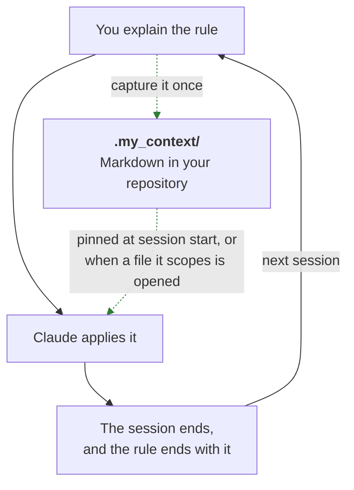
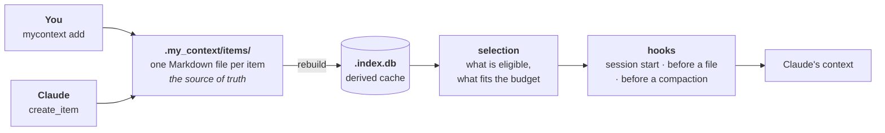
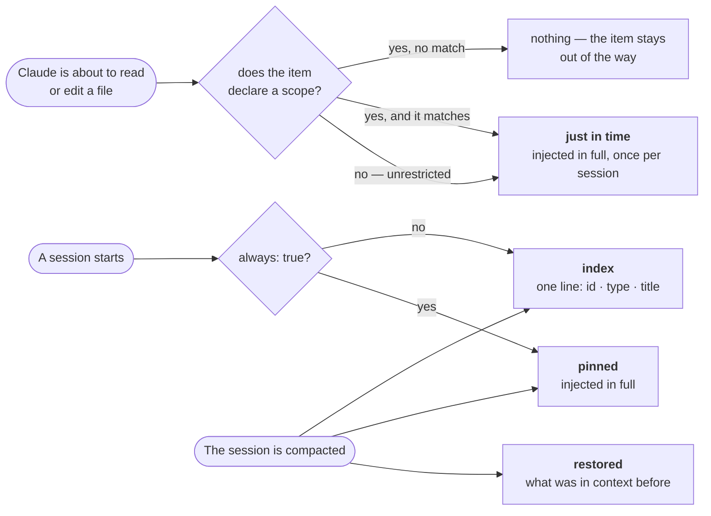
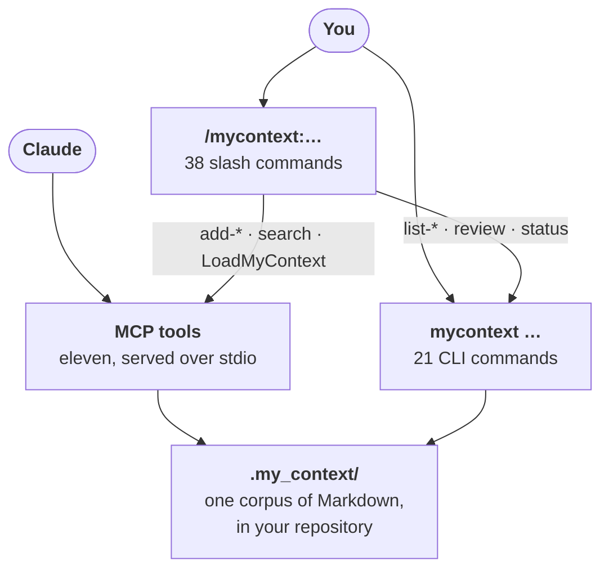
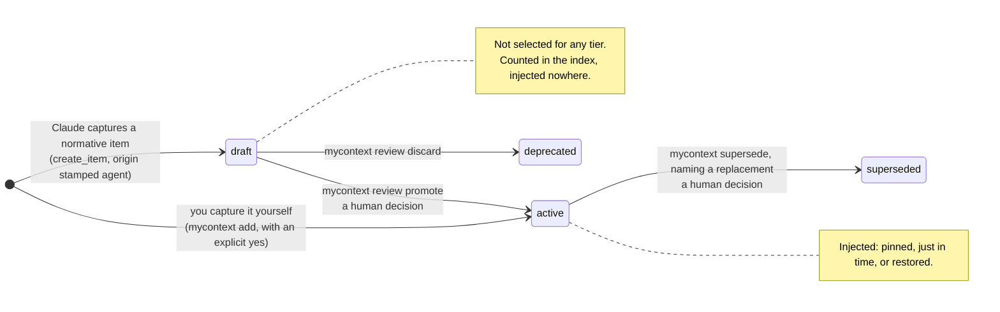

# my_context

**A Claude Code plugin that remembers your project's rules, so you stop repeating them.**

You tell Claude how this project works. The next session has never heard of it. my_context
captures those rules as Markdown files inside your repository, and puts the relevant ones
back in front of Claude on its own — pinned at the start of a session, or the moment a file
they apply to is about to be opened.


Node 24 or newer, no runtime dependencies and no build step — the TypeScript sources are
executed directly. Licensed under the [MIT licence](LICENSE). In a hurry:
[installing it](#installing-it).

**If a word or a `--flag` here is not obvious, it is explained somewhere you can jump
straight to.** Every term this document gives a particular meaning to is defined in the
[glossary](#9-glossary), and every command-line option is in one table:
[every flag, in one place](#every-flag-in-one-place). Terms are also defined in plain
language where they first appear, so reading front to back never requires either.

<div dir="rtl">

**בעברית:** my_context הוא תוסף ל-Claude Code שזוכר את הכללים של הפרויקט שלך. אתה מסביר
ל-Claude איך הפרויקט עובד, והסשן הבא מעולם לא שמע על זה; my_context לוכד את הכללים האלה
כקובצי Markdown במאגר שלך ומחזיר את הרלוונטיים שבהם מעצמו — נעוצים בתחילת הסשן, או ברגע
שנפתח קובץ שהם חלים עליו. **[התיעוד המלא בעברית](docs/README.he.md)** מקביל למסמך הזה
פרק-פרק.

</div>

## Contents

1. [The problem](#1-the-problem)
2. [The idea](#2-the-idea)
3. [How it works, in three steps](#3-how-it-works-in-three-steps)
4. [When it comes back, and what](#4-when-it-comes-back-and-what)
5. [Using it](#5-using-it) — [installing it](#installing-it), [slash commands](#what-you-type-the-slash-commands), [the CLI](#what-you-run-the-cli), [MCP tools](#what-the-model-calls-the-mcp-tools), [every flag](#every-flag-in-one-place)
6. [Configuration](#6-configuration)
7. [The trust boundary](#7-the-trust-boundary)
8. [Not yet available](#8-not-yet-available)
9. [Glossary](#9-glossary) — every term this document gives a particular meaning to

## 1. The problem

You are working on a checkout flow. You tell Claude: *prices are integer cents, never
floating-point dollars — the rounding error at each conversion is why the total did not
match the line items last quarter.* Claude agrees, fixes the code, and the session ends.

Two days later you open a new session and ask for a discount feature. Claude writes
`price * 0.9`, and the rounding error is back.

Nothing malfunctioned. A session's memory ends when the session does. Everything you
explained — the reasoning, the corrections, the "no, not like that" — went with it.

### Why re-pasting does not fix it

The obvious workaround is to paste your rules in again at the start of each session. It
fails in three ways at once.

- **You forget.** Not always — just on the session where it mattered.
- **It drifts.** Pasted from memory, the rule comes out slightly different each time.
  "Integer cents" becomes "avoid floats", which is advice rather than a rule, and the next
  session interprets it more loosely than the last one.
- **It costs on every session.** Your rules are re-read and re-charged each time, and by
  the time you have a dozen of them, most of what you paste has nothing to do with the file
  you are about to touch.

### Why `CLAUDE.md` alone is not enough

`CLAUDE.md` is a real improvement over pasting: Claude Code loads it automatically, so at
least the rules arrive without you doing anything. It has four limits that show up as soon
as a project is more than small.

- **It is static.** It says the same thing in every session, whatever you are doing.
- **It is unscoped.** There is no way to say "this one applies only to billing code". Every
  rule applies to every file equally, which in practice means every rule is background noise
  for most of the work.
- **It is undifferentiated.** "Use two-space indentation" sits next to "never write a
  customer's email address to a log", with nothing marking one as a preference and the other
  as a legal exposure.
- **It grows until it is skimmed.** Every rule you add makes the file longer, and a long
  file competes with itself for attention. Nothing in it is ever retired, because nothing in
  it records when it was last relevant.

### The cost you actually feel

It is not really about tokens. It is that you give the same correction over and over and it
never sticks — and that after the third time you stop trusting the work and start checking
it. The time goes into re-explaining decisions you already made instead of making new ones.

my_context closes that loop: you capture a rule once, and the relevant part of what you have
captured comes back on its own, when it applies.



The solid arrows are the loop you are in today. The dotted ones are what my_context adds:
one capture, and a return path that does not depend on you remembering.

## 2. The idea

my_context divides what a project knows into two kinds, and treats them differently.

**Normative knowledge** is what must hold. Constraints, invariants, rules, requirements,
standards, patterns, glossary terms, instructions, non-goals, open questions. *Prices are
integer cents.* *Never log a customer's email address.* *The connection pool is capped at
20.* These answer the question **"what am I not allowed to get wrong here?"**

**Rationale** is why the project is the way it is. Decisions, ADRs, lessons, tradeoffs,
assumptions, edge cases, risks. *We chose Stripe over Adyen because the settlement timing
matched our payout schedule.* *Retry storms need jitter — we learned that the hard way in
March.* These answer **"why is it like this?"**

Both are worth keeping. Only the first governs.

Three words in that last sentence are used precisely throughout this document, so they are
worth pinning down before anything is built on them.

- **Injection** is my_context putting text into a Claude Code session's context by itself,
  with nobody asking for it. That is the whole mechanism: not a search you run, but text
  that is already there when the model starts reading.
- An item **governs** when it is eligible to be injected and is phrased as an instruction —
  something the model is expected to comply with rather than merely know about.
- **Tier** is the word for the normative/rationale split. Every category — `constraint`,
  `decision`, `rule`, `lesson`, and the rest — carries one, and you can change which
  ([section 6](#6-configuration)). Watch out for a second, unrelated use of the same word:
  [section 4](#4-when-it-comes-back-and-what) calls its four delivery routes *injection
  tiers*. Where the difference matters below, the sentence says which is meant.

The set of items in your project — everything under `.my_context/items/`, whatever its tier
or status — is its **corpus**.

<!-- example: list --summary -->
```text
┌───────────────┬───────┐
│ type          │ items │
├───────────────┼───────┤
│ constraint    │ 1     │
│ decision      │ 2     │
│ invariant     │ 1     │
│ lesson        │ 1     │
│ open_question │ 1     │
│ requirement   │ 1     │
│ rule          │ 2     │
│ standard      │ 1     │
└───────────────┴───────┘

10 item(s)
```
<!-- /example -->

That is a small example project — a fictional Bookstore API — used throughout this document.
Seven of its ten items are normative and three are rationale. `mycontext help categories`
prints the full list of types with the tier each one belongs to.

### Why the split is load-bearing, not filing

It would be easy to read this as a taxonomy: a tidy way to sort notes. It is not. The split
decides **which text is allowed to silently change how an agent behaves.**

Normative text is injected into Claude's context in full, unprompted, and it is written in
the imperative. That is the point — a rule that has to be asked for is a rule that gets
forgotten. But text with that reach is text that steers, so it has to be text somebody
approved.

Rationale never enters a session that way. At the start of a session it contributes a count
— "2 decision · 1 lesson" — and nothing more. It is indexed and searchable and retrieved on
request, but it does not arrive uninvited and it does not phrase itself as an order.

That difference in reach is why the two tiers have different rules about who may add them.
When Claude captures a normative item, it lands as a **draft** and governs nothing until a
human promotes it. When Claude captures a rationale item, it is simply recorded. Being wrong
about *why* costs you a misleading explanation; being wrong about *what must hold* costs you
wrong code, written confidently, by something you were trusting to know the rule. The
approval boundary, and its limits, are described in full in
[section 7](#7-the-trust-boundary).

## 3. How it works, in three steps



### Step 1 — you capture it

You state the rule once, on the command line or by asking Claude to record it.

<!-- example: add constraint "Uploads capped at 10 MB" --body "The API gateway rejects a larger body before it reaches us, so accepting one only produces a timeout the customer cannot explain." --scope "src/api/**" --tags uploads --yes -->
```text
about to create constraint "Uploads capped at 10 MB" — active, and governing this project at once.
my_context: created CONST-uploads-capped-at-10-mb (active) at items/constraint/CONST-uploads-capped-at-10-mb.md.
```
<!-- /example -->

Everything after the title is an **option** — a `--name value` pair that sets one field on
the item. Four things in that command matter.

- `--body "…"` is the item's text: the paragraph Claude will actually be given. The title
  says what the rule is; the body says why, and why is what stops a rule being applied
  mechanically in a case it was never about.
- `--scope "src/api/**"` is what makes the rule targeted rather than ambient. It is a
  **scope glob** — a file-path pattern, where `*` matches within one directory level and
  `**` matches across as many as it needs. This constraint concerns the API layer, so it
  will come back when API code is being touched and stay out of the way otherwise. Scope
  *restricts*, so a rule with no scope is not restricted to anything and applies to every
  file — see [section 4](#4-when-it-comes-back-and-what).
- `--tags uploads` attaches free-form labels. They change nothing about when an item is
  injected; they are there so you can find it later.
- `--yes` is required because this is a normative category. The item governs the project the
  moment it exists, and the flag is the explicit acknowledgement of that. Rationale
  categories need no confirmation.

The id, `CONST-uploads-capped-at-10-mb`, is derived from the title. You will see it in
Claude's context, in `mycontext list`, and in the filename.

Those four are a fraction of what the commands accept. All twenty-two options the CLI takes
are listed together in [every flag, in one place](#every-flag-in-one-place).

Claude can capture items too, using the `create_item` tool. A normative item captured that
way lands as a draft and waits for you.

### Step 2 — it is stored as Markdown you can read, diff and review

Every item is one file under `.my_context/items/<type>/<id>.md`, in your repository, in
plain Markdown.

<!-- example: show CONST-postgres-pool-capped-at-20 -->
```text
---
id: CONST-postgres-pool-capped-at-20
type: constraint
title: Postgres pool capped at 20
status: active
severity: hard
always: true
scope: []
tags:
  - database
  - capacity
origin: agent
source_file: null
source_anchor: null
source_checksum: null
valid_from: 2026-08-14
valid_until: null
checksum: a81dff73a154242e
---

# Postgres pool capped at 20

The managed Postgres plan allows 120 connections. Five API instances at 20 each
leaves 20 for migrations, backups and the admin console. Raising the pool past 20
does not buy throughput; it buys `remaining connection slots are reserved` during
the next deploy.
```
<!-- /example -->

The block between the `---` lines is the **frontmatter**: the fields my_context uses to
decide when this item comes back and how much to trust it. Everything below it is the body,
and the body is what Claude actually reads. Field by field:

| Field | What it means |
|---|---|
| `id` | the item's name, derived from the title. Ids are how everything else refers to it |
| `type` | its category — `constraint`, `decision`, `rule` and so on. The category decides the tier |
| `status` | `draft`, `active`, `superseded`, `deprecated` or `validated`. **Only `active` is ever injected**; see the [glossary](#9-glossary) for what each of the other four means |
| `severity` | `hard` or `soft`. It does not change whether an item is injected, only the order: hard items are admitted to a budget first |
| `always` | `true` pins the item — injected in full at every session start, whatever files you touch |
| `scope` | the file globs this item is restricted to. Empty means unrestricted: it applies to every file |
| `tags` | free-form labels for finding it later. They affect nothing about injection |
| `origin` | who wrote it: `human`, `agent` (Claude, through an MCP tool) or `ingest` (extracted from a document). This is what the [trust boundary](#7-the-trust-boundary) is built on, and no tool lets a caller set it |
| `source_file`, `source_anchor`, `source_checksum` | where the item came from, when it was extracted from a document: the path, the heading within it, and a hash of that text so drift is detectable |
| `valid_from`, `valid_until` | the day it started applying, and the day it stopped. `valid_until` is filled in when an item is retired |
| `checksum` | a hash of the item's own content, re-stamped on every write. It is how `mycontext doctor` notices a file that was edited by hand |

Some categories add one more field of their own — a `rule` carries `directive: do` or
`directive: dont`, for instance. `mycontext examples <category>` prints a correct specimen
of any type, extra fields included.

This shape is deliberate. Your project's rules live in git, so they show up in a pull
request diff, they get reviewed like code, they branch and merge with the code they describe,
and you can read them without running anything. There is no database you have to query to
find out what your own project believes.

There *is* a database — `.my_context/.index.db`, SQLite — but it is derived, never authored.
It exists so that a lookup during a session is fast. Delete it and `mycontext rebuild`
recreates it from the Markdown. The Markdown is the source of truth; the index is a cache.

One consequence worth knowing early: do not hand-edit an item file. Every write path
recomputes the item's `checksum` field, and a hand edit does not, so the recorded checksum
stops matching the content. `mycontext doctor` reports that mismatch from then on.

### Step 3 — it comes back on its own

When a session starts, Claude Code runs my_context's *hooks* — small programs Claude Code
runs at fixed moments, before anything else happens. The session-start hook selects the items
that apply and hands them to Claude as context. This is what the model receives, verbatim:

```text
## my_context — these govern this project

### CONST-postgres-pool-capped-at-20 · constraint · Postgres pool capped at 20

The managed Postgres plan allows 120 connections. Five API instances at 20 each
leaves 20 for migrations, backups and the admin console. Raising the pool past 20
does not buy throughput; it buys `remaining connection slots are reserved` during
the next deploy.

## my_context index
- INV-prices-are-integer-cents · invariant · Prices are integer cents
- REQ-checkout-completes-in-two-steps · requirement · Checkout completes in two steps
- RULE-never-log-customer-email · rule · Never log customer email
- STD-api-errors-use-problem-json · standard · API errors use Problem JSON

2 decision · 1 lesson · 1 drafts pending review · 1 retired
→ use mycontext list or mycontext show <id> to browse these
```

One item arrived in full, because it is pinned. Four arrived as a single line each, so Claude
knows they exist and can fetch any of them by id. The rationale items arrived as a count.
Nothing was left out without being mentioned.

A second hook runs before Claude reads or edits a file, and that one is where scope pays off.
The next section is about which of these fires when.

## 4. When it comes back, and what

There are four **injection tiers** — four routes by which an item's text can reach a
session. (This is the second sense of "tier"; the first, from
[section 2](#2-the-idea), is the normative/rationale split a category carries.) Each route
has a condition that fires it and a rule about what it contains. "Just in time" is often
abbreviated **JIT**, including in the configuration file, where the budget for that tier is
spelled `jit`.

| Tier | Fires | Contains |
|---|---|---|
| **pinned** | every session start, and again after a compaction | every active normative item marked `always: true`, in full |
| **just in time** | Claude is about to read or edit a file the item applies to — one matching its `scope`, or any file at all if it declares no scope | that item, in full |
| **restored** | after a compaction | the items that were in context before it |
| **index** | every session start, and after a compaction | one line per remaining normative item, plus counts for the rest |



### Pinned — the handful that always apply

An item with `always: true` in its frontmatter is injected in full at every session start,
whatever you are working on, whatever files you touch. In the example above, that is
`CONST-postgres-pool-capped-at-20`: a limit that constrains any code that opens a database
connection, so waiting for a matching file would be waiting too long.

Pinning is for the small set of rules that are genuinely unconditional. The pinned tier has
its own budget, and everything you pin competes for it against everything else you pinned.

An item is set to `always: true` by promoting it with
`mycontext review promote <id> --always` while it is still a draft. That is currently the
only route, and the gap is stated in [section 6](#6-configuration) rather than papered over.

### Just in time — the ones that apply to what you are touching

`scope` is a list of file patterns, and it is a **restriction**: it narrows the files an item
applies to. When Claude is about to read or edit a file, my_context looks for active normative
items that apply to that path and injects them, in full, before the tool runs. An item that
declares a scope applies to the files it matches. An item that declares none is not restricted
at all, so it applies everywhere — you only write a scope when you want to limit where the
item shows up.

`INV-prices-are-integer-cents` carries `scope: src/billing/**`:

<!-- example: show INV-prices-are-integer-cents -->
```text
---
id: INV-prices-are-integer-cents
type: invariant
title: Prices are integer cents
status: active
severity: soft
always: false
scope:
  - src/billing/**
tags:
  - billing
  - money
origin: human
source_file: null
source_anchor: null
source_checksum: null
valid_from: 2026-08-14
valid_until: null
checksum: b9c3d588c634c8cc
---

# Prices are integer cents

Every price crossing a module boundary is an integer number of cents.
Floating-point dollars re-introduce a rounding error at each conversion, and the
total a customer approves at checkout must equal the sum of its line items exactly.
```
<!-- /example -->

So the moment Claude opens `src/billing/prices.js`, this is what it receives first:

```text
## my_context — these govern this project

### CONST-postgres-pool-capped-at-20 · constraint · Postgres pool capped at 20

The managed Postgres plan allows 120 connections. Five API instances at 20 each
leaves 20 for migrations, backups and the admin console. Raising the pool past 20
does not buy throughput; it buys `remaining connection slots are reserved` during
the next deploy.

### INV-prices-are-integer-cents · invariant · Prices are integer cents

Every price crossing a module boundary is an integer number of cents.
Floating-point dollars re-introduce a rounding error at each conversion, and the
total a customer approves at checkout must equal the sum of its line items exactly.

_scope: src/billing/**_

### REQ-checkout-completes-in-two-steps · requirement · Checkout completes in two steps

Cart to payment, payment to confirmation. A third step was measured against the
two-step flow in April and abandonment rose by four points, so a new field belongs
in one of the two existing steps or nowhere.

### RULE-never-log-customer-email · rule · Never log customer email

Log the customer id instead. Access logs are shipped to a third-party aggregator
that our data-processing agreement does not cover, so an email address in a log
line leaves the boundary the checkout flow promises the customer.

_scope: src/**_
```

Four items applied. Two of them named this file: the billing invariant scoped to
`src/billing/**`, and a rule scoped to `src/**`. The other two declare no scope at all — the
pool constraint and the checkout requirement — so nothing restricts them and they apply here
like they apply anywhere. Notice that the pool constraint arrives even though it is also
pinned: it is delivered by whichever tier reaches it first in a session, and only once.

Open `src/catalogue/search.js` instead and the billing invariant drops out, because its scope
excludes that file. The other three still arrive.

Three details a developer will want:

- **No scope means no restriction.** An item with no scope patterns applies to every file, so
  this tier delivers it on the first file Claude touches. Writing a scope is how you *narrow*
  an item to the directories it is really about; leaving it off is the honest default for a
  rule that is not about particular files, and it is the shorter thing to type. The cost is
  real and worth knowing: an unscoped item competes for the `jit` budget on every file
  operation, so a corpus with many large unscoped items will spill — visibly, see
  [the budget](#the-budget-and-what-happens-when-it-does-not-fit) — rather than silently
  crowding out the item that actually named the file.
- **Each item arrives once per session.** my_context records what it has already injected, so
  editing ten billing files does not deliver the same invariant ten times.
- **This tier carries no index.** A file-triggered injection contains the items that applied
  and nothing else. The index is a per-session cost, not a per-file one.

### Restored — after the context window is compacted

A long session eventually runs out of context window, and Claude Code *compacts* it:
summarises the conversation so far and continues from the summary. The summary is much
shorter than what it replaces, and the rules that were injected earlier are usually among
what it drops.

my_context takes a snapshot immediately before that happens, recording which items were in
play — both the ones it injected and any that were referenced by id in the transcript. When
the session resumes after compaction, those items are re-injected, alongside the pinned tier
and the index.

Two honest limits. The snapshot is keyed on the session id that the hooks receive, so items
you loaded manually with `/mycontext:LoadMyContext` are not recorded and are not restored —
that surface has no trustworthy session id to record against. And restoration is bounded by
its own budget, like every other tier.

### The index — so nothing is invisible

Whatever the tiers above did not deliver in full, the index lists. One line per remaining
active normative item: id, type, title. Enough for Claude to know the rule exists and to
fetch it by id when it turns out to matter, and cheap enough to include every time.

Rationale items are not listed individually. They are counted by type — `2 decision`,
`1 lesson` — along with the number of drafts waiting for review and the number of retired
items. An item whose category has been disabled in configuration is counted too, labelled as
such, so turning a category off never makes its items disappear without a trace.

An item that was already delivered in full gets no index line. Claude has the whole rule
already, and spending index space on a repetition would push something genuinely unseen out
of the list.

### The budget, and what happens when it does not fit

Each tier has a **budget** — a size limit, so that a growing corpus cannot quietly take over
the context window. The defaults:

| Budget | Default | Governs |
|---|---|---|
| `pinned` | 1500 | the pinned tier at session start |
| `jit` | 500 | one file-triggered injection |
| `restored` | 2000 | the re-injection after a compaction |
| `index` | 150 | the index list |

The unit is estimated tokens, and "estimated" is meant literally: it is the character count
divided by four. my_context ships with no runtime dependencies and therefore no tokenizer, so
this is an approximation that can err in either direction, not a guaranteed ceiling.

Items are admitted hardest-first — `severity: hard` before `severity: soft`, project layer
before global, then by id so the result is deterministic. **Layer** is where an item's file
lives. `.my_context/` in the project you are working in is the *project* layer; a
`.my-context` directory in your home folder, if one exists, is read as a *global* layer
alongside it. Project wins ties, so a project item is admitted before a global one competing
for the same space, and a project item with the same id shadows the global one entirely.
An item too large for the remaining space is skipped rather than ending the pass, so a
smaller item behind it can still be admitted. An item skipped this way is said to have
**spilled** — that is the word the code uses, and the paragraph below is what a spill looks
like from the outside.

**What does not fit is listed, never dropped in silence** — the project's own
`INV-nothing-is-dropped-silently`. Concretely, an item that a full-text tier could not fit
appears twice: named in a one-line note under the injection,

```text
_1 item(s) omitted from full text for budget: CONST-postgres-pool-capped-at-20. Fetch with mycontext show <id>._
```

and again as an ordinary line in the index, because it was not delivered in full and so is
still worth listing.

There is one place where a specific id is not named, and it is worth stating plainly: when
the *index itself* runs out of budget, the lines that do not fit are replaced by a count.

```text
- … +2 more (fetch with mycontext show <id>)
```

The count is never wrong, and `mycontext list` shows the whole corpus from the terminal — but
inside that session Claude sees the number rather than the names. Everywhere else, what was
excluded is named where it was excluded.

## 5. Using it

my_context has two surfaces over one corpus. One is for you, one is for the model, and the
split is deliberate rather than historical.

**You** type slash commands inside a Claude Code session, or run the `mycontext` command in
a terminal. **The model** calls the eleven MCP tools. Both surfaces read and write the same
Markdown files under `.my_context/`, so an item you capture in the terminal is in the
model's index the next time it looks, and an item the model captures shows up in
`mycontext list` at once.

Both exist because each is unusable in the other's situation. The model cannot stop
mid-sentence to open a terminal, so it needs tools it can call directly. You need a surface
that works when no model is in the room — in a script, in CI, or when you simply want to
read what the project believes. And a few acts are meant to be yours alone: promoting a
draft, retiring a governing item. How far that separation actually holds is
[section 7](#7-the-trust-boundary), and it is worth reading before you rely on it.



### Installing it

There are two halves, and they install differently. The `mycontext` command is an npm
package in this repository. The slash commands, the hooks and the MCP server are a Claude
Code **plugin** — declared by `.claude-plugin/plugin.json` and discovered from `commands/`,
`hooks/hooks.json` and `.mcp.json` at the repository root.

**The command.** From a clone of this repository:

```bash
npm install
npm link          # provides the `mycontext` command

cd /path/to/your/project
mycontext init
```

`mycontext init` creates `.my_context/` in the current directory with an `items/`
directory, a `config.json` and a `.gitignore`. Commit it: the corpus is meant to travel
with the code it describes. Without `npm link`, every command also works as
`node /path/to/my-context/src/cli/index.ts <args>`.

**The plugin.** Install it once, from your clone of this repository:

```bash
cd /path/to/my-context
claude plugin marketplace add ./
claude plugin install mycontext@mycontext
```

This repository is its own single-plugin marketplace
(`.claude-plugin/marketplace.json`), which is why the marketplace and the plugin are both
called `mycontext`. The install survives a restart. `claude plugin list` shows it, and
`claude plugin uninstall mycontext@mycontext` plus
`claude plugin marketplace remove mycontext` undo it.

To try it for one session without installing anything:

```bash
claude --plugin-dir /path/to/my-context
```

Either way, to check what actually loaded, ask Claude Code itself:

```bash
claude plugin details mycontext@mycontext
```

It prints the component inventory — the 38 commands and the `mycontext` skill, the four
hooks (`SessionStart`, `PreToolUse`, `PreCompact`, `PostToolUse`) and the one MCP server —
which is how you confirm the plugin is loaded rather than assuming it. Every command in
this section was established by running it, not by reading the documentation.

### What you type: the slash commands

Slash commands are namespaced by the plugin's name, so every one of them begins
`/mycontext:`. Grouped by what you are trying to do:

**Capture.** One `add-<type>` per enabled category. The normative ones —
`/mycontext:add-constraint`, `/mycontext:add-invariant`, `/mycontext:add-rule`,
`/mycontext:add-requirement`, `/mycontext:add-standard`, `/mycontext:add-pattern`,
`/mycontext:add-glossary`, `/mycontext:add-instruction`, `/mycontext:add-non-goal`,
`/mycontext:add-open-question` — capture through the `create_item` tool and land as
**drafts**. The rationale ones — `/mycontext:add-adr`, `/mycontext:add-decision`,
`/mycontext:add-lesson`, `/mycontext:add-tradeoff`, `/mycontext:add-assumption`,
`/mycontext:add-edge-case`, `/mycontext:add-risk` — land active, because rationale is never
injected and so cannot silently steer anything.

```
/mycontext:add-constraint  The connection pool is capped at 20
/mycontext:add-decision    We chose Stripe because settlement timing matched payouts
```

**Find.** `/mycontext:search` takes words and calls the `query_items` tool; it is the one
place to start when you do not know an id. One `list-<type>` per enabled category prints
that category's table: `/mycontext:list-constraint`, `/mycontext:list-invariant`,
`/mycontext:list-rule`, `/mycontext:list-requirement`, `/mycontext:list-standard`,
`/mycontext:list-pattern`, `/mycontext:list-glossary`, `/mycontext:list-instruction`,
`/mycontext:list-non-goal`, `/mycontext:list-open-question`, `/mycontext:list-adr`,
`/mycontext:list-decision`, `/mycontext:list-lesson`, `/mycontext:list-tradeoff`,
`/mycontext:list-assumption`, `/mycontext:list-edge-case`, `/mycontext:list-risk`. Each
takes the same detail flags as the CLI.

`/mycontext:LoadMyContext` is the odd one out: it injects the pinned items and the index
into the session right now, without waiting for a session start. Use it when you cleared
the context, or after a compaction — items loaded this way are not snapshotted and are not
restored automatically.

**Review.** `/mycontext:review` walks the queue of drafts and prints, for each, what it
would govern. It deliberately stops there: it tells you the exact
`mycontext review promote <id>` or `mycontext review discard <id>` to run and does not run
it for you.

**Diagnose.** `/mycontext:status` prints the same report as the CLI's `status`, plus at
most two lines saying what needs your attention.

```
/mycontext:search           connection pool
/mycontext:list-decision    --full
/mycontext:review
/mycontext:status
/mycontext:LoadMyContext
```

There is one `add-<type>` and one `list-<type>` per **enabled** category — 34 today, plus
`search`, `review` and `status`. They are generated from the same resolved config
`mycontext help categories` prints, by `npm run gen:commands`, and a test fails if the
committed files and the generator disagree: a disabled category cannot keep a command that
would then be refused.

All 37 of those carry `disable-model-invocation: true`, and it is in effect — they are your
surface, not the model's. `/mycontext:LoadMyContext` is the single exception, and it is the
one command that only reads.

**"In effect" is doing work in that sentence, and here is why.** Until recently it was not.
Nineteen of the 38 files — the 17 `list-<type>` commands plus `review` and `status` — carried
`argument-hint: [--full|--short|--summary] [--json]`, which opens a YAML flow sequence and
then trails a second one: not valid YAML. Claude Code's message for that case is explicit —
*at runtime this command loads with empty metadata (all frontmatter fields silently
dropped)* — so on those 19, `disable-model-invocation` was written down and not in effect,
and the model could invoke commands that said it could not. Every hint is now quoted, all 37
files were regenerated, and `claude plugin validate .` passes with zero errors
against this repository. The test in `test/plugin/commands.test.ts` used to check those lines
with a regex, which is why it passed throughout; it now parses the frontmatter and asserts
`disable-model-invocation` comes back as the boolean `true`.

**One asymmetry, stated rather than smoothed over: `/mycontext:search` has no CLI
counterpart.** There is no `search` command in the CLI. The slash command calls the
`query_items` MCP tool directly, and the nearest terminal equivalents are `mycontext list`
for a category and `mycontext query` for SQL over the index. The two surfaces do not cover
the same ground yet.

### What you run: the CLI

Twenty-one commands. `mycontext help` prints the same list from the program itself, and
`mycontext help <topic>` explains one of `categories`, `scope`, `capture`, `workflow`.

**Capture and change.**

| Command | What it does |
|---|---|
| `mycontext init` | create `.my_context/` in the current directory |
| `mycontext add <category> <title>` | create an item — `--body`, `--scope`, `--tags`, `--severity`, `--yes` |
| `mycontext review promote <id>` | turn a draft into an active governing item |
| `mycontext review discard <id>` | retire a draft |
| `mycontext supersede <id> --by <id>` | retire a governing item in favour of a replacement |
| `mycontext repair` | re-stamp the checksum of an item whose file no longer matches it |
| `mycontext rebuild` | rebuild `.index.db` from the Markdown |

`add` takes `--body`, `--scope`, `--tags` and `--severity hard|soft`, and refuses any
option it does not recognise rather than folding it into the title. `--scope` and `--tags`
are lists: comma-separated, repeatable, and the two forms compose, so
`--scope "src/api/**,src/db/**"` and `--scope src/api/** --scope src/db/**` mean the same
thing. A single-valued flag given twice (`--body x --body y`) is refused rather than
resolved to one of them, on every command that takes one. Observations and relations are
not expressible as flags — use the `create_item` and `link_items` tools for those. `--yes` is required for a **normative** category, because
that item governs the project the moment it exists; rationale categories need no
confirmation.

**Find and read.**

| Command | What it does |
|---|---|
| `mycontext list [category]` | the corpus as a table |
| `mycontext show <id>` | one item in full, exactly as it is on disk |
| `mycontext query "SELECT …"` | read-only SQL over the index |
| `mycontext examples <category>` | a complete, correct example item of that type |
| `mycontext help [topic]` | guidance: categories, scope, capture, workflow |

<!-- example: list -->
```text
┌─────────────────────────────────────┬───────────────┬────────────┐
│ id                                  │ type          │ status     │
├─────────────────────────────────────┼───────────────┼────────────┤
│ CONST-postgres-pool-capped-at-20    │ constraint    │ active     │
│ DEC-search-with-postgres-full-text  │ decision      │ active     │
│ DEC-use-stripe-for-payments         │ decision      │ active     │
│ INV-prices-are-integer-cents        │ invariant     │ active     │
│ LESSON-retry-storms-need-jitter     │ lesson        │ active     │
│ OPENQ-which-search-engine           │ open_question │ superseded │
│ REQ-checkout-completes-in-two-steps │ requirement   │ active     │
│ RULE-cache-keys-include-tenant-id   │ rule          │ draft      │
│ RULE-never-log-customer-email       │ rule          │ active     │
│ STD-api-errors-use-problem-json     │ standard      │ active     │
└─────────────────────────────────────┴───────────────┴────────────┘
```
<!-- /example -->

There is no `title` column, on purpose. An id is a slug of the title —
`CONST-postgres-pool-capped-at-20` for "Postgres pool capped at 20" — so the two widest
columns of this table said one thing twice, and between them made the default report 192
columns on this repository's own corpus against a 100-column layout. Without the title it
is 97. The title is still there in full in `mycontext show`, in `list --full` and in `list
--json`; the same removal was made to `mycontext decay` (170 columns to 97) and to the cold
table inside `status --full`, both for the same width. `mycontext review list` keeps the
column: its other columns are narrow enums, so on the ids a real queue holds it fits the
layout with the title in place. Its `--full` is not a table at all — like `list --full` it
is a stanza per draft, which is what keeps it inside the layout even at the longest id this
project can mint.

`mycontext show <id>` prints the file itself, frontmatter included — the same output
[section 3](#3-how-it-works-in-three-steps) uses. `mycontext examples <category>` prints a
worked specimen of a type you have not used before, so you can see the shape before writing
one:

<!-- example: examples rule -->
```text
---
id: RULE-never-log-request-bodies-on-auth-endpoints
type: rule
title: Never log request bodies on auth endpoints
status: active
severity: soft
always: false
scope:
  - src/api/auth/**
tags: []
origin: human
source_file: null
source_anchor: null
source_checksum: null
valid_from: <today>
valid_until: null
checksum: 0040bc230528c1af
directive: dont
---

# Never log request bodies on auth endpoints

Bodies carry passwords and reset tokens; logs are retained for 90 days.
```
<!-- /example -->

`valid_from` reads `<today>` because that field is stamped with the day the command is run.
Every block in this document is produced by actually running the command it sits under and
re-checked by the test suite, so a real date printed there would be a date that is wrong for
everyone who did not run it on the day it was generated.

**Review the queue.**

<!-- example: review list -->
```text
┌───────────────────────────────────┬──────┬────────┬────────┬────────┬────────────────────────────┐
│ id                                │ type │ origin │ always │ source │ title                      │
├───────────────────────────────────┼──────┼────────┼────────┼────────┼────────────────────────────┤
│ RULE-cache-keys-include-tenant-id │ rule │ agent  │ no     │ -      │ Cache keys include tenant  │
│                                   │      │        │        │        │ ID                         │
└───────────────────────────────────┴──────┴────────┴────────┴────────┴────────────────────────────┘

1 draft(s) pending. Promote with `mycontext review promote <id>`.
```
<!-- /example -->

`mycontext review show <id>` prints one draft in full. `mycontext review promote <id>`
makes it govern; `--always` pins it at the same time, and that is the only route to
`always: true` (see [section 6](#6-configuration)). `mycontext review discard <id>` retires
it instead.

**Diagnose.**

| Command | What it does |
|---|---|
| `mycontext status` | counts, review queue, ingest progress, decay and health |
| `mycontext doctor` | index freshness, orphans, drift, dead globs, permissions, session ids |
| `mycontext decay` | items that have not been injected lately |

<!-- example: status -->
```text
my_context 0.1.0: 10 item(s), profile "standard"

by category
  ┌───────────────┬───────┐
  │ category      │ items │
  ├───────────────┼───────┤
  │ constraint    │ 1     │
  │ decision      │ 2     │
  │ invariant     │ 1     │
  │ lesson        │ 1     │
  │ open_question │ 1     │
  │ requirement   │ 1     │
  │ rule          │ 2     │
  │ standard      │ 1     │
  └───────────────┴───────┘

by status
  ┌────────────┬───────┐
  │ status     │ items │
  ├────────────┼───────┤
  │ active     │ 8     │
  │ draft      │ 1     │
  │ superseded │ 1     │
  └────────────┴───────┘

by origin
  ┌────────┬───────┐
  │ origin │ items │
  ├────────┼───────┤
  │ agent  │ 2     │
  │ human  │ 8     │
  └────────┴───────┘

review queue: 1 draft(s) pending review — walk it with `mycontext review`.

usage: no sessions recorded yet — decay reporting starts once items begin to be injected.
  2 active normative item(s) carry no scope, so they apply to every file and compete for the jit
  budget on every file operation.

health: 0 error(s), 0 warning(s), 0 note(s) — details from `mycontext doctor`.
```
<!-- /example -->

`mycontext doctor` is the one to run when something looks wrong. On a healthy corpus it is
one line:

<!-- example: doctor -->
```text
my_context doctor: 0 error(s), 0 warning(s), 0 note(s) across 0 finding(s).
```
<!-- /example -->

`mycontext decay` answers "what have I captured and never used". Its report leads with a
caveat, because the answer is easy to misread — the ledger records *injection*, not reading
or reliance, so a brand-new item and an abandoned one look identical here.

<!-- example: decay --summary -->
```text
my_context decay — items not injected in the last 20 session(s). The ledger holds 0 session(s).
  "cold" means: not auto-injected in the last window of sessions. It does NOT mean unused — the
  ledger records injection, not reading or reliance, so a new item, and any item consulted via
  `show`, MCP `get_item`, or the Markdown file directly, look exactly like an abandoned one here.
  Do not supersede or deprecate anything on this report alone — verify real usage first.
  (no sessions recorded yet — nothing here has been measured; "cold" currently means only "never
  injected")

cold 5, warm 0, of which 2 unrestricted. Rows with `mycontext decay` (default) or `--full`.
```
<!-- /example -->

That caveat is printed at every detail level, `--summary` included: a shorter report may
drop rows, never the reason its own headline number might mislead. It is wrapped to the
layout budget, so it reads as a paragraph rather than as one 284-character line.

**Ingest a document.** Turning an existing spec or PRD into items is a two-step
conversation, because my_context has no model of its own: it hands you the text and
validates what comes back.

| Command | What it does |
|---|---|
| `mycontext ingest <path>` | emit an extraction request for one chunk of a document |
| `mycontext ingest-apply <id> --anchor <a>` | apply the extracted candidates as drafts |
| `mycontext ingest-status` | list ingest sessions and their progress |

`mycontext ingest docs/prd.md` prints a chunk of the document plus instructions and a JSON
schema; you (or the model) return a JSON array of candidates to
`mycontext ingest-apply <session-id> --anchor <anchor> --stdin`, and the next chunk's
request comes back automatically.

Two words in that sentence are specific to this command. An **anchor** is the heading a
chunk of the document sits under, lower-cased and hyphenated — `## Rate limits` becomes
`rate-limits` — and it is how both halves of the conversation agree on which part of the
document is being talked about. A **candidate** is a proposed item that does not exist yet:
extracted, described in JSON, and nothing on disk until it is applied. Every candidate must
quote its source span verbatim —
a paraphrase is rejected — and everything applied lands as a **draft**. The model's
equivalent is the `ingest_document` tool, which does both legs in one place.

**Turn a lesson into rules.** The same shape, for incidents rather than documents.

| Command | What it does |
|---|---|
| `mycontext lesson "<text>"` | record a lesson and request candidate rules |
| `mycontext lesson-stage <id>` | stage the returned candidates for approval |
| `mycontext lesson-accept <id> <key>` | approve one candidate and create the rule |
| `mycontext lesson-discard <id> <key>` | permanently reject one candidate |

`mycontext lesson` records the lesson (rationale tier — indexed, never injected) and prints
a rule-derivation request: convert this description of what happened into directives about
what must happen. The candidates come back through
`mycontext lesson-stage <LESSON-id> --stdin`, where they wait. Nothing is applied until
`mycontext lesson-accept` names one, and `mycontext lesson-discard` rejects one for good.
Note that `lesson-accept` creates an **active** rule directly — it is on the list in
[section 7](#7-the-trust-boundary) for that reason.

### Detail levels, and `--json`

Every reporting command — `status`, `list`, `decay`, `review list`, `doctor`,
`ingest-status` — takes `--full`, `--short` (the default) and `--summary`, and `--json`.
`--short` and the default are column-aligned tables with headers. `--full` is **not** a
wider table: it prints one stanza per item, every field on its own labelled line. Seven
columns including a 63-character id and a 92-character title made a 280-column table on
this repository's own corpus, so the level that shows the most about an item was the one
level no terminal could display — and a table that truncated the id instead would hand you
half an id that still looks like a whole one. Nothing is dropped or elided at any level;
what does not fit on a line is wrapped onto the next.

Everything is laid out to 100 columns. That is a constant, not your terminal's width — a
width-adaptive table would make the example blocks in this document a fact about whichever
window regenerated them. Set `MYCONTEXT_WIDTH` to lay out to a different one. One rule
survives the budget: no column is ever narrowed below its longest single token, so an id, a
glob or a path is never broken across lines and stays copy-pasteable. A table whose own
tokens are wider than the budget — a corpus whose ids alone exceed it — is therefore left
at its natural width rather than squeezed toward a number it cannot reach, since squeezing
costs whole rows and still overflows. Every report in this repository's own corpus now fits:
the widest, `list`, is 97 columns.

`--json` is the only faithful rendering of the
hierarchical reports (an ingest session's per-anchor progress, a draft's body), and it
carries any corpus load errors inside the document so it stays parseable. An option none of
them recognises is refused, not silently ignored — all six, checked against the command
registry by `test/cli/unknown-flag-refusal.test.ts` rather than command by command.
`review promote` and `review discard` are checked against their own flag sets, so a
`--json` meant for the queue does not pass silently on a subcommand that writes.

`--summary` is the one to reach for when you want the shape rather than the rows. The same
report as above, at one level down:

<!-- example: status --summary -->
```text
my_context 0.1.0: 10 item(s), profile "standard"

review queue: 1 draft(s) pending review — walk it with `mycontext review`.

usage: no sessions recorded yet — decay reporting starts once items begin to be injected.
  2 active normative item(s) carry no scope, so they apply to every file and compete for the jit
  budget on every file operation.

health: 0 error(s), 0 warning(s), 0 note(s) — details from `mycontext doctor`.
```
<!-- /example -->

Tables are drawn with box characters where the terminal supports them and plain ASCII where
it does not; detection fails toward ASCII, so an unrecognised Windows terminal gets the safe
rendering. Set `MYCONTEXT_ASCII=1` to force it, or `MYCONTEXT_UNICODE=1` to force the other
way.

`mycontext query` is **not** one of them. It takes `--json` and `--limit <n>` only, and
refuses anything else: a SQL result set has no detail levels, because its columns are the
ones your own `SELECT` names. Its `--json` is a document — `{ rows, rowCount, truncated,
limit, loadErrors }` — not a bare array: results are capped at 1000 rows by default, and
`truncated` is how a machine learns the answer was cut. Put a `--` before SQL that begins
with a `--` comment.

### What the model calls: the MCP tools

Eleven tools, served over stdio by `src/mcp/server.ts`. The model reaches them without a
shell, and every item write it makes through them is stamped as an agent write — which is
what makes the draft rule in [section 7](#7-the-trust-boundary) enforceable at all on this
surface.

| Tool | What the model uses it for |
|---|---|
| `create_item` | capture a new typed item. Idempotent: calling it twice reports the existing item rather than duplicating it |
| `update_item` | revise an existing item's title, body, scope, tags, severity, `always`, extra fields or status, by id |
| `supersede_item` | retire an item in favour of a replacement, recording both relation directions. It **refuses** to retire a governing normative item — that decision is a human's |
| `link_items` | record a typed relation between two items, such as `derived_from` or `constrains` |
| `get_item` | fetch one item in full, as Markdown, when the id is already known |
| `query_items` | search and filter by type, status, tag, relation, text or file path. This is what `/mycontext:search` calls |
| `list_drafts` | list what is waiting for human review, newest first — not to promote it, which it cannot do |
| `load_context` | inject the pinned items and index now, exactly as a session start does. This is what `/mycontext:LoadMyContext` calls |
| `mycontext_help` | read guidance on one topic: categories, scope, capture, workflow |
| `mycontext_examples` | show a complete example item of a given type, to copy the shape from |
| `ingest_document` | extract normative items from a document, in the same two-call shape as the CLI's ingest commands |

The tool list is sorted and byte-stable across calls, which is what lets Claude Code cache
the prompt that carries it. Every tool declares its complete argument list and refuses
anything else: an argument a tool cannot act on is answered with a refusal naming what it
does accept, never accepted and dropped. `create_item` in particular refuses `relations` by
name — relations are added after the item exists, with `link_items`, or with
`supersede_item` for a retirement edge, which `link_items` will not write because it
asserts a lifecycle change it does not perform.

### Every flag, in one place

A **flag** — also called an option or a switch — is a `--name` written after a command. Two
kinds appear below. A *switch* is on or off and takes nothing after it (`--yes`, `--json`).
A *value flag* is followed by what it should be set to, and the two spellings
`--name value` and `--name=value` mean the same thing everywhere in this CLI.

These twenty-two are all of them. Nothing here applies to every command: each row says
exactly where the flag works, and a command given a flag it does not know either refuses it
or, on a few commands, ignores it — which of the two is [spelled out below](#three-rules-that-hold-across-all-of-them).
The MCP tools take named JSON arguments rather than flags; those are the tool table
[above](#what-the-model-calls-the-mcp-tools).

**Choosing how much a report prints.**

| Flag | What it does | Where it works |
|---|---|---|
| `--short` | one row per item, in a column-aligned table. **This is the default** — you never need to type it | `list`, `status`, `decay`, `doctor`, `review list`, `ingest-status` |
| `--full` | one stanza per item, every field on its own labelled line. Not a wider table | the same six |
| `--summary` | the shape without the rows: headline counts and warnings only | the same six |
| `--json` | one JSON document instead of a table, including any corpus load errors. The only faithful rendering of a nested report | the same six, plus `mycontext query` |
| `--quiet` | on `mycontext doctor` only, an older spelling of `--summary`. If you pass both `--quiet` and a detail level, `--quiet` wins and nothing says so | `doctor` |
| `--sessions <n>` | how many recent sessions count as "lately" in the decay report. Default 20; must be a whole number above zero | `decay` |
| `--all` | also list the *warm* items — the ones that **were** injected inside the window, which the report otherwise leaves out. `--full` already includes them | `decay` |
| `--limit <n>` | the maximum number of rows a SQL query returns. Default 1000, minimum 1; there is no unlimited setting. When the cap bites, the report says so | `query` |
| `--type <category>` | show only drafts of one category. A name no category has simply matches nothing — it is not an error | `review list` |

**Setting a field on an item.**

| Flag | What it does | Where it works |
|---|---|---|
| `--body "<text>"` | the item's text — the paragraph Claude is given | `add` |
| `--scope "<globs>"` | the file patterns the item attaches to, comma-separated | `add`, `review promote`, `lesson-accept` |
| `--tags "<labels>"` | free-form labels, comma-separated. They affect nothing about injection | `add` |
| `--severity hard\|soft` | `hard` items are admitted to a budget before `soft` ones. Any other word is refused | `add`, `review promote`, `lesson-accept` |
| `--always` | pin the item: inject it in full at every session start, whatever files you touch. Only available while the item is still a draft | `review promote` |
| `--title "<text>"` | replace a staged candidate's title with your own wording before the rule is created | `lesson-accept` |
| `--directive do\|dont` | whether the created rule prescribes or prohibits | `lesson-accept` |
| `--by <id>` | names the replacement that takes over from the item being retired. **Required** — retirement without a successor is not offered | `supersede` |
| `--reason "<text>"` | why the retirement happened. It is recorded as a `supersession` observation on the **replacement**, reading `Replaces <old id>: <your text>` | `supersede` |

**Confirming a change, and feeding data in.**

| Flag | What it does | Where it works |
|---|---|---|
| `--yes` | confirm without being asked. Each of these commands says what it is about to do and then waits for a yes; this answers in advance, which is what makes the command usable in a script. It is not a security control — see [section 7](#7-the-trust-boundary) | `add`, `review promote`, `review discard`, `supersede`, `repair` |
| `--anchor <a>` | which section of a document is meant. On `ingest` it re-requests one specific chunk instead of the next pending one; on `ingest-apply` it is **required**, and says which chunk the candidates you are handing back came from | `ingest`, `ingest-apply` |
| `--file <path>` | read the JSON payload from a file rather than from standard input | `ingest-apply`, `lesson-stage` |
| `--stdin` | read the JSON payload from standard input — the spelling for piping it in. `ingest-apply` requires one of `--file` or `--stdin` and prints usage if given neither; `lesson-stage` reads standard input whenever `--file` is absent, so on that command `--stdin` documents the intent rather than enabling it | `ingest-apply`, `lesson-stage` |

#### Three rules that hold across all of them

**Repeating a flag either collects or refuses, and never quietly keeps one.** `--scope` and
`--tags` are lists, so a repeat means "and also": `--scope "src/api/**,src/db/**"` and
`--scope src/api/** --scope src/db/**` produce exactly the same item. Every other value flag
holds a single value, and giving it twice is refused outright rather than resolved —
`--body x --body y` stops with a message naming both. That is not fussiness: keeping the
first silently is what this CLI used to do, and it mis-scoped a real item in this
repository's own corpus before anyone noticed.

**`--yes=false` means no.** A switch is not only its bare form. `--yes`, `--yes=true`,
`--yes=yes`, `--yes=on` and `--yes=1` all confirm; `--yes=false`, `--yes=no`, `--yes=off`
and `--yes=0` all decline, leaving the command exactly where it would be with no `--yes` at
all — it asks, or refuses if there is no terminal to ask in. Anything else, such as
`--yes=maybe`, is refused rather than guessed, and passing both a true and a false spelling
of the same flag is refused too. All of this applies to `--json`, `--full`, `--all` and
every other switch, not just to `--yes`.

**An unrecognised flag is refused — on most commands.** `mycontext status --ful` stops and
names the typo rather than printing the default report and exiting 0. The commands that
check are `add`, `list`, `status`, `decay`, `doctor`, `review` (each subcommand against its
own set), `ingest-status`, `query`, `repair` and `supersede`. `mycontext help` refuses one
too, by a different route: it reads whatever follows as a topic name, and `--anything` is
not one of its four topics. The ones that do **not** check are `init`, `show`, `rebuild`,
`examples`, `ingest`, `ingest-apply`, `lesson`, `lesson-stage`, `lesson-accept` and
`lesson-discard`: a flag those do not know is ignored without a word. Verified by running
each of them; the gap is real and worth knowing before you trust a flag to have taken
effect.

## 6. Configuration

Configuration lives in one file, `.my_context/config.json`, created by `mycontext init`:

```json
{
  "profile": "standard",
  "categories": {},
  "budgets": {}
}
```

Everything below is optional. The examples that follow were each run against the example
Bookstore API corpus, and the output quoted is what actually changed.

### `profile` — which categories exist at all

Three profiles: `minimal` (8 categories), `standard` (17, the default) and `full` (all 20).
A profile decides which categories are **enabled**; an unknown profile name is an error at
load time, not a silent fallback.

Switching the example project to `"profile": "minimal"` disables `decision`, `requirement`
and `standard`, among others. Their items do not vanish — they stop being listed
individually in the index and are counted as disabled instead:

```text
1 lesson · 1 drafts pending review · 1 retired · 2 decision (disabled/unknown category) · 1 requirement (disabled/unknown category) · 1 standard (disabled/unknown category)
```

That is the whole point of the label. Turning a category off never makes its items
disappear without a trace.

### What each category means

A category is not a filing label. It decides two things that cannot be changed afterwards:
which **tier** the item sits in — normative items can be injected into a future session,
rationale items never are — and the **prefix of its id**. `type` is fixed at creation;
`update_item` cannot re-file an item, because the type decides where the file lives.

The definitions live in the catalogue (`src/core/categories.ts`) and are printed for *your*
project by `mycontext help categories`, which the model reads through the same
`mycontext_help` tool. The block below is that command's real output against the example
project, so it lists the 17 categories the `standard` profile enables, in tier order, and it
is regenerated by `npm run gen:docs` — this document cannot fall behind the catalogue
without the test suite saying so:

<!-- example: help categories -->
```text
# Categories

Every my_context item has a type. The type decides two things: whether the item
can be injected into a future session, and the prefix of its id.

- **Normative** types govern future work. With `always: true` they are injected
  in full at every session start. Otherwise they are injected when a file they
  apply to is touched: the files matching their `scope`, or every file if they
  declare none — see `help("scope")`.
- **Rationale** types explain past reasoning. They are never injected. They
  appear in the session index as counts and are retrieved with `query_items`.

Only the types below are accepted in this project. Anything else is refused.

| type | tier | id prefix | use for |
|---|---|---|---|
| `constraint` | normative | `CONST-` | Non-negotiable limit: budget, stack, regulation, SLA |
| `glossary` | normative | `GLOSS-` | Ubiquitous language: the agreed term, and terms not to use |
| `instruction` | normative | `INSTR-` | Governs the agent's process, not the artifact |
| `invariant` | normative | `INV-` | Condition that must always hold during execution |
| `non_goal` | normative | `NOGOAL-` | Explicit prohibition on building something |
| `open_question` | normative | `OPENQ-` | Deliberately undecided; the agent must not decide it alone |
| `pattern` | normative | `PAT-` | Reusable solution, or an anti-pattern to avoid |
| `requirement` | normative | `REQ-` | What must be built |
| `rule` | normative | `RULE-` | A do/dont directive |
| `standard` | normative | `STD-` | Formatting, coding convention, architectural guideline |
| `adr` | rationale | `ADR-` | Formal decision record, MADR shape |
| `assumption` | rationale | `ASSUME-` | Unverified premise plus validation deadline |
| `decision` | rationale | `DEC-` | Lightweight decision not warranting a full ADR |
| `edge_case` | rationale | `EDGE-` | Boundary condition; frequently worth promoting |
| `lesson` | rationale | `LESSON-` | What was learned; source material for generated rules |
| `risk` | rationale | `RISK-` | May occur and would harm |
| `tradeoff` | rationale | `TRADE-` | What was sacrificed for what |

## Choosing between close neighbours

- `adr` vs `decision` — an ADR is heavyweight: drivers, considered options,
  outcome, consequences. A decision is one sentence plus its reason. If you
  would not write a "considered options" section, it is a `decision`.
- `constraint` vs `non_goal` — a constraint limits *how* something is built
  ("must run on Node 24 with no dependencies"). A non_goal excludes the thing
  itself ("we are not building offline sync").
- `rule` vs `standard` — a rule is a do/don't directive and carries
  `directive: do | dont`. A standard is a convention that shapes how code looks.
- `standard` vs `pattern` — a standard says what the code should look like
  everywhere ("every exported function carries a doc comment"). A pattern is a
  shape to reach for when a particular problem comes up, or one to avoid
  ("repository objects wrap every query; handlers never open a connection").
- `requirement` vs `constraint` — a requirement is what must be built. A
  constraint limits how anything may be built. "Users can reset their own
  password" is a requirement; "on Node 24 with no dependencies" is a
  constraint.
- `invariant` vs `rule` — an invariant is a condition about the running system
  that must hold at all times and can in principle be checked ("an order total
  equals the sum of its line items"). A rule is an instruction to whoever is
  writing the code.
- `instruction` vs `rule` — an instruction governs how the agent works ("run
  the test suite before claiming a change is complete"). A rule governs what it
  produces. When in doubt, ask whether the sentence would still make sense to a
  human contributor with no agent involved: if it would, it is a rule.
- `decision` vs `tradeoff` — a decision records what was chosen. A tradeoff
  records what that choice cost, and is worth its own item when the cost is
  what a future reader will be tempted to undo.
- `risk` vs `assumption` — a risk is something that may happen and would harm.
  An assumption is something already being relied on as true. A risk is watched;
  an assumption is validated by a date.
- `edge_case` vs `requirement` — an edge case is a boundary the system must
  survive, captured as rationale so it is not lost. Once it is agreed that the
  system must handle it in a particular way, that agreement is a requirement or
  an invariant, and the edge case is the reasoning behind it.
- `lesson` vs `rule` — a lesson is what happened. A rule is what must now hold.
  Capture the lesson; a human promotes it to a rule.
- `open_question` vs `assumption` — an open question is deliberately undecided
  and you must not decide it alone. An assumption is a premise someone already
  acted on that has not been verified yet.
- Functional versus non-functional requirements are the `kind` field on
  `requirement`, not two types.

## When you are unsure

Capture it as the closest type rather than not capturing it. `update_item`
cannot re-file an item under a different type — `type` is fixed at creation
and decides where the file lives. A misfiled item is recovered by
`create_item`-ing a correctly-typed replacement and `supersede_item`-ing the
original onto it, or by a human editing the Markdown directly. An uncaptured
constraint is lost either way, which is the greater risk.
```
<!-- /example -->

### The three categories only `full` enables

The catalogue holds **20** categories; `standard` is exactly those the catalogue marks
`defaultEnabled`, which is **17**. The three it leaves out — `policy`, `postmortem` and
`taxonomy` — are neither experimental nor unfinished: they are complete, and each one
overlaps a category that is already on. A type cannot be changed after creation, so two
overlapping types on at once is an invitation to file the same fact under both and have no
way to reconcile them afterwards:

| category | tier | overlaps | enable it when |
|---|---|---|---|
| `policy` | normative | `rule`, `constraint` | you genuinely have a layer above your rules — a business or security policy that several rules implement, and that is owned and versioned separately from them |
| `postmortem` | rationale | `lesson` | you write full incident debriefs and want them beside the code. A `lesson` is the one-paragraph takeaway; a `postmortem` is the whole document |
| `taxonomy` | rationale | `glossary` | your domain has relationships between terms worth recording, not only the terms themselves — `glossary` defines a word, `taxonomy` says how the concepts sit relative to one another |

Turn one on with `"profile": "full"`, or one at a time with
`"categories": { "policy": { "enabled": true } }` — the same switch the next section
describes, used in the other direction.

`minimal` is a different kind of shortlist: not "the enabled ones minus some" but a list
named outright in the catalogue — three normative types (`constraint`, `invariant`, `rule`)
and five rationale ones (`adr`, `assumption`, `edge_case`, `lesson`, `tradeoff`). Eight in
all, and both tiers still represented, which is what keeps the smallest profile from
becoming a corpus of rules with no recorded reasons.

### `categories.<name>.enabled` — turning one category off

```json
{ "categories": { "standard": { "enabled": false } } }
```

With that set, `mycontext add standard "…"` is refused rather than accepted:

```text
my_context: category "standard" is disabled in this project, so no new standard items are accepted. Enable it in .my_context/config.json under categories.standard.enabled, or pick another type — see mycontext_help("categories").
```

The existing `STD-api-errors-use-problem-json` still appears in `mycontext list`, and the
session-start index counts it as `1 standard (disabled/unknown category)` rather than
listing it. `npm run gen:commands` also stops generating `/mycontext:add-standard` and
`/mycontext:list-standard`, and a test fails if the committed command files disagree.

### `categories.<name>.tier` — what governs, and what merely informs

A category's tier decides whether its items can be injected. Moving `standard` from
`normative` to `rationale`:

```json
{ "categories": { "standard": { "tier": "rationale" } } }
```

changes the session-start index from listing the item by name to counting it. Before:

```text
- STD-api-errors-use-problem-json · standard · API errors use Problem JSON
```

After, the same item appears only inside the rationale counts:

```text
2 decision · 1 lesson · 1 standard · 1 drafts pending review · 1 retired
```

This is the most consequential option in the file. Moving a category to `rationale` means
its items stop steering the model; moving one to `normative` means they start.

### `budgets` — how much context each tier may spend

```json
{ "budgets": { "pinned": 1500, "jit": 500, "restored": 2000, "index": 150 } }
```

Those are the defaults, in estimated tokens (characters divided by four — there is no
tokenizer here, so it is an approximation in both directions). Lowering one does not drop
anything silently. With `"index": 30`, the example project's four index lines become one
plus a count:

```text
- INV-prices-are-integer-cents · invariant · Prices are integer cents
- … +3 more (fetch with mycontext show <id>)
```

and with `"jit": 40`, a file-triggered injection carries no full text at all, only the
disclosure of what did not fit:

```text
_2 item(s) omitted from full text for budget: INV-prices-are-integer-cents, RULE-never-log-customer-email. Fetch with mycontext show <id>._
```

A value that is not a finite number greater than or equal to zero is ignored and the
default kept.

### `watchedDocs` — where a nudge to capture comes from

After you edit a file matching one of these globs, my_context adds one line to the
session suggesting you capture what the edit decided. The defaults are
`docs/superpowers/specs/**`, `docs/superpowers/plans/**` and `docs/prd/**`. Editing
`docs/prd/checkout.md` under the defaults produces:

```text
You edited docs/prd/checkout.md. If it set a new requirement, decision or constraint, capture it now with create_item (source_file: the path above). Skip if nothing new was decided.
```

Set `"watchedDocs": ["docs/rfc/**"]` and the same edit produces nothing at all, because
**the list you give replaces the defaults**. It is not added to them. Writes inside
`.my_context/` never nudge, whatever the globs say.

### Scope globs — the per-item switch

`scope` is a property of an item rather than of the config file, and it is the setting that
decides most of what you see. It is a list of POSIX globs, repo-relative, matched against
the file Claude is about to read or edit.

A rule scoped to `src/billing/tax/**` does not fire when Claude opens
`src/billing/prices.js`:

```text
### INV-prices-are-integer-cents · invariant · Prices are integer cents
### RULE-never-log-customer-email · rule · Never log customer email
```

and does fire the moment it opens `src/billing/tax/vat.js`:

```text
### INV-prices-are-integer-cents · invariant · Prices are integer cents
### RULE-never-log-customer-email · rule · Never log customer email
### RULE-vat-rates-come-from-the-tax-table · rule · VAT rates come from the tax table
```

(Headings only, above; each of those arrives with its full body.) Narrowing a scope is how
you stop an item spending context on work it has nothing to do with. `**` is rejected by the
ingest path — along with `*` and `**/*` — not because it is forbidden to apply everywhere but
because omitting `scope` already says exactly that, and spelling it out as a glob hides the
intent.

`--scope` on `mycontext add` is comma-separated and repeatable; every occurrence is kept.
An item with no scope at all is unrestricted: it applies to every file, and the just-in-time
tier delivers it on the first one a session touches.

### `always` — pinning an item to every session

An item with `always: true` is injected in full at the start of every session, before any
file is touched and regardless of scope. Other **normative** items wait for a file they
apply to and appear as a one-line index entry until then; rationale items
(`lesson`, `adr`, `decision`, `tradeoff`, …) are never listed individually — they
contribute only an aggregate count. See `mycontext help categories`.

There is exactly one route: **`mycontext review promote <id> --always`, while the item is
still a draft.** Once it is governing, nothing sets `always` on it — `review` acts only on
drafts, and `update_item` refuses `scope`/`always`/`severity` on a governing normative item
because every MCP write hardcodes a non-human origin. That gap is real and is recorded as a
follow-up, not papered over here.

`update_item` does accept `always` on a **rationale** item (`lesson`, `adr`, `decision`,
`tradeoff`, …) — but it is inert there, and it now says so instead of reporting a bare
"updated": selection admits only normative items to the pinned tier, so a rationale item
with `always: true` is never injected. It is stored rather than refused, because it would
take effect if the category's tier changed.

### Configuration replaces; it does not merge

Two rules, and the first surprises people:

- **`watchedDocs` replaces the defaults.** Give it one glob and you have one glob. If you
  want the defaults plus your own, write all of them out. There is no "extend".
- **`categories` and `budgets` merge per key.** `{"budgets": {"index": 30}}` leaves
  `pinned`, `jit` and `restored` at their defaults, and
  `{"categories": {"standard": {"enabled": false}}}` changes nothing about any other
  category. Within one category, only the keys you name are overridden.

A category name that is not built in must declare both `tier` and `description`, or the
config is rejected. That is deliberate: a typo in a category name would otherwise create a
new, empty category that quietly accepted nothing.

## 7. The trust boundary

### Draft and active, and why review exists

The mechanism is a status field. `draft` and `active` are both ordinary items on disk, and
the difference between them is that a draft is not selected for any injection tier.
Promotion is what makes an item `active`, and active is what makes it govern.




The reason is the reach described in [section 2](#2-the-idea). Normative text is injected in
full, unprompted, phrased as an instruction. Something with that reach, written by something
that can be confidently wrong, is worth one human glance before it becomes standing
instruction for every future session. Being wrong about *why* costs a misleading
explanation; being wrong about *what must hold* costs wrong code, written confidently.

Rationale is not gated, and should not be. A `decision` or a `lesson` captured by the model
lands `active` immediately, because rationale is never auto-injected — it can be retrieved,
but it cannot steer anything on its own.

### What the tools allow, and what a shell adds

An agent holding only the MCP tools can: create items (normative ones as drafts), revise an
item's title, body, tags and extra fields, link items, read anything, list the review queue,
and load context. It cannot promote a draft, and `supersede_item` refuses outright to retire
a normative item that currently governs. `update_item` refuses `scope`, `always` and
`severity` on a governing normative item. No tool takes an `origin` argument:
`create_item`, `update_item` and `supersede_item` each stamp `agent` themselves, so an
agent cannot claim to have been a human. (`link_items` carries no origin at all, because a
relation touches nothing the boundary is about — not status, severity, scope, `always` or
the body.)

An agent that also holds `Bash` has all of that plus the CLI, and the CLI is the human
surface. That is where the boundary actually is, and the rest of this section is about how
much it holds.

### The approval boundary — read this before trusting it

A normative item captured by a model lands as a `draft` and governs nothing until a human
promotes it. A rule derived from a lesson is inert until a human accepts it. That is the
design.

**What actually enforces it: your Bash permissions, and nothing else.**

Six CLI commands change what governs this project with no human in the loop. Five put an
item past the draft gate — three of them were documented at one point, then four, and the
fifth (`repair`) was shipped in the same round that wrote the list. The sixth,
`supersede`, goes the other way: it takes a governing item *out*.

| Command | What it does with no human in the loop |
|---|---|
| `mycontext review promote <id>` | turns a draft into an `active` governing item |
| `mycontext review discard <id>` | retires a draft |
| `mycontext lesson-accept <lesson> <key>` | creates an `active` rule from a staged candidate |
| `mycontext add <normative category> "…" --yes` | creates an `active` governing item **directly** — it passes `origin: 'human'`, so the draft demotion never applies. It requires `--yes`, on the same terms as `promote`: anything that can run `mycontext` can pass `--yes`, so the gate buys an explicit token in the transcript, not protection |
| `mycontext supersede <id> --by <id> --yes` | retires a governing item, setting it `superseded` so it stops being injected, and records the pair in both directions (`superseded_by` on the retiree, `supersedes` on the replacement). It passes `origin: 'human'`, which is precisely what the `supersede_item` MCP tool refuses to do for an `active` or `validated` normative item — so this command is the route around that refusal for anything holding a shell. It prints what is being retired, on what terms it is injected today, and what governs afterwards (including "nothing") before asking to confirm |
| `mycontext repair --yes` | re-stamps the checksum of any item whose file no longer matches it. That is the *point* of the command, and it is also what completes a route nothing else offers: `update_item` refuses `always`/`severity`/`status` on a governing item, and a hand edit of those fields leaves a permanent mismatch that `doctor` reports and `rebuild` never clears — until `repair` clears it. So hand edit + `repair --yes` changes what governs this project and leaves no evidence it happened. Verified by execution |

They are ordinary CLI commands. The rule-derivation request this plugin prints *instructs
the model to shell out to this CLI*, and the same shell reaches every one of them. The
`--yes` confirmation on `promote`, `discard`, `add` and `supersede` is
**not** a security boundary — an agent composing the command line can add `--yes` itself.
What it buys is legibility: a governing item cannot be created or retired without an
explicit, greppable token in the transcript.

**There is a second route that bypasses the CLI entirely.** The `PreToolUse` hook denies
writes under `.my_context/`, but its matcher is `Read|Edit|MultiEdit|Write|NotebookEdit` —
**`Bash` is not matched**, and the hook only inspects a `file_path` argument, which a Bash
call does not carry. A shell redirect into `.my_context/items/…` followed by
`mycontext rebuild` is therefore not seen by it at all. Adding `Bash` to that matcher would
not close this on its own: the hook would have to parse arbitrary command strings to find
the write, which is the same unbounded problem the permission rules below have.

**Alternate spellings of the managed directory are closed, including the ones that share no
characters with it.** The write-deny matches the `.my_context` and `.my-context` path
segments case-insensitively, and then canonicalizes the path — resolving the longest prefix
that already exists, since a `Write` names a file that does not — so a spelling the string
match cannot see is still caught by what it resolves to. On this machine that covers a
Windows **8.3 short name** (`MY_CON~1`, generated whenever `fsutil 8dot3name query <volume>`
reports enabled), symlinks and NTFS junctions pointing into the directory, `\\?\` prefixes,
`\\localhost\C$` admin shares, `subst` drives, and `..` traversal — each probed by
execution against the real hook, before and after. A symlink or junction pointing *into*
`.my_context` is denied for the same reason: it is another name for the same directory.

**What canonicalization cannot close is a hard link.** A symlink has a target; a hard link
is a second, equal directory entry for the same file, and nothing can say which entry is
the real one. A hard link placed outside `.my_context` that points at an existing item file
is a path the hook cannot recognize, and a `Write` through it edits the item in place. That
is not a separate route so much as a corollary of the Bash route above — creating the link
needs a shell in the first place — but it is the one spelling this hook looks like it
should catch and does not.

**The honest statement, and it is broader than the one this file used to make: the gate
holds if and only if the agent's Bash surface excludes the `mycontext` binary entirely, in
every spelling, *and* direct writes into `.my_context/`.**

**A plugin cannot ship permission rules.** Claude Code's plugin `settings.json` supports
only the `agent` and `subagentStatusLine` keys, so this repository cannot close the gap on
your behalf. If you want the boundary enforced, put it in your own
`.claude/settings.json`:

```json
{
  "permissions": {
    "deny": [
      "Bash(mycontext lesson-accept *)",
      "Bash(mycontext review promote *)",
      "Bash(mycontext review discard *)",
      "Bash(mycontext add *)",
      "Bash(mycontext supersede *)",
      "Bash(mycontext repair *)"
    ]
  }
}
```

**These rules are not complete coverage, and nothing here can make them so.** They are
prefix matches on a command string. `node .claude/plugins/…/src/cli/index.ts add …`, an
`npx` invocation, a shell variable holding the path, or any other spelling of the same
program is a different string and is **not** denied — and none of them touch the
`.my_context/` redirect route above. The rules raise the cost of an accidental promotion;
they do not make one impossible.

### Never hand-edit an item file

**Do not hand-edit `always:` (or any other field) in an item's
Markdown frontmatter.** Every write path recomputes the item's `checksum`; a hand edit does
not, so the recorded checksum stops matching the content and `mycontext doctor` reports
the mismatch and exits 1, from then on. `mycontext rebuild` does **not** recompute it —
verified by execution: edit `always:` by hand, run `rebuild`, and the `checksum:` line is
byte-identical to what it was before. Worse, the mismatch is then indistinguishable from
the one real corruption case: doctor can only say the content no longer matches the
recorded checksum, and a hand edit and a write-time round-trip failure that silently *lost*
text produce the same finding.
`mycontext repair` re-stamps the checksum after a deliberate hand edit; it makes the
recorded checksum agree with the file, and it cannot recover anything the edit removed.

## 8. Not yet available

**This is the only section of this document where unbuilt behaviour appears.** Everything
above describes what the code does today. Every capability described below is one this
project does not have — either never built, or declared somewhere and verifiably not in
effect — and no sentence below claims otherwise. Where a present-tense sentence appears, it
states what is missing or broken today, never what is planned.

That separation is deliberate rather than tidy. A tool whose entire premise is that
injected knowledge is true cannot afford a README describing a feature it does not have,
and this project has a recorded history of exactly that defect, which is why the rule is a
rule rather than an intention.

These are planned, not promised. Each entry names what it will do, why it matters, and the
**wave** that would deliver it. The waves come from this project's production-readiness
sequencing: Wave 1 the trust boundary and the machine-readable contracts (complete),
Wave 2 reconciling shipped text with shipped behaviour, Wave 3 pinning each security
mechanism under a test that reddens when the mechanism is removed, Wave 4 the mechanics the
spec promised, Wave 5 structural consolidation, Wave 6 the recorded requirements that are
still absent. Items marked *unscheduled* are recorded and not yet placed in a wave.

### Editing an item — the missing corner (Wave 4)

**What is missing.** There is no update route for a human at all. `mycontext help` lists 21
commands and none of them edits an item: there is no `edit` command, no `update` command,
and no slash command that revises one. The model's `update_item` tool covers title, body,
tags and extra fields, but refuses `scope`, `always`, `severity` and `status` on an item that
currently governs — correctly, because every MCP write is stamped with a non-human origin.
So the only route to those four fields today is the one
[section 7](#7-the-trust-boundary) describes and warns about: hand-edit the Markdown, then
`mycontext repair --yes`.

**What will exist.** A gated `edit` command, taking an id plus `--scope`, `--always`,
`--severity` and `--status`, with human origin and the preview-then-confirm shape
`mycontext supersede` already uses. It will close the pinning gap named in
[section 4](#4-when-it-comes-back-and-what) and [section 6](#6-configuration) — that
`review promote --always` is currently the only route to `always: true`, and it only works
while an item is still a draft.

**What will not be added: deletion.** `NOGOAL-no-agent-hard-delete` is an active item in
this repository's own corpus, recording that as a deliberate non-goal. Retirement is
supersession — `mycontext supersede <id> --by <id>`, which exists — and it keeps the item,
its body and its history on disk where a reviewer can still read them.

### One surface for every operation (Wave 5)

**The requirement, in the user's words:** anything the model can do through a tool, you
should be able to do through a command. Today the two surfaces are not parallel, and the
asymmetry runs in both directions.

- `/mycontext:search` calls the `query_items` tool and has **no CLI counterpart**. There is
  no `search` command in the CLI at all.
- 17 of the 21 CLI commands have **no slash command**: `init`, `show`, `rebuild`, `help`,
  `examples`, `doctor`, `decay`, `query`, `repair`, `supersede`, the three `ingest*`
  commands and the four `lesson*` commands. Only `add`, `list`, `review` and `status` have
  one.
- 8 of the 11 MCP tools have **no slash command**: `update_item`, `supersede_item`,
  `link_items`, `get_item`, `list_drafts`, `mycontext_help`, `mycontext_examples` and
  `ingest_document`.

**Why it matters.** The gap is not cosmetic. A user inside a Claude Code session who wants
to retire a governing item, read one item, or check the corpus's health has to leave for a
terminal, and the two surfaces drifting apart is how one of them quietly becomes the real
one.

**What will exist.** A generated command per operation, from the same registry that already
generates the 34 `add-`/`list-` commands and the CLI's usage table. It sits in Wave 5
because that wave consolidates the CLI's dual dispatch into one registry, which is what
gives the generator a single list to work from; generating commands against two
hand-maintained lists would reproduce the drift the generation exists to prevent.

### Choosing a value instead of remembering it (Wave 5, and one defect in Wave 2)

**The requirement:** wherever a field has a fixed set of values — category, status,
severity, detail level, relation type — you should pick from the set rather than recall the
spelling.

**Part of this already exists, by naming rather than by widget.** The 17
`/mycontext:add-<type>` and 17 `/mycontext:list-<type>` commands *are* the category
selector: the closed set is spelled out in the command names, and Claude Code's own
command completion narrows them as you type. That is why they are generated per category
rather than taking a `<type>` argument.

**Be accurate about the rest.** A slash command's `argument-hint` frontmatter field supplies
placeholder text on the argument line — it is a hint, not a menu, and a plugin has no way to
ship a picker for `--severity` or `--status`. What will change is the shape of the surface:
the same generation that gives every operation a command (above) can give each fixed-value
argument its own command, the way `add-<type>` does today.

**One defect that was here and is now fixed**, found by running `claude plugin validate .`
against this repository: 19 of the 38 command files carried an `argument-hint` that was not
valid YAML, so *all* of their frontmatter — including `disable-model-invocation: true` — was
dropped when Claude Code loaded them. The generator now quotes it, the files are
regenerated, and validation passes. [Section 5](#5-using-it) tells that story in full,
including why the test that guarded those files never saw it.

### Domain grouping, session focus, and a run-time audit log (Wave 6)

These three are different from everything else in this section, and the difference deserves
to be said plainly rather than softened.

**All three are recorded in this repository's own corpus as `severity: hard`, `status:
active` requirements, and none of them is implemented.** Because they are active, scoped and
normative, this plugin injects them into any session that touches the files they name — so
mycontext is currently injecting requirements it does not satisfy, as binding instructions.
That is the honest version, and it is the reason these are listed here rather than left out.

| Recorded requirement | What it will do | State today |
|---|---|---|
| `REQ-items-carry-a-domain` | every item will carry one declared domain above its category — a closed set in `config.json`, one indexed column, filters on the commands and the reports | there is no `--domain` option anywhere, no column, and a `domains` key in `config.json` is ignored without a word |
| `REQ-session-focus-controls-what-loads` | a session will be able to focus on domains, and injection will narrow to them, disclosing what it hid rather than hiding it silently | nothing implements it, deliberately: `OPENQ-how-do-filters-respect-dependencies` is active in the same corpus and says to design this before implementing it |
| `REQ-changes-are-timestamped-and-audited` | an append-only operation log, written at the mutation boundary, with timestamps that stay out of the checksum so the Markdown round trip remains byte-identical | there are no `created_at`/`updated_at` fields, and the session ledger lives inside `.index.db`, which is disposable by design — delete the index and the injection history goes with it |

Each of the three needs a product decision before it needs an implementer, which is why they
sit in the last wave rather than the first.

### Reports that fit on a screen — now closed

`mycontext list --full` used to render every column of every item on one row: 280 columns
on this repository's own corpus, which no terminal wraps usefully, and `mycontext decay`
printed a fixed 284-character caveat unwrapped at *every* detail level. Both were fixed
first — `--full` is a stanza per item and every paragraph is wrapped, all of it laid out to
100 columns ([section 5](#5-using-it) describes the shapes).

The default/`--short` table held out longest, and was described here as a limit rather than
an unfinished job: its two widest columns were the id and the title, ids in this corpus run
to 64 characters, and neither column may be broken — `INV-a-validator-that-gates-writes-must-`
reads as a whole id, so a reader would copy half of one and be told no such item exists for
a row on their screen. The conclusion drawn at the time, that only shorter ids could fix it,
was wrong about the diagnosis. The id **is** the title: `makeId` slugs one into the other,
so the two columns were one fact taking up 156 of the table's 192 columns. Removing the
duplicate — not shortening the id, which would have made `RULE-014.md changed` meaningless
in a diff — brought `list` to 97 columns and `decay` to 97. The cold table in
`status --full` lost the same column for the same reason. `review list`'s table did not:
its other columns are narrow enums, so it fits with the title in place and keeps it.

`review list --full` was the last report left outside that promise, and outside the test
that enforces it. As a table of eight columns it measured 210 columns on a draft whose id
is as long as `slugify` will mint — the same arithmetic as `list --full`, reached by the
one command the earlier pass had not measured. It is a stanza per draft now, like every
other `--full`, which puts it at 81 columns on that same draft; the budget test walks it
too. What the record view cannot fix is the *scanning* levels: on a 67-character id that
table measures 112 columns even with the title column deleted outright, which is a limit on
id length rather than on any column set — dropping the title would not rescue it.

Nothing was truncated or renamed to get there, and no id changed. What is left is the
general property rather than a gap: a corpus whose ids alone are wider than the budget still
gets a table at its natural width, because breaking an id is worse than overflowing.

### Smaller gaps, each already recorded

All three that were listed here are now closed, and each was the same failure — something
was supplied, accepted, dropped, and success reported.

- **`mycontext add` could not set `severity`.** Only `review promote` and the `create_item`
  tool could, so a human capturing a `hard` constraint from the terminal could not say it
  was hard at the moment of capture. `add` takes `--severity hard|soft` now, validated
  against the same list and refused in the same sentence as `create_item` and
  `update_item`. Editing the severity of an item that already exists is still the Wave 4
  `edit` command above.
- **`create_item` accepted a `relations` argument and dropped it.** It is refused now,
  rather than implemented: `createItem` validates a relation's target but not its type, and
  the closed relation vocabulary — including the refusal of the two retirement-direction
  edges — is enforced only inside `link_items`, so forwarding `relations` at creation would
  route around both gates at once. The refusal names `link_items` and `supersede_item`. The
  same fix closed the general case: no tool declared a closed argument list, so any unknown
  argument on any tool was accepted and ignored.
- **A repeated value flag kept only its first occurrence.** `mycontext add rule "…" --scope
  "src/api/**" --scope "src/db/**"` created an item scoped to the first glob alone and
  reported success; it was found when it mis-scoped a real item in this repository's own
  corpus. List-valued flags collect every occurrence now, and single-valued ones refuse a
  repeat instead of choosing.

### Linux, and a release that has not been cut (unscheduled)

- **Linux is covered by CI and not certified by a run this project has seen.**
  `.github/workflows/ci.yml` runs the test suite and the performance suite on
  `ubuntu-latest` as well as `windows-latest`. No result of a real Linux run has been
  verified here, and Windows is the first-target platform — the ASCII table fallback exists
  because legacy `cmd.exe` is a real user. Certification means running it and saying what
  happened, not asserting that the matrix implies it.
- **Nothing has been released or tagged yet.** The versioning scheme is decided and written
  down ([`VERSIONING.md`](VERSIONING.md)), the history is reconstructed
  ([`CHANGELOG.md`](CHANGELOG.md)), `mycontext status` reports the version, and one test
  fails if the four places that declare it drift apart. What has *not* happened is the
  release itself: there are no git tags, so everything to date sits under `[Unreleased]`
  and the `0.1.0` the manifests carry is the version being prepared, not one that was
  published. Until a tag exists, a commit hash is still the precise answer to "which build
  is this".

### How to tell whether something here has shipped

Do not trust this section to have been updated. Run `mycontext help` for the real command
list, `claude plugin details mycontext@mycontext` for the real component inventory, and
`mycontext help categories` for the categories actually enabled. Two tests keep
[sections 1–7](#contents) honest: every CLI command, slash command and MCP tool must be
named here and nothing may be named that does not exist, and every worked example is
re-executed against a committed fixture and diffed against what the command prints. **No
test checks this section**, because no test can know what was intended. It is the part of
this document to distrust first.

The first of those two tests reads the whole file, so a command named in the
[flag reference](#every-flag-in-one-place) or the [glossary](#9-glossary) is checked to
exist like any other. What no test checks anywhere is whether a *flag* behaves as its row
says: every row was written by running the flag and reading what came back, and that is a
human obligation each time one changes.

## 9. Glossary

Every word this document gives a particular meaning to, in one alphabetical list, so that
landing in the middle of a section never requires reading the sections above it. Each entry
is what the word means *here* — several of them are ordinary English elsewhere.

| Term | What it means in my_context |
|---|---|
| **active** | the one status that is eligible for injection. An item is active because a human made it so: by capturing it with `mycontext add` and an explicit yes, or by promoting a draft |
| **agent** | the value of `origin` on anything Claude wrote through an MCP tool. No tool accepts `origin` as an argument, so an agent cannot claim to have been a human |
| **always** | the frontmatter field that pins an item. `always: true` means injected in full at every session start, whatever files you touch |
| **anchor** | the heading a chunk of an ingested document sits under, lower-cased and hyphenated: `## Rate limits` becomes `rate-limits`. Both halves of an ingest conversation use it to name the same section |
| **budget** | the size limit on one injection tier, in estimated tokens. Four of them, one per tier, each configurable. What does not fit spills |
| **candidate** | a proposed item that does not exist on disk yet — the JSON that comes back from an ingest or a lesson derivation. Applying or accepting it is what creates the item |
| **checksum** | a hash of an item's own content, re-stamped on every write. `mycontext doctor` compares it to the file to notice a hand edit |
| **compaction** | Claude Code summarising a long session and continuing from the summary. It usually drops what was injected earlier, which is why the restored tier exists |
| **corpus** | all the items in a project: everything under `.my_context/items/`, whatever the tier or status |
| **deprecated** | retired with no replacement named. It is what `mycontext review discard` sets on a draft. Not injected; the file stays where it is |
| **draft** | captured but not yet approved. Not injected by any tier, counted in the review queue, waiting for a human to promote or discard it. Every normative item Claude captures starts here |
| **frontmatter** | the block between the `---` lines at the top of an item file: the fields that decide when the item comes back and how far to trust it. The prose below it is the body |
| **governing** | being eligible for injection *and* phrased as an instruction. Normative items govern; rationale items never do |
| **index** | the cheapest injection tier: one line — id, type, title — for each normative item that was not delivered in full, plus counts for everything else. Also the name of `.index.db`, the disposable SQLite cache; context distinguishes them |
| **ingest** | turning an existing document into draft items, one section at a time. my_context supplies the text and validates what comes back; it has no model of its own and never calls one |
| **injection** | my_context putting text into a session's context by itself, with nobody asking. The entire mechanism this project exists for |
| **item** | one captured piece of knowledge: one Markdown file, one id, one category, one status |
| **JIT** / **just in time** | the injection tier that fires when Claude is about to read or edit a file the item applies to — one matching its scope, or any file at all if it declares none. Spelled `jit` in the budgets configuration |
| **layer** | where an item's file lives. `.my_context/` in the project you are working in is the *project* layer; a `.my-context` directory in your home folder, when one exists, is read as a *global* layer alongside it. Project items win ties and shadow a global item of the same id |
| **MCP** | Model Context Protocol — the interface Claude reaches tools through. my_context serves eleven of them over stdio, and they are the model's only surface short of a shell |
| **normative** | the tier for what must hold: constraints, invariants, rules, requirements, standards, and the rest. Normative text is injected, unprompted, phrased as an instruction — which is why a human approves it first |
| **origin** | who wrote an item: `human`, `agent` or `ingest`. The trust boundary is built on this field |
| **pinned** | the injection tier for items marked `always: true`: delivered in full at every session start. `mycontext review promote <id> --always` is the only route into it today |
| **rationale** | the tier for why the project is the way it is: decisions, ADRs, lessons, tradeoffs, assumptions, edge cases, risks. Indexed, searchable, retrievable on request — never injected uninvited |
| **restored** | the injection tier that fires after a compaction, re-delivering what was in context before it |
| **scope glob** | a file-path pattern on an item, matched against the file Claude is about to touch — `src/billing/**`. `*` stays within one directory level, `**` crosses as many as it needs. Scope restricts, so no scope means the item applies to every file |
| **severity** | `hard` or `soft`. It changes the order items are admitted to a budget, nothing else: hard first |
| **slash command** | something you type inside a Claude Code session, spelled `/mycontext:<name>`. Distinct from a CLI command, which is `mycontext <name>` in a terminal |
| **spill** | what happens to an item that does not fit its tier's budget: it is skipped, and named in a note under the injection so it was never silently dropped. A smaller item behind it can still be admitted |
| **superseded** | retired in favour of a named replacement, by `mycontext supersede`. Not injected; both items record the relation, and both files stay |
| **tier** | two different things, depending on the sentence. A *category's* tier is `normative` or `rationale` ([section 2](#2-the-idea)). An *injection* tier is one of the four delivery routes — pinned, just in time, restored, index ([section 4](#4-when-it-comes-back-and-what)) |
| **validated** | a status recording that a human affirmed an item. It is not injected — only `active` is — and it counts among the retired in the session index, but an agent cannot supersede it. No CLI command sets it; the `update_item` tool can, subject to its own refusals |
| **watched docs** | the globs whose edits produce a one-line nudge to capture what the edit decided. Configured under `watchedDocs`; the list you give replaces the defaults |

---

Licence: MIT — the full text is in [`LICENSE`](LICENSE). Copyright © 2026 Dudi Bar-On.

Versioning: [`VERSIONING.md`](VERSIONING.md). Changes: [`CHANGELOG.md`](CHANGELOG.md).

Design: `docs/superpowers/specs/2026-08-12-my-context-design.md`
