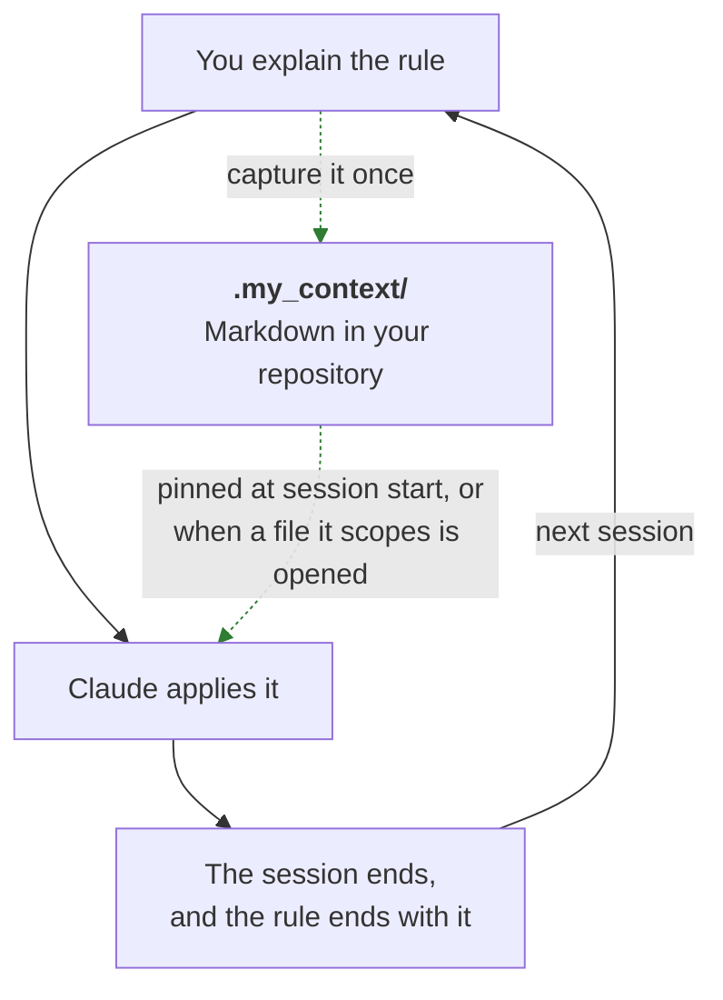
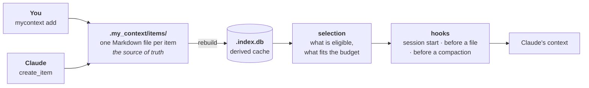
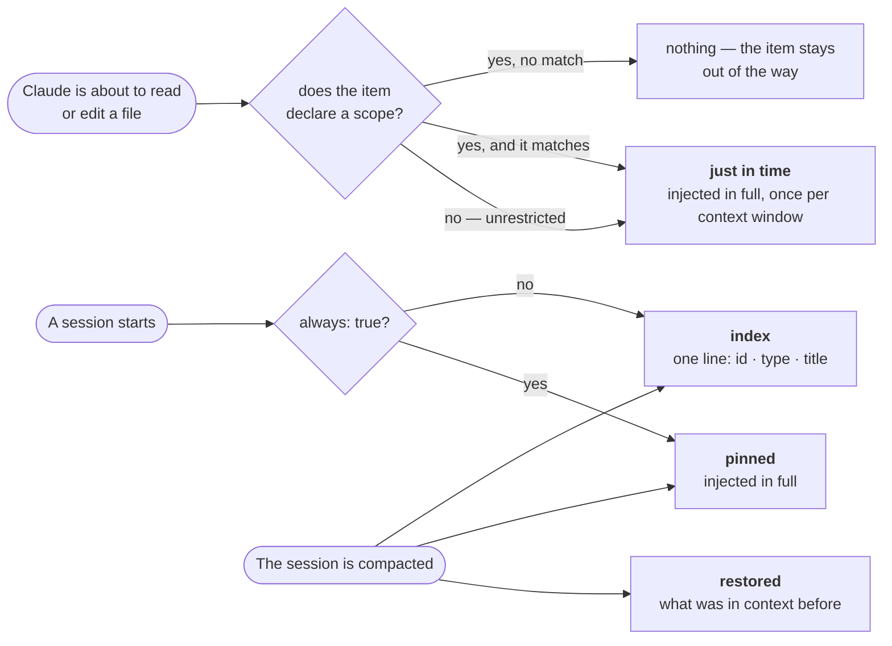
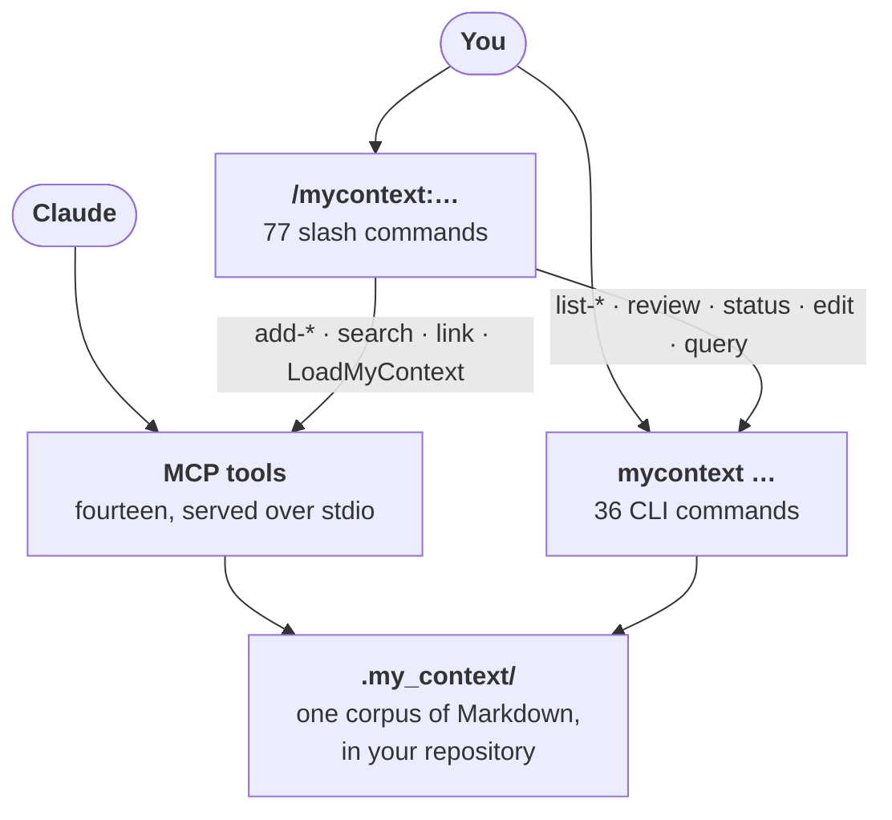
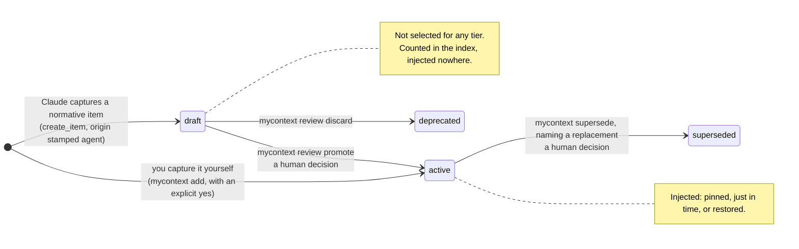

# my_context

**A Claude Code plugin that remembers your project's rules, so you stop repeating them.**

You tell Claude how this project works. The next session has never heard of it. my_context
captures those rules as Markdown files inside your repository, and puts the relevant ones
back in front of Claude on its own — pinned at the start of a session, or the moment a file
they apply to is about to be opened.


Node 24 or newer, no runtime dependencies and no build step — the TypeScript sources are
executed directly. Licensed under the [MIT licence](LICENSE). In a hurry:
[installing it](#installing-it), or the twenty-minute
[quickstart](docs/TUTORIAL.md) — this page is the reference, and the quickstart is a path
through it.

You capture a rule once, from a terminal or by asking Claude to record it:

```bash
mycontext add invariant "Prices are integer cents" --scope "src/billing/**" --yes
```

The next time Claude is about to read or edit a file under `src/billing/`, that invariant
is put in front of it — in full, unprompted, in a session that has never heard of you.
Nothing had to be remembered and nothing had to be pasted. That is the whole product;
[section 4](#4-when-it-comes-back-and-what) is about which rules come back, when, and what
happens when more of them apply than will fit.

<div dir="rtl">

**בעברית:** my_context הוא תוסף ל-Claude Code שזוכר את הכללים של הפרויקט שלך. אתה מסביר
ל-Claude איך הפרויקט עובד, והסשן הבא מעולם לא שמע על זה; my_context לוכד את הכללים האלה
כקובצי Markdown במאגר שלך ומחזיר את הרלוונטיים שבהם מעצמו — נעוצים בתחילת הסשן, או ברגע
שנפתח קובץ שהם חלים עליו. **[התיעוד המלא בעברית](docs/README.he.md)** מקביל למסמך הזה
פרק-פרק.

</div>

## Contents

Deciding whether this is for you? **[What it can do](#what-it-can-do)** shows the whole
product in one screen and then names every capability in one line each, and it sits between
sections 1 and 2.

1. [The problem](#1-the-problem) — why a session's memory ending is expensive
2. [The idea](#2-the-idea) — what must hold, and why it is written down
3. [How it works, in three steps](#3-how-it-works-in-three-steps) — [you capture it](#step-1--you-capture-it) ([from an incident](#from-an-incident-to-a-rule), [from a document](#from-a-document-to-draft-items), [from a file](#from-a-file-to-a-reference)), [it is stored as Markdown](#step-2--it-is-stored-as-markdown-you-can-read-diff-and-review), [it comes back](#step-3--it-comes-back-on-its-own)
4. [When it comes back, and what](#4-when-it-comes-back-and-what) — [pinned](#pinned--the-handful-that-always-apply), [just in time](#just-in-time--the-ones-that-apply-to-what-you-are-touching), [restored](#restored--after-the-context-window-is-compacted), [the index](#the-index--so-nothing-is-invisible), [the global layer](#the-global-layer--knowledge-that-follows-you-across-projects), [the budget](#the-budget-and-what-happens-when-it-does-not-fit)
5. [Using it](#5-using-it) — [installing it](#installing-it), [slash commands](#what-you-type-the-slash-commands), [the CLI](#what-you-run-the-cli), [the index schema](#the-index-schema-and-how-to-query-it), [MCP tools](#what-the-model-calls-the-mcp-tools), [the skill](#what-the-model-reads-the-skill), [every flag](#every-flag-in-one-place)
6. [Configuration](#6-configuration) — [what each category means](#what-each-category-means), [categories you define yourself](#categories-you-define-yourself), then one section per key
7. [The trust boundary](#7-the-trust-boundary) — [draft and active](#draft-and-active-and-why-review-exists), [pending revisions](#what-a-pending-revision-is-and-what-it-cannot-do), [the approval boundary](#the-approval-boundary--read-this-before-trusting-it)
8. [Not yet available](#8-not-yet-available) — the one section describing what this project does **not** do
9. [Glossary](#9-glossary) — every term this document gives a particular meaning to

**Two guides sit beside this one**, for reading rather than for looking things up:
[the quickstart](docs/TUTORIAL.md) takes twenty minutes and ends with one constraint
reaching Claude on the file it governs, and
[the advanced guide](docs/TUTORIAL-ADVANCED.md) covers the injection tiers, scope policies,
focus, budgets, the ingest and lesson pipelines, revisions and the audit log. Every command
and every block of output in both was executed, not illustrated.

> [!TIP]
> **If a word or a `--flag` here is not obvious, it is explained somewhere you can jump
> straight to.** Every term this document gives a particular meaning to is defined in the
> [glossary](#9-glossary), and every command-line option is in one table:
> [every flag, in one place](#every-flag-in-one-place). Terms are also defined in plain
> language where they first appear, so reading front to back never requires either.

## 1. The problem

You are working on a checkout flow. You tell Claude: *prices are integer cents, never
floating-point dollars — the rounding error at each conversion is why the total did not
match the line items last quarter.* Claude agrees, fixes the code, and the session ends.

Two days later you open a new session and ask for a discount feature. Claude writes
`price * 0.9`, and the rounding error is back.

Nothing malfunctioned. A session's memory ends when the session does. Everything you
explained — the reasoning, the corrections, the "no, not like that" — went with it.

### Why re-pasting does not fix it

The obvious workaround is to paste your rules in again at the start of each session. It
fails in three ways at once.

- **You forget.** Not always — just on the session where it mattered.
- **It drifts.** Pasted from memory, the rule comes out slightly different each time.
  "Integer cents" becomes "avoid floats", which is advice rather than a rule, and the next
  session interprets it more loosely than the last one.
- **It costs on every session.** Your rules are re-read and re-charged each time, and by
  the time you have a dozen of them, most of what you paste has nothing to do with the file
  you are about to touch.

### Why `CLAUDE.md` alone is not enough

`CLAUDE.md` is a real improvement over pasting: Claude Code loads it automatically, so at
least the rules arrive without you doing anything. It has four limits that show up as soon
as a project is more than small.

- **It is static.** It says the same thing in every session, whatever you are doing.
- **It is unscoped.** There is no way to say "this one applies only to billing code". Every
  rule applies to every file equally, which in practice means every rule is background noise
  for most of the work.
- **It is undifferentiated.** "Use two-space indentation" sits next to "never write a
  customer's email address to a log", with nothing marking one as a preference and the other
  as a legal exposure.
- **It grows until it is skimmed.** Every rule you add makes the file longer, and a long
  file competes with itself for attention. Nothing in it is ever retired, because nothing in
  it records when it was last relevant.

### The cost you actually feel

It is not really about tokens. It is that you give the same correction over and over and it
never sticks — and that after the third time you stop trusting the work and start checking
it. The time goes into re-explaining decisions you already made instead of making new ones.

my_context closes that loop: you capture a rule once, and the relevant part of what you have
captured comes back on its own, when it applies.



The solid arrows are the loop you are in today. The dotted ones are what my_context adds:
one capture, and a return path that does not depend on you remembering.

## What it can do

### In one screen

On a Monday, in a terminal, you type this once and then forget about it:

```bash
mycontext add invariant "Prices are integer cents" --scope "src/billing/**" --yes
```

A fortnight later, a session that has never heard of you or of that rule is about to edit
`src/billing/prices.js`. Before the edit runs, this is in Claude's context — the real output
of the hook, quoted verbatim and re-derived from the running code by
`test/docs/injection.test.ts` on every test run:

```text
## my_context — these govern this project

### CONST-postgres-pool-capped-at-20 · constraint · Postgres pool capped at 20

The managed Postgres plan allows 120 connections. Five API instances at 20 each
leaves 20 for migrations, backups and the admin console. Raising the pool past 20
does not buy throughput; it buys `remaining connection slots are reserved` during
the next deploy.

### INV-prices-are-integer-cents · invariant · Prices are integer cents

Every price crossing a module boundary is an integer number of cents.
Floating-point dollars re-introduce a rounding error at each conversion, and the
total a customer approves at checkout must equal the sum of its line items exactly.

_scope: src/billing/**_

### REQ-checkout-completes-in-two-steps · requirement · Checkout completes in two steps

Cart to payment, payment to confirmation. A third step was measured against the
two-step flow in April and abandonment rose by four points, so a new field belongs
in one of the two existing steps or nowhere.

### RULE-never-log-customer-email · rule · Never log customer email

Log the customer id instead. Access logs are shipped to a third-party aggregator
that our data-processing agreement does not cover, so an email address in a log
line leaves the boundary the checkout flow promises the customer.

_scope: src/**_
```

**Nobody typed anything.** No search was run, no tool was called, nobody pasted a rule and
nobody asked for one. **Nobody remembered anything** — not you, and not the model, which had
no memory of the Monday and no reason to suspect the invariant existed. **The trigger was
the file.** `src/billing/**` matched `src/billing/prices.js`, and the
[hook that runs before Claude reads or edits a file](#just-in-time--the-ones-that-apply-to-what-you-are-touching)
selected on that path and injected before the tool ran. The other three arrived on the same
call because nothing excluded them: two declare no scope at all, and the third is scoped
`src/**`, which `src/billing/prices.js` is under. They arrive once each, hardest-first,
inside [a budget](#the-budget-and-what-happens-when-it-does-not-fit) that names whatever did
not fit — and this is the block for a session whose first event is the edit. A session that
started normally would have had the one `always: true` item
[pinned](#pinned--the-handful-that-always-apply) at its start instead, and seen the other
three here.

### Why not just `CLAUDE.md`

`CLAUDE.md` is a real improvement over pasting rules in by hand, and this exists because of
what it still cannot do. [Section 1](#why-claudemd-alone-is-not-enough) is the long form;
each of its four limits has an answer here.

- **It is static** — it says the same thing in every session. Here, delivery is chosen per
  event: [pinned](#pinned--the-handful-that-always-apply) at a session start,
  [just in time](#just-in-time--the-ones-that-apply-to-what-you-are-touching) before a file
  is read or edited, [restored](#restored--after-the-context-window-is-compacted) after a
  compaction, and [an index line](#the-index--so-nothing-is-invisible) for everything else.
- **It is unscoped** — every rule applies to every file. Here, `scope` is a list of globs,
  and the file Claude is about to touch is what decides which items it gets.
- **It is undifferentiated** — a preference sits beside a legal exposure with nothing
  telling them apart. Here, an item's tier decides whether it may steer the model at all
  (normative text is injected in full; rationale is only counted, indexed and searched), and
  its severity decides which items reach a full budget first.
- **It grows until it is skimmed** — nothing in it records when it was last relevant. Here,
  every tier has a token budget, and `mycontext decay` reports which items have not been
  *injected* in the last window of sessions. Injected, not used: the report prints that
  caveat about itself, because an item read through `mycontext show` leaves no trace in the
  ledger and looks identical to an abandoned one.

### The unusual parts

- **The retrieval trigger is a file path, not a decision.** `src/hooks/pre-tool-use.ts`
  resolves the path Claude is about to open against the repository root and selects on it.
  Nothing asks the model to go looking — which matters, because a model that already
  suspects the rule exists is a model that mostly did not need it.
  → [Just in time](#just-in-time--the-ones-that-apply-to-what-you-are-touching)
- **What actually reached the model is recorded, per session**, keyed on session, item
  and tier: the audit log records every delivery first, and a per-session seen file is what
  makes an item arrive once rather than on every file. The usage ledger that
  `mycontext decay` is computed from is a projection rebuilt from that audit log, so the
  corpus can be retired on evidence of delivery
  rather than on a hunch. → [What you run: the CLI](#what-you-run-the-cli)
- **Extraction is quote-anchored, and my_context ships no model of its own.** Every
  candidate pulled out of a document must carry a span copied verbatim from the chunk it
  came from; the span is checked by exact match after whitespace collapsing, and a
  paraphrase is rejected. The check against invention is mechanical rather than a prompt
  asking nicely, and there is no API key and no inference cost anywhere in it.
  → [From a document to draft items](#from-a-document-to-draft-items)
- **The trust boundary is a selection tier, not a policy.** A normative item Claude captures
  *through the MCP tools* lands as a `draft` — the shell fallback the slash commands name is
  `mycontext add --yes`, which lands `active`, and says so where it is offered — and `draft`
  is admitted to no injection tier at all: the selector
  drops anything whose status is not `active` before a budget is even consulted. What is
  rarer than the review queue is that the boundary's own failure modes are published in the
  same document, with names.
  → [The approval boundary](#the-approval-boundary--read-this-before-trusting-it)
- **The corpus is Markdown you own and the index is disposable.** One file per item in
  your repository, each carrying a checksum re-stamped on every write; the SQLite index is
  derived from those files and `mycontext rebuild` recreates it from scratch. Even the
  usage ledger that shares the file is derived — a projection of the append-only audit log,
  which `mycontext audit replay-ledger` tops up incrementally, rebuilding it whole only when
  the log has diverged — so deleting the database loses nothing.
  → [Step 2 — it is stored as Markdown](#step-2--it-is-stored-as-markdown-you-can-read-diff-and-review)

### Everything, one line each

Everything below works today, and each line links to the section that covers it in full.
[Section 8](#8-not-yet-available) is the one place where behaviour that does **not** exist
yet is written down; nothing on this list is there.

- **Capture a rule by hand** — one `mycontext add` from the terminal, or ask Claude to
  record it and it lands as a draft for you to promote.
  → [Step 1 — you capture it](#step-1--you-capture-it)
- **Capture from a document you already wrote** — point at a PRD and my_context prepares
  the extraction request; the model fills it in, and what comes back lands as drafts, each
  checked against a quote from the source.
  → [From a document to draft items](#from-a-document-to-draft-items)
- **Point at a file, and be told when the copy goes stale** — a snapshot of a roadmap, a
  runbook or a progress log, with where it came from recorded, drift reported by `doctor`,
  and one command to take a fresh snapshot. It is a snapshot rather than a live read on
  purpose: see the section.
  → [From a file to a reference](#from-a-file-to-a-reference)
- **Turn an incident into a rule** — record the lesson, derive rule candidates from it, and
  accept the ones worth keeping, with the derivation recorded on the rule.
  → [From an incident to a rule](#from-an-incident-to-a-rule)
- **Keep all of it as Markdown in your repository** — one file per item, reviewed in a pull
  request like anything else, with the index derived from the files rather than the reverse.
  → [Step 2 — it is stored as Markdown](#step-2--it-is-stored-as-markdown-you-can-read-diff-and-review)
- **Get the relevant part back with nobody asking for it** —
  [pinned](#pinned--the-handful-that-always-apply) at the start of a session,
  [just in time](#just-in-time--the-ones-that-apply-to-what-you-are-touching) when a file
  they apply to is about to be opened,
  [restored](#restored--after-the-context-window-is-compacted) after a compaction, and
  [named in an index](#the-index--so-nothing-is-invisible) so nothing is invisible — all
  inside [a budget](#the-budget-and-what-happens-when-it-does-not-fit) you set.
  → [Step 3 — it comes back on its own](#step-3--it-comes-back-on-its-own)
- **Review what an agent proposes before it governs** — a normative item Claude captures is
  a draft, and a draft is selected for no injection tier at all.
  → [Draft and active](#draft-and-active-and-why-review-exists)
- **Edit what governs, through a gate that scales with the change** — nothing in the way on
  a draft or a rationale item, a preview and a confirmation on an item that governs, and an
  agent's rewrite [staged rather than applied](#what-a-pending-revision-is-and-what-it-cannot-do)
  for every normative category unless you say otherwise.
  → [What you run: the CLI](#what-you-run-the-cli)
- **Carry knowledge across every project you work on** — a global layer whose items load
  beside the project's, with the project winning on a conflict. Creating one today is a
  documented workaround rather than a command.
  → [The global layer](#the-global-layer--knowledge-that-follows-you-across-projects)
- **Name the categories your own domain uses** — the
  [built-in ones](#what-each-category-means) cover most projects, and a name that is not
  among them becomes a first-class category with its own id prefix, tier and scope.
  → [Categories you define yourself](#categories-you-define-yourself)
- **Ask the corpus a question it has no command for** — read-only SQL over the index, which
  is rebuilt from the Markdown before every query.
  → [The index schema, and how to query it](#the-index-schema-and-how-to-query-it)
- **See what is stale, broken or going cold** — `mycontext status` for the shape of the
  corpus, `mycontext doctor` for drift, dead globs and permissions, `mycontext decay` for
  what has not been injected lately — with the caveat the report prints about itself.
  → [What you run: the CLI](#what-you-run-the-cli)
- **Reach all of it from wherever you already are** — the
  [slash commands](#what-you-type-the-slash-commands) you type, the
  [CLI](#what-you-run-the-cli) you run, the [MCP tools](#what-the-model-calls-the-mcp-tools)
  the model calls, and the [skill](#what-the-model-reads-the-skill) that tells it to capture
  a rule in the turn the rule is agreed.

One caveat belongs beside this list rather than after it. The review gate above — the one
that keeps a draft from governing — is enforced by your Bash permissions and by nothing
else, and [the approval boundary](#the-approval-boundary--read-this-before-trusting-it)
says exactly what that does and does not hold.

## 2. The idea

my_context divides what a project knows into two kinds, and treats them differently.

**Normative knowledge** is what must hold. Constraints, invariants, rules, requirements,
standards, patterns, glossary terms, instructions, non-goals, open questions. *Prices are
integer cents.* *Never log a customer's email address.* *The connection pool is capped at
20.* These answer the question **"what am I not allowed to get wrong here?"**

**Rationale** is why the project is the way it is. Decisions, ADRs, lessons, tradeoffs,
assumptions, edge cases, risks. *We chose Stripe over Adyen because the settlement timing
matched our payout schedule.* *Retry storms need jitter — we learned that the hard way in
March.* These answer **"why is it like this?"**

Both are worth keeping. Only the first governs.

Three words in that last sentence are used precisely throughout this document, so they are
worth pinning down before anything is built on them.

- **Injection** is my_context putting text into a Claude Code session's context by itself,
  with nobody asking for it. That is the whole mechanism: not a search you run, but text
  that is already there when the model starts reading.
- An item **governs** when it is eligible to be injected and is phrased as an instruction —
  something the model is expected to comply with rather than merely know about.
- **Tier** is the word for the normative/rationale split. Every category — `constraint`,
  `decision`, `rule`, `lesson`, and the rest — carries one, and you can change which
  ([section 6](#6-configuration)). Watch out for a second, unrelated use of the same word:
  [section 4](#4-when-it-comes-back-and-what) calls its four delivery routes *injection
  tiers*. Where the difference matters below, the sentence says which is meant.

The set of items in your project — everything under `.my_context/items/`, whatever its tier
or status — is its **corpus**.

<!-- example: list --summary -->
```text
┌───────────────┬───────┐
│ type          │ items │
├───────────────┼───────┤
│ constraint    │ 1     │
│ decision      │ 2     │
│ invariant     │ 1     │
│ lesson        │ 1     │
│ open_question │ 1     │
│ requirement   │ 1     │
│ rule          │ 2     │
│ standard      │ 1     │
└───────────────┴───────┘

10 item(s)
```
<!-- /example -->

That is a small example project — a fictional Bookstore API — used throughout this document.
Seven of its ten items are normative and three are rationale. `mycontext help categories`
prints the full list of types with the tier each one belongs to.

### Why the split is load-bearing, not filing

It would be easy to read this as a taxonomy: a tidy way to sort notes. It is not. The split
decides **which text is allowed to silently change how an agent behaves.**

Normative text is injected into Claude's context in full, unprompted, and it is written in
the imperative. That is the point — a rule that has to be asked for is a rule that gets
forgotten. But text with that reach is text that steers, so it has to be text somebody
approved.

Rationale never enters a session that way. At the start of a session it contributes a count
— "2 decision · 1 lesson" — and nothing more. It is indexed and searchable and retrieved on
request, but it does not arrive uninvited and it does not phrase itself as an order.

That difference in reach is why the two tiers have different rules about who may add them.
When Claude captures a normative item, it lands as a **draft** and governs nothing until a
human promotes it. When Claude captures a rationale item, it is simply recorded. Being wrong
about *why* costs you a misleading explanation; being wrong about *what must hold* costs you
wrong code, written confidently, by something you were trusting to know the rule. The
approval boundary, and its limits, are described in full in
[section 7](#7-the-trust-boundary).

## 3. How it works, in three steps



### Step 1 — you capture it

You state the rule once, on the command line or by asking Claude to record it.

<!-- example: add constraint "Uploads capped at 10 MB" --body "The API gateway rejects a larger body before it reaches us, so accepting one only produces a timeout the customer cannot explain." --scope "src/api/**" --tags uploads --yes -->
```text
about to create constraint "Uploads capped at 10 MB" — active, and governing this project at once.
my_context: created CONST-uploads-capped-at-10-mb (active) at items/constraint/CONST-uploads-capped-at-10-mb.md.
```
<!-- /example -->

Everything after the title is an **option** — a `--name value` pair that sets one field on
the item. Four things in that command matter.

- `--body "…"` is the item's text: the paragraph Claude will actually be given. The title
  says what the rule is; the body says why, and why is what stops a rule being applied
  mechanically in a case it was never about.
- `--scope "src/api/**"` is what makes the rule targeted rather than ambient. It is a
  **scope glob** — a file-path pattern, where `*` matches within one directory level and
  `**` matches across as many as it needs. This constraint concerns the API layer, so it
  will come back when API code is being touched and stay out of the way otherwise. Scope
  *restricts*, so a rule with no scope is not restricted to anything and applies to every
  file — see [section 4](#4-when-it-comes-back-and-what).
- `--tags uploads` attaches free-form labels. With no focus set they change nothing about
  when an item is injected; they are there so you can find it later. `mycontext focus` is
  the exception — a focus narrows injection to the tags it names.
- `--yes` is required because this is a normative category. The item governs the project the
  moment it exists, and the flag is the explicit acknowledgement of that. Rationale
  categories need no confirmation.

The id, `CONST-uploads-capped-at-10-mb`, is derived from the title. You will see it in
Claude's context, in `mycontext list`, and in the filename.

Those four are a fraction of what the commands accept. Every option the CLI takes is listed
together in [every flag, in one place](#every-flag-in-one-place); `mycontext help <command>`
prints the authoritative usage for any one of them.

Claude can capture items too, using the `create_item` tool. A normative item captured that
way lands as a draft and waits for you.

#### From an incident to a rule

Not everything worth keeping arrives as a rule you already know how to phrase. More often
something breaks, you work out why, and the rule is the part you have not written yet.
`mycontext lesson` starts from that end.

`mycontext lesson "<what was learned>"` records the lesson — rationale tier, so it is indexed
and searchable and never injected uninvited — and prints a **rule-derivation request**: the
lesson, a JSON schema, and instructions to convert a description of what happened into
directives about what must happen from now on. Hand it the id of a lesson that already exists
instead of the text and it re-derives from that one rather than recording a second copy;
that is the form the walkthrough below uses, and its first line says so — `already recorded
— nothing was written by this call`.

my_context has no model of its own, and the request says so in its first line. Deriving the
rules is Claude's half of the job:

<details>
<summary><b>The rule-derivation request, in full</b> — 77 lines, exactly as the model receives them</summary>

<!-- example: lesson LESSON-retry-storms-need-jitter -->
````text
my_context: lesson LESSON-retry-storms-need-jitter already recorded — nothing was written by this call (rationale tier — indexed, never injected). Re-deriving rules from it:

my_context RULE DERIVATION REQUEST — LESSON-retry-storms-need-jitter

- You are deriving rules. my_context has no model of its own — it stages what you return and waits for a human.
- A lesson is descriptive ("this is what happened"); a rule is normative ("this is what must happen from now on"). Convert, do not restate.
- Emit a JSON array of rule candidates matching the schema. Two or three is usually right; return [] if the lesson supports no general rule.
- Each rule must be actionable by someone who was not present for the incident. Drop the dates, names and ticket numbers.
- Do not invent scope. Scope RESTRICTS where a rule applies, so omitting it leaves the rule applying everywhere — which is the right answer for a rule that is not about particular directories, and the honest answer when you cannot name them. A human can narrow it during review.
- NOTHING you return is applied. Every candidate is staged pending explicit human approval, because a subtly wrong invariant would be injected into every future session indefinitely.
- Call back with: mycontext lesson-stage LESSON-retry-storms-need-jitter --stdin

```json
{
  "protocol": "my_context/rule-derivation-request@1",
  "lessonId": "LESSON-retry-storms-need-jitter",
  "lessonTitle": "Retry storms need jitter",
  "lessonBody": "The March catalogue outage lasted forty minutes because every client retried on the\nsame fixed one-second interval, so the service was re-hit in synchronized waves and\nnever got a quiet moment to recover. Retries now use exponential backoff with full\njitter.",
  "lessonObservations": [],
  "ruleCategoryEnabled": true,
  "schema": {
    "type": "array",
    "items": {
      "type": "object",
      "required": [
        "title",
        "directive",
        "body"
      ],
      "additionalProperties": false,
      "properties": {
        "title": {
          "type": "string",
          "maxLength": 200,
          "description": "The directive itself, phrased as an instruction: \"Run migrations outside peak hours\"."
        },
        "directive": {
          "enum": [
            "do",
            "dont"
          ],
          "description": "\"do\" prescribes; \"dont\" prohibits."
        },
        "body": {
          "type": "string",
          "description": "Why. Cite the mechanism from the lesson, not the incident narrative."
        },
        "scope": {
          "type": "array",
          "items": {
            "type": "string"
          },
          "description": "POSIX globs this governs. Omit rather than guessing; a bare \"**\" is rejected."
        },
        "severity": {
          "enum": [
            "hard",
            "soft"
          ]
        }
      }
    }
  },
  "callback": {
    "cli": "mycontext lesson-stage LESSON-retry-storms-need-jitter --stdin"
  },
  "instructions": [
    "You are deriving rules. my_context has no model of its own — it stages what you return and waits for a human.",
    "A lesson is descriptive (\"this is what happened\"); a rule is normative (\"this is what must happen from now on\"). Convert, do not restate.",
    "Emit a JSON array of rule candidates matching the schema. Two or three is usually right; return [] if the lesson supports no general rule.",
    "Each rule must be actionable by someone who was not present for the incident. Drop the dates, names and ticket numbers.",
    "Do not invent scope. Scope RESTRICTS where a rule applies, so omitting it leaves the rule applying everywhere — which is the right answer for a rule that is not about particular directories, and the honest answer when you cannot name them. A human can narrow it during review.",
    "NOTHING you return is applied. Every candidate is staged pending explicit human approval, because a subtly wrong invariant would be injected into every future session indefinitely.",
    "Call back with: mycontext lesson-stage LESSON-retry-storms-need-jitter --stdin"
  ]
}
```
````
<!-- /example -->

</details>

What comes back is a JSON array of candidates, and it goes to `mycontext lesson-stage`.
Staging writes nothing into your corpus — the candidates sit in a file under
`.my_context/.staging/`, and the command's first line is there to say so:

<!-- example: lesson LESSON-retry-storms-need-jitter && lesson-stage LESSON-retry-storms-need-jitter --file docs/lesson-rule-candidates.json -->
```text
my_context: 2 rule candidate(s) staged for LESSON-retry-storms-need-jitter. None of them exists as an item yet.
  ┌──────────┬───────────┬─────────────────────────────────┐
  │ key      │ directive │ title                           │
  ├──────────┼───────────┼─────────────────────────────────┤
  │ 99eb0e3d │ do        │ Retries add jitter to backoff   │
  │ 47c76d53 │ dont      │ Never retry on a fixed interval │
  └──────────┴───────────┴─────────────────────────────────┘

Accept with:  mycontext lesson-accept LESSON-retry-storms-need-jitter <key> [--title "…"] [--scope "a/**,b/**"]
Discard with: mycontext lesson-discard LESSON-retry-storms-need-jitter <key>
```
<!-- /example -->

Each candidate gets a short **key**. The key is a hash of the candidate's own content —
directive, title, body, scope and severity — and not its position in the list, so a second
derivation that rewords a candidate gives it a different key. `lesson-stage` replaces the
pending set on each run, and it prints the pending candidates the new set did not produce
again rather than dropping them silently. Anything you have already accepted or discarded is
carried forward untouched: a discarded candidate cannot come back.

`mycontext lesson-accept` names one key and creates the rule.

<!-- example: lesson LESSON-retry-storms-need-jitter && lesson-stage LESSON-retry-storms-need-jitter --file docs/lesson-rule-candidates.json && lesson-accept LESSON-retry-storms-need-jitter 99eb0e3d -->
```text
my_context: about to create this rule — review before it becomes active:
  title:     Retries add jitter to backoff
  directive: do
  severity:  hard
  scope:     (unrestricted)
  body:      A fixed interval re-hits a recovering service in waves; jitter spreads them out.

my_context: created RULE-retries-add-jitter-to-backoff (active) with derived_from [[LESSON-retry-storms-need-jitter]].
```
<!-- /example -->

> [!WARNING]
> Read those two halves together. `lesson-accept` prints "review before it becomes active"
> and then creates the rule `active` — governing this project — in the same run. There is no
> second command and no `--yes` to withhold: the preview describes something already decided
> by the time you can read it. `--title`, `--scope`, `--severity` and `--directive` amend the
> candidate on the way through, and `mycontext lesson-discard <lesson> <key>` rejects one for
> good, but the accept itself is the last gate and it does not hold.
> [Section 7](#7-the-trust-boundary) counts it among the commands that change what governs
> this project with no human in the loop.

The rule that comes out is an ordinary item — the same Markdown as the next step describes,
with one relation recording where it came from.

<!-- example: lesson LESSON-retry-storms-need-jitter && lesson-stage LESSON-retry-storms-need-jitter --file docs/lesson-rule-candidates.json && lesson-accept LESSON-retry-storms-need-jitter 99eb0e3d && show RULE-retries-add-jitter-to-backoff -->
```text
---
id: RULE-retries-add-jitter-to-backoff
type: rule
title: Retries add jitter to backoff
status: active
severity: hard
always: false
scope: []
tags: []
origin: human
source_file: null
source_anchor: null
source_checksum: null
valid_from: <today>
valid_until: null
checksum: 66d3ef277acdc7ee
directive: do
---

# Retries add jitter to backoff

A fixed interval re-hits a recovering service in waves; jitter spreads them out.

## Relations
- derived_from [[LESSON-retry-storms-need-jitter]]
```
<!-- /example -->

`derived_from` is what keeps the pair legible a year later: the rule says what must happen,
and the lesson it points back at says why anyone thought so.

#### From a document to draft items

Most projects do not start empty. The rules are already written down somewhere — a PRD, a
spec, a design doc, the ADR folder — and the reason none of it reaches Claude is that
nobody is going to retype it one `mycontext add` at a time. `mycontext ingest` is that
retyping, done by the model, one section at a time, with a human at the end.

**The model is the extractor.** This is the thing to know before anything else, because
`ingest` is not a parser and does not behave like one. Point it at a file and it splits the
document at its headings, takes the first section nobody has dealt with yet, and prints an
**extraction request**: the section's text verbatim, the categories this project has
enabled, a JSON schema for what to send back, and the command to send it with. Reading that
text and deciding what in it is normative is Claude's half of the job. my_context has no
model of its own and never calls one, and the request says so in its first line.

<details>
<summary><b>The extraction request, in full</b> — 264 lines, exactly as the model receives them</summary>

<!-- example: ingest docs/prd.md -->
`````text
my_context EXTRACTION REQUEST — docs/prd.md § bookstore-api-prd (chunk 1 of 3, 3 pending)

- You are the extractor. my_context has no model of its own and never calls one — it hands you the text and validates what you return.
- Read the chunk below, taken from docs/prd.md under the anchor "bookstore-api-prd", and extract every piece of NORMATIVE knowledge it establishes: things that must hold, must be built, must not be done, or are deliberately left open.
- Do not extract narrative, status updates, or descriptions of what was done — that is claude-mem's job, not this one.
- Emit a JSON array matching the "schema" field. Return [] when the chunk establishes nothing normative — that is a correct and common answer, and the common case for prose that isn't a spec.
- Every candidate MUST carry a "quote": a span copied VERBATIM from the chunk. It is checked by exact match after whitespace collapsing, and a paraphrase is rejected. This is how an invented item is caught.
- "title" is one declarative sentence on a SINGLE LINE, at most 200 characters — no line breaks. Put the reasoning in "body".
- "body" is plain prose: no line may start with a Markdown heading ("#" through "######", e.g. "## Why") — that line and everything after it is silently dropped when the item is read back from disk. Do not structure the rationale with headings; use plain paragraphs.
- "scope", "tags" and "observations" must each be a JSON ARRAY — never a bare string. Scope RESTRICTS where an item applies: set it only to the directories the item actually governs, as POSIX globs such as "src/auth/**". "**", "*" and "**/*" are all rejected, because omitting "scope" already means exactly that. Omitting scope is safe and is the right answer when the item is not about particular files — it simply leaves the item unrestricted, so it applies everywhere.
- "severity" is "hard" (a future enforcement candidate) or "soft" (the default) — omit it to get "soft".
- Each observation's "category" must be lowercase letters, digits, underscore and hyphen only (e.g. "root-cause", not "Root Cause") — anything else silently drops the whole observation on the next read. Its "text" must not contain "#" and must not end in a parenthetical like "(...)" — use "tags"/"context" for those instead of writing them inline in "text".
- "extra" keys are category-specific fields (e.g. {"kind":"functional"} for a requirement, {"directive":"dont"} for a rule). Keys must be letters, digits and underscore only, not starting with a digit, and must not reuse a reserved field name such as "source_file", "status" or "id".
- Everything you return lands as status "draft". Nothing you extract governs future work until a human promotes it with `mycontext review promote <id>`.
- Then call back with the results. CLI: mycontext ingest-apply ING-docs-prd-md-dd2990c9-9e3efbae --anchor bookstore-api-prd --stdin — pipe your JSON array to stdin. MCP: call ingest_document with exactly the arguments shown in the "callback.mcp.arguments" object below, PLUS one more key: "candidates", whose value is the JSON array you produced (a real array, not a string).
- Including this one, 3 chunks in this document still need extraction; the callback returns the next request automatically.

CHUNK — the source text to read and extract from:
````
# Bookstore API PRD

The Bookstore API sells books on behalf of tenants who embed our checkout in
their own storefronts. This document is what the first release is measured
against, and it is read by the people building it and by the agents working
alongside them.

It is not a status report. Where a paragraph below says something must hold, it
is meant as a requirement; where it says something is deliberately not being
built, it is meant as a boundary.
````

```json
{
  "protocol": "my_context/extraction-request@1",
  "session": "ING-docs-prd-md-dd2990c9-9e3efbae",
  "sourceFile": "docs/prd.md",
  "anchor": "bookstore-api-prd",
  "chunkIndex": 0,
  "totalChunks": 3,
  "remaining": 3,
  "heading": "Bookstore API PRD",
  "categories": [
    {
      "name": "adr",
      "description": "Formal decision record, MADR shape",
      "extraFields": []
    },
    {
      "name": "assumption",
      "description": "Unverified premise plus validation deadline",
      "extraFields": [
        "validate_by",
        "validated_on"
      ]
    },
    {
      "name": "constraint",
      "description": "Non-negotiable limit: budget, stack, regulation, SLA",
      "extraFields": []
    },
    {
      "name": "decision",
      "description": "Lightweight decision not warranting a full ADR",
      "extraFields": []
    },
    {
      "name": "edge_case",
      "description": "Boundary condition; frequently worth promoting",
      "extraFields": []
    },
    {
      "name": "environment",
      "description": "How the environments differ: what production does that local does not",
      "extraFields": []
    },
    {
      "name": "glossary",
      "description": "Ubiquitous language: the agreed term, and terms not to use",
      "extraFields": []
    },
    {
      "name": "instruction",
      "description": "Governs the agent's process, not the artifact",
      "extraFields": []
    },
    {
      "name": "invariant",
      "description": "Condition that must always hold during execution",
      "extraFields": []
    },
    {
      "name": "known_issue",
      "description": "Broken, flaky or a dead end right now; do not spend effort on it",
      "extraFields": []
    },
    {
      "name": "lesson",
      "description": "What was learned; source material for generated rules",
      "extraFields": []
    },
    {
      "name": "non_goal",
      "description": "Explicit prohibition on building something",
      "extraFields": []
    },
    {
      "name": "note",
      "description": "Anything that arose during development and must not be lost",
      "extraFields": []
    },
    {
      "name": "open_question",
      "description": "Deliberately undecided; the agent must not decide it alone",
      "extraFields": [
        "blocks"
      ]
    },
    {
      "name": "pattern",
      "description": "Reusable solution, or an anti-pattern to avoid",
      "extraFields": []
    },
    {
      "name": "procedure",
      "description": "An ordered operation performed once and then finished; a repeatable one is a runbook",
      "extraFields": []
    },
    {
      "name": "reference",
      "description": "A snapshot of a file, with its origin recorded so doctor reports drift",
      "extraFields": []
    },
    {
      "name": "requirement",
      "description": "What must be built",
      "extraFields": [
        "kind"
      ]
    },
    {
      "name": "risk",
      "description": "May occur and would harm",
      "extraFields": [
        "likelihood",
        "impact"
      ]
    },
    {
      "name": "rule",
      "description": "A do/dont directive",
      "extraFields": [
        "directive"
      ]
    },
    {
      "name": "runbook",
      "description": "The steps for a named operation, in the order they must be taken",
      "extraFields": []
    },
    {
      "name": "standard",
      "description": "Formatting, coding convention, architectural guideline",
      "extraFields": []
    },
    {
      "name": "todo",
      "description": "Something to build or fix later, captured the moment it occurs to you",
      "extraFields": []
    },
    {
      "name": "tradeoff",
      "description": "What was sacrificed for what",
      "extraFields": []
    }
  ],
  "schema": {
    "type": "array",
    "items": {
      "type": "object",
      "required": [
        "type",
        "title",
        "body",
        "quote"
      ],
      "additionalProperties": false,
      "properties": {
        "type": {
          "type": "string",
          "description": "One of the enabled categories listed in this request."
        },
        "title": {
          "type": "string",
          "maxLength": 200,
          "description": "One declarative sentence stating what must hold. Must be a single line — no line breaks."
        },
        "body": {
          "type": "string",
          "description": "The rationale: why this holds, and what breaks if it does not. Plain prose only — no line may start with a Markdown heading (\"#\" through \"######\", e.g. \"## Why\"). A heading line and everything after it is silently dropped when the item is read back from disk."
        },
        "quote": {
          "type": "string",
          "description": "A verbatim span copied from the chunk. Never paraphrase — a paraphrased quote is rejected."
        },
        "severity": {
          "enum": [
            "hard",
            "soft"
          ],
          "description": "hard = a future enforcement candidate. Default soft."
        },
        "scope": {
          "type": "array",
          "items": {
            "type": "string"
          },
          "description": "POSIX globs of the code this governs, e.g. \"src/auth/**\". Must be an array of strings, not a single string. Scope RESTRICTS where an item applies: omitting it leaves the item unrestricted, so it applies to every file. Set it only when the item is genuinely about particular directories, and omit it rather than guessing. \"**\", \"*\" and \"**/*\" are all rejected as redundant spellings of omitting it."
        },
        "tags": {
          "type": "array",
          "items": {
            "type": "string"
          },
          "description": "Must be an array of strings, not a single string."
        },
        "observations": {
          "type": "array",
          "items": {
            "type": "object",
            "required": [
              "category",
              "text"
            ],
            "additionalProperties": false,
            "properties": {
              "category": {
                "type": "string",
                "description": "Lowercase letters, digits, underscore and hyphen only (e.g. \"root-cause\"), no spaces or other punctuation — anything else makes this observation unreadable and it is silently dropped when the item is read back from disk."
              },
              "text": {
                "type": "string",
                "description": "Must not contain \"#\" (read back as a tag marker) and must not end in a parenthetical like \"(...)\" (read back as \"context\") — either silently strips content from this text when the item is read back from disk. Use \"tags\"/\"context\" instead."
              },
              "tags": {
                "type": "array",
                "items": {
                  "type": "string"
                },
                "description": "Must be an array of strings, not a single string."
              },
              "context": {
                "type": "string",
                "description": "Optional qualifier, e.g. \"at registration\". Must not contain parentheses."
              }
            }
          }
        },
        "extra": {
          "type": "object",
          "additionalProperties": {
            "type": "string"
          },
          "description": "Category-specific fields, e.g. {\"kind\":\"functional\"} for a requirement, {\"directive\":\"dont\"} for a rule. Keys must be letters, digits and underscore only, and not start with a digit (e.g. \"validate_by\", not \"validate-by\") — any other character makes the item unreadable on the next rebuild. Keys must also not collide with a reserved frontmatter field name (e.g. \"source_file\", \"status\", \"id\") — that would silently overwrite the real field on disk."
        }
      }
    }
  },
  "callback": {
    "cli": "mycontext ingest-apply ING-docs-prd-md-dd2990c9-9e3efbae --anchor bookstore-api-prd --stdin",
    "mcp": {
      "tool": "ingest_document",
      "arguments": {
        "session": "ING-docs-prd-md-dd2990c9-9e3efbae",
        "anchor": "bookstore-api-prd"
      }
    }
  }
}
```
`````
<!-- /example -->

</details>

That is what one `mycontext ingest docs/prd.md` prints. Two words in it are specific to
this command. An **anchor** is the heading a section sits under, lower-cased and hyphenated
— `## Catalogue and search` becomes `catalogue-and-search` — and it is how both halves of
the conversation name the same section. A **candidate** is a proposed item that does not
exist on disk yet: extracted, described in JSON, and nothing until it is applied.

The answer is a JSON array of candidates, and it goes back to `mycontext ingest-apply`,
naming the session and the anchor it came from. Every candidate must carry a `quote`
copied **verbatim** from the section it came from; my_context looks for it in that
section's own text, forgiving nothing but a difference in whitespace, and rejects a
paraphrase. That check is not a formality — it is the mechanism that catches an
item the model produced out of its own knowledge rather than out of your document. A
rejected candidate is named, is recorded in the session, and leaves its anchor pending.

**The first section here produces nothing, and that is the correct answer.** The Bookstore
API PRD opens with two paragraphs saying what the document is for. They establish nothing
that must hold, so the extraction returns `[]`, the apply reports zero created, zero
deduped and zero superseded, and no item is written. The request asks for exactly that —
"return `[]` when the chunk establishes nothing normative" — and it is worth pausing on,
because it is the answer to the fear the word "extraction" produces: **ingest does not
invent items.** Narrative prose yields nothing, and a section that yields nothing is still
marked done, so the run moves on rather than asking again.

<!-- example: ingest docs/prd.md && ingest-apply ING-docs-prd-md-dd2990c9-9e3efbae --anchor bookstore-api-prd --file docs/prd-candidates-bookstore-api-prd.json && ingest-status --full -->
```text
┌───────────────────────────────────┬─────────────┬─────────┬──────────┐
│ session                           │ source      │ applied │ rejected │
├───────────────────────────────────┼─────────────┼─────────┼──────────┤
│ ING-docs-prd-md-dd2990c9-9e3efbae │ docs/prd.md │ 1/3     │ 0        │
└───────────────────────────────────┴─────────────┴─────────┴──────────┘

ING-docs-prd-md-dd2990c9-9e3efbae  docs/prd.md
  applied  bookstore-api-prd
  pending  checkout-and-payments
  pending  catalogue-and-search
```
<!-- /example -->

That is `mycontext ingest-status --full`, and it is what makes a real document bearable.
A PRD is many sections, and doing them all in one sitting is not the normal case: the
session is a file in `.my_context/.ingest/`, its id is derived from the document's path and
contents, and every apply appends to it. Run `mycontext ingest` on the same file again — an
hour later or a week later — and you get the **next** pending section rather than the first
one. Applying a section returns the next request automatically, so the loop needs no
bookkeeping from you; `--anchor` re-requests one particular section when you want to redo
it. Because the id folds in a checksum of the document, editing the document opens a
**new** session rather than silently re-cutting the old one's sections; `ingest-status`
then lists both, and the items the first one produced are unaffected.

Work through the remaining sections and the items appear:

<!-- example: ingest docs/prd.md && ingest-apply ING-docs-prd-md-dd2990c9-9e3efbae --anchor bookstore-api-prd --file docs/prd-candidates-bookstore-api-prd.json && ingest-apply ING-docs-prd-md-dd2990c9-9e3efbae --anchor catalogue-and-search --file docs/prd-candidates-catalogue-and-search.json && ingest-apply ING-docs-prd-md-dd2990c9-9e3efbae --anchor checkout-and-payments --file docs/prd-candidates-checkout-and-payments.json -->
```text
my_context: checkout-and-payments — created 3, deduped 0, superseded 0.
  created     CONST-carts-expire-in-30-minutes
  created     REQ-refunds-use-payment-intents
  created     NOGOAL-guest-checkout-is-excluded

my_context: every chunk of docs/prd.md is applied. Promote what you want with `mycontext review`.
```
<!-- /example -->

**Everything ingest creates is a draft.** Nothing extracted from your document governs
anything, is injected into any session, or reaches Claude's context until a human promotes
it — and this is the property that makes ingest safe to point at a document you have not
read closely. Five items came out of that PRD, and all five are sitting in the review
queue with `origin ingest` and the file they came from:

<!-- example: ingest docs/prd.md && ingest-apply ING-docs-prd-md-dd2990c9-9e3efbae --anchor bookstore-api-prd --file docs/prd-candidates-bookstore-api-prd.json && ingest-apply ING-docs-prd-md-dd2990c9-9e3efbae --anchor catalogue-and-search --file docs/prd-candidates-catalogue-and-search.json && ingest-apply ING-docs-prd-md-dd2990c9-9e3efbae --anchor checkout-and-payments --file docs/prd-candidates-checkout-and-payments.json && review list -->
```text
┌───────────────────────────────────┬─────────────┬────────┬────────┬─────────────┬────────────────┐
│ id                                │ type        │ origin │ always │ source      │ title          │
├───────────────────────────────────┼─────────────┼────────┼────────┼─────────────┼────────────────┤
│ CONST-carts-expire-in-30-minutes  │ constraint  │ ingest │ no     │ docs/prd.md │ Carts expire   │
│                                   │             │        │        │             │ in 30 minutes  │
│ CONST-search-pages-hold-50-titles │ constraint  │ ingest │ no     │ docs/prd.md │ Search pages   │
│                                   │             │        │        │             │ hold 50 titles │
│ INV-isbn-is-unique-per-tenant     │ invariant   │ ingest │ no     │ docs/prd.md │ ISBN is unique │
│                                   │             │        │        │             │ per tenant     │
│ NOGOAL-guest-checkout-is-excluded │ non_goal    │ ingest │ no     │ docs/prd.md │ Guest checkout │
│                                   │             │        │        │             │ is excluded    │
│ REQ-refunds-use-payment-intents   │ requirement │ ingest │ no     │ docs/prd.md │ Refunds use    │
│                                   │             │        │        │             │ payment        │
│                                   │             │        │        │             │ intents        │
│ RULE-cache-keys-include-tenant-id │ rule        │ agent  │ no     │ -           │ Cache keys     │
│                                   │             │        │        │             │ include tenant │
│                                   │             │        │        │             │ ID             │
└───────────────────────────────────┴─────────────┴────────┴────────┴─────────────┴────────────────┘

6 draft(s) pending. Promote with `mycontext review promote <id>`.

1 pending revision(s) on 1 item(s) — proposed by an agent and NOT applied; the items keep their
current text. Read them as diffs with `mycontext review revisions`.
```
<!-- /example -->

The sixth row is the fixture's own pending draft, captured by an agent rather than by
ingest, and the notice below the table is an unrelated pending revision — both are there to
show that ingest's output joins one queue rather than getting a queue of its own.
`origin` is the column that says where each item came from, and no tool lets a caller set
it. Why that queue exists at all is
[section 7](#draft-and-active-and-why-review-exists); promoting is the moment an extracted
item starts governing the project:

<!-- example: ingest docs/prd.md && ingest-apply ING-docs-prd-md-dd2990c9-9e3efbae --anchor bookstore-api-prd --file docs/prd-candidates-bookstore-api-prd.json && ingest-apply ING-docs-prd-md-dd2990c9-9e3efbae --anchor catalogue-and-search --file docs/prd-candidates-catalogue-and-search.json && ingest-apply ING-docs-prd-md-dd2990c9-9e3efbae --anchor checkout-and-payments --file docs/prd-candidates-checkout-and-payments.json && review promote INV-isbn-is-unique-per-tenant --yes -->
```text
about to promote:
  id       INV-isbn-is-unique-per-tenant
  type     invariant
  title    ISBN is unique per tenant
  severity hard
  always   no
  scope    src/catalogue/**

Two tenants may stock the same book, so a lookup that omits the tenant can return the wrong row.

my_context: INV-isbn-is-unique-per-tenant is now active (scope src/catalogue/** — injected when work touches those paths).
```
<!-- /example -->

Claude can run both legs itself with the `ingest_document` tool, which carries the
candidates and the callback in one call. `/mycontext:ingest` drives the same flow from
inside a session, so ingest has three surfaces rather than two — `ingest-apply` and
`ingest-status` are steps *within* that command rather than commands of their own
([section 8](#one-surface-for-every-operation)).

#### From a file to a reference

Some of what a project knows is already written down, in a file somebody maintains: a
roadmap, a runbook, an architecture note, a progress log. Pasting it into an item's body
works exactly once — from then on the copy and the file drift apart with nothing watching.

`mycontext add reference "<title>" --file <path>` captures the file instead. The body
becomes a **snapshot** of it, and the item records where the snapshot came from:

<!-- example: add reference "Billing roadmap" --file docs/roadmap.md --note "The dates move; the ordering is what decides what is safe to build against." -->
```text
my_context: snapshotting docs/roadmap.md — 10 line(s), 260 bytes, ~65 estimated tokens
my_context: this category is on the rationale tier, so the item is never injected in full and costs the injection budget nothing. It is stored, searchable, and counted in the session index. Retiering the category to "normative" in config changes that — and changes what governs this project — see README, "reference".
my_context: created REF-billing-roadmap (active) at items/reference/REF-billing-roadmap.md.
```
<!-- /example -->

The snapshot is stored **quoted** — every line prefixed with `> ` — and that is not a
presentation choice. An item's body is the prose before its first `## ` section, so a
heading inside a raw body would take everything after it out of the body on the next write,
silently. Quoting makes the file survive the round trip unchanged, and the recorded
checksum is taken over the file itself rather than over the quoted form, so the number in
the frontmatter is the one you get by checksumming the file by hand:

<!-- example: add reference "Billing roadmap" --file docs/roadmap.md --note "The dates move; the ordering is what decides what is safe to build against." && show REF-billing-roadmap -->
```text
---
id: REF-billing-roadmap
type: reference
title: Billing roadmap
status: active
severity: soft
always: false
scope: []
tags: []
origin: human
source_file: docs/roadmap.md
source_anchor: null
source_checksum: b4870a16d4017508
valid_from: <today>
valid_until: null
checksum: 4f599b3a1340122c
---

# Billing roadmap

> # Billing roadmap
>
> ## Q3
>
> - Usage-based pricing behind a flag. Invoices are unchanged this quarter.
> - Dunning emails move out of the monolith and into the billing service.
>
> ## Q4
>
> - Proration on plan changes. Blocked on the tax vendor decision.

## Observations
- [note] The dates move; the ordering is what decides what is safe to build against.
```
<!-- /example -->

**The file is not read again on its own.** Not at session start, not when the index is
rebuilt, not when the item is injected. Two commands read it: this one, and
`mycontext refresh`. Everything else reads the item.

That is a deliberate refusal, and the reason is the boundary
[section 7](#7-the-trust-boundary) exists to hold. A reference that were read live would
mean that whoever can edit the file decides what the item says — and if the item governed,
whoever can edit the file would decide what governs the project, with no review in between.
An agent can edit files. Two smaller consequences follow from the same choice: the item
round-trips, so what is in `items/` is exactly what a session saw, and its size is fixed
rather than growing whenever the file does.

**Drift is reported, and it is never resolved for you.** `mycontext doctor` compares the
file against the snapshot and raises a `source_drift` warning naming the item, both
checksums, and the command that resolves it. `mycontext refresh <id>` re-reads the file,
shows you the size change before and after, and asks before it writes — the same
confirmation any other change to an item's content gets. Claude has its own route,
`refresh_item`, which reads the file server-side rather than composing a body, and which is
**staged for your review** rather than applied wherever
[`agentEdits`](#categoriesnameagentedits--whether-an-agents-rewrite-applies-or-waits) says
so.

**What it costs.** `reference` is a rationale category, and a rationale item is never
injected in full — so a snapshot of any size costs the injection budget nothing, and the
capture says so rather than warning about a cost it does not have. It is stored, searchable
by `query_items`, counted in the session index, and read when you or Claude ask for it by
id. If you [retier the category](#categoriesnametier--what-governs-and-what-merely-informs)
to `normative`, both halves of that change: the snapshot starts competing for the injection
budget like any other item — a 400-line file is a 400-line item, and one that does not fit
[spills whole](#the-budget-and-what-happens-when-it-does-not-fit) and is disclosed by id —
**and the file's content becomes governing knowledge, so whoever can edit that file can
change what governs this project**, subject to the snapshot-and-review cycle above and to
nothing else. The capture line changes with the tier and tells you which of the two you are
getting.

**There is a size limit, and it is stated rather than silent.** A file over 256 KiB is
refused at capture, with the number and the reason: the limit is not about the injection
budget — a file far smaller than that already spills — it is that a snapshot is re-read and
re-parsed by every command that rebuilds the index, so an unbounded one slows the whole tool
for as long as the item exists. Below the limit nothing is silent either: every capture
prints the size in lines, bytes and estimated tokens, and every refresh prints the
before-and-after in lines and estimated tokens. Both then print what this project's tier
does with that size.

**Where scope comes in.** A reference is scoped like anything else, and the choice is the
usual one: a roadmap that bears on the whole project takes no `--scope` and stays
unrestricted, while a runbook for one subsystem takes `--scope "src/billing/**"` so
`query_items({path})` finds it from that subsystem's files. On the rationale tier scope does
not decide injection — nothing in that tier is injected — but it is read on every item by
the path query, which is how "what do we know about this file?" is answered. Retiering to
normative is what makes scope decide injection too.

Two interactions are worth knowing before you reach them.
[`scopePolicy`](#categoriesnamescopepolicy--what-an-empty-scope-means) applies to
`reference` exactly as it applies to any other category, and it is **not** tier-dependent:
a project that sets `categories.reference.scopePolicy` to `"required"` has every reference
refused at capture until it names a glob, on the rationale tier as much as on the normative
one, and `"inert"` makes an unscoped reference match no path — which on the rationale tier
changes nothing about injection, since nothing there is injected, but does change what
`query_items({path})` returns. And `always: true` — the thing a roadmap looks like it
wants — is **refused** on a rationale `reference`, not stored and ignored: only normative
items are admitted to the pinned tier, so the flag would do nothing, and this project
refuses a field that would do nothing rather than accepting it quietly. `mycontext pin` on a
reference says so and names the two routes. Pinning a reference therefore means deciding to
retier the category first, which is the same decision, made explicitly, that the paragraph
above describes the cost of.

### Step 2 — it is stored as Markdown you can read, diff and review

Every item is one file under `.my_context/items/<type>/<id>.md`, in your repository, in
plain Markdown.

<!-- example: show CONST-postgres-pool-capped-at-20 -->
```text
---
id: CONST-postgres-pool-capped-at-20
type: constraint
title: Postgres pool capped at 20
status: active
severity: hard
always: true
scope: []
tags:
  - database
  - capacity
origin: agent
source_file: null
source_anchor: null
source_checksum: null
valid_from: 2026-08-14
valid_until: null
checksum: a81dff73a154242e
---

# Postgres pool capped at 20

The managed Postgres plan allows 120 connections. Five API instances at 20 each
leaves 20 for migrations, backups and the admin console. Raising the pool past 20
does not buy throughput; it buys `remaining connection slots are reserved` during
the next deploy.
```
<!-- /example -->

The block between the `---` lines is the **frontmatter**: the fields my_context uses to
decide when this item comes back and how much to trust it. Everything below it is the body,
and the body is what Claude actually reads. Field by field:

| Field | What it means |
|---|---|
| `id` | the item's name, derived from the title. Ids are how everything else refers to it |
| `type` | its category — `constraint`, `decision`, `rule` and so on. The category decides the tier |
| `status` | `draft`, `active`, `superseded`, `deprecated` or `validated`. **Only `active` is ever injected**; see the [glossary](#9-glossary) for what each of the other four means |
| `severity` | `hard` or `soft`. Within a tier it sets the order, not whether an item is injected: hard items are admitted to a budget first. It decides one thing about *whether* — `mycontext focus` never hides a `severity: hard` item, so a focus that excludes it injects it anyway |
| `always` | `true` pins the item — injected in full at every session start, whatever files you touch |
| `scope` | the file globs this item is restricted to. Empty means unrestricted: it applies to every file — unless the category's `scopePolicy` says otherwise ([section 6](#6-configuration)) |
| `tags` | free-form labels for finding it later. They affect nothing about injection until a focus is set: `mycontext focus <tag>` narrows injection to the tags it names, and an item that matches none of them is held back |
| `origin` | who wrote it: `human`, `agent` (Claude — through an MCP tool, which **stamps** it in the handler, or `mycontext lesson --agent`, which **declares** it) or `ingest` (extracted from a document). This is what the [trust boundary](#7-the-trust-boundary) is built on, and no tool lets a caller set it |
| `source_file`, `source_anchor`, `source_checksum` | where the item came from, when it was extracted from a document: the path, the heading within it, and a hash of that text so drift is detectable |
| `valid_from`, `valid_until` | the day it started applying, and the day it stopped. `valid_until` is filled in when an item is retired (`superseded` or `deprecated`) and cleared again if it is brought back, so it never contradicts the `status` above it. It is a **record, not a control**: nothing selects on it, and no item stops being injected because of a date — `status` decides that, in one place, so an item can never quietly fall out of force on a day nobody typed anything |
| `checksum` | a hash of the item's own content, re-stamped on every write. It is how `mycontext doctor` notices a file that was edited by hand |

Some categories add one more field of their own — a `rule` carries `directive: do` or
`directive: dont`, for instance. `mycontext examples <category>` prints a correct specimen
of any type, extra fields included.

This shape is deliberate. Your project's rules live in git, so they show up in a pull
request diff, they get reviewed like code, they branch and merge with the code they describe,
and you can read them without running anything. There is no database you have to query to
find out what your own project believes.

There *is* a database — `.my_context/.index.db`, SQLite — but it is derived, never authored.
It exists so that a lookup during a session is fast. Delete it and `mycontext rebuild`
recreates it from the Markdown. The Markdown is the source of truth; the index is a cache.

That sentence holds at run time, not only at rebuild time: the hooks never *require* the
index. They open it read-only when it is readable, and when it cannot be read at all they
serve the injection straight from the Markdown files and say so inline —
`my_context: served from Markdown; the index was unavailable.` The fallback selects by the
same rule as the indexed path — layers are merged project-over-global before any filter,
the same order the index is built in — so the two paths choose the same items, a property
held by construction and pinned by executed shadow-case tests rather than assumed. That guarantee is
conditional on corpus size: the fallback was measured at 9,903 ms for 10,000 items on a
cold file cache against Claude Code's 10-second hook kill, so past roughly 10,000 items a
fallback-served injection can be killed and degrades to a disclosed miss — `mycontext
doctor` warns from 5,000 items.

One consequence worth knowing early: do not hand-edit an item file. Every write path
recomputes the item's `checksum` field, and a hand edit does not, so the recorded checksum
stops matching the content. `mycontext doctor` reports that mismatch from then on.

### Step 3 — it comes back on its own

When a session starts, Claude Code runs my_context's *hooks* — small programs Claude Code
runs at fixed moments, before anything else happens. The session-start hook selects the items
that apply and hands them to Claude as context. This is what the model receives, verbatim:

```text
## my_context — these govern this project

### CONST-postgres-pool-capped-at-20 · constraint · Postgres pool capped at 20

The managed Postgres plan allows 120 connections. Five API instances at 20 each
leaves 20 for migrations, backups and the admin console. Raising the pool past 20
does not buy throughput; it buys `remaining connection slots are reserved` during
the next deploy.

## my_context index
- INV-prices-are-integer-cents · invariant · Prices are integer cents
- REQ-checkout-completes-in-two-steps · requirement · Checkout completes in two steps
- RULE-never-log-customer-email · rule · Never log customer email
- STD-api-errors-use-problem-json · standard · API errors use Problem JSON

2 decision · 1 lesson · 1 drafts pending review · 1 retired
→ use mycontext list or mycontext show <id> to browse these

my_context: 1 pending revision(s) on 1 item(s) in this workspace, staged and NOT applied — REV-76627cb9f4c6 → RULE-never-log-customer-email. Every item here carries the text it had before the proposal; that is the text in force. Only a human can settle them, and you cannot: do not propose the same change again, and do not reason as if the proposed text applies. Tell the user they are waiting.
```

One item arrived in full, because it is pinned. Four arrived as a single line each, so Claude
knows they exist and can fetch any of them by id. The rationale items arrived as a count.
Nothing was left out without being mentioned.

The last line is there because this example workspace has a
[pending revision](#what-a-pending-revision-is-and-what-it-cannot-do) waiting: an agent proposed
new text for `RULE-never-log-customer-email`, and nobody has promoted or discarded it yet. It
names the proposal without carrying it, so the session can see that one is waiting and still
reads the text that is actually in force. A workspace with an empty revision queue gets no
such line.

Claude Code hands each hook a payload of its own — which session this is, why it fired, which
directory. When that payload cannot be read, the hooks still run: they fail open, because a
hook that refused would cost you the injection entirely. What they no longer do is look
normal while doing it. A session start whose payload was garbage resolves the workspace from
the process working directory instead — usually the right one — and loads the corpus and
injects the pinned tier exactly as it should, but `source` and `session_id` never arrived
with it, and without those a compaction restores nothing and the just-in-time tier delivers
nothing for the rest of the session. That is now disclosed rather than left to be discovered:
one line on stderr from whichever hook it was, naming what was lost and what will not fire,
and from the session-start hook a line inside the injected block itself, so the model reading
it knows the session is missing something it cannot see is missing. A valid run writes
nothing to stderr at all, which is what makes one line there worth reading. An interactive
run that sends no payload is not this case and stays silent — nothing was malformed and
nothing was lost.

A second hook runs before Claude reads or edits a file, and that one is where scope pays off.
The next section is about which of these fires when.

## 4. When it comes back, and what

There are four **injection tiers** — four routes by which an item's text can reach a
session. (This is the second sense of "tier"; the first, from
[section 2](#2-the-idea), is the normative/rationale split a category carries.) Each route
has a condition that fires it and a rule about what it contains. "Just in time" is often
abbreviated **JIT**, including in the configuration file, where the budget for that tier is
spelled `jit`.

| Tier | Fires | Contains |
|---|---|---|
| **pinned** | every session start, and again after a compaction | every active normative item marked `always: true`, in full |
| **just in time** | Claude is about to read or edit a file the item applies to — one matching its `scope`, or any file at all if it declares no scope | that item, in full |
| **restored** | after a compaction | the items that were in context before it |
| **index** | every session start, and after a compaction | one line per remaining normative item, plus counts for the rest |



### Pinned — the handful that always apply

An item with `always: true` in its frontmatter is injected in full at every session start,
whatever you are working on, whatever files you touch. In the example above, that is
`CONST-postgres-pool-capped-at-20`: a limit that constrains any code that opens a database
connection, so waiting for a matching file would be waiting too long.

Pinning is for the small set of rules that are genuinely unconditional. The pinned tier has
its own budget, and everything you pin competes for it against everything else you pinned.

An item is set to `always: true` by promoting it with
`mycontext review promote <id> --always` while it is still a draft, or by `mycontext pin
<id>` once it governs — the second asks you to confirm, and shows what changes about the
item's injection before it does. `mycontext unpin <id>` takes it back out.

### Just in time — the ones that apply to what you are touching

`scope` is a list of file patterns, and it is a **restriction**: it narrows the files an item
applies to. When Claude is about to read or edit a file, my_context looks for active normative
items that apply to that path and injects them, in full, before the tool runs. An item that
declares a scope applies to the files it matches. An item that declares none is not restricted
at all, so it applies everywhere — you only write a scope when you want to limit where the
item shows up.

`INV-prices-are-integer-cents` carries `scope: src/billing/**`:

<!-- example: show INV-prices-are-integer-cents -->
```text
---
id: INV-prices-are-integer-cents
type: invariant
title: Prices are integer cents
status: active
severity: soft
always: false
scope:
  - src/billing/**
tags:
  - billing
  - money
origin: human
source_file: null
source_anchor: null
source_checksum: null
valid_from: 2026-08-14
valid_until: null
checksum: b9c3d588c634c8cc
---

# Prices are integer cents

Every price crossing a module boundary is an integer number of cents.
Floating-point dollars re-introduce a rounding error at each conversion, and the
total a customer approves at checkout must equal the sum of its line items exactly.
```
<!-- /example -->

So the moment Claude opens `src/billing/prices.js`, this is what it receives first:

```text
## my_context — these govern this project

### CONST-postgres-pool-capped-at-20 · constraint · Postgres pool capped at 20

The managed Postgres plan allows 120 connections. Five API instances at 20 each
leaves 20 for migrations, backups and the admin console. Raising the pool past 20
does not buy throughput; it buys `remaining connection slots are reserved` during
the next deploy.

### INV-prices-are-integer-cents · invariant · Prices are integer cents

Every price crossing a module boundary is an integer number of cents.
Floating-point dollars re-introduce a rounding error at each conversion, and the
total a customer approves at checkout must equal the sum of its line items exactly.

_scope: src/billing/**_

### REQ-checkout-completes-in-two-steps · requirement · Checkout completes in two steps

Cart to payment, payment to confirmation. A third step was measured against the
two-step flow in April and abandonment rose by four points, so a new field belongs
in one of the two existing steps or nowhere.

### RULE-never-log-customer-email · rule · Never log customer email

Log the customer id instead. Access logs are shipped to a third-party aggregator
that our data-processing agreement does not cover, so an email address in a log
line leaves the boundary the checkout flow promises the customer.

_scope: src/**_
```

Four items applied. Two of them named this file: the billing invariant scoped to
`src/billing/**`, and a rule scoped to `src/**`. The other two declare no scope at all — the
pool constraint and the checkout requirement — so nothing restricts them and they apply here
like they apply anywhere. Notice that the pool constraint arrives even though it is also
pinned: it is delivered by whichever tier reaches it first in a session, and only once.

Open `src/catalogue/search.js` instead and the billing invariant drops out, because its scope
excludes that file. The other three still arrive.

Three details a developer will want:

- **No scope means no restriction, unless the category says otherwise.** An item with no
  scope patterns applies to every file, so this tier delivers it on the first file Claude
  touches — except where `categories.<name>.scopePolicy` is set to `"inert"`, which inverts
  it: there an unscoped item applies to *no* file and survives as an index line only
  ([section 6](#6-configuration)). The default policy is the one described here. Writing a scope is how you *narrow*
  an item to the directories it is really about; leaving it off is the honest default for a
  rule that is not about particular files, and it is the shorter thing to type. The cost is
  real and worth knowing: an unscoped item competes for the `jit` budget on every file
  operation, so a corpus with many large unscoped items will spill — visibly, see
  [the budget](#the-budget-and-what-happens-when-it-does-not-fit) — rather than silently
  crowding out the item that actually named the file.
- **Each item arrives once per context window.** my_context records what it has already
  injected, so editing ten billing files does not deliver the same invariant ten times. A
  subagent shares the session's id but starts with an empty window of its own, so the record
  is kept per subagent: the parent having seen an item does not starve a subagent of it, and
  each subagent receives it at most once. What a subagent does *not* get is the session-start
  injection — see [section 8](#a-subagent-does-not-receive-the-session-start-injection).
  The record behind this is a per-session seen file — `.my_context/state/<session>.seen.jsonl`,
  machine-local generated state, pruned on the same 30-day retention as restore snapshots —
  not the SQLite index. When that file cannot be read, my_context re-injects rather than
  suppresses, and the delivery's audit record says so: a duplicate is disclosed and cheap;
  a missed rule is neither.
- **This tier carries no index.** A file-triggered injection contains the items that applied
  and nothing else. The index is a per-session cost, not a per-file one.

### Restored — after the context window is compacted

A long session eventually runs out of context window, and Claude Code *compacts* it:
summarises the conversation so far and continues from the summary. The summary is much
shorter than what it replaces, and the rules that were injected earlier are usually among
what it drops.

my_context takes a snapshot immediately before that happens, recording which items were in
play — both the ones it injected and any that were referenced by id in the transcript. When
the session resumes after compaction, those items are re-injected, alongside the pinned tier
and the index.

The snapshot has two arms, and the second is why the first's gap is usually harmless. The
session's seen file is keyed on the session id that the hooks receive, and
`/mycontext:LoadMyContext` has no trustworthy session id to record against — so a manual
load is never in the seen file. But
the snapshot also scans the transcript for item ids, and a manual load puts its ids there by
delivering them. Items you loaded by hand are therefore **restored after a compaction only
if** that scan still sees them, which ordinarily it does.

The snapshot path performs no SQLite writes and no blocking SQLite reads: it reads the
session's seen file and the transcript, and consults the index only through a best-effort
read-only open it can proceed without. The snapshot write itself is retried against
transient Windows sharing violations, and when it lands it is atomic against concurrent
readers — but it is not durable across a power loss, accepted because a power cut also ends
the session the snapshot serves. A write that still fails after its retries is recorded in
the audit log with the failure named in its note, and compaction is never blocked.

Three cases where it does not, stated plainly because "only if" is worth nothing without
them. Rationale items — decisions, ADRs, lessons — are never restored in full, by the same
rule that keeps them out of every other injection tier; they stay counted in the index.
The scan reads the last 8MB of the transcript, so an id whose only mention is older than
that is missed. And restoration is bounded by its own budget, like every other tier: what
does not fit drops to an index line and is named in the omission note.

### The index — so nothing is invisible

Whatever the tiers above did not deliver in full, the index lists. One line per remaining
active normative item: id, type, title. Enough for Claude to know the rule exists and to
fetch it by id when it turns out to matter, and cheap enough to include every time.

Rationale items are not listed individually. They are counted by type — `2 decision`,
`1 lesson` — along with the number of drafts waiting for review and the number of retired
items. An item whose category has been disabled in configuration is counted too, labelled as
such, so turning a category off never makes its items disappear without a trace.

An item that was already delivered in full gets no index line. Claude has the whole rule
already, and spending index space on a repetition would push something genuinely unseen out
of the list.

### The global layer — knowledge that follows you across projects

Not everything you know belongs to one repository. *Write the failing test first. Never
commit a secret. Ask before adding a dependency.* Those travel with you, and re-capturing
them in every project you open is the re-pasting problem from [section 1](#1-the-problem),
one directory up.

my_context reads a second corpus for exactly that. A **`.my-context` directory in your home
folder** — note the hyphen; a project's own directory is `.my_context`, with an underscore —
is loaded as the **global layer** alongside the project's, by every command that reads the
corpus and by every injection. Its items are ordinary items: the same categories, the same
tiers, the same severities, the same scope globs, the same budgets. `mycontext list --full`
shows both corpora, and the `layer` field says which one each item came from.

<!--
  The `text` blocks in this section are HAND-VERIFIED, not generated, and are therefore
  not covered by `test/docs/examples.test.ts`. The reason is structural, and it is the same
  reason `scripts/doc-fixture.ts` documents for excluding the global layer from the
  fixture: `runExampleInFixture` points every generated command's `HOME`/`USERPROFILE` at
  an empty directory (`emptyHome`, gen-doc-examples.ts) precisely so that whether the
  generating machine happens to have a `~/.my-context` cannot decide what the
  documentation shows. Generating a block here would mean weakening that guarantee. Nor
  can a `&&`-chained marker build a global layer inside an example run, because — as this
  section says — no `mycontext` command creates or writes one; the only step that puts a
  corpus at `~/.my-context` is a directory rename, which is not a command the harness can
  run. Each block below is the real output of the command named above it, run in sequence
  against a scratch workspace with a scratch `HOME`, on 2026-08-15. `npm run gen:docs`
  does not maintain them: if you change the wording of one of these messages, change it
  here too.
-->

```text
CONST-never-commit-a-secret
  type    constraint
  status  active
  origin  human
  layer   global
  scope   (unrestricted)
  title   Never commit a secret

RULE-never-log-customer-email
  type    rule
  status  active
  origin  human
  layer   project
  scope   src/**
  title   Never log customer email

RULE-write-the-failing-test-first
  type    rule
  status  active
  origin  human
  layer   global
  scope   (unrestricted)
  title   Write the failing test first
```

A global item governs exactly as a project item does. Pin one and it is injected in full at
the start of every session, in whatever project you are in. Leave it unpinned and it is
injected when a file matches its scope — matched against the project you are working in, so
a global item scoped `src/**` activates in every project that has a `src/` — and listed in
the index when nothing it applies to has been touched.

**The project wins, twice.** When a project item and a global item compete for the same
budget space, the project's is admitted first ([the budget](#the-budget-and-what-happens-when-it-does-not-fit)
is the section below). And when the two share an **id**, the project's copy is what governs
and the global one is not indexed at all — shadowed, not merged. No part of the global item
survives into this project's view of it.

That is how a project overrides a habit: capture a project item under the id you use
globally, and this repository follows the project's version of it. It is not silent. Every
command that rebuilds the index reports the collision, naming the id and both layers —
this is `mycontext rebuild`:

```text
my_context: indexed 4 item(s)
my_context: error  items/rule/RULE-write-the-failing-test-first.md: duplicate id "RULE-write-the-failing-test-first" declared in both the global layer (items/rule/RULE-write-the-failing-test-first.md) and the project layer (items/rule/RULE-write-the-failing-test-first.md); the project copy wins and the global one is not indexed. Rename one of them.
```

Both paths are relative to their own layer's root, so in a case like this one — the same
category and the same id — they read identically. The layer names are what tell them apart.

**Global items are read-only from a project.** They are yours across every repository, and
one repository's session is the wrong place to rewrite them, so every write path refuses
one. This is `mycontext edit` on a global item:

```text
my_context: "RULE-write-the-failing-test-first" belongs to the global layer and cannot be modified
from this project — global items are read-only here. See mycontext_help("categories").
```

`pin`, `unpin`, `harden`, `soften` and `supersede` refuse in those same words, which is one
sentence in one place (`globalLayerRefusal`). `review promote` refuses too, in its own
wording — it says the item "cannot be promoted or discarded from this project", because
those are the two things it does. `mycontext repair` re-stamps project items only, and names the global ones it did not
touch rather than skipping them in silence.

One thing the layer does **not** carry is its configuration. A `config.json` inside
`~/.my-context` is not read — configuration comes from the project you are in. So a global
item whose category that project has turned off is still listed by `mycontext list`, and
still counted in the index as a disabled category, but is never selected for injection
there.

#### Creating one, today

> **No command creates a global layer, and no command writes to one.** `mycontext init`
> creates `.my_context` in the directory you run it in, so `cd ~ && mycontext init` produces
> `~/.my_context` — the underscore spelling, which nothing reads. This is a gap, not a
> design; it is recorded in [section 8](#8-not-yet-available).

What works is to build the corpus as an **ordinary workspace** and then move the directory
it made into the global root:

```bash
mkdir ~/global-context && cd ~/global-context
mycontext init
mycontext add rule "Write the failing test first" --yes
mycontext add constraint "Never commit a secret" --severity hard --yes
# then rename the directory it created into place
mv ~/global-context/.my_context ~/.my-context
```

Every item there is written by the same code that writes a project item — ids derived,
checksums computed — which is what makes this different from hand-authoring the files, which
[section 7](#never-hand-edit-an-item-file) tells you never to do. The rename is the one
unsupported step. To change something later, move it back, edit it as an ordinary project,
and move it out again; that is also what `mycontext repair` means when it tells you to run
it "from the global layer's own workspace", since there is no such workspace until you make
one. The workspace's own `config.json` and `.index.db` come along with it; neither is read
from the global root, and neither does any harm.

### The budget, and what happens when it does not fit

Each tier has a **budget** — a size limit, so that a growing corpus cannot quietly take over
the context window. The defaults:

| Budget | Default | Governs |
|---|---|---|
| `pinned` | 6000 | the pinned tier at session start |
| `jit` | 6000 | one file-triggered injection |
| `restored` | 8000 | the re-injection after a compaction |
| `index` | 1200 | the index list |

The unit is estimated tokens, and "estimated" is meant literally: it is the character count
divided by four. my_context ships with no runtime dependencies and therefore no tokenizer, so
this is an approximation that can err in either direction, not a guaranteed ceiling. In round
terms, 6,000 of these units is about 24,000 characters — roughly 3,700 English words, or a
370-line document.

**These are not free, and it is worth being plain about what they cost.** The tiers compose:
a session start pays `pinned` plus `index`, up to about 7,200 estimated tokens, before you
have typed anything, and each distinct file-triggered injection pays up to `jit` on top —
once per item per context window (each subagent is its own), since the per-session dedupe
record never delivers the same item twice to the same window.
Against a 200,000-token context window that opening cost is around 3.6%.

They were four to twelve times smaller, and the reason they are not any more is that the small
numbers were not saving anything: they were hiding items. Measured on this repository's own
corpus at the old defaults, `jit: 500` delivered 3 of the 9 items scoped to `README.md` and 3
of the 14 scoped to `src/cli/**`, and `index: 150` named 6 of the 19 items that govern the
project. The rest arrived as a name in an omission note or as "+13 more", which is disclosed
but is not read. A budget too small does not make a corpus smaller; it makes it invisible.

**The lever for a corpus that outgrows these numbers is `decay`, not a smaller budget.**
`mycontext decay` reports which items have not been
injected in the window it covers, which is the supported route to retiring the ones that have
stopped earning their place. Lowering a budget instead leaves every item in force and spills
the surplus into a note.

Items are admitted hardest-first — `severity: hard` before `severity: soft`, then
[project layer before global](#the-global-layer--knowledge-that-follows-you-across-projects),
then by id so the result is deterministic.
An item too large for the remaining space is skipped rather than ending the pass, so a
smaller item behind it can still be admitted. An item skipped this way is said to have
**spilled** — that is the word the code uses, and the paragraph below is what a spill looks
like from the outside.

**What does not fit is listed, never dropped in silence** — the project's own
`INV-nothing-is-dropped-silently`. Concretely, an item that a full-text tier could not fit
appears twice: named in a one-line note under the injection,

```text
_1 item(s) omitted from full text for budget: CONST-postgres-pool-capped-at-20. Fetch with mycontext show <id>._
```

and again as an ordinary line in the index, because it was not delivered in full and so is
still worth listing.

There is one place where a specific id is not named, and it is worth stating plainly: when
the *index itself* runs out of budget, the lines that do not fit are replaced by a count.

```text
- … +2 more (fetch with mycontext show <id>)
```

The count is never wrong, and `mycontext list` shows the whole corpus from the terminal — but
inside that session Claude sees the number rather than the names. Everywhere else, what was
excluded is named where it was excluded.

## 5. Using it

my_context has two surfaces over one corpus. One is for you, one is for the model, and the
split is deliberate rather than historical.

**You** type slash commands inside a Claude Code session, or run the `mycontext` command in
a terminal. **The model** calls the fourteen MCP tools. Both surfaces read and write the same
Markdown files under `.my_context/`, so an item you capture in the terminal is in the
model's index the next time it looks, and an item the model captures shows up in
`mycontext list` at once.

Both exist because each is unusable in the other's situation. The model cannot stop
mid-sentence to open a terminal, so it needs tools it can call directly. You need a surface
that works when no model is in the room — in a script, in CI, or when you simply want to
read what the project believes. And a few acts are meant to be yours alone: promoting a
draft, retiring a governing item. How far that separation actually holds is
[section 7](#7-the-trust-boundary), and it is worth reading before you rely on it.



### Installing it

There are two halves, and they install differently. The `mycontext` command is an npm
package in this repository. The slash commands, the hooks and the MCP server are a Claude
Code **plugin** — declared by `.claude-plugin/plugin.json` and discovered from `commands/`,
`hooks/hooks.json` and `.mcp.json` at the repository root.

**The command.** From a clone of this repository:

```bash
npm install
npm link          # provides the `mycontext` command

cd /path/to/your/project
mycontext init
```

`mycontext init` creates `.my_context/` in the current directory with an `items/`
directory, a `config.json` and a `.gitignore`. Commit it: the corpus is meant to travel
with the code it describes. Without `npm link`, every command also works as
`node /path/to/my-context/src/cli/index.ts <args>`.

**The plugin.** Install it once, from your clone of this repository:

```bash
cd /path/to/my-context
claude plugin marketplace add ./
claude plugin install mycontext@mycontext
```

This repository is its own single-plugin marketplace
(`.claude-plugin/marketplace.json`), which is why the marketplace and the plugin are both
called `mycontext`. The install survives a restart. `claude plugin list` shows it, and
`claude plugin uninstall mycontext@mycontext` plus
`claude plugin marketplace remove mycontext` undo it.

To try it for one session without installing anything:

```bash
claude --plugin-dir /path/to/my-context
```

Either way, to check what actually loaded, ask Claude Code itself:

```bash
claude plugin details mycontext@mycontext
```

It prints the component inventory — the 66 commands and the `mycontext` skill, the four
hooks (`SessionStart`, `PreToolUse`, `PreCompact`, `PostToolUse`) and the one MCP server —
which is how you confirm the plugin is loaded rather than assuming it. Read the counts with
one correction in hand: `claude plugin details` has no commands line, and reports the
commands and the skill together as `Skills (67)`. Every command in
this section was established by running it, not by reading the documentation.

### What you type: the slash commands

Slash commands are namespaced by the plugin's name, so every one of them begins
`/mycontext:`. Grouped by what you are trying to do:

**Capture.** One `add-<type>` per enabled category. The normative ones —
`/mycontext:add-constraint`, `/mycontext:add-invariant`, `/mycontext:add-rule`,
`/mycontext:add-requirement`, `/mycontext:add-standard`, `/mycontext:add-pattern`,
`/mycontext:add-glossary`, `/mycontext:add-instruction`, `/mycontext:add-non-goal`,
`/mycontext:add-open-question`, `/mycontext:add-runbook`, `/mycontext:add-procedure`,
`/mycontext:add-environment`, `/mycontext:add-known-issue` — capture through the
`create_item` tool and land as **drafts**. The rationale ones — `/mycontext:add-adr`,
`/mycontext:add-decision`, `/mycontext:add-lesson`, `/mycontext:add-tradeoff`,
`/mycontext:add-assumption`, `/mycontext:add-edge-case`, `/mycontext:add-risk`,
`/mycontext:add-reference`, `/mycontext:add-todo` and `/mycontext:add-note` — land
active, because rationale is never injected and so cannot silently steer anything.

`known_issue` sits on the normative tier even though it reads as a present fact
rather than a directive, which is where it started. A category whose one job is
"this is broken, do not spend effort on it" cannot do that job from the tier an
agent never reads: rationale is not injected in full and is not named in the
session index either, so a known issue reached a session as the digit in
`1 known_issue` and nothing else. It is normative for what the tier *does*, and
the price is the one every normative category pays — an agent-captured known
issue lands as a **draft** awaiting your review.

**One capture command has no category in its name, and it is the only one a category this
plugin never shipped can reach.** `/mycontext:add <category> <the item in one sentence>`
takes the category as its first argument. The `add-<type>` files are generated when the
plugin is built, from the catalogue it ships with, and committed — Claude Code discovers
commands by scanning `commands/` on disk and nothing regenerates them from your project's
config — so a category [you defined yourself](#categories-you-define-yourself) works
everywhere else and had no slash command at all. This is that command. It captures through
the same `create_item` tool, so a normative category still lands as a draft; it sends you
to `mycontext help categories` for the list your project actually resolves; and a name that
list does not have, or one you switched off, is refused by name with the catalogue
attached, exactly as `mycontext add` refuses it. Prefer `/mycontext:add-<type>` when the
category has one — it carries that category's own description and example.

```
/mycontext:add-constraint  The connection pool is capped at 20
/mycontext:add-decision    We chose Stripe because settlement timing matched payouts
/mycontext:add             security_control  All admin endpoints require MFA
```

**Find and read.** `/mycontext:search` takes words and calls the `query_items` tool; it is
the one place to start when you do not know an id. `/mycontext:show` prints one item in
full. One `list-<type>` per enabled category prints
that category's table: `/mycontext:list-constraint`, `/mycontext:list-invariant`,
`/mycontext:list-rule`, `/mycontext:list-requirement`, `/mycontext:list-standard`,
`/mycontext:list-pattern`, `/mycontext:list-glossary`, `/mycontext:list-instruction`,
`/mycontext:list-non-goal`, `/mycontext:list-open-question`, `/mycontext:list-runbook`,
`/mycontext:list-procedure`, `/mycontext:list-environment`, `/mycontext:list-adr`,
`/mycontext:list-decision`, `/mycontext:list-lesson`, `/mycontext:list-tradeoff`,
`/mycontext:list-assumption`, `/mycontext:list-edge-case`, `/mycontext:list-risk`,
`/mycontext:list-known-issue`, `/mycontext:list-reference`, `/mycontext:list-todo`,
`/mycontext:list-note`. Each takes the same detail flags as the CLI.

`/mycontext:LoadMyContext` is the odd one out: it injects the pinned items and the index
into the session right now, without waiting for a session start. Use it when you cleared
the context, or when a compaction did not bring back what you needed — a manual load is
[restored only if](#restored--after-the-context-window-is-compacted) the pre-compaction
snapshot still finds its ids in the transcript, which is usual but not guaranteed.

**Review.** `/mycontext:review` walks the queue of drafts and prints, for each, what it
would govern. `/mycontext:promote` and `/mycontext:discard` settle one. All three stop
before the act itself: they print the exact `mycontext review promote <id>` or
`mycontext review discard <id>` for you to run, and do not run it for you.

**Change.** `/mycontext:edit` changes a field on an item; `/mycontext:pin`,
`/mycontext:unpin`, `/mycontext:harden` and `/mycontext:soften` are the four changes people
make constantly, under shorter names. `/mycontext:supersede` retires an item in favour of a
replacement. `/mycontext:inbox-promote` moves a `todo` or a `note` out of the inbox into the
category it really is. `/mycontext:link` records a relation and `/mycontext:unlink` removes one.
`/mycontext:refresh` re-snapshots a [reference](#from-a-file-to-a-reference) from its source
file. `/mycontext:procedure` walks a one-time `procedure`: the model may list it, show it and
tick a step — none of which changes an item — and hands `activate` and `done` back to you.

**The two commands with `promote` in the name are different acts on different things.**
`/mycontext:promote` is `mycontext review promote`: it takes a **draft** — already the
category it will govern as — and lets it start governing. `/mycontext:inbox-promote` takes a
**capture** with no category decision behind it and gives it one; the item it creates may
itself land as a draft, which is when the first command becomes the next step.

**Every one of those previews by running the CLI command without `--yes` — except
`/mycontext:link`, which writes through the `link_items` MCP tool and so has no CLI command
to dry-run.** That prints the
real preview — what the item is, what would change, what governs before and after — and then
declines, writing nothing; you are shown that output as it was printed, and then handed the
same command with `--yes` to type yourself. So the preview is not a paraphrase, and the
confirmation is not the model's. `test/plugin/write-commands.test.ts` runs each of those
dry runs and asserts all three things: the preview appears, the command declines, and the
corpus is byte-identical afterwards.

**Learn from a document, or from what just happened.** `/mycontext:ingest` walks a document
one chunk at a time — Claude is the extractor; there is no model inside the tool — and each
chunk's candidates land as drafts. `/mycontext:lesson` records something learned, and
`/mycontext:lesson-stage` derives candidate rules from it and stages them for you.
**Both flows advance one step and hand control back.** Ingest resumes across chunks and
lessons stage before they are accepted, so a command that ran the flow to the end would
either be guessing at the next chunk or accepting rules on your behalf. Staging writes
nothing into the corpus; `mycontext lesson-accept <id> <key>` is the act, and it is yours.

**Diagnose and query.** `/mycontext:status` prints the same report as the CLI's `status`,
plus at most two lines saying what needs your attention. `/mycontext:doctor` runs the
self-check, `/mycontext:decay` lists what has not reached a session lately,
`/mycontext:audit` shows the [run-time log](#the-audit-log--what-my_context-actually-did) of
what has been changed and what each session was shown, and
`/mycontext:query` writes and runs [read-only SQL](#the-index-schema-and-how-to-query-it)
over the index. `/mycontext:focus` narrows what gets injected — see [session
focus](#session-focus--narrowing-what-loads) — and reports what that hides.
`/mycontext:ui` is the one read command that hands you the command instead of running it:
`mycontext ui` is a server, so it does not return, and it opens a browser on whatever machine
the shell it ran in is on.

```
/mycontext:search           connection pool
/mycontext:list-decision    --full
/mycontext:show             CONST-postgres-pool-capped-at-20
/mycontext:pin              CONST-postgres-pool-capped-at-20
/mycontext:review
/mycontext:todo
/mycontext:status
/mycontext:LoadMyContext
```

There is one `add-<type>` and one `list-<type>` per **enabled** category — 48 today — plus
the 28 that are not per-category: `add`, `search`, `show`, `todo`, `doctor`, `decay`,
`query`, `status`, `audit`, `focus`, `ui`, `review`, `promote`, `discard`, `procedure`,
`inbox-promote`,
`edit`, `pin`, `unpin`, `harden`, `soften`, `supersede`, `refresh`, `link`, `unlink`,
`ingest`, `lesson` and `lesson-stage`.
The per-category pairs are generated from
the same resolved config `mycontext help categories` prints, by `npm run gen:commands`, and
a test fails if the committed files and the generator disagree: a disabled category cannot
keep a command that would then be refused. `add` is generated from nothing, which is the
point of it — it is the one that survives a category the generator never saw.

All 76 of those carry `disable-model-invocation: true`, and it is in effect — they are your
surface, not the model's. `/mycontext:LoadMyContext` is the single exception, and it is the
one command that only reads.

**"In effect" is doing work in that sentence.** Nineteen of these files once shipped an
`argument-hint` that was not valid YAML, and Claude Code drops *every* frontmatter field of a
file it cannot parse — so on those nineteen, `disable-model-invocation` was written down and
not in effect. The hints are quoted now, and `test/plugin/commands.test.ts` parses the
frontmatter and asserts the flag comes back as the boolean `true` rather than matching the
line with a regex, which is why the earlier test never saw it.
[`CHANGELOG.md`](CHANGELOG.md) has the rest.

**Where the two surfaces do not line up, the reason is written down rather than left to be
discovered.** `src/plugin/parity.ts` declares which command answers which MCP tool, and
`test/plugin/parity.test.ts` checks that declaration against the running program: every tool
must have a CLI command or a slash command — there is no exception list for that half —
every one-sided row carries its reason, and every CLI command with no slash command is
listed with one. The remaining absences are in [section 8](#one-surface-for-every-operation).

### What you run: the CLI

36 commands. `mycontext help` prints the same list from the program itself, and
`mycontext help <topic>` explains one of seven. Four are concepts — `categories`, `scope`,
`capture`, `workflow` — and three are one page per invocation surface: `cli`, `tools` and
`slash`, each generated from the registry, schema or directory it describes rather than
written out beside it.

**Capture and change.**

| Command | What it does |
|---|---|
| `mycontext init` | create `.my_context/` in the current directory |
| `mycontext add <category> <title>` | create an item — `--body` or `--file`, `--note`, `--scope`, `--tags`, `--severity`, `--yes` |
| `mycontext edit <id>` | change an item — `--title`, `--body`, `--scope`, `--tags`, `--severity`, `--always`, `--status`, `--extra key=value`, `--unlink <relation> <target>`, `--yes`. The gate scales with what the change can do: none while the item neither governs nor starts governing, a preview and a confirmation otherwise — including the edit that makes a draft `active` |
| `mycontext pin <id>` / `mycontext unpin <id>` | `mycontext edit <id> --always=true` and `--always=false`, under a shorter name |
| `mycontext harden <id>` / `mycontext soften <id>` | `mycontext edit <id> --severity=hard` and `--severity=soft`, under a shorter name |
| `mycontext review promote <id>` | turn a draft into an active governing item |
| `mycontext review discard <id>` | retire a draft |
| `mycontext supersede <id> --by <id>` | retire a governing item in favour of a replacement |
| `mycontext procedure [list\|show\|activate\|done\|step]` | the lifecycle of a [`procedure`](#what-each-category-means) — the one category that has one. `list` groups every procedure by stage, `show <id>` prints it with its ticks laid over the steps, `activate <id>` starts it (`status: active` **and** `always: true`, which are different properties), `done <id>` retires it to `deprecated`, and `step <id> <n>` ticks one step. A `runbook` is refused by name: it is repeatable, so it has no lifecycle to activate or finish |
| `mycontext inbox-promote <id> --to <category>` | a `todo` or `note` leaves the inbox as the category it really is — `--title` to reword it, `--yes` to confirm. The title, the body and the tags travel, the new item carries `derived_from` back to the capture, and the capture is retired as `deprecated` rather than deleted. The capture's `origin` is carried forward, not restamped, so an agent's note promoted into a normative category still lands a draft |
| `mycontext refresh <id>` | re-snapshot a [reference](#from-a-file-to-a-reference) from its own `source_file`, previewing the size change and asking before it writes |
| `mycontext repair` | re-stamp the checksum of an item whose file no longer matches it |
| `mycontext rebuild` | rebuild `.index.db` from the Markdown |

`add` takes `--body` or `--file`, `--note`, `--scope`, `--tags` and `--severity hard|soft`,
and refuses any
option it does not recognise rather than folding it into the title. `--scope` and `--tags`
are lists: comma-separated, repeatable, and the two forms compose, so
`--scope "src/api/**,src/db/**"` and `--scope src/api/** --scope src/db/**` mean the same
thing. A single-valued flag given twice (`--body x --body y`) is refused rather than
resolved to one of them, on every command that takes one. `--body` and `--file` both supply
the body, so passing both is refused rather than resolved by precedence:
[`--file`](#from-a-file-to-a-reference) makes the body a snapshot of that file and records
where it came from, `--body` is text you write and records nothing. `--note` is repeatable
and adds a `[note]` observation, which is where the *why* goes when the body came from a
file. Observations under any other category, an observation's tags or context, and relations
are still not expressible as flags — use the `create_item` and `link_items` tools for those.
`--yes` is required for a **normative** category, because
that item governs the project the moment it exists; rationale categories need no
confirmation.

`pin`, `unpin`, `harden` and `soften` are not a second editing mechanism: each one runs
`edit` with the single flag it names, so it prints the same preview, asks the same
confirmation and produces the same result and the same refusals. They exist because the
command list is the picker — autocomplete filters as you type — and because `--always` is a
switch, so the spelling `--always true` is a mistake the named form cannot make. Each takes
one id and `--yes`, and refuses every other flag, naming `mycontext edit` as the command
that changes more than one field at a time.

`mycontext edit <id> --unlink <relation> <target>` removes a relation, and is the only
supported way to. The `link_items` tool adds one and nothing took one away, which surfaced
when retiring a requirement left a `depends_on` pointing at a superseded item with no way to
clear it. Three things about it are deliberate. **There is no `unlink_items` tool:** adding
an edge cannot change what governs — which is why `link_items` has no `origin` field at all
— but removing one from a governing item takes away part of what that item asserts, and
that is the class of change an agent is refused outright. **`supersedes` and `superseded_by`
cannot be removed:** a supersession is written together with the retired item's status, so
removing the edge alone would leave an item marked as replaced by nothing. If a retirement
was itself wrong, the route is `mycontext edit <id> --status active`. **A relation from
outside the closed vocabulary can still be removed**, because that vocabulary governs what
may be *written* — removing it there too would leave exactly the edges most in need of
cleaning up with no way out. It is repeatable, composes with any other flag in one preview
and one confirmation, and an unlink that matches nothing is refused rather than reported as
a success.

**Find and read.**

| Command | What it does |
|---|---|
| `mycontext list [category]` | the corpus as a table |
| `mycontext search "<words>"` | find items by text, and by `--type`, `--tag`, `--path`, `--status`, `--relation`. The same filter `query_items` runs, and the same code: one predicate, two surfaces |
| `mycontext show <id>` | one item in full, exactly as it is on disk |
| `mycontext todo` | the inbox: everything captured as `todo`, in the id order every other listing uses. `--tag`, `--all`, `--limit`. Retired ones are hidden and counted, not dropped. This is not the review queue — nothing in it is waiting to govern |
| `mycontext query "SELECT …"` | read-only SQL over the index — [the schema, and worked queries](#the-index-schema-and-how-to-query-it) |
| `mycontext examples <category>` | a complete, correct example item of that type |
| `mycontext help [topic]` | guidance: categories, scope, capture, workflow, cli, tools, slash |

<!-- example: list -->
```text
┌─────────────────────────────────────┬───────────────┬────────────┐
│ id                                  │ type          │ status     │
├─────────────────────────────────────┼───────────────┼────────────┤
│ CONST-postgres-pool-capped-at-20    │ constraint    │ active     │
│ DEC-search-with-postgres-full-text  │ decision      │ active     │
│ DEC-use-stripe-for-payments         │ decision      │ active     │
│ INV-prices-are-integer-cents        │ invariant     │ active     │
│ LESSON-retry-storms-need-jitter     │ lesson        │ active     │
│ OPENQ-which-search-engine           │ open_question │ superseded │
│ REQ-checkout-completes-in-two-steps │ requirement   │ active     │
│ RULE-cache-keys-include-tenant-id   │ rule          │ draft      │
│ RULE-never-log-customer-email       │ rule          │ active     │
│ STD-api-errors-use-problem-json     │ standard      │ active     │
└─────────────────────────────────────┴───────────────┴────────────┘
```
<!-- /example -->

There is no `title` column, on purpose. An id is a slug of the title —
`CONST-postgres-pool-capped-at-20` for "Postgres pool capped at 20" — so the two widest
columns of this table said one thing twice, and between them made the default report 192
columns on this repository's own corpus against a 100-column layout. Without the title it
is 97. The title is still there in full in `mycontext show`, in `list --full` and in `list
--json`; the same removal was made to `mycontext decay` (170 columns to 98) and to the cold
table inside `status --full`, both for the same width. `mycontext review list` keeps the
column: its other columns are narrow enums, so on the ids a real queue holds it fits the
layout with the title in place. Its `--full` is not a table at all — like `list --full` it
is a stanza per draft, which is what keeps it inside the layout even at the longest id this
project can mint.

`mycontext show <id>` prints the file itself, frontmatter included — the same output
[section 3](#3-how-it-works-in-three-steps) uses. `mycontext examples <category>` prints a
worked specimen of a type you have not used before, so you can see the shape before writing
one:

<!-- example: examples rule -->
```text
---
id: RULE-never-log-request-bodies-on-auth-endpoints
type: rule
title: Never log request bodies on auth endpoints
status: active
severity: soft
always: false
scope:
  - src/api/auth/**
tags: []
origin: human
source_file: null
source_anchor: null
source_checksum: null
valid_from: <today>
valid_until: null
checksum: 0040bc230528c1af
directive: dont
---

# Never log request bodies on auth endpoints

Bodies carry passwords and reset tokens; logs are retained for 90 days.
```
<!-- /example -->

`valid_from` reads `<today>` because that field is stamped with the day the command is run.
Every block in this document is produced by actually running the command it sits under and
re-checked by the test suite, so a real date printed there would be a date that is wrong for
everyone who did not run it on the day it was generated.

`mycontext examples <category> --short` prints the same specimen cut to its id, title,
category-specific fields and body — four to seven lines instead of the whole stored
file, plus one line per step where the category has any (only `procedure` does). That
is the form [section 6](#one-specimen-of-each) uses to show one of every category.

**Review the queue.**

<!-- example: review list -->
```text
┌───────────────────────────────────┬──────┬────────┬────────┬────────┬────────────────────────────┐
│ id                                │ type │ origin │ always │ source │ title                      │
├───────────────────────────────────┼──────┼────────┼────────┼────────┼────────────────────────────┤
│ RULE-cache-keys-include-tenant-id │ rule │ agent  │ no     │ -      │ Cache keys include tenant  │
│                                   │      │        │        │        │ ID                         │
└───────────────────────────────────┴──────┴────────┴────────┴────────┴────────────────────────────┘

1 draft(s) pending. Promote with `mycontext review promote <id>`.

1 pending revision(s) on 1 item(s) — proposed by an agent and NOT applied; the items keep their
current text. Read them as diffs with `mycontext review revisions`.
```
<!-- /example -->

`mycontext review show <id>` prints one draft in full. `mycontext review promote <id>`
makes it govern; `--always` pins it at the same time, which is the shortest route to
`always: true` for something still in the queue (`mycontext pin <id>` is the route once it
governs — see [section 6](#6-configuration)). `mycontext review discard <id>` retires it
instead.

**Review what an agent proposed.** A second queue sits beside the draft queue, and it holds
*changes* rather than items. When an agent revises the title, body, tags or `extra` of an item in a
category set to `agentEdits: "review"` — the default for every normative category, see
[section 6](#6-configuration) — the edit does not apply. It becomes a **pending revision**:
the file on disk is untouched, the item keeps the text it already had — and goes on governing
with it, where it governs at all — and the proposal waits for you.

| Command | What it does |
|---|---|
| `mycontext review revisions [<id>]` | every pending revision, each as a diff against the text its item governs now |
| `mycontext review promote-revision <id>` | apply one proposal, so the item governs the new text — `--revision`, `--yes`, `--force` |
| `mycontext review discard-revision <id>` | reject one proposal, leaving the item exactly as it is — `--revision`, `--yes` |

When an item carries **more than one** pending revision, both settlement commands require
`--revision REV-...` and refuse the bare form: the item id alone does not say which proposal
you reviewed, and settling one you were not shown — the oldest, say — would be a change
nobody approved, applied under a confirmation you gave for a different one. With exactly one
pending, the id is unambiguous and `--revision` may be omitted.

Here is the whole loop, on the fixture this document is generated from. An agent decides the
rule about customer email is narrower than it should be and calls `update_item`. This is what
it is told back — the first words are that the edit did **not** take effect, because an agent
that thought otherwise would go on reasoning about text nothing is enforcing:

```text
my_context: NOT applied — staged as revision REV-76627cb9f4c6 for review. RULE-never-log-customer-email is unchanged and keeps governing its current body, and will until a human promotes this proposal. A human sees it with `mycontext review revisions` (it is counted by `mycontext status` too), and it is recorded in <workspace>/.my_context/.revisions/revisions.jsonl. Tell the user you staged it rather than assuming they will look. Do not reason as if the new text is in force.
```

Nothing about the item has changed, and nothing will until you say so. `mycontext review
revisions` is where you see it, as a diff: `-` is the text in force today, `+` is what the
agent suggests.

<!-- example: review revisions -->
```text
RULE-never-log-customer-email
  revision  REV-76627cb9f4c6
  staged    2026-08-15T15:28:13.911Z by agent
  state     applies cleanly — nothing has changed underneath it since it was staged
  body
    - Log the customer id instead. Access logs are shipped to a third-party aggregator
    - that our data-processing agreement does not cover, so an email address in a log
    - line leaves the boundary the checkout flow promises the customer.
    + Log the customer id instead. Crash reports and analytics payloads leave our systems the same
        way access logs do, so no sink gets the address.

1 pending revision(s) on 1 item(s) — proposed by an agent and NOT applied; the items keep their
current text. Read them as diffs with `mycontext review revisions`.
```
<!-- /example -->

The diff elides nothing: every field the revision touches, every line of it, unchanged lines
included as context. There is no `--short` version of it, because a shortened diff is a
different change from the one you would be approving.

If you agree, `mycontext review promote-revision <id>` applies it. It previews and asks
first, exactly as `review promote` does:

<!-- example: review promote-revision RULE-never-log-customer-email --yes -->
```text
about to promote a staged revision:
RULE-never-log-customer-email
  revision  REV-76627cb9f4c6
  staged    2026-08-15T15:28:13.911Z by agent
  state     applies cleanly — nothing has changed underneath it since it was staged
  body
    - Log the customer id instead. Access logs are shipped to a third-party aggregator
    - that our data-processing agreement does not cover, so an email address in a log
    - line leaves the boundary the checkout flow promises the customer.
    + Log the customer id instead. Crash reports and analytics payloads leave our systems the same
        way access logs do, so no sink gets the address.

`-` is the text this item has now and `+` is what the revision proposes; the promotion replaces the
first with the second.
my_context: promoted revision REV-76627cb9f4c6 — RULE-never-log-customer-email now governs the
proposed body.
```
<!-- /example -->

If you do not, `mycontext review discard-revision <id>` rejects it. The item is untouched
either way, and the proposal is **not** deleted — it stays in the append-only log, and the
message names the command that reads it back:

<!-- example: review discard-revision RULE-never-log-customer-email --yes -->
```text
about to discard a staged revision:
RULE-never-log-customer-email
  revision  REV-76627cb9f4c6
  staged    2026-08-15T15:28:13.911Z by agent
  state     applies cleanly — nothing has changed underneath it since it was staged
  body
    - Log the customer id instead. Access logs are shipped to a third-party aggregator
    - that our data-processing agreement does not cover, so an email address in a log
    - line leaves the boundary the checkout flow promises the customer.
    + Log the customer id instead. Crash reports and analytics payloads leave our systems the same
        way access logs do, so no sink gets the address.

RULE-never-log-customer-email is unchanged either way — discarding rejects the proposal, it does not
touch the item.
my_context: discarded revision REV-76627cb9f4c6. RULE-never-log-customer-email is unchanged and
keeps governing its current text. The proposal itself is NOT deleted — its full proposed body stays
in the append-only log at
<workspace>/.my_context/.revisions/revisions.jsonl
and is read back with `mycontext review revisions RULE-never-log-customer-email --full`. It cannot
be staged again against this same text; a different proposal, or the same one after the item
changes, can be.
```
<!-- /example -->

`review promote` and `review promote-revision` are deliberately two verbs rather than one,
because a normative draft can be sitting in both queues at once: `promote` makes the draft
govern the text it already has, and `promote-revision` rewrites that text. Neither does the
other's job, and `review promote` says so before it asks you to confirm.

[Section 7](#7-the-trust-boundary) describes what a pending revision is and is not — what
happens when you edit the item underneath one, what `--force` destroys, and why a revision
moves no count of what governs.

**Diagnose.**

| Command | What it does |
|---|---|
| `mycontext status` | counts, review queue, ingest progress, decay and health |
| `mycontext doctor` | index freshness, orphans, drift, dead globs, permissions, session ids |
| `mycontext decay` | items that have not been injected lately |
| `mycontext audit` | the run-time log: every mutation, and every injection by scope |
| `mycontext focus` | narrow what gets injected, and report what that hides |
| `mycontext session [list]` | the sessions this workspace has recorded, most recent first: the full id, its first eight characters, the name you gave it (**empty** when you gave it none — nothing is derived on your behalf), how many records the log holds for it, when it last did anything, and whether anything of it is still `carryable`. That last column is the one to read before choosing a session: carrying reads the source session's dedupe state out of `state/`, which is swept at 30 days, so a session this log still names can have nothing left. `--json` |
| `mycontext ui` | the read-only web UI, served on `127.0.0.1` — `--port N`, and `--no-open` to print the URL instead of opening a browser. Loopback only: it refuses to start on any other address rather than warning. The page trades a one-shot URL fragment nonce for a token that reaches neither disk nor a process command line, and the server exits after fifteen idle minutes. The browser app is still being built — today the served page is an empty shell |

**Hand it on.**

| Command | What it does |
|---|---|
| `mycontext export --out <path>` | write this corpus to a path outside the workspace, as a directory (the default) or as one ZIP with `--format zip`. `--as-pack --pack-name <name> --pack-version <text>` projects it for a stranger; `--type`, `--status` and `--tag` narrow what goes; `--no-history` withholds the mutation records; `--dry-run` prints the preview and writes nothing. It refuses a destination that already holds anything, and it never writes inside `.my_context/`. [What travels, and what does not](#handing-the-corpus-on--mycontext-export) |

<!-- example: status -->
```text
my_context 1.0.2: 10 item(s), profile "standard"

by category
  ┌───────────────┬───────┐
  │ category      │ items │
  ├───────────────┼───────┤
  │ constraint    │ 1     │
  │ decision      │ 2     │
  │ invariant     │ 1     │
  │ lesson        │ 1     │
  │ open_question │ 1     │
  │ requirement   │ 1     │
  │ rule          │ 2     │
  │ standard      │ 1     │
  └───────────────┴───────┘

by status
  ┌────────────┬───────┐
  │ status     │ items │
  ├────────────┼───────┤
  │ active     │ 8     │
  │ draft      │ 1     │
  │ superseded │ 1     │
  └────────────┴───────┘

by origin
  ┌────────┬───────┐
  │ origin │ items │
  ├────────┼───────┤
  │ agent  │ 2     │
  │ human  │ 8     │
  └────────┴───────┘

review queue: 1 draft(s) pending review — walk it with `mycontext review`.

1 pending revision(s) on 1 item(s) — proposed by an agent and NOT applied; the items keep their
current text. Read them as diffs with `mycontext review revisions`.

usage: no sessions recorded yet — decay reporting starts once items begin to be injected.
  2 active normative item(s) carry no scope, so they apply to every file and compete for the jit
  budget on every file operation.

health: 0 error(s), 0 warning(s), 0 note(s) — details from `mycontext doctor`.
```
<!-- /example -->

`mycontext doctor` is the one to run when something looks wrong. On a healthy corpus it is
one line:

<!-- example: doctor -->
```text
my_context doctor: 0 error(s), 0 warning(s), 0 note(s) across 0 finding(s).
```
<!-- /example -->

`mycontext decay` answers "what have I captured and never used". Its report leads with a
caveat, because the answer is easy to misread — the ledger records *injection*, not reading
or reliance, so a brand-new item and an abandoned one look identical here.

<!-- example: decay --summary -->
```text
my_context decay — items not injected in the last 20 session(s). The ledger holds 0 session(s).
  "cold" means: not auto-injected in the last window of sessions. It does NOT mean unused — the
  ledger records injection, not reading or reliance, so a new item, and any item consulted via
  `show`, MCP `get_item`, or the Markdown file directly, look exactly like an abandoned one here.
  Do not supersede or deprecate anything on this report alone — verify real usage first.
  (no sessions recorded yet — nothing here has been measured; "cold" currently means only "never
  injected")

cold 5, warm 0, of which 2 unrestricted. Rows with `mycontext decay` (default) or `--full`.
```
<!-- /example -->

That caveat is printed at every detail level, `--summary` included: a shorter report may
drop rows, never the reason its own headline number might mislead. It is wrapped to the
layout budget, so it reads as a paragraph rather than as one 282-character line.

> [!WARNING]
> **An index line is not an injection.** Only items delivered in full — pinned, just in time,
> or restored after a compaction — are written to the ledger. An item that appears by name in
> the [session index](#the-index--so-nothing-is-invisible) at every single session start is
> never recorded, so it reports `never injected` here no matter how often Claude has seen it
> listed. That is the largest way this report understates use, and the caveat the command
> prints does not name it.

#### The audit log — what my_context actually did

`mycontext decay` answers "has this item been used". `mycontext audit` answers the two
questions that come before it: **what has been changed, by whom — and what did a session
actually see.**

Every mutation is recorded: `create`, `update`, `stage`, `promote`, `discard`, `supersede`,
`accept`, `refresh`, `link`, `unlink` — with who made it (`human`, `agent`, `ingest`), which
item, which fields actually moved, and when. So are the hook actions: the SessionStart
injection, every just-in-time injection, the PreCompact snapshot, the capture nudge, and the
write-deny that stops a tool writing into `.my_context/` directly.

```text
mycontext audit --since 7d              everything in the last week
mycontext audit --item RULE-x           everything that happened to one item
mycontext audit --session <id>          one session, in order
mycontext audit --op promote            one operation
mycontext audit --origin agent          only what an agent did
mycontext audit --summary               counts by operation
mycontext audit --items                 which items this log names most
mycontext audit --sessions              which sessions it has recorded
mycontext audit --files                 the log files on disk, and their size
```

`--json` on any of them. `--since` takes an ISO-8601 instant, a bare date (read as **UTC**
midnight, matching the stamps), or a span back from now: `7d`, `12h`, `30m`.

##### Scope, not content

**An injection record holds the ids and the tiers of what was delivered, plus what the
budget spilled and why. It never holds the injected text.** That is the whole design, and
it is a deliberate limit as much as a feature:

- It answers *"what did this session see?"* — completely, including the items that were
  eligible and did not fit.
- It cannot answer *"what did that item say at the time?"*. The item's own file answers
  that, and its history is git's if you commit `.my_context/`.

The reason is not only size. A second copy of every governing item, living in a file no
checksum covers, is the one shape this project rules out everywhere else — it would be a
place where the corpus and its own audit trail could quietly disagree about what a rule
said.

**Plus one number: `tokens`, the estimated token count, frozen at injection time.** It is
the same chars/4 estimate the injection budget was actually charged — summed over the
delivered full-text blocks and index lines; spilled items and the un-budgeted notes around
the block count for nothing. It is recorded rather than derived later, deliberately: items
get edited, superseded and retired, so a count recomputed from today's corpus would drift
for exactly the history being maintained most actively. Records written before this field
existed simply lack it, and every surface shows those as **"tokens not recorded" — never
as zero**. Zero is a measurement; absent is not.

##### Two files, and only one of them is the record

```text
.my_context/.audit/audit.jsonl    the record: append-only, one JSON object per line
.my_context/.audit/audit.db       a derived query index — safe to delete at any time
```

This is deliberately the same relationship the Markdown files have to `.my_context/.index.db`
(`INV-markdown-is-the-source-of-truth`): **the file is the truth, the database is derived,
and deleting the database loses nothing.** It rebuilds on the next `mycontext audit`.

Three consequences worth knowing:

- The hooks only ever **append a line**. Nothing on the hot path opens a database, so a
  growing audit history never makes a tool call slower — measured at 0.55 ms per record and
  flat from an empty log to 32 MiB.
- A process killed mid-write damages at most the final line, and the next write truncates
  it. A damaged line anywhere else is **refused**, loudly, rather than skipped: an audit
  trail that silently omits entries is worse than one that will not answer.
- `mycontext audit` brings the index up to date before every query, so it can never serve
  you a stale answer. If it *cannot*, it reads the JSONL directly and says so in the output.

##### What the audit log is not

> [!WARNING]
> **It is gitignored, so in this release it describes this machine only.**
> `.my_context/.audit/` carries a `.gitignore` containing `*`, written by the code that
> creates it. A clone of this repository on another machine has its own audit log and knows
> nothing of yours; wiping the machine wipes the log. That is the right default — the log
> names local file paths and session ids, and an append-only file committed from several
> machines conflicts on every line — but it means that in this release the audit log is
> **not a backup and not a shared record**. If you need either, copy the JSONL somewhere
> durable yourself.

> [!NOTE]
> **Decided for v2.0 and not built: half of the log will travel, deliberately filtered.**
> The v2.0 scope decision reverses "never" for one half of the log, and only that half. When
> a corpus is exported, its **mutations** are to go with it — `create`, `update`, `stage`,
> `promote`, `discard`, `supersede`, `accept`, `refresh`, `link`, `unlink` — because an
> item's Markdown carries no `created` or `updated` field, so those records are the only
> thing that can date an item or say who touched it. **Injections, hook actions and focus
> records are not to travel**, for the reason the warning above already gives: they describe
> a machine rather than a corpus, and they are where the local paths and the session ids
> are. History that arrives from elsewhere is to land in `.audit/imported/` rather than be
> merged into your own `audit.jsonl`, so a receiver can always tell what it witnessed from
> what it was told — and even then it can only rank a review queue by risk, never justify
> trust, because the log has no hash chain, no signature and no sequence number. **None of
> this is built: there is no export command in this release, and nothing in the log travels
> today.** What does exist is the split it rests on — the per-record kind you can already
> filter by with `mycontext audit --kind`. It is recorded here, rather than only in
> [section 8](#8-not-yet-available), because the claim it changes is this section's own.

> [!WARNING]
> **A hook that fails to write its record does not tell you.** Hooks must fail open
> (`INV-hooks-fail-open`), so an injection whose audit record could not be written still
> injects, silently. Mutations are the opposite: a `create` or `promote` whose record could
> not be written says so in the message you get back. `mycontext doctor` reports on the log
> directory, so a log that has stopped being writable is discoverable — the specific hook
> records lost in the meantime are not recoverable.

**Growth.** The live log rotates to a dated segment at 8 MiB and a fresh one starts, so no
single file grows without bound. **Nothing is ever deleted** — rotation renames, and every
record ever written is still on disk. Total growth is therefore still unbounded, which is
why `mycontext doctor` reports the segment count and total size once it passes 32 MiB and
names the rotated segments as yours to archive or remove. Deleting audit records is a
decision for the person being audited, not for the thing doing the auditing.

The model's equivalent is the `audit_log` MCP tool, so Claude can inspect its own effects —
what it has already changed in this workspace, and what it has already been shown.

**Ingest a document.** Turning an existing spec or PRD into items is a two-step
conversation, because my_context has no model of its own: it hands you the text and
validates what comes back.

| Command | What it does |
|---|---|
| `mycontext ingest <path>` | emit an extraction request for one chunk of a document |
| `mycontext ingest-apply <id> --anchor <a>` | apply the extracted candidates as drafts |
| `mycontext ingest-status` | list ingest sessions and their progress |

`mycontext ingest docs/prd.md` prints a chunk of the document plus instructions and a JSON
schema; you (or the model) return a JSON array of candidates to
`mycontext ingest-apply <session-id> --anchor <anchor> --stdin`, and the next chunk's
request comes back automatically.

Two words in that sentence are specific to this command. An **anchor** is the heading a
chunk of the document sits under, lower-cased and hyphenated — `## Rate limits` becomes
`rate-limits` — and it is how both halves of the conversation agree on which part of the
document is being talked about. A **candidate** is a proposed item that does not exist yet:
extracted, described in JSON, and nothing on disk until it is applied. Every candidate must
quote its source span verbatim —
a paraphrase is rejected — and everything applied lands as a **draft**. The model's
equivalent is the `ingest_document` tool, which does both legs in one place.

**Turn a lesson into rules.** The same shape, for incidents rather than documents.

| Command | What it does |
|---|---|
| `mycontext lesson "<text>"` | record a lesson and request candidate rules |
| `mycontext lesson-stage <id>` | stage the returned candidates for approval |
| `mycontext lesson-accept <id> <key>` | approve one candidate and create the rule |
| `mycontext lesson-discard <id> <key>` | permanently reject one candidate |

`mycontext lesson` records the lesson (rationale tier — indexed, never injected) and prints
a rule-derivation request: convert this description of what happened into directives about
what must happen. The candidates come back through
`mycontext lesson-stage <LESSON-id> --stdin`, where they wait. Nothing is applied until
`mycontext lesson-accept` names one, and `mycontext lesson-discard` rejects one for good.
Note that `lesson-accept` creates an **active** rule directly — it is on the list in
[section 7](#7-the-trust-boundary) for that reason. The whole flow, run end to end with the
real output of every step, is in [from an incident to a
rule](#from-an-incident-to-a-rule).

#### Session focus — narrowing what loads

A large corpus injects everything relevant to the file you touch. **Focus narrows that to
what you are actually working on**, so a session about billing is not carrying the auth
rules.

```text
mycontext focus billing                  narrow to items tagged billing
mycontext focus billing invoicing        …tagged billing OR invoicing
mycontext focus --category rule          …to one category
mycontext focus --scope src/api/**       …to items that apply there
mycontext focus billing --preview        report the cost, change nothing
mycontext focus                          show the focus now in effect
mycontext focus --clear                  remove it
mycontext focus --relations              which relations count as load-bearing
```

Positional arguments are tags. **Axes combine: every axis you give must match, and within
one axis any value may** — `focus billing invoicing --category rule` is "a rule tagged
billing or invoicing". `--scope` takes either a path (`src/api/orders.ts`, matched the way
the just-in-time tier matches one, so an unscoped item is unrestricted and stays visible) or
a glob (`src/api/**`, matched against the items' own globs).

##### It discloses, and it allows

**Focus hides exactly what you asked it to hide, and reports the cost.** It never refuses a
hide because something still visible points at the item — the alternative was considered and
rejected, because a focus that refuses gets weaker the more connected the corpus is, and
"why is this still here" becomes the question you cannot answer.

What it reports is two numbers, and the second is the one that matters. In the injected
block they read as one line:

```text
7 item(s) hidden by focus, 2 load-bearing relation(s) now dangling
```

`mycontext focus` itself prints the same two numbers on separate lines, and names the items
behind each — `2 item(s) in focus, 2 hidden by focus (of the eligible corpus).` followed by
`1 load-bearing relation(s) dangling — one end is hidden, the other is not:`. Different
renderers, same two facts.

A **dangling** relation is an edge with one end hidden and the other still on screen. The
case that motivated it: an `open_question` that `blocks` a requirement is the only thing
telling Claude not to start that requirement. Hide the question, keep the requirement, and
Claude confidently begins work that was deliberately blocked. Focus will still hide it — and
it will tell you, in the injected block itself, that it did.

`mycontext focus --relations` prints the classification. **Load-bearing** means hiding the
far end leaves the visible item's own instruction incomplete or wrongly actionable:
`blocks`, `unblocks`, `depends_on`, `constrains`, `answers`, `enforces`, `enforced_by`,
`refines`. **Referential** means it does not: `derived_from`, `relates_to`, `links_to`,
`discovered_by`, `produced`, `mitigates`, `supersedes`, `superseded_by` — a rule that says
`derived_from LESSON-x` still stands on its own. A relation type the table does not list
counts as load-bearing, so an unfamiliar edge is over-reported rather than missed.

##### What it will not hide, and what it does not touch

> [!IMPORTANT]
> **Focus never hides a `severity: hard` item.** Narrowing is for reducing noise, and a rule
> the project says must not be violated is not noise. The report says how many were kept for
> that reason, so items that survive a narrowing you asked for are explained rather than
> looking like a bug.

A hidden item is **hidden, not gone**: it is still in the corpus, still in `mycontext list`,
still readable with `mycontext show`, still findable by `mycontext search` and by
`query_items`. Focus changes one thing — what is injected — and changes nothing about what
is stored, what is searchable, or how many drafts are waiting for review.

##### Where the disclosure appears, and how long a focus lasts

The disclosure is in **the injected block**, not only in this command's output:

```text
_Focus is active (tags: billing). 7 item(s) hidden by focus, 2 load-bearing relation(s) now
dangling: OPENQ-a blocks REQ-b; REQ-c depends_on DEC-d. Nothing is deleted:
`mycontext focus --show` lists what is hidden, `mycontext focus --clear` restores it._
```

That is deliberate. A disclosure only a command prints is a disclosure for the one person
who already knew.

**A focus belongs to the workspace, not to one session, so it outlives the session that set
it.** It is stored in `.my_context/state/focus.json`, which is gitignored generated state —
so it is local to your machine and never narrows a teammate's injection. The reason it is
not per-session is measured rather than preferred: no surface that can *set* a focus has a
trustworthy session id (the CLI is handed none, and the MCP server's differs from the
hooks' on a resumed session), so a session-keyed file would be written under a key the hooks
never read. What outliving a session costs is paid back by the disclosure above, which
announces a forgotten focus at the next session start, and by `mycontext focus --clear`.

Two more things follow the same rule as everything else here: every focus change is written
to the [audit log](#the-audit-log--what-my_context-actually-did) with its origin — so
`mycontext audit --kind focus` answers "who narrowed this, and when", including when the
answer is the model — and a focus file that cannot be read fails **open**, hiding nothing,
and says so in the injected block rather than looking like no focus at all.

#### The index schema, and how to query it

`mycontext query` runs one read-only SQL statement against `.my_context/.index.db`. The
index is a cache — the Markdown files are the source of truth and `mycontext rebuild`
recreates the database from them — so what you can ask it is the shape of that cache, not a
second data model. Anything the schema does not carry as a column is in `data`, which holds
the whole item as JSON.

**`items` — one row per item, both layers folded into the same table.**

| Column | Type | What it holds |
|---|---|---|
| `id` | `TEXT` | the item id. Primary key |
| `type` | `TEXT` | the category name: `rule`, `constraint`, or one you [defined yourself](#categories-you-define-yourself) |
| `title` | `TEXT` | the item's title |
| `status` | `TEXT` | one of the five [statuses](#step-2--it-is-stored-as-markdown-you-can-read-diff-and-review). Only `active` is ever injected |
| `always` | `INTEGER` | `1` if the item is [pinned to every session](#always--pinning-an-item-to-every-session), `0` if not |
| `has_scope` | `INTEGER` | `1` if the item carries at least one scope glob, `0` if its scope is empty |
| `layer` | `TEXT` | `project` or `global` |
| `file_path` | `TEXT` | the item's Markdown file, relative to its layer's root — `items/rule/RULE-….md` |
| `updated_at` | `TEXT` | when this row was last written to the index, UTC. **Not** a timestamp on the item — read the warning below before using it |
| `data` | `TEXT` | the entire item as JSON, body, tags, observations and relations included |

Three more tables share the file. `schema_version(version)` holds a single row: the version
of the index format itself. `ledger(session_id, item_id, tier, injected_at)` is what
`mycontext decay` reads — but it is a projection, not a record the hooks write: the hooks
record every delivery in the append-only audit log (and their dedupe state in per-session
seen files), `decay` and `status` top the projection up from that log before they
aggregate, and `mycontext audit replay-ledger` rebuilds it whole. `ledger_source(file,
bytes)` tracks how much of each audit segment the projection has consumed. `rebuild`
creates none of these, so a query against an index that has only ever been rebuilt fails
with `no such table: ledger`.

**`data` is camelCase; the Markdown frontmatter is snake_case.** The file says
`valid_from`, `source_file` and `source_anchor`; the JSON in `data` says `validFrom`,
`sourceFile` and `sourceAnchor`, and adds `body`, `observations`, `relations` and `extra`,
which is where a category's own fields live. `json_extract(data, '$.valid_from')` returns
`NULL` rather than an error, so this is a spelling mistake that looks like an empty field.

> [!WARNING]
> **`updated_at` is index write time, not a Markdown timestamp.** Every `mycontext query`
> rebuilds the index before it reads, so `updated_at` is rewritten to *now* on every row on
> every run, whether or not the underlying Markdown changed. It answers "when was this row
> last indexed" — always: this invocation — and never "when did this item last change".
> `ORDER BY updated_at DESC` therefore orders nothing, and nothing tells you so. For when an
> item actually changed, read the Markdown file or its git history.

**How many items of each type and status?**

<!-- example: query "SELECT type, status, COUNT(*) AS n FROM items GROUP BY type, status ORDER BY type" -->
```text
┌───────────────┬────────────┬───┐
│ type          │ status     │ n │
├───────────────┼────────────┼───┤
│ constraint    │ active     │ 1 │
│ decision      │ active     │ 2 │
│ invariant     │ active     │ 1 │
│ lesson        │ active     │ 1 │
│ open_question │ superseded │ 1 │
│ requirement   │ active     │ 1 │
│ rule          │ active     │ 1 │
│ rule          │ draft      │ 1 │
│ standard      │ active     │ 1 │
└───────────────┴────────────┴───┘

9 row(s)
```
<!-- /example -->

**Which active items are scoped, and to what?** `scope` is not a column — it is a JSON array
inside `data`, and `has_scope` is the indexed flag that lets you filter on it without
parsing.

<!-- example: query "SELECT id, json_extract(data, '$.scope') AS scope FROM items WHERE status = 'active' AND has_scope = 1 ORDER BY id" -->
```text
┌─────────────────────────────────┬────────────────────┐
│ id                              │ scope              │
├─────────────────────────────────┼────────────────────┤
│ INV-prices-are-integer-cents    │ ["src/billing/**"] │
│ RULE-never-log-customer-email   │ ["src/**"]         │
│ STD-api-errors-use-problem-json │ ["src/api/**"]     │
└─────────────────────────────────┴────────────────────┘

3 row(s)
```
<!-- /example -->

**Which items are tagged `privacy`?** This is the kind of question `query` exists for: the
`query_items` tool filters by tag, and so does `mycontext search --tag`.

<!-- example: query "SELECT id, type, status FROM items WHERE EXISTS (SELECT 1 FROM json_each(data, '$.tags') WHERE value = 'privacy') ORDER BY id" -->
```text
┌───────────────────────────────┬──────┬────────┐
│ id                            │ type │ status │
├───────────────────────────────┼──────┼────────┤
│ RULE-never-log-customer-email │ rule │ active │
└───────────────────────────────┴──────┴────────┘

1 row(s)
```
<!-- /example -->

**What "read-only" means here, exactly.** Two mechanisms, and neither is a complete SQL
sandbox. `query` refuses anything that is not a single statement beginning with `SELECT` or
`WITH`, and refuses a list of statement keywords — `INSERT`, `DROP`, `PRAGMA`, `ATTACH`,
`VACUUM` and the rest — wherever they appear outside a string literal or a comment. It then
opens the database on a read-only connection, and that is what the engine enforces against
writes to `items`, `ledger` and `schema_version` in that file. The keyword list is
deliberately not the guarantee: a denylist over a full SQL grammar cannot be complete, and
this one is not. The exception worth knowing is `VACUUM INTO '<path>'`, which writes a full
copy of the database to a path the caller names rather than to the index — and the read-only
connection does not stop it. The keyword check is not the only barrier there even so:
`mycontext query` never sends your SQL as written, but wrapped as
`SELECT * FROM (<your sql>) LIMIT n` to impose the row cap, and `VACUUM INTO` is a syntax
error inside a subquery. Two independent barriers, neither of them the engine.

#### Handing the corpus on — `mycontext export`

`mycontext export --out <path>` writes this workspace's corpus to a path outside it, so
someone who does not have this repository can read it. It writes nothing inside
`.my_context/`, asks for no confirmation — there is no corpus write here to protect — and
refuses a destination that already holds anything, so "which of these files did I just
write" is never a question you have to answer afterwards.

**What travels is an allow-list, and the command tells you what stayed behind.** The
preview below is printed before anything is written, on every path; `--dry-run` prints it
and writes nothing at all.

Travelling:

- one Markdown file per selected item, at the path it has here —
  `items/<category>/<id>.md`;
- `config.json`, projected: the category vocabulary, not your `profile` and not your
  `watchedDocs`;
- `history.jsonl` — the **mutation** half of the audit log, filtered to the items that
  travel. `--no-history` writes no such file at all, which a receiver can tell apart from
  one that travelled and was empty;
- `manifest.json`, which lists every file above with its SHA-256.

**Not travelling:** injections, hook actions, focus records, the index, session state,
revisions, ingest sessions and staged lessons. Those describe a machine rather than a
corpus, and they are where the local file paths and the session ids live. The preview says
so in as many words, because an allow-list that discloses only what it kept is half a
disclosure.

**Two formats, for two receivers.** `--format dir` is the default and the canonical one: a
tree of ordinary files, readable with no code at all and copied with `cp -r`.
`--format zip` is the same bytes in one file, for sending to someone who has nothing. It
is stored rather than compressed, so the same corpus produces the same archive every time
without that promise depending on which version of zlib was installed.

**`--as-pack` projects it for a stranger.** It requires both `--pack-name` and
`--pack-version` — those two strings are how a receiver names it and how a second import
of the same pack is recognised — and it clears `source_file`, `source_anchor` and
`source_checksum` on every item, counting each field it cleared. Those fields name
documents in *your* repository; kept, they make the receiver's `mycontext doctor` report an
error, permanently, for files they can never resolve. A full export keeps them, because
there the repository travels with the corpus.

`--type`, `--status` and `--tag` narrow what goes, using the same filter `mycontext search`
runs. Every item a filter withheld is counted in the preview beside the flag that withheld
it.

> [!WARNING]
> **The manifest lets a receiver check the files arrived intact; it says nothing about
> whether the author is trustworthy.** It is a list of SHA-256 hashes written by whoever
> made the artefact, so it catches a truncated download and a corrupted copy. It is not a
> signature and there is nothing to sign it against — a manifest that verifies is not a
> vetted author.

> [!NOTE]
> **Mutation records travel so an item can be dated and attributed at all**, because an
> item file carries no `created` or `updated` field: the log is the only thing that can say
> when an item appeared or who touched it. **They are testimony from the sender and cannot
> justify trust** — the log has no hash chain, no signature and no sequence number, so
> history that arrives from elsewhere can rank a review queue by risk and never do more
> than that.

**If your receiver has git, there is a channel neither format needs to be.** Export as a
directory, commit it, and hand over the one file `git bundle` makes:

```bash
mycontext export --out ../corpus-for-review
cd ../corpus-for-review
git init && git add . && git commit -m "corpus snapshot"
git bundle create ../corpus.bundle HEAD
```

A bundle clones like a repository, so the receiver gets the corpus and its commit in one
step. There is no `--format bundle` and there is not meant to be: it would be the first
subprocess in shipped code, and the directory export is already the input it takes.

### Detail levels, and `--json`

Every reporting command — `status`, `list`, `decay`, `review list`, `doctor`,
`ingest-status` — takes `--full`, `--short` (the default) and `--summary`, and `--json`.
`--short` and the default are column-aligned tables with headers. `--full` is **not** a
wider table: it prints one stanza per item, every field on its own labelled line. Seven
columns including a 63-character id and a 92-character title made a 280-column table on
this repository's own corpus, so the level that shows the most about an item was the one
level no terminal could display — and a table that truncated the id instead would hand you
half an id that still looks like a whole one. Nothing is dropped or elided at any level;
what does not fit on a line is wrapped onto the next.

Everything is laid out to 100 columns. That is a constant, not your terminal's width — a
width-adaptive table would make the example blocks in this document a fact about whichever
window regenerated them. Set `MYCONTEXT_WIDTH` to lay out to a different one. One rule
survives the budget: no column is ever narrowed below its longest single token, so an id, a
glob or a path is never broken across lines and stays copy-pasteable. A table whose own
tokens are wider than the budget — a corpus whose ids alone exceed it — is therefore left
at its natural width rather than squeezed toward a number it cannot reach, since squeezing
costs whole rows and still overflows. Every report in this repository's own corpus now fits:
the widest, `list`, is 97 columns.

`--json` is the only faithful rendering of the
hierarchical reports (an ingest session's per-anchor progress, a draft's body), and it
carries any corpus load errors inside the document so it stays parseable. An option none of
them recognises is refused, not silently ignored — all six, checked against the command
registry by `test/cli/unknown-flag-refusal.test.ts` rather than command by command.
`review promote` and `review discard` are checked against their own flag sets, so a
`--json` meant for the queue does not pass silently on a subcommand that writes.

`--summary` is the one to reach for when you want the shape rather than the rows. The same
report as above, at one level down:

<!-- example: status --summary -->
```text
my_context 1.0.2: 10 item(s), profile "standard"

review queue: 1 draft(s) pending review — walk it with `mycontext review`.

1 pending revision(s) on 1 item(s) — proposed by an agent and NOT applied; the items keep their
current text. Read them as diffs with `mycontext review revisions`.

usage: no sessions recorded yet — decay reporting starts once items begin to be injected.
  2 active normative item(s) carry no scope, so they apply to every file and compete for the jit
  budget on every file operation.

health: 0 error(s), 0 warning(s), 0 note(s) — details from `mycontext doctor`.
```
<!-- /example -->

Tables are drawn with box characters where the terminal supports them and plain ASCII where
it does not; detection fails toward ASCII, so an unrecognised Windows terminal gets the safe
rendering. Set `MYCONTEXT_ASCII=1` to force it, or `MYCONTEXT_UNICODE=1` to force the other
way.

`mycontext query` is **not** one of them. It takes `--json` and `--limit <n>` only, and
refuses anything else: a SQL result set has no detail levels, because its columns are the
ones your own `SELECT` names. Its `--json` is a document — `{ rows, rowCount, truncated,
limit, loadErrors }` — not a bare array: results are capped at 1000 rows by default, and
`truncated` is how a machine learns the answer was cut. Put a `--` before SQL that begins
with a `--` comment.

### What the model calls: the MCP tools

Fourteen tools, served over stdio by `src/mcp/server.ts`. The model reaches them without a
shell, and every item write it makes through them is stamped as an agent write — which is
what makes the draft rule in [section 7](#7-the-trust-boundary) enforceable at all on this
surface.

| Tool | What the model uses it for |
|---|---|
| `create_item` | capture a new typed item. Idempotent: calling it twice reports the existing item rather than duplicating it |
| `update_item` | revise an existing item by id — but not every field, and not always immediately. It **refuses** `scope`, `always` and `severity` on a governing normative item, and `status` on any normative item. A change to title, body, tags or `extra` is applied or **staged as a pending revision** according to the category's [`agentEdits`](#categoriesnameagentedits--whether-an-agents-rewrite-applies-or-waits) setting, which defaults to staging for every normative category |
| `refresh_item` | re-snapshot a [reference](#from-a-file-to-a-reference): the server re-reads the item's own `source_file` and replaces the body, so the new text is a copy of the file rather than anything the model composed. It takes an id and no body. Applied or **staged for review** on the same [`agentEdits`](#categoriesnameagentedits--whether-an-agents-rewrite-applies-or-waits) terms as `update_item`, and refused on an ingested item, whose body is an extraction rather than a copy |
| `supersede_item` | retire an item in favour of a replacement, recording both relation directions. It **refuses** to retire a governing normative item — that decision is a human's |
| `link_items` | record a typed relation between two items, such as `derived_from` or `constrains` |
| `get_item` | fetch one item in full, as Markdown, when the id is already known |
| `query_items` | search and filter by type, status, tag, relation, text or file path. This is what `/mycontext:search` calls |
| `list_drafts` | list what is waiting for human review, newest first — not to promote it, which it cannot do |
| `audit_log` | read the [run-time audit log](#the-audit-log--what-my_context-actually-did): what has been changed in this workspace and by whom, and which items a session was shown, by scope — ids and tiers, never the injected text. Filter by item, session, op, actor or time. The argument is `actor`, not `origin`: no tool schema on this surface exposes a property named `origin`, and that pin is not worth carving an exception into for a read filter |
| `load_context` | inject the pinned items and index now, exactly as a session start does. This is what `/mycontext:LoadMyContext` calls |
| `mycontext_help` | read guidance on one topic: categories, scope, capture, workflow |
| `mycontext_examples` | show a complete example item of a given type, to copy the shape from |
| `focus_context` | narrow what my_context injects — see [session focus](#session-focus--narrowing-what-loads) — to given tags, categories or scopes, and read back what that hides: how many items, and how many load-bearing relations are left dangling. `preview` reports without changing anything; `clear` removes the focus. It cannot hide a `severity: hard` item, and every focus change is recorded in the audit log with its origin, so a model narrowing its own context leaves a trail |
| `ingest_document` | extract normative items from a document, in the same two-call shape as the CLI's ingest commands |

The tool list is sorted and byte-stable across calls, which is what lets Claude Code cache
the prompt that carries it. Every tool declares its complete argument list and refuses
anything else: an argument a tool cannot act on is answered with a refusal naming what it
does accept, never accepted and dropped. `create_item` in particular refuses `relations` by
name — relations are added after the item exists, with `link_items`, or with
`supersede_item` for a retirement edge, which `link_items` will not write because it
asserts a lifecycle change it does not perform.

### What the model reads: the skill

The plugin ships one **skill**, `skills/mycontext/SKILL.md`, and it is the component that
decides whether any of the rest happens without you asking. A slash command is something you
type; a skill is guidance Claude Code loads for the model itself, when the situation matches
the skill's own description — here, "a constraint, requirement, decision, rule or lesson is
being established, or you are about to assume how this project works".

What it actually tells the model is narrower than "use my_context", and worth knowing,
because it is what you are relying on:

- **Capture in the turn the thing is agreed** — during the brainstorm, while the spec is
  being written, when a review settles an argument — rather than at the end of the session,
  on the grounds that a constraint recorded three sessions later is usually recorded wrong
  or not at all. It says capturing is cheap because `create_item` is idempotent and never
  overwrites.
- **Where an item lands is the category's tier, not the model's judgement.** The skill spells
  out both halves: normative captures land as drafts governing nothing, rationale captures
  land active because nothing in that tier is ever auto-injected. A `decision` is therefore
  live the moment it is written, which the skill says plainly rather than leaving the model
  to discover.
- **Query before asserting how this project works** — a limit, a policy, a rejected option, a
  naming rule — and never guess an id, because ids look guessable and are not.
- **Print the human's command instead of running it.** The skill names promotion, discard,
  `lesson-accept`, `supersede`, `edit` and `repair` as human actions, states that a staged
  revision is not in force and must be reported as staged, and says outright that
  [nothing in the plugin stops an agent with a shell](#7-the-trust-boundary) from running any
  of them.

Read it before trusting it: it is instruction, not enforcement, and it is the one component
here whose effect depends on a model choosing to follow it. What *is* enforced is the draft
rule in [section 7](#7-the-trust-boundary) — the skill tells the model to work with that
boundary rather than around it, and the boundary holds either way.

### Every flag, in one place

A **flag** — also called an option or a switch — is a `--name` written after a command. Two
kinds appear below. A *switch* is on or off and takes nothing after it (`--yes`, `--json`).
A *value flag* is followed by what it should be set to, and the two spellings
`--name value` and `--name=value` mean the same thing everywhere in this CLI.

Every flag the CLI accepts is in one of the six tables below. No count is given here on
purpose: this sentence used to say "these twenty-five are all of them", the three tables it
introduced did hold exactly twenty-five rows, and twenty further flags were accepted by the
shipped CLI and listed in none of them — six of those documented in this very section, four
hundred lines above. A number in this position goes stale the first time a flag is added and
then asserts something false. `mycontext help <command>` prints the usage the code itself
enforces, and is what to trust if it and this page ever disagree.

Nothing here applies to every command: each row says
exactly where the flag works, and a command given a flag it does not know either refuses it
or, on a few commands, ignores it — which of the two is [spelled out below](#three-rules-that-hold-across-all-of-them).
The MCP tools take named JSON arguments rather than flags; those are the tool table
[above](#what-the-model-calls-the-mcp-tools).

**Choosing how much a report prints.**

| Flag | What it does | Where it works |
|---|---|---|
| `--short` | one row per item, in a column-aligned table. **This is the default** — you never need to type it. On `mycontext examples` the same word means something else and is *not* the default: the specimen cut to its id, title, category-specific fields and body, instead of the whole stored file | `list`, `status`, `decay`, `doctor`, `review list`, `ingest-status` — and, in the second sense, `examples` |
| `--full` | one stanza per item, every field on its own labelled line. Not a wider table | the same six |
| `--summary` | the shape without the rows: headline counts and warnings only | the same six, plus `audit` |
| `--json` | one JSON document instead of a table, including any corpus load errors. The only faithful rendering of a nested report | the same six, plus `query`, `audit`, `search`, `focus` and `export` |
| `--quiet` | on `mycontext doctor` only, an older spelling of `--summary`. If you pass both `--quiet` and a detail level, `--quiet` wins and nothing says so | `doctor` |
| `--sessions <n>` | how many recent sessions count as "lately" in the decay report. Default 20; must be a whole number above zero. On `audit` the bare `--sessions` means something else — roll the log up per session — and takes no number | `decay`, and see `audit` |
| `--all` | also list the *warm* items — the ones that **were** injected inside the window, which the report otherwise leaves out. `--full` already includes them | `decay` |
| `--limit <n>` | the maximum number of rows returned. On `query` the default is 1000 and the minimum 1; `search` defaults to 50. There is no unlimited setting, and when the cap bites the report says so | `query`, `search`, `audit` |
| `--type <category>` | show only items of one category — drafts, on `review list`; on `export`, what travels. A name no category has simply matches nothing; it is not an error | `review list`, `search`, `export` |

**Setting a field on an item.**

| Flag | What it does | Where it works |
|---|---|---|
| `--body "<text>"` | the item's text — the paragraph Claude is given. On `add` it is mutually exclusive with `--file`, which supplies the body from a file instead | `add`, `edit` |
| `--note "<text>"` | add one `[note]` observation. Repeatable, in the order given, and not comma-split — an observation is a sentence, and sentences contain commas. It is where the *why* goes when the body came from a file rather than from you | `add` |
| `--scope "<globs>"` | the file patterns the item attaches to, comma-separated | `add`, `edit`, `review promote`, `lesson-accept` |
| `--tags "<labels>"` | free-form labels, comma-separated. They affect nothing about injection until a focus is set — `mycontext focus <tag>` narrows injection to the tags it names | `add`, `edit` |
| `--severity hard\|soft` | `hard` items are admitted to a budget before `soft` ones. Any other word is refused. `mycontext harden <id>` and `mycontext soften <id>` are the two settings under a shorter name | `add`, `edit`, `review promote`, `lesson-accept` |
| `--always` | pin the item: inject it in full at every session start, whatever files you touch. `review promote --always` sets it while the item is still a draft; `mycontext edit --always` sets it, or `--always=false` clears it, at any point — behind the confirmation an item that already governs earns. `mycontext pin <id>` and `mycontext unpin <id>` are those two edits under a shorter name | `review promote`, `edit` |
| `--title "<text>"` | replace a staged candidate's title with your own wording before the rule is created; on `edit`, the item's own title | `lesson-accept`, `edit` |
| `--directive do\|dont` | whether the created rule prescribes or prohibits | `lesson-accept` |
| `--extra key=value` | one category-specific field — a rule's `directive`, a requirement's `kind`. Repeatable, one key per flag, and the value is taken whole, commas included. It **merges**: a key you do not name keeps its value. There is no spelling that removes a key, because an empty value and an absent field are indistinguishable once written. It is content, so it carries the confirmation every content field carries — but not the before-and-after reach preview, which only `--scope`, `--always`, `--severity` and `--status` owe. That is the one asymmetry worth knowing, because `directive` is what decides whether a rule prohibits or prescribes | `edit` |
| `--status <name>` | on `edit`, move an item's lifecycle status: `active`, `draft`, `deprecated` or `validated`. `superseded` is **refused** here, because a retirement names its replacement and records it in both directions — that is `mycontext supersede`. On `search` and on `export` it filters by status instead | `edit`, `search`, `export` |
| `--by <id>` | names the replacement that takes over from the item being retired. **Required** — retirement without a successor is not offered | `supersede` |
| `--reason "<text>"` | why the retirement happened. It is recorded as a `supersession` observation on the **replacement**, reading `Replaces <old id>: <your text>` | `supersede` |

**Confirming a change, and feeding data in.**

| Flag | What it does | Where it works |
|---|---|---|
| `--yes` | confirm without being asked. Each of these commands says what it is about to do and then waits for a yes; this answers in advance, which is what makes the command usable in a script. It is not a security control — see [section 7](#7-the-trust-boundary) | `add`, `edit`, `inbox-promote`, `procedure activate`, `procedure done`, `review promote`, `review discard`, `review promote-revision`, `review discard-revision`, `supersede`, `refresh`, `repair` — and `edit`'s named forms `pin`, `unpin`, `harden` and `soften`, which are the same gate reached by a shorter name rather than four more of them |
| `--anchor <a>` | which section of a document is meant. On `ingest` it re-requests one specific chunk instead of the next pending one; on `ingest-apply` it is **required**, and says which chunk the candidates you are handing back came from | `ingest`, `ingest-apply` |
| `--file <path>` | two different things, on different commands, and the row says both because the flag has one name. On `add`: capture a **snapshot** of that file as the item's body, recording `source_file` and `source_checksum` so `mycontext doctor` reports drift — see [from a file to a reference](#from-a-file-to-a-reference). On `ingest-apply` and `lesson-stage`: read the JSON payload from a file rather than from standard input | `add`, `ingest-apply`, `lesson-stage` |
| `--stdin` | read the JSON payload from standard input — the spelling for piping it in. `ingest-apply` requires one of `--file` or `--stdin` and prints usage if given neither; `lesson-stage` reads standard input whenever `--file` is absent, so on that command `--stdin` documents the intent rather than enabling it | `ingest-apply`, `lesson-stage` |

**Asking a narrower question.**

| Flag | What it does | Where it works |
|---|---|---|
| `--text "<words>"` | a case-insensitive substring of the item's text: its title, its body, every observation — the observation's own text and its context — and every `extra` value. There is no ranking; the filter says whether an item matched, not how well. A bare positional means the same thing, so `mycontext search "connection pool"` and `mycontext search --text "connection pool"` are one search | `search` |
| `--tag <tag>` | items carrying that label | `search`, `focus`, `export` |
| `--path <file>` | what governs a file. It returns the **unscoped** items too, because an item with no scope applies everywhere — the question is "what governs this file", not "what names it" | `search` |
| `--relation <type>` | items carrying a relation of that type. `mycontext focus --relations` prints the types | `search` |
| `--since <when>` | the start of a time window — a date, or a span like `1d`, `2w` | `audit` |
| `--until <when>` | the end of that window | `audit` |
| `--item <id>` | only records that touched one item | `audit` |
| `--session <id>` | only records from one session | `audit` |
| `--kind <kind>` | only records of one kind, `injection` among them | `audit` |
| `--op <op>` | only records of one operation, `create` among them | `audit` |
| `--origin <origin>` | who did it: `human`, `agent` or `ingest` — the [trust boundary](#7-the-trust-boundary) axis | `audit` |
| `--items` | roll the log up per item instead of listing records | `audit` |
| `--files` | roll it up per file | `audit` |
| `--role <role>` | within `--items`, count an item only where it appears as `subject` (the record is about it), `injected` (it was delivered) or `spilled` (it was left out for budget). It is **refused** without `--items`, because a role is how an item appears *in* a record and only the per-item rollup asks that | `audit --items` |

`search` requires at least one filter — to list the whole corpus, that is `mycontext list` —
and its filters are AND-ed together.

**Narrowing a session, and the edits that take two steps.**

| Flag | What it does | Where it works |
|---|---|---|
| `--category <category>` | narrow the focus to one category | `focus` |
| `--scope <path-or-glob>` | narrow it to the items governing that path | `focus` |
| `--preview` | report what a focus would hide and what that costs, and change nothing. It calls the same selection the injection will, so a preview and the injection after it cannot disagree | `focus` |
| `--show` | print the focus currently set | `focus` |
| `--clear` | remove it | `focus` |
| `--relations` | list the relation types, which is what `--relation` and the relation report accept | `focus` |
| `--unlink` | remove a relation instead of adding one | `edit` |
| `--revision <id>` | which pending revision is meant, when an item carries more than one | `review promote-revision`, `review discard-revision` |
| `--force` | promote a **stale** revision, overwriting text that moved underneath it — after printing exactly what that destroys | `review promote-revision` |

`--tag`, `--category` and `--scope` are the three axes a focus narrows on, and positional
arguments to `mycontext focus` are tags. Every axis given must match; within one axis, any
value may. A `severity: hard` item is never hidden by any of them.

**Writing the corpus out.** All of these are [`mycontext export`](#handing-the-corpus-on--mycontext-export)'s,
because it is the one command that writes outside the workspace.

| Flag | What it does | Where it works |
|---|---|---|
| `--out <path>` | where the artefact goes, resolved against the directory you ran the command in. **Required**, unless `--dry-run`: there is no default, because an artefact written into whatever directory the command happened to be run from is the one destination nobody chose. A path that already exists is refused rather than merged into or overwritten | `export` |
| `--format dir\|zip` | `dir`, the default, is the canonical artefact — a tree of files a receiver reads with no code at all. `zip` is the same bytes in one file, stored rather than compressed so the same corpus produces the same archive every time. Any other word is refused | `export` |
| `--as-pack` | project the corpus for a stranger: `source_file`, `source_anchor` and `source_checksum` are cleared on every item, and each field cleared is counted in the preview. It **requires** both `--pack-name` and `--pack-version` | `export` |
| `--pack-name <name>` | the name a receiver knows the pack by, recorded in `manifest.json`. Refused without `--as-pack`, rather than accepted and dropped: a full export is not named, and a value taken here is the one the receiver never sees | `export` |
| `--pack-version <text>` | the pack's version, recorded beside the name and refused without `--as-pack` for the same reason | `export` |
| `--no-history` | write no `history.jsonl` at all. Without it the **mutation** half of the audit log travels, filtered to the items that travel. Absent and present-but-empty are different claims, and this is what makes the first one sayable | `export` |
| `--dry-run` | print the preview and write nothing — not even the destination directory. It is also what makes `--out` optional, since there is nothing it would be the destination of | `export` |

#### Three rules that hold across all of them

**Repeating a flag either collects or refuses, and never quietly keeps one.** `--scope` and
`--tags` are lists, so a repeat means "and also": `--scope "src/api/**,src/db/**"` and
`--scope src/api/** --scope src/db/**` produce exactly the same item. `--extra` is the third
kind: repeatable, one key per flag, and the keys merge. Every other value flag holds a
single value, and giving it twice is refused outright rather than resolved —
`--body x --body y` stops with a message naming both. That is not fussiness: keeping the
first silently is what this CLI used to do, and it mis-scoped a real item in this
repository's own corpus before anyone noticed.

**`--yes=false` means no.** A switch is not only its bare form. `--yes`, `--yes=true`,
`--yes=yes`, `--yes=on` and `--yes=1` all confirm; `--yes=false`, `--yes=no`, `--yes=off`
and `--yes=0` all decline, leaving the command exactly where it would be with no `--yes` at
all — it asks, or refuses if there is no terminal to ask in. Anything else, such as
`--yes=maybe`, is refused rather than guessed, and passing both a true and a false spelling
of the same flag is refused too. All of this applies to `--json`, `--full`, `--all` and
every other switch, not just to `--yes`.

**An unrecognised flag is refused — on most commands.** `mycontext status --ful` stops and
names the typo rather than printing the default report and exiting 0. The commands that
check are `add`, `list`, `status`, `decay`, `doctor`, `review` (each subcommand against its
own set), `ingest-status`, `query`, `repair`, `supersede`, `edit`, `focus`, `audit`,
`search`, `refresh`, `examples` and `export`. `init` refuses too, in its own words — it takes no
arguments at all, and says so rather than ignoring one. `mycontext help` refuses by a third
route: it reads whatever follows as a topic name, and `--anything` is not one of its four
topics. The ones that do **not** check are `show`, `rebuild`, `ingest`, `ingest-apply`,
`lesson`, `lesson-stage`, `lesson-accept` and `lesson-discard`: a flag those do not know is
ignored without a word. The gap is real and worth knowing before you trust a flag to have
taken effect.

## 6. Configuration

Configuration lives in one file, `.my_context/config.json`, created by `mycontext init`:

```json
{
  "profile": "standard",
  "categories": {},
  "budgets": {}
}
```

Everything below is optional. The examples that follow were each run against the example
Bookstore API corpus, and the output quoted is what actually changed.

### `profile` — which categories exist at all

Two profiles: `minimal` (8 categories) and `standard` (all 24, the default) — see
[what the difference buys](#the-two-profiles-and-the-one-that-was-removed). A profile decides
which categories are **enabled**; an unknown profile name is an error at load time, not a
silent fallback, and that includes `full`, which was a third profile until the categories it
existed for were removed.

Switching the example project to `"profile": "minimal"` disables `decision`, `requirement`
and `standard`, among others. Their items do not vanish — they stop being listed
individually in the index and are counted as disabled instead:

```text
1 lesson · 1 drafts pending review · 1 retired · 2 decision (disabled/unknown category) · 1 requirement (disabled/unknown category) · 1 standard (disabled/unknown category)
```

That is the whole point of the label. Turning a category off never makes its items
disappear without a trace.

### What each category means

A category is not a filing label. It decides two things that cannot be changed afterwards:
which **tier** the item sits in — normative items can be injected into a future session,
rationale items never are — and the **prefix of its id**. `type` is fixed at creation;
`update_item` cannot re-file an item, because the type decides where the file lives.

The definitions live in the catalogue (`src/core/categories.ts`) and are printed for *your*
project by `mycontext help categories`, which the model reads through the same
`mycontext_help` tool. **The block below is that command's real output**, run against the
example project **with one named transformation applied so that it renders here** — the
table of the 24 categories the `standard` profile enables, in tier order, and then one entry
per type: what it is for, and the single type it is most often confused with, with the test
that separates the two.

The transformation is the whole of the difference, and it is one rule: the output's own `#`
headings are written as **bold lines** instead. Nothing else is changed — the table, the
bullets and every word are the bytes the command printed. Two things make that checkable
rather than a promise. `scripts/gen-doc-examples.ts` writes the block by running the command
and applying that rule (`toDocumentMarkdown`), so `npm run gen:docs` regenerates it; and
`test/docs/examples.test.ts` re-runs the command and applies the same rule from the same
function on every test run, so a block that has fallen behind the catalogue fails the suite.
The headings are folded rather than kept because they are the *tool's* headings, not
sections of this document: written as headings they would put 27 entries into this
document's outline that its table of contents does not link to.

It is printed here in full rather than folded away. The comparisons are the part of this
document that most often decides which type a fact is filed under, and a reader who has to
open something to find them mostly does not find them:

<!-- example-md: help categories -->
**Categories**

Every my_context item has a type. The type decides two things: whether the item
can be injected into a future session, and the prefix of its id.

- **Normative** types govern future work. With `always: true` they are injected
  in full at every session start. Otherwise they are injected when a file they
  apply to is touched: the files matching their `scope`, or every file if they
  declare none — see `help("scope")`.
- **Rationale** types explain past reasoning. They are never injected. They
  appear in the session index as counts and are retrieved with `query_items`.

Because a rationale item is never injected, `always` and `severity` do nothing
on one — the pinned tier admits only normative items, and nothing outside that
tier gates on severity. Setting either on a rationale item is therefore
**refused** rather than stored and ignored, on every write surface. Two things
work instead: change the category's tier (`categories.<name>.tier` in
`.my_context/config.json`), or capture the fact in a normative category.
`scope` is not refused there — it is inert for injection on the rationale tier,
but `query_items({path})` reads it on every item, which is how "what was
decided about this file?" is answered.

Only the types below are accepted in this project. Anything else is refused.

| type | tier | id prefix | use for |
|---|---|---|---|
| `constraint` | normative | `CONST-` | Non-negotiable limit: budget, stack, regulation, SLA |
| `environment` | normative | `ENV-` | How the environments differ: what production does that local does not |
| `glossary` | normative | `GLOSS-` | Ubiquitous language: the agreed term, and terms not to use |
| `instruction` | normative | `INSTR-` | Governs the agent's process, not the artifact |
| `invariant` | normative | `INV-` | Condition that must always hold during execution |
| `known_issue` | normative | `KNOWN-` | Broken, flaky or a dead end right now; do not spend effort on it |
| `non_goal` | normative | `NOGOAL-` | Explicit prohibition on building something |
| `open_question` | normative | `OPENQ-` | Deliberately undecided; the agent must not decide it alone |
| `pattern` | normative | `PAT-` | Reusable solution, or an anti-pattern to avoid |
| `procedure` | normative | `PROC-` | An ordered operation performed once and then finished; a repeatable one is a runbook |
| `requirement` | normative | `REQ-` | What must be built |
| `rule` | normative | `RULE-` | A do/dont directive |
| `runbook` | normative | `RUN-` | The steps for a named operation, in the order they must be taken |
| `standard` | normative | `STD-` | Formatting, coding convention, architectural guideline |
| `adr` | rationale | `ADR-` | Formal decision record, MADR shape |
| `assumption` | rationale | `ASSUME-` | Unverified premise plus validation deadline |
| `decision` | rationale | `DEC-` | Lightweight decision not warranting a full ADR |
| `edge_case` | rationale | `EDGE-` | Boundary condition; frequently worth promoting |
| `lesson` | rationale | `LESSON-` | What was learned; source material for generated rules |
| `note` | rationale | `NOTE-` | Anything that arose during development and must not be lost |
| `reference` | rationale | `REF-` | A snapshot of a file, with its origin recorded so doctor reports drift |
| `risk` | rationale | `RISK-` | May occur and would harm |
| `todo` | rationale | `TODO-` | Something to build or fix later, captured the moment it occurs to you |
| `tradeoff` | rationale | `TRADE-` | What was sacrificed for what |

**What each type is for, and its nearest neighbour**

One entry per type: what it is for, and the single type it is most often
confused with, with the test that separates the two. The neighbour relation is
not symmetric — `rule` names `standard` while `standard` names `pattern` — so
the type you are looking for may also be discussed in an entry other than its
own.

The table above is what *this project* accepts; the entries below describe the
catalogue's own types. A project that has turned one off, or declared a
category of its own, will find rows in the table with no entry here, and
entries here with no row in the table.

Run `mycontext examples <type> --short` for a worked specimen of any of them.

**`constraint`**

A limit you did not choose and cannot trade away: a platform, a budget, a
regulation, a contractual SLA. If someone could argue you out of it with a good
enough reason, it is a `standard` and not a constraint.

**Nearest neighbour: `non_goal`.** A constraint limits *how* something is built
("must run on Node 24 with no dependencies"); a non_goal excludes the thing
itself ("we are not building offline sync").

**`environment`**

How the environments differ — what production does that local does not, and
where staging tells you something that is not true of either. It exists because
an agent that reasons correctly from the code still gets the answer wrong when
it assumes the environment it is running in is the one the code will run in.

**Nearest neighbour: `constraint`.** A constraint is a limit on what you may do
and holds everywhere ("no runtime dependencies"); an environment item is
conditional on *where the code runs*, and its content is a difference rather
than a limit ("local mocks the payment API, staging calls it in test mode,
production calls it live"). If removing the words "in production" or "locally"
leaves the sentence still true, it is a constraint.

**`glossary`**

The agreed word for a thing, and the words not to use for it. One item per
term, so the corpus can answer "what do we call this?" rather than leaving each
session to invent its own vocabulary.

**Nearest neighbour: `rule`.** Both can be phrased as a prohibition, and the
phrasing is not the test: a glossary item is about what a thing is *called*, a
rule about what is *done*. "Never say account, say tenant" is a glossary entry
even though it starts with "never".

**`instruction`**

How the agent should work: which checks to run, what to do before claiming
something is finished, when to stop and ask. It governs the process, not the
artifact — and because a process directive does not depend on a path, it is the
type most often worth pinning with `mycontext pin`. Nothing pins it for you:
an instruction is created with `always: false` like every other item.

**Nearest neighbour: `rule`.** An instruction governs how the agent works ("run
the test suite before claiming a change is complete"); a rule governs what it
produces. Ask whether the sentence would still make sense to a human
contributor with no agent involved: if it would, it is a rule.

**`invariant`**

A condition about the running system that must hold at every moment, phrased so
that a test or an assertion could in principle check it. It is the type to
reach for when a violation is a bug rather than a lapse in style.

**Nearest neighbour: `rule`.** An invariant is a property of the system ("an
order total equals the sum of its line items"); a rule is an instruction to
whoever writes the code ("never log request bodies on auth endpoints").

**`non_goal`**

Something the project has decided not to build, recorded so that nobody builds
it helpfully. It earns its place when the omission looks like an oversight —
which is exactly when an agent fills it in.

**Nearest neighbour: `constraint`.** A non_goal excludes the thing itself ("we
are not building offline sync"); a constraint limits how the things you *are*
building may be built.

**`open_question`**

A question the project has deliberately left open, recorded so the next session
does not quietly answer it. It carries `blocks`, naming what is waiting on the
answer.

**Nearest neighbour: `assumption`.** An open question is undecided and must not
be decided alone; an assumption is a premise someone has *already* acted on
that nobody has verified.

**`pattern`**

A shape to reach for when a particular problem comes up, or one to avoid. It is
conditional by nature — it applies when the situation arises, not to every line
of code.

**Nearest neighbour: `standard`.** A standard says what the code should look
like everywhere ("every exported function carries a doc comment"); a pattern is
what to do when a specific problem appears ("repository objects wrap every
query; handlers never open a connection").

**`requirement`**

Something the system must do, in the user's terms rather than the
implementation's. It carries `kind`, which is where functional and
non-functional live — they are one type with a field, not two types.

**Nearest neighbour: `constraint`.** A requirement is what must be built ("users
can reset their own password"); a constraint limits how anything may be built
("on Node 24 with no dependencies").

**`rule`**

A do or a don't, addressed to whoever is writing the code. It carries
`directive: do | dont`, so a rule states plainly which of the two it is instead
of leaving that to the grammar of the title.

**Nearest neighbour: `standard`.** A rule is a directive with a consequence
behind it ("never log request bodies on auth endpoints"); a standard is a
convention about form, and breaking one is untidy rather than dangerous.

**`runbook`**

The steps for one named operation, in the order they have to be taken, and what
goes wrong if the order is not kept. It is the type to reach for when the
sequence is the knowledge — when doing the same three things in a different
order produces a different outcome.

**Nearest neighbour: `procedure`.** A runbook is *repeatable*: it is performed
again every time the named operation comes up, and it is never finished. A
procedure is performed once and then it is done, which is why only one of the
two carries a lifecycle — and it is not this one. The test is the second time:

> Will you do this again next time the situation arises? Then it is a `runbook`. Is it done once and then finished? Then it is a `procedure`.

**Also worth comparing: `instruction`.** An instruction is a *standing* directive:
always do this, on every task. A runbook is *conditional and procedural*: it
applies only when a particular operation is being performed, and it is worth an
item because agents improvise procedures badly and confidently. "Run the test
suite before claiming a change is complete" is an instruction; "to rotate the
webhook secret, deploy the new secret first, then roll it upstream" is a
runbook.

**`procedure`**

An operation you perform once and then never again — a migration, a backfill, a
one-time data correction — written down in the order the steps have to be taken
and with what has to be true before each one. It is the type that carries a
lifecycle: it is injected while it is `active`, and once the operation is done
you retire it and it stops being injected.

**Nearest neighbour: `runbook`.** A procedure is performed once and then it is
finished; a runbook is performed again every time the named operation comes up,
and is never finished. The test is the second time:

> Will you do this again next time the situation arises? Then it is a `runbook`. Is it done once and then finished? Then it is a `procedure`.

That asymmetry is also why only one of the two ever expires — a runbook that
stopped being injected has stopped doing its job, while a procedure still being
injected after it is done is telling every future session to perform work that
has already happened. It is also the whole of the lifecycle: a procedure is
injected while it is `active`, and `mycontext procedure done` stops it being
injected, which is what makes "performed once" honest rather than a label.

**`standard`**

A convention that shapes how the code looks and reads, applied everywhere
rather than case by case. A good enough reason can revise a standard, which is
what separates it from a constraint.

**Nearest neighbour: `pattern`.** A standard holds everywhere ("every exported
function carries a doc comment"); a pattern is the shape to reach for when a
particular problem comes up.

**`adr`**

A decision record in the MADR shape: context and drivers, the options
considered, the outcome, and the consequences that follow from it. Reach for it
when the *rejected* options are as worth keeping as the chosen one.

**Nearest neighbour: `decision`.** If you would not write a "considered
options" section, what you have is a `decision` — one sentence plus its reason.

**`assumption`**

Something the project is already relying on as true without having checked it.
It carries `validate_by`, the day you mean to check it by, and `validated_on`
for when you did — both are dates for a reader, and nothing in my_context sends
a reminder about either.

**Nearest neighbour: `risk`.** An assumption is being relied on now; a risk has
not happened and may never. The one is verified, the other watched.

**`decision`**

What was chosen, and the one-line reason it was chosen over the obvious
alternative. It is the lightweight half of the pair with `adr` and is what most
decisions should be.

**Nearest neighbour: `tradeoff`.** A decision records what was chosen; a
tradeoff records what that choice cost, and earns its own item when the cost is
what a future reader will be tempted to undo.

**`edge_case`**

A boundary the system has to survive — an empty cart, a stale tab, a zero-length
file — captured with the reasoning, so the thinking behind an odd-looking branch
is not lost.

**Nearest neighbour: `requirement`.** An edge case is rationale: it explains the
boundary. Once it is agreed *how* the system must behave there, that agreement
is a `requirement` or an `invariant`, and the edge case is the reasoning behind
it.

**`known_issue`**

Something that is broken, flaky or a dead end *right now*, recorded so nobody
spends a session rediscovering it. It is a present fact about the state of the
system, not a conclusion drawn from one — the sentence is "this does not work
and here is what we already tried", and its job is to stop effort rather than
to steer it.

**Nearest neighbour: `lesson`.** A lesson is retrospective and general — what an
incident taught, phrased so it outlives the incident. A known issue is neither:
it is true today and will be false the day the breakage is fixed. `risk` is the
third of the family and the other direction in time — a risk has not happened
and may never, while a known issue has happened and is still happening.

**A known issue goes wrong by getting fixed**, and a stale one is worse than
none: it stops an agent working on something that now works. Nothing here
expires it for you. `valid_until` is not the field for it — it is a lifecycle
record of the day an item stopped being current, stamped when an item is
retired and cleared when it is un-retired, and no capture or edit surface
accepts one on an active item. The route is `status`: retire the item with
`mycontext edit <id> --status deprecated` when the breakage is fixed, or
`supersede` it onto whatever replaced it. Two things make that likelier to
happen — name in the body the condition that would make the item false ("this
is fixed when upstream closes X"), and cite the issue where the fix will land.

It is a **normative** type, and that is a deliberate exception to the grammar
the two tiers otherwise follow: "the sandbox declines test cards at random" is
a present fact, not a directive. It is normative because of what the tier
*does*. Rationale items are never injected in full and are not even named in
the session index — the whole tier arrives as counts — so a known issue filed
there reached a session as the digit in `1 known_issue` and nothing else, and a
category whose one job is to stop an agent chasing something already broken
cannot do that job from a place the agent never reads.

The price is the one every normative type pays: **a known issue an agent
captures lands as a `draft`** and governs nothing until a human promotes it
(`mycontext review`). That is the right trade for an item that will be injected
into future sessions — but it does mean the fastest way to record a live
breakage is a human capture, `mycontext add known_issue "…" --yes`, which lands
active. A project that would rather have them land active from an agent can set
`categories.known_issue.tier` to `rationale`, and gets back the invisibility
described above.

**`lesson`**

What actually happened, and what it cost. It is what `mycontext lesson` builds
its rule-derivation request from, so it is worth capturing while the incident is
fresh and before anyone knows what the rule should say.

**Nearest neighbour: `rule`.** A lesson is what happened; a rule is what must
now hold. Capture the lesson — a human promotes it, or accepts a candidate
derived from it.

**`reference`**

A file you want in the corpus — a roadmap, a progress log, a runbook, a spec.
Capture it with `mycontext add reference "Roadmap" --file docs/roadmap.md`: the
body becomes a **snapshot** of that file, and the item records `source_file` and
`source_checksum` so `mycontext doctor` reports `source_drift` when the file has
moved on. The item's own title and observations are for saying *why the file
matters*, which the file itself does not say.

**It is a snapshot, not a live read, and the reason is a trust boundary.** If
the body were read from disk when a session starts, then anything that can edit
the file could change what a normative reference says — an agent included — and
that is the hole the review gate closes. So the file is read at capture and at
`mycontext refresh <id>`, and never in between. Two further consequences of the
same choice: the item round-trips (what is in `items/` is exactly what a session
saw), and its cost is fixed rather than growing whenever the file does.

**Drift is reported, never resolved.** `mycontext doctor` names the item and the
route; `mycontext refresh <id>` re-reads the file, shows the size change, and
asks before it writes. An agent's route is the `refresh_item` tool, which goes
through the same policy as any other content change: on a category set to
`agentEdits: "review"` it stages a pending revision instead of writing. There is
no agent-facing capture — a reference enters the corpus only by a human command.

**On the rationale tier, where it ships, a reference costs the injection budget
nothing** — it is never injected in full and is not named in the session index,
only counted. Retiering it to `normative` in config changes that in both
directions: the snapshot then competes for the budget like any other item (a
400-line file is a 400-line item, and one that does not fit spills whole and is
disclosed by id), **and the file's content becomes governing knowledge, so
whoever can edit the file can change what governs this project** — subject to
the snapshot-and-review cycle, and to nothing else.

**Nearest neighbour: `runbook`.** A runbook is the steps, written as an item and
edited as one. A reference is a pointer with a copy attached: use it when the
authoritative text already lives in a file that someone maintains, and a runbook
when the procedure has no home outside the corpus.

**`risk`**

Something that has not happened, would harm if it did, and is worth watching. It
carries `likelihood` and `impact`, which is what makes a list of risks sortable
rather than a list of worries.

**Nearest neighbour: `assumption`.** A risk may happen; an assumption is already
being relied on as true. A risk is watched; an assumption is checked.

**`tradeoff`**

What a choice cost — the thing given up, and what was bought with it. It exists
so that the cost is on the record beside the benefit, where someone tempted to
undo the choice will find it.

**Nearest neighbour: `decision`.** The decision is the choice; the tradeoff is
its price. Write both when the price is the part a future reader will forget.

**`todo`**

Something to build or fix later, captured the moment it occurs to you and with
no obligation to decide first what kind of knowledge it is. That is the point
of the type rather than a shortcoming of it: every other category asks you to
classify before you can record, mid-development you usually cannot, and the
classification step is what stops the thought being recorded at all.

**Nearest neighbour: `requirement`.** A requirement is what must be built and it
governs; a todo is what somebody intends to build and it governs nothing — it is
rationale, so it is never injected and reaches a session only as a count in the
index. A todo that survives review becomes a `requirement`; a requirement is
never demoted to a todo.

**`note`**

Anything that arose during development and must not be lost — an oddity, a
half-observation, something you saw and do not yet know what to do with. Like
`todo` it exists so that capture costs nothing, and for the same reason: the
price of making someone classify a thought before recording it is the thoughts
that go unrecorded.

**Nearest neighbour: `lesson`.** A lesson is what you concluded; a note is what
you noticed and have concluded nothing about yet. Promote it once you know which
it turned out to be — `note --tag bug` on something uncharacterised becomes a
`known_issue` once it is understood. Neither is an observation: an observation
attaches to an existing item and qualifies it, and a note exists precisely
because there is no item to attach it to.

**When you are unsure**

Capture it as the closest type rather than not capturing it. `update_item`
cannot re-file an item under a different type — `type` is fixed at creation
and decides where the file lives. A misfiled item is recovered by
`create_item`-ing a correctly-typed replacement and `supersede_item`-ing the
original onto it, or by a human editing the Markdown directly. An uncaptured
constraint is lost either way, which is the greater risk.
<!-- /example -->

#### One specimen of each

Definitions tell you what a type is for; a specimen tells you what one looks like when it is
written well. `mycontext examples <category>` prints a complete item exactly as it is
stored — the form [section 5](#what-you-run-the-cli) shows for `rule`, every frontmatter key
and the checksum included. `--short` prints the same specimen cut to what teaches something about the
category: the id, the title, `source_file` where the category has one, the
category-specific frontmatter fields, `severity: hard` and `always: true` where they are
set, the observation categories, and the body.
Everything a specimen of `rule` shares with a specimen of `decision` is left out, because it
is the part that teaches nothing about either.

Every block below is real output, regenerated by `npm run gen:docs` and re-run by the test
suite. The order is the table's: the normative types first, then the rationale ones.

**`constraint`**

<!-- example: examples constraint --short -->
```text
id: CONST-postgres-connection-pool-capped-at-20
title: Postgres connection pool capped at 20
severity: hard
observations: limit

RDS permits 25 connections; 5 are reserved for migrations and the admin console.
```
<!-- /example -->

**`environment`**

<!-- example: examples environment --short -->
```text
id: ENV-staging-talks-to-the-real-stripe-api-local-does-not
title: Staging talks to the real Stripe API, local does not

Local: the Stripe CLI mock. Staging: the real API with test keys.
Production: the real API with live keys, and the only place retries happen.
A signature bug therefore looks fine in local and staging, and only bites live.
```
<!-- /example -->

**`glossary`**

<!-- example: examples glossary --short -->
```text
id: GLOSS-tenant-means-a-paying-organisation-not-a-user
title: Tenant means a paying organisation, not a user

Say "tenant" for the billing entity and "member" for a person inside it. Never "account".
```
<!-- /example -->

**`instruction`**

<!-- example: examples instruction --short -->
```text
id: INSTR-run-the-test-suite-before-proposing-a-change-is-complete
title: Run the test suite before proposing a change is complete
always: true

A claim of completion without a test run has been wrong often enough to be a rule.
```
<!-- /example -->

**`invariant`**

<!-- example: examples invariant --short -->
```text
id: INV-order-total-always-equals-the-sum-of-its-line-items
title: Order total always equals the sum of its line items
severity: hard

Any divergence means a rounding or currency bug and must fail loudly.
```
<!-- /example -->

**`known_issue`**

<!-- example: examples known_issue --short -->
```text
id: KNOWN-the-stripe-sandbox-declines-3ds-test-cards-at-random
title: The Stripe sandbox declines 3DS test cards at random

About one checkout test in five fails with card_declined on a card that should pass.
The same card succeeds on retry: it is the sandbox, not our code. Do not chase it.
Untrue the day Stripe closes SUP-41022 — check there, and retire this item then.
```
<!-- /example -->

**`non_goal`**

<!-- example: examples non_goal --short -->
```text
id: NOGOAL-we-are-not-building-offline-support
title: We are not building offline support

Every client is assumed online. Do not add local queues or sync reconciliation.
```
<!-- /example -->

**`open_question`**

<!-- example: examples open_question --short -->
```text
id: OPENQ-do-we-shard-by-tenant-or-by-region
title: Do we shard by tenant or by region?

Both are viable; the decision waits on Q3 traffic data. Do not assume either.
```
<!-- /example -->

**`pattern`**

<!-- example: examples pattern --short -->
```text
id: PAT-repository-objects-wrap-every-query-handlers-never-open-a
title: Repository objects wrap every query, handlers never open a connection

Keeps pool accounting in one place and makes the pool cap enforceable.
```
<!-- /example -->

**`requirement`**

<!-- example: examples requirement --short -->
```text
id: REQ-users-can-reset-their-password-without-support
title: Users can reset their password without support
kind: functional

A one-time link is emailed and expires after 30 minutes.
```
<!-- /example -->

**`rule`**

<!-- example: examples rule --short -->
```text
id: RULE-never-log-request-bodies-on-auth-endpoints
title: Never log request bodies on auth endpoints
directive: dont

Bodies carry passwords and reset tokens; logs are retained for 90 days.
```
<!-- /example -->

**`runbook`**

<!-- example: examples runbook --short -->
```text
id: RUN-rotating-the-stripe-webhook-secret
title: Rotating the Stripe webhook secret

1. Deploy STRIPE_WEBHOOK_SECRET_NEXT beside the live secret; accept both.
2. Roll the endpoint secret in Stripe; rolling it before 1 ships loses events.
3. Promote NEXT to STRIPE_WEBHOOK_SECRET, drop NEXT, deploy again.
Run every time the secret is rotated, which is what makes it a runbook rather than a `procedure`.
```
<!-- /example -->

**`procedure`**

<!-- example: examples procedure --short -->
```text
id: PROC-backfill-the-tenant-id-column-on-invoices
title: Backfill the tenant_id column on invoices

One-time correction after the multi-tenant migration: rows written before 2026-07 carry a null tenant_id. Run it once, in this order; the reconciliation query is meaningless until the backfill has finished. Done once and then finished — the nightly job that keeps the column correct from here on is a `runbook`.

- [ ] Take the invoices table out of the nightly reconciliation job.
- [ ] Backfill tenant_id in batches of 5,000, oldest first.
- [ ] Re-run the reconciliation query and compare against the pre-migration total.
- [ ] Put the table back in the nightly job.
```
<!-- /example -->

**`standard`**

<!-- example: examples standard --short -->
```text
id: STD-every-exported-function-carries-a-doc-comment
title: Every exported function carries a doc comment

Internal helpers do not need one; the public surface does.
```
<!-- /example -->

**`adr`**

<!-- example: examples adr --short -->
```text
id: ADR-use-sqlite-with-jsonb-for-the-local-index
title: Use SQLite with JSONB for the local index
observations: driver, option, consequence

Context, drivers, considered options and consequences follow the MADR shape.
```
<!-- /example -->

**`assumption`** — `validate_by` reads `<a year from today>` for the same reason `valid_from`
reads `<today>`: the specimen stamps a deadline the day it is printed, so a real date here
would be wrong for everyone who did not run it on the day this block was generated.

<!-- example: examples assumption --short -->
```text
id: ASSUME-peak-traffic-stays-under-500-requests-per-second
title: Peak traffic stays under 500 requests per second
validate_by: <a year from today>

Based on the last two quarters. The pool cap depends on it.
```
<!-- /example -->

**`decision`**

<!-- example: examples decision --short -->
```text
id: DEC-slug-ids-rather-than-sequential-ids
title: Slug ids rather than sequential ids

Sequential ids collide on branch merge; slugs are self-describing when cited.
```
<!-- /example -->

**`edge_case`**

<!-- example: examples edge_case --short -->
```text
id: EDGE-checkout-with-an-empty-cart
title: Checkout with an empty cart

Reachable via a stale tab. Must return 409, not a 500 from the totals code.
```
<!-- /example -->

**`lesson`**

<!-- example: examples lesson --short -->
```text
id: LESSON-migrations-need-an-advisory-lock
title: Migrations need an advisory lock
observations: symptom

Two deploys ran migrations concurrently and left the schema half-applied.
```
<!-- /example -->

**`reference`**

<!-- example: examples reference --short -->
```text
id: REF-billing-roadmap
title: Billing roadmap
source_file: docs/billing-roadmap.md
observations: why, staleness

> # Billing roadmap
>
> - Q3: usage-based pricing behind a flag, invoices unchanged.
> - Q3: dunning emails move to the billing service.
> - Q4: proration. Blocked on the tax vendor decision (OPENQ-tax-vendor).
```
<!-- /example -->

**`risk`**

<!-- example: examples risk --short -->
```text
id: RISK-vendor-rate-limit-could-throttle-bulk-imports
title: Vendor rate limit could throttle bulk imports
likelihood: medium
impact: high

The importer has no backoff today.
```
<!-- /example -->

**`tradeoff`**

<!-- example: examples tradeoff --short -->
```text
id: TRADE-hand-written-yaml-subset-instead-of-a-parser-dependency
title: Hand-written YAML subset instead of a parser dependency

Bought zero dependencies and fast startup; cost is that unsupported syntax throws.
```
<!-- /example -->

**`todo`**

<!-- example: examples todo --short -->
```text
id: TODO-retry-the-webhook-dispatcher-on-5xx
title: Retry the webhook dispatcher on 5xx

Stripe retries for 3 days; we drop on the first 5xx from our own handler, so a 30-second outage loses the events that arrived during it.
```
<!-- /example -->

**`note`**

<!-- example: examples note --short -->
```text
id: NOTE-the-staging-seed-script-leaves-orphaned-carts
title: The staging seed script leaves orphaned carts

Noticed while debugging something else; not characterised yet. If it turns out to be real it is a `known_issue`, and if it turns out to be the seed data it is nothing at all.
```
<!-- /example -->

That is every category in the catalogue — twenty-four specimens, twenty-four types, nothing left
without a worked example. A category you [declare yourself](#categories-you-define-yourself)
is the one case `mycontext examples` cannot answer with real content, and it says so rather
than inventing one.

**One question about this catalogue is open, and it is the owner's to close.** `runbook`
and [`reference`](#from-a-file-to-a-reference) overlap: a project whose procedure already
lives in `RUNBOOK.md` can point at the file and get drift reporting for free, where a
`runbook` item is text somebody keeps in step by hand. They are not the same thing —
a runbook item is normative and can be injected when work touches the paths it names, while
a reference is rationale and is never injected in full — so this is a judgement about which
vocabulary a project wants, not a defect. Both ship today, and whether `runbook` keeps its
entry is tracked as Q5 in
[`docs/ROADMAP.md`](docs/ROADMAP.md). Nothing here is deprecated in the meantime.

### Categories you define yourself

The catalogue is a starting vocabulary, not the whole set. **A name the catalogue does not
have becomes a first-class category of this project the moment you declare it with a `tier`
and a `description`:**

```json
{
  "categories": {
    "security_control": {
      "tier": "normative",
      "description": "A control the system must implement to satisfy a security requirement"
    }
  }
}
```

<!--
  The `text` blocks in this section are HAND-VERIFIED, not generated, and are therefore
  not covered by `test/docs/examples.test.ts`. Two reasons, both structural. The example
  harness runs every marker against one shared fixture, and declaring a custom category in
  that fixture would rewrite the generated `help categories` block above — the block whose
  whole job is to enumerate the 24 categories the `standard` profile enables. And no CLI
  command writes `config.json`, so a `&&`-chained marker cannot create the category inside
  an example run either. Each block below is the real output of the command named beside
  it, run against a scratch workspace on 2026-08-15. `npm run gen:docs` does not maintain
  them: if you change the wording of one of these messages, change it here too.
-->

Both keys are required. A name the catalogue does not have with either one missing is an
error at load time rather than a category quietly ignored — this is `mycontext list` in a
project whose config declared the `tier` and left out the `description`:

```text
my_context: unknown category "security_control". To define a custom category it must declare both "tier" (normative | rationale) and "description".
```

Once it is declared, `security_control` is a category like any other. `mycontext add
security_control "All admin endpoints require MFA" --scope "src/admin/**" --yes` creates
`SECURI-all-admin-endpoints-require-mfa` under `items/security_control/`:

```text
about to create security_control "All admin endpoints require MFA" — active, and governing this project at once.
my_context: created SECURI-all-admin-endpoints-require-mfa (active) at items/security_control/SECURI-all-admin-endpoints-require-mfa.md.
```

It gets a row in `mycontext help categories`, so the model reads its description the same
way it reads a built-in's. It is listed by `mycontext list`, has a template under
`mycontext examples security_control`, is checked by `mycontext doctor` and is queryable by
`mycontext query`. Because it is normative it is injected when a file under `src/admin/` is
touched, and `mycontext pin` puts it in every session. The `create_item` tool accepts it and
lands an agent's version as a draft, exactly as for a built-in. And the six per-category
keys — `enabled`, `tier`, `description`, `prefix`, `agentEdits`, `scopePolicy` — all apply
to it.

**The one surface it does not get for free is a slash command of its own**, and that is a
property of how those files are made rather than of your category: `commands/` is generated
when the plugin is built, from the catalogue it ships with, so there is no
`/mycontext:add-security-control` and nothing on your machine would create one.
`/mycontext:add security_control "All admin endpoints require MFA"` is how you reach it from
a session — the [generic capture command](#what-you-type-the-slash-commands), whose first
argument is the category precisely so that a name this plugin never shipped can be one.

That is the thing worth taking from this section: **my_context is a substrate for whatever
normative vocabulary your project actually has**, not a fixed list of twenty-four nouns. If your
domain thinks in security controls or service level objectives, declare them and file them
as that, rather than under the nearest built-in — `type` is fixed at creation, so a misfiled
item stays misfiled.

Three things to know before you commit to one.

**The id prefix is derived from the name unless you set one.** It is the first six letters
and digits of the name, uppercased: `security_control` gives `SECURI-`. Set `prefix` to
choose your own:

```json
{ "categories": { "slo": { "tier": "normative", "description": "…", "prefix": "SLO" } } }
```

Two names sharing their first six letters and digits — `standard_ops` and `standardize` —
resolve to the same prefix, and nothing warns, so set `prefix` explicitly when that would
happen. **`prefix` works on a built-in too**: `{ "rule": { "prefix": "POLICY" } }` mints new
rules as `POLICY-…`. Ids already on disk keep the ones they were created with — an id is
fixed at capture — so a project that changes this ends up with both, and `mycontext list
rule` finds them all either way. The value must be one to twelve letters or digits and
nothing else, because an id is `PREFIX-slug` and is also the item's file name:

```text
my_context: category "rule" has invalid prefix "PO-LICY". Expected 1-12 letters or digits and nothing else — an id is "PREFIX-slug" and is also the item's file name, so a hyphen, a space or a path separator cannot appear in it.
```

**An extra field belongs to the category that declares it, and your category can declare
its own.** The built-ins declare a few — `directive` on `rule`, `kind` on `requirement`,
`likelihood` and `impact` on `risk` — and each one is now enforced: an `extra` key the item's
own category does not declare is refused rather than stored somewhere nothing will read it.

```text
my_context: extra field "directive" is not declared by "risk", so it would be stored on an item whose category never promises it and read back by nothing. A "risk" declares: likelihood, impact. "directive" is declared by rule. Nothing was written. Two things work: capture this under a category that declares the field, or declare it here by adding it to categories.risk.extraFields in .my_context/config.json (["directive"]) — that list ADDS to what the category already declares, so nothing it has now is lost. Anything the catalogue does not name also fits in `tags` or in the body. See mycontext_help("categories").
```

Declare fields with `extraFields`, on a category of your own or on a built-in:

```json
{ "categories": { "security_control": { "tier": "normative", "description": "…", "extraFields": ["control_id"] } } }
```

On a **built-in** the list **extends** the catalogue rather than replacing it:
`{ "rule": { "extraFields": ["owner"] } }` resolves to `directive` *and* `owner`, and there
is no spelling that removes `directive`, because it is part of what `rule` means. That is the
opposite of `watchedDocs`, which replaces — the danger there is watching globs you never
wrote, and the danger here is losing a field your items already carry. Each name must be one
frontmatter can hold: the same key grammar an item's `extra` must satisfy, checked when the
config loads rather than at the first capture that tries to use it.

One limit worth knowing: `create_item` advertises the **union** of the built-in extra fields
as flat arguments, and that list is fixed so `tools/list` stays byte-identical across calls
for prompt caching. A field you declare in config is honoured by `mycontext add --extra`,
`mycontext edit --extra`, `update_item` and ingest, but it is not among `create_item`'s
arguments and is refused there by name.

Any other key a category entry does not understand is refused the same way, by name.
`create_item` refuses an undeclared field rather than dropping it too:

```text
my_context: create_item does not take "control_id". It accepts: type, title, body, scope, tags, severity, always, observations, source_file, source_anchor, blocks, directive, impact, kind, likelihood, validate_by, validated_on. Nothing was written — an argument this tool cannot act on is refused rather than ignored.
```

Put the value in the body, or in `tags`.

**Slash commands come from the shipped catalogue, not from your config.** The generator
(`src/plugin/commands.ts`) does build `/mycontext:add-<name>` and `/mycontext:list-<name>`
for every enabled category in whatever configuration it is handed, custom ones included,
and refuses two names that would produce the same command file. But `commands/` is
generated and committed when the plugin is built, from the default configuration, so a
category you declare has no slash command in your project. Capture it with `mycontext add`,
or ask the model to, which reaches `create_item` — that surface takes any enabled type.

### The two profiles, and the one that was removed

The catalogue holds **24** categories, and `standard` — what `mycontext init` writes —
enables all **24** of them. Nothing ships switched off.

That was not always true. Three categories, `policy`, `postmortem` and `taxonomy`, shipped
disabled because each duplicated one that was already on: `policy` overlapped `rule` and
`constraint`, `postmortem` overlapped `lesson`, `taxonomy` overlapped `glossary`. Since a
type cannot be changed after creation, two overlapping types enabled at once is an
invitation to file the same fact under both and have no way to reconcile them — which is
why they were off. A catalogue entry that ships disabled, duplicates a clearer sibling and
is documented as "turn this on only if…" is a decision left half-made, so they were
**removed**, and `known_issue`, `runbook` and `environment` took their places. If your
corpus already holds items of the three, see
[what happens to them](#a-category-that-was-removed-and-the-items-you-already-have).

There was a third profile, `full`, and removing those three is what removed it. `full` meant
"every category in the catalogue" against `standard`'s "every category the catalogue marks as
on by default", and the whole of the difference between the two was `policy`, `postmortem`
and `taxonomy` — so `full` was, in practice, the name for "including the three nobody should
enable". With them gone the two names resolved to the same twenty categories, and a second
name for the same twenty is a thing a reader has to be told means nothing.

**A `config.json` that still says `"profile": "full"` is refused at load time**, by name,
with the valid set and the replacement in the message; it is not resolved quietly to
`standard`. Write `"profile": "standard"` — it enables exactly the categories `full` enabled
on the day it was removed. To switch on a category that ships disabled, if one ever does,
set `categories.<name>.enabled` to `true`, which says which category is being turned on.

`minimal` is a different kind of shortlist: not "the enabled ones minus some" but a list
named outright in the catalogue — three normative types (`constraint`, `invariant`, `rule`)
and five rationale ones (`adr`, `assumption`, `edge_case`, `lesson`, `tradeoff`). Eight in
all, and both tiers still represented, which is what keeps the smallest profile from
becoming a corpus of rules with no recorded reasons.

### A category that was removed, and the items you already have

If a category disappears from the catalogue — or you rename one in your own config after
capturing items under the old name — **the items stay**. They are still on disk, still
indexed, still in `mycontext list`, still returned by `mycontext show` and `query_items`.
Nothing is dropped, which is deliberate: `loadLayer` indexes an item whose category is
absent from config precisely so that removing a category cannot make a corpus quietly
smaller.

What such an item loses is the ability to govern. No tier admits a category nothing defines,
so it is never injected, and the session-start index counts it — `1 policy (disabled/unknown
category)` — rather than naming it. Every command that opens the corpus prints a load error
naming the file, and `mycontext doctor` reports one `unknown_category` warning per item.
Real output, wrapped by `doctor` as shown, cut where the finding starts spelling out the
two routes — which are below in full:

```text
unknown_category (1)  [warn]
  POL-customer-data-never-leaves-the-eu: declares type "policy", which this project's config does
    not define — a category removed or renamed since this item was captured. Nothing has been
    dropped: it is still indexed, listed, shown and queryable. What it cannot do is govern, because
    no tier admits an item whose category is unknown, so the session index counts it rather than
    naming it. There is no retype — "type" is fixed at creation and decides where the file lives —
    so there are two routes. […]
```

The two routes, in full:

1. **Keep the category.** Declare it in `.my_context/config.json` with a `tier` and a
   `description`, exactly as for [any category you define yourself](#categories-you-define-yourself),
   and it is a first-class category of your project again — id prefix, injection, capture
   through `mycontext add`, `create_item` and `/mycontext:add policy …`, all of it. What it
   does not get back is a per-category slash command: `commands/` is built from the
   catalogue the plugin ships with, so `/mycontext:add-policy` is not there and nothing on
   your machine regenerates it. `{"categories": {"policy": {"tier": "normative",
   "description": "House policy"}}}` is the whole change.
2. **Migrate the item.** Capture a replacement under a live category and run
   `mycontext supersede POL-… --by RULE-…`, which retires the original, stamps its
   `valid_until`, and records a `superseded_by` relation between the two.

There is no third route, and the missing one is the one people look for first: **there is no
retype.** `type` is fixed at creation and decides which directory the file lives in, so an
existing `policy` cannot become a `rule`. Supersede is not a workaround for that — it is the
supported migration, and it keeps the history that a silent re-file would destroy.

### `categories.<name>.enabled` — turning one category off

```json
{ "categories": { "standard": { "enabled": false } } }
```

With that set, `mycontext add standard "…"` is refused rather than accepted:

```text
my_context: category "standard" is disabled in this project, so no new standard items are accepted. Enable it in .my_context/config.json under categories.standard.enabled, or pick another type — see mycontext_help("categories").
```

The existing `STD-api-errors-use-problem-json` still appears in `mycontext list`, and the
session-start index counts it as `1 standard (disabled/unknown category)` rather than
listing it. The per-category slash commands do not follow this switch: `/mycontext:add-standard`
and `/mycontext:list-standard` stay on disk, because `commands/` is generated from the default
configuration when the plugin is built and nothing regenerates it from your project's — see
the note on slash commands in the previous section. What they do is print the refusal above,
because the write itself resolves the category rather than trusting the file that offered it.
`/mycontext:add standard "…"` behaves the same way and for the same reason: the category is
an argument there, and one argument reaches one refusal.

### `categories.<name>.tier` — what governs, and what merely informs

A category's tier decides whether its items can be injected. Moving `standard` from
`normative` to `rationale`:

```json
{ "categories": { "standard": { "tier": "rationale" } } }
```

changes the session-start index from listing the item by name to counting it. Before:

```text
- STD-api-errors-use-problem-json · standard · API errors use Problem JSON
```

After, the same item appears only inside the rationale counts:

```text
2 decision · 1 lesson · 1 standard · 1 drafts pending review · 1 retired
```

This is the most consequential option in the file. Moving a category to `rationale` means
its items stop steering the model; moving one to `normative` means they start.

### `categories.<name>.agentEdits` — whether an agent's rewrite applies or waits

An agent cannot change a governing item's `scope`, `always`, `severity` or `status`. It
**can** rewrite the text, and the text of a normative item is the instruction: "never log
customer email" can be softened into something weaker while the item stays `active`, stays
`hard`, and reads as unchanged in every report. This setting is what decides whether that
edit lands or waits.

```json
{ "categories": { "rule": { "agentEdits": "review" }, "lesson": { "agentEdits": "allow" } } }
```

| value | an agent's edit to this category's content |
|---|---|
| `allow` | applies immediately, and the agent is told `updated` |
| `review` | is **staged as a pending revision**. The item is untouched and keeps governing its current text until you promote the change |

**"Content" means the title, the body, the tags and the `extra` fields** — not the body
alone. Splitting them would let an agent rewrite the instruction through the title, or
through a rule's `directive`, while the body stayed guarded, which is the same hole in a
different field. `extra` is the one that was actually open: it holds a rule's `directive`,
which decides whether the rule prohibits or prescribes, and until this was closed an agent
holding **only the MCP tools, with no shell**, could invert one and have it apply
immediately while the item stayed `active`, stayed `hard`, and read as unchanged in every
report. It is written down here rather than left to be inferred, because a user who reads
"bodies" and finds the title covered too has been surprised by their own configuration.

One field it does **not** cover: `observations` cannot be changed by any surface, by anyone,
after capture — so there is nothing here to govern. That is a gap in what can be edited, not
a gap in this gate; no caller of any origin can move them, so there is nothing for a policy
to be routed around.

An agent that changes `extra` **and** a field a revision cannot carry — `scope`, `always`,
`severity`, `status` — in one call is refused outright rather than half-applied.

The default comes from the category's **resolved** tier: `review` for every normative
category, `allow` for every rationale one. That split is the one [section 2](#2-the-idea)
already draws — a normative item's text changes what Claude is told to *do*, a rationale
item's changes what it *knows*. It follows the tier you configure rather than the one the
catalogue ships, so `{"categories": {"lesson": {"tier": "normative"}}}` moves `lesson` to
`review` with it, and setting the key explicitly beats both.

The setting is read only for an agent. Your own edits — `mycontext edit`, `mycontext add`,
`mycontext review promote` — pass a human origin and are never staged, whatever this says.

Here is the difference it makes, both sides run through the real `update_item` tool. Under
`allow`:

```text
my_context: updated RULE-never-log-customer-email (active).
```

and under `review`, for the identical call:

```text
my_context: NOT applied — staged as revision REV-76627cb9f4c6 for review. RULE-never-log-customer-email is unchanged and keeps governing its current body, and will until a human promotes this proposal. A human sees it with `mycontext review revisions` (it is counted by `mycontext status` too), and it is recorded in <workspace>/.my_context/.revisions/revisions.jsonl. Tell the user you staged it rather than assuming they will look. Do not reason as if the new text is in force.
```

**`allow` does not mean "agents may do anything to this category."** It widens what an agent
may do to *content* and nothing else: `scope`, `always`, `severity` and `status` on a
governing normative item stay human-only under either value, refused by a guard this setting
is not consulted by. Setting `allow` on `rule` and then asking an agent to harden one still
gets the refusal, and the refusal names `mycontext edit` as the command a human has.

[Section 5](#5-using-it) walks a staged revision from the agent's proposal to a promotion,
and [section 7](#7-the-trust-boundary) describes what one is and is not. A value that is not
`allow` or `review` is refused when the config loads, naming the key and both values.

### `categories.<name>.scopePolicy` — what an empty scope means

An item with no `scope` is unrestricted by default: it applies to every file. That is one
judgement, and it is not right for every kind of knowledge, so it is a per-category setting
with three values:

```json
{ "categories": { "pattern": { "scopePolicy": "required" }, "lesson": { "scopePolicy": "inert" } } }
```

| value | an item of this category with no scope |
|---|---|
| `global` | applies to every file — the default, and today's behaviour |
| `required` | **refused when you capture it**: `mycontext add`, the `create_item` tool and ingest all say so and write nothing. Pass `--scope`. An edit that removes the last glob is refused too |
| `inert` | applies to no file: never injected just-in-time, and not returned by `query_items({path})`. It still appears in the session index, and `always: true` still pins it |

`required` refuses at capture and never at injection: an item that exists and can never be
injected is a trap, not a policy.

**Changing this setting does not rewrite anything you have already captured.** An item
captured while its category was `global` and later read under `inert` stops being injected,
and its Markdown file never changed — because the policy is configuration, not content.
That is deliberate, and it is reported rather than left to be discovered: `mycontext doctor`
prints a `scope_policy_inert` (or `scope_policy_required`) note counting the items a policy
change is currently changing the behaviour of. Reports say which rule is in force too — an
unscoped item's scope reads `(unrestricted)` under `global` and `required`, and `(inert)`
under `inert`.

### `budgets` — how much context each tier may spend

```json
{ "budgets": { "pinned": 6000, "jit": 6000, "restored": 8000, "index": 1200 } }
```

Those are the defaults, in estimated tokens (characters divided by four — there is no
tokenizer here, so it is an approximation in both directions). Lowering one does not drop
anything silently. With `"index": 30`, the example project's four index lines become one
plus a count:

```text
- INV-prices-are-integer-cents · invariant · Prices are integer cents
- … +3 more (fetch with mycontext show <id>)
```

and with `"jit": 40`, a file-triggered injection carries no full text at all, only the
disclosure of what did not fit:

```text
_2 item(s) omitted from full text for budget: INV-prices-are-integer-cents, RULE-never-log-customer-email. Fetch with mycontext show <id>._
```

A budget key the config does not understand (`"pined"` for `"pinned"`), or a value that is
not a finite number greater than or equal to zero, is **refused** — the config does not
load, and the message names the valid keys. It used to be silently ignored with the
default kept, which meant the limit you thought you raised was never in force and the only
symptom was items quietly missing from sessions. The same applies one level up: a
top-level key this config does not understand (`"budget"`, `"watched_docs"`) is refused by
name rather than accepted and dropped.

### `watchedDocs` — where a nudge to capture comes from

After you edit a file matching one of these globs, my_context adds one line to the
session suggesting you capture what the edit decided. The defaults are
`docs/superpowers/specs/**`, `docs/superpowers/plans/**` and `docs/prd/**`. Editing
`docs/prd/checkout.md` under the defaults produces:

```text
You edited docs/prd/checkout.md. If it set a new requirement, decision or constraint, capture it now with create_item (source_file: the path above). Skip if nothing new was decided.
```

Set `"watchedDocs": ["docs/rfc/**"]` and the same edit produces nothing at all, because
**the list you give replaces the defaults**. It is not added to them. Writes inside
`.my_context/` never nudge, whatever the globs say.

### Scope globs — the per-item switch

`scope` is a property of an item rather than of the config file, and it is the setting that
decides most of what you see. It is a list of POSIX globs, repo-relative, matched against
the file Claude is about to read or edit.

A rule scoped to `src/billing/tax/**` does not fire when Claude opens
`src/billing/prices.js`:

```text
### INV-prices-are-integer-cents · invariant · Prices are integer cents
### RULE-never-log-customer-email · rule · Never log customer email
```

and does fire the moment it opens `src/billing/tax/vat.js`:

```text
### INV-prices-are-integer-cents · invariant · Prices are integer cents
### RULE-never-log-customer-email · rule · Never log customer email
### RULE-vat-rates-come-from-the-tax-table · rule · VAT rates come from the tax table
```

(Headings only, above; each of those arrives with its full body.) Narrowing a scope is how
you stop an item spending context on work it has nothing to do with. `**` is rejected by the
ingest path — along with `*` and `**/*` — not because it is forbidden to apply everywhere but
because omitting `scope` already says exactly that, and spelling it out as a glob hides the
intent.

`--scope` on `mycontext add` is comma-separated and repeatable; every occurrence is kept.
An item with no scope at all is unrestricted: it applies to every file, and the just-in-time
tier delivers it on the first one a session touches. That is the default meaning of an empty
scope; [`categories.<name>.scopePolicy`](#6-configuration) changes it per category.

### `always` — pinning an item to every session

An item with `always: true` is injected in full at the start of every session, before any
file is touched and regardless of scope. Other **normative** items wait for a file they
apply to and appear as a one-line index entry until then; rationale items
(`lesson`, `adr`, `decision`, `tradeoff`, …) are never listed individually — they
contribute only an aggregate count. See `mycontext help categories`.

There are two routes, and which one you use depends only on where the item is. While it is
still a draft, **`mycontext review promote <id> --always`** promotes and pins it in one step.
Once it governs, **`mycontext pin <id>`** — or `mycontext edit <id> --always=true`, which is
the same command — sets it, and `mycontext unpin <id>` clears it, behind the preview and
confirmation an item that already governs earns. Neither is available to Claude:
`update_item` refuses `scope`/`always`/`severity` on a governing normative item, because
every MCP write hardcodes a non-human origin, and its refusal names `mycontext pin` as what
a human can do.

On a **rationale** item (`lesson`, `adr`, `decision`, `tradeoff`, …) `always: true` and
`severity: hard` are **refused** by every write surface that can express them:
`create_item`, `update_item`, `review promote --always/--severity`, and `mycontext add
--severity`. Two surfaces cannot express `always` at all rather than refusing it —
`mycontext add` has no `--always` flag, and ingest hardcodes `always: false` for every
candidate — so no route stores one and ignores it. Selection admits only
normative items to the pinned tier, and nothing outside that tier gates on severity, so
either field would be stored and then do nothing — and a field accepted and ignored is the
one failure this project treats as unacceptable. The refusal names both ways forward: retier
the category (`categories.<name>.tier`), or capture the fact in a normative category. `scope`
is **not** refused there — it is inert for injection on that tier, but `query_items({path})`
reads it on every item, which is how "what was decided about this file?" is answered.

An item that carries one of those fields because its category was normative when it was
captured, and was retiered afterwards, stays editable: only a change that newly sets the
field is refused, and `update_item` reports the stored value as inert instead of reporting a
bare "updated".

### Configuration replaces; it does not merge

Two rules, and they are not the same rule. The first is the one that surprises people:

> [!IMPORTANT]
> **`watchedDocs` replaces the defaults.** Give it one glob and you have one glob — the
> three defaults are gone, nothing says so, and the nudge you were relying on simply stops
> arriving. If you want the defaults plus your own, write all of them out. There is no
> "extend".

**`categories` and `budgets` merge per key.** `{"budgets": {"index": 30}}` leaves
`pinned`, `jit` and `restored` at their defaults, and
`{"categories": {"standard": {"enabled": false}}}` changes nothing about any other
category. Within one category, only the keys you name are overridden.

A category name that is not built in must declare both `tier` and `description`, or the
config is rejected. That is deliberate: a typo in a category name would otherwise create a
new, empty category that quietly accepted nothing.

## 7. The trust boundary

### Draft and active, and why review exists

The mechanism is a status field. `draft` and `active` are both ordinary items on disk, and
the difference between them is that a draft is not selected for any injection tier.
Promotion is what makes an item `active`, and active is what makes it govern.




The reason is the reach described in [section 2](#2-the-idea). Normative text is injected in
full, unprompted, phrased as an instruction. Something with that reach, written by something
that can be confidently wrong, is worth one human glance before it becomes standing
instruction for every future session. Being wrong about *why* costs a misleading
explanation; being wrong about *what must hold* costs wrong code, written confidently.

Rationale is not gated, and should not be. A `decision` or a `lesson` captured by the model
lands `active` immediately, because rationale is never auto-injected — it can be retrieved,
but it cannot steer anything on its own.

### What the tools allow, and what a shell adds

An agent holding only the MCP tools can: create items (normative ones as drafts), **propose**
a revision to an item's title, body, tags or extra fields, link items, read
anything, list the review queue, and load context. It cannot promote a draft, and
`supersede_item` refuses outright to retire a normative item that currently governs.
`update_item` refuses `scope`, `always` and `severity` on a governing normative item, and
`status` on any normative item at all.

**Whether that proposal is a proposal or an applied edit is a setting, and its default is
the cautious one.** Under
[`categories.<name>.agentEdits`](#categoriesnameagentedits--whether-an-agents-rewrite-applies-or-waits)
— `review` for every normative category unless you change it — an agent's edit to title, body,
tags or extra does not take effect. It is staged, the item keeps governing the text it already
had, and the agent is told in its first words that nothing was applied. Under `allow` the same
edit lands immediately, which is what every category did before this setting existed and is
still what every rationale category does. So "an agent can revise the text of a rule" is true
only in the sense that it can *ask*; whether asking is enough is yours to set, per category.

**`extra` is content, and it is inside that.** It holds a rule's `directive` — the field that
decides whether the rule prohibits or prescribes — so it is staged with the rest. It was not
always: it fell through `agentEdits` and through the reach-and-force guard alike, which made
it the one writable field with no policy at all, and an agent holding only these tools could
invert a governing rule with it. `mycontext edit <id> --extra key=value` is the human route,
behind the same gate every other field carries.

No tool takes an `origin` argument:
`create_item`, `update_item` and `supersede_item` each stamp `agent` themselves, so an
agent cannot claim to have been a human. (`link_items` carries no origin at all, because a
relation touches nothing the boundary is about — not status, severity, scope, `always` or
the body.)

An agent that also holds `Bash` has all of that plus the CLI, and the CLI is the human
surface. That is where the boundary actually is, and the rest of this section is about how
much it holds.

### What a pending revision is, and what it cannot do

A pending revision is a **proposed change to an item's text that is not the item**. It lives
in an append-only log under `.my_context/.revisions/`, never under `items/`, and that is
structural rather than a promise: the loader that builds the corpus walks `items/` and
nothing else, so nothing in the selection path can see one.

What follows from that, and each of these is worth stating because the alternative would be a
trap:

- **The item keeps governing its current text.** Not the proposed text, not neither — the
  words that were in force before the agent wrote are still the words injected into every
  session, until you promote the change.
- **A staged revision is never injected**, at any tier, in any session. Its *existence* is,
  which is not the same thing: a session that starts with a proposal waiting is told so in
  one line naming the revision and the item, and every read tool a model has —
  `get_item`, `query_items`, `list_drafts` — says the same. What the model never receives is
  the proposed text, and what it is told each time is that the text it is looking at is the
  text in force, that only a human can settle the proposal, and that it should say so rather
  than propose the change again. Without that the staging is pointless in both directions:
  the agent that wrote the proposal cannot discover it is still waiting, so it either
  re-proposes it or reasons as though it had landed.
- **A revision is not an item.** It does not appear in `mycontext list`, cannot be selected,
  and moves no count of what governs. `mycontext status` and `mycontext review` count it in
  one place and one sentence — a *pending revisions* line that is deliberately separate from
  the draft queue's count, because the two queues settle differently.
- **Discarding does not destroy the proposal.** `review discard-revision` appends a decision;
  it never rewrites the line that recorded the proposal, so the agent's full proposed text
  stays on disk and `mycontext review revisions <id> --full` prints it back. The command says
  so as it discards.

**If you edit the item underneath a pending revision, the revision goes stale rather than
silently winning.** Staleness is per field: a proposal about the body is stale only if you
changed the body, so a title proposal beside it stays promotable. Promoting a stale revision
is refused, naming the fields that moved and printing both texts.

**`--force` is the override, and what it destroys is your edit.** `mycontext review
promote-revision <id> --force` applies a stale revision anyway; the text you wrote in the
meantime is replaced by the text the agent proposed against the older version, and it is not
recoverable from the item. Before the prompt it prints two diffs with separate legends — the
change about to be applied, and the newer text about to be lost — and it still goes through
the confirmation, which `--yes` answers in advance exactly as it does everywhere else. On a
revision that is *not* stale, `--force` says so rather than being swallowed.

An item can carry more than one pending revision, and each records the text it was written
against. Promoting one leaves stale any other revision **that proposed the same field**,
rather than stacking them, and the promotion names exactly which ones it just invalidated.
A revision about a different field is untouched, and the preview says so.

### The approval boundary — read this before trusting it

A normative item captured by a model lands as a `draft` and governs nothing until a human
promotes it. A rule derived from a lesson is inert until a human accepts it. That is the
design.

**What actually enforces it: your Bash permissions, and nothing else.**

Twelve CLI commands change what governs this project with no human in the loop. Eight put an
item past the draft gate — three of them were documented at one point, then four, then
`repair`, shipped in the same round that wrote the list, then `edit --status active`,
which until recently made that crossing with no preview and no confirmation at all, and now
`inbox-promote`, which was on this list the day it shipped rather than a release later.
`procedure activate` is the newest of the eight and the one that makes two writes in one act:
it sets `status: active` *and* `always: true`, so the item is not merely eligible but
delivered in full at every session start. `supersede` and `procedure done` go the other way:
they take a governing item *out*. `edit` goes in both, and
everything else it does to an item that already governs — narrowing its scope, unpinning it,
deprecating it, rewriting the instruction it carries or the `directive` that decides whether
that instruction prohibits or prescribes — travels behind the same preview.
`review promote-revision` is the one an agent has the most direct interest in: it applies a
change *the agent itself proposed*, to the text of an item that is already governing.
`refresh` is the one this section never named until a test derived the set instead of
repeating it: it replaces a governing item's body with the current text of the file that
item snapshots, so what the rule says is decided by whoever can write that file. It has
been on the recommended deny list below since the day it was documented, which is how the
omission survived — the rules were right and the count was not.

`mycontext pin`, `unpin`, `harden` and `soften` are `edit` under a shorter name and belong
to this list as `edit` does — they take the same `--yes`, print the same preview and reach
the same write. They are not counted as four more commands here because they are not four
more mechanisms; but a permission rule is matched against the command *string*, so
`Bash(mycontext edit *)` does not match `mycontext pin …`, and each of the four needs a
deny rule of its own below. The same arithmetic catches the revision queue from the other
direction: `Bash(mycontext review promote *)` does **not** match `mycontext review
promote-revision …`, because the pattern wants a space where the real command has a hyphen.
Two more rules, below, for the same reason.

| Command | What it does with no human in the loop |
|---|---|
| `mycontext review promote <id>` | turns a draft into an `active` governing item |
| `mycontext review discard <id>` | retires a draft |
| `mycontext lesson-accept <lesson> <key>` | creates an `active` rule from a staged candidate |
| `mycontext add <normative category> "…" --yes` | creates an `active` governing item **directly** — it passes `origin: 'human'`, so the draft demotion never applies. It requires `--yes`, on the same terms as `promote`: anything that can run `mycontext` can pass `--yes`, so the gate buys an explicit token in the transcript, not protection |
| `mycontext inbox-promote <id> --to <normative category> --yes` | turns a captured `todo` or `note` into a governing item **directly**, whenever the capture's own `origin` is `human` — which is what `mycontext add todo` records. The origin is carried forward rather than restamped, so a capture an agent authored through `create_item` still lands a `draft`; a capture *you* made and an agent then promotes does not. It requires `--yes`, on the same terms as everything else here |
| `mycontext supersede <id> --by <id> --yes` | retires a governing item, setting it `superseded` so it stops being injected, and records the pair in both directions (`superseded_by` on the retiree, `supersedes` on the replacement). It passes `origin: 'human'`, which is precisely what the `supersede_item` MCP tool refuses to do for an `active` or `validated` normative item — so this command is the route around that refusal for anything holding a shell. It prints what is being retired, on what terms it is injected today, and what governs afterwards (including "nothing") before asking to confirm |
| `mycontext edit <id> … --yes` | changes any field of an item that is already governing — its body, its `extra` fields, its scope, its `always` flag, its severity or its status — **and makes a draft govern**, with `--status active`. It passes `origin: 'human'`, which is precisely what `update_item` refuses to do for the reach-and-force fields on an `active` or `validated` normative item, so this command is the route around that refusal for anything holding a shell. It prints what is changing, and what governs before and afterwards, before asking to confirm |
| `mycontext review promote-revision <id> --yes` | applies a pending revision, so a governing item's title, body, tags or `extra` become the text an **agent** proposed. It is the other half of `agentEdits: "review"`: the setting holds the agent's rewrite, and this command is what releases it. `--force` additionally overwrites a newer human edit of the same field — it prints what it destroys first, but `--yes --force` answers that prompt in advance too. With more than one revision pending on the item it refuses without `--revision REV-...`, so the approval always names the exact proposal it releases |
| `mycontext review discard-revision <id> --yes` | rejects a pending revision — `--revision REV-...` required on the same terms when more than one is pending. It changes nothing about what governs, which is why it is not counted among the twelve above — but it settles, terminally, a decision the revision queue exists to reserve for a human, and the same proposal cannot be staged again against the same text. The proposal itself stays in the log |
| `mycontext refresh <id> --yes` | replaces a governing item's body with the current text of the file that item snapshots — the whole body, not a merge. A snapshot is not only a `reference`: `mycontext add <normative category> "…" --file <path>` captures one on a governing tier too, and says so at its own gate ("`mycontext refresh` takes a new snapshot through this same gate"). So the text of the rule is whatever that file says the next time this runs, and anything that can write the file can decide it. It passes `origin: 'human'`, so the staged-revision gate that would hold an agent's rewrite for review never applies here. Verified by execution |
| `mycontext procedure activate <id> --yes` | starts a one-time `procedure`, and it is **two** writes rather than one: `status: active` makes the item eligible to be selected at all, and `always: true` is what delivers it in full at every session start. Both are guarded fields — `update_item` refuses either on a governing normative item for a non-human caller — so this command is the route around that refusal for anything holding a shell. It passes `origin: 'human'`. It prints what each of the two writes does before asking to confirm |
| `mycontext procedure done <id> --yes` | retires a one-time `procedure` to `deprecated`, so it stops being injected. It passes `origin: 'human'`, and it is the decision the one-shot lifecycle exists to keep with a person: an agent may report that the steps look complete and ask, and nothing in this product concludes it for you |
| `mycontext repair --yes` | re-stamps the checksum of any item whose file no longer matches it. That is the *point* of the command, and it is also what completes a route nothing else offers: `update_item` refuses `always`/`severity`/`status` on a governing item, and a hand edit of those fields leaves a permanent mismatch that `doctor` reports and `rebuild` never clears — until `repair` clears it. So hand edit + `repair --yes` changes what governs this project and leaves no evidence it happened. Verified by execution |

They are ordinary CLI commands. The rule-derivation request this plugin prints *instructs
the model to shell out to this CLI*, and the same shell reaches every one of them. The
`--yes` confirmation every command above carries — except one — is
**not** a security boundary: an agent composing the command line can add `--yes` itself,
and it can add `--force` beside it. What it buys is legibility: a governing item cannot be
created, retired or rewritten without an explicit, greppable token in the transcript. The
exception is `lesson-accept`, which has no `--yes` and no prompt at all, so it does not buy
even that; [from an incident to a rule](#from-an-incident-to-a-rule) says what that costs.

**There is a second route that bypasses the CLI entirely.** The `PreToolUse` hook denies
writes under `.my_context/`, but its matcher is `Read|Edit|MultiEdit|Write|NotebookEdit` —
**`Bash` is not matched**, and the hook only inspects a `file_path` argument, which a Bash
call does not carry. A shell redirect into `.my_context/items/…` followed by
`mycontext rebuild` is therefore not seen by it at all. Adding `Bash` to that matcher would
not close this on its own: the hook would have to parse arbitrary command strings to find
the write, which is the same unbounded problem the permission rules below have.

**Alternate spellings of the managed directory are closed, including the ones that share no
characters with it.** The write-deny matches the `.my_context` and `.my-context` path
segments case-insensitively, and then canonicalizes the path — resolving the longest prefix
that already exists, since a `Write` names a file that does not — so a spelling the string
match cannot see is still caught by what it resolves to. On this machine that covers a
Windows **8.3 short name** (`MY_CON~1`, generated whenever `fsutil 8dot3name query <volume>`
reports enabled), symlinks and NTFS junctions pointing into the directory, `\\?\` prefixes,
`\\localhost\C$` admin shares, `subst` drives, and `..` traversal — each probed by
execution against the real hook, before and after. A symlink or junction pointing *into*
`.my_context` is denied for the same reason: it is another name for the same directory.

**What canonicalization cannot close is a hard link.** A symlink has a target; a hard link
is a second, equal directory entry for the same file, and nothing can say which entry is
the real one. A hard link placed outside `.my_context` that points at an existing item file
is a path the hook cannot recognize, and a `Write` through it edits the item in place. That
is not a separate route so much as a corollary of the Bash route above — creating the link
needs a shell in the first place — but it is the one spelling this hook looks like it
should catch and does not.

> [!CAUTION]
> **The honest statement, and it is broader than the one this file used to make: the gate
> holds if and only if the agent's Bash surface excludes the `mycontext` binary entirely,
> in every spelling, *and* direct writes into `.my_context/`.**

**A plugin cannot ship permission rules.** Claude Code's plugin `settings.json` supports
only the `agent` and `subagentStatusLine` keys, so this repository cannot close the gap on
your behalf. If you want the boundary enforced, put it in your own
`.claude/settings.json`:

```json
{
  "permissions": {
    "deny": [
      "Bash(mycontext lesson-accept *)",
      "Bash(mycontext review promote *)",
      "Bash(mycontext review discard *)",
      "Bash(mycontext review promote-revision *)",
      "Bash(mycontext review discard-revision *)",
      "Bash(mycontext procedure activate *)",
      "Bash(mycontext procedure done *)",
      "Bash(mycontext add *)",
      "Bash(mycontext supersede *)",
      "Bash(mycontext inbox-promote *)",
      "Bash(mycontext refresh *)",
      "Bash(mycontext edit *)",
      "Bash(mycontext pin *)",
      "Bash(mycontext unpin *)",
      "Bash(mycontext harden *)",
      "Bash(mycontext soften *)",
      "Bash(mycontext repair *)"
    ]
  }
}
```

**These rules are not complete coverage, and nothing here can make them so.** They are
prefix matches on a command string. `node .claude/plugins/…/src/cli/index.ts add …`, an
`npx` invocation, a shell variable holding the path, or any other spelling of the same
program is a different string and is **not** denied — and none of them touch the
`.my_context/` redirect route above. The rules raise the cost of an accidental promotion;
they do not make one impossible.

### Never hand-edit an item file

> [!WARNING]
> **Do not hand-edit `always:` (or any other field) in an item's Markdown frontmatter.**
> Every write path recomputes the item's `checksum`; a hand edit does not, so the recorded
> checksum stops matching the content and `mycontext doctor` reports the mismatch and exits
> 1, from then on. `mycontext rebuild` does **not** recompute it — verified by execution:
> edit `always:` by hand, run `rebuild`, and the `checksum:` line is byte-identical to what
> it was before.

Worse, the mismatch is then indistinguishable from
the one real corruption case: doctor can only say the content no longer matches the
recorded checksum, and a hand edit and a write-time round-trip failure that silently *lost*
text produce the same finding.
`mycontext repair` re-stamps the checksum after a deliberate hand edit; it makes the
recorded checksum agree with the file, and it cannot recover anything the edit removed.

## 8. Not yet available

> [!NOTE]
> **This is the only section of this document where unbuilt behaviour appears.** Everything
> above describes what the code does today. Every entry below names something this project
> does not have — either never built, or declared somewhere and verifiably not in effect —
> and no sentence below claims otherwise. Where a present-tense sentence appears, it states
> what is missing or broken today, never what is planned.

That separation is deliberate rather than tidy. A tool whose entire premise is that
injected knowledge is true cannot afford a README describing a feature it does not have,
and this project has a recorded history of exactly that defect, which is why the rule is a
rule rather than an intention.

**The rule has a second half, learned here.** Nothing stays in this section once it ships.
This section spent several rounds of work carrying four entries that described capabilities
the project had already built — the quarantine inverted, the section written to prevent false
claims making four of them. Behaviour that ships but is defective belongs beside the thing
that is defective — the way the warning about `lesson-accept` sits under
[the flow it is about](#from-an-incident-to-a-rule) — not in a list of what does not exist.

Entries are in no particular order, and this section states no delivery order. It used to
number each one into a "wave", and those numbers named a sequencing document this file never
linked, went stale as the work moved, and in one case pointed at a wave containing no such
row. The current sequencing is
[`docs/superpowers/plans/2026-08-16-production-grade.md`](docs/superpowers/plans/2026-08-16-production-grade.md),
which is revised whenever a decision changes it. Read it there, where it is maintained.

### Nothing enforces a hard item

`severity: hard` changes two things, both about selection: hard items are admitted to a
tier's budget before soft ones, and a hard item is exempt from session focus — focus never
hides one. **No hook, no tool and no command reads an item's severity to decide whether an
action may proceed.** The only action a hook here ever blocks is a write into `.my_context/`
itself. [Section 2](#2-the-idea) describes normative knowledge as what *must hold* and asks
"what am I not allowed to get wrong here?", and a reader can reasonably take that
mechanically; the `create_item` schema's "a future enforcement candidate" is the accurate reading,
and this entry is where the gap is stated rather than implied by a hedge.

### An `instruction` is not in the pinned tier

`mycontext add instruction "…"` creates the item with `always: false` and an empty scope, and
`add --scope` can set the scope, but `add` has no flag that sets `always` — `mycontext pin`
is the only route, and it is a second step. At session start such an item contributes only its
index line — id, type, title — and its directive text is not injected. It is not inert: an
item with no scope is unrestricted under the default `scopePolicy`, so the text does arrive
on the first tool call that touches a file. But a session that touches no file never sees it,
and the design this project was built from says process directives are *inherently*
`always: true` and live in the pinned tier, precisely because they do not depend on a path.
Pinning is a separate act someone has to remember — `mycontext pin <id>` once it governs, or
`mycontext review promote <id> --always` while it is still a draft.

### A subagent does not receive the session-start injection

A subagent — the Task tool's separate context window — never sees the pinned tier, the
index, or a compaction restore. This is a property of Claude Code, established by
measurement rather than read from documentation: a probe hook under a real `claude -p` run
whose prompt dispatched a subagent logged no `SessionStart` firing for the subagent at all,
and the subagent's own tool calls arriving with the *parent's* `session_id` verbatim —
`agent_id` in the hook payload was the only field that told them apart, and
`CLAUDE_CODE_SESSION_ID` in the environment is inherited unchanged.

**Corrected 2026-08-19.** This paragraph used to end *"There is no hook that fires at a
subagent's birth for my_context to answer."* That was true when it was measured and is no
longer true. Re-measured against Claude Code **2.1.234** by the same method — a probe hook
under a real `claude -p` run whose prompt dispatched a subagent — **`SubagentStart` fires**,
carrying `session_id`, `transcript_path`, `cwd`, `prompt_id`, `agent_id` and `agent_type`.
Its `agent_id` is **identical** to the one the subagent's own `PreToolUse` payload carries,
so the two join.

Everything else in the paragraph above still holds: `SessionStart` still does not fire for a
subagent, so the sentence this section is titled for is unchanged — a subagent still does not
receive the session-start injection. What has changed is that a hook now exists at which
my_context *could* answer, which makes this a gap with a known shape rather than a property
of the platform. Nothing is built on it yet.

What a subagent does get is the
[just-in-time tier](#just-in-time--the-ones-that-apply-to-what-you-are-touching):
its file-touching tool calls fire `PreToolUse` like anyone else's. The per-session dedupe
record keys deliveries on `session_id` plus `agent_id`, so each subagent is its own dedupe
scope — an item the parent already received still arrives for a subagent, once, because the
subagent's window contains none of what the parent was shown. Before that keying existed,
the shared `session_id` meant a subagent was served *nothing* the session had already seen,
while the record claimed delivery — the exact false-coverage state this section exists to
quarantine elsewhere.

The remaining gap is therefore bounded but real: a subagent that touches no file sees no
project knowledge at all, and even one that does never sees the index or the pinned tier's
process directives unless those items are unscoped and fit the `jit` budget. Nothing in a
plugin can close it today — there is no per-subagent SessionStart to hook.

### One surface for every operation

**The requirement, in the user's words:** anything the model can do through a tool, you
should be able to do through a command. **This is now satisfied, and enforced by a test
rather than by review.** Every one of the fourteen MCP tools has a CLI command, a slash
command, or both; the map is `src/plugin/parity.ts` and `test/plugin/parity.test.ts` checks
it against the usage banner the program prints and the files in `commands/`.

What is left is asymmetry in the other direction — commands with no slash command — and it
is **listed rather than discovered**. 11 of the 36 CLI commands have none, each for a reason
recorded beside it in `CLI_WITHOUT_SLASH`:

- `init` and `rebuild` run before, or outside, a session that could carry a slash command.
- `repair` is on the recommended deny list, and its preview is a page of consequences a
  person has to read. A slash command for it would be a prompt whose only honest content is
  "do not let me do this".
- `help` and `examples` are answered for you by `mycontext help <topic>` and
  `mycontext examples <category>`, and by this document, which is longer and better
  organised than a command file could be. Those are also the two MCP tools —
  `mycontext_help`, `mycontext_examples` — with no slash command, for the same reason.
- `ingest-apply` and `ingest-status` are steps *inside* `/mycontext:ingest`, not commands of
  their own: split out, they would offer you a step with no session id to pass it.
- `lesson-accept` and `lesson-discard` are the approval gate. `/mycontext:lesson-stage`
  prints them for you and stops. A slash command that ran either would be the model settling
  a rule on your behalf, which is the act the whole flow exists to preserve.
- `session` is a table you read in a terminal before choosing a session. The model running
  inside one is not its reader: it already has the session it is in, so the listing answers
  a question it does not have.
- `export` writes an artefact to a path outside the workspace, and the destination is the
  whole decision. A slash command cannot choose one on your behalf, and a prompt that
  guessed would be writing a stranger-readable copy of the corpus somewhere you did not
  name.

Two more one-sided rows, both deliberate. `load_context` has no CLI counterpart because
injection happens into a session and a terminal is not one — the absence is a property of
the act. `link_items` has no CLI counterpart because adding a relation was never the
privileged route that needed one; its *removal* went the other way, and
`mycontext edit --unlink` exists with no tool behind it.

### Choosing a value instead of remembering it

**The requirement:** wherever a field has a fixed set of values — category, status, severity,
relation type — you should pick from the set rather than recall the spelling. It is now met
in two ways, and neither of them is a widget, because **there is still no picker and no way
to ship one**: a slash command's `argument-hint` frontmatter field supplies placeholder text
on the argument line, and nothing in a plugin can put a menu on `--severity`.

**By naming.** The 24 `/mycontext:add-<type>` and 24 `/mycontext:list-<type>` commands *are*
the category selector, which is why they are generated per category rather than taking a
`<type>` argument; autocomplete filters the list as you type. `/mycontext:add` takes the
argument instead, and is not a retreat from that: naming works only for the categories the
generator knew about, so the argument form is what remains for [a category you defined
yourself](#categories-you-define-yourself) — which is why it is one command beside the 24
rather than in place of them. The same applies to the four
values people set constantly: `/mycontext:pin`, `/mycontext:unpin`, `/mycontext:harden` and
`/mycontext:soften` are `mycontext edit --always` and `--severity` under names you can find
by typing. They are one implementation with two spellings — the CLI command rewrites its
arguments into `edit`, and the slash command is generated from the same list the CLI
registers them from — so the gate, the preview and every refusal are `edit`'s, and one test
enumerates that list rather than checking four files separately.

**By asking.** A slash command runs through Claude, so it can present the values as a
numbered list and wait for an answer. `/mycontext:edit` does that for `severity`, `status`
and `always`; `/mycontext:link` does it for the relation vocabulary; `/mycontext:unlink`
does it for the relations an item actually carries, read off the item first. Every one of
those lists is generated from the enum in the source, so it cannot come to offer a value the
program refuses — and `superseded` is deliberately absent from the status list, because
`mycontext edit --status superseded` is refused: a retirement records its replacement in
both directions, and `/mycontext:supersede` is the command that does it.

What a numbered list is not: an interface. You still type the answer, and a long enum is
still a long list. This is the most a plugin can do with the mechanisms Claude Code has, and
saying so is more useful than implying a control that does not exist.

### Three recorded requirements this section used to carry, and where each one went

This subsection existed because of the one state a knowledge base must never be in:
**injecting its own requirement, as a binding instruction, while not satisfying it.** Three
items were in that state. None is today, and each came out of it in a different, nameable
way rather than by the list being quietly shortened.

| Recorded requirement | What it required | Where it went |
|---|---|---|
| `REQ-changes-are-timestamped-and-audited` | an operation history that does not depend on git | **Implemented** — the [audit log](#the-audit-log--what-my_context-actually-did). One clause is still unmet and the corpus item says so in its own body: items carry no `created_at`/`updated_at` frontmatter fields, so the log knows when every change happened but a single item's Markdown does not |
| `REQ-items-carry-a-domain` | one declared domain above the category — a closed set in `config.json`, an indexed column, filters on the commands | **Retired by decision.** `NOGOAL-no-domain-axis-on-items` supersedes it: scope globs, tags, categories and SQL already slice the corpus four ways. It is `superseded`, so nothing injects it |
| `REQ-session-focus-controls-what-loads` | a session can narrow what loads, disclosing what it hid rather than hiding it silently | **Implemented** — [session focus](#session-focus--narrowing-what-loads), and the corpus item was annotated in the same change. Two differences from what it asked for are recorded in the item rather than glossed: it narrows on tags, categories and scope rather than on domains, which were retired the same day; and the focus is scoped to the workspace rather than the session, for the measured reason that section gives |

`OPENQ-how-do-filters-respect-dependencies` — the open question that blocked the third of
these by design, saying "design this before implementing it" — is superseded by the decision
that answered it: focus discloses and allows.

This table is maintained by hand. It is a record of three specific items, not a fresh census
of the corpus: the item that says a requirement is unmet is the requirement itself, and
`mycontext list requirement` is what enumerates them.

### Editing — what still has no route

- **`observations` cannot be edited by anyone, at any surface, by any origin.** They are set
  at capture and never afterwards; `update_item` has no such argument and neither does
  `mycontext edit`. Correcting one means superseding the item that carries it.
- **`mycontext add` has no `--extra`.** `mycontext edit <id> --extra key=value` reaches the
  category-specific fields — a rule's `directive`, an assumption's `validate_by` — but only
  after the item exists, so a capture from the terminal cannot set one at the moment it is
  captured. `create_item` takes them, so the route that exists is asking the model.
- **Deletion will not be added at all.** `NOGOAL-no-agent-hard-delete` is an active item in
  this repository's own corpus, recording that as a deliberate non-goal. Retirement is
  supersession — `mycontext supersede <id> --by <id>`, which exists — and it keeps the item,
  its body and its history on disk where a reviewer can still read them.

### The revision store keeps everything, in one place, unwatched

Three facts about `.my_context/.revisions/`, recorded rather than fixed. Its log is
append-only and never pruned, so a project that stages and settles many revisions accumulates
a file that only grows. `mycontext doctor` has no check for the directory at all, so nothing
reports on its size or on a revision left pending for months. And the directory carries a
`.gitignore` containing `*`, written by the code that creates it — so a revision an agent
stages is local to the machine it was staged on, invisible to a reviewer on any other
checkout, and the log that "never deletes a proposal" is not in version control at all.

The [audit log](#the-audit-log--what-my_context-actually-did) shares the first and third of
those and closes the second. It is gitignored for the same reason and, in this release, with
the same consequence — stated where it is documented rather than left here, together with
the v2.0 decision that a corpus export is to carry the mutation half of the log and leave
the rest behind, which is decided and not built; it rotates at 8 MiB but still never
deletes, so its total growth is unbounded too; and unlike the revision store, it has a
`doctor` check that reports its size. The revision store still has none.

**The third fact is now a decision, not a gap** (Phase 5 closed it as one — `docs/ROADMAP.md`,
E6). The log is one append-only JSONL file whose torn-tail heal assumes a single writer on a
single machine, and every settlement — every promote, every discard — appends to it.
Committed, it would meet another machine's appends as a merge conflict, and resolving a merge
conflict means rewriting history inside the one store whose promise is that a recorded
proposal is never rewritten. What a reviewer on another checkout actually needs already
travels: a promoted revision is the item's new text, committed like any other item. So a
staged proposal remains a conversation with the human at the machine it was staged on, and an
opt-in committable log was considered and declined — it is not a small change, because it
needs a merge story for append-only JSONL, revision-id rules across machines, and a heal that
can tell a torn tail from a merge artifact, none of which exist.

### Custom categories: two gaps, one of them silent

- **Two categories can share an id prefix, and nothing says so.** [Section 6](#6-configuration)
  names the derived case — `standard_ops` and `standardize` both reduce to `STANDA` — and an
  explicit `prefix` collides just as quietly: give `rule` and `invariant` both
  `{"prefix": "POLICY"}` and the second item minted is `POLICY-…-2`, with no error, no
  warning and no `doctor` finding. The ids stop telling a reader what category an item is,
  which is most of what an id prefix is for. Refusing the collision at config load is the
  fix, and it is not built.
- **A category you declare gets no slash command.** The generator handles a custom category
  correctly, but `commands/` is generated from the **default** configuration when the plugin
  is built, so nothing in it follows your project's config. `mycontext add` and the
  `create_item` tool both take a custom type, so the category is fully usable; what is
  missing is the one surface generated ahead of time. Closing it means generating commands
  from a project's own config, which is a plugin-packaging question rather than a config one.

### Two help topics that do not exist

`mycontext help` takes seven topics — `categories`, `scope`, `capture`, `workflow`, `cli`,
`tools`, `slash` — and `mycontext help query` and `mycontext help config` are both refused by
name. Neither subject is undocumented: [section 5](#the-index-schema-and-how-to-query-it)
carries the index schema and worked `SELECT`s, and [section 6](#6-configuration) covers every
configuration key. But `mycontext_help` is the MCP tool an agent reaches for without leaving
the session, and these two subjects — how to query the corpus, and what a configuration key
does — are the ones it cannot answer.

The count moved from four to seven and the gap did not, which is the point worth keeping:
the three topics added since were the three *invocation surfaces*, and neither of these two
subjects is one. What has changed is that the gap now has a sibling, below.

### Three help topics `mycontext_help` does not offer

`mycontext help <topic>` serves all seven. The `mycontext_help` **tool** advertises four:
its schema enumerates the topics by hand — the only enum on that surface that is not derived
from the vocabulary it names, where `SEVERITIES`, `STATUSES`, `AUDIT_KINDS` and `AUDIT_OPS`
all are — and it was not widened when `cli`, `tools` and `slash` landed.

For one of the three that is correct and cannot be otherwise. The `cli` topic's command
section is generated from the CLI's own command registry, which `src/cli/index.ts` fills as
a side effect of loading; the MCP server never loads it, so the registry is empty there and
the topic **refuses to render** rather than printing a command section that names nothing.
Advertising `cli` on that surface would advertise a topic the server cannot serve.

The other two are a gap. `tools` is generated from the tool registry and `slash` from the
committed `commands/` directory, and neither is populated by a side effect — both render in
a process that has loaded nothing but `src/help/index.ts`, which
`test/help/tools-topic.test.ts` proves in a child process. So the surface an agent is
already on withholds the page about itself, and the fix is `enum: HELP_TOPICS` minus the
topics the server genuinely cannot serve, plus the matching change to the tool's description
in `src/help/topics/capture.md`. It is one small change in two places and it is not made
here; `test/help/tools-topic.test.ts` pins the withheld set to exactly `cli`, `tools`,
`slash` so that closing it is a decision rather than a surprise.

### Creating and writing a global layer

The [global layer](#the-global-layer--knowledge-that-follows-you-across-projects) is read on
every command and every injection, and there is no command that creates one or writes to one.
`mycontext init` creates `.my_context` in the directory it is run in and takes no arguments:
`mycontext init --global` is **refused**, and the refusal names the global root — `~/.my-context`,
with a hyphen — and the route that works, rather than silently creating a project layer in the
wrong place. Every write path refuses a non-project item, and `mycontext repair` names the
global items it declined to re-stamp and tells you to run it "from the global layer's own
workspace" — a workspace no command makes.

The route that works today is in [that section](#creating-one-today): build the corpus as an
ordinary workspace and move the directory into place. It is a real route, and every item it
produces is written by the code that writes any item — but a move is not a supported surface,
and a capability this central should not need one. A `mycontext init --global`, and a way to
direct a capture or an edit at the global layer, would close it. Neither exists.

### A just-in-time injection trusts any index it can read

The just-in-time hook serves from the Markdown itself in exactly two cases: the read-only
open of `.my_context/.index.db` fails, or the index's recorded schema version is not the
one this build expects. An index that opens cleanly with the right schema is trusted —
including a **stale** one that no longer matches the Markdown because an edit or a rebuild
never reached it. In that state the hook serves what the index remembers: the injection
happens, so this is not a miss, but what arrives is the index's answer rather than the
corpus's — a wrong-but-plausible answer, which is a different failure class from the
silent miss the hooks are built to prevent — and nothing in the injected block or the
audit record marks it. Session start is unaffected: it injects from the Markdown itself
and only refreshes the index afterwards, best-effort. `mycontext doctor` reports index
freshness, but only when someone runs it. Recorded for 1.1 (`docs/ROADMAP.md`, E21)
rather than fixed in 1.0.0.

### How to tell whether something here has shipped

Do not trust this section to have been updated. Run `mycontext help` for the real command
list, `claude plugin details mycontext@mycontext` for the real component inventory, and
`mycontext help categories` for the categories actually enabled.

**10 test files under `test/docs/` hold these two documents to the program, and two of them
reach into this section.** Between them they check that every CLI command, slash command and
MCP tool is named in `README.md` and that nothing is named that does not exist; that every
worked example is re-executed against a committed fixture and diffed, whole, against what the
command prints; that the injected output quoted in sections 3, 4 and 6 is what the hooks
emit; that every section the table of contents links either has a line in the capabilities
summary near the top or is listed, with a reason, as something the product does not *do*; and
that both documents carry the same heading sequence and the same examples in the same order.
Of those, `counts.test.ts` computes the "11 of the 36 CLI commands" ratio above from the
running program and fails in **both** languages if either half drifts — it had drifted twice
before the test existed — and it computes this paragraph's own file count the same way.
`parity.test.ts` holds this section's heading sequence to the Hebrew mirror's. This paragraph
read "no test checks this section" while both of those already did.

Two more, outside `test/docs/`, hold the surface itself rather than the prose about it:
`test/plugin/parity.test.ts` checks that every MCP tool has a command and that every
asymmetry above is declared, and `test/plugin/write-commands.test.ts` runs the dry run each
write command names and asserts it previews, declines and writes nothing.

Being checked is not being verified, and the limits are worth naming one at a time. Parity
compares structure and never meaning: Hebrew left behind by an English edit passes every
assertion in the suite, and that file demonstrates the blindness rather than merely claiming
it. The inventory test reads the whole English file, so a command named in the
[flag reference](#every-flag-in-one-place) or the [glossary](#9-glossary) is checked to exist
like any other — but no test anywhere checks whether a *flag* behaves as its row says. And
every pin that works by requiring a phrase is satisfied by a negation placed in front of that
phrase; only the example blocks, which are compared whole, are immune. Reading this section
against a working tree is the only way to know it is right, and it is the part of this
document to distrust first.

## 9. Glossary

Every word this document gives a particular meaning to, in one alphabetical list, so that
landing in the middle of a section never requires reading the sections above it. Each entry
is what the word means *here* — several of them are ordinary English elsewhere.

| Term | What it means in my_context |
|---|---|
| **active** | the one status that is eligible for injection. Three routes reach it: capturing it yourself with `mycontext add` and an explicit yes, promoting a draft, or a rationale-tier capture by Claude, which lands active directly because rationale is never injected and so cannot steer anything |
| **agent** | the value of `origin` on anything Claude wrote through an MCP tool. No tool accepts `origin` as an argument, so an agent cannot claim to have been a human |
| **always** | the frontmatter field that pins an item. `always: true` means injected in full at every session start, whatever files you touch |
| **anchor** | the heading a chunk of an ingested document sits under, lower-cased and hyphenated: `## Rate limits` becomes `rate-limits`. Both halves of an ingest conversation use it to name the same section |
| **budget** | the size limit on one injection tier, in estimated tokens. Four of them, one per tier, each configurable. What does not fit spills |
| **candidate** | a proposed item that does not exist on disk yet — the JSON that comes back from an ingest or a lesson derivation. Applying or accepting it is what creates the item |
| **checksum** | a hash of an item's own content, re-stamped on every write. `mycontext doctor` compares it to the file to notice a hand edit |
| **compaction** | Claude Code summarising a long session and continuing from the summary. It usually drops what was injected earlier, which is why the restored tier exists |
| **corpus** | all the items in a project: everything under `.my_context/items/`, whatever the tier or status |
| **deprecated** | retired with no replacement named. It is what `mycontext review discard` sets on a draft. Not injected; the file stays where it is |
| **draft** | captured but not yet approved. Not injected by any tier, counted in the review queue, waiting for a human to promote or discard it. Every normative item Claude captures starts here |
| **frontmatter** | the block between the `---` lines at the top of an item file: the fields that decide when the item comes back and how far to trust it. The prose below it is the body |
| **governing** | being eligible for injection *and* phrased as an instruction. Normative items govern; rationale items never do |
| **index** | the cheapest injection tier: one line — id, type, title — for each normative item that was not delivered in full, plus counts for everything else. Also the name of `.index.db`, the disposable SQLite cache; context distinguishes them |
| **ingest** | turning an existing document into draft items, one section at a time. my_context supplies the text and validates what comes back; it has no model of its own and never calls one |
| **injection** | my_context putting text into a session's context by itself, with nobody asking. The entire mechanism this project exists for |
| **item** | one captured piece of knowledge: one Markdown file, one id, one category, one status |
| **JIT** / **just in time** | the injection tier that fires when Claude is about to read or edit a file the item applies to — one matching its scope, or any file at all if it declares none. Spelled `jit` in the budgets configuration |
| **layer** | where an item's file lives. `.my_context/` in the project you are working in is the *project* layer; a `.my-context` directory in your home folder, when one exists, is read as a *global* layer alongside it. Project items win ties and shadow a global item of the same id — [the global layer](#the-global-layer--knowledge-that-follows-you-across-projects) |
| **MCP** | Model Context Protocol — the interface Claude reaches tools through. my_context serves fourteen of them over stdio, and they are the model's only surface short of a shell |
| **normative** | the tier for what must hold: constraints, invariants, rules, requirements, standards, and the rest. Normative text is injected, unprompted, phrased as an instruction — which is why a human approves it first |
| **origin** | who wrote an item: `human`, `agent` or `ingest`. The trust boundary is built on this field |
| **pending revision** | a change to an item's title, body, tags or `extra` that an agent proposed and that has **not** been applied. The item keeps governing its current text; the proposal waits in an append-only log for `mycontext review promote-revision` or `discard-revision`. Created by the `agentEdits: "review"` policy, never by a human's edit, and never injected |
| **pinned** | the injection tier for items marked `always: true`: delivered in full at every session start. `mycontext review promote <id> --always` puts a draft there; `mycontext pin <id>` puts a governing item there |
| **rationale** | the tier for why the project is the way it is: decisions, ADRs, lessons, tradeoffs, assumptions, edge cases, risks. Indexed, searchable, retrievable on request — never injected uninvited |
| **restored** | the injection tier that fires after a compaction, re-delivering what was in context before it |
| **scope glob** | a file-path pattern on an item, matched against the file Claude is about to touch — `src/billing/**`. `*` stays within one directory level, `**` crosses as many as it needs. Scope restricts, so no scope means the item applies to every file — unless the category's `scopePolicy` is `"inert"`, where it applies to none |
| **severity** | `hard` or `soft`. Two effects, both on selection: hard first into a budget, and exempt from a session focus — focus never hides a `hard` item |
| **slash command** | something you type inside a Claude Code session, spelled `/mycontext:<name>`. Distinct from a CLI command, which is `mycontext <name>` in a terminal |
| **spill** | what happens to an item that does not fit its tier's budget: it is skipped, and named in a note under the injection so it was never silently dropped. A smaller item behind it can still be admitted |
| **stale** | said of a pending revision whose base text a human has changed since it was staged, in the very field it rewrites. Promoting one is refused; `--force` promotes it anyway and destroys the newer text, after showing you what it destroys |
| **superseded** | retired in favour of a named replacement, by `mycontext supersede`. Not injected; both items record the relation, and both files stay |
| **tier** | two different things, depending on the sentence. A *category's* tier is `normative` or `rationale` ([section 2](#2-the-idea)). An *injection* tier is one of the four delivery routes — pinned, just in time, restored, index ([section 4](#4-when-it-comes-back-and-what)) |
| **validated** | a status recording that a human affirmed an item. It is not injected — only `active` is — and it counts among the retired in the session index, but an agent cannot supersede it while it is **normative**; a validated rationale item stays supersedable, because retiring one governs nothing. `mycontext edit <id> --status validated` sets it, behind the confirmation gate; the `update_item` tool can too, subject to its own refusals |
| **watched docs** | the globs whose edits produce a one-line nudge to capture what the edit decided. Configured under `watchedDocs`; the list you give replaces the defaults |

---

Licence: MIT — the full text is in [`LICENSE`](LICENSE). Copyright © 2026 Dudi Bar-On.

Versioning: [`VERSIONING.md`](VERSIONING.md). Changes: [`CHANGELOG.md`](CHANGELOG.md).

Design: `docs/superpowers/specs/2026-08-12-my-context-design.md`
