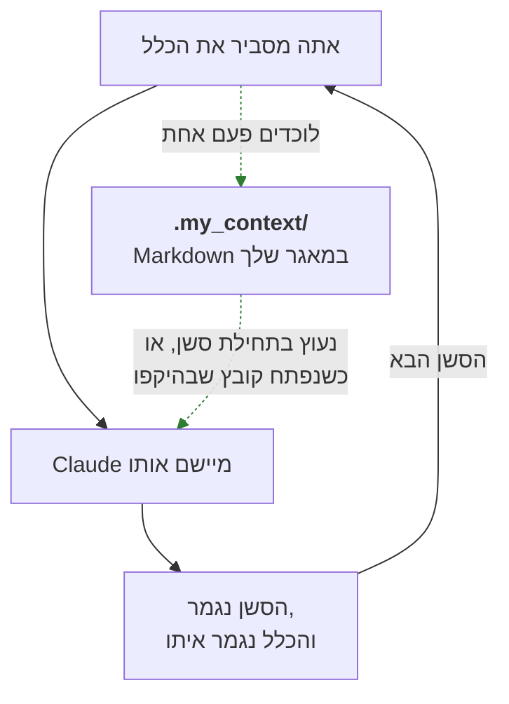
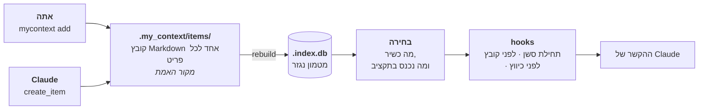
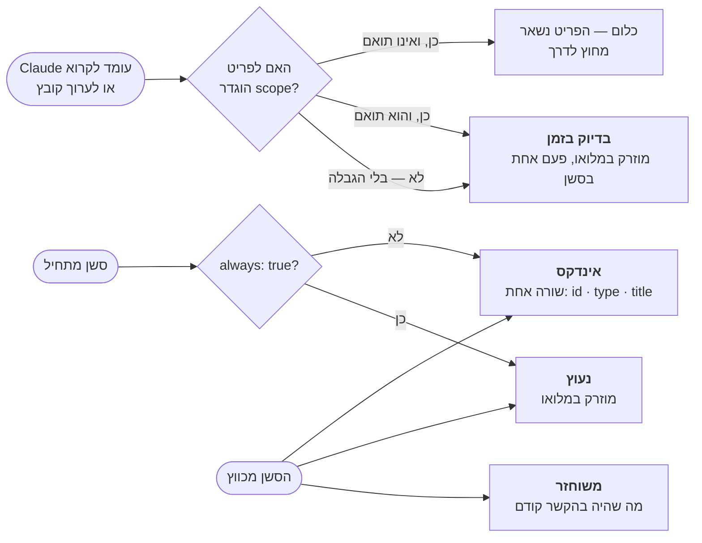
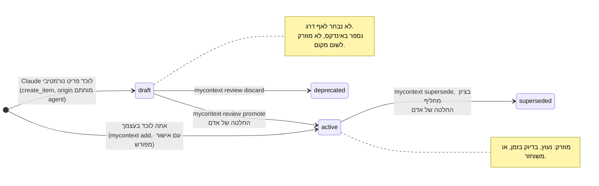

<!--
  Two conventions in this file, both about right-to-left rendering, both
  established by rendering this file through GitHub's own markdown API and
  reading the result in a browser rather than by reasoning about the source.

  1. Hebrew prose lives inside `<div dir="rtl">` blocks. Fenced code and Mermaid
     blocks are deliberately left OUTSIDE them: inside an RTL container the
     bidi algorithm reverses the runs in a box-drawing table, and every
     generated example here is one.
  2. Any Latin-script run that must read left-to-right on its own is wrapped in
     `<span dir="ltr">…</span>`. GitHub's sanitizer keeps the `dir` attribute,
     and an element carrying `dir` is a bidi isolate, so both the run and the
     punctuation beside it resolve correctly. Two cases need it. A code span
     whose first or last character is not alphanumeric: without the wrapper
     `<id>` renders with its angle brackets mirrored and `--json` renders as
     `json--`. And any run of two or more Latin terms separated by commas or
     slashes: without the wrapper each term becomes its own island, the run
     reads back to front, and every comma attaches to the wrong side. A code
     span whose two edge characters are both alphanumeric needs nothing.

  An earlier revision used U+200E LEFT-TO-RIGHT MARK beside code spans instead.
  It renders a single span correctly but cannot hold a multi-term run together,
  and it is invisible in a diff, so it was replaced wholesale.

  Section structure and the example markers must stay identical to README.md;
  `npm test` fails otherwise. Do not write a literal comment terminator inside
  this block: an earlier revision quoted one, which closed the comment early and
  leaked three lines of these notes onto the rendered page above the title.
-->

# my_context

<div dir="rtl">

**תוסף ל-Claude Code שזוכר את הכללים של הפרויקט שלך, כדי שתפסיק לחזור עליהם.**

אתה מסביר ל-Claude איך הפרויקט הזה עובד. הסשן הבא מעולם לא שמע על זה. my_context לוכד
את הכללים האלה כקובצי Markdown בתוך המאגר שלך, ומחזיר את הרלוונטיים שבהם אל Claude
מעצמו — נעוצים בתחילת הסשן, או ברגע שהוא עומד לפתוח קובץ שהם חלים עליו.

</div>


<div dir="rtl">

Node 24 ומעלה, בלי תלויות זמן ריצה ובלי שלב בנייה — קובצי המקור של TypeScript מורצים
ישירות. מופץ תחת [רישיון MIT](../LICENSE). ממהרים? [התקנה](#התקנה).

**אם מילה או <span dir="ltr">`--flag`</span> כאן אינם מובנים מאליהם, יש לאן לקפוץ.** כל
מונח שהמסמך הזה נותן לו משמעות מסוימת מוגדר ב[מילון המונחים](#9-מילון-מונחים). כל אפשרות
של שורת הפקודה יושבת בטבלה אחת: [כל הדגלים, במקום אחד](#כל-הדגלים-במקום-אחד). המונחים
מוסברים גם בשפה פשוטה במקום הראשון שבו הם מופיעים, כך שקריאה רצופה מההתחלה לסוף אינה
מחייבת אף אחת מהשתיים.

זו הגרסה העברית של [README.md](../README.md). המסמך האנגלי הוא המקור. מבנה הפרקים ובלוקי
הדוגמאות של שני הקבצים נשמרים זהים, אבל שום בדיקה אינה יכולה לקבוע שהתרגום עדכני. פסקה
כאן יכולה להישאר מאחור אחרי שינוי באנגלית, ובמקרה של סתירה — האנגלית קובעת.

## תוכן העניינים

1. [הבעיה](#1-הבעיה)
2. [הרעיון](#2-הרעיון)
3. [איך זה עובד, בשלושה צעדים](#3-איך-זה-עובד-בשלושה-צעדים)
4. [מתי זה חוזר, ומה](#4-מתי-זה-חוזר-ומה)
5. [שימוש](#5-שימוש) — [התקנה](#התקנה), [פקודות סלאש](#מה-שאתה-מקליד-פקודות-הסלאש), [שורת הפקודה](#מה-שאתה-מריץ-שורת-הפקודה), [כלי MCP](#מה-שהמודל-קורא-לו-כלי-ה-mcp), [כל הדגלים](#כל-הדגלים-במקום-אחד)
6. [תצורה](#6-תצורה)
7. [גבול האמון](#7-גבול-האמון)
8. [עדיין לא זמין](#8-עדיין-לא-זמין)
9. [מילון מונחים](#9-מילון-מונחים) — כל מונח שהמסמך הזה נותן לו משמעות מסוימת

## 1. הבעיה

אתה עובד על תהליך תשלום. אתה אומר ל-Claude: *מחירים הם מספר שלם של סנטים, אף פעם לא
דולרים בנקודה צפה — שגיאת העיגול בכל המרה היא הסיבה שהסכום הכולל לא התאים לשורות הפריטים
ברבעון שעבר.* Claude מסכים, מתקן את הקוד, והסשן נגמר.

יומיים אחר כך אתה פותח סשן חדש ומבקש תכונת הנחה. Claude כותב `price * 0.9`, ושגיאת
העיגול חזרה.

שום דבר לא התקלקל. הזיכרון של סשן נגמר כשהסשן נגמר. כל מה שהסברת — הנימוקים, התיקונים,
ה"לא, לא ככה" — הלך איתו.

### למה הדבקה מחדש לא פותרת את זה

הפתרון המתבקש הוא להדביק את הכללים שוב בתחילת כל סשן. הוא נכשל בשלוש דרכים בבת אחת.

- **אתה שוכח.** לא תמיד — רק בסשן שבו זה היה חשוב.
- **זה נודד.** כשמדביקים מהזיכרון, הכלל יוצא קצת אחרת בכל פעם. "סנטים שלמים" הופך
  ל"להימנע מנקודה צפה", שזו עצה ולא כלל, והסשן הבא מפרש אותו רופף יותר מקודמו.
- **זה עולה בכל סשן.** הכללים שלך נקראים ומחויבים מחדש בכל פעם. כשיש לך תריסר מהם, רוב
  מה שאתה מדביק אינו נוגע כלל לקובץ שאתה עומד לגעת בו.

### למה `CLAUDE.md` לבדו לא מספיק

`CLAUDE.md` הוא שיפור אמיתי לעומת הדבקה: Claude Code טוען אותו אוטומטית, כך שלפחות
הכללים מגיעים בלי שתעשה דבר. יש לו ארבע מגבלות שצצות ברגע שפרויקט גדול מקטן.

- **הוא סטטי.** הוא אומר את אותו הדבר בכל סשן, לא משנה במה אתה עוסק.
- **הוא חסר היקף.** אין דרך לומר "זה חל רק על קוד חיוב". כל כלל חל על כל קובץ באותה מידה,
  ובפועל זה אומר שכל כלל הוא רעש רקע לרוב העבודה.
- **הוא לא מבדיל.** "השתמש בהזחה של שני רווחים" יושב שם ליד "לעולם אל תכתוב כתובת דוא"ל
  של לקוח ליומן". שום דבר לא מסמן שהאחד הוא העדפה והשני חשיפה משפטית.
- **הוא גדל עד שרק מרפרפים עליו.** כל כלל שאתה מוסיף מאריך את הקובץ, וקובץ ארוך מתחרה
  בעצמו על תשומת הלב. שום דבר בו לא יוצא לגמלאות, מפני ששום דבר בו לא מתעד מתי הוא היה
  רלוונטי בפעם האחרונה.

### המחיר שאתה באמת מרגיש

זה לא באמת עניין של טוקנים. זה שאתה נותן את אותו התיקון שוב ושוב והוא אף פעם לא נדבק.
אחרי הפעם השלישית אתה מפסיק לסמוך על העבודה ומתחיל לבדוק אותה. הזמן נשרף על הסבר חוזר של
החלטות שכבר קיבלת, במקום על קבלת חדשות.

my_context סוגר את הלולאה הזאת: אתה לוכד כלל פעם אחת, והחלק הרלוונטי ממה שלכדת חוזר
מעצמו, כשהוא חל.

</div>



<div dir="rtl">

החצים המלאים הם הלולאה שאתה נמצא בה היום. המקווקווים הם מה ש-my_context מוסיף: לכידה
אחת, ומסלול חזרה שלא תלוי בזה שתזכור.

## 2. הרעיון

my_context מחלק את מה שפרויקט יודע לשני סוגים, ומתייחס אליהם אחרת.

**ידע נורמטיבי** הוא מה שחייב להתקיים. אילוצים, אינווריאנטות, כללים, דרישות, תקנים,
תבניות, מונחים, הוראות, לא-מטרות ושאלות פתוחות. *מחירים הם סנטים שלמים.* *לעולם אל
תכתוב כתובת דוא"ל של לקוח ליומן.* *ה-pool של החיבורים מוגבל ל-20.* אלה עונים על השאלה
**"מה אסור לי לפספס כאן?"**

**נימוקים** (rationale) הם הסיבה שהפרויקט הוא כפי שהוא. החלטות, מסמכי ADR, לקחים, פשרות,
הנחות, מקרי קצה, סיכונים. *בחרנו ב-Stripe על פני Adyen כי תזמון הסליקה התאים ללוח
התשלומים שלנו.* *סופות ניסיונות חוזרים צריכות ריווח אקראי — למדנו את זה בדרך הקשה
במרץ.* אלה עונים על **"למה זה ככה?"**

שני הסוגים ראויים לשמירה. רק הראשון שולט.

שלוש מילים במשפט האחרון משמשות במסמך הזה במובן מדויק. כדאי לקבע אותן לפני שבונים עליהן.

- **הזרקה** היא my_context ששם טקסט בהקשר של סשן Claude Code מעצמו, בלי שאף אחד ביקש. זה
  כל המנגנון: לא חיפוש שאתה מריץ, אלא טקסט שכבר נמצא שם כשהמודל מתחיל לקרוא.
- פריט **שולט** כשהוא כשיר להזרקה וגם מנוסח כהוראה — משהו שהמודל אמור לציית לו, ולא רק
  לדעת עליו.
- **דרג** היא המילה לחלוקה בין נורמטיבי לנימוקים. כל קטגוריה נושאת דרג אחד —
  <span dir="ltr">`constraint`, `decision`, `rule`, `lesson`</span> והשאר — ואפשר לשנות
  איזה ([פרק 6](#6-תצורה)). לאותה מילה יש כאן שימוש שני, שאינו קשור:
  [פרק 4](#4-מתי-זה-חוזר-ומה) קורא לארבעת מסלולי האספקה שלו *דרגי הזרקה*. במקומות שבהם
  ההבדל חשוב, המשפט אומר במה מדובר.

אוסף הפריטים של הפרויקט — כל מה שנמצא תחת <span dir="ltr">`.my_context/items/`</span>,
בכל דרג ובכל סטטוס — הוא ה**קורפוס** שלו.

</div>

<!-- example: list --summary -->
```text
┌───────────────┬───────┐
│ type          │ items │
├───────────────┼───────┤
│ constraint    │ 1     │
│ decision      │ 2     │
│ invariant     │ 1     │
│ lesson        │ 1     │
│ open_question │ 1     │
│ requirement   │ 1     │
│ rule          │ 2     │
│ standard      │ 1     │
└───────────────┴───────┘

10 item(s)
```
<!-- /example -->

<div dir="rtl">

זהו פרויקט קטן לדוגמה — Bookstore API בדיוני — שמשמש לאורך כל המסמך הזה. שבעה מעשרת
הפריטים שלו נורמטיביים ושלושה הם נימוקים. `mycontext help categories` מדפיס את הרשימה
המלאה של הסוגים ואת הדרג שכל אחד שייך אליו.

### למה החלוקה נושאת משקל, ולא רק מתייקת

קל לקרוא את זה כטקסונומיה: דרך מסודרת למיין הערות. זה לא. החלוקה קובעת **איזה טקסט רשאי
לשנות בשקט את התנהגות הסוכן.**

טקסט נורמטיבי מוזרק להקשר של Claude במלואו, בלי שביקשו, והוא כתוב בציווי. זו בדיוק
הנקודה: כלל שצריך לבקש אותו הוא כלל שנשכח. אבל טקסט בעל טווח כזה הוא טקסט שמכוון, ולכן
הוא חייב להיות טקסט שמישהו אישר.

נימוקים לעולם אינם נכנסים לסשן בדרך הזאת. בתחילת סשן הם תורמים ספירה — "2 decision ·
1 lesson" — ולא יותר. הם מאונדקסים, ניתנים לחיפוש ונשלפים לפי בקשה, אבל הם אינם מגיעים
בלי הזמנה ואינם מנסחים את עצמם כפקודה.

הפרש הטווח הזה הוא הסיבה ששני הדרגים כפופים לכללים שונים לגבי מי רשאי להוסיף להם.
כש-Claude לוכד פריט נורמטיבי, הוא נוחת כ**טיוטה** ואינו שולט בכלום עד שאדם מקדם אותו.
כש-Claude לוכד פריט נימוק, הוא פשוט נרשם. ההבדל הוא בעלות הטעות: לטעות לגבי *למה* עולה
לך בהסבר מטעה, ולטעות לגבי *מה חייב להתקיים* עולה לך בקוד שגוי, שנכתב בביטחון, בידי משהו
שסמכת עליו שהוא מכיר את הכלל. גבול האישור, ומגבלותיו, מתוארים במלואם
ב[פרק 7](#7-גבול-האמון).

## 3. איך זה עובד, בשלושה צעדים

</div>



<div dir="rtl">

### צעד 1 — אתה לוכד את זה

אתה מנסח את הכלל פעם אחת, בשורת הפקודה או בבקשה מ-Claude לרשום אותו.

</div>

<!-- example: add constraint "Uploads capped at 10 MB" --body "The API gateway rejects a larger body before it reaches us, so accepting one only produces a timeout the customer cannot explain." --scope "src/api/**" --tags uploads --yes -->
```text
about to create constraint "Uploads capped at 10 MB" — active, and governing this project at once.
my_context: created CONST-uploads-capped-at-10-mb (active) at items/constraint/CONST-uploads-capped-at-10-mb.md.
```
<!-- /example -->

<div dir="rtl">

כל מה שבא אחרי הכותרת הוא **אפשרות** — צמד <span dir="ltr">`--name value`</span> שקובע
שדה אחד בפריט. ארבעה דברים בפקודה הזאת חשובים.

- <span dir="ltr">`--body "…"`</span> הוא הטקסט של הפריט: הפסקה ש-Claude באמת יקבל.
  הכותרת אומרת מה הכלל, והגוף אומר למה. ה"למה" הוא מה שמונע מכלל להיות מיושם מכנית במקרה
  שהוא מעולם לא עסק בו.
- <span dir="ltr">`--scope "src/api/**"`</span> הוא מה שהופך את הכלל לממוקד במקום סביבתי.
  זהו **glob של scope** — תבנית של נתיב קובץ, שבה <span dir="ltr">`*`</span> תואם בתוך
  רמת תיקייה אחת ו-<span dir="ltr">`**`</span> תואם על פני כמה רמות שצריך. האילוץ הזה
  נוגע לשכבת ה-API, ולכן הוא יחזור כשנוגעים בקוד של ה-API ויישאר מחוץ לדרך בכל מצב אחר.
  כלל בלי scope נשמר, מאונדקס וניתן לחיפוש, אבל לעולם אינו מוזרק מעצמו — ראו
  [פרק 4](#4-מתי-זה-חוזר-ומה).
- <span dir="ltr">`--tags uploads`</span> מצמיד תגיות חופשיות. הן אינן משנות דבר לגבי מתי
  פריט מוזרק; הן שם כדי שתוכל למצוא אותו אחר כך.
- <span dir="ltr">`--yes`</span> נדרש מפני שזו קטגוריה נורמטיבית. הפריט שולט בפרויקט מרגע
  שהוא קיים, והדגל הוא ההכרה המפורשת בכך. קטגוריות של נימוקים אינן דורשות אישור.

המזהה, `CONST-uploads-capped-at-10-mb`, נגזר מהכותרת. תראה אותו בהקשר של Claude,
ב-`mycontext list`, ובשם הקובץ.

הארבעה האלה הם חלק קטן ממה שהפקודות מקבלות. כל עשרים ושתיים האפשרויות של שורת הפקודה
מרוכזות ב[כל הדגלים, במקום אחד](#כל-הדגלים-במקום-אחד).

גם Claude יכול ללכוד פריטים, בעזרת הכלי `create_item`. פריט נורמטיבי שנלכד כך נוחת
כטיוטה וממתין לך.

### צעד 2 — זה נשמר כ-Markdown שאפשר לקרוא, להשוות ולסקור

כל פריט הוא קובץ אחד תחת
<span dir="ltr">`.my_context/items/<type>/<id>.md`</span>, במאגר שלך, ב-Markdown רגיל.

</div>

<!-- example: show CONST-postgres-pool-capped-at-20 -->
```text
---
id: CONST-postgres-pool-capped-at-20
type: constraint
title: Postgres pool capped at 20
status: active
severity: hard
always: true
scope: []
tags:
  - database
  - capacity
origin: agent
source_file: null
source_anchor: null
source_checksum: null
valid_from: 2026-08-14
valid_until: null
checksum: a81dff73a154242e
---

# Postgres pool capped at 20

The managed Postgres plan allows 120 connections. Five API instances at 20 each
leaves 20 for migrations, backups and the admin console. Raising the pool past 20
does not buy throughput; it buys `remaining connection slots are reserved` during
the next deploy.
```
<!-- /example -->

<div dir="rtl">

הגוש שבין שורות ה-<span dir="ltr">`---`</span> הוא ה-**frontmatter**: השדות ש-my_context
משתמש בהם כדי להחליט מתי הפריט הזה חוזר ועד כמה לסמוך עליו. כל מה שמתחתיו הוא הגוף, והגוף
הוא מה ש-Claude באמת קורא. שדה אחר שדה:

| שדה | מה המשמעות |
|---|---|
| `id` | שם הפריט, נגזר מהכותרת. המזהים הם הדרך שכל דבר אחר מפנה אליו |
| `type` | הקטגוריה שלו — <span dir="ltr">`constraint`, `decision`, `rule`</span> וכן הלאה. הקטגוריה קובעת את הדרג |
| `status` | <span dir="ltr">`draft`, `active`, `superseded`, `deprecated`</span> או `validated`. **רק `active` מוזרק אי פעם.** מה אומרים ארבעת האחרים כתוב ב[מילון המונחים](#9-מילון-מונחים) |
| `severity` | `hard` או `soft`. זה אינו משנה אם פריט מוזרק, רק את הסדר: פריטים קשיחים מתקבלים לתקציב ראשונים |
| `always` | הערך `true` נועץ את הפריט — מוזרק במלואו בתחילת כל סשן, בלי קשר לקבצים שאתה נוגע בהם |
| `scope` | globs של הקבצים שהפריט נצמד אליהם. ריק פירושו שהוא לעולם אינו מוזרק אוטומטית |
| `tags` | תגיות חופשיות למציאה מאוחרת. הן אינן משפיעות על ההזרקה |
| `origin` | מי כתב אותו: <span dir="ltr">`human`</span>, <span dir="ltr">`agent`</span> (כלומר Claude, דרך כלי MCP) או <span dir="ltr">`ingest`</span> (חולץ ממסמך). על השדה הזה בנוי [גבול האמון](#7-גבול-האמון), ואף כלי אינו מאפשר למי שקורא לו לקבוע אותו |
| <span dir="ltr">`source_file`, `source_anchor`, `source_checksum`</span> | מהיכן הפריט הגיע כשהוא חולץ ממסמך: הנתיב, הכותרת בתוכו, ו-hash של אותו טקסט כדי שאפשר יהיה לזהות סטייה |
| <span dir="ltr">`valid_from`, `valid_until`</span> | היום שבו התחיל לחול, והיום שבו חדל. `valid_until` ממולא כשפריט פורש |
| `checksum` | hash של תוכן הפריט עצמו, מוחתם מחדש בכל כתיבה. כך `mycontext doctor` מבחין בקובץ שנערך ביד |

חלק מהקטגוריות מוסיפות שדה משלהן. פריט `rule`, למשל, נושא
<span dir="ltr">`directive: do`</span> או <span dir="ltr">`directive: dont`</span>. הפקודה
<span dir="ltr">`mycontext examples <category>`</span> מדפיסה דגם תקין של כל סוג, כולל
השדות הנוספים.

הצורה הזאת מכוונת. הכללים של הפרויקט שלך חיים ב-git, ולכן הם מופיעים ב-diff של pull
request, נסקרים כמו קוד, ומסתעפים ומתמזגים יחד עם הקוד שהם מתארים. אפשר גם לקרוא אותם בלי
להריץ כלום: אין מסד נתונים שצריך לתשאל כדי לגלות במה הפרויקט שלך מאמין.

*יש* מסד נתונים — <span dir="ltr">`.my_context/.index.db`</span>, מסוג SQLite — אבל הוא
נגזר ולא נכתב ידנית. הוא קיים כדי שחיפוש בזמן סשן יהיה מהיר. מחקו אותו
ו-`mycontext rebuild` יבנה אותו מחדש מה-Markdown. ה-Markdown הוא מקור האמת; האינדקס הוא
מטמון.

השלכה אחת שכדאי להכיר מוקדם: אל תערוך קובץ פריט ביד. כל מסלול כתיבה מחשב מחדש את שדה
ה-`checksum` של הפריט. עריכה ידנית לא מחשבת אותו, ולכן ה-checksum הרשום מפסיק להתאים
לתוכן, ו-`mycontext doctor` מדווח על הפער מאותו רגע.

### צעד 3 — זה חוזר מעצמו

כשסשן מתחיל, Claude Code מריץ את ה-hooks של my_context — תוכניות קטנות שהוא מריץ ברגעים
קבועים, לפני שקורה משהו אחר. ה-hook של תחילת הסשן בוחר את הפריטים שחלים ומוסר אותם
ל-Claude כהקשר. זה מה שהמודל מקבל, מילה במילה:

</div>

```text
## my_context — these govern this project

### CONST-postgres-pool-capped-at-20 · constraint · Postgres pool capped at 20

The managed Postgres plan allows 120 connections. Five API instances at 20 each
leaves 20 for migrations, backups and the admin console. Raising the pool past 20
does not buy throughput; it buys `remaining connection slots are reserved` during
the next deploy.

## my_context index
- INV-prices-are-integer-cents · invariant · Prices are integer cents
- REQ-checkout-completes-in-two-steps · requirement · Checkout completes in two steps
- RULE-never-log-customer-email · rule · Never log customer email
- STD-api-errors-use-problem-json · standard · API errors use Problem JSON

2 decision · 1 lesson · 1 drafts pending review · 1 retired
→ use mycontext list or mycontext show <id> to browse these
```

<div dir="rtl">

פריט אחד הגיע במלואו, מפני שהוא נעוץ. ארבעה הגיעו כשורה אחת כל אחד, כך ש-Claude יודע
שהם קיימים ויכול לשלוף כל אחד מהם לפי מזהה. פריטי הנימוקים הגיעו כספירה. שום דבר לא
הושמט בלי שנאמר עליו.

hook שני רץ לפני ש-Claude קורא או עורך קובץ, ושם ה-scope משתלם. הפרק הבא עוסק בשאלה מי
מהם נורה מתי.

## 4. מתי זה חוזר, ומה

יש ארבעה **דרגי הזרקה** — ארבעה מסלולים שדרכם טקסט של פריט יכול להגיע לסשן. (זהו המובן
השני של "דרג"; הראשון, מ[פרק 2](#2-הרעיון), הוא החלוקה בין נורמטיבי לנימוקים שכל קטגוריה
נושאת.) לכל מסלול תנאי שמפעיל אותו וכלל לגבי מה שהוא מכיל. "בדיוק בזמן" מקוצר לעיתים
קרובות ל-**JIT**, כולל בקובץ התצורה, שבו התקציב של הדרג הזה נכתב `jit`.

| דרג | מתי נורה | מה מכיל |
|---|---|---|
| **נעוץ** | בתחילת כל סשן, ושוב אחרי כיווץ | כל פריט נורמטיבי פעיל שמסומן `always: true`, במלואו |
| **בדיוק בזמן** | Claude עומד לקרוא או לערוך קובץ שהפריט חל עליו — כזה שתואם ל-`scope` שלו, או כל קובץ שהוא אם לא הוגדר לו `scope` | אותו פריט, במלואו |
| **משוחזר** | אחרי כיווץ | הפריטים שהיו בהקשר לפניו |
| **אינדקס** | בתחילת כל סשן, ואחרי כיווץ | שורה אחת לכל פריט נורמטיבי שנותר, ועוד ספירות לשאר |

</div>



<div dir="rtl">

### נעוץ — המעטים שתמיד חלים

פריט עם `always: true` ב-frontmatter שלו מוזרק במלואו בתחילת כל סשן, לא משנה על מה אתה
עובד ובאילו קבצים אתה נוגע. בדוגמה שלמעלה זהו `CONST-postgres-pool-capped-at-20`: מגבלה
שמצרה כל קוד שפותח חיבור למסד נתונים, כך שלחכות לקובץ תואם זה לחכות יותר מדי.

נעיצה מיועדת לקבוצה הקטנה של כללים שהם באמת חסרי תנאי. לדרג הנעוץ יש תקציב משלו, וכל מה
שנעצת מתחרה עליו מול כל מה שנעצת קודם.

פריט מקבל `always: true` בקידום שלו, עם
<span dir="ltr">`mycontext review promote <id> --always`</span>, בזמן שהוא עדיין טיוטה.
זה המסלול היחיד כרגע, והפער הזה נאמר ב[פרק 6](#6-תצורה) במקום להיטאטא מתחת לשטיח.

### בדיוק בזמן — אלה שחלים על מה שאתה נוגע בו

`scope` הוא רשימה של תבניות קבצים. כש-Claude עומד לקרוא או לערוך קובץ, my_context מחפש
פריטים נורמטיביים פעילים שה-scope שלהם תואם לנתיב הזה, ומזריק אותם במלואם לפני שהכלי רץ.

ל-`INV-prices-are-integer-cents` יש <span dir="ltr">`scope: src/billing/**`</span>:

</div>

<!-- example: show INV-prices-are-integer-cents -->
```text
---
id: INV-prices-are-integer-cents
type: invariant
title: Prices are integer cents
status: active
severity: soft
always: false
scope:
  - src/billing/**
tags:
  - billing
  - money
origin: human
source_file: null
source_anchor: null
source_checksum: null
valid_from: 2026-08-14
valid_until: null
checksum: b9c3d588c634c8cc
---

# Prices are integer cents

Every price crossing a module boundary is an integer number of cents.
Floating-point dollars re-introduce a rounding error at each conversion, and the
total a customer approves at checkout must equal the sum of its line items exactly.
```
<!-- /example -->

<div dir="rtl">

כך שברגע ש-Claude פותח את `src/billing/prices.js`, זה מה שהוא מקבל ראשון:

</div>

```text
## my_context — these govern this project

### CONST-postgres-pool-capped-at-20 · constraint · Postgres pool capped at 20

The managed Postgres plan allows 120 connections. Five API instances at 20 each
leaves 20 for migrations, backups and the admin console. Raising the pool past 20
does not buy throughput; it buys `remaining connection slots are reserved` during
the next deploy.

### INV-prices-are-integer-cents · invariant · Prices are integer cents

Every price crossing a module boundary is an integer number of cents.
Floating-point dollars re-introduce a rounding error at each conversion, and the
total a customer approves at checkout must equal the sum of its line items exactly.

_scope: src/billing/**_

### REQ-checkout-completes-in-two-steps · requirement · Checkout completes in two steps

Cart to payment, payment to confirmation. A third step was measured against the
two-step flow in April and abandonment rose by four points, so a new field belongs
in one of the two existing steps or nowhere.

### RULE-never-log-customer-email · rule · Never log customer email

Log the customer id instead. Access logs are shipped to a third-party aggregator
that our data-processing agreement does not cover, so an email address in a log
line leaves the boundary the checkout flow promises the customer.

_scope: src/**_
```

<div dir="rtl">

ארבעה פריטים חלו. שניים מהם נוקבים בקובץ הזה: האינווריאנטה של החיוב, שה-scope שלה
<span dir="ltr">`src/billing/**`</span>, וכלל שה-scope שלו <span dir="ltr">`src/**`</span>.
לשניים האחרים — האילוץ על ה-pool והדרישה על התשלום — לא הוגדר `scope` כלל, ולכן דבר אינו
מגביל אותם והם חלים כאן בדיוק כפי שהם חלים בכל מקום. שימו לב שהאילוץ על ה-pool מגיע אף
שהוא גם נעוץ: הוא נמסר על ידי הדרג הראשון שמגיע אליו בסשן, ופעם אחת בלבד.

פתחו במקום זאת את `src/catalogue/search.js` והאינווריאנטה של החיוב תיפול, כי ה-scope שלה
אינו כולל את הקובץ הזה. שלושת האחרים עדיין יגיעו.

שלושה פרטים שמפתח ירצה לדעת:

- **בלי scope פירושו בלי הגבלה.** פריט בלי תבניות scope חל על כל קובץ, ולכן הדרג הזה מוסר
  אותו כבר בקובץ הראשון ש-Claude נוגע בו. כתיבת `scope` היא הדרך *לצמצם* פריט לספריות
  שהוא באמת עוסק בהן; להשאיר אותו ריק היא ברירת המחדל הכנה לכלל שאינו עוסק בקבצים
  מסוימים, והיא גם קצרה יותר להקלדה. העלות אמיתית וכדאי להכיר אותה: פריט בלי scope מתחרה
  על תקציב ה-`jit` בכל פעולת קובץ, ולכן קורפוס עם פריטים גדולים ורבים בלי scope יגלוש —
  בגלוי, ראו [התקציב](#התקציב-ומה-קורה-כשזה-לא-נכנס) — במקום לדחוק בשקט את הפריט שנקב
  בקובץ עצמו.
- **כל פריט מגיע פעם אחת בסשן.** my_context רושם מה כבר הזריק, כך שעריכה של עשרה קובצי
  חיוב אינה מספקת את אותה אינווריאנטה עשר פעמים.
- **בדרג הזה אין אינדקס.** הזרקה שנורתה מקובץ מכילה את הפריטים שחלו ותו לא. האינדקס
  הוא עלות לכל סשן, לא לכל קובץ.

### משוחזר — אחרי שחלון ההקשר מכווץ

סשן ארוך מוצה בסוף את חלון ההקשר, ו-Claude Code *מכווץ* אותו: מסכם את השיחה עד כה וממשיך
מהסיכום. הסיכום קצר בהרבה ממה שהוא מחליף, והכללים שהוזרקו קודם הם בדרך כלל בין מה שהוא
משמיט.

my_context מצלם תמונת מצב מיד לפני שזה קורה, ורושם אילו פריטים היו במשחק — גם אלה שהזריק
וגם אלה שהוזכרו לפי מזהה בתמליל. כשהסשן מתחדש אחרי הכיווץ, הפריטים האלה מוזרקים מחדש,
לצד הדרג הנעוץ והאינדקס.

שתי מגבלות שנאמרות בכנות. תמונת המצב מפותחת לפי מזהה הסשן שה-hooks מקבלים, ולכן פריטים
שטענת ידנית עם <span dir="ltr">`/mycontext:LoadMyContext`</span> אינם נרשמים ואינם
משוחזרים: למשטח הזה אין מזהה סשן אמין לרשום מולו. והשחזור מוגבל בתקציב משלו, כמו כל דרג
אחר.

### האינדקס — כדי ששום דבר לא יהיה בלתי נראה

את כל מה שהדרגים שלמעלה לא סיפקו במלואו, האינדקס מונה. שורה אחת לכל פריט נורמטיבי פעיל
שנותר: מזהה, סוג, כותרת. מספיק כדי ש-Claude יידע שהכלל קיים ויוכל לשלוף אותו לפי מזהה
כשיתברר שהוא חשוב, וזול מספיק כדי לכלול אותו בכל פעם.

פריטי נימוקים אינם מנויים אחד-אחד. הם נספרים לפי סוג — <span dir="ltr">`2 decision`,
`1 lesson`</span> — לצד מספר הטיוטות הממתינות לסקירה ומספר הפריטים שיצאו לגמלאות. פריט
שהקטגוריה שלו כובתה בתצורה נספר גם הוא, ומסומן ככזה, כך שכיבוי קטגוריה לעולם אינו מעלים
את פריטיה בלי סימן.

פריט שכבר סופק במלואו לא מקבל שורת אינדקס. ל-Claude כבר יש את הכלל כולו, והוצאת מקום
באינדקס על חזרה הייתה דוחפת החוצה משהו שבאמת לא נראה.

### התקציב, ומה קורה כשלא נכנסים בו

לכל דרג יש **תקציב** — מגבלת גודל, כדי שקורפוס שגדל לא ישתלט בשקט על חלון ההקשר. ברירות
המחדל:

| תקציב | ברירת מחדל | מה הוא מנהל |
|---|---|---|
| `pinned` | 1500 | הדרג הנעוץ בתחילת סשן |
| `jit` | 500 | הזרקה אחת שנורתה מקובץ |
| `restored` | 2000 | ההזרקה מחדש אחרי כיווץ |
| `index` | 150 | רשימת האינדקס |

היחידה היא טוקנים משוערים, ו"משוערים" נאמר כפשוטו: זו ספירת התווים חלקי ארבע. my_context
נשלח בלי תלויות זמן ריצה, ולכן בלי tokenizer. זהו קירוב שיכול לסטות לשני הכיוונים, לא
תקרה מובטחת.

פריטים מתקבלים מהקשה לרך: <span dir="ltr">`severity: hard`</span> לפני
<span dir="ltr">`severity: soft`</span>, שכבת הפרויקט לפני הגלובלית, ואז לפי מזהה כדי
שהתוצאה תהיה דטרמיניסטית. **שכבה** היא המקום שבו קובץ הפריט חי.
<span dir="ltr">`.my_context/`</span> בפרויקט שאתה עובד עליו היא שכבת ה*פרויקט*, ותיקיית
<span dir="ltr">`.my-context`</span> בתיקיית הבית שלך, אם קיימת כזאת, נקראת לצידה כשכבה
*גלובלית*. הפרויקט מנצח
בתיקו: פריט של הפרויקט מתקבל לפני פריט גלובלי שמתחרה על אותו מקום, ופריט של הפרויקט עם
אותו מזהה מסתיר את הגלובלי לגמרי.

פריט גדול מדי למקום שנותר מדולג במקום לסיים את המעבר, כך שפריט קטן יותר אחריו עדיין יכול
להתקבל. פריט שדולג כך עבר **spill** — זו המילה שבה משתמש הקוד, והפסקה שלמטה היא איך
ש-spill נראה מבחוץ.

**מה שלא נכנס נמנה, ולעולם לא נזרק בשקט** — האינווריאנטה של הפרויקט עצמו,
`INV-nothing-is-dropped-silently`. באופן מוחשי, פריט שדרג של טקסט מלא לא הצליח להכיל
מופיע פעמיים: בשמו בהערה בת שורה מתחת להזרקה,

</div>

```text
_1 item(s) omitted from full text for budget: CONST-postgres-pool-capped-at-20. Fetch with mycontext show <id>._
```

<div dir="rtl">

ושוב כשורה רגילה באינדקס, כי הוא לא סופק במלואו ולכן עדיין ראוי לאזכור.

יש מקום אחד שבו מזהה מסוים אינו ננקב בשם, וכדאי לומר אותו בפירוש: כשל*אינדקס עצמו* נגמר
התקציב, השורות שלא נכנסות מוחלפות בספירה.

</div>

```text
- … +2 more (fetch with mycontext show <id>)
```

<div dir="rtl">

הספירה לעולם אינה שגויה, ו-`mycontext list` מציג את הקורפוס כולו מהטרמינל — אבל בתוך
הסשן ההוא Claude רואה את המספר ולא את השמות. בכל מקום אחר, מה שהושמט ננקב בשם במקום שבו
הושמט.

## 5. שימוש

ל-my_context שני משטחים מעל קורפוס אחד. האחד בשבילך, השני בשביל המודל, והחלוקה מכוונת
ולא היסטורית.

**אתה** מקליד פקודות סלאש בתוך סשן של Claude Code, או מריץ את הפקודה `mycontext` בטרמינל.
**המודל** קורא לאחד-עשר כלי ה-MCP. שני המשטחים קוראים וכותבים לאותם קובצי Markdown תחת
<span dir="ltr">`.my_context/`</span>. פריט שלכדת בטרמינל נמצא באינדקס של המודל בפעם הבאה
שהוא מסתכל, ופריט שהמודל לכד מופיע ב-`mycontext list` מיד.

שניהם קיימים מפני שכל אחד מהם בלתי שמיש במצב של האחר. המודל אינו יכול לעצור באמצע משפט
ולפתוח טרמינל, ולכן הוא צריך כלים שאפשר לקרוא להם ישירות. אתה צריך משטח שעובד כששום מודל
אינו בחדר — בסקריפט, ב-CI, או כשאתה פשוט רוצה לקרוא במה הפרויקט מאמין. וכמה פעולות אמורות
להיות שלך בלבד: קידום טיוטה, הוצאה לגמלאות של פריט ששולט. עד כמה ההפרדה הזאת באמת מחזיקה
כתוב ב[פרק 7](#7-גבול-האמון), וכדאי לקרוא אותו לפני שסומכים עליה.

</div>


<div dir="rtl">

### התקנה

יש שני חצאים, והם מותקנים אחרת. הפקודה `mycontext` היא חבילת npm במאגר הזה. פקודות
הסלאש, ה-hooks ושרת ה-MCP הם **תוסף** של Claude Code, שמוצהר על ידי
<span dir="ltr">`.claude-plugin/plugin.json`</span> ומתגלה מתוך
<span dir="ltr">`commands/`, `hooks/hooks.json`</span> ו-<span dir="ltr">`.mcp.json`</span>
בשורש המאגר.

**הפקודה.** משכפול של המאגר הזה:

</div>

```bash
npm install
npm link          # provides the `mycontext` command

cd /path/to/your/project
mycontext init
```

<div dir="rtl">

`mycontext init` יוצר <span dir="ltr">`.my_context/`</span> בתיקייה הנוכחית, עם תיקיית
<span dir="ltr">`items/`</span>, קובץ `config.json` וקובץ
<span dir="ltr">`.gitignore`</span>. הכניסו אותו ל-git: הקורפוס אמור לנסוע יחד עם הקוד
שהוא מתאר. בלי `npm link`, אפשר להריץ כל פקודה גם ישירות:
<span dir="ltr">`node /path/to/my-context/src/cli/index.ts <args>`</span>.

**התוסף.** התקינו אותו פעם אחת, מתוך העותק המקומי שלכם של המאגר הזה:

</div>

```bash
cd /path/to/my-context
claude plugin marketplace add ./
claude plugin install mycontext@mycontext
```

<div dir="rtl">

המאגר הזה הוא בעצמו marketplace בן תוסף אחד
(<span dir="ltr">`.claude-plugin/marketplace.json`</span>), ולכן גם ה-marketplace וגם
התוסף נקראים `mycontext`. ההתקנה שורדת הפעלה מחדש. `claude plugin list` מציגה אותה, ואת
הביטול עושות שתי פקודות יחד:
<span dir="ltr">`claude plugin uninstall mycontext@mycontext`</span> ו-<span dir="ltr">`claude plugin marketplace remove mycontext`</span>.

כדי לנסות אותו לסשן אחד בלי להתקין כלום:

</div>

```bash
claude --plugin-dir /path/to/my-context
```

<div dir="rtl">

בכל מקרה, כדי לבדוק מה באמת נטען, שאלו את Claude Code עצמו:

</div>

```bash
claude plugin details mycontext@mycontext
```

<div dir="rtl">

הוא מדפיס את מצאי הרכיבים — 38 הפקודות והמיומנות `mycontext`, ארבעת ה-hooks
(<span dir="ltr">`SessionStart`, `PreToolUse`, `PreCompact`, `PostToolUse`</span>) ושרת
ה-MCP האחד. כך אתם מוודאים שהתוסף נטען, במקום להניח שכן. כל פקודה בפרק הזה נקבעה על ידי
הרצתה, לא מקריאת התיעוד.

### מה שאתה מקליד: פקודות הסלאש

פקודות סלאש נמצאות במרחב השם של התוסף, ולכן כל אחת מהן מתחילה
ב-<span dir="ltr">`/mycontext:`</span>. הן מקובצות לפי מה שאתה מנסה לעשות:

**לכידה.** פקודת <span dir="ltr">`add-<type>`</span> אחת לכל קטגוריה מופעלת. הנורמטיביות
לוכדות דרך הכלי `create_item` ונוחתות כ**טיוטות**:
<span dir="ltr">`/mycontext:add-constraint`, `/mycontext:add-invariant`,
`/mycontext:add-rule`, `/mycontext:add-requirement`, `/mycontext:add-standard`,
`/mycontext:add-pattern`, `/mycontext:add-glossary`, `/mycontext:add-instruction`,
`/mycontext:add-non-goal`, `/mycontext:add-open-question`</span>. אלה של הנימוקים נוחתות
פעילות, מפני שנימוקים לעולם אינם מוזרקים ולכן אינם יכולים לכוון שום דבר בשקט:
<span dir="ltr">`/mycontext:add-adr`, `/mycontext:add-decision`, `/mycontext:add-lesson`,
`/mycontext:add-tradeoff`, `/mycontext:add-assumption`, `/mycontext:add-edge-case`,
`/mycontext:add-risk`</span>.

</div>

```
/mycontext:add-constraint  The connection pool is capped at 20
/mycontext:add-decision    We chose Stripe because settlement timing matched payouts
```

<div dir="rtl">

**חיפוש.** <span dir="ltr">`/mycontext:search`</span> מקבלת מילים וקוראת לכלי
`query_items`. זה המקום להתחיל בו כשאינך יודע מזהה. פקודת
<span dir="ltr">`list-<type>`</span> אחת לכל קטגוריה מופעלת מדפיסה את הטבלה של אותה
קטגוריה: <span dir="ltr">`/mycontext:list-constraint`, `/mycontext:list-invariant`,
`/mycontext:list-rule`, `/mycontext:list-requirement`, `/mycontext:list-standard`,
`/mycontext:list-pattern`, `/mycontext:list-glossary`, `/mycontext:list-instruction`,
`/mycontext:list-non-goal`, `/mycontext:list-open-question`, `/mycontext:list-adr`,
`/mycontext:list-decision`, `/mycontext:list-lesson`, `/mycontext:list-tradeoff`,
`/mycontext:list-assumption`, `/mycontext:list-edge-case`,
`/mycontext:list-risk`</span>. כל אחת מקבלת את אותם דגלי פירוט כמו שורת הפקודה.

<span dir="ltr">`/mycontext:LoadMyContext`</span> היא היוצאת דופן: היא מזריקה את הפריטים
הנעוצים ואת האינדקס אל הסשן עכשיו, בלי לחכות לתחילת סשן. השתמשו בה כשניקיתם את ההקשר, או
אחרי כיווץ. פריטים שנטענו כך אינם נכנסים לתמונת המצב ואינם משוחזרים אוטומטית.

**סקירה.** <span dir="ltr">`/mycontext:review`</span> עוברת על תור הטיוטות ומדפיסה, לכל
אחת, על מה היא תשלוט. היא נעצרת שם במכוון: היא אומרת לך את הפקודה המדויקת —
<span dir="ltr">`mycontext review promote <id>`</span> או
<span dir="ltr">`mycontext review discard <id>`</span> — ואינה מריצה אותה בשבילך.

**אבחון.** <span dir="ltr">`/mycontext:status`</span> מדפיסה את אותו דוח כמו `status`
בשורת הפקודה, ועוד שתי שורות לכל היותר שאומרות מה דורש את תשומת לבך.

</div>

```
/mycontext:search           connection pool
/mycontext:list-decision    --full
/mycontext:review
/mycontext:status
/mycontext:LoadMyContext
```

<div dir="rtl">

יש <span dir="ltr">`add-<type>`</span> אחת ו-<span dir="ltr">`list-<type>`</span> אחת לכל
קטגוריה **מופעלת** — 34 היום, ועוד <span dir="ltr">`search`, `review`, `status`</span>. הן
נוצרות מאותה תצורה מיושבת ש-`mycontext help categories` מדפיס, על ידי
`npm run gen:commands`. בדיקה נכשלת אם הקבצים ששמורים ב-git והמחולל אינם מסכימים: קטגוריה
מכובה אינה יכולה לשמור פקודה שתסורב אחר כך.

כל 37 אלה נושאות <span dir="ltr">`disable-model-invocation: true`</span>, וזה בתוקף — הן
המשטח שלך, לא של המודל. <span dir="ltr">`/mycontext:LoadMyContext`</span> היא היוצאת דופן
היחידה, והיא הפקודה היחידה שרק קוראת.

**ל"בתוקף" יש כאן תפקיד, והנה למה.** עד לאחרונה זה לא היה כך. תשע-עשרה מ-38 הקבצים — 17
פקודות ה-<span dir="ltr">`list-<type>`</span> ועוד `review` ו-`status` — נשאו
<span dir="ltr">`argument-hint: [--full|--short|--summary] [--json]`</span>, שפותח flow
sequence של YAML ואז גורר עוד אחד. זה אינו YAML תקין. ההודעה של Claude Code למקרה הזה
מפורשת — *at runtime this command loads with empty metadata (all frontmatter fields
silently dropped)* — כך שב-19 האלה `disable-model-invocation` היה כתוב ולא בתוקף, והמודל
יכול היה להפעיל פקודות שאמרו שהוא לא יכול.

כל רמז מצוטט עכשיו, כל 37 הקבצים נוצרו מחדש,
ו-<span dir="ltr">`claude plugin validate .`</span> עובר עם אפס שגיאות מול המאגר הזה.
הבדיקה ב-`test/plugin/commands.test.ts` נהגה לבדוק את השורות האלה בביטוי רגולרי, ולכן היא
עברה לאורך כל הדרך. היום היא מנתחת את ה-frontmatter ומוודאת
ש-`disable-model-invocation` חוזר כערך הבוליאני `true`.

**אי-סימטריה אחת, שנאמרת במקום להיטשטש: ל-<span dir="ltr">`/mycontext:search`</span> אין
מקבילה בשורת הפקודה.** אין פקודת `search` בשורת הפקודה כלל. פקודת הסלאש קוראת ישירות לכלי
ה-MCP `query_items`, והמקבילות הקרובות ביותר בטרמינל הן `mycontext list` לקטגוריה
ו-`mycontext query` ל-SQL מעל האינדקס. שני המשטחים עדיין אינם מכסים את אותו שטח.

### מה שאתה מריץ: שורת הפקודה

עשרים ואחת פקודות. `mycontext help` מדפיס את אותה רשימה מהתוכנית עצמה,
ו-<span dir="ltr">`mycontext help <topic>`</span> מסביר אחד
מ-<span dir="ltr">`categories`, `scope`, `capture`, `workflow`</span>.

**לכידה ושינוי.**

| פקודה | מה היא עושה |
|---|---|
| `mycontext init` | יוצרת <span dir="ltr">`.my_context/`</span> בתיקייה הנוכחית |
| <span dir="ltr">`mycontext add <category> <title>`</span> | יוצרת פריט — <span dir="ltr">`--body`, `--scope`, `--tags`, `--severity`, `--yes`</span> |
| <span dir="ltr">`mycontext review promote <id>`</span> | הופכת טיוטה לפריט פעיל ששולט |
| <span dir="ltr">`mycontext review discard <id>`</span> | מוציאה טיוטה לגמלאות |
| <span dir="ltr">`mycontext supersede <id> --by <id>`</span> | מוציאה לגמלאות פריט ששולט לטובת מחליף |
| `mycontext repair` | מחתימה מחדש את ה-checksum של פריט שהקובץ שלו כבר לא תואם לו |
| `mycontext rebuild` | בונה מחדש את <span dir="ltr">`.index.db`</span> מה-Markdown |

`add` מקבלת <span dir="ltr">`--body`, `--scope`, `--tags`</span>
ו-<span dir="ltr">`--severity hard|soft`</span>, ומסרבת לכל אפשרות שאינה מוכרת לה במקום
לקפל אותה לתוך הכותרת.

<span dir="ltr">`--scope`</span> ו-<span dir="ltr">`--tags`</span> הם רשימות: מופרדים
בפסיקים, ניתנים לחזרה, ושתי הצורות מתחברות. כך
ש-<span dir="ltr">`--scope "src/api/**,src/db/**"`</span>
ו-<span dir="ltr">`--scope src/api/** --scope src/db/**`</span> פירושם אותו דבר. דגל בעל
ערך יחיד שניתן פעמיים (<span dir="ltr">`--body x --body y`</span>) מסורב במקום להיפתר
לאחד מהם, בכל פקודה שמקבלת כזה.

תצפיות ויחסים אינם ניתנים לביטוי כדגלים; לשם כך יש את הכלים `create_item` ו-`link_items`.
<span dir="ltr">`--yes`</span> נדרש לקטגוריה **נורמטיבית**, מפני שהפריט הזה שולט בפרויקט
מרגע שהוא קיים. קטגוריות של נימוקים אינן דורשות אישור.

**חיפוש וקריאה.**

| פקודה | מה היא עושה |
|---|---|
| <span dir="ltr">`mycontext list [category]`</span> | הקורפוס כטבלה |
| <span dir="ltr">`mycontext show <id>`</span> | פריט אחד במלואו, בדיוק כפי שהוא על הדיסק |
| <span dir="ltr">`mycontext query "SELECT …"`</span> | SQL לקריאה בלבד מעל האינדקס |
| <span dir="ltr">`mycontext examples <category>`</span> | פריט לדוגמה שלם ותקין מאותו סוג |
| <span dir="ltr">`mycontext help [topic]`</span> | הדרכה: <span dir="ltr">categories, scope, capture, workflow</span> |

</div>

<!-- example: list -->
```text
┌─────────────────────────────────────┬───────────────┬────────────┐
│ id                                  │ type          │ status     │
├─────────────────────────────────────┼───────────────┼────────────┤
│ CONST-postgres-pool-capped-at-20    │ constraint    │ active     │
│ DEC-search-with-postgres-full-text  │ decision      │ active     │
│ DEC-use-stripe-for-payments         │ decision      │ active     │
│ INV-prices-are-integer-cents        │ invariant     │ active     │
│ LESSON-retry-storms-need-jitter     │ lesson        │ active     │
│ OPENQ-which-search-engine           │ open_question │ superseded │
│ REQ-checkout-completes-in-two-steps │ requirement   │ active     │
│ RULE-cache-keys-include-tenant-id   │ rule          │ draft      │
│ RULE-never-log-customer-email       │ rule          │ active     │
│ STD-api-errors-use-problem-json     │ standard      │ active     │
└─────────────────────────────────────┴───────────────┴────────────┘
```
<!-- /example -->

<div dir="rtl">

אין עמודת `title`, וזה בכוונה. מזהה הוא slug של הכותרת —
`CONST-postgres-pool-capped-at-20` עבור "Postgres pool capped at 20" — כך ששתי העמודות
הרחבות ביותר בטבלה הזאת אמרו אותו דבר פעמיים. ביחד הן הביאו את דוח ברירת המחדל ל-192
תווים בקורפוס של המאגר הזה עצמו, מול פריסה ברוחב 100; בלי הכותרת הוא 97.

הכותרת עדיין מופיעה במלואה ב-`mycontext show`, ב-<span dir="ltr">`list --full`</span>
וב-<span dir="ltr">`list --json`</span>. אותה הסרה נעשתה ב-`mycontext decay` (מ-170 תווים
ל-97) ובטבלת הפריטים הקרים שבתוך <span dir="ltr">`status --full`</span>, משיקול הרוחב
עצמו. <span dir="ltr">`mycontext review list`</span> שומרת על העמודה: שאר העמודות שלה הן
ערכי מנייה צרים, כך שעל המזהים שתור אמיתי מחזיק היא נכנסת לתקציב עם הכותרת במקומה.
ה-<span dir="ltr">`--full`</span> שלה אינה טבלה כלל — כמו
<span dir="ltr">`list --full`</span> היא גוש לכל טיוטה, וזה מה שמשאיר אותה בתוך הפריסה גם
במזהה הארוך ביותר שהפרויקט הזה יכול לייצר.

<span dir="ltr">`mycontext show <id>`</span> מדפיס את הקובץ עצמו, כולל ה-frontmatter —
אותו פלט שמופיע ב[פרק 3](#3-איך-זה-עובד-בשלושה-צעדים).
<span dir="ltr">`mycontext examples <category>`</span> מדפיס דוגמה מלאה של סוג שלא השתמשת
בו קודם, כדי שתראה את הצורה לפני שאתה כותב אחת:

</div>

<!-- example: examples rule -->
```text
---
id: RULE-never-log-request-bodies-on-auth-endpoints
type: rule
title: Never log request bodies on auth endpoints
status: active
severity: soft
always: false
scope:
  - src/api/auth/**
tags: []
origin: human
source_file: null
source_anchor: null
source_checksum: null
valid_from: <today>
valid_until: null
checksum: 0040bc230528c1af
directive: dont
---

# Never log request bodies on auth endpoints

Bodies carry passwords and reset tokens; logs are retained for 90 days.
```
<!-- /example -->

<div dir="rtl">

בשדה `valid_from` כתוב <span dir="ltr">`<today>`</span> מפני שהשדה הזה נחתם ביום שבו
הפקודה רצה. כל בלוק במסמך הזה נוצר מהרצה אמיתית של הפקודה שמעליו ונבדק מחדש על ידי חבילת
הבדיקות. תאריך אמיתי שהיה מודפס שם היה תאריך שגוי עבור כל מי שלא הריץ את הפקודה ביום שבו
הבלוק נוצר.

**סקירת התור.**

</div>

<!-- example: review list -->
```text
┌───────────────────────────────────┬──────┬────────┬────────┬────────┬────────────────────────────┐
│ id                                │ type │ origin │ always │ source │ title                      │
├───────────────────────────────────┼──────┼────────┼────────┼────────┼────────────────────────────┤
│ RULE-cache-keys-include-tenant-id │ rule │ agent  │ no     │ -      │ Cache keys include tenant  │
│                                   │      │        │        │        │ ID                         │
└───────────────────────────────────┴──────┴────────┴────────┴────────┴────────────────────────────┘

1 draft(s) pending. Promote with `mycontext review promote <id>`.
```
<!-- /example -->

<div dir="rtl">

<span dir="ltr">`mycontext review show <id>`</span> מדפיס טיוטה אחת במלואה.
<span dir="ltr">`mycontext review promote <id>`</span> הופך אותה לשולטת,
ו-<span dir="ltr">`--always`</span> נועץ אותה באותה הזדמנות — זה המסלול היחיד
ל-<span dir="ltr">`always: true`</span> (ראו [פרק 6](#6-תצורה)).
<span dir="ltr">`mycontext review discard <id>`</span> מוציא אותה לגמלאות במקום זאת.

**אבחון.**

| פקודה | מה היא עושה |
|---|---|
| `mycontext status` | ספירות, תור סקירה, התקדמות קליטה, דעיכה ובריאות |
| `mycontext doctor` | טריות האינדקס, יתומים, סטייה, globs מתים, הרשאות, מזהי סשן |
| `mycontext decay` | פריטים שלא הוזרקו לאחרונה |

</div>

<!-- example: status -->
```text
my_context 0.1.0: 10 item(s), profile "standard"

by category
  ┌───────────────┬───────┐
  │ category      │ items │
  ├───────────────┼───────┤
  │ constraint    │ 1     │
  │ decision      │ 2     │
  │ invariant     │ 1     │
  │ lesson        │ 1     │
  │ open_question │ 1     │
  │ requirement   │ 1     │
  │ rule          │ 2     │
  │ standard      │ 1     │
  └───────────────┴───────┘

by status
  ┌────────────┬───────┐
  │ status     │ items │
  ├────────────┼───────┤
  │ active     │ 8     │
  │ draft      │ 1     │
  │ superseded │ 1     │
  └────────────┴───────┘

by origin
  ┌────────┬───────┐
  │ origin │ items │
  ├────────┼───────┤
  │ agent  │ 2     │
  │ human  │ 8     │
  └────────┴───────┘

review queue: 1 draft(s) pending review — walk it with `mycontext review`.

usage: no sessions recorded yet — decay reporting starts once items begin to be injected.
  2 active normative item(s) carry no scope, so they apply to every file and compete for the jit
  budget on every file operation.

health: 0 error(s), 0 warning(s), 0 note(s) — details from `mycontext doctor`.
```
<!-- /example -->

<div dir="rtl">

`mycontext doctor` היא הפקודה להריץ כשמשהו נראה לא בסדר. על קורפוס בריא זו שורה אחת:

</div>

<!-- example: doctor -->
```text
my_context doctor: 0 error(s), 0 warning(s), 0 note(s) across 0 finding(s).
```
<!-- /example -->

<div dir="rtl">

`mycontext decay` עונה על "מה לכדתי ומעולם לא השתמשתי בו". הדוח שלה נפתח באזהרה, מפני שקל
לקרוא את התשובה לא נכון: היומן רושם *הזרקה*, לא קריאה או הישענות, ולכן פריט חדש לגמרי
ופריט נטוש נראים כאן זהים.

</div>

<!-- example: decay --summary -->
```text
my_context decay — items not injected in the last 20 session(s). The ledger holds 0 session(s).
  "cold" means: not auto-injected in the last window of sessions. It does NOT mean unused — the
  ledger records injection, not reading or reliance, so a new item, and any item consulted via
  `show`, MCP `get_item`, or the Markdown file directly, look exactly like an abandoned one here.
  Do not supersede or deprecate anything on this report alone — verify real usage first.
  (no sessions recorded yet — nothing here has been measured; "cold" currently means only "never
  injected")

cold 5, warm 0, of which 2 unrestricted. Rows with `mycontext decay` (default) or `--full`.
```
<!-- /example -->

<div dir="rtl">

האזהרה הזאת מודפסת בכל רמת פירוט, <span dir="ltr">`--summary`</span> בכלל זה: דוח קצר
יותר רשאי לוותר על שורות, לעולם לא על הסיבה שהמספר הראשי שלו עצמו עלול להטעות. היא נשברת
לרוחב הפריסה, כך שהיא נקראת כפסקה ולא כשורה אחת בת 284 תווים.

**קליטת מסמך.** הפיכת מפרט או PRD קיים לפריטים היא שיחה בת שני צעדים, מפני של-my_context
אין מודל משלו: הוא מוסר לך את הטקסט ומאמת את מה שחוזר.

| פקודה | מה היא עושה |
|---|---|
| <span dir="ltr">`mycontext ingest <path>`</span> | פולטת בקשת חילוץ עבור מקטע אחד של מסמך |
| <span dir="ltr">`mycontext ingest-apply <id> --anchor <a>`</span> | מחילה את המועמדים שחולצו כטיוטות |
| `mycontext ingest-status` | מונה מפגשי קליטה ואת התקדמותם |

`mycontext ingest docs/prd.md` מדפיס מקטע מהמסמך יחד עם הוראות וסכמת JSON. אתה (או המודל)
מחזירים מערך JSON של מועמדים אל
<span dir="ltr">`mycontext ingest-apply <session-id> --anchor <anchor> --stdin`</span>,
ובקשת המקטע הבא חוזרת אוטומטית.

שתי מילים במשפט הזה ייחודיות לפקודה הזאת. **עוגן** הוא הכותרת שמעליה יושב מקטע של המסמך,
באותיות קטנות ועם מקפים — <span dir="ltr">`## Rate limits`</span> הופך
ל-`rate-limits` — וכך שני צידי השיחה מסכימים על איזה חלק של המסמך מדובר. **מועמד** הוא
פריט מוצע שעדיין אינו קיים: חולץ, תואר ב-JSON, ואין לו דבר על הדיסק עד שמחילים אותו. כל
מועמד חייב לצטט את מקטע המקור שלו מילה במילה, פרפרזה נדחית, וכל מה שמוחל נוחת כ**טיוטה**.
המקבילה של המודל היא הכלי `ingest_document`, שעושה את שני הצעדים במקום אחד.

**הפיכת לקח לכללים.** אותה צורה, למקרים ולא למסמכים.

| פקודה | מה היא עושה |
|---|---|
| <span dir="ltr">`mycontext lesson "<text>"`</span> | רושמת לקח ומבקשת כללים מועמדים |
| <span dir="ltr">`mycontext lesson-stage <id>`</span> | מעמידה את המועמדים שחזרו לאישור |
| <span dir="ltr">`mycontext lesson-accept <id> <key>`</span> | מאשרת מועמד אחד ויוצרת את הכלל |
| <span dir="ltr">`mycontext lesson-discard <id> <key>`</span> | דוחה מועמד אחד לצמיתות |

`mycontext lesson` רושמת את הלקח (דרג הנימוקים — מאונדקס, לעולם לא מוזרק) ומדפיסה בקשת
גזירת כללים: המר את התיאור הזה של מה שקרה להנחיות על מה שחייב לקרות. המועמדים חוזרים דרך
<span dir="ltr">`mycontext lesson-stage <LESSON-id> --stdin`</span>, ושם הם ממתינים. שום
דבר אינו מוחל עד ש-`mycontext lesson-accept` נוקב באחד, ו-`mycontext lesson-discard` דוחה
אחד לתמיד. שימו לב ש-`lesson-accept` יוצרת כלל **פעיל** ישירות — היא ברשימה
שב[פרק 7](#7-גבול-האמון) מסיבה זו.

### רמות פירוט, ו-<span dir="ltr">`--json`</span>

כל פקודת דיווח — <span dir="ltr">`status`, `list`, `decay`, `review list`, `doctor`,
`ingest-status`</span> — מקבלת <span dir="ltr">`--full`</span>,
<span dir="ltr">`--short`</span> (ברירת המחדל) ו-<span dir="ltr">`--summary`</span>, וגם
<span dir="ltr">`--json`</span>.

<span dir="ltr">`--short`</span> וברירת המחדל הן טבלאות מיושרות בעמודות עם כותרות.
<span dir="ltr">`--full`</span> **אינה** טבלה רחבה יותר: היא מדפיסה גוש אחד לכל פריט, כל
שדה בשורה מתויגת משלו. שבע עמודות הכוללות מזהה בן 63 תווים וכותרת בת 92 תווים יצרו טבלה
ברוחב 280 תווים בקורפוס של המאגר הזה עצמו. הרמה שמראה הכי הרבה על פריט הייתה אפוא הרמה
היחידה ששום טרמינל לא יכול היה להציג, וטבלה שהייתה קוטעת את המזהה במקום זאת הייתה מוסרת
חצי מזהה שעדיין נראה שלם. שום דבר אינו נזרק ואינו נקטע באף רמה; מה שלא נכנס בשורה נשבר
לשורה הבאה.

הכול נפרס לרוחב 100 תווים. זהו קבוע, לא רוחב הטרמינל שלכם: פריסה שמסתגלת לרוחב הייתה
הופכת את גושי הדוגמאות במסמך הזה לעובדה על החלון שממנו הם נוצרו מחדש. אפשר לקבוע
`MYCONTEXT_WIDTH` כדי לפרוס לרוחב אחר.

כלל אחד גובר על התקציב: שום עמודה אינה מצטמצמת מתחת למחרוזת הרצופה הארוכה ביותר שבה, ולכן
מזהה, glob או נתיב לעולם אינם נשברים בין שורות ונשארים ניתנים להעתקה. לכן טבלה שהמחרוזות
שלה עצמן רחבות מהתקציב — קורפוס שבו המזהים לבדם חורגים ממנו — נשארת ברוחבה הטבעי במקום
להידחס לכיוון מספר שאינה יכולה להגיע אליו, משום שדחיסה כזאת עולה בשורות שלמות ועדיין
חורגת. כל הדוחות בקורפוס של המאגר הזה עצמו נכנסים עכשיו: הרחב מכולם, `list`, הוא 97
תווים.

<span dir="ltr">`--json`</span> הוא הייצוג הנאמן היחיד של הדוחות ההיררכיים (התקדמות לכל
עוגן במפגש קליטה, גוף של טיוטה), והוא נושא שגיאות טעינה של הקורפוס בתוך המסמך כך שהוא
נשאר ניתן לניתוח. אפשרות שאף אחת מהן אינה מכירה מסורבת ולא מתעלמים ממנה בשקט: כל השש
נבדקות מול רישום הפקודות ב-`test/cli/unknown-flag-refusal.test.ts`, ולא פקודה-פקודה.
`review promote` ו-`review discard` נבדקות מול מערכי הדגלים שלהן עצמן, כך
ש-<span dir="ltr">`--json`</span> שנועד לתור אינו עובר בשקט בתת-פקודה שכותבת.

<span dir="ltr">`--summary`</span> היא זו שכדאי להושיט אליה יד כשרוצים את הצורה ולא את
השורות. אותו דוח כמו למעלה, רמה אחת למטה:

</div>

<!-- example: status --summary -->
```text
my_context 0.1.0: 10 item(s), profile "standard"

review queue: 1 draft(s) pending review — walk it with `mycontext review`.

usage: no sessions recorded yet — decay reporting starts once items begin to be injected.
  2 active normative item(s) carry no scope, so they apply to every file and compete for the jit
  budget on every file operation.

health: 0 error(s), 0 warning(s), 0 note(s) — details from `mycontext doctor`.
```
<!-- /example -->

<div dir="rtl">

טבלאות משורטטות בתווי מסגרת היכן שהטרמינל תומך בהם, וב-ASCII פשוט היכן שלא. הזיהוי נוטה
לכיוון ASCII, כך שטרמינל Windows שאינו מזוהה מקבל את הציור הבטוח. הגדירו
`MYCONTEXT_ASCII=1` כדי לכפות אותו, או `MYCONTEXT_UNICODE=1` כדי לכפות את הכיוון השני.

`mycontext query` **אינה** אחת מהן. היא מקבלת <span dir="ltr">`--json`</span>
ו-<span dir="ltr">`--limit <n>`</span> בלבד, ומסרבת לכל דבר אחר: לתוצאת SQL אין רמות
פירוט, מפני שהעמודות שלה הן אלה שה-`SELECT` שלך נוקב בהן.
ה-<span dir="ltr">`--json`</span> שלה הוא מסמך —
<span dir="ltr">`{ rows, rowCount, truncated, limit, loadErrors }`</span> — ולא מערך חשוף.
התוצאות מוגבלות ל-1000 שורות כברירת מחדל, ו-`truncated` הוא איך שמכונה לומדת שהתשובה
נקטעה. שימו <span dir="ltr">`--`</span> לפני SQL שמתחיל בהערת
<span dir="ltr">`--`</span>.

### מה שהמודל קורא לו: כלי ה-MCP

אחד-עשר כלים, מוגשים מעל stdio על ידי `src/mcp/server.ts`. המודל מגיע אליהם בלי shell, וכל
כתיבת פריט שהוא מבצע דרכם מוחתמת ככתיבת סוכן. זה מה שהופך את כלל הטיוטה
ש[בפרק 7](#7-גבול-האמון) לאכיף בכלל במשטח הזה.

| כלי | למה המודל משתמש בו |
|---|---|
| `create_item` | לכידת פריט מוקלד חדש. אידמפוטנטי: קריאה שנייה מדווחת על הפריט הקיים במקום לשכפל אותו |
| `update_item` | עדכון כותרת, גוף, scope, תגיות, חומרה, `always`, שדות נוספים או סטטוס של פריט קיים, לפי מזהה |
| `supersede_item` | הוצאת פריט לגמלאות לטובת מחליף, תוך רישום שני כיווני היחס. הוא **מסרב** להוציא לגמלאות פריט נורמטיבי ששולט — זו החלטה של אדם |
| `link_items` | רישום יחס מוקלד בין שני פריטים, כמו `derived_from` או `constrains` |
| `get_item` | שליפת פריט אחד במלואו, כ-Markdown, כשהמזהה כבר ידוע |
| `query_items` | חיפוש וסינון לפי סוג, סטטוס, תגית, יחס, טקסט או נתיב קובץ. זה מה ש-<span dir="ltr">`/mycontext:search`</span> קוראת לו |
| `list_drafts` | מניית מה שממתין לסקירת אדם, החדש ביותר ראשון — לא כדי לקדם, מה שאין ביכולתו |
| `load_context` | הזרקת הפריטים הנעוצים והאינדקס עכשיו, בדיוק כמו תחילת סשן. זה מה ש-<span dir="ltr">`/mycontext:LoadMyContext`</span> קוראת לו |
| `mycontext_help` | קריאת הדרכה על נושא אחד: <span dir="ltr">categories, scope, capture, workflow</span> |
| `mycontext_examples` | הצגת פריט לדוגמה שלם מסוג נתון, להעתיק ממנו את הצורה |
| `ingest_document` | חילוץ פריטים נורמטיביים ממסמך, באותה צורה של שתי קריאות כמו פקודות הקליטה בשורת הפקודה |

רשימת הכלים ממוינת ויציבה ברמת הבתים בין קריאות, וזה מה שמאפשר ל-Claude Code להטמין את
הפרומפט שנושא אותה. כל כלי מצהיר על רשימת הארגומנטים המלאה שלו ומסרב לכל דבר אחר: ארגומנט
שכלי אינו יכול לפעול לפיו נענה בסירוב שמונה את מה שהכלי כן מקבל, ולעולם אינו מתקבל ונזרק.

`create_item` בפרט מסרב ל-`relations` בשמו. יחסים נוספים אחרי שהפריט קיים, עם
`link_items`, או עם `supersede_item` ליחס של הוצאה לגמלאות — יחס ש-`link_items` לא יכתוב,
מפני שהוא טוען טענה על מחזור החיים שאינו מבצע.

### כל הדגלים, במקום אחד

**דגל** (flag) — נקרא גם אפשרות או מתג — הוא <span dir="ltr">`--name`</span> שנכתב אחרי
פקודה. יש כאן שני סוגים. *מתג* הוא דלוק או כבוי ואינו מקבל דבר אחריו
(<span dir="ltr">`--yes`, `--json`</span>). *דגל ערך* בא בליווי הערך שיש לקבוע, ושני
האיותים <span dir="ltr">`--name value`</span> ו-<span dir="ltr">`--name=value`</span>
שקולים בכל מקום בשורת הפקודה הזאת.

עשרים ושניים אלה הם כולם. שום דבר כאן אינו חל על כל הפקודות: כל שורה אומרת בדיוק היכן
הדגל עובד. פקודה שקיבלה דגל שאינה מכירה או מסרבת לו או — בכמה פקודות — מתעלמת ממנו, ומי
מהשתיים [מפורט למטה](#שלושה-כללים-שחלים-על-כולם). כלי ה-MCP מקבלים ארגומנטים בשם ב-JSON
ולא דגלים; אלה טבלת הכלים [שלמעלה](#מה-שהמודל-קורא-לו-כלי-ה-mcp).

**בחירת כמות הפירוט שדוח מדפיס.**

| דגל | מה הוא עושה | היכן הוא עובד |
|---|---|---|
| <span dir="ltr">`--short`</span> | שורה אחת לכל פריט, בטבלה מיושרת בעמודות. **זו ברירת המחדל** — אין צורך להקליד אותה לעולם | <span dir="ltr">`list`, `status`, `decay`, `doctor`, `review list`, `ingest-status`</span> |
| <span dir="ltr">`--full`</span> | גוש אחד לכל פריט, כל שדה בשורה מתויגת משלו. לא טבלה רחבה יותר | אותן שש |
| <span dir="ltr">`--summary`</span> | הצורה בלי השורות: ספירות כותרת ואזהרות בלבד | אותן שש |
| <span dir="ltr">`--json`</span> | מסמך JSON אחד במקום טבלה, כולל שגיאות טעינה של הקורפוס. הייצוג הנאמן היחיד של דוח מקונן | אותן שש, ובנוסף <span dir="ltr">`mycontext query`</span> |
| <span dir="ltr">`--quiet`</span> | ב-<span dir="ltr">`mycontext doctor`</span> בלבד, איות ותיק יותר של <span dir="ltr">`--summary`</span>. אם תעבירו גם <span dir="ltr">`--quiet`</span> וגם רמת פירוט, <span dir="ltr">`--quiet`</span> מנצח ואף אחד לא אומר זאת | `doctor` |
| <span dir="ltr">`--sessions <n>`</span> | כמה סשנים אחרונים נחשבים "לאחרונה" בדוח הדעיכה. ברירת מחדל 20; חייב להיות מספר שלם גדול מאפס | `decay` |
| <span dir="ltr">`--all`</span> | להציג גם את הפריטים ה*חמימים* — אלה שכן הוזרקו בתוך החלון, ושהדוח משמיט אחרת. <span dir="ltr">`--full`</span> כבר כולל אותם | `decay` |
| <span dir="ltr">`--limit <n>`</span> | מספר השורות המרבי ששאילתת SQL מחזירה. ברירת מחדל 1000, מינימום 1; אין הגדרה של "בלי הגבלה". כשהתקרה נוגסת, הדוח אומר זאת | `query` |
| <span dir="ltr">`--type <category>`</span> | להציג רק טיוטות מקטגוריה אחת. שם שאין לו קטגוריה פשוט לא תואם דבר — זו אינה שגיאה | <span dir="ltr">`review list`</span> |

**קביעת שדה בפריט.**

| דגל | מה הוא עושה | היכן הוא עובד |
|---|---|---|
| <span dir="ltr">`--body "<text>"`</span> | הטקסט של הפריט — הפסקה ש-Claude מקבל | `add` |
| <span dir="ltr">`--scope "<globs>"`</span> | תבניות הקבצים שהפריט נצמד אליהן, מופרדות בפסיקים | <span dir="ltr">`add`, `review promote`, `lesson-accept`</span> |
| <span dir="ltr">`--tags "<labels>"`</span> | תגיות חופשיות, מופרדות בפסיקים. אינן משפיעות על ההזרקה | `add` |
| <span dir="ltr">`--severity hard\|soft`</span> | פריטי `hard` מתקבלים לתקציב לפני `soft`. כל מילה אחרת מסורבת | <span dir="ltr">`add`, `review promote`, `lesson-accept`</span> |
| <span dir="ltr">`--always`</span> | לנעוץ את הפריט: להזריק אותו במלואו בתחילת כל סשן, בלי קשר לקבצים. זמין רק כל עוד הפריט טיוטה | <span dir="ltr">`review promote`</span> |
| <span dir="ltr">`--title "<text>"`</span> | להחליף את כותרת המועמד המבוים בניסוח שלך לפני שהכלל נוצר | `lesson-accept` |
| <span dir="ltr">`--directive do\|dont`</span> | האם הכלל שנוצר מורה או אוסר | `lesson-accept` |
| <span dir="ltr">`--by <id>`</span> | נוקב במחליף שתופס את מקומו של הפריט הפורש. **חובה** — פרישה בלי יורש אינה מוצעת | `supersede` |
| <span dir="ltr">`--reason "<text>"`</span> | למה הפרישה קרתה. זה נרשם כתצפית `supersession` על ה**מחליף**, בנוסח <span dir="ltr">`Replaces <old id>: <your text>`</span> | `supersede` |

**אישור שינוי, והזנת נתונים פנימה.**

| דגל | מה הוא עושה | היכן הוא עובד |
|---|---|---|
| <span dir="ltr">`--yes`</span> | לאשר בלי שישאלו. כל אחת מהפקודות האלה אומרת מה היא עומדת לעשות ואז ממתינה לכן; זה עונה מראש, וזה מה שהופך את הפקודה לשמישה בסקריפט. זה אינו אמצעי אבטחה — ראו [פרק 7](#7-גבול-האמון) | <span dir="ltr">`add`, `review promote`, `review discard`, `supersede`, `repair`</span> |
| <span dir="ltr">`--anchor <a>`</span> | לאיזה חלק של המסמך הכוונה. ב-`ingest` הוא מבקש מחדש מקטע מסוים במקום את הבא בתור; ב-`ingest-apply` הוא **חובה**, ואומר מאיזה מקטע הגיעו המועמדים שאתם מחזירים | <span dir="ltr">`ingest`, `ingest-apply`</span> |
| <span dir="ltr">`--file <path>`</span> | לקרוא את ה-JSON מקובץ במקום מ-stdin | <span dir="ltr">`ingest-apply`, `lesson-stage`</span> |
| <span dir="ltr">`--stdin`</span> | לקרוא את ה-JSON מ-stdin — האיות להזרמה פנימה. `ingest-apply` דורשת אחד מבין <span dir="ltr">`--file`</span> ו-<span dir="ltr">`--stdin`</span> ומדפיסה שימוש אם לא ניתן אף אחד; `lesson-stage` קוראת מ-stdin בכל פעם ש-<span dir="ltr">`--file`</span> נעדר, כך שבפקודה הזאת <span dir="ltr">`--stdin`</span> מתעד כוונה ולא מפעיל דבר | <span dir="ltr">`ingest-apply`, `lesson-stage`</span> |

#### שלושה כללים שחלים על כולם

**חזרה על דגל או אוספת או מסרבת, ולעולם אינה שומרת אחד מהם בשקט.**
<span dir="ltr">`--scope`</span> ו-<span dir="ltr">`--tags`</span> הם רשימות, ולכן חזרה
פירושה "וגם": <span dir="ltr">`--scope "src/api/**,src/db/**"`</span>
ו-<span dir="ltr">`--scope src/api/** --scope src/db/**`</span> מייצרים בדיוק את אותו
פריט. כל דגל ערך אחר מחזיק ערך יחיד, ומסירתו פעמיים מסורבת מכול וכול במקום להיפתר:
<span dir="ltr">`--body x --body y`</span> נעצר בהודעה שנוקבת בשניהם. זו אינה קפדנות.
שמירת הראשון בשקט היא מה ששורת הפקודה הזאת עשתה פעם, וזה נתן scope שגוי לפריט אמיתי
בקורפוס של המאגר הזה עצמו לפני שמישהו שם לב.

**<span dir="ltr">`--yes=false`</span> פירושו לא.** מתג אינו רק צורתו החשופה.
<span dir="ltr">`--yes`, `--yes=true`, `--yes=yes`, `--yes=on`, `--yes=1`</span> כולם
מאשרים. <span dir="ltr">`--yes=false`, `--yes=no`, `--yes=off`, `--yes=0`</span> כולם
מסרבים, ומשאירים את הפקודה בדיוק במקום שבו הייתה בלי <span dir="ltr">`--yes`</span> כלל:
היא שואלת, או מסרבת אם אין טרמינל לשאול בו. כל דבר אחר, כמו
<span dir="ltr">`--yes=maybe`</span>, מסורב ולא מנוחש, והעברת איות אמת ואיות שקר של אותו
דגל מסורבת אף היא. כל זה חל על <span dir="ltr">`--json`, `--full`, `--all`</span> וכל מתג
אחר, לא רק על <span dir="ltr">`--yes`</span>.

**דגל שאינו מוכר מסורב — ברוב הפקודות.** <span dir="ltr">`mycontext status --ful`</span>
נעצר ונוקב בשגיאת ההקלדה במקום להדפיס את דוח ברירת המחדל ולצאת עם 0. הפקודות שבודקות הן
<span dir="ltr">`add`, `list`, `status`, `decay`, `doctor`, `review`</span> (כל תת-פקודה
מול המערך שלה), <span dir="ltr">`ingest-status`, `query`, `repair`, `supersede`</span>. גם
<span dir="ltr">`mycontext help`</span> מסרבת, אך בדרך אחרת: היא קוראת את מה שבא אחריה כשם
נושא, ו-<span dir="ltr">`--anything`</span> אינו אחד מארבעת הנושאים שלה.

הפקודות ש**אינן** בודקות הן <span dir="ltr">`init`, `show`, `rebuild`, `examples`,
`ingest`, `ingest-apply`, `lesson`, `lesson-stage`, `lesson-accept`,
`lesson-discard`</span>: דגל שהן אינן מכירות נזרק בלי מילה. נבדק בהרצה של כל אחת מהן.
הפער אמיתי, וכדאי להכיר אותו לפני שסומכים על כך שדגל אכן נכנס לתוקף.

## 6. תצורה

התצורה נמצאת בקובץ אחד, <span dir="ltr">`.my_context/config.json`</span>, שנוצר על ידי
`mycontext init`:

</div>

```json
{
  "profile": "standard",
  "categories": {},
  "budgets": {}
}
```

<div dir="rtl">

כל מה שלמטה הוא רשות. הדוגמאות שלהלן הורצו כל אחת מול קורפוס ה-Bookstore API לדוגמה,
והפלט המצוטט הוא מה שבאמת השתנה.

### `profile` — אילו קטגוריות קיימות בכלל

שלושה פרופילים: `minimal` (8 קטגוריות), `standard` (17, ברירת המחדל) ו-`full` (כל ה-20).
פרופיל קובע אילו קטגוריות **מופעלות**. שם פרופיל לא מוכר הוא שגיאה בזמן טעינה, לא נסיגה
שקטה.

מעבר של פרויקט הדוגמה ל-<span dir="ltr">`"profile": "minimal"`</span> מכבה את
<span dir="ltr">`decision`, `requirement`, `standard`</span>, בין היתר. הפריטים שלהן אינם
נעלמים; הם מפסיקים להימנות אחד-אחד באינדקס ונספרים כמכובים במקום זאת:

</div>

```text
1 lesson · 1 drafts pending review · 1 retired · 2 decision (disabled/unknown category) · 1 requirement (disabled/unknown category) · 1 standard (disabled/unknown category)
```

<div dir="rtl">

זו כל הנקודה שבתווית. כיבוי קטגוריה לעולם לא מעלים את פריטיה בלי סימן.

### מה כל קטגוריה אומרת

קטגוריה אינה תווית תיוק. היא קובעת שני דברים שאי אפשר לשנות אחר כך: לאיזה **דרג** הפריט
שייך — פריטים נורמטיביים יכולים להיות מוזרקים לסשן עתידי, פריטי נימוקים לעולם לא — ומה
**הקידומת של המזהה** שלו. `type` נקבע ברגע היצירה, ו-`update_item` אינו יכול לתייק פריט
מחדש, משום שהסוג קובע היכן הקובץ יושב.

ההגדרות חיות בקטלוג (`src/core/categories.ts`) ומודפסות עבור הפרויקט *שלכם* על ידי
`mycontext help categories`, שאותו המודל קורא דרך הכלי `mycontext_help`. הגוש שלמטה הוא
הפלט האמיתי של הפקודה הזאת מול פרויקט הדוגמה, ולכן הוא מונה את 17 הקטגוריות שהפרופיל
`standard` מפעיל, לפי סדר הדרגים. הוא נוצר מחדש על ידי `npm run gen:docs`, כך שהמסמך הזה
אינו יכול לפגר אחרי הקטלוג בלי שחבילת הבדיקות תאמר זאת:

</div>

<!-- example: help categories -->
```text
# Categories

Every my_context item has a type. The type decides two things: whether the item
can be injected into a future session, and the prefix of its id.

- **Normative** types govern future work. With `always: true` they are injected
  in full at every session start. Otherwise they are injected when a file they
  apply to is touched: the files matching their `scope`, or every file if they
  declare none — see `help("scope")`.
- **Rationale** types explain past reasoning. They are never injected. They
  appear in the session index as counts and are retrieved with `query_items`.

Only the types below are accepted in this project. Anything else is refused.

| type | tier | id prefix | use for |
|---|---|---|---|
| `constraint` | normative | `CONST-` | Non-negotiable limit: budget, stack, regulation, SLA |
| `glossary` | normative | `GLOSS-` | Ubiquitous language: the agreed term, and terms not to use |
| `instruction` | normative | `INSTR-` | Governs the agent's process, not the artifact |
| `invariant` | normative | `INV-` | Condition that must always hold during execution |
| `non_goal` | normative | `NOGOAL-` | Explicit prohibition on building something |
| `open_question` | normative | `OPENQ-` | Deliberately undecided; the agent must not decide it alone |
| `pattern` | normative | `PAT-` | Reusable solution, or an anti-pattern to avoid |
| `requirement` | normative | `REQ-` | What must be built |
| `rule` | normative | `RULE-` | A do/dont directive |
| `standard` | normative | `STD-` | Formatting, coding convention, architectural guideline |
| `adr` | rationale | `ADR-` | Formal decision record, MADR shape |
| `assumption` | rationale | `ASSUME-` | Unverified premise plus validation deadline |
| `decision` | rationale | `DEC-` | Lightweight decision not warranting a full ADR |
| `edge_case` | rationale | `EDGE-` | Boundary condition; frequently worth promoting |
| `lesson` | rationale | `LESSON-` | What was learned; source material for generated rules |
| `risk` | rationale | `RISK-` | May occur and would harm |
| `tradeoff` | rationale | `TRADE-` | What was sacrificed for what |

## Choosing between close neighbours

- `adr` vs `decision` — an ADR is heavyweight: drivers, considered options,
  outcome, consequences. A decision is one sentence plus its reason. If you
  would not write a "considered options" section, it is a `decision`.
- `constraint` vs `non_goal` — a constraint limits *how* something is built
  ("must run on Node 24 with no dependencies"). A non_goal excludes the thing
  itself ("we are not building offline sync").
- `rule` vs `standard` — a rule is a do/don't directive and carries
  `directive: do | dont`. A standard is a convention that shapes how code looks.
- `standard` vs `pattern` — a standard says what the code should look like
  everywhere ("every exported function carries a doc comment"). A pattern is a
  shape to reach for when a particular problem comes up, or one to avoid
  ("repository objects wrap every query; handlers never open a connection").
- `requirement` vs `constraint` — a requirement is what must be built. A
  constraint limits how anything may be built. "Users can reset their own
  password" is a requirement; "on Node 24 with no dependencies" is a
  constraint.
- `invariant` vs `rule` — an invariant is a condition about the running system
  that must hold at all times and can in principle be checked ("an order total
  equals the sum of its line items"). A rule is an instruction to whoever is
  writing the code.
- `instruction` vs `rule` — an instruction governs how the agent works ("run
  the test suite before claiming a change is complete"). A rule governs what it
  produces. When in doubt, ask whether the sentence would still make sense to a
  human contributor with no agent involved: if it would, it is a rule.
- `decision` vs `tradeoff` — a decision records what was chosen. A tradeoff
  records what that choice cost, and is worth its own item when the cost is
  what a future reader will be tempted to undo.
- `risk` vs `assumption` — a risk is something that may happen and would harm.
  An assumption is something already being relied on as true. A risk is watched;
  an assumption is validated by a date.
- `edge_case` vs `requirement` — an edge case is a boundary the system must
  survive, captured as rationale so it is not lost. Once it is agreed that the
  system must handle it in a particular way, that agreement is a requirement or
  an invariant, and the edge case is the reasoning behind it.
- `lesson` vs `rule` — a lesson is what happened. A rule is what must now hold.
  Capture the lesson; a human promotes it to a rule.
- `open_question` vs `assumption` — an open question is deliberately undecided
  and you must not decide it alone. An assumption is a premise someone already
  acted on that has not been verified yet.
- Functional versus non-functional requirements are the `kind` field on
  `requirement`, not two types.

## When you are unsure

Capture it as the closest type rather than not capturing it. `update_item`
cannot re-file an item under a different type — `type` is fixed at creation
and decides where the file lives. A misfiled item is recovered by
`create_item`-ing a correctly-typed replacement and `supersede_item`-ing the
original onto it, or by a human editing the Markdown directly. An uncaptured
constraint is lost either way, which is the greater risk.
```
<!-- /example -->

<div dir="rtl">

### שלוש הקטגוריות שרק `full` מפעילה

הקטלוג מחזיק **20** קטגוריות, ו-`standard` הוא בדיוק אלה שהקטלוג מסמן `defaultEnabled`,
כלומר **17**. השלוש שהוא משאיר בחוץ — <span dir="ltr">`policy`, `postmortem`,
`taxonomy`</span> — אינן ניסיוניות ואינן בלתי גמורות. הן שלמות, וכל אחת מהן חופפת
לקטגוריה שכבר מופעלת. סוג אינו ניתן לשינוי אחרי היצירה, ולכן שני סוגים חופפים שמופעלים
יחד הם הזמנה לתייק את אותה עובדה תחת שניהם, בלי שום דרך ליישב ביניהם אחר כך:

| קטגוריה | דרג | חופפת ל־ | הפעילו אותה כאשר |
|---|---|---|---|
| `policy` | נורמטיבי | <span dir="ltr">`rule`, `constraint`</span> | יש לכם באמת שכבה מעל הכללים — מדיניות עסקית או מדיניות אבטחה שכמה כללים מממשים, ושבבעלות ובגרסאות נפרדות מהם |
| `postmortem` | נימוקים | `lesson` | אתם כותבים תחקירי תקלה מלאים ורוצים אותם ליד הקוד. `lesson` הוא המסקנה בפסקה אחת, ו-`postmortem` הוא המסמך כולו |
| `taxonomy` | נימוקים | `glossary` | לתחום שלכם יש יחסים בין מונחים שראוי לתעד, ולא רק את המונחים עצמם. `glossary` מגדיר מילה, ו-`taxonomy` אומר איך המושגים ניצבים זה מול זה |

מפעילים אחת עם <span dir="ltr">`"profile": "full"`</span>, או אחת-אחת עם
<span dir="ltr">`"categories": { "policy": { "enabled": true } }`</span> — אותו מתג שהפרק
הבא מתאר, בכיוון ההפוך.

`minimal` הוא רשימה קצרה מסוג אחר: לא "המופעלות פחות כמה", אלא רשימה שנקובה במפורש
בקטלוג. שלושה סוגים נורמטיביים (<span dir="ltr">`constraint`, `invariant`,
`rule`</span>) וחמישה סוגי נימוקים (<span dir="ltr">`adr`, `assumption`, `edge_case`,
`lesson`, `tradeoff`</span>) — שמונה בסך הכול. שני הדרגים עדיין מיוצגים, וזה מה שמונע
מהפרופיל הקטן ביותר להפוך לקורפוס של כללים בלי סיבות מתועדות.

### `categories.<name>.enabled` — כיבוי קטגוריה אחת

</div>

```json
{ "categories": { "standard": { "enabled": false } } }
```

<div dir="rtl">

עם זה מוגדר, <span dir="ltr">`mycontext add standard "…"`</span> מסורבת במקום להתקבל:

</div>

```text
my_context: category "standard" is disabled in this project, so no new standard items are accepted. Enable it in .my_context/config.json under categories.standard.enabled, or pick another type — see mycontext_help("categories").
```

<div dir="rtl">

ה-`STD-api-errors-use-problem-json` הקיים עדיין מופיע ב-`mycontext list`, ואינדקס תחילת
הסשן סופר אותו כ-<span dir="ltr">`1 standard (disabled/unknown category)`</span> במקום
למנות אותו. `npm run gen:commands` גם מפסיק לייצר את
<span dir="ltr">`/mycontext:add-standard`</span> ואת
<span dir="ltr">`/mycontext:list-standard`</span>, ובדיקה נכשלת אם קובצי הפקודות ששמורים
ב-git אינם מסכימים.

### `categories.<name>.tier` — מה שולט, ומה רק מיידע

הדרג של קטגוריה קובע אם פריטיה יכולים להיות מוזרקים. העברת `standard` מ-`normative`
ל-`rationale`:

</div>

```json
{ "categories": { "standard": { "tier": "rationale" } } }
```

<div dir="rtl">

משנה את אינדקס תחילת הסשן ממניית הפריט בשמו לספירתו. לפני:

</div>

```text
- STD-api-errors-use-problem-json · standard · API errors use Problem JSON
```

<div dir="rtl">

אחרי, אותו פריט מופיע רק בתוך ספירות הנימוקים:

</div>

```text
2 decision · 1 lesson · 1 standard · 1 drafts pending review · 1 retired
```

<div dir="rtl">

זו האפשרות המשמעותית ביותר בקובץ. העברת קטגוריה ל-`rationale` פירושה שפריטיה מפסיקים
לכוון את המודל; העברת קטגוריה ל-`normative` פירושה שהם מתחילים.

### `budgets` — כמה הקשר כל דרג רשאי להוציא

</div>

```json
{ "budgets": { "pinned": 1500, "jit": 500, "restored": 2000, "index": 150 } }
```

<div dir="rtl">

אלה ברירות המחדל, בטוקנים משוערים (תווים חלקי ארבע — אין כאן tokenizer, ולכן זה קירוב
לשני הכיוונים). הורדה של אחד מהם אינה משמיטה דבר בשקט. עם
<span dir="ltr">`"index": 30`</span>, ארבע שורות האינדקס של פרויקט הדוגמה הופכות לאחת ועוד
ספירה:

</div>

```text
- INV-prices-are-integer-cents · invariant · Prices are integer cents
- … +3 more (fetch with mycontext show <id>)
```

<div dir="rtl">

ועם <span dir="ltr">`"jit": 40`</span>, הזרקה שנורתה מקובץ אינה נושאת טקסט מלא כלל, אלא רק
את הגילוי של מה שלא נכנס:

</div>

```text
_2 item(s) omitted from full text for budget: INV-prices-are-integer-cents, RULE-never-log-customer-email. Fetch with mycontext show <id>._
```

<div dir="rtl">

ערך שאינו מספר סופי הגדול או שווה לאפס נזנח וברירת המחדל נשמרת.

### `watchedDocs` — מהיכן מגיעה תזכורת ללכוד

אחרי שאתה עורך קובץ שתואם לאחד מה-globs האלה, my_context מוסיף לסשן שורה אחת שמציעה
ללכוד את מה שהעריכה החליטה. ברירות המחדל הן
<span dir="ltr">`docs/superpowers/specs/**`, `docs/superpowers/plans/**`,
`docs/prd/**`</span>. עריכת `docs/prd/checkout.md` תחת ברירות המחדל מייצרת:

</div>

```text
You edited docs/prd/checkout.md. If it set a new requirement, decision or constraint, capture it now with create_item (source_file: the path above). Skip if nothing new was decided.
```

<div dir="rtl">

הגדירו <span dir="ltr">`"watchedDocs": ["docs/rfc/**"]`</span> ואותה עריכה לא תייצר דבר,
מפני **שהרשימה שאתה נותן מחליפה את ברירות המחדל**. היא אינה מתווספת אליהן. כתיבות בתוך
<span dir="ltr">`.my_context/`</span> לעולם אינן מייצרות תזכורת, מה שלא יגידו ה-globs.

### globs של scope — המתג הפרטני לכל פריט

`scope` הוא תכונה של פריט ולא של קובץ התצורה, והוא ההגדרה שקובעת את רוב מה שאתה רואה. זו
רשימת globs בסגנון POSIX, יחסית לשורש המאגר, שמותאמת מול הקובץ ש-Claude עומד לקרוא או
לערוך.

כלל שה-scope שלו <span dir="ltr">`src/billing/tax/**`</span> אינו נורה כש-Claude פותח את
`src/billing/prices.js`:

</div>

```text
### INV-prices-are-integer-cents · invariant · Prices are integer cents
### RULE-never-log-customer-email · rule · Never log customer email
```

<div dir="rtl">

והוא כן נורה ברגע שהוא פותח את `src/billing/tax/vat.js`:

</div>

```text
### INV-prices-are-integer-cents · invariant · Prices are integer cents
### RULE-never-log-customer-email · rule · Never log customer email
### RULE-vat-rates-come-from-the-tax-table · rule · VAT rates come from the tax table
```

<div dir="rtl">

(כותרות בלבד, למעלה; כל אחד מהם מגיע עם הגוף המלא שלו.) צמצום ה-scope הוא איך שמונעים
מפריט להוציא הקשר על עבודה שאין לו קשר אליה. הרחבתו ל-<span dir="ltr">`**`</span> היא איך
שמבטלים את כל התכנון, ולכן מסלול הקליטה דוחה על הסף את
<span dir="ltr">`**`, `*`, `**/*`</span>.

<span dir="ltr">`--scope`</span> ב-`mycontext add` מופרד בפסיקים וניתן לחזרה, וכל מופע
נשמר. פריט בלי scope כלל מאונדקס וניתן לשליפה, אך לעולם אינו מוזרק אוטומטית.

### `always` — נעיצת פריט לכל סשן

פריט עם `always: true` מוזרק במלואו בתחילת כל סשן, ללא תלות ב-scope. פריטים
**נורמטיביים** אחרים מופיעים כשורת אינדקס אחת. פריטי נימוקים
(<span dir="ltr">`lesson`, `adr`, `decision`, `tradeoff`</span>, …) לעולם אינם נמנים
אחד-אחד; הם תורמים ספירה מצרפית בלבד. ראו `mycontext help categories`.

יש בדיוק מסלול אחד:
**<span dir="ltr">`mycontext review promote <id> --always`</span>, בזמן שהפריט עדיין
טיוטה.** ברגע שהוא שולט, שום דבר אינו מגדיר עליו `always`: הפקודה `review` פועלת על טיוטות בלבד,
ו-`update_item` מסרב ל-<span dir="ltr">`scope`/`always`/`severity`</span> בפריט נורמטיבי
ששולט, מפני שכל כתיבת MCP מקבעת מקור שאינו אנושי. הפער הזה אמיתי, והוא רשום כמשימת המשך
ולא מטואטא כאן.

`update_item` כן מקבל `always` בפריט **נימוקים** (<span dir="ltr">`lesson`, `adr`,
`decision`, `tradeoff`</span>, …), אבל שם הוא חסר השפעה, והוא אומר זאת עכשיו במקום לדווח
"עודכן" בלבד. הבחירה מכניסה לדרג הנעוץ פריטים נורמטיביים בלבד, ולכן פריט נימוקים עם
`always: true` לעולם אינו מוזרק. הוא נשמר ולא מסורב, מפני שהוא היה נכנס לתוקף אילו הדרג
של הקטגוריה היה משתנה.

### התצורה מחליפה; היא לא ממזגת

שני כללים, והראשון מפתיע אנשים:

- **`watchedDocs` מחליף את ברירות המחדל.** תנו לו glob אחד ויהיה לכם glob אחד. אם אתם
  רוצים את ברירות המחדל ועוד שלכם, כתבו את כולם. אין "הרחבה".
- **`categories` ו-`budgets` ממזגים לפי מפתח.**
  <span dir="ltr">`{"budgets": {"index": 30}}`</span> משאיר את
  <span dir="ltr">`pinned`, `jit`, `restored`</span> בברירות המחדל,
  ו-<span dir="ltr">`{"categories": {"standard": {"enabled": false}}}`</span> אינו משנה
  דבר בשום קטגוריה אחרת. בתוך קטגוריה אחת, רק המפתחות שנקבתם בהם נדרסים.

שם קטגוריה שאינו מובנה חייב להצהיר גם `tier` וגם `description`, אחרת התצורה נדחית. זה
מכוון: שגיאת הקלדה בשם קטגוריה הייתה אחרת יוצרת קטגוריה חדשה וריקה שלא מקבלת דבר בשקט.

## 7. גבול האמון

### טיוטה ופעיל, ולמה קיימת סקירה

המנגנון הוא שדה סטטוס. `draft` ו-`active` הם שניהם פריטים רגילים על הדיסק, וההבדל ביניהם
הוא שטיוטה אינה נבחרת לאף דרג הזרקה. הקידום הוא מה שהופך פריט ל-`active`, ופעיל הוא מה
שגורם לו לשלוט.

</div>



<div dir="rtl">

הסיבה היא הטווח שתואר ב[פרק 2](#2-הרעיון). טקסט נורמטיבי מוזרק במלואו, בלי שביקשו, מנוסח
כהוראה. משהו בעל טווח כזה, שנכתב בידי משהו שיכול לטעות בביטחון, שווה מבט אנושי אחד לפני
שהוא הופך להוראה קבועה לכל סשן עתידי. לטעות לגבי *למה* עולה בהסבר מטעה; לטעות לגבי *מה
חייב להתקיים* עולה בקוד שגוי, שנכתב בביטחון.

נימוקים אינם עוברים שער, וגם לא צריכים. `decision` או `lesson` שנלכדו בידי המודל נוחתים
`active` מיד, מפני שנימוקים לעולם אינם מוזרקים אוטומטית. אפשר לשלוף אותם, אבל הם אינם
יכולים לכוון דבר מעצמם.

### מה הכלים מתירים, ומה shell מוסיף

סוכן שמחזיק רק את כלי ה-MCP יכול ליצור פריטים (נורמטיביים כטיוטות), לעדכן כותרת, גוף,
תגיות ושדות נוספים של פריט, לקשר פריטים, לקרוא הכול, למנות את תור הסקירה, ולטעון הקשר.
הוא אינו יכול לקדם טיוטה, ו-`supersede_item` מסרב על הסף להוציא לגמלאות פריט נורמטיבי
ששולט כרגע. `update_item` מסרב ל-`scope`, ל-`always` ול-`severity` בפריט נורמטיבי ששולט.

שום כלי אינו מקבל ארגומנט `origin`: <span dir="ltr">`create_item`, `update_item`,
`supersede_item`</span> מחתימים `agent` בעצמם, כך שסוכן אינו יכול לטעון שהיה אדם.
(`link_items` אינו נושא `origin` כלל, מפני שיחס אינו נוגע בשום דבר שהגבול עוסק בו — לא
סטטוס, לא חומרה, לא scope, לא `always` ולא הגוף.)

סוכן שמחזיק גם `Bash` מחזיק את כל זה ועוד את שורת הפקודה, ושורת הפקודה היא המשטח האנושי.
שם נמצא הגבול בפועל, ושאר הפרק הזה עוסק בשאלה כמה הוא מחזיק.

### גבול האישור — קראו את זה לפני שאתם סומכים עליו

פריט נורמטיבי שנלכד בידי מודל נוחת כ-`draft` ואינו שולט בכלום עד שאדם מקדם אותו. כלל
שנגזר מלקח חסר השפעה עד שאדם מקבל אותו. זה התכנון.

**מה שבאמת אוכף את זה: הרשאות ה-Bash שלך, ולא שום דבר אחר.**

שש פקודות בשורת הפקודה משנות את מה ששולט בפרויקט הזה בלי אדם בלולאה. חמש מהן מעבירות
פריט את שער הטיוטה — שלוש מהן היו מתועדות בשלב מסוים, אחר כך ארבע, והחמישית (`repair`)
נשלחה באותו סבב שבו נכתבה הרשימה. השישית, `supersede`, פועלת בכיוון ההפוך: היא מוציאה
פריט ששולט *החוצה*.

| פקודה | מה היא עושה בלי אדם בלולאה |
|---|---|
| <span dir="ltr">`mycontext review promote <id>`</span> | הופכת טיוטה לפריט `active` ששולט |
| <span dir="ltr">`mycontext review discard <id>`</span> | מוציאה טיוטה לגמלאות |
| <span dir="ltr">`mycontext lesson-accept <lesson> <key>`</span> | יוצרת כלל `active` ממועמד שהועמד |
| <span dir="ltr">`mycontext add <normative category> "…" --yes`</span> | יוצרת פריט ששולט **ישירות** — היא מעבירה <span dir="ltr">`origin: 'human'`</span>, ולכן הורדת הדרגה לטיוטה אינה חלה. היא דורשת <span dir="ltr">`--yes`</span>, באותם תנאים כמו `promote`: כל דבר שיכול להריץ `mycontext` יכול להעביר <span dir="ltr">`--yes`</span>, כך שהשער קונה סימן מפורש בתמליל, לא הגנה |
| <span dir="ltr">`mycontext supersede <id> --by <id> --yes`</span> | מוציאה לגמלאות פריט ששולט, מסמנת אותו `superseded` כך שהוא מפסיק להיות מוזרק, ורושמת את הזוג בשני הכיוונים (`superseded_by` על הפורש, `supersedes` על המחליף). היא מעבירה <span dir="ltr">`origin: 'human'`</span>, וזה בדיוק מה שכלי ה-MCP `supersede_item` מסרב לעשות עבור פריט נורמטיבי `active` או `validated` — כך שהפקודה הזאת היא הדרך לעקוף את הסירוב הזה לכל מי שמחזיק shell. היא מדפיסה מה מוצא לגמלאות, באילו תנאים הוא מוזרק היום, ומה שולט אחר כך (כולל "כלום") לפני שהיא מבקשת אישור |
| <span dir="ltr">`mycontext repair --yes`</span> | מחתימה מחדש את ה-checksum של כל פריט שהקובץ שלו כבר לא תואם לו. זו *מטרת* הפקודה, וזה גם מה שמשלים מסלול ששום דבר אחר אינו מציע: `update_item` מסרב ל-<span dir="ltr">`always`/`severity`/`status`</span> בפריט ששולט, ועריכה ידנית של השדות האלה מותירה אי-התאמה קבועה ש-`doctor` מדווח עליה ו-`rebuild` לעולם אינו מנקה — עד ש-`repair` מנקה אותה. כך שעריכה ידנית ועוד <span dir="ltr">`repair --yes`</span> משנות את מה ששולט בפרויקט הזה ואינן מותירות ראיה שזה קרה. אומת בהרצה |

אלה פקודות רגילות בשורת הפקודה. בקשת גזירת הכללים שהתוסף הזה מדפיס *מנחה את המודל לצאת
ל-shell אל שורת הפקודה הזאת*, ואותו shell מגיע לכל אחת מהן. אישור
ה-<span dir="ltr">`--yes`</span> ב-`promote`, ב-`discard`, ב-`add` וב-`supersede`
**אינו** גבול אבטחה: סוכן שמרכיב את שורת הפקודה יכול להוסיף
<span dir="ltr">`--yes`</span> בעצמו. מה שהוא כן קונה הוא קריאוּת. אי אפשר ליצור או להוציא
לגמלאות פריט ששולט בלי סימן מפורש שאפשר לחפש בתמליל.

**יש מסלול שני שעוקף את שורת הפקודה לגמרי.** ה-hook `PreToolUse` דוחה כתיבות תחת
<span dir="ltr">`.my_context/`</span>, אבל תבנית ההתאמה שלו היא
<span dir="ltr">`Read|Edit|MultiEdit|Write|NotebookEdit`</span> — **`Bash` אינו מותאם** —
וה-hook בוחן רק ארגומנט `file_path`, שקריאת Bash אינה נושאת. הפניית פלט ב-shell אל
<span dir="ltr">`.my_context/items/…`</span> ואחריה `mycontext rebuild` אינה נראית לו
כלל. הוספת `Bash` לתבנית ההתאמה לא הייתה סוגרת את זה מעצמה: ה-hook היה צריך לנתח מחרוזות
פקודה שרירותיות כדי למצוא את הכתיבה, וזו אותה בעיה חסרת גבולות שיש לכללי ההרשאות שלמטה.

**איותים חלופיים של התיקייה המנוהלת סגורים, כולל אלה שאינם חולקים איתה אף תו.** דחיית
הכתיבה מתאימה את מקטעי הנתיב <span dir="ltr">`.my_context`</span>
ו-<span dir="ltr">`.my-context`</span> ללא תלות ברישיות, ואז מביאה את הנתיב לצורתו
הקנונית — פותרת את הקידומת הארוכה ביותר שכבר קיימת, מכיוון ש-`Write` נוקב בקובץ שאינו
קיים — כך שאיות שהתאמת המחרוזות אינה רואה עדיין נתפס לפי מה שהוא נפתר אליו.

במכונה הזאת זה מכסה **שם קצר 8.3** של Windows (`MY_CON~1`, שנוצר בכל פעם
ש-<span dir="ltr">`fsutil 8dot3name query <volume>`</span> מדווח שהמנגנון מופעל), קישורים
סימבוליים ו-junctions של NTFS שמצביעים לתוך התיקייה, קידומות
<span dir="ltr">`\\?\`</span>, שיתופי ניהול מסוג <span dir="ltr">`\\localhost\C$`</span>,
כונני `subst` ומעבר עם <span dir="ltr">`..`</span>. כל אחד נבדק בהרצה מול ה-hook האמיתי,
לפני ואחרי. קישור סימבולי או junction שמצביעים *לתוך*
<span dir="ltr">`.my_context`</span> נדחים מאותה סיבה: הם שם נוסף לאותה תיקייה.

**מה שהבאה לצורה קנונית אינה יכולה לסגור הוא קישור קשיח.** לקישור סימבולי יש יעד. קישור
קשיח הוא רשומת ספרייה שנייה ושוות ערך לאותו קובץ, ואין דרך לומר איזו רשומה היא האמיתית.
קישור קשיח שהונח מחוץ ל-<span dir="ltr">`.my_context`</span> ומצביע על קובץ פריט קיים הוא
נתיב שה-hook אינו יכול לזהות, ו-`Write` דרכו עורך את הפריט במקום. זה לא ממש מסלול נפרד
אלא נגזרת של מסלול ה-Bash שלמעלה — יצירת הקישור דורשת shell מלכתחילה — אבל זה האיות היחיד
שה-hook הזה נראה כאילו הוא אמור לתפוס ואינו תופס.

**האמירה הכנה, והיא רחבה מזו שהקובץ הזה נהג לומר: השער מחזיק אם ורק אם משטח ה-Bash של
הסוכן אינו כולל את הקובץ הבינארי `mycontext` כלל, בכל איות, *וגם* כתיבות ישירות אל
<span dir="ltr">`.my_context/`</span>.**

**תוסף אינו יכול לשלוח כללי הרשאות.** ה-`settings.json` של תוספים ב-Claude Code תומך רק
במפתחות `agent` ו-`subagentStatusLine`, ולכן המאגר הזה אינו יכול לסגור את הפער בשמכם. אם
אתם רוצים שהגבול ייאכף, שימו אותו ב-<span dir="ltr">`.claude/settings.json`</span> שלכם:

</div>

```json
{
  "permissions": {
    "deny": [
      "Bash(mycontext lesson-accept *)",
      "Bash(mycontext review promote *)",
      "Bash(mycontext review discard *)",
      "Bash(mycontext add *)",
      "Bash(mycontext supersede *)",
      "Bash(mycontext repair *)"
    ]
  }
}
```

<div dir="rtl">

**הכללים האלה אינם כיסוי מלא, ושום דבר כאן אינו יכול להפוך אותם לכאלה.** הם התאמות
קידומת על מחרוזת פקודה.
<span dir="ltr">`node .claude/plugins/…/src/cli/index.ts add …`</span>, הפעלה דרך `npx`,
משתנה shell שמחזיק את הנתיב, או כל איות אחר של אותה תוכנית — כל אלה הם מחרוזת אחרת
ו**אינם** נדחים. אף אחד מהם גם אינו נוגע במסלול ההפניה אל
<span dir="ltr">`.my_context/`</span> שלמעלה. הכללים מייקרים קידום בשוגג; הם אינם הופכים
אותו לבלתי אפשרי.

### לעולם אל תערכו קובץ פריט ביד

**אל תערכו את <span dir="ltr">`always:`</span> (או כל שדה אחר) ב-frontmatter של פריט.** כל
מסלול כתיבה מחשב מחדש את ה-`checksum` של הפריט. עריכה ידנית לא מחשבת אותו, ולכן ה-checksum
הרשום מפסיק להתאים לתוכן, ו-`mycontext doctor` מדווח על אי-ההתאמה ויוצא עם קוד 1, מאותו
רגע והלאה.

`mycontext rebuild` **אינו** מחשב אותו מחדש. אומת בהרצה: ערכו את
<span dir="ltr">`always:`</span> ביד, הריצו `rebuild`, ושורת ה-<span dir="ltr">`checksum:`</span>
זהה ברמת הבתים למה שהייתה. גרוע מכך, אי-ההתאמה הזאת אינה ניתנת להבחנה ממקרה השחיתות
האמיתי היחיד: doctor יכול רק לומר שהתוכן כבר אינו תואם ל-checksum הרשום, ועריכה ידנית
וכשל הלוך-ושוב בזמן כתיבה שאיבד טקסט בשקט מייצרים את אותו ממצא.

`mycontext repair` מחתים מחדש את ה-checksum אחרי עריכה ידנית מכוונת. הוא גורם ל-checksum
הרשום להסכים עם הקובץ, ואינו יכול לשחזר שום דבר שהעריכה הסירה.

## 8. עדיין לא זמין

**זהו הפרק היחיד במסמך הזה שבו מופיעה התנהגות שלא נבנתה.** כל מה שלמעלה מתאר את מה שהקוד
עושה היום. כל יכולת שמתוארת למטה היא יכולת שאין לפרויקט הזה — או שמעולם לא נבנתה, או
שהוצהרה במקום כלשהו ובאופן שניתן לאימות אינה בתוקף — ואף משפט למטה אינו טוען אחרת. היכן
שמופיע משפט בזמן הווה, הוא מתאר מה חסר או שבור היום, לעולם לא מה מתוכנן.

ההפרדה הזאת מכוונת ולא רק מסודרת. כלי שכל הנחת היסוד שלו היא שידע מוזרק הוא אמת אינו
יכול להרשות לעצמו README שמתאר יכולת שאין לו, ולפרויקט הזה יש היסטוריה מתועדת של בדיוק
הפגם הזה, ולכן זה כלל ולא כוונה.

אלה מתוכננים, לא מובטחים. כל ערך נוקב במה שהוא יעשה, למה זה חשוב, ובאיזה **גל** הוא
יסופק. הגלים מגיעים מרצף ההבשלה של הפרויקט לקראת ייצור: גל 1 גבול האמון והחוזים
קריאי-המכונה (הושלם), גל 2 יישוב הטקסט שנשלח מול ההתנהגות שנשלחה, גל 3 עיגון כל מנגנון
אבטחה בבדיקה שמאדימה כשהמנגנון מוסר, גל 4 המכניקה שהמפרט הבטיח, גל 5 איחוד מבני, גל 6
הדרישות המתועדות שעדיין חסרות. ערכים המסומנים *לא מתוזמן* רשומים ועדיין לא שובצו לגל.

### עריכת פריט — הפינה החסרה (גל 4)

**מה חסר.** אין בכלל מסלול עדכון לאדם. `mycontext help` מונה 21 פקודות ואף אחת מהן אינה
עורכת פריט: אין פקודת `edit`, אין פקודת `update`, ואין פקודת סלאש שמעדכנת פריט. הכלי
`update_item` של המודל מכסה כותרת, גוף, תגיות ושדות נוספים, אבל מסרב ל-`scope`,
ל-`always`, ל-`severity` ול-`status` בפריט ששולט כרגע — ובצדק, מפני שכל כתיבת MCP מוחתמת
במקור שאינו אנושי. המסלול היחיד לארבעת השדות האלה היום הוא אפוא זה
ש[פרק 7](#7-גבול-האמון) מתאר ומזהיר מפניו: עריכה ידנית של ה-Markdown ואז
<span dir="ltr">`mycontext repair --yes`</span>.

**מה יהיה קיים.** פקודת `edit` מגודרת, שמקבלת מזהה ועוד <span dir="ltr">`--scope`,
`--always`, `--severity`, `--status`</span>, עם מקור אנושי ועם צורת התצוגה-ואז-האישור
ש-`mycontext supersede` כבר משתמשת בה. היא תסגור את פער הנעיצה שנקוב
ב[פרק 4](#4-מתי-זה-חוזר-ומה) וב[פרק 6](#6-תצורה): ש-<span dir="ltr">`review promote
--always`</span> הוא כרגע המסלול היחיד ל-<span dir="ltr">`always: true`</span>, והוא עובד
רק כל עוד הפריט טיוטה.

**מה לא יתווסף: מחיקה.** `NOGOAL-no-agent-hard-delete` הוא פריט פעיל בקורפוס של המאגר הזה
עצמו, שמתעד את זה כלא-מטרה מכוונת. פרישה היא החלפה —
<span dir="ltr">`mycontext supersede <id> --by <id>`</span>, שקיימת — והיא משאירה את
הפריט, גופו והיסטוריה שלו על הדיסק, היכן שסוקר עדיין יכול לקרוא אותם.

### משטח אחד לכל פעולה (גל 5)

**הדרישה, בלשון המשתמש:** כל מה שהמודל יכול לעשות דרך כלי, אתה אמור להיות מסוגל לעשות
דרך פקודה. היום שני המשטחים אינם מקבילים, והאי-סימטריה רצה לשני הכיוונים.

- <span dir="ltr">`/mycontext:search`</span> קוראת לכלי `query_items` ו**אין לה מקבילה
  בשורת הפקודה**. אין פקודת `search` בשורת הפקודה כלל.
- ל-17 מתוך 21 פקודות שורת הפקודה **אין פקודת סלאש**: <span dir="ltr">`init`, `show`,
  `rebuild`, `help`, `examples`, `doctor`, `decay`, `query`, `repair`,
  `supersede`</span>, שלוש פקודות ה-<span dir="ltr">`ingest*`</span> וארבע פקודות
  ה-<span dir="ltr">`lesson*`</span>. רק ל-`add`, ל-`list`, ל-`review` ול-`status` יש אחת.
- ל-8 מתוך 11 כלי ה-MCP **אין פקודת סלאש**: <span dir="ltr">`update_item`,
  `supersede_item`, `link_items`, `get_item`, `list_drafts`, `mycontext_help`,
  `mycontext_examples`, `ingest_document`</span>.

**למה זה חשוב.** הפער אינו קוסמטי. משתמש בתוך סשן של Claude Code שרוצה להוציא לגמלאות
פריט ששולט, לקרוא פריט אחד, או לבדוק את בריאות הקורפוס נאלץ לצאת לטרמינל. ההתרחקות של שני
המשטחים זה מזה היא איך שאחד מהם הופך בשקט לאמיתי.

**מה יהיה קיים.** פקודה מיוצרת לכל פעולה, מאותו רישום שכבר מייצר את 34 פקודות
ה-<span dir="ltr">`add-`/`list-`</span> ואת טבלת השימוש של שורת הפקודה. זה יושב בגל 5 מפני
שהגל הזה מאחד את הניתוב הכפול של שורת הפקודה לרישום אחד, וזה מה שנותן למחולל רשימה אחת
לעבוד ממנה. ייצור פקודות מול שתי רשימות מתוחזקות ביד היה משחזר בדיוק את הסטייה שהייצור
קיים כדי למנוע.

### בחירת ערך במקום לזכור אותו (גל 5, ופגם אחד בגל 2)

**הדרישה:** בכל מקום שבו לשדה יש קבוצת ערכים סגורה — קטגוריה, סטטוס, חומרה, רמת פירוט,
סוג יחס — אתה אמור לבחור מהקבוצה במקום להיזכר באיות.

**חלק מזה כבר קיים, בדרך של שמות ולא של פקד.** 17 פקודות
ה-<span dir="ltr">`/mycontext:add-<type>`</span> ו-17 פקודות
ה-<span dir="ltr">`/mycontext:list-<type>`</span> *הן* בורר הקטגוריה: הקבוצה הסגורה
מאויתת בשמות הפקודות, וההשלמה האוטומטית של Claude Code מצמצמת אותן תוך כדי הקלדה. זו
הסיבה שהן מיוצרות לכל קטגוריה במקום לקבל ארגומנט <span dir="ltr">`<type>`</span>.

**ולגבי השאר, בדיוק.** שדה ה-frontmatter `argument-hint` של פקודת סלאש מספק טקסט מציין
מקום בשורת הארגומנטים. זה רמז, לא תפריט, ולתוסף אין דרך לשלוח בורר
עבור <span dir="ltr">`--severity`</span> או <span dir="ltr">`--status`</span>. מה שכן
ישתנה הוא צורת המשטח: אותו ייצור שייתן לכל פעולה פקודה (למעלה) יכול לתת לכל ארגומנט בעל
ערכים סגורים פקודה משלו, כפי ש-<span dir="ltr">`add-<type>`</span> עושה היום.

**פגם אחד שהיה כאן וכעת תוקן**, שנמצא בהרצת
<span dir="ltr">`claude plugin validate .`</span> מול המאגר הזה: 19 מ-38 קובצי הפקודות
נשאו `argument-hint` שאינו YAML תקין, ולכן *כל* ה-frontmatter שלהם — כולל
<span dir="ltr">`disable-model-invocation: true`</span> — הושמט כש-Claude Code טען אותם.
המחולל מצטט אותו עכשיו, הקבצים נוצרו מחדש, והאימות עובר. [פרק 5](#5-שימוש) מספר את הסיפור
במלואו, כולל למה הבדיקה ששמרה על הקבצים האלה מעולם לא ראתה אותו.

### קיבוץ לפי תחום, מיקוד סשן, ויומן ביקורת בזמן ריצה (גל 6)

שלושת אלה שונים מכל השאר בפרק הזה, וההבדל ראוי שייאמר בפירוש ולא ירוכך.

**כל שלושתם רשומים בקורפוס של המאגר הזה עצמו כדרישות עם `severity: hard`
ו-<span dir="ltr">`status: active`</span>, ואף אחד מהם אינו ממומש.** מכיוון שהם פעילים,
בעלי scope ונורמטיביים, התוסף הזה מזריק אותם לכל סשן שנוגע בקבצים שהם נוקבים בהם. כלומר
my_context מזריק כרגע דרישות שהוא עצמו אינו מקיים, כהוראות מחייבות. זו הגרסה הכנה, וזו
הסיבה שהם מנויים כאן ולא הושמטו.

| דרישה רשומה | מה היא תעשה | המצב היום |
|---|---|---|
| `REQ-items-carry-a-domain` | כל פריט יישא תחום מוצהר אחד מעל הקטגוריה שלו — קבוצה סגורה ב-`config.json`, עמודה מאונדקסת אחת, מסננים בפקודות ובדוחות | אין אפשרות <span dir="ltr">`--domain`</span> בשום מקום, אין עמודה, ומפתח `domains` ב-`config.json` נזנח בלי מילה |
| `REQ-session-focus-controls-what-loads` | סשן יוכל להתמקד בתחומים, וההזרקה תצטמצם אליהם, תוך גילוי מה הוסתר במקום להסתיר בשקט | שום דבר אינו מממש את זה, במכוון: `OPENQ-how-do-filters-respect-dependencies` פעילה באותו קורפוס ואומרת לתכנן את זה לפני שמממשים |
| `REQ-changes-are-timestamped-and-audited` | יומן פעולות שרק מתווספים אליו, שנכתב בגבול השינוי, עם חותמות זמן שנשארות מחוץ ל-checksum כדי שמסע ה-Markdown הלוך ושוב יישאר זהה ברמת הבתים | אין שדות <span dir="ltr">`created_at`/`updated_at`</span>, ויומן הסשנים חי בתוך <span dir="ltr">`.index.db`</span>, שהוא מתכלה מעצם התכנון — מחקו את האינדקס והיסטוריית ההזרקות הולכת איתו |

כל אחד משלושת אלה צריך החלטה מוצרית לפני שהוא צריך מממש, ולכן הם יושבים בגל האחרון ולא
בראשון.

### דוחות שנכנסים למסך — סגור עכשיו

<span dir="ltr">`mycontext list --full`</span> הציגה בעבר כל עמודה של כל פריט בשורה אחת: 280
תווים בקורפוס של המאגר הזה עצמו, ששום טרמינל אינו שובר בצורה שימושית.
`mycontext decay` הדפיסה אזהרה קבועה בת 284 תווים בלי שבירת שורות ב*כל* רמת פירוט. שניהם
תוקנו קודם: <span dir="ltr">`--full`</span> היא גוש לכל פריט וכל פסקה נשברת, והכול נפרס
לרוחב 100 תווים ([פרק 5](#5-שימוש) מתאר את הצורות).

טבלת ברירת המחדל ו-<span dir="ltr">`--short`</span> החזיקה מעמד הכי הרבה זמן, ותוארה כאן
כמגבלה אמיתית ולא כעבודה שלא הושלמה. שתי העמודות הרחבות ביותר שלה היו המזהה והכותרת,
המזהים בקורפוס הזה מגיעים ל-64 תווים, ואסור לשבור אף אחת מהשתיים:
<span dir="ltr">`INV-a-validator-that-gates-writes-must-`</span> נקרא כמזהה שלם, כך שקורא היה מעתיק חצי מזהה
ומקבל תשובה שאין פריט כזה עבור שורה שנמצאת על המסך שלו.

המסקנה שנרשמה אז, שרק מזהים קצרים יותר יכולים לתקן את זה, שגתה באבחנה. המזהה **הוא**
הכותרת: `makeId` הופך את האחת ל-slug של השנייה, כך ששתי העמודות היו עובדה אחת שתפסה 156
מתוך 192 התווים של הטבלה. הסרת הכפילות — ולא קיצור המזהה, שהיה הופך את
<span dir="ltr">`RULE-014.md changed`</span> לחסר משמעות בהשוואת גרסאות — הביאה
את `list` ל-97 תווים ואת `decay` ל-97. גם טבלת הפריטים הקרים
ב-<span dir="ltr">`status --full`</span> איבדה את אותה עמודה מאותו נימוק.
הטבלה של <span dir="ltr">`review list`</span> לא איבדה אותה: שאר העמודות שלה הן ערכי מנייה
צרים, ולכן היא נכנסת לפריסה עם הכותרת במקומה ושומרת עליה.

<span dir="ltr">`review list --full`</span> היה הדוח האחרון שנשאר מחוץ להבטחה הזאת, ומחוץ
למבחן שאוכף אותה. כטבלה של שמונה עמודות הוא נמדד ב-210 תווים על טיוטה שהמזהה שלה ארוך
כפי ש-`slugify` מייצר — אותה אריתמטיקה של <span dir="ltr">`list --full`</span>, בפקודה
היחידה שהמעבר הקודם לא מדד. עכשיו הוא גוש לכל טיוטה, כמו כל <span dir="ltr">`--full`</span>
אחר, מה שמעמיד אותו על 81 תווים על אותה טיוטה; מבחן התקציב עובר גם עליו. מה שצורת הגושים
אינה מתקנת הן רמות הסריקה: על מזהה בן 67 תווים הטבלה ההיא נמדדת ב-112 תווים גם אם מוחקים
מתוכה את עמודת הכותרת לגמרי — זו מגבלה על אורך המזהה ולא על מערך העמודות, והסרת הכותרת לא
הייתה מצילה אותה.

שום דבר לא נקטע ולא שונה שמו בדרך לשם, ואף מזהה לא השתנה. מה שנשאר הוא התכונה הכללית ולא
פער: קורפוס שבו המזהים לבדם רחבים מהתקציב עדיין מקבל טבלה ברוחבה הטבעי, משום ששבירת מזהה
גרועה מחריגה.

### פערים קטנים יותר, כל אחד כבר רשום

שלושת אלה שהיו רשומים כאן סגורים עכשיו, וכולם היו אותה תקלה — משהו נמסר, התקבל, נזרק,
והדווח על הצלחה.

- **`mycontext add` לא יכלה לקבוע `severity`.** רק `review promote` והכלי `create_item`
  יכלו, כך שאדם שלכד אילוץ `hard` מהטרמינל לא יכול היה לומר שהוא קשה ברגע הלכידה. `add`
  מקבלת עכשיו <span dir="ltr">`--severity hard|soft`</span>, נבדקת מול אותה רשימה ומסורבת
  באותו משפט כמו `create_item` ו-`update_item`. עריכת החומרה של פריט שכבר קיים היא עדיין
  פקודת ה-`edit` של גל 4 שלמעלה.
- **`create_item` קיבל ארגומנט `relations` והשליך אותו.** הוא מסורב עכשיו, ולא ממומש.
  `createItem` בודק את היעד של יחס אך לא את הסוג שלו, ואוצר המילים הסגור של היחסים —
  כולל הסירוב לשני יחסי כיוון-ההוצאה-לגמלאות — נאכף רק בתוך `link_items`, כך שהעברת
  `relations` בזמן יצירה הייתה עוקפת את שני השערים בבת אחת. הסירוב מונה את `link_items`
  ואת `supersede_item`. אותו תיקון סגר גם את המקרה הכללי: שום כלי לא הצהיר על רשימת
  ארגומנטים סגורה, ולכן כל ארגומנט לא מוכר בכל כלי התקבל ונזרק.
- **דגל בעל ערך שניתן פעמיים שמר רק את המופע הראשון.**
  <span dir="ltr">`mycontext add rule "…" --scope "src/api/**" --scope "src/db/**"`</span>
  יצרה פריט שה-scope שלו הוא ה-glob הראשון בלבד, ודיווחה על הצלחה. זה נמצא כשהיא תחמה לא
  נכון פריט אמיתי בקורפוס של המאגר הזה עצמו. דגלים בעלי ערכי רשימה אוספים עכשיו כל מופע,
  ודגלים בעלי ערך יחיד מסרבים לחזרה במקום לבחור.

### לינוקס, ושחרור שטרם נחתך (לא מתוזמן)

- **לינוקס מכוסה על ידי CI ואינה מוסמכת בהרצה שהפרויקט הזה ראה.**
  <span dir="ltr">`.github/workflows/ci.yml`</span> מריץ את חבילת הבדיקות ואת חבילת
  הביצועים על `ubuntu-latest` וגם על `windows-latest`. שום תוצאה של הרצת לינוקס אמיתית לא
  אומתה כאן, ו-Windows היא פלטפורמת היעד הראשונה — נסיגת ה-ASCII בטבלאות קיימת מפני
  ש-`cmd.exe` ישן הוא משתמש אמיתי. הסמכה פירושה להריץ ולומר מה קרה, לא לטעון שהמטריצה
  מרמזת על כך.
- **עדיין לא שוחררה ולא תויגה שום גרסה.** שיטת הגרסאות הוכרעה ונכתבה
  ([`VERSIONING.md`](../VERSIONING.md)), ההיסטוריה שוחזרה
  ([`CHANGELOG.md`](../CHANGELOG.md)), `mycontext status` מדווח על הגרסה, ובדיקה אחת
  נכשלת אם ארבעת המקומות שמצהירים עליה נפרדים זה מזה. מה שעדיין *לא* קרה הוא השחרור עצמו:
  אין תגיות git, ולכן כל מה שנעשה עד כה יושב תחת <span dir="ltr">`[Unreleased]`</span>,
  וה-`0.1.0` שהמניפסטים
  נושאים הוא הגרסה שמוכנה לשחרור, לא כזו שפורסמה. עד שתהיה תגית, ה-hash של הקומיט הוא
  עדיין התשובה המדויקת לשאלה "איזו בנייה זו".

### איך לדעת אם משהו כאן כבר נשלח

אל תסמכו על הפרק הזה שעודכן. הריצו `mycontext help` לרשימת הפקודות האמיתית,
<span dir="ltr">`claude plugin details mycontext@mycontext`</span> למצאי הרכיבים האמיתי,
ו-`mycontext help categories` לקטגוריות שמופעלות בפועל.

שתי בדיקות שומרות [על פרקים 1–7](#תוכן-העניינים) של המסמך האנגלי כנים. הראשונה: כל פקודת
שורת פקודה, פקודת סלאש וכלי MCP חייבים להיות נקובים ב-`README.md`, ושום דבר שאינו קיים
אינו יכול להיות נקוב שם. השנייה: כל דוגמה מורצת מחדש מול fixture ששמור ב-git ומושווית למה
שהפקודה מדפיסה. בדיקת הדוגמאות חלה גם על הקובץ הזה, שכן `npm run gen:docs` ממלא את שני
המסמכים מאותו fixture; בדיקת המצאי קוראת את המסמך האנגלי בלבד. **שום בדיקה אינה בודקת את
הפרק הזה**, מפני ששום בדיקה אינה יכולה לדעת מה הייתה הכוונה. זה החלק במסמך הזה שכדאי לפקפק
בו ראשון.

הראשונה מבין שתי הבדיקות האלה קוראת את הקובץ האנגלי כולו, ולכן פקודה שנקובה
ב[טבלת הדגלים](#כל-הדגלים-במקום-אחד) או ב[מילון המונחים](#9-מילון-מונחים) נבדקת שהיא
קיימת כמו כל פקודה אחרת. מה ששום בדיקה אינה בודקת בשום מקום הוא אם *דגל* מתנהג כפי שהשורה
שלו אומרת. כל שורה נכתבה מתוך הרצה של הדגל וקריאה של מה שחזר, וזו חובה אנושית בכל פעם
שאחד מהם משתנה.

## 9. מילון מונחים

כל מילה שהמסמך הזה נותן לה משמעות מסוימת, ברשימה אחת לפי סדר האלף-בית האנגלי, כדי
שנחיתה באמצע פרק לעולם לא תחייב לקרוא את הפרקים שמעליו. כל ערך הוא מה שהמילה אומרת
*כאן* — כמה מהן הן אנגלית רגילה במקומות אחרים.

| מונח | מה זה אומר ב-my_context |
|---|---|
| **active** (פעיל) | הסטטוס היחיד שכשיר להזרקה. פריט הוא פעיל מפני שאדם עשה אותו כזה: בלכידה עם `mycontext add` ואישור מפורש, או בקידום טיוטה |
| **agent** (סוכן) | הערך של `origin` בכל מה ש-Claude כתב דרך כלי MCP. אף כלי אינו מקבל `origin` כארגומנט, ולכן סוכן אינו יכול לטעון שהיה אדם |
| **always** | שדה ה-frontmatter שנועץ פריט. <span dir="ltr">`always: true`</span> פירושו הזרקה במלואו בתחילת כל סשן, בלי קשר לקבצים שאתה נוגע בהם |
| **anchor** (עוגן) | הכותרת שמעליה יושב מקטע של מסמך שנקלט, באותיות קטנות ועם מקפים: <span dir="ltr">`## Rate limits`</span> הופך ל-`rate-limits`. שני צידי שיחת הקליטה משתמשים בו כדי לנקוב באותו מקטע |
| **budget** (תקציב) | מגבלת הגודל של דרג הזרקה אחד, בטוקנים משוערים. ארבעה כאלה, אחד לכל דרג, כולם ניתנים לתצורה. מה שלא נכנס עובר spill |
| **candidate** (מועמד) | פריט מוצע שעדיין אינו קיים על הדיסק — ה-JSON שחוזר מקליטה או מגזירת כללים מלקח. ההחלה או הקבלה היא מה שיוצר את הפריט |
| **checksum** | hash של תוכן הפריט עצמו, מוחתם מחדש בכל כתיבה. `mycontext doctor` משווה אותו לקובץ כדי להבחין בעריכה ידנית |
| **compaction** (כיווץ) | Claude Code שמסכם סשן ארוך וממשיך מהסיכום. בדרך כלל נזרק בו מה שהוזרק קודם, ובגלל זה קיים הדרג המשוחזר |
| **corpus** (קורפוס) | כל הפריטים של הפרויקט: כל מה שתחת <span dir="ltr">`.my_context/items/`</span>, בכל דרג ובכל סטטוס |
| **deprecated** (מיושן) | פורש בלי שנקבו במחליף. זה מה ש-<span dir="ltr">`mycontext review discard`</span> קובעת על טיוטה. לא מוזרק, והקובץ נשאר במקומו |
| **draft** (טיוטה) | נלכד אך טרם אושר. לא מוזרק באף דרג, נספר בתור הסקירה, ממתין שאדם יקדם או ידחה. כל פריט נורמטיבי ש-Claude לוכד מתחיל כאן |
| **frontmatter** | הגוש שבין שורות ה-<span dir="ltr">`---`</span> בראש קובץ פריט: השדות שקובעים מתי הפריט חוזר ועד כמה לסמוך עליו. הפרוזה שמתחתיו היא הגוף |
| **governing** (שולט) | היות כשיר להזרקה *וגם* מנוסח כהוראה. פריטים נורמטיביים שולטים; פריטי נימוקים לעולם לא |
| **index** (אינדקס) | דרג ההזרקה הזול ביותר: שורה אחת — מזהה, סוג, כותרת — לכל פריט נורמטיבי שלא סופק במלואו, ועוד ספירות לכל השאר. זה גם השם של <span dir="ltr">`.index.db`</span>, מטמון ה-SQLite הניתן להשלכה; ההקשר מבחין ביניהם |
| **ingest** (קליטה) | הפיכת מסמך קיים לפריטי טיוטה, מקטע אחר מקטע. my_context מספק את הטקסט ומאמת את מה שחוזר; אין לו מודל משלו והוא לעולם אינו קורא לאחד |
| **injection** (הזרקה) | my_context ששם טקסט בהקשר של סשן מעצמו, בלי שאף אחד ביקש. כל המנגנון שבשבילו הפרויקט הזה קיים |
| **item** (פריט) | פיסת ידע אחת שנלכדה: קובץ Markdown אחד, מזהה אחד, קטגוריה אחת, סטטוס אחד |
| **JIT** / **just in time** (בדיוק בזמן) | דרג ההזרקה שנורה כש-Claude עומד לקרוא או לערוך קובץ שתואם ל-scope של פריט. נכתב `jit` בתצורת התקציבים |
| **layer** (שכבה) | היכן חי קובץ הפריט. <span dir="ltr">`.my_context/`</span> בפרויקט שאתה עובד עליו היא שכבת ה*פרויקט*; תיקיית <span dir="ltr">`.my-context`</span> בתיקיית הבית, כשקיימת כזאת, נקראת לצידה כשכבה *גלובלית*. פריטי הפרויקט מנצחים בתיקו ומסתירים פריט גלובלי עם אותו מזהה |
| **MCP** | Model Context Protocol — הממשק שדרכו Claude מגיע לכלים. my_context מגיש אחד-עשר מהם מעל stdio, והם המשטח היחיד של המודל אם אין לו shell |
| **normative** (נורמטיבי) | הדרג של מה שחייב להתקיים: אילוצים, אינווריאנטות, כללים, דרישות, תקנים והשאר. טקסט נורמטיבי מוזרק, בלי שביקשו, מנוסח כהוראה — ולכן אדם מאשר אותו קודם |
| **origin** (מקור) | מי כתב פריט: <span dir="ltr">`human`, `agent`, `ingest`</span>. על השדה הזה בנוי גבול האמון |
| **pinned** (נעוץ) | דרג ההזרקה של פריטים שמסומנים <span dir="ltr">`always: true`</span>: מסופקים במלואם בתחילת כל סשן. <span dir="ltr">`mycontext review promote <id> --always`</span> היא הדרך היחידה להיכנס אליו כיום |
| **rationale** (נימוקים) | הדרג של הסיבה שהפרויקט הוא כפי שהוא: החלטות, מסמכי ADR, לקחים, פשרות, הנחות, מקרי קצה, סיכונים. מאונדקס, ניתן לחיפוש, נשלף לבקשה — לעולם לא מוזרק בלי שביקשו |
| **restored** (משוחזר) | דרג ההזרקה שנורה אחרי כיווץ ומספק מחדש את מה שהיה בהקשר לפניו |
| **scope glob** (glob של scope) | תבנית של נתיב קובץ על פריט, שנבדקת מול הקובץ ש-Claude עומד לגעת בו — <span dir="ltr">`src/billing/**`</span>. <span dir="ltr">`*`</span> נשאר בתוך רמת תיקייה אחת, <span dir="ltr">`**`</span> חוצה כמה שצריך. בלי scope — לעולם לא מוזרק אוטומטית |
| **severity** (חומרה) | `hard` או `soft`. זה משנה את סדר הקבלה לתקציב, ותו לא: קשיח קודם |
| **slash command** (פקודת סלאש) | משהו שאתה מקליד בתוך סשן Claude Code, באיות <span dir="ltr">`/mycontext:<name>`</span>. שונה מפקודת שורת פקודה, שהיא <span dir="ltr">`mycontext <name>`</span> בטרמינל |
| **spill** | מה שקורה לפריט שאינו נכנס לתקציב הדרג שלו: הוא מדולג, ונקוב בהערה מתחת להזרקה כדי שלעולם לא ייזרק בשקט. פריט קטן יותר אחריו עדיין יכול להתקבל |
| **superseded** (הוחלף) | פורש לטובת מחליף שננקב בשמו, על ידי `mycontext supersede`. לא מוזרק; שני הפריטים רושמים את היחס, ושני הקבצים נשארים |
| **tier** (דרג) | שני דברים שונים, תלוי במשפט. הדרג של *קטגוריה* הוא `normative` או `rationale` ([פרק 2](#2-הרעיון)). דרג *הזרקה* הוא אחד מארבעת מסלולי האספקה — נעוץ, בדיוק בזמן, משוחזר, אינדקס ([פרק 4](#4-מתי-זה-חוזר-ומה)) |
| **validated** (מאומת) | סטטוס שמתעד שאדם אישר פריט. הוא אינו מוזרק — רק `active` מוזרק — והוא נספר עם הפורשים באינדקס הסשן, אבל סוכן אינו יכול להחליף אותו. שום פקודת שורת פקודה אינה קובעת אותו; הכלי `update_item` יכול, בכפוף לסירובים שלו |
| **watched docs** (מסמכים במעקב) | ה-globs שעריכה שלהם מייצרת שורת תזכורת אחת ללכוד את מה שהעריכה החליטה. מוגדרים תחת `watchedDocs`; הרשימה שאתה נותן מחליפה את ברירות המחדל |

---

הרישיון: MIT — הנוסח המלא נמצא ב-[`LICENSE`](../LICENSE). כל הזכויות שמורות © 2026 Dudi Bar-On.

שיטת הגרסאות: [`VERSIONING.md`](../VERSIONING.md). השינויים: [`CHANGELOG.md`](../CHANGELOG.md).

התכנון: `docs/superpowers/specs/2026-08-12-my-context-design.md`

</div>
