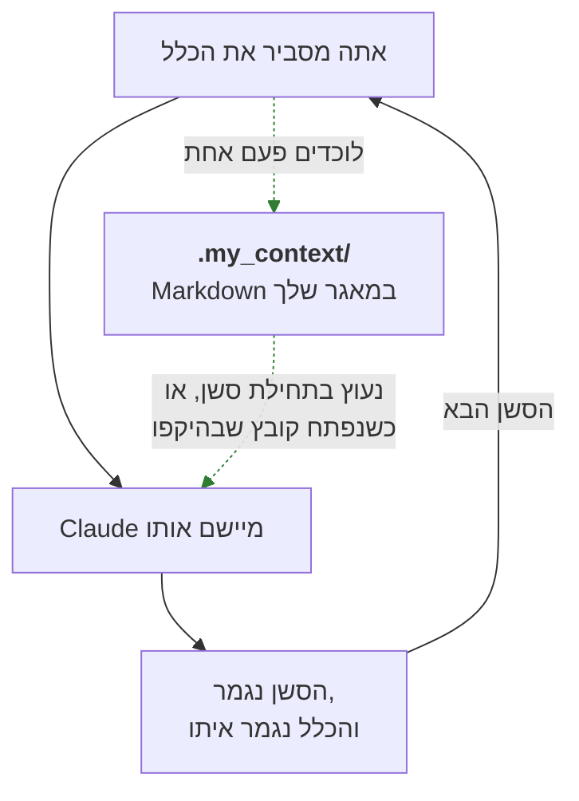
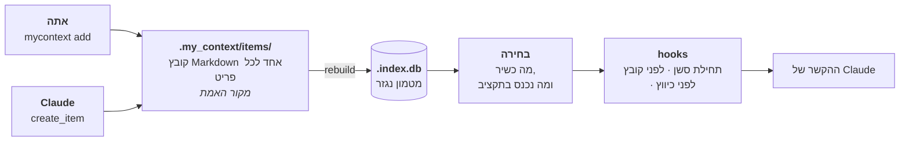
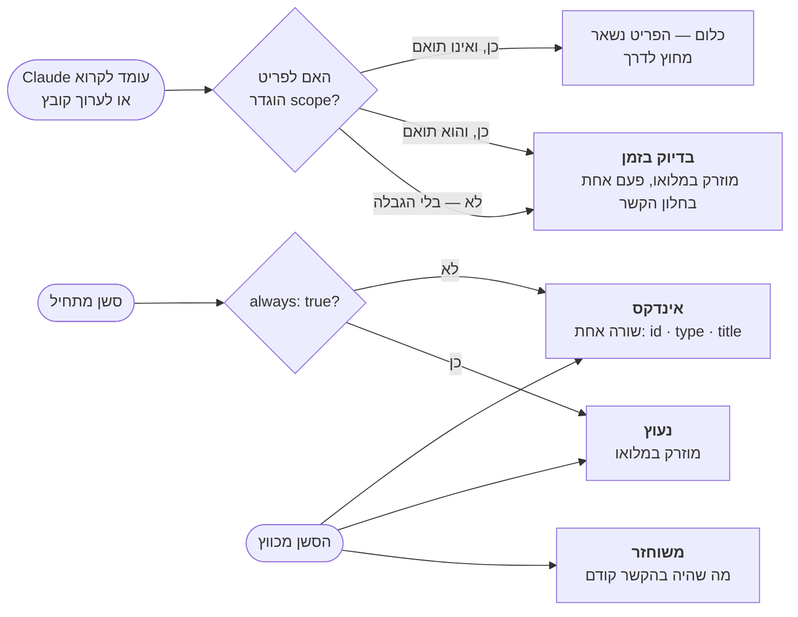
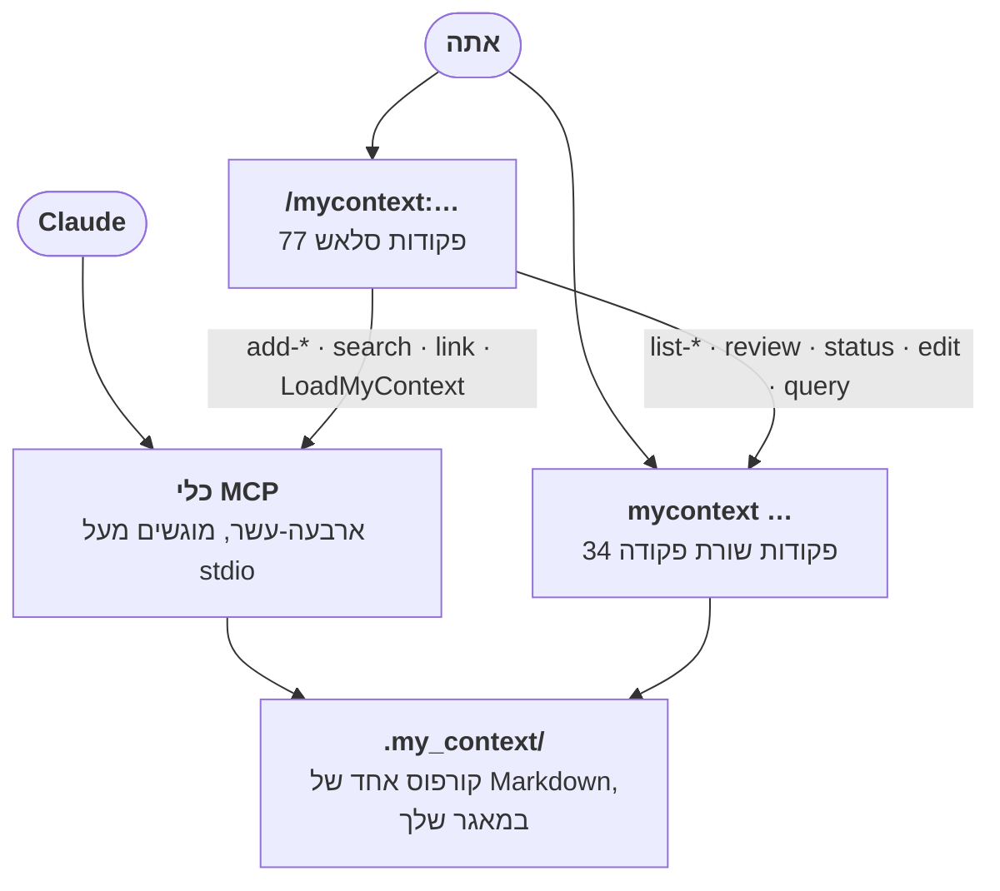
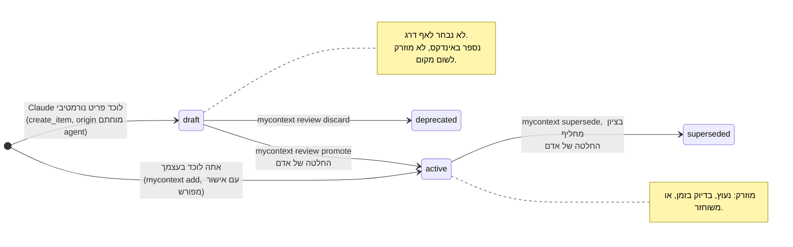

<!--
  Two conventions in this file, both about right-to-left rendering, both
  established by rendering this file through GitHub's own markdown API and
  reading the result in a browser rather than by reasoning about the source.

  1. Hebrew prose lives inside `<div dir="rtl">` blocks. Fenced code and Mermaid
     blocks are deliberately left OUTSIDE them: inside an RTL container the
     bidi algorithm reverses the runs in a box-drawing table, and every
     generated example here is one.
  2. Any Latin-script run that must read left-to-right on its own is wrapped in
     `<span dir="ltr">…</span>`. GitHub's sanitizer keeps the `dir` attribute,
     and an element carrying `dir` is a bidi isolate, so both the run and the
     punctuation beside it resolve correctly. Two cases need it. A code span
     whose first or last character is not alphanumeric: without the wrapper
     `<id>` renders with its angle brackets mirrored and `--json` renders as
     `json--`. And any run of two or more Latin terms separated by commas or
     slashes: without the wrapper each term becomes its own island, the run
     reads back to front, and every comma attaches to the wrong side. A code
     span whose two edge characters are both alphanumeric needs nothing.

  An earlier revision used U+200E LEFT-TO-RIGHT MARK beside code spans instead.
  It renders a single span correctly but cannot hold a multi-term run together,
  and it is invisible in a diff, so it was replaced wholesale.

  Section structure and the example markers must stay identical to README.md;
  `npm test` fails otherwise. Do not write a literal comment terminator inside
  this block: an earlier revision quoted one, which closed the comment early and
  leaked three lines of these notes onto the rendered page above the title.
-->

# my_context

<div dir="rtl">

**תוסף ל-Claude Code שזוכר את הכללים של הפרויקט שלך, כדי שתפסיק לחזור עליהם.**

אתה מסביר ל-Claude איך הפרויקט הזה עובד. הסשן הבא מעולם לא שמע על זה. my_context לוכד
את הכללים האלה כקובצי Markdown בתוך המאגר שלך, ומחזיר את הרלוונטיים שבהם אל Claude
מעצמו — נעוצים בתחילת הסשן, או ברגע שהוא עומד לפתוח קובץ שהם חלים עליו.

</div>


<div dir="rtl">

Node 24 ומעלה, בלי תלויות זמן ריצה ובלי שלב בנייה — קובצי המקור של TypeScript מורצים
ישירות. מופץ תחת [רישיון MIT](../LICENSE). ממהרים? [התקנה](#התקנה), או
[המדריך המהיר](TUTORIAL.md) שלוקח עשרים דקות — הדף הזה הוא הסימוכין, והמדריך הוא מסלול
דרכו.

אתם לוכדים כלל פעם אחת, מהטרמינל או בבקשה מ-Claude לרשום אותו:

</div>

```bash
mycontext add invariant "Prices are integer cents" --scope "src/billing/**" --yes
```

<div dir="rtl">

בפעם הבאה ש-Claude עומד לקרוא או לערוך קובץ תחת <span dir="ltr">`src/billing/`</span>,
אותו <span dir="ltr">`invariant`</span> מוצב לפניו — במלואו, בלי שביקשו, בסשן שמעולם לא
שמע עליכם. לא היה צריך לזכור דבר ולא היה צריך להדביק דבר. זה כל המוצר;
[פרק 4](#4-מתי-זה-חוזר-ומה) עוסק באילו
כללים חוזרים, מתי, ומה קורה כשחלים יותר מכפי שנכנס.

זו הגרסה העברית של [README.md](../README.md). המסמך האנגלי הוא המקור. מבנה הפרקים ובלוקי
הדוגמאות של שני הקבצים נשמרים זהים, אבל שום בדיקה אינה יכולה לקבוע שהתרגום עדכני. פסקה
כאן יכולה להישאר מאחור אחרי שינוי באנגלית, ובמקרה של סתירה — האנגלית קובעת.

## תוכן העניינים

מתלבטים אם זה בשבילכם? **[מה זה יודע לעשות](#מה-זה-יודע-לעשות)** מראה את כל המוצר במסך
אחד ואז נוקב בכל יכולת, שורה לכל אחת, והוא יושב בין פרק 1 לפרק 2.

1. [הבעיה](#1-הבעיה) — למה זה יקר שהזיכרון של סשן נגמר
2. [הרעיון](#2-הרעיון) — מה חייב להתקיים, ולמה זה נרשם
3. [איך זה עובד, בשלושה צעדים](#3-איך-זה-עובד-בשלושה-צעדים) — [אתה לוכד את זה](#צעד-1--אתה-לוכד-את-זה) ([מתקרית](#מתקרית-לכלל), [ממסמך](#ממסמך-לפריטי-טיוטה), [מקובץ](#מקובץ-להפניה)), [זה נשמר כ-Markdown](#צעד-2--זה-נשמר-כ-markdown-שאפשר-לקרוא-להשוות-ולסקור), [זה חוזר](#צעד-3--זה-חוזר-מעצמו)
4. [מתי זה חוזר, ומה](#4-מתי-זה-חוזר-ומה) — [נעוץ](#נעוץ--המעטים-שתמיד-חלים), [בדיוק בזמן](#בדיוק-בזמן--אלה-שחלים-על-מה-שאתה-נוגע-בו), [משוחזר](#משוחזר--אחרי-שחלון-ההקשר-מכווץ), [האינדקס](#האינדקס--כדי-ששום-דבר-לא-יהיה-בלתי-נראה), [השכבה הגלובלית](#השכבה-הגלובלית--ידע-שנוסע-איתך-בין-פרויקטים), [התקציב](#התקציב-ומה-קורה-כשלא-נכנסים-בו)
5. [שימוש](#5-שימוש) — [התקנה](#התקנה), [פקודות סלאש](#מה-שאתה-מקליד-פקודות-הסלאש), [שורת הפקודה](#מה-שאתה-מריץ-שורת-הפקודה), [סכמת האינדקס](#הסכמה-של-האינדקס-ואיך-לתשאל-אותה), [כלי MCP](#מה-שהמודל-קורא-לו-כלי-ה-mcp), [המיומנות](#מה-שהמודל-קורא-המיומנות), [כל הדגלים](#כל-הדגלים-במקום-אחד)
6. [תצורה](#6-תצורה) — [מה כל קטגוריה אומרת](#מה-כל-קטגוריה-אומרת), [קטגוריות שאתם מגדירים בעצמכם](#קטגוריות-שאתם-מגדירים-בעצמכם), ואז פרק לכל מפתח
7. [גבול האמון](#7-גבול-האמון) — [טיוטה ופעיל](#טיוטה-ופעיל-ולמה-קיימת-סקירה), [רוויזיות ממתינות](#מהי-רוויזיה-ממתינה-ומה-היא-אינה-יכולה-לעשות), [גבול האישור](#גבול-האישור--קראו-את-זה-לפני-שאתם-סומכים-עליו)
8. [עדיין לא זמין](#8-עדיין-לא-זמין) — הפרק היחיד שמתאר את מה שהפרויקט הזה **אינו** עושה
9. [מילון מונחים](#9-מילון-מונחים) — כל מונח שהמסמך הזה נותן לו משמעות מסוימת

**שני מדריכים נמצאים לצד הדף הזה**, לקריאה ולא לחיפוש פרטים:
[המדריך המהיר](TUTORIAL.md) לוקח עשרים דקות ומסתיים ברגע שבו אילוץ אחד מגיע ל-Claude
בקובץ שהוא שולט בו, ו[המדריך המתקדם](TUTORIAL-ADVANCED.md) מכסה את דרגי ההזרקה, מדיניות
ה-scope, מיקוד, תקציבים, צינורות הקליטה והלקחים, רוויזיות ויומן הביקורת. כל פקודה וכל
בלוק פלט בשניהם הורצו בפועל, לא הודגמו.

</div>

> [!TIP]
> <div dir="rtl">
>
> **אם מילה או <span dir="ltr">`--flag`</span> כאן אינם מובנים מאליהם, יש לאן לקפוץ.** כל
> מונח שהמסמך הזה נותן לו משמעות מסוימת מוגדר ב[מילון המונחים](#9-מילון-מונחים). כל
> אפשרות של שורת הפקודה יושבת בטבלה אחת:
> [כל הדגלים, במקום אחד](#כל-הדגלים-במקום-אחד). המונחים מוסברים גם בשפה פשוטה במקום
> הראשון שבו הם מופיעים, כך שקריאה רצופה מההתחלה לסוף אינה מחייבת אף אחת מהשתיים.
>
> </div>

<div dir="rtl">

## 1. הבעיה

אתה עובד על תהליך תשלום. אתה אומר ל-Claude: *מחירים הם מספר שלם של סנטים, אף פעם לא
דולרים בנקודה צפה — שגיאת העיגול בכל המרה היא הסיבה שהסכום הכולל לא התאים לשורות הפריטים
ברבעון שעבר.* Claude מסכים, מתקן את הקוד, והסשן נגמר.

יומיים אחר כך אתה פותח סשן חדש ומבקש תכונת הנחה. Claude כותב `price * 0.9`, ושגיאת
העיגול חזרה.

שום דבר לא התקלקל. הזיכרון של סשן נגמר כשהסשן נגמר. כל מה שהסברת — הנימוקים, התיקונים,
ה"לא, לא ככה" — הלך איתו.

### למה הדבקה מחדש לא פותרת את זה

הפתרון המתבקש הוא להדביק את הכללים שוב בתחילת כל סשן. הוא נכשל בשלוש דרכים בבת אחת.

- **אתה שוכח.** לא תמיד — רק בסשן שבו זה היה חשוב.
- **זה נודד.** כשמדביקים מהזיכרון, הכלל יוצא קצת אחרת בכל פעם. "סנטים שלמים" הופך
  ל"להימנע מנקודה צפה", שזו עצה ולא כלל, והסשן הבא מפרש אותו רופף יותר מקודמו.
- **זה עולה בכל סשן.** הכללים שלך נקראים ומחויבים מחדש בכל פעם. כשיש לך תריסר מהם, רוב
  מה שאתה מדביק אינו נוגע כלל לקובץ שאתה עומד לגעת בו.

### למה `CLAUDE.md` לבדו לא מספיק

`CLAUDE.md` הוא שיפור אמיתי לעומת הדבקה: Claude Code טוען אותו אוטומטית, כך שלפחות
הכללים מגיעים בלי שתעשה דבר. יש לו ארבע מגבלות שצצות ברגע שפרויקט גדול מקטן.

- **הוא סטטי.** הוא אומר את אותו הדבר בכל סשן, לא משנה במה אתה עוסק.
- **הוא חסר היקף.** אין דרך לומר "זה חל רק על קוד חיוב". כל כלל חל על כל קובץ באותה מידה,
  ובפועל זה אומר שכל כלל הוא רעש רקע לרוב העבודה.
- **הוא לא מבדיל.** "השתמש בהזחה של שני רווחים" יושב שם ליד "לעולם אל תכתוב כתובת דוא"ל
  של לקוח ליומן". שום דבר לא מסמן שהאחד הוא העדפה והשני חשיפה משפטית.
- **הוא גדל עד שרק מרפרפים עליו.** כל כלל שאתה מוסיף מאריך את הקובץ, וקובץ ארוך מתחרה
  בעצמו על תשומת הלב. שום דבר בו לא יוצא לגמלאות, מפני ששום דבר בו לא מתעד מתי הוא היה
  רלוונטי בפעם האחרונה.

### המחיר שאתה באמת מרגיש

זה לא באמת עניין של טוקנים. זה שאתה נותן את אותו התיקון שוב ושוב והוא אף פעם לא נדבק.
אחרי הפעם השלישית אתה מפסיק לסמוך על העבודה ומתחיל לבדוק אותה. הזמן נשרף על הסבר חוזר של
החלטות שכבר קיבלת, במקום על קבלת חדשות.

my_context סוגר את הלולאה הזאת: אתה לוכד כלל פעם אחת, והחלק הרלוונטי ממה שלכדת חוזר
מעצמו, כשהוא חל.

</div>



<div dir="rtl">

החצים המלאים הם הלולאה שאתה נמצא בה היום. המקווקווים הם מה ש-my_context מוסיף: לכידה
אחת, ומסלול חזרה שלא תלוי בזה שתזכור.

## מה זה יודע לעשות

### במסך אחד

ביום שני, בטרמינל, אתם מקלידים את זה פעם אחת ואז שוכחים מזה:

</div>

```bash
mycontext add invariant "Prices are integer cents" --scope "src/billing/**" --yes
```

<div dir="rtl">

שבועיים אחר כך, סשן שמעולם לא שמע עליכם ולא על הכלל הזה עומד לערוך את
<span dir="ltr">`src/billing/prices.js`</span>. לפני שהעריכה רצה, זה מה שכבר נמצא בהקשר של
Claude — הפלט האמיתי של ה-hook, מצוטט מילה במילה ונגזר מחדש מהקוד הרץ על ידי
<span dir="ltr">`test/docs/injection.test.ts`</span> בכל הרצת בדיקות:

</div>

```text
## my_context — these govern this project

### CONST-postgres-pool-capped-at-20 · constraint · Postgres pool capped at 20

The managed Postgres plan allows 120 connections. Five API instances at 20 each
leaves 20 for migrations, backups and the admin console. Raising the pool past 20
does not buy throughput; it buys `remaining connection slots are reserved` during
the next deploy.

### INV-prices-are-integer-cents · invariant · Prices are integer cents

Every price crossing a module boundary is an integer number of cents.
Floating-point dollars re-introduce a rounding error at each conversion, and the
total a customer approves at checkout must equal the sum of its line items exactly.

_scope: src/billing/**_

### REQ-checkout-completes-in-two-steps · requirement · Checkout completes in two steps

Cart to payment, payment to confirmation. A third step was measured against the
two-step flow in April and abandonment rose by four points, so a new field belongs
in one of the two existing steps or nowhere.

### RULE-never-log-customer-email · rule · Never log customer email

Log the customer id instead. Access logs are shipped to a third-party aggregator
that our data-processing agreement does not cover, so an email address in a log
line leaves the boundary the checkout flow promises the customer.

_scope: src/**_
```

<div dir="rtl">

**אף אחד לא הקליד כלום.** לא הורץ שום חיפוש, לא הופעל שום כלי, אף אחד לא הדביק כלל ואף אחד
לא ביקש שיגיע כזה. **אף אחד לא זכר כלום** — לא אתם, ולא המודל, שאין לו זיכרון מיום שני ואין לו שום
סיבה לחשוד שהאינווריאנטה קיימת. **מה שהפעיל את זה הוא הקובץ.**
<span dir="ltr">`src/billing/**`</span> התאים ל-<span dir="ltr">`src/billing/prices.js`</span>,
וה-[hook שרץ לפני ש-Claude קורא או עורך קובץ](#בדיוק-בזמן--אלה-שחלים-על-מה-שאתה-נוגע-בו)
בחר לפי הנתיב הזה והזריק לפני שהכלי רץ. שלושת האחרים הגיעו באותה קריאה כי שום דבר לא הוציא
אותם: לשניים אין `scope` כלל, והשלישי מוגבל ל-<span dir="ltr">`src/**`</span>, ו-<span dir="ltr">`src/billing/prices.js`</span>
נמצא תחתיו. הם מגיעים פעם אחת כל אחד, הקשיחים תחילה, בתוך
[תקציב](#התקציב-ומה-קורה-כשלא-נכנסים-בו) שנוקב במפורש בכל מה שלא נכנס — וזהו הפלט של סשן
שהאירוע הראשון בו הוא העריכה. בסשן שהתחיל כרגיל, הפריט היחיד שהוא
<span dir="ltr">`always: true`</span> היה [נעוץ](#נעוץ--המעטים-שתמיד-חלים) כבר בתחילתו,
ושלושת האחרים היו מגיעים כאן.

### למה לא פשוט `CLAUDE.md`

<span dir="ltr">`CLAUDE.md`</span> הוא שיפור אמיתי על פני הדבקת כללים ביד, והכלי הזה קיים
בגלל מה שהוא עדיין אינו יכול לעשות. [פרק 1](#למה-claudemd-לבדו-לא-מספיק) הוא הגרסה
המלאה; לכל אחת מארבע המגבלות שלו יש כאן תשובה.

- **הוא סטטי** — הוא אומר את אותו הדבר בכל סשן. כאן המסירה נבחרת לפי האירוע:
  [נעוץ](#נעוץ--המעטים-שתמיד-חלים) בתחילת סשן,
  [בדיוק בזמן](#בדיוק-בזמן--אלה-שחלים-על-מה-שאתה-נוגע-בו) לפני קריאה או עריכה של קובץ,
  [משוחזר](#משוחזר--אחרי-שחלון-ההקשר-מכווץ) אחרי כיווץ,
  ו[שורת אינדקס](#האינדקס--כדי-ששום-דבר-לא-יהיה-בלתי-נראה) לכל השאר.
- **הוא חסר היקף** — כל כלל חל על כל קובץ. כאן `scope` הוא רשימת globs, והקובץ ש-Claude
  עומד לגעת בו הוא זה שמחליט אילו פריטים הוא מקבל.
- **הוא לא מבדיל** — העדפה יושבת ליד חשיפה משפטית בלי ששום דבר מבדיל ביניהן. כאן הדרג של
  פריט מחליט אם מותר לו בכלל לכוון את המודל (טקסט נורמטיבי מוזרק במלואו; נימוקים רק
  נספרים, נכללים באינדקס וניתנים לחיפוש), והחומרה שלו מחליטה אילו פריטים מגיעים ראשונים
  לתקציב מלא.
- **הוא גדל עד שרק מרפרפים עליו** — שום דבר בו אינו מתעד מתי הוא היה רלוונטי לאחרונה. כאן לכל
  דרג יש תקציב טוקנים, ו-<span dir="ltr">`mycontext decay`</span> מדווח אילו פריטים לא
  *הוזרקו* בחלון הסשנים האחרון. הוזרקו, לא נעשה בהם שימוש: הדוח מדפיס את הסייג הזה על
  עצמו, כי פריט שנקרא דרך <span dir="ltr">`mycontext show`</span> אינו מותיר עקבות ביומן
  ההזרקות ונראה בדיוק כמו פריט נטוש.

### החלקים החריגים

- **מה שמפעיל את האחזור הוא נתיב קובץ, לא החלטה.**
  <span dir="ltr">`src/hooks/pre-tool-use.ts`</span> פותר את הנתיב ש-Claude עומד לפתוח מול
  שורש המאגר ובוחר לפיו. שום דבר אינו מבקש מהמודל ללכת לחפש — וזה משנה, כי מודל שכבר חושד
  שהכלל קיים הוא ברוב המקרים מודל שלא היה זקוק לו.
  ← [בדיוק בזמן](#בדיוק-בזמן--אלה-שחלים-על-מה-שאתה-נוגע-בו)
- **מה שבאמת הגיע למודל מתועד, לכל סשן**, לפי סשן, פריט ודרג: יומן הביקורת מתעד כל מסירה
  תחילה, וקובץ seen פר-סשן הוא מה שגורם לפריט להגיע פעם אחת ולא בכל קובץ. יומן ההזרקות
  ש-<span dir="ltr">`mycontext decay`</span> מחושב ממנו הוא נגזרת שנבנית מחדש מיומן
  הביקורת — כך שאפשר להוציא פריטים מהקורפוס על סמך ראיות למסירה ולא על סמך תחושה.
  ← [מה שאתה מריץ: שורת הפקודה](#מה-שאתה-מריץ-שורת-הפקודה)
- **החילוץ מעוגן בציטוט, ול-my_context אין מודל משלו.** כל מועמד שנשלף ממסמך חייב לשאת
  ציטוט שהועתק מילה במילה מהמקטע שממנו הוא בא; הציטוט נבדק בהתאמה מדויקת אחרי כיווץ רווחים,
  ופרפרזה נדחית. הבדיקה שמונעת המצאה היא מכנית ולא פרומפט שמבקש יפה, ואין בשום מקום בתהליך
  לא מפתח API ולא עלות היסק.
  ← [ממסמך לפריטי טיוטה](#ממסמך-לפריטי-טיוטה)
- **גבול האמון הוא דרג בחירה, לא מדיניות.** פריט נורמטיבי ש-Claude לוכד *דרך כלי ה-MCP*
  נוחת כ-`draft` — נתיב הגיבוי מהמעטפת שפקודות הלוכסן נוקבות בו הוא
  <span dir="ltr">`mycontext add --yes`</span>, שנוחת `active` ואומר זאת במקום שבו הוא
  מוצע — ו-`draft` אינו מתקבל לאף דרג הזרקה: הבורר משמיט כל פריט שהסטטוס שלו אינו `active` עוד
  לפני שנבדק תקציב. מה שנדיר יותר מתור הסקירה עצמו הוא שאופני הכשל של הגבול מתפרסמים
  באותו מסמך, בשמם.
  ← [גבול האישור](#גבול-האישור--קראו-את-זה-לפני-שאתם-סומכים-עליו)
- **הקורפוס הוא Markdown שבבעלותכם והאינדקס ניתן להשלכה ולבנייה מחדש.** קובץ אחד לכל פריט במאגר
  שלכם, כשכל אחד נושא checksum שנחתם מחדש בכל כתיבה; אינדקס ה-SQLite נגזר מהקבצים האלה
  ו-<span dir="ltr">`mycontext rebuild`</span> בונה אותו מחדש מאפס. אפילו יומן ההזרקות
  שחולק איתו את הקובץ נגזר — נגזרת של יומן הביקורת שרק מוסיפים לו,
  ש-<span dir="ltr">`mycontext audit replay-ledger`</span> משלימה בהדרגה, ובונה מחדש
  בשלמותה רק כשהיומן סטה — ולכן מחיקת מסד הנתונים אינה מאבדת דבר.
  ← [צעד 2 — זה נשמר כ-Markdown](#צעד-2--זה-נשמר-כ-markdown-שאפשר-לקרוא-להשוות-ולסקור)

### הכול, שורה אחת לכל יכולת

כל מה שכתוב כאן עובד היום, וכל שורה מקשרת לפרק שמכסה אותה במלואה. [פרק 8](#8-עדיין-לא-זמין)
הוא המקום היחיד שבו נרשמת התנהגות שעדיין **אינה** קיימת; שום דבר ברשימה הזאת אינו שם.

- **ללכוד כלל ביד** — <span dir="ltr">`mycontext add`</span> אחת מהטרמינל, או בקשה
  מ-Claude לרשום אותו, ואז הוא נוחת כטיוטה שאתם מקדמים.
  ← [צעד 1 — אתה לוכד את זה](#צעד-1--אתה-לוכד-את-זה)
- **ללכוד ממסמך שכבר כתבתם** — מפנים את my_context אל מסמך אפיון והוא מכין את בקשת
  החילוץ; המודל ממלא אותה, ומה שחוזר נוחת כטיוטות, כשכל אחת נבדקת מול ציטוט מהמקור.
  ← [ממסמך לפריטי טיוטה](#ממסמך-לפריטי-טיוטה)
- **להצביע על קובץ, ולדעת מתי העותק מתיישן** — תצלום מצב של מפת דרכים, ספר נהלים או
  יומן התקדמות, עם רישום מהיכן הוא בא, דיווח סחיפה מ-`doctor`, ופקודה אחת שלוקחת תצלום
  חדש. זה תצלום ולא קריאה חיה, במכוון: ראו את הפרק.
  ← [מקובץ להפניה](#מקובץ-להפניה)
- **להפוך תקרית לכלל** — רושמים את הלקח, גוזרים ממנו מועמדים לכללים, ומקבלים את אלה
  ששווים שמירה, כשהגזירה נרשמת על הכלל עצמו.
  ← [מתקרית לכלל](#מתקרית-לכלל)
- **לשמור את הכול כ-Markdown במאגר שלכם** — קובץ אחד לכל פריט, נסקר ב-pull request כמו
  כל דבר אחר, והאינדקס נגזר מהקבצים ולא להפך.
  ← [צעד 2 — זה נשמר כ-Markdown](#צעד-2--זה-נשמר-כ-markdown-שאפשר-לקרוא-להשוות-ולסקור)
- **לקבל בחזרה את החלק הרלוונטי בלי שאף אחד ביקש** —
  [נעוץ](#נעוץ--המעטים-שתמיד-חלים) בתחילת סשן,
  [בדיוק בזמן](#בדיוק-בזמן--אלה-שחלים-על-מה-שאתה-נוגע-בו) כשעומדים לפתוח קובץ שהוא חל
  עליו, [משוחזר](#משוחזר--אחרי-שחלון-ההקשר-מכווץ) אחרי כיווץ, ו[נקוב בשם
  באינדקס](#האינדקס--כדי-ששום-דבר-לא-יהיה-בלתי-נראה) כדי ששום דבר לא יהיה בלתי נראה —
  והכול בתוך [תקציב](#התקציב-ומה-קורה-כשלא-נכנסים-בו) שאתם קובעים.
  ← [צעד 3 — זה חוזר מעצמו](#צעד-3--זה-חוזר-מעצמו)
- **לסקור את מה שסוכן מציע לפני שהוא שולט** — פריט נורמטיבי ש-Claude לוכד הוא טיוטה,
  וטיוטה אינה נבחרת לאף דרג הזרקה.
  ← [טיוטה ופעיל](#טיוטה-ופעיל-ולמה-קיימת-סקירה)
- **לערוך את מה ששולט, דרך שער שמדורג לפי השינוי** — שום מכשול על טיוטה או על פריט
  נימוקים, תצוגה מקדימה ואישור על פריט ששולט, ושכתוב של סוכן
  [מועמד ולא מוחל](#מהי-רוויזיה-ממתינה-ומה-היא-אינה-יכולה-לעשות) בכל קטגוריה נורמטיבית,
  אלא אם תגידו אחרת.
  ← [מה שאתה מריץ: שורת הפקודה](#מה-שאתה-מריץ-שורת-הפקודה)
- **לשאת ידע בין כל הפרויקטים שלכם** — שכבה גלובלית שהפריטים שלה נטענים לצד אלה של
  הפרויקט, והפרויקט מנצח בהתנגשות. יצירת שכבה כזאת היום היא עקיפה מתועדת ולא פקודה.
  ← [השכבה הגלובלית](#השכבה-הגלובלית--ידע-שנוסע-איתך-בין-פרויקטים)
- **לתת שמות לקטגוריות שהתחום שלכם משתמש בהן** — [המובנות](#מה-כל-קטגוריה-אומרת) מכסות
  את רוב הפרויקטים, ושם שאינו ביניהן הופך לקטגוריה מן המניין עם תחילית מזהה, דרג והיקף
  משלה.
  ← [קטגוריות שאתם מגדירים בעצמכם](#קטגוריות-שאתם-מגדירים-בעצמכם)
- **לשאול את הקורפוס שאלה שאין לה פקודה** — SQL לקריאה בלבד מעל האינדקס, שנבנה מחדש
  מה-Markdown לפני כל שאילתה.
  ← [הסכמה של האינדקס, ואיך לתשאל אותה](#הסכמה-של-האינדקס-ואיך-לתשאל-אותה)
- **לראות מה מיושן, מה שבור ומה מתקרר** — <span dir="ltr">`mycontext status`</span> לצורת
  הקורפוס, <span dir="ltr">`mycontext doctor`</span> לסטיות, ל-globs מתים ולהרשאות,
  ו-<span dir="ltr">`mycontext decay`</span> למה שלא הוזרק לאחרונה — עם הסייג שהדוח מדפיס
  על עצמו.
  ← [מה שאתה מריץ: שורת הפקודה](#מה-שאתה-מריץ-שורת-הפקודה)
- **להגיע לכל זה מהמקום שאתם כבר נמצאים בו** —
  [פקודות הסלאש](#מה-שאתה-מקליד-פקודות-הסלאש) שאתם מקלידים,
  [שורת הפקודה](#מה-שאתה-מריץ-שורת-הפקודה) שאתם מריצים,
  [כלי ה-MCP](#מה-שהמודל-קורא-לו-כלי-ה-mcp) שהמודל קורא להם,
  וה[מיומנות](#מה-שהמודל-קורא-המיומנות) שאומרת לו ללכוד כלל בתור שבו הכלל סוכם.

סייג אחד שייך לצד הרשימה הזאת ולא אחריה. שער הסקירה שלמעלה — זה שמונע מטיוטה לשלוט —
נאכף על ידי הרשאות ה-Bash שלכם ולא על ידי שום דבר אחר,
ו[גבול האישור](#גבול-האישור--קראו-את-זה-לפני-שאתם-סומכים-עליו) אומר בדיוק מה זה מחזיק
ומה לא.

## 2. הרעיון

my_context מחלק את מה שפרויקט יודע לשני סוגים, ומתייחס אליהם אחרת.

**ידע נורמטיבי** הוא מה שחייב להתקיים. אילוצים, אינווריאנטות, כללים, דרישות, תקנים,
תבניות, מונחים, הוראות, לא-מטרות ושאלות פתוחות. *מחירים הם סנטים שלמים.* *לעולם אל
תכתוב כתובת דוא"ל של לקוח ליומן.* *ה-pool של החיבורים מוגבל ל-20.* אלה עונים על השאלה
**"מה אסור לי לפספס כאן?"**

**נימוקים** (rationale) הם הסיבה שהפרויקט הוא כפי שהוא. החלטות, מסמכי ADR, לקחים, פשרות,
הנחות, מקרי קצה, סיכונים. *בחרנו ב-Stripe על פני Adyen כי תזמון הסליקה התאים ללוח
התשלומים שלנו.* *סופות ניסיונות חוזרים צריכות ריווח אקראי — למדנו את זה בדרך הקשה
במרץ.* אלה עונים על **"למה זה ככה?"**

שני הסוגים ראויים לשמירה. רק הראשון שולט.

שלוש מילים במשפט האחרון משמשות במסמך הזה במובן מדויק. כדאי לקבע אותן לפני שבונים עליהן.

- **הזרקה** היא my_context ששם טקסט בהקשר של סשן Claude Code מעצמו, בלי שאף אחד ביקש. זה
  כל המנגנון: לא חיפוש שאתה מריץ, אלא טקסט שכבר נמצא שם כשהמודל מתחיל לקרוא.
- פריט **שולט** כשהוא כשיר להזרקה וגם מנוסח כהוראה — משהו שהמודל אמור לציית לו, ולא רק
  לדעת עליו.
- **דרג** היא המילה לחלוקה בין נורמטיבי לנימוקים. כל קטגוריה נושאת דרג אחד —
  <span dir="ltr">`constraint`, `decision`, `rule`, `lesson`</span> והשאר — ואפשר לשנות
  איזה ([פרק 6](#6-תצורה)). לאותה מילה יש כאן שימוש שני, שאינו קשור:
  [פרק 4](#4-מתי-זה-חוזר-ומה) קורא לארבעת מסלולי האספקה שלו *דרגי הזרקה*. במקומות שבהם
  ההבדל חשוב, המשפט אומר במה מדובר.

אוסף הפריטים של הפרויקט — כל מה שנמצא תחת <span dir="ltr">`.my_context/items/`</span>,
בכל דרג ובכל סטטוס — הוא ה**קורפוס** שלו.

</div>

<!-- example: list --summary -->
```text
┌───────────────┬───────┐
│ type          │ items │
├───────────────┼───────┤
│ constraint    │ 1     │
│ decision      │ 2     │
│ invariant     │ 1     │
│ lesson        │ 1     │
│ open_question │ 1     │
│ requirement   │ 1     │
│ rule          │ 2     │
│ standard      │ 1     │
└───────────────┴───────┘

10 item(s)
```
<!-- /example -->

<div dir="rtl">

זהו פרויקט קטן לדוגמה — Bookstore API בדיוני — שמשמש לאורך כל המסמך הזה. שבעה מעשרת
הפריטים שלו נורמטיביים ושלושה הם נימוקים. `mycontext help categories` מדפיס את הרשימה
המלאה של הסוגים ואת הדרג שכל אחד שייך אליו.

### למה החלוקה נושאת משקל, ולא רק מתייקת

קל לקרוא את זה כטקסונומיה: דרך מסודרת למיין הערות. זה לא. החלוקה קובעת **איזה טקסט רשאי
לשנות בשקט את התנהגות הסוכן.**

טקסט נורמטיבי מוזרק להקשר של Claude במלואו, בלי שביקשו, והוא כתוב בציווי. זו בדיוק
הנקודה: כלל שצריך לבקש אותו הוא כלל שנשכח. אבל טקסט בעל טווח כזה הוא טקסט שמכוון, ולכן
הוא חייב להיות טקסט שמישהו אישר.

נימוקים לעולם אינם נכנסים לסשן בדרך הזאת. בתחילת סשן הם תורמים ספירה — "2 decision ·
1 lesson" — ולא יותר. הם מאונדקסים, ניתנים לחיפוש ונשלפים לפי בקשה, אבל הם אינם מגיעים
בלי הזמנה ואינם מנסחים את עצמם כפקודה.

הפרש הטווח הזה הוא הסיבה ששני הדרגים כפופים לכללים שונים לגבי מי רשאי להוסיף להם.
כש-Claude לוכד פריט נורמטיבי, הוא נוחת כ**טיוטה** ואינו שולט בכלום עד שאדם מקדם אותו.
כש-Claude לוכד פריט נימוק, הוא פשוט נרשם. ההבדל הוא בעלות הטעות: לטעות לגבי *למה* עולה
לך בהסבר מטעה, ולטעות לגבי *מה חייב להתקיים* עולה לך בקוד שגוי, שנכתב בביטחון, בידי משהו
שסמכת עליו שהוא מכיר את הכלל. גבול האישור, ומגבלותיו, מתוארים במלואם
ב[פרק 7](#7-גבול-האמון).

## 3. איך זה עובד, בשלושה צעדים

</div>



<div dir="rtl">

### צעד 1 — אתה לוכד את זה

אתה מנסח את הכלל פעם אחת, בשורת הפקודה או בבקשה מ-Claude לרשום אותו.

</div>

<!-- example: add constraint "Uploads capped at 10 MB" --body "The API gateway rejects a larger body before it reaches us, so accepting one only produces a timeout the customer cannot explain." --scope "src/api/**" --tags uploads --yes -->
```text
about to create constraint "Uploads capped at 10 MB" — active, and governing this project at once.
my_context: created CONST-uploads-capped-at-10-mb (active) at items/constraint/CONST-uploads-capped-at-10-mb.md.
```
<!-- /example -->

<div dir="rtl">

כל מה שבא אחרי הכותרת הוא **אפשרות** — צמד <span dir="ltr">`--name value`</span> שקובע
שדה אחד בפריט. ארבעה דברים בפקודה הזאת חשובים.

- <span dir="ltr">`--body "…"`</span> הוא הטקסט של הפריט: הפסקה ש-Claude באמת יקבל.
  הכותרת אומרת מה הכלל, והגוף אומר למה. ה"למה" הוא מה שמונע מכלל להיות מיושם מכנית במקרה
  שהוא מעולם לא עסק בו.
- <span dir="ltr">`--scope "src/api/**"`</span> הוא מה שהופך את הכלל לממוקד במקום סביבתי.
  זהו **glob של scope** — תבנית של נתיב קובץ, שבה <span dir="ltr">`*`</span> תואם בתוך
  רמת תיקייה אחת ו-<span dir="ltr">`**`</span> תואם על פני כמה רמות שצריך. האילוץ הזה
  נוגע לשכבת ה-API, ולכן הוא יחזור כשנוגעים בקוד של ה-API ויישאר מחוץ לדרך בכל מצב אחר.
  scope *מגביל*, ולכן כלל בלי scope אינו מוגבל לדבר והוא חל על כל קובץ — ראו
  [פרק 4](#4-מתי-זה-חוזר-ומה).
- <span dir="ltr">`--tags uploads`</span> מצמיד תגיות חופשיות. כשאין מיקוד מוגדר הן אינן
  משנות דבר לגבי מתי פריט מוזרק; הן שם כדי שתוכל למצוא אותו אחר כך. `mycontext focus` הוא
  היוצא מן הכלל — מיקוד מצמצם את ההזרקה לתגיות שהוא נוקב בהן.
- <span dir="ltr">`--yes`</span> נדרש מפני שזו קטגוריה נורמטיבית. הפריט שולט בפרויקט מרגע
  שהוא קיים, והדגל הוא ההכרה המפורשת בכך. קטגוריות של נימוקים אינן דורשות אישור.

המזהה, `CONST-uploads-capped-at-10-mb`, נגזר מהכותרת. תראה אותו בהקשר של Claude,
ב-`mycontext list`, ובשם הקובץ.

הארבעה האלה הם חלק קטן ממה שהפקודות מקבלות. כל אפשרות ששורת הפקודה מקבלת מרוכזת
ב[כל הדגלים, במקום אחד](#כל-הדגלים-במקום-אחד); <span dir="ltr">`mycontext help <command>`</span>
מדפיסה את השימוש המוסמך לכל אחת מהן.

גם Claude יכול ללכוד פריטים, בעזרת הכלי `create_item`. פריט נורמטיבי שנלכד כך נוחת
כטיוטה וממתין לך.

#### מתקרית לכלל

לא כל דבר ששווה לשמור מגיע כשהוא כבר מנוסח ככלל. לרוב משהו נשבר, אתה מבין למה, והכלל הוא
בדיוק החלק שעוד לא כתבת. <span dir="ltr">`mycontext lesson`</span> מתחילה מהקצה הזה.

<span dir="ltr">`mycontext lesson "<what was learned>"`</span> רושמת את הלקח — דרג הנימוקים,
כלומר הוא מאונדקס וניתן לחיפוש ולעולם אינו מוזרק בלי שביקשו — ומדפיסה **בקשת גזירת כללים**:
הלקח, סכמת JSON, והוראות להמיר תיאור של מה שקרה להנחיות על מה שחייב לקרות מכאן והלאה. אם
תיתן לה מזהה של לקח שכבר קיים במקום הטקסט, היא תגזור מחדש מאותו לקח ולא תרשום עותק שני;
זו הצורה שבה משתמש התיאור שלהלן, והשורה הראשונה שלה אומרת זאת —
<span dir="ltr">`already recorded — nothing was written by this call`</span>.

ל-my_context אין מודל משלה, והבקשה אומרת זאת בשורה הראשונה שלה. גזירת הכללים היא חלקו של
Claude בעבודה:

</div>

<details>
<summary dir="rtl"><b>בקשת גזירת הכללים, במלואה</b> — 77 שורות, בדיוק כפי שהמודל מקבל אותן</summary>

<!-- example: lesson LESSON-retry-storms-need-jitter -->
````text
my_context: lesson LESSON-retry-storms-need-jitter already recorded — nothing was written by this call (rationale tier — indexed, never injected). Re-deriving rules from it:

my_context RULE DERIVATION REQUEST — LESSON-retry-storms-need-jitter

- You are deriving rules. my_context has no model of its own — it stages what you return and waits for a human.
- A lesson is descriptive ("this is what happened"); a rule is normative ("this is what must happen from now on"). Convert, do not restate.
- Emit a JSON array of rule candidates matching the schema. Two or three is usually right; return [] if the lesson supports no general rule.
- Each rule must be actionable by someone who was not present for the incident. Drop the dates, names and ticket numbers.
- Do not invent scope. Scope RESTRICTS where a rule applies, so omitting it leaves the rule applying everywhere — which is the right answer for a rule that is not about particular directories, and the honest answer when you cannot name them. A human can narrow it during review.
- NOTHING you return is applied. Every candidate is staged pending explicit human approval, because a subtly wrong invariant would be injected into every future session indefinitely.
- Call back with: mycontext lesson-stage LESSON-retry-storms-need-jitter --stdin

```json
{
  "protocol": "my_context/rule-derivation-request@1",
  "lessonId": "LESSON-retry-storms-need-jitter",
  "lessonTitle": "Retry storms need jitter",
  "lessonBody": "The March catalogue outage lasted forty minutes because every client retried on the\nsame fixed one-second interval, so the service was re-hit in synchronized waves and\nnever got a quiet moment to recover. Retries now use exponential backoff with full\njitter.",
  "lessonObservations": [],
  "ruleCategoryEnabled": true,
  "schema": {
    "type": "array",
    "items": {
      "type": "object",
      "required": [
        "title",
        "directive",
        "body"
      ],
      "additionalProperties": false,
      "properties": {
        "title": {
          "type": "string",
          "maxLength": 200,
          "description": "The directive itself, phrased as an instruction: \"Run migrations outside peak hours\"."
        },
        "directive": {
          "enum": [
            "do",
            "dont"
          ],
          "description": "\"do\" prescribes; \"dont\" prohibits."
        },
        "body": {
          "type": "string",
          "description": "Why. Cite the mechanism from the lesson, not the incident narrative."
        },
        "scope": {
          "type": "array",
          "items": {
            "type": "string"
          },
          "description": "POSIX globs this governs. Omit rather than guessing; a bare \"**\" is rejected."
        },
        "severity": {
          "enum": [
            "hard",
            "soft"
          ]
        }
      }
    }
  },
  "callback": {
    "cli": "mycontext lesson-stage LESSON-retry-storms-need-jitter --stdin"
  },
  "instructions": [
    "You are deriving rules. my_context has no model of its own — it stages what you return and waits for a human.",
    "A lesson is descriptive (\"this is what happened\"); a rule is normative (\"this is what must happen from now on\"). Convert, do not restate.",
    "Emit a JSON array of rule candidates matching the schema. Two or three is usually right; return [] if the lesson supports no general rule.",
    "Each rule must be actionable by someone who was not present for the incident. Drop the dates, names and ticket numbers.",
    "Do not invent scope. Scope RESTRICTS where a rule applies, so omitting it leaves the rule applying everywhere — which is the right answer for a rule that is not about particular directories, and the honest answer when you cannot name them. A human can narrow it during review.",
    "NOTHING you return is applied. Every candidate is staged pending explicit human approval, because a subtly wrong invariant would be injected into every future session indefinitely.",
    "Call back with: mycontext lesson-stage LESSON-retry-storms-need-jitter --stdin"
  ]
}
```
````
<!-- /example -->

</details>

<div dir="rtl">

מה שחוזר הוא מערך JSON של מועמדים, והוא נמסר
ל-<span dir="ltr">`mycontext lesson-stage`</span>. ההעמדה אינה כותבת דבר לקורפוס שלך —
המועמדים יושבים בקובץ תחת <span dir="ltr">`.my_context/.staging/`</span>, והשורה הראשונה
של הפקודה קיימת כדי לומר בדיוק את זה:

</div>

<!-- example: lesson LESSON-retry-storms-need-jitter && lesson-stage LESSON-retry-storms-need-jitter --file docs/lesson-rule-candidates.json -->
```text
my_context: 2 rule candidate(s) staged for LESSON-retry-storms-need-jitter. None of them exists as an item yet.
  ┌──────────┬───────────┬─────────────────────────────────┐
  │ key      │ directive │ title                           │
  ├──────────┼───────────┼─────────────────────────────────┤
  │ 99eb0e3d │ do        │ Retries add jitter to backoff   │
  │ 47c76d53 │ dont      │ Never retry on a fixed interval │
  └──────────┴───────────┴─────────────────────────────────┘

Accept with:  mycontext lesson-accept LESSON-retry-storms-need-jitter <key> [--title "…"] [--scope "a/**,b/**"]
Discard with: mycontext lesson-discard LESSON-retry-storms-need-jitter <key>
```
<!-- /example -->

<div dir="rtl">

כל מועמד מקבל **מפתח** קצר. המפתח הוא גיבוב של תוכן המועמד עצמו — ההוראה, הכותרת, הגוף,
ה-scope והחומרה — ולא של מקומו ברשימה, ולכן גזירה שנייה שמנסחת מועמד מחדש נותנת לו מפתח
אחר. <span dir="ltr">`lesson-stage`</span> מחליפה את קבוצת הממתינים בכל הרצה, והיא מדפיסה
את המועמדים הממתינים שהקבוצה החדשה לא ייצרה שוב במקום להשמיט אותם בשקט. כל מה שכבר אישרת
או דחית עובר הלאה כמות שהוא: מועמד שנדחה אינו יכול לחזור.

<span dir="ltr">`mycontext lesson-accept`</span> נוקבת במפתח אחד ויוצרת את הכלל.

</div>

<!-- example: lesson LESSON-retry-storms-need-jitter && lesson-stage LESSON-retry-storms-need-jitter --file docs/lesson-rule-candidates.json && lesson-accept LESSON-retry-storms-need-jitter 99eb0e3d -->
```text
my_context: about to create this rule — review before it becomes active:
  title:     Retries add jitter to backoff
  directive: do
  severity:  hard
  scope:     (unrestricted)
  body:      A fixed interval re-hits a recovering service in waves; jitter spreads them out.

my_context: created RULE-retries-add-jitter-to-backoff (active) with derived_from [[LESSON-retry-storms-need-jitter]].
```
<!-- /example -->

> [!WARNING]
> <div dir="rtl">
>
> קראו את שני החצאים של הפלט הזה יחד. <span dir="ltr">`lesson-accept`</span> מדפיסה
> <span dir="ltr">"review before it becomes active"</span> ואז יוצרת את הכלל כ**פעיל** —
> שולט בפרויקט הזה — באותה הרצה עצמה. אין פקודה שנייה ואין
> <span dir="ltr">`--yes`</span> שאפשר להימנע מלתת: התצוגה המקדימה מתארת דבר שכבר הוכרע
> עד שהספקתם לקרוא אותה. <span dir="ltr">`--title`, `--scope`, `--severity`</span>
> ו-<span dir="ltr">`--directive`</span> מתקנים את המועמד בדרך,
> ו-<span dir="ltr">`mycontext lesson-discard <lesson> <key>`</span> דוחה אחד לתמיד — אבל
> האישור עצמו הוא השער האחרון, והוא אינו עוצר. [פרק 7](#7-גבול-האמון) מונה אותו בין
> הפקודות שמשנות את מה ששולט בפרויקט הזה בלי אדם בלולאה.
>
> </div>

<div dir="rtl">

הכלל שיוצא מכאן הוא פריט רגיל — אותו Markdown שהצעד הבא מתאר, עם יחס אחד שרושם מאיפה הוא
הגיע.

</div>

<!-- example: lesson LESSON-retry-storms-need-jitter && lesson-stage LESSON-retry-storms-need-jitter --file docs/lesson-rule-candidates.json && lesson-accept LESSON-retry-storms-need-jitter 99eb0e3d && show RULE-retries-add-jitter-to-backoff -->
```text
---
id: RULE-retries-add-jitter-to-backoff
type: rule
title: Retries add jitter to backoff
status: active
severity: hard
always: false
scope: []
tags: []
origin: human
source_file: null
source_anchor: null
source_checksum: null
valid_from: <today>
valid_until: null
checksum: 66d3ef277acdc7ee
directive: do
---

# Retries add jitter to backoff

A fixed interval re-hits a recovering service in waves; jitter spreads them out.

## Relations
- derived_from [[LESSON-retry-storms-need-jitter]]
```
<!-- /example -->

<div dir="rtl">

<span dir="ltr">`derived_from`</span> הוא מה שישאיר את הצמד קריא בעוד שנה: הכלל אומר מה
חייב לקרות, והלקח שהוא מצביע אליו אומר למה מישהו חשב כך.

#### ממסמך לפריטי טיוטה

רוב הפרויקטים אינם מתחילים מדף ריק. הכללים כבר כתובים במקום כלשהו — מסמך אפיון, מפרט,
מסמך תכנון, תיקיית ה-ADR — והסיבה שאף אחד מהם אינו מגיע ל-Claude היא שאיש לא יקליד את כל
זה מחדש, <span dir="ltr">`mycontext add`</span> אחד בכל פעם.
<span dir="ltr">`mycontext ingest`</span> היא בדיוק ההקלדה הזאת, כשהמודל עושה אותה, מקטע
אחד בכל פעם, ואדם עומד בסופה.

**המודל הוא המחלץ.** זה הדבר שצריך לדעת לפני כל דבר אחר, כי
<span dir="ltr">`ingest`</span> אינה מנתח (parser) ואינה מתנהגת ככזה. כשמפנים אותה לקובץ,
היא מפצלת את המסמך לפי הכותרות שלו, לוקחת את המקטע הראשון שאיש עדיין לא טיפל בו, ומדפיסה
**בקשת חילוץ**: את הטקסט של המקטע מילה במילה, את הקטגוריות שהפרויקט הזה הפעיל, סכמת JSON
למה שצריך לחזור, ואת הפקודה שבה מחזירים. הקריאה של הטקסט הזה וההכרעה מה בו נורמטיבי הן
חלקו של Claude בעבודה. ל-my_context אין מודל משלה והיא לעולם אינה קוראת לאחד, והבקשה
אומרת זאת בשורה הראשונה שלה.

</div>

<details>
<summary dir="rtl"><b>בקשת החילוץ, במלואה</b> — 264 שורות, בדיוק כפי שהמודל מקבל אותן</summary>

<!-- example: ingest docs/prd.md -->
`````text
my_context EXTRACTION REQUEST — docs/prd.md § bookstore-api-prd (chunk 1 of 3, 3 pending)

- You are the extractor. my_context has no model of its own and never calls one — it hands you the text and validates what you return.
- Read the chunk below, taken from docs/prd.md under the anchor "bookstore-api-prd", and extract every piece of NORMATIVE knowledge it establishes: things that must hold, must be built, must not be done, or are deliberately left open.
- Do not extract narrative, status updates, or descriptions of what was done — that is claude-mem's job, not this one.
- Emit a JSON array matching the "schema" field. Return [] when the chunk establishes nothing normative — that is a correct and common answer, and the common case for prose that isn't a spec.
- Every candidate MUST carry a "quote": a span copied VERBATIM from the chunk. It is checked by exact match after whitespace collapsing, and a paraphrase is rejected. This is how an invented item is caught.
- "title" is one declarative sentence on a SINGLE LINE, at most 200 characters — no line breaks. Put the reasoning in "body".
- "body" is plain prose: no line may start with a Markdown heading ("#" through "######", e.g. "## Why") — that line and everything after it is silently dropped when the item is read back from disk. Do not structure the rationale with headings; use plain paragraphs.
- "scope", "tags" and "observations" must each be a JSON ARRAY — never a bare string. Scope RESTRICTS where an item applies: set it only to the directories the item actually governs, as POSIX globs such as "src/auth/**". "**", "*" and "**/*" are all rejected, because omitting "scope" already means exactly that. Omitting scope is safe and is the right answer when the item is not about particular files — it simply leaves the item unrestricted, so it applies everywhere.
- "severity" is "hard" (a future enforcement candidate) or "soft" (the default) — omit it to get "soft".
- Each observation's "category" must be lowercase letters, digits, underscore and hyphen only (e.g. "root-cause", not "Root Cause") — anything else silently drops the whole observation on the next read. Its "text" must not contain "#" and must not end in a parenthetical like "(...)" — use "tags"/"context" for those instead of writing them inline in "text".
- "extra" keys are category-specific fields (e.g. {"kind":"functional"} for a requirement, {"directive":"dont"} for a rule). Keys must be letters, digits and underscore only, not starting with a digit, and must not reuse a reserved field name such as "source_file", "status" or "id".
- Everything you return lands as status "draft". Nothing you extract governs future work until a human promotes it with `mycontext review promote <id>`.
- Then call back with the results. CLI: mycontext ingest-apply ING-docs-prd-md-dd2990c9-9e3efbae --anchor bookstore-api-prd --stdin — pipe your JSON array to stdin. MCP: call ingest_document with exactly the arguments shown in the "callback.mcp.arguments" object below, PLUS one more key: "candidates", whose value is the JSON array you produced (a real array, not a string).
- Including this one, 3 chunks in this document still need extraction; the callback returns the next request automatically.

CHUNK — the source text to read and extract from:
````
# Bookstore API PRD

The Bookstore API sells books on behalf of tenants who embed our checkout in
their own storefronts. This document is what the first release is measured
against, and it is read by the people building it and by the agents working
alongside them.

It is not a status report. Where a paragraph below says something must hold, it
is meant as a requirement; where it says something is deliberately not being
built, it is meant as a boundary.
````

```json
{
  "protocol": "my_context/extraction-request@1",
  "session": "ING-docs-prd-md-dd2990c9-9e3efbae",
  "sourceFile": "docs/prd.md",
  "anchor": "bookstore-api-prd",
  "chunkIndex": 0,
  "totalChunks": 3,
  "remaining": 3,
  "heading": "Bookstore API PRD",
  "categories": [
    {
      "name": "adr",
      "description": "Formal decision record, MADR shape",
      "extraFields": []
    },
    {
      "name": "assumption",
      "description": "Unverified premise plus validation deadline",
      "extraFields": [
        "validate_by",
        "validated_on"
      ]
    },
    {
      "name": "constraint",
      "description": "Non-negotiable limit: budget, stack, regulation, SLA",
      "extraFields": []
    },
    {
      "name": "decision",
      "description": "Lightweight decision not warranting a full ADR",
      "extraFields": []
    },
    {
      "name": "edge_case",
      "description": "Boundary condition; frequently worth promoting",
      "extraFields": []
    },
    {
      "name": "environment",
      "description": "How the environments differ: what production does that local does not",
      "extraFields": []
    },
    {
      "name": "glossary",
      "description": "Ubiquitous language: the agreed term, and terms not to use",
      "extraFields": []
    },
    {
      "name": "instruction",
      "description": "Governs the agent's process, not the artifact",
      "extraFields": []
    },
    {
      "name": "invariant",
      "description": "Condition that must always hold during execution",
      "extraFields": []
    },
    {
      "name": "known_issue",
      "description": "Broken, flaky or a dead end right now; do not spend effort on it",
      "extraFields": []
    },
    {
      "name": "lesson",
      "description": "What was learned; source material for generated rules",
      "extraFields": []
    },
    {
      "name": "non_goal",
      "description": "Explicit prohibition on building something",
      "extraFields": []
    },
    {
      "name": "note",
      "description": "Anything that arose during development and must not be lost",
      "extraFields": []
    },
    {
      "name": "open_question",
      "description": "Deliberately undecided; the agent must not decide it alone",
      "extraFields": [
        "blocks"
      ]
    },
    {
      "name": "pattern",
      "description": "Reusable solution, or an anti-pattern to avoid",
      "extraFields": []
    },
    {
      "name": "procedure",
      "description": "An ordered operation performed once and then finished; a repeatable one is a runbook",
      "extraFields": []
    },
    {
      "name": "reference",
      "description": "A snapshot of a file, with its origin recorded so doctor reports drift",
      "extraFields": []
    },
    {
      "name": "requirement",
      "description": "What must be built",
      "extraFields": [
        "kind"
      ]
    },
    {
      "name": "risk",
      "description": "May occur and would harm",
      "extraFields": [
        "likelihood",
        "impact"
      ]
    },
    {
      "name": "rule",
      "description": "A do/dont directive",
      "extraFields": [
        "directive"
      ]
    },
    {
      "name": "runbook",
      "description": "The steps for a named operation, in the order they must be taken",
      "extraFields": []
    },
    {
      "name": "standard",
      "description": "Formatting, coding convention, architectural guideline",
      "extraFields": []
    },
    {
      "name": "todo",
      "description": "Something to build or fix later, captured the moment it occurs to you",
      "extraFields": []
    },
    {
      "name": "tradeoff",
      "description": "What was sacrificed for what",
      "extraFields": []
    }
  ],
  "schema": {
    "type": "array",
    "items": {
      "type": "object",
      "required": [
        "type",
        "title",
        "body",
        "quote"
      ],
      "additionalProperties": false,
      "properties": {
        "type": {
          "type": "string",
          "description": "One of the enabled categories listed in this request."
        },
        "title": {
          "type": "string",
          "maxLength": 200,
          "description": "One declarative sentence stating what must hold. Must be a single line — no line breaks."
        },
        "body": {
          "type": "string",
          "description": "The rationale: why this holds, and what breaks if it does not. Plain prose only — no line may start with a Markdown heading (\"#\" through \"######\", e.g. \"## Why\"). A heading line and everything after it is silently dropped when the item is read back from disk."
        },
        "quote": {
          "type": "string",
          "description": "A verbatim span copied from the chunk. Never paraphrase — a paraphrased quote is rejected."
        },
        "severity": {
          "enum": [
            "hard",
            "soft"
          ],
          "description": "hard = a future enforcement candidate. Default soft."
        },
        "scope": {
          "type": "array",
          "items": {
            "type": "string"
          },
          "description": "POSIX globs of the code this governs, e.g. \"src/auth/**\". Must be an array of strings, not a single string. Scope RESTRICTS where an item applies: omitting it leaves the item unrestricted, so it applies to every file. Set it only when the item is genuinely about particular directories, and omit it rather than guessing. \"**\", \"*\" and \"**/*\" are all rejected as redundant spellings of omitting it."
        },
        "tags": {
          "type": "array",
          "items": {
            "type": "string"
          },
          "description": "Must be an array of strings, not a single string."
        },
        "observations": {
          "type": "array",
          "items": {
            "type": "object",
            "required": [
              "category",
              "text"
            ],
            "additionalProperties": false,
            "properties": {
              "category": {
                "type": "string",
                "description": "Lowercase letters, digits, underscore and hyphen only (e.g. \"root-cause\"), no spaces or other punctuation — anything else makes this observation unreadable and it is silently dropped when the item is read back from disk."
              },
              "text": {
                "type": "string",
                "description": "Must not contain \"#\" (read back as a tag marker) and must not end in a parenthetical like \"(...)\" (read back as \"context\") — either silently strips content from this text when the item is read back from disk. Use \"tags\"/\"context\" instead."
              },
              "tags": {
                "type": "array",
                "items": {
                  "type": "string"
                },
                "description": "Must be an array of strings, not a single string."
              },
              "context": {
                "type": "string",
                "description": "Optional qualifier, e.g. \"at registration\". Must not contain parentheses."
              }
            }
          }
        },
        "extra": {
          "type": "object",
          "additionalProperties": {
            "type": "string"
          },
          "description": "Category-specific fields, e.g. {\"kind\":\"functional\"} for a requirement, {\"directive\":\"dont\"} for a rule. Keys must be letters, digits and underscore only, and not start with a digit (e.g. \"validate_by\", not \"validate-by\") — any other character makes the item unreadable on the next rebuild. Keys must also not collide with a reserved frontmatter field name (e.g. \"source_file\", \"status\", \"id\") — that would silently overwrite the real field on disk."
        }
      }
    }
  },
  "callback": {
    "cli": "mycontext ingest-apply ING-docs-prd-md-dd2990c9-9e3efbae --anchor bookstore-api-prd --stdin",
    "mcp": {
      "tool": "ingest_document",
      "arguments": {
        "session": "ING-docs-prd-md-dd2990c9-9e3efbae",
        "anchor": "bookstore-api-prd"
      }
    }
  }
}
```
`````
<!-- /example -->

</details>

<div dir="rtl">

זה מה ש-<span dir="ltr">`mycontext ingest docs/prd.md`</span> אחת מדפיסה. שתי מילים בה
ייחודיות לפקודה הזאת. **עוגן** הוא הכותרת שמעליה יושב מקטע, באותיות קטנות ועם מקפים —
<span dir="ltr">`## Catalogue and search`</span> הופך ל-`catalogue-and-search` — וכך שני
צידי השיחה נוקבים באותו מקטע. **מועמד** הוא פריט מוצע שעדיין אינו קיים על הדיסק: חולץ,
תואר ב-JSON, ואינו כלום עד שמחילים אותו.

התשובה היא מערך JSON של מועמדים, והיא נמסרת בחזרה ל-<span dir="ltr">`mycontext
ingest-apply`</span>, תוך נקיבה במפגש ובעוגן שממנו הגיעה. כל מועמד חייב לשאת `quote` —
ציטוט שהועתק **מילה במילה** מהמקטע שממנו בא; my_context מחפשת אותו בטקסט של אותו מקטע,
ואינה סולחת על דבר מלבד הבדל ברווחים, ודוחה פרפרזה. הבדיקה הזאת אינה פורמליות: היא המנגנון שתופס פריט שהמודל ייצר מתוך הידע שלו עצמו
ולא מתוך המסמך שלכם. מועמד שנדחה נקוב בשמו, נרשם במפגש, ומשאיר את העוגן שלו ממתין.

**המקטע הראשון כאן אינו מייצר דבר, וזו התשובה הנכונה.** מסמך האפיון של Bookstore API נפתח
בשתי פסקאות שאומרות למה המסמך נועד. הן אינן מבססות שום דבר שחייב להתקיים, ולכן החילוץ
מחזיר `[]`, ההחלה מדווחת אפס נוצרו, אפס אוחדו ואפס הוחלפו, ושום פריט אינו נכתב. הבקשה
מבקשת בדיוק את זה — "החזר `[]` כשהמקטע אינו מבסס דבר נורמטיבי" — וכדאי לעצור על כך, כי זו
התשובה לחשש שהמילה "חילוץ" מעוררת: **הקליטה אינה ממציאה פריטים.** פרוזה תיאורית אינה
מניבה דבר, ומקטע שאינו מניב דבר עדיין מסומן כמטופל, כך שהריצה ממשיכה הלאה במקום לשאול שוב.

</div>

<!-- example: ingest docs/prd.md && ingest-apply ING-docs-prd-md-dd2990c9-9e3efbae --anchor bookstore-api-prd --file docs/prd-candidates-bookstore-api-prd.json && ingest-status --full -->
```text
┌───────────────────────────────────┬─────────────┬─────────┬──────────┐
│ session                           │ source      │ applied │ rejected │
├───────────────────────────────────┼─────────────┼─────────┼──────────┤
│ ING-docs-prd-md-dd2990c9-9e3efbae │ docs/prd.md │ 1/3     │ 0        │
└───────────────────────────────────┴─────────────┴─────────┴──────────┘

ING-docs-prd-md-dd2990c9-9e3efbae  docs/prd.md
  applied  bookstore-api-prd
  pending  checkout-and-payments
  pending  catalogue-and-search
```
<!-- /example -->

<div dir="rtl">

זו <span dir="ltr">`mycontext ingest-status --full`</span>, וזה מה שהופך מסמך אמיתי לנסבל.
מסמך אפיון הוא מקטעים רבים, ולעבור על כולם בישיבה אחת אינו המקרה הרגיל: המפגש הוא קובץ
תחת <span dir="ltr">`.my_context/.ingest/`</span>, המזהה שלו נגזר מנתיב המסמך ומתוכנו, וכל
החלה מתווספת אליו. הריצו <span dir="ltr">`mycontext ingest`</span> על אותו קובץ שוב —
שעה אחר כך או שבוע אחר כך — ותקבלו את המקטע **הבא** הממתין, ולא את הראשון. החלה של מקטע
מחזירה את הבקשה הבאה אוטומטית, כך שהלולאה אינה דורשת מכם ניהול;
<span dir="ltr">`--anchor`</span> מבקש מחדש מקטע מסוים כשרוצים לחזור עליו. ומכיוון שהמזהה
מקפל בתוכו סכום ביקורת של המסמך, עריכת המסמך פותחת מפגש **חדש** במקום לחתוך מחדש בשקט את
מקטעי הישן; <span dir="ltr">`ingest-status`</span> אז מונה את שניהם, והפריטים שהמפגש
הראשון ייצר אינם מושפעים.

עברו על שאר המקטעים והפריטים מופיעים:

</div>

<!-- example: ingest docs/prd.md && ingest-apply ING-docs-prd-md-dd2990c9-9e3efbae --anchor bookstore-api-prd --file docs/prd-candidates-bookstore-api-prd.json && ingest-apply ING-docs-prd-md-dd2990c9-9e3efbae --anchor catalogue-and-search --file docs/prd-candidates-catalogue-and-search.json && ingest-apply ING-docs-prd-md-dd2990c9-9e3efbae --anchor checkout-and-payments --file docs/prd-candidates-checkout-and-payments.json -->
```text
my_context: checkout-and-payments — created 3, deduped 0, superseded 0.
  created     CONST-carts-expire-in-30-minutes
  created     REQ-refunds-use-payment-intents
  created     NOGOAL-guest-checkout-is-excluded

my_context: every chunk of docs/prd.md is applied. Promote what you want with `mycontext review`.
```
<!-- /example -->

<div dir="rtl">

**כל מה שהקליטה יוצרת הוא טיוטה.** שום דבר שחולץ מהמסמך שלכם אינו שולט בדבר, אינו מוזרק
לשום סשן, ואינו מגיע להקשר של Claude עד שאדם מקדם אותו — וזו התכונה שמאפשרת להפנות את
הקליטה למסמך שלא קראתם לעומק. חמישה פריטים יצאו ממסמך האפיון הזה, וכל החמישה יושבים בתור
הסקירה עם <span dir="ltr">`origin ingest`</span> ועם הקובץ שממנו הגיעו:

</div>

<!-- example: ingest docs/prd.md && ingest-apply ING-docs-prd-md-dd2990c9-9e3efbae --anchor bookstore-api-prd --file docs/prd-candidates-bookstore-api-prd.json && ingest-apply ING-docs-prd-md-dd2990c9-9e3efbae --anchor catalogue-and-search --file docs/prd-candidates-catalogue-and-search.json && ingest-apply ING-docs-prd-md-dd2990c9-9e3efbae --anchor checkout-and-payments --file docs/prd-candidates-checkout-and-payments.json && review list -->
```text
┌───────────────────────────────────┬─────────────┬────────┬────────┬─────────────┬────────────────┐
│ id                                │ type        │ origin │ always │ source      │ title          │
├───────────────────────────────────┼─────────────┼────────┼────────┼─────────────┼────────────────┤
│ CONST-carts-expire-in-30-minutes  │ constraint  │ ingest │ no     │ docs/prd.md │ Carts expire   │
│                                   │             │        │        │             │ in 30 minutes  │
│ CONST-search-pages-hold-50-titles │ constraint  │ ingest │ no     │ docs/prd.md │ Search pages   │
│                                   │             │        │        │             │ hold 50 titles │
│ INV-isbn-is-unique-per-tenant     │ invariant   │ ingest │ no     │ docs/prd.md │ ISBN is unique │
│                                   │             │        │        │             │ per tenant     │
│ NOGOAL-guest-checkout-is-excluded │ non_goal    │ ingest │ no     │ docs/prd.md │ Guest checkout │
│                                   │             │        │        │             │ is excluded    │
│ REQ-refunds-use-payment-intents   │ requirement │ ingest │ no     │ docs/prd.md │ Refunds use    │
│                                   │             │        │        │             │ payment        │
│                                   │             │        │        │             │ intents        │
│ RULE-cache-keys-include-tenant-id │ rule        │ agent  │ no     │ -           │ Cache keys     │
│                                   │             │        │        │             │ include tenant │
│                                   │             │        │        │             │ ID             │
└───────────────────────────────────┴─────────────┴────────┴────────┴─────────────┴────────────────┘

6 draft(s) pending. Promote with `mycontext review promote <id>`.

1 pending revision(s) on 1 item(s) — proposed by an agent and NOT applied; the items keep their
current text. Read them as diffs with `mycontext review revisions`.
```
<!-- /example -->

<div dir="rtl">

השורה השישית היא הטיוטה הממתינה של הפיקסצ'ר עצמו, שנלכדה בידי סוכן ולא בידי הקליטה,
וההודעה מתחת לטבלה היא רוויזיה ממתינה שאינה קשורה — שתיהן שם כדי להראות שהפלט של הקליטה
מצטרף לתור אחד במקום לקבל תור משלו. <span dir="ltr">`origin`</span> היא העמודה שאומרת
מאיפה כל פריט הגיע, ואף כלי אינו מאפשר למי שקורא לו לקבוע אותה. למה התור הזה קיים בכלל
כתוב ב[פרק 7](#7-גבול-האמון); הקידום הוא הרגע שבו פריט שחולץ מתחיל לשלוט בפרויקט:

</div>

<!-- example: ingest docs/prd.md && ingest-apply ING-docs-prd-md-dd2990c9-9e3efbae --anchor bookstore-api-prd --file docs/prd-candidates-bookstore-api-prd.json && ingest-apply ING-docs-prd-md-dd2990c9-9e3efbae --anchor catalogue-and-search --file docs/prd-candidates-catalogue-and-search.json && ingest-apply ING-docs-prd-md-dd2990c9-9e3efbae --anchor checkout-and-payments --file docs/prd-candidates-checkout-and-payments.json && review promote INV-isbn-is-unique-per-tenant --yes -->
```text
about to promote:
  id       INV-isbn-is-unique-per-tenant
  type     invariant
  title    ISBN is unique per tenant
  severity hard
  always   no
  scope    src/catalogue/**

Two tenants may stock the same book, so a lookup that omits the tenant can return the wrong row.

my_context: INV-isbn-is-unique-per-tenant is now active (scope src/catalogue/** — injected when work touches those paths).
```
<!-- /example -->

<div dir="rtl">

Claude יכול להריץ את שני הצעדים בעצמו בעזרת הכלי `ingest_document`, שנושא את המועמדים ואת
הקריאה החוזרת בקריאה אחת. <span dir="ltr">`/mycontext:ingest`</span> מריצה את אותו זרם
מתוך סשן, ולכן לקליטה יש שלושה משטחים ולא שניים — <span dir="ltr">`ingest-apply`</span>
ו-<span dir="ltr">`ingest-status`</span> הם צעדים *בתוך* הפקודה הזאת ולא פקודות בפני עצמן
([פרק 8](#8-עדיין-לא-זמין)).

#### מקובץ להפניה

חלק ממה שפרויקט יודע כבר כתוב, בקובץ שמישהו מתחזק: מפת דרכים, ספר נהלים, מסמך ארכיטקטורה,
יומן התקדמות. הדבקת הטקסט לגוף של פריט עובדת בדיוק פעם אחת — מכאן והלאה העותק והקובץ
נפרדים זה מזה בלי ששום דבר משגיח.

<span dir="ltr">`mycontext add reference "<title>" --file <path>`</span> לוכדת את הקובץ
במקום זאת. הגוף הופך ל**תצלום מצב** שלו, והפריט רושם מהיכן התצלום נלקח:

</div>

<!-- example: add reference "Billing roadmap" --file docs/roadmap.md --note "The dates move; the ordering is what decides what is safe to build against." -->
```text
my_context: snapshotting docs/roadmap.md — 10 line(s), 260 bytes, ~65 estimated tokens
my_context: this category is on the rationale tier, so the item is never injected in full and costs the injection budget nothing. It is stored, searchable, and counted in the session index. Retiering the category to "normative" in config changes that — and changes what governs this project — see README, "reference".
my_context: created REF-billing-roadmap (active) at items/reference/REF-billing-roadmap.md.
```
<!-- /example -->

<div dir="rtl">

התצלום נשמר **מצוטט** — כל שורה מקבלת קידומת <span dir="ltr">`> `</span> — וזו אינה בחירה
של הצגה. גוף של פריט הוא הפרוזה שלפני המקטע <span dir="ltr">`## `</span> הראשון שלו, ולכן
כותרת בתוך גוף לא-מצוטט הייתה מוציאה מהגוף את כל מה שאחריה בכתיבה הבאה, בשקט. הציטוט הוא
מה שמאפשר לקובץ לשרוד את מסע ההלוך-ושוב ללא שינוי, וה-checksum הרשום נלקח על הקובץ עצמו
ולא על הצורה המצוטטת — כך שהמספר שבחזית הקובץ הוא זה שתקבלו אם תחשבו את ה-checksum של
הקובץ ביד:

</div>

<!-- example: add reference "Billing roadmap" --file docs/roadmap.md --note "The dates move; the ordering is what decides what is safe to build against." && show REF-billing-roadmap -->
```text
---
id: REF-billing-roadmap
type: reference
title: Billing roadmap
status: active
severity: soft
always: false
scope: []
tags: []
origin: human
source_file: docs/roadmap.md
source_anchor: null
source_checksum: b4870a16d4017508
valid_from: <today>
valid_until: null
checksum: 4f599b3a1340122c
---

# Billing roadmap

> # Billing roadmap
>
> ## Q3
>
> - Usage-based pricing behind a flag. Invoices are unchanged this quarter.
> - Dunning emails move out of the monolith and into the billing service.
>
> ## Q4
>
> - Proration on plan changes. Blocked on the tax vendor decision.

## Observations
- [note] The dates move; the ordering is what decides what is safe to build against.
```
<!-- /example -->

<div dir="rtl">

**הקובץ אינו נקרא שוב מעצמו.** לא בתחילת סשן, לא כשהאינדקס נבנה מחדש, ולא כשהפריט מוזרק.
שתי פקודות קוראות אותו: זו, ו-<span dir="ltr">`mycontext refresh`</span>. כל השאר קוראים את
הפריט.

זה סירוב מכוון, והסיבה היא הגבול ש[פרק 7](#7-גבול-האמון) קיים כדי להחזיק. הפניה שנקראת חי
פירושה שמי שיכול לערוך את הקובץ מחליט מה הפריט אומר — ואם הפריט שולט, מי שיכול לערוך את
הקובץ מחליט מה שולט בפרויקט, בלי שום סקירה באמצע. סוכן יכול לערוך קבצים. שתי תוצאות קטנות
יותר נובעות מאותה בחירה: הפריט עובר הלוך-ושוב, כך שמה שנמצא ב-<span
dir="ltr">`items/`</span> הוא בדיוק מה שסשן ראה, וגודלו קבוע ולא גדל בכל פעם שהקובץ גדל.

**סחיפה מדווחת, ולעולם אינה נפתרת בשבילכם.** <span dir="ltr">`mycontext doctor`</span>
משווה את הקובץ לתצלום ומעלה אזהרת <span dir="ltr">`source_drift`</span> שנוקבת בפריט, בשני
ה-checksums, ובפקודה שפותרת את זה. <span dir="ltr">`mycontext refresh <id>`</span> קוראת
את הקובץ מחדש, מציגה לכם את שינוי הגודל לפני ואחרי, ומבקשת אישור לפני שהיא כותבת — אותו
אישור שכל שינוי אחר בתוכן של פריט מקבל. ל-Claude יש מסלול משלו,
<span dir="ltr">`refresh_item`</span>, שקורא את הקובץ בצד השרת במקום לחבר גוף, והוא
**מוחזק לסקירה שלכם** ולא מוחל, בכל מקום
ש[<span dir="ltr">`agentEdits`</span>](#categoriesnameagentedits--האם-שכתוב-של-סוכן-חל-או-ממתין)
אומר זאת.

**מה זה עולה.** `reference` היא קטגוריית נימוקים, ופריט נימוקים לעולם אינו מוזרק במלואו —
ולכן תצלום בכל גודל אינו עולה לתקציב ההזרקה דבר, והלכידה אומרת זאת במקום להזהיר מפני מחיר
שאין לה. הוא נשמר, ניתן לחיפוש על ידי <span dir="ltr">`query_items`</span>, נספר באינדקס
הסשן, ונקרא כשאתם או Claude מבקשים אותו לפי מזהה. אם
[תשנו את דרג הקטגוריה](#categoriesnametier--מה-שולט-ומה-רק-מיידע) ל-`normative`, שני
החצאים האלה משתנים: התצלום מתחיל להתחרות על תקציב ההזרקה כמו כל פריט אחר — קובץ של 400
שורות הוא פריט של 400 שורות, ואחד שלא נכנס
[נשפך בשלמותו](#התקציב-ומה-קורה-כשלא-נכנסים-בו) ונחשף לפי מזהה — **ותוכן הקובץ הופך לידע
ששולט, כך שמי שיכול לערוך את הקובץ יכול לשנות את מה ששולט בפרויקט הזה**, בכפוף למחזור
התצלום-והסקירה שלמעלה ולשום דבר אחר. שורת הלכידה משתנה עם הדרג ואומרת לכם איזה משני אלה
אתם מקבלים.

**יש מגבלת גודל, והיא נאמרת ולא שותקת.** קובץ מעל 256 KiB מסורב בלכידה, עם המספר והסיבה:
המגבלה אינה נוגעת לתקציב ההזרקה — קובץ קטן בהרבה כבר נשפך — אלא לכך שתצלום נקרא ומפורסר
מחדש בכל פקודה שבונה את האינדקס מחדש, ולכן תצלום בלתי-חסום מאט את כל הכלי כל עוד הפריט
קיים. מתחת למגבלה גם כן שום דבר אינו שקט: כל לכידה מדפיסה את הגודל בשורות, בבתים
ובאסימונים משוערים, וכל רענון מדפיס את הלפני-ואחרי בשורות ובאסימונים משוערים. שניהם אחר כך
מדפיסים מה הדרג של הפרויקט הזה עושה עם הגודל הזה.

**איפה נכנס ה-scope.** הפניה מקבלת scope כמו כל דבר אחר, והבחירה היא הרגילה: מפת דרכים
שנוגעת לכל הפרויקט אינה מקבלת <span dir="ltr">`--scope`</span> ונשארת בלתי-מוגבלת, ואילו
ספר נהלים לתת-מערכת אחת מקבל <span dir="ltr">`--scope "src/billing/**"`</span> כך
ש-<span dir="ltr">`query_items({path})`</span> ימצא אותו מקבצי אותה תת-מערכת. בדרג הנימוקים
scope אינו מכריע על הזרקה — שום דבר בדרג הזה אינו מוזרק — אבל הוא נקרא בכל פריט על ידי
שאילתת הנתיב, וכך נענית השאלה "מה אנחנו יודעים על הקובץ הזה?". שינוי הדרג לנורמטיבי הוא מה
שגורם ל-scope להכריע גם על הזרקה.

שתי אינטראקציות שכדאי להכיר לפני שמגיעים אליהן.
[<span dir="ltr">`scopePolicy`</span>](#categoriesnamescopepolicy--מה-המשמעות-של-scope-ריק)
חל על `reference` בדיוק כפי שהוא חל על כל קטגוריה אחרת, והוא **אינו** תלוי-דרג: פרויקט
שמגדיר <span dir="ltr">`categories.reference.scopePolicy`</span> כ-<span
dir="ltr">`"required"`</span> יראה כל הפניה מסורבת בלכידה עד שתנקוב ב-glob, בדרג הנימוקים
לא פחות מאשר בנורמטיבי, ו-<span dir="ltr">`"inert"`</span> גורם להפניה בלי scope לא להתאים
לשום נתיב — מה שבדרג הנימוקים אינו משנה דבר לגבי הזרקה, שכן שום דבר שם אינו מוזרק, אבל כן
משנה את מה ש-<span dir="ltr">`query_items({path})`</span> מחזיר. ו-<span
dir="ltr">`always: true`</span> — הדבר שמפת דרכים נראית כאילו היא רוצה — **מסורב** על
`reference` בדרג הנימוקים, ולא נשמר-ומתעלמים ממנו: רק פריטים נורמטיביים מתקבלים לדרג
הנעוץ, ולכן הדגל לא היה עושה דבר, והפרויקט הזה מסרב לשדה שלא יעשה דבר במקום לקבל אותו
בשקט. <span dir="ltr">`mycontext pin`</span> על הפניה אומרת זאת ונוקבת בשני המסלולים.
לנעוץ הפניה פירושו אפוא להחליט קודם על שינוי דרג הקטגוריה — אותה החלטה עצמה, מפורשת,
שהפסקה שלמעלה מתארת את מחירה.

### צעד 2 — זה נשמר כ-Markdown שאפשר לקרוא, להשוות ולסקור

כל פריט הוא קובץ אחד תחת
<span dir="ltr">`.my_context/items/<type>/<id>.md`</span>, במאגר שלך, ב-Markdown רגיל.

</div>

<!-- example: show CONST-postgres-pool-capped-at-20 -->
```text
---
id: CONST-postgres-pool-capped-at-20
type: constraint
title: Postgres pool capped at 20
status: active
severity: hard
always: true
scope: []
tags:
  - database
  - capacity
origin: agent
source_file: null
source_anchor: null
source_checksum: null
valid_from: 2026-08-14
valid_until: null
checksum: a81dff73a154242e
---

# Postgres pool capped at 20

The managed Postgres plan allows 120 connections. Five API instances at 20 each
leaves 20 for migrations, backups and the admin console. Raising the pool past 20
does not buy throughput; it buys `remaining connection slots are reserved` during
the next deploy.
```
<!-- /example -->

<div dir="rtl">

הגוש שבין שורות ה-<span dir="ltr">`---`</span> הוא ה-**frontmatter**: השדות ש-my_context
משתמש בהם כדי להחליט מתי הפריט הזה חוזר ועד כמה לסמוך עליו. כל מה שמתחתיו הוא הגוף, והגוף
הוא מה ש-Claude באמת קורא. שדה אחר שדה:

| שדה | מה המשמעות |
|---|---|
| `id` | שם הפריט, נגזר מהכותרת. המזהים הם הדרך שכל דבר אחר מפנה אליו |
| `type` | הקטגוריה שלו — <span dir="ltr">`constraint`, `decision`, `rule`</span> וכן הלאה. הקטגוריה קובעת את הדרג |
| `status` | <span dir="ltr">`draft`, `active`, `superseded`, `deprecated`</span> או `validated`. **רק `active` מוזרק אי פעם.** מה אומרים ארבעת האחרים כתוב ב[מילון המונחים](#9-מילון-מונחים) |
| `severity` | `hard` או `soft`. בתוך דרג זה קובע את הסדר ולא אם פריט מוזרק: פריטים קשיחים מתקבלים לתקציב ראשונים. דבר אחד הוא כן קובע לגבי *אם* — `mycontext focus` לעולם אינו מסתיר פריט <span dir="ltr">`severity: hard`</span>, ולכן מיקוד שאינו כולל אותו מזריק אותו בכל זאת |
| `always` | הערך `true` נועץ את הפריט — מוזרק במלואו בתחילת כל סשן, בלי קשר לקבצים שאתה נוגע בהם |
| `scope` | globs של הקבצים שהפריט מוגבל אליהם. ריק פירושו בלי הגבלה: הוא חל על כל קובץ |
| `tags` | תגיות חופשיות למציאה מאוחרת. הן אינן משפיעות על ההזרקה כל עוד לא הוגדר מיקוד: <span dir="ltr">`mycontext focus <tag>`</span> מצמצם את ההזרקה לתגיות שהוא נוקב בהן, ופריט שאינו תואם לאף אחת מהן נעצר |
| `origin` | מי כתב אותו: <span dir="ltr">`human`</span>, <span dir="ltr">`agent`</span> (כלומר Claude — דרך כלי MCP, ש**חותם** אותו במטפל, או <span dir="ltr">`mycontext lesson --agent`</span>, ש**מצהיר** עליו) או <span dir="ltr">`ingest`</span> (חולץ ממסמך). על השדה הזה בנוי [גבול האמון](#7-גבול-האמון), ואף כלי אינו מאפשר למי שקורא לו לקבוע אותו |
| <span dir="ltr">`source_file`, `source_anchor`, `source_checksum`</span> | מהיכן הפריט הגיע כשהוא חולץ ממסמך: הנתיב, הכותרת בתוכו, ו-hash של אותו טקסט כדי שאפשר יהיה לזהות סטייה |
| <span dir="ltr">`valid_from`, `valid_until`</span> | היום שבו התחיל לחול, והיום שבו חדל. <span dir="ltr">`valid_until`</span> ממולא כשפריט פורש (<span dir="ltr">`superseded`</span> או <span dir="ltr">`deprecated`</span>) ומתנקה שוב אם הוא מוחזר לתוקף, כך שהוא לעולם אינו סותר את ה-`status` שמעליו. זהו **תיעוד, לא בקרה**: שום דבר אינו בורר לפיו, ואף פריט אינו מפסיק להיות מוזרק בגלל תאריך — `status` הוא שמכריע, במקום אחד, כך שפריט לעולם אינו יוצא מתוקף בשקט ביום שאיש לא הקליד בו דבר |
| `checksum` | hash של תוכן הפריט עצמו, מוחתם מחדש בכל כתיבה. כך `mycontext doctor` מבחין בקובץ שנערך ביד |

חלק מהקטגוריות מוסיפות שדה משלהן. פריט `rule`, למשל, נושא
<span dir="ltr">`directive: do`</span> או <span dir="ltr">`directive: dont`</span>. הפקודה
<span dir="ltr">`mycontext examples <category>`</span> מדפיסה דגם תקין של כל סוג, כולל
השדות הנוספים.

הצורה הזאת מכוונת. הכללים של הפרויקט שלך חיים ב-git, ולכן הם מופיעים ב-diff של pull
request, נסקרים כמו קוד, ומסתעפים ומתמזגים יחד עם הקוד שהם מתארים. אפשר גם לקרוא אותם בלי
להריץ כלום: אין מסד נתונים שצריך לתשאל כדי לגלות במה הפרויקט שלך מאמין.

*יש* מסד נתונים — <span dir="ltr">`.my_context/.index.db`</span>, מסוג SQLite — אבל הוא
נגזר ולא נכתב ידנית. הוא קיים כדי שחיפוש בזמן סשן יהיה מהיר. מחקו אותו
ו-`mycontext rebuild` יבנה אותו מחדש מה-Markdown. ה-Markdown הוא מקור האמת; האינדקס הוא
מטמון.

המשפט הזה מחזיק בזמן ריצה, לא רק בזמן בנייה מחדש: ה-hooks לעולם אינם *דורשים* את האינדקס.
הם פותחים אותו לקריאה בלבד כשהוא קריא, וכשאי אפשר לקרוא אותו כלל הם מגישים את ההזרקה
ישירות מקובצי ה-Markdown ואומרים זאת בתוך ההזרקה עצמה —
<span dir="ltr">`my_context: served from Markdown; the index was unavailable.`</span>
מסלול הגיבוי בוחר לפי אותו כלל של המסלול המאונדקס — השכבות ממוזגות פרויקט-על-גלובלי לפני
כל סינון, אותו סדר שבו האינדקס נבנה — ולכן שני המסלולים בוחרים את אותם פריטים, תכונה
שמוחזקת מבנייה וננעצת בבדיקות shadow שהורצו בפועל ולא הונחה.
הערובה הזאת מותנית בגודל הקורפוס: מסלול הגיבוי נמדד ב-<span dir="ltr">9,903 ms</span>
עבור 10,000 פריטים על מטמון קבצים קר, מול מגבלת עשר השניות שבה Claude Code הורג hook —
ולכן מעבר לכ-10,000 פריטים הזרקה שמוגשת ממסלול הגיבוי עלולה להיהרג ולהידרדר להחמצה
מדווחת. <span dir="ltr">`mycontext doctor`</span> מזהיר החל מ-5,000 פריטים.

השלכה אחת שכדאי להכיר מוקדם: אל תערוך קובץ פריט ביד. כל מסלול כתיבה מחשב מחדש את שדה
ה-`checksum` של הפריט. עריכה ידנית לא מחשבת אותו, ולכן ה-checksum הרשום מפסיק להתאים
לתוכן, ו-`mycontext doctor` מדווח על הפער מאותו רגע.

### צעד 3 — זה חוזר מעצמו

כשסשן מתחיל, Claude Code מריץ את ה-hooks של my_context — תוכניות קטנות שהוא מריץ ברגעים
קבועים, לפני שקורה משהו אחר. ה-hook של תחילת הסשן בוחר את הפריטים שחלים ומוסר אותם
ל-Claude כהקשר. זה מה שהמודל מקבל, מילה במילה:

</div>

```text
## my_context — these govern this project

### CONST-postgres-pool-capped-at-20 · constraint · Postgres pool capped at 20

The managed Postgres plan allows 120 connections. Five API instances at 20 each
leaves 20 for migrations, backups and the admin console. Raising the pool past 20
does not buy throughput; it buys `remaining connection slots are reserved` during
the next deploy.

## my_context index
- INV-prices-are-integer-cents · invariant · Prices are integer cents
- REQ-checkout-completes-in-two-steps · requirement · Checkout completes in two steps
- RULE-never-log-customer-email · rule · Never log customer email
- STD-api-errors-use-problem-json · standard · API errors use Problem JSON

2 decision · 1 lesson · 1 drafts pending review · 1 retired
→ use mycontext list or mycontext show <id> to browse these

my_context: 1 pending revision(s) on 1 item(s) in this workspace, staged and NOT applied — REV-76627cb9f4c6 → RULE-never-log-customer-email. Every item here carries the text it had before the proposal; that is the text in force. Only a human can settle them, and you cannot: do not propose the same change again, and do not reason as if the proposed text applies. Tell the user they are waiting.
```

<div dir="rtl">

פריט אחד הגיע במלואו, מפני שהוא נעוץ. ארבעה הגיעו כשורה אחת כל אחד, כך ש-Claude יודע
שהם קיימים ויכול לשלוף כל אחד מהם לפי מזהה. פריטי הנימוקים הגיעו כספירה. שום דבר לא
הושמט בלי שנאמר עליו.

השורה האחרונה מופיעה מפני שבסביבת העבודה לדוגמה הזו ממתינה
[רוויזיה ממתינה](#מהי-רוויזיה-ממתינה-ומה-היא-אינה-יכולה-לעשות): סוכן הציע טקסט חדש
ל-<span dir="ltr">`RULE-never-log-customer-email`</span>, ואיש עוד לא קידם או ביטל אותה.
היא מציינת את ההצעה בלי לשאת אותה, כך שהסשן רואה שממתינה כזו ועדיין קורא את הטקסט שבתוקף
בפועל. סביבת עבודה שתור הרוויזיות שלה ריק אינה מקבלת שורה כזו.

Claude Code מוסר לכל hook מטען משלו — איזה סשן זה, למה הוא נורה, ובאיזו תיקייה. כשאי אפשר
לקרוא את המטען הזה, ה-hooks עדיין רצים: הם נכשלים פתוח, מפני ש-hook שהיה מסרב היה עולה לכם
בהזרקה כולה. מה שהם כבר אינם עושים זה להיראות רגילים בזמן שזה קורה. תחילת סשן שהמטען שלה
היה משובש פותרת את סביבת העבודה מתיקיית העבודה של התהליך — לרוב הנכונה — טוענת את הקורפוס
ומזריקה את הדרג הנעוץ בדיוק כפי שצריך, אבל <span dir="ltr">`source`</span>
ו-<span dir="ltr">`session_id`</span> לא הגיעו איתו, ובלעדיהם כיווץ אינו משחזר דבר והדרג
"בדיוק בזמן" אינו מוסר דבר עד סוף הסשן. זה מדווח עכשיו במקום להישאר להתגלות: שורה אחת
ל-stderr מה-hook שזה קרה בו, שנוקבת במה שאבד ובמה שלא יקרה בעקבות זאת, ומ-hook תחילת הסשן
גם שורה בתוך ההזרקה עצמה, כך שהמודל שקורא אותה יודע שחסר לסשן משהו שאין הוא יכול לראות
שחסר. ריצה תקינה אינה כותבת ל-stderr דבר, וזה מה שהופך שורה אחת שם לשווה קריאה. ריצה
אינטראקטיבית שאינה שולחת מטען כלל אינה המקרה הזה ונשארת שקטה — שום דבר לא היה משובש ושום
דבר לא אבד.

hook שני רץ לפני ש-Claude קורא או עורך קובץ, ושם ה-scope משתלם. הפרק הבא עוסק בשאלה מי
מהם נורה מתי.

## 4. מתי זה חוזר, ומה

יש ארבעה **דרגי הזרקה** — ארבעה מסלולים שדרכם טקסט של פריט יכול להגיע לסשן. (זהו המובן
השני של "דרג"; הראשון, מ[פרק 2](#2-הרעיון), הוא החלוקה בין נורמטיבי לנימוקים שכל קטגוריה
נושאת.) לכל מסלול תנאי שמפעיל אותו וכלל לגבי מה שהוא מכיל. "בדיוק בזמן" מקוצר לעיתים
קרובות ל-**JIT**, כולל בקובץ התצורה, שבו התקציב של הדרג הזה נכתב `jit`.

| דרג | מתי נורה | מה מכיל |
|---|---|---|
| **נעוץ** | בתחילת כל סשן, ושוב אחרי כיווץ | כל פריט נורמטיבי פעיל שמסומן `always: true`, במלואו |
| **בדיוק בזמן** | Claude עומד לקרוא או לערוך קובץ שהפריט חל עליו — כזה שתואם ל-`scope` שלו, או כל קובץ שהוא אם לא הוגדר לו `scope` | אותו פריט, במלואו |
| **משוחזר** | אחרי כיווץ | הפריטים שהיו בהקשר לפניו |
| **אינדקס** | בתחילת כל סשן, ואחרי כיווץ | שורה אחת לכל פריט נורמטיבי שנותר, ועוד ספירות לשאר |

</div>



<div dir="rtl">

### נעוץ — המעטים שתמיד חלים

פריט עם `always: true` ב-frontmatter שלו מוזרק במלואו בתחילת כל סשן, לא משנה על מה אתה
עובד ובאילו קבצים אתה נוגע. בדוגמה שלמעלה זהו `CONST-postgres-pool-capped-at-20`: מגבלה
שמצרה כל קוד שפותח חיבור למסד נתונים, כך שלחכות לקובץ תואם זה לחכות יותר מדי.

נעיצה מיועדת לקבוצה הקטנה של כללים שהם באמת חסרי תנאי. לדרג הנעוץ יש תקציב משלו, וכל מה
שנעצת מתחרה עליו מול כל מה שנעצת קודם.

פריט מקבל `always: true` בקידום שלו, עם
<span dir="ltr">`mycontext review promote <id> --always`</span>, בזמן שהוא עדיין טיוטה, או
עם <span dir="ltr">`mycontext pin <id>`</span> ברגע שהוא שולט — השנייה מבקשת אישור, ומראה
מה משתנה בהזרקה של הפריט לפני שהיא פועלת. <span dir="ltr">`mycontext unpin <id>`</span>
מוציאה אותו משם בחזרה.

### בדיוק בזמן — אלה שחלים על מה שאתה נוגע בו

`scope` הוא רשימה של תבניות קבצים. כש-Claude עומד לקרוא או לערוך קובץ, my_context מחפש
פריטים נורמטיביים פעילים שה-scope שלהם תואם לנתיב הזה, ומזריק אותם במלואם לפני שהכלי רץ.

ל-`INV-prices-are-integer-cents` יש <span dir="ltr">`scope: src/billing/**`</span>:

</div>

<!-- example: show INV-prices-are-integer-cents -->
```text
---
id: INV-prices-are-integer-cents
type: invariant
title: Prices are integer cents
status: active
severity: soft
always: false
scope:
  - src/billing/**
tags:
  - billing
  - money
origin: human
source_file: null
source_anchor: null
source_checksum: null
valid_from: 2026-08-14
valid_until: null
checksum: b9c3d588c634c8cc
---

# Prices are integer cents

Every price crossing a module boundary is an integer number of cents.
Floating-point dollars re-introduce a rounding error at each conversion, and the
total a customer approves at checkout must equal the sum of its line items exactly.
```
<!-- /example -->

<div dir="rtl">

כך שברגע ש-Claude פותח את `src/billing/prices.js`, זה מה שהוא מקבל ראשון:

</div>

```text
## my_context — these govern this project

### CONST-postgres-pool-capped-at-20 · constraint · Postgres pool capped at 20

The managed Postgres plan allows 120 connections. Five API instances at 20 each
leaves 20 for migrations, backups and the admin console. Raising the pool past 20
does not buy throughput; it buys `remaining connection slots are reserved` during
the next deploy.

### INV-prices-are-integer-cents · invariant · Prices are integer cents

Every price crossing a module boundary is an integer number of cents.
Floating-point dollars re-introduce a rounding error at each conversion, and the
total a customer approves at checkout must equal the sum of its line items exactly.

_scope: src/billing/**_

### REQ-checkout-completes-in-two-steps · requirement · Checkout completes in two steps

Cart to payment, payment to confirmation. A third step was measured against the
two-step flow in April and abandonment rose by four points, so a new field belongs
in one of the two existing steps or nowhere.

### RULE-never-log-customer-email · rule · Never log customer email

Log the customer id instead. Access logs are shipped to a third-party aggregator
that our data-processing agreement does not cover, so an email address in a log
line leaves the boundary the checkout flow promises the customer.

_scope: src/**_
```

<div dir="rtl">

ארבעה פריטים חלו. שניים מהם נוקבים בקובץ הזה: האינווריאנטה של החיוב, שה-scope שלה
<span dir="ltr">`src/billing/**`</span>, וכלל שה-scope שלו <span dir="ltr">`src/**`</span>.
לשניים האחרים — האילוץ על ה-pool והדרישה על התשלום — לא הוגדר `scope` כלל, ולכן דבר אינו
מגביל אותם והם חלים כאן בדיוק כפי שהם חלים בכל מקום. שימו לב שהאילוץ על ה-pool מגיע אף
שהוא גם נעוץ: הוא נמסר על ידי הדרג הראשון שמגיע אליו בסשן, ופעם אחת בלבד.

פתחו במקום זאת את `src/catalogue/search.js` והאינווריאנטה של החיוב תיפול, כי ה-scope שלה
אינו כולל את הקובץ הזה. שלושת האחרים עדיין יגיעו.

שלושה פרטים שמפתח ירצה לדעת:

- **בלי scope פירושו בלי הגבלה, אלא אם הקטגוריה אומרת אחרת.** פריט בלי תבניות scope חל על
  כל קובץ, ולכן הדרג הזה מוסר אותו כבר בקובץ הראשון ש-Claude נוגע בו — למעט המקרה שבו
  <span dir="ltr">`categories.<name>.scopePolicy`</span> מוגדר כ-<span dir="ltr">`"inert"`</span>,
  שהופך את זה: שם פריט בלי scope חל על *אף* קובץ ושורד כשורת אינדקס בלבד
  ([פרק 6](#6-תצורה)). מדיניות ברירת המחדל היא זו שמתוארת כאן. כתיבת `scope` היא הדרך *לצמצם* פריט לספריות
  שהוא באמת עוסק בהן; להשאיר אותו ריק היא ברירת המחדל הכנה לכלל שאינו עוסק בקבצים
  מסוימים, והיא גם קצרה יותר להקלדה. העלות אמיתית וכדאי להכיר אותה: פריט בלי scope מתחרה
  על תקציב ה-`jit` בכל פעולת קובץ, ולכן קורפוס עם פריטים גדולים ורבים בלי scope יגלוש —
  בגלוי, ראו [התקציב](#התקציב-ומה-קורה-כשלא-נכנסים-בו) — במקום לדחוק בשקט את הפריט שנקב
  בקובץ עצמו.
- **כל פריט מגיע פעם אחת בחלון הקשר.** my_context רושם מה כבר הזריק, כך שעריכה של עשרה
  קובצי חיוב אינה מספקת את אותה אינווריאנטה עשר פעמים. תת-סוכן חולק את מזהה הסשן אך מתחיל
  עם חלון ריק משלו, ולכן הרישום נשמר לכל תת-סוכן בנפרד: העובדה שהסשן הראשי כבר ראה פריט
  אינה מרעיבה ממנו תת-סוכן, וכל תת-סוכן מקבל אותו לכל היותר פעם אחת. מה שתת-סוכן *אינו*
  מקבל הוא הזרקת תחילת הסשן — ראו [פרק 8](#תת-סוכן-אינו-מקבל-את-הזרקת-תחילת-הסשן).
  הרישום שמאחורי זה הוא קובץ seen פר-סשן —
  <span dir="ltr">`.my_context/state/<session>.seen.jsonl`</span>, מצב מיוצר מקומי למכונה,
  שנגזם באותו חלון שמירה של 30 יום כמו תמונות המצב לשחזור — ולא אינדקס ה-SQLite. כשאי
  אפשר לקרוא את הקובץ הזה, my_context מזריק מחדש במקום לדכא, ורשומת הביקורת של המסירה
  אומרת זאת: כפילות מדווחת וזולה; כלל שהוחמץ אינו לא זה ולא זה.
- **בדרג הזה אין אינדקס.** הזרקה שנורתה מקובץ מכילה את הפריטים שחלו ותו לא. האינדקס
  הוא עלות לכל סשן, לא לכל קובץ.

### משוחזר — אחרי שחלון ההקשר מכווץ

סשן ארוך מוצה בסוף את חלון ההקשר, ו-Claude Code *מכווץ* אותו: מסכם את השיחה עד כה וממשיך
מהסיכום. הסיכום קצר בהרבה ממה שהוא מחליף, והכללים שהוזרקו קודם הם בדרך כלל בין מה שהוא
משמיט.

my_context מצלם תמונת מצב מיד לפני שזה קורה, ורושם אילו פריטים היו במשחק — גם אלה שהזריק
וגם אלה שהוזכרו לפי מזהה בתמליל. כשהסשן מתחדש אחרי הכיווץ, הפריטים האלה מוזרקים מחדש,
לצד הדרג הנעוץ והאינדקס.

לתמונת המצב שתי זרועות, והשנייה היא הסיבה שהפער של הראשונה בדרך כלל אינו מזיק. קובץ
ה-seen של הסשן מפותח לפי מזהה הסשן שה-hooks מקבלים, ול-<span dir="ltr">`/mycontext:LoadMyContext`</span>
אין מזהה סשן אמין לרשום מולו — ולכן טעינה ידנית לעולם אינה נרשמת בקובץ ה-seen. אבל תמונת המצב גם
סורקת את התמליל אחר מזהי פריטים, וטעינה ידנית מכניסה לשם את המזהים שלה עצם כך שהיא מספקת
אותם. לכן פריטים שטענתם ידנית **משוחזרים אחרי כיווץ רק אם** הסריקה הזו עדיין רואה אותם —
ובדרך כלל היא רואה.

מסלול תמונת המצב אינו מבצע שום כתיבת SQLite ושום קריאת SQLite חוסמת: הוא קורא את קובץ
ה-seen של הסשן ואת התמליל, ופונה לאינדקס רק דרך פתיחה לקריאה בלבד על בסיס מיטב-המאמץ,
שהוא יכול להתקדם גם בלעדיה. כתיבת תמונת המצב עצמה מנוסה שוב מול הפרות שיתוף חולפות של
Windows, וכשהיא נוחתת היא אטומית מול קוראים מקבילים — אבל אינה עמידה בפני ניתוק חשמל,
ויתור מודע כי הפסקת חשמל גם מסיימת את הסשן שתמונת המצב משרתת. כתיבה שנכשלת גם אחרי
הניסיונות החוזרים נרשמת ביומן הביקורת עם הכשל נקוב בהערתה, והכיווץ לעולם אינו נחסם.

שלושה מקרים שבהם לא, ונאמרים במפורש כי ל"רק אם" אין שום ערך בלעדיהם. פריטי רציונל —
החלטות, ADR-ים, לקחים — לעולם אינם משוחזרים במלואם, לפי אותו כלל שמשאיר אותם מחוץ לכל דרג
הזרקה אחר; הם נשארים נספרים באינדקס. הסריקה קוראת את <span dir="ltr">8MB</span> האחרונים
של התמליל, ולכן מזהה שהאזכור היחיד שלו ישן מזה — מוחמץ. והשחזור מוגבל בתקציב משלו, כמו כל
דרג אחר: מה שלא נכנס יורד לשורת אינדקס ונקוב בשמו בהערת ההשמטה.

### האינדקס — כדי ששום דבר לא יהיה בלתי נראה

את כל מה שהדרגים שלמעלה לא סיפקו במלואו, האינדקס מונה. שורה אחת לכל פריט נורמטיבי פעיל
שנותר: מזהה, סוג, כותרת. מספיק כדי ש-Claude יידע שהכלל קיים ויוכל לשלוף אותו לפי מזהה
כשיתברר שהוא חשוב, וזול מספיק כדי לכלול אותו בכל פעם.

פריטי נימוקים אינם מנויים אחד-אחד. הם נספרים לפי סוג — <span dir="ltr">`2 decision`,
`1 lesson`</span> — לצד מספר הטיוטות הממתינות לסקירה ומספר הפריטים שיצאו לגמלאות. פריט
שהקטגוריה שלו כובתה בתצורה נספר גם הוא, ומסומן ככזה, כך שכיבוי קטגוריה לעולם אינו מעלים
את פריטיה בלי סימן.

פריט שכבר סופק במלואו לא מקבל שורת אינדקס. ל-Claude כבר יש את הכלל כולו, והוצאת מקום
באינדקס על חזרה הייתה דוחפת החוצה משהו שבאמת לא נראה.

### השכבה הגלובלית — ידע שנוסע איתך בין פרויקטים

לא כל מה שאתה יודע שייך למאגר אחד. *כתוב קודם את הבדיקה שנכשלת. לעולם אל תכניס סוד
למאגר. שאל לפני שאתה מוסיף תלות.* דברים כאלה נוסעים איתך, ולכידה מחדש שלהם בכל פרויקט
שאתה פותח היא בעיית ההדבקה מחדש מ[פרק 1](#1-הבעיה), תיקייה אחת למעלה.

my_context קורא קורפוס שני בדיוק בשביל זה. תיקיית <span dir="ltr">**`.my-context`**</span>
**בתיקיית הבית שלך** — שים לב למקף; התיקייה של פרויקט היא
<span dir="ltr">`.my_context`</span>, עם קו תחתון — נטענת כ**שכבה גלובלית** לצד זו של
הפרויקט, בכל פקודה שקוראת את הקורפוס ובכל הזרקה. הפריטים שבה הם פריטים רגילים: אותן
קטגוריות, אותם דרגים, אותן חומרות, אותם globs של scope, אותם תקציבים.
<span dir="ltr">`mycontext list --full`</span> מציג את שני הקורפוסים, ושדה
<span dir="ltr">`layer`</span> אומר מאיזה מהם הגיע כל פריט.

</div>

<!--
  הבלוקים מסוג `text` בפרק הזה מאומתים ביד, לא מיוצרים, ולכן `test/docs/examples.test.ts`
  אינו מכסה אותם. הסיבה מבנית, והיא בדיוק זו ש-`scripts/doc-fixture.ts` מתעד עבור הוצאת
  השכבה הגלובלית מן ה-fixture: `runExampleInFixture` מכוון את `HOME`/`USERPROFILE` של כל
  פקודה מיוצרת אל תיקייה ריקה (`emptyHome`, gen-doc-examples.ts) כדי שהשאלה אם למכונה
  שמייצרת יש `~/.my-context` לא תכריע מה המסמך מראה. ייצור בלוק כאן פירושו החלשה של
  ההבטחה הזאת. גם סמן משורשר ב-`&&` אינו יכול לבנות שכבה גלובלית בתוך ריצת דוגמה, כי — כפי
  שהפרק הזה אומר — אין פקודת `mycontext` שיוצרת אחת או כותבת אליה; הצעד היחיד שמניח קורפוס
  ב-`~/.my-context` הוא שינוי שם של תיקייה, ולא פקודה שה-harness יכול להריץ. כל בלוק כאן
  הוא הפלט האמיתי של הפקודה שנקובה מעליו, שהורצה ברצף מול סביבת עבודה זמנית עם `HOME`
  זמני, ב-2026-08-15. `npm run gen:docs` אינו מתחזק אותם: אם שינית את הנוסח של אחת
  ההודעות האלה, שנה אותו גם כאן.
-->

```text
CONST-never-commit-a-secret
  type    constraint
  status  active
  origin  human
  layer   global
  scope   (unrestricted)
  title   Never commit a secret

RULE-never-log-customer-email
  type    rule
  status  active
  origin  human
  layer   project
  scope   src/**
  title   Never log customer email

RULE-write-the-failing-test-first
  type    rule
  status  active
  origin  human
  layer   global
  scope   (unrestricted)
  title   Write the failing test first
```

<div dir="rtl">

פריט גלובלי שולט בדיוק כמו פריט של הפרויקט. נעץ אותו והוא יוזרק במלואו בתחילת כל סשן, בכל
פרויקט שאתה נמצא בו. השאר אותו לא נעוץ והוא יוזרק כשקובץ תואם ל-scope שלו — שנבדק מול
הפרויקט שאתה עובד בו, כך שפריט גלובלי עם <span dir="ltr">`scope: src/**`</span> נדלק בכל
פרויקט שיש בו <span dir="ltr">`src/`</span> — וייכלל באינדקס כששום קובץ שהוא חל עליו לא
נגעו בו.

**הפרויקט מנצח, פעמיים.** כשפריט של הפרויקט ופריט גלובלי מתחרים על אותו מקום בתקציב, זה
של הפרויקט מתקבל ראשון ([התקציב](#התקציב-ומה-קורה-כשלא-נכנסים-בו) הוא הפרק שלמטה). וכששניהם
חולקים **מזהה** אחד, העותק של הפרויקט הוא זה ששולט, והגלובלי אינו מאונדקס כלל — מוסתר, לא
ממוזג. שום חלק מהפריט הגלובלי אינו שורד אל תוך המבט של הפרויקט הזה עליו.

כך פרויקט גובר על הרגל: לכוד פריט של הפרויקט תחת המזהה שאתה משתמש בו גלובלית, והמאגר הזה
ילך אחרי הגרסה של הפרויקט. זה לא קורה בשקט. כל פקודה שבונה מחדש את האינדקס מדווחת על
ההתנגשות, ונוקבת בשם המזהה ובשתי השכבות — זו <span dir="ltr">`mycontext rebuild`</span>:

</div>

```text
my_context: indexed 4 item(s)
my_context: error  items/rule/RULE-write-the-failing-test-first.md: duplicate id "RULE-write-the-failing-test-first" declared in both the global layer (items/rule/RULE-write-the-failing-test-first.md) and the project layer (items/rule/RULE-write-the-failing-test-first.md); the project copy wins and the global one is not indexed. Rename one of them.
```

<div dir="rtl">

שני הנתיבים יחסיים לשורש של השכבה שלהם, ולכן במקרה כמו זה — אותה קטגוריה ואותו מזהה — הם
נקראים זהים. שמות השכבות הם מה שמבדיל ביניהם.

**פריטים גלובליים הם לקריאה בלבד מתוך פרויקט.** הם שלך בכל מאגר, וסשן של מאגר אחד הוא
המקום הלא נכון לשכתב אותם, ולכן כל נתיב כתיבה מסרב לאחד כזה. זו
<span dir="ltr">`mycontext edit`</span> על פריט גלובלי:

</div>

```text
my_context: "RULE-write-the-failing-test-first" belongs to the global layer and cannot be modified
from this project — global items are read-only here. See mycontext_help("categories").
```

<div dir="rtl">

<span dir="ltr">`pin`</span>, <span dir="ltr">`unpin`</span>,
<span dir="ltr">`harden`</span>, <span dir="ltr">`soften`</span>,
ו-<span dir="ltr">`supersede`</span> מסרבים באותן מילים ממש, שהן משפט אחד במקום אחד
(<span dir="ltr">`globalLayerRefusal`</span>). גם <span dir="ltr">`review promote`</span>
מסרבת, בניסוח משלה — היא אומרת שהפריט "אינו ניתן לקידום או לביטול מהפרויקט הזה", כי אלה
שתי הפעולות שהיא עושה. <span dir="ltr">`mycontext repair`</span> מחתים מחדש פריטים של הפרויקט בלבד, ונוקב
בשם הגלובליים שלא נגע בהם במקום לדלג עליהם בשקט.

דבר אחד שהשכבה **אינה** נושאת הוא התצורה שלה. קובץ
<span dir="ltr">`config.json`</span> בתוך <span dir="ltr">`~/.my-context`</span> אינו
נקרא — התצורה מגיעה מהפרויקט שאתה נמצא בו. ולכן פריט גלובלי שהקטגוריה שלו כובתה בפרויקט
הזה עדיין מנוי ב-<span dir="ltr">`mycontext list`</span>, ועדיין נספר באינדקס ככזה
שקטגוריתו כבויה, אבל לעולם אינו נבחר להזרקה שם.

#### איך יוצרים אחת, היום

> **אין פקודה שיוצרת שכבה גלובלית, ואין פקודה שכותבת אליה.**
> <span dir="ltr">`mycontext init`</span> יוצרת <span dir="ltr">`.my_context`</span>
> בתיקייה שהיא רצה בה, ולכן <span dir="ltr">`cd ~ && mycontext init`</span> מייצרת
> <span dir="ltr">`~/.my_context`</span> — האיות עם הקו התחתון, שאיש אינו קורא. זה פער, לא
> תכנון; הוא רשום ב[פרק 8](#8-עדיין-לא-זמין).

מה שכן עובד הוא לבנות את הקורפוס כ**סביבת עבודה רגילה** ואז להעביר את התיקייה שנוצרה אל
השורש הגלובלי:

</div>

```bash
mkdir ~/global-context && cd ~/global-context
mycontext init
mycontext add rule "Write the failing test first" --yes
mycontext add constraint "Never commit a secret" --severity hard --yes
# ואז לשנות את שם התיקייה שנוצרה, אל מקומה
mv ~/global-context/.my_context ~/.my-context
```

<div dir="rtl">

כל פריט שם נכתב בידי אותו קוד שכותב פריט של פרויקט — מזהים נגזרים, checksums מחושבים —
וזה מה שמבדיל את זה מכתיבת הקבצים ביד, ש[פרק 7](#לעולם-אל-תערכו-קובץ-פריט-ביד) אומר לך
לעולם לא לעשות. שינוי השם הוא הצעד הלא נתמך היחיד. כדי לשנות משהו אחר כך, העבר אותה
בחזרה, ערוך אותה כפרויקט רגיל, והעבר אותה החוצה שוב; זו גם המשמעות של
<span dir="ltr">`mycontext repair`</span> כשהיא אומרת לך להריץ אותה "מסביבת העבודה של
השכבה הגלובלית עצמה", שכן אין סביבת עבודה כזאת עד שאתה מייצר אותה. הקבצים
<span dir="ltr">`config.json`</span> ו-<span dir="ltr">`.index.db`</span> של אותה סביבת
עבודה נוסעים איתה; אף אחד מהם אינו נקרא מהשורש הגלובלי, ואף אחד מהם אינו מזיק.

### התקציב, ומה קורה כשלא נכנסים בו

לכל דרג יש **תקציב** — מגבלת גודל, כדי שקורפוס שגדל לא ישתלט בשקט על חלון ההקשר. ברירות
המחדל:

| תקציב | ברירת מחדל | מה הוא מנהל |
|---|---|---|
| `pinned` | 6000 | הדרג הנעוץ בתחילת סשן |
| `jit` | 6000 | הזרקה אחת שנורתה מקובץ |
| `restored` | 8000 | ההזרקה מחדש אחרי כיווץ |
| `index` | 1200 | רשימת האינדקס |

היחידה היא טוקנים משוערים, ו"משוערים" נאמר כפשוטו: זו ספירת התווים חלקי ארבע. my_context
נשלח בלי תלויות זמן ריצה, ולכן בלי tokenizer. זהו קירוב שיכול לסטות לשני הכיוונים, לא
תקרה מובטחת. במספרים עגולים: 6,000 יחידות כאלה הן כ-24,000 תווים — בערך 3,700 מילים
באנגלית, או מסמך בן 370 שורות.

**אלה אינם חינם, וכדאי לומר בפירוש מה המחיר.** הדרגים מצטברים: תחילת סשן משלמת `pinned`
ועוד `index`, עד כ-7,200 טוקנים משוערים, לפני שהקלדתם משהו — וכל הזרקה נפרדת שנורתה מקובץ
משלמת עד `jit` נוסף, פעם אחת לפריט בכל חלון הקשר (לכל תת-סוכן חלון משלו), מפני שרישום
הדה-דופליקציה הפר-סשני לעולם אינו מוסר את אותו פריט פעמיים לאותו חלון. מול חלון הקשר של 200,000 טוקנים, עלות
הפתיחה הזאת היא כ-3.6%.

הם היו קטנים פי ארבעה עד שתים עשרה, והסיבה שכבר לא היא שהמספרים הקטנים לא חסכו דבר — הם הסתירו פריטים.
נמדד על הקורפוס של המאגר הזה עצמו בברירות המחדל הישנות: <span dir="ltr">`jit: 500`</span>
מסר 3 מתוך 9 הפריטים שמוגדרים ל-<span dir="ltr">`README.md`</span> ו-3 מתוך 14 שמוגדרים
ל-<span dir="ltr">`src/cli/**`</span>, ו-<span dir="ltr">`index: 150`</span> נקב ב-6 מתוך
19 הפריטים שמנהלים את הפרויקט. השאר הגיעו כשם בהערת ההשמטה או כ"עוד 13", שזה גילוי אך לא
קריאה. תקציב קטן מדי אינו מקטין קורפוס; הוא הופך אותו לבלתי נראה.

**הידית לקורפוס שגדל מעבר למספרים האלה היא `decay`, לא תקציב קטן יותר.**
<span dir="ltr">`mycontext decay`</span> מדווח אילו פריטים לא הוזרקו בחלון שהוא מכסה, וזה
המסלול הנתמך לפרישת אלה שחדלו להצדיק את מקומם. הורדת תקציב במקום זאת משאירה כל פריט בתוקף
ומגלגלת את העודף להערה.

פריטים מתקבלים מהקשה לרך: <span dir="ltr">`severity: hard`</span> לפני
<span dir="ltr">`severity: soft`</span>, ואז
[שכבת הפרויקט לפני הגלובלית](#השכבה-הגלובלית--ידע-שנוסע-איתך-בין-פרויקטים), ואז לפי מזהה
כדי שהתוצאה תהיה דטרמיניסטית.

פריט גדול מדי למקום שנותר מדולג במקום לסיים את המעבר, כך שפריט קטן יותר אחריו עדיין יכול
להתקבל. פריט שדולג כך עבר **spill** — זו המילה שבה משתמש הקוד, והפסקה שלמטה היא איך
ש-spill נראה מבחוץ.

**מה שלא נכנס נמנה, ולעולם לא נזרק בשקט** — האינווריאנטה של הפרויקט עצמו,
`INV-nothing-is-dropped-silently`. באופן מוחשי, פריט שדרג של טקסט מלא לא הצליח להכיל
מופיע פעמיים: בשמו בהערה בת שורה מתחת להזרקה,

</div>

```text
_1 item(s) omitted from full text for budget: CONST-postgres-pool-capped-at-20. Fetch with mycontext show <id>._
```

<div dir="rtl">

ושוב כשורה רגילה באינדקס, כי הוא לא סופק במלואו ולכן עדיין ראוי לאזכור.

יש מקום אחד שבו מזהה מסוים אינו ננקב בשם, וכדאי לומר אותו בפירוש: כשל*אינדקס עצמו* נגמר
התקציב, השורות שלא נכנסות מוחלפות בספירה.

</div>

```text
- … +2 more (fetch with mycontext show <id>)
```

<div dir="rtl">

הספירה לעולם אינה שגויה, ו-`mycontext list` מציג את הקורפוס כולו מהטרמינל — אבל בתוך
הסשן ההוא Claude רואה את המספר ולא את השמות. בכל מקום אחר, מה שהושמט ננקב בשם במקום שבו
הושמט.

## 5. שימוש

ל-my_context שני משטחים מעל קורפוס אחד. האחד בשבילך, השני בשביל המודל, והחלוקה מכוונת
ולא היסטורית.

**אתה** מקליד פקודות סלאש בתוך סשן של Claude Code, או מריץ את הפקודה `mycontext` בטרמינל.
**המודל** קורא לארבעה-עשר כלי ה-MCP. שני המשטחים קוראים וכותבים לאותם קובצי Markdown תחת
<span dir="ltr">`.my_context/`</span>. פריט שלכדת בטרמינל נמצא באינדקס של המודל בפעם הבאה
שהוא מסתכל, ופריט שהמודל לכד מופיע ב-`mycontext list` מיד.

שניהם קיימים מפני שכל אחד מהם בלתי שמיש במצב של האחר. המודל אינו יכול לעצור באמצע משפט
ולפתוח טרמינל, ולכן הוא צריך כלים שאפשר לקרוא להם ישירות. אתה צריך משטח שעובד כששום מודל
אינו בחדר — בסקריפט, ב-CI, או כשאתה פשוט רוצה לקרוא במה הפרויקט מאמין. וכמה פעולות אמורות
להיות שלך בלבד: קידום טיוטה, הוצאה לגמלאות של פריט ששולט. עד כמה ההפרדה הזאת באמת מחזיקה
כתוב ב[פרק 7](#7-גבול-האמון), וכדאי לקרוא אותו לפני שסומכים עליה.

</div>



<div dir="rtl">

### התקנה

יש שני חצאים, והם מותקנים אחרת. הפקודה `mycontext` היא חבילת npm במאגר הזה. פקודות
הסלאש, ה-hooks ושרת ה-MCP הם **תוסף** של Claude Code, שמוצהר על ידי
<span dir="ltr">`.claude-plugin/plugin.json`</span> ומתגלה מתוך
<span dir="ltr">`commands/`, `hooks/hooks.json`</span> ו-<span dir="ltr">`.mcp.json`</span>
בשורש המאגר.

**הפקודה.** משכפול של המאגר הזה:

</div>

```bash
npm install
npm link          # provides the `mycontext` command

cd /path/to/your/project
mycontext init
```

<div dir="rtl">

`mycontext init` יוצר <span dir="ltr">`.my_context/`</span> בתיקייה הנוכחית, עם תיקיית
<span dir="ltr">`items/`</span>, קובץ `config.json` וקובץ
<span dir="ltr">`.gitignore`</span>. הכניסו אותו ל-git: הקורפוס אמור לנסוע יחד עם הקוד
שהוא מתאר. בלי `npm link`, אפשר להריץ כל פקודה גם ישירות:
<span dir="ltr">`node /path/to/my-context/src/cli/index.ts <args>`</span>.

**התוסף.** התקינו אותו פעם אחת, מתוך העותק המקומי שלכם של המאגר הזה:

</div>

```bash
cd /path/to/my-context
claude plugin marketplace add ./
claude plugin install mycontext@mycontext
```

<div dir="rtl">

המאגר הזה הוא בעצמו marketplace בן תוסף אחד
(<span dir="ltr">`.claude-plugin/marketplace.json`</span>), ולכן גם ה-marketplace וגם
התוסף נקראים `mycontext`. ההתקנה שורדת הפעלה מחדש. `claude plugin list` מציגה אותה, ואת
הביטול עושות שתי פקודות יחד:
<span dir="ltr">`claude plugin uninstall mycontext@mycontext`</span> ו-<span dir="ltr">`claude plugin marketplace remove mycontext`</span>.

כדי לנסות אותו לסשן אחד בלי להתקין כלום:

</div>

```bash
claude --plugin-dir /path/to/my-context
```

<div dir="rtl">

בכל מקרה, כדי לבדוק מה באמת נטען, שאלו את Claude Code עצמו:

</div>

```bash
claude plugin details mycontext@mycontext
```

<div dir="rtl">

הוא מדפיס את מצאי הרכיבים — 66 הפקודות והמיומנות `mycontext`, ארבעת ה-hooks
(<span dir="ltr">`SessionStart`, `PreToolUse`, `PreCompact`, `PostToolUse`</span>) ושרת
ה-MCP האחד. כך אתם מוודאים שהתוסף נטען, במקום להניח שכן. כל פקודה בפרק הזה נקבעה על ידי
הרצתה, לא מקריאת התיעוד.

### מה שאתה מקליד: פקודות הסלאש

פקודות סלאש נמצאות במרחב השם של התוסף, ולכן כל אחת מהן מתחילה
ב-<span dir="ltr">`/mycontext:`</span>. הן מקובצות לפי מה שאתה מנסה לעשות:

**לכידה.** פקודת <span dir="ltr">`add-<type>`</span> אחת לכל קטגוריה מופעלת. הנורמטיביות
לוכדות דרך הכלי `create_item` ונוחתות כ**טיוטות**:
<span dir="ltr">`/mycontext:add-constraint`, `/mycontext:add-invariant`,
`/mycontext:add-rule`, `/mycontext:add-requirement`, `/mycontext:add-standard`,
`/mycontext:add-pattern`, `/mycontext:add-glossary`, `/mycontext:add-instruction`,
`/mycontext:add-non-goal`, `/mycontext:add-open-question`, `/mycontext:add-runbook`,
`/mycontext:add-procedure`, `/mycontext:add-environment`,
`/mycontext:add-known-issue`</span>. אלה של הנימוקים נוחתות
פעילות, מפני שנימוקים לעולם אינם מוזרקים ולכן אינם יכולים לכוון שום דבר בשקט:
<span dir="ltr">`/mycontext:add-adr`, `/mycontext:add-decision`, `/mycontext:add-lesson`,
`/mycontext:add-tradeoff`, `/mycontext:add-assumption`, `/mycontext:add-edge-case`,
`/mycontext:add-risk`, `/mycontext:add-reference`, `/mycontext:add-todo`,
`/mycontext:add-note`</span>.

`known_issue` יושבת בדרג הנורמטיבי אף שהיא נקראת כעובדה בהווה ולא כהוראה — שם היא
התחילה. קטגוריה שכל תפקידה הוא "זה שבור, אל תשקיע בזה מאמץ" אינה יכולה למלא אותו
מדרג שהסוכן לעולם אינו קורא: נימוקים אינם מוזרקים במלואם ואף אינם נקראים בשמם באינדקס
הסשן, ולכן known issue הגיע לסשן כספרה שב-<span dir="ltr">`1 known_issue`</span> ותו לא.
היא נורמטיבית בגלל מה שהדרג *עושה*, והמחיר הוא זה שכל קטגוריה נורמטיבית משלמת —
known issue שנלכד בידי סוכן נוחת כ**טיוטה** הממתינה לסקירה שלך.

**לפקודת לכידה אחת אין שם קטגוריה בתוך שמה, והיא היחידה שמגיעה לקטגוריה שהתוסף מעולם לא
נשלח איתה.** <span dir="ltr">`/mycontext:add <category> <the item in one sentence>`</span>
מקבלת את הקטגוריה כארגומנט הראשון שלה. קובצי <span dir="ltr">`add-<type>`</span> נוצרים
בזמן בניית התוסף, מהקטלוג שאיתו הוא נשלח, ונשמרים ב-git — Claude Code מגלה פקודות בסריקת
התיקייה <span dir="ltr">`commands/`</span> שעל הדיסק, ושום דבר אינו מייצר אותם מחדש
מהתצורה של הפרויקט שלך — ולכן [קטגוריה שהגדרתם בעצמכם](#קטגוריות-שאתם-מגדירים-בעצמכם)
עובדת בכל משטח אחר ולא הייתה לה פקודת סלאש כלל. זו הפקודה הזאת. היא לוכדת דרך אותו כלי
`create_item`, ולכן קטגוריה נורמטיבית עדיין נוחתת כטיוטה; היא מפנה אתכם
ל-<span dir="ltr">`mycontext help categories`</span> בשביל הרשימה שהפרויקט שלכם באמת
מיישב; ושם שאינו ברשימה הזאת, או שכיביתם אותו, נדחה בשמו כשהקטלוג מצורף לדחייה — בדיוק
כפי ש-<span dir="ltr">`mycontext add`</span> דוחה אותו. העדיפו
<span dir="ltr">`/mycontext:add-<type>`</span> כשיש כזו לקטגוריה: היא נושאת את התיאור ואת
הדוגמה של הקטגוריה עצמה.

</div>

```
/mycontext:add-constraint  The connection pool is capped at 20
/mycontext:add-decision    We chose Stripe because settlement timing matched payouts
/mycontext:add             security_control  All admin endpoints require MFA
```

<div dir="rtl">

**חיפוש.** <span dir="ltr">`/mycontext:search`</span> מקבלת מילים וקוראת לכלי
`query_items`. זה המקום להתחיל בו כשאינך יודע מזהה. פקודת
<span dir="ltr">`list-<type>`</span> אחת לכל קטגוריה מופעלת מדפיסה את הטבלה של אותה
קטגוריה: <span dir="ltr">`/mycontext:list-constraint`, `/mycontext:list-invariant`,
`/mycontext:list-rule`, `/mycontext:list-requirement`, `/mycontext:list-standard`,
`/mycontext:list-pattern`, `/mycontext:list-glossary`, `/mycontext:list-instruction`,
`/mycontext:list-non-goal`, `/mycontext:list-open-question`, `/mycontext:list-runbook`,
`/mycontext:list-procedure`, `/mycontext:list-environment`, `/mycontext:list-adr`,
`/mycontext:list-decision`, `/mycontext:list-lesson`, `/mycontext:list-tradeoff`,
`/mycontext:list-assumption`, `/mycontext:list-edge-case`,
`/mycontext:list-risk`, `/mycontext:list-known-issue`, `/mycontext:list-reference`,
`/mycontext:list-todo`, `/mycontext:list-note`</span>. כל אחת מקבלת את אותם דגלי פירוט כמו שורת הפקודה.

<span dir="ltr">`/mycontext:LoadMyContext`</span> היא היוצאת דופן: היא מזריקה את הפריטים
הנעוצים ואת האינדקס אל הסשן עכשיו, בלי לחכות לתחילת סשן. השתמשו בה כשניקיתם את ההקשר, או
כשכיווץ לא החזיר את מה שהייתם צריכים — טעינה ידנית
[משוחזרת רק אם](#משוחזר--אחרי-שחלון-ההקשר-מכווץ) תמונת המצב שנלקחת לפני הכיווץ עדיין מוצאת
את המזהים שלה בתמליל, וזה המצב הרגיל אך לא מובטח.

**סקירה.** <span dir="ltr">`/mycontext:review`</span> עוברת על תור הטיוטות ומדפיסה, לכל
אחת, על מה היא תשלוט. <span dir="ltr">`/mycontext:promote`</span>
ו-<span dir="ltr">`/mycontext:discard`</span> מיישבות אחת מהן. שלושתן נעצרות לפני המעשה
עצמו: הן מדפיסות את הפקודה המדויקת —
<span dir="ltr">`mycontext review promote <id>`</span> או
<span dir="ltr">`mycontext review discard <id>`</span> — ואינן מריצות אותה בשבילך.

**שינוי.** <span dir="ltr">`/mycontext:edit`</span> משנה שדה בפריט;
<span dir="ltr">`/mycontext:pin`, `/mycontext:unpin`, `/mycontext:harden`</span>
ו-<span dir="ltr">`/mycontext:soften`</span> הם ארבעת השינויים שעושים כל הזמן, בשמות קצרים
יותר. <span dir="ltr">`/mycontext:supersede`</span> מוציאה פריט לגמלאות לטובת מחליף.
<span dir="ltr">`/mycontext:inbox-promote`</span> מוציאה <span dir="ltr">`todo`</span> או
<span dir="ltr">`note`</span> מתיבת הנכנסות אל הקטגוריה שהוא באמת.
<span dir="ltr">`/mycontext:link`</span> רושמת יחס ו-<span dir="ltr">`/mycontext:unlink`</span>
מסירה יחס. <span dir="ltr">`/mycontext:refresh`</span> מצלמת מחדש
[הפניה](#מקובץ-להפניה) מקובץ המקור שלה.
<span dir="ltr">`/mycontext:procedure`</span> מלווה נוהל חד-פעמי: המודל רשאי לרשום אותו, להציג אותו ולסמן צעד — ואף אחת מאלה אינה משנה פריט — ומוסר לכם את <span dir="ltr">`activate`</span> ואת <span dir="ltr">`done`</span>.

**שתי הפקודות שיש בשמן <span dir="ltr">`promote`</span> הן שני מעשים שונים על שני דברים
שונים.** <span dir="ltr">`/mycontext:promote`</span> היא
<span dir="ltr">`mycontext review promote`</span>: היא לוקחת **טיוטה** — שכבר נמצאת בקטגוריה
שבה תשלוט — ומתחילה להשליט אותה. <span dir="ltr">`/mycontext:inbox-promote`</span> לוקחת
**לכידה** שאין מאחוריה שום החלטת קטגוריה ונותנת לה אחת; הפריט שהיא יוצרת עשוי בעצמו לנחות
כטיוטה, וזה בדיוק הרגע שבו הפקודה הראשונה היא הצעד הבא.

**כל אחת מהן מציגה תצוגה מקדימה בכך שהיא מריצה את פקודת שורת הפקודה בלי
<span dir="ltr">`--yes`</span> — חוץ מ-<span dir="ltr">`/mycontext:link`</span>, שכותבת דרך
הכלי <span dir="ltr">`link_items`</span> ולכן אין לה פקודת שורת פקודה להריץ יבש.** זה מדפיס את התצוגה המקדימה האמיתית — מה הפריט, מה ישתנה,
ועל מה שולטים לפני ואחרי — ואז מסרב, בלי לכתוב דבר; מוצג לך הפלט הזה כפי שהודפס, ואז נמסרת
לך אותה פקודה עם <span dir="ltr">`--yes`</span> כדי שתקליד אותה בעצמך. כך התצוגה המקדימה
אינה פרפראזה, והאישור אינו של המודל. <span dir="ltr">`test/plugin/write-commands.test.ts`</span>
מריצה כל אחת מההרצות היבשות האלה ומוודאת את שלושת הדברים: התצוגה המקדימה מופיעה, הפקודה
מסרבת, והקורפוס זהה בבתים אחריה.

**ללמוד ממסמך, או ממה שקרה זה עתה.** <span dir="ltr">`/mycontext:ingest`</span> עוברת על
מסמך נתח אחד בכל פעם — Claude הוא המחלץ; אין מודל בתוך הכלי — וכל נתח מייצר טיוטות.
<span dir="ltr">`/mycontext:lesson`</span> רושמת משהו שנלמד,
ו-<span dir="ltr">`/mycontext:lesson-stage`</span> גוזרת ממנו כללים מועמדים ומעמידה אותם
לאישורך. **שני התהליכים מתקדמים צעד אחד ומחזירים לך את השליטה.** קליטה מתחדשת על פני נתחים
ולקחים מועמדים לפני שהם מאושרים, ולכן פקודה שהייתה מריצה את התהליך עד הסוף הייתה או מנחשת
את הנתח הבא או מאשרת כללים בשמך. העמדה לאישור אינה כותבת דבר לקורפוס;
<span dir="ltr">`mycontext lesson-accept <id> <key>`</span> הוא המעשה, והוא שלך.

**אבחון ותשאול.** <span dir="ltr">`/mycontext:status`</span> מדפיסה את אותו דוח כמו `status`
בשורת הפקודה, ועוד שתי שורות לכל היותר שאומרות מה דורש את תשומת לבך.
<span dir="ltr">`/mycontext:doctor`</span> מריצה את הבדיקה העצמית,
<span dir="ltr">`/mycontext:decay`</span> מציגה מה לא הגיע לסשן לאחרונה,
ו-<span dir="ltr">`/mycontext:query`</span> כותבת ומריצה
[SQL לקריאה בלבד](#הסכמה-של-האינדקס-ואיך-לתשאל-אותה) מעל האינדקס.
<span dir="ltr">`/mycontext:ui`</span> היא פקודת הקריאה היחידה שמחזירה לך את הפקודה במקום
להריץ אותה: <span dir="ltr">`mycontext ui`</span> הוא שרת, ולכן הוא אינו חוזר, והוא פותח
דפדפן במכונה שבה רצה המעטפת.

</div>

```
/mycontext:search           connection pool
/mycontext:list-decision    --full
/mycontext:show             CONST-postgres-pool-capped-at-20
/mycontext:pin              CONST-postgres-pool-capped-at-20
/mycontext:review
/mycontext:status
/mycontext:LoadMyContext
```

<div dir="rtl">

יש <span dir="ltr">`add-<type>`</span> אחת ו-<span dir="ltr">`list-<type>`</span> אחת לכל
קטגוריה **מופעלת** — 48 היום — ועוד 28 שאינן לפי קטגוריה:
<span dir="ltr">`add`, `search`, `show`, `todo`, `doctor`, `decay`, `query`, `status`, `audit`,
`focus`, `ui`, `review`, `promote`, `discard`, `procedure`, `inbox-promote`, `edit`, `pin`, `unpin`,
`harden`,
`soften`, `supersede`, `refresh`, `link`, `unlink`, `ingest`, `lesson`, `lesson-stage`</span>.
הזוגות שלפי קטגוריה
נוצרים מאותה תצורה מיושבת ש-`mycontext help categories` מדפיס, על ידי
`npm run gen:commands`. בדיקה נכשלת אם הקבצים ששמורים ב-git והמחולל אינם מסכימים: קטגוריה
מכובה אינה יכולה לשמור פקודה שתסורב אחר כך. <span dir="ltr">`add`</span> נוצרת מכלום, וזו
כל הנקודה שלה — היא זו ששורדת קטגוריה שהמחולל מעולם לא ראה.

כל 76 אלה נושאות <span dir="ltr">`disable-model-invocation: true`</span>, וזה בתוקף — הן
המשטח שלך, לא של המודל. <span dir="ltr">`/mycontext:LoadMyContext`</span> היא היוצאת דופן
היחידה, והיא הפקודה היחידה שרק קוראת.

**ל"בתוקף" יש כאן תפקיד.** תשע-עשרה מהקבצים האלה נשלחו פעם עם `argument-hint` שאינו YAML
תקין, ו-Claude Code זורק את *כל* שדות ה-frontmatter של קובץ שאינו מצליח לנתח — כך שבאותם
תשע-עשרה `disable-model-invocation` היה כתוב ולא בתוקף. הרמזים מצוטטים היום,
ו-`test/plugin/commands.test.ts` מנתחת את ה-frontmatter ומוודאת שהדגל חוזר כערך הבוליאני
`true` במקום להתאים לשורה בביטוי רגולרי — וזו בדיוק הסיבה שהבדיקה הקודמת לא ראתה את זה.
היתר ב-[`CHANGELOG.md`](../CHANGELOG.md).

**במקום שבו שני המשטחים אינם מתיישרים, הסיבה כתובה במקום להתגלות.**
<span dir="ltr">`src/plugin/parity.ts`</span> מצהיר איזו פקודה עונה לאיזה כלי MCP,
ו-<span dir="ltr">`test/plugin/parity.test.ts`</span> בודקת את ההצהרה הזאת מול התוכנית
הרצה: לכל כלי חייבת להיות פקודת שורת פקודה או פקודת סלאש — לחצי הזה אין רשימת חריגים —
לכל שורה חד-צדדית יש נימוק, ולכל פקודת שורת פקודה בלי פקודת סלאש יש נימוק משלה. שאר
ההיעדרויות מפורטות ב[פרק 8](#משטח-אחד-לכל-פעולה).

### מה שאתה מריץ: שורת הפקודה

34 פקודות. `mycontext help` מדפיס את אותה רשימה מהתוכנית עצמה,
ו-<span dir="ltr">`mycontext help <topic>`</span> מסביר אחד משבעה. ארבעה מהם הם מושגים —
<span dir="ltr">`categories`, `scope`, `capture`, `workflow`</span> — ושלושה הם עמוד אחד לכל
משטח הפעלה: <span dir="ltr">`cli`, `tools`, `slash`</span>, שכל אחד מהם נוצר מהרישום,
מהסכמה או מהתיקייה שהוא מתאר, ולא נכתב בידיים לצידם.

**לכידה ושינוי.**

| פקודה | מה היא עושה |
|---|---|
| `mycontext init` | יוצרת <span dir="ltr">`.my_context/`</span> בתיקייה הנוכחית |
| <span dir="ltr">`mycontext add <category> <title>`</span> | יוצרת פריט — <span dir="ltr">`--body`</span> או <span dir="ltr">`--file`</span>, <span dir="ltr">`--note`, `--scope`, `--tags`, `--severity`, `--yes`</span> |
| <span dir="ltr">`mycontext edit <id>`</span> | משנה פריט — <span dir="ltr">`--title`, `--body`, `--scope`, `--tags`, `--severity`, `--always`, `--status`, `--extra key=value`, `--unlink <relation> <target>`, `--yes`</span>. השער מדורג לפי מה שהשינוי יכול לעשות: אין אישור כל עוד הפריט אינו שולט ואינו מתחיל לשלוט, ויש תצוגה מקדימה ואישור בכל מקרה אחר — כולל העריכה שהופכת טיוטה ל-<span dir="ltr">`active`</span> |
| <span dir="ltr">`mycontext pin <id>`</span> / <span dir="ltr">`mycontext unpin <id>`</span> | <span dir="ltr">`mycontext edit <id> --always=true`</span> ו-<span dir="ltr">`--always=false`</span>, בשם קצר יותר |
| <span dir="ltr">`mycontext harden <id>`</span> / <span dir="ltr">`mycontext soften <id>`</span> | <span dir="ltr">`mycontext edit <id> --severity=hard`</span> ו-<span dir="ltr">`--severity=soft`</span>, בשם קצר יותר |
| <span dir="ltr">`mycontext review promote <id>`</span> | הופכת טיוטה לפריט פעיל ששולט |
| <span dir="ltr">`mycontext review discard <id>`</span> | מוציאה טיוטה לגמלאות |
| <span dir="ltr">`mycontext supersede <id> --by <id>`</span> | מוציאה לגמלאות פריט ששולט לטובת מחליף |
| <span dir="ltr">`mycontext procedure [list\|show\|activate\|done\|step]`</span> | מחזור החיים של <span dir="ltr">`procedure`</span> — הקטגוריה היחידה שיש לה אחד. <span dir="ltr">`list`</span> מקבצת כל נוהל לפי שלב, <span dir="ltr">`show <id>`</span> מדפיסה אותו כשהסימונים מונחים על הצעדים, <span dir="ltr">`activate <id>`</span> מתחילה אותו (<span dir="ltr">`status: active`</span> **וגם** <span dir="ltr">`always: true`</span>, שהן תכונות שונות), <span dir="ltr">`done <id>`</span> מוציאה אותו לגמלאות כ-<span dir="ltr">`deprecated`</span>, ו-<span dir="ltr">`step <id> <n>`</span> מסמנת צעד. <span dir="ltr">`runbook`</span> נדחה בשמו: הוא חוזר על עצמו, ולכן אין לו מחזור חיים להפעיל או לסיים |
| <span dir="ltr">`mycontext inbox-promote <id> --to <category>`</span> | <span dir="ltr">`todo`</span> או <span dir="ltr">`note`</span> יוצא מתיבת הנכנסות בתור הקטגוריה שהוא באמת — <span dir="ltr">`--title`</span> לניסוח מחדש, <span dir="ltr">`--yes`</span> לאישור. הכותרת, הגוף והתגיות נוסעים איתו, הפריט החדש נושא <span dir="ltr">`derived_from`</span> חזרה אל הלכידה, והלכידה מוצאת לגמלאות כ-<span dir="ltr">`deprecated`</span> ולא נמחקת. ה-<span dir="ltr">`origin`</span> של הלכידה נישא קדימה ואינו מוחתם מחדש, ולכן הערה שכתב סוכן, שמקודמת לקטגוריה נורמטיבית, עדיין נוחתת כטיוטה |
| <span dir="ltr">`mycontext refresh <id>`</span> | מצלמת מחדש [הפניה](#מקובץ-להפניה) מתוך ה-<span dir="ltr">`source_file`</span> שלה עצמה, מציגה את שינוי הגודל ומבקשת אישור לפני שהיא כותבת |
| `mycontext repair` | מחתימה מחדש את ה-checksum של פריט שהקובץ שלו כבר לא תואם לו |
| `mycontext rebuild` | בונה מחדש את <span dir="ltr">`.index.db`</span> מה-Markdown |

`add` מקבלת <span dir="ltr">`--body`</span> או <span dir="ltr">`--file`</span>,
ו-<span dir="ltr">`--note`, `--scope`, `--tags`</span>
ו-<span dir="ltr">`--severity hard|soft`</span>, ומסרבת לכל אפשרות שאינה מוכרת לה במקום
לקפל אותה לתוך הכותרת.

<span dir="ltr">`--scope`</span> ו-<span dir="ltr">`--tags`</span> הם רשימות: מופרדים
בפסיקים, ניתנים לחזרה, ושתי הצורות מתחברות. כך
ש-<span dir="ltr">`--scope "src/api/**,src/db/**"`</span>
ו-<span dir="ltr">`--scope src/api/** --scope src/db/**`</span> פירושם אותו דבר. דגל בעל
ערך יחיד שניתן פעמיים (<span dir="ltr">`--body x --body y`</span>) מסורב במקום להיפתר
לאחד מהם, בכל פקודה שמקבלת כזה.

<span dir="ltr">`--body`</span> ו-<span dir="ltr">`--file`</span> שניהם מספקים את גוף
הפריט, ולכן העברת שניהם מסורבת במקום להיפתר לפי קדימות:
[<span dir="ltr">`--file`</span>](#מקובץ-להפניה) הופך את הגוף לתצלום מצב של אותו קובץ
ורושם מהיכן הוא בא, ואילו <span dir="ltr">`--body`</span> הוא טקסט שאתם כותבים ואינו רושם
דבר. <span dir="ltr">`--note`</span> ניתן לחזרה ומוסיף תצפית <span dir="ltr">`[note]`</span>
— שם נמצא ה*למה* כשהגוף הגיע מקובץ.

תצפיות תחת כל קטגוריה אחרת, תגיות או הקשר של תצפית, ויחסים — עדיין אינם ניתנים לביטוי
כדגלים; לשם כך יש את הכלים `create_item` ו-`link_items`.
<span dir="ltr">`--yes`</span> נדרש לקטגוריה **נורמטיבית**, מפני שהפריט הזה שולט בפרויקט
מרגע שהוא קיים. קטגוריות של נימוקים אינן דורשות אישור.

<span dir="ltr">`pin`</span>, <span dir="ltr">`unpin`</span>,
<span dir="ltr">`harden`</span> ו-<span dir="ltr">`soften`</span> אינן מנגנון עריכה שני: כל
אחת מהן מריצה את `edit` עם הדגל היחיד שהיא נושאת בשמה, ולכן היא מדפיסה את אותה תצוגה
מקדימה, מבקשת את אותו אישור, ומייצרת את אותה תוצאה ואת אותם סירובים. הן קיימות מפני שרשימת
הפקודות היא הבורר — ההשלמה האוטומטית מסננת תוך כדי הקלדה — ומפני
ש-<span dir="ltr">`--always`</span> הוא מתג, כך שהאיות
<span dir="ltr">`--always true`</span> הוא טעות שהצורה הקצרה אינה יכולה לעשות. כל אחת מקבלת
מזהה אחד ו-<span dir="ltr">`--yes`</span>, ומסרבת לכל דגל אחר, תוך שהיא מפנה
ל-<span dir="ltr">`mycontext edit`</span> — הפקודה שמשנה יותר משדה אחד בבת אחת.

**חיפוש וקריאה.**

| פקודה | מה היא עושה |
|---|---|
| <span dir="ltr">`mycontext list [category]`</span> | הקורפוס כטבלה |
| <span dir="ltr">`mycontext search "<words>"`</span> | מוצאת פריטים לפי טקסט, ולפי <span dir="ltr">`--type`, `--tag`, `--path`, `--status`, `--relation`</span>. אותו סינון ש-`query_items` מריץ, ואותו קוד: פרדיקט אחד, שני משטחים |
| <span dir="ltr">`mycontext show <id>`</span> | פריט אחד במלואו, בדיוק כפי שהוא על הדיסק |
| <span dir="ltr">`mycontext todo`</span> | תיבת הנכנס: כל מה שנרשם כ-<span dir="ltr">`todo`</span>, באותו סדר של כל רשימה אחרת. <span dir="ltr">`--tag`, `--all`, `--limit`</span>. פריטים שהוצאו משימוש מוסתרים ונספרים, לא נעלמים. זו אינה תור הסקירה — שום פריט בה אינו ממתין למשול |
| <span dir="ltr">`mycontext query "SELECT …"`</span> | SQL לקריאה בלבד מעל האינדקס — [הסכמה, ושאילתות לדוגמה](#הסכמה-של-האינדקס-ואיך-לתשאל-אותה) |
| <span dir="ltr">`mycontext examples <category>`</span> | פריט לדוגמה שלם ותקין מאותו סוג |
| <span dir="ltr">`mycontext help [topic]`</span> | הדרכה: <span dir="ltr">categories, scope, capture, workflow, cli, tools, slash</span> |

</div>

<!-- example: list -->
```text
┌─────────────────────────────────────┬───────────────┬────────────┐
│ id                                  │ type          │ status     │
├─────────────────────────────────────┼───────────────┼────────────┤
│ CONST-postgres-pool-capped-at-20    │ constraint    │ active     │
│ DEC-search-with-postgres-full-text  │ decision      │ active     │
│ DEC-use-stripe-for-payments         │ decision      │ active     │
│ INV-prices-are-integer-cents        │ invariant     │ active     │
│ LESSON-retry-storms-need-jitter     │ lesson        │ active     │
│ OPENQ-which-search-engine           │ open_question │ superseded │
│ REQ-checkout-completes-in-two-steps │ requirement   │ active     │
│ RULE-cache-keys-include-tenant-id   │ rule          │ draft      │
│ RULE-never-log-customer-email       │ rule          │ active     │
│ STD-api-errors-use-problem-json     │ standard      │ active     │
└─────────────────────────────────────┴───────────────┴────────────┘
```
<!-- /example -->

<div dir="rtl">

אין עמודת `title`, וזה בכוונה. מזהה הוא slug של הכותרת —
`CONST-postgres-pool-capped-at-20` עבור "Postgres pool capped at 20" — כך ששתי העמודות
הרחבות ביותר בטבלה הזאת אמרו אותו דבר פעמיים. ביחד הן הביאו את דוח ברירת המחדל ל-192
תווים בקורפוס של המאגר הזה עצמו, מול פריסה ברוחב 100; בלי הכותרת הוא 97.

הכותרת עדיין מופיעה במלואה ב-`mycontext show`, ב-<span dir="ltr">`list --full`</span>
וב-<span dir="ltr">`list --json`</span>. אותה הסרה נעשתה ב-`mycontext decay` (מ-170 תווים
ל-98) ובטבלת הפריטים הקרים שבתוך <span dir="ltr">`status --full`</span>, משיקול הרוחב
עצמו. <span dir="ltr">`mycontext review list`</span> שומרת על העמודה: שאר העמודות שלה הן
ערכי מנייה צרים, כך שעל המזהים שתור אמיתי מחזיק היא נכנסת לתקציב עם הכותרת במקומה.
ה-<span dir="ltr">`--full`</span> שלה אינה טבלה כלל — כמו
<span dir="ltr">`list --full`</span> היא גוש לכל טיוטה, וזה מה שמשאיר אותה בתוך הפריסה גם
במזהה הארוך ביותר שהפרויקט הזה יכול לייצר.

<span dir="ltr">`mycontext show <id>`</span> מדפיס את הקובץ עצמו, כולל ה-frontmatter —
אותו פלט שמופיע ב[פרק 3](#3-איך-זה-עובד-בשלושה-צעדים).
<span dir="ltr">`mycontext examples <category>`</span> מדפיס דוגמה מלאה של סוג שלא השתמשת
בו קודם, כדי שתראה את הצורה לפני שאתה כותב אחת:

</div>

<!-- example: examples rule -->
```text
---
id: RULE-never-log-request-bodies-on-auth-endpoints
type: rule
title: Never log request bodies on auth endpoints
status: active
severity: soft
always: false
scope:
  - src/api/auth/**
tags: []
origin: human
source_file: null
source_anchor: null
source_checksum: null
valid_from: <today>
valid_until: null
checksum: 0040bc230528c1af
directive: dont
---

# Never log request bodies on auth endpoints

Bodies carry passwords and reset tokens; logs are retained for 90 days.
```
<!-- /example -->

<div dir="rtl">

בשדה `valid_from` כתוב <span dir="ltr">`<today>`</span> מפני שהשדה הזה נחתם ביום שבו
הפקודה רצה. כל בלוק במסמך הזה נוצר מהרצה אמיתית של הפקודה שמעליו ונבדק מחדש על ידי חבילת
הבדיקות. תאריך אמיתי שהיה מודפס שם היה תאריך שגוי עבור כל מי שלא הריץ את הפקודה ביום שבו
הבלוק נוצר.

<span dir="ltr">`mycontext examples <category> --short`</span> מדפיס את אותו פריט לדוגמה
מקוצץ למזהה, לכותרת, לשדות הייחודיים לקטגוריה ולגוף — ארבע עד שבע שורות, ועוד שורה לכל
צעד בקטגוריה שיש לה צעדים (רק ל-`procedure` יש) — במקום הקובץ השמור
כולו. זו הצורה ש[פרק 6](#פריט-אחד-לדוגמה-מכל-קטגוריה) משתמש בה כדי להראות אחת מכל קטגוריה.

**סקירת התור.**

</div>

<!-- example: review list -->
```text
┌───────────────────────────────────┬──────┬────────┬────────┬────────┬────────────────────────────┐
│ id                                │ type │ origin │ always │ source │ title                      │
├───────────────────────────────────┼──────┼────────┼────────┼────────┼────────────────────────────┤
│ RULE-cache-keys-include-tenant-id │ rule │ agent  │ no     │ -      │ Cache keys include tenant  │
│                                   │      │        │        │        │ ID                         │
└───────────────────────────────────┴──────┴────────┴────────┴────────┴────────────────────────────┘

1 draft(s) pending. Promote with `mycontext review promote <id>`.

1 pending revision(s) on 1 item(s) — proposed by an agent and NOT applied; the items keep their
current text. Read them as diffs with `mycontext review revisions`.
```
<!-- /example -->

<div dir="rtl">

<span dir="ltr">`mycontext review show <id>`</span> מדפיס טיוטה אחת במלואה.
<span dir="ltr">`mycontext review promote <id>`</span> הופך אותה לשולטת,
ו-<span dir="ltr">`--always`</span> נועץ אותה באותה הזדמנות — זה המסלול הקצר ביותר
ל-<span dir="ltr">`always: true`</span> עבור משהו שעדיין בתור
(<span dir="ltr">`mycontext pin <id>`</span> הוא המסלול ברגע שהפריט שולט — ראו
[פרק 6](#6-תצורה)). <span dir="ltr">`mycontext review discard <id>`</span> מוציא אותה
לגמלאות במקום זאת.

**סקירת מה שסוכן הציע.** לצד תור הטיוטות יושב תור שני, והוא מחזיק *שינויים* ולא פריטים.
כשסוכן מתקן את הכותרת, הגוף, התגיות או ה-<span dir="ltr">`extra`</span> של פריט בקטגוריה שמוגדרת
<span dir="ltr">`agentEdits: "review"`</span> — ברירת המחדל לכל קטגוריה נורמטיבית, ראו
[פרק 6](#6-תצורה) — העריכה אינה חלה. היא הופכת ל**רוויזיה ממתינה**: הקובץ על הדיסק אינו
נוגע, הפריט שומר על הטקסט שכבר היה לו — וממשיך לשלוט באמצעותו, ככל שהוא שולט בכלל —
וההצעה ממתינה לכם.

| פקודה | מה היא עושה |
|---|---|
| <span dir="ltr">`mycontext review revisions [<id>]`</span> | כל הרוויזיות הממתינות, כל אחת כהפרש מול הטקסט שהפריט שלה שולט בו כעת |
| <span dir="ltr">`mycontext review promote-revision <id>`</span> | מיישמת הצעה אחת, כך שהפריט שולט בטקסט החדש — <span dir="ltr">`--revision`</span>, <span dir="ltr">`--yes`</span>, <span dir="ltr">`--force`</span> |
| <span dir="ltr">`mycontext review discard-revision <id>`</span> | דוחה הצעה אחת ומשאירה את הפריט בדיוק כפי שהוא — <span dir="ltr">`--revision`</span>, <span dir="ltr">`--yes`</span> |

כאשר פריט נושא **יותר מרוויזיה ממתינה אחת**, שתי פקודות היישוב דורשות
<span dir="ltr">`--revision REV-...`</span> ומסרבות לצורה החשופה: מזהה הפריט לבדו אינו אומר
איזו הצעה בדקתם, ויישוב הצעה שלא הוצגה לכם — הוותיקה ביותר, למשל — היה שינוי שאיש לא
אישר, מיושם תחת אישור שנתתם להצעה אחרת. כשממתינה בדיוק אחת, המזהה חד-משמעי ואפשר
להשמיט את <span dir="ltr">`--revision`</span>.

הנה הלולאה כולה, על אותה סביבת בדיקה שהמסמך הזה נוצר ממנה. סוכן מחליט שהכלל על מייל
הלקוח צר מכפי שצריך וקורא ל-`update_item`. זו התשובה שהוא מקבל — המילה הראשונה היא
שהעריכה **לא** נכנסה לתוקף, מפני שסוכן שיחשוב אחרת ימשיך להסיק מטקסט ששום דבר אינו אוכף:

</div>

```text
my_context: NOT applied — staged as revision REV-76627cb9f4c6 for review. RULE-never-log-customer-email is unchanged and keeps governing its current body, and will until a human promotes this proposal. A human sees it with `mycontext review revisions` (it is counted by `mycontext status` too), and it is recorded in <workspace>/.my_context/.revisions/revisions.jsonl. Tell the user you staged it rather than assuming they will look. Do not reason as if the new text is in force.
```

<div dir="rtl">

שום דבר בפריט לא השתנה, ולא ישתנה עד שתגידו. <span dir="ltr">`mycontext review revisions`</span>
הוא המקום שבו אתם רואים זאת, כהפרש: <span dir="ltr">`-`</span> הוא הטקסט שבתוקף היום,
ו-<span dir="ltr">`+`</span> הוא מה שהסוכן מציע.

</div>

<!-- example: review revisions -->
```text
RULE-never-log-customer-email
  revision  REV-76627cb9f4c6
  staged    2026-08-15T15:28:13.911Z by agent
  state     applies cleanly — nothing has changed underneath it since it was staged
  body
    - Log the customer id instead. Access logs are shipped to a third-party aggregator
    - that our data-processing agreement does not cover, so an email address in a log
    - line leaves the boundary the checkout flow promises the customer.
    + Log the customer id instead. Crash reports and analytics payloads leave our systems the same
        way access logs do, so no sink gets the address.

1 pending revision(s) on 1 item(s) — proposed by an agent and NOT applied; the items keep their
current text. Read them as diffs with `mycontext review revisions`.
```
<!-- /example -->

<div dir="rtl">

ההפרש אינו משמיט דבר: כל שדה שהרוויזיה נוגעת בו, כל שורה שלו, כולל שורות שלא השתנו כהקשר.
אין לו גרסת <span dir="ltr">`--short`</span>, מפני שהפרש מקוצר הוא שינוי אחר מזה שאתם
עומדים לאשר.

אם אתם מסכימים, <span dir="ltr">`mycontext review promote-revision <id>`</span> מיישמת
אותו. היא מציגה תצוגה מקדימה ושואלת קודם, בדיוק כמו
<span dir="ltr">`review promote`</span>:

</div>

<!-- example: review promote-revision RULE-never-log-customer-email --yes -->
```text
about to promote a staged revision:
RULE-never-log-customer-email
  revision  REV-76627cb9f4c6
  staged    2026-08-15T15:28:13.911Z by agent
  state     applies cleanly — nothing has changed underneath it since it was staged
  body
    - Log the customer id instead. Access logs are shipped to a third-party aggregator
    - that our data-processing agreement does not cover, so an email address in a log
    - line leaves the boundary the checkout flow promises the customer.
    + Log the customer id instead. Crash reports and analytics payloads leave our systems the same
        way access logs do, so no sink gets the address.

`-` is the text this item has now and `+` is what the revision proposes; the promotion replaces the
first with the second.
my_context: promoted revision REV-76627cb9f4c6 — RULE-never-log-customer-email now governs the
proposed body.
```
<!-- /example -->

<div dir="rtl">

אם לא, <span dir="ltr">`mycontext review discard-revision <id>`</span> דוחה אותו. הפריט אינו
נוגע כך או כך, וההצעה **אינה** נמחקת — היא נשארת ביומן שרק מוסיפים לו, וההודעה מפנה
לפקודה שקוראת אותה בחזרה:

</div>

<!-- example: review discard-revision RULE-never-log-customer-email --yes -->
```text
about to discard a staged revision:
RULE-never-log-customer-email
  revision  REV-76627cb9f4c6
  staged    2026-08-15T15:28:13.911Z by agent
  state     applies cleanly — nothing has changed underneath it since it was staged
  body
    - Log the customer id instead. Access logs are shipped to a third-party aggregator
    - that our data-processing agreement does not cover, so an email address in a log
    - line leaves the boundary the checkout flow promises the customer.
    + Log the customer id instead. Crash reports and analytics payloads leave our systems the same
        way access logs do, so no sink gets the address.

RULE-never-log-customer-email is unchanged either way — discarding rejects the proposal, it does not
touch the item.
my_context: discarded revision REV-76627cb9f4c6. RULE-never-log-customer-email is unchanged and
keeps governing its current text. The proposal itself is NOT deleted — its full proposed body stays
in the append-only log at
<workspace>/.my_context/.revisions/revisions.jsonl
and is read back with `mycontext review revisions RULE-never-log-customer-email --full`. It cannot
be staged again against this same text; a different proposal, or the same one after the item
changes, can be.
```
<!-- /example -->

<div dir="rtl">

<span dir="ltr">`review promote`</span> ו-<span dir="ltr">`review promote-revision`</span>
הן בכוונה שני פעלים ולא אחד, מפני שטיוטה נורמטיבית יכולה לשבת בשני התורים בו-זמנית:
<span dir="ltr">`promote`</span> גורמת לטיוטה לשלוט בטקסט שכבר יש לה,
ו-<span dir="ltr">`promote-revision`</span> משכתבת את הטקסט הזה. אף אחת מהן אינה עושה את
עבודתה של האחרת, ו-<span dir="ltr">`review promote`</span> אומרת זאת לפני שהיא מבקשת אישור.

[פרק 7](#7-גבול-האמון) מתאר מהי רוויזיה ממתינה ומה אינה — מה קורה כשעורכים את הפריט מתחתיה,
מה <span dir="ltr">`--force`</span> הורס, ולמה רוויזיה אינה מזיזה אף ספירה של מה ששולט.

**אבחון.**

| פקודה | מה היא עושה |
|---|---|
| `mycontext status` | ספירות, תור סקירה, התקדמות קליטה, דעיכה ובריאות |
| `mycontext doctor` | טריות האינדקס, יתומים, סטייה, globs מתים, הרשאות, מזהי סשן |
| `mycontext decay` | פריטים שלא הוזרקו לאחרונה |
| `mycontext audit` | היומן של זמן הריצה: כל שינוי, וכל הזרקה לפי scope |
| `mycontext focus` | צמצום של מה שמוזרק, ודיווח על מה שהצמצום הסתיר |
| `mycontext ui` | ממשק הרשת לקריאה בלבד, מוגש על <span dir="ltr">`127.0.0.1`</span> — <span dir="ltr">`--port N`</span>, ו-<span dir="ltr">`--no-open`</span> מדפיסה את הכתובת במקום לפתוח דפדפן. לולאה מקומית בלבד: הוא מסרב לעלות בכל כתובת אחרת במקום להזהיר. הדף מחליף nonce חד-פעמי שבמקטע הכתובת באסימון שאינו מגיע לא לדיסק ולא לשורת פקודה, והשרת יוצא אחרי חמש-עשרה דקות של חוסר פעילות. יישום הדפדפן עדיין נבנה — היום הדף המוגש הוא מעטפת ריקה |

</div>

<!-- example: status -->
```text
my_context 1.0.2: 10 item(s), profile "standard"

by category
  ┌───────────────┬───────┐
  │ category      │ items │
  ├───────────────┼───────┤
  │ constraint    │ 1     │
  │ decision      │ 2     │
  │ invariant     │ 1     │
  │ lesson        │ 1     │
  │ open_question │ 1     │
  │ requirement   │ 1     │
  │ rule          │ 2     │
  │ standard      │ 1     │
  └───────────────┴───────┘

by status
  ┌────────────┬───────┐
  │ status     │ items │
  ├────────────┼───────┤
  │ active     │ 8     │
  │ draft      │ 1     │
  │ superseded │ 1     │
  └────────────┴───────┘

by origin
  ┌────────┬───────┐
  │ origin │ items │
  ├────────┼───────┤
  │ agent  │ 2     │
  │ human  │ 8     │
  └────────┴───────┘

review queue: 1 draft(s) pending review — walk it with `mycontext review`.

1 pending revision(s) on 1 item(s) — proposed by an agent and NOT applied; the items keep their
current text. Read them as diffs with `mycontext review revisions`.

usage: no sessions recorded yet — decay reporting starts once items begin to be injected.
  2 active normative item(s) carry no scope, so they apply to every file and compete for the jit
  budget on every file operation.

health: 0 error(s), 0 warning(s), 0 note(s) — details from `mycontext doctor`.
```
<!-- /example -->

<div dir="rtl">

`mycontext doctor` היא הפקודה להריץ כשמשהו נראה לא בסדר. על קורפוס בריא זו שורה אחת:

</div>

<!-- example: doctor -->
```text
my_context doctor: 0 error(s), 0 warning(s), 0 note(s) across 0 finding(s).
```
<!-- /example -->

<div dir="rtl">

`mycontext decay` עונה על "מה לכדתי ומעולם לא השתמשתי בו". הדוח שלה נפתח באזהרה, מפני שקל
לקרוא את התשובה לא נכון: היומן רושם *הזרקה*, לא קריאה או הישענות, ולכן פריט חדש לגמרי
ופריט נטוש נראים כאן זהים.

</div>

<!-- example: decay --summary -->
```text
my_context decay — items not injected in the last 20 session(s). The ledger holds 0 session(s).
  "cold" means: not auto-injected in the last window of sessions. It does NOT mean unused — the
  ledger records injection, not reading or reliance, so a new item, and any item consulted via
  `show`, MCP `get_item`, or the Markdown file directly, look exactly like an abandoned one here.
  Do not supersede or deprecate anything on this report alone — verify real usage first.
  (no sessions recorded yet — nothing here has been measured; "cold" currently means only "never
  injected")

cold 5, warm 0, of which 2 unrestricted. Rows with `mycontext decay` (default) or `--full`.
```
<!-- /example -->

<div dir="rtl">

האזהרה הזאת מודפסת בכל רמת פירוט, <span dir="ltr">`--summary`</span> בכלל זה: דוח קצר
יותר רשאי לוותר על שורות, לעולם לא על הסיבה שהמספר הראשי שלו עצמו עלול להטעות. היא נשברת
לרוחב הפריסה, כך שהיא נקראת כפסקה ולא כשורה אחת בת 282 תווים.

</div>

> [!WARNING]
> <div dir="rtl">
>
> **שורת אינדקס אינה הזרקה.** רק פריטים שנמסרים במלואם — נעוצים, בדיוק בזמן, או משוחזרים
> אחרי כיווץ — נרשמים ביומן. פריט שמופיע בשמו ב[אינדקס
> הסשן](#האינדקס--כדי-ששום-דבר-לא-יהיה-בלתי-נראה) בכל תחילת סשן אינו נרשם כלל, ולכן הוא
> מדווח כאן <span dir="ltr">`never injected`</span> לא משנה כמה פעמים Claude ראה אותו
> ברשימה. זו הדרך הגדולה ביותר שבה הדוח הזה ממעיט בשימוש, והאזהרה שהפקודה מדפיסה אינה
> נוקבת בה.
>
> </div>

<div dir="rtl">

#### יומן הביקורת — מה ש-my_context באמת עשה

`mycontext decay` עונה על "האם השתמשו בפריט הזה". `mycontext audit` עונה על שתי השאלות
שקודמות לה: **מה שונה, ובידי מי — ומה סשן באמת ראה.**

כל שינוי נרשם: <span dir="ltr">`create`, `update`, `stage`, `promote`, `discard`,
`supersede`, `accept`, `refresh`, `link`, `unlink`</span> — עם מי עשה אותו
(<span dir="ltr">`human`, `agent`, `ingest`</span>), באיזה פריט, אילו שדות באמת זזו, ומתי.
כך גם פעולות ה-hooks: ההזרקה בתחילת הסשן, כל הזרקה בדיוק בזמן, תצלום המצב שלפני הכיווץ,
תזכורת הלכידה, וסירוב הכתיבה שעוצר כלי מלכתוב ישירות לתוך
<span dir="ltr">`.my_context/`</span>.

</div>

```text
mycontext audit --since 7d              כל מה שקרה בשבוע האחרון
mycontext audit --item RULE-x           כל מה שקרה לפריט אחד
mycontext audit --session <id>          סשן אחד, לפי הסדר
mycontext audit --op promote            פעולה אחת
mycontext audit --origin agent          רק מה שסוכן עשה
mycontext audit --summary               ספירות לפי פעולה
mycontext audit --items                 באילו פריטים היומן הזה נוקב הכי הרבה
mycontext audit --sessions              אילו סשנים הוא רשם
mycontext audit --files                 קובצי היומן שעל הדיסק, וגודלם
```

<div dir="rtl">

<span dir="ltr">`--json`</span> על כל אחת מהן. <span dir="ltr">`--since`</span> מקבלת רגע
בתקן ISO-8601, תאריך בלבד (שנקרא כחצות ב-**UTC**, בהתאמה לחותמות), או מרווח לאחור מעכשיו:
<span dir="ltr">`7d`, `12h`, `30m`</span>.

##### scope, לא תוכן

**רשומת הזרקה נושאת את המזהים ואת הדרגים של מה שנמסר, ואת מה שלא נכנס בתקציב ומדוע. היא
לעולם אינה נושאת את הטקסט שהוזרק.** זה כל התכנון, וזו מגבלה מכוונת לא פחות משהיא תכונה:

- היא עונה על *"מה הסשן הזה ראה?"* — במלואו, כולל הפריטים שהיו כשירים ולא נכנסו.
- היא אינה יכולה לענות על *"מה הפריט ההוא אמר באותו רגע?"*. על כך עונה קובץ הפריט עצמו,
  וההיסטוריה שלו היא זו של git, אם אתם מכניסים את <span dir="ltr">`.my_context/`</span>
  לבקרת גרסאות.

הסיבה אינה הגודל בלבד. עותק שני של כל פריט ששולט, שחי בקובץ ששום checksum אינו מכסה, הוא
בדיוק הצורה שהפרויקט הזה פוסל בכל מקום אחר — הוא היה מקום שבו הקורפוס ומסלול הביקורת שלו
עצמו יכולים לחלוק בשקט על מה שכלל אמר.

**ועוד מספר אחד: <span dir="ltr">`tokens`</span>, אומדן ספירת הטוקנים, שהוקפא ברגע
ההזרקה.** זהו אותו אומדן של תווים חלקי 4 שתקציב ההזרקה חויב בו בפועל — סכום על גושי הטקסט
המלא ושורות האינדקס שנמסרו; פריטים שלא נכנסו בתקציב וההערות שמחוץ לתקציב סביב הגוש אינם
נספרים כלל. הוא נרשם ולא נגזר מאוחר יותר, בכוונה: פריטים נערכים, מוחלפים ופורשים, ולכן
ספירה שתחושב מחדש מהקורפוס של היום תסטה בדיוק עבור ההיסטוריה המתוחזקת הכי פעילה. רשומות
שנכתבו לפני שהשדה הזה היה קיים פשוט חסרות אותו, וכל משטח קריאה מציג אותן כ**"tokens not
recorded" — לעולם לא כאפס**. אפס הוא מדידה; היעדר אינו מדידה.

##### שני קבצים, ורק אחד מהם הוא הרישום

</div>

```text
.my_context/.audit/audit.jsonl    הרישום: רק מוסיפים לו, אובייקט JSON אחד בכל שורה
.my_context/.audit/audit.db       אינדקס שאילתות נגזר — בטוח למחוק אותו בכל רגע
```

<div dir="rtl">

זה במכוון אותו יחס עצמו שיש לקובצי ה-Markdown מול
<span dir="ltr">`.my_context/.index.db`</span>
(<span dir="ltr">`INV-markdown-is-the-source-of-truth`</span>): **הקובץ הוא האמת, מסד
הנתונים נגזר, ומחיקת מסד הנתונים אינה מאבדת דבר.** הוא נבנה מחדש בהרצת `mycontext audit`
הבאה.

שלוש השלכות שכדאי להכיר:

- ה-hooks רק **מוסיפים שורה**, לעולם לא יותר מזה. שום דבר במסלול החם אינו פותח מסד נתונים,
  ולכן היסטוריית ביקורת שגדלה לעולם אינה מאטה קריאה לכלי — נמדד 0.55 מילישניות לרשומה,
  ושטוח מיומן ריק ועד 32 MiB.
- תהליך שנהרג באמצע כתיבה פוגם לכל היותר בשורה האחרונה, והכתיבה הבאה גוזמת אותה. שורה
  פגומה בכל מקום אחר **נדחית**, בקול, ולא מדולגת: מסלול ביקורת שמשמיט רשומות בשקט גרוע
  מאחד שיסרב לענות.
- `mycontext audit` מביאה את האינדקס לעדכניות לפני כל שאילתה, ולכן היא לעולם לא תגיש לכם
  תשובה מיושנת. אם היא *אינה יכולה*, היא קוראת את ה-JSONL ישירות ואומרת זאת בפלט.

##### מה יומן הביקורת אינו

</div>

> [!WARNING]
> <div dir="rtl">
>
> **הוא ב-gitignore, ולכן בגרסה הזאת הוא מתאר את המכונה הזאת בלבד.**
> <span dir="ltr">`.my_context/.audit/`</span> נושאת <span dir="ltr">`.gitignore`</span>
> שמכיל <span dir="ltr">`*`</span>, שנכתב בידי הקוד שיוצר אותה. שכפול של המאגר הזה על
> מכונה אחרת מחזיק יומן ביקורת משלו ואינו יודע דבר על שלכם; מחיקת המכונה מוחקת את היומן.
> זו ברירת המחדל הנכונה — היומן נוקב בנתיבי קבצים מקומיים ובמזהי סשן, וקובץ שרק מוסיפים לו
> ושנדחף מכמה מכונות מתנגש בכל שורה — אבל משמעותה שבגרסה הזאת יומן הביקורת **אינו גיבוי
> ואינו רישום משותף**. אם אתם צריכים אחד מהם, העתיקו את ה-JSONL למקום עמיד בעצמכם.
>
> </div>

> [!NOTE]
> <div dir="rtl">
>
> **הוכרע ל-v2.0 ולא נבנה: מחצית מהיומן תיסע, מסוננת במכוון.** הכרעת ההיקף של v2.0 מבטלת
> את ה"לעולם לא" עבור מחצית אחת של היומן, ורק עבורה. כשקורפוס מיוצא, **רשומות השינוי** שלו
> אמורות לנסוע איתו — <span dir="ltr">`create`, `update`, `stage`, `promote`, `discard`,
> `supersede`, `accept`, `refresh`, `link`, `unlink`</span> — מפני שב-Markdown של פריט אין
> שדה <span dir="ltr">`created`</span> ואין שדה <span dir="ltr">`updated`</span> כלל, ולכן
> רשומות השינוי הן הדבר היחיד שיכול לומר מתי פריט נוצר או מי נגע בו. **הזרקות, פעולות
> hooks ורשומות מיקוד אינן אמורות לנסוע**, מהסיבה שהאזהרה שלמעלה כבר נותנת: הן מתארות
> מכונה ולא קורפוס, והן המקום שבו נמצאים הנתיבים המקומיים ומזהי הסשן. היסטוריה שמגיעה
> ממקום אחר אמורה לנחות ב-<span dir="ltr">`.audit/imported/`</span> ולא להתמזג לתוך
> <span dir="ltr">`audit.jsonl`</span> שלכם, כך שהצד המקבל תמיד יכול להבחין בין מה שהוא
> עצמו היה עד לו ובין מה שסופר לו — וגם אז היא יכולה רק לדרג תור סקירה לפי סיכון, לעולם
> לא להצדיק אמון, מפני שליומן אין שרשרת גיבוב, אין חתימה ואין מספר סידורי. **שום דבר מזה
> אינו בנוי: אין פקודת ייצוא בגרסה הזאת, ושום דבר ביומן אינו נוסע היום.** מה שכן קיים הוא
> ההבחנה שהמימוש יישען עליה — סוג הרשומה, שכבר אפשר לסנן לפיו עם
> <span dir="ltr">`mycontext audit --kind`</span>. הדבר נרשם כאן, ולא רק
> ב[פרק 8](#8-עדיין-לא-זמין), מפני שהטענה שההכרעה משנה היא הטענה של הפרק הזה עצמו.
>
> </div>

> [!WARNING]
> <div dir="rtl">
>
> **hook שנכשל בכתיבת הרשומה שלו אינו מספר לכם.** hooks חייבים להיכשל פתוח
> (<span dir="ltr">`INV-hooks-fail-open`</span>), ולכן הזרקה שרשומת הביקורת שלה לא נכתבה
> עדיין מוזרקת, בשקט. שינויים הם ההפך: <span dir="ltr">`create`</span> או
> <span dir="ltr">`promote`</span> שרשומתם לא נכתבה אומרים זאת בהודעה שחוזרת אליכם.
> `mycontext doctor` מדווח על תיקיית היומן, ולכן יומן שחדל להיות ניתן לכתיבה הוא בר-גילוי —
> רשומות ה-hooks שאבדו בינתיים אינן ניתנות לשחזור.
>
> </div>

<div dir="rtl">

**צמיחה.** היומן החי מתגלגל למקטע נושא תאריך ב-8 MiB ואחד חדש מתחיל, ולכן שום קובץ יחיד
אינו גדל בלי גבול. **שום דבר לעולם אינו נמחק** — הגלגול משנה שם, וכל רשומה שנכתבה אי פעם
עדיין על הדיסק. הצמיחה הכוללת היא אפוא עדיין בלתי חסומה, ולכן `mycontext doctor` מדווח על
מספר המקטעים ועל הגודל הכולל מרגע שהם עוברים 32 MiB, ונוקב במקטעים שהתגלגלו כשלכם לארכב או
למחוק. מחיקת רשומות ביקורת היא החלטה של מי שמבוקר, לא של מה שמבקר.

המקבילה של המודל היא כלי ה-MCP <span dir="ltr">`audit_log`</span>, כך ש-Claude יכול לבחון
את השפעותיו שלו — מה כבר שינה בסביבת העבודה הזאת, ומה כבר הוצג לו.

**קליטת מסמך.** הפיכת מפרט או PRD קיים לפריטים היא שיחה בת שני צעדים, מפני של-my_context
אין מודל משלו: הוא מוסר לך את הטקסט ומאמת את מה שחוזר.

| פקודה | מה היא עושה |
|---|---|
| <span dir="ltr">`mycontext ingest <path>`</span> | פולטת בקשת חילוץ עבור מקטע אחד של מסמך |
| <span dir="ltr">`mycontext ingest-apply <id> --anchor <a>`</span> | מחילה את המועמדים שחולצו כטיוטות |
| `mycontext ingest-status` | מונה מפגשי קליטה ואת התקדמותם |

`mycontext ingest docs/prd.md` מדפיס מקטע מהמסמך יחד עם הוראות וסכמת JSON. אתה (או המודל)
מחזירים מערך JSON של מועמדים אל
<span dir="ltr">`mycontext ingest-apply <session-id> --anchor <anchor> --stdin`</span>,
ובקשת המקטע הבא חוזרת אוטומטית.

שתי מילים במשפט הזה ייחודיות לפקודה הזאת. **עוגן** הוא הכותרת שמעליה יושב מקטע של המסמך,
באותיות קטנות ועם מקפים — <span dir="ltr">`## Rate limits`</span> הופך
ל-`rate-limits` — וכך שני צידי השיחה מסכימים על איזה חלק של המסמך מדובר. **מועמד** הוא
פריט מוצע שעדיין אינו קיים: חולץ, תואר ב-JSON, ואין לו דבר על הדיסק עד שמחילים אותו. כל
מועמד חייב לצטט את מקטע המקור שלו מילה במילה, פרפרזה נדחית, וכל מה שמוחל נוחת כ**טיוטה**.
המקבילה של המודל היא הכלי `ingest_document`, שעושה את שני הצעדים במקום אחד.

**הפיכת לקח לכללים.** אותה צורה, למקרים ולא למסמכים.

| פקודה | מה היא עושה |
|---|---|
| <span dir="ltr">`mycontext lesson "<text>"`</span> | רושמת לקח ומבקשת כללים מועמדים |
| <span dir="ltr">`mycontext lesson-stage <id>`</span> | מעמידה את המועמדים שחזרו לאישור |
| <span dir="ltr">`mycontext lesson-accept <id> <key>`</span> | מאשרת מועמד אחד ויוצרת את הכלל |
| <span dir="ltr">`mycontext lesson-discard <id> <key>`</span> | דוחה מועמד אחד לצמיתות |

`mycontext lesson` רושמת את הלקח (דרג הנימוקים — מאונדקס, לעולם לא מוזרק) ומדפיסה בקשת
גזירת כללים: המר את התיאור הזה של מה שקרה להנחיות על מה שחייב לקרות. המועמדים חוזרים דרך
<span dir="ltr">`mycontext lesson-stage <LESSON-id> --stdin`</span>, ושם הם ממתינים. שום
דבר אינו מוחל עד ש-`mycontext lesson-accept` נוקב באחד, ו-`mycontext lesson-discard` דוחה
אחד לתמיד. שימו לב ש-`lesson-accept` יוצרת כלל **פעיל** ישירות — היא ברשימה
שב[פרק 7](#7-גבול-האמון) מסיבה זו. כל התהליך, מורץ מקצה לקצה עם הפלט האמיתי של כל צעד,
נמצא ב[מתקרית לכלל](#מתקרית-לכלל).

#### מיקוד סשן — צמצום מה שנטען

קורפוס גדול מזריק את כל מה שרלוונטי לקובץ שאתם נוגעים בו. **המיקוד מצמצם את זה למה שאתם
באמת עובדים עליו**, כך שסשן שעוסק בחיוב אינו נושא איתו את כללי האימות.

```text
mycontext focus billing                  צמצום לפריטים בתגית billing
mycontext focus billing invoicing        …בתגית billing או invoicing
mycontext focus --category rule          …לקטגוריה אחת
mycontext focus --scope src/api/**       …לפריטים שחלים שם
mycontext focus billing --preview        דיווח על המחיר, בלי לשנות דבר
mycontext focus                          הצגת המיקוד שבתוקף כרגע
mycontext focus --clear                  הסרתו
mycontext focus --relations              אילו קשרים נחשבים נושאי-משקל
```

ארגומנטים פוזיציוניים הם תגיות. **הצירים מצטרפים: כל ציר שנתתם חייב להתאים, ובתוך ציר אחד
די בערך אחד** — <span dir="ltr">`focus billing invoicing --category rule`</span> הוא "כלל
בתגית billing או invoicing". <span dir="ltr">`--scope`</span> מקבל או נתיב
(<span dir="ltr">`src/api/orders.ts`</span>, מותאם בדיוק כפי שדרג ה-JIT מתאים נתיב, כך
שפריט חסר scope אינו מוגבל ונשאר גלוי) או glob (<span dir="ltr">`src/api/**`</span>, מותאם
מול ה-globs של הפריטים עצמם).

##### הוא מגלה, והוא מתיר

**המיקוד מסתיר בדיוק את מה שביקשתם שיסתיר, ומדווח על המחיר.** הוא לעולם אינו מסרב להסתרה
בגלל שמשהו שעדיין גלוי מצביע על הפריט — החלופה נשקלה ונדחתה, משום שמיקוד שמסרב נחלש ככל
שהקורפוס מקושר יותר, ו"למה זה עדיין כאן" הופכת לשאלה שאין לכם עליה תשובה.

מה שהוא מדווח הוא שני מספרים, והשני הוא זה שחשוב. בבלוק המוזרק הם נקראים כשורה אחת:

```text
7 item(s) hidden by focus, 2 load-bearing relation(s) now dangling
```

`mycontext focus` עצמה מדפיסה את אותם שני מספרים בשורות נפרדות, ונוקבת בשמות הפריטים
שמאחורי כל אחד — <span dir="ltr">`2 item(s) in focus, 2 hidden by focus (of the eligible corpus).`</span>
ואחריו <span dir="ltr">`1 load-bearing relation(s) dangling — one end is hidden, the other is not:`</span>.
מציגים שונים, אותן שתי עובדות.

קשר **תלוש** הוא קשת שקצה אחד שלה מוסתר והשני עדיין על המסך. המקרה שהוליד את זה:
`open_question` ש-`blocks` דרישה הוא הדבר היחיד שאומר ל-Claude לא להתחיל בדרישה הזאת. הסתירו
את השאלה, השאירו את הדרישה, ו-Claude מתחיל בביטחון עבודה שנחסמה במכוון. המיקוד עדיין יסתיר
אותה — ויאמר לכם, בתוך הבלוק המוזרק עצמו, שכך עשה.

<span dir="ltr">`mycontext focus --relations`</span> מדפיס את הסיווג. **נושא-משקל** אומר
שהסתרת הקצה הרחוק משאירה את ההנחיה של הפריט הגלוי חלקית או ניתנת לפעולה שגויה: `blocks`,
`unblocks`, `depends_on`, `constrains`, `answers`, `enforces`, `enforced_by`, `refines`.
**התייחסותי** אומר שלא: `derived_from`, `relates_to`, `links_to`, `discovered_by`,
`produced`, `mitigates`, `supersedes`, `superseded_by` — כלל שאומר
<span dir="ltr">`derived_from LESSON-x`</span> עומד בזכות עצמו. סוג קשר שאינו בטבלה נחשב
נושא-משקל, כך שקשת לא מוכרת מדווחת ביתר ולא מוחמצת.

##### מה הוא לא יסתיר, ובמה הוא לא נוגע

> [!IMPORTANT]
> **המיקוד לעולם אינו מסתיר פריט `severity: hard`.** צמצום נועד להפחתת רעש, וכלל שהפרויקט
> אומר שאסור להפר אותו אינו רעש. הדוח אומר כמה נשמרו מסיבה זו, כך שפריטים ששורדים צמצום
> שביקשתם מוסברים במקום להיראות כתקלה.

פריט מוסתר הוא **מוסתר, לא נעלם**: הוא עדיין בקורפוס, עדיין ב-`mycontext list`, עדיין ניתן
לקריאה עם <span dir="ltr">`mycontext show`</span>, עדיין נמצא על ידי `mycontext search`
ועל ידי `query_items`. המיקוד משנה דבר אחד — מה מוזרק — ואינו משנה דבר במה שנשמר, במה שניתן
לחיפוש, או בכמה טיוטות ממתינות לסקירה.

##### היכן הגילוי מופיע, וכמה זמן מיקוד מחזיק

הגילוי נמצא **בבלוק המוזרק**, ולא רק בפלט של הפקודה הזאת:

```text
_Focus is active (tags: billing). 7 item(s) hidden by focus, 2 load-bearing relation(s) now
dangling: OPENQ-a blocks REQ-b; REQ-c depends_on DEC-d. Nothing is deleted:
`mycontext focus --show` lists what is hidden, `mycontext focus --clear` restores it._
```

זה במכוון. גילוי שרק פקודה מדפיסה הוא גילוי לאדם היחיד שכבר ידע.

**מיקוד שייך לסביבת העבודה, לא לסשן אחד, ולכן הוא שורד את הסשן שהגדיר אותו.** הוא נשמר
ב-<span dir="ltr">`.my_context/state/focus.json`</span>, שהוא מצב נגזר ב-gitignore — כך
שהוא מקומי למכונה שלכם ולעולם אינו מצמצם את ההזרקה של עמית. הסיבה שהוא אינו לפי סשן היא
נמדדת ולא העדפה: לשום משטח שיכול *להגדיר* מיקוד אין מזהה סשן אמין (לשורת הפקודה לא נמסר
אחד, וזה של שרת ה-MCP שונה מזה של ה-hooks בסשן משוחזר), ולכן קובץ ממופתח-סשן היה נכתב תחת
מפתח שה-hooks לעולם אינם קוראים. מה שעולה השרידות מעבר לסשן משולם על ידי הגילוי שלמעלה,
שמכריז על מיקוד נשכח בתחילת הסשן הבא, ועל ידי
<span dir="ltr">`mycontext focus --clear`</span>.

שני דברים נוספים מצייתים לאותו כלל כמו כל השאר כאן: כל שינוי מיקוד נכתב
ל[יומן הביקורת](#יומן-הביקורת--מה-ש-my_context-באמת-עשה) עם המקור שלו — כך
ש-<span dir="ltr">`mycontext audit --kind focus`</span> עונה על "מי צמצם את זה, ומתי",
כולל כשהתשובה היא המודל — וקובץ מיקוד שאי אפשר לקרוא **נכשל פתוח**, אינו מסתיר דבר, ואומר
זאת בבלוק המוזרק במקום להיראות כאילו אין מיקוד כלל.

#### הסכמה של האינדקס, ואיך לתשאל אותה

<span dir="ltr">`mycontext query`</span> מריצה משפט SQL אחד, לקריאה בלבד, מול
<span dir="ltr">`.my_context/.index.db`</span>. האינדקס הוא מטמון — קובצי ה-Markdown הם
מקור האמת, ו-<span dir="ltr">`mycontext rebuild`</span> בונה ממנו את מסד הנתונים מחדש — ולכן
מה שאפשר לשאול אותו הוא הצורה של המטמון הזה, ולא מודל נתונים שני. כל מה שהסכמה אינה נושאת
כעמודה יושב ב-`data`, שמחזיק את הפריט כולו כ-JSON.

**<span dir="ltr">`items`</span> — שורה אחת לכל פריט, כששתי השכבות מקופלות לאותה טבלה.**

| עמודה | טיפוס | מה היא מחזיקה |
|---|---|---|
| `id` | `TEXT` | מזהה הפריט. מפתח ראשי |
| `type` | `TEXT` | שם הקטגוריה: `rule`, `constraint`, או [כזו שהגדרתם בעצמכם](#קטגוריות-שאתם-מגדירים-בעצמכם) |
| `title` | `TEXT` | כותרת הפריט |
| `status` | `TEXT` | אחד מחמשת [הסטטוסים](#צעד-2--זה-נשמר-כ-markdown-שאפשר-לקרוא-להשוות-ולסקור). רק `active` מוזרק אי פעם |
| `always` | `INTEGER` | <span dir="ltr">`1`</span> אם הפריט [נעוץ לכל סשן](#always--נעיצת-פריט-לכל-סשן), <span dir="ltr">`0`</span> אם לא |
| `has_scope` | `INTEGER` | <span dir="ltr">`1`</span> אם הפריט נושא לפחות glob אחד של scope, <span dir="ltr">`0`</span> אם ה-scope שלו ריק |
| `layer` | `TEXT` | `project` או `global` |
| `file_path` | `TEXT` | קובץ ה-Markdown של הפריט, יחסית לשורש השכבה שלו — <span dir="ltr">`items/rule/RULE-….md`</span> |
| `updated_at` | `TEXT` | מתי השורה הזאת נכתבה לאינדקס לאחרונה, ב-UTC. **לא** חותמת זמן של הפריט — קראו את האזהרה שלמטה לפני שאתם משתמשים בה |
| `data` | `TEXT` | הפריט כולו כ-JSON, כולל הגוף, התגיות, התצפיות והקשרים |

שלוש טבלאות נוספות חולקות את הקובץ. <span dir="ltr">`schema_version(version)`</span> מחזיקה
שורה אחת: הגרסה של פורמט האינדקס עצמו.
<span dir="ltr">`ledger(session_id, item_id, tier, injected_at)`</span> היא
מה ש-<span dir="ltr">`mycontext decay`</span> קוראת — אבל היא נגזרת, לא רישום שה-hooks
כותבים: ה-hooks מתעדים כל מסירה ביומן הביקורת שרק מוסיפים לו (ואת מצב הדה-דופליקציה שלהם
בקובצי seen פר-סשן), `decay` ו-`status` משלימות את הנגזרת מהיומן לפני שהן מסכמות,
ו-<span dir="ltr">`mycontext audit replay-ledger`</span> בונה אותה מחדש בשלמותה.
<span dir="ltr">`ledger_source(file, bytes)`</span> עוקבת כמה מכל מקטע ביקורת הנגזרת כבר
צרכה. `rebuild` אינה יוצרת אף אחת מהן, ולכן תשאול מול אינדקס שרק נבנה מחדש נכשל עם
<span dir="ltr">`no such table: ledger`</span>.

**ב-`data` השמות ב-camelCase; ב-frontmatter של ה-Markdown הם ב-snake_case.** בקובץ כתוב
<span dir="ltr">`valid_from`</span>, <span dir="ltr">`source_file`</span> ו-<span dir="ltr">`source_anchor`</span>;
ב-JSON שב-`data` כתוב <span dir="ltr">`validFrom`</span>, <span dir="ltr">`sourceFile`</span>
ו-<span dir="ltr">`sourceAnchor`</span>, ונוספים לו `body`, `observations`, `relations`
ו-`extra`, שבו יושבים השדות הייחודיים לקטגוריה.
<span dir="ltr">`json_extract(data, '$.valid_from')`</span> מחזיר <span dir="ltr">`NULL`</span>
ולא שגיאה, ולכן זו שגיאת כתיב שנראית כמו שדה ריק.

</div>

> [!WARNING]
> <div dir="rtl">
>
> **<span dir="ltr">`updated_at`</span> הוא זמן הכתיבה לאינדקס, לא חותמת זמן של
> ה-Markdown.** כל <span dir="ltr">`mycontext query`</span> בונה את האינדקס מחדש לפני
> שהיא קוראת, ולכן <span dir="ltr">`updated_at`</span> נכתב מחדש ל*עכשיו* בכל שורה ובכל
> הרצה, בין אם ה-Markdown שמתחת השתנה ובין אם לא. הוא עונה על "מתי השורה הזאת אונדקסה
> לאחרונה" — תמיד: בהרצה הזאת — ולעולם לא על "מתי הפריט הזה השתנה לאחרונה".
> <span dir="ltr">`ORDER BY updated_at DESC`</span> לפיכך אינו ממיין דבר, ושום דבר לא
> אומר לכם זאת. כדי לדעת מתי פריט באמת השתנה, קראו את קובץ ה-Markdown או את היסטוריית
> ה-git שלו.
>
> </div>

<div dir="rtl">

**כמה פריטים יש מכל סוג ומכל סטטוס?**

</div>

<!-- example: query "SELECT type, status, COUNT(*) AS n FROM items GROUP BY type, status ORDER BY type" -->
```text
┌───────────────┬────────────┬───┐
│ type          │ status     │ n │
├───────────────┼────────────┼───┤
│ constraint    │ active     │ 1 │
│ decision      │ active     │ 2 │
│ invariant     │ active     │ 1 │
│ lesson        │ active     │ 1 │
│ open_question │ superseded │ 1 │
│ requirement   │ active     │ 1 │
│ rule          │ active     │ 1 │
│ rule          │ draft      │ 1 │
│ standard      │ active     │ 1 │
└───────────────┴────────────┴───┘

9 row(s)
```
<!-- /example -->

<div dir="rtl">

**אילו פריטים פעילים מוגבלים ב-scope, ולמה?** `scope` אינו עמודה — הוא מערך JSON בתוך
`data`, ו-`has_scope` הוא הדגל המאונדקס שמאפשר לסנן לפיו בלי לפרסר.

</div>

<!-- example: query "SELECT id, json_extract(data, '$.scope') AS scope FROM items WHERE status = 'active' AND has_scope = 1 ORDER BY id" -->
```text
┌─────────────────────────────────┬────────────────────┐
│ id                              │ scope              │
├─────────────────────────────────┼────────────────────┤
│ INV-prices-are-integer-cents    │ ["src/billing/**"] │
│ RULE-never-log-customer-email   │ ["src/**"]         │
│ STD-api-errors-use-problem-json │ ["src/api/**"]     │
└─────────────────────────────────┴────────────────────┘

3 row(s)
```
<!-- /example -->

<div dir="rtl">

**אילו פריטים מתויגים `privacy`?** זו בדיוק סוג השאלה ש-`query` קיימת בשבילה: הכלי
`query_items` מסנן לפי תגית, וכך גם <span dir="ltr">`mycontext search --tag`</span>.

</div>

<!-- example: query "SELECT id, type, status FROM items WHERE EXISTS (SELECT 1 FROM json_each(data, '$.tags') WHERE value = 'privacy') ORDER BY id" -->
```text
┌───────────────────────────────┬──────┬────────┐
│ id                            │ type │ status │
├───────────────────────────────┼──────┼────────┤
│ RULE-never-log-customer-email │ rule │ active │
└───────────────────────────────┴──────┴────────┘

1 row(s)
```
<!-- /example -->

<div dir="rtl">

**מה בדיוק אומר "לקריאה בלבד" כאן.** שני מנגנונים, ואף אחד מהם אינו ארגז חול מלא של SQL.
`query` מסרבת לכל דבר שאינו משפט יחיד הפותח ב-<span dir="ltr">`SELECT`</span> או
ב-<span dir="ltr">`WITH`</span>, ומסרבת לרשימת מילות מפתח של משפטים —
<span dir="ltr">`INSERT`, `DROP`, `PRAGMA`, `ATTACH`, `VACUUM`</span> וכן הלאה — בכל מקום
שבו הן מופיעות מחוץ למחרוזת או להערה. לאחר מכן היא פותחת את מסד הנתונים בחיבור לקריאה
בלבד, וזה מה שהמנוע אוכף כנגד כתיבות אל `items`, `ledger` ו-`schema_version` שבקובץ הזה.
רשימת מילות המפתח אינה הערובה, וזה מכוון: רשימת חסימה מעל דקדוק SQL מלא אינה יכולה להיות
שלמה, וזו אינה שלמה. החריג שכדאי להכיר הוא
<span dir="ltr">`VACUUM INTO '<path>'`</span>, שכותב עותק מלא של מסד הנתונים אל נתיב שהקורא
נוקב בו ולא אל האינדקס — והחיבור לקריאה בלבד אינו עוצר אותו. ובכל זאת בדיקת מילות המפתח
אינה המחסום היחיד שם: `mycontext query` לעולם אינה שולחת את ה-SQL שלכם כפי שנכתב, אלא
עטוף כ-<span dir="ltr">`SELECT * FROM (<your sql>) LIMIT n`</span> כדי לאכוף את תקרת
השורות, ו-<span dir="ltr">`VACUUM INTO`</span> הוא שגיאת תחביר בתוך תת-שאילתה. שני מחסומים
בלתי תלויים, ואף אחד מהם אינו המנוע.

### רמות פירוט, ו-<span dir="ltr">`--json`</span>

כל פקודת דיווח — <span dir="ltr">`status`, `list`, `decay`, `review list`, `doctor`,
`ingest-status`</span> — מקבלת <span dir="ltr">`--full`</span>,
<span dir="ltr">`--short`</span> (ברירת המחדל) ו-<span dir="ltr">`--summary`</span>, וגם
<span dir="ltr">`--json`</span>.

<span dir="ltr">`--short`</span> וברירת המחדל הן טבלאות מיושרות בעמודות עם כותרות.
<span dir="ltr">`--full`</span> **אינה** טבלה רחבה יותר: היא מדפיסה גוש אחד לכל פריט, כל
שדה בשורה מתויגת משלו. שבע עמודות הכוללות מזהה בן 63 תווים וכותרת בת 92 תווים יצרו טבלה
ברוחב 280 תווים בקורפוס של המאגר הזה עצמו. הרמה שמראה הכי הרבה על פריט הייתה אפוא הרמה
היחידה ששום טרמינל לא יכול היה להציג, וטבלה שהייתה קוטעת את המזהה במקום זאת הייתה מוסרת
חצי מזהה שעדיין נראה שלם. שום דבר אינו נזרק ואינו נקטע באף רמה; מה שלא נכנס בשורה נשבר
לשורה הבאה.

הכול נפרס לרוחב 100 תווים. זהו קבוע, לא רוחב הטרמינל שלכם: פריסה שמסתגלת לרוחב הייתה
הופכת את גושי הדוגמאות במסמך הזה לעובדה על החלון שממנו הם נוצרו מחדש. אפשר לקבוע
`MYCONTEXT_WIDTH` כדי לפרוס לרוחב אחר.

כלל אחד גובר על התקציב: שום עמודה אינה מצטמצמת מתחת למחרוזת הרצופה הארוכה ביותר שבה, ולכן
מזהה, glob או נתיב לעולם אינם נשברים בין שורות ונשארים ניתנים להעתקה. לכן טבלה שהמחרוזות
שלה עצמן רחבות מהתקציב — קורפוס שבו המזהים לבדם חורגים ממנו — נשארת ברוחבה הטבעי במקום
להידחס לכיוון מספר שאינה יכולה להגיע אליו, משום שדחיסה כזאת עולה בשורות שלמות ועדיין
חורגת. כל הדוחות בקורפוס של המאגר הזה עצמו נכנסים עכשיו: הרחב מכולם, `list`, הוא 97
תווים.

<span dir="ltr">`--json`</span> הוא הייצוג הנאמן היחיד של הדוחות ההיררכיים (התקדמות לכל
עוגן במפגש קליטה, גוף של טיוטה), והוא נושא שגיאות טעינה של הקורפוס בתוך המסמך כך שהוא
נשאר ניתן לניתוח. אפשרות שאף אחת מהן אינה מכירה מסורבת ולא מתעלמים ממנה בשקט: כל השש
נבדקות מול רישום הפקודות ב-`test/cli/unknown-flag-refusal.test.ts`, ולא פקודה-פקודה.
`review promote` ו-`review discard` נבדקות מול מערכי הדגלים שלהן עצמן, כך
ש-<span dir="ltr">`--json`</span> שנועד לתור אינו עובר בשקט בתת-פקודה שכותבת.

<span dir="ltr">`--summary`</span> היא זו שכדאי להושיט אליה יד כשרוצים את הצורה ולא את
השורות. אותו דוח כמו למעלה, רמה אחת למטה:

</div>

<!-- example: status --summary -->
```text
my_context 1.0.2: 10 item(s), profile "standard"

review queue: 1 draft(s) pending review — walk it with `mycontext review`.

1 pending revision(s) on 1 item(s) — proposed by an agent and NOT applied; the items keep their
current text. Read them as diffs with `mycontext review revisions`.

usage: no sessions recorded yet — decay reporting starts once items begin to be injected.
  2 active normative item(s) carry no scope, so they apply to every file and compete for the jit
  budget on every file operation.

health: 0 error(s), 0 warning(s), 0 note(s) — details from `mycontext doctor`.
```
<!-- /example -->

<div dir="rtl">

טבלאות משורטטות בתווי מסגרת היכן שהטרמינל תומך בהם, וב-ASCII פשוט היכן שלא. הזיהוי נוטה
לכיוון ASCII, כך שטרמינל Windows שאינו מזוהה מקבל את הציור הבטוח. הגדירו
`MYCONTEXT_ASCII=1` כדי לכפות אותו, או `MYCONTEXT_UNICODE=1` כדי לכפות את הכיוון השני.

`mycontext query` **אינה** אחת מהן. היא מקבלת <span dir="ltr">`--json`</span>
ו-<span dir="ltr">`--limit <n>`</span> בלבד, ומסרבת לכל דבר אחר: לתוצאת SQL אין רמות
פירוט, מפני שהעמודות שלה הן אלה שה-`SELECT` שלך נוקב בהן.
ה-<span dir="ltr">`--json`</span> שלה הוא מסמך —
<span dir="ltr">`{ rows, rowCount, truncated, limit, loadErrors }`</span> — ולא מערך חשוף.
התוצאות מוגבלות ל-1000 שורות כברירת מחדל, ו-`truncated` הוא איך שמכונה לומדת שהתשובה
נקטעה. שימו <span dir="ltr">`--`</span> לפני SQL שמתחיל בהערת
<span dir="ltr">`--`</span>.

### מה שהמודל קורא לו: כלי ה-MCP

ארבעה-עשר כלים, מוגשים מעל stdio על ידי `src/mcp/server.ts`. המודל מגיע אליהם בלי shell, וכל
כתיבת פריט שהוא מבצע דרכם מוחתמת ככתיבת סוכן. זה מה שהופך את כלל הטיוטה
ש[בפרק 7](#7-גבול-האמון) לאכיף בכלל במשטח הזה.

| כלי | למה המודל משתמש בו |
|---|---|
| `create_item` | לכידת פריט מוקלד חדש. אידמפוטנטי: קריאה שנייה מדווחת על הפריט הקיים במקום לשכפל אותו |
| `update_item` | עדכון פריט קיים לפי מזהה — אבל לא כל שדה, ולא תמיד מיד. הוא **מסרב** ל-<span dir="ltr">`scope`</span>, ל-<span dir="ltr">`always`</span> ול-<span dir="ltr">`severity`</span> בפריט נורמטיבי ששולט, ול-<span dir="ltr">`status`</span> בכל פריט נורמטיבי. שינוי לכותרת, לגוף, לתגיות או ל-<span dir="ltr">`extra`</span> חל או **מוחזק כרוויזיה ממתינה** לפי הגדרת ה-[<span dir="ltr">`agentEdits`</span>](#categoriesnameagentedits--האם-שכתוב-של-סוכן-חל-או-ממתין) של הקטגוריה, שברירת המחדל שלה היא החזקה לכל קטגוריה נורמטיבית |
| `refresh_item` | צילום מחדש של [הפניה](#מקובץ-להפניה): השרת קורא בעצמו את ה-<span dir="ltr">`source_file`</span> של הפריט ומחליף את הגוף, כך שהטקסט החדש הוא עותק של הקובץ ולא משהו שהמודל חיבר. הוא מקבל מזהה ולא גוף. מוחל או **מוחזק לסקירה** באותם תנאי [<span dir="ltr">`agentEdits`</span>](#categoriesnameagentedits--האם-שכתוב-של-סוכן-חל-או-ממתין) כמו <span dir="ltr">`update_item`</span>, ומסורב על פריט שנקלט מייבוא, שהגוף שלו הוא חילוץ ולא עותק |
| `supersede_item` | הוצאת פריט לגמלאות לטובת מחליף, תוך רישום שני כיווני היחס. הוא **מסרב** להוציא לגמלאות פריט נורמטיבי ששולט — זו החלטה של אדם |
| `link_items` | רישום יחס מוקלד בין שני פריטים, כמו `derived_from` או `constrains` |
| `get_item` | שליפת פריט אחד במלואו, כ-Markdown, כשהמזהה כבר ידוע |
| `query_items` | חיפוש וסינון לפי סוג, סטטוס, תגית, יחס, טקסט או נתיב קובץ. זה מה ש-<span dir="ltr">`/mycontext:search`</span> קוראת לו |
| `list_drafts` | מניית מה שממתין לסקירת אדם, החדש ביותר ראשון — לא כדי לקדם, מה שאין ביכולתו |
| `audit_log` | קריאת [יומן הביקורת של זמן הריצה](#יומן-הביקורת--מה-ש-my_context-באמת-עשה): מה שונה בסביבת העבודה הזאת ובידי מי, ואילו פריטים הוצגו לסשן, לפי scope — מזהים ודרגים, לעולם לא הטקסט שהוזרק. סינון לפי פריט, סשן, פעולה, מבצע או זמן. הארגומנט הוא <span dir="ltr">`actor`</span> ולא <span dir="ltr">`origin`</span>: אף סכמת כלי במשטח הזה אינה חושפת תכונה בשם <span dir="ltr">`origin`</span>, ולא שווה לחרוט חריג בנעיצה הזאת בשביל מסנן קריאה |
| `load_context` | הזרקת הפריטים הנעוצים והאינדקס עכשיו, בדיוק כמו תחילת סשן. זה מה ש-<span dir="ltr">`/mycontext:LoadMyContext`</span> קוראת לו |
| `mycontext_help` | קריאת הדרכה על נושא אחד: <span dir="ltr">categories, scope, capture, workflow</span> |
| `mycontext_examples` | הצגת פריט לדוגמה שלם מסוג נתון, להעתיק ממנו את הצורה |
| `focus_context` | צמצום מה ש-my_context מזריק — ראו [מיקוד סשן](#מיקוד-סשן--צמצום-מה-שנטען) — לתגיות, לקטגוריות או ל-scope נתונים, וקריאה חוזרת של מה שזה מסתיר: כמה פריטים, וכמה קשרים נושאי-משקל נותרו תלושים. `preview` מדווח בלי לשנות דבר; `clear` מסיר את המיקוד. הוא אינו יכול להסתיר פריט `severity: hard`, וכל שינוי מיקוד נרשם ביומן הביקורת עם המקור שלו, כך שמודל שמצמצם את ההקשר של עצמו משאיר עקבות |
| `ingest_document` | חילוץ פריטים נורמטיביים ממסמך, באותה צורה של שתי קריאות כמו פקודות הקליטה בשורת הפקודה |

רשימת הכלים ממוינת ויציבה ברמת הבתים בין קריאות, וזה מה שמאפשר ל-Claude Code להטמין את
הפרומפט שנושא אותה. כל כלי מצהיר על רשימת הארגומנטים המלאה שלו ומסרב לכל דבר אחר: ארגומנט
שכלי אינו יכול לפעול לפיו נענה בסירוב שמונה את מה שהכלי כן מקבל, ולעולם אינו מתקבל ונזרק.

`create_item` בפרט מסרב ל-`relations` בשמו. יחסים נוספים אחרי שהפריט קיים, עם
`link_items`, או עם `supersede_item` ליחס של הוצאה לגמלאות — יחס ש-`link_items` לא יכתוב,
מפני שהוא טוען טענה על מחזור החיים שאינו מבצע.

### מה שהמודל קורא: המיומנות

התוסף כולל **מיומנות** אחת, <span dir="ltr">`skills/mycontext/SKILL.md`</span>, והיא הרכיב
שמכריע אם כל השאר קורה בלי שתבקשו. פקודת סלאש היא משהו שאתם מקלידים; מיומנות היא הנחיה
ש-Claude Code טוען עבור המודל עצמו, כשהמצב תואם את התיאור של המיומנות — כאן, "אילוץ, דרישה,
החלטה, כלל או לקח נקבעים, או שאתם עומדים להניח איך הפרויקט הזה עובד".

מה שהיא באמת אומרת למודל צר יותר מ"השתמש ב-my_context", וכדאי להכיר אותו, מפני שעליו אתם
נשענים:

- **ללכוד בתור שבו הדבר סוכם** — תוך כדי הסיעור, בזמן שהמפרט נכתב, כשסקירה מכריעה ויכוח —
  ולא בסוף הסשן, מהטעם שאילוץ שנרשם שלושה סשנים מאוחר יותר נרשם בדרך כלל שגוי או בכלל לא.
  היא אומרת שלכידה זולה, מפני ש-`create_item` אידמפוטנטי ולעולם אינו דורס.
- **המקום שאליו נוחת פריט נקבע לפי הדרג של הקטגוריה, לא לפי שיקול דעתו של המודל.** המיומנות
  מפרטת את שני החצאים: לכידה נורמטיבית נוחתת כטיוטה ששולטת בכלום, ולכידה רציונלית נוחתת
  פעילה, מפני ששום דבר בדרג הזה אינו מוזרק אוטומטית. `decision` הוא לכן חי מרגע שנכתב,
  והמיומנות אומרת זאת במפורש במקום להשאיר למודל לגלות.
- **לתשאל לפני שטוענים איך הפרויקט הזה עובד** — מגבלה, מדיניות, אפשרות שנדחתה, כלל שמות —
  ולעולם לא לנחש מזהה, מפני שמזהים נראים ניחושיים ואינם.
- **להדפיס את הפקודה של האדם במקום להריץ אותה.** המיומנות נוקבת בקידום, בפסילה,
  ב-`lesson-accept`, ב-`supersede`, ב-`edit` וב-`repair` כפעולות של אדם, קובעת שרוויזיה
  ממתינה אינה בתוקף ושיש לדווח עליה ככזאת, ואומרת במפורש
  ש[שום דבר בתוסף אינו עוצר סוכן שיש לו shell](#7-גבול-האמון) מלהריץ כל אחת מהן.

קראו אותה לפני שאתם סומכים עליה: זו הנחיה, לא אכיפה, וזה הרכיב היחיד כאן שהאפקט שלו תלוי
בכך שמודל יבחר לציית לו. מה שכן נאכף הוא כלל הטיוטה ש[בפרק 7](#7-גבול-האמון) — המיומנות
אומרת למודל לעבוד עם הגבול הזה ולא מסביבו, והגבול מחזיק כך או כך.

### כל הדגלים, במקום אחד

**דגל** (flag) — נקרא גם אפשרות או מתג — הוא <span dir="ltr">`--name`</span> שנכתב אחרי
פקודה. יש כאן שני סוגים. *מתג* הוא דלוק או כבוי ואינו מקבל דבר אחריו
(<span dir="ltr">`--yes`, `--json`</span>). *דגל ערך* בא בליווי הערך שיש לקבוע, ושני
האיותים <span dir="ltr">`--name value`</span> ו-<span dir="ltr">`--name=value`</span>
שקולים בכל מקום בשורת הפקודה הזאת.

כל דגל ששורת הפקודה מקבלת נמצא באחת מחמש הטבלאות שלמטה. אין כאן מספר, בכוונה: המשפט
הזה אמר פעם "עשרים וחמישה אלה הם כולם", שלוש הטבלאות שהוא הציג אכן החזיקו בדיוק עשרים
וחמש שורות, ועשרים דגלים נוספים התקבלו על ידי שורת הפקודה ולא הופיעו באף אחת מהן — שישה
מהם מתועדים בפרק הזה עצמו. מספר במקום הזה מתיישן ברגע שנוסף דגל, ומאותו רגע הוא טוען
טענה שקרית. <span dir="ltr">`mycontext help <command>`</span> מדפיסה את השימוש שהקוד עצמו
אוכף, והיא זו שיש לסמוך עליה אם היא והדף הזה אי פעם חלוקים.

שום דבר כאן אינו חל על כל הפקודות: כל שורה אומרת בדיוק היכן
הדגל עובד. פקודה שקיבלה דגל שאינה מכירה או מסרבת לו או — בכמה פקודות — מתעלמת ממנו, ומי
מהשתיים [מפורט למטה](#שלושה-כללים-שחלים-על-כולם). כלי ה-MCP מקבלים ארגומנטים בשם ב-JSON
ולא דגלים; אלה טבלת הכלים [שלמעלה](#מה-שהמודל-קורא-לו-כלי-ה-mcp).

**בחירת כמות הפירוט שדוח מדפיס.**

| דגל | מה הוא עושה | היכן הוא עובד |
|---|---|---|
| <span dir="ltr">`--short`</span> | שורה אחת לכל פריט, בטבלה מיושרת בעמודות. **זו ברירת המחדל** — אין צורך להקליד אותה לעולם. ב-<span dir="ltr">`mycontext examples`</span> אותה מילה אומרת משהו אחר, והיא *אינה* ברירת המחדל: הפריט לדוגמה מקוצץ למזהה, לכותרת, לשדות הייחודיים לקטגוריה ולגוף, במקום הקובץ השמור כולו | <span dir="ltr">`list`, `status`, `decay`, `doctor`, `review list`, `ingest-status`</span> — ובמובן השני, <span dir="ltr">`examples`</span> |
| <span dir="ltr">`--full`</span> | גוש אחד לכל פריט, כל שדה בשורה מתויגת משלו. לא טבלה רחבה יותר | אותן שש |
| <span dir="ltr">`--summary`</span> | הצורה בלי השורות: ספירות כותרת ואזהרות בלבד | אותן שש, ובנוסף `audit` |
| <span dir="ltr">`--json`</span> | מסמך JSON אחד במקום טבלה, כולל שגיאות טעינה של הקורפוס. הייצוג הנאמן היחיד של דוח מקונן | אותן שש, ובנוסף <span dir="ltr">`query`, `audit`, `search`</span> ו-`focus` |
| <span dir="ltr">`--quiet`</span> | ב-<span dir="ltr">`mycontext doctor`</span> בלבד, איות ותיק יותר של <span dir="ltr">`--summary`</span>. אם תעבירו גם <span dir="ltr">`--quiet`</span> וגם רמת פירוט, <span dir="ltr">`--quiet`</span> מנצח ואף אחד לא אומר זאת | `doctor` |
| <span dir="ltr">`--sessions <n>`</span> | כמה סשנים אחרונים נחשבים "לאחרונה" בדוח הדעיכה. ברירת מחדל 20; חייב להיות מספר שלם גדול מאפס. ב-`audit` המשמעות של <span dir="ltr">`--sessions`</span> שונה — לגלגל את היומן לפי סשן — והוא אינו מקבל מספר | `decay`, וראו `audit` |
| <span dir="ltr">`--all`</span> | להציג גם את הפריטים ה*חמימים* — אלה שכן הוזרקו בתוך החלון, ושהדוח משמיט אחרת. <span dir="ltr">`--full`</span> כבר כולל אותם | `decay` |
| <span dir="ltr">`--limit <n>`</span> | מספר השורות המרבי שמוחזר. ב-`query` ברירת המחדל היא 1000 והמינימום 1; ב-`search` ברירת המחדל היא 50. אין הגדרה של "בלי הגבלה", וכשהתקרה נוגסת הדוח אומר זאת | <span dir="ltr">`query`, `search`, `audit`</span> |
| <span dir="ltr">`--type <category>`</span> | להציג רק פריטים מקטגוריה אחת — טיוטות, ב-<span dir="ltr">`review list`</span>. שם שאין לו קטגוריה פשוט לא תואם דבר; זו אינה שגיאה | <span dir="ltr">`review list`, `search`</span> |

**קביעת שדה בפריט.**

| דגל | מה הוא עושה | היכן הוא עובד |
|---|---|---|
| <span dir="ltr">`--body "<text>"`</span> | הטקסט של הפריט — הפסקה ש-Claude מקבל. ב-<span dir="ltr">`add`</span> הוא סותר את <span dir="ltr">`--file`</span>, שמספק את הגוף מתוך קובץ | <span dir="ltr">`add`, `edit`</span> |
| <span dir="ltr">`--note "<text>"`</span> | מוסיף תצפית <span dir="ltr">`[note]`</span> אחת. ניתן לחזרה, בסדר שניתן, ואינו מפוצל בפסיקים — תצפית היא משפט, ובמשפטים יש פסיקים. שם נמצא ה*למה* כשהגוף הגיע מקובץ ולא מכם | <span dir="ltr">`add`</span> |
| <span dir="ltr">`--scope "<globs>"`</span> | תבניות הקבצים שהפריט נצמד אליהן, מופרדות בפסיקים | <span dir="ltr">`add`, `edit`, `review promote`, `lesson-accept`</span> |
| <span dir="ltr">`--tags "<labels>"`</span> | תגיות חופשיות, מופרדות בפסיקים. אינן משפיעות על ההזרקה כל עוד לא הוגדר מיקוד — <span dir="ltr">`mycontext focus <tag>`</span> מצמצם את ההזרקה לתגיות שהוא נוקב בהן | <span dir="ltr">`add`, `edit`</span> |
| <span dir="ltr">`--severity hard\|soft`</span> | פריטי `hard` מתקבלים לתקציב לפני `soft`. כל מילה אחרת מסורבת. <span dir="ltr">`mycontext harden <id>`</span> ו-<span dir="ltr">`mycontext soften <id>`</span> הן שתי ההגדרות האלה בשם קצר יותר | <span dir="ltr">`add`, `edit`, `review promote`, `lesson-accept`</span> |
| <span dir="ltr">`--always`</span> | לנעוץ את הפריט: להזריק אותו במלואו בתחילת כל סשן, בלי קשר לקבצים. <span dir="ltr">`review promote --always`</span> קובעת אותו כל עוד הפריט טיוטה; <span dir="ltr">`mycontext edit --always`</span> קובעת אותו, ו-<span dir="ltr">`--always=false`</span> מנקה אותו, בכל שלב — מאחורי האישור שפריט ששולט כבר מזכה בו. <span dir="ltr">`mycontext pin <id>`</span> ו-<span dir="ltr">`mycontext unpin <id>`</span> הן שתי העריכות האלה בשם קצר יותר | <span dir="ltr">`review promote`, `edit`</span> |
| <span dir="ltr">`--title "<text>"`</span> | להחליף את כותרת המועמד המבוים בניסוח שלך לפני שהכלל נוצר; ב-`edit`, הכותרת של הפריט עצמו | <span dir="ltr">`lesson-accept`, `edit`</span> |
| <span dir="ltr">`--directive do\|dont`</span> | האם הכלל שנוצר מורה או אוסר | `lesson-accept` |
| <span dir="ltr">`--extra key=value`</span> | שדה אחד ייחודי לקטגוריה — ה-<span dir="ltr">`directive`</span> של כלל, ה-<span dir="ltr">`kind`</span> של דרישה. ניתן לחזור עליו, מפתח אחד לכל דגל, והערך נלקח בשלמותו, פסיקים כלולים. הוא **ממזג**: מפתח שלא נקבתם בו שומר על ערכו. אין איות שמוחק מפתח, מפני שערך ריק ושדה נעדר אינם ניתנים להבחנה אחרי הכתיבה. הוא תוכן, ולכן הוא נושא את האישור שכל שדה תוכן נושא — אבל לא את תצוגת ההישג לפני ואחרי, שרק <span dir="ltr">`--scope`</span>, <span dir="ltr">`--always`</span>, <span dir="ltr">`--severity`</span> ו-<span dir="ltr">`--status`</span> חייבים. זו האסימטריה האחת שכדאי להכיר, מפני ש-<span dir="ltr">`directive`</span> הוא שקובע אם כלל אוסר או מורה | `edit` |
| <span dir="ltr">`--status <name>`</span> | להזיז את סטטוס מחזור החיים של פריט: <span dir="ltr">`active`, `draft`, `deprecated`</span> או `validated`. `superseded` **מסורב** כאן, כי פרישה נוקבת במחליף שלה ורושמת אותו בשני הכיוונים — וזו <span dir="ltr">`mycontext supersede`</span>. ב-`search` הוא מסנן לפי סטטוס במקום | <span dir="ltr">`edit`, `search`</span> |
| <span dir="ltr">`--by <id>`</span> | נוקב במחליף שתופס את מקומו של הפריט הפורש. **חובה** — פרישה בלי יורש אינה מוצעת | `supersede` |
| <span dir="ltr">`--reason "<text>"`</span> | למה הפרישה קרתה. זה נרשם כתצפית `supersession` על ה**מחליף**, בנוסח <span dir="ltr">`Replaces <old id>: <your text>`</span> | `supersede` |

**אישור שינוי, והזנת נתונים פנימה.**

| דגל | מה הוא עושה | היכן הוא עובד |
|---|---|---|
| <span dir="ltr">`--yes`</span> | לאשר בלי שישאלו. כל אחת מהפקודות האלה אומרת מה היא עומדת לעשות ואז ממתינה לכן; זה עונה מראש, וזה מה שהופך את הפקודה לשמישה בסקריפט. זה אינו אמצעי אבטחה — ראו [פרק 7](#7-גבול-האמון) | <span dir="ltr">`add`, `edit`, `review promote`, `review discard`, `review promote-revision`, `review discard-revision`, `supersede`, `repair`</span> — וגם הצורות הקרויות של <span dir="ltr">`edit`</span>: <span dir="ltr">`pin`, `unpin`, `harden`, `soften`</span>, שהן אותו שער בשם קצר יותר ולא ארבעה שערים נוספים |
| <span dir="ltr">`--anchor <a>`</span> | לאיזה חלק של המסמך הכוונה. ב-`ingest` הוא מבקש מחדש מקטע מסוים במקום את הבא בתור; ב-`ingest-apply` הוא **חובה**, ואומר מאיזה מקטע הגיעו המועמדים שאתם מחזירים | <span dir="ltr">`ingest`, `ingest-apply`</span> |
| <span dir="ltr">`--file <path>`</span> | שני דברים שונים, בפקודות שונות, והשורה אומרת את שניהם מפני שלדגל יש שם אחד. ב-<span dir="ltr">`add`</span>: ללכוד **תצלום מצב** של הקובץ כגוף הפריט, תוך רישום <span dir="ltr">`source_file`</span> ו-<span dir="ltr">`source_checksum`</span> כך ש-<span dir="ltr">`mycontext doctor`</span> ידווח על סחיפה — ראו [מקובץ להפניה](#מקובץ-להפניה). ב-<span dir="ltr">`ingest-apply`</span> וב-<span dir="ltr">`lesson-stage`</span>: לקרוא את ה-JSON מקובץ במקום מ-stdin | <span dir="ltr">`add`, `ingest-apply`, `lesson-stage`</span> |
| <span dir="ltr">`--stdin`</span> | לקרוא את ה-JSON מ-stdin — האיות להזרמה פנימה. `ingest-apply` דורשת אחד מבין <span dir="ltr">`--file`</span> ו-<span dir="ltr">`--stdin`</span> ומדפיסה שימוש אם לא ניתן אף אחד; `lesson-stage` קוראת מ-stdin בכל פעם ש-<span dir="ltr">`--file`</span> נעדר, כך שבפקודה הזאת <span dir="ltr">`--stdin`</span> מתעד כוונה ולא מפעיל דבר | <span dir="ltr">`ingest-apply`, `lesson-stage`</span> |

**לשאול שאלה צרה יותר.**

| דגל | מה הוא עושה | היכן הוא עובד |
|---|---|---|
| <span dir="ltr">`--text "<words>"`</span> | מחרוזת משנה בטקסט של הפריט, ללא תלות ברישיות: הכותרת, הגוף, כל תצפית — הטקסט שלה וההקשר שלה — וכל ערך <span dir="ltr">`extra`</span>. אין דירוג; הסינון אומר אם פריט תאם, לא כמה טוב. ארגומנט חופשי פירושו אותו דבר, כך ש-<span dir="ltr">`mycontext search "connection pool"`</span> ו-<span dir="ltr">`mycontext search --text "connection pool"`</span> הם חיפוש אחד | `search` |
| <span dir="ltr">`--tag <tag>`</span> | פריטים הנושאים את התגית הזאת | <span dir="ltr">`search`, `focus`</span> |
| <span dir="ltr">`--path <file>`</span> | מה שולט בקובץ. הוא מחזיר גם את הפריטים **חסרי ההיקף**, כי פריט בלי היקף חל בכל מקום — השאלה היא "מה שולט בקובץ הזה", לא "מה נוקב בשמו" | `search` |
| <span dir="ltr">`--relation <type>`</span> | פריטים הנושאים קשר מהסוג הזה. <span dir="ltr">`mycontext focus --relations`</span> מדפיסה את הסוגים | `search` |
| <span dir="ltr">`--since <when>`</span> | תחילת חלון זמן — תאריך, או טווח כמו `1d`, `2w` | `audit` |
| <span dir="ltr">`--until <when>`</span> | סוף אותו חלון | `audit` |
| <span dir="ltr">`--item <id>`</span> | רק רשומות שנגעו בפריט אחד | `audit` |
| <span dir="ltr">`--session <id>`</span> | רק רשומות מסשן אחד | `audit` |
| <span dir="ltr">`--kind <kind>`</span> | רק רשומות מסוג אחד, `injection` בכללן | `audit` |
| <span dir="ltr">`--op <op>`</span> | רק רשומות של פעולה אחת, `create` בכללן | `audit` |
| <span dir="ltr">`--origin <origin>`</span> | מי עשה זאת: `human`, `agent` או `ingest` — ציר [גבול האמון](#7-גבול-האמון) | `audit` |
| <span dir="ltr">`--items`</span> | לגלגל את היומן לפי פריט במקום לרשום רשומות | `audit` |
| <span dir="ltr">`--files`</span> | לגלגל אותו לפי קובץ | `audit` |
| <span dir="ltr">`--role <role>`</span> | בתוך <span dir="ltr">`--items`</span>, לספור פריט רק היכן שהוא מופיע כ-`subject` (הרשומה עוסקת בו), `injected` (הוא נמסר) או `spilled` (הוא נותר בחוץ מחמת תקציב). הוא **מסורב** בלי <span dir="ltr">`--items`</span>, כי תפקיד הוא האופן שבו פריט מופיע *בתוך* רשומה, ורק גלגול לפי פריט שואל את זה | <span dir="ltr">`audit --items`</span> |

`search` דורשת מסנן אחד לפחות — לרשימת הקורפוס כולו יש את `mycontext list` — והמסננים שלה
משורשרים ב-AND.

**לצמצם סשן, והעריכות שנעשות בשני צעדים.**

| דגל | מה הוא עושה | היכן הוא עובד |
|---|---|---|
| <span dir="ltr">`--category <category>`</span> | לצמצם את המיקוד לקטגוריה אחת | `focus` |
| <span dir="ltr">`--scope <path-or-glob>`</span> | לצמצם אותו לפריטים ששולטים בנתיב הזה | `focus` |
| <span dir="ltr">`--preview`</span> | לדווח מה מיקוד היה מסתיר ומה זה עולה, ולא לשנות דבר. הוא קורא לאותה בחירה שההזרקה תקרא לה, ולכן תצוגה מקדימה וההזרקה שאחריה אינן יכולות לחלוק | `focus` |
| <span dir="ltr">`--show`</span> | להדפיס את המיקוד המוגדר כרגע | `focus` |
| <span dir="ltr">`--clear`</span> | להסיר אותו | `focus` |
| <span dir="ltr">`--relations`</span> | לרשום את סוגי הקשרים, שהם מה ש-<span dir="ltr">`--relation`</span> ודוח הקשרים מקבלים | `focus` |
| <span dir="ltr">`--unlink`</span> | להסיר קשר במקום להוסיף אותו | `edit` |
| <span dir="ltr">`--revision <id>`</span> | באיזו רוויזיה ממתינה מדובר, כשפריט נושא יותר מאחת | <span dir="ltr">`review promote-revision`, `review discard-revision`</span> |
| <span dir="ltr">`--force`</span> | לקדם רוויזיה **מיושנת**, ולדרוס טקסט שזז תחתיה — אחרי שהודפס בדיוק מה זה הורס | <span dir="ltr">`review promote-revision`</span> |

<span dir="ltr">`--tag`</span>, <span dir="ltr">`--category`</span> ו-<span dir="ltr">`--scope`</span>
הם שלושת הצירים שמיקוד מצמצם לפיהם, וארגומנטים חופשיים ל-`mycontext focus` הם תגיות. כל
ציר שניתן חייב להתאים; בתוך ציר אחד, כל ערך יכול. פריט <span dir="ltr">`severity: hard`</span>
לעולם אינו מוסתר על ידי אף אחד מהם.

#### שלושה כללים שחלים על כולם

**חזרה על דגל או אוספת או מסרבת, ולעולם אינה שומרת אחד מהם בשקט.**
<span dir="ltr">`--scope`</span> ו-<span dir="ltr">`--tags`</span> הם רשימות, ולכן חזרה
פירושה "וגם": <span dir="ltr">`--scope "src/api/**,src/db/**"`</span>
ו-<span dir="ltr">`--scope src/api/** --scope src/db/**`</span> מייצרים בדיוק את אותו
פריט. <span dir="ltr">`--extra`</span> הוא הסוג השלישי: ניתן לחזור עליו, מפתח אחד לכל דגל,
והמפתחות מתמזגים. כל דגל ערך אחר מחזיק ערך יחיד, ומסירתו פעמיים מסורבת מכול וכול במקום
להיפתר:
<span dir="ltr">`--body x --body y`</span> נעצר בהודעה שנוקבת בשניהם. זו אינה קפדנות.
שמירת הראשון בשקט היא מה ששורת הפקודה הזאת עשתה פעם, וזה נתן scope שגוי לפריט אמיתי
בקורפוס של המאגר הזה עצמו לפני שמישהו שם לב.

**<span dir="ltr">`--yes=false`</span> פירושו לא.** מתג אינו רק צורתו החשופה.
<span dir="ltr">`--yes`, `--yes=true`, `--yes=yes`, `--yes=on`, `--yes=1`</span> כולם
מאשרים. <span dir="ltr">`--yes=false`, `--yes=no`, `--yes=off`, `--yes=0`</span> כולם
מסרבים, ומשאירים את הפקודה בדיוק במקום שבו הייתה בלי <span dir="ltr">`--yes`</span> כלל:
היא שואלת, או מסרבת אם אין טרמינל לשאול בו. כל דבר אחר, כמו
<span dir="ltr">`--yes=maybe`</span>, מסורב ולא מנוחש, והעברת איות אמת ואיות שקר של אותו
דגל מסורבת אף היא. כל זה חל על <span dir="ltr">`--json`, `--full`, `--all`</span> וכל מתג
אחר, לא רק על <span dir="ltr">`--yes`</span>.

**דגל שאינו מוכר מסורב — ברוב הפקודות.** <span dir="ltr">`mycontext status --ful`</span>
נעצר ונוקב בשגיאת ההקלדה במקום להדפיס את דוח ברירת המחדל ולצאת עם 0. הפקודות שבודקות הן
<span dir="ltr">`add`, `list`, `status`, `decay`, `doctor`, `review`</span> (כל תת-פקודה
מול המערך שלה), <span dir="ltr">`ingest-status`, `query`, `repair`, `supersede`, `edit`,
`focus`, `audit`, `search`, `refresh`, `examples`</span>. גם `init` מסרבת, בניסוח משלה — היא
אינה מקבלת ארגומנטים כלל, ואומרת זאת במקום להתעלם מאחד. גם
<span dir="ltr">`mycontext help`</span> מסרבת, בדרך שלישית: היא קוראת את מה שבא אחריה כשם
נושא, ו-<span dir="ltr">`--anything`</span> אינו אחד מארבעת הנושאים שלה.

הפקודות ש**אינן** בודקות הן <span dir="ltr">`show`, `rebuild`,
`ingest`, `ingest-apply`, `lesson`, `lesson-stage`, `lesson-accept`,
`lesson-discard`</span>: דגל שהן אינן מכירות נזרק בלי מילה.
הפער אמיתי, וכדאי להכיר אותו לפני שסומכים על כך שדגל אכן נכנס לתוקף.

## 6. תצורה

התצורה נמצאת בקובץ אחד, <span dir="ltr">`.my_context/config.json`</span>, שנוצר על ידי
`mycontext init`:

</div>

```json
{
  "profile": "standard",
  "categories": {},
  "budgets": {}
}
```

<div dir="rtl">

כל מה שלמטה הוא רשות. הדוגמאות שלהלן הורצו כל אחת מול קורפוס ה-Bookstore API לדוגמה,
והפלט המצוטט הוא מה שבאמת השתנה.

### `profile` — אילו קטגוריות קיימות בכלל

שני פרופילים: `minimal` (8 קטגוריות) ו-`standard` (כל ה-24, ברירת המחדל) — ראו
[מה ההבדל קונה](#שני-הפרופילים-והאחד-שהוסר). פרופיל קובע אילו קטגוריות **מופעלות**. שם
פרופיל לא מוכר הוא שגיאה בזמן טעינה, לא נסיגה שקטה — וזה כולל את `full`, שהיה פרופיל שלישי
עד שהקטגוריות שבשבילן הוא היה קיים הוסרו.

מעבר של פרויקט הדוגמה ל-<span dir="ltr">`"profile": "minimal"`</span> מכבה את
<span dir="ltr">`decision`, `requirement`, `standard`</span>, בין היתר. הפריטים שלהן אינם
נעלמים; הם מפסיקים להימנות אחד-אחד באינדקס ונספרים כמכובים במקום זאת:

</div>

```text
1 lesson · 1 drafts pending review · 1 retired · 2 decision (disabled/unknown category) · 1 requirement (disabled/unknown category) · 1 standard (disabled/unknown category)
```

<div dir="rtl">

זו כל הנקודה שבתווית. כיבוי קטגוריה לעולם לא מעלים את פריטיה בלי סימן.

### מה כל קטגוריה אומרת

קטגוריה אינה תווית תיוק. היא קובעת שני דברים שאי אפשר לשנות אחר כך: לאיזה **דרג** הפריט
שייך — פריטים נורמטיביים יכולים להיות מוזרקים לסשן עתידי, פריטי נימוקים לעולם לא — ומה
**הקידומת של המזהה** שלו. `type` נקבע ברגע היצירה, ו-`update_item` אינו יכול לתייק פריט
מחדש, משום שהסוג קובע היכן הקובץ יושב.

ההגדרות חיות בקטלוג (`src/core/categories.ts`) ומודפסות עבור הפרויקט *שלכם* על ידי
`mycontext help categories`, שאותו המודל קורא דרך הכלי `mycontext_help`. הפקודה עצמה מדברת
אנגלית; לגוש שלמטה יש מקור עברי משלה — <span dir="ltr">`src/help/topics/categories.he.md`</span>,
מראה של המקור האנגלי שהפקודה מדפיסה — והמחולל הוא שבוחר את המקור לפי המסמך
(<span dir="ltr">`MYCONTEXT_DOC_LOCALE=he`</span>). **הגוש שלמטה הוא הפלט האמיתי של הפקודה
הזאת מול פרויקט הדוגמה, מהמקור העברי, עם המרה אחת ומוגדרת שהוחלה עליו כדי שיוצג כראוי
כאן**: הטבלה של 24 הקטגוריות שהפרופיל `standard` מפעיל, לפי סדר הדרגים, ואחריה ערך אחד לכל
סוג — למה הוא משמש, ומול איזה סוג הוא מתבלבל לרוב, עם המבחן שמפריד ביניהם. הפרוזה של המקור
העברי היא עברית; העובדות שמכונה יכולה לבדוק — הסוג, הדרג, קידומת המזהה — מודפסות מהקטלוג
שבקוד בשתי השפות, ו-<span dir="ltr">`test/help/categories-he.test.ts`</span> מפיל את חבילת
הבדיקות כששני המקורות נסחפים זה מזה: קטגוריה שקיימת באחד ולא באחר, שורת טבלה שונה, או מבנה
שהתפצל.

ההמרה היא כל ההבדל, והיא כלל אחד: הכותרות `#` של הפלט עצמו נכתבות כאן כ**שורות מודגשות**
במקום ככותרות. שום דבר אחר לא שונה — הטבלה, הרשימות וכל מילה הם הבתים שהפקודה הדפיסה. שני
דברים הופכים את זה לניתן לבדיקה ולא להבטחה בלבד. `scripts/gen-doc-examples.ts` כותב את הגוש
על ידי הרצת הפקודה והחלת אותו כלל (`toDocumentMarkdown`), כך ש-`npm run gen:docs` מייצר אותו
מחדש; ו-`test/docs/examples.test.ts` מריץ את הפקודה שוב ומחיל את אותו כלל מאותה פונקציה בכל
הרצת בדיקות, כך שגוש שפיגר אחרי הקטלוג מפיל את חבילת הבדיקות. הכותרות מקופלות ולא נשמרות
משום שהן הכותרות של *הכלי*, לא סעיפים של המסמך הזה: לו נכתבו ככותרות, הן היו מוסיפות 27
ערכים למתאר של המסמך שתוכן העניינים שלו אינו מקשר אליהם.

הוא מודפס כאן במלואו ולא מקופל. ההשוואות הן החלק במסמך שקובע לרוב תחת איזה סוג עובדה
מתויקת, וקורא שצריך לפתוח משהו כדי למצוא אותן בדרך כלל פשוט לא מוצא אותן:

המבחן שמפריד בין <span dir="ltr">`runbook`</span> ל-<span dir="ltr">`procedure`</span>
נוגע בשני מזהים באנגלית, ולכן הוא מצוטט כאן במקורו ומילה במילה — אותו משפט בדיוק מופיע
ב-<span dir="ltr">`mycontext help categories`</span>, בשתי הדוגמאות של
<span dir="ltr">`mycontext examples`</span> וב-README האנגלי:

</div>

> Will you do this again next time the situation arises? Then it is a `runbook`. Is it done once and then finished? Then it is a `procedure`.

<div dir="rtl">

<!-- example-md: help categories -->
**קטגוריות**

לכל פריט my_context יש סוג. הסוג מכריע שני דברים: האם הפריט יכול להיות מוזרק
לסשן עתידי, ומה הקידומת של המזהה שלו.

- סוגים **נורמטיביים** מכוונים עבודה עתידית. עם `always: true` הם מוזרקים
  במלואם בתחילת כל סשן. אחרת הם מוזרקים כשנוגעים בקובץ שהם חלים עליו: הקבצים
  שתואמים את ה-`scope` שלהם, או כל קובץ אם לא הצהירו על אחד — ראו
  `help("scope")`.
- סוגי **נימוקים** מסבירים שיקול דעת מן העבר. הם לעולם אינם מוזרקים. הם
  מופיעים באינדקס הסשן כספירות בלבד, ומאוחזרים באמצעות `query_items`.

מכיוון שפריט נימוקים לעולם אינו מוזרק, `always` ו-`severity` אינם עושים דבר
על פריט כזה — הדרג הנעוץ מקבל רק פריטים נורמטיביים, ושום דבר מחוץ לדרג הזה
אינו מסתמך על severity. קביעת אחד מהם על פריט נימוקים לכן **מסורבת** במקום
להישמר ולהיות מתעלמת, בכל משטח כתיבה. שני דברים עובדים במקום זאת: שינוי הדרג
של הקטגוריה (<span dir="ltr">`categories.<name>.tier`</span> בקובץ
<span dir="ltr">`.my_context/config.json`</span>), או לכידת העובדה בקטגוריה
נורמטיבית. `scope` אינו מסורב שם — הוא נטול השפעה על הזרקה בדרג הנימוקים,
אבל <span dir="ltr">`query_items({path})`</span> קורא אותו על כל פריט, וכך
נענית השאלה "מה הוחלט על הקובץ הזה?".

רק הסוגים שלמטה מתקבלים בפרויקט הזה. כל דבר אחר מסורב.

| סוג | דרג | קידומת מזהה | למה משמש |
|---|---|---|---|
| `constraint` | normative | `CONST-` | מגבלה שאינה נתונה למשא ומתן: תקציב, סטאק, רגולציה, SLA |
| `environment` | normative | `ENV-` | במה הסביבות נבדלות: מה production עושה ש-local אינו עושה |
| `glossary` | normative | `GLOSS-` | שפה אחידה: המונח המוסכם, והמונחים שאין להשתמש בהם |
| `instruction` | normative | `INSTR-` | מכתיב את תהליך העבודה של הסוכן, לא את התוצר |
| `invariant` | normative | `INV-` | תנאי שחייב להתקיים בכל רגע במהלך הריצה |
| `known_issue` | normative | `KNOWN-` | שבור, הפכפך או מבוי סתום כרגע; לא להשקיע בזה מאמץ |
| `non_goal` | normative | `NOGOAL-` | איסור מפורש לבנות דבר-מה |
| `open_question` | normative | `OPENQ-` | הושאר פתוח במכוון; אסור לסוכן להכריע בו לבד |
| `pattern` | normative | `PAT-` | פתרון לשימוש חוזר, או אנטי-דפוס שיש להימנע ממנו |
| `procedure` | normative | `PROC-` | פעולה מסודרת שמבוצעת פעם אחת ואז נגמרת; פעולה שחוזרת על עצמה היא runbook |
| `requirement` | normative | `REQ-` | מה שחייב להיבנות |
| `rule` | normative | `RULE-` | הנחיית עשה/אל-תעשה |
| `runbook` | normative | `RUN-` | הצעדים לפעולה מוגדרת אחת, בסדר שבו חובה לבצעם |
| `standard` | normative | `STD-` | עיצוב קוד, מוסכמת כתיבה, קו מנחה ארכיטקטוני |
| `adr` | rationale | `ADR-` | רשומת החלטה פורמלית, בתבנית MADR |
| `assumption` | rationale | `ASSUME-` | הנחת יסוד שלא אומתה, עם מועד יעד לאימות |
| `decision` | rationale | `DEC-` | החלטה קלת-משקל שאינה מצדיקה ADR מלא |
| `edge_case` | rationale | `EDGE-` | מקרה קצה; לעיתים קרובות שווה קידום |
| `lesson` | rationale | `LESSON-` | מה שנלמד; חומר הגלם לכללים שנגזרים ממנו |
| `note` | rationale | `NOTE-` | כל דבר שעלה במהלך הפיתוח ואסור שיאבד |
| `reference` | rationale | `REF-` | תצלום מצב של קובץ, שמקורו מתועד כך ש-doctor מדווח על סחיפה |
| `risk` | rationale | `RISK-` | עלול להתרחש, ויזיק אם יתרחש |
| `todo` | rationale | `TODO-` | משהו לבנות או לתקן בהמשך, שנלכד ברגע שהוא עולה בדעתכם |
| `tradeoff` | rationale | `TRADE-` | מה הוקרב, ותמורת מה |

**למה כל סוג משמש, ומהו שכנו הקרוב**

ערך אחד לכל סוג: למה הוא משמש, והסוג היחיד שאיתו הוא מתבלבל לרוב, עם המבחן
שמפריד בין השניים. יחס השכנות אינו סימטרי — `rule` מצביע על `standard` בעוד
`standard` מצביע על `pattern` — כך שהסוג שאתם מחפשים עשוי להידון גם בערך שאינו
שלו.

הטבלה שלמעלה היא מה שמקבל *הפרויקט הזה*; הערכים שלמטה מתארים את הסוגים של
הקטלוג עצמו. פרויקט שכיבה סוג, או שהכריז על קטגוריה משלו, ימצא שורות בטבלה בלי
ערך כאן, וערכים כאן בלי שורה בטבלה.

הריצו <span dir="ltr">`mycontext examples <type> --short`</span> לדוגמה עובדת
של כל אחד מהם.

**`constraint`**

מגבלה שלא בחרתם ואינכם יכולים לסחור בה: פלטפורמה, תקציב, רגולציה, SLA חוזי. אם
מישהו יכול לשכנע אתכם לוותר עליה בנימוק טוב מספיק, זהו `standard` ולא
constraint.

**השכן הקרוב: `non_goal`.** אילוץ מגביל *איך* דבר נבנה ("חייב לרוץ על Node 24
בלי תלויות"); non_goal מוציא מן הכלל את הדבר עצמו ("אנחנו לא בונים סנכרון
לא-מקוון").

**`environment`**

במה הסביבות נבדלות — מה production עושה ש-local אינו עושה, והיכן staging מלמד
משהו שאינו נכון לאף אחת מהשתיים. הוא קיים משום שסוכן שמסיק נכון מן הקוד עדיין
טועה בתשובה כשהוא מניח שהסביבה שבה הוא רץ היא הסביבה שבה הקוד ירוץ.

**השכן הקרוב: `constraint`.** אילוץ הוא מגבלה על מה שמותר לכם והוא תקף בכל
מקום ("אין תלויות בזמן ריצה"); פריט environment מותנה ב*היכן הקוד רץ*, ותוכנו
הוא הבדל ולא מגבלה ("local מדמה את ה-API של התשלומים, staging קורא לו במצב
בדיקה, production קורא לו באמת"). אם השמטת המילים "ב-production" או "מקומית"
משאירה את המשפט נכון, זהו constraint.

**`glossary`**

המילה המוסכמת לדבר, והמילים שאין להשתמש בהן עבורו. פריט אחד לכל מונח, כך
שהקורפוס יכול לענות על "איך אנחנו קוראים לזה?" במקום להשאיר לכל סשן להמציא
אוצר מילים משלו.

**השכן הקרוב: `rule`.** את שניהם אפשר לנסח כאיסור, והניסוח אינו המבחן: פריט
glossary עוסק באיך דבר *נקרא*, rule במה *נעשה*. "לעולם אל תגידו account, תגידו
tenant" הוא ערך glossary אף שהוא מתחיל ב"לעולם".

**`instruction`**

איך על הסוכן לעבוד: אילו בדיקות להריץ, מה לעשות לפני שטוענים שמשהו הסתיים, מתי
לעצור ולשאול. הוא מכתיב את התהליך, לא את התוצר — ומכיוון שהנחיית תהליך אינה
תלויה בנתיב, זהו הסוג שלרוב הכי כדאי לנעוץ עם `mycontext pin`. שום דבר אינו
נועץ אותו עבורכם: instruction נוצר עם <span dir="ltr">`always: false`</span>
כמו כל פריט אחר.

**השכן הקרוב: `rule`.** instruction מכתיב איך הסוכן עובד ("הרץ את חבילת
הבדיקות לפני שאתה טוען ששינוי הושלם"); rule מכתיב מה הוא מייצר. שאלו אם המשפט
עדיין היה הגיוני עבור תורם אנושי בלי שום סוכן מעורב: אם כן, זהו rule.

**`invariant`**

תנאי על המערכת הרצה שחייב להתקיים בכל רגע, מנוסח כך שבדיקה או assertion היו
יכולות עקרונית לוודא אותו. זהו הסוג לפנות אליו כשהפרה היא באג ולא כשל סגנון.

**השכן הקרוב: `rule`.** invariant הוא תכונה של המערכת ("סכום הזמנה שווה לסכום
שורותיה"); rule הוא הוראה למי שכותב את הקוד ("לעולם אל תרשום גופי בקשות ביומן
בנקודות קצה של אימות").

**`non_goal`**

דבר שהפרויקט החליט לא לבנות, מתועד כדי שאיש לא יבנה אותו מתוך עזרה. הוא מצדיק
את מקומו כשההשמטה נראית כמו פספוס — שזה בדיוק הרגע שבו סוכן משלים אותה.

**השכן הקרוב: `constraint`.** non_goal מוציא מן הכלל את הדבר עצמו ("אנחנו לא
בונים סנכרון לא-מקוון"); אילוץ מגביל איך מותר לבנות את הדברים שאתם *כן* בונים.

**`open_question`**

שאלה שהפרויקט השאיר פתוחה במכוון, מתועדת כדי שהסשן הבא לא יענה עליה בשקט. היא
נושאת `blocks`, שמציין מה ממתין לתשובה.

**השכן הקרוב: `assumption`.** שאלה פתוחה לא הוכרעה ואסור להכריע בה לבד; הנחת
יסוד היא הנחה שמישהו *כבר* פעל לפיה ואיש לא אימת.

**`pattern`**

צורה לפנות אליה כשבעיה מסוימת צצה, או צורה להימנע ממנה. הוא מותנה מטבעו — הוא
חל כשהמצב מתעורר, לא על כל שורת קוד.

**השכן הקרוב: `standard`.** standard אומר איך הקוד צריך להיראות בכל מקום ("כל
פונקציה מיוצאת נושאת תיעוד"); pattern הוא מה לעשות כשבעיה מסוימת מופיעה
("אובייקטי repository עוטפים כל שאילתה; handlers לעולם אינם פותחים חיבור").

**`requirement`**

דבר שהמערכת חייבת לעשות, במונחי המשתמש ולא במונחי המימוש. הוא נושא `kind`,
שהוא המקום שבו פונקציונלי ולא-פונקציונלי חיים — סוג אחד עם שדה, לא שני סוגים.

**השכן הקרוב: `constraint`.** requirement הוא מה שחייב להיבנות ("משתמשים
יכולים לאפס את סיסמתם בעצמם"); אילוץ מגביל איך מותר לבנות כל דבר ("על Node 24
בלי תלויות").

**`rule`**

עשה או אל-תעשה, מופנה למי שכותב את הקוד. הוא נושא
<span dir="ltr">`directive: do | dont`</span>, כך ש-rule אומר במפורש איזה מן
השניים הוא, במקום להשאיר זאת לדקדוק של הכותרת.

**השכן הקרוב: `standard`.** rule הוא הנחיה שיש מאחוריה תוצאה ("לעולם אל תרשום
גופי בקשות ביומן בנקודות קצה של אימות"); standard הוא מוסכמה של צורה, והפרתו
היא חוסר סדר ולא סכנה.

**`runbook`**

הצעדים לפעולה מוגדרת אחת, בסדר שבו חובה לבצעם, ומה משתבש אם הסדר אינו נשמר.
זהו הסוג לפנות אליו כשהרצף הוא-הוא הידע — כשעשיית אותם שלושה דברים בסדר אחר
מניבה תוצאה אחרת.

**השכן הקרוב: `procedure`.** runbook *חוזר על עצמו*: הוא מתבצע שוב בכל פעם
שהפעולה המוגדרת עולה, ולעולם אינו נגמר. procedure מתבצע פעם אחת ואז הוא גמור,
ולכן רק לאחד מהשניים יש מחזור חיים — ולא לזה. המבחן הוא הפעם השנייה: תבצעו את
זה שוב בפעם הבאה שהמצב יחזור? אז זה `runbook`. זה נעשה פעם אחת ואז הסתיים? אז
זה `procedure`.

**שווה השוואה גם: `instruction`.** instruction הוא הנחיה *קבועה*: תמיד עשה זאת,
בכל משימה. runbook הוא *מותנה ותהליכי*: הוא חל רק כשפעולה מסוימת מתבצעת, והוא
שווה פריט משום שסוכנים מאלתרים נהלים גרוע ובביטחון. "הרץ את חבילת הבדיקות לפני
שאתה טוען ששינוי הושלם" הוא instruction; "כדי לסובב את סוד ה-webhook, פרוס
קודם את הסוד החדש, ואז גלגל אותו במעלה הזרם" הוא runbook.

**`procedure`**

פעולה שמבצעים פעם אחת ולא עוד — הגירה, מילוי לאחור, תיקון נתונים חד-פעמי —
כתובה בסדר שבו הצעדים חייבים להתבצע, ועם מה שחייב להתקיים לפני כל אחד מהם. זהו
הסוג שנושא מחזור חיים: הוא מוזרק כל עוד הוא `active`, ומשהפעולה הושלמה פורשים
אותו והוא מפסיק להיות מוזרק.

**השכן הקרוב: `runbook`.** procedure מבוצע פעם אחת ואז נגמר; runbook מבוצע שוב
בכל פעם שהפעולה המוגדרת עולה, ולעולם אינו נגמר. המבחן הוא הפעם השנייה: תבצעו את
זה שוב בפעם הבאה שהמצב יחזור? אז זה `runbook`. זה נעשה פעם אחת ואז הסתיים? אז זה
`procedure`. אי-הסימטריה הזו היא גם הסיבה שרק אחד מהשניים פג: runbook שהפסיק
להיות מוזרק הפסיק לעשות את עבודתו, ואילו procedure שממשיך להיות מוזרק אחרי
שנגמר אומר לכל פגישה עתידית לבצע עבודה שכבר בוצעה. זה גם כל מחזור החיים:
procedure מוזרק כל עוד הוא `active`, ו-<span dir="ltr">`mycontext procedure
done`</span> מפסיק את ההזרקה — וזה מה שהופך את "מתבצע פעם אחת" לאמירה כנה
ולא לתווית.

**`standard`**

מוסכמה שמעצבת איך הקוד נראה ונקרא, מוחלת בכל מקום ולא מקרה-מקרה. נימוק טוב
מספיק יכול לשנות standard, וזה מה שמבדיל אותו מ-constraint.

**השכן הקרוב: `pattern`.** standard תקף בכל מקום ("כל פונקציה מיוצאת נושאת
תיעוד"); pattern הוא הצורה לפנות אליה כשבעיה מסוימת צצה.

**`adr`**

רשומת החלטה בתבנית MADR: הקשר וגורמים מניעים, האפשרויות שנשקלו, התוצאה,
וההשלכות הנובעות ממנה. פנו אליה כשהאפשרויות *שנדחו* שוות שימור לא פחות מזו
שנבחרה.

**השכן הקרוב: `decision`.** אם לא הייתם כותבים פרק "אפשרויות שנשקלו", מה שיש
בידיכם הוא `decision` — משפט אחד ונימוקו.

**`assumption`**

דבר שהפרויקט כבר מסתמך עליו כנכון בלי שנבדק. הוא נושא `validate_by`, היום שבו
אתם מתכוונים לבדוק אותו, ו-`validated_on` ליום שבו בדקתם — שניהם תאריכים עבור
קורא, ושום דבר ב-my_context אינו שולח תזכורת על אף אחד מהם.

**השכן הקרוב: `risk`.** על הנחת יסוד מסתמכים עכשיו; סיכון עוד לא קרה ואולי
לעולם לא יקרה. את האחת מאמתים, על האחר משגיחים.

**`decision`**

מה נבחר, והנימוק בן השורה שבגללו נבחר על פני החלופה המתבקשת. זהו החצי הקל של
הצמד עם `adr`, ומה שרוב ההחלטות צריכות להיות.

**השכן הקרוב: `tradeoff`.** decision מתעד מה נבחר; tradeoff מתעד מה הבחירה
עלתה, ומצדיק פריט משלו כשהמחיר הוא מה שקורא עתידי יתפתה לבטל.

**`edge_case`**

גבול שהמערכת חייבת לשרוד — עגלה ריקה, לשונית שהתיישנה, קובץ באורך אפס — נלכד
יחד עם שיקול הדעת, כך שהמחשבה שמאחורי ענף מוזר-למראה אינה אובדת.

**השכן הקרוב: `requirement`.** מקרה קצה הוא נימוק: הוא מסביר את הגבול. ברגע
שהוסכם *איך* על המערכת לנהוג שם, ההסכמה היא `requirement` או `invariant`,
ומקרה הקצה הוא שיקול הדעת שמאחוריה.

**`known_issue`**

דבר ששבור, הפכפך או מבוי סתום *ממש עכשיו*, מתועד כדי שאיש לא יבזבז סשן על
גילויו מחדש. זו עובדה בהווה על מצב המערכת, לא מסקנה שהוסקה ממנו — המשפט הוא
"זה לא עובד והנה מה שכבר ניסינו", ותפקידו לעצור מאמץ ולא לכוון אותו.

**השכן הקרוב: `lesson`.** lesson הוא רטרוספקטיבי וכללי — מה שתקרית לימדה,
מנוסח כך שיאריך ימים אחריה. known issue אינו אף אחד מהשניים: הוא נכון היום
ויהיה שגוי ביום שהתקלה תתוקן. `risk` הוא השלישי במשפחה והכיוון האחר בזמן —
סיכון עוד לא קרה ואולי לעולם לא, בעוד known issue קרה ועודנו קורה.

**known issue משתבש דווקא בכך שהוא מתוקן**, ופריט כזה שהתיישן גרוע מהיעדרו:
הוא עוצר סוכן מלעבוד על משהו שכבר עובד. שום דבר כאן אינו מפקיע אותו עבורכם.
`valid_until` אינו השדה לכך — הוא רישום מחזור-חיים של היום שבו פריט חדל להיות
בתוקף, מוחתם כשפריט פורש ומתנקה כשהוא מוחזר, ואף משטח לכידה או עריכה אינו מקבל
אותו על פריט פעיל. הדרך היא `status`: הוציאו את הפריט לגמלאות עם
<span dir="ltr">`mycontext edit <id> --status deprecated`</span> כשהתקלה
מתוקנת, או בצעו לו `supersede` אל מה שהחליף אותו. שני דברים מעלים את הסיכוי
שזה יקרה — נקבו בגוף בתנאי שיהפוך את הפריט לשגוי ("זה מתוקן כש-upstream סוגר
את X"), וצטטו את ה-issue שבו התיקון ינחת.

זהו סוג **נורמטיבי**, וזו חריגה מכוונת מהדקדוק ששני הדרגים מצייתים לו בדרך
כלל: "ארגז החול דוחה כרטיסי בדיקה באקראי" הוא עובדה בהווה, לא הנחיה. הוא
נורמטיבי בגלל מה שהדרג *עושה*. פריטי נימוקים לעולם אינם מוזרקים במלואם ואינם
נקובים בשמם אפילו באינדקס הסשן — הדרג כולו מגיע כספירות — כך ש-known issue
שתויק שם הגיע לסשן כספרה שבתוך <span dir="ltr">`1 known_issue`</span> ותו לא,
וקטגוריה שכל תפקידה לעצור סוכן מלרדוף אחרי דבר שכבר שבור אינה יכולה לעשות זאת
ממקום שהסוכן לעולם אינו קורא.

המחיר הוא זה שכל סוג נורמטיבי משלם: **known issue שסוכן לוכד נוחת כ-`draft`**
ואינו מכוון דבר עד שאדם מקדם אותו (`mycontext review`). זו העסקה הנכונה לפריט
שיוזרק לסשנים עתידיים — אבל פירושה שהדרך המהירה לתעד תקלה חיה היא לכידה
אנושית, <span dir="ltr">`mycontext add known_issue "…" --yes`</span>, שנוחתת
פעילה. פרויקט שמעדיף שהם ינחתו פעילים גם מסוכן יכול לקבוע את
<span dir="ltr">`categories.known_issue.tier`</span> ל-`rationale`, ומקבל
בחזרה את אי-הנראות שתוארה למעלה.

**`lesson`**

מה שקרה בפועל, ומה שזה עלה. זהו החומר שממנו `mycontext lesson` בונה את בקשת
גזירת הכללים שלו, ולכן שווה ללכוד אותו בעוד התקרית טרייה ולפני שמישהו יודע מה
הכלל צריך לומר.

**השכן הקרוב: `rule`.** lesson הוא מה שקרה; rule הוא מה שחייב להתקיים מעתה.
לכדו את הלקח — אדם מקדם אותו, או מקבל מועמד שנגזר ממנו.

**`reference`**

קובץ שאתם רוצים בקורפוס — מפת דרכים, יומן התקדמות, runbook, מפרט. לכדו אותו עם
<span dir="ltr">`mycontext add reference "Roadmap" --file docs/roadmap.md`</span>:
הגוף הופך ל**תצלום מצב** של הקובץ, והפריט רושם `source_file` ו-`source_checksum`
כך ש-`mycontext doctor` מדווח `source_drift` כשהקובץ התקדם הלאה. הכותרת
והתצפיות של הפריט עצמו נועדו לומר *למה הקובץ חשוב*, מה שהקובץ עצמו אינו אומר.

**זהו תצלום, לא קריאה חיה, והסיבה היא גבול אמון.** לו הגוף היה נקרא מהדיסק
בתחילת סשן, כל מי שיכול לערוך את הקובץ היה יכול לשנות מה ש-reference נורמטיבי
אומר — סוכן בכלל זה — וזה החור ששער הסקירה סוגר. לכן הקובץ נקרא בלכידה וב-
<span dir="ltr">`mycontext refresh <id>`</span>, ולעולם לא בין לבין. שתי
תוצאות נוספות של אותה בחירה: הפריט עובר הלוך ושוב (מה שב-`items/` הוא בדיוק מה
שסשן ראה), ועלותו קבועה במקום לגדול בכל פעם שהקובץ גדל.

**סחיפה מדווחת, לעולם אינה נפתרת מעצמה.** `mycontext doctor` נוקב בפריט
ובדרך; <span dir="ltr">`mycontext refresh <id>`</span> קורא את הקובץ מחדש,
מראה את שינוי הגודל, ושואל לפני שהוא כותב. דרכו של סוכן היא הכלי
`refresh_item`, שעובר באותה מדיניות כמו כל שינוי תוכן אחר: בקטגוריה שמוגדרת
<span dir="ltr">`agentEdits: "review"`</span> הוא מציב רוויזיה ממתינה במקום
לכתוב. אין לכידה בממשק הסוכן — reference נכנס לקורפוס רק בפקודה אנושית.

**בדרג הנימוקים, שבו הוא נשלח, reference אינו עולה לתקציב ההזרקה דבר** — הוא
לעולם אינו מוזרק במלואו ואינו נקוב בשמו באינדקס הסשן, רק נספר. שינוי דרגו
ל-`normative` בקונפיגורציה משנה זאת בשני הכיוונים: התצלום מתחרה אז על התקציב
כמו כל פריט אחר (קובץ של 400 שורות הוא פריט של 400 שורות, ומי שאינו נכנס נשפך
בשלמותו ונחשף לפי מזהה), **ותוכן הקובץ הופך לידע מכוון, כך שמי שיכול לערוך את
הקובץ יכול לשנות מה שמכוון את הפרויקט הזה** — בכפוף למחזור התצלום-והסקירה,
ולשום דבר אחר.

**השכן הקרוב: `runbook`.** runbook הוא הצעדים, כתוב כפריט ונערך כפריט.
reference הוא מצביע עם עותק מצורף: השתמשו בו כשהטקסט המוסמך כבר חי בקובץ
שמישהו מתחזק, וב-runbook כשלנוהל אין בית מחוץ לקורפוס.

**`risk`**

דבר שלא קרה, שיזיק אם יקרה, ושכדאי להשגיח עליו. הוא נושא `likelihood`
ו-`impact`, שהם מה שהופך רשימת סיכונים לניתנת למיון ולא לרשימת דאגות.

**השכן הקרוב: `assumption`.** סיכון עלול לקרות; על הנחת יסוד כבר מסתמכים
כנכונה. על סיכון משגיחים; הנחת יסוד בודקים.

**`tradeoff`**

מה שבחירה עלתה — הדבר שוויתרו עליו, ומה שנקנה בו. הוא קיים כדי שהמחיר יהיה
רשום לצד התועלת, במקום שבו מי שיתפתה לבטל את הבחירה ימצא אותו.

**השכן הקרוב: `decision`.** ההחלטה היא הבחירה; ה-tradeoff הוא מחירה. כתבו את
שניהם כשהמחיר הוא החלק שקורא עתידי ישכח.

**`todo`**

משהו לבנות או לתקן בהמשך, שנלכד ברגע שהוא עולה בדעתכם, בלי חובה להחליט קודם
איזה סוג ידע הוא. זו התכלית של הסוג ולא חיסרון שלו: כל קטגוריה אחרת מבקשת
שתסווגו לפני שתוכלו לתעד, באמצע הפיתוח בדרך כלל אינכם יכולים, וצעד הסיווג הוא
מה שמונע מהמחשבה להיות מתועדת בכלל.

**השכן הקרוב: `requirement`.** requirement הוא מה שחייב להיבנות והוא מכתיב;
todo הוא מה שמישהו מתכוון לבנות והוא אינו מכתיב דבר — הוא בדרג rationale, ולכן
לעולם אינו מוזרק ומגיע לפגישה רק כמספר באינדקס. todo ששורד סקירה הופך
ל-`requirement`; requirement לעולם אינו מורד ל-todo.

**`note`**

כל דבר שעלה במהלך הפיתוח ואסור שיאבד — מוזרות, חצי-תצפית, משהו שראיתם ועדיין
אינכם יודעים מה לעשות איתו. כמו `todo` הוא קיים כדי שהלכידה לא תעלה דבר, ומאותה
סיבה: המחיר של דרישה לסווג מחשבה לפני שמתעדים אותה הוא המחשבות שאינן מתועדות.

**השכן הקרוב: `lesson`.** lesson הוא מה שהסקתם; note הוא מה ששמתם לב אליו
ועדיין לא הסקתם ממנו דבר. קדמו אותו ברגע שתדעו מה מהשניים הוא — `note --tag bug`
על משהו שטרם אופיין הופך ל-`known_issue` ברגע שהוא מובן. אף אחד מהשניים אינו
observation: תצפית נצמדת לפריט קיים ומסייגת אותו, ו-note קיים בדיוק משום שאין
פריט להיצמד אליו.

**כשאינכם בטוחים**

לכדו את זה כסוג הקרוב ביותר במקום לוותר על הלכידה. `update_item` אינו יכול
לתייק פריט מחדש תחת סוג אחר — `type` נקבע ביצירה ומכריע היכן הקובץ חי. פריט
שתויק שגוי משוחזר על ידי יצירת תחליף מתויק נכון עם `create_item` ו-`supersede_item`
של המקור אליו, או על ידי אדם שעורך את ה-Markdown ישירות. אילוץ שלא נלכד אובד
בכל מקרה, וזה הסיכון הגדול יותר.
<!-- /example -->

#### פריט אחד לדוגמה מכל קטגוריה

הגדרה אומרת למה סוג משמש; פריט לדוגמה מראה איך הוא נראה כשהוא כתוב היטב.
<span dir="ltr">`mycontext examples <category>`</span> מדפיס פריט שלם בדיוק כפי שהוא נשמר —
הצורה ש[פרק 5](#מה-שאתה-מריץ-שורת-הפקודה) מראה עבור `rule`, על כל שדות ה-frontmatter שלו
ועל ה-checksum.
<span dir="ltr">`--short`</span> מדפיס את אותו פריט מקוצץ למה שמלמד משהו על הקטגוריה:
המזהה, הכותרת, <span dir="ltr">`source_file`</span> היכן שלקטגוריה יש כזה, שדות
ה-frontmatter הייחודיים לקטגוריה, <span dir="ltr">`severity: hard`</span>
ו-<span dir="ltr">`always: true`</span> היכן שהם מוגדרים, קטגוריות התצפיות, והגוף. כל מה שפריט `rule` חולק עם פריט
`decision` מושמט, משום שהוא החלק שאינו מלמד דבר על אף אחד מהשניים.

כל גוש למטה הוא פלט אמיתי, שנוצר מחדש על ידי `npm run gen:docs` ומורץ שוב על ידי חבילת
הבדיקות. הסדר הוא סדר הטבלה: הסוגים הנורמטיביים תחילה, ואחריהם סוגי הנימוקים.

**`constraint`**

</div>

<!-- example: examples constraint --short -->
```text
id: CONST-postgres-connection-pool-capped-at-20
title: Postgres connection pool capped at 20
severity: hard
observations: limit

RDS permits 25 connections; 5 are reserved for migrations and the admin console.
```
<!-- /example -->

<div dir="rtl">

**`environment`**

</div>

<!-- example: examples environment --short -->
```text
id: ENV-staging-talks-to-the-real-stripe-api-local-does-not
title: Staging talks to the real Stripe API, local does not

Local: the Stripe CLI mock. Staging: the real API with test keys.
Production: the real API with live keys, and the only place retries happen.
A signature bug therefore looks fine in local and staging, and only bites live.
```
<!-- /example -->

<div dir="rtl">

**`glossary`**

</div>

<!-- example: examples glossary --short -->
```text
id: GLOSS-tenant-means-a-paying-organisation-not-a-user
title: Tenant means a paying organisation, not a user

Say "tenant" for the billing entity and "member" for a person inside it. Never "account".
```
<!-- /example -->

<div dir="rtl">

**`instruction`**

</div>

<!-- example: examples instruction --short -->
```text
id: INSTR-run-the-test-suite-before-proposing-a-change-is-complete
title: Run the test suite before proposing a change is complete
always: true

A claim of completion without a test run has been wrong often enough to be a rule.
```
<!-- /example -->

<div dir="rtl">

**`invariant`**

</div>

<!-- example: examples invariant --short -->
```text
id: INV-order-total-always-equals-the-sum-of-its-line-items
title: Order total always equals the sum of its line items
severity: hard

Any divergence means a rounding or currency bug and must fail loudly.
```
<!-- /example -->

<div dir="rtl">

**`known_issue`**

</div>

<!-- example: examples known_issue --short -->
```text
id: KNOWN-the-stripe-sandbox-declines-3ds-test-cards-at-random
title: The Stripe sandbox declines 3DS test cards at random

About one checkout test in five fails with card_declined on a card that should pass.
The same card succeeds on retry: it is the sandbox, not our code. Do not chase it.
Untrue the day Stripe closes SUP-41022 — check there, and retire this item then.
```
<!-- /example -->

<div dir="rtl">

**`non_goal`**

</div>

<!-- example: examples non_goal --short -->
```text
id: NOGOAL-we-are-not-building-offline-support
title: We are not building offline support

Every client is assumed online. Do not add local queues or sync reconciliation.
```
<!-- /example -->

<div dir="rtl">

**`open_question`**

</div>

<!-- example: examples open_question --short -->
```text
id: OPENQ-do-we-shard-by-tenant-or-by-region
title: Do we shard by tenant or by region?

Both are viable; the decision waits on Q3 traffic data. Do not assume either.
```
<!-- /example -->

<div dir="rtl">

**`pattern`**

</div>

<!-- example: examples pattern --short -->
```text
id: PAT-repository-objects-wrap-every-query-handlers-never-open-a
title: Repository objects wrap every query, handlers never open a connection

Keeps pool accounting in one place and makes the pool cap enforceable.
```
<!-- /example -->

<div dir="rtl">

**`requirement`**

</div>

<!-- example: examples requirement --short -->
```text
id: REQ-users-can-reset-their-password-without-support
title: Users can reset their password without support
kind: functional

A one-time link is emailed and expires after 30 minutes.
```
<!-- /example -->

<div dir="rtl">

**`rule`**

</div>

<!-- example: examples rule --short -->
```text
id: RULE-never-log-request-bodies-on-auth-endpoints
title: Never log request bodies on auth endpoints
directive: dont

Bodies carry passwords and reset tokens; logs are retained for 90 days.
```
<!-- /example -->

<div dir="rtl">

**`runbook`**

</div>

<!-- example: examples runbook --short -->
```text
id: RUN-rotating-the-stripe-webhook-secret
title: Rotating the Stripe webhook secret

1. Deploy STRIPE_WEBHOOK_SECRET_NEXT beside the live secret; accept both.
2. Roll the endpoint secret in Stripe; rolling it before 1 ships loses events.
3. Promote NEXT to STRIPE_WEBHOOK_SECRET, drop NEXT, deploy again.
Run every time the secret is rotated, which is what makes it a runbook rather than a `procedure`.
```
<!-- /example -->

<div dir="rtl">

**`procedure`**

</div>

<!-- example: examples procedure --short -->
```text
id: PROC-backfill-the-tenant-id-column-on-invoices
title: Backfill the tenant_id column on invoices

One-time correction after the multi-tenant migration: rows written before 2026-07 carry a null tenant_id. Run it once, in this order; the reconciliation query is meaningless until the backfill has finished. Done once and then finished — the nightly job that keeps the column correct from here on is a `runbook`.

- [ ] Take the invoices table out of the nightly reconciliation job.
- [ ] Backfill tenant_id in batches of 5,000, oldest first.
- [ ] Re-run the reconciliation query and compare against the pre-migration total.
- [ ] Put the table back in the nightly job.
```
<!-- /example -->

<div dir="rtl">

**`standard`**

</div>

<!-- example: examples standard --short -->
```text
id: STD-every-exported-function-carries-a-doc-comment
title: Every exported function carries a doc comment

Internal helpers do not need one; the public surface does.
```
<!-- /example -->

<div dir="rtl">

**`adr`**

</div>

<!-- example: examples adr --short -->
```text
id: ADR-use-sqlite-with-jsonb-for-the-local-index
title: Use SQLite with JSONB for the local index
observations: driver, option, consequence

Context, drivers, considered options and consequences follow the MADR shape.
```
<!-- /example -->

<div dir="rtl">

**`assumption`** — <span dir="ltr">`validate_by`</span> מציג
<span dir="ltr">`<a year from today>`</span> מאותה סיבה ש-<span dir="ltr">`valid_from`</span>
מציג <span dir="ltr">`<today>`</span>: הפריט לדוגמה חותם תאריך יעד ביום שבו הוא מודפס, ולכן
תאריך אמיתי כאן היה שגוי עבור כל מי שלא הריץ אותו ביום שבו הגוש הזה נוצר.

</div>

<!-- example: examples assumption --short -->
```text
id: ASSUME-peak-traffic-stays-under-500-requests-per-second
title: Peak traffic stays under 500 requests per second
validate_by: <a year from today>

Based on the last two quarters. The pool cap depends on it.
```
<!-- /example -->

<div dir="rtl">

**`decision`**

</div>

<!-- example: examples decision --short -->
```text
id: DEC-slug-ids-rather-than-sequential-ids
title: Slug ids rather than sequential ids

Sequential ids collide on branch merge; slugs are self-describing when cited.
```
<!-- /example -->

<div dir="rtl">

**`edge_case`**

</div>

<!-- example: examples edge_case --short -->
```text
id: EDGE-checkout-with-an-empty-cart
title: Checkout with an empty cart

Reachable via a stale tab. Must return 409, not a 500 from the totals code.
```
<!-- /example -->

<div dir="rtl">

**`lesson`**

</div>

<!-- example: examples lesson --short -->
```text
id: LESSON-migrations-need-an-advisory-lock
title: Migrations need an advisory lock
observations: symptom

Two deploys ran migrations concurrently and left the schema half-applied.
```
<!-- /example -->

<div dir="rtl">

**`reference`**

</div>

<!-- example: examples reference --short -->
```text
id: REF-billing-roadmap
title: Billing roadmap
source_file: docs/billing-roadmap.md
observations: why, staleness

> # Billing roadmap
>
> - Q3: usage-based pricing behind a flag, invoices unchanged.
> - Q3: dunning emails move to the billing service.
> - Q4: proration. Blocked on the tax vendor decision (OPENQ-tax-vendor).
```
<!-- /example -->

<div dir="rtl">

**`risk`**

</div>

<!-- example: examples risk --short -->
```text
id: RISK-vendor-rate-limit-could-throttle-bulk-imports
title: Vendor rate limit could throttle bulk imports
likelihood: medium
impact: high

The importer has no backoff today.
```
<!-- /example -->

<div dir="rtl">

**`tradeoff`**

</div>

<!-- example: examples tradeoff --short -->
```text
id: TRADE-hand-written-yaml-subset-instead-of-a-parser-dependency
title: Hand-written YAML subset instead of a parser dependency

Bought zero dependencies and fast startup; cost is that unsupported syntax throws.
```
<!-- /example -->

<div dir="rtl">

**`todo`**

</div>

<!-- example: examples todo --short -->
```text
id: TODO-retry-the-webhook-dispatcher-on-5xx
title: Retry the webhook dispatcher on 5xx

Stripe retries for 3 days; we drop on the first 5xx from our own handler, so a 30-second outage loses the events that arrived during it.
```
<!-- /example -->

<div dir="rtl">

**`note`**

</div>

<!-- example: examples note --short -->
```text
id: NOTE-the-staging-seed-script-leaves-orphaned-carts
title: The staging seed script leaves orphaned carts

Noticed while debugging something else; not characterised yet. If it turns out to be real it is a `known_issue`, and if it turns out to be the seed data it is nothing at all.
```
<!-- /example -->

<div dir="rtl">

אלה כל הקטגוריות שבקטלוג — עשרים וארבעה פריטים לדוגמה, עשרים וארבעה סוגים, ואף אחד מהם אינו נשאר בלי
דוגמה כתובה. קטגוריה ש[אתם מגדירים בעצמכם](#קטגוריות-שאתם-מגדירים-בעצמכם) היא המקרה היחיד
שבו <span dir="ltr">`mycontext examples`</span> אינו יכול להשיב בתוכן אמיתי, והוא אומר זאת
במפורש במקום להמציא אחד.

**שאלה אחת על הקטלוג הזה פתוחה, והכרעתה שייכת לבעלים.** `runbook`
ו-[`reference`](#מקובץ-להפניה) חופפות: פרויקט שהנוהל שלו כבר חי ב-<span
dir="ltr">`RUNBOOK.md`</span> יכול להצביע על הקובץ ולקבל דיווח סחיפה בחינם, בעוד שפריט
`runbook` הוא טקסט שמישהו מיישר ביד. הן אינן אותו דבר — פריט `runbook` הוא נורמטיבי וניתן
להזרקה כשהעבודה נוגעת בנתיבים שהוא נוקב בהם, ואילו הפניה היא נימוק ולעולם אינה מוזרקת
במלואה — ולכן זו הכרעה על אוצר המילים שפרויקט רוצה, לא תקלה. שתיהן נשלחות היום, והשאלה אם
`runbook` שומרת על הערך שלה בקטלוג רשומה כ-Q5 ב-[<span
dir="ltr">`docs/ROADMAP.md`</span>](ROADMAP.md). בינתיים שום דבר כאן אינו מוצא משימוש.

### קטגוריות שאתם מגדירים בעצמכם

הקטלוג הוא אוצר מילים התחלתי, לא הרשימה כולה. **שם שאינו בקטלוג הופך לקטגוריה מן המניין
בפרויקט הזה ברגע שאתם מצהירים עליו עם <span dir="ltr">`tier`</span> ועם
<span dir="ltr">`description`</span>:**

</div>

```json
{
  "categories": {
    "security_control": {
      "tier": "normative",
      "description": "A control the system must implement to satisfy a security requirement"
    }
  }
}
```

<!--
  גושי ה-`text` בפרק הזה מאומתים ביד, לא נוצרים אוטומטית, ולכן אינם מכוסים על ידי
  `test/docs/examples.test.ts`. ההנמקה המלאה נמצאת בהערה המקבילה ב-README.md.
-->

<div dir="rtl">

שני המפתחות נדרשים. שם שאינו בקטלוג ושחסר לו אחד מהם הוא שגיאה בזמן טעינה, ולא קטגוריה
שמתעלמים ממנה בשקט. כך נראית <span dir="ltr">`mycontext list`</span> בפרויקט שהצהיר על
ה-`tier` והשמיט את ה-`description`:

</div>

```text
my_context: unknown category "security_control". To define a custom category it must declare both "tier" (normative | rationale) and "description".
```

<div dir="rtl">

מרגע שהיא מוצהרת, `security_control` היא קטגוריה ככל קטגוריה אחרת.
<span dir="ltr">`mycontext add security_control "All admin endpoints require MFA" --scope
"src/admin/**" --yes`</span> יוצרת את
<span dir="ltr">`SECURI-all-admin-endpoints-require-mfa`</span> תחת
<span dir="ltr">`items/security_control/`</span>:

</div>

```text
about to create security_control "All admin endpoints require MFA" — active, and governing this project at once.
my_context: created SECURI-all-admin-endpoints-require-mfa (active) at items/security_control/SECURI-all-admin-endpoints-require-mfa.md.
```

<div dir="rtl">

היא מקבלת שורה ב-<span dir="ltr">`mycontext help categories`</span>, כך שהמודל קורא את
התיאור שלה בדיוק כפי שהוא קורא תיאור של קטגוריה מובנית. היא נמנית
ב-<span dir="ltr">`mycontext list`</span>, יש לה תבנית
ב-<span dir="ltr">`mycontext examples security_control`</span>,
<span dir="ltr">`mycontext doctor`</span> בודק אותה ו-<span dir="ltr">`mycontext
query`</span> שולף אותה. מכיוון שהיא נורמטיבית היא מוזרקת כשנוגעים בקובץ תחת
<span dir="ltr">`src/admin/`</span>, ו-<span dir="ltr">`mycontext pin`</span> מכניסה אותה
לכל סשן. הכלי `create_item` מקבל אותה ומנחית את הגרסה של הסוכן כטיוטה, בדיוק כמו בקטגוריה
מובנית. וששת מפתחות התצורה שלכל קטגוריה — <span dir="ltr">`enabled`, `tier`, `description`,
`prefix`, `agentEdits`, `scopePolicy`</span> — חלים עליה כולם.

**המשטח היחיד שהיא אינה מקבלת בחינם הוא פקודת סלאש משלה**, וזו תכונה של האופן שבו הקבצים
האלה נוצרים ולא של הקטגוריה שלכם: <span dir="ltr">`commands/`</span> נוצרת בזמן בניית
התוסף, מהקטלוג שאיתו הוא נשלח, ולכן אין
<span dir="ltr">`/mycontext:add-security-control`</span> ושום דבר במחשב שלכם לא ייצר אותה.
<span dir="ltr">`/mycontext:add security_control "All admin endpoints require MFA"`</span>
היא הדרך להגיע אליה מתוך סשן — [פקודת הלכידה הגנרית](#מה-שאתה-מקליד-פקודות-הסלאש),
שהארגומנט הראשון שלה הוא הקטגוריה בדיוק כדי ששם שהתוסף מעולם לא נשלח איתו יוכל להיות אחד.

זו הנקודה שכדאי לקחת מהפרק הזה: **my_context הוא תשתית לכל אוצר מילים נורמטיבי שיש
לפרויקט שלכם בפועל**, ולא רשימה קבועה של עשרים וארבעה שמות עצם. אם התחום שלכם חושב במונחי בקרות
אבטחה או יעדי רמת שירות, הצהירו עליהם ותייקו אותם ככאלה במקום תחת הקטגוריה המובנית הקרובה
ביותר — `type` נקבע ברגע היצירה, ולכן פריט שתויק לא נכון נשאר לא נכון.

שלושה דברים שכדאי לדעת לפני שמתחייבים לאחת.

**קידומת המזהה נגזרת מהשם, אלא אם קבעתם אחת.** היא שש האותיות והספרות הראשונות של השם,
באותיות גדולות: `security_control` נותן <span dir="ltr">`SECURI-`</span>. קבעו `prefix`
כדי לבחור בעצמכם:

</div>

```json
{ "categories": { "slo": { "tier": "normative", "description": "…", "prefix": "SLO" } } }
```

<div dir="rtl">

שני שמות שחולקים את שש האותיות והספרות הראשונות שלהם —
<span dir="ltr">`standard_ops`</span> ו-<span dir="ltr">`standardize`</span> — מגיעים
לאותה קידומת, ושום דבר לא מזהיר, ולכן קבעו `prefix` במפורש כשזה עומד לקרות. **`prefix`
עובד גם על קטגוריה מובנית**: <span dir="ltr">`{ "rule": { "prefix": "POLICY" } }`</span>
מייצר כללים חדשים כ-<span dir="ltr">`POLICY-…`</span>. מזהים שכבר קיימים על הדיסק נשארים
כפי שנוצרו — מזהה נקבע ברגע הלכידה — ולכן פרויקט שמשנה זאת יימצא עם שני הסוגים, ובכל מקרה
<span dir="ltr">`mycontext list rule`</span> מוצא את כולם. הערך חייב להיות בין אות אחת
לשתים-עשרה אותיות או ספרות ותו לא, כי מזהה הוא <span dir="ltr">`PREFIX-slug`</span> והוא
גם שם הקובץ של הפריט:

</div>

```text
my_context: category "rule" has invalid prefix "PO-LICY". Expected 1-12 letters or digits and nothing else — an id is "PREFIX-slug" and is also the item's file name, so a hyphen, a space or a path separator cannot appear in it.
```

<div dir="rtl">

**שדה נוסף שייך לקטגוריה שמצהירה עליו, והקטגוריה שאתם מגדירים יכולה להצהיר על שדות משלה.**
המובנות מצהירות על כמה — <span dir="ltr">`directive`</span> ב-`rule`,
<span dir="ltr">`kind`</span> ב-`requirement`, <span dir="ltr">`likelihood`</span>
ו-<span dir="ltr">`impact`</span> ב-`risk` — וכל אחד מהם נאכף עכשיו: מפתח
<span dir="ltr">`extra`</span> שהקטגוריה של הפריט עצמה אינה מצהירה עליו נדחה, במקום להישמר
במקום שבו דבר לא יקרא אותו.

</div>

```text
my_context: extra field "directive" is not declared by "risk", so it would be stored on an item whose category never promises it and read back by nothing. A "risk" declares: likelihood, impact. "directive" is declared by rule. Nothing was written. Two things work: capture this under a category that declares the field, or declare it here by adding it to categories.risk.extraFields in .my_context/config.json (["directive"]) — that list ADDS to what the category already declares, so nothing it has now is lost. Anything the catalogue does not name also fits in `tags` or in the body. See mycontext_help("categories").
```

<div dir="rtl">

מצהירים על שדות באמצעות <span dir="ltr">`extraFields`</span>, בקטגוריה משלכם או במובנית:

</div>

```json
{ "categories": { "security_control": { "tier": "normative", "description": "…", "extraFields": ["control_id"] } } }
```

<div dir="rtl">

בקטגוריה **מובנית** הרשימה **מרחיבה** את הקטלוג במקום להחליף אותו:
<span dir="ltr">`{ "rule": { "extraFields": ["owner"] } }`</span> מתפרש כ-`directive`
*וגם* `owner`, ואין כתיב שמסיר את <span dir="ltr">`directive`</span>, משום שהוא חלק
ממשמעותו של `rule`. זה ההפך מ-<span dir="ltr">`watchedDocs`</span>, שכן מחליף — הסכנה שם
היא מעקב אחרי globs שמעולם לא כתבתם, והסכנה כאן היא אובדן שדה שהפריטים שלכם כבר נושאים. כל
שם חייב להיות שם ש-frontmatter יכול להחזיק: אותו דקדוק מפתחות ש-<span dir="ltr">`extra`</span>
של פריט חייב לעמוד בו, נבדק בעת טעינת התצורה ולא בלכידה הראשונה שמנסה להשתמש בו.

מגבלה אחת שכדאי להכיר: <span dir="ltr">`create_item`</span> מפרסם את **האיחוד** של השדות
הנוספים המובנים כארגומנטים שטוחים, והרשימה הזו קבועה כדי ש-<span dir="ltr">`tools/list`</span>
יישאר זהה בייט-בייט בין קריאות לצורך מטמון הפרומפט. שדה שאתם מצהירים עליו בתצורה מכובד על ידי
<span dir="ltr">`mycontext add --extra`</span>, <span dir="ltr">`mycontext edit --extra`</span>,
<span dir="ltr">`update_item`</span> ו-ingest, אך אינו נמנה עם הארגומנטים של
<span dir="ltr">`create_item`</span> ונדחה שם בשמו.

כל מפתח אחר שרשומת קטגוריה אינה מכירה נדחה באותו אופן, בשמו. גם `create_item` מסרב לשדה
שלא הוצהר במקום להשמיט אותו:

</div>

```text
my_context: create_item does not take "control_id". It accepts: type, title, body, scope, tags, severity, always, observations, source_file, source_anchor, blocks, directive, impact, kind, likelihood, validate_by, validated_on. Nothing was written — an argument this tool cannot act on is refused rather than ignored.
```

<div dir="rtl">

שימו את הערך בגוף הפריט, או ב-`tags`.

**פקודות הסלאש מגיעות מהקטלוג שנשלח, לא מהתצורה שלכם.** המחולל
(<span dir="ltr">`src/plugin/commands.ts`</span>) אכן בונה
<span dir="ltr">`/mycontext:add-<name>`</span> ו-<span dir="ltr">`/mycontext:list-<name>`</span>
לכל קטגוריה מופעלת בכל תצורה שנמסרת לו, כולל קטגוריות שהוגדרו ביד, והוא מסרב לשני שמות
שהיו מייצרים את אותו קובץ פקודה. אבל התיקייה `commands/` נוצרת ונשמרת ב-git כשהתוסף
נבנה, מתצורת ברירת המחדל, ולכן לקטגוריה שאתם מצהירים עליה אין פקודת סלאש בפרויקט שלכם.
לכדו אותה עם <span dir="ltr">`mycontext add`</span>, או בקשו מהמודל, מה שמגיע
ל-`create_item` — המשטח הזה מקבל כל סוג מופעל.

### שני הפרופילים, והאחד שהוסר

הקטלוג מחזיק **24** קטגוריות, ו-`standard` — מה ש-<span dir="ltr">`mycontext init`</span>
כותב — מפעיל את כל **24**. שום קטגוריה אינה נשלחת כבויה.

לא תמיד זה היה כך. שלוש קטגוריות — <span dir="ltr">`policy`, `postmortem`,
`taxonomy`</span> — נשלחו מושבתות מפני שכל אחת מהן שכפלה קטגוריה שכבר הייתה מופעלת:
`policy` חפפה ל-<span dir="ltr">`rule`</span> ול-<span dir="ltr">`constraint`</span>,
`postmortem` חפפה ל-`lesson`, ו-`taxonomy` חפפה ל-`glossary`. מאחר שסוג אינו ניתן לשינוי
אחרי היצירה, שני סוגים חופפים שמופעלים יחד הם הזמנה לתייק את אותה עובדה תחת שניהם בלי
שום דרך ליישב ביניהם — וזו הסיבה שהן היו כבויות. ערך בקטלוג שנשלח מושבת, משכפל אח ברור
ממנו ומתועד כ"הפעילו אותו רק אם…" הוא הכרעה שנעצרה באמצע, ולכן הן **הוסרו**, ובמקומן באו
<span dir="ltr">`known_issue`, `runbook`, `environment`</span>. אם בקורפוס שלכם כבר יש
פריטים משלוש הקטגוריות האלה, ראו [מה קורה להם](#קטגוריה-שהוסרה-והפריטים-שכבר-יש-לכם).

היה פרופיל שלישי, `full`, והסרת השלוש האלה היא שהסירה גם אותו. `full` פירושו היה "כל
קטגוריה שבקטלוג" מול `standard` שפירושו "כל קטגוריה שהקטלוג מסמן כמופעלת כברירת מחדל", וכל
ההבדל בין השניים היה <span dir="ltr">`policy`, `postmortem`, `taxonomy`</span> — כך
ש-`full` היה בפועל השם ל"כולל את השלוש שאיש לא אמור להפעיל". משהוסרו, שני השמות הגיעו
לאותן עשרים קטגוריות, ושם שני לאותן עשרים הוא דבר שצריך להסביר לקורא שאין לו משמעות.

**קובץ <span dir="ltr">`config.json`</span> שעדיין אומר <span dir="ltr">`"profile":
"full"`</span> נדחה בזמן טעינה**, בשמו, עם הרשימה התקפה והתחליף בתוך ההודעה; הוא אינו נפתר
בשקט ל-`standard`. כתבו <span dir="ltr">`"profile": "standard"`</span> — הוא מפעיל בדיוק את
הקטגוריות ש-`full` הפעיל ביום שבו הוסר. כדי להדליק קטגוריה שנשלחת כבויה, אם אי פעם תישלח
כזאת, קבעו <span dir="ltr">`categories.<name>.enabled`</span> ל-`true`, שאומר איזו קטגוריה
מודלקת.

`minimal` הוא רשימה קצרה מסוג אחר: לא "המופעלות פחות כמה", אלא רשימה שנקובה במפורש
בקטלוג. שלושה סוגים נורמטיביים (<span dir="ltr">`constraint`, `invariant`,
`rule`</span>) וחמישה סוגי נימוקים (<span dir="ltr">`adr`, `assumption`, `edge_case`,
`lesson`, `tradeoff`</span>) — שמונה בסך הכול. שני הדרגים עדיין מיוצגים, וזה מה שמונע
מהפרופיל הקטן ביותר להפוך לקורפוס של כללים בלי סיבות מתועדות.

### קטגוריה שהוסרה, והפריטים שכבר יש לכם

אם קטגוריה נעלמת מהקטלוג — או אם אתם משנים שם של קטגוריה בתצורה שלכם אחרי שנלכדו פריטים
תחת השם הישן — **הפריטים נשארים**. הם עדיין על הדיסק, עדיין מאונדקסים, עדיין ב-<span
dir="ltr">`mycontext list`</span>, ועדיין מוחזרים על ידי <span dir="ltr">`mycontext
show`</span> ו-`query_items`. שום דבר אינו נזרק, וזה מכוון: `loadLayer` מאנדקס פריט
שהקטגוריה שלו נעדרת מהתצורה בדיוק כדי שהסרת קטגוריה לא תוכל להקטין קורפוס בשקט.

מה שפריט כזה מאבד הוא היכולת לחייב. אף דרג אינו מקבל קטגוריה שדבר אינו מגדיר, ולכן הוא
לעולם אינו מוזרק, ומדד הפתיחה של הסשן סופר אותו — <span dir="ltr">`1 policy
(disabled/unknown category)`</span> — במקום לנקוב בשמו. כל פקודה שפותחת את הקורפוס מדפיסה
שגיאת טעינה שנוקבת בקובץ, ו-<span dir="ltr">`mycontext doctor`</span> מדווח אזהרת
`unknown_category` אחת לכל פריט. פלט אמיתי, בגלישת השורות של `doctor`, קטוע במקום שבו הממצא
מתחיל לפרט את שני המסלולים — והם מובאים במלואם למטה:

</div>

```text
unknown_category (1)  [warn]
  POL-customer-data-never-leaves-the-eu: declares type "policy", which this project's config does
    not define — a category removed or renamed since this item was captured. Nothing has been
    dropped: it is still indexed, listed, shown and queryable. What it cannot do is govern, because
    no tier admits an item whose category is unknown, so the session index counts it rather than
    naming it. There is no retype — "type" is fixed at creation and decides where the file lives —
    so there are two routes. […]
```

<div dir="rtl">

שני המסלולים, במלואם:

1. **לשמור את הקטגוריה.** הצהירו עליה ב-<span dir="ltr">`.my_context/config.json`</span>
   עם <span dir="ltr">`tier`</span> ועם <span dir="ltr">`description`</span>, בדיוק כמו
   [כל קטגוריה שאתם מגדירים בעצמכם](#קטגוריות-שאתם-מגדירים-בעצמכם), והיא שוב קטגוריה מן
   המניין בפרויקט שלכם — קידומת מזהה, הזרקה, לכידה מ-<span dir="ltr">`mycontext
   add`</span>, מ-`create_item` ומ-<span dir="ltr">`/mycontext:add policy …`</span>, הכול.
   מה שהיא אינה מקבלת בחזרה הוא פקודת סלאש לפי קטגוריה:
   <span dir="ltr">`commands/`</span> נבנית מהקטלוג שאיתו התוסף נשלח, ולכן
   <span dir="ltr">`/mycontext:add-policy`</span> אינה שם ושום דבר במחשב שלכם אינו מייצר
   אותה מחדש. <span dir="ltr">`{"categories": {"policy": {"tier": "normative",
   "description": "House policy"}}}`</span> הוא כל השינוי.
2. **להעביר את הפריט.** לכדו תחליף תחת קטגוריה חיה והריצו <span dir="ltr">`mycontext
   supersede POL-… --by RULE-…`</span>, שמוציא את המקורי לגמלאות, מחתים לו
   <span dir="ltr">`valid_until`</span>, ורושם ביניהם קשר
   <span dir="ltr">`superseded_by`</span>.

מסלול שלישי אין, והחסר הוא זה שמחפשים ראשון: **אין שינוי סוג.** <span
dir="ltr">`type`</span> נקבע ביצירה וקובע באיזו תיקייה הקובץ יושב, ולכן `policy` קיים אינו
יכול להפוך ל-`rule`. `supersede` אינו עקיפה של המגבלה הזאת — הוא ההעברה הנתמכת, והוא שומר
את ההיסטוריה שתיוק מחדש בשקט היה מוחק.

### `categories.<name>.enabled` — כיבוי קטגוריה אחת

</div>

```json
{ "categories": { "standard": { "enabled": false } } }
```

<div dir="rtl">

עם זה מוגדר, <span dir="ltr">`mycontext add standard "…"`</span> מסורבת במקום להתקבל:

</div>

```text
my_context: category "standard" is disabled in this project, so no new standard items are accepted. Enable it in .my_context/config.json under categories.standard.enabled, or pick another type — see mycontext_help("categories").
```

<div dir="rtl">

ה-`STD-api-errors-use-problem-json` הקיים עדיין מופיע ב-`mycontext list`, ואינדקס תחילת
הסשן סופר אותו כ-<span dir="ltr">`1 standard (disabled/unknown category)`</span> במקום
למנות אותו. פקודות הסלאש שלפי קטגוריה אינן הולכות אחרי המתג הזה:
<span dir="ltr">`/mycontext:add-standard`</span> ו-<span dir="ltr">`/mycontext:list-standard`</span>
נשארות על הדיסק, משום שהתיקייה `commands/` נוצרת מתצורת ברירת המחדל כשהתוסף נבנה ושום דבר
אינו מייצר אותה מחדש מהתצורה של הפרויקט שלכם — ראו את ההערה על פקודות סלאש בפרק הקודם.
מה שהן כן עושות הוא להדפיס את הסירוב שלמעלה, משום שהכתיבה עצמה מיישבת את הקטגוריה במקום
לסמוך על הקובץ שהציע אותה. <span dir="ltr">`/mycontext:add standard "…"`</span> מתנהגת
באותו אופן ומאותה סיבה: הקטגוריה היא ארגומנט שם, וארגומנט אחד מגיע לסירוב אחד.

### `categories.<name>.tier` — מה שולט, ומה רק מיידע

הדרג של קטגוריה קובע אם פריטיה יכולים להיות מוזרקים. העברת `standard` מ-`normative`
ל-`rationale`:

</div>

```json
{ "categories": { "standard": { "tier": "rationale" } } }
```

<div dir="rtl">

משנה את אינדקס תחילת הסשן ממניית הפריט בשמו לספירתו. לפני:

</div>

```text
- STD-api-errors-use-problem-json · standard · API errors use Problem JSON
```

<div dir="rtl">

אחרי, אותו פריט מופיע רק בתוך ספירות הנימוקים:

</div>

```text
2 decision · 1 lesson · 1 standard · 1 drafts pending review · 1 retired
```

<div dir="rtl">

זו האפשרות המשמעותית ביותר בקובץ. העברת קטגוריה ל-`rationale` פירושה שפריטיה מפסיקים
לכוון את המודל; העברת קטגוריה ל-`normative` פירושה שהם מתחילים.

### `categories.<name>.agentEdits` — האם שכתוב של סוכן חל או ממתין

סוכן אינו יכול לשנות <span dir="ltr">`scope`</span>, <span dir="ltr">`always`</span>,
<span dir="ltr">`severity`</span> או <span dir="ltr">`status`</span> של פריט ששולט. הוא
**כן** יכול לשכתב את הטקסט, והטקסט של פריט נורמטיבי הוא ההוראה עצמה: "לעולם אל תרשמו
ללוג את כתובת המייל של הלקוח" יכול להתרכך למשהו חלש יותר בעוד הפריט נשאר
<span dir="ltr">`active`</span>, נשאר <span dir="ltr">`hard`</span>, ונקרא כבלתי משתנה בכל
דוח. ההגדרה הזו היא שקובעת אם עריכה כזו נוחתת או ממתינה.

</div>

```json
{ "categories": { "rule": { "agentEdits": "review" }, "lesson": { "agentEdits": "allow" } } }
```

<div dir="rtl">

| ערך | עריכה של סוכן לתוכן הקטגוריה הזו |
|---|---|
| <span dir="ltr">`allow`</span> | חלה מיד, והסוכן מקבל תשובה <span dir="ltr">`updated`</span> |
| <span dir="ltr">`review`</span> | **מוחזקת כרוויזיה ממתינה**. הפריט אינו נוגע ומוסיף לשלוט בטקסט הנוכחי שלו עד שתקדמו את השינוי |

**"תוכן" פירושו הכותרת, הגוף, התגיות ושדות <span dir="ltr">`extra`</span>** — לא הגוף
לבדו. פיצול ביניהם היה מאפשר לסוכן לשכתב את ההוראה דרך הכותרת, או דרך
<span dir="ltr">`directive`</span> של כלל, בעוד הגוף שמור, וזו אותה פרצה בשדה אחר.
<span dir="ltr">`extra`</span> הוא זה שהיה פתוח בפועל: הוא מחזיק את
<span dir="ltr">`directive`</span> של כלל, שקובע אם הכלל אוסר או מורה, ועד לסגירת הפרצה
סוכן שמחזיק **רק את כלי ה-MCP, בלי shell**, יכול היה להפוך אוסר למורה ולראות את השינוי חל
מיד, בעוד הפריט נשאר <span dir="ltr">`active`</span>, נשאר <span dir="ltr">`hard`</span>,
ונקרא כבלתי משתנה בכל דוח. זה כתוב כאן במפורש ולא נשאר להסקה, מפני שמשתמש שקורא "גוף"
ומגלה שגם הכותרת מכוסה הופתע מהתצורה של עצמו.

שדה אחד שההגדרה **אינה** מכסה: <span dir="ltr">`observations`</span> אינן ניתנות לשינוי
בשום משטח, על ידי אף אחד, אחרי הלכידה — כך שאין כאן מה לשלוט בו. זה פער במה שניתן לערוך
ולא פער בשער הזה; שום גורם קורא, משום מקור שהוא, אינו יכול להזיז אותן, ולכן אין מדיניות שאפשר לעקוף.

סוכן שמשנה <span dir="ltr">`extra`</span> **וגם** שדה שרוויזיה אינה יכולה לשאת —
<span dir="ltr">`scope`</span>, <span dir="ltr">`always`</span>,
<span dir="ltr">`severity`</span>, <span dir="ltr">`status`</span> — בקריאה אחת נדחה כולו
במקום להיות מיושם בחצי.

ברירת המחדל נגזרת מהדרג ה**מיושב** של הקטגוריה: <span dir="ltr">`review`</span> לכל
קטגוריה נורמטיבית, <span dir="ltr">`allow`</span> לכל קטגוריית נימוקים. זו בדיוק החלוקה
ש[פרק 2](#2-הרעיון) כבר מתווה — הטקסט של פריט נורמטיבי משנה את מה שקלוד מקבל *הוראה
לעשות*, והטקסט של פריט נימוק משנה את מה שהוא *יודע*. היא הולכת אחרי הדרג שהגדרתם ולא אחרי
זה שהקטלוג מספק, כך ש-<span dir="ltr">`{"categories": {"lesson": {"tier": "normative"}}}`</span>
מעביר גם את <span dir="ltr">`lesson`</span> ל-<span dir="ltr">`review`</span>, והגדרה
מפורשת גוברת על שתיהן.

ההגדרה נקראת רק עבור סוכן. העריכות שלכם — `mycontext edit`, `mycontext add`,
<span dir="ltr">`mycontext review promote`</span> — מעבירות מקור אנושי ולעולם אינן מוחזקות,
תהיה ההגדרה אשר תהיה.

הנה ההבדל שהיא עושה, שני הצדדים דרך הכלי `update_item` האמיתי. תחת
<span dir="ltr">`allow`</span>:

</div>

```text
my_context: updated RULE-never-log-customer-email (active).
```

<div dir="rtl">

ותחת <span dir="ltr">`review`</span>, לאותה קריאה בדיוק:

</div>

```text
my_context: NOT applied — staged as revision REV-76627cb9f4c6 for review. RULE-never-log-customer-email is unchanged and keeps governing its current body, and will until a human promotes this proposal. A human sees it with `mycontext review revisions` (it is counted by `mycontext status` too), and it is recorded in <workspace>/.my_context/.revisions/revisions.jsonl. Tell the user you staged it rather than assuming they will look. Do not reason as if the new text is in force.
```

<div dir="rtl">

**<span dir="ltr">`allow`</span> אינו אומר "סוכנים רשאים לעשות כל דבר לקטגוריה הזו."** הוא
מרחיב את מה שסוכן רשאי לעשות ל*תוכן* ותו לא: <span dir="ltr">`scope`</span>,
<span dir="ltr">`always`</span>, <span dir="ltr">`severity`</span>
ו-<span dir="ltr">`status`</span> על פריט נורמטיבי ששולט נשארים אנושיים בלבד תחת שני
הערכים, ונדחים על ידי שומר שההגדרה הזו כלל אינה נקראת בו. הגדרת
<span dir="ltr">`allow`</span> על <span dir="ltr">`rule`</span> ואז בקשה מסוכן להקשיח כלל
עדיין מקבלת את הסירוב, והסירוב מפנה ל-`mycontext edit` כפקודה שיש לאדם.

[פרק 5](#5-שימוש) מוליך רוויזיה מוחזקת מההצעה של הסוכן ועד לקידום,
ו[פרק 7](#7-גבול-האמון) מתאר מהי רוויזיה כזו ומה אינה. ערך שאינו
<span dir="ltr">`allow`</span> או <span dir="ltr">`review`</span> נדחה בטעינת התצורה, תוך
ציון המפתח ושני הערכים.

### `categories.<name>.scopePolicy` — מה המשמעות של scope ריק

פריט בלי `scope` אינו מוגבל כברירת מחדל: הוא חל על כל קובץ. זו הכרעה אחת, והיא אינה
נכונה לכל סוג ידע, ולכן זו הגדרה לכל קטגוריה בנפרד, עם שלושה ערכים:

</div>

```json
{ "categories": { "pattern": { "scopePolicy": "required" }, "lesson": { "scopePolicy": "inert" } } }
```

<div dir="rtl">

| ערך | פריט מקטגוריה זו ללא scope |
|---|---|
| <span dir="ltr">`global`</span> | חל על כל קובץ — ברירת המחדל, וההתנהגות הקיימת |
| <span dir="ltr">`required`</span> | **נדחה בזמן הלכידה**: `mycontext add`, הכלי `create_item` והקליטה כולם אומרים זאת ואינם כותבים דבר. העבירו <span dir="ltr">`--scope`</span>. גם עריכה שמסירה את ה-glob האחרון נדחית |
| <span dir="ltr">`inert`</span> | חל על אף קובץ: לעולם אינו מוזרק בדיוק בזמן, ואינו מוחזר מ-<span dir="ltr">`query_items({path})`</span>. הוא עדיין מופיע באינדקס הסשן, ו-<span dir="ltr">`always: true`</span> עדיין נועץ אותו |

<span dir="ltr">`required`</span> דוחה בלכידה ולעולם לא בהזרקה: פריט שקיים ולעולם לא יוזרק
הוא מלכודת, לא מדיניות.

**שינוי ההגדרה הזו אינו כותב מחדש דבר ממה שכבר לכדתם.** פריט שנלכד כשהקטגוריה שלו הייתה
<span dir="ltr">`global`</span> ונקרא מאוחר יותר תחת <span dir="ltr">`inert`</span> מפסיק
להיות מוזרק, וקובץ ה-Markdown שלו מעולם לא השתנה — מפני שהמדיניות היא תצורה, לא תוכן.
זה מכוון, וזה מדווח במקום להיוותר לגילוי מקרי: `mycontext doctor` מדפיס הערת
<span dir="ltr">`scope_policy_inert`</span> (או <span dir="ltr">`scope_policy_required`</span>)
שסופרת את הפריטים שמדיניות זו משנה כרגע את התנהגותם. גם הדוחות אומרים איזה כלל בתוקף —
ה-scope של פריט ללא globs מוצג כ-<span dir="ltr">`(unrestricted)`</span> תחת
<span dir="ltr">`global`</span> ו-<span dir="ltr">`required`</span>, וכ-<span dir="ltr">`(inert)`</span>
תחת <span dir="ltr">`inert`</span>.

### `budgets` — כמה הקשר כל דרג רשאי להוציא

</div>

```json
{ "budgets": { "pinned": 6000, "jit": 6000, "restored": 8000, "index": 1200 } }
```

<div dir="rtl">

אלה ברירות המחדל, בטוקנים משוערים (תווים חלקי ארבע — אין כאן tokenizer, ולכן זה קירוב
לשני הכיוונים). הורדה של אחד מהם אינה משמיטה דבר בשקט. עם
<span dir="ltr">`"index": 30`</span>, ארבע שורות האינדקס של פרויקט הדוגמה הופכות לאחת ועוד
ספירה:

</div>

```text
- INV-prices-are-integer-cents · invariant · Prices are integer cents
- … +3 more (fetch with mycontext show <id>)
```

<div dir="rtl">

ועם <span dir="ltr">`"jit": 40`</span>, הזרקה שנורתה מקובץ אינה נושאת טקסט מלא כלל, אלא רק
את הגילוי של מה שלא נכנס:

</div>

```text
_2 item(s) omitted from full text for budget: INV-prices-are-integer-cents, RULE-never-log-customer-email. Fetch with mycontext show <id>._
```

<div dir="rtl">

מפתח תקציב שהקונפיגורציה אינה מכירה (<span dir="ltr">`"pined"`</span> במקום
<span dir="ltr">`"pinned"`</span>), או ערך שאינו מספר סופי הגדול או שווה לאפס,
**נדחה** — הקונפיגורציה אינה נטענת, וההודעה מציינת את המפתחות התקינים. בעבר הוא
נזנח בשקט וברירת המחדל נשמרה, כלומר המגבלה שחשבת שהעלית מעולם לא הייתה בתוקף
והסימפטום היחיד היה פריטים שנעדרו בשקט מהסשנים. אותו כלל חל גם רמה אחת למעלה:
מפתח עליון שהקונפיגורציה אינה מכירה (<span dir="ltr">`"budget"`</span>,
<span dir="ltr">`"watched_docs"`</span>) נדחה בשמו במקום להתקבל ולהיזנח.

### `watchedDocs` — מהיכן מגיעה תזכורת ללכוד

אחרי שאתה עורך קובץ שתואם לאחד מה-globs האלה, my_context מוסיף לסשן שורה אחת שמציעה
ללכוד את מה שהעריכה החליטה. ברירות המחדל הן
<span dir="ltr">`docs/superpowers/specs/**`, `docs/superpowers/plans/**`,
`docs/prd/**`</span>. עריכת `docs/prd/checkout.md` תחת ברירות המחדל מייצרת:

</div>

```text
You edited docs/prd/checkout.md. If it set a new requirement, decision or constraint, capture it now with create_item (source_file: the path above). Skip if nothing new was decided.
```

<div dir="rtl">

הגדירו <span dir="ltr">`"watchedDocs": ["docs/rfc/**"]`</span> ואותה עריכה לא תייצר דבר,
מפני **שהרשימה שאתה נותן מחליפה את ברירות המחדל**. היא אינה מתווספת אליהן. כתיבות בתוך
<span dir="ltr">`.my_context/`</span> לעולם אינן מייצרות תזכורת, מה שלא יגידו ה-globs.

### globs של scope — המתג הפרטני לכל פריט

`scope` הוא תכונה של פריט ולא של קובץ התצורה, והוא ההגדרה שקובעת את רוב מה שאתה רואה. זו
רשימת globs בסגנון POSIX, יחסית לשורש המאגר, שמותאמת מול הקובץ ש-Claude עומד לקרוא או
לערוך.

כלל שה-scope שלו <span dir="ltr">`src/billing/tax/**`</span> אינו נורה כש-Claude פותח את
`src/billing/prices.js`:

</div>

```text
### INV-prices-are-integer-cents · invariant · Prices are integer cents
### RULE-never-log-customer-email · rule · Never log customer email
```

<div dir="rtl">

והוא כן נורה ברגע שהוא פותח את `src/billing/tax/vat.js`:

</div>

```text
### INV-prices-are-integer-cents · invariant · Prices are integer cents
### RULE-never-log-customer-email · rule · Never log customer email
### RULE-vat-rates-come-from-the-tax-table · rule · VAT rates come from the tax table
```

<div dir="rtl">

(כותרות בלבד, למעלה; כל אחד מהם מגיע עם הגוף המלא שלו.) צמצום ה-scope הוא איך שמונעים
מפריט להוציא הקשר על עבודה שאין לו קשר אליה. מסלול הקליטה דוחה את
<span dir="ltr">`**`, `*`, `**/*`</span> — לא מפני שאסור לפריט לחול על הכול, אלא מפני
שהשמטת `scope` כבר אומרת בדיוק את זה, ואיות הדבר כ-glob רק מסתיר את הכוונה.

<span dir="ltr">`--scope`</span> ב-`mycontext add` מופרד בפסיקים וניתן לחזרה, וכל מופע
נשמר. פריט בלי scope כלל אינו מוגבל: הוא חל על כל קובץ, ודרג ה"בדיוק בזמן" מוסר אותו
כבר בקובץ הראשון שהסשן נוגע בו. זו משמעות ברירת המחדל של scope ריק;
<span dir="ltr">`categories.<name>.scopePolicy`</span> ([פרק 6](#6-תצורה)) משנה אותה לכל
קטגוריה בנפרד.

### `always` — נעיצת פריט לכל סשן

פריט עם `always: true` מוזרק במלואו בתחילת כל סשן, לפני שנוגעים בקובץ כלשהו וללא תלות
ב-scope. פריטים **נורמטיביים** אחרים ממתינים לקובץ שהם חלים עליו, ועד אז מופיעים כשורת
אינדקס אחת. פריטי נימוקים
(<span dir="ltr">`lesson`, `adr`, `decision`, `tradeoff`</span>, …) לעולם אינם נמנים
אחד-אחד; הם תורמים ספירה מצרפית בלבד. ראו `mycontext help categories`.

יש שני מסלולים, והבחירה ביניהם תלויה רק במקום שבו הפריט נמצא. בזמן שהוא עדיין טיוטה,
**<span dir="ltr">`mycontext review promote <id> --always`</span>** מקדמת ונועצת בצעד אחד.
ברגע שהוא שולט, **<span dir="ltr">`mycontext pin <id>`</span>** — או
<span dir="ltr">`mycontext edit <id> --always=true`</span>, שהיא אותה פקודה — מגדירה אותו,
ו-<span dir="ltr">`mycontext unpin <id>`</span> מנקה אותו, מאחורי התצוגה המקדימה והאישור
שפריט ששולט כבר מזכה בהם. אף אחד מהשניים אינו זמין לקלוד: `update_item` מסרב
ל-<span dir="ltr">`scope`/`always`/`severity`</span> בפריט נורמטיבי ששולט, מפני שכל כתיבת
MCP מקבעת מקור שאינו אנושי, והסירוב שלו נוקב ב-<span dir="ltr">`mycontext pin`</span>
כדבר שאדם יכול לעשות.

בפריט **נימוקים** (<span dir="ltr">`lesson`, `adr`, `decision`, `tradeoff`</span>, …) השדות
<span dir="ltr">`always: true`</span> ו-<span dir="ltr">`severity: hard`</span> **מסורבים**
בכל משטח כתיבה שיכול לבטא אותם: <span dir="ltr">`create_item`</span>,
<span dir="ltr">`update_item`</span>, <span dir="ltr">`review promote --always/--severity`</span>
ו-<span dir="ltr">`mycontext add --severity`</span>. שני משטחים אינם יכולים לבטא
<span dir="ltr">`always`</span> כלל ולכן אינם מסרבים לו — ל-<span dir="ltr">`mycontext add`</span>
אין דגל <span dir="ltr">`--always`</span>, והקליטה מקבעת <span dir="ltr">`always: false`</span>
לכל מועמד — כך שאין מסלול ששומר אחד כזה ואז מתעלם ממנו. הבחירה מכניסה לדרג הנעוץ
פריטים נורמטיביים בלבד, ומחוץ לדרג הזה שום דבר אינו מותנה בחומרה — כך ששני השדות היו נשמרים
ולא עושים דבר, ושדה שמתקבל ומתעלמים ממנו הוא הכשל היחיד שהפרויקט הזה מתייחס אליו כבלתי מתקבל
על הדעת. הסירוב מציין את שתי הדרכים קדימה: לשנות את דרג הקטגוריה
(<span dir="ltr">`categories.<name>.tier`</span>), או לתעד את העובדה בקטגוריה נורמטיבית.
`scope` **אינו** מסורב שם — הוא חסר השפעה על ההזרקה בדרג הזה, אבל
<span dir="ltr">`query_items({path})`</span> קורא אותו בכל פריט, וכך נענית השאלה "מה הוחלט
על הקובץ הזה?".

פריט שנושא אחד מהשדות האלה מפני שהקטגוריה שלו הייתה נורמטיבית ברגע הלכידה ושונתה אחר כך,
נשאר ניתן לעריכה: מסורב רק שינוי שקובע את השדה מחדש, ו-<span dir="ltr">`update_item`</span>
מדווח על הערך השמור כחסר השפעה במקום לדווח "עודכן" בלבד.

### התצורה מחליפה; היא לא ממזגת

שני כללים, והם אינם אותו כלל. הראשון הוא זה שמפתיע אנשים:

</div>

> [!IMPORTANT]
> <div dir="rtl">
>
> **`watchedDocs` מחליף את ברירות המחדל.** תנו לו glob אחד ויהיה לכם glob אחד — שלוש
> ברירות המחדל נעלמו, שום דבר לא אומר זאת, והתזכורת שסמכתם עליה פשוט מפסיקה להגיע. אם
> אתם רוצים את ברירות המחדל ועוד שלכם, כתבו את כולם. אין "הרחבה".
>
> </div>

<div dir="rtl">

**`categories` ו-`budgets` ממזגים לפי מפתח.**
<span dir="ltr">`{"budgets": {"index": 30}}`</span> משאיר את
<span dir="ltr">`pinned`, `jit`, `restored`</span> בברירות המחדל,
ו-<span dir="ltr">`{"categories": {"standard": {"enabled": false}}}`</span> אינו משנה
דבר בשום קטגוריה אחרת. בתוך קטגוריה אחת, רק המפתחות שנקבתם בהם נדרסים.

שם קטגוריה שאינו מובנה חייב להצהיר גם `tier` וגם `description`, אחרת התצורה נדחית. זה
מכוון: שגיאת הקלדה בשם קטגוריה הייתה אחרת יוצרת קטגוריה חדשה וריקה שלא מקבלת דבר בשקט.

## 7. גבול האמון

### טיוטה ופעיל, ולמה קיימת סקירה

המנגנון הוא שדה סטטוס. `draft` ו-`active` הם שניהם פריטים רגילים על הדיסק, וההבדל ביניהם
הוא שטיוטה אינה נבחרת לאף דרג הזרקה. הקידום הוא מה שהופך פריט ל-`active`, ופעיל הוא מה
שגורם לו לשלוט.

</div>



<div dir="rtl">

הסיבה היא הטווח שתואר ב[פרק 2](#2-הרעיון). טקסט נורמטיבי מוזרק במלואו, בלי שביקשו, מנוסח
כהוראה. משהו בעל טווח כזה, שנכתב בידי משהו שיכול לטעות בביטחון, שווה מבט אנושי אחד לפני
שהוא הופך להוראה קבועה לכל סשן עתידי. לטעות לגבי *למה* עולה בהסבר מטעה; לטעות לגבי *מה
חייב להתקיים* עולה בקוד שגוי, שנכתב בביטחון.

נימוקים אינם עוברים שער, וגם לא צריכים. `decision` או `lesson` שנלכדו בידי המודל נוחתים
`active` מיד, מפני שנימוקים לעולם אינם מוזרקים אוטומטית. אפשר לשלוף אותם, אבל הם אינם
יכולים לכוון דבר מעצמם.

### מה הכלים מתירים, ומה shell מוסיף

סוכן שמחזיק רק את כלי ה-MCP יכול ליצור פריטים (נורמטיביים כטיוטות), **להציע** רוויזיה
לכותרת, לגוף, לתגיות או לשדות הנוספים של פריט, לקשר פריטים, לקרוא הכול, למנות
את תור הסקירה, ולטעון הקשר. הוא אינו יכול לקדם טיוטה, ו-`supersede_item` מסרב על הסף
להוציא לגמלאות פריט נורמטיבי ששולט כרגע. `update_item` מסרב ל-`scope`, ל-`always`
ול-`severity` בפריט נורמטיבי ששולט, ול-`status` בכל פריט נורמטיבי שהוא.

**האם ההצעה הזו היא הצעה או עריכה שחלה — זו הגדרה, וברירת המחדל שלה היא הזהירה.** תחת
[<span dir="ltr">`categories.<name>.agentEdits`</span>](#categoriesnameagentedits--האם-שכתוב-של-סוכן-חל-או-ממתין)
— <span dir="ltr">`review`</span> לכל קטגוריה נורמטיבית אלא אם תשנו זאת — עריכה של סוכן
לכותרת, לגוף, לתגיות או ל-<span dir="ltr">`extra`</span> אינה נכנסת לתוקף. היא מוחזקת,
הפריט ממשיך לשלוט בטקסט שכבר היה לו,
והסוכן נאמר לו במילה הראשונה ששום דבר לא יושם. תחת <span dir="ltr">`allow`</span> אותה
עריכה נוחתת מיד, וזה מה שכל קטגוריה עשתה לפני שההגדרה הזו קיימת ומה שכל קטגוריית נימוקים
עדיין עושה. כך ש"סוכן יכול לתקן את הטקסט של כלל" נכון רק במובן שהוא יכול *לבקש*; אם בקשה
מספיקה — זה בידיכם, לכל קטגוריה בנפרד.

**<span dir="ltr">`extra`</span> הוא תוכן, והוא בתוך זה.** הוא מחזיק את
<span dir="ltr">`directive`</span> של כלל — השדה שקובע אם הכלל אוסר או מורה — ולכן הוא
מוחזק יחד עם השאר. לא תמיד זה היה כך: הוא נפל בין <span dir="ltr">`agentEdits`</span> ובין
שומר ההישג והכוח כאחד, מה שהפך אותו לשדה הכתיב היחיד בלי שום מדיניות, וסוכן שמחזיק רק את
הכלים האלה יכול היה להפוך בעזרתו כלל ששולט. <span dir="ltr">`mycontext edit <id> --extra
key=value`</span> היא הדרך האנושית, מאחורי אותו שער שכל שדה אחר נושא.

שום כלי אינו מקבל ארגומנט `origin`: <span dir="ltr">`create_item`, `update_item`,
`supersede_item`</span> מחתימים `agent` בעצמם, כך שסוכן אינו יכול לטעון שהיה אדם.
(`link_items` אינו נושא `origin` כלל, מפני שיחס אינו נוגע בשום דבר שהגבול עוסק בו — לא
סטטוס, לא חומרה, לא scope, לא `always` ולא הגוף.)

סוכן שמחזיק גם `Bash` מחזיק את כל זה ועוד את שורת הפקודה, ושורת הפקודה היא המשטח האנושי.
שם נמצא הגבול בפועל, ושאר הפרק הזה עוסק בשאלה כמה הוא מחזיק.

### מהי רוויזיה ממתינה, ומה היא אינה יכולה לעשות

רוויזיה ממתינה היא **שינוי מוצע לטקסט של פריט, שאינו הפריט**. היא חיה ביומן שרק מוסיפים לו
תחת <span dir="ltr">`.my_context/.revisions/`</span>, לעולם לא תחת
<span dir="ltr">`items/`</span>, וזה מבני ולא הבטחה: הטוען שבונה את הקורפוס עובר על
<span dir="ltr">`items/`</span> ועל שום דבר אחר, ולכן שום דבר במסלול הבחירה אינו יכול לראות
רוויזיה.

מה שנובע מכך, וכל אחד מאלה ראוי לאמירה מפורשת מפני שהחלופה הייתה מלכודת:

- **הפריט ממשיך לשלוט בטקסט הנוכחי שלו.** לא בטקסט המוצע, ולא באף אחד מהם — המילים שהיו
  בתוקף לפני שהסוכן כתב הן עדיין המילים שמוזרקות לכל סשן, עד שתקדמו את השינוי.
- **רוויזיה מוחזקת לעולם אינה מוזרקת**, בשום דרג, בשום סשן. *עצם קיומה* כן מוזרק, וזה לא
  אותו דבר: סשן שמתחיל כשהצעה ממתינה מקבל על כך שורה אחת שנוקבת ברוויזיה ובפריט, וכל כלי
  קריאה שיש למודל — <span dir="ltr">`get_item`</span>,
  <span dir="ltr">`query_items`</span>, <span dir="ltr">`list_drafts`</span> — אומר את אותו
  הדבר. מה שהמודל לעולם אינו מקבל הוא הטקסט המוצע, ומה שנאמר לו בכל פעם הוא שהטקסט שמולו
  הוא הטקסט שבתוקף, שרק אדם יכול להכריע בהצעה, ושעליו לומר זאת במקום להציע את השינוי שוב.
  בלי זה ההחזקה חסרת טעם בשני הכיוונים: הסוכן שכתב את ההצעה אינו יכול לגלות שהיא עדיין
  ממתינה, ולכן הוא או מציע אותה שוב או מסיק כאילו כבר יושמה.
- **רוויזיה אינה פריט.** היא אינה מופיעה ב-`mycontext list`, אינה ניתנת לבחירה, ואינה מזיזה
  אף ספירה של מה ששולט. `mycontext status` ו-`mycontext review` סופרים אותה במקום אחד
  ובמשפט אחד — שורת *רוויזיות ממתינות* שנפרדת בכוונה מספירת תור הטיוטות, מפני ששני התורים
  מיושבים אחרת.
- **דחייה אינה הורסת את ההצעה.** <span dir="ltr">`review discard-revision`</span> מוסיפה
  הכרעה; היא לעולם אינה משכתבת את השורה שרשמה את ההצעה, ולכן הטקסט המלא שהסוכן הציע נשאר
  על הדיסק ו-<span dir="ltr">`mycontext review revisions <id> --full`</span> מדפיס אותו
  בחזרה. הפקודה אומרת זאת בשעה שהיא דוחה.

**אם תערכו את הפריט מתחת לרוויזיה ממתינה, הרוויזיה הופכת לישנה במקום לנצח בשקט.** הישָנות
היא לכל שדה בנפרד: הצעה לגוף ישנה רק אם שיניתם את הגוף, כך שהצעה לכותרת לצידה נשארת ניתנת
לקידום. קידום רוויזיה ישנה נדחה, תוך ציון השדות שזזו והדפסת שני הטקסטים.

**<span dir="ltr">`--force`</span> הוא העקיפה, ומה שהוא הורס זו העריכה שלכם.**
<span dir="ltr">`mycontext review promote-revision <id> --force`</span> מיישמת רוויזיה ישנה
בכל זאת; הטקסט שכתבתם בינתיים מוחלף בטקסט שהסוכן הציע מול גרסה ישנה יותר, והוא אינו ניתן
לשחזור מהפריט. לפני השאלה היא מדפיסה שני הפרשים עם מקרא נפרד לכל אחד — השינוי שעומד לחול,
והטקסט החדש שעומד להיאבד — והיא עדיין עוברת דרך האישור, שעליו
<span dir="ltr">`--yes`</span> עונה מראש בדיוק כמו בכל מקום אחר. על רוויזיה ש*אינה* ישנה,
<span dir="ltr">`--force`</span> אומר זאת במקום להיבלע.

לפריט יכולה להיות יותר מרוויזיה ממתינה אחת, וכל אחת רושמת את הטקסט שמולו נכתבה. קידום של
אחת מותיר ישנה כל רוויזיה אחרת **שהציעה את אותו שדה**, במקום לערום אותן זו על זו, והקידום
נוקב בדיוק באלה שהוא זה עתה ביטל. רוויזיה שעוסקת בשדה אחר אינה מושפעת, והתצוגה המקדימה
אומרת זאת.

### גבול האישור — קראו את זה לפני שאתם סומכים עליו

פריט נורמטיבי שנלכד בידי מודל נוחת כ-`draft` ואינו שולט בכלום עד שאדם מקדם אותו. כלל
שנגזר מלקח חסר השפעה עד שאדם מקבל אותו. זה התכנון.

**מה שבאמת אוכף את זה: הרשאות ה-Bash שלך, ולא שום דבר אחר.**

שתים-עשרה פקודות בשורת הפקודה משנות את מה ששולט בפרויקט הזה בלי אדם בלולאה. שמונה מהן מעבירות
פריט את שער הטיוטה — שלוש מהן היו מתועדות בשלב מסוים, אחר כך ארבע, אחר כך `repair`, שנשלחה
באותו סבב שבו נכתבה הרשימה, אחר כך <span dir="ltr">`edit --status active`</span>, שעד
לאחרונה עשתה את המעבר הזה בלי שום תצוגה מקדימה ובלי שום אישור, ועכשיו
<span dir="ltr">`inbox-promote`</span>, שהייתה ברשימה הזאת ביום שבו נשלחה ולא מהדורה אחריו. `supersede` פועלת בכיוון
ההפוך: היא מוציאה פריט ששולט *החוצה*. `edit` פועלת בשני הכיוונים, וכל שאר מה שהיא עושה
לפריט שכבר שולט — צמצום ה-scope שלו, ביטול נעיצתו, הוצאתו לגמלאות, שכתוב ההוראה שהוא נושא
או של ה-<span dir="ltr">`directive`</span> שקובע אם ההוראה אוסרת או מורה — עובר מאחורי אותה
תצוגה מקדימה.
<span dir="ltr">`review promote-revision`</span> היא זו שלסוכן יש בה את העניין הישיר
ביותר: היא מיישמת שינוי ש*הסוכן עצמו הציע*, בטקסט של פריט שכבר שולט.
`refresh` היא זו שהחלק הזה מעולם לא נקב בשמה, עד שבדיקה גזרה את הקבוצה במקום לחזור עליה:
היא מחליפה את הגוף של פריט ששולט בטקסט הנוכחי של הקובץ שהפריט מצלם, כך שמה שהכלל אומר
נקבע בידי מי שיכול לכתוב לאותו קובץ. היא ברשימת המניעה המומלצת שלמטה מהיום שבו תועדה,
וכך שרד הפער — הכללים היו נכונים והספירה לא.
<span dir="ltr">`procedure activate`</span> היא זו שמבצעת שתי כתיבות במעשה אחד: <span dir="ltr">`status: active`</span> הופכת את הפריט לכשיר, ו-<span dir="ltr">`always: true`</span> היא זו שמוסרת אותו במלואו בכל תחילת פגישה. <span dir="ltr">`procedure done`</span> פועלת בכיוון ההפוך ומוציאה אותו מההזרקה.

<span dir="ltr">`mycontext pin`</span>, <span dir="ltr">`unpin`</span>,
<span dir="ltr">`harden`</span> ו-<span dir="ltr">`soften`</span> הן `edit` בשם קצר יותר,
והן שייכות לרשימה הזאת בדיוק כמו `edit`: אותו <span dir="ltr">`--yes`</span>, אותה תצוגה
מקדימה, אותה כתיבה. הן אינן נספרות כאן כארבע פקודות נוספות מפני שאינן ארבעה מנגנונים
נוספים; אבל כלל הרשאות מותאם מול *מחרוזת* הפקודה, ולכן
<span dir="ltr">`Bash(mycontext edit *)`</span> אינו תואם
<span dir="ltr">`mycontext pin …`</span>, וכל אחת מהארבע זקוקה לכלל מניעה משלה למטה.
אותו חשבון תופס את תור הרוויזיות מהכיוון השני:
<span dir="ltr">`Bash(mycontext review promote *)`</span> **אינו** תואם
<span dir="ltr">`mycontext review promote-revision …`</span>, מפני שהתבנית מצפה לרווח במקום
שבו לפקודה האמיתית יש מקף. עוד שני כללים, למטה, מאותה סיבה.

| פקודה | מה היא עושה בלי אדם בלולאה |
|---|---|
| <span dir="ltr">`mycontext review promote <id>`</span> | הופכת טיוטה לפריט `active` ששולט |
| <span dir="ltr">`mycontext review discard <id>`</span> | מוציאה טיוטה לגמלאות |
| <span dir="ltr">`mycontext lesson-accept <lesson> <key>`</span> | יוצרת כלל `active` ממועמד שהועמד |
| <span dir="ltr">`mycontext add <normative category> "…" --yes`</span> | יוצרת פריט ששולט **ישירות** — היא מעבירה <span dir="ltr">`origin: 'human'`</span>, ולכן הורדת הדרגה לטיוטה אינה חלה. היא דורשת <span dir="ltr">`--yes`</span>, באותם תנאים כמו `promote`: כל דבר שיכול להריץ `mycontext` יכול להעביר <span dir="ltr">`--yes`</span>, כך שהשער קונה סימן מפורש בתמליל, לא הגנה |
| <span dir="ltr">`mycontext inbox-promote <id> --to <normative category> --yes`</span> | הופכת <span dir="ltr">`todo`</span> או <span dir="ltr">`note`</span> שנלכד לפריט ששולט **ישירות**, בכל פעם שה-<span dir="ltr">`origin`</span> של הלכידה עצמה הוא <span dir="ltr">`human`</span> — וזה בדיוק מה ש-<span dir="ltr">`mycontext add todo`</span> רושם. ה-origin נישא קדימה ואינו מוחתם מחדש, ולכן לכידה שסוכן כתב דרך <span dir="ltr">`create_item`</span> עדיין נוחתת כטיוטה; לכידה ש*אתה* עשית וסוכן מקדם — לא. היא דורשת <span dir="ltr">`--yes`</span>, באותם תנאים כמו כל השאר כאן |
| <span dir="ltr">`mycontext supersede <id> --by <id> --yes`</span> | מוציאה לגמלאות פריט ששולט, מסמנת אותו `superseded` כך שהוא מפסיק להיות מוזרק, ורושמת את הזוג בשני הכיוונים (`superseded_by` על הפורש, `supersedes` על המחליף). היא מעבירה <span dir="ltr">`origin: 'human'`</span>, וזה בדיוק מה שכלי ה-MCP `supersede_item` מסרב לעשות עבור פריט נורמטיבי `active` או `validated` — כך שהפקודה הזאת היא הדרך לעקוף את הסירוב הזה לכל מי שמחזיק shell. היא מדפיסה מה מוצא לגמלאות, באילו תנאים הוא מוזרק היום, ומה שולט אחר כך (כולל "כלום") לפני שהיא מבקשת אישור |
| <span dir="ltr">`mycontext edit <id> … --yes`</span> | משנה כל שדה של פריט שכבר שולט — את הגוף שלו, את שדות <span dir="ltr">`extra`</span> שלו, את ה-scope, את דגל <span dir="ltr">`always`</span>, את ה-severity או את הסטטוס — **וגם הופכת טיוטה לשולטת**, עם <span dir="ltr">`--status active`</span>. היא מעבירה <span dir="ltr">`origin: 'human'`</span>, וזה בדיוק מה ש-`update_item` מסרב לעשות בשדות ההישג והכוח של פריט נורמטיבי `active` או `validated` — כך שהפקודה הזאת היא הדרך לעקוף את הסירוב הזה לכל מי שמחזיק shell. היא מדפיסה מה משתנה, ומה שולט לפני ואחרי, לפני שהיא מבקשת אישור |
| <span dir="ltr">`mycontext review promote-revision <id> --yes`</span> | מיישמת רוויזיה ממתינה, כך שהכותרת, הגוף, התגיות או ה-<span dir="ltr">`extra`</span> של פריט ששולט הופכים לטקסט ש**סוכן** הציע. זו החצי השני של <span dir="ltr">`agentEdits: "review"`</span>: ההגדרה מחזיקה את השכתוב של הסוכן, והפקודה הזאת היא ששחררת אותו. <span dir="ltr">`--force`</span> דורסת בנוסף עריכה אנושית חדשה יותר של אותו שדה — היא מדפיסה קודם מה היא הורסת, אבל <span dir="ltr">`--yes --force`</span> עונה גם על השאלה הזאת מראש. כשיותר מרוויזיה אחת ממתינה על הפריט היא מסרבת בלי <span dir="ltr">`--revision REV-...`</span>, כך שהאישור תמיד נוקב בהצעה המדויקת שהוא משחרר |
| <span dir="ltr">`mycontext review discard-revision <id> --yes`</span> | דוחה רוויזיה ממתינה — <span dir="ltr">`--revision REV-...`</span> נדרש באותם תנאים כשיותר מאחת ממתינה. היא אינה משנה דבר במה ששולט, ולכן אינה נספרת בין השתים-עשרה שלמעלה — אבל היא מיישבת, סופית, הכרעה שתור הרוויזיות קיים כדי לשמור לאדם, ואותה הצעה אינה יכולה להיות מוחזקת שוב מול אותו טקסט. ההצעה עצמה נשארת ביומן |
| <span dir="ltr">`mycontext refresh <id> --yes`</span> | מחליפה את הגוף של פריט ששולט בטקסט הנוכחי של הקובץ שהפריט מצלם — את כל הגוף, לא מיזוג. תצלום אינו רק `reference`: <span dir="ltr">`mycontext add <normative category> "…" --file <path>`</span> לוכדת תצלום גם בדרג ששולט, ואומרת זאת בשער שלה עצמה ("<span dir="ltr">`mycontext refresh`</span> לוקחת תצלום חדש דרך אותו שער"). כך שהטקסט של הכלל הוא מה שהקובץ הזה יגיד בפעם הבאה שהיא תרוץ, וכל דבר שיכול לכתוב לקובץ יכול להכריע אותו. היא מעבירה <span dir="ltr">`origin: 'human'`</span>, ולכן שער הרוויזיה המוחזקת שהיה מחזיק שכתוב של סוכן לביקורת אינו חל כאן. אומת בהרצה |
| <span dir="ltr">`mycontext procedure activate <id> --yes`</span> | מתחילה <span dir="ltr">`procedure`</span> חד-פעמי, וזו **שתי** כתיבות ולא אחת: <span dir="ltr">`status: active`</span> הופכת את הפריט לכשיר להיבחר בכלל, ו-<span dir="ltr">`always: true`</span> היא זו שמוסרת אותו במלואו בכל תחילת פגישה. שני השדות שמורים — `update_item` מסרב לכל אחד מהם בפריט נורמטיבי ששולט עבור קורא שאינו אדם — כך שהפקודה הזאת היא הדרך לעקוף את הסירוב הזה לכל מי שמחזיק shell. היא מעבירה <span dir="ltr">`origin: 'human'`</span>. היא מדפיסה מה עושה כל אחת משתי הכתיבות לפני שהיא מבקשת אישור |
| <span dir="ltr">`mycontext procedure done <id> --yes`</span> | מוציאה <span dir="ltr">`procedure`</span> חד-פעמי לגמלאות כ-<span dir="ltr">`deprecated`</span>, כך שהוא מפסיק להיות מוזרק. היא מעבירה <span dir="ltr">`origin: 'human'`</span>, והיא ההכרעה שמחזור החיים החד-פעמי קיים כדי לשמור לאדם: סוכן רשאי לדווח שהצעדים נראים גמורים ולשאול, ושום דבר במוצר הזה אינו מסיק זאת בשבילכם |
| <span dir="ltr">`mycontext repair --yes`</span> | מחתימה מחדש את ה-checksum של כל פריט שהקובץ שלו כבר לא תואם לו. זו *מטרת* הפקודה, וזה גם מה שמשלים מסלול ששום דבר אחר אינו מציע: `update_item` מסרב ל-<span dir="ltr">`always`/`severity`/`status`</span> בפריט ששולט, ועריכה ידנית של השדות האלה מותירה אי-התאמה קבועה ש-`doctor` מדווח עליה ו-`rebuild` לעולם אינו מנקה — עד ש-`repair` מנקה אותה. כך שעריכה ידנית ועוד <span dir="ltr">`repair --yes`</span> משנות את מה ששולט בפרויקט הזה ואינן מותירות ראיה שזה קרה. אומת בהרצה |

אלה פקודות רגילות בשורת הפקודה. בקשת גזירת הכללים שהתוסף הזה מדפיס *מנחה את המודל לצאת
ל-shell אל שורת הפקודה הזאת*, ואותו shell מגיע לכל אחת מהן. אישור
ה-<span dir="ltr">`--yes`</span> שכל פקודה שלמעלה נושאת — חוץ מאחת — **אינו** גבול אבטחה: סוכן שמרכיב את שורת הפקודה יכול
להוסיף <span dir="ltr">`--yes`</span> בעצמו, ולהוסיף לצידו גם
<span dir="ltr">`--force`</span>. מה שהוא כן קונה הוא קריאוּת. אי אפשר ליצור, להוציא
לגמלאות או לשכתב פריט ששולט בלי סימן מפורש שאפשר לחפש בתמליל. היוצאת מן הכלל היא
<span dir="ltr">`lesson-accept`</span>, שאין לה <span dir="ltr">`--yes`</span> ואין לה שום
בקשת אישור, ולכן היא אינה קונה אפילו את זה; [מתקרית לכלל](#מתקרית-לכלל) אומר מה זה עולה.

**יש מסלול שני שעוקף את שורת הפקודה לגמרי.** ה-hook `PreToolUse` דוחה כתיבות תחת
<span dir="ltr">`.my_context/`</span>, אבל תבנית ההתאמה שלו היא
<span dir="ltr">`Read|Edit|MultiEdit|Write|NotebookEdit`</span> — **`Bash` אינו מותאם** —
וה-hook בוחן רק ארגומנט `file_path`, שקריאת Bash אינה נושאת. הפניית פלט ב-shell אל
<span dir="ltr">`.my_context/items/…`</span> ואחריה `mycontext rebuild` אינה נראית לו
כלל. הוספת `Bash` לתבנית ההתאמה לא הייתה סוגרת את זה מעצמה: ה-hook היה צריך לנתח מחרוזות
פקודה שרירותיות כדי למצוא את הכתיבה, וזו אותה בעיה חסרת גבולות שיש לכללי ההרשאות שלמטה.

**איותים חלופיים של התיקייה המנוהלת סגורים, כולל אלה שאינם חולקים איתה אף תו.** דחיית
הכתיבה מתאימה את מקטעי הנתיב <span dir="ltr">`.my_context`</span>
ו-<span dir="ltr">`.my-context`</span> ללא תלות ברישיות, ואז מביאה את הנתיב לצורתו
הקנונית — פותרת את הקידומת הארוכה ביותר שכבר קיימת, מכיוון ש-`Write` נוקב בקובץ שאינו
קיים — כך שאיות שהתאמת המחרוזות אינה רואה עדיין נתפס לפי מה שהוא נפתר אליו.

במכונה הזאת זה מכסה **שם קצר 8.3** של Windows (`MY_CON~1`, שנוצר בכל פעם
ש-<span dir="ltr">`fsutil 8dot3name query <volume>`</span> מדווח שהמנגנון מופעל), קישורים
סימבוליים ו-junctions של NTFS שמצביעים לתוך התיקייה, קידומות
<span dir="ltr">`\\?\`</span>, שיתופי ניהול מסוג <span dir="ltr">`\\localhost\C$`</span>,
כונני `subst` ומעבר עם <span dir="ltr">`..`</span>. כל אחד נבדק בהרצה מול ה-hook האמיתי,
לפני ואחרי. קישור סימבולי או junction שמצביעים *לתוך*
<span dir="ltr">`.my_context`</span> נדחים מאותה סיבה: הם שם נוסף לאותה תיקייה.

**מה שהבאה לצורה קנונית אינה יכולה לסגור הוא קישור קשיח.** לקישור סימבולי יש יעד. קישור
קשיח הוא רשומת ספרייה שנייה ושוות ערך לאותו קובץ, ואין דרך לומר איזו רשומה היא האמיתית.
קישור קשיח שהונח מחוץ ל-<span dir="ltr">`.my_context`</span> ומצביע על קובץ פריט קיים הוא
נתיב שה-hook אינו יכול לזהות, ו-`Write` דרכו עורך את הפריט במקום. זה לא ממש מסלול נפרד
אלא נגזרת של מסלול ה-Bash שלמעלה — יצירת הקישור דורשת shell מלכתחילה — אבל זה האיות היחיד
שה-hook הזה נראה כאילו הוא אמור לתפוס ואינו תופס.

</div>

> [!CAUTION]
> <div dir="rtl">
>
> **האמירה הכנה, והיא רחבה מזו שהקובץ הזה נהג לומר: השער מחזיק אם ורק אם משטח ה-Bash של
> הסוכן אינו כולל את הקובץ הבינארי `mycontext` כלל, בכל איות, *וגם* כתיבות ישירות אל
> <span dir="ltr">`.my_context/`</span>.**
>
> </div>

<div dir="rtl">

**תוסף אינו יכול לשלוח כללי הרשאות.** ה-`settings.json` של תוספים ב-Claude Code תומך רק
במפתחות `agent` ו-`subagentStatusLine`, ולכן המאגר הזה אינו יכול לסגור את הפער בשמכם. אם
אתם רוצים שהגבול ייאכף, שימו אותו ב-<span dir="ltr">`.claude/settings.json`</span> שלכם:

</div>

```json
{
  "permissions": {
    "deny": [
      "Bash(mycontext lesson-accept *)",
      "Bash(mycontext review promote *)",
      "Bash(mycontext review discard *)",
      "Bash(mycontext review promote-revision *)",
      "Bash(mycontext review discard-revision *)",
      "Bash(mycontext procedure activate *)",
      "Bash(mycontext procedure done *)",
      "Bash(mycontext add *)",
      "Bash(mycontext supersede *)",
      "Bash(mycontext inbox-promote *)",
      "Bash(mycontext refresh *)",
      "Bash(mycontext edit *)",
      "Bash(mycontext pin *)",
      "Bash(mycontext unpin *)",
      "Bash(mycontext harden *)",
      "Bash(mycontext soften *)",
      "Bash(mycontext repair *)"
    ]
  }
}
```

<div dir="rtl">

**הכללים האלה אינם כיסוי מלא, ושום דבר כאן אינו יכול להפוך אותם לכאלה.** הם התאמות
קידומת על מחרוזת פקודה.
<span dir="ltr">`node .claude/plugins/…/src/cli/index.ts add …`</span>, הפעלה דרך `npx`,
משתנה shell שמחזיק את הנתיב, או כל איות אחר של אותה תוכנית — כל אלה הם מחרוזת אחרת
ו**אינם** נדחים. אף אחד מהם גם אינו נוגע במסלול ההפניה אל
<span dir="ltr">`.my_context/`</span> שלמעלה. הכללים מייקרים קידום בשוגג; הם אינם הופכים
אותו לבלתי אפשרי.

### לעולם אל תערכו קובץ פריט ביד

</div>

> [!WARNING]
> <div dir="rtl">
>
> **אל תערכו את <span dir="ltr">`always:`</span> (או כל שדה אחר) ב-frontmatter של פריט.**
> כל מסלול כתיבה מחשב מחדש את ה-`checksum` של הפריט. עריכה ידנית לא מחשבת אותו, ולכן
> ה-checksum הרשום מפסיק להתאים לתוכן, ו-`mycontext doctor` מדווח על אי-ההתאמה ויוצא עם
> קוד 1, מאותו רגע והלאה. `mycontext rebuild` **אינו** מחשב אותו מחדש. אומת בהרצה: ערכו
> את <span dir="ltr">`always:`</span> ביד, הריצו `rebuild`, ושורת
> ה-<span dir="ltr">`checksum:`</span> זהה ברמת הבתים למה שהייתה.
>
> </div>

<div dir="rtl">

גרוע מכך, אי-ההתאמה הזאת אינה ניתנת להבחנה ממקרה השחיתות
האמיתי היחיד: doctor יכול רק לומר שהתוכן כבר אינו תואם ל-checksum הרשום, ועריכה ידנית
וכשל הלוך-ושוב בזמן כתיבה שאיבד טקסט בשקט מייצרים את אותו ממצא.

`mycontext repair` מחתים מחדש את ה-checksum אחרי עריכה ידנית מכוונת. הוא גורם ל-checksum
הרשום להסכים עם הקובץ, ואינו יכול לשחזר שום דבר שהעריכה הסירה.

## 8. עדיין לא זמין

</div>

> [!NOTE]
> <div dir="rtl">
>
> **זהו הפרק היחיד במסמך הזה שבו מופיעה התנהגות שלא נבנתה.** כל מה שלמעלה מתאר את מה
> שהקוד עושה היום. כל ערך שמופיע למטה נוקב במשהו שאין לפרויקט הזה — או שמעולם לא נבנה,
> או שהוצהר במקום כלשהו ובאופן שניתן לאימות אינו בתוקף — ואף משפט למטה אינו טוען אחרת.
> היכן שמופיע משפט בזמן הווה, הוא מתאר מה חסר או שבור היום, לעולם לא מה מתוכנן.
>
> </div>

<div dir="rtl">

ההפרדה הזאת מכוונת ולא רק מסודרת. כלי שכל הנחת היסוד שלו היא שידע מוזרק הוא אמת אינו
יכול להרשות לעצמו README שמתאר יכולת שאין לו, ולפרויקט הזה יש היסטוריה מתועדת של בדיוק
הפגם הזה, ולכן זה כלל ולא כוונה.

**לכלל יש חצי שני, שנלמד כאן.** שום דבר אינו נשאר בפרק הזה אחרי שהוא נשלח. הפרק הזה נשא
במשך כמה סבבי עבודה ארבעה ערכים שתיארו יכולות שהפרויקט כבר בנה — ההסגר התהפך, והפרק שנכתב כדי
למנוע טענות שווא הפך לזה שטוען ארבע מהן. התנהגות שנשלחה אך פגומה שייכת ליד הדבר הפגום —
כפי שהאזהרה על <span dir="ltr">`lesson-accept`</span> יושבת מתחת
ל[זרימה שהיא עוסקת בה](#מתקרית-לכלל) — ולא ברשימה של מה שאינו קיים.

הערכים אינם בסדר מסוים, והפרק הזה אינו קובע שום סדר אספקה. פעם הוא מיספר כל ערך ל"גל",
והמספרים האלה נקבו במסמך תזמון שהקובץ הזה מעולם לא קישר אליו, התיישנו כשהעבודה זזה,
ובמקרה אחד הצביעו על גל שאין בו שורה כזאת. התזמון הנוכחי הוא
[<span dir="ltr">`docs/superpowers/plans/2026-08-16-production-grade.md`</span>](superpowers/plans/2026-08-16-production-grade.md),
והוא מתוקן בכל פעם שהחלטה משנה אותו. קראו אותו שם, במקום שבו הוא מתוחזק.

### שום דבר אינו אוכף פריט קשה

<span dir="ltr">`severity: hard`</span> משנה שני דברים, שניהם בבחירה: פריטים קשים מתקבלים
לתקציב של דרג לפני רכים, ופריט קשיח פטור ממיקוד סשן — מיקוד לעולם אינו מסתיר אחד כזה.
**שום hook, שום כלי ושום פקודה אינם קוראים את החומרה של פריט כדי להחליט אם
פעולה רשאית להתבצע.** הפעולה היחידה ש-hook כאן אי פעם חוסם היא כתיבה לתוך
<span dir="ltr">`.my_context/`</span> עצמה. [פרק 2](#2-הרעיון) מתאר ידע נורמטיבי כמה
ש*חייב להתקיים* ושואל "מה אסור לי לטעות בו כאן?", וקורא יכול בהחלט לקרוא את זה כמכניקה;
"מועמד לאכיפה עתידית" שבסכימת <span dir="ltr">`create_item`</span> הוא הקריאה המדויקת, והערך הזה הוא המקום שבו הפער
נאמר במפורש ולא נרמז דרך הסתייגות.

### פריט `instruction` אינו בדרג הנעוץ

<span dir="ltr">`mycontext add instruction "…"`</span> יוצרת את הפריט עם
<span dir="ltr">`always: false`</span> ועם scope ריק, ול-<span dir="ltr">`add --scope`</span> יכולה לקבוע
את ה-scope, אבל ל-`add` אין דגל שקובע <span dir="ltr">`always`</span> —
<span dir="ltr">`mycontext pin`</span> היא המסלול היחיד, והיא צעד שני.
בתחילת סשן פריט כזה תורם רק את שורת האינדקס שלו — מזהה, סוג, כותרת — וטקסט ההנחיה שלו אינו
מוזרק. הוא אינו מת: פריט ללא scope אינו מוגבל תחת
<span dir="ltr">`scopePolicy`</span> בברירת המחדל, ולכן הטקסט כן מגיע בקריאת הכלי הראשונה
שנוגעת בקובץ. אבל סשן שאינו נוגע בשום קובץ לעולם אינו רואה אותו, והתכנון שהפרויקט הזה נבנה
לפיו אומר שהנחיות תהליך הן *מטבען* <span dir="ltr">`always: true`</span> וחיות בדרג הנעוץ,
בדיוק מפני שהן אינן תלויות בנתיב. נעיצה היא פעולה נפרדת שמישהו צריך לזכור —
<span dir="ltr">`mycontext pin <id>`</span> ברגע שהפריט שולט, או
<span dir="ltr">`mycontext review promote <id> --always`</span> בזמן שהוא עדיין טיוטה.

### תת-סוכן אינו מקבל את הזרקת תחילת הסשן

תת-סוכן — חלון ההקשר הנפרד של כלי ה-Task — לעולם אינו רואה את הדרג הנעוץ, את האינדקס או
שחזור לאחר כיווץ. זוהי תכונה של Claude Code, שנקבעה במדידה ולא נקראה מתיעוד: hook־גשוש
תחת ריצת `claude -p` אמיתית שההנחיה שלה שיגרה תת-סוכן תיעד שלא נורה שום `SessionStart`
עבור התת-סוכן כלל, ושקריאות הכלים של התת-סוכן עצמו מגיעות עם ה-`session_id` של *ההורה*
ככתבו — `agent_id` במטען ה-hook היה השדה היחיד שהבחין ביניהם, ו-`CLAUDE_CODE_SESSION_ID`
בסביבה עובר בירושה ללא שינוי.

**תוקן ב-2026-08-19.** הפסקה הזו הסתיימה קודם במשפט *"אין hook שנורה בהיווצרות
תת-סוכן ש-my_context יכול לענות בו."* זה היה נכון כשנמדד ואינו נכון עוד. נמדד מחדש מול
Claude Code **2.1.234** באותה שיטה — hook־גשוש תחת ריצת `claude -p` אמיתית ששיגרה תת-סוכן —
ו**`SubagentStart` אכן נורה**, ונושא `session_id`, `transcript_path`, `cwd`, `prompt_id`,
`agent_id` ו-`agent_type`. ה-`agent_id` שלו **זהה** לזה שמטען ה-`PreToolUse` של התת-סוכן
עצמו נושא, כך שהשניים מצטרפים.

כל השאר בפסקה לעיל עדיין עומד: `SessionStart` עדיין אינו נורה עבור תת-סוכן, ולכן
כותרת הסעיף נשארת נכונה. מה שהשתנה הוא שקיים כעת hook שבו my_context *יכול* לענות,
מה שהופך את זה לפער עם צורה ידועה במקום לתכונה של הפלטפורמה. דבר אינו בנוי על כך עדיין.

מה שתת-סוכן כן מקבל הוא [דרג הבדיוק-בזמן](#בדיוק-בזמן--אלה-שחלים-על-מה-שאתה-נוגע-בו):
קריאות הכלים שלו שנוגעות בקבצים מפעילות `PreToolUse` ככל האחרות. רישום הדה-דופליקציה
הפר-סשני ממפתח את
המסירות על `session_id` בצירוף `agent_id`, כך שכל תת-סוכן הוא תחום דה-דופליקציה משל
עצמו — פריט שההורה כבר קיבל עדיין מגיע לתת-סוכן, פעם אחת, כי החלון של התת-סוכן אינו מכיל
דבר ממה שהוצג להורה. לפני שהמיפתוח הזה היה קיים, ה-`session_id` המשותף גרם לכך שתת-סוכן
לא קיבל *דבר* ממה שהסשן כבר ראה, בעוד הרישום טוען למסירה — בדיוק מצב הכיסוי-הכוזב שהפרק
הזה קיים כדי לבודד במקומות אחרים.

הפער שנותר אפוא תחום אך אמיתי: תת-סוכן שאינו נוגע בשום קובץ אינו רואה ידע פרויקט כלל, וגם
כזה שנוגע לעולם אינו רואה את האינדקס או את הנחיות התהליך של הדרג הנעוץ אלא אם הפריטים
האלה בלי scope ונכנסים בתקציב ה-`jit`. שום דבר בתוסף אינו יכול לסגור את זה היום — אין
`SessionStart` פר תת-סוכן להתחבר אליו.

### משטח אחד לכל פעולה

**הדרישה, בלשון המשתמש:** כל מה שהמודל יכול לעשות דרך כלי, אתה אמור להיות מסוגל לעשות
דרך פקודה. **הדרישה הזאת מקוימת היום, ונאכפת בבדיקה ולא בסקירה.** לכל אחד מארבעה-עשר כלי
ה-MCP יש פקודת שורת פקודה, פקודת סלאש, או שתיהן; המפה היא
<span dir="ltr">`src/plugin/parity.ts`</span>,
ו-<span dir="ltr">`test/plugin/parity.test.ts`</span> בודקת אותה מול שורת השימוש שהתוכנית
מדפיסה ומול הקבצים ב-<span dir="ltr">`commands/`</span>.

מה שנשאר הוא אי-סימטריה בכיוון השני — פקודות בלי פקודת סלאש — והיא **מפורטת ולא מתגלה**.
ל-9 מתוך 34 פקודות שורת הפקודה אין אחת, לכל אחת מסיבה שרשומה לידה
ב-<span dir="ltr">`CLI_WITHOUT_SLASH`</span>:

- <span dir="ltr">`init`</span> ו-<span dir="ltr">`rebuild`</span> רצות לפני סשן, או מחוצה
  לו, כך שאין סשן שיישא פקודת סלאש.
- <span dir="ltr">`repair`</span> נמצאת ברשימת הסירוב המומלצת, והתצוגה המקדימה שלה היא עמוד
  של השלכות שאדם צריך לקרוא. פקודת סלאש עבורה הייתה הנחיה שכל תוכנה הכן היחיד הוא "אל
  תיתן לי לעשות את זה".
- <span dir="ltr">`help`</span> ו-<span dir="ltr">`examples`</span> נענות עבורך על ידי
  <span dir="ltr">`mycontext help <topic>`</span>
  ו-<span dir="ltr">`mycontext examples <category>`</span>, ועל ידי המסמך הזה, שארוך ומסודר
  יותר מכל קובץ פקודה. אלה גם שני כלי ה-MCP — <span dir="ltr">`mycontext_help`,
  `mycontext_examples`</span> — שאין להם פקודת סלאש, מאותה סיבה.
- <span dir="ltr">`ingest-apply`</span> ו-<span dir="ltr">`ingest-status`</span> הן שלבים
  *בתוך* <span dir="ltr">`/mycontext:ingest`</span>, לא פקודות בפני עצמן: בנפרד הן היו
  מציעות לך שלב בלי מזהה סשן להעביר לו.
- <span dir="ltr">`lesson-accept`</span> ו-<span dir="ltr">`lesson-discard`</span> הן שער
  האישור. <span dir="ltr">`/mycontext:lesson-stage`</span> מדפיסה אותן עבורך ונעצרת. פקודת
  סלאש שהייתה מריצה אחת מהן הייתה המודל מיישב כלל בשמך, וזה בדיוק המעשה שכל התהליך קיים
  כדי לשמר.

שתי שורות חד-צדדיות נוספות, שתיהן במכוון. ל-<span dir="ltr">`load_context`</span> אין
מקבילה בשורת הפקודה משום שהזרקה קורית אל תוך סשן וטרמינל אינו סשן — ההיעדרות היא תכונה של
הפעולה. ל-<span dir="ltr">`link_items`</span> אין מקבילה בשורת הפקודה משום שרישום יחס מעולם
לא היה המסלול המיוחס שנזקק לאחת; *ההסרה* הלכה לכיוון ההפוך, ו-<span dir="ltr">`mycontext
edit --unlink`</span> קיימת בלי שום כלי מאחוריה.

### בחירת ערך במקום לזכור אותו

**הדרישה:** בכל מקום שבו לשדה יש קבוצת ערכים סגורה — קטגוריה, סטטוס, חומרה, סוג יחס —
אתה אמור לבחור מהקבוצה במקום להיזכר באיות. היא מקוימת היום בשתי דרכים, ואף אחת מהן אינה
פקד, משום ש**עדיין אין בורר ואין דרך לשלוח אחד**: שדה ה-frontmatter `argument-hint` של
פקודת סלאש מספק טקסט מציין מקום בשורת הארגומנטים, ואין בתוסף דבר שיציב תפריט על
<span dir="ltr">`--severity`</span>.

**בדרך של שמות.** 24 פקודות ה-<span dir="ltr">`/mycontext:add-<type>`</span> ו-24 פקודות
ה-<span dir="ltr">`/mycontext:list-<type>`</span> *הן* בורר הקטגוריה, וזו הסיבה שהן
מיוצרות לכל קטגוריה במקום לקבל ארגומנט <span dir="ltr">`<type>`</span>; ההשלמה האוטומטית
מסננת את הרשימה תוך כדי הקלדה. <span dir="ltr">`/mycontext:add`</span> מקבלת את הארגומנט
במקום זאת, וזו אינה נסיגה מהעיקרון: שמות עובדים רק עבור הקטגוריות שהמחולל הכיר, ולכן צורת
הארגומנט היא מה שנשאר עבור [קטגוריה שהגדרתם בעצמכם](#קטגוריות-שאתם-מגדירים-בעצמכם) — וזו
הסיבה שהיא פקודה אחת לצד ה-24 ולא במקומן. אותו דבר נכון לארבעת הערכים שמשנים כל הזמן:
<span dir="ltr">`/mycontext:pin`, `/mycontext:unpin`, `/mycontext:harden`</span>
ו-<span dir="ltr">`/mycontext:soften`</span> הן
<span dir="ltr">`mycontext edit --always`</span> ו-<span dir="ltr">`--severity`</span>
בשמות שאפשר למצוא בהקלדה. הן מימוש אחד בשני איותים — פקודת שורת הפקודה כותבת מחדש את
הארגומנטים שלה לתוך `edit`, ופקודת הסלאש מיוצרת מאותה רשימה ששורת הפקודה רושמת אותן ממנה —
כך שהשער, התצוגה המקדימה וכל הסירובים הם של `edit`, ובדיקה אחת מונה את הרשימה במקום לבדוק
ארבעה קבצים בנפרד.

**בדרך של שאלה.** פקודת סלאש רצה דרך Claude, ולכן היא יכולה להציג את הערכים כרשימה ממוספרת
ולחכות לתשובה. <span dir="ltr">`/mycontext:edit`</span> עושה זאת עבור
<span dir="ltr">`severity`, `status`</span> ו-<span dir="ltr">`always`</span>;
<span dir="ltr">`/mycontext:link`</span> עושה זאת עבור אוצר המילים של היחסים;
<span dir="ltr">`/mycontext:unlink`</span> עושה זאת עבור היחסים שהפריט באמת נושא, אחרי
שקראה אותם מהפריט. כל אחת מהרשימות האלה מיוצרת מהמניין שבקוד, ולכן היא אינה יכולה להגיע
להציע ערך שהתוכנית מסרבת לו — ו-<span dir="ltr">`superseded`</span> נעדר במכוון מרשימת
הסטטוסים, משום ש-<span dir="ltr">`mycontext edit --status superseded`</span> מסורבת:
הוצאה לגמלאות רושמת את המחליף שלה בשני הכיוונים, ו-<span dir="ltr">`/mycontext:supersede`</span>
היא הפקודה שעושה זאת.

מה שרשימה ממוספרת אינה: ממשק. אתה עדיין מקליד את התשובה, ומניין ארוך הוא עדיין רשימה
ארוכה. זה המקסימום שתוסף יכול לעשות עם המנגנונים ש-Claude Code מספק, ולומר זאת מועיל יותר
מלרמוז על פקד שאינו קיים.

### שלוש דרישות רשומות שהפרק הזה נשא, ולאן כל אחת הלכה

תת-הפרק הזה היה קיים בגלל המצב האחד שבסיס ידע לעולם אינו אמור להיות בו: **הזרקת דרישה של
עצמו, כהוראה מחייבת, בלי לקיים אותה.** שלושה פריטים היו במצב הזה. אף אחד אינו בו היום, וכל
אחד יצא ממנו בדרך אחרת ובעלת שם, ולא על ידי קיצור שקט של הרשימה.

| דרישה רשומה | מה היא דרשה | לאן היא הלכה |
|---|---|---|
| `REQ-changes-are-timestamped-and-audited` | היסטוריית פעולות שאינה תלויה ב-git | **ממומשת** — [יומן הביקורת](#יומן-הביקורת--מה-ש-my_context-באמת-עשה). סעיף אחד עדיין אינו מקוים והפריט בקורפוס אומר זאת בגופו: פריטים אינם נושאים שדות <span dir="ltr">`created_at`/`updated_at`</span> ב-frontmatter, ולכן היומן יודע מתי כל שינוי קרה אבל ה-Markdown של פריט בודד לא |
| `REQ-items-carry-a-domain` | תחום מוצהר אחד מעל הקטגוריה — קבוצה סגורה ב-`config.json`, עמודה מאונדקסת, מסננים בפקודות | **הוצאה לגמלאות בהחלטה.** `NOGOAL-no-domain-axis-on-items` מחליף אותה: globs של scope, תגיות, קטגוריות ו-SQL כבר חותכים את הקורפוס בארבע דרכים. היא `superseded`, ולכן שום דבר אינו מזריק אותה |
| `REQ-session-focus-controls-what-loads` | סשן יכול לצמצם את מה שנטען, תוך גילוי מה הוסתר במקום להסתיר בשקט | **ממומשת** — [מיקוד סשן](#מיקוד-סשן--צמצום-מה-שנטען), והפריט בקורפוס סומן באותו שינוי. שני הבדלים ממה שהיא ביקשה רשומים בפריט ולא מטושטשים: היא מצמצמת על תגיות, קטגוריות ו-scope ולא על תחומים, שהוצאו לגמלאות באותו יום; והמיקוד שייך לסביבת העבודה ולא לסשן, מהסיבה הנמדדת שאותו פרק נותן |

<span dir="ltr">`OPENQ-how-do-filters-respect-dependencies`</span> — השאלה הפתוחה שחסמה את
השלישית שבהן במכוון, ואמרה "תכננו את זה לפני שמממשים" — מוחלפת בהחלטה שענתה עליה: המיקוד
מגלה ומתיר.

הטבלה הזאת מתוחזקת ידנית. היא תיעוד של שלושה פריטים מסוימים, ולא מפקד טרי של הקורפוס:
הפריט שאומר שדרישה אינה מקוימת הוא הדרישה עצמה, ו-`mycontext list requirement` הוא מה
שמונה אותן.

### עריכה — למה עדיין אין מסלול

- **<span dir="ltr">`observations`</span> אינן ניתנות לעריכה בידי אף אחד, בשום משטח, מכל
  מקור.** הן נקבעות בלכידה ולעולם לא אחריה; ל-`update_item` אין ארגומנט כזה וגם
  ל-<span dir="ltr">`mycontext edit`</span> לא. תיקון אחת מהן משמעו החלפת הפריט שנושא אותה.
- **ל-`mycontext add` אין <span dir="ltr">`--extra`</span>.**
  <span dir="ltr">`mycontext edit <id> --extra key=value`</span> מגיעה אל השדות הייחודיים
  לקטגוריה — ה-`directive` של כלל, ה-`validate_by` של הנחה — אבל רק אחרי שהפריט קיים, ולכן
  לכידה מהטרמינל אינה יכולה לקבוע אחד מהם ברגע הלכידה. `create_item` כן מקבל אותם, ולכן
  המסלול שקיים הוא לבקש מהמודל.
- **מחיקה לא תתווסף כלל.** `NOGOAL-no-agent-hard-delete` הוא פריט פעיל בקורפוס של המאגר
  הזה עצמו, שמתעד את זה כלא-מטרה מכוונת. פרישה היא החלפה —
  <span dir="ltr">`mycontext supersede <id> --by <id>`</span>, שקיימת — והיא משאירה את
  הפריט, גופו והיסטוריה שלו על הדיסק, היכן שסוקר עדיין יכול לקרוא אותם.

### מחסן הרוויזיות שומר הכול, במקום אחד, בלי השגחה

שלוש עובדות על <span dir="ltr">`.my_context/.revisions/`</span>, רשומות ולא מתוקנות. היומן
שלו רק מוסיף ולעולם אינו נגזם, כך שפרויקט שמחזיק ומיישב הרבה רוויזיות צובר קובץ שרק גדל.
ל-`mycontext doctor` אין בדיקה כלשהי לתיקייה הזאת, כך ששום דבר אינו מדווח על גודלה או על
רוויזיה שנשארה ממתינה חודשים. והתיקייה נושאת <span dir="ltr">`.gitignore`</span> שמכיל
<span dir="ltr">`*`</span>, שנכתב בידי הקוד שיוצר אותה — ולכן רוויזיה שסוכן מחזיק היא
מקומית למכונה שהוחזקה בה, בלתי נראית לסוקר בכל checkout אחר, והיומן ש"לעולם אינו מוחק
הצעה" אינו בבקרת גרסאות כלל.

[יומן הביקורת](#יומן-הביקורת--מה-ש-my_context-באמת-עשה) חולק את הראשונה ואת השלישית מהן
וסוגר את השנייה. הוא ב-gitignore מאותה סיבה, ובגרסה הזאת גם עם אותה תוצאה — שנאמרת במקום
שבו הוא מתועד ולא כאן, יחד עם הכרעת v2.0 שלפיה ייצוא של קורפוס אמור לשאת את רשומות השינוי
שביומן ולהשאיר את כל השאר מאחור, הכרעה שהוכרעה ולא נבנתה; הוא מתגלגל ב-8 MiB אבל עדיין
לעולם אינו מוחק, ולכן גם הצמיחה הכוללת שלו בלתי חסומה;
ובניגוד למחסן הרוויזיות, יש לו בדיקת <span dir="ltr">`doctor`</span> שמדווחת על גודלו.
למחסן הרוויזיות עדיין אין אף אחת.

**העובדה השלישית היא כעת החלטה, לא פער** (שלב 5 סגר אותה ככזו —
<span dir="ltr">`docs/ROADMAP.md`</span>, E6). היומן הוא קובץ JSONL אחד שרק מוסיף, שריפוי
הזנב הקטוע שלו מניח כותב יחיד על מכונה אחת, וכל יישוב — כל קידום, כל דחייה — מוסיף לו שורה.
אילו היה בבקרת גרסאות, הוא היה פוגש את התוספות של מכונה אחרת כקונפליקט מיזוג, ויישוב
קונפליקט מיזוג פירושו שכתוב היסטוריה בתוך המחסן האחד שהבטחתו היא שהצעה שנרשמה לעולם אינה
משוכתבת. מה שסוקר ב-checkout אחר באמת צריך כבר נוסע: רוויזיה שקודמה היא הטקסט החדש של
הפריט, שעובר commit כמו כל פריט אחר. כך הצעה מוחזקת נשארת שיחה עם האדם שליד המכונה שבה
הוחזקה, ויומן שניתן להכניס ל-commit כבחירה נשקל ונדחה — זה אינו שינוי קטן, כי הוא דורש
סיפור מיזוג ל-JSONL שרק מוסיף, כללי מזהי-רוויזיה בין מכונות, וריפוי שמבחין בין זנב קטוע
לשריד מיזוג, ואף אחד מאלה אינו קיים.

### קטגוריות מותאמות: שני פערים, אחד מהם שקט

- **שתי קטגוריות יכולות לחלוק תחילית מזהה, ושום דבר אינו אומר זאת.**
  [פרק 6](#6-תצורה) נוקב במקרה הנגזר — <span dir="ltr">`standard_ops`</span>
  ו-`standardize` מצטמצמות שתיהן ל-<span dir="ltr">`STANDA`</span> — ותחילית `prefix`
  מפורשת מתנגשת באותה שתיקה: תנו ל-`rule` ול-`invariant` שתיהן
  <span dir="ltr">`{"prefix": "POLICY"}`</span> והפריט השני שנטבע הוא
  <span dir="ltr">`POLICY-…-2`</span>, בלי שגיאה, בלי אזהרה ובלי ממצא מ-`doctor`. המזהים
  מפסיקים לומר לקורא מאיזו קטגוריה פריט הוא, וזה רוב מה שתחילית מזהה קיימת בשבילו. התיקון
  הוא לסרב להתנגשות בטעינת התצורה, והוא לא נבנה.
- **קטגוריה שאתם מגדירים אינה מקבלת פקודת סלאש.** המחולל מטפל בקטגוריה מותאמת כראוי, אבל
  התיקייה `commands/` נוצרת מתצורת **ברירת המחדל** כשהתוסף נבנה, ולכן שום דבר בה אינו הולך
  אחרי התצורה של הפרויקט שלכם. `mycontext add` והכלי `create_item` מקבלים שניהם סוג מותאם,
  ולכן הקטגוריה שמישה לגמרי; מה שחסר הוא המשטח היחיד שנוצר מראש. סגירת זה משמעה ייצור
  פקודות מהתצורה של הפרויקט עצמו, וזו שאלה של אריזת התוסף ולא של תצורה.

### שני נושאי עזרה שאינם קיימים

`mycontext help` מקבלת שבעה נושאים — `categories`, `scope`, `capture`, `workflow`, `cli`,
`tools`, `slash` — ו-<span dir="ltr">`mycontext help query`</span>
ו-<span dir="ltr">`mycontext help config`</span>
מסורבות שתיהן בשמן. אף אחד משני הנושאים אינו בלתי מתועד:
[פרק 5](#הסכמה-של-האינדקס-ואיך-לתשאל-אותה) נושא את הסכמה של האינדקס ושאילתות
<span dir="ltr">`SELECT`</span> מעובדות, ו[פרק 6](#6-תצורה) מכסה כל מפתח תצורה. אבל
`mycontext_help` הוא הכלי שסוכן פונה אליו בלי לצאת מהסשן, ושני הנושאים האלה — איך לשאול את
הקורפוס, ומה מפתח תצורה עושה — הם אלה שהוא אינו יכול לענות עליהם.

הספירה עברה מארבעה לשבעה והפער לא זז, וזו הנקודה ששווה לשמור: שלושת הנושאים שנוספו מאז הם
שלושת *משטחי ההפעלה*, ואף אחד משני הנושאים האלה אינו משטח הפעלה. מה שהשתנה הוא שלפער יש
כעת אח, מיד למטה.

### שלושה נושאי עזרה ש-`mycontext_help` אינו מציע

<span dir="ltr">`mycontext help <topic>`</span> מגישה את כל השבעה. **הכלי**
`mycontext_help` מפרסם ארבעה: הסכמה שלו מונה את הנושאים ביד — האנומרציה היחידה במשטח הזה
שאינה נגזרת מאוצר המילים שהיא נוקבת בו, בעוד <span dir="ltr">`SEVERITIES`, `STATUSES`,
`AUDIT_KINDS`</span> ו-<span dir="ltr">`AUDIT_OPS`</span> כולן כן — והיא לא הורחבה
כש-`cli`, `tools` ו-`slash` נחתו.

לגבי אחד מהשלושה זה נכון ואינו יכול להיות אחרת. מקטע הפקודות של הנושא `cli` נוצר מרישום
הפקודות של שורת הפקודה עצמה, ש-<span dir="ltr">`src/cli/index.ts`</span> ממלא כתופעת לוואי
של טעינתו; שרת ה-MCP לעולם אינו טוען אותו, ולכן הרישום ריק שם והנושא **מסרב להיווצר** במקום
להדפיס מקטע פקודות שאינו נוקב באף פקודה. פרסום `cli` באותו משטח היה מפרסם נושא שהשרת אינו
מסוגל להגיש.

שני האחרים הם פער. `tools` נוצר מרישום הכלים ו-`slash` מהתיקייה `commands/` שנמצאת בבקרת
גרסאות, ואף אחד מהם אינו נמלא בתופעת לוואי — שניהם נוצרים בתהליך שטען אך ורק את
<span dir="ltr">`src/help/index.ts`</span>, מה
ש-<span dir="ltr">`test/help/tools-topic.test.ts`</span> מוכיח בתהליך־בן. כך המשטח שהסוכן
כבר נמצא עליו מונע ממנו דווקא את העמוד על עצמו, והתיקון הוא
<span dir="ltr">`enum: HELP_TOPICS`</span> פחות הנושאים שהשרת באמת אינו מסוגל להגיש, בתוספת
השינוי המתאים בתיאור הכלי ב-<span dir="ltr">`src/help/topics/capture.md`</span>. זהו שינוי
קטן אחד בשני מקומות והוא אינו נעשה כאן;
<span dir="ltr">`test/help/tools-topic.test.ts`</span> מקבע את הקבוצה הנמנעת בדיוק ל-`cli`,
`tools`, `slash`, כדי שסגירת הפער תהיה החלטה ולא הפתעה.

### יצירת שכבה גלובלית וכתיבה אליה

[השכבה הגלובלית](#השכבה-הגלובלית--ידע-שנוסע-איתך-בין-פרויקטים) נקראת בכל פקודה ובכל
הזרקה, ואין פקודה שיוצרת אחת או כותבת אליה. <span dir="ltr">`mycontext init`</span> יוצרת
<span dir="ltr">`.my_context`</span> בתיקייה שהיא רצה בה ואינה מקבלת ארגומנטים:
<span dir="ltr">`mycontext init --global`</span> **מסורבת**, והסירוב נוקב בשורש הגלובלי —
<span dir="ltr">`~/.my-context`</span>, עם מקף — ובמסלול שכן עובד, במקום ליצור בשקט שכבת
פרויקט במקום הלא נכון. כל נתיב כתיבה מסרב לפריט שאינו של הפרויקט,
ו-<span dir="ltr">`mycontext repair`</span> נוקבת בשם הפריטים הגלובליים שסירבה להחתים מחדש
ואומרת להריץ אותה "מסביבת העבודה של השכבה הגלובלית עצמה" — סביבת עבודה שאף פקודה אינה
מייצרת.

המסלול שעובד היום נמצא ב[אותו פרק](#איך-יוצרים-אחת-היום): לבנות את הקורפוס כסביבת עבודה
רגילה ולהעביר את התיקייה אל מקומה. זהו מסלול אמיתי, וכל פריט שהוא מייצר נכתב בידי הקוד
שכותב כל פריט — אבל העברה אינה משטח נתמך, ויכולת כה מרכזית לא אמורה להזדקק לה.
<span dir="ltr">`mycontext init --global`</span>, ודרך לכוון לכידה או עריכה אל השכבה
הגלובלית, היו סוגרים את זה. אף אחד מהם אינו קיים.

### הזרקה בדיוק-בזמן סומכת על כל אינדקס שהיא מצליחה לקרוא

ה-hook של בדיוק-בזמן מגיש מה-Markdown עצמו בשני מקרים בדיוק: הפתיחה לקריאה בלבד של
<span dir="ltr">`.my_context/.index.db`</span> נכשלת, או שגרסת הסכמה הרשומה באינדקס אינה
זו שהבנייה הזו מצפה לה. אינדקס שנפתח נקי עם הסכמה הנכונה זוכה לאמון — כולל אינדקס
**מיושן**, שכבר אינו תואם את ה-Markdown מפני שעריכה או בנייה מחדש מעולם לא הגיעו אליו.
במצב הזה ה-hook מגיש את מה שהאינדקס זוכר: ההזרקה מתרחשת, ולכן זו אינה החמצה, אבל מה שמגיע
הוא תשובת האינדקס ולא תשובת הקורפוס — תשובה שגויה אך סבירה, שהיא סוג כשל שונה מן ההחמצה
השקטה שה-hooks נבנו למנוע — ושום דבר בבלוק המוזרק או ברשומת יומן הביקורת אינו מסמן זאת.
תחילת הסשן אינה מושפעת: היא מזריקה מה-Markdown עצמו ורק מרעננת את האינדקס אחר כך, על
בסיס מיטב-המאמץ. <span dir="ltr">`mycontext doctor`</span> מדווחת על טריות האינדקס, אבל
רק כשמישהו מריץ אותה. נרשם ל-1.1 (<span dir="ltr">`docs/ROADMAP.md`</span>, E21) ולא
תוקן ב-1.0.0.

### איך לדעת אם משהו כאן כבר נשלח

אל תסמכו על הפרק הזה שעודכן. הריצו `mycontext help` לרשימת הפקודות האמיתית,
<span dir="ltr">`claude plugin details mycontext@mycontext`</span> למצאי הרכיבים האמיתי,
ו-`mycontext help categories` לקטגוריות שמופעלות בפועל.

**10 קובצי בדיקה תחת <span dir="ltr">`test/docs/`</span> מחזיקים את שני המסמכים האלה מול
התוכנית, ושניים מהם מגיעים אל תוך הפרק הזה.** יחד הם בודקים שכל פקודת שורת פקודה, פקודת
סלאש וכלי MCP נקובים ב-`README.md` ושום דבר שאינו קיים אינו נקוב שם; שכל דוגמה מעובדת
מורצת מחדש מול fixture ששמור ב-git ומושווית, בשלמותה, למה שהפקודה מדפיסה; שהפלט המוזרק
המצוטט בפרקים 3, 4 ו-6 הוא מה שה-hooks פולטים; שלכל פרק שתוכן העניינים מקשר אליו יש שורה
בסיכום היכולות שבראש המסמך, או שהוא מנוי — עם נימוק — כמשהו שהמוצר אינו *עושה*; וששני
המסמכים נושאים את אותו רצף כותרות ואת אותן דוגמאות באותו
סדר. מתוכם, <span dir="ltr">`counts.test.ts`</span> מחשב מהתוכנית הרצה את היחס "9 מתוך 32
פקודות שורת הפקודה" שלמעלה ונכשל ב**שתי** השפות אם אחד מחצאיו סוטה — הוא סטה פעמיים לפני
שהבדיקה נולדה — והוא מחשב באותה דרך גם את מניין הקבצים שבפסקה הזאת עצמה.
<span dir="ltr">`parity.test.ts`</span> מחזיק את רצף הכותרות של הפרק הזה מול המקור האנגלי.
הפסקה הזאת אמרה "שום בדיקה אינה בודקת את הפרק הזה" בעוד ששתי אלה כבר בדקו.

שתיים נוספות, מחוץ ל-<span dir="ltr">`test/docs/`</span>, מחזיקות את המשטח עצמו ולא את
הפרוזה שעליו: <span dir="ltr">`test/plugin/parity.test.ts`</span> בודקת שלכל כלי MCP יש
פקודה ושכל אי-סימטריה שלמעלה מוצהרת, ו-<span dir="ltr">`test/plugin/write-commands.test.ts`</span>
מריצה את ההרצה היבשה שכל פקודת כתיבה נוקבת ומוודאת שהיא מציגה תצוגה מקדימה, מסרבת, ואינה
כותבת דבר.

להיבדק אינו להיות מאומת, וכדאי לנקוב במגבלות אחת-אחת. בדיקת המקבילות משווה מבנה ולעולם לא
משמעות: עברית שנשארה מאחור אחרי עריכה אנגלית עוברת כל טענה בחבילה, והקובץ הזה — זה שאתם
קוראים עכשיו — מדגים את
העיוורון הזה במקום רק לטעון אותו. בדיקת המצאי קוראת את הקובץ האנגלי כולו, ולכן פקודה
שנקובה ב[טבלת הדגלים](#כל-הדגלים-במקום-אחד) או ב[מילון המונחים](#9-מילון-מונחים) נבדקת
שהיא קיימת כמו כל פקודה אחרת — אבל שום בדיקה בשום מקום אינה בודקת אם *דגל* מתנהג כפי
שהשורה שלו אומרת. וכל עיגון שעובד בדרך של דרישת ביטוי מסופק בשלילה שמוצבת לפני אותו ביטוי;
רק בלוקי הדוגמאות, שמושווים בשלמותם, חסינים. קריאת הפרק הזה מול עץ עבודה היא הדרך היחידה
לדעת שהוא נכון, וזה החלק במסמך הזה שכדאי לפקפק בו ראשון.

## 9. מילון מונחים

כל מילה שהמסמך הזה נותן לה משמעות מסוימת, ברשימה אחת לפי סדר האלף-בית האנגלי, כדי
שנחיתה באמצע פרק לעולם לא תחייב לקרוא את הפרקים שמעליו. כל ערך הוא מה שהמילה אומרת
*כאן* — כמה מהן הן אנגלית רגילה במקומות אחרים.

| מונח | מה זה אומר ב-my_context |
|---|---|
| **active** (פעיל) | הסטטוס היחיד שכשיר להזרקה. שלושה מסלולים מגיעים אליו: לכידה שלכם עם `mycontext add` ואישור מפורש, קידום טיוטה, או לכידה בדרג הנימוקים בידי Claude, שנוחתת פעילה ישירות מפני שנימוקים אינם מוזרקים ולכן אינם יכולים לכוון דבר |
| **agent** (סוכן) | הערך של `origin` בכל מה ש-Claude כתב דרך כלי MCP. אף כלי אינו מקבל `origin` כארגומנט, ולכן סוכן אינו יכול לטעון שהיה אדם |
| **always** | שדה ה-frontmatter שנועץ פריט. <span dir="ltr">`always: true`</span> פירושו הזרקה במלואו בתחילת כל סשן, בלי קשר לקבצים שאתה נוגע בהם |
| **anchor** (עוגן) | הכותרת שמעליה יושב מקטע של מסמך שנקלט, באותיות קטנות ועם מקפים: <span dir="ltr">`## Rate limits`</span> הופך ל-`rate-limits`. שני צידי שיחת הקליטה משתמשים בו כדי לנקוב באותו מקטע |
| **budget** (תקציב) | מגבלת הגודל של דרג הזרקה אחד, בטוקנים משוערים. ארבעה כאלה, אחד לכל דרג, כולם ניתנים לתצורה. מה שלא נכנס עובר spill |
| **candidate** (מועמד) | פריט מוצע שעדיין אינו קיים על הדיסק — ה-JSON שחוזר מקליטה או מגזירת כללים מלקח. ההחלה או הקבלה היא מה שיוצר את הפריט |
| **checksum** | hash של תוכן הפריט עצמו, מוחתם מחדש בכל כתיבה. `mycontext doctor` משווה אותו לקובץ כדי להבחין בעריכה ידנית |
| **compaction** (כיווץ) | Claude Code שמסכם סשן ארוך וממשיך מהסיכום. בדרך כלל נזרק בו מה שהוזרק קודם, ובגלל זה קיים הדרג המשוחזר |
| **corpus** (קורפוס) | כל הפריטים של הפרויקט: כל מה שתחת <span dir="ltr">`.my_context/items/`</span>, בכל דרג ובכל סטטוס |
| **deprecated** (מיושן) | פורש בלי שנקבו במחליף. זה מה ש-<span dir="ltr">`mycontext review discard`</span> קובעת על טיוטה. לא מוזרק, והקובץ נשאר במקומו |
| **draft** (טיוטה) | נלכד אך טרם אושר. לא מוזרק באף דרג, נספר בתור הסקירה, ממתין שאדם יקדם או ידחה. כל פריט נורמטיבי ש-Claude לוכד מתחיל כאן |
| **frontmatter** | הגוש שבין שורות ה-<span dir="ltr">`---`</span> בראש קובץ פריט: השדות שקובעים מתי הפריט חוזר ועד כמה לסמוך עליו. הפרוזה שמתחתיו היא הגוף |
| **governing** (שולט) | היות כשיר להזרקה *וגם* מנוסח כהוראה. פריטים נורמטיביים שולטים; פריטי נימוקים לעולם לא |
| **index** (אינדקס) | דרג ההזרקה הזול ביותר: שורה אחת — מזהה, סוג, כותרת — לכל פריט נורמטיבי שלא סופק במלואו, ועוד ספירות לכל השאר. זה גם השם של <span dir="ltr">`.index.db`</span>, מטמון ה-SQLite הניתן להשלכה; ההקשר מבחין ביניהם |
| **ingest** (קליטה) | הפיכת מסמך קיים לפריטי טיוטה, מקטע אחר מקטע. my_context מספק את הטקסט ומאמת את מה שחוזר; אין לו מודל משלו והוא לעולם אינו קורא לאחד |
| **injection** (הזרקה) | my_context ששם טקסט בהקשר של סשן מעצמו, בלי שאף אחד ביקש. כל המנגנון שבשבילו הפרויקט הזה קיים |
| **item** (פריט) | פיסת ידע אחת שנלכדה: קובץ Markdown אחד, מזהה אחד, קטגוריה אחת, סטטוס אחד |
| **JIT** / **just in time** (בדיוק בזמן) | דרג ההזרקה שנורה כש-Claude עומד לקרוא או לערוך קובץ שהפריט חל עליו — כזה שתואם ל-scope שלו, או כל קובץ אם לא הוגדר לו scope. נכתב `jit` בתצורת התקציבים |
| **layer** (שכבה) | היכן חי קובץ הפריט. <span dir="ltr">`.my_context/`</span> בפרויקט שאתה עובד עליו היא שכבת ה*פרויקט*; תיקיית <span dir="ltr">`.my-context`</span> בתיקיית הבית, כשקיימת כזאת, נקראת לצידה כשכבה *גלובלית*. פריטי הפרויקט מנצחים בתיקו ומסתירים פריט גלובלי עם אותו מזהה — [השכבה הגלובלית](#השכבה-הגלובלית--ידע-שנוסע-איתך-בין-פרויקטים) |
| **MCP** | Model Context Protocol — הממשק שדרכו Claude מגיע לכלים. my_context מגיש ארבעה-עשר מהם מעל stdio, והם המשטח היחיד של המודל אם אין לו shell |
| **normative** (נורמטיבי) | הדרג של מה שחייב להתקיים: אילוצים, אינווריאנטות, כללים, דרישות, תקנים והשאר. טקסט נורמטיבי מוזרק, בלי שביקשו, מנוסח כהוראה — ולכן אדם מאשר אותו קודם |
| **origin** (מקור) | מי כתב פריט: <span dir="ltr">`human`, `agent`, `ingest`</span>. על השדה הזה בנוי גבול האמון |
| **pending revision** (רוויזיה ממתינה) | שינוי לכותרת, לגוף, לתגיות או ל-<span dir="ltr">`extra`</span> של פריט שסוכן הציע ו**לא** יושם. הפריט ממשיך לשלוט בטקסט הנוכחי שלו; ההצעה ממתינה ביומן שרק מוסיפים לו, ל-<span dir="ltr">`mycontext review promote-revision`</span> או <span dir="ltr">`discard-revision`</span>. נוצרת ממדיניות <span dir="ltr">`agentEdits: "review"`</span>, לעולם לא מעריכה של אדם, ולעולם אינה מוזרקת |
| **pinned** (נעוץ) | דרג ההזרקה של פריטים שמסומנים <span dir="ltr">`always: true`</span>: מסופקים במלואם בתחילת כל סשן. <span dir="ltr">`mycontext review promote <id> --always`</span> מכניסה לשם טיוטה; <span dir="ltr">`mycontext pin <id>`</span> מכניסה לשם פריט ששולט |
| **rationale** (נימוקים) | הדרג של הסיבה שהפרויקט הוא כפי שהוא: החלטות, מסמכי ADR, לקחים, פשרות, הנחות, מקרי קצה, סיכונים. מאונדקס, ניתן לחיפוש, נשלף לבקשה — לעולם לא מוזרק בלי שביקשו |
| **restored** (משוחזר) | דרג ההזרקה שנורה אחרי כיווץ ומספק מחדש את מה שהיה בהקשר לפניו |
| **scope glob** (glob של scope) | תבנית של נתיב קובץ על פריט, שנבדקת מול הקובץ ש-Claude עומד לגעת בו — <span dir="ltr">`src/billing/**`</span>. <span dir="ltr">`*`</span> נשאר בתוך רמת תיקייה אחת, <span dir="ltr">`**`</span> חוצה כמה שצריך. scope מגביל, ולכן בלי scope הפריט חל על כל קובץ — אלא אם <span dir="ltr">`scopePolicy`</span> של הקטגוריה הוא <span dir="ltr">`"inert"`</span>, ואז הוא חל על אף אחד |
| **severity** (חומרה) | `hard` או `soft`. שתי השפעות, שתיהן על הבחירה: קשיח קודם לתקציב, ופטור ממיקוד סשן — מיקוד לעולם אינו מסתיר פריט קשיח |
| **slash command** (פקודת סלאש) | משהו שאתה מקליד בתוך סשן Claude Code, באיות <span dir="ltr">`/mycontext:<name>`</span>. שונה מפקודת שורת פקודה, שהיא <span dir="ltr">`mycontext <name>`</span> בטרמינל |
| **spill** | מה שקורה לפריט שאינו נכנס לתקציב הדרג שלו: הוא מדולג, ונקוב בהערה מתחת להזרקה כדי שלעולם לא ייזרק בשקט. פריט קטן יותר אחריו עדיין יכול להתקבל |
| **stale** (ישנה) | נאמר על רוויזיה ממתינה שאדם שינה את טקסט הבסיס שלה מאז שהוחזקה, בדיוק בשדה שהיא משכתבת. קידום שלה נדחה; <span dir="ltr">`--force`</span> מקדם אותה בכל זאת והורס את הטקסט החדש יותר, אחרי שהוא מראה לכם מה הוא הורס |
| **superseded** (הוחלף) | פורש לטובת מחליף שננקב בשמו, על ידי `mycontext supersede`. לא מוזרק; שני הפריטים רושמים את היחס, ושני הקבצים נשארים |
| **tier** (דרג) | שני דברים שונים, תלוי במשפט. הדרג של *קטגוריה* הוא `normative` או `rationale` ([פרק 2](#2-הרעיון)). דרג *הזרקה* הוא אחד מארבעת מסלולי האספקה — נעוץ, בדיוק בזמן, משוחזר, אינדקס ([פרק 4](#4-מתי-זה-חוזר-ומה)) |
| **validated** (מאומת) | סטטוס שמתעד שאדם אישר פריט. הוא אינו מוזרק — רק `active` מוזרק — והוא נספר עם הפורשים באינדקס הסשן, אבל סוכן אינו יכול להחליף אותו כל עוד הוא **נורמטיבי**; פריט נימוקים מאומת נשאר בר-החלפה, כי פרישה שלו אינה שולטת בדבר. <span dir="ltr">`mycontext edit <id> --status validated`</span> קובעת אותו, מאחורי שער האישור; גם הכלי `update_item` יכול, בכפוף לסירובים שלו |
| **watched docs** (מסמכים במעקב) | ה-globs שעריכה שלהם מייצרת שורת תזכורת אחת ללכוד את מה שהעריכה החליטה. מוגדרים תחת `watchedDocs`; הרשימה שאתה נותן מחליפה את ברירות המחדל |

---

הרישיון: MIT — הנוסח המלא נמצא ב-[`LICENSE`](../LICENSE). כל הזכויות שמורות © 2026 Dudi Bar-On.

שיטת הגרסאות: [`VERSIONING.md`](../VERSIONING.md). השינויים: [`CHANGELOG.md`](../CHANGELOG.md).

התכנון: `docs/superpowers/specs/2026-08-12-my-context-design.md`

</div>
