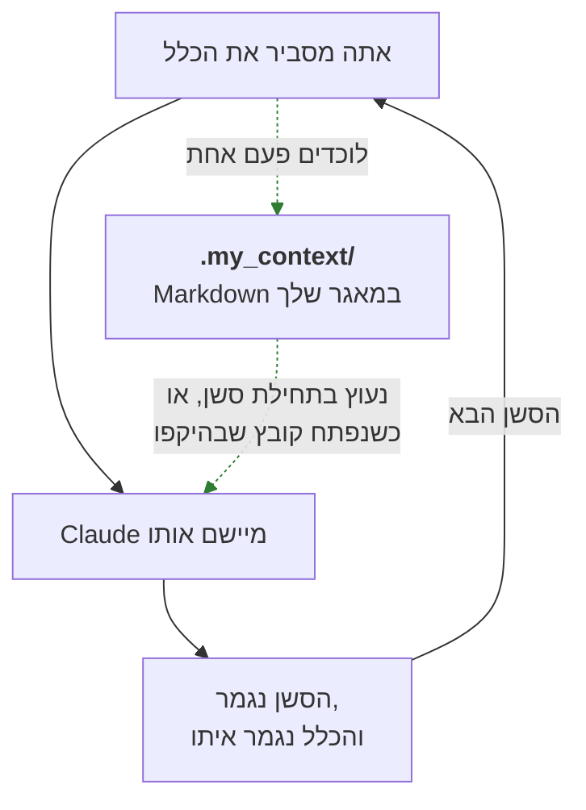
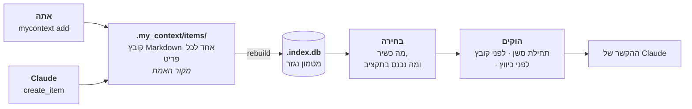
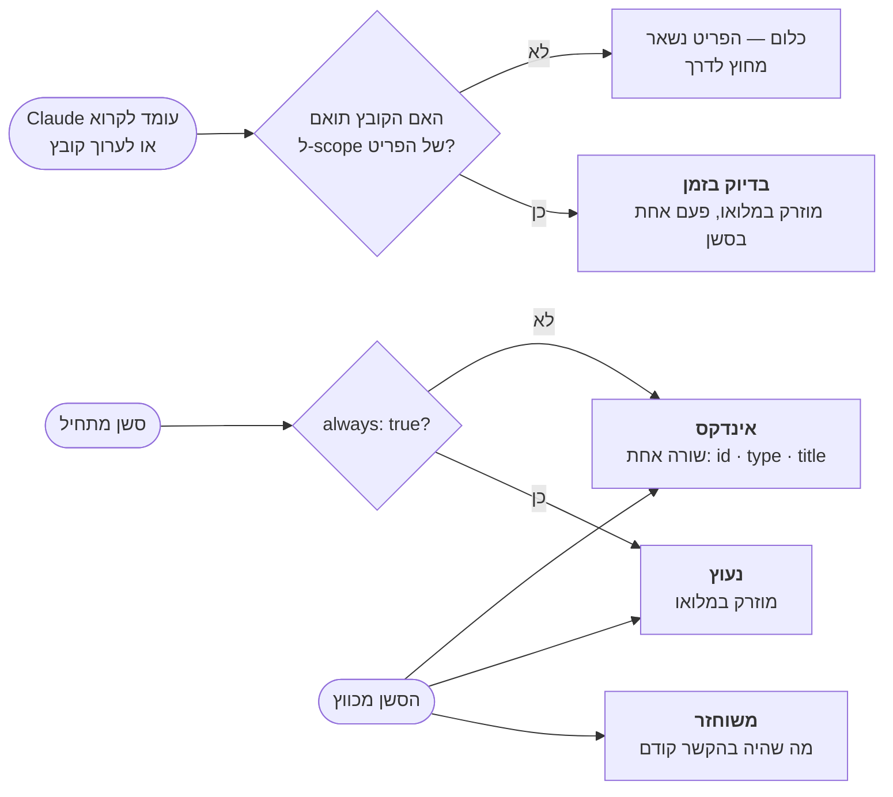
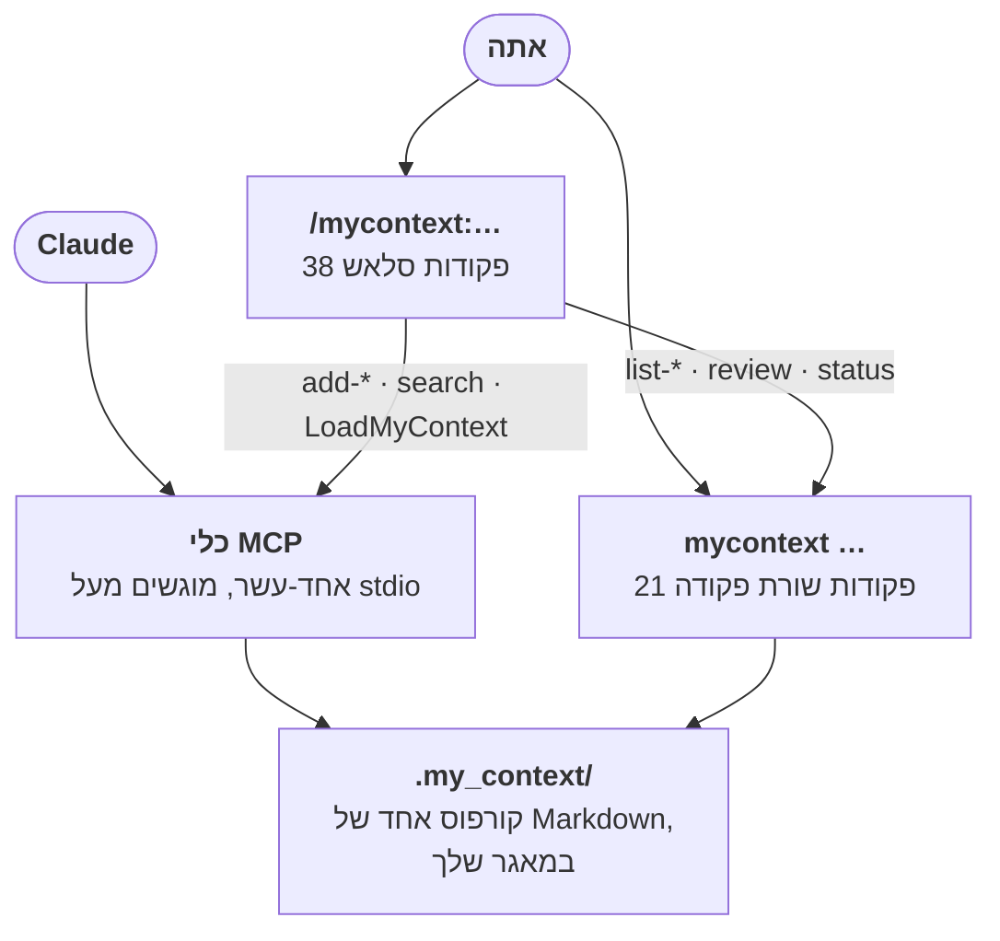
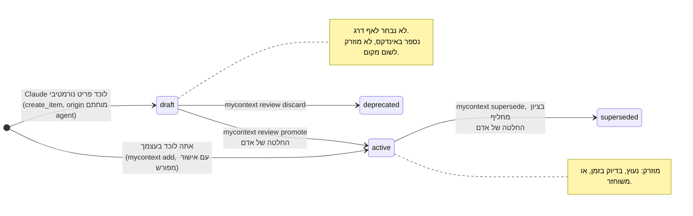

<!--
  Two conventions in this file, both about right-to-left rendering, both
  established by looking at the page GitHub renders rather than at the source:

  1. Hebrew prose lives inside `<div dir="rtl">` blocks. Fenced code and Mermaid
     blocks are deliberately left OUTSIDE them: inside an RTL container the
     bidi algorithm reverses the runs in a box-drawing table, and every
     generated example here is one.
  2. An inline code span whose first or last character is not alphanumeric
     carries a U+200E LEFT-TO-RIGHT MARK on that side. Without it `<id>` renders
     with the angle brackets mirrored and `"SELECT …"` renders with its quotes
     on the wrong ends — a code span is NOT automatically LTR on GitHub.

  Section structure and the `<!-- example: -->` markers must stay identical to
  README.md; `npm test` fails otherwise.
-->

# my_context

<div dir="rtl">

**תוסף ל-Claude Code שזוכר את הכללים של הפרויקט שלך, כדי שתפסיק לחזור עליהם.**

אתה מסביר ל-Claude איך הפרויקט הזה עובד. הסשן הבא מעולם לא שמע על זה. my_context לוכד
את הכללים האלה כקובצי Markdown בתוך המאגר שלך, ומחזיר את הרלוונטיים שבהם אל Claude
מעצמו — נעוצים בתחילת הסשן, או ברגע שהוא עומד לפתוח קובץ שהם חלים עליו.

</div>


<div dir="rtl">

Node 24 ומעלה, בלי תלויות זמן ריצה ובלי שלב בנייה — קובצי המקור של TypeScript מורצים
ישירות. ממהרים? [התקנה](#התקנה).

זו הגרסה העברית של [README.md](../README.md). המסמך האנגלי הוא המקור: מבנה הפרקים ובלוקי
הדוגמאות של שני הקבצים נשמרים זהים, אבל אין שום בדיקה שיכולה לקבוע שהתרגום עדכני, ולכן
פסקה כאן יכולה להישאר מאחור אחרי שינוי באנגלית. במקרה של סתירה, האנגלית קובעת.

## תוכן העניינים

1. [הבעיה](#1-הבעיה)
2. [הרעיון](#2-הרעיון)
3. [איך זה עובד, בשלושה צעדים](#3-איך-זה-עובד-בשלושה-צעדים)
4. [מתי זה חוזר, ומה](#4-מתי-זה-חוזר-ומה)
5. [שימוש](#5-שימוש) — [התקנה](#התקנה), [פקודות סלאש](#מה-שאתה-מקליד-פקודות-הסלאש), [שורת הפקודה](#מה-שאתה-מריץ-שורת-הפקודה), [כלי MCP](#מה-שהמודל-קורא-לו-כלי-ה-mcp)
6. [תצורה](#6-תצורה)
7. [גבול האמון](#7-גבול-האמון)
8. [עדיין לא זמין](#8-עדיין-לא-זמין)

## 1. הבעיה

אתה עובד על תהליך תשלום. אתה אומר ל-Claude: *מחירים הם מספר שלם של סנטים, אף פעם לא
דולרים בנקודה צפה — שגיאת העיגול בכל המרה היא הסיבה שהסכום הכולל לא התאים לשורות הפריטים
ברבעון שעבר.* Claude מסכים, מתקן את הקוד, והסשן נגמר.

יומיים אחר כך אתה פותח סשן חדש ומבקש תכונת הנחה. Claude כותב `price * 0.9`, ושגיאת
העיגול חזרה.

שום דבר לא התקלקל. הזיכרון של סשן נגמר כשהסשן נגמר. כל מה שהסברת — הנימוקים, התיקונים,
ה"לא, לא ככה" — הלך איתו.

### למה הדבקה מחדש לא פותרת את זה

הפתרון המתבקש הוא להדביק את הכללים שוב בתחילת כל סשן. הוא נכשל בשלוש דרכים בבת אחת.

- **אתה שוכח.** לא תמיד — רק בסשן שבו זה היה חשוב.
- **זה נודד.** כשמדביקים מהזיכרון, הכלל יוצא קצת אחרת בכל פעם. "סנטים שלמים" הופך
  ל"להימנע מנקודה צפה", שזו עצה ולא כלל, והסשן הבא מפרש אותו רופף יותר מקודמו.
- **זה עולה בכל סשן.** הכללים שלך נקראים ומחויבים מחדש בכל פעם, וכשיש לך תריסר מהם, רוב
  מה שאתה מדביק לא קשור בכלל לקובץ שאתה עומד לגעת בו.

### למה `CLAUDE.md` לבדו לא מספיק

`CLAUDE.md` הוא שיפור אמיתי לעומת הדבקה: Claude Code טוען אותו אוטומטית, כך שלפחות
הכללים מגיעים בלי שתעשה דבר. יש לו ארבע מגבלות שצצות ברגע שפרויקט גדול מקטן.

- **הוא סטטי.** הוא אומר את אותו הדבר בכל סשן, לא משנה במה אתה עוסק.
- **הוא חסר היקף.** אין דרך לומר "זה חל רק על קוד חיוב". כל כלל חל על כל קובץ באותה מידה,
  ובפועל זה אומר שכל כלל הוא רעש רקע לרוב העבודה.
- **הוא לא מבדיל.** "השתמש בהזחה של שני רווחים" יושב ליד "לעולם אל תכתוב כתובת דוא"ל של
  לקוח ליומן", ושום דבר לא מסמן שהאחד הוא העדפה והשני חשיפה משפטית.
- **הוא גדל עד שרק מרפרפים עליו.** כל כלל שאתה מוסיף מאריך את הקובץ, וקובץ ארוך מתחרה
  בעצמו על תשומת לב. שום דבר בו לא יוצא לגמלאות, כי שום דבר בו לא מתעד מתי הוא היה רלוונטי
  בפעם האחרונה.

### המחיר שאתה באמת מרגיש

זה לא באמת עניין של טוקנים. זה שאתה נותן את אותו התיקון שוב ושוב והוא אף פעם לא נדבק —
ושאחרי הפעם השלישית אתה מפסיק לסמוך על העבודה ומתחיל לבדוק אותה. הזמן הולך על הסברה
מחדש של החלטות שכבר קיבלת, במקום על קבלת חדשות.

my_context סוגר את הלולאה הזאת: אתה לוכד כלל פעם אחת, והחלק הרלוונטי ממה שלכדת חוזר
מעצמו, כשהוא חל.

</div>



<div dir="rtl">

החצים המלאים הם הלולאה שאתה נמצא בה היום. המקווקווים הם מה ש-my_context מוסיף: לכידה
אחת, ומסלול חזרה שלא תלוי בזה שתזכור.

## 2. הרעיון

my_context מחלק את מה שפרויקט יודע לשני סוגים, ומתייחס אליהם אחרת.

**ידע נורמטיבי** הוא מה שחייב להתקיים. אילוצים, אינווריאנטות, כללים, דרישות, תקנים,
תבניות, מונחים, הוראות, לא-מטרות ושאלות פתוחות. *מחירים הם סנטים שלמים.* *לעולם אל
תכתוב כתובת דוא"ל של לקוח ליומן.* *מאגר החיבורים מוגבל ל-20.* אלה עונים על השאלה **"מה
אסור לי לפספס כאן?"**

**נימוקים** (rationale) הם הסיבה שהפרויקט הוא כפי שהוא. החלטות, ADRים, לקחים, פשרות,
הנחות, מקרי קצה, סיכונים. *בחרנו ב-Stripe על פני Adyen כי תזמון הסליקה התאים ללוח
התשלומים שלנו.* *סופות ניסיונות חוזרים צריכות ריווח אקראי — למדנו את זה בדרך הקשה
במרץ.* אלה עונים על **"למה זה ככה?"**

שני הסוגים ראויים לשמירה. רק הראשון שולט.

</div>

<!-- example: list --summary -->
```text
┌───────────────┬───────┐
│ type          │ items │
├───────────────┼───────┤
│ constraint    │ 1     │
│ decision      │ 2     │
│ invariant     │ 1     │
│ lesson        │ 1     │
│ open_question │ 1     │
│ requirement   │ 1     │
│ rule          │ 2     │
│ standard      │ 1     │
└───────────────┴───────┘

10 item(s)
```
<!-- /example -->

<div dir="rtl">

זהו פרויקט קטן לדוגמה — Bookstore API בדיוני — שמשמש לאורך כל המסמך הזה. שבעה מעשרת
הפריטים שלו נורמטיביים ושלושה הם נימוקים. `mycontext help categories` מדפיס את הרשימה
המלאה של הסוגים ואת הדרג שכל אחד שייך אליו.

### למה החלוקה נושאת משקל, ולא רק מתייקת

קל לקרוא את זה כטקסונומיה: דרך מסודרת למיין הערות. זה לא. החלוקה קובעת **איזה טקסט רשאי
לשנות בשקט את התנהגות הסוכן.**

טקסט נורמטיבי מוזרק להקשר של Claude במלואו, בלי שביקשו, והוא כתוב בציווי. זו בדיוק
הנקודה — כלל שצריך לבקש אותו הוא כלל שנשכח. אבל טקסט עם טווח כזה הוא טקסט שמכוון, ולכן
הוא חייב להיות טקסט שמישהו אישר.

נימוקים לעולם לא נכנסים לסשן בדרך הזאת. בתחילת סשן הם תורמים ספירה — "2 decision ·
1 lesson" — ולא יותר. הם מאונדקסים, ניתנים לחיפוש ולשליפה לפי בקשה, אבל הם לא מגיעים
בלי הזמנה ולא מנסחים את עצמם כפקודה.

הפרש הטווח הזה הוא הסיבה ששני הדרגים כפופים לכללים שונים לגבי מי רשאי להוסיף להם.
כשClaude לוכד פריט נורמטיבי, הוא נוחת כ**טיוטה** ואינו שולט בכלום עד שאדם מקדם אותו.
כש-Claude לוכד פריט נימוק, הוא פשוט נרשם. לטעות לגבי *למה* עולה לך בהסבר מטעה; לטעות
לגבי *מה חייב להתקיים* עולה לך בקוד שגוי, שנכתב בביטחון, בידי משהו שסמכת עליו שהוא מכיר
את הכלל. גבול האישור, ומגבלותיו, מתוארים במלואם ב[פרק 7](#7-גבול-האמון).

## 3. איך זה עובד, בשלושה צעדים

</div>



<div dir="rtl">

### צעד 1 — אתה לוכד את זה

אתה מנסח את הכלל פעם אחת, בשורת הפקודה או בבקשה מ-Claude לרשום אותו.

</div>

<!-- example: add constraint "Uploads capped at 10 MB" --body "The API gateway rejects a larger body before it reaches us, so accepting one only produces a timeout the customer cannot explain." --scope "src/api/**" --tags uploads --yes -->
```text
about to create constraint "Uploads capped at 10 MB" — active, and governing this project at once.
my_context: created CONST-uploads-capped-at-10-mb (active) at items/constraint/CONST-uploads-capped-at-10-mb.md.
```
<!-- /example -->

<div dir="rtl">

שלושה דברים בפקודה הזאת חשובים.

- ‎`--scope "src/api/**"`‎ הוא מה שהופך את הכלל לממוקד במקום סביבתי. זו תבנית קבצים:
  האילוץ הזה נוגע לשכבת ה-API, ולכן הוא יחזור כשנוגעים בקוד של ה-API וישאר מחוץ לדרך
  בכל מצב אחר. כלל בלי היקף נשמר, מאונדקס וניתן לחיפוש, אבל לעולם לא מוזרק מעצמו — ראו
  [פרק 4](#4-מתי-זה-חוזר-ומה).
- ‎`--yes` נדרש מפני שזו קטגוריה נורמטיבית. הפריט שולט בפרויקט מרגע שהוא קיים, והדגל הוא
  ההכרה המפורשת בכך. קטגוריות של נימוקים אינן דורשות אישור.
- המזהה, `CONST-uploads-capped-at-10-mb`, נגזר מהכותרת. תראה אותו בהקשר של Claude,
  ב-`mycontext list`, ובשם הקובץ.

גם Claude יכול ללכוד פריטים, בעזרת הכלי `create_item`. פריט נורמטיבי שנלכד כך נוחת
כטיוטה וממתין לך.

### צעד 2 — זה נשמר כ-Markdown שאפשר לקרוא, להשוות ולסקור

כל פריט הוא קובץ אחד תחת ‎`.my_context/items/<type>/<id>.md`, במאגר שלך, ב-Markdown רגיל.

</div>

<!-- example: show CONST-postgres-pool-capped-at-20 -->
```text
---
id: CONST-postgres-pool-capped-at-20
type: constraint
title: Postgres pool capped at 20
status: active
severity: hard
always: true
scope: []
tags:
  - database
  - capacity
origin: agent
source_file: null
source_anchor: null
source_checksum: null
valid_from: 2026-08-14
valid_until: null
checksum: a81dff73a154242e
---

# Postgres pool capped at 20

The managed Postgres plan allows 120 connections. Five API instances at 20 each
leaves 20 for migrations, backups and the admin console. Raising the pool past 20
does not buy throughput; it buys `remaining connection slots are reserved` during
the next deploy.
```
<!-- /example -->

<div dir="rtl">

הגוש שבין שורות ה-‎`---`‎ הוא ה-frontmatter: השדות ש-my_context משתמש בהם כדי להחליט מתי
הפריט הזה חוזר ועד כמה לסמוך עליו. כל מה שמתחתיו הוא הגוף, והגוף הוא מה ש-Claude באמת
קורא.

הצורה הזאת מכוונת. הכללים של הפרויקט שלך חיים ב-git, ולכן הם מופיעים ב-diff של pull
request, נסקרים כמו קוד, מסתעפים ומתמזגים יחד עם הקוד שהם מתארים, ואפשר לקרוא אותם בלי
להריץ כלום. אין בסיס נתונים שצריך לתשאל כדי לגלות במה הפרויקט שלך מאמין.

*יש* בסיס נתונים — ‎`.my_context/.index.db`, מסוג SQLite — אבל הוא נגזר, לא נכתב ידנית.
הוא קיים כדי שחיפוש בזמן סשן יהיה מהיר. מחקו אותו ו-`mycontext rebuild` יבנה אותו מחדש
מה-Markdown. ה-Markdown הוא מקור האמת; האינדקס הוא מטמון.

השלכה אחת שכדאי להכיר מוקדם: אל תערוך קובץ פריט ביד. כל מסלול כתיבה מחשב מחדש את שדה
ה-`checksum` של הפריט, ועריכה ידנית לא, ולכן סכום הביקורת הרשום מפסיק להתאים לתוכן.
`mycontext doctor` ידווח על הפער הזה מאותו רגע.

### צעד 3 — זה חוזר מעצמו

כשסשן מתחיל, Claude Code מריץ את ה*הוקים* של my_context — תוכניות קטנות ש-Claude Code
מריץ ברגעים קבועים, לפני שקורה משהו אחר. ההוק של תחילת הסשן בוחר את הפריטים שחלים ומוסר
אותם ל-Claude כהקשר. זה מה שהמודל מקבל, מילה במילה:

</div>

```text
## my_context — these govern this project

### CONST-postgres-pool-capped-at-20 · constraint · Postgres pool capped at 20

The managed Postgres plan allows 120 connections. Five API instances at 20 each
leaves 20 for migrations, backups and the admin console. Raising the pool past 20
does not buy throughput; it buys `remaining connection slots are reserved` during
the next deploy.

## my_context index
- INV-prices-are-integer-cents · invariant · Prices are integer cents
- REQ-checkout-completes-in-two-steps · requirement · Checkout completes in two steps
- RULE-never-log-customer-email · rule · Never log customer email
- STD-api-errors-use-problem-json · standard · API errors use Problem JSON

2 decision · 1 lesson · 1 drafts pending review · 1 retired
→ use mycontext list or mycontext show <id> to browse these
```

<div dir="rtl">

פריט אחד הגיע במלואו, מפני שהוא נעוץ. ארבעה הגיעו כשורה אחת כל אחד, כך ש-Claude יודע
שהם קיימים ויכול לשלוף כל אחד מהם לפי מזהה. פריטי הנימוקים הגיעו כספירה. שום דבר לא
הושמט בלי שנאמר עליו.

הוק שני רץ לפני ש-Claude קורא או עורך קובץ, ושם ההיקף משתלם. הפרק הבא עוסק בשאלה מי מהם
נורה מתי.

## 4. מתי זה חוזר, ומה

יש ארבעה דרגים. לכל אחד תנאי שמפעיל אותו וכלל לגבי מה שהוא מכיל.

| דרג | מתי נורה | מה מכיל |
|---|---|---|
| **נעוץ** | בתחילת כל סשן, ושוב אחרי כיווץ | כל פריט נורמטיבי פעיל שמסומן `always: true`, במלואו |
| **בדיוק בזמן** | Claude עומד לקרוא או לערוך קובץ שתואם ל-`scope` של פריט | אותו פריט, במלואו |
| **משוחזר** | אחרי כיווץ | הפריטים שהיו בהקשר לפניו |
| **אינדקס** | בתחילת כל סשן, ואחרי כיווץ | שורה אחת לכל פריט נורמטיבי שנותר, ועוד ספירות לשאר |

</div>



<div dir="rtl">

### נעוץ — המעטים שתמיד חלים

פריט עם `always: true` ב-frontmatter שלו מוזרק במלואו בתחילת כל סשן, לא משנה על מה אתה
עובד ובאילו קבצים אתה נוגע. בדוגמה שלמעלה זהו `CONST-postgres-pool-capped-at-20`: מגבלה
שמצרה כל קוד שפותח חיבור לבסיס נתונים, כך שלחכות לקובץ תואם זה לחכות יותר מדי.

נעיצה מיועדת לקבוצה הקטנה של כללים שהם באמת חסרי תנאי. לדרג הנעוץ יש תקציב משלו, וכל מה
שנעצת מתחרה עליו מול כל מה שנעצת קודם.

פריט מקבל `always: true` בקידום שלו באמצעות
`mycontext review promote <id> --always` בזמן שהוא עדיין טיוטה. זה המסלול היחיד כרגע,
והפער הזה נאמר ב[פרק 6](#6-תצורה) במקום להיטאטא מתחת לשטיח.

### בדיוק בזמן — אלה שחלים על מה שאתה נוגע בו

`scope` הוא רשימה של תבניות קבצים. כש-Claude עומד לקרוא או לערוך קובץ, my_context מחפש
פריטים נורמטיביים פעילים שההיקף שלהם תואם לנתיב הזה ומזריק אותם, במלואם, לפני שהכלי רץ.

ל-`INV-prices-are-integer-cents` יש `scope: src/billing/**`‎:

</div>

<!-- example: show INV-prices-are-integer-cents -->
```text
---
id: INV-prices-are-integer-cents
type: invariant
title: Prices are integer cents
status: active
severity: soft
always: false
scope:
  - src/billing/**
tags:
  - billing
  - money
origin: human
source_file: null
source_anchor: null
source_checksum: null
valid_from: 2026-08-14
valid_until: null
checksum: b9c3d588c634c8cc
---

# Prices are integer cents

Every price crossing a module boundary is an integer number of cents.
Floating-point dollars re-introduce a rounding error at each conversion, and the
total a customer approves at checkout must equal the sum of its line items exactly.
```
<!-- /example -->

<div dir="rtl">

כך שברגע ש-Claude פותח את `src/billing/prices.js`, זה מה שהוא מקבל ראשון:

</div>

```text
## my_context — these govern this project

### INV-prices-are-integer-cents · invariant · Prices are integer cents

Every price crossing a module boundary is an integer number of cents.
Floating-point dollars re-introduce a rounding error at each conversion, and the
total a customer approves at checkout must equal the sum of its line items exactly.

_scope: src/billing/**_

### RULE-never-log-customer-email · rule · Never log customer email

Log the customer id instead. Access logs are shipped to a third-party aggregator
that our data-processing agreement does not cover, so an email address in a log
line leaves the boundary the checkout flow promises the customer.

_scope: src/**_
```

<div dir="rtl">

שני פריטים תאמו: האינווריאנטה של החיוב, וכלל שהיקפו `src/**`‎ וחל גם על הקובץ הזה. פתחו
במקום זאת את `src/catalogue/search.js` ורק השני יגיע — האינווריאנטה של החיוב אינה
רלוונטית שם, ולכן לא מוציאים עליה.

שלושה פרטים שמפתח ירצה לדעת:

- **היקף הוא אדיש כברירת מחדל.** פריט בלי תבניות היקף לעולם לא מוזרק על ידי הדרג הזה. זה
  מכוון: ברירת מחדל שבה פריט חסר היקף "תואם להכול" הייתה ממלאת מחדש את חלון ההקשר ככל
  שהקורפוס גדל, וזה בדיוק הכישלון שהתכנון הזה קיים כדי למנוע. פריט בלי היקף ובלי נעיצה
  מאונדקס וניתן לשליפה, ולא יותר. `mycontext status` סופר אותם בשבילך.
- **כל פריט מגיע פעם אחת בסשן.** my_context רושם מה כבר הזריק, כך שעריכה של עשרה קובצי
  חיוב לא מספקת את אותה אינווריאנטה עשר פעמים.
- **בדרג הזה אין אינדקס.** הזרקה שנורתה מקובץ מכילה את הפריטים התואמים ותו לא. האינדקס
  הוא עלות לכל סשן, לא לכל קובץ.

### משוחזר — אחרי שחלון ההקשר מכווץ

סשן ארוך מוצה בסוף את חלון ההקשר, ו-Claude Code *מכווץ* אותו: מסכם את השיחה עד כה וממשיך
מהסיכום. הסיכום קצר בהרבה ממה שהוא מחליף, והכללים שהוזרקו קודם הם בדרך כלל בין מה שהוא
משמיט.

my_context מצלם תמונת מצב מיד לפני שזה קורה, ורושם אילו פריטים היו במשחק — גם אלה שהזריק
וגם אלה שהוזכרו לפי מזהה בתמליל. כשהסשן מתחדש אחרי הכיווץ, הפריטים האלה מוזרקים מחדש,
לצד הדרג הנעוץ והאינדקס.

שתי מגבלות שנאמרות בכנות. תמונת המצב מפותחת לפי מזהה הסשן שההוקים מקבלים, ולכן פריטים
שטענת ידנית עם ‎`/mycontext:LoadMyContext` אינם נרשמים ואינם משוחזרים — למשטח הזה אין
מזהה סשן אמין לרשום מולו. ושחזור מוגבל בתקציב משלו, כמו כל דרג אחר.

### האינדקס — כדי ששום דבר לא יהיה בלתי נראה

את כל מה שהדרגים שלמעלה לא סיפקו במלואו, האינדקס מונה. שורה אחת לכל פריט נורמטיבי פעיל
שנותר: מזהה, סוג, כותרת. מספיק כדי ש-Claude יידע שהכלל קיים ויוכל לשלוף אותו לפי מזהה
כשיתברר שהוא חשוב, וזול מספיק כדי לכלול אותו בכל פעם.

פריטי נימוקים אינם מנויים אחד-אחד. הם נספרים לפי סוג — `2 decision`, `1 lesson` — לצד
מספר הטיוטות הממתינות לסקירה ומספר הפריטים שיצאו לגמלאות. פריט שהקטגוריה שלו כובתה
בתצורה נספר גם הוא, ומסומן ככזה, כך שכיבוי קטגוריה לעולם לא מעלים את פריטיה בלי סימן.

פריט שכבר סופק במלואו לא מקבל שורת אינדקס. ל-Claude כבר יש את הכלל כולו, והוצאת מקום
באינדקס על חזרה הייתה דוחפת החוצה משהו שבאמת לא נראה.

### התקציב, ומה קורה כשלא נכנסים בו

לכל דרג יש מגבלת גודל, כדי שקורפוס שגדל לא ישתלט בשקט על חלון ההקשר. ברירות המחדל:

| תקציב | ברירת מחדל | מה הוא מנהל |
|---|---|---|
| `pinned` | 1500 | הדרג הנעוץ בתחילת סשן |
| `jit` | 500 | הזרקה אחת שנורתה מקובץ |
| `restored` | 2000 | ההזרקה מחדש אחרי כיווץ |
| `index` | 150 | רשימת האינדקס |

היחידה היא טוקנים משוערים, ו"משוערים" נאמר כפשוטו: זו ספירת התווים חלקי ארבע. my_context
נשלח בלי תלויות זמן ריצה ולכן בלי מנתח טוקנים, כך שזהו קירוב שיכול לסטות לשני הכיוונים,
לא תקרה מובטחת.

פריטים מתקבלים מהקשה לרך — `severity: hard` לפני `severity: soft`, שכבת הפרויקט לפני
הגלובלית, ואז לפי מזהה כדי שהתוצאה תהיה דטרמיניסטית. פריט גדול מדי למקום שנותר מדולג
במקום לסיים את המעבר, כך שפריט קטן יותר אחריו עדיין יכול להתקבל.

**מה שלא נכנס נמנה, ולעולם לא נזרק בשקט** — האינווריאנטה של הפרויקט עצמו,
`INV-nothing-is-dropped-silently`. באופן מוחשי, פריט שדרג של טקסט מלא לא הצליח להכיל
מופיע פעמיים: בשמו בהערה בת שורה מתחת להזרקה,

</div>

```text
_1 item(s) omitted from full text for budget: CONST-postgres-pool-capped-at-20. Fetch with mycontext show <id>._
```

<div dir="rtl">

ושוב כשורה רגילה באינדקס, כי הוא לא סופק במלואו ולכן עדיין ראוי לאזכור.

יש מקום אחד שבו מזהה מסוים אינו ננקב בשם, וכדאי לומר אותו בפירוש: כשל*אינדקס עצמו* נגמר
התקציב, השורות שלא נכנסות מוחלפות בספירה.

</div>

```text
- … +2 more (fetch with mycontext show <id>)
```

<div dir="rtl">

הספירה לעולם אינה שגויה, ו-`mycontext list` מציג את הקורפוס כולו מהטרמינל — אבל בתוך
הסשן ההוא Claude רואה את המספר ולא את השמות. בכל מקום אחר, מה שהושמט ננקב בשם במקום שבו
הושמט.

## 5. שימוש

ל-my_context שני משטחים מעל קורפוס אחד. האחד בשבילך, השני בשביל המודל, והחלוקה מכוונת
ולא היסטורית.

**אתה** מקליד פקודות סלאש בתוך סשן של Claude Code, או מריץ את הפקודה `mycontext` בטרמינל.
**המודל** קורא לאחד-עשר כלי ה-MCP. שני המשטחים קוראים וכותבים לאותם קובצי Markdown תחת
‎`.my_context/`‎, כך שפריט שלכדת בטרמינל נמצא באינדקס של המודל בפעם הבאה שהוא מסתכל, ופריט
שהמודל לכד מופיע ב-`mycontext list` מיד.

שניהם קיימים מפני שכל אחד מהם בלתי שמיש במצב של האחר. המודל לא יכול לעצור באמצע משפט
ולפתוח טרמינל, ולכן הוא צריך כלים שאפשר לקרוא להם ישירות. אתה צריך משטח שעובד כששום מודל
אינו בחדר — בסקריפט, ב-CI, או כשאתה פשוט רוצה לקרוא במה הפרויקט מאמין. וכמה פעולות
אמורות להיות שלך בלבד: קידום טיוטה, הוצאה לגמלאות של פריט ששולט. עד כמה ההפרדה הזאת
באמת מחזיקה — [פרק 7](#7-גבול-האמון), וכדאי לקרוא אותו לפני שסומכים עליה.

</div>



<div dir="rtl">

### התקנה

יש שני חצאים, והם מותקנים אחרת. הפקודה `mycontext` היא חבילת npm במאגר הזה. פקודות
הסלאש, ההוקים ושרת ה-MCP הם **תוסף** של Claude Code — מוצהר על ידי
‎`.claude-plugin/plugin.json` ומתגלה מתוך `commands/`‎, `hooks/hooks.json` ו-‎`.mcp.json`
בשורש המאגר.

**הפקודה.** משכפול של המאגר הזה:

</div>

```bash
npm install
npm link          # provides the `mycontext` command

cd /path/to/your/project
mycontext init
```

<div dir="rtl">

`mycontext init` יוצר ‎`.my_context/`‎ בתיקייה הנוכחית, עם תיקיית `items/`‎, קובץ
`config.json` וקובץ ‎`.gitignore`. הכניסו אותו ל-git: הקורפוס אמור לנסוע יחד עם הקוד שהוא
מתאר. בלי `npm link`, כל פקודה עובדת גם כ-`node /path/to/my-context/src/cli/index.ts <args>`‎.

**התוסף.** מסלול אחד מאומת כעובד היום, והוא לכל סשן בנפרד:

</div>

```bash
claude --plugin-dir /path/to/my-context
```

<div dir="rtl">

כדי לבדוק מה נטען, שאלו את Claude Code עצמו:

</div>

```bash
claude --plugin-dir /path/to/my-context plugin details mycontext
```

<div dir="rtl">

הוא מדפיס את מצאי הרכיבים — 38 הפקודות והמיומנות `mycontext`, ארבעת ההוקים
(`SessionStart`, `PreToolUse`, `PreCompact`, `PostToolUse`) ושרת ה-MCP האחד — וכך אתם
מוודאים שהתוסף נטען במקום להניח שכן.

**התקנה מתמידה אינה זמינה עדיין, וכדאי לדעת את זה לפני שמנסים.** המסלול של
‎`/plugin marketplace add` ו-‎`/plugin install` דורש ‎`.claude-plugin/marketplace.json`,
והמאגר הזה אינו כולל כזה: `claude plugin marketplace add ./`‎ בתיקייה הזאת נכשל עם
`Marketplace file not found`. עד שהמניפסט הזה יהיה קיים — [פרק 8](#8-עדיין-לא-זמין) —
‎`--plugin-dir` בכל הפעלה הוא המסלול. שני המשפטים שלמעלה נקבעו על ידי הרצת הפקודות, לא
מקריאת התיעוד.

### מה שאתה מקליד: פקודות הסלאש

פקודות סלאש נמצאות במרחב השם של התוסף, ולכן כל אחת מהן מתחילה ב-‎`/mycontext:`‎. מקובצות
לפי מה שאתה מנסה לעשות:

**לכידה.** פקודת `add-<type>`‎ אחת לכל קטגוריה מופעלת. הנורמטיביות —
‎`/mycontext:add-constraint`, ‎`/mycontext:add-invariant`, ‎`/mycontext:add-rule`,
‎`/mycontext:add-requirement`, ‎`/mycontext:add-standard`, ‎`/mycontext:add-pattern`,
‎`/mycontext:add-glossary`, ‎`/mycontext:add-instruction`, ‎`/mycontext:add-non-goal`,
‎`/mycontext:add-open-question` — לוכדות דרך הכלי `create_item` ונוחתות כ**טיוטות**. אלה
של הנימוקים — ‎`/mycontext:add-adr`, ‎`/mycontext:add-decision`, ‎`/mycontext:add-lesson`,
‎`/mycontext:add-tradeoff`, ‎`/mycontext:add-assumption`, ‎`/mycontext:add-edge-case`,
‎`/mycontext:add-risk` — נוחתות פעילות, מפני שנימוקים לעולם אינם מוזרקים ולכן אינם יכולים
לכוון שום דבר בשקט.

</div>

```
/mycontext:add-constraint  The connection pool is capped at 20
/mycontext:add-decision    We chose Stripe because settlement timing matched payouts
```

<div dir="rtl">

**חיפוש.** ‎`/mycontext:search` מקבלת מילים וקוראת לכלי `query_items`; זה המקום להתחיל בו
כשאינך יודע מזהה. פקודת `list-<type>`‎ אחת לכל קטגוריה מופעלת מדפיסה את הטבלה של אותה
קטגוריה: ‎`/mycontext:list-constraint`, ‎`/mycontext:list-invariant`,
‎`/mycontext:list-rule`, ‎`/mycontext:list-requirement`, ‎`/mycontext:list-standard`,
‎`/mycontext:list-pattern`, ‎`/mycontext:list-glossary`, ‎`/mycontext:list-instruction`,
‎`/mycontext:list-non-goal`, ‎`/mycontext:list-open-question`, ‎`/mycontext:list-adr`,
‎`/mycontext:list-decision`, ‎`/mycontext:list-lesson`, ‎`/mycontext:list-tradeoff`,
‎`/mycontext:list-assumption`, ‎`/mycontext:list-edge-case`, ‎`/mycontext:list-risk`. כל
אחת מקבלת את אותם דגלי פירוט כמו שורת הפקודה.

‎`/mycontext:LoadMyContext` היא היוצאת דופן: היא מזריקה את הפריטים הנעוצים ואת האינדקס אל
הסשן עכשיו, בלי לחכות לתחילת סשן. השתמשו בה כשניקיתם את ההקשר, או אחרי כיווץ — פריטים
שנטענו כך אינם נכנסים לתמונת המצב ואינם משוחזרים אוטומטית.

**סקירה.** ‎`/mycontext:review` עוברת על תור הטיוטות ומדפיסה, לכל אחת, על מה היא תשלוט.
היא נעצרת שם במכוון: היא אומרת לך את הפקודה המדויקת,
`mycontext review promote <id>`‎ או `mycontext review discard <id>`‎, ואינה מריצה אותה
בשבילך.

**אבחון.** ‎`/mycontext:status` מדפיסה את אותו דוח כמו `status` בשורת הפקודה, ועוד שתי
שורות לכל היותר שאומרות מה דורש את תשומת לבך.

</div>

```
/mycontext:search           connection pool
/mycontext:list-decision    --full
/mycontext:review
/mycontext:status
/mycontext:LoadMyContext
```

<div dir="rtl">

יש `add-<type>`‎ אחת ו-`list-<type>`‎ אחת לכל קטגוריה **מופעלת** — 34 היום, ועוד `search`,
`review` ו-`status`. הן נוצרות מאותה תצורה מיושבת ש-`mycontext help categories` מדפיס,
על ידי `npm run gen:commands`, ובדיקה נכשלת אם הקבצים ששמורים ב-git והמחולל אינם מסכימים:
קטגוריה מכובה אינה יכולה לשמור פקודה שתסורב אחר כך.

כל 37 אלה נושאות `disable-model-invocation: true`, וזה בתוקף — הן המשטח שלך, לא של
המודל. ‎`/mycontext:LoadMyContext` היא היוצאת דופן היחידה, והיא הפקודה היחידה שרק קוראת.

**ל"בתוקף" יש כאן תפקיד, והנה למה.** עד לאחרונה זה לא היה כך. תשע-עשרה מ-38 הקבצים —
17 פקודות ה-`list-<type>`‎ ועוד `review` ו-`status` — נשאו
`argument-hint: [--full|--short|--summary] [--json]`‎, שפותח רצף זרימה של YAML ואז גורר
עוד אחד: לא YAML תקין. ההודעה של Claude Code למקרה הזה מפורשת — *at runtime this command
loads with empty metadata (all frontmatter fields silently dropped)* — כך שב-19 האלה
`disable-model-invocation` היה כתוב ולא בתוקף, והמודל יכול היה להפעיל פקודות שאמרו שהוא
לא יכול. כל רמז מצוטט עכשיו, כל 37 הקבצים נוצרו מחדש,
ו-`claude --plugin-dir . plugin validate .`‎ עובר עם אפס שגיאות מול המאגר הזה. הבדיקה
ב-`test/plugin/commands.test.ts` נהגה לבדוק את השורות האלה בביטוי רגולרי, ולכן היא עברה
לאורך כל הדרך; היום היא מנתחת את ה-frontmatter ומוודאת ש-`disable-model-invocation` חוזר
כערך הבוליאני `true`.

**אי-סימטריה אחת, שנאמרת במקום להיטשטש: ל-‎`/mycontext:search` אין מקבילה בשורת הפקודה.**
אין פקודת `search` בשורת הפקודה. פקודת הסלאש קוראת ישירות לכלי ה-MCP `query_items`,
והמקבילות הקרובות ביותר בטרמינל הן `mycontext list` לקטגוריה ו-`mycontext query` ל-SQL
מעל האינדקס. שני המשטחים עדיין אינם מכסים את אותו שטח.

### מה שאתה מריץ: שורת הפקודה

עשרים ואחת פקודות. `mycontext help` מדפיס את אותה רשימה מהתוכנית עצמה,
ו-`mycontext help <topic>`‎ מסביר אחד מ-`categories`, `scope`, `capture`, `workflow`.

**לכידה ושינוי.**

| פקודה | מה היא עושה |
|---|---|
| `mycontext init` | יוצרת ‎`.my_context/`‎ בתיקייה הנוכחית |
| `mycontext add <category> <title>`‎ | יוצרת פריט — ‎`--body`, ‎`--scope`, ‎`--tags`, ‎`--severity`, ‎`--yes` |
| `mycontext review promote <id>`‎ | הופכת טיוטה לפריט פעיל ששולט |
| `mycontext review discard <id>`‎ | מוציאה טיוטה לגמלאות |
| `mycontext supersede <id> --by <id>`‎ | מוציאה לגמלאות פריט ששולט לטובת מחליף |
| `mycontext repair` | מחתימה מחדש את סכום הביקורת של פריט שהקובץ שלו כבר לא תואם לו |
| `mycontext rebuild` | בונה מחדש את ‎`.index.db` מה-Markdown |

`add` מקבלת ‎`--body`, ‎`--scope`, ‎`--tags` ו-‎`--severity hard|soft`, ומסרבת
לכל אפשרות שאינה מוכרת לה במקום לקפל אותה לתוך הכותרת. ‎`--scope` ו-‎`--tags` הם
רשימות: מופרדים בפסיקים, ניתנים לחזרה, ושתי הצורות מתחברות — כך
ש-‎`--scope "src/api/**,src/db/**"` ו-‎`--scope src/api/** --scope src/db/**` פירושם
אותו דבר. דגל בעל ערך יחיד שניתן פעמיים (‎`--body x --body y`) מסורב במקום להיפתר לאחד
מהם, בכל פקודה שמקבלת כזה. תצפיות ויחסים אינם ניתנים לביטוי
כדגלים — לשם כך יש את הכלים `create_item` ו-`link_items`. ‎`--yes` נדרש לקטגוריה
**נורמטיבית**, מפני שהפריט הזה שולט בפרויקט מרגע שהוא קיים; קטגוריות של נימוקים אינן
דורשות אישור.

**חיפוש וקריאה.**

| פקודה | מה היא עושה |
|---|---|
| `mycontext list [category]`‎ | הקורפוס כטבלה |
| `mycontext show <id>`‎ | פריט אחד במלואו, בדיוק כפי שהוא על הדיסק |
| `mycontext query "SELECT …"`‎ | SQL לקריאה בלבד מעל האינדקס |
| `mycontext examples <category>`‎ | פריט לדוגמה שלם ותקין מאותו סוג |
| `mycontext help [topic]`‎ | הדרכה: categories, scope, capture, workflow |

</div>

<!-- example: list -->
```text
┌─────────────────────────────────────┬───────────────┬────────────┬─────────────────────────────────┐
│ id                                  │ type          │ status     │ title                           │
├─────────────────────────────────────┼───────────────┼────────────┼─────────────────────────────────┤
│ CONST-postgres-pool-capped-at-20    │ constraint    │ active     │ Postgres pool capped at 20      │
│ DEC-search-with-postgres-full-text  │ decision      │ active     │ Search with Postgres full text  │
│ DEC-use-stripe-for-payments         │ decision      │ active     │ Use Stripe for payments         │
│ INV-prices-are-integer-cents        │ invariant     │ active     │ Prices are integer cents        │
│ LESSON-retry-storms-need-jitter     │ lesson        │ active     │ Retry storms need jitter        │
│ OPENQ-which-search-engine           │ open_question │ superseded │ Which search engine?            │
│ REQ-checkout-completes-in-two-steps │ requirement   │ active     │ Checkout completes in two steps │
│ RULE-cache-keys-include-tenant-id   │ rule          │ draft      │ Cache keys include tenant ID    │
│ RULE-never-log-customer-email       │ rule          │ active     │ Never log customer email        │
│ STD-api-errors-use-problem-json     │ standard      │ active     │ API errors use Problem JSON     │
└─────────────────────────────────────┴───────────────┴────────────┴─────────────────────────────────┘
```
<!-- /example -->

<div dir="rtl">

`mycontext show <id>`‎ מדפיס את הקובץ עצמו, כולל ה-frontmatter — אותו פלט שמופיע
ב[פרק 3](#3-איך-זה-עובד-בשלושה-צעדים). `mycontext examples <category>`‎ מדפיס דוגמה
מלאה של סוג שלא השתמשת בו קודם, כדי שתראה את הצורה לפני שאתה כותב אחת:

</div>

<!-- example: examples rule -->
```text
---
id: RULE-never-log-request-bodies-on-auth-endpoints
type: rule
title: Never log request bodies on auth endpoints
status: active
severity: soft
always: false
scope:
  - src/api/auth/**
tags: []
origin: human
source_file: null
source_anchor: null
source_checksum: null
valid_from: <today>
valid_until: null
checksum: 0040bc230528c1af
directive: dont
---

# Never log request bodies on auth endpoints

Bodies carry passwords and reset tokens; logs are retained for 90 days.
```
<!-- /example -->

<div dir="rtl">

בשדה `valid_from`‎ כתוב `<today>`‎ מפני שהשדה הזה נחתם ביום שבו הפקודה רצה. כל בלוק במסמך
הזה נוצר מהרצה אמיתית של הפקודה שמעליו ונבדק מחדש על ידי מערך הבדיקות, ולכן תאריך אמיתי
שהיה מודפס שם היה תאריך שגוי עבור כל מי שלא הריץ את הפקודה ביום שבו הבלוק נוצר.

**סקירת התור.**

</div>

<!-- example: review list -->
```text
┌───────────────────────────────────┬──────┬────────┬────────┬────────┬──────────────────────────────┐
│ id                                │ type │ origin │ always │ source │ title                        │
├───────────────────────────────────┼──────┼────────┼────────┼────────┼──────────────────────────────┤
│ RULE-cache-keys-include-tenant-id │ rule │ agent  │ no     │ -      │ Cache keys include tenant ID │
└───────────────────────────────────┴──────┴────────┴────────┴────────┴──────────────────────────────┘

1 draft(s) pending. Promote with `mycontext review promote <id>`.
```
<!-- /example -->

<div dir="rtl">

`mycontext review show <id>`‎ מדפיס טיוטה אחת במלואה. `mycontext review promote <id>`‎
הופך אותה לשולטת; ‎`--always` נועץ אותה באותה הזדמנות, וזה המסלול היחיד ל-`always: true`
(ראו [פרק 6](#6-תצורה)). `mycontext review discard <id>`‎ מוציא אותה לגמלאות במקום זאת.

**אבחון.**

| פקודה | מה היא עושה |
|---|---|
| `mycontext status` | ספירות, תור סקירה, התקדמות קליטה, דעיכה ובריאות |
| `mycontext doctor` | טריות האינדקס, יתומים, סטייה, גלובים מתים, הרשאות, מזהי סשן |
| `mycontext decay` | פריטים שלא הוזרקו לאחרונה |

</div>

<!-- example: status -->
```text
my_context: 10 item(s), profile "standard"

by category
  ┌───────────────┬───────┐
  │ category      │ items │
  ├───────────────┼───────┤
  │ constraint    │ 1     │
  │ decision      │ 2     │
  │ invariant     │ 1     │
  │ lesson        │ 1     │
  │ open_question │ 1     │
  │ requirement   │ 1     │
  │ rule          │ 2     │
  │ standard      │ 1     │
  └───────────────┴───────┘

by status
  ┌────────────┬───────┐
  │ status     │ items │
  ├────────────┼───────┤
  │ active     │ 8     │
  │ draft      │ 1     │
  │ superseded │ 1     │
  └────────────┴───────┘

by origin
  ┌────────┬───────┐
  │ origin │ items │
  ├────────┼───────┤
  │ agent  │ 2     │
  │ human  │ 8     │
  └────────┴───────┘

review queue: 1 draft(s) pending review — walk it with `mycontext review`.

usage: no sessions recorded yet — decay reporting starts once items begin to be injected.
  1 active normative item(s) carry no scope and are never auto-injected.

health: 0 error(s), 0 warning(s), 0 note(s) — details from `mycontext doctor`.
```
<!-- /example -->

<div dir="rtl">

`mycontext doctor` היא הפקודה להריץ כשמשהו נראה לא בסדר. על קורפוס בריא זו שורה אחת:

</div>

<!-- example: doctor -->
```text
my_context doctor: 0 error(s), 0 warning(s), 0 note(s) across 0 finding(s).
```
<!-- /example -->

<div dir="rtl">

`mycontext decay` עונה על "מה לכדתי ומעולם לא השתמשתי בו". הדוח שלה נפתח באזהרה, כי קל
לקרוא את התשובה לא נכון — היומן רושם *הזרקה*, לא קריאה או הישענות, ולכן פריט חדש לגמרי
ופריט נטוש נראים כאן זהים.

</div>

<!-- example: decay --summary -->
```text
my_context decay — items not injected in the last 20 session(s). The ledger holds 0 session(s).
  "cold" means: not auto-injected in the last window of sessions. It does NOT mean unused — the ledger records injection, not reading or reliance, so a new item, and any item consulted via `show`, MCP `get_item`, or the Markdown file directly, look exactly like an abandoned one here.
  Do not supersede or deprecate anything on this report alone — verify real usage first.
  (no sessions recorded yet — nothing here has been measured; "cold" currently means only "never injected")

cold 4, unscoped 1, warm 0. Rows with `mycontext decay` (default) or `--full`.
```
<!-- /example -->

<div dir="rtl">

פסקת האזהרה הזאת נפלטת בלי גלישת שורות בכל רמת פירוט והיא ברוחב 284 תווים, כך שהיא תישבר
במקום שהטרמינל שלך יחליט. לא נעים לקרוא אותה, והיא רשומה כמשימת המשך ולא מתוארת כתקינה.

**קליטת מסמך.** הפיכת מפרט או PRD קיים לפריטים היא שיחה בת שני צעדים, מפני של-my_context
אין מודל משלו: הוא מוסר לך את הטקסט ומאמת את מה שחוזר.

| פקודה | מה היא עושה |
|---|---|
| `mycontext ingest <path>`‎ | פולטת בקשת חילוץ עבור מקטע אחד של מסמך |
| `mycontext ingest-apply <id> --anchor <a>`‎ | מחילה את המועמדים שחולצו כטיוטות |
| `mycontext ingest-status` | מונה מפגשי קליטה ואת התקדמותם |

`mycontext ingest docs/prd.md` מדפיס מקטע מהמסמך יחד עם הוראות וסכמת JSON; אתה (או
המודל) מחזירים מערך JSON של מועמדים אל
`mycontext ingest-apply <session-id> --anchor <anchor> --stdin`, ובקשת המקטע הבא חוזרת
אוטומטית. כל מועמד חייב לצטט את מקטע המקור שלו מילה במילה — פרפרזה נדחית — וכל מה שמוחל
נוחת כ**טיוטה**. המקבילה של המודל היא הכלי `ingest_document`, שעושה את שני הצעדים במקום
אחד.

**הפיכת לקח לכללים.** אותה צורה, למקרים ולא למסמכים.

| פקודה | מה היא עושה |
|---|---|
| `mycontext lesson "<text>"`‎ | רושמת לקח ומבקשת כללים מועמדים |
| `mycontext lesson-stage <id>`‎ | מעמידה את המועמדים שחזרו לאישור |
| `mycontext lesson-accept <id> <key>`‎ | מאשרת מועמד אחד ויוצרת את הכלל |
| `mycontext lesson-discard <id> <key>`‎ | דוחה מועמד אחד לצמיתות |

`mycontext lesson` רושמת את הלקח (דרג הנימוקים — מאונדקס, לעולם לא מוזרק) ומדפיסה בקשת
גזירת כללים: המר את התיאור הזה של מה שקרה להנחיות על מה שחייב לקרות. המועמדים חוזרים דרך
`mycontext lesson-stage <LESSON-id> --stdin`, ושם הם ממתינים. שום דבר לא מוחל עד
ש-`mycontext lesson-accept` נוקב באחד, ו-`mycontext lesson-discard` דוחה אחד לתמיד. שימו
לב ש-`lesson-accept` יוצרת כלל **פעיל** ישירות — היא ברשימה שב[פרק 7](#7-גבול-האמון)
מסיבה זו.

### רמות פירוט, ו-‎`--json`

כל פקודת דיווח — `status`, `list`, `decay`, `review list`, `doctor`, `ingest-status` —
מקבלת ‎`--full`, ‎`--short` (ברירת המחדל) ו-‎`--summary`, וגם ‎`--json`. פלט הטקסט מיושר
בעמודות עם כותרות; ‎`--json` הוא הייצוג הנאמן היחיד של הדוחות ההיררכיים (התקדמות לכל
עוגן במפגש קליטה, גוף של טיוטה), והוא נושא שגיאות טעינה של הקורפוס בתוך המסמך כך שהוא
נשאר ניתן לניתוח. אפשרות שאף אחת מהן אינה מכירה מסורבת ולא מתעלמים ממנה בשקט — כל השש,
נבדקות מול רישום הפקודות ב-`test/cli/unknown-flag-refusal.test.ts` ולא פקודה-פקודה.
`review promote` ו-`review discard` נבדקות מול מערכי הדגלים שלהן עצמן, כך ש-‎`--json`
שנועד לתור לא עובר בשקט בתת-פקודה שכותבת.

‎`--summary` היא זו שכדאי להושיט אליה יד כשרוצים את הצורה ולא את השורות. אותו דוח כמו
למעלה, רמה אחת למטה:

</div>

<!-- example: status --summary -->
```text
my_context: 10 item(s), profile "standard"

review queue: 1 draft(s) pending review — walk it with `mycontext review`.

usage: no sessions recorded yet — decay reporting starts once items begin to be injected.
  1 active normative item(s) carry no scope and are never auto-injected.

health: 0 error(s), 0 warning(s), 0 note(s) — details from `mycontext doctor`.
```
<!-- /example -->

<div dir="rtl">

טבלאות משורטטות בתווי מסגרת היכן שהטרמינל תומך בהם, וב-ASCII פשוט היכן שלא; הזיהוי נוטה
לכיוון ASCII, כך שטרמינל Windows שאינו מזוהה מקבל את הציור הבטוח. הגדירו
`MYCONTEXT_ASCII=1` כדי לכפות אותו, או `MYCONTEXT_UNICODE=1` כדי לכפות את הכיוון השני.

`mycontext query` **אינה** אחת מהן. היא מקבלת ‎`--json` ו-‎`--limit <n>`‎ בלבד, ומסרבת לכל
דבר אחר: לתוצאת SQL אין רמות פירוט, כי העמודות שלה הן אלה שה-`SELECT` שלך נוקב בהן.
ה-‎`--json` שלה הוא מסמך — ‎`{ rows, rowCount, truncated, limit, loadErrors }`‎ — ולא מערך
חשוף: התוצאות מוגבלות ל-1000 שורות כברירת מחדל, ו-`truncated` הוא איך שמכונה לומדת
שהתשובה נקטעה. שימו ‎`--`‎ לפני SQL שמתחיל בהערת ‎`--`‎.

### מה שהמודל קורא לו: כלי ה-MCP

אחד-עשר כלים, מוגשים מעל stdio על ידי `src/mcp/server.ts`. המודל מגיע אליהם בלי קונכייה,
וכל כתיבת פריט שהוא מבצע דרכם מוחתמת ככתיבת סוכן — וזה מה שהופך את כלל הטיוטה
ש[בפרק 7](#7-גבול-האמון) לאכיף בכלל במשטח הזה.

| כלי | למה המודל משתמש בו |
|---|---|
| `create_item` | לכידת פריט מוקלד חדש. אידמפוטנטי: קריאה שנייה מדווחת על הפריט הקיים במקום לשכפל אותו |
| `update_item` | עדכון כותרת, גוף, היקף, תגיות, חומרה, `always`, שדות נוספים או סטטוס של פריט קיים, לפי מזהה |
| `supersede_item` | הוצאת פריט לגמלאות לטובת מחליף, תוך רישום שני כיווני היחס. הוא **מסרב** להוציא לגמלאות פריט נורמטיבי ששולט — זו החלטה של אדם |
| `link_items` | רישום יחס מוקלד בין שני פריטים, כמו `derived_from` או `constrains` |
| `get_item` | שליפת פריט אחד במלואו, כ-Markdown, כשהמזהה כבר ידוע |
| `query_items` | חיפוש וסינון לפי סוג, סטטוס, תגית, יחס, טקסט או נתיב קובץ. זה מה ש-‎`/mycontext:search` קוראת לו |
| `list_drafts` | מניית מה שממתין לסקירת אדם, החדש ביותר ראשון — לא כדי לקדם, מה שאין ביכולתו |
| `load_context` | הזרקת הפריטים הנעוצים והאינדקס עכשיו, בדיוק כמו תחילת סשן. זה מה ש-‎`/mycontext:LoadMyContext` קוראת לו |
| `mycontext_help` | קריאת הדרכה על נושא אחד: categories, scope, capture, workflow |
| `mycontext_examples` | הצגת פריט לדוגמה שלם מסוג נתון, להעתיק ממנו את הצורה |
| `ingest_document` | חילוץ פריטים נורמטיביים ממסמך, באותה צורה של שתי קריאות כמו פקודות הקליטה בשורת הפקודה |

רשימת הכלים ממוינת ויציבה ברמת הבתים בין קריאות, וזה מה שמאפשר ל-Claude Code להטמין את
הפרומפט שנושא אותה. כל כלי מצהיר על רשימת הארגומנטים המלאה שלו ומסרב לכל דבר אחר:
ארגומנט שכלי אינו יכול לפעול לפיו נענה בסירוב שמונה את מה שהכלי כן מקבל, ולעולם אינו
מתקבל ונזרק. ‎`create_item` בפרט מסרב ל-`relations` בשמו — יחסים נוספים אחרי שהפריט
קיים, עם `link_items`, או עם `supersede_item` ליחס של הוצאה לגמלאות, ש-`link_items` לא
יכתוב מפני שהוא טוען טענה על מחזור החיים שאינו מבצע.

## 6. תצורה

התצורה נמצאת בקובץ אחד, ‎`.my_context/config.json`, שנוצר על ידי `mycontext init`:

</div>

```json
{
  "profile": "standard",
  "categories": {},
  "budgets": {}
}
```

<div dir="rtl">

כל מה שלמטה הוא רשות. הדוגמאות שלהלן הורצו כל אחת מול קורפוס ה-Bookstore API לדוגמה,
והפלט המצוטט הוא מה שבאמת השתנה.

### `profile` — אילו קטגוריות קיימות בכלל

שלושה פרופילים: `minimal` (8 קטגוריות), `standard` (17, ברירת המחדל) ו-`full` (כל
ה-20). פרופיל קובע אילו קטגוריות **מופעלות**; שם פרופיל לא מוכר הוא שגיאה בזמן טעינה,
לא נסיגה שקטה.

מעבר של פרויקט הדוגמה ל-‎`"profile": "minimal"`‎ מכבה את `decision`, `requirement`
ו-`standard`, בין היתר. הפריטים שלהן אינם נעלמים — הם מפסיקים להימנות אחד-אחד באינדקס
ונספרים כמכובים במקום זאת:

</div>

```text
1 lesson · 1 drafts pending review · 1 retired · 2 decision (disabled/unknown category) · 1 requirement (disabled/unknown category) · 1 standard (disabled/unknown category)
```

<div dir="rtl">

זו כל הנקודה שבתווית. כיבוי קטגוריה לעולם לא מעלים את פריטיה בלי סימן.

### `categories.<name>.enabled` — כיבוי קטגוריה אחת

</div>

```json
{ "categories": { "standard": { "enabled": false } } }
```

<div dir="rtl">

עם זה מוגדר, `mycontext add standard "…"`‎ מסורבת במקום להתקבל:

</div>

```text
my_context: category "standard" is disabled in this project, so no new standard items are accepted. Enable it in .my_context/config.json under categories.standard.enabled, or pick another type — see mycontext_help("categories").
```

<div dir="rtl">

ה-`STD-api-errors-use-problem-json` הקיים עדיין מופיע ב-`mycontext list`, ואינדקס תחילת
הסשן סופר אותו כ-`1 standard (disabled/unknown category)`‎ במקום למנות אותו.
`npm run gen:commands` גם מפסיק לייצר את ‎`/mycontext:add-standard` ואת
‎`/mycontext:list-standard`, ובדיקה נכשלת אם קובצי הפקודות ששמורים ב-git אינם מסכימים.

### `categories.<name>.tier` — מה שולט, ומה רק מיידע

הדרג של קטגוריה קובע אם פריטיה יכולים להיות מוזרקים. העברת `standard` מ-`normative`
ל-`rationale`:

</div>

```json
{ "categories": { "standard": { "tier": "rationale" } } }
```

<div dir="rtl">

משנה את אינדקס תחילת הסשן ממניית הפריט בשמו לספירתו. לפני:

</div>

```text
- STD-api-errors-use-problem-json · standard · API errors use Problem JSON
```

<div dir="rtl">

אחרי, אותו פריט מופיע רק בתוך ספירות הנימוקים:

</div>

```text
2 decision · 1 lesson · 1 standard · 1 drafts pending review · 1 retired
```

<div dir="rtl">

זו האפשרות המשמעותית ביותר בקובץ. העברת קטגוריה ל-`rationale` פירושה שפריטיה מפסיקים
לכוון את המודל; העברת קטגוריה ל-`normative` פירושה שהם מתחילים.

### `budgets` — כמה הקשר כל דרג רשאי להוציא

</div>

```json
{ "budgets": { "pinned": 1500, "jit": 500, "restored": 2000, "index": 150 } }
```

<div dir="rtl">

אלה ברירות המחדל, בטוקנים משוערים (תווים חלקי ארבע — אין כאן מנתח טוקנים, ולכן זה קירוב
לשני הכיוונים). הורדה של אחד מהם אינה משמיטה דבר בשקט. עם ‎`"index": 30`, ארבע שורות
האינדקס של פרויקט הדוגמה הופכות לאחת ועוד ספירה:

</div>

```text
- INV-prices-are-integer-cents · invariant · Prices are integer cents
- … +3 more (fetch with mycontext show <id>)
```

<div dir="rtl">

ועם ‎`"jit": 40`, הזרקה שנורתה מקובץ אינה נושאת טקסט מלא כלל, אלא רק את הגילוי של מה שלא
נכנס:

</div>

```text
_2 item(s) omitted from full text for budget: INV-prices-are-integer-cents, RULE-never-log-customer-email. Fetch with mycontext show <id>._
```

<div dir="rtl">

ערך שאינו מספר סופי הגדול או שווה לאפס נזנח וברירת המחדל נשמרת.

### `watchedDocs` — מהיכן מגיעה תזכורת ללכוד

אחרי שאתה עורך קובץ שתואם לאחד מהגלובים האלה, my_context מוסיף לסשן שורה אחת שמציעה
ללכוד את מה שהעריכה החליטה. ברירות המחדל הן `docs/superpowers/specs/**`‎,
`docs/superpowers/plans/**`‎ ו-`docs/prd/**`‎. עריכת `docs/prd/checkout.md` תחת ברירות
המחדל מייצרת:

</div>

```text
You edited docs/prd/checkout.md. If it set a new requirement, decision or constraint, capture it now with create_item (source_file: the path above). Skip if nothing new was decided.
```

<div dir="rtl">

הגדירו ‎`"watchedDocs": ["docs/rfc/**"]`‎ ואותה עריכה לא תייצר דבר, מפני **שהרשימה שאתה
נותן מחליפה את ברירות המחדל**. היא אינה מתווספת אליהן. כתיבות בתוך ‎`.my_context/`‎ לעולם
אינן מייצרות תזכורת, מה שלא יגידו הגלובים.

### גלובי היקף — המתג הפרטני לכל פריט

`scope` הוא תכונה של פריט ולא של קובץ התצורה, והוא ההגדרה שקובעת את רוב מה שאתה רואה. זו
רשימת גלובים בסגנון POSIX, יחסית לשורש המאגר, שמותאמת מול הקובץ ש-Claude עומד לקרוא או
לערוך.

כלל שהיקפו `src/billing/tax/**`‎ אינו נורה כש-Claude פותח את `src/billing/prices.js`:

</div>

```text
### INV-prices-are-integer-cents · invariant · Prices are integer cents
### RULE-never-log-customer-email · rule · Never log customer email
```

<div dir="rtl">

והוא כן נורה ברגע שהוא פותח את `src/billing/tax/vat.js`:

</div>

```text
### INV-prices-are-integer-cents · invariant · Prices are integer cents
### RULE-never-log-customer-email · rule · Never log customer email
### RULE-vat-rates-come-from-the-tax-table · rule · VAT rates come from the tax table
```

<div dir="rtl">

(כותרות בלבד, למעלה; כל אחד מהם מגיע עם הגוף המלא שלו.) צמצום היקף הוא איך שמונעים מפריט
להוציא הקשר על עבודה שאין לו קשר אליה. הרחבתו ל-‎`**`‎ היא איך שמבטלים את כל התכנון, ולכן
מסלול הקליטה דוחה ‎`**`‎, ‎`*`‎ ו-‎`**/*`‎ על הסף.

‎`--scope` ב-`mycontext add` מופרד בפסיקים וניתן לחזרה; כל מופע נשמר. פריט בלי היקף כלל
מאונדקס וניתן לשליפה, אך לעולם אינו מוזרק אוטומטית.

### `always` — נעיצת פריט לכל סשן

פריט עם `always: true` מוזרק במלואו בתחילת כל סשן, ללא תלות בהיקף. פריטים **נורמטיביים**
אחרים מופיעים כשורת אינדקס אחת; פריטי נימוקים (`lesson`, `adr`, `decision`, `tradeoff`,
…) לעולם אינם נמנים אחד-אחד — הם תורמים ספירה מצרפית בלבד. ראו
`mycontext help categories`.

יש בדיוק מסלול אחד: **`mycontext review promote <id> --always`, בזמן שהפריט עדיין
טיוטה.** ברגע שהוא שולט, שום דבר אינו מגדיר עליו `always` — `review` פועל על טיוטות
בלבד, ו-`update_item` מסרב ל-`scope`/`always`/`severity` בפריט נורמטיבי ששולט, מפני שכל
כתיבת MCP מקבעת מקור שאינו אנושי. הפער הזה אמיתי והוא רשום כמשימת המשך, ולא מטואטא כאן.

`update_item` כן מקבל `always` בפריט **נימוקים** (`lesson`, `adr`, `decision`,
`tradeoff`, …) — אבל שם הוא חסר השפעה, והוא אומר זאת עכשיו במקום לדווח "עודכן" בלבד:
הבחירה מכניסה לדרג הנעוץ פריטים נורמטיביים בלבד, ולכן פריט נימוקים עם `always: true`
לעולם אינו מוזרק. הוא נשמר ולא מסורב, מפני שהוא היה נכנס לתוקף אילו הדרג של הקטגוריה
היה משתנה.

### התצורה מחליפה; היא לא ממזגת

שני כללים, והראשון מפתיע אנשים:

- **`watchedDocs` מחליף את ברירות המחדל.** תנו לו גלוב אחד ויהיה לכם גלוב אחד. אם אתם
  רוצים את ברירות המחדל ועוד שלכם, כתבו את כולם. אין "הרחבה".
- **`categories` ו-`budgets` ממזגים לפי מפתח.** ‎`{"budgets": {"index": 30}}`‎ משאיר את
  `pinned`, `jit` ו-`restored` בברירות המחדל, ו-`{"categories": {"standard":
  {"enabled": false}}}` אינו משנה דבר בשום קטגוריה אחרת. בתוך קטגוריה אחת, רק המפתחות
  שנקבתם בהם נדרסים.

שם קטגוריה שאינו מובנה חייב להצהיר גם `tier` וגם `description`, אחרת התצורה נדחית. זה
מכוון: שגיאת הקלדה בשם קטגוריה הייתה אחרת יוצרת קטגוריה חדשה וריקה שלא מקבלת דבר בשקט.

## 7. גבול האמון

### טיוטה ופעיל, ולמה קיימת סקירה

המנגנון הוא שדה סטטוס. `draft` ו-`active` הם שניהם פריטים רגילים על הדיסק, וההבדל ביניהם
הוא שטיוטה אינה נבחרת לאף דרג הזרקה. הקידום הוא מה שהופך פריט ל-`active`, ופעיל הוא מה
שגורם לו לשלוט.

</div>



<div dir="rtl">

הסיבה היא הטווח שתואר ב[פרק 2](#2-הרעיון). טקסט נורמטיבי מוזרק במלואו, בלי שביקשו, מנוסח
כהוראה. משהו בעל טווח כזה, שנכתב בידי משהו שיכול לטעות בביטחון, שווה מבט אנושי אחד לפני
שהוא הופך להוראה קבועה לכל סשן עתידי. לטעות לגבי *למה* עולה בהסבר מטעה; לטעות לגבי *מה
חייב להתקיים* עולה בקוד שגוי, שנכתב בביטחון.

נימוקים אינם עוברים שער, וגם לא צריכים. `decision` או `lesson` שנלכדו בידי המודל נוחתים
`active` מיד, מפני שנימוקים לעולם אינם מוזרקים אוטומטית — אפשר לשלוף אותם, אבל הם אינם
יכולים לכוון דבר מעצמם.

### מה הכלים מתירים, ומה קונכייה מוסיפה

סוכן שמחזיק רק את כלי ה-MCP יכול: ליצור פריטים (נורמטיביים כטיוטות), לעדכן כותרת, גוף,
תגיות ושדות נוספים של פריט, לקשר פריטים, לקרוא הכול, למנות את תור הסקירה, ולטעון הקשר.
הוא אינו יכול לקדם טיוטה, ו-`supersede_item` מסרב על הסף להוציא לגמלאות פריט נורמטיבי
ששולט כרגע. `update_item` מסרב ל-`scope`, ל-`always` ול-`severity` בפריט נורמטיבי ששולט.
שום כלי אינו מקבל ארגומנט `origin`: `create_item`, `update_item` ו-`supersede_item`
מחתימים `agent` בעצמם, כך שסוכן אינו יכול לטעון שהיה אדם. (`link_items` אינו נושא
`origin` כלל, מפני שיחס אינו נוגע בשום דבר שהגבול עוסק בו — לא סטטוס, לא חומרה, לא היקף,
לא `always` ולא הגוף.)

סוכן שמחזיק גם `Bash` מחזיק את כל זה ועוד את שורת הפקודה, ושורת הפקודה היא המשטח האנושי.
שם נמצא הגבול בפועל, ושאר הפרק הזה עוסק בשאלה כמה הוא מחזיק.

### גבול האישור — קראו את זה לפני שאתם סומכים עליו

פריט נורמטיבי שנלכד בידי מודל נוחת כ-`draft` ואינו שולט בכלום עד שאדם מקדם אותו. כלל
שנגזר מלקח חסר השפעה עד שאדם מקבל אותו. זה התכנון.

**מה שבאמת אוכף את זה: הרשאות ה-Bash שלך, ולא שום דבר אחר.**

שש פקודות בשורת הפקודה משנות את מה ששולט בפרויקט הזה בלי אדם בלולאה. חמש מהן מעבירות
פריט את שער הטיוטה — שלוש מהן היו מתועדות בשלב מסוים, אחר כך ארבע, והחמישית (`repair`)
נשלחה באותו סבב שבו נכתבה הרשימה. השישית, `supersede`, פועלת בכיוון ההפוך: היא מוציאה
פריט ששולט *החוצה*.

| פקודה | מה היא עושה בלי אדם בלולאה |
|---|---|
| `mycontext review promote <id>`‎ | הופכת טיוטה לפריט `active` ששולט |
| `mycontext review discard <id>`‎ | מוציאה טיוטה לגמלאות |
| `mycontext lesson-accept <lesson> <key>`‎ | יוצרת כלל `active` ממועמד שהועמד |
| `mycontext add <normative category> "…" --yes` | יוצרת פריט ששולט **ישירות** — היא מעבירה `origin: 'human'`‎, ולכן הורדת הדרגה לטיוטה לא חלה. היא דורשת ‎`--yes`, באותם תנאים כמו `promote`: כל דבר שיכול להריץ `mycontext` יכול להעביר ‎`--yes`, כך שהשער קונה סימן מפורש בתמליל, לא הגנה |
| `mycontext supersede <id> --by <id> --yes` | מוציאה לגמלאות פריט ששולט, מסמנת אותו `superseded` כך שהוא מפסיק להיות מוזרק, ורושמת את הזוג בשני הכיוונים (`superseded_by` על הפורש, `supersedes` על המחליף). היא מעבירה `origin: 'human'`‎, וזה בדיוק מה שכלי ה-MCP `supersede_item` מסרב לעשות עבור פריט נורמטיבי `active` או `validated` — כך שהפקודה הזאת היא הדרך לעקוף את הסירוב הזה לכל מי שמחזיק קונכייה. היא מדפיסה מה מוצא לגמלאות, באילו תנאים הוא מוזרק היום, ומה שולט אחר כך (כולל "כלום") לפני שהיא מבקשת אישור |
| `mycontext repair --yes` | מחתימה מחדש את סכום הביקורת של כל פריט שהקובץ שלו כבר לא תואם לו. זו *מטרת* הפקודה, וזה גם מה שמשלים מסלול ששום דבר אחר אינו מציע: `update_item` מסרב ל-`always`/`severity`/`status` בפריט ששולט, ועריכה ידנית של השדות האלה מותירה אי-התאמה קבועה ש-`doctor` מדווח עליה ו-`rebuild` לעולם אינו מנקה — עד ש-`repair` מנקה אותה. כך שעריכה ידנית ועוד `repair --yes` משנות את מה ששולט בפרויקט הזה ואינן מותירות ראיה שזה קרה. אומת בהרצה |

אלה פקודות רגילות בשורת הפקודה. בקשת גזירת הכללים שהתוסף הזה מדפיס *מנחה את המודל לצאת
לקונכייה אל שורת הפקודה הזאת*, ואותה קונכייה מגיעה לכל אחת מהן. אישור ה-‎`--yes`
ב-`promote`, ב-`discard`, ב-`add` וב-`supersede` **אינו** גבול אבטחה — סוכן שמרכיב את
שורת הפקודה יכול להוסיף ‎`--yes` בעצמו. מה שהוא כן קונה הוא קריאוּת: אי אפשר ליצור או
להוציא לגמלאות פריט ששולט בלי סימן מפורש שאפשר לחפש בתמליל.

**יש מסלול שני שעוקף את שורת הפקודה לגמרי.** ההוק `PreToolUse` דוחה כתיבות תחת
‎`.my_context/`‎, אבל המתאם שלו הוא `Read|Edit|MultiEdit|Write|NotebookEdit` — **`Bash`
אינו מותאם**, וההוק בוחן רק ארגומנט `file_path`, שקריאת Bash אינה נושאת. הפניית פלט
בקונכייה אל ‎`.my_context/items/…`‎ ואחריה `mycontext rebuild` אינה נראית לו כלל. הוספת
`Bash` למתאם לא הייתה סוגרת את זה מעצמה: ההוק היה צריך לנתח מחרוזות פקודה שרירותיות כדי
למצוא את הכתיבה, וזו אותה בעיה חסרת גבולות שיש לכללי ההרשאות שלמטה.

**איותים חלופיים של התיקייה המנוהלת סגורים, כולל אלה שאינם חולקים איתה אף תו.** דחיית
הכתיבה מתאימה את מקטעי הנתיב ‎`.my_context` ו-‎`.my-context` ללא תלות ברישיות, ואז
מקנוננת את הנתיב — פותרת את הקידומת הארוכה ביותר שכבר קיימת, מכיוון ש-`Write` נוקב בקובץ
שאינו קיים — כך שאיות שהתאמת המחרוזות אינה רואה עדיין נתפס לפי מה שהוא נפתר אליו. במכונה
הזאת זה מכסה **שם קצר 8.3** של Windows (`MY_CON~1`, שנוצר בכל פעם ש-`fsutil 8dot3name
query <volume>` מדווח שהמנגנון מופעל), קישורים סימבוליים וצמתי NTFS שמצביעים לתוך
התיקייה, קידומות ‎`\\?\`‎, שיתופי ניהול מסוג ‎`\\localhost\C$`‎, כונני `subst` ומעבר עם
‎`..`‎ — כל אחד נבדק בהרצה מול ההוק האמיתי, לפני ואחרי. קישור סימבולי או צומת שמצביעים
*לתוך* ‎`.my_context` נדחים מאותה סיבה: הם שם נוסף לאותה תיקייה.

**מה שקנוניזציה אינה יכולה לסגור הוא קישור קשיח.** לקישור סימבולי יש יעד; קישור קשיח הוא
רשומת ספרייה שנייה ושוות ערך לאותו קובץ, ואין דרך לומר איזו רשומה היא האמיתית. קישור קשיח
שהונח מחוץ ל-‎`.my_context` ומצביע על קובץ פריט קיים הוא נתיב שההוק אינו יכול לזהות,
ו-`Write` דרכו עורך את הפריט במקום. זה לא ממש מסלול נפרד אלא נגזרת של מסלול ה-Bash שלמעלה
— יצירת הקישור דורשת קונכייה מלכתחילה — אבל זה האיות היחיד שההוק הזה נראה כאילו הוא אמור
לתפוס ואינו תופס.

**האמירה הכנה, והיא רחבה מזו שהקובץ הזה נהג לומר: השער מחזיק אם ורק אם משטח ה-Bash של
הסוכן אינו כולל את הקובץ הבינארי `mycontext` כלל, בכל איות, *וגם* כתיבות ישירות אל
‎`.my_context/`‎.**

**תוסף אינו יכול לשלוח כללי הרשאות.** ה-`settings.json` של תוספים ב-Claude Code תומך רק
במפתחות `agent` ו-`subagentStatusLine`, ולכן המאגר הזה אינו יכול לסגור את הפער בשמכם. אם
אתם רוצים שהגבול ייאכף, שימו אותו ב-‎`.claude/settings.json` שלכם:

</div>

```json
{
  "permissions": {
    "deny": [
      "Bash(mycontext lesson-accept *)",
      "Bash(mycontext review promote *)",
      "Bash(mycontext review discard *)",
      "Bash(mycontext add *)",
      "Bash(mycontext supersede *)",
      "Bash(mycontext repair *)"
    ]
  }
}
```

<div dir="rtl">

**הכללים האלה אינם כיסוי מלא, ושום דבר כאן אינו יכול להפוך אותם לכאלה.** הם התאמות
קידומת על מחרוזת פקודה. `node .claude/plugins/…/src/cli/index.ts add …`‎, הפעלה דרך `npx`,
משתנה קונכייה שמחזיק את הנתיב, או כל איות אחר של אותה תוכנית הם מחרוזת אחרת ו**אינם**
נדחים — ואף אחד מהם אינו נוגע במסלול ההפניה אל ‎`.my_context/`‎ שלמעלה. הכללים מייקרים
קידום בשוגג; הם אינם הופכים אותו לבלתי אפשרי.

### לעולם אל תערכו קובץ פריט ביד

**אל תערכו את `always:`‎ (או כל שדה אחר) ב-frontmatter של פריט.** כל מסלול כתיבה מחשב
מחדש את ה-`checksum` של הפריט; עריכה ידנית לא, ולכן סכום הביקורת הרשום מפסיק להתאים
לתוכן ו-`mycontext doctor` מדווח על אי-ההתאמה ויוצא עם קוד 1, מאותו רגע והלאה.
`mycontext rebuild` **אינו** מחשב אותו מחדש — אומת בהרצה: ערכו את `always:`‎ ביד, הריצו
`rebuild`, ושורת ה-`checksum:`‎ זהה ברמת הבתים למה שהייתה. גרוע מכך, אי-ההתאמה הזאת אינה
ניתנת להבחנה ממקרה השחיתות האמיתי היחיד: doctor יכול רק לומר שהתוכן כבר אינו תואם לסכום
הביקורת הרשום, ועריכה ידנית וכשל הלוך-ושוב בזמן כתיבה שאיבד טקסט בשקט מייצרים את אותו
ממצא.
`mycontext repair` מחתים מחדש את סכום הביקורת אחרי עריכה ידנית מכוונת; הוא גורם לסכום
הרשום להסכים עם הקובץ, ואינו יכול לשחזר שום דבר שהעריכה הסירה.

## 8. עדיין לא זמין

**זהו הפרק היחיד במסמך הזה שבו מופיעה התנהגות שלא נבנתה.** כל מה שלמעלה מתאר את מה שהקוד
עושה היום. כל יכולת שמתוארת למטה היא יכולת שאין לפרויקט הזה — או שמעולם לא נבנתה, או
שהוצהרה במקום כלשהו ובאופן שניתן לאימות אינה בתוקף — ואף משפט למטה אינו טוען אחרת. היכן
שמופיע משפט בזמן הווה, הוא מתאר מה חסר או שבור היום, לעולם לא מה מתוכנן.

ההפרדה הזאת מכוונת ולא רק מסודרת. כלי שכל הנחת היסוד שלו היא שידע מוזרק הוא אמת אינו
יכול להרשות לעצמו README שמתאר יכולת שאין לו, ולפרויקט הזה יש היסטוריה מתועדת של בדיוק
הפגם הזה, ולכן זה כלל ולא כוונה.

אלה מתוכננים, לא מובטחים. כל ערך נוקב במה שהוא יעשה, למה זה חשוב, ובאיזה **גל** הוא
יסופק. הגלים מגיעים מרצף ההבשלה של הפרויקט לקראת ייצור: גל 1 גבול האמון והחוזים
קריאי-המכונה (הושלם), גל 2 יישוב הטקסט שנשלח מול ההתנהגות שנשלחה, גל 3 עיגון כל מנגנון
אבטחה בבדיקה שמאדימה כשהמנגנון מוסר, גל 4 המכניקה שהמפרט הבטיח, גל 5 איחוד מבני, גל 6
הדרישות המתועדות שעדיין חסרות. ערכים המסומנים *לא מתוזמן* רשומים ועדיין לא שובצו לגל.

### עריכת פריט — הפינה החסרה (גל 4)

**מה חסר.** אין בכלל מסלול עדכון לאדם. `mycontext help` מונה 21 פקודות ואף אחת מהן אינה
עורכת פריט: אין פקודת `edit`, אין פקודת `update`, ואין פקודת סלאש שמעדכנת פריט. הכלי
`update_item` של המודל מכסה כותרת, גוף, תגיות ושדות נוספים, אבל מסרב ל-`scope`,
ל-`always`, ל-`severity` ול-`status` בפריט ששולט כרגע — ובצדק, מפני שכל כתיבת MCP
מוחתמת במקור שאינו אנושי. כך שהמסלול היחיד לארבעת השדות האלה היום הוא זה
ש[פרק 7](#7-גבול-האמון) מתאר ומזהיר מפניו: עריכה ידנית של ה-Markdown ואז
`mycontext repair --yes`.

**מה יהיה קיים.** פקודת `edit` מגודרת, שמקבלת מזהה ועוד ‎`--scope`, ‎`--always`,
‎`--severity` ו-‎`--status`, עם מקור אנושי ועם צורת התצוגה-ואז-האישור
ש-`mycontext supersede` כבר משתמשת בה. היא תסגור את פער הנעיצה שנקוב
ב[פרק 4](#4-מתי-זה-חוזר-ומה) וב[פרק 6](#6-תצורה) — ש-`review promote --always` הוא כרגע
המסלול היחיד ל-`always: true`, והוא עובד רק כל עוד הפריט טיוטה.

**מה לא יתווסף: מחיקה.** `NOGOAL-no-agent-hard-delete` הוא פריט פעיל בקורפוס של המאגר
הזה עצמו, שמתעד את זה כלא-מטרה מכוונת. פרישה היא החלפה — `mycontext supersede <id> --by
<id>`, שקיימת — והיא משאירה את הפריט, גופו והיסטוריה שלו על הדיסק היכן שסוקר עדיין יכול
לקרוא אותם.

### משטח אחד לכל פעולה (גל 5)

**הדרישה, בלשון המשתמש:** כל מה שהמודל יכול לעשות דרך כלי, אתה אמור להיות מסוגל לעשות
דרך פקודה. היום שני המשטחים אינם מקבילים, והאי-סימטריה רצה לשני הכיוונים.

- ‎`/mycontext:search` קוראת לכלי `query_items` ו**אין לה מקבילה בשורת הפקודה**. אין
  פקודת `search` בשורת הפקודה כלל.
- ל-17 מתוך 21 פקודות שורת הפקודה **אין פקודת סלאש**: `init`, `show`, `rebuild`, `help`,
  `examples`, `doctor`, `decay`, `query`, `repair`, `supersede`, שלוש פקודות ה-`ingest*`‎
  וארבע פקודות ה-`lesson*`‎. רק ל-`add`, ל-`list`, ל-`review` ול-`status` יש אחת.
- ל-8 מתוך 11 כלי ה-MCP **אין פקודת סלאש**: `update_item`, `supersede_item`,
  `link_items`, `get_item`, `list_drafts`, `mycontext_help`, `mycontext_examples`
  ו-`ingest_document`.

**למה זה חשוב.** הפער אינו קוסמטי. משתמש בתוך סשן של Claude Code שרוצה להוציא לגמלאות
פריט ששולט, לקרוא פריט אחד, או לבדוק את בריאות הקורפוס נאלץ לצאת לטרמינל, וההתרחקות של
שני המשטחים זה מזה היא איך שאחד מהם הופך בשקט לאמיתי.

**מה יהיה קיים.** פקודה מיוצרת לכל פעולה, מאותו רישום שכבר מייצר את 34 פקודות
ה-`add-`‎/`list-`‎ ואת טבלת השימוש של שורת הפקודה. זה יושב בגל 5 מפני שהגל הזה מאחד את
הניתוב הכפול של שורת הפקודה לרישום אחד, וזה מה שנותן למחולל רשימה אחת לעבוד ממנה; ייצור
פקודות מול שתי רשימות מתוחזקות ביד היה משחזר בדיוק את הסטייה שהייצור קיים כדי למנוע.

### בחירת ערך במקום לזכור אותו (גל 5, ופגם אחד בגל 2)

**הדרישה:** בכל מקום שבו לשדה יש קבוצת ערכים סגורה — קטגוריה, סטטוס, חומרה, רמת פירוט,
סוג יחס — אתה אמור לבחור מהקבוצה במקום להיזכר באיות.

**חלק מזה כבר קיים, בדרך של שמות ולא של פקד.** 17 פקודות ה-‎`/mycontext:add-<type>`‎ ו-17
פקודות ה-‎`/mycontext:list-<type>`‎ *הן* בורר הקטגוריה: הקבוצה הסגורה מאויתת בשמות
הפקודות, וההשלמה האוטומטית של Claude Code מצמצמת אותן תוך כדי הקלדה. זו הסיבה שהן
מיוצרות לכל קטגוריה במקום לקבל ארגומנט ‎`<type>`‎.

**ולגבי השאר, בדיוק.** שדה ה-frontmatter `argument-hint` של פקודת סלאש מספק טקסט מציין
מקום בשורת הארגומנטים — זה רמז, לא תפריט, ולתוסף אין דרך לשלוח בורר עבור ‎`--severity` או
‎`--status`. מה שכן ישתנה הוא צורת המשטח: אותו ייצור שייתן לכל פעולה פקודה (למעלה) יכול
לתת לכל ארגומנט בעל ערכים סגורים פקודה משלו, כפי ש-`add-<type>`‎ עושה היום.

**פגם אחד שהיה כאן וכעת תוקן**, שנמצא בהרצת `claude plugin validate .`‎ מול המאגר הזה: 19
מ-38 קובצי הפקודות נשאו `argument-hint` שאינו YAML תקין, ולכן *כל* ה-frontmatter שלהם —
כולל `disable-model-invocation: true` — הושמט כש-Claude Code טען אותם. המחולל מצטט אותו
עכשיו, הקבצים נוצרו מחדש, והאימות עובר. [פרק 5](#5-שימוש) מספר את הסיפור במלואו, כולל
למה הבדיקה ששמרה על הקבצים האלה מעולם לא ראתה אותו.

### קיבוץ לפי תחום, מיקוד סשן, ויומן ביקורת בזמן ריצה (גל 6)

שלושת אלה שונים מכל השאר בפרק הזה, וההבדל ראוי שייאמר בפירוש ולא ירוכך.

**כל שלושתם רשומים בקורפוס של המאגר הזה עצמו כדרישות עם `severity: hard` ו-`status:
active`, ואף אחד מהם אינו ממומש.** מכיוון שהם פעילים, בעלי היקף ונורמטיביים, התוסף הזה
מזריק אותם לכל סשן שנוגע בקבצים שהם נוקבים בהם — כך ש-my_context מזריק כרגע דרישות שהוא
עצמו אינו מקיים, כהוראות מחייבות. זו הגרסה הכנה, וזו הסיבה שהם מנויים כאן ולא הושמטו.

| דרישה רשומה | מה היא תעשה | המצב היום |
|---|---|---|
| `REQ-items-carry-a-domain` | כל פריט יישא תחום מוצהר אחד מעל הקטגוריה שלו — קבוצה סגורה ב-`config.json`, עמודה מאונדקסת אחת, מסננים בפקודות ובדוחות | אין אפשרות ‎`--domain` בשום מקום, אין עמודה, ומפתח `domains` ב-`config.json` נזנח בלי מילה |
| `REQ-session-focus-controls-what-loads` | סשן יוכל להתמקד בתחומים, וההזרקה תצטמצם אליהם, תוך גילוי מה הוסתר במקום להסתיר בשקט | שום דבר לא מממש את זה, במכוון: `OPENQ-how-do-filters-respect-dependencies` פעילה באותו קורפוס ואומרת לתכנן את זה לפני שמממשים |
| `REQ-changes-are-timestamped-and-audited` | יומן פעולות שרק מתווספים אליו, שנכתב בגבול השינוי, עם חותמות זמן שנשארות מחוץ לסכום הביקורת כדי שמסע ה-Markdown הלוך ושוב יישאר זהה ברמת הבתים | אין שדות `created_at`/`updated_at`, ויומן הסשנים חי בתוך ‎`.index.db`, שהוא מתכלה מעצם התכנון — מחקו את האינדקס והיסטוריית ההזרקות הולכת איתו |

כל אחד משלושת אלה צריך החלטה מוצרית לפני שהוא צריך מממש, ולכן הם יושבים בגל האחרון ולא
בראשון.

### דוחות שנכנסים למסך (גל 5)

`mycontext list --full` מציג כל עמודה של כל פריט בשורה אחת. בקורפוס של המאגר הזה עצמו
השורה הרחבה ביותר נמדדת ב**מעל 800 תווים**, ששום טרמינל אינו שובר בצורה שימושית;
[פרק 5](#5-שימוש) מציג את רמות הפירוט הצרות יותר מסיבה זו ואומר זאת. `mycontext decay`
פולט פסקת אזהרה קבועה, בלי שבירת שורות, ב*כל* רמת פירוט — 284 תווים, מצוטטים במלואם
בפרק 5 דווקא מפני שהסתרתם הייתה מציגה בצורה מטעה את החוויה של הרצת הפקודה.

שניהם יתוקנו על ידי החלטה אילו עמודות ראויות למקומן ב-‎`--full` ועל ידי שבירת האזהרה
לרוחב הטרמינל. אף אחד מהם אינו תקלת ציור: טבלת תווי המסגרת אינה קוטעת, במכוון, מפני
שמזהה בן 63 תווים שנקטע גרוע ממזהה רחב.

### פערים קטנים יותר, כל אחד כבר רשום

שלושת אלה שהיו רשומים כאן סגורים עכשיו, וכולם היו אותה תקלה — משהו נמסר, התקבל, נזרק,
והדווח על הצלחה.

- **`mycontext add` לא יכלה לקבוע `severity`.** רק `review promote` והכלי `create_item`
  יכלו, כך שאדם שלכד אילוץ `hard` מהטרמינל לא יכול היה לומר שהוא קשה ברגע הלכידה.
  ‎`add` מקבלת עכשיו ‎`--severity hard|soft`, נבדקת מול אותה רשימה ומסורבת באותו משפט
  כמו `create_item` ו-`update_item`. עריכת החומרה של פריט שכבר קיים היא עדיין פקודת
  ה-`edit` של גל 4 שלמעלה.
- **`create_item` קיבל ארגומנט `relations` והשליך אותו.** הוא מסורב עכשיו, ולא ממומש:
  `createItem` בודק את היעד של יחס אך לא את הסוג שלו, ואוצר המילים הסגור של היחסים —
  כולל הסירוב לשני יחסי כיוון-ההוצאה-לגמלאות — נאכף רק בתוך `link_items`, כך שהעברת
  `relations` בזמן יצירה הייתה עוקפת את שני השערים בבת אחת. הסירוב מונה את `link_items`
  ואת `supersede_item`. אותו תיקון סגר גם את המקרה הכללי: שום כלי לא הצהיר על רשימת
  ארגומנטים סגורה, ולכן כל ארגומנט לא מוכר בכל כלי התקבל ונזרק.
- **דגל בעל ערך שניתן פעמיים שמר רק את המופע הראשון.** ‎`mycontext add rule "…" --scope
  "src/api/**" --scope "src/db/**"` יצרה פריט שהיקפו הגלוב הראשון בלבד ודיווחה על הצלחה;
  זה נמצא כשהיא תחמה לא נכון פריט אמיתי בקורפוס של המאגר הזה עצמו. דגלים בעלי ערכי רשימה
  אוספים עכשיו כל מופע, ודגלים בעלי ערך יחיד מסרבים לחזרה במקום לבחור.

### התקנת תוסף מתמידה (לא מתוזמן)

`claude --plugin-dir /path/to/my-context` טוען את התוסף לסשן אחד ואומת כעובד —
[פרק 5](#5-שימוש) מראה איך לוודא זאת. מה שאינו קיים הוא התקנה ששורדת הפעלה מחדש:
‎`/plugin marketplace add` דורש ‎`.claude-plugin/marketplace.json`, והמאגר הזה אינו שולח
כזה. מניפסט של חנות שנוקב במאגר הזה כתוסף יחיד יגרום ל-‎`/plugin install mycontext@…`‎
לעבוד; הוא קטן, והוא הדבר הראשון שמשתמש חדש צריך, ולכן הוא לא יישאר לא מתוזמן זמן רב.

### לינוקס, גרסאות ויומן שינויים (לא מתוזמן)

- **לינוקס מכוסה על ידי CI ואינה מוסמכת בהרצה שהפרויקט הזה ראה.**
  ‎`.github/workflows/ci.yml` מריץ את חבילת הבדיקות ואת חבילת הביצועים על `ubuntu-latest`
  וגם על `windows-latest`. שום תוצאה של הרצת לינוקס אמיתית לא אומתה כאן, ו-Windows היא
  פלטפורמת היעד הראשונה — נסיגת ה-ASCII בטבלאות קיימת מפני ש-`cmd.exe` ישן הוא משתמש
  אמיתי. הסמכה פירושה להריץ ולומר מה קרה, לא לטעון שהמטריצה מרמזת על כך.
- **אין שיטת גרסאות ואין יומן שינויים.** `package.json` ו-‎`.claude-plugin/plugin.json`
  אומרים שניהם `0.1.0`, אין תגיות git, ואין `CHANGELOG.md`, ולכן אין דרך לדעת איזו בנייה
  של התוסף הזה יש לך מעבר לגיבוב הקומיט. שניהם יהיו קיימים לפני שמשהו יפורסם במקום כלשהו.

### איך לדעת אם משהו כאן כבר נשלח

אל תסמכו על הפרק הזה שעודכן. הריצו `mycontext help` לרשימת הפקודות האמיתית,
`claude --plugin-dir . plugin details mycontext` למצאי הרכיבים האמיתי,
ו-`mycontext help categories` לקטגוריות שמופעלות בפועל. שתי בדיקות שומרות
[על פרקים 1–7](#תוכן-העניינים) של המסמך האנגלי כנים: כל פקודת שורת פקודה, פקודת סלאש
וכלי MCP חייבים להיות נקובים ב-`README.md` ושום דבר שאינו קיים אינו יכול להיות נקוב שם,
וכל דוגמה מורצת מחדש מול פיקסצ'ר ששמור ב-git ומושווית למה שהפקודה מדפיסה. בדיקת הדוגמאות
חלה גם על הקובץ הזה, שכן `npm run gen:docs` ממלא את שני המסמכים מאותו פיקסצ'ר; בדיקת המצאי
קוראת את המסמך האנגלי בלבד. **שום בדיקה אינה בודקת את הפרק הזה**, מפני ששום בדיקה אינה
יכולה לדעת מה הייתה הכוונה. זה החלק במסמך הזה שכדאי לפקפק בו ראשון.

---

התכנון: `docs/superpowers/specs/2026-08-12-my-context-design.md`

</div>
