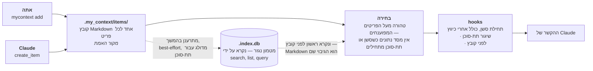

<!--
  This is the Hebrew mirror of `docs/capabilities/00-index.md`. The English
  file is the source; this one follows it sentence by sentence and invents no
  claim of its own.

  Conventions are those of `docs/README.he.md` and `docs/the-store.he.md`, and
  for the same reason: they were established by rendering Hebrew Markdown
  through GitHub's own API and reading the result in a browser, not by
  reasoning about source.

  1. Hebrew prose and tables live inside `<div dir="rtl">` blocks. Fenced code
     and Mermaid blocks are deliberately left OUTSIDE them: inside an RTL
     container the bidi algorithm reverses the runs in a box-drawing table or a
     pasted shell transcript.
  2. Any Latin-script run that must read left-to-right on its own is wrapped in
     `<span dir="ltr">…</span>` — a code span whose first or last character is
     not alphanumeric, and any run of two or more Latin terms separated by
     commas or slashes. A code span whose two edge characters are both
     alphanumeric needs nothing.
  3. Pasted command output is NOT translated. The sentence introducing it is.
  4. Mermaid labels are translated; the graph structure is byte-for-byte the
     English one. The fence in this file is the one `docs/README.he.md`
     already carries, character for character, because the English fence is
     shared with `README.md` and that sharing is mirrored here rather than
     broken.

  The heading sequence must stay identical to `00-index.md`;
  `test/docs/parity.test.ts` fails otherwise.
-->

# my_context — סימוכין ליכולות

<div dir="rtl">

זהו הסימוכין המרבי, המעוגן במקור, למה ש-**my_context** באמת עושה: כל יכולת, מנגנון, שער
ומשטח, כל אחד עם מה הוא, למה הוא קיים, איך מפעילים אותו, דוגמה מעובדת שנבנתה מפלט אמיתי
של פקודה, ולפחות מקרה שימוש אחד. הוא גם אומר במפורש איפה יכולת **בנויה אך כבויה**, או
**לא בנויה כלל** — מסמך שמתאר רק את החלקים שעובדים היה בדיוק הפגם שהפרויקט הזה משקיע את
זמנו במחיקתו (ראו <span dir="ltr">`CLAUDE.md`</span> בשורש המאגר).

## מה זו my_context

תוסף ל-Claude Code ששומר את הידע הנורמטיבי של פרויקט כ-**פריטי Markdown** תחת
<span dir="ltr">`.my_context/items/`</span>, עם **אינדקס SQLite מתכלה** שנגזר מהם — ה-Markdown
הוא האמת, ומחיקת האינדקס אינה מאבדת דבר. Hooks מזריקים את תת-הקבוצה השולטת של הקורפוס הזה
לתוך כל חלון הקשר ברגעים שבהם חלון נפתח. זה רץ על <span dir="ltr">Node ≥ 24</span> **בלי שלב בנייה** (TypeScript
מורץ ישירות דרך הפשטת טיפוסים מובנית) ונשלח עם **אפס תלויות זמן ריצה**
(<span dir="ltr">`CONST-node-24-no-build-step`, `CONST-zero-runtime-dependencies`</span>).

שני מאגרים נוספים יושבים לצד הקורפוס ומתועדים כאן במלואם: **ארכיון שיחות** בר-חיפוש של
תמלילי סשנים, ו**מאגר כללי מוצר** (<span dir="ltr">`src/rules/`</span>) של שש־עשרה רשומות
(2026-09-16) שנשלח בתוך התוסף עצמו ולא נכתב פר פרויקט.

כל פרק בסימוכין הזה הוא קריאה עמוקה יותר של שלב אחד באותו צינור:

</div>



<div dir="rtl">

(שימוש חוזר בסעיף 3 של ה-README עצמו, מתוקן שוב ב-2026-09-17: שני ה-hooks שקוראים ל-
<span dir="ltr">`buildInjectionResult`</span> — <span dir="ltr">`session-start.ts:69`</span>
ו-<span dir="ltr">`subagent-start.ts:290`</span> — בוחרים מעל פריטים שפוענחו מ-Markdown,
<span dir="ltr">`src/core/inject.ts:372`</span>, *"אין מסד נתונים בנתיב הקריטי של ההזרקה"*,
והאינדקס מתרענן אחר כך כמשימת צד במאמץ סביר שאותה פונקציה מדלגת עליה עבור תת-סוכן
(<span dir="ltr">`inject.ts:883-885`</span>). **ה-hook של הבדיוק-בזמן הוא ההפך**:
<span dir="ltr">`pre-tool-use.ts:287-288`</span> פותח את האינדקס לקריאה בלבד ולוקח את
המועמדים שלו מ-<span dir="ltr">`store.activeInjectable(...)`</span>, ומגיע ל-
<span dir="ltr">`activeInjectableFromItems(loadCorpusItems(...))`</span> רק מתוך ה-
<span dir="ltr">`catch`</span> — מסד נתונים קודם, Markdown כגיבוי מוצהר. גרסה מוקדמת יותר
של הצומת הזה אמרה *"לעולם לא על ידי הזרקה"*, שהוא ההפך מאותו נתיב, וזו הסיבה שלסיפור
ההתיישנות של פרק 2 יש שיניים בכלל.)
פרק 1 הוא התיבה השמאלית ביותר — מה הם פריט וקורפוס. פרק 2 הוא <span dir="ltr">`selection`</span>
ו-<span dir="ltr">`hooks`</span> — התקציב והדלתות. פרקים 3 עד 16 הם כל מה שיושב לצד עמוד
השדרה הזה: השערים שכתיבה עוברת דרכם לפני שהיא מגיעה ל-<span dir="ltr">`.my_context/items/`</span>,
שני המאגרים שההזרקה לא נוגעת בהם כלל (ארכיון השיחות, מאגר הכללים), והמשטחים — שורת הפקודה,
MCP, ממשק הרשת — שקוראים או כותבים כל אחד מהם.

## איך נבנה הסימוכין הזה

כל קביעה בכל פרק נשלפה מעץ המקור, מהקורפוס החי של המאגר הזה
(<span dir="ltr">`.my_context/items/`</span>), או מפקודה שהורצה בפועל והפלט האמיתי שלה
הודבק פנימה — לעולם לא מהזיכרון ולא מהניסוח מחדש של התדריך עצמו. התנהגות שולטת מצוטטת לפי
**מזהה פריט**, לעולם לא לפי מספר שורה בדוח
(<span dir="ltr">`RULE-a-citation-names-an-item-by-id-never-a-report-by-line-number`</span>),
משום ש-<span dir="ltr">`reports/V2-HANDOVER.md`</span> נכתב מלמעלה בכל כתיבה ומספר שורה היה
מתיישן בכתיבה הבאה. כל פרק נחתם בסעיף "מה **לא** בנוי / בנוי אך כבוי" היכן שהכותב מצא כזה,
והערה ישרה על כל דבר שלא ניתן היה לאמת מהמקור במקום לקבוע אותו בכל זאת.

שום קובץ מקור, טסט או קורפוס לא שונה כדי לייצר את הסימוכין הזה. שום פקודה שמשנה את הקורפוס,
את אינדקס git או את שרת ממשק הרשת הרץ לא הורצה — קריאה בלבד של פקודות ושל מקור, לפי
האילוצים הקבועים על העבודה הזו.

**מספר הוא קריאה, לא קבוע.** האימות של 2026-09-13 מצא שמחלקת הפגם הגדולה ביותר בטיוטה
הראשונה הייתה ספירה או רשימה שנקבעה כעדכנית ומאז זזה — פריטי משימה, עוגנים, רשומות מאגר
כללים, קובצי טסט, מפתחות בטבלת המחרוזות. כל נתון בפרקים האלה נושא עכשיו את התאריך שבו נלקח;
היכן שמספר נושא משקל, הפקודה שמייצרת אותו מוצגת כדי שקורא יוכל לגזור אותו מחדש במקום לסמוך
עליו.

## פרקים

</div>

<div dir="rtl">

| # | פרק | מה הוא מכסה |
|---|---------|-----------------|
| 1 | [פריטים והקורפוס](./01-items-and-corpus.he.md) | כל 29 קטגוריות הפריטים הנשלחות, frontmatter, דרגים (<span dir="ltr">`normative` / `rationale`</span>), ואיך הדרג של קטגוריה מכריע אם היא מוזרקת במלואה, מאונדקסת, או מצטמצמת לספירה. |
| 2 | [הזרקה](./02-injection.he.md) | הדלתות שמפעילות הזרקה, תקציב חמשת המפתחות, נעיצה (<span dir="ltr">`always: true`</span>), הרצועה הרזרבית, אריזת first-fit ודחיקה, ו-<span dir="ltr">`governingSpill.titled`</span> כמדד למה שקורא מאבד כשפריט נדחק לשורת כותרת בלבד. |
| 3 | [יצירה והשערים](./03-creation-and-gates.he.md) | <span dir="ltr">`add`, `edit`</span>, שער הסיכום, שער הסתירה, <span dir="ltr">`--distinct` / `--supersedes`</span>, שתי דלתות המילוט (<span dir="ltr">`--summary-omitted`</span> ביצירה, <span dir="ltr">`--summary-unchanged`</span> בעריכה), שלושת גיבובי התוכן, קשתות ההחלפה ושלוש הסירובים שלהן, <span dir="ltr">`doctor`</span> עם **כל 61 קודי הממצא**, <span dir="ltr">`repair`</span>, ומעטפת הכישלון של <span dir="ltr">`--json`</span>. |
| 4 | [ארכיון השיחות](./04-conversation-archive.he.md) | אינדוקס של תמלילי סשנים ותת-סוכנים, המפצל **trigram** של FTS5 (ולא <span dir="ltr">`unicode61`</span> — העברית מדביקה אותיות שימוש בודדות לראשי מילים), היסטי בתים לעולם לא היסטי תווים, זיהוי סודות, והתמדה. |
| 5 | [עוגנים](./05-anchors.he.md) | <span dir="ltr">`.my_context/.anchors.jsonl`</span> כאמת ואינדקס SQLite שנגזר ממנו, <span dir="ltr">`origin: automatic`</span> מול <span dir="ltr">`origin: owner`</span>, ארבעת נתיבי היצירה, וכל יכולת עוגן שניתן להגיע אליה מממשק הרשת. |
| 6 | [שליפה](./06-retrieval.he.md) | שחזור נושא מתוך קטע מודבק בלי שהרעש של הקטע עצמו יגיע אי פעם לחלון ההקשר, והמנגנונים בפועל (יותר מ"ארבעה" שטוח) שקובעים שהערובה הזו לעולם לא נשברת. |
| 7 | [שחזור והעברת ידיים](./07-restore-and-handover.he.md) | <span dir="ltr">`restore --build / --show / --approve / --discard`</span>, שומר הלולאה, <span dir="ltr">`reports/V2-HANDOVER.md`</span>, ו-<span dir="ltr">`check:handover`</span> — שהורץ באמת מול הדוח החי של המאגר הזה. |
| 8 | [ממשק הרשת](./08-web-ui.he.md) | כל 20 מסכי המסילה, ה-Composer שבונה (לעולם לא מריץ בשקט) פקודות, חלונית הפריט, המראה העברית ב-RTL עם טבלת המחרוזות המקבילה שלה, וערובת אי-הכתיבה — **שנים־עשר קישורי כתיבה שנפסקו על פני חמישה קבצים**, הנקבעים בשוויון קבוצות, כולל שני משטחים שכותבים בלי להרכיב פקודה בכלל. |
| 9 | [שורת הפקודה ושרת ה-MCP](./09-cli-and-mcp.he.md) | סימוכין הפקודות והכלים המלא — כל פקודת שורת פקודה וכל כלי MCP, עם פלט אמיתי, מקובצים ומוצלבים במקום מוסברים מחדש היכן שפרק עמוק יותר כבר מכסה אחד. |
| 10 | [מאגר כללי המוצר](./10-rule-store.he.md) | <span dir="ltr">`src/rules/`</span> במלואו: שש־עשרה רשומות, חותם ה-checksum (ולמה שום דבר לא בודק אותו אוטומטית), פיצול הדרגים <span dir="ltr">`product` / `developer`</span> (רשומה אחת חלה במאגר של צרכן; כל השש־עשרה חלות במאגר הזה), <span dir="ltr">`MYCONTEXT_RULES_DIR`</span>, ומסירה (תחילת סשן / תחילת תת-סוכן) מול קביעה (לפני כיווץ / לפני שימוש בכלי). |
| 11 | [הלולאה המשפרת את עצמה](./11-self-improvement-loop.he.md) | מכשור, טריגר, הצעות, תור הסקירה, גניזה, המנה, ונתיב המודל (<span dir="ltr">`review/model.ts`</span>, 2026-09-13) — נשלח עם <span dir="ltr">`enabled: false`</span>, <span dir="ltr">`maxProposalsPerPass: 0`</span> ו-<span dir="ltr">`model: null`</span>, שלושה חוגות בלתי תלויות כל אחת בערך שאינו עושה דבר. |
| 12 | [חבילות, ייצוא/ייבוא, נהלים, מדריכים, skills](./12-packs-export-import-procedures.he.md) | חבילות ניידות המיובאות כטיוטות, <span dir="ltr">`export --format dir\|zip --as-pack --dry-run`</span>, ההבחנה בין נוהל/ספר-הרצה חד-פעמי לחוזר, מדריכים, וה-skills של Claude Code שהתוסף הזה שולח. |
| 13 | [משמעת הבדיקות](./13-testing-discipline.he.md) | הוכחות בהסרה, הצהרות <span dir="ltr">`// @basis`</span>, תאומים חד-פעמיים עם זרע, כל **אחד־עשר** שערי <span dir="ltr">`check:*`</span> **ואיפה כל אחד רץ** (CI, שחרור, או ה-hook שלפני ה-commit) — כולל <span dir="ltr">`check:diagrams`</span>, שער ה-mermaid שמפענח בלבד ומוכיח את הנתיב האדום שלו לפני כל דיווח ירוק — אי-כתיבה, ופנקסי השקילות, כיכולת מתועדת של הפרויקט ולא כפרט מימוש. |
| 14 | [חיפוש מעל הארכיון](./14-search-over-the-archive.he.md) | חדש ב-2026-09-16. דקדוק השאילתה מאחורי <span dir="ltr">`conversation search`</span> ותיבת החיפוש של מסך השיחות: שלוש קריאות מדורגות של שאילתה אחת (ביטוי / קרבה / שתיהן), רצפת שלושת התווים לכל מונח, החרגת <span dir="ltr">`-word`</span>, מתג המקורות <span dir="ltr">`said`/`ran`/`both`</span> שמאנדקס קריאות לכלים בפעם הראשונה, וכלל הדירוג ששולט גם בזה וגם בחיפוש ה-BM25 החדש של קורפוס הפריטים עצמו. |
| 15 | [מציג המסמכים והנתיבים](./15-document-and-lane-viewer.he.md) | חדש ב-2026-09-16, **מחציתו נכתבה מחדש ב-2026-09-17**. קיפול ה-NFKD של משטח החיפוש וצביעת ה-CSS-highlight, שאומתו בהרצה מול האלגוריתם של <span dir="ltr">`@codemirror/search`</span> עצמו; ארבע הדרכים להקליד שאילתה ושתי התיבות שחלות על כל הארבע; 22 הדוגמאות המעובדות וסימוכין הביטויים הרגולריים בן 34 השורות; **שלוש החלוניות הצפות** — חיפוש, צעד-אחר-צעד, העתקה — ותפריט הלחיצה הימנית שקוצץ למה שפועל על התור שמתחת לסמן; הכרטיס שוויתר על הפקדים שלו וה-<span dir="ltr">`⤢`</span> שלוקח את המציג למסך כולו; וסירוב הביטוי הרגולרי לנסיגה קטסטרופלית ששום תקציב זמן לבדו אינו יכול לתפוס. |
| 16 | [הלוח — תוכניות, <span dir="ltr">`needs`</span>, <span dir="ltr">`ready`</span>, <span dir="ltr">`path`</span>, מספרי ה-D](./16-the-board.he.md) | פער התיעוד הגדול ביותר שהביקורת הזו מצאה: איך עבודה נבחרת מתוך שדה ה-<span dir="ltr">`needs:`</span> של הקורפוס עצמו, מה <span dir="ltr">`ready`</span> ומה הפקודה החדשה <span dir="ltr">`path`</span> מחשבים כל אחת (ולא שומרים בשום מקום), מפת הנושאים של מספרי ה-D, ו-<span dir="ltr">`check:board`</span> — השער שתפס פעמיים את הלוח עצמו משקר לקורא. |

</div>

<div dir="rtl">

## החצי השני של התיעוד: <span dir="ltr">`docs/system/`</span>

**הסימוכין הזה אינו מערך המסמכים היחיד, ועד 2026-09-17 האינדקס הזה לא אמר זאת.**
<span dir="ltr">`docs/system/`</span> קיים, יש בו שמונה קבצים, והוא עונה על שאלה אחרת.

> <span dir="ltr">`docs/capabilities/`</span> עונה על **מה זה יכול לעשות**.
> <span dir="ltr">`docs/system/`</span> עונה על **איך זה באמת עובד** — לא רשימת הדגלים, אלא
> המנגנון שמתחתיה, ההחלטה שעיצבה אותה, והכישלון שההחלטה הזו הייתה תגובה אליו.

פרק סימוכין יכול להיות שלם ועדיין להשאיר קורא בלי יכולת לענות על *"למה זה עובד ככה ולא בדרך
המתבקשת האחרת."* התשובה היא כמעט תמיד כישלון מדוד ספציפי, והפרקים ההם מחזיקים את הטיעון
במקום שבו הפרקים האלה מצטטים את התוצאה.

</div>

<div dir="rtl">

| | |
|---|---|
| [<span dir="ltr">`docs/system/00-index.md`</span>](../system/00-index.he.md) | לשם מה התיקייה הזו, ולמה הנושאים האלה |
| [<span dir="ltr">`01-the-board.md`</span>](../system/01-the-board.he.md) | סיפור הממשל שמאחורי הפקודות של פרק 16 |
| [<span dir="ltr">`02-the-document-and-lane-viewer.md`</span>](../system/02-the-document-and-lane-viewer.he.md) | מודל הקריאה, המשווה המשותף, מסגרת החלונית ושכבת ההדגשה — חצי המנגנון של פרק 15 |
| [<span dir="ltr">`03-the-palette-and-the-drawn-language.md`</span>](../system/03-the-palette-and-the-drawn-language.he.md) | תקציב המשמעות של חמשת הגוונים, תגיות, אייקונים, דיאגרמות מיוצרות |
| [<span dir="ltr">`04-the-audit-log-decay-and-contribution.md`</span>](../system/04-the-audit-log-decay-and-contribution.he.md) | מה הפרויקט רושם על הריצה של עצמו, ושתי קריאות שנגזרות מזה |
| [<span dir="ltr">`05-lessons.md`</span>](../system/05-lessons.he.md) · [<span dir="ltr">`06-ingest.md`</span>](../system/06-ingest.he.md) · [<span dir="ltr">`07-focus.md`</span>](../system/07-focus.he.md) | שלוש דלתות קטנות: טעות הופכת למועמד לכלל; מסמך הופך לפריטי טיוטה; סשן מצמצם את מה שהוא רואה |

</div>

<div dir="rtl">

**אף אחד משני המערכים לא חוזר על השני, במכוון** — עותק של עובדה אי אפשר להחליף, רק את
המקור אפשר. היכן ששני המערכים מכסים משטח אחד, פרק היכולות מצביע על פרק המערכת עבור המנגנון
ופרק המערכת מצביע חזרה עבור סימוכין הפקודות; פרק 15 ו-<span dir="ltr">`docs/system/02`</span>
הם הזוג שבו הפיצול הזה נושא הכי הרבה משקל, כי שניהם נכתבו באותו שבוע על אותו מסך.

שתי התיקיות נמצאות תחת אותו שער mermaid: <span dir="ltr">`npm run check:diagrams`</span>
מפענח כל fence ב-<span dir="ltr">`README.md`</span>, <span dir="ltr">`docs/README.he.md`</span>,
<span dir="ltr">`docs/capabilities/`</span> ו-<span dir="ltr">`docs/system/`</span>.

## מסלולי קריאה

- **חדשים בפרויקט, בוחנים אותו**: 1 ← 2 ← 10 ← 8. פריטים והקורפוס, איך הזרקה באמת מוציאה
  תקציב, מאגר כללי המוצר (החלק היחיד בלי מקבילה בתוסף טיפוסי שיש בו רק קורפוס), ואז ממשק
  הרשת כדרך המהירה ביותר לראות את הכול בבת אחת.
- **מוסיפים את זה לפרויקט**: 1, 3, 9, 12. מה תכתבו, השערים ששומרים על זה ישר, משטח
  הפקודות המלא, ואיך מביאים או משתפים חבילה.
- **עובדים על my_context עצמה** (המאגר הזה): 10 ראשון — כל חמש־עשרה רשומות דרג המפתחים
  שולטות כאן — ואז 16 (הלוח: למה באמת הייתם משוגרים לעבוד), 13, 7, ו-11, מכיוון ששלושת
  האחרונים מתארים מנגנונים שהם או לא גמורים חלקית (11) או קיימים במיוחד כדי למנוע מהקביעות
  של הפרויקט הזה להיסחף מהקוד שלו עצמו (7, 13).
- **מתעדכנים במה שנשלח השבוע**: 15 ← 14 ← 5 ← 4. **פרק 15 ראשון**, כי שלוש החלוניות
  הצפות, תפריט הלחיצה הימנית המקוצץ והכרטיס שוויתר על הפקדים שלו הם העבודה החדשה ביותר
  במוצר והשינוי הגדול ביותר של יום אחד שהסימוכין הזה ספג; אחר כך 14 בשביל חיפוש הארכיון
  שהוא במכוון *לא* בנוי עליו, אחר כך 5 בשביל הסימנים שהוא מצייר — כולל הרענון באמצע התור
  שמניח עכשיו סימן על דף פתוח בלי לחכות לסוף התור — ו-4 בשביל היסטי הבתים שמתחת לכל זה.
- **מבקרים מה אמיתי מול מה שאיפתי**: קראו קודם את סעיף "מה **לא** בנוי / בנוי אך כבוי" בסוף
  כל פרק; פרק 11 בנוי כמעט כולו סביב עובדה אחת כזו (הלולאה מחווטת ונעולה על ידי חוגות, לא
  על ידי קוד לא גמור).

## מה בנוי אך כבוי, על פני כל הסימוכין

נאסף כאן כי קל לפספס את זה בקריאת פרקים בנפרד. **כל רשומה כאן מבחינה בין מה שהמוצר *שולח*
לבין מה ש*המאגר הזה* מגדיר** — הם כבר לא אותו דבר, וערבוב ביניהם הוא איך הגרסה הקודמת של
הרשימה הזו התיישנה.

- **הלולאה המשפרת את עצמה** (פרק 11) נשלחת עם <span dir="ltr">`review.enabled: false`</span>,
  <span dir="ltr">`review.maxProposalsPerPass: 0`</span> ו-<span dir="ltr">`review.model: null`</span>
  — **שלוש** חוגות בלתי תלויות, כל אחת בערך שאינו עושה דבר, לא מתג אחד. היא מודדת תרומה
  ודעיכה ברציפות; היא לא כותבת דבר עד שאדם מדליק אותן. **המאגר הזה הדליק את כל השלוש**,
  כפי שאומת ישירות מול <span dir="ltr">`.my_context/config.json`</span> ב-2026-09-16:
  <span dir="ltr">`review.enabled: true`</span>, <span dir="ltr">`review.maxProposalsPerPass: 5`</span>,
  <span dir="ltr">`review.model: "claude-opus-5"`</span>. גרסה קודמת של הסעיף הזה אמרה
  שרק שתיים מהשלוש דלוקות ושה-<span dir="ltr">`model`</span> לא הוגדר — זה היה שגוי ביום
  שזה נכתב ומתוקן כאן. מכיוון שמודל *כן* מוגדר כאן, המאגר הזה אינו המחשה נקייה של "בנוי אך
  כבוי" עבור החוגה השלישית של פרק 11; קראו את פרק 11 עצמו כדי לדעת מה באמת קורה כשהלולאה
  רצה עם מודל מוגדר.
- **<span dir="ltr">`review.drift`</span>** (פרק 11) הוא מתג כיבוי שלישי בתוך אותה תת-מערכת,
  שנקרא ממפתח <span dir="ltr">`drift`</span> **ברמה העליונה** ולא מתוך
  <span dir="ltr">`review`</span> — <span dir="ltr">`DEFAULT_DRIFT = { enabled: false }`</span>,
  ו-<span dir="ltr">`drift.ts`</span> מיובא על ידי שום דבר מלבד הטסטים של עצמו.
- **<span dir="ltr">`dispatchGate`</span>** (<span dir="ltr">`src/core/config.ts:600`</span>,
  <span dir="ltr">`DEFAULT_DISPATCH_GATE = { enabled: false }`</span>) — האם שיגור
  <span dir="ltr">`Agent`</span> חייב לנקוב בפריט משימה. נשלח כבוי; **המאגר הזה מדליק אותו**.
  זהו שער שלם שהסיכום הזה פספס קודם לכן.
- ~~**<span dir="ltr">`watchedDocs`</span> הוא מפתח תצורה עם שני ממצאי <span dir="ltr">`doctor`</span>
  מאחוריו ואף פרק לא מתאר אותו.**~~ **לא נכון נכון למעבר הזה — אומת והופרך.**
  <span dir="ltr">`watchedDocs`</span> (שני ממצאי <span dir="ltr">`doctor`</span>,
  <span dir="ltr">`watched_doc_coverage`</span> ו-<span dir="ltr">`watched_doc_unserved`</span>)
  מתועד במלואו ב-[פרק 2, "שאר <span dir="ltr">`config.json`</span>"](./02-injection.he.md#שאר-configjson--שמונת-מפתחות-הרמה-העליונה),
  שאומר במפורש שהוא "מתועד בשום מקום אחר, ולכן הוא כאן". הסעיף הזה עצמו היה מיושן — מפתח
  התצורה נכתב במלואו לפני שהמעבר הזה התחיל, ורק רשימת "בנוי אך כבוי" של האינדקס הזה לא
  עודכנה לומר זאת. המאגר הזה מגדיר אותו ל-<span dir="ltr">`["docs/**/*.md", "README.md"]`</span>.
- ~~**<span dir="ltr">`rules verify --restore`</span> (פרק 10) הוא קוד בלתי ניתן להגעה.**~~
  **שגוי, ופרק 10 עצמו כבר אומר זאת — האינדקס הזה פשוט לא נקרא מחדש אחרי שהפרק ההוא תוקן.**
  ניתן להגעה מאז 2026-09-14: <span dir="ltr">`src/cli/commands/rules.ts:316`</span> שומר על
  <span dir="ltr">`restore && path.resolve(packageStore) !== path.resolve(store)`</span>,
  שניתן לספק אותו בכל פעם ש-<span dir="ltr">`MYCONTEXT_RULES_DIR`</span> נוקב במאגר אחר
  משל החבילה עצמה — הערת המקור ב-<span dir="ltr">`rules.ts:309`</span> מציינת את ההיסטוריה
  ישירות: *"עד 2026-09-14 שניהם היו <span dir="ltr">`entriesDir()`</span>, ולכן
  <span dir="ltr">`restoreEntries`</span> היה קוד בלתי ניתן להגעה."* פרק 10 נושא את הסעיף
  הזה מחוק וסומן כסגור; האינדקס הזה סתר את הפרק שלו עצמו עד לתיקון הזה.
- **שום דבר לא בודק אוטומטית את חותם ה-checksum של מאגר הכללים** (פרק 10) — אין hook, אין
  דלת, אין בדיקת <span dir="ltr">`doctor`</span>, אין שלב CI — ו-<span dir="ltr">`loadRules`</span>
  לעולם לא מתייעץ עם המניפסט, כך שכל <span dir="ltr">`.md`</span> שמושלך לתוך
  <span dir="ltr">`src/rules/entries/`</span> נמסר כקבוע שולט.
- ~~**<span dir="ltr">`mycontext search`</span> לא מגיע לארכיון השיחות, ואף פקודת שורת פקודה
  לא מגיעה.**~~ **תוקן ב-2026-09-16.** <span dir="ltr">`mycontext conversation search`</span>
  מגיע עכשיו ל-<span dir="ltr">`searchArchiveTiered`</span> ישירות, עם אותו דקדוק תלת-שכבתי
  ואותו מתג מקורות <span dir="ltr">`said`/`ran`/`both`</span> שתיבת החיפוש של ממשק הרשת
  משתמשת בהם (פרקים 4 ו-14). <span dir="ltr">`mycontext search`</span> (קורפוס הפריטים, ללא
  שינוי) היא תת-מערכת שונה באמת ועדיין לא מגיעה לארכיון — אותו חצי מהסעיף הישן נשאר נכון,
  רק חצי הגישה משורת הפקודה היה שגוי.
- **<span dir="ltr">`restore`</span> לא מוסר על פני כיווץ** (פרק 7): המסירה מוחרגת בהתחלות
  <span dir="ltr">`manual`</span>, <span dir="ltr">`subagent`</span> ו-<span dir="ltr">`compacting`</span>.
- **מנגנון תיקון כללים באמצע סשן** במאגר כללי המוצר (פרק 10) —
  <span dir="ltr">`renderCorrection` / `correctionAtDoor`</span> — בנוי ונבדק במלואו אך מחווט
  לשום דבר, ונשמר במכוון כמכניקה משולמת מראש לכלי תחזוקה שעדיין לא קיים.
- **סדר הרצועה הרזרבית של ממשק הרשת** (פרק 2) נפסק על ידי הבעלים (הפריט הנדחק ביותר ראשון)
  אך אינו ממומש, משום שפונקציית הבחירה טהורה ואינה יכולה לקרוא את יומן הביקורת שהיא הייתה
  צריכה כדי לדעת מה נדחק.
- **דקדוק יצירת עוגנים שלישי, <span dir="ltr">`report`</span>, שהתאים לנתיבי דוחות מתוארכים,
  נשלח, ייצר עוגנים אמיתיים במשך לילה, ואז נגנז במכוון בפסיקת בעלים** (פרק 5, §5.4a) — עם
  טסט רגרסיה שקובע את ההסרה בשני הכיוונים. **המילה <span dir="ltr">`report`</span> נשלחה
  מחדש ב-2026-09-15 כמנגנון *אחר*** — התשובה הסופית של נתיב, שנמצאת מבנית ולא בהתאמת טקסט —
  והסעיף הזה נשמר בדיוק משום ש"report הוסר" כבר אינו נכון לגבי שם הסוג עצמו, אלא רק לגבי
  דקדוק התאמת הטקסט הספציפי שנשא אותו במקור. קראו את פרק 5 §5.4a לפני ציטוט של כל אחד
  משני חצאי המשפט הזה.
- **מדרג BM25 בזמן חיפוש עבור קורפוס הפריטים** (<span dir="ltr">`src/core/rank.ts`</span>,
  <span dir="ltr">`searchItems`</span>) נשלח ב-2026-09-16, ומדרג את
  <span dir="ltr">`mycontext search`</span>/<span dir="ltr">`list_items`</span> בפעם הראשונה —
  עד לתאריך הזה <span dir="ltr">`filterItems`</span> התאים אך מעולם לא סידר. ראו את הרשומה
  <span dir="ltr">`search`</span> ב-[פרק 9](./09-cli-and-mcp.he.md).
- **בלוקי <span dir="ltr">`tool_result`</span> (67% מהתווים של ארכיון השיחות) נותרים לא
  מאונדקסים לחלוטין בכל משטח חיפוש**, במכוון, בהמתנה לפסיקת בעלים על העלות — בלוקי
  <span dir="ltr">`tool_use`</span> אונדקסו ב-2026-09-16 (פרק 14) ו-<span dir="ltr">`tool_result`</span>
  נמדד ותומחר בארבע תקרות מועמדות באותו מעבר, אבל שום דבר לא נשלח.

## נספח: איך לשחזר את הראיות של הסימוכין הזה

כל דוגמה מעובדת בכל פרק ניתנת לשחזור בקריאה בלבד מתוך checkout של המאגר הזה:

</div>

```
node src/cli/index.ts --help
node src/cli/index.ts status
node src/cli/index.ts doctor
node src/cli/index.ts rules list
node src/cli/index.ts rules verify
node src/cli/index.ts ready --held
node src/cli/index.ts path --summary
node src/cli/index.ts conversation search "<any words>"
node scripts/check-handover.ts
node scripts/check-basis.ts
node scripts/check-board.ts
```

<div dir="rtl">

אף אחת מאלה לא משנה את הקורפוס, את אינדקס השיחות, את <span dir="ltr">`.anchors.jsonl`</span>,
או את מצב git. כל פקודה שמוצגת בפרק ו*כן* משנה (<span dir="ltr">`add`, `edit`, `repair`,
`pack import`, `restore --approve`</span>, כל פקודת <span dir="ltr">`lesson*`</span>)
**לא** הורצה במכוון בזמן כתיבת הסימוכין הזה; הפרקים ההם מתארים אותה מהמקור במקום, ואומרים זאת.

</div>

---

<div dir="rtl">

*17 קבצים, 8,937 שורות, 641,963 בתים (642.0 kB עשרוני / 626.9 KiB), נמדדו מחדש
**ב-2026-09-17**, אחרי המעבר המוסיף שמתואר בסוף ההערה הזו —
**הנתון הזה משתנה בכל עריכה של הסימוכין הזה, כולל זו, ולכן התייחסו אליו כאל חסם תחתון ולא
כאל קבוע**; <span dir="ltr">`wc -l docs/capabilities/*.md`</span> ו-
<span dir="ltr">`wc -c docs/capabilities/*.md`</span> משחזרים אותו בכל checkout מאוחר יותר.
נכתב לראשונה ישירות מול עץ המקור ומול הקורפוס החי של המאגר הזה ב-2026-09-12,
**אומת קביעה אחר קביעה ותוקן מול הקוד ב-2026-09-13**
(<span dir="ltr">`reports/2026-09-13-capabilities-doc-verified.md`</span> הוא הביקורת שהניעה
את זה), **נבדק ותוקן שוב ב-2026-09-16** מול ארבעה ימים של עבודה שנשלחה ולא תועדה — שלושה
פרקים חדשים (14, 15, 16), תיקונים לפרקים 4, 5, 7, 9 ו-10 — ו**אומת ותוקן שוב פעם שנייה
באופן עצמאי מאוחר יותר באותו יום**
(<span dir="ltr">`reports/2026-09-16-capabilities-verified.md`</span>, 214 קביעות נבדקו, 38
נמצאו שגויות: בעיקר ציטוטי שורות מיושנים לתוך שני הקבצים הצומחים ביותר בעץ,
<span dir="ltr">`conversation-index.ts`</span> ו-<span dir="ltr">`conversations.js`</span>,
ועוד פרק אחד — עוגנים — שהסעיפים החדשים ביותר בו אומתו נכון בעוד שסעיף ישן יותר עדיין תיאר
קוד שנמחק ימים קודם לכן). כל קביעה שגויה שהמעבר השני הזה מצא מתוקנת במקומה, כולל שתיים
שהמעבר השני עצמו סימן כמשמעותיות ביותר: חוגות הלולאה המשפרת של המאגר הזה (פרק 11, והאינדקס
הזה) תוארו כשתיים-מתוך-שלוש-דלוקות כשלתצורה החיה יש למעשה את כל השלוש דלוקות, והאינדקס הזה
שוב סתר את הסעיף המתוקן של פרק 10 עצמו לגבי
<span dir="ltr">`rules verify --restore`</span>. ו**אימות שלישי ועצמאי ב-2026-09-17**
(<span dir="ltr">`reports/2026-09-17-capabilities-verified-again.md`</span>, 282 קביעות נבדקו,
21 שגויות) מצא כישלון צר וחד יותר: כל אחת מ-21 ישבה לצד קביעה שהמעבר הקודם בדיוק תיקן —
ספירה מרועננת בסעיף אחד השאירה חמישה אזכורים אחרים של אותו מספר בלתי מרועננים בפרק 5, ארבעה
ציטוטי hook מתוקנים הושארו במקומם לצד בלוק <span dir="ltr">`grep`</span> מודבק בפרק 10
שעדיין הראה את הישנים, הסתייגות בפרק 15 שקבעה שעבודה "לא נחתה ב-HEAD" כשהיא נחתה בהורה של
HEAD עצמו עד שהמשפט נעשה commit. **התיקון לדפוס הזה הוא מבני, לא עוד סבב של תיקוני נקודה**:
מספר שהשתנה נסחף עכשיו דרך כל הקובץ שלו במקום לתקן אותו באתר אחד, ספירות תנודתיות (שורות
עוגנים, הסכומים של <span dir="ltr">`ready`</span>, ספירות מסמכים ניתנים להגשה, ספירות שלוש
נקודות) מתוארכות ומסומנות כזזות בתוך השעה במקום להיאמר חשופות, ומשפט שקובע מה יש או אין
ב-commit, בענף, או ב"HEAD" נמנע — hash של commit הוא נקודה קבועה ו-"HEAD" אינו כזו, וסימוכין
שמערבב בין השניים מתיישן ברגע שנתיב אחר דוחף. **הכלל האחרון הזה נאמר כפרקטיקה ולא כעובדה על
הטקסט הזה, כי הוא נכתב כאן פעם אחת כמוחלט — "שום משפט בסימוכין הזה לא קובע…" — וארבעה משפטים
כן קבעו**: פרק 11 אומר את זה שלוש פעמים (הערת הכותרת שלו על <span dir="ltr">`src/review/`</span>,
הסוגריים שלו *"as committed at HEAD"*, ו-*"<span dir="ltr">`.my_context/config.json`</span> at HEAD carries"*) ופרק 13
פעם אחת (*"re-checked at HEAD on 2026-09-13"*), הראשון שבהם חמש־עשרה שורות אחרי שפרק 11 נוקב
בבעיה. **ארבעת המשפטים נותרים על כנם והדבר שהלך הוא המוחלט**: כל אחד מהם הוא תצפית מתוארכת
על commit שהיה HEAD כשהיא נכתבה, וזה דבר לגיטימי שסימוכין יאמר, ואף אחד מהם לא נעשה בטוח
יותר על ידי משפט שלושה פרקים משם שטוען שהם לא קיימים.

**שני מעברים נוספים רצו ב-2026-09-17 והפסקה הזו לא הזכירה אף אחד מהם, וזה הפגם שהיא קיימת
כדי למנוע.** הראשון בדק את שש־עשרה ה-fences — **האימות היחיד שאי פעם היה לדיאגרמה כלשהי
בסימוכין הזה** — ומצא **28 קביעות דיאגרמה שגויות**, כולל fence אחד בפרק 7 שמעולם לא פוענח
בשום מנוע רינדור מהיום שנכתב
(<span dir="ltr">`reports/2026-09-17-capability-diagrams-verified.md`</span>). ה-commit
<span dir="ltr">`471b13b3`</span> תיקן אחד־עשר פרקים מול הרשימה הזו ואמר בהודעה שלו עצמו
שהתיקון לא אומת. המעבר השני בדק את התיקון: **574 בדיקות, 25 מתוך 28 תוקנו בנקודה המצוטטת,
1 תוקן לערך שגוי חדש, 2 לא נגעו בהם — ו-15 קביעות שגויות חדשות שנכתבו על ידי התיקון עצמו**,
כל אחת מהן בפרוזה או בצומת דיאגרמה שהתיקון בדיוק הוסיף
(<span dir="ltr">`reports/2026-09-17-capabilities-verified-after-repair.md`</span>). זו אותה
צורה שלוש פעמים ברצף: תיקון 38 ייצר 21 ממצאים חדשים, תיקון 28 ייצר 15, תיקון 21 ייצר 15.
**מעבר תיקון הוא מעבר כתיבה, וכתיבה מכניסה קביעות.** התיקון של אותן 15 הוא
<span dir="ltr">`reports/2026-09-17-capabilities-repaired-again.md`</span>, שרושם לכל משפט
שהוא כתב אם המשפט נבדק מול הקוד או נישא מרשימת המאמת.

**ואז מעבר שלא היה תיקון, ולכן הוא מופיע בנפרד.** ב-2026-09-17, אחרי ששלושת התיקונים לעיל
נסגרו, <span dir="ltr">`rulings/97`</span> ו-<span dir="ltr">`rulings/100`</span> הורצו יחד
כעבודת כתיבה אחת על ההנחה ש**שום דבר שנשלח אחרי 2026-09-13 לא היה בסימוכין הזה בכלל** —
חמישה מעברי אימות מדדו את הדיוק של משפטים שכבר היו על הדף ואף אחד לא שאל מה חסר ממנו. מה
שאותו מעבר הוסיף ולא תיקן: שלוש החלוניות הצפות של פרק 15, הצורה החדשה של תפריט הלחיצה
הימנית, הפקדים שהכרטיס איבד ומתג המסך המלא, העזרה וסימוכין הביטויים הרגולריים; הרענון
באמצע התור של פרק 5, יחד עם משיכת קביעת קיבוץ שהקוד מפריך במפורש; שני השערים הלא-שמורים של
פרק 13; והמצביע הראשון של האינדקס הזה על <span dir="ltr">`docs/system/`</span>, שהתקיים כאן
בלי אזכור במשך יום. זה נרשם ב-<span dir="ltr">`reports/2026-09-17-capabilities-refreshed.md`</span>
עם אותו סימון נבדק-או-נישא לכל בלוק שהתיקונים נושאים, והוא הותיר ארבעה מצייני מקום לצילומי
מסך ולא צילומי מסך, כי צילום המסכים הוא פריט נפרד שמניע את הכלי האמיתי.

אז: **חמישה מעברי אימות, שלושה תיקונים, ומעבר מוסיף אחד — לא שלושה מעברים.**
קורא צריך לקחת את הסימוכין הזה כנבדק בכבדות ועדיין לא כמאושר — שיעור השגיאה האחרון שנמדד על
טקסט תיקון חדש שנכתב היה חמש־עשרה קביעות לתיקון, והוא לא ירד. יש עכשיו שער למחלקה אחת מזה:
<span dir="ltr">`npm run check:diagrams`</span> מפענח כל fence ב-<span dir="ltr">`README.md`</span>,
<span dir="ltr">`docs/README.he.md`</span>, <span dir="ltr">`docs/capabilities/`</span> ו-
<span dir="ltr">`docs/system/`</span> ב-Mermaid אמיתי, מוכיח קודם את הנתיב האדום שלו, ולוקח
כשתי שניות. שום דבר עדיין לא שומר על משפט. כל מספר בסימוכין הזה נקרא מחדש מהעץ עבור אחד
משלושת המעברים האלה ולא הועתק מטיוטה קודמת; היכן שנתון ישן יותר עדיין מצוטט, הוא מצוטט
במפורש כהשוואה היסטורית, לעולם לא כמצב עדכני — והמשמעת ששרדה כל ביקורת הכי טוב הייתה הדבקת
פלט פקודה אמיתי, לא מקוצץ, **מתוארך** ולא ציטוטי שורות מוקלדים ביד או הדבקה חיה לא מתוארכת,
וזו הסיבה שכמה תיקונים להלן מחליפים סימוכין <span dir="ltr">`file.ts:123`</span> בשם סמל או
בפקודה חיה שקורא יכול להריץ מחדש, ולמה הפלט של פקודה חיה נושא עכשיו לצידו את התאריך שבו
הורצה. ספירות, ציטוטי שורות ופלטים חיים מתוארכים היכן שהם מופיעים; הקורפוס, קובץ העוגנים
וארכיון השיחות כולם גדלים מדי יום — כמה ספירות בסימוכין הזה זזו באופן מדיד בין שלושת מעברי
האימות שלו עצמו, במקרה אחד בתוך אותו אחר צהריים — אז קראו כל נתון כקריאה ולא כקבוע, והעדיפו
את הפקודה על המספר בכל מקום שבו שניהם ניתנים.*

</div>
