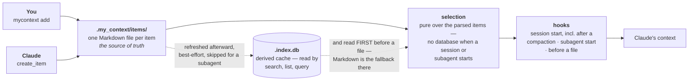

# my_context — capabilities reference

This is the maximal, source-grounded reference to what **my_context** actually does: every
feature, mechanism, gate, and surface, each with what it is, why it exists, how to invoke it,
a worked example built from real command output, and at least one use case. It also says
plainly where a capability is **built but off**, or **not built at all** — a document that
only describes the working parts would be the same defect this project spends its own time
deleting (see `CLAUDE.md` at the repository root).

## What my_context is

A Claude Code plugin that keeps a project's normative knowledge as **Markdown items** under
`.my_context/items/`, with a **disposable SQLite index** derived from them — the Markdown is
the truth, and deleting the index loses nothing. Hooks inject the governing subset of that
corpus into every context window at the moments a window begins. It runs on Node ≥ 24 with
**no build step** (TypeScript executed directly via native type stripping) and ships with
**zero runtime dependencies** (`CONST-node-24-no-build-step`, `CONST-zero-runtime-dependencies`).

Two more stores sit alongside the corpus and are documented here in full: a searchable
**conversation archive** of session transcripts, and a **product rule store** (`src/rules/`)
of sixteen entries (2026-09-16) shipped inside the plugin itself rather than authored per project.

Every chapter in this reference is a deeper reading of one stage of the same pipeline:



(Reused from the README's own §3, corrected again 2026-09-17: the two hooks that call
`buildInjectionResult` — `session-start.ts:69` and `subagent-start.ts:290` — select over items parsed
from Markdown, `src/core/inject.ts:372`, *"No database on the injection-critical path"*, and the
index is refreshed afterward as a best-effort side task the same function skips for a subagent
(`inject.ts:883-885`). **The just-in-time hook is the other way round**: `pre-tool-use.ts:287-288`
opens the index read-only and takes its candidates from `store.activeInjectable(...)`, reaching
`activeInjectableFromItems(loadCorpusItems(...))` only from the `catch` — database first, Markdown as
the disclosed fallback. An earlier revision of this node read *"never by injection"*, which is the
inverse of that path and is the reason chapter 2's staleness story has teeth at all.)
Chapter 1 is the leftmost box — what an item and the corpus are. Chapter 2 is `selection` and
`hooks` — the budget and the doors. Chapters 3 through 16 are everything that sits beside this
spine: the gates a write passes through before it reaches `.my_context/items/`, the two stores
injection does not touch at all (the conversation archive, the rule store), and the surfaces —
CLI, MCP, the web UI — that read or write any of it.

## How this reference was built

Every claim in every chapter was pulled from the source tree, the live corpus of this
repository (`.my_context/items/`), or a command actually run and its real output pasted in —
never from memory or from the task brief's own paraphrase. Governing behaviour is cited by
**item id**, never by report line number (`RULE-a-citation-names-an-item-by-id-never-a-report-by-line-number`),
because `reports/V2-HANDOVER.md` is prepended to on every write and a line number would go
stale on the next one. Each chapter closes with a "What's NOT built / built but off" section
where the author found one, and an honest note on anything that could not be verified from
source rather than asserted anyway.

No source, test, or corpus file was changed to produce this reference. No command that
mutates the corpus, the git index, or the running UI server was executed — read-only
commands and source reading only, per the standing constraints on this work.

**A number is a reading, not a constant.** The 2026-09-13 verification found that the largest
single class of defect in the first draft was a count or a list stated as current that had
since moved — task items, anchors, rule-store entries, test files, string-table keys. Every
figure in these chapters now carries the date it was taken; where a number is load-bearing, the
command that produces it is shown so a reader can re-derive it rather than trust it.

## Chapters

| # | Chapter | What it covers |
|---|---------|-----------------|
| 1 | [Items and the corpus](./01-items-and-corpus.md) | All 29 shipped item categories, frontmatter, tiers (`normative` / `rationale`), and how a category's tier decides whether it is injected in full, indexed, or reduced to a count. |
| 2 | [Injection](./02-injection.md) | The doors that trigger injection, the five-key budget, pinning (`always: true`), the spare band, first-fit packing and spill, and `governingSpill.titled` as the measure of what a reader loses when an item spills to a title-only line. |
| 3 | [Creation and the gates](./03-creation-and-gates.md) | `add`, `edit`, the summary gate, the contradiction gate, `--distinct` / `--supersedes`, the two escape hatches (`--summary-omitted` at create, `--summary-unchanged` on edit), the three content hashes, supersession edges and their three refusals, `doctor` with **all 61 finding codes**, `repair`, and the `--json` failure envelope. |
| 4 | [The conversation archive](./04-conversation-archive.md) | Indexing session and subagent transcripts, the FTS5 **trigram** tokenizer (not `unicode61` — Hebrew glues one-letter particles onto word fronts), byte offsets never character offsets, secrets detection, and persistence. |
| 5 | [Anchors](./05-anchors.md) | `.my_context/.anchors.jsonl` as the truth with the SQLite index derived from it, `origin: automatic` vs `origin: owner`, the four creation paths, and every anchor capability reachable from the web UI. |
| 6 | [Retrieval](./06-retrieval.md) | Reconstructing a subject from a pasted passage without the passage's own noise ever reaching the context window, and the actual mechanisms (more than a flat "four") that assert this guarantee never breaks. |
| 7 | [Restore and handover](./07-restore-and-handover.md) | `restore --build / --show / --approve / --discard`, the loop guard, `reports/V2-HANDOVER.md`, and `check:handover` — run for real against this repo's live report. |
| 8 | [The web UI](./08-web-ui.md) | All 20 rail screens, the Composer that builds (never silently runs) commands, the item pane, the Hebrew RTL mirror with its parallel string table, and the no-writes guarantee — **twelve ruled write bindings across five files**, asserted by set equality, including two surfaces that write without composing a command at all. |
| 9 | [The CLI and the MCP server](./09-cli-and-mcp.md) | The full command and tool reference — every CLI command and every MCP tool, with real output, grouped and cross-referenced rather than re-explained where a deeper chapter already covers one. |
| 10 | [The product rule store](./10-rule-store.md) | `src/rules/` in full: sixteen entries, the checksum seal (and why nothing checks it automatically), the `product` / `developer` tier split (one entry applies in a consumer repo; all sixteen apply in this one), `MYCONTEXT_RULES_DIR`, and delivery (session-start / subagent-start) vs. assertion (pre-compact / pre-tool-use). |
| 11 | [The self-improvement loop](./11-self-improvement-loop.md) | Instrumentation, trigger, proposals, the review queue, retirement, the ration, and the model path (`review/model.ts`, 2026-09-13) — shipped with `enabled: false`, `maxProposalsPerPass: 0` and `model: null`, three independent dials each at the value that does nothing. |
| 12 | [Packs, export/import, procedures, tutorials, skills](./12-packs-export-import-procedures.md) | Portable packs imported as drafts, `export --format dir\|zip --as-pack --dry-run`, the procedure/runbook one-shot-vs-repeatable distinction, tutorials, and the Claude Code skills this plugin ships. |
| 13 | [The testing discipline](./13-testing-discipline.md) | Removal proofs, `// @basis` declarations, seeded throwaway twins, all **eleven** `check:*` gates **and where each one runs** (CI, release, or the pre-commit hook) — including `check:diagrams`, the parse-only mermaid gate that proves its own red path before every green report — no-writes, and the parity ledgers, as a documented capability of the project rather than an implementation detail. |
| 14 | [Search over the archive](./14-search-over-the-archive.md) | New 2026-09-16. The query grammar behind `conversation search` and the Conversations screen's search box: three tiered readings of one query (phrase / near / both), the per-term three-character floor, `-word` exclusion, the `said`/`ran`/`both` sources switch that indexes tool calls for the first time, and the ranking rule that governs both this and the item corpus's own new BM25 search. |
| 15 | [The document and lane viewer](./15-document-and-lane-viewer.md) | New 2026-09-16, **half of it rewritten 2026-09-17**. The find surface's NFKD folding and CSS-highlight painting, verified by execution against `@codemirror/search`'s own algorithm; the four ways to type a query and the two boxes that apply to all four; the 22 worked examples and the 34-row regular-expression reference; **the three floating panels** — search, step-through, copy — and the right-click menu cut down to what acts on the turn under the cursor; the card that gave up its controls and the `⤢` that takes the viewer to the whole screen; and the catastrophic-backtracking regex refusal that no time budget alone can catch. |
| 16 | [The board — plans, `needs`, `ready`, `path`, the D-numbers](./16-the-board.md) | The largest documentation gap this audit found: how work is chosen from the corpus's own `needs:` field, what `ready` and the new `path` command each compute (and store nowhere), the D-number subject map, and `check:board` — the gate that twice caught the board itself lying to a reader. |

## The other half of the documentation: `docs/system/`

**This reference is not the only document set, and until 2026-09-17 this index did not say so.**
`docs/system/` exists, it has eight files, and it answers a different question.

> `docs/capabilities/` answers **what can it do**. `docs/system/` answers **how does this actually
> work** — not the flag list, but the mechanism underneath it, the decision that shaped it, and the
> failure that decision was a response to.

A reference chapter can be complete and still leave a reader unable to answer *"why does it work
like this and not the obvious other way."* The answer is almost always a specific measured failure,
and those chapters keep the argument where these chapters cite the outcome.

| | |
|---|---|
| [`docs/system/00-index.md`](../system/00-index.md) | what that directory is for, and why these subjects |
| [`01-the-board.md`](../system/01-the-board.md) | the governance story behind chapter 16's commands |
| [`02-the-document-and-lane-viewer.md`](../system/02-the-document-and-lane-viewer.md) | the read model, the shared matcher, the panel frame and the highlight layer — the mechanism half of chapter 15 |
| [`03-the-palette-and-the-drawn-language.md`](../system/03-the-palette-and-the-drawn-language.md) | the five-hue meaning budget, chips, icons, generated diagrams |
| [`04-the-audit-log-decay-and-contribution.md`](../system/04-the-audit-log-decay-and-contribution.md) | what the project records about its own running, and two readings derived from it |
| [`05-lessons.md`](../system/05-lessons.md) · [`06-ingest.md`](../system/06-ingest.md) · [`07-focus.md`](../system/07-focus.md) | three small doors: a mistake becomes a candidate rule; a document becomes draft items; a session narrows what it sees |

**Neither set repeats the other, deliberately** — a copy of a fact cannot be superseded, only the
original can. Where the two sets cover one surface, the capability chapter points at the system
chapter for the mechanism and the system chapter points back for the command reference; chapter 15
and `docs/system/02` are the pair where that split is most load-bearing, because both were written
in the same week about the same screen.

Both directories are under the same mermaid gate: `npm run check:diagrams` parses every fence in
`README.md`, `docs/README.he.md`, `docs/capabilities/` and `docs/system/`.

## Reading paths

- **New to the project, evaluating it**: 1 → 2 → 10 → 8. Items and the corpus, how injection
  actually spends a budget, the product rule store (the one piece with no analogue in a
  typical corpus-only plugin), then the web UI as the fastest way to see all of it at once.
- **Adding this to a project**: 1, 3, 9, 12. What you will be authoring, the gates that keep
  it honest, the full command surface, and how to bring in or share a pack.
- **Working on my_context itself** (this repository): 10 first — all fifteen developer-tier
  entries govern here — then 16 (the board: what you would actually be dispatched to work on),
  13, 7, and 11, since the last three describe mechanisms that are either partly unfinished
  (11) or exist specifically to keep this project's own claims from drifting from its own code
  (7, 13).
- **Catching up on what shipped this week**: 15 → 14 → 5 → 4. **Chapter 15 first**, because the
  three floating panels, the cut-down right-click menu and the card that gave up its controls are
  the newest work in the product and the largest single day's change this reference has absorbed;
  then 14 for the archive search it is deliberately *not* built on, then 5 for the marks it draws —
  including the mid-turn refresh that now puts a mark on an open page without waiting for the end
  of the turn — and 4 for the byte offsets underneath all of it.
- **Auditing what's real vs. aspirational**: read the "What's NOT built / built but off"
  section at the end of every chapter first; chapter 11 is built almost entirely around one
  such fact (the loop is wired and gated by dials, not by unfinished code).

## What's built but off, across the whole reference

Collected here because it is easy to miss reading chapters in isolation. **Every entry here
distinguishes what the product *ships* from what *this repository* sets** — they are no longer
the same, and conflating them is how the previous version of this list went stale.

- **The self-improvement loop** (chapter 11) ships with `review.enabled: false`,
  `review.maxProposalsPerPass: 0` and `review.model: null` — **three** independent dials, each
  at the value that does nothing, not one switch. It measures contribution and decay
  continuously; it writes nothing until a person turns them on. **This repository has turned on
  all three**, confirmed directly against `.my_context/config.json` on 2026-09-16:
  `review.enabled: true`, `review.maxProposalsPerPass: 5`, `review.model: "claude-opus-5"`. A
  prior version of this bullet said only two of the three were on and that `model` was unset —
  that was wrong the day it was written and is corrected here. Because a model *is* configured
  here, this repository is not a clean illustration of "built but off" for chapter 11's third
  dial; read chapter 11 itself for what actually happens when the loop runs with a model set.
- **`review.drift`** (chapter 11) is a third off-switch inside the same subsystem, read from a
  **top-level `drift` key** rather than from inside `review` — `DEFAULT_DRIFT = { enabled:
  false }`, and `drift.ts` is imported by nothing but its own tests.
- **`dispatchGate`** (`src/core/config.ts:600`, `DEFAULT_DISPATCH_GATE = { enabled: false }`)
  — whether an `Agent` dispatch must name a task item. Shipped off; **this repository turns it
  on**. It is a whole gate this roll-up previously missed.
- ~~**`watchedDocs` is a config key with two `doctor` findings behind it and no chapter describes
  it.**~~ **Not true as of this pass — confirmed and overturned.** `watchedDocs` (two `doctor`
  findings, `watched_doc_coverage` and `watched_doc_unserved`) is documented in full in
  [chapter 2, "The rest of `config.json`"](./02-injection.md#the-rest-of-configjson--the-eight-top-level-keys),
  which states plainly it is "documented nowhere else, so it is here." This bullet was itself
  stale — the config key was fully written up before this pass began, and only this index's own
  "built but off" list had not been updated to say so. This repository sets it to
  `["docs/**/*.md", "README.md"]`.
- ~~**`rules verify --restore` (chapter 10) is unreachable code.**~~ **Wrong, and chapter 10
  itself already says so — this index just was not re-read after that chapter was fixed.**
  Reachable since 2026-09-14: `src/cli/commands/rules.ts:316` guards on `restore &&
  path.resolve(packageStore) !== path.resolve(store)`, which is satisfiable whenever
  `MYCONTEXT_RULES_DIR` names a store other than the package's own — the source comment at
  `rules.ts:309` states the history directly: *"Until 2026-09-14 both were `entriesDir()`, so
  `restoreEntries` was unreachable code."* Chapter 10 carries this bullet struck through and
  marked closed; this index contradicted its own chapter until this correction.
- **Nothing checks the rule store's checksum seal automatically** (chapter 10) — no hook, no
  door, no `doctor` check, no CI step — and `loadRules` never consults the manifest, so any
  `.md` dropped into `src/rules/entries/` is delivered as a governing constant.
- ~~**`mycontext search` does not reach the conversation archive, and no CLI command does.**~~
  **Fixed 2026-09-16.** `mycontext conversation search` now reaches `searchArchiveTiered`
  directly, with the same three-tier grammar and `said`/`ran`/`both` sources switch the web UI's
  search box uses (chapters 4 and 14). `mycontext search` (the item corpus, unchanged) is a
  genuinely different subsystem and still does not reach the archive — that half of the old
  bullet remains true, only the CLI-access half was wrong.
- **`restore` does not deliver across a compaction** (chapter 7): delivery is excluded on
  `manual`, `subagent` and `compacting` starts.
- **A mid-session rule-correction mechanism** in the product rule store (chapter 10) —
  `renderCorrection` / `correctionAtDoor` — is fully built and tested but wired to nothing,
  kept deliberately as pre-paid mechanics for a maintenance tool that does not exist yet.
- **The web UI's spare-band ordering** (chapter 2) was ruled for by the owner (most-spilled
  item first) but is not implemented, because the selection function is pure and cannot read
  the audit log it would need to know what has been spilling.
- **A third anchor-creation grammar, `report`, matching dated report paths, shipped, produced
  real anchors overnight, and was then deliberately retired by owner ruling** (chapter 5, §5.4a)
  — with a regression test asserting the removal in both directions. **The word `report` was
  re-shipped 2026-09-15 as a *different* mechanism** — a lane's final answer, found structurally
  rather than by text match — and this bullet is kept precisely because "report was removed" is
  no longer true of the kind name itself, only of the specific text-matching grammar that
  originally wore it. Read chapter 5 §5.4a before citing either half of this sentence.
- **A search-time BM25 ranker for the item corpus** (`src/core/rank.ts`, `searchItems`) shipped
  2026-09-16, ranking `mycontext search`/`list_items` for the first time — until that date
  `filterItems` matched but never ordered. See [chapter 9](./09-cli-and-mcp.md)'s `search` entry.
- **`tool_result` blocks (67% of the conversation archive's characters) remain entirely
  unindexed at every search surface**, deliberately, pending an owner ruling on the cost —
  `tool_use` blocks were indexed 2026-09-16 (chapter 14) and `tool_result` was measured and
  costed at four candidate caps in the same pass, but nothing shipped.

## Appendix: how to reproduce this reference's own evidence

Every worked example in every chapter is reproducible read-only from a checkout of this
repository:

```
node src/cli/index.ts --help
node src/cli/index.ts status
node src/cli/index.ts doctor
node src/cli/index.ts rules list
node src/cli/index.ts rules verify
node src/cli/index.ts ready --held
node src/cli/index.ts path --summary
node src/cli/index.ts conversation search "<any words>"
node scripts/check-handover.ts
node scripts/check-basis.ts
node scripts/check-board.ts
```

None of these mutate the corpus, the conversation index, `.anchors.jsonl`, or git state. Any
command shown in a chapter that *does* mutate (`add`, `edit`, `repair`, `pack import`,
`restore --approve`, any `lesson*` command) was deliberately **not** executed while writing
this reference; those chapters describe it from source instead and say so.

---

*17 files, 8,937 lines, 641,963 bytes (642.0 kB decimal / 626.9 KiB), re-measured **2026-09-17**, after the additive pass described at the foot of this note —
**this figure changes with every edit to this reference, including this one, so treat it as a
lower bound rather than a constant**; `wc -l docs/capabilities/*.md` and
`wc -c docs/capabilities/*.md` reproduce it on any later checkout. First written
directly against the source tree and this repository's own live corpus on 2026-09-12,
**verified claim by claim and corrected against the code on 2026-09-13**
(`reports/2026-09-13-capabilities-doc-verified.md` is the audit that drove it), **audited and
repaired again on 2026-09-16** against four days of undocumented shipped work — three new
chapters (14, 15, 16), corrections to chapters 4, 5, 7, 9 and 10 — and **independently
re-verified and repaired a second time later the same day**
(`reports/2026-09-16-capabilities-verified.md`, 214 claims checked, 38 found false: mostly stale
line citations into the two fastest-growing files in the tree, `conversation-index.ts` and
`conversations.js`, plus one chapter — anchors — whose newest sections were re-verified correctly
while an older section still described code deleted days earlier). Every false claim that second
pass found is corrected in place, including two the second pass itself flagged as most
consequential: this repository's self-improvement-loop dials (chapter 11, and this index) were
described as two-of-three-on when the live config in fact has all three on, and this index once
again contradicted chapter 10's own corrected `rules verify --restore` bullet. And **a third,
independent verification on 2026-09-17** (`reports/2026-09-17-capabilities-verified-again.md`, 282
claims checked, 21 false) found a narrower and sharper failure: every one of the 21 sat beside a
claim the previous pass had just repaired — a refreshed count in one section left five other
mentions of the same number unrefreshed in chapter 5, four corrected hook citations left in place
beside a pasted `grep` block in chapter 10 that still showed the old ones, a chapter-15 disclaimer
that asserted work "had not landed at HEAD" when it had landed in HEAD's own parent by the time the
sentence was committed. **The fix for that pattern is structural, not another round of point
fixes**: a changed number is now swept through its whole file rather than corrected at one site,
volatile counts (anchor rows, `ready`'s totals, servable-document counts, ellipsis counts) are
dated and flagged as moving within the hour rather than stated bare, and a sentence that asserts
what is or is not in a commit, a branch, or "HEAD" is avoided — a commit hash is a fixed point and
"HEAD" is not one, and a reference that conflates the two goes stale the moment another lane
pushes. **That last rule is stated as a practice and not as a fact about this text, because it was
once written here as an absolute — "no sentence in this reference asserts …" — and four sentences
did**: chapter 11 says it three times (its `src/review/` header note, its *"as committed at HEAD"*
parenthesis, and *"`.my_context/config.json` at HEAD carries"*) and chapter 13 once
(*"re-checked at HEAD on 2026-09-13"*), the first of them fifteen lines after chapter 11 names the
problem. **The four sentences are left standing and the absolute is the thing that went**: each of
them is a dated observation about a commit that was HEAD when it was written, which is a legitimate
thing for a reference to say, and none of them was made safer by a sentence three chapters away
claiming they did not exist.

**Two further passes ran on 2026-09-17 and this paragraph did not mention either, which is the
defect it exists to prevent.** The first checked the sixteen fences — **the only verification any
diagram in this reference had ever had** — and found **28 false diagram claims**, including one
fence in chapter 7 that had never parsed in any renderer since the day it was written
(`reports/2026-09-17-capability-diagrams-verified.md`). Commit `471b13b3` repaired eleven chapters
against that list and said in its own message that the repair was unverified. The second pass
checked the repair: **574 checks, 25 of the 28 repaired at the cited point, 1 fixed into a new
wrong value, 2 untouched — and 15 NEW false claims written by the repair itself**, every one of
them in prose or a diagram node the repair had just added
(`reports/2026-09-17-capabilities-verified-after-repair.md`). That is the same shape three times
running: repairing 38 produced 21 new findings, repairing 28 produced 15, repairing 21 produced 15.
**A repair pass is a writing pass, and writing introduces claims.** The repair of those 15 is
`reports/2026-09-17-capabilities-repaired-again.md`, which records for every sentence it wrote
whether that sentence was checked against the code or carried from the verifier's list.

**And then a pass that was not a repair, which is why it is listed separately.** On 2026-09-17,
after the three repairs above had closed, `rulings/97` and `rulings/100` were run together as one
writing job on the premise that **nothing that shipped after 2026-09-13 was in this reference at
all** — five verification passes had been measuring the accuracy of sentences already on the page
and none had asked what was missing from it. What that pass added rather than corrected:
chapter 15's three floating panels, the right-click menu's new shape, the card's lost controls and
the whole-screen toggle, the help and the regular-expression reference; chapter 5's mid-turn
refresh, together with the withdrawal of a batching claim the code explicitly disproves; chapter
13's two ungated gates; and this index's first pointer at `docs/system/`, which had existed
unmentioned here for a day. It is recorded in `reports/2026-09-17-capabilities-refreshed.md` with
the same checked-or-carried mark per block that the repairs carry, and it left four screenshot
placeholders rather than screenshots, because photographing the screens is a separate item that
drives the real tool.

So: **five verification passes, three repairs, and one additive pass — not three passes through.**
A reader should take
this reference as heavily checked and still not as certified — the last measured error rate on
newly written repair text was fifteen claims per repair, and it has not fallen. There is now a gate
for one class of it: `npm run check:diagrams` parses every fence in `README.md`,
`docs/README.he.md`, `docs/capabilities/` and `docs/system/` in real Mermaid, proves its own red
path first, and takes about two seconds. Nothing yet gates a sentence. Every number in
this reference was re-read from the tree for one of these three passes rather than copied from a
prior draft; where an older figure is still quoted, it is quoted explicitly as a historical
comparison, never as current state — and the discipline that survived every audit best was pasting
real, unabridged, **dated** command output rather than hand-typed line citations or an undated live
paste, which is why several corrections below replace a `file.ts:123` reference with a symbol name
or a live command a reader can re-run, and why a live command's own output now carries the date it
was run beside it. Counts, line citations and live outputs are dated where they appear; the corpus,
the anchor file and the conversation archive all grow daily — several counts in this reference
moved measurably between its own three verification passes, in one case within the same
afternoon — so read any figure as a reading rather than as a constant, and prefer the command over
the number wherever both are given.*
