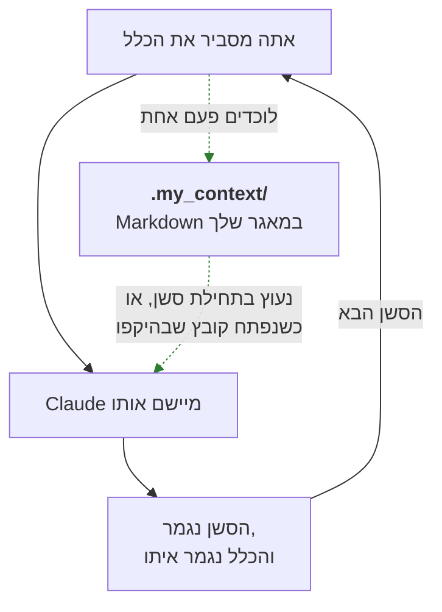
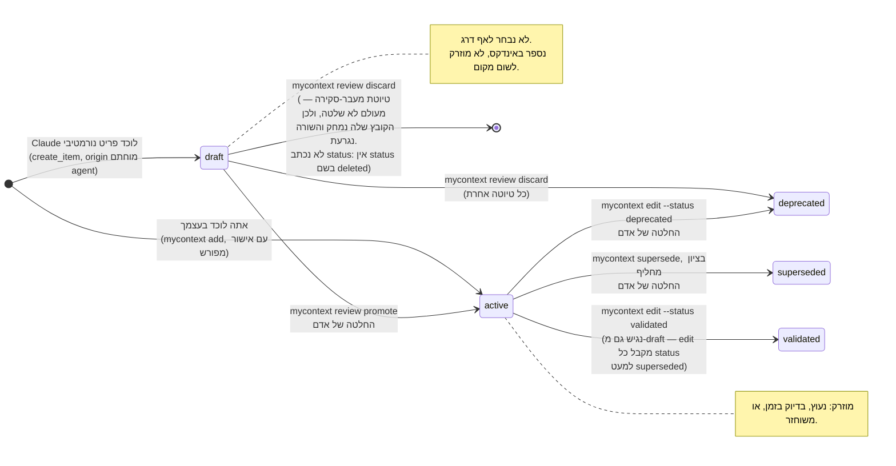

<!--
  Hebrew mirror of `docs/capabilities/01-items-and-corpus.md`. The English file
  is the source. Conventions: `docs/README.he.md` and `docs/the-store.he.md` —
  Hebrew prose and tables inside `<div dir="rtl">`, fenced and Mermaid blocks
  outside it, `<span dir="ltr">` around any Latin run whose edges are not both
  alphanumeric or which joins two or more Latin terms with commas or slashes.
  Pasted command output is not translated. Mermaid labels are translated and
  the structure is the English one; the two fences here are the ones
  `docs/README.he.md` already carries, character for character, because the
  English originals are shared with `README.md`.
  Heading sequence must stay identical to the English file.
-->

<title>פריטים והקורפוס</title>

<div dir="rtl">

[← אינדקס](./00-index.he.md)

</div>

# פריטים והקורפוס

<div dir="rtl">

הידע הנורמטיבי של my_context חי כקובצי Markdown תחת
<span dir="ltr">`.my_context/items/<category>/<id>.md`</span>. כל משטח אחר — אינדקס ה-SQLite,
ממשק הרשת, ההקשר המוזרק, <span dir="ltr">`show`/`list`/`search`</span> של שורת הפקודה — הוא
*קריאה* של הקבצים האלה או של טבלה שנבנתה מהם. ההוכחה, כפי שאומתה על המאגר הזה: מסד הנתונים
של האינדקס יושב ב-<span dir="ltr">`.my_context/.index.db`</span>
(<span dir="ltr">`resolveWorkspace`</span> ב-<span dir="ltr">`src/core/workspace.ts:224`</span>,
אומת על הדיסק — <span dir="ltr">`find . -iname "*.db"`</span> מעלה את
<span dir="ltr">`.my_context/.index.db`</span>, <span dir="ltr">`.my_context/.audit/audit.db`</span>,
וקבצים תואמים בסביבות העבודה של המתקנים <span dir="ltr">`.my_context.nested-44/`</span> ו-
<span dir="ltr">`.demo-corpus/`</span>). מחיקת <span dir="ltr">`.index.db`</span> והרצת
<span dir="ltr">`mycontext rebuild`</span> בונים אותו מחדש מה-Markdown בלי לאבד דבר — האינדקס
הוא מטמון, וה-Markdown הוא מקור האמת. **ה-Markdown הוא העותק ה*סמכותי* היחיד של נוסח כלל,
והתפקיד של קטגוריה הוא להחזיק בדיוק אחד** — אבל הוא אינו פשוטו כמשמעו העותק היחיד על הדיסק,
וההבדל חשוב לכל מי שמנתח מחיקת מידע או מה שממצא מיושן עדיין יכול לומר:
<span dir="ltr">`items.data TEXT NOT NULL`</span> בסכמת האינדקס
(<span dir="ltr">`src/core/store.ts:29`</span>) שומר את כל הפריט המסודר, כולל הגוף, ו-
<span dir="ltr">`.my_context/.revisions/`</span> מחזיק גופים מבוימים שממתינים לקידום. שניהם
נגזרים ושניהם נבנים מחדש מה-Markdown; אף אחד מהם לא נשאל כאמת.

**פריט** הוא קובץ Markdown אחד: בלוק <span dir="ltr">frontmatter</span> (YAML בין גדרות <span dir="ltr">`---`</span>)
ואחריו גוף בפרוזה. המזהה הוא גם גזע שם הקובץ, והוא מיוצר מהכותרת — לעולם לא נבחר בחופשיות —
ולכן מזהה מתאר את עצמו ואף פעם לא צריך לחפש אותו. במאגר הזה, מזהים אמיתיים נראים כמו
<span dir="ltr">`RULE-1-1-with-the-mockup-and-the-owner-says-when-it-is-done`</span> או
<span dir="ltr">`REQ-every-category-declares-what-may-be-updated-on-its-items-and`</span>.

פריט קיים כדי לשבור לולאה שכל גישה קודמת להקשר של פרויקט חוזרת עליה:

</div>



<div dir="rtl">

החצים הרציפים הם כלל שמוסבר מחדש בכל סשן כי שום דבר לא שמר אותו. החצים המקווקווים הם מה
שפריט עושה במקום: נכתב פעם אחת כקובץ Markdown תחת <span dir="ltr">`.my_context/items/`</span>,
ומוחזר להקשר מעצמו — בתחילת סשן אם הוא נעוץ, או כשקובץ שה-<span dir="ltr">`scope`</span> שלו
נוקב בו עומד להיפתח ([<span dir="ltr">`./02-injection.he.md`</span>](./02-injection.he.md)) —
בלי שאף אחד מקליד אותו מחדש.

## קטגוריות: 29 נשלחות, 16 בשימוש כאן

התדריך שביקש את המסמך הזה נוקב ב-14 קטגוריות כאילו זה כל המערך. זה לא.
<span dir="ltr">`src/core/categories.ts`</span> (556 שורות, <span dir="ltr">`wc -l`</span>,
2026-09-17) הוא מקור האמת היחיד, והוא מגדיר כרגע **29** קטגוריות נשלחות, כל אחת עם שם, תחילית
מזהה, **דרג** (<span dir="ltr">`normative`</span> או <span dir="ltr">`rationale`</span>), דגל
<span dir="ltr">`defaultEnabled`</span>, תיאור בשורה, ושדות נוספים משלה. הקורפוס של המאגר הזה
מחזיק כרגע פריטים ב-16 מתוך ה-29 (השאר מוגדרות וזמינות אבל הפרויקט הזה לא אכלס אותן):

</div>

<div dir="rtl">

| קטגוריה | תחילית | דרג | פריטים על הדיסק כאן |
|---|---|---|---|
| constraint | CONST | normative | 8 |
| invariant | INV | normative | 7 |
| rule | RULE | normative | 58 |
| requirement | REQ | normative | 32 |
| standard | STD | normative | 15 |
| pattern | PAT | normative | 0 |
| glossary | GLOSS | normative | 0 |
| instruction | INSTR | normative | 11 |
| non_goal | NOGOAL | normative | 3 |
| open_question | OPENQ | normative | 31 |
| runbook | RUN | normative | 0 |
| procedure | PROC | normative | 0 |
| environment | ENV | normative | 0 |
| known_issue | KNOWN | normative | 35 |
| exception | EXC | normative | 0 |
| contract | CONTRACT | normative | 0 |
| adr | ADR | rationale | 3 |
| decision | DEC | rationale | 99 |
| lesson | LESSON | rationale | 43 |
| tradeoff | TRADE | rationale | 0 |
| assumption | ASSUME | rationale | 0 |
| edge_case | EDGE | rationale | 0 |
| risk | RISK | rationale | 0 |
| measurement | MEAS | rationale | 3 |
| reference | REF | rationale | 5 |
| plan | PLAN | rationale | 0 |
| task | TASK | rationale | 940 |
| todo | TODO | rationale | 0 |
| note | NOTE | rationale | 27 |

</div>

<div dir="rtl">

(הספירות הן <span dir="ltr">`ls .my_context/items/<category>/*.md | wc -l`</span>, **נלקחו מחדש
ב-2026-09-17**; סך הקורפוס הוא 1320 קובצי פריטים על פני 29 התיקיות האלה. הן זזות מדי יום —
<span dir="ltr">`ee4a3a4a`</span> לבדו הפך 113 ממצאים לפריטי משימה — אז קראו כל ספירה כאן
כקריאה מתוארכת והריצו מחדש את הפקודה במקום לסמוך עליה. **הטבלה הזו היא המקום היחיד בפרק הזה
שנושא ספירה שאיננה אפס**: רשימת הסעיפים ב"קטגוריות לפי קבוצה" למטה נהגה לחזור על כמה מהן
חשופות ולא מתוארכות, ועד 2026-09-17 שבע מתוך העשרים־ותשע נסחפו בעוד הטבלה המתוארכת שלצידן לא —
ולכן החזרות החשופות הוסרו במקום להסתנכרן מחדש, כי עותק שני של ספירה הוא דבר שני שצריך לשמור
נכון. מה שהסעיפים עדיין אומרים זה *"0 פריטים כאן"*, עבור שלוש־עשרה הקטגוריות שהפרויקט הזה
מעולם לא אכלס; אלה אפסים מדודים שנלקחו מחדש ב-**2026-09-17** עם אותה פקודה, והם מצוירים ולא
מושמטים מהסיבה של
<span dir="ltr">`STD-a-measured-zero-is-drawn-and-named-an-unmeasured-thing-is`</span>.
<span dir="ltr">`task`</span> מגמדת את כל השאר משום שהיא פנקס ניהול העבודה של הקורפוס עצמו —
כל יחידת עבודה שהפרויקט הזה עקב אחריה אי פעם, לפי
<span dir="ltr">`RULE-a-citation-names-an-item-by-id-never-a-report-by-line-number`</span>
ושכנותיו ב-<span dir="ltr">`src/rules/`</span>.)

שני פרופילים בוחרים תת-קבוצת פתיחה עבור <span dir="ltr">`mycontext init`</span>:
<span dir="ltr">`standard`</span> הוא כל קטגוריה עם <span dir="ltr">`defaultEnabled: true`</span>
(היום זה כל ה-29 — ראו "מה לא בנוי" למטה), ו-<span dir="ltr">`minimal`</span> הוא שמינייה
נבחרת ביד: <span dir="ltr">`constraint, assumption, invariant, tradeoff, adr, edge_case, rule, lesson`</span>
(<span dir="ltr">`PROFILES`</span> ב-<span dir="ltr">`categories.ts`</span>). פרויקט יכול גם
להגדיר קטגוריות מותאמות לגמרי ב-<span dir="ltr">`.my_context/config.json`</span> —
<span dir="ltr">`CategoryUpdates`</span> מוכרז כניתן לכתיבה בידי אדם, לפי
<span dir="ltr">`REQ-every-category-declares-what-may-be-updated-on-its-items-and`</span>
("קטגוריה שאינה יכולה לתאר את העדכונים של עצמה אינה מלמדת איש דבר" — במילותיה שלה).

## דרגים: ההבחנה האחת שמכריעה למי נאמר

<span dir="ltr">`export type Tier = 'normative' | 'rationale'`</span>
(<span dir="ltr">`src/core/types.ts:1`</span>) הוא כל אוצר המילים. מה שזה קונה:

- **<span dir="ltr">normative</span>** — זהו כלל שהעבודה חייבת לספק. פריט נורמטיבי
  <span dir="ltr">`active`</span> עם <span dir="ltr">`always: true`</span> מוזרק לכל סשן
  במלואו; כל פריט נורמטיבי <span dir="ltr">`active`</span> אחר נקוב בשורת האינדקס של הסשן כדי
  שסוכן יוכל למשוך אותו — **אם התקציב מרשה.** לדרג האינדקס יש תקציב משלו כמו לכל דרג אחר,
  גלישה נרשמת כ-<span dir="ltr">`Spill`</span> ב-<span dir="ltr">`tier: 'index'`</span>, ו-
  <span dir="ltr">`GoverningSpill.untitled`</span> (<span dir="ltr">`src/core/select.ts:431–440`</span>)
  קיים בדיוק כדי לנקוב במזהים שולטים שהגיעו לסשן הזה ב"שום צורה — לא נמסרו במלואם, וגם דחקו
  את התקציב של דרג האינדקס עצמו, ולכן אין כותרת, אין שורה, אין כלום." על הקורפוס של המאגר הזה
  הרשימה הזו נמדדת **ריקה** בכל תקציב אינדקס שנוסה (בדיקת הנשיאה:
  <span dir="ltr">`displaced`</span> הוא <span dir="ltr">`0`</span> מ-1,200 **ועד** 470), והקוד
  אומר במילים שלו שהוא "מחושב ולא מונח כריק" משום שקורפוס שגדל או
  <span dir="ltr">`budgets.index`</span> שהונמך יכולים להפוך אותו ללא-ריק. ראו
  [הזרקה](./02-injection.he.md) בשביל המכניקה — <span dir="ltr">`buildIndex`</span> של
  <span dir="ltr">`select.ts`</span> הוא המקום שבו הדרג באמת נקרא (<span dir="ltr">`isNormative`</span>
  שומר על השאלה האם <span dir="ltr">`always`</span> ו-<span dir="ltr">`scope`</span> נשאלים).
- **<span dir="ltr">rationale</span>** — זה חשיבה *על* עבודה או רישום של החלטה שהייתה, לעולם
  לא הוראה לציית לה בעצמה. פריט rationale לעולם אינו נקוב באינדקס הסשן;
  <span dir="ltr">`buildIndex`</span> מצמצם את כל הדרג לספירה חשופה (למשל "3 decision, 1 lesson").
  שום דבר שסוכן עושה אינו שגוי *מפני* שפריט rationale קיים.
  **חריג אחד, והוא מכוון ולא דליפה: דרג ה-<span dir="ltr">`continuity`</span>.** הדרג הזה שואב
  את המועמדים שלו מ-<span dir="ltr">`eligible`</span>, לא מ-<span dir="ltr">`injectable`</span>,
  ולעולם אינו מתייעץ עם <span dir="ltr">`isNormative`</span>
  (<span dir="ltr">`src/core/select.ts:1685–1687`</span>), ולכן **פריט מדרג rationale שנושא
  <span dir="ltr">`continuity: true`</span> נמסר במלואו.** המקור קובע זאת כנקודה של הדרג ולא
  כתופעת לוואי: *"הפריט שהדרג הזה קיים בשבילו הוא <span dir="ltr">`reference`</span>, שהוא
  מדרג rationale לפי הקטלוג; שער כאן היה שולח דרג שלעולם לא יוכל למסור את הפריט היחיד שנבנה
  כדי למסור, והיה עושה זאת בשקט."* <span dir="ltr">`categories.ts:125`</span> אומר את אותו דבר
  מצד השדה — <span dir="ltr">`continuity`</span> מתקבל בדרג rationale "בשונה מ-severity
  ומ-always", משום ש"דרג ההמשכיות אינו דרג ממשל". המשכיות מוסרת את מה שהסשן הבא צריך כדי לא
  להתחיל מחדש; היא אינה הופכת את הפריט לשולט.

הערות הקטגוריות ב-<span dir="ltr">`categories.ts`</span> מנמקות את זה פר קטגוריה ולא קובעות
אותו פעם אחת, והנימוקים קונקרטיים ולא טקסונומיים:

- <span dir="ltr">`known_issue`</span> היא **normative** אף שהמשפט "הארגז חול תזזיתי" נקרא
  כעובדה ולא כהנחיה — כי קטגוריה שכל תפקידה הוא "זה שבור, אל תשקיעו בזה מאמץ" חסרת תועלת
  מדרג שסוכן לעולם לא קורא במלואו. היא נשלחה על <span dir="ltr">`rationale`</span> פעם אחת
  והערת הקוד רושמת זאת כטעות עיצוב ש"מסכלת את כל מטרת הקטגוריה."
- <span dir="ltr">`exception`</span> היא **normative** מאותה סיבה הפוכה: חריג נקרא בדיוק ברגע
  שבו הכלל שהוא מוותר עליו מיושם, ולכן הוא חייב להגיע באותו מסלול ומול אותו תקציב כמו אותו
  כלל, אחרת קורא נאמר לו הכלל ולעולם לא נאמר לו הפטור.
- <span dir="ltr">`task`</span> ו-<span dir="ltr">`plan`</span> הן **rationale**, במכוון, אף
  שהקורפוס הזה לבדו מחזיק 866 פריטי משימה: "515 משימות פתוחות שמגיעות כ-515 דברים שנאמר למודל
  לדאוג להם הוא בדיוק הכישלון שגבול הדרגים קיים כדי למנוע." תצוגות ש*כן* צריכות אותן —
  <span dir="ltr">`mycontext ready`</span>, בדיקות המשימות של <span dir="ltr">`mycontext doctor`</span>
  — שואלות את המאגר ישירות ולעולם לא עוברות דרך <span dir="ltr">`select`</span>.
- <span dir="ltr">`todo`</span> ו-<span dir="ltr">`note`</span> הן **rationale** משום שכל הנקודה
  של תיבת דואר נכנס היא לכידה בלי חיכוך; לכפות על אחת מהן להיכנס לדרג שמוזרק במלואו (ונשמר
  כטיוטה בלכידה של סוכן, ראו [יצירה והשערים](./03-creation-and-gates.he.md)) "היה מסכל את
  הסיבה שבגללה שתיהן קיימות."
- <span dir="ltr">`reference`</span> היא **rationale** כ*גבול אמון*, לא כשיקול דעת: הגוף שלה
  הוא תצלום של קובץ, ולכן הפיכתה לנורמטיבית הייתה מאפשרת לכל מי שיכול לערוך את קובץ המקור ההוא
  לשנות את מה ששולט בפרויקט בעריכת קובץ לא קשור — ופותחת מחדש את שער הגרסאות המבוימות דרך דלת
  צדדית. בדרגי הממשל <span dir="ltr">`select`</span> מסנן <span dir="ltr">`isNormative`</span>
  לפני שהוא קורא <span dir="ltr">`always`/`scope`</span> בכלל, ולכן reference אינו יכול להגיע
  כדבר ששולט. הוא **כן** יכול עדיין להגיע במלואו, דרך דרג ה-<span dir="ltr">`continuity`</span>,
  שבעיצובו אינו מתייעץ עם <span dir="ltr">`isNormative`</span> — <span dir="ltr">`categories.ts:125`</span>,
  במילותיו שלו: *"דרג ההמשכיות אינו דרג ממשל ולעולם אינו מתייעץ עם isNormative, ולכן reference
  יכול לשאת אותו."* להימסר ולשלוט הם שני דברים שונים, וגבול הדרגים עוסק בשני.

<span dir="ltr">`DEC-status-is-the-governance-axis-state-is-the-workflow-axis-and`</span> נוקב
בציר שני, מאונך, שכדאי להכיר כאן: **<span dir="ltr">`status`</span>** (draft / active /
validated / deprecated / superseded) אומר האם רשומה עדיין עומדת בכלל, בעוד
**<span dir="ltr">`state`</span>** (todo / doing / blocked / done, שדה נוסף של
<span dir="ltr">`task`</span> בלבד) אומר עד כמה העבודה התקדמה. הם "נראים דומים, אז אנשים
ממזגים אותם, וזה שובר בשקט את שניהם" — ההחלטה היא מה ששומר על <span dir="ltr">`status`</span>
כשדה האחד שכל קטגוריה חולקת ועל <span dir="ltr">`state`</span> כשדה ש-<span dir="ltr">`task`</span>
נושאת לבדה.

## Frontmatter: השדות שכל פריט נושא

ממשק <span dir="ltr">`Item`</span> של <span dir="ltr">`src/core/types.ts`</span> הוא הצורה
הקנונית (אומת מול כינויי הטיפוסים <span dir="ltr">`Status`/`Severity`/`Origin`</span> באותו
קובץ):

</div>

<div dir="rtl">

| שדה | טיפוס / ערכים | מה זה אומר |
|---|---|---|
| `id` | <span dir="ltr">string</span> | גזע שם הקובץ; מיוצר מהכותרת, לעולם לא נבחר ביד. |
| `type` | <span dir="ltr">string</span> | שם הקטגוריה (<span dir="ltr">`rule`, `decision`</span>, …). |
| `title` | <span dir="ltr">string</span> | שורה אחת. נמדד על פני כל 1,320 קובצי הפריטים ב-**2026-09-17**: חציון 78 תווים, 586 מעבר ל-80, הארוך ביותר 566 — הלחץ שהניע את `summary` למטה. כל אחד מארבעת המספרים האלה זז עם הקורפוס. |
| `status` | <span dir="ltr">`active \| draft \| superseded \| deprecated \| validated`</span> | האם הפריט שולט בכלל. |
| `severity` | <span dir="ltr">`hard \| soft`</span> | מחייב מול מייעץ, על פריטים נורמטיביים בלבד. |
| `always` | <span dir="ltr">boolean</span> | נעוץ — מוזרק בכל תחילת סשן בלי קשר להיקף או לתקציב האינדקס. ראו [הזרקה](./02-injection.he.md). |
| `continuity` | <span dir="ltr">boolean</span> | נעיצה שנייה ובלתי תלויה לתוך תקציב ה-*continuity* — נמסר מחדש בכל תחילת סשן ואחרי כל כיווץ, עבור מה שהסשן הבא צריך "כדי לא להתחיל מחדש". משקף את `always` מבנית אך הוא שדה נבדל, "לא מזהה קשיח ב-<span dir="ltr">`select`</span>… ולא קטגוריה… ולא תגית". |
| `summary` | <span dir="ltr">string</span> או <span dir="ltr">null</span> | משפט פשוט אחד, שנכתב לקורא שאינו מכיר את בסיס הקוד — בלי מזהים, בלי נתיבים, בלי מספרים, חסום על ידי <span dir="ltr">`SUMMARY_MAX_CHARS`</span>. <span dir="ltr">`null`</span> חוקי; לכל פריט שקדם לשדה יש אחד. **לעולם לא מוזרק** — <span dir="ltr">`renderItemBlock`/`renderIndexLine`</span> אינם פולטים אותו, ולכן הוא לא עולה תקציב. |
| `summary_of` | <span dir="ltr">string</span> או <span dir="ltr">null</span> | גיבוב התוכן ש-`summary` נכתב מולו (<span dir="ltr">`itemSummaryBasis`</span>), כדי שעריכה מאוחרת יותר בגוף תזוהה כמי שהותירה את הסיכום מיושן. |
| `summary_was` | עד 3 רשומות, החדשה ראשונה | סיכומים קודמים, נשמרים כדי שההיסטוריה לא תאבד כשסיכום מוחלף. תקרה של 3 בפסיקת בעלים ("לא תופס מקום ארוך ואינו אמור להיות מוזרק"); גם הוא אינו מחויב לשום תקציב. |
| `acknowledged` | מפה של קוד-ממצא ← גיבוב-תוכן | ממצאי doctor ש**אדם** פסק בהם, מעוגנים לתוכן הפריט המדויק שהוא ראה. עריכה בגוף מבטלת את האישור (הגיבוב אינו מסכים) והממצא נפתח מחדש. |
| `scope` | <span dir="ltr">string[]</span> (גלובים) | על מה הפריט הזה. ריק פירושו "בכל מקום", אלא אם ה-<span dir="ltr">`scopePolicy`</span> של הקטגוריה דורש אחד. |
| `tags` | <span dir="ltr">string[]</span> | קבוצת שייכות שטוחה — ראו את הערת העיצוב על <span dir="ltr">`UpdateStore`</span> למטה. |
| `origin` | <span dir="ltr">`human \| agent \| ingest \| review`</span> | מי/מה יצר אותו — קובע את ברירת מחדל האמון בלכידה (ראו [יצירה והשערים](./03-creation-and-gates.he.md)). |
| `source_file`, `source_anchor`, `source_checksum` | <span dir="ltr">strings</span> או <span dir="ltr">null</span> | עבור תצלום בצורת <span dir="ltr">`reference`</span>: מאיפה הוא בא ואיך לדעת אם נסחף. |
| `valid_from`, `valid_until` | תאריכים או <span dir="ltr">null</span> | החלון שבו נקבע שהפריט מחזיק. |
| `checksum` | <span dir="ltr">string</span> | מוחתם על תוכן הפריט; <span dir="ltr">`mycontext doctor`/`repair`</span> משתמשים בו למצוא סחף (ראו [יצירה והשערים](./03-creation-and-gates.he.md)). |
| `extra` | מפה | שדות ספציפיים לקטגוריה — <span dir="ltr">`directive`</span> על <span dir="ltr">`rule`</span>, <span dir="ltr">`waives`/`until`/`granted_by`/`reason`</span> על <span dir="ltr">`exception`</span>, <span dir="ltr">`state`/`plan`/`seq`/`priority`/`needs`/`verified_on`</span> על <span dir="ltr">`task`</span>, וכן הלאה. |
| `request` (סעיף גוף, לא frontmatter) | טקסט חופשי | מילותיו של האדם עצמו כשביקש את הפריט הזה, מילה במילה, נלכדות **לפני** שנגזרים גוף או סיכום — "תיעוד בלבד… אינו אמור להיות מוזרק". מוחרג מבנית מהרינדור, מבסיס הסיכום ומה-checksum. |
| גוף | פרוזה | מה שהפריט באמת אומר; חציון **1,985 בתים** של טקסט שאחרי ה-frontmatter על פני כל 1,320 קובצי הפריטים, **2026-09-17**. |

</div>

<div dir="rtl">

<span dir="ltr">`status`</span> הוא השדה שמכריע אם כל שאר הטבלה הזו חשוב בכלל —
<span dir="ltr">`draft`</span> נושא frontmatter מלא וגוף כמו כל פריט אחר, ואף אחד מהם אינו
שולט עד שאדם פועל עליו:

</div>



<div dir="rtl">

(שימוש חוזר בסעיף 7 של ה-README עצמו, מתוקן ב-2026-09-17 — המנגנון אינו שונה בין המצגת לבין
הסימוכין הזה. ל-<span dir="ltr">`mycontext review discard`</span> יש שתי תוצאות, לא אחת:
<span dir="ltr">`cli/commands/review.ts:1106`</span> מסתעף על
<span dir="ltr">`declineRefusal(item)`</span> — טיוטת מעבר-סקירה
(<span dir="ltr">`origin: 'review'`</span>, שכבת הפרויקט, עדיין באזור הטיוטות) **נמחקת**,
"נכתבה על ידי מעבר הסקירה ומעולם לא שלטה בדבר, ולכן היא נמחקת ולא נגנזת"; כל טיוטה אחרת
מורדת ל-<span dir="ltr">`deprecated`</span> דרך נתיב הגניזה הרגיל.
<span dir="ltr">`active → deprecated`</span> היא קשת שלישית שלא צוירה קודם —
<span dir="ltr">`mycontext edit <id> --status deprecated`</span> מגיע לגניזה דרך
<span dir="ltr">`updateItem`</span> בדיוק כמו <span dir="ltr">`supersede`</span>, לפי ההערה של
<span dir="ltr">`mutate.ts`</span> עצמו על ארבע הפקודות שמתכנסות שם.

**שני דברים בציור הזה תוקנו שוב ב-2026-09-17, ושניהם נקראו מתוך המקור ולא מתוך הפסקה שלצידם.**

<span dir="ltr">`deleted`</span> צויר כתיבה שישית בשורה של סטטוסים. הוא אינו סטטוס:
<span dir="ltr">`Status`</span> הוא בדיוק חמישה ערכים —
<span dir="ltr">`active | draft | superseded | deprecated | validated`</span>
(<span dir="ltr">`src/core/types.ts:92`</span>, ואותם חמישה ב-<span dir="ltr">`STATUSES`</span>,
<span dir="ltr">`src/core/vocabulary.ts:375`</span>). מה ש-<span dir="ltr">`review discard`</span>
עושה לטיוטת מעבר-סקירה הוא להסיר את הקובץ ולגרוע את השורה —
<span dir="ltr">`rmSync(...)`</span> ואז <span dir="ltr">`ctx.store.deleteById(item.id)`</span>
(<span dir="ltr">`src/review/decline.ts:163-164`</span>), אחרי שרשומת פנקס הדחייה נכתבה ורק אם
נכתבה (<span dir="ltr">`:149-161`</span>). שום <span dir="ltr">`status`</span> לא מוקצה אי פעם.
המעבר אמיתי ושייך לציור; הוא קשת סופית, לא מצב, והגרסה הזו מציירת אותו ככזו.

ו-<span dir="ltr">`validated`</span> תואר כאן כערך ש**"שום דבר בפרק הזה או בפרק 3 אינו מתחקה
אחר פקודה שמייצרת אותו"**. זה שקר, וזה היה שקר כשזה נכתב:
<span dir="ltr">`mycontext edit <id> --status validated`</span> מייצר אותו.
<span dir="ltr">`edit`</span> מאמת את <span dir="ltr">`--status`</span> מול
<span dir="ltr">`STATUSES`</span> (<span dir="ltr">`src/cli/commands/edit.ts:753`</span>) ומסרב
בדיוק לחבר אחד — <span dir="ltr">`superseded`</span>, ב-<span dir="ltr">`:764-767`</span>,
ששורת השימוש ב-<span dir="ltr">`:96`</span> גם קובעת אותו במניית
<span dir="ltr">`active|draft|deprecated|validated`</span> ולא יותר. אז הסטטוס החמישי נגיש
בנתיב העריכה הרגיל מ-<span dir="ltr">`draft`</span> ומ-<span dir="ltr">`active`</span> כאחד,
והדיאגרמה מציירת עכשיו את הקשת במקום להתנצל על היעדרה.) השער שהדיאגרמה הזו מציירת — למה פריט
נורמטיבי שנכתב על ידי מכונה נוחת בלי יכולת לשלוט בדבר עד שאדם מסתכל עליו — הוא הנושא המלא של
[פרק 3](./03-creation-and-gates.he.md); <span dir="ltr">`origin`</span> למעלה הוא מה שהשער קורא
כדי להכריע בין <span dir="ltr">`draft`</span> ל-<span dir="ltr">`active`</span> בזמן הלכידה.

שני שדות שהטבלה למעלה אינה נושאת, ושניהם נושאי משקל:

- **<span dir="ltr">`layer`</span>** (<span dir="ltr">`project | global`</span>,
  <span dir="ltr">`src/core/types.ts:511`</span>) — מאיזה שורש הקובץ נטען.
  <span dir="ltr">`mergeLayers`</span> (<span dir="ltr">`src/core/select.ts:1328–1337`</span>)
  גורם ל**פריט פרויקט להאפיל על פריט גלובלי עם אותו מזהה**, כך שקורפוס גלובלי יכול לשלוח
  ברירת מחדל שמאגר עוקף בשקט. השדה נגזר ממקום ישיבת הקובץ, לעולם לא נכתב ב-frontmatter.
- **<span dir="ltr">`WRITABLE_SECTIONS`</span>** (<span dir="ltr">`src/core/item.ts:243`</span>)
  הוא <span dir="ltr">`{steps, observations, relations, request}`</span> — ארבעת סעיפי ה*גוף*
  שפקודה רשאית לכתוב מחדש. רק <span dir="ltr">`request`</span> מתואר למעלה; שלושת האחרים הם
  איך <span dir="ltr">`procedure step`</span>, פנקס התצפיות וגרף היחסים מגיעים לדיסק.

## גבול הקריאה: למה הופך <span dir="ltr">`status: activ`</span>

זהו הדבר שהוקשח לאחרונה בפריט, והוא ראוי לסעיף משלו משום שהוא מכריע אם שגיאת הקלדה יכולה
לחלק סמכות בשקט. <span dir="ltr">`Status`</span>, <span dir="ltr">`Severity`</span> ו-
<span dir="ltr">`Origin`</span> מוכרזים ב-<span dir="ltr">`src/core/vocabulary.ts`</span> (הם
נהגו לחיות ב-<span dir="ltr">`validate.ts`</span>, מודול בגבול ה**כתיבה** שגבול הקריאה לא יכול
היה לייבא בלי ליצור מחדש מעגל), ו**גבול הקריאה כבר לא מבצע cast.** הוא נהג:
<span dir="ltr">`(optString(fm, 'status') ?? 'active') as Status`</span>. קובץ שאומר
<span dir="ltr">`status: activ`</span> ייצר אז <span dir="ltr">`Item`</span> שה-
<span dir="ltr">`status`</span> שלו היה <span dir="ltr">`'activ'`</span> — לא חבר באיחוד שהטיפוס
שלו עצמו הצהיר — ו-<span dir="ltr">`GOVERNING_STATUS[item.status]`</span>, שהוא
<span dir="ltr">`Record<Status, boolean>`</span> שנכתב *טוטלי* בדיוק כדי שלכל סטטוס תהיה
תשובה, החזיר <span dir="ltr">`undefined`</span>. נמדד ב-2026-09-13 מול קורפוס חד-פעמי:
**חמישה שערים ששואלים את השאלה הזו הפסיקו כולם לירות**, ו-
<span dir="ltr">`governsNormatively`</span> החזיר <span dir="ltr">`undefined`</span> מפונקציה
שהוכרזה <span dir="ltr">`boolean`</span>.

<span dir="ltr">`readEnum(raw, policy)`</span> (<span dir="ltr">`src/core/vocabulary.ts:463`</span>)
מחליף את ה-cast, ו-<span dir="ltr">`ENUM_READ`</span> (<span dir="ltr">`:439`</span>) היא
הטבלה. **<span dir="ltr">`absent`</span> ו-<span dir="ltr">`laundered`</span> הם שדות נפרדים,
ורק בשורה אחת הם שווים:**

</div>

<div dir="rtl">

| שדה | חסר (אין מפתח כזה) | מולבן (ערך מחוץ לאוצר המילים) |
|---|---|---|
| `status` | `active` | **`draft`** |
| `severity` | `soft` | `soft` |
| `origin` | `human` | `human` |

</div>

<div dir="rtl">

האי-סימטריה ב-<span dir="ltr">`status`</span> היא כל הנקודה: ברירת המחדל ה*חסרה* היא החבר
המתירני — פריט בלי שורת <span dir="ltr">`status:`</span> שולט — ולכן קריאת פריט מקולקל באותה
דרך "הייתה מאפשרת לבית מוקלד שגוי לחלק את הדבר החזק ביותר שהשדה הזה מעניק."
<span dir="ltr">`draft`</span> אינו שולט בדבר, הוא המקום שבו לכידה לא אמינה כבר נוחתת, והוא
**נראה** (הפריט מופיע בתור הטיוטות במקום להיעלם). <span dir="ltr">`severity`</span> מסכים עם
עצמו משום ש-<span dir="ltr">`hard`</span> הוא ההסלמה ו-<span dir="ltr">`soft`</span> הוא גם
החבר החלש יותר וגם ברירת המחדל החסרה. <span dir="ltr">`origin`</span> נוחת על
<span dir="ltr">`human`</span> מסיבה אחרת מזו של <span dir="ltr">`status`</span>:
<span dir="ltr">`origin`</span> שמור לעולם אינו מעניק ל*פריט* סמכות — הקוראים שלו שואלים האם
מנגנון אוטומטי רשאי לפעול (<span dir="ltr">`retire.ts`</span> רוצה
<span dir="ltr">`'review'`</span>, <span dir="ltr">`review/decline.ts`</span> מסרב לכל דבר שאינו
<span dir="ltr">`'review'`</span>) — ולכן <span dir="ltr">`human`</span> עונה לא לשניהם, ונפילה
חזרה ל-<span dir="ltr">`review`</span> הייתה בדיוק הפוכה.

שלושה משטחים מסכימים על זה מעצם הבנייה, וזו הסיבה שהטבלה חיה במקום אחד:

- **<span dir="ltr">`parseItem`</span> מבצע את הנפילה חזרה** ואינו אומר דבר — הוא נקרא במהלך
  פענוח שאין לו לאן לדווח.
- **<span dir="ltr">`doctor`</span> מדווח על זה.** <span dir="ltr">`launderedEnums`</span>
  (<span dir="ltr">`src/core/item.ts:576`</span>) מזין את הממצא
  <span dir="ltr">`laundered_enum`</span> (<span dir="ltr">`src/doctor/body-integrity.ts:565–569`</span>
  — ולא <span dir="ltr">`doctor/checks.ts`</span>, שאורכו 2,596 שורות ולעולם אינו פולט את הקוד
  הזה), בדרגת **<span dir="ltr">`error`</span>**, עם תרופה מוכנה להעתקה
  <span dir="ltr">`mycontext edit <id> --status|--severity <read value> --yes`</span> עבור שני
  השדות הניתנים לתיקון ומסלול <span dir="ltr">`ack`</span> עבור <span dir="ltr">`origin`</span>.
- **<span dir="ltr">`pack import`</span> מסרב במקום להלבין.**
  <span dir="ltr">`src/pack/reader.ts:310–337`</span> דוחה את **כל** הממצא אם פריט כלשהו נושא
  enum שאינו ניתן לקריאה — *"שום דבר לא יובא."* הנימוק מצוין במקור: הנפילה חזרה נכונה לקובץ
  בקורפוס של הבעלים עצמו, שהוא שלו לתקן, ושגויה עבור "נתיב הקריאה היחיד שניתן להגיע אליו
  מקלט שאף אחד בפרויקט הזה לא כתב", כי היא הייתה שותלת פריט שנושא סטטוס שהשולח בחר והקורא
  מעולם לא ראה.

**שדות מול תגיות — פסיקת בעלים אחת, מדידה אחת.** <span dir="ltr">`UpdateStore`</span>
(<span dir="ltr">`categories.ts:22`</span>) מותח קו נוקשה: *"אם אי פעם תרצו לעדכן את זה, זה
שדה."* תגית היא שייכות, ו"מה שנראה כמו עדכון הוא הסרה ועוד הוספה, שתי פעולות שיכולות להיכשל
חלקית ושטעות הקלדה הופכת לשייכות שלישית שקטה." זה לא תיאורטי — אותו קובץ רושם מדידת פרויקט
שנלקחה ב-2026-08-23: על פני 276 פריטי <span dir="ltr">`task`</span>, כל 276 נשאו **תגית**
<span dir="ltr">`state:`</span>, 213 נשאו גם **שדה** <span dir="ltr">`state`</span>, ו-13 לא
הסכימו (5 קראו <span dir="ltr">`done`</span> כתגית ו-<span dir="ltr">`doing`</span> כשדה).
<span dir="ltr">`task.state`</span> מוכרז עכשיו כשדה עם <span dir="ltr">`projectsTo: 'state'`</span>,
ולכן הכלי כותב את התגית בעצמו, מיוצרת ולא מוקלדת ביד, ושומר על השניים מסונכרנים מעצם הבנייה.

### שני שדות נוספים שנגנזו, ונשארו במקומם

<span dir="ltr">`categories.ts`</span> מתעד פסיקת בעלים (2026-09-03) שגונזת את
<span dir="ltr">`task.progress`</span> ואת <span dir="ltr">`task.last_change`</span> — הוסרו
ממשטח הכתיבה (<span dir="ltr">`unknownExtraFieldError`</span> מסרב עכשיו לכתיבה *חדשה* לכל
אחד מהם) אבל **לא נמחקו**: הפריטים שכבר נושאים אותם שומרים אותם ללא שינוי על הדיסק. **שני
הנתונים בפסיקה ההיא הם של הפסיקה עצמה, ולא קריאה של הקורפוס של היום** —
<span dir="ltr">`categories.ts:453`</span> רושם *"518 הפריטים שכבר נושאים את שני המפתחות
האלה"* ו-<span dir="ltr">`:458`</span> מצטט את ההערה, *"מוקלדים ביד ולא אמינים, כל 133 לא
מסכימים עם יומן הביקורת"*, שניהם כפי שנמדדו ב-2026-09-03. נספר שוב ב-**2026-09-17**
(<span dir="ltr">`grep -rlE '^(progress|last_change):' .my_context/items`</span>), 161 קובצי
פריטים נושאים אחד מהמפתחות ו-143 נושאים <span dir="ltr">`last_change`</span>. שני המספרים
אינם ניתנים ליישוב בשום ספירה קריאה-בלבד של קובצי הפריטים והם מצוטטים כאן כרישום של הפסיקה
ולא נאמרים מחדש כמצב עדכני. <span dir="ltr">`progress`</span> "מעולם לא היה יותר מהצל של state
(רק 0 ו-100 בשימוש היום)." זהו המודל של הפרויקט עצמו למה ש"נגנז" אומר עבור שדה, בנבדל מ-
<span dir="ltr">`status: superseded`</span> של פריט קורפוס — תיקון עוצר מופעים חדשים, הוא אינו
כותב מחדש את ההיסטוריה.

## דוגמה מעובדת: <span dir="ltr">`mycontext show`</span>

</div>

```
$ node src/cli/index.ts show RULE-1-1-with-the-mockup-and-the-owner-says-when-it-is-done
---
id: RULE-1-1-with-the-mockup-and-the-owner-says-when-it-is-done
type: rule
title: the owner says when a screen is done, and passing is not the same as designed
status: active
severity: hard
always: false
summary: A screen is finished only when the owner says so; the old demand that it match the
  design drawing exactly is gone, and only a difference that matters is now worth reporting.
summary_of: 405a02fa5f36b963
summary_was:
  - 2026-09-11 A screen is finished only when the owner says so, and a test showing that it
    works is not a test showing it is the screen that was actually designed.
acknowledged:
  - body_disagrees_with_meta@7ef8f3973e3068f7
scope: []
tags:
  - v2
  - ui
  - governance
origin: human
source_file: null
source_anchor: null
source_checksum: null
valid_from: 2026-08-22
valid_until: null
checksum: 1b7170dbc5915798
---

# the owner says when a screen is done, and passing is not the same as designed
...
```

<div dir="rtl">

(נקטע כאן — הגוף האמיתי משתרע על כ-90 שורות, כולל שני תיקונים רשומים שכל אחד מהם מצטט את
פריט ה-<span dir="ltr">`DEC-…`</span> שהחליף חלק מהכלל, ושורת <span dir="ltr">`Related:`</span>
שמקשרת שני מזהי <span dir="ltr">`RULE-…`</span> אחים.)

הפריט הבודד הזה מדגים כמה מנגנונים בבת אחת: <span dir="ltr">`summary`</span> נבדל מהכותרת,
רשומת היסטוריה ב-<span dir="ltr">`summary_was`</span> מעריכה קודמת, ממצא doctor ב-
<span dir="ltr">`acknowledged`</span> שאדם כבר הסתכל עליו, ושתי הודעות תיקון בתוך הגוף שכל אחת
מצטטת את ההחלטה שצמצמה את הכלל — מופע חי של "נקבו בפריט, אל תאמרו אותו מחדש", אותה משמעת
שמערך התיעוד הזה עצמו מקיים.

## קטגוריות לפי קבוצה, עם דוגמאות נשלחות אמיתיות

### נורמטיביות (מוזרקות במלואן כשיש <span dir="ltr">`always`</span>, אחרת מאונדקסות)

- **<span dir="ltr">`constraint`</span>** — מגבלה שאינה נתונה למשא ומתן (תקציב, ערימת טכנולוגיה,
  רגולציה, SLA). ספירה: ראו את הטבלה המתוארכת למעלה.
- **<span dir="ltr">`invariant`</span>** — תנאי שחייב להתקיים תמיד במהלך ההרצה. ספירה: ראו את
  הטבלה המתוארכת למעלה.
- **<span dir="ltr">`rule`</span>** — הנחיית עשה/אל תעשה; השדה הנוסף היחיד שלה הוא
  <span dir="ltr">`directive: do | dont`</span> — "מה הכלל **אומר**, וזו הסיבה ש-
  <span dir="ltr">`directive`</span> לעולם לא יוכל להיות מוסר מהקטגוריה." דוגמה נשלחת:

</div>

  ```
  id: RULE-never-log-request-bodies-on-auth-endpoints
  title: Never log request bodies on auth endpoints
  directive: dont

  Bodies carry passwords and reset tokens; logs are retained for 90 days.
  ```

<div dir="rtl">

  *מקרה שימוש*: לקודד עשה/אל תעשה של אבטחה או תהליך כך שייקבע מחדש בכל תחילת סשן במקום לחיות
  רק בזיכרון של עמית. הקטגוריה הנורמטיבית הגדולה ביותר בנפח; הספירה בטבלה המתוארכת למעלה.
- **<span dir="ltr">`requirement`</span>** — מה חייב להיבנות; שדה נוסף
  <span dir="ltr">`kind`</span> (רק <span dir="ltr">`functional`</span> מעיד עד כה — במכוון לא
  הוכרז אוצר מילים סגור מערך אחד שנצפה: "ארבע קביעות בעיצוב הרשמי נמדדו כשגויות בשבוע אחד"
  בדיוק מהסקה מהסוג הזה).
- **<span dir="ltr">`standard`</span>** — עיצוב, מוסכמת קידוד, הנחיה ארכיטקטונית.
- **<span dir="ltr">`pattern`</span>** — פתרון שניתן לשימוש חוזר, או אנטי-דפוס שיש להימנע
  ממנו. 0 פריטים כאן; דוגמה נשלחת:
  <span dir="ltr">`PAT-repository-objects-wrap-every-query-handlers-never-open-a`</span>
  ("שומר על ניהול ה-pool במקום אחד והופך את תקרת ה-pool לניתנת לאכיפה.")
- **<span dir="ltr">`glossary`</span>** — שפה אחידה: המונח המוסכם, והמונחים שאין להשתמש בהם.
  0 פריטים כאן; דוגמה נשלחת:
  <span dir="ltr">`GLOSS-tenant-means-a-paying-organisation-not-a-user`</span> ("אמרו 'tenant'
  לישות המחויבת ו-'member' לאדם שבתוכה. לעולם לא 'account'.")
- **<span dir="ltr">`instruction`</span>** — שולטת ב*תהליך* של הסוכן, לא בממצא (למשל
  <span dir="ltr">`INSTR-a-ruling-taken-in-the-screen-walkthrough-is-captured-before`</span>).
  זו הקטגוריה שרשימת 14 הפריטים של התדריך משמיטה לחלוטין, לצד 14 אחרות.
- **<span dir="ltr">`non_goal`</span>** — איסור מפורש על בניית משהו.
- **<span dir="ltr">`open_question`</span>** — לא הוכרע במכוון; השדה הנוסף
  <span dir="ltr">`blocks`</span> נוקב במה שלא יכול להתקדם עד שייענה — הסוכן אסור לו להכריע
  באלה לבדו.
- **<span dir="ltr">`runbook`</span>** — הצעדים לפעולה נקובה *חוזרת*. 0 פריטים כאן; הדוגמה
  הנשלחת היא רוטציה של סוד webhook של Stripe, 3 צעדים ממוספרים. השוו ל-
  <span dir="ltr">`procedure`</span> למטה — המבחן שכותב מיישם: "תעשו את זה שוב בפעם הבאה
  שהמצב יתעורר? אז זה runbook."
- **<span dir="ltr">`procedure`</span>** — פעולה מסודרת *חד-פעמית*, שמבוצעת פעם אחת ואז
  נגמרת (מילוי נתונים לאחור, ניקוי הגירה). 0 פריטים כאן; נושאת גוף של רשימת תיוג ומחזור חיים
  (<span dir="ltr">`mycontext procedure list|show|activate|done|step`</span>) שאין ל-
  <span dir="ltr">`runbook`</span> — ראו [שחזור והעברת ידיים](./07-restore-and-handover.he.md)
  ו-[חבילות, נהלים וספרי הרצה](./12-packs-export-import-procedures.he.md) בשביל המכניקה.
- **<span dir="ltr">`environment`</span>** — במה הסביבות שונות: מה שייצור עושה ולוקאלי לא.
  0 פריטים כאן.
- **<span dir="ltr">`known_issue`</span>** — שבור, תזזיתי, או מבוי סתום כרגע; אל תשקיעו בזה
  מאמץ — הקטגוריה הנורמטיבית השנייה בגודלה, מה שמתיישב עם פרויקט שאוכל את האוכל של עצמו קשה.
- **<span dir="ltr">`exception`</span>** — פטור תחום ומתוארך מפריט נורמטיבי נקוב אחד
  (<span dir="ltr">`waives`, `until`, `granted_by`, `reason`</span>). 0 פריטים כאן; הדוגמה
  הנשלחת מוותרת על תקן עד <span dir="ltr">`2026-12-31`</span>. חריג בלי
  <span dir="ltr">`until`</span> "הוא שינוי קבוע לכלל, שנעשה בלי שאף אחד החליט לעשות אחד."
- **<span dir="ltr">`contract`</span>** — משטח שצדדים אחרים תלויים בו
  (<span dir="ltr">`consumers`, `stability`, `breaking`</span>). 0 פריטים כאן; הדוגמה הנשלחת
  היא חוזה מטען של API שנוקב בשלושה צרכנים אמיתיים בשמם.

### נימוקיות (לעולם לא מוזרקות במלואן; מצטמצמות לספירה באינדקס הסשן)

- **<span dir="ltr">`adr`</span>** — רשומת החלטה פורמלית, בצורת MADR.
- **<span dir="ltr">`decision`</span>** — החלטה קלה שאינה מצדיקה ADR מלא — הקטגוריה הנימוקית
  הגדולה ביותר בהרבה מלבד <span dir="ltr">`task`</span>, מה שמשקף כמה מההיסטוריה של הפרויקט
  הזה היא פסיקות בעלים שמתקנות כללים קודמים (כפי שנראה פעמיים בדוגמת
  <span dir="ltr">`RULE-1-1-…`</span> למעלה).
- **<span dir="ltr">`lesson`</span>** — מה נלמד; חומר גלם לכללים מיוצרים. ראו
  [הלולאה המשפרת את עצמה](./11-self-improvement-loop.he.md) כדי לדעת איך לקח הופך למועמד כלל
  מבוים דרך <span dir="ltr">`mycontext lesson-stage`/`lesson-accept`</span>.
- **<span dir="ltr">`tradeoff`</span>** — מה הוקרב תמורת מה. 0 פריטים כאן.
- **<span dir="ltr">`assumption`</span>** — הנחה לא מאומתת ועוד מועד יעד
  <span dir="ltr">`validate_by`</span>; "הנחה בלי מועד יעד היא אמונה." 0 פריטים כאן.
- **<span dir="ltr">`edge_case`</span>** — תנאי גבול, לעיתים קרובות ראוי לקידום (ראו
  <span dir="ltr">`mycontext inbox-promote`</span>). 0 פריטים כאן.
- **<span dir="ltr">`risk`</span>** — עשוי לקרות והיה מזיק (<span dir="ltr">`likelihood`</span>,
  <span dir="ltr">`impact`</span>, במכוון עדיין בלי אוצר מילים סגור). 0 פריטים כאן.
- **<span dir="ltr">`measurement`</span>** — מספר, איך הושג (<span dir="ltr">`method`</span>),
  ומתי (<span dir="ltr">`measured_on`</span>), מול מה (<span dir="ltr">`subject`</span>,
  <span dir="ltr">`revision`</span>) — "כדי שקורא מאוחר יותר יוכל לדעת אם זה עדיין מחזיק."
  מדידה היא עובדה על רגע, לעולם לא הוראה; זו הקטגוריה שאליה נתון 276 פריטי המשימה של
  <span dir="ltr">`UpdateStore`</span> למעלה היה שייך בעצמו, לו נלכד כפריט קורפוס ולא כהערת
  קוד.
- **<span dir="ltr">`reference`</span>** — תצלום של קובץ, עם המקור שלו רשום כך ש-
  <span dir="ltr">`doctor`</span> מדווח על סחף. ראו
  [שחזור והעברת ידיים](./07-restore-and-handover.he.md) בשביל
  <span dir="ltr">`mycontext refresh`</span>.
- **<span dir="ltr">`plan`</span>** — גוף עבודה נקוב: <span dir="ltr">`goal`</span>,
  <span dir="ltr">`done_when`</span>, <span dir="ltr">`wave`</span>, <span dir="ltr">`state`</span>.
  **אינה** קטגוריית עבודה בעצמה (<span dir="ltr">`isWorkCategory`</span> דורש
  <span dir="ltr">`plan`+`seq`+`state`</span> יחד, ופריטי <span dir="ltr">`plan`</span> נושאים
  רק <span dir="ltr">`state`</span>) — היא ה*מכל* ש-<span dir="ltr">`task.plan`</span> מצביע
  לתוכו. 0 פריטים כאן.
- **<span dir="ltr">`task`</span>** — יחידת עבודה מתוכננת; <span dir="ltr">`state`</span>
  (todo/doing/blocked/done, מוקרן לתגית), <span dir="ltr">`plan`</span>,
  <span dir="ltr">`seq`</span>, <span dir="ltr">`priority`</span> (1 הגבוה ביותר),
  <span dir="ltr">`needs`</span> (הפניות plan/seq מופרדות בפסיקים ששומרות על מוכנות — הצורה
  נבדקת, הקיום לא, כי תוכניות נכתבות לפני המשימות שלהן),
  <span dir="ltr">`verified_on`</span> (מוחתם על ידי אדם שסוקר משימת <span dir="ltr">`done`</span>
  לאחר מעשה, לא על ידי סיומה) — בפער ניכר הקטגוריה הגדולה ביותר, וזו ש-
  <span dir="ltr">`mycontext ready`</span> ושלוש בדיקות <span dir="ltr">`doctor`</span>
  (<span dir="ltr">`blocked_without_needs`</span>, <span dir="ltr">`blocked_needs_met`</span>,
  <span dir="ltr">`needs_unresolved`</span>) בנויות בשבילה.
- **<span dir="ltr">`todo`</span>** — תיבת הדואר הנכנס: נלכד ברגע שמחשבה עולה, אפס חיכוך.
  0 פריטים כאן (הפרויקט הזה כנראה מקדם או פותר todo-ים מהר במקום לתת להם להצטבר).
- **<span dir="ltr">`note`</span>** — כל דבר שעלה במהלך הפיתוח ואסור שיאבד.

## מה לא בנוי, או בנוי אך כבוי

- **<span dir="ltr">`policy`, `postmortem`, `taxonomy`</span>** — שלוש קטגוריות שנשלחו והוסרו
  לאחר מכן לגמרי (שלב 3), כי "כל אחת שכפלה אחות ברורה יותר." הן הלכו, לא מושבתות —
  <span dir="ltr">`resolveConfig`</span> מסרב ל-<span dir="ltr">`profile`</span> בשם לא מוכר
  (למשל <span dir="ltr">`config.json`</span> מיושן שאומר <span dir="ltr">`"profile": "full"`</span>)
  במקום להוריד אותו בשקט, לפי <span dir="ltr">`INV-nothing-is-dropped-silently`</span>.
- **פרופיל ה-<span dir="ltr">`full`</span>** נהג להיות שונה מ-<span dir="ltr">`standard`</span>;
  היום שניהם מתפענחים לאותו קטלוג של 29 קטגוריות, ו-<span dir="ltr">`full`</span> מתועד כמוסר
  ולא נשמר ככינוי שקט.
- **ל-13 מתוך 29 הקטגוריות יש אפס פריטים בקורפוס הזה** (<span dir="ltr">`pattern`</span>,
  <span dir="ltr">`glossary`</span>, <span dir="ltr">`runbook`</span>,
  <span dir="ltr">`procedure`</span>, <span dir="ltr">`environment`</span>,
  <span dir="ltr">`exception`</span>, <span dir="ltr">`contract`</span>,
  <span dir="ltr">`tradeoff`</span>, <span dir="ltr">`assumption`</span>,
  <span dir="ltr">`edge_case`</span>, <span dir="ltr">`risk`</span>,
  <span dir="ltr">`plan`</span>, <span dir="ltr">`todo`</span>) — המכונה והדוגמאות הנשלחות
  קיימות ומחווטות במלואן, אבל אף אחד לא לכד אחת כאן עדיין. כל דוגמה מעובדת לקטגוריות ההן
  למעלה מגיעה לכן מ-<span dir="ltr">`mycontext examples <category>`</span>, האיור הנשלח של
  הכלי עצמו, ולא מפריט חי במאגר הזה — מסומן במפורש ולא מוצג כאילו היה הנתונים של הפרויקט הזה.
- **אוצר מילים של <span dir="ltr">`values`</span> מושאר במכוון בלתי מוכרז** על כמה שדות נוספים
  (<span dir="ltr">`requirement.kind`</span>, <span dir="ltr">`risk.likelihood`/`impact`</span>,
  <span dir="ltr">`contract.stability`</span>) אף שקבוצה סגורה מוכרת קיימת בפרויקטים אחרים
  (למשל נמוך/בינוני/גבוה) — הערות הקוד קוראות להכרזת אחת מאפס ערכים מעידים "הסקה", והסקה היא
  בדיוק מה שהעיצוב-הרשמי של הפרויקט הזה נכווה ממנו פעם אחת.

## מה לא ניתן היה לאמת

לא מצאתי פריט קורפוס שקובע את ספירת הקטגוריות 29 מול 14 כעובדה במילותיו שלו — היישוב ההוא
למעלה הוא ההשוואה שלי עצמי בין התדריך לבין <span dir="ltr">`categories.ts`</span>, לא קביעה
שנישאת על ידי איזשהו <span dir="ltr">`id`</span>. כל השאר למעלה מתחקה אל קובץ מקור ושורה, אל
פלט של פקודה אמיתית שנלכד למעלה, או אל מזהה פריט נקוב.

## ראו גם

- [אינדקס](./00-index.he.md)
- [הזרקה](./02-injection.he.md) — איך דרג ו-<span dir="ltr">`always`</span> מכריעים מה באמת
  מגיע לסשן
- [יצירה והשערים](./03-creation-and-gates.he.md) — איך פריט בא לעולם, ומה עוצר אחד רע
- [מאגר כללי המוצר](./10-rule-store.he.md) — מאגר שני ונפרד של טקסט נורמטיבי, שנשלח במוצר
  עצמו ולא כפריטי קורפוס

</div>
