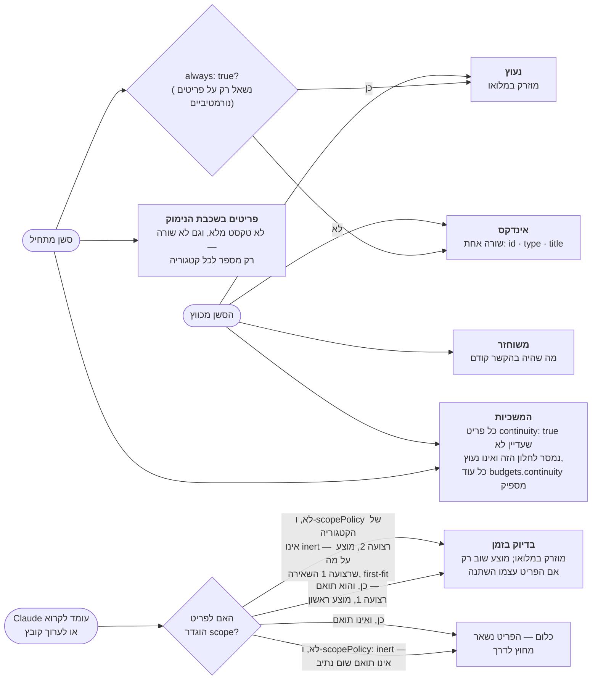
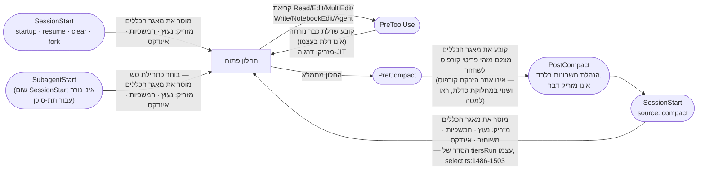
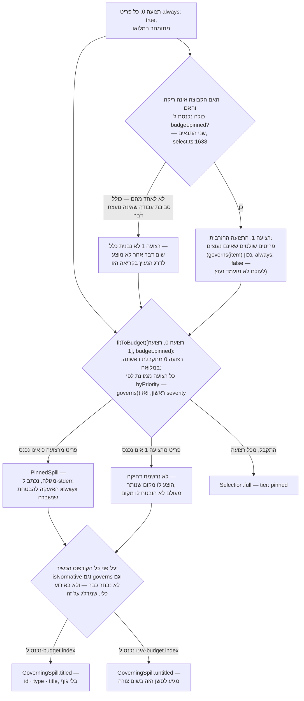

<!--
  Hebrew mirror of `docs/capabilities/02-injection.md`. The English file is the
  source. Conventions: `docs/README.he.md` and `docs/the-store.he.md`.
  Hebrew prose and tables live inside `<div dir="rtl">`; fenced code and Mermaid
  blocks stay outside it. `<span dir="ltr">` wraps any Latin run whose first or
  last character is not alphanumeric, and any run of two or more Latin terms
  joined by commas or slashes.

  The first Mermaid fence below is byte-identical to the one in
  `docs/README.he.md`, because its English original is shared byte-for-byte with
  `README.md` and `docs/system/07-focus.md`. That sharing is mirrored here, not
  broken. Pasted code and command output are not translated.

  Heading sequence must stay identical to the English file.
-->

# הזרקה

<div dir="rtl">

הזרקה היא המנגנון שמכריע, ברגע שחלון הקשר מתחיל (או נבנה מחדש), אילו פריטים בקורפוס באמת
מגיעים למודל — באיזו צורה, באיזה סדר, ובאיזה מחיר. הקורפוס יכול להחזיק אלפי פריטים; חלון
הקשר לא יכול. הזרקה היא התשובה ל"בהינתן קורפוס גדול מדי מכדי להדביק אותו בשלמותו, ותקציב
שהוא חלקיק קטן ממנו, מה מוצג, ואיך קורא יודע מה הושמט?"

המנוע חי ב-<span dir="ltr">`src/core/inject.ts`</span> (<span dir="ltr">`buildInjectionResult`</span>,
1,243 שורות) וב-<span dir="ltr">`src/core/select.ts`</span> (<span dir="ltr">`select`, `fitToBudget`,
`buildGoverningSpill`</span>, 1,851 שורות) — שניהם <span dir="ltr">`wc -l`</span>, 2026-09-17,
ושניהם זזים בכל עריכה לאחד מהקבצים. <span dir="ltr">`inject.ts`</span> הוא שכבת התזמור: הוא
מפענח תצורה, קורא ל-<span dir="ltr">`select`</span> פעם אחת לכל אירוע, ומרנדר את התוצאה לטקסט.
<span dir="ltr">`select.ts`</span> הוא אלגוריתם הבחירה הטהור — טהור פשוטו כמשמעו:
<span dir="ltr">`INV-select-is-pure`</span> אוסר עליו כל קלט/פלט שהוא, ולכן כל עובדה שהוא פועל
עליה (תקציבים, מיקוד, מה כבר <span dir="ltr">`seen`</span>, מה שתצלום
<span dir="ltr">`restore`</span> נקב בו) נמסרת כארגומנט, לעולם לא נקראת מהדיסק בתוך הפונקציה.
הטהרה הזו היא מה שמאפשר לאותו בורר לרוץ באופן זהה מ-hook, מכלי ה-MCP
<span dir="ltr">`load_context`</span>, וממסך התצוגה המקדימה של ממשק הרשת
([<span dir="ltr">`docs/capabilities/08-web-ui.he.md`</span>](./08-web-ui.he.md)) בלי ששלושה
מימושים ייסחפו זה מזה.

## הדלתות

**דלת**, באוצר המילים של הפרויקט הזה עצמו (<span dir="ltr">`def-a-door`</span>, מאגר כללי
המוצר — ראו [<span dir="ltr">`docs/capabilities/10-rule-store.he.md`</span>](./10-rule-store.he.md)),
היא *"hook שבו חלון ההקשר של סוכן **מתחיל** או נבנה מחדש, ולכן מקום שבו [מסירה] חייבת
לקרות."* ההגדרה מפורשת לגבי מה **אינו** דלת: <span dir="ltr">`PreToolUse`</span> "אינו דלת:
הוא ה-hook המוקדם ביותר שרץ **אחרי** כל דלת, וזה מה שהופך אותו למקום לקבוע שדלת כלשהי נורתה."
hook שרץ בתוך חלון שכבר נוצר אינו נושא חובת מסירה.

**שני אוצרות מילים חופפים כאן והפרק הזה מפריד ביניהם**, כי ערבוב שלהם הוא איך הטיוטה הקודמת
של הטבלה הזו שגתה. **דלת** היא מקום עם *חובת מסירה* — עבור מאגר כללי המוצר,
<span dir="ltr">`deliverAtDoor`</span> (פרק 10). **אתר הזרקה** הוא hook שקורא ל-
<span dir="ltr">`buildInjectionResult`</span> או ל-<span dir="ltr">`select`</span> עבור
ה*קורפוס*. הן אינן אותה רשימה.

### איפה הזרקת הקורפוס באמת רצה

</div>

<div dir="rtl">

| Hook | קובץ | האירוע שמועבר ל-`select` | מה הוא מוסר |
|---|---|---|---|
| תחילת סשן (<span dir="ltr">`startup` · `clear` · `resume` · `fork`</span>; ל-<span dir="ltr">`compact`</span> יש שורה משלו למטה) | <span dir="ltr">`src/hooks/session-start.ts`</span> | <span dir="ltr">`'session-start'`</span> | הזרקה מלאה: דרג נעוץ, דרג המשכיות, אינדקס — דרך <span dir="ltr">`buildInjectionResult`</span> (משותף מילה במילה עם כלי ה-MCP <span dir="ltr">`load_context`</span>, לפי הכותרת של אותו קובץ) |
| תחילת סשן אחרי כיווץ | אותו קובץ, <span dir="ltr">`source: 'compact'`</span> | **<span dir="ltr">`'compact'`</span>** | נקודת ההזרקה מחדש האמיתית אחרי כיווץ — <span dir="ltr">`post-compact.ts`</span> עצמו *אינו* מזריק; הוא הנהלת חשבונות (רשומות ביקורת, חשבונאות <span dir="ltr">`restoredFor`</span>) סביב הגבול ש-<span dir="ltr">`SessionStart(source: 'compact')`</span> פותח מחדש |
| תחילת תת-סוכן | <span dir="ltr">`src/hooks/subagent-start.ts`</span> | **<span dir="ltr">`'session-start'`</span>** | בחירה כתחילת סשן פירושה ש-<span dir="ltr">`tiersRun`</span> דוחף את אותה קבוצה שרגיל דוחף: **נעוץ, המשכיות ואינדקס** (<span dir="ltr">`select.ts:1486-1503`</span>), לתוך חלון ריק של תת-סוכן — תת-סוכן אינו יורש דבר מההקשר של ההורה ושום <span dir="ltr">`SessionStart`</span> אינו נורה עבורו, ולכן ה-hook הזה הוא, במילותיו של הקובץ עצמו, הדבר היחיד שעומד בין תת-סוכן משוגר לבין "אפס ידיעה על האילוצים של הפרויקט עצמו" |
| קריאה לכלי, באמצע סשן | <span dir="ltr">`src/hooks/pre-tool-use.ts`</span> (<span dir="ltr">`select(...)`</span> בשורה 313) | <span dir="ltr">`'tool'`</span> | **דרג ה-JIT** — פריטים שהיקפם הנתיב שהכלי עומד לגעת בו, מוצעים בשתי רצועות (<span dir="ltr">`DEC-the-jit-tier-offers-path-scoped-items-first-in-two-bands`</span>). השורה הזו היא אתר הזרקה ו**אינה דלת**: המעבר של מאגר הכללים כאן הוא *קביעה* (<span dir="ltr">`assertDoor`</span>, <span dir="ltr">`pre-tool-use.ts:708`</span>), לא מסירה. |

</div>

<div dir="rtl">

**ל-<span dir="ltr">`SelectEvent`</span> יש בדיוק ארבעה חברים** —
<span dir="ltr">`'session-start' | 'compact' | 'tool' | 'manual'`</span>
(<span dir="ltr">`src/core/select.ts:18`</span>) — והמיפוי הוא התנאי המשולש היחיד ב-
<span dir="ltr">`src/core/inject.ts:709–710`</span>:

</div>

```ts
event: manual ? 'manual' : subagent ? 'session-start'
     : compacting ? 'compact' : 'session-start',
```

<div dir="rtl">

שתי השלכות שקורא לא אמור להיות צריך לגזור:

- **<span dir="ltr">`'compact'`</span> הוא חבר <span dir="ltr">`SelectEvent`</span> אמיתי**,
  לא מיופה כוח. <span dir="ltr">`source: 'compact'`</span> הוא מה ש-
  <span dir="ltr">`inject.ts`</span> מסתעף עליו; האירוע שהוא מעביר אז הוא
  <span dir="ltr">`'compact'`</span>.
- **<span dir="ltr">`'subagent'`</span> לעולם אינו <span dir="ltr">`SelectEvent`</span>.**
  הוא <span dir="ltr">`InjectionEvent`</span> (<span dir="ltr">`'session-start' | 'manual' | 'subagent'`</span>,
  <span dir="ltr">`inject.ts:65`</span>), וענף תת-הסוכן בוחר כ-<span dir="ltr">`'session-start'`</span>.
  המקור מציין את הסיבה באותיות גדולות: *"<span dir="ltr">`SelectEvent`</span> במכוון אינו זוכה
  בחבר: חבר נבדל היה דורש שלושה ענפים חדשים ב-<span dir="ltr">`select`</span> כדי להגיע לאותה
  תשובה."*

לאיזה מחמשת הדרגים פריט יכול להגיע — זו שאלה עם הכרעה אחת לכל אתר ירי — לא תפריט, הסתעפות:

</div>



<div dir="rtl">

(זו אותה דיאגרמת ירי-דרגים כמו [סעיף 4 של ה-README](../README.he.md#4-מתי-זה-חוזר-ומה) —
בשימוש חוזר ולא מצוירת מחדש, ומתוקנת כאן ושם יחד. התיקונים של 2026-09-17 שמחזיקים: דרג ה-JIT
מציע פריט *עם היקף תואם* לפני פריט *ללא היקף*, ולא אותה תוצאה
(<span dir="ltr">`DEC-the-jit-tier-offers-path-scoped-items-first-in-two-bands`</span>,
<span dir="ltr">`select.ts:1750-1756`</span>); דרג ה**המשכיות** נורה גם בתחילת סשן רגילה וגם
אחרי כיווץ, ומצויר כאן ולא מושמט, מכיוון שהשמטתו נקראת כ"הוא לא נורה אז" ולא כ"הדיאגרמה הזו
עוסקת בציר אחר"; וניפוי הכפילויות של ה-JIT הוא **פר סשן**, לא פר חלון הקשר — קובץ ה-seen
הפר-סשני שורד כיווץ, ו-<span dir="ltr">`restored`</span> הוא מה שמחזיר פריט, לא איפוס של מה
שכבר נראה. שתי הפעולות ש**כן** מסירות אותו הן <span dir="ltr">`/clear`</span> ו-
<span dir="ltr">`SessionEnd`</span>, והן היחידות: <span dir="ltr">`clearWindowState`</span>
(<span dir="ltr">`src/core/window-state.ts:44`</span>) הוא הקורא היחיד ל-
<span dir="ltr">`clearSeen`</span>, והכותרת שלו עצמו נוקבת בשני הקוראים האלה ב-
<span dir="ltr">`:16-17`</span>.)

**ארבע תוויות בה היו שגויות באותו יום שבו תוקנו, וכל אחת נקראת עכשיו מתוך הבורר.** הן מנויות
כאן ולא מוחלפות בשקט, כי כל אחת הייתה *כמת* — החלק בדיאגרמה שנקרא כוודאי ונבדק הכי פחות.

</div>

<div dir="rtl">

| מה שהתווית אמרה | מה ש-`select.ts` עושה |
|---|---|
| פריט ללא היקף "מוצע רק אחרי שכל פריט עם היקף כבר נכנס" | הקריאה ל-JIT היא <span dir="ltr">`fitToBudget([scoped, unscoped], config.budgets.jit, 'jit')`</span> (<span dir="ltr">`:1750-1756`</span>) **בלי** ארגומנט <span dir="ltr">`spareFrom`</span>, ולכן רצועה 2 היא רצועה רגילה. <span dir="ltr">`fitToBudget`</span> עושה <span dir="ltr">`continue`</span> מעבר לפריט שחורג מהתקציב ולא שובר (<span dir="ltr">`:924-937`</span>), ולכן פריט עם היקף יכול להידחק ופריט קטן יותר ללא היקף עדיין יתקבל אחריו. "הכול כבר נכנס" הוא השער של דרג ה**נעוץ** (<span dir="ltr">`:1638`</span>), שהושתל על דרג שאין לו כזה. |
| פריט ללא היקף הוא "בלתי מוגבל" | רק היכן שה-<span dir="ltr">`scopePolicy`</span> של הקטגוריה אינו <span dir="ltr">`inert`</span>. <span dir="ltr">`matchesScope`</span> מחזיר <span dir="ltr">`scopePolicyFor(config, item.type) !== 'inert'`</span> עבור היקף ריק (<span dir="ltr">`:601-603`</span>), וקבוצת המועמדים ל-JIT היא <span dir="ltr">`fresh.filter((i) => matchesScope(i, target, config))`</span> (<span dir="ltr">`:1749`</span>) — ולכן תחת <span dir="ltr">`inert`</span> הפריט לעולם לא מגיע ל**אף אחת** מהרצועות. הוא לא מוצע מאוחר; הוא לא מוצע. |
| "כל פריט <span dir="ltr">`continuity: true`</span>, במלואו" | <span dir="ltr">`eligible.filter((i) => i.continuity && !delivered.has(i.id) && !alreadyChosen.has(i.id))`</span> (<span dir="ltr">`:1685-1687`</span>), ואז <span dir="ltr">`fitToBudget([candidates], config.budgets.continuity, 'continuity')`</span> (<span dir="ltr">`:1692`</span>). שלוש החרגות שהמילה "כל" מכחישה: כבר נמסר לחלון הזה, כבר התקבל על ידי הדרג הנעוץ, וכל דבר מעבר ל-<span dir="ltr">`budgets.continuity`</span> — שהגלישה שלו היא <span dir="ltr">`continuitySpill`</span>. |
| JIT "מוזרק במלואו, פעם אחת לסשן" | שער ה-seen אינו מבטיח פעם אחת. <span dir="ltr">`fresh`</span> שומר פריט שרשומת ה-seen שלו אינה **גם** שלמה **וגם** עדכנית: <span dir="ltr">`return !(entry.whole && entry.checksum === i.checksum)`</span> (<span dir="ltr">`:1543`</span>). פריט שנערך באמצע סשן נושא checksum חדש ומוצע שוב — ראו "שער ה-<span dir="ltr">`seen`</span>" למטה. |

</div>

<div dir="rtl">

חמישית היא השמטה ולא שגיאה, והציור מחדש מוסיף אותה: דרג ה-<span dir="ltr">`index`</span> מונה
פריטים **נורמטיביים** בלבד. <span dir="ltr">`buildIndex`</span> בונה את השורות שלו מ-
<span dir="ltr">`eligible.filter((i) => isNormative(i, config) && !chosenIds.has(i.id))`</span>
(<span dir="ltr">`:1142-1144`</span>) ומצמצם את כל השאר ל-<span dir="ltr">`counts[item.type]`</span>
(<span dir="ltr">`:1248-1252`</span>). פריט מדרג rationale אינו מקבל שורה כלל — פרק 1 קובע זאת
נכון, והדיאגרמה הזו נהגה לנתב כל פריט שאינו <span dir="ltr">`always`</span> ל-
<span dir="ltr">`index`</span>.

### <span dir="ltr">`PreCompact`</span>, ומחלוקת שהפרק הזה אינו מכריע

<span dir="ltr">`PreCompact`</span> (<span dir="ltr">`src/hooks/pre-compact.ts`</span>) כותב
*תצלום* של אילו מזהי פריטים היו במשחק
(<span dir="ltr">`injected: itemIds.map((id) => ({ id, tier: 'snapshot' }))`</span>) כדי שההזרקה
מחדש ב-<span dir="ltr">`SessionStart(source:'compact')`</span> הבא תדע מה להציע מחדש — "תצלום
<span dir="ltr">`PreCompact`</span> אינו מזריק דבר, אבל הוא מכריע מה סשן [מקבל בהמשך]" (ההערה
של הקובץ עצמו). מנגנון השחזור שזה מזין מכוסה ב-
[<span dir="ltr">`docs/capabilities/07-restore-and-handover.he.md`</span>](./07-restore-and-handover.he.md).

**הוא אינו אתר הזרקת קורפוס. האם הוא *דלת* שנוי במחלוקת אמיתית בין ההגדרה של מאגר כללי המוצר
עצמו לבין הקוד שמממש אותה**, והפרק הזה מדווח על המחלוקת במקום לבחור צד:

- ה-<span dir="ltr">`means`</span> של <span dir="ltr">`def-a-door`</span> מונה אותו: *"תחילת
  סשן — חדש, מחודש ושחזור-אחרי-כיווץ — <span dir="ltr">`PreCompact`</span>, ותחילת תת-סוכן."*
- הקוד עושה את ההפך. ל-<span dir="ltr">`deliverAtDoor`</span> יש בדיוק שני אתרי קריאה —
  <span dir="ltr">`session-start.ts:134`</span> ו-<span dir="ltr">`subagent-start.ts:319`</span>
  — ו-<span dir="ltr">`pre-compact.ts:225`</span> קורא ל-**<span dir="ltr">`assertDoor`</span>**,
  אותו דבר ש-<span dir="ltr">`pre-tool-use.ts`</span> עושה. אז
  <span dir="ltr">`PreCompact`</span> קובע שדלת כלשהי נורתה; הוא אינו מוסר.

זהו קבוע ומימוש שסותרים זה את זה לגבי אוצר המילים של המוצר עצמו. זה דורש פסיקת בעלים, לא
עריכת תיעוד, ולנקוב בזה כאן זה המרב שהפרק הזה יכול לעשות ביושר.

### כל שמונה־עשר ה-hooks הרשומים

<span dir="ltr">`hooks/hooks.json`</span> — קובץ ששום פרק לא נקב בו קודם — הוא ההצהרה היחידה
של כל hook שהתוסף הזה רושם, עם ה-matcher שלו וה-timeout שלו. רק ארבעת אלה בטבלה למעלה נוגעים
בהזרקת קורפוס; השאר נקובים כאן כדי שקורא יידע שהמשטח קיים.

</div>

<div dir="rtl">

| אירוע | Matcher | מטפל (<span dir="ltr">`src/hooks/`</span>) | Timeout |
|---|---|---|---|
| `SessionStart` | <span dir="ltr">`startup\|clear\|resume\|compact\|fork`</span> | <span dir="ltr">`session-start.ts`</span> | 10 |
| `SubagentStart` | — | <span dir="ltr">`subagent-start.ts`</span> | 5 |
| `PreToolUse` | <span dir="ltr">`Read\|Edit\|MultiEdit\|Write\|NotebookEdit\|Agent`</span> | <span dir="ltr">`pre-tool-use.ts`</span> | 10 |
| `PostToolUse` | <span dir="ltr">`Write\|Edit\|MultiEdit\|Agent\|Bash\|Read\|Grep`</span> | <span dir="ltr">`post-tool-use.ts`</span> | 5 |
| `PostToolUseFailure` | — | <span dir="ltr">`post-tool-use-failure.ts`</span> | 5 |
| `PreCompact` | — | <span dir="ltr">`pre-compact.ts`</span> | 10 |
| `PostCompact` | — | <span dir="ltr">`post-compact.ts`</span> | 5 |
| `Stop` | — | <span dir="ltr">`stop.ts`</span> | 3 |
| `SubagentStop` | — | <span dir="ltr">`subagent-stop.ts`</span> | 3 |
| `SessionEnd` | — | <span dir="ltr">`session-end.ts`</span> | 2 |
| `Setup` | — | <span dir="ltr">`setup.ts`</span> | 3 |
| `FileChanged` | <span dir="ltr">`.my_context/items\|.my_context/config.json`</span>, וקבוצה שנייה שאינה תואמת | <span dir="ltr">`file-changed.ts`</span> | 3 |
| `InstructionsLoaded` | — | <span dir="ltr">`instructions-loaded.ts`</span> | 3 |
| `ConfigChange` | — | <span dir="ltr">`config-change.ts`</span> | 3 |
| `PermissionDenied` | — | <span dir="ltr">`permission-denied.ts`</span> | 3 |
| `TaskCreated` | — | <span dir="ltr">`task-created.ts`</span> | 3 |
| `TaskCompleted` | — | <span dir="ltr">`task-completed.ts`</span> | 3 |
| `UserPromptExpansion` | <span dir="ltr">`^mycontext:`</span> | <span dir="ltr">`user-prompt-expansion.ts`</span> | 3 |

</div>

<div dir="rtl">

שישה מתוך השמונה־עשר יושבים על מחזור חיים אחד — חלון הקשר שנפתח, מתמלא, ונבנה מחדש —
ונושאים שתי חובות בלתי תלויות שאינן תמיד חופפות: **מוסר** (אוצר המילים של הדלתות של מאגר
כללי המוצר, פרק 10), ו**אתר הזרקת קורפוס** (אוצר המילים של הפרק הזה עצמו, "הדלתות" למעלה).
שנים־עשר האחרים משרתים משטחים לא קשורים (דחיפות שינוי קובץ, אירועי משימות, שינויי תצורה, …)
ומושמטים למטה — הטבלה למעלה היא המקום שבו הם נקובים; דיאגרמה שחוזרת על כל שמונה־עשר התיבות
הייתה אומרת מחדש את הטבלה ההיא, לא מסבירה דבר שהטבלה לא כבר אומרת.

</div>



<div dir="rtl">

**ה-matcher על <span dir="ltr">`PreToolUse`</span> חשוב וקל לפספס אותו**: הוא נורה על שישה
שמות כלים, לא על כל קריאה לכלי. קריאת <span dir="ltr">`Bash`</span> מגיעה ל-
<span dir="ltr">`PostToolUse`</span> ולא ל-<span dir="ltr">`PreToolUse`</span>.

שלושה מודולים משותפים תחת <span dir="ltr">`src/hooks/`</span> אינם hooks ואינם מתוארים בשום
מקום בסימוכין הזה: <span dir="ltr">`io.ts`</span> (<span dir="ltr">`parseHookInput`,
`hookContext`, `hookBlockDecision`, `preToolUseDeny`, `pinnedSpillLine`</span>, האיחוד
<span dir="ltr">`HookEventName`</span>), <span dir="ltr">`observe.ts`</span> (מריץ התצפיות
המשותף שמיובא על ידי תשעה hooks), <span dir="ltr">`self-register.ts`</span> (מייצר את בלוק
ה-hooks בהגדרות Claude Code מתוך <span dir="ltr">`hooks/hooks.json`</span>, והוא מה ש-
<span dir="ltr">`npm run hooks:install`</span> מריץ), ו-<span dir="ltr">`task-events.ts`</span>.

## מודל התקציב

כל תקציב מבוטא ב-**יחידות <span dir="ltr">`estimateTokens`</span> — תווים ÷ 4** (נאמר ישירות
ב-<span dir="ltr">`budgets-write.ts`</span> ובטקסט שגיאת האימות של <span dir="ltr">`config.ts`</span>,
למשל <span dir="ltr">`"budgets.${key} must be a positive integer (estimateTokens units — characters / 4)"`</span>).
יש חמישה מפתחות תקציב, אחד לכל דרג, שמוגדרים ב-<span dir="ltr">`src/core/config.ts`</span>:

</div>

```ts
export const DEFAULT_BUDGETS: Budgets = {
  pinned: 6000, jit: 6000, restored: 8000, continuity: 2000, index: 1200,
};
```

<div dir="rtl">

ה-<span dir="ltr">`.my_context/config.json`</span> של המאגר הזה מגדיר את כל החמישה במפורש;
ארבעה מוגבהים ו-<span dir="ltr">`continuity`</span> נכתב בערך שבמקרה שווה לברירת המחדל
הנשלחת:

</div>

```json
"budgets": {
  "pinned": 30000,
  "jit": 32000,
  "restored": 48000,
  "continuity": 2000,
  "index": 8000
}
```

<div dir="rtl">

תקציב מאומת מפתח אחר מפתח: מפתח לא מוכר נדחה מיידית, וערך רע זורק במקום ליפול בשקט חזרה
לברירת מחדל. המקור נוקב במקרים הקונקרטיים שהוא שומר עליהם — מפתח עם שגיאת הקלדה
**<span dir="ltr">`"pined": 9000`</span>**, או ערך לא תקף (<span dir="ltr">`"6000"`</span>,
<span dir="ltr">`-1`</span>, <span dir="ltr">`null`</span>) — ואומר למה סירוב עדיף על דילוג:
אלה "נהגו להיות מדולגים על ידי לולאת המיזוג, ולכן המשתמש חשב שהעלה מגבלה, ברירת המחדל נשארה
בתוקף, והתסמין היחיד היה פריטים שחסרו בשקט מההקשר שלו"
(<span dir="ltr">`src/core/config.ts:1824–1831`</span>). טקסט הסירוב עצמו מסתיים *"קבלת המפתח
ושמירת ברירת המחדל היו אומרות שהמגבלה שהגדרתם מעולם לא הייתה בתוקף ושפריטים חסרו מסשנים
בשקט."*

שימו לב לאי-סימטריה מול שאר התצורה: מפתח לא מוכר **בתוך <span dir="ltr">`budgets`</span>**
הוא קטלני, בעוד שכמה מפתחות לא מוכרים במקומות אחרים נרשמים ומדולגים. השדה שרושם אותם הוא
<span dir="ltr">`Config.skippedKeys`</span> (<span dir="ltr">`config.ts:840`</span>), ו-
<span dir="ltr">`doctor`</span> מדווח עליהם תחת קוד הממצא <span dir="ltr">`config_key_skipped`</span>.

הקבלות של כל דרג מחושבות על ידי
<span dir="ltr">`fitToBudget(bands, budget, tier, spareFrom)`</span>, שעושה **first-fit, לא
קיצוץ עדיפות קפדני**: מועמדים ממוינים לפי <span dir="ltr">`byPriority`</span> ומתקבלים כל עוד
הם נכנסים; פריט שחורג מהתקציב עובר <span dir="ltr">`continue`</span> (מדולג), ואינו נחשב עצירה
קשיחה, ולכן פריט מאוחר יותר, קטן יותר, ובעדיפות *נמוכה* יותר עדיין יכול להתקבל אחרי שפריט
בעדיפות גבוהה יותר נדחק. ההערה ב-<span dir="ltr">`select.ts`</span> מפורשת שזה מכוון, לניצול
תקציב טוב יותר — ולכן <span dir="ltr">`spilled`</span> **אינו** רישא של עדיפות קפדנית של
רשימת המועמדים.

## נעיצה (<span dir="ltr">`always: true`</span>)

נעיצה מבטיחה שפריט יוצע בדרג ה-<span dir="ltr">`pinned`</span> ב**כל** תחילת סשן —
<span dir="ltr">`mycontext pin <id>`</span> מתועד ב-<span dir="ltr">`--help`</span> פשוטו
כמשמעו כ-<span dir="ltr">`edit --always=true`</span>, ו-<span dir="ltr">`mycontext unpin <id>`</span>
כ-<span dir="ltr">`edit --always=false`</span>; אין תת-פקודת <span dir="ltr">`pin`</span>
נפרדת ב-<span dir="ltr">`src/cli/commands/`</span> — שתיהן כינויים שמנותבים אל
<span dir="ltr">`edit`</span>. רק קטגוריה מדרג <span dir="ltr">`normative`</span> רשאית לשאת
<span dir="ltr">`always: true`</span>, והסירוב ראוי שייאמר בדיוק, כי המנגנון אינו היעדר.
<span dir="ltr">`TIER_UPDATES.rationale`</span> **כן** נושא רשומת <span dir="ltr">`always`</span>
(<span dir="ltr">`src/core/categories.ts:124`</span>) — עם <span dir="ltr">`values: ['false']`</span>
וההערה *"רק false. <span dir="ltr">`--always true`</span> **נדחה** כאן — נעיצה שולטת בדרג
הנורמטיבי בלבד."* אז <span dir="ltr">`--always true`</span> על <span dir="ltr">`decision`</span>
או <span dir="ltr">`lesson`</span> נדחה על ידי **קבוצת ערכים סגורה** ועוד
<span dir="ltr">`inertFieldError`</span> ב-<span dir="ltr">`cli/commands/edit.ts`</span>, ולא
מפני שהשדה אינו מוכר בדרג ההוא. המסקנה זהה; המנגנון חשוב כי קורא שמחפש "אין רשומה" לא ימצא
אחת, וכי אותה טבלה היא מה שמאפשר ל-<span dir="ltr">`mycontext unpin`</span> לעבוד על פריט
rationale בכלל.

</div>

```
mycontext pin CONST-zero-runtime-dependencies
mycontext unpin CONST-zero-runtime-dependencies --yes
```

<div dir="rtl">

נעיצה היא הבטחה שהדרג הנעוץ בנוי לקיים ראשונה ובמלואה: המועמדים של הרצועה הנעוצה הם הפריטים
עם <span dir="ltr">`always: true`</span>, שמתקבלים לפני שכל דבר אחר נוגע ב-
<span dir="ltr">`budgets.pinned`</span>. כשאחד אינו נכנס, זו אינה הידרדרות שקטה — זו
<span dir="ltr">`PinnedSpill`</span>, שנקראת בקול רם בבלוק המוזרק, נכתבת ל-stderr, ונספרת
ביומן הביקורת כ-<span dir="ltr">`audit_item.role = 'spilled'`</span> — "האזעקה להבטחת
<span dir="ltr">`always`</span> שנשברה" (<span dir="ltr">`select.ts`</span>).

## הרצועה הרזרבית

הפסיקה <span dir="ltr">`TASK-the-pinned-tier-sits-half-empty-while-sixty-nine-governing`</span>
(בעלים, 2026-09-04) טיפלה בבזבוז מדוד: על הקורפוס של המאגר הזה עצמו,
<span dir="ltr">`budgets.pinned`</span> ב-30,000 עם 37 פריטי <span dir="ltr">`always`</span>
שעולים 22,582 הותיר 7,418 אסימונים של הדרג הנעוץ בלתי מנוצלים לחלוטין, בעוד שפריטים *שולטים*
אחרים (קטגוריות ב-<span dir="ltr">`GOVERNING_TYPES`</span>: <span dir="ltr">`rule`,
`constraint`, `invariant`, `instruction`, `requirement`, `standard`</span>) שאינם נעוצים נפלו
לשורת אינדקס עם כותרת בלבד מחוסר מקום במקום אחר.

התיקון: כשכל פריט <span dir="ltr">`always`</span> כבר נכנס
(<span dir="ltr">`pinnedCost <= config.budgets.pinned`</span>), ה*נותר* של קיבולת הדרג הנעוץ
מוצע — כרצועה שנייה ונמוכה יותר — לפריטים שולטים שאינם נעוצים:

</div>

```ts
const spare = candidates.length > 0 && pinnedCost <= config.budgets.pinned
  ? fresh.filter((i) => !i.always && governs(i))
  : [];
const result = fitToBudget([candidates, spare], config.budgets.pinned, 'pinned', 1);
```

<div dir="rtl">

שתי תכונות הופכות את זה לבטוח ולא למשמעות שנייה ושקטה של <span dir="ltr">`always`</span>:

- **<span dir="ltr">`always`</span> עצמו אינו מורחב.** הוא מוצע ראשון, במלואו, והרצועה
  הרזרבית רצה אי פעם רק בקריאה שבה כל פריט <span dir="ltr">`always`</span> כבר נכנס.
- **החמצה ברצועה הרזרבית אינה דחיקה.** הפרמטר <span dir="ltr">`spareFrom`</span> של
  <span dir="ltr">`fitToBudget`</span> מסמן את אינדקס רצועה 1 (מבוסס-0) כרזרבי: מועמד שלא
  נכנס שם רושם **אפס** <span dir="ltr">`Spill`</span> ונופל ישר לדרג האינדקס בדיוק כפי שעשה
  לפני שהרצועה קיימת — "הוצע לו מקום שנותר, לא הובטח לו מקום, והדרג אינו חייב לו גילוי"
  (<span dir="ltr">`select.ts`</span>). נמדד על הקורפוס הזה, 2026-09-07: 69 מתוך 82 המועמדים
  השולטים שהוצעה להם הרצועה הרזרבית לא נכנסו אליה, ואף אחד מ-69 האלה לא נרשם כדחיקה בדרג
  הנעוץ.
- **הסדר בתוך הרצועה הוא <span dir="ltr">`byPriority`</span>, לא דירוג לפי הנדחק ביותר** —
  הפסיקה הציעה לדרג לפי כמה פעמים פריט נדחק היסטורית, אבל <span dir="ltr">`select`</span>
  טהור ואינו יכול לקרוא את יומן הביקורת, ולכן הרצועה נופלת חזרה לאותו סדר עדיפות שכל רצועה
  אחרת משתמשת בו. על הקורפוס הזה זה מציב את <span dir="ltr">`severity: hard`</span> ראשון, וכל
  שלושה־עשר הפריטים שהרצועה הרזרבית באמת מקבלת הם <span dir="ltr">`hard`</span>.

האפקט המדוד, שנאמר ישירות במקור (2026-09-07, <span dir="ltr">`budgets.pinned`</span> 30,000,
996 פריטים): הרצועה הרזרבית מקבלת 13 פריטים שולטים תמורת 7,418 האסימונים הבלתי מנוצלים, ו-
<span dir="ltr">`governingSpill.titled`</span> — ספירת הפריטים השולטים שצומצמו לכותרת בלבד —
**ירדה מ-82 ל-69** ביום שהרצועה נחתה. המספר הזה מוצע כ*ה*מדידה של האם הפסיקה עבדה, ולא
כתופעת לוואי שלה.

## מה מגיע במלואו לעומת מה שמגיע כשורת אינדקס — ו-<span dir="ltr">`governingSpill.titled`</span>

כל קבלה של טקסט מלא נכנסת ל-<span dir="ltr">`Selection.full`</span> כ-
<span dir="ltr">`SelectionEntry`</span>, ול-<span dir="ltr">`SelectionEntry.tier`</span> יש
בדיוק ארבעה חברים — <span dir="ltr">`'pinned' | 'jit' | 'restored' | 'continuity'`</span>
(<span dir="ltr">`src/core/select.ts:155–157`</span>). **אין חמישי.** שורת כותרת בלבד אינה
<span dir="ltr">`SelectionEntry`</span> כלל: היא <span dir="ltr">`IndexLine`</span> ב-
<span dir="ltr">`Selection.index.normative`</span>, שמרונדרת על ידי
<span dir="ltr">`renderIndexLine`</span>. <span dir="ltr">`'index'`</span> קיים רק כחבר נוסף
של <span dir="ltr">`Spill['tier']`</span> (<span dir="ltr">`:162`</span>) — כלומר כמקום שבו
משהו יכול *להירשם כמי שהחמיץ*, לעולם לא כדרג שמשהו נמסר בו. פריט שמחמיץ גם את תקציב האינדקס
אינו מרונדר כלל.

<span dir="ltr">`GoverningSpill`</span> (<span dir="ltr">`select.ts`</span>,
<span dir="ltr">`Selection.governingSpill`</span>) הוא הגילוי שנבנה במיוחד כדי להפוך את
ההידרדרות הזו לבלתי אפשרית להחמצה, עבור שש הקטגוריות השולטות בלבד:

</div>

```ts
export interface GoverningSpill {
  titled: string[];    // governing ids that reached this session as a title only
  untitled: string[];  // governing ids that reached this session in NO form at all
  cost: number;         // estimated tokens to deliver every id above in full
}
```

<div dir="rtl">

- **<span dir="ltr">`titled`</span>** — פריט שולט (<span dir="ltr">`rule`, `constraint`,
  `invariant`, `instruction`, `requirement`, `standard`</span>) ש-<span dir="ltr">`governs(item)`</span>
  נכון עבורו, לא היה ב-<span dir="ltr">`chosenIds`</span> (לא התקבל במלואו בשום מקום), אבל *כן*
  נחת בדרג האינדקס כשורה חשופה. ההערה על הטיפוס בוטה לגבי למה זה צריך שם משלו ולא נשאר כרשומת
  דרג-אינדקס רגילה: *"כותרת נוקבת בכלל; היא אינה אומרת לכם מה הוא דורש."* מרונדר לתוך הבלוק
  המוזרק (<span dir="ltr">`render.ts`</span>, <span dir="ltr">`renderGoverning`</span>) כך:

  > *<span dir="ltr">N</span> פריט/ים שולט/ים למטה נושא/ים כותרת בלבד — הגוף לא נמסר:
  > <span dir="ltr">`id`</span>, <span dir="ltr">`id`</span>, ועוד <span dir="ltr">K</span>.
  > כותרת נוקבת בכלל; היא אינה אומרת לכם מה הוא דורש. קראו כל אחד עם
  > <span dir="ltr">`mycontext show <id>`</span> לפני שאתם מתייחסים אליו כמסופק.*

- **<span dir="ltr">`untitled`</span>** — פריט שולט שהחמיץ גם את התקציב של דרג האינדקס עצמו:
  אין כותרת, אין שורה, אין כלום. נמדד על הקורפוס של המאגר הזה עצמו כריק בכל תקציב שהאינדקס
  הוגדר לו אי פעם — בדיקת הנשיאה הורידה אותו, וההערה של <span dir="ltr">`select.ts`</span>
  עצמו נקראת *"<span dir="ltr">`displaced`</span> הוא <span dir="ltr">`0`</span> מ-1200 **ועד**
  470"* (<span dir="ltr">`:436`</span>), כש-470 הוא הקצה ההדוק יותר — אבל הוא *מחושב*, לא מונח
  כריק, כי קורפוס שמצמיח יותר פריטים שולטים, או מפעיל שמוריד את <span dir="ltr">`budgets.index`</span>,
  יכולים להפוך אותו ללא-ריק. מרונדר עם סמן <span dir="ltr">`⚠`</span> כשאינו ריק, נבדל ממשפט
  ה-<span dir="ltr">`titled`</span> הפשוט.

- **<span dir="ltr">`cost`</span>** הוא עלות האסימונים המשוערת של מסירת כל מה שבשתי הרשימות
  במלואו — "המספר שאדם שמחליט אם להעלות תקציב צריך" — ובמכוון, הוא **לעולם אינו מתוקצב
  בעצמו**: כמו הערות המיקוד ודחיקת ההמשכיות, הגילוי הזה יושב מחוץ לתקציב של כל דרג ומחוץ
  ל-<span dir="ltr">`Selection.tokens`</span>, כי "גילוי שתקציב יכול להשמיט אינו גילוי."

<span dir="ltr">`governingSpill`</span> הוא <span dir="ltr">`null`</span> על
<span dir="ltr">`Selection`</span> בדיוק כשדבר שולט לא יצא חסר-גוף באותה קריאה — כל מועמד שולט
התקבל במלואו, שום דבר לא שולט בכלל, או שהאירוע לא הריץ דרג אינדקס (אירוע
<span dir="ltr">`'tool'`</span> לעולם לא מוסיף <span dir="ltr">`'index'`</span> ל-
<span dir="ltr">`tiersRun`</span>; דחיקה בדרג ה-JIT של פריט שולט כבר מכוסה בהערת הדחיקה
הפר-פריטית הרגילה).

**למה <span dir="ltr">`governingSpill.titled`</span> נחשב ל*מדד* של איכות ההזרקה**: זה המספר
האחד שמבודד בדיוק את מצב הכישלון שההזרקה קיימת כדי למנוע — משהו ש*שולט* בעבודה מגיע בצורה
שנראית כאילו נמסרה (יש לו כותרת, קטגוריה, מזהה) אך אינו נושא דבר מהאילוץ עצמו. כל מספר תקציב
אחר (אסימונים בשימוש, פריטים שהתקבלו) יכול להיראות בריא בעוד שזה גבוה. זה המספר שפסיקת
הרצועה הרזרבית מצטטת כלפני/אחרי של עצמה (82 ← 69), וזו הסיבה שמסמך על ה*איכות* של הפרויקט
הזה, ולא רק על המנגנון שלו, היה עוקב אחרי הספירה הזו לאורך זמן ולא אחרי ספירות קבלה גולמיות.

בסיכום, מעבר הקבלה של הדרג הנעוץ הוא בעיית אריזה בשתי רצועות שנמסרת לקריאה אחת של
<span dir="ltr">`fitToBudget`</span>, והנפילה דרך אריזה שהוחמצה היא המקום שבו פריט שולט יכול
לסיים: טקסט מלא, כותרת, או כלום. <span dir="ltr">`governs(item)`</span> — הפרדיקט ש-
<span dir="ltr">`byPriority`</span> מדרג **מעל** severity, לא מתחתיו — הוא
<span dir="ltr">`GOVERNING_TYPES.has(item.type)`</span> (<span dir="ltr">`rule`, `constraint`,
`invariant`, `instruction`, `requirement`, `standard`</span> —
<span dir="ltr">`select.ts:742-744`</span>) **או** <span dir="ltr">`isOpenWork(item)`</span>
(<span dir="ltr">`governs`</span> עצמו ב-<span dir="ltr">`select.ts:807-809`</span>);
הדיאגרמה הזו היא ספציפית המכניקה של הדרג הנעוץ עצמו, שבו חיה הרצועה הרזרבית.
**שני קוראים מעבירים יותר מרצועה אחת, לא אחד** — הערת התיעוד של
<span dir="ltr">`fitToBudget`</span> עצמו נוקבת בהם ב-<span dir="ltr">`select.ts:853-855`</span>:
הרצועה הרזרבית של הדרג הנעוץ ודרג ה-JIT. ארבעת אתרי הקריאה הם
<span dir="ltr">`:1641`</span> (נעוץ, שתי רצועות, <span dir="ltr">`spareFrom: 1`</span>),
<span dir="ltr">`:1692`</span> (המשכיות, רצועה אחת), <span dir="ltr">`:1701`</span> (משוחזר,
רצועה אחת) ו-<span dir="ltr">`:1750`</span> (jit, **שתי** רצועות, בלי
<span dir="ltr">`spareFrom`</span>). גרסה מוקדמת יותר של המשפט הזה שמה את
<span dir="ltr">`jit`</span> בין הדרגים חד-הרצועה, מה שהפרק הזה סותר פעמיים — בטבלת הדרגים
למעלה ובכיתוב ה-JIT.

</div>



<div dir="rtl">

## דוגמה מעובדת — קריאת <span dir="ltr">Selection</span> אמיתי

אין תת-פקודת שורת פקודה עצמאית <span dir="ltr">`mycontext injection`</span>
(<span dir="ltr">`injection --help`</span> מחזיר <span dir="ltr">`unknown command "injection"`</span>);
הבחירה שמתחת מופעלת על ידי ה-hooks עצמם, על ידי כלי ה-MCP <span dir="ltr">`load_context`</span>,
ו — כדי שאדם יבחן אותה אינטראקטיבית בלי להפעיל hook אמיתי — על ידי מסכי **התצוגה המקדימה של
ההזרקה** ו**סימולטור התקציב** של ממשק הרשת
([<span dir="ltr">`docs/capabilities/08-web-ui.he.md`</span>](./08-web-ui.he.md)), שקוראים
לאותו צמד <span dir="ltr">`buildInjectionResult`/`select`</span> שתואר למעלה מול קורפוס ותקציב
מדומים, כך ששום דבר במסך ההוא אינו מימוש שני של האלגוריתם הזה.

## מקרי שימוש

- **קורפוס גדול ובוגר שגדל מעבר לתקציב שלו.** העלאת <span dir="ltr">`budgets.pinned`</span>
  היא שינוי תצורה מכוון ונראה; הרצועה הרזרבית היא מה שמונע מה*נותר הבלתי מנוצל* של תקציב נעוץ
  שכבר מספיק להתבזבז בעוד פריטים שולטים אחרים מידרדרים לכותרות.
- **ביקורת על האם "נאמר לסוכן" באמת נכון.** לפני הגילוי הזה, סוכן יכול היה לדווח שהוא מתייחס
  לכלל כמסופק על סמך זה שראה את ה*כותרת* שלו בשורת אינדקס.
  <span dir="ltr">`governingSpill.titled`</span> הופך את ההבחנה הזו למפורשת בטקסט המוזרק עצמו,
  ו-<span dir="ltr">`mycontext show <id>`</span> היא התרופה הנקובה.
- **החלטה אם לנעוץ משהו.** פריט שממשיך להופיע ב-<span dir="ltr">`governingSpill.titled`</span>
  לאורך סשנים הוא מועמד ל-<span dir="ltr">`mycontext pin`</span> — הוא שולט, הוא אינו נכנס
  לתקציב השולט הרגיל, והנעיצה מכניסה אותו לדרג האחד שמוערך ראשון.

## שאר `config.json` — שמונת מפתחות הרמה העליונה

<span dir="ltr">`budgets`</span> הוא אחד משמונה, ו-<span dir="ltr">`TOP_LEVEL_KEYS`</span>
(<span dir="ltr">`src/core/config.ts:1290`</span>) היא הרשימה שכל משטח תצורה נגזר ממנה — של
שורת הפקודה ושל סכמת ה-MCP כאחד — וזו הסיבה שה**סדר** שלה משמעותי ומפתח שמצורף הולך לסוף ולא
למקום ממוין:

</div>

```
profile  categories  budgets  watchedDocs  ui  handover  dispatchGate  review
```

<div dir="rtl">

שלושה מאלה מתוארים במקום אחר: <span dir="ltr">`categories`</span> ב-[פרק 1](./01-items-and-corpus.he.md),
<span dir="ltr">`handover`</span> ב-[פרק 7](./07-restore-and-handover.he.md),
<span dir="ltr">`review`</span> ב-[פרק 11](./11-self-improvement-loop.he.md).
<span dir="ltr">`ui.enabled` / `ui.port`</span> (<span dir="ltr">`DEFAULT_UI = { enabled: true, port: null }`</span>)
עומדים מאחורי <span dir="ltr">`mycontext ui`</span> ([פרק 8](./08-web-ui.he.md)).
<span dir="ltr">`dispatchGate.enabled`</span> הוא שער שלישי שכבוי כברירת מחדל, מכוסה בפרק 11.
**<span dir="ltr">`watchedDocs`</span> אינו מתועד בשום מקום אחר, ולכן הוא כאן.**

### <span dir="ltr">`watchedDocs`</span> — כל היכולת, במקום אחד

<span dir="ltr">`Config.watchedDocs`</span> (<span dir="ltr">`config.ts:792`</span>) הוא מערך
של גלובים יחסיים למאגר שנוקבים במסמכים שהקורפוס הזה **תובע**. ברירת המחדל שלו היא

</div>

```ts
export const DEFAULT_WATCHED_DOCS = [
  'docs/superpowers/specs/**',
  'docs/superpowers/plans/**',
  'docs/prd/**',
];
```

<div dir="rtl">

והמאגר הזה מגדיר אותו ל-<span dir="ltr">`["docs/**/*.md", "README.md"]`</span>.

**הוא מחליף את ברירת המחדל ולא מרחיב אותה**, והמקור נוקב באי-סימטריה הזו בשמה מול
<span dir="ltr">`extraFields`</span>, ש*כן* מרחיב: "שתי הסכנות מצביעות לכיוונים הפוכים. עבור
<span dir="ltr">`watchedDocs`</span> הסכנה היא **לרכוש** בשקט גלובים שהמשתמש מעולם לא כתב,
והמקרה הגרוע ביותר של החלפה הוא לצפות בפחות קבצים."

<span dir="ltr">`requireWatchedDocs`</span> (<span dir="ltr">`config.ts:1879`</span>) **מסרב
במקום לסנן.** רשומה שאינה מחרוזת נהגה להיות מושמטת על ידי <span dir="ltr">`filter`</span>,
ולכן <span dir="ltr">`"watchedDocs": ["docs/prd/**", 42]`</span> צפה בשקט בגלוב אחד פחות ממה
שאמר. המשפט של הסירוב עצמו הוא הטיעון: *"השמטת הרשומה בשקט הייתה אומרת שמסמך שביקשתם שייצפה
לא נצפה."*

שני דברים קוראים את הרשימה:

- **<span dir="ltr">`src/hooks/post-tool-use.ts:101`</span>** — דחיפת הלכידה, בתוך
  <span dir="ltr">`nudgeFor`</span> (<span dir="ltr">`:69`</span>). ערכו קובץ שתואם גלוב נצפה
  וה-hook אומר זאת, "כי <span dir="ltr">`watchedDocs`</span> היא **הבטחה** שהמשתמש הגדיר בדיוק
  בקובץ" שהוא נוקב בו חזרה אליו.
- **ה-<span dir="ltr">`checkWatchedDocsServable`</span> של <span dir="ltr">`doctor`</span>**
  (<span dir="ltr">`src/doctor/checks.ts:613`</span>) — שמעלה את
  **<span dir="ltr">`watched_doc_unserved`</span>** (<span dir="ltr">`warn`</span>) עבור קובץ
  נצפה שנתיב המסמכים של ממשק הרשת אינו יכול להגיש. הנתיב הזה מגיע ל-
  <span dir="ltr">`README.md`</span> ולכל <span dir="ltr">`.md`</span> תחת
  <span dir="ltr">`docs/`</span> או <span dir="ltr">`reports/`</span>; קובץ נצפה מחוץ לכל
  השלושה "נתבע כאחד ממסמכי הקורפוס הזה [אבל] שום קורא אינו יכול לפתוח אותו". התרופה היא להזיז
  את הקובץ או להשמיט את הגלוב — והממצא נוקב בהשלכה במקום להשאיר אותה להתגלות: השמטת הגלוב גם
  עוצרת את דחיפת הלכידה על הקובץ ההוא, "השלכה, לא צירוף מקרים". קוד שני,
  **<span dir="ltr">`watched_doc_coverage`</span>** (<span dir="ltr">`info`</span>), נורה
  כשסריקת המאגר מגיעה לחסם הקבצים שלה, כך שתשובה חלקית מגולה ולא נקראת כאפס.

### כתיבת תצורה משורת הפקודה

<span dir="ltr">`mycontext config`</span> היא הכותב היחיד של
<span dir="ltr">`config.json`</span> שמונע משורת הפקודה ([פרק 9](./09-cli-and-mcp.he.md)),
ומשטח הכתיבה שלה הוא <span dir="ltr">`setConfigField` / `unsetConfigListEntries`</span> עם
<span dir="ltr">`FieldWriteOptions`</span> ו-<span dir="ltr">`FieldWriteResult`</span>
(<span dir="ltr">`config.ts:2636–2658`</span>), ועוד <span dir="ltr">`CategoryWriteResult`</span>
עבור <span dir="ltr">`--delete`/`--disable`</span> (<span dir="ltr">`:2394`</span>). שתי
תכונות ראויות לאמירה כי הן מה שהופך את הפקודה לבטוחה להרצה: **<span dir="ltr">`dryRun`</span>**
מאמת במלואו ומדווח מה היה משתנה בלי לגעת בדיסק, וכל כתיבה אמיתית לוקחת **גיבוי קודם** —
<span dir="ltr">`FieldWriteResult.backupPath`</span> נוקב בו, והוא <span dir="ltr">`null`</span>
גם כשלא היה קובץ קיים וגם תמיד בהרצה יבשה. <span dir="ltr">`wrote`</span> הוא
<span dir="ltr">`false`</span> כש-<span dir="ltr">`before`</span> כבר שווה ל-
<span dir="ltr">`after`</span>, ולכן "שום דבר לא היה צריך כתיבה" הוא תשובה מדווחת ולא הצלחה
שקטה.

## ארבעה מנגנונים שטיעון הטהרה של הפרק הזה תלוי בהם, נקובים ולא מתוארים

כל אחד מאלה מכריע מה מגיע למודל, וכל אחד ראוי לטיפול שמודל התקציב מקבל למעלה. הם נקובים כאן
כדי שקורא יידע ללכת ולקרוא אותם, ולא יסיק מהשתיקה של הפרק הזה שהם אינם קיימים.

- **שער ה-<span dir="ltr">`seen`</span>** (<span dir="ltr">`src/core/select.ts:20–77`</span>).
  <span dir="ltr">`seen`</span> אינו "מזהה נמסר". <span dir="ltr">`SeenLine`</span> נושא שתי
  עובדות ניתנות לאימות ובמכוון לא שלישית: **<span dir="ltr">`checksum`</span>** (עדכניות —
  פריט שנערך או הוחלף מאז המסירה כבר אינו תואם, ולכן "מסירה מיושנת אינה יכולה לפטור סשן מלראות
  אי פעם את הטקסט החדש") ו-**<span dir="ltr">`whole`</span>** (שלמות — נכון רק למסירה שנשאה
  את הגוף המלא, לעולם לא לשורת אינדקס עם כותרת בלבד, בשימוש חוזר בהבחנה
  <span dir="ltr">`titled`/`untitled`</span> של <span dir="ltr">`governingSpill`</span> עצמו
  במקום המצאת מושג שני של שלמות). העובדה השלישית — האם הפריט עדיין בחלון — אינה ניתנת לידיעה
  מרשומת מסירה, והטיפוס אומר זאת.
- **צמצום מיקוד** (<span dir="ltr">`isFocusActive`</span>, <span dir="ltr">`focusHides`</span>
  ב-<span dir="ltr">`:683`</span>, <span dir="ltr">`focusMatchesScope`</span> ב-
  <span dir="ltr">`:625`</span>, ו-<span dir="ltr">`buildFocusReport`</span> ב-
  <span dir="ltr">`:1330`</span>, שמייצר את גילוי ה-<span dir="ltr">`FocusReport`</span> ב-
  <span dir="ltr">`:472`</span>). מיקוד פעיל מצמצם את היקום שממנו אירוע מוסר. שימו לב
  לאינטראקציה עם גבול הקריאה של פרק 1: <span dir="ltr">`severity: hard`</span> **פוטר** פריט
  מצמצום מיקוד, וזו אחת הסיבות ש-severity מולבן לעולם לא יכול להיקרא כ-
  <span dir="ltr">`hard`</span>.
- **הנשיאה החד-פעמית** (<span dir="ltr">`mycontext carry`</span>,
  <span dir="ltr">`IndexSummary.carried`</span>, <span dir="ltr">`select.ts:1146`</span> ו-
  <span dir="ltr">`:1165–1168`</span>). מזהה נישא מסודר לפני כל מועמד אינדקס אחר עבור מסירה
  אחת, מה שמשנה *אילו* שורות נכנסות תחת אותו תקציב — והקוד מבהיר שהחצי השני הזה הוא זה שתוכנית
  בדרך כלל מאבדת. יש לו גילוי משלו.
- **מה ההזרקה עושה כשהתצורה אינה ניתנת לקריאה.** <span dir="ltr">`injectionFailureNote`</span>
  (<span dir="ltr">`inject.ts:188`</span>, מוחזר ב-<span dir="ltr">`:1228`</span> עם
  <span dir="ltr">`pinnedSpill: null`</span> ו-<span dir="ltr">`deliveredIds: []`</span>) ו-
  <span dir="ltr">`configUnreadableLine`</span> (<span dir="ltr">`src/hooks/io.ts:681`</span>)
  הם איך נאמר לסשן שהוא לא קיבל דבר, במקום שיימסר לו בלוק ריק בשקט.

**דרג ההמשכיות** — אחד מחמשת התקציבים שמנויים למעלה, והדרג היחיד עם טקסט מלא שאינו נשמר על
<span dir="ltr">`isNormative`</span> — מתואר ב-
[<span dir="ltr">`./01-items-and-corpus.he.md`</span>](./01-items-and-corpus.he.md) תחת דרגים
ולא כאן.

## מה **לא** בנוי / בנוי אך כבוי

- אין פקודת שורת פקודה שמדפיסה <span dir="ltr">`Selection`</span> ישירות; בחינה של אחד דורשת
  או הרצת hook חיה (דרך יומן הביקורת,
  [<span dir="ltr">`docs/capabilities/09-cli-and-mcp.he.md`</span>](./09-cli-and-mcp.he.md)) או
  את המסכים המדומים של ממשק הרשת.
- **מעמדו של <span dir="ltr">`PreCompact`</span> כדלת אינו מוכרע** בין ה-
  <span dir="ltr">`means`</span> של <span dir="ltr">`def-a-door`</span> לבין הקוד שמממש מסירה.
  ראו "הדלתות" למעלה. הפרק הזה אינו בוחר צד, ושום דבר בסימוכין לא צריך להיקרא כמי שהכריע בזה.
- ארבעת המנגנונים בסעיף למעלה **נקובים ולא מתוארים** בפרק הזה. זה פער תיעוד, לא פער מוצר.
- הסדר "הנדחק ביותר ראשון" של הרצועה הרזרבית, שהוצע בפסיקת הבעלים עצמה, **אינו ממומש**
  במפורש — <span dir="ltr">`select.ts`</span> קובע שזה מפני שדירוג לפי ספירת דחיקות היסטורית
  היה דורש קריאת יומן הביקורת, ש-<span dir="ltr">`INV-select-is-pure`</span> אוסר בתוך
  הפונקציה הזו; לעשות זאת היה דורש שינוי חתימה ו"הכרעה של הבעלים, לא דבר שמבריחים מאחורי קריאה
  ממערכת הקבצים." הרצועה נופלת כרגע חזרה ל-<span dir="ltr">`byPriority`</span> פשוט.

## ראו גם

- [<span dir="ltr">`./00-index.he.md`</span>](./00-index.he.md) — אינדקס
- [<span dir="ltr">`./01-items-and-corpus.he.md`</span>](./01-items-and-corpus.he.md) — מה הם
  פריט, דרג וקטגוריה
- [<span dir="ltr">`./08-web-ui.he.md`</span>](./08-web-ui.he.md) — מסכי התצוגה המקדימה של
  ההזרקה וסימולטור התקציב
- [<span dir="ltr">`./10-rule-store.he.md`</span>](./10-rule-store.he.md) — דלתות, ומעבר
  הקביעה ב-<span dir="ltr">`PreToolUse`</span>

</div>
