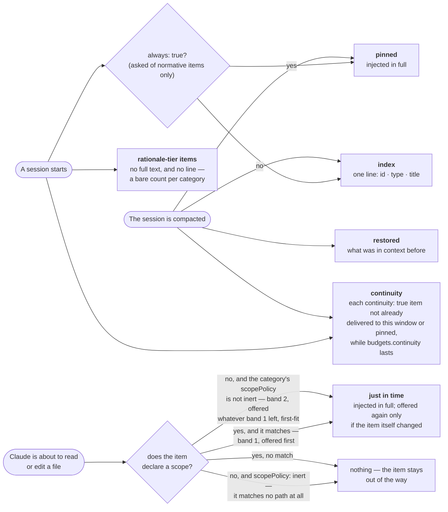
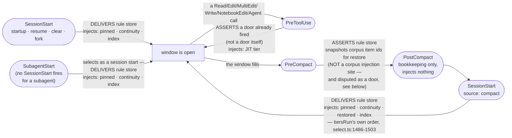
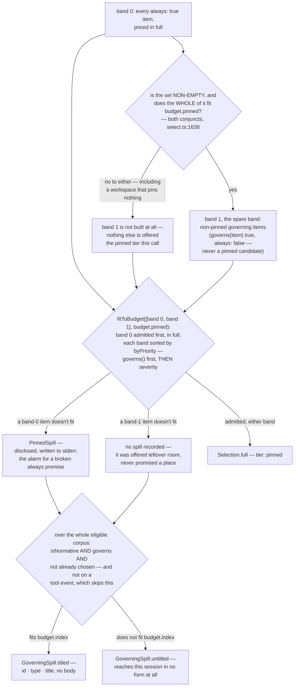

# Injection

Injection is the mechanism that decides, at the moment a context window begins (or is
rebuilt), which items in the corpus actually reach the model — in what form, in what
order, and at what cost. The corpus can hold thousands of items; a context window
cannot. Injection is the answer to "given a corpus too large to paste in whole, and a
budget that is a small fraction of it, what gets shown, and how does a reader know what
was left out?"

The engine lives in `src/core/inject.ts` (`buildInjectionResult`, 1,243 lines) and
`src/core/select.ts` (`select`, `fitToBudget`, `buildGoverningSpill`, 1,851 lines) — both `wc -l`,
2026-09-17, and both move on any edit to either file.
`inject.ts` is the orchestration layer: it resolves config, calls `select` once per
event, and renders the result into text. `select.ts` is the pure selection algorithm —
literally pure: `INV-select-is-pure` forbids it any I/O at all, so every fact it acts on
(budgets, focus, what was already `seen`, what a `restore` snapshot named) is handed in
as an argument, never read from disk inside the function. That purity is what lets the
same selector run identically from a hook, from the MCP `load_context` tool, and from
the web UI's preview screen (`docs/capabilities/08-web-ui.md`) without three
implementations drifting apart.

## The doors

A **door**, in this project's own vocabulary (`def-a-door`, the product rule store —
see `docs/capabilities/10-rule-store.md`), is *"a hook at which an agent's context
window BEGINS or is rebuilt, and therefore a place [delivery] must happen."* The
definition is explicit about what is *not* a door: `PreToolUse` "is not a door: it is
the earliest hook that runs AFTER every door, which is what makes it the place to assert
that some door fired." A hook running inside an already-established window carries no
obligation to deliver.

**Two vocabularies overlap here and this chapter keeps them apart**, because conflating
them is how the previous draft of this table went wrong. A **door** is a place with a
*delivery obligation* — for the product rule store, `deliverAtDoor` (chapter 10). An
**injection site** is a hook that calls `buildInjectionResult` or `select` for the
*corpus*. They are not the same list.

### Where corpus injection actually runs

| Hook | File | Event passed to `select` | What it delivers |
|---|---|---|---|
| Session start (`startup` · `clear` · `resume` · `fork`; `compact` has its own row below) | `src/hooks/session-start.ts` | `'session-start'` | Full injection: pinned tier, continuity tier, index — via `buildInjectionResult` (shared verbatim with the MCP `load_context` tool, per that file's own header) |
| Session start after compaction | same file, `source: 'compact'` | **`'compact'`** | The real re-injection point after a compaction — `post-compact.ts` itself does *not* inject; it is bookkeeping (audit records, `restoredFor` accounting) around the boundary that `SessionStart(source: 'compact')` re-opens |
| Subagent start | `src/hooks/subagent-start.ts` | **`'session-start'`** | Selecting as a session start means `tiersRun` pushes the same set a plain one does: **pinned, continuity and index** (`select.ts:1486-1503`), into a subagent's empty window — a subagent inherits none of the parent's context and no `SessionStart` fires for it, so this hook is, in the file's own words, the only thing standing between a dispatched subagent and "no knowledge of the project's own constraints" |
| A tool call, mid-session | `src/hooks/pre-tool-use.ts` (`select(...)` at line 313) | `'tool'` | The **JIT tier** — items scoped to the path the tool is about to touch, offered in two bands (`DEC-the-jit-tier-offers-path-scoped-items-first-in-two-bands`). This row is an injection site and **not a door**: the rule store's pass here is an *assertion* (`assertDoor`, `pre-tool-use.ts:708`), not a delivery. |

**`SelectEvent` has exactly four members** —
`'session-start' | 'compact' | 'tool' | 'manual'` (`src/core/select.ts:18`) — and the
mapping is the one ternary at `src/core/inject.ts:709–710`:

```ts
event: manual ? 'manual' : subagent ? 'session-start'
     : compacting ? 'compact' : 'session-start',
```

Two consequences a reader should not have to derive:

- **`'compact'` is a real `SelectEvent` member**, not a proxy. `source: 'compact'` is
  what `inject.ts` branches on; the event it then passes is `'compact'`.
- **`'subagent'` is never a `SelectEvent`.** It is an `InjectionEvent`
  (`'session-start' | 'manual' | 'subagent'`, `inject.ts:65`), and the subagent branch
  selects as `'session-start'`. The source states the reason in capitals: *"`SelectEvent`
  deliberately gains no member: a distinct one would need three new branches in `select`
  to arrive at the same answer."*

Which of the five tiers an item can reach is a question with one decision per firing
site — not a menu, a branch:



(This is the same tier-firing diagram as
[the README's §4](../../README.md#4-when-it-comes-back-and-what) — reused rather than redrawn, and
corrected here and there together. The 2026-09-17 corrections that hold: the JIT tier offers a
*scoped, matching* item before an *unscoped* one, not the same outcome
(`DEC-the-jit-tier-offers-path-scoped-items-first-in-two-bands`, `select.ts:1750-1756`); the
**continuity** tier fires at both a plain session start and after a compaction, and is drawn here
rather than omitted, since leaving it out reads as "it does not fire then" rather than "this
diagram is about a different axis"; and the JIT dedupe is **per session**, not per context
window — the per-session seen file survives a compaction, and `restored`
is what puts an item back, not a reset of what was already seen. The two acts that DO remove it are
`/clear` and `SessionEnd`, and they are the only two: `clearWindowState`
(`src/core/window-state.ts:44`) is the sole caller of `clearSeen`, and its own header names those
two callers at `:16-17`.)

**Four labels in it were wrong on the same day they were corrected, and each is now read off the
selector.** They are listed here rather than quietly replaced, because each was a *quantifier* — the
part of a diagram that reads as certain and is checked least.

| the label said | what `select.ts` does |
|---|---|
| an unscoped item is "offered only after every scoped item already fit" | The JIT call is `fitToBudget([scoped, unscoped], config.budgets.jit, 'jit')` (`:1750-1756`) with **no** `spareFrom` argument, so band 2 is an ordinary band. `fitToBudget` `continue`s past an over-budget item rather than breaking (`:924-937`), so a scoped item can spill and a smaller unscoped one still be admitted after it. "Everything already fit" is the **pinned** tier's gate (`:1638`), transplanted onto a tier that has none. |
| an unscoped item is "unrestricted" | Only where the category's `scopePolicy` is not `inert`. `matchesScope` returns `scopePolicyFor(config, item.type) !== 'inert'` for an empty scope (`:601-603`), and the JIT candidate set is `fresh.filter((i) => matchesScope(i, target, config))` (`:1749`) — so under `inert` the item never reaches **either** band. It is not offered late; it is not offered. |
| "every `continuity: true` item, in full" | `eligible.filter((i) => i.continuity && !delivered.has(i.id) && !alreadyChosen.has(i.id))` (`:1685-1687`), then `fitToBudget([candidates], config.budgets.continuity, 'continuity')` (`:1692`). Three exclusions the word "every" denies: already delivered into this window, already admitted by the pinned tier, and anything past `budgets.continuity` — whose overflow is `continuitySpill`. |
| JIT is "injected in full, once per session" | The seen gate does not promise once. `fresh` keeps an item whose seen entry is not **both** whole and current: `return !(entry.whole && entry.checksum === i.checksum)` (`:1543`). An item edited mid-session has a new checksum and is offered again — see "The `seen` gate" below. |

A fifth is an omission rather than an error, and the redraw adds it: the `index` tier enumerates
**normative** items only. `buildIndex` builds its lines from
`eligible.filter((i) => isNormative(i, config) && !chosenIds.has(i.id))` (`:1142-1144`) and reduces
everything else to `counts[item.type]` (`:1248-1252`). A rationale item gets no line at all — chapter
1 states this correctly, and this diagram used to route every non-`always` item to `index`.

### `PreCompact`, and a disagreement this chapter does not resolve

`PreCompact` (`src/hooks/pre-compact.ts`) writes a *snapshot* of what item ids were in
play (`injected: itemIds.map((id) => ({ id, tier: 'snapshot' }))`) so that the
re-injection at the next `SessionStart(source:'compact')` knows what to re-offer — "a
PreCompact snapshot injects nothing, but it decides what a session [receives next]" (the
file's own comment). The restore mechanism this feeds is covered in
`docs/capabilities/07-restore-and-handover.md`.

**It is not a corpus injection site. Whether it is a *door* is genuinely disputed
between the product rule store's own definition and the code that implements it**, and
this chapter reports the disagreement rather than picking a side:

- `def-a-door`'s `means` lists it: *"session start — new, resumed and compact-restore —
  `PreCompact`, and subagent start."*
- The code does the opposite. `deliverAtDoor` has exactly two call sites —
  `session-start.ts:134` and `subagent-start.ts:319` — and `pre-compact.ts:225` calls
  **`assertDoor`**, the same thing `pre-tool-use.ts` does. So `PreCompact` asserts that
  some door fired; it does not deliver.

That is a constant and an implementation contradicting each other about the product's
own vocabulary. It needs an owner ruling, not a documentation edit, and naming it here
is the most this chapter can honestly do.

### All eighteen registered hooks

`hooks/hooks.json` — a file no chapter previously named — is the single declaration of
every hook this plugin registers, with its matcher and its timeout. Only the four in the
table above touch corpus injection; the rest are named here so a reader knows the surface
exists.

| Event | Matcher | Handler (`src/hooks/`) | Timeout |
|---|---|---|---|
| `SessionStart` | `startup\|clear\|resume\|compact\|fork` | `session-start.ts` | 10 |
| `SubagentStart` | — | `subagent-start.ts` | 5 |
| `PreToolUse` | `Read\|Edit\|MultiEdit\|Write\|NotebookEdit\|Agent` | `pre-tool-use.ts` | 10 |
| `PostToolUse` | `Write\|Edit\|MultiEdit\|Agent\|Bash\|Read\|Grep` | `post-tool-use.ts` | 5 |
| `PostToolUseFailure` | — | `post-tool-use-failure.ts` | 5 |
| `PreCompact` | — | `pre-compact.ts` | 10 |
| `PostCompact` | — | `post-compact.ts` | 5 |
| `Stop` | — | `stop.ts` | 3 |
| `SubagentStop` | — | `subagent-stop.ts` | 3 |
| `SessionEnd` | — | `session-end.ts` | 2 |
| `Setup` | — | `setup.ts` | 3 |
| `FileChanged` | `.my_context/items\|.my_context/config.json`, and an unmatched second group | `file-changed.ts` | 3 |
| `InstructionsLoaded` | — | `instructions-loaded.ts` | 3 |
| `ConfigChange` | — | `config-change.ts` | 3 |
| `PermissionDenied` | — | `permission-denied.ts` | 3 |
| `TaskCreated` | — | `task-created.ts` | 3 |
| `TaskCompleted` | — | `task-completed.ts` | 3 |
| `UserPromptExpansion` | `^mycontext:` | `user-prompt-expansion.ts` | 3 |

Six of the eighteen sit on one lifecycle — a context window opening, filling, and being
rebuilt — and carry two independent obligations that do not always coincide: **delivers**
(the product rule store's door vocabulary, chapter 10), and **corpus injection site**
(this chapter's own vocabulary, "The doors" above). The other twelve serve unrelated
surfaces (file-change nudges, task events, config changes, …) and are omitted below —
the table above is where they are named; a diagram repeating all eighteen boxes would
restate that table, not explain anything the table does not already say.



**The matcher on `PreToolUse` matters and is easy to miss**: it fires on six tool names,
not on every tool call. A `Bash` call reaches `PostToolUse` and not `PreToolUse`.

Three shared modules under `src/hooks/` are not hooks and are described nowhere in this
reference: `io.ts` (`parseHookInput`, `hookContext`, `hookBlockDecision`, `preToolUseDeny`,
`pinnedSpillLine`, the `HookEventName` union), `observe.ts` (the shared observation runner
imported by nine hooks), `self-register.ts` (generates the Claude Code settings hooks block
from `hooks/hooks.json`, and is what `npm run hooks:install` runs), and `task-events.ts`.

## The budget model

Every budget is expressed in **`estimateTokens` units — characters ÷ 4** (stated
directly in `budgets-write.ts` and `config.ts`'s validation error text, e.g.
`"budgets.${key} must be a positive integer (estimateTokens units — characters / 4)"`).
There are five budget keys, one per tier, defined in `src/core/config.ts`:

```ts
export const DEFAULT_BUDGETS: Budgets = {
  pinned: 6000, jit: 6000, restored: 8000, continuity: 2000, index: 1200,
};
```

This repository's own `.my_context/config.json` sets all five explicitly; four are raised
and `continuity` is written at a value that happens to equal the shipped default:

```json
"budgets": {
  "pinned": 30000,
  "jit": 32000,
  "restored": 48000,
  "continuity": 2000,
  "index": 8000
}
```

A budget is validated key by key: an unknown key is refused outright, and a bad value
throws rather than silently falling back. The source names the concrete cases it guards
— a typo'd key **`"pined": 9000`**, or an invalid value (`"6000"`, `-1`, `null`) — and
says why refusing beats skipping: these "used to be skipped by the merge loop, so the
user thought they raised a limit, the default stayed in force, and the only symptom was
items quietly missing from their context" (`src/core/config.ts:1824–1831`). The refusal
text itself ends *"accepting the key and keeping the default would mean the limit you set
was never in force and items were silently missing from sessions."*

Note the asymmetry with the rest of the config: an unknown key **inside `budgets`** is
fatal, while some unknown keys elsewhere are recorded and skipped. The field that records
those is `Config.skippedKeys` (`config.ts:840`), and `doctor` reports them under the
`config_key_skipped` finding code.

Each tier's admissions are computed by `fitToBudget(bands, budget, tier, spareFrom)`,
which does **first-fit, not strict priority truncation**: candidates are sorted by
`byPriority` and admitted while they fit; an over-budget item is `continue`d past
(skipped), not treated as a hard stop, so a later, smaller, *lower*-priority item can
still be admitted after a higher-priority one has spilled. The comment in `select.ts` is
explicit that this is deliberate, for better budget utilisation — `spilled` is therefore
**not** a strict priority prefix of the candidate list.

## Pinning (`always: true`)

Pinning guarantees an item is offered at the `pinned` tier at **every** session start —
`mycontext pin <id>` is documented in `--help` as literally `edit --always=true`, and
`mycontext unpin <id>` as `edit --always=false`; there is no separate `pin` subcommand
in `src/cli/commands/` — both are aliases dispatched onto `edit`. Only a `normative`-tier
category may carry `always: true`, and the refusal is worth stating exactly, because the
mechanism is not absence. `TIER_UPDATES.rationale` **does** carry an `always` entry
(`src/core/categories.ts:124`) — with `values: ['false']` and the note *"Only false.
`--always true` is REFUSED here — pinning governs on the normative tier only."* So
`--always true` on a `decision` or `lesson` is refused by a **closed value set** plus
`inertFieldError` in `cli/commands/edit.ts`, not by the field being unknown on that tier.
The conclusion is the same; the mechanism matters because a reader looking for "no entry"
will not find one, and because the same table is what lets `mycontext unpin` work on a
rationale item at all.

```
mycontext pin CONST-zero-runtime-dependencies
mycontext unpin CONST-zero-runtime-dependencies --yes
```

Pinning is a promise the pinned tier is built to keep first and in full: the pinned
band's candidates are the `always: true` items, admitted before anything else touches
`budgets.pinned`. When one does not fit, that is not a quiet degradation — it is
`PinnedSpill`, read out loud in the injected block, written to stderr, and counted in
the audit log as `audit_item.role = 'spilled'` — "the alarm for a broken `always`
promise" (`select.ts`).

## The spare band

Ruling `TASK-the-pinned-tier-sits-half-empty-while-sixty-nine-governing` (owner,
2026-09-04) addressed a measured waste: on this repository's own corpus, `budgets.pinned`
at 30,000 with 37 `always` items costing 22,582 left 7,418 tokens of the pinned tier
completely unspent, while other *governing* items (categories in `GOVERNING_TYPES`:
`rule`, `constraint`, `invariant`, `instruction`, `requirement`, `standard`) that are not
pinned were falling through to a title-only index line for lack of room elsewhere.

The fix: when every `always` item already fit (`pinnedCost <= config.budgets.pinned`),
the pinned tier's *leftover* capacity is offered — as a second, lower band — to
non-pinned governing items:

```ts
const spare = candidates.length > 0 && pinnedCost <= config.budgets.pinned
  ? fresh.filter((i) => !i.always && governs(i))
  : [];
const result = fitToBudget([candidates, spare], config.budgets.pinned, 'pinned', 1);
```

Two properties make this safe rather than a second, silent meaning for `always`:

- **`always` itself is not widened.** It is offered first, in full, and the spare band
  only ever runs on a call where every `always` item already fit.
- **A spare-band miss is not a spill.** `fitToBudget`'s `spareFrom` parameter marks band
  index 1 (0-based) as spare: a candidate that doesn't fit there records **no** `Spill`
  and falls straight through to the index tier exactly as it did before the band
  existed — "it was offered leftover room, not promised a place, and the tier owes it no
  disclosure" (`select.ts`). Measured on this corpus, 2026-09-07: 69 of the 82 governing
  candidates offered the spare band did not fit it, and none of those 69 were recorded
  as pinned-tier spills.
- **Ordering inside the band is `byPriority`, not a most-spilled rank** — the ruling
  suggested ranking by how often an item had spilled historically, but `select` is pure
  and cannot read the audit log, so the band falls back to the same priority order every
  other band uses. On this corpus that puts `severity: hard` first, and all thirteen
  items the spare band actually admits are `hard`.

The measured effect, stated directly in the source (2026-09-07, `budgets.pinned` 30,000,
996 items): the spare band admits 13 governing items for the unspent 7,418 tokens, and
`governingSpill.titled` — the count of governing items reduced to a title only — **fell
from 82 to 69** the day the band landed. That number is offered as *the* measurement of
whether the ruling worked, not a side effect of it.

## What arrives in full versus as an index line — and `governingSpill.titled`

Every full-text admission goes into `Selection.full` as a `SelectionEntry`, and
`SelectionEntry.tier` has exactly four members — `'pinned' | 'jit' | 'restored' |
'continuity'` (`src/core/select.ts:155–157`). **There is no fifth.** A title-only line is
not a `SelectionEntry` at all: it is an `IndexLine` in `Selection.index.normative`,
rendered by `renderIndexLine`. `'index'` exists only as an extra member of
`Spill['tier']` (`:162`) — i.e. as a place something can be *recorded as having missed*,
never as a tier something is delivered at. An item that misses the index budget too is
not rendered at all.

`GoverningSpill` (`select.ts`, `Selection.governingSpill`) is the disclosure built
specifically to make that degradation impossible to miss, for the six governing
categories only:

```ts
export interface GoverningSpill {
  titled: string[];    // governing ids that reached this session as a title only
  untitled: string[];  // governing ids that reached this session in NO form at all
  cost: number;         // estimated tokens to deliver every id above in full
}
```

- **`titled`** — a governing item (`rule`, `constraint`, `invariant`, `instruction`,
  `requirement`, `standard`) that `governs(item)` is true for, was not in `chosenIds`
  (not admitted in full anywhere), but *did* land in the index tier as a bare line. The
  comment on the type is blunt about why this needs its own name rather than being left
  as an ordinary index-tier entry: *"A title names a rule; it does not tell you what it
  requires."* Rendered into the injected block (`render.ts`, `renderGoverning`) as:

  > *N governing item(s) below carry a title only — the body was not delivered: `id`,
  > `id`, +K more. A title names a rule; it does not tell you what it requires. Read each
  > with `mycontext show <id>` before treating it as satisfied.*

- **`untitled`** — a governing item that missed the index tier's own budget too: no
  title, no line, nothing. Measured on this repository's own corpus as empty at every
  budget the index has ever been set to — the carry probe lowered it, and `select.ts`'s
  own comment reads *"`displaced` is `0` from 1200 **down to** 470"* (`:436`), 470 being
  the tighter end — but it is *computed*, not assumed empty, because a corpus that grows more
  governing items, or an operator who lowers `budgets.index`, can make it non-empty.
  Rendered with a `⚠` marker when non-empty, distinct from the plain `titled` sentence.

- **`cost`** is the estimated token cost of delivering everything in both lists in full
  — "the number a person deciding whether to raise a budget needs" — and, deliberately,
  it is **never budgeted itself**: like the focus and continuity-spill notes, this
  disclosure sits outside every tier's budget and outside `Selection.tokens`, because
  "a disclosure a budget could drop is not a disclosure."

`governingSpill` is `null` on a `Selection` precisely when nothing governing went
bodyless that call — every governing candidate was admitted in full, nothing governs at
all, or the event didn't run an index tier (a `'tool'` event never adds `'index'` to
`tiersRun`; a JIT-tier spill of a governing item is already covered by the ordinary
per-item spill note).

**Why `governingSpill.titled` is treated as *the* measure of injection quality**: it is
the one number that isolates exactly the failure mode injection exists to prevent —
something that *governs* the work arriving in a form that looks like it was delivered
(it has a title, a category, an id) but carries none of the actual constraint. Every
other budget number (tokens used, items admitted) can look healthy while this one is
high. It is the number the spare-band ruling cites as its own before/after
(82 → 69), and it is why a document about this project's *quality*, not just its
mechanism, would track this count over time rather than raw admission counts.

Put together, the pinned tier's admission pass is a packing problem in two bands handed to one
`fitToBudget` call, and the fall-through from a missed pack is where a governing item can end up:
full text, a title, or nothing at all. `governs(item)` — the predicate `byPriority` ranks
**above** severity, not below it — is `GOVERNING_TYPES.has(item.type)` (`rule`, `constraint`,
`invariant`, `instruction`, `requirement`, `standard` — `select.ts:742-744`) **or** `isOpenWork(item)`
(`governs` itself at `select.ts:807-809`);
this diagram is specifically the pinned tier's own mechanics, where the spare band lives.
**Two callers pass more than one band, not one** — `fitToBudget`'s own doc comment names them at
`select.ts:853-855`: the pinned tier's spare band and the JIT tier. The four call sites are `:1641`
(pinned, two bands, `spareFrom: 1`), `:1692` (continuity, one band), `:1701` (restored, one band)
and `:1750` (jit, **two** bands, no `spareFrom`). An earlier revision of this sentence put `jit`
among the single-band tiers, which this chapter contradicts twice over — at the tiers table above
and in the JIT caption.



## Worked example — reading a real Selection

There is no standalone `mycontext injection` CLI subcommand (`injection --help` returns
`unknown command "injection"`); the underlying selection is exercised by the hooks
themselves, by the MCP `load_context` tool, and — for a human to inspect interactively
without triggering a real hook — by the web UI's **Injection preview** and **Budget
simulator** screens (`docs/capabilities/08-web-ui.md`), which call the same
`buildInjectionResult`/`select` pair described above against a simulated corpus and
budget, so nothing on that screen is a second implementation of this algorithm.

## Use cases

- **A large, mature corpus that has outgrown its budget.** Raising `budgets.pinned`
  is a deliberate, visible config change; the spare band is what keeps the *unused*
  remainder of an already-adequate pinned budget from being wasted while other
  governing items degrade to titles.
- **Auditing whether "the agent was told" is actually true.** Before this
  disclosure, an agent could report treating a rule as satisfied on the strength of
  having *seen its title* in an index line. `governingSpill.titled` makes that
  distinction explicit in the injected text itself, and `mycontext show <id>` is the
  named remedy.
- **Deciding whether to pin something.** An item that keeps showing up in
  `governingSpill.titled` across sessions is a candidate for `mycontext pin` — it is
  governing, it is not fitting the ordinary governing budget, and pinning puts it in
  the one tier evaluated first.

## The rest of `config.json` — the eight top-level keys

`budgets` is one of eight, and `TOP_LEVEL_KEYS` (`src/core/config.ts:1290`) is
the list every config surface derives from — the CLI's and the MCP schema's
both — which is why its **order** is meaningful and an appended key goes at the
end rather than into sorted position:

```
profile  categories  budgets  watchedDocs  ui  handover  dispatchGate  review
```

Three of these are described elsewhere: `categories` in
[chapter 1](./01-items-and-corpus.md), `handover` in
[chapter 7](./07-restore-and-handover.md), `review` in
[chapter 11](./11-self-improvement-loop.md). `ui.enabled` / `ui.port`
(`DEFAULT_UI = { enabled: true, port: null }`) back `mycontext ui`
([chapter 8](./08-web-ui.md)). `dispatchGate.enabled` is a third off-by-default
gate, covered in chapter 11. **`watchedDocs` is documented nowhere else, so it
is here.**

### `watchedDocs` — the whole feature, in one place

`Config.watchedDocs` (`config.ts:792`) is an array of repo-relative globs
naming the documents this corpus **claims**. It defaults to

```ts
export const DEFAULT_WATCHED_DOCS = [
  'docs/superpowers/specs/**',
  'docs/superpowers/plans/**',
  'docs/prd/**',
];
```

and this repository sets it to `["docs/**/*.md", "README.md"]`.

**It replaces the default rather than extending it**, and the source calls that
asymmetry out by name against `extraFields`, which *does* extend: "The two
dangers point opposite ways. For `watchedDocs` the hazard is silently GAINING
globs the user never wrote, and the worst case of replacing is watching fewer
files."

`requireWatchedDocs` (`config.ts:1879`) **refuses rather than filters.** A
non-string entry used to be dropped by a `filter`, so
`"watchedDocs": ["docs/prd/**", 42]` quietly watched one glob fewer than it
said. The refusal's own sentence is the argument: *"dropping the entry silently
would mean a document you asked to be watched was not."*

Two things read the list:

- **`src/hooks/post-tool-use.ts:101`** — the capture nudge, inside `nudgeFor` (`:69`). Edit a file matching
  a watched glob and the hook says so, "because `watchedDocs` is a PROMISE the
  user configured in the very file" it names back to them.
- **`doctor`'s `checkWatchedDocsServable`** (`src/doctor/checks.ts:613`) —
  which raises **`watched_doc_unserved`** (`warn`) for a watched file the UI's
  document route cannot serve. That route reaches `README.md` and every `.md`
  under `docs/` or `reports/`; a watched file outside all three "is claimed as
  one of this corpus's documents [but] no reader can open it". The remedy is to
  move the file or drop the glob — and the finding names the consequence rather
  than leaving it to be discovered: dropping the glob also stops the capture
  nudge on that file, "a consequence, not a coincidence". A second code,
  **`watched_doc_coverage`** (`info`), fires when the repository walk hits its
  file bound, so a partial answer is disclosed rather than read as a zero.

### Writing config from the CLI

`mycontext config` is the only CLI-driven writer of `config.json`
([chapter 9](./09-cli-and-mcp.md)), and its write surface is
`setConfigField` / `unsetConfigListEntries` with `FieldWriteOptions` and
`FieldWriteResult` (`config.ts:2636–2658`), plus `CategoryWriteResult` for
`--delete`/`--disable` (`:2394`). Two properties are worth stating because they
are what make the command safe to run: **`dryRun`** validates fully and reports
what would change without touching disk, and every real write takes a
**backup first** — `FieldWriteResult.backupPath` names it, and is `null` both
when there was no existing file and always on a dry run. `wrote` is `false`
when `before` already equals `after`, so "nothing needed writing" is a reported
answer rather than a silent success.

## Four mechanisms this chapter's purity argument depends on, named rather than described

Each of these decides what reaches the model, and each deserves the treatment the budget
model gets above. They are named here so a reader knows to go and read them, rather than
concluding from this chapter's silence that they do not exist.

- **The `seen` gate** (`src/core/select.ts:20–77`). `seen` is not "an id was delivered".
  `SeenLine` carries two verifiable facts and deliberately not a third: **`checksum`**
  (currency — an item edited or superseded since delivery no longer matches, so "a stale
  delivery cannot excuse a session from ever seeing the new text") and **`whole`**
  (completeness — true only for a delivery that carried the full body, never for a
  title-only index line, reusing `governingSpill`'s own `titled`/`untitled` distinction
  rather than inventing a second notion of whole). The third fact — is the item still in
  the window — is not knowable from a delivery record, and the type says so.
- **Focus narrowing** (`isFocusActive`, `focusHides` at `:683`, `focusMatchesScope` at
  `:625`, and `buildFocusReport` at `:1330`, producing the `FocusReport` disclosure at
  `:472`). An active focus narrows the universe an event delivers from. Note the
  interaction with chapter 1's read boundary: `severity: hard` **exempts** an item from
  focus narrowing, which is one of the reasons a laundered severity must never read as
  `hard`.
- **The one-shot carry** (`mycontext carry`, `IndexSummary.carried`, `select.ts:1146` and `:1165–1168`).
  A carried id is ordered ahead of every other index candidate for one delivery, which
  changes *which* lines fit under the same budget — and the code makes the point that this
  second half is the one a plan usually loses. It has its own disclosure.
- **What injection does when config is unreadable.** `injectionFailureNote`
  (`inject.ts:188`, returned at `:1228` with `pinnedSpill: null` and `deliveredIds: []`)
  and `configUnreadableLine` (`src/hooks/io.ts:681`) are how a session is told it got
  nothing, rather than being handed a silently empty block.

The **continuity tier** — one of the five budgets listed above, and the only full-text
tier not gated on `isNormative` — is described in
[`./01-items-and-corpus.md`](./01-items-and-corpus.md) under Tiers rather than here.

## What's NOT built / built but off

- There is no CLI command that prints a `Selection` directly; inspecting one requires
  either a live hook run (via the audit log, `docs/capabilities/09-cli-and-mcp.md`) or
  the web UI's simulated screens.
- **`PreCompact`'s status as a door is unresolved** between `def-a-door`'s `means` and the
  code that implements delivery. See "The doors" above. This chapter does not pick a
  side, and nothing in the reference should be read as having settled it.
- The four mechanisms in the section above are **named and not described** in this
  chapter. That is a documentation gap, not a product one.
- The spare band's "most-spilled first" ordering, suggested in the owner's own ruling,
  is explicitly **not implemented** — `select.ts` states this is because ranking by
  historical spill count would require reading the audit log, which `INV-select-is-pure`
  forbids inside this function; doing so would need a signature change and "a decision
  for the owner, not something to smuggle in behind a filesystem read." The band
  currently falls back to plain `byPriority`.

## See also

- `./00-index.md` — index
- `./01-items-and-corpus.md` — what an item, a tier, and a category are
- `./08-web-ui.md` — Injection preview and Budget simulator screens
- `./10-rule-store.md` — doors, and the assertion pass at `PreToolUse`
