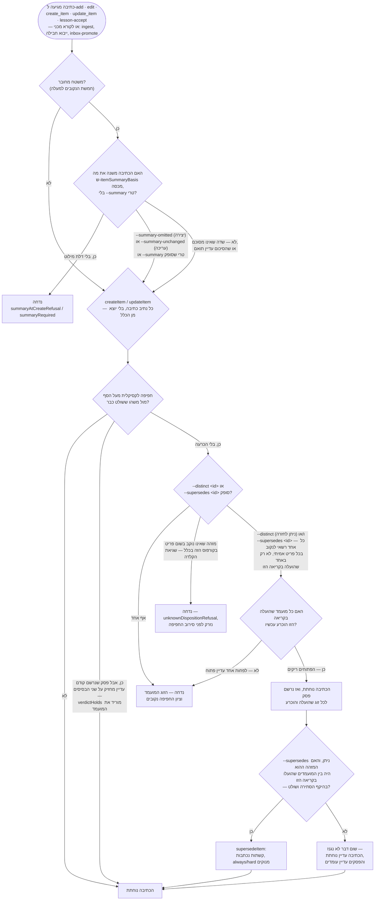

<!--
  Hebrew mirror of `docs/capabilities/03-creation-and-gates.md`. The English
  file is the source. Conventions: `docs/README.he.md` and
  `docs/the-store.he.md` — Hebrew prose and tables inside `<div dir="rtl">`,
  fenced code, pasted output and Mermaid blocks outside it, `<span dir="ltr">`
  around any Latin run whose first or last character is not alphanumeric and
  around any run of two or more Latin terms joined by commas or slashes.

  The Mermaid labels are translated; the graph structure, the node ids and the
  HTML entities inside the labels (`&lt;id&gt;`) are the English ones,
  character for character. Pasted command output is not translated at all.

  Heading sequence must stay identical to the English file.
-->

# 3. יצירה והשערים

<div dir="rtl">

[← אינדקס](./00-index.he.md) · ראו גם: [1. פריטים והקורפוס](./01-items-and-corpus.he.md) ·
[13. משמעת הבדיקות](./13-testing-discipline.he.md)

פריט נכנס לקורפוס דרך מספר קטן של **משטחים מחוברים** — <span dir="ltr">`mycontext add`</span>,
<span dir="ltr">`mycontext edit`</span>, כלי ה-MCP <span dir="ltr">`create_item` / `update_item`</span>,
ו-<span dir="ltr">`mycontext lesson-accept`</span>. שני שערים בלתי תלויים יושבים על המשטחים
האלה ויכולים לסרב לכתיבה מיידית. הפרק הזה מכסה את שני השערים, את הדגלים שעונים להם, איך זהות
תוכן מקבלת checksum, איך גניזה (החלפה) נרשמת, ואת שתי הפקודות שמבקרות ומתקנות את הנהלת
החשבונות של הקורפוס עצמו: <span dir="ltr">`doctor`</span> ו-<span dir="ltr">`repair`</span>.

כל מה שלמטה נקרא מ-<span dir="ltr">`src/core/summary-gate.ts`</span>,
<span dir="ltr">`src/core/mutate.ts`</span> (שער הסתירה, מ-<span dir="ltr">`:416`</span> ועד
<span dir="ltr">`carryVerdicts`</span> ב-<span dir="ltr">`:575`</span>),
<span dir="ltr">`src/cli/index.ts`</span> (<span dir="ltr">`cmdAdd`</span>,
<span dir="ltr">`:808–1299`</span>), <span dir="ltr">`src/cli/commands/edit.ts`</span>
(1,320 שורות ב-2026-09-17), <span dir="ltr">`src/cli/commands/supersede.ts`</span>,
<span dir="ltr">`src/cli/commands/repair.ts`</span>, <span dir="ltr">`src/core/content-hash.ts`</span>,
<span dir="ltr">`src/core/rebuild.ts`</span>, ו-<span dir="ltr">`src/doctor/checks.ts`</span>,
ועוד הרצת <span dir="ltr">`mycontext doctor`</span> אמיתית מול הקורפוס של המאגר הזה עצמו
ב-2026-09-12.

## למה בכלל קיימים שערים

שני השערים עונים על אותו חשש משני כיוונים שונים: פריט נורמטיבי מוזרק להקשר של כל סשן ומטופל
כשולט, ולכן כתיבה רעה אינה שגיאת הקלדה איפשהו בעץ קבצים — היא הוראה שקרית שסוכן יפעל לפיה.
**שער הסיכום** מונע מפריט להיסחף מהתיאור בן השורה של עצמו. **שער הסתירה** מונע מהוראה שנייה
וסותרת לעמוד בשקט לצד אחת שכבר בתוקף. אלה מנגנונים בלתי תלויים במכוון שחיים בעומקים שונים
של נתיב הכתיבה (ראו "למה שני עומקים שונים" למטה) — אף אחד מהם אינו תחליף לשני.

## שער הסיכום

**מה זה.** כל פריט רשאי לשאת שדה <span dir="ltr">`summary`</span> — "משפט פשוט אחד שאומר מה
הפריט הזה **הוא** ולמה זה חשוב, לקורא ש**אינו** מכיר את בסיס הקוד הזה"
(<span dir="ltr">`src/core/validate.ts`</span>, <span dir="ltr">`SUMMARY_MAX_CHARS`</span> =
250 תווים). השער שומר על המשפט הזה ישר מול התוכן שהוא מסכם, בשני רגעים:

1. **ביצירה** (<span dir="ltr">`summaryRequiredAtCreate` / `summaryAtCreateRefusal`</span>,
   <span dir="ltr">`summary-gate.ts`</span>) — פריט נורמטיבי אינו יכול להיוולד בלי סיכום,
   אלא אם ההשמטה מפורשת.
2. **בעריכה** (<span dir="ltr">`summaryRequired`</span>, אותו קובץ) — אם העריכה תשנה את מה
   ש-<span dir="ltr">`itemSummaryBasis`</span> (<span dir="ltr">`content-hash.ts`</span>)
   רואה כ*משמעות* הפריט (<span dir="ltr">`SUMMARY_BASIS`</span>, למשל
   <span dir="ltr">`body`</span>), הטקסט החדש/המעודכן חייב להגיע עם סיכום טרי באותה קריאה,
   אחרת העריכה נדחית.

**למה זה קיים.** הכותרת של השער קובעת את המקור ישירות: פסיקת בעלים — *"בכל פעם שהגוף משתנה,
גם הסיכום צריך, על בסיס הגוף החדש"* — שדבר בבסיס הקוד אינו יכול לאכוף בייצור (אפס תלויות זמן
ריצה, אין גישה למודל: סיכומים נכתבים על ידי אדם או סוכן כפרוזה רגילה). ולכן זה נאכף על ידי
**סירוב ברגע האחד שבו ההחלפה זולה** — מי שעורך בדיוק קרא את הפריט ומחזיק את הטקסט החדש.

**למה הטריגר נגזר, ואינו רשימת דגלים.** ההערה ב-<span dir="ltr">`summary-gate.ts`</span>
מפורשת שעיצוב מוקדם יותר השתמש ברשימה מתוחזקת ביד של דגלים שמבטלים סיכום
(<span dir="ltr">`--body`, `--extra`</span>, …), וקובעת שזה היה "הפגם שהמאגר הזה מדד שמונה
פעמים." העיצוב הנוכחי בונה במקום את הפריט *כפי שהעריכה הייתה משאירה אותו* ומגבב אותו עם
<span dir="ltr">`itemSummaryBasis`</span>; מה ש-<span dir="ltr">`SUMMARY_BASIS`</span> מסווג
כ"מסוכם" הוא מה שיכול להפעיל את השער, והסיווג הזה חי בדיוק במקום אחד.

**למה ליצירה היה צורך בשער משלה, ולא רק בשער העריכה.** אותה הערה מסבירה חור היסטורי:
<span dir="ltr">`summaryRequired`</span> ויתר על הדרישה בכל פעם ש-
<span dir="ltr">`item.summary === null`</span> ("אין מה לבטל"), ו-<span dir="ltr">`create_item`</span>
תיעד את <span dir="ltr">`summary`</span> כאופציונלי — ולכן פריט שנולד בלי סיכום לעולם לא היה
יכול אחר כך *להידרש* לקבל אחד; שער העריכה לעולם אינו נורה על שדה שהתחיל ריק. שבעה־עשר פריטים
הגיעו למצב הזה בלי נתיב אכוף החוצה. התיקון העביר את הדרישה לרגע האחד שבו הקורא מחזיק את הטקסט
והפריט עדיין אינו קיים: <span dir="ltr">`summaryRequiredAtCreate`</span>.

**שתי דלתות מילוט, אחת לכל שער, והן דגלים שונים.** זה הדבר הכי קל לטעות בו בפרק הזה, ולכן
שתיהן נקובות כאן:

- **<span dir="ltr">`--summary-omitted`</span>** עונה לשער ה**יצירה**. במקום להתיר בשקט "אין
  סיכום", הוא דורש שה*היעדר* ייקבע: נשמר כ-<span dir="ltr">`summary_omitted: true`</span>,
  הוא אומר לשער "אדם שקל את זה ובחר לא לכתוב אחד", והוא נרשם כך ש"אף אחד לא כתב אחד" נראה
  בשביל הביקורת ולא מונח. העברת <span dir="ltr">`--summary`</span> ו-
  <span dir="ltr">`--summary-omitted`</span> יחד נדחית (<span dir="ltr">`summaryOmittedRefusal`</span>)
  כסתירה בפני עצמה. **זהו דגל של משטח היצירה בלבד** — <span dir="ltr">`src/cli/index.ts:556`</span>
  (שורת השימוש של <span dir="ltr">`add`</span>) ו-<span dir="ltr">`:951`</span> (שם הוא נקרא),
  ועוד <span dir="ltr">`lesson-accept`</span>. **<span dir="ltr">`mycontext edit`</span> אינו
  מקבל אותו.**
- **<span dir="ltr">`--summary-unchanged`</span>** עונה לשער ה**עריכה**, והוא הדגל שקורא
  שנתקל בעריכה שנדחתה באמת צריך: <span dir="ltr">`src/cli/commands/edit.ts:93`</span> (שימוש),
  <span dir="ltr">`:658`</span> (פענוח), <span dir="ltr">`:973`</span>
  (<span dir="ltr">`summaryUnchangedRefusal`</span>). בצד ה-MCP אותה דלת היא
  <span dir="ltr">`summary_unchanged: true`</span> על <span dir="ltr">`update_item`</span>.
  העברת <span dir="ltr">`--summary`</span> ו-<span dir="ltr">`--summary-unchanged`</span>
  יחד נדחית באותה צורה שהזוג של היצירה נדחה — *"שאומרים שהסיכום השתנה ושהוא לא. אין קריאה של
  זה שמכבדת את שניהם"* (<span dir="ltr">`summary-gate.ts:403–418`</span>).

**נתיב תיקון קשור: אישור מחדש.** סיכום יכול להתיישן (להיכשל בהתאמה לבסיס הנוכחי) אף שהוא עדיין
נכון — למשל תיקון שגיאת הקלדה בגוף שאינו משנה משמעות.
<span dir="ltr">`mycontext edit --summary "<the same text>"`</span> נהג לדווח "אין מה לשנות"
(שקר: החותם היה צריך עדכון אף ששום שדה לא נקרא אחרת).
<span dir="ltr">`summaryReaffirmed`</span> פותח דלת שלישית במקום להרחיב את השער: שכפול המשפט
מותר כאישור מחדש מפורש, שיקר יותר לזייף ממה שמעקף שקט היה — "הדלת היא דגל ודגל אפשר להקליד
על פני קורפוס שלם בלי שמילה אחת נקראה, בעוד שאישור מחדש אפשר לאיית רק על ידי שכפול המשפט."
**הדלת שהמשפט הזה עוסק בה היא <span dir="ltr">`--summary-unchanged`</span>**, זו של שער
העריכה — לא <span dir="ltr">`--summary-omitted`</span>, ש-<span dir="ltr">`edit`</span> אינו
מקבל.

**אילו קוראים השער רואה ואילו לא.** הוא מיובא על ידי בדיוק חמישה משטחים מחוברים:
<span dir="ltr">`mycontext add`</span>, <span dir="ltr">`mycontext edit`</span>, כלי ה-MCP
<span dir="ltr">`create_item` / `update_item`</span>, ו-<span dir="ltr">`mycontext lesson-accept`</span>.
הוא במכוון *אינו* נקרא מהפנימיים המשותפים <span dir="ltr">`createItem` / `updateItem`</span>,
כך שקוראים מכניים בלי אדם ליד המקלדת — <span dir="ltr">`ingest`</span>, ייבוא חבילה,
<span dir="ltr">`inbox-promote`</span> — אינם נחסמים על ידי שער שנועד לפרוזה מחוברת.
<span dir="ltr">`lesson-accept`</span> נוסף לרשימה רק ב-2026-09-12: עד אז, קבלת מועמד כלל
מבוים יכלה ליצור <span dir="ltr">`rule`</span> פעיל ושולט בלי סיכום ובלי השמטה רשומה, מה
שבדיקת <span dir="ltr">`summary_absent`</span> של doctor תפסה באותו יום שזה קרה
(<span dir="ltr">`TASK-lesson-accept-creates-a-rule-with-no-summary-so-the-accept`</span>).

**מה הוא אינו מכסה.** קובץ <span dir="ltr">`.md`</span> שנערך ביד עוקף כל גבול פקודה לחלוטין
— Markdown הוא מקור האמת ועריכה ביד מותרת. השער יכול רק *למנוע* את המקרה בגבול פקודה; הוא
אינו יכול *לראות* קובץ שנערך מחוץ ל-my_context. זה מה שבדיקת <span dir="ltr">`summary_stale`</span>
של <span dir="ltr">`doctor`</span> (<span dir="ltr">`checkSummary`</span>,
<span dir="ltr">`src/doctor/checks.ts`</span>) קיימת בשבילו במקום — ראו "Doctor" למטה. השניים
יחד — שער כדי למנוע, doctor כדי לגלות — הם מה שסוגר את החור; אף אחד לבדו לא.

**איך משתמשים בזה.**

</div>

```
mycontext add rule "Never bypass the summary gate" --body "..." --summary-omitted
mycontext edit RULE-some-id --body "new text" --summary "One plain sentence about what changed."
mycontext edit RULE-some-id --summary "Same sentence as before, verbatim" # re-affirmation
```

<div dir="rtl">

**מקרה שימוש.** סוכן מתבקש לתקן שגיאת הקלדה בגוף של פריט <span dir="ltr">`constraint`</span>
קיים. מכיוון שהתיקון משנה את התוכן המגובב, <span dir="ltr">`mycontext edit`</span> מסרב
לכתיבה עד ש-<span dir="ltr">`--summary`</span> מלווה אותה — ובכך כופה סיכום מחדש אמיתי או
אישור מחדש מפורש, כך שהקורפוס לעולם אינו צובר בשקט פריטים שהתיאור בן המשפט שלהם כבר אינו
תואם את מה שהם אומרים.

## שער הסתירה

**מה זה.** לפני שכתיבת תוכן כלשהי נוחתת (<span dir="ltr">`createItem` / `updateItem`</span>
ב-<span dir="ltr">`src/core/mutate.ts`</span>), כל פריט מועמד נורמטיבי מושווה לכל פריט אחר
ששולט כבר, בעזרת **ציון חפיפה לקסיקלי** (מבוסס Jaccard; ראו
<span dir="ltr">`contradictionBasis`</span>). אם התוכן החדש מקבל ציון מעל הסף מול משהו ששולט
כבר, הכתיבה נדחית אלא אם הקורא כבר *הכריע* בזוג.

**למה הוא יושב שכבה אחת עמוק יותר משער הסיכום — "שני העומקים השונים" שהוזכרו למעלה.** הערת
הכותרת ב-<span dir="ltr">`mutate.ts`</span> קובעת זאת במפורש, בציטוט פסיקת הבעלים (מפרט העיצוב
2026-09-07, §2 §4 §5 §7): קורא מכני שהיה מגיש כלל חי שני מול אחד עומד הוא *בדיוק* המקרה
שהשער הזה קיים בשבילו, ולכן קורא "חייב או לשאת הכרעות שהוכרעו קודם או להיכשל בנקיות תוך
נקיבה במה שצריך להיסגר", ומעקף עבור קוראים פנימיים "היה מסכל את §2 לגמרי." אז בשונה משער
הסיכום, שער הסתירה חי בתוך <span dir="ltr">`createItem` / `updateItem`</span> עצמם — שתי
הפונקציות שהן נתיבי הכתיבה ה*יחידים* לתוכן פריט — ולכן כל מסלול (<span dir="ltr">`add`</span>,
<span dir="ltr">`edit`</span>, <span dir="ltr">`create_item`</span>,
<span dir="ltr">`update_item`</span>, <span dir="ltr">`inbox-promote`</span>,
<span dir="ltr">`lesson`</span>, <span dir="ltr">`lesson-accept`</span>,
<span dir="ltr">`ingest-apply`</span>, גרסה שקודמה, ייבוא חבילה) עובר דרכו בלי דרך לעקוף.
<span dir="ltr">`test/core/contradiction-gate.test.ts`</span> הולך על גרף הייבוא בזמן ריצה של
כל נקודת כניסה כדי להוכיח שאף אחת מהן אינה מגיעה ל-<span dir="ltr">`persist`</span> בלי לעבור
דרך השער.

**שתי התשובות: <span dir="ltr">`--distinct`</span> ו-<span dir="ltr">`--supersedes`</span>.**
כשהשער מסמן זוג מועמד, הקורא חייב להכריע בו באחת משתי דרכים:

- <span dir="ltr">`--distinct <id>`</span> — "הלכידה הזו והפריט ההוא יכולים **שניהם** להיות
  נכונים" (הם לא באמת בסתירה; החפיפה הייתה לקסיקלית בלבד). ניתן לחזרה — כתיבה בודדת יכולה
  להעלות עד חמישה מועמדים, ו-<span dir="ltr">`--distinct`</span> אפשר להעביר כמה פעמים כך
  שהשמטת הזוג המסומן השני לא תסגור בשקט רק את הראשון בעוד שהכול מדווח כסגור.
- <span dir="ltr">`--supersedes <id>`</span> — "הפריט הזה **מחליף** את ההוא" (סקלרי: לפריט יש
  בדיוק יורש אחד). זה גם עונה לשער וגם רושם קשת החלפה (ראו למטה).

כל הכרעה נוספת ל-<span dir="ltr">`.my_context/.verdicts/contradiction.jsonl`</span> כשורת פסק
— נרשמת **אחרי** שהכתיבה נוחתת, לעולם לא לפני, כך שסירוב במעלה הזרם ("שום דבר לא נכתב") לעולם
לא יוכל להיסתר על ידי פסק עבור כתיבה שנכשלה.

**השער לקסיקלי, ואומר זאת.** גם ממצאי הסתירה של <span dir="ltr">`mycontext doctor`</span>
עצמו וגם טקסט הסירוב של שורת הפקודה קובעים את אותה מגבלה במפורש: *"שום דבר במוצר הזה אינו
יכול לומר לכם אם אלה סותרים: ההתאמה **לקסיקלית**, ושני פריטים ש**מסכימים** מקבלים ציון גבוה
בדיוק כמו שניים שסותרים."* השער מעלה מועמדים כדי שאדם (או סוכן שפועל מטעם אדם) יפסוק בהם;
הוא לעולם אינו פוסק במשמעות בעצמו.

**פסקים שורדים עריכה לא קשורה — "אי-פקיעה."** פסק ממופתח לגיבוב התוכן של כל צד
(<span dir="ltr">`basis`</span>) ברגע שנפסק. אם תוכן של פריט זז בדרך שתזיז את
<span dir="ltr">`contradictionBasis`</span> שלו, פסק עליו היה בדרך כלל פוקע (הבסיס הרשום כבר
אינו תואם את הפריט). אבל עריכה שמלווה באישור מחדש של <span dir="ltr">`--summary`</span>,
במיוחד, אינה תמיד משנה *משמעות* — ולכן <span dir="ltr">`carryVerdicts`</span> ב-
<span dir="ltr">`mutate.ts`</span> מחתים מחדש (לא פוסק מחדש) כל פסק שעדיין חי בזמן העריכה:
רק זוגות שהצד ה*אחר* שלהם לא השתנה נישאים קדימה, <span dir="ltr">`ruledAt`</span> שומר על
תאריך הפסיקה המקורי, והשורה מסומנת <span dir="ltr">`carried`</span> כך שהיומן תמיד מבחין בין
פסיקה ממשית לבין החתמה מחדש. בלי זה, תיקון שגיאת הקלדה היה מעלה מחדש כל סתירה שאדם כבר סגר
— "הקיר ש-§7 קיים כדי למנוע."

**איך משתמשים בזה — דוגמה מעובדת מהקורפוס החי של המאגר הזה.**
<span dir="ltr">`mycontext doctor`</span> מדווח כרגע על 6 ממצאי
<span dir="ltr">`contradiction_pair`</span> פתוחים (כולם מאושרים, אף אחד לא הוחלף). דוגמה
אמיתית אחת, מילה במילה מ-<span dir="ltr">`doctor --json`</span> על המאגר הזה ב-2026-09-12:

</div>

```
DEC-the-ui-serves-the-corpus-through-its-own-route-rather-than:
  may contradict REQ-a-repository-document-is-viewable-in-the-ui-only-once-it-is
  (requirement · hard), which also governs.
  Overlap 0.49, of which jaccard 0.34 — the lower the jaccard, the more of the
  score is the two items' LENGTHS rather than their subject.

    DEC-...: "The console can now open the project's own knowledge files,
    through a separate door with its own lock, and the rule that said it
    already could is corrected."
    REQ-...: "A document becomes viewable only once it has been brought into
    the collection; sitting somewhere in the project is not enough on its own."

  If both can be true, record it with `mycontext ack DEC-... contradiction_pair`;
  if one replaces the other, `mycontext supersede <the wrong one> --by <the right one>`.
```

<div dir="rtl">

כאן שני הפריטים נשפטו כתואמים (שניהם שולטים; הממצא מאושר, לא הוחלף) — ה-DEC רושם שינוי עיצוב,
ה-REQ תנאי מקדים עומד; הם לא באמת בסתירה.

**מקרה שימוש.** סוכן מתבקש להוסיף <span dir="ltr">`constraint`</span> חדש שבמקרה אומר מחדש,
במילים אחרות, <span dir="ltr">`constraint`</span> ששולט כבר על אותם נתיבי קבצים.
<span dir="ltr">`mycontext add`</span> מסרב לכתיבה ונוקב במזהה הפריט הקיים ובציון החפיפה.
אדם פותר את זה: אם הניסוח החדש רק מבהיר את הכלל הישן, <span dir="ltr">`--distinct`</span>
רושם שהם מתקיימים יחד במכוון; אם הניסוח החדש נועד להחליף את הישן לגמרי,
<span dir="ltr">`--supersedes`</span> עושה את שתי העבודות — עונה לשער ומתחיל את חיי הפריט
כיורש של הישן.

## מה דוחה כתיבה, ובאיזה סדר

שני השערים למעלה יושבים בעומקים שונים מסיבה שכבר נאמרה, וההבדל בעומק הוא גם הבדל ב*סדר*: שער
הסיכום יכול לדחות רק כתיבה שמגיעה דרך אחד מחמשת המשטחים המחוברים
(<span dir="ltr">`add`</span>, <span dir="ltr">`edit`</span>, <span dir="ltr">`create_item`</span>,
<span dir="ltr">`update_item`</span>, <span dir="ltr">`lesson-accept`</span>); שער הסתירה חי
בתוך <span dir="ltr">`createItem`/`updateItem`</span> עצמם, ולכן הוא תופס גם את הקוראים
המכניים ששער הסיכום לעולם אינו רואה — <span dir="ltr">`ingest`</span>, ייבוא חבילה,
<span dir="ltr">`inbox-promote`</span>.

</div>



<div dir="rtl">

**הענף הימני ביותר, תוקן ב-2026-09-17, והתיקון הוא כל הנקודה שלו.** גרסה מוקדמת יותר של
הדיאגרמה הזו ציירה את <span dir="ltr">`--supersedes <id>`</span> כמי שעונה לשער בעצמו —
*"השער נענה — הכתיבה נוחתת"*. הוא לא. <span dir="ltr">`--supersedes`</span> וכל
<span dir="ltr">`--distinct`</span> רק מוסיפים מזהה ל-<span dir="ltr">`disposed`</span>
(<span dir="ltr">`src/core/overlap.ts:491-492`</span>); מועמד שהועלה עוזב את קבוצת הפתוחים רק
אם הוא ב-<span dir="ltr">`disposed`</span> (<span dir="ltr">`:497`</span>) או כבר נושא פסק
שמחזיק על שני הבסיסים (<span dir="ltr">`:500-502`</span>); והשער מחזיר
<span dir="ltr">`allowed: false`</span> כל עוד **איזשהו** מועמד עדיין פתוח
(<span dir="ltr">`:507`</span>). ולכן <span dir="ltr">`--supersedes`</span> שנוקב בפריט אמיתי
שלא היה בין המועמדים שהועלו אינו מכריע דבר שהועלה, ו-<span dir="ltr">`contradictionCheck`</span>
זורק <span dir="ltr">`contradictionRefusal`</span> (<span dir="ltr">`src/core/mutate.ts:531`</span>)
— סירוב, לא נחיתה. ההודעה שלו כתובה בדיוק למקרה הזה.

שלושה סדרים בציור נושאים משקל ונקראו מתוך המקור ולא הוסקו ממנו. הכרעה שנוקבת במזהה שאינו קיים
ב**שום** סטטוס היא <span dir="ltr">`stray`</span> (<span dir="ltr">`overlap.ts:506`</span>,
מול קבוצת <span dir="ltr">`eligible`</span> שנבנית מכל פריטי הפרויקט,
<span dir="ltr">`:471-474`</span>), והסירוב שלה נזרק **לפני** סירוב החפיפה
(<span dir="ltr">`mutate.ts:529-531`</span>) כך ששגיאת הקלדה לעולם לא תתבלבל עם שער שלא נענה.
הפסקים נרשמים על ידי <span dir="ltr">`recordVerdicts`</span> (<span dir="ltr">`mutate.ts:1200`</span>)
**לפני** מבחן הגניזה ובאופן בלתי תלוי בו — וזו הסיבה שענף ה-<span dir="ltr">`no`</span> רושם
את אותם פסקים כמו ענף ה-<span dir="ltr">`yes`</span>, ולמה ה"פסק נרשם" של הציור המוקדם היה
שייך מחוץ ל-<span dir="ltr">`supersedeItem`</span>, לא בתוכו. והגניזה עצמה רצה רק כשהמזהה
המוחלף נמצא ב-<span dir="ltr">`settled`</span> (<span dir="ltr">`mutate.ts:1215`</span>),
כלומר רק כשהוא הועלה בקריאה הזו.

כתיבה שלעולם אינה נכנסת להיקף הסתירה בכלל (<span dir="ltr">`draft`</span>, קטגוריה שאינה
נורמטיבית) מדלגת על הענף הימני ביותר לחלוטין ונוחתת ברגע ששער הסיכום — היכן שהוא חל — מסופק.

## Checksums וזהות תוכן

**יש כאן שלושה גיבובים שונים, על פני שלוש צורות שונות, וערבוב ביניהם הוא הטעות שיש להימנע
ממנה.**

**1. <span dir="ltr">`computeItemChecksum`</span> (<span dir="ltr">`src/core/item.ts:851`</span>)
— גיבוב שלמות הקובץ**, זה שמוחתם לתוך ה-frontmatter של כל פריט. הצורה שלו **רחבה** יותר
מצורת התוכן, והיא במכוון **כוללת** את <span dir="ltr">`id`</span>,
<span dir="ltr">`status`</span> ו-<span dir="ltr">`origin`</span>:

</div>

```ts
{ id, type, title, status, severity, always, scope, tags, origin, extra, body }
```

<div dir="rtl">

ועוד, **רק כשהם נוכחים** — <span dir="ltr">`continuity`</span> (כשהוא נכון),
<span dir="ltr">`summary`</span> ו-<span dir="ltr">`summary_of`</span> (כשלפריט יש סיכום),
<span dir="ltr">`summary_was`</span> (כשיש לו היסטוריה), <span dir="ltr">`acknowledged`</span>,
<span dir="ltr">`steps`</span> (כשאינו ריק) — ואז ללא תנאי
<span dir="ltr">`observations`</span> ו-<span dir="ltr">`relations`</span>. כל מפתח אופציונלי
מותנה מסיבה אחת, שנאמרת שלוש פעמים במקור: הגיבוב הזה *נרשם ב-frontmatter של כל פריט*, ולכן
מפתח חדש ללא תנאי "היה משנה אותו לכל פריט בכל קורפוס בבת אחת — מאדים את
<span dir="ltr">`doctor`</span> בכל מקום והורס את אות ה-checksum המיושן שהוא הראיה היחידה
שקובץ שונה מחוץ ל-my_context."

**<span dir="ltr">`request`</span> הוא ההחרגה חסרת התנאי היחידה**, והמקור אומר זאת במילים
האלה. §16a של המפרט דרש שמילוי 1,076 הפריטים לאחור יהיה הפיך *"בלי לגעת בגוף, בסיכום או
ב-checksum"*, וזה נכון רק אם השדה לעולם אינו נכנס לגיבוב באף כיוון. המחיר נאמר ולא מתגלה:
**עריכה ביד לסעיף <span dir="ltr">`## Request`</span> אינה משאירה checksum מיושן מאחור, ולכן
<span dir="ltr">`doctor`</span> לא ידווח עליה.**

שימו לב גם למה שהצורה הזו *אינה* עושה: <span dir="ltr">`scope`</span> ו-
<span dir="ltr">`tags`</span> מועברים כאן **לא ממוינים** (<span dir="ltr">`item.ts:854`</span>).
מיון הוא ההתנהגות של <span dir="ltr">`canonicalContent`</span>
(<span dir="ltr">`content-hash.ts:112–113`</span>, <span dir="ltr">`[...v.scope].sort()`</span>
ו-<span dir="ltr">`[...v.tags].sort()`</span>), שהוא הגיבוב הבא, לא זה.

**2. <span dir="ltr">`itemSummaryBasis`</span> (<span dir="ltr">`content-hash.ts:544`</span>)
— גיבוב התיישנות הסיכום**, והוא הרבה יותר **צר**. הוא מגבב רק את ארבעת השדות ש-
<span dir="ltr">`SUMMARY_BASIS`</span> (<span dir="ltr">`:291–304`</span>) מסמן
<span dir="ltr">`summarised`</span> — **<span dir="ltr">`body`</span>,
<span dir="ltr">`steps`</span>, <span dir="ltr">`observations`</span>,
<span dir="ltr">`extra`</span>** — ושניים מהם מקבלים חיתוך צר עוד יותר:
<span dir="ltr">`summarisedExtra`</span> משמיט את <span dir="ltr">`WORKFLOW_EXTRA_KEYS`</span>
(מעקב ולא תוכן) ו-<span dir="ltr">`summarisedObservations`</span> משמיט את קטגוריות מחזור
החיים (מה שקרה *לפריט* ולא מה שהוא אומר). <span dir="ltr">`type`</span>,
<span dir="ltr">`title`</span>, <span dir="ltr">`severity`</span>,
<span dir="ltr">`always`</span>, <span dir="ltr">`continuity`</span>,
<span dir="ltr">`scope`</span>, <span dir="ltr">`tags`</span> ו-<span dir="ltr">`relations`</span>
כולם מסומנים <span dir="ltr">`unsummarised`</span> ו**אינם** מזיזים את הבסיס של סיכום. זה מה
שמאפשר לעיצוב ה"נגזר, לא רשימת דגלים" בשער הסיכום למעלה לעבוד: הסיווג חי בדיוק בטבלה אחת.

הוא רץ מעל <span dir="ltr">`canonicalContent`</span>, שהוא המקום שבו
<span dir="ltr">`scope`</span> ו-<span dir="ltr">`tags`</span> **כן** ממוינים, והמקום שבו
אוספים מסודרים (<span dir="ltr">`steps`</span>, <span dir="ltr">`observations`</span>,
<span dir="ltr">`relations`</span>) שומרים על סדר שורת הפקודה משום שעבור
<span dir="ltr">`procedure`</span>, "הסדר **הוא** הידע."

**3. <span dir="ltr">`contradictionBasis`</span> — והוא אינו ב-<span dir="ltr">`content-hash.ts`</span>.**
הוא חי ב-<span dir="ltr">`src/core/verdict-store.ts:59`</span> והוא האצלה בת שורה אחת, לא גיבוב
עצמאי:

</div>

```ts
return item.summaryOf ?? itemSummaryBasis(item);
```

<div dir="rtl">

אז פסק מעוגן לבסיס הסיכום הרשום של הפריט כשיש לו אחד, ומחושב מחדש מהתוכן כשאין — עם ההשלכה
שהמקור אומר בקול רם: על פריט בלי סיכום הפסק פוקע בכל עריכת תוכן, כולל מכנית, "כי אין סיכום
ש-<span dir="ltr">`--summary-unchanged`</span> ישאיר עומד ולכן אין מה לשאת קדימה."

**מתי זה נבדק.** כל נתיב כתיבה מחתים checksum (<span dir="ltr">`writeItem`</span>). בכל בנייה
מחדש של האינדקס, <span dir="ltr">`loadLayer`</span> (<span dir="ltr">`src/core/rebuild.ts`</span>,
בערך <span dir="ltr">L200–230</span>) מחשב מחדש את ה-checksum של כל פריט מהקובץ שלו ומשווה
אותו לערך הרשום. אי-התאמה מייצרת אחת משתי <span dir="ltr">`LoadError`</span>-ים ניתנות
להבחנה:

- **<span dir="ltr">`kind: 'migration'`</span>** — ה-checksum הרשום חושב תחת
  <span dir="ltr">`CHECKSUM_BASIS_VERSION`</span> ישן יותר; התוכן אינו מעורב ואי-ההסכמה צפויה
  עד להחתמה מחדש. מדווח על ידי <span dir="ltr">`doctor`</span> כ-
  <span dir="ltr">`checksum_basis_migration`</span> (warn), עם תרופה = הריצו
  <span dir="ltr">`mycontext repair`</span>.
- **אי-התאמה אמיתית** — תוכן הקובץ כבר אינו תואם את ה-checksum הרשום שלו: עריכה מחוץ
  ל-my_context, או תוכן ש-my_context עצמה לא הצליחה להעביר הלוך ושוב. מדווח כשגיאת טעינת
  קורפוס (מניע את קוד היציאה השונה מאפס של <span dir="ltr">`doctor`</span>).

פריט **בלי** checksum רשום (נכתב ביד, או נכתב לפני שהשדה היה קיים) אין לו מול מה להשוות והוא
פטור בשקט מהבדיקה הזו — ראו <span dir="ltr">`repair`</span> למטה כדי לדעת למה זה חשוב.

**<span dir="ltr">`mycontext repair [--yes]`</span>.** מחתים מחדש את ה-checksum של כל פריט
בשכבת ה*פרויקט* שה-checksum הרשום שלו אינו מסכים עם גיבוב טרי של התוכן הנוכחי שלו
(<span dir="ltr">`needsRestamp`</span>, <span dir="ltr">`repair.ts`</span>). הוא במפורש
**אינו** נוגע בפריטי שכבה גלובלית עם אותה אי-הסכמה (<span dir="ltr">`skippedGlobal`</span> —
כתיבות לפריטים שאינם של הפרויקט נדחות במקום אחר), והוא במפורש **אינו** נוגע בפריטים בלי
checksum רשום כלל — החתמה מחדש של אחד הייתה כותבת מחדש קובץ שאף אחד לא התלונן עליו, ו(לפי
האזהרה המודפסת של הפקודה עצמה, <span dir="ltr">`HONESTY`</span> ב-
<span dir="ltr">`repair.ts`</span>) "קובץ שנכתב ביד הוא בדיוק המקום שבו כתיבה מחדש … היא הכי
עלולה לסדר מחדש או להשמיט משהו שהכותב שם שם."

הפקודה מדפיסה הצהרת יושר מפורשת לפני שאלת האישור שלה, שראויה לציטוט כי היא קובעת את מגבלות
הכלי עצמו בפשטות:

> "מה שהחתמה מחדש עושה: היא מחשבת מחדש את ה-checksum של כל פריט מהטקסט שנמצא עכשיו בקובץ שלו,
> כך שה-checksum הרשום מסכים עם התוכן שוב… מה שהיא **אינה** עושה: לשחזר דבר. אם תוכן אבד או
> עוות כשהפריט נכתב, האובדן ההוא כבר על הדיסק — החתמה מחדש מאשרת את הטקסט הפגום ומסירה את
> ה-checksum המיושן, שעשוי להיות הראיה היחידה שנותרה לכך שהקובץ שונה אי פעם."

ההערה מצטטת אירוע אמיתי מהקורפוס של המאגר הזה עצמו: פריט אחד
(<span dir="ltr">`OPENQ-how-do-filters-respect-dependencies`</span>) שתצפית שלו נקטעה בשקט על
ידי פגם פענוח בזמן הכתיבה; הקובץ היה עקבי פנימית, וה*ראיה היחידה* שמשהו שונה הייתה ה-checksum
המיושן. הרצת <span dir="ltr">`repair`</span> עליו הייתה מחתימה את הראיה ההיא מחדש עד להיעלמה;
במקום זה זה תוקן על ידי כתיבה מחדש של התצפית ישירות ושמירתה מחדש — מעשה שונה ממה ש-
<span dir="ltr">`repair`</span> מבצעת.

**אומת מול הקורפוס של המאגר הזה, 2026-09-12:** הרצת <span dir="ltr">`mycontext doctor --json`</span>
אמיתית מדווחת על **אפס** ממצאי <span dir="ltr">`checksum_basis_migration`</span> — הקורפוס הזה
נקי בסעיף הזה. (הוא כן מדווח על שני ממצאי <span dir="ltr">`source_drift`</span>, שהיא בדיקה
שונה ולא קשורה — ראו למטה.) <span dir="ltr">`repair`</span> **לא הורצה** עבור המסמך הזה, מכיוון
שהיא פקודה שמשנה מצב ואין לה מה לתקן כרגע.

**<span dir="ltr">`checksum_mismatch`</span> אינו קוד ממצא**, וטיוטה מוקדמת של הפסקה הזו דיווחה
על אפס מהם כאילו היה כזה. הליטרל <span dir="ltr">`code:`</span> היחיד שקשור ל-checksum ב-
<span dir="ltr">`src/doctor/checks.ts`</span> הוא <span dir="ltr">`checksum_basis_migration`</span>
(<span dir="ltr">`:470`</span>). אי-התאמה **אמיתית** באותו בסיס אינה צצה כממצא מקודד כלל —
היא <span dir="ltr">`LoadError`</span> מ-<span dir="ltr">`rebuild.ts:269–276`</span>, שמניעה את
קוד היציאה השונה מאפס של <span dir="ltr">`doctor`</span>, בדיוק כפי שרשימת שתי התוצאות למעלה
כבר אומרת. קורא שמחפש <span dir="ltr">`checksum_mismatch`</span> בפלט
<span dir="ltr">`--json`</span>, או מנסה לעשות לו
<span dir="ltr">`mycontext ack <id> checksum_mismatch`</span>, לא ימצא דבר.

## קשתות החלפה

**מה זה.** <span dir="ltr">`mycontext supersede <retired-id> --by <replacement-id> [--reason <text>] [--yes]`</span>
גונז פריט לטובת מחליף נקוב, ורושם את היחס בשני הכיוונים. לפי הערת הכותרת שלה עצמה, הפקודה הזו
קיימת כדי לסגור פער אמיתי: לפניה, לגניזת פריט "לא היה מסלול אנושי כלל" —
<span dir="ltr">`supersedeItem`</span> היה קיים כפונקציה אבל הקורא היחיד שלו היה כלי ה-MCP
<span dir="ltr">`supersede_item`</span>, שמסרב נכונה כשמקור לא-אנושי מנסה לגנוז פריט נורמטיבי
שולט (זו הכרעה של אדם) — ומשאיר את האדם בלי פקודה משלו. המסלול היחיד שנותר היה עריכת הקובץ
ביד והרצת <span dir="ltr">`repair --yes`</span>, שהתיעוד של הפרויקט עצמו נוקב בו כ"לא משאיר
ראיה שזה קרה."

הדגל <span dir="ltr">`--supersedes`</span> של שער הסתירה על <span dir="ltr">`add`/`edit`</span>
מגיע ל**אותה פונקציה משותפת**, <span dir="ltr">`supersedeItem`</span> — אבל זו הפונקציה, לא
הפקודה, והיא נורית רק בשני תנאים שהפרק הזה לא צריך להשאיר משתמעים:

1. הכתיבה חייבת להיות **בהיקף הסתירה ושולטת**:
   <span dir="ltr">`const gated = inContradictionScope(draft.type, draft.always) && GOVERNING_STATUS[status]`</span>
   (<span dir="ltr">`src/core/mutate.ts:1028`</span>). בכתיבה שאינה נשמרת,
   <span dir="ltr">`--supersedes`</span> אינו רושם דבר.
2. המזהה שנקוב על ידי <span dir="ltr">`--supersedes`</span> חייב באמת להיות **הועלה כמועמד**
   על ידי השער: <span dir="ltr">`settled.some((c) => c.id === draft.supersedes)`</span>
   (<span dir="ltr">`:1215`</span> ביצירה, <span dir="ltr">`:2102`</span> בעריכה). נקיבה
   במזהה שהשער מעולם לא העלה אינה רושמת קשת כלל.

שני אתרי הקריאה נושאים את ההודעה של הגניזה עצמה קדימה ולא משליכים אותה, והמקור אומר למה החור
הזה היה חשוב: הנתיב השמור "גנז פריט, הוריד אותו מכוננות וכתב שתי קשתות יחס, והדבר היחיד
שהודפס היה <span dir="ltr">`created <id>`</span>."

**שלושה סירובים סביב גניזה, כולם חדשים ב-2026-09-13 (<span dir="ltr">`86a0c840`</span>), וכל
אחד סוגר דרך לבטל-חצי החלפה:**

- **<span dir="ltr">`unsupersedeRefusal`</span>** (<span dir="ltr">`src/core/relations.ts:320`</span>)
  — <span dir="ltr">`mycontext edit <superseded id> --status <anything>`</span> **נדחה** עכשיו.
  קודם לכן הוא היה הופך שתיים מארבע העובדות של ההחלפה ויוצא 0. ארבע העובדות הן
  <span dir="ltr">`status: superseded`</span> ו-<span dir="ltr">`valid_until`</span> על הפריט
  הגנוז, <span dir="ltr">`superseded_by`</span> עליו, ו-<span dir="ltr">`supersedes`</span>
  על היורש; שינוי שתי הראשונות משאיר "פריט שולט שנושא <span dir="ltr">`valid_until`</span>
  שעבר, מצביע על המחליף של עצמו, כשהמחליף עדיין טוען שהחליף אותו." אותו סירוב קיים בצד ה-MCP
  עבור <span dir="ltr">`update_item`</span>.
- **<span dir="ltr">`retirementEdgeRefusal`</span>** (<span dir="ltr">`:264`</span>) —
  <span dir="ltr">`supersedes`</span> ו-<span dir="ltr">`superseded_by`</span> אינם ניתנים
  להסרה כיחסים. התרופה שלו **נכתבה מחדש** באותו commit, הרחק מ-
  <span dir="ltr">`edit <id> --status active`</span> ולכיוון גניזת היורש בתורו: *"גנזו את
  ה**יורש** — <span dir="ltr">`mycontext supersede <successor id> --by <what stands now>`</span>
  — מה שרושם גם את המעשה השני וגם את הראשון."* הפריט השולט הוא
  <span dir="ltr">`RULE-a-supersession-is-unwound-by-superseding-the-successor-back`</span>.
- **<span dir="ltr">`existingSuccessorRefusal`</span>** (<span dir="ltr">`supersede.ts:114`</span>,
  ופעמיים ב-<span dir="ltr">`mutate.ts`</span>) — פריט שכבר יש לו יורש אינו יכול לרכוש בשקט
  יורש שני.

**ההורדה מכוננות.** <span dir="ltr">`supersedeItem`</span> עושה יותר מלכתוב קשתות: הוא
**מנקה את <span dir="ltr">`always`</span> ומוריד חומרת <span dir="ltr">`hard`</span>** באותו
מעשה (<span dir="ltr">`standDownFields`</span>, <span dir="ltr">`src/cli/commands/supersede.ts:133–150`</span>).
התצוגה המקדימה מדפיסה את זה לפני האישור, בעזרת אותו פרדיקט שהכתיבה ו-
<span dir="ltr">`doctor`</span> שניהם שואלים, "כך שהתצוגה המקדימה אינה יכולה להבטיח ניקוי
שהכתיבה אינה מבצעת", והשינוי נרשם כתצפית על הפריט ולא מנוקה בשקט. אדם שנעץ את הפריט זכאי
ללמוד את זה מהאישור ולא מ-diff לאחר מעשה.

**מה הוא מדפיס לפני שהוא פועל.** <span dir="ltr">`testsRestingOn`/`restingTestsLine`</span>
(<span dir="ltr">`src/core/tests-resting-on.ts`</span>) נשאל כדי שלמפעיל ייאמר, לפני האישור,
אילו טסטים מצהירים שהם נשענים על הפריט שנגנז — מה שקושר את הפקודה הזו ישירות ל-
<span dir="ltr">`RULE-a-test-names-the-items-it-rests-on-or-says-it-rests-on-none`</span>
(ראו פרק 13). החלפה שהייתה מייתמת בשקט את הבסיס המוצהר של טסט הייתה בדיוק הפגם שהכלל ההוא
קיים כדי למנוע.

**איך משתמשים בזה.**

</div>

```
mycontext supersede DEC-old-approach --by DEC-new-approach --reason "measured wrong on 2026-09-07"
```

<div dir="rtl">

**מקרה שימוש.** ADR נבחן מחדש ומתהפך. במקום לערוך את הטקסט של ה-ADR הישן במקומו (מה שהיה
מוחק את הרישום ההיסטורי של מה שהוחלט פעם ולמה), <span dir="ltr">`supersede`</span> גונז אותו
ומקשר אותו קדימה להחלטה החדשה — שני הפריטים נשארים קריאים, וכל טסט שציטט את הישן צף לסקירה
ברגע הגניזה.

## Doctor

**מה זה.** <span dir="ltr">`mycontext doctor [--quiet] [--full|--short|--summary] [--json]`</span>
היא הבדיקה העצמית של הקורפוס: טריות האינדקס, קבצים יתומים, סחף מקור, גלובי היקף מתים, מועמדי
סתירה, בריאות checksum, ועוד — ממומשת כסוללה קבועה של בדיקות (<span dir="ltr">`runChecks`</span>,
<span dir="ltr">`src/doctor/checks.ts`</span>) ועוד מעבר הגירת ה-checksum שתואר למעלה.

**פלט אמיתי, המאגר הזה, 2026-09-12** (<span dir="ltr">`mycontext doctor --summary`</span>):

</div>

```
my_context doctor: 1 error(s), 55 warning(s), 49 note(s) across 105 finding(s).
my_context: 47 of the finding(s) above are ACKNOWLEDGED: a person read each one and ruled on it.
  They are still reported and still counted in the numbers above — acknowledging a finding
  distinguishes it, it does not silence it, and editing the item lapses the
  acknowledgement so the finding is open again. `mycontext ack <id> --list` shows the
  state per item.
```

<div dir="rtl">

הממצא היחיד בדרגת <span dir="ltr">`error`</span>, מאותה הרצה, הוא קובץ מקור חסר עבור התצלום
של פריט בקטגוריית <span dir="ltr">`reference`</span>:

</div>

```
source_missing (1)  [error]
  TASK-the-guard-that-excludes-lanes-from-reaping-the-server-rests: source document
  "C:/Program Files/Git/reap-body.md" could not be read (missing, unreadable, or
  outside the repository). ... still holds the snapshot taken when it was captured,
  and that text is unchanged — what cannot be checked is whether it is still current.
  Restore the file, or retire ... with `mycontext supersede`.
```

<div dir="rtl">

קודי הממצא שנוכחים בהרצה הזו, לפי ספירה (<span dir="ltr">`doctor --json`</span>, מקובצים,
2026-09-12 — תצלום, והוא קודם ל-<span dir="ltr">`laundered_enum`</span>, ש-
<span dir="ltr">`44b3623b`</span> רשם למחרת):
<span dir="ltr">`task_unverified`</span> (50), <span dir="ltr">`body_disagrees_with_meta`</span> (24),
<span dir="ltr">`state_unaudited`</span> (7), <span dir="ltr">`contradiction_pair`</span> (6),
<span dir="ltr">`citation_form`</span> (5), <span dir="ltr">`open_question_blocks`</span> (5),
<span dir="ltr">`reference_no_source`</span> (3), <span dir="ltr">`source_drift`</span> (2),
<span dir="ltr">`body_ends_unfinished`</span> (1), <span dir="ltr">`source_missing`</span> (1),
<span dir="ltr">`tag_projection_unprojected`</span> (1).

**אישור, לא השתקה.** <span dir="ltr">`mycontext ack <id> <code> [--clear]`</span> רושם שאדם
פסק בממצא, מעוגן לתוכן הפריט *כפי שהוא עומד* — עריכת הפריט לאחר מכן מפקיעה את האישור, ולכן
הממצא נפתח מחדש. פלט הסיכום של doctor עצמו קובע את בחירת העיצוב הזו במפורש ולא משאיר אותה
משתמעת: ממצא מאושר עדיין מודפס ועדיין נספר, "אישור ממצא מבחין אותו, הוא אינו משתיק אותו."

### אוצר המילים של קודי הממצא — כל ה-61

<span dir="ltr">`<code>`</span> למעלה אינו טקסט חופשי: הוא אחד מהליטרלים
<span dir="ltr">`code:`</span> ש-<span dir="ltr">`runChecks`</span> פולט, ובלי הרשימה לקורא
שרוצה לפסוק בממצא אין מה להקליד. נמנה מתוך <span dir="ltr">`src/doctor/checks.ts`</span>
ו-<span dir="ltr">`src/doctor/shared-tail.ts`</span> ב-**2026-09-13**, עם הדרגה שכל אחד מועלה
בה. אחד־עשר מאלה מופיעים בהרצה החיה למעלה; החמישים האחרים פשוט אינם נורים על הקורפוס הזה
היום.

**<span dir="ltr">error</span> (10)** — אלה מה שמניע יציאה שונה מאפס:
<span dir="ltr">`body_truncation`</span>, <span dir="ltr">`check_failed`</span>,
<span dir="ltr">`cli_path_mismatch`</span>, <span dir="ltr">`continuity_overflow`</span>,
<span dir="ltr">`index_unreadable`</span>, <span dir="ltr">`laundered_enum`</span>,
<span dir="ltr">`not_writable`</span>, <span dir="ltr">`session_id_mismatch`</span>,
<span dir="ltr">`source_missing`</span>, <span dir="ltr">`tag_projection_drift`</span>.

**<span dir="ltr">warn</span> (27):**
<span dir="ltr">`assumption_overdue`</span>, <span dir="ltr">`blocked_needs_met`</span>,
<span dir="ltr">`blocked_without_needs`</span>, <span dir="ltr">`checksum_basis_migration`</span>,
<span dir="ltr">`citation_marker`</span>, <span dir="ltr">`cli_not_on_path`</span>,
<span dir="ltr">`config_key_skipped`</span>, <span dir="ltr">`continuity_inert`</span>,
<span dir="ltr">`corpus_size_fallback_ceiling`</span>, <span dir="ltr">`dead_scope`</span>,
<span dir="ltr">`index_not_ignored`</span>, <span dir="ltr">`index_stale`</span>,
<span dir="ltr">`needs_malformed`</span>, <span dir="ltr">`orphan_relation`</span>,
<span dir="ltr">`reference_no_source`</span>, <span dir="ltr">`retired_still_binding`</span>,
<span dir="ltr">`source_anchor_missing`</span>, <span dir="ltr">`source_drift`</span>,
<span dir="ltr">`summary_absent`</span>, <span dir="ltr">`summary_stale`</span>,
<span dir="ltr">`summary_too_long`</span>, <span dir="ltr">`summary_unanchored`</span>,
<span dir="ltr">`task_unverified`</span>, <span dir="ltr">`tutorial_roster_unreadable`</span>,
<span dir="ltr">`tutorial_unlisted`</span>, <span dir="ltr">`unknown_category`</span>,
<span dir="ltr">`watched_doc_unserved`</span>.

**<span dir="ltr">info</span> (24):**
<span dir="ltr">`assumption_overdue_coverage`</span>, <span dir="ltr">`audit_log_size`</span>,
<span dir="ltr">`body_disagrees_with_meta`</span>, <span dir="ltr">`body_ends_unfinished`</span>,
<span dir="ltr">`body_review_limits`</span>, <span dir="ltr">`citation_form`</span>,
<span dir="ltr">`citation_form_excused`</span>, <span dir="ltr">`cli_lookup_failed`</span>,
<span dir="ltr">`cli_path_unverifiable`</span>, <span dir="ltr">`contradiction_drain_limits`</span>,
<span dir="ltr">`contradiction_pair`</span>, <span dir="ltr">`foreign_store`</span>,
<span dir="ltr">`governing_spill_pressure`</span>, <span dir="ltr">`index_missing`</span>,
<span dir="ltr">`needs_unresolved`</span>, <span dir="ltr">`nested_corpus`</span>,
<span dir="ltr">`open_question_blocks`</span>, <span dir="ltr">`scope_policy_inert`</span>,
<span dir="ltr">`scope_policy_required`</span>, <span dir="ltr">`state_audit_coverage`</span>,
<span dir="ltr">`state_unaudited`</span>, <span dir="ltr">`tag_projection_unprojected`</span>,
<span dir="ltr">`task_verification_coverage`</span>, <span dir="ltr">`watched_doc_coverage`</span>.

(10 + 27 + 24 = **61**, ושלוש הרשימות ממצות נכון לתאריך שלמעלה.)

שלושה מאלה ראויים להצבעה, כי כל אחד הוא התיעוד היחיד של יכולת במקום אחר בסימוכין הזה:

- **<span dir="ltr">`laundered_enum`</span>** (error) —
  <span dir="ltr">`status`/`severity`/`origin`</span> ב-frontmatter מחוץ לאוצר המילים שלו.
  ראו את גבול הקריאה ב-[<span dir="ltr">`./01-items-and-corpus.he.md`</span>](./01-items-and-corpus.he.md).
  התרופה שלו לשני השדות הניתנים לתיקון היא
  <span dir="ltr">`mycontext edit <id> --status|--severity <value> --yes`</span> מוכן להעתקה.
- **<span dir="ltr">`watched_doc_coverage` / `watched_doc_unserved`</span>** — העקבה היחידה
  בסימוכין הזה של מפתח התצורה <span dir="ltr">`watchedDocs`</span>, יכולת שאינה מתועדת אחרת.
- **<span dir="ltr">`config_key_skipped`</span>** — משתדך ל-
  <span dir="ltr">`Config.skippedKeys`</span>; ראו
  [<span dir="ltr">`./02-injection.he.md`</span>](./02-injection.he.md) כדי לדעת למה
  <span dir="ltr">`budgets`</span> מסרב למפתח לא מוכר בעוד שסעיפים אחרים רושמים ומדלגים.

**מקרה שימוש.** הריצו <span dir="ltr">`mycontext doctor`</span> אחרי אצווה של עריכות (בידי
אדם או סוכן) כדי לתפוס סחף לפני שהוא מצטבר: checksum שנפל מאחורי קובץ מקור, פריט שהגוף שלו
סותר עכשיו את סטטוס ה-frontmatter של עצמו, פריט חדש שחופף לקסיקלית למשהו ששולט כבר ומעולם
לא הוכרע.

## מה **לא** בנוי / בנוי אך כבוי

- **אין פתרון סתירות אוטומטי.** השער יכול רק לגלות חפיפה לקסיקלית ולבקש מאדם לפסוק; הוא
  במפורש אינו יכול לשפוט משמעות — זה נאמר בטקסט הסירוב של הכלי עצמו, ולא רק מוסק כאן.
- **שער הסיכום אינו יכול לראות Markdown שנערך ביד.** הוא נורה רק במשטחי הפקודה/הכלי
  המחוברים; סיכום שהתיישן בעריכת קובץ <span dir="ltr">`.md`</span> ישירות נתפס רק בדיעבד, על
  ידי בדיקת <span dir="ltr">`summary_stale`</span> של <span dir="ltr">`doctor`</span> — השער
  מונע, doctor מגלה, ואף אחד לבדו אינו סוגר את הפער (נאמר ישירות בהערות של
  <span dir="ltr">`summary-gate.ts`</span> עצמו).
- **<span dir="ltr">`repair`</span> אינו משחזר תוכן שאבד** — הוא רק מחתים מחדש checksum
  שיתאים למה שנמצא כרגע על הדיסק, ואומר זאת לפני שהוא רץ, עם אירוע היסטורי מצוטט שבו לעשות
  זאת היה הורס את הראיה היחידה לפגם.
- **אין פקיעת פסקים מעבר למנגנון אי-הפקיעה** — פסק סתירה נישא קדימה על פני עריכות שאינן
  משנות משמעות, אבל אין TTL/פקיעה נפרדת על פסק כמו שפריטי <span dir="ltr">`exception`</span>
  נושאים תאריך <span dir="ltr">`until`</span>.
- **שכבת שערי זרימת העבודה אינה מתוארת כאן.**
  <span dir="ltr">`test/scripts/workflow-gates.test.ts`</span> קובע ששערים **מגיעים אליהם**
  ולא רק שהם נכונים; זה הנושא של פרק 13 והוא מכוסה שם.
- **לא מתוארים כאן, וכל אחד הוא משטח אמיתי:** מעצור האובדן של
  <span dir="ltr">`repair`</span> (<span dir="ltr">`repair.ts:81–91`</span>);
  <span dir="ltr">`preflightSupersede` / `supersedeQuestion`</span>
  (<span dir="ltr">`mutate.ts:713`</span> ו-<span dir="ltr">`:690`</span>, נקראים ב-
  <span dir="ltr">`:1036`</span> ביצירה וב-<span dir="ltr">`:1901`</span> בעריכה), שהם מה
  שמציג את שאלת הגניזה בפני אדם לפני שמזהה הוטבע; ומעטפת הכישלון של
  <span dir="ltr">`--json`</span> (<span dir="ltr">`src/cli/json-envelope.ts`</span>) — ראו
  למטה.

## מעטפת הכישלון של <span dir="ltr">`--json`</span>

הפרק הזה מצטט פלט <span dir="ltr">`doctor --json`</span> למעלה, ועד 2026-09-13 שום דבר
בסימוכין הזה לא אמר מה הרצה **כושלת** של <span dir="ltr">`--json`</span> פולטת. מה שהיא נהגה
לפלוט נמדד: <span dir="ltr">`mycontext query --json --nosuchflag`</span> שם **380 בתים של
פרוזה אנגלית פשוטה על stdout** ויצא 1 — גרוע יותר מריק, כי צרכן שמפענח את מה שביקש מקבל
<span dir="ltr">`SyntaxError`</span> בתו 0 כשהסיבה האמיתית יושבת בתוך המחרוזת ששברה את
המפענח.

מאז <span dir="ltr">`86a0c840`</span>, <span dir="ltr">`src/cli/json-envelope.ts`</span> פולט
מעטפת JSON במקום. ארבע תכונות, כל אחת הוכרעה ולא הונחה:

- **stdout, לא stderr.** ל-<span dir="ltr">`runCli`</span> יש בדיוק פליטה אחת ואין ערוץ
  stderr מתחתיה; יותר מזה, העברת הפרוזה הייתה משאירה את stdout *ריק* בכישלון, וזו התלונה
  המקורית. **קוד היציאה הוא מה שמפריד בין הצלחה לכישלון והוא לא נגוע** — "זה הופך את הערוץ
  לישר, לא את הכישלון לשקט."
- **אילו פקודות — נגזר, לעולם לא מנוי.** <span dir="ltr">`jsonEnvelopeFor`</span> קורא את
  <span dir="ltr">`COMMAND_FLAGS`</span> ו-<span dir="ltr">`SUBCOMMAND_FLAGS`</span>, אותן
  טבלאות ש-<span dir="ltr">`refuseUnknownFlag`</span> משתמש בהן, ולכן פקודה שזוכה ב-
  <span dir="ltr">`--json`</span> זוכה במעטפת באותה עריכה. שלוש
  <span dir="ltr">`FLAGLESS_COMMANDS`</span> — <span dir="ltr">`show`</span> ביניהן — אינן
  מקבלות חוזה JSON שהן אינן מכבדות בהצלחה.
- **הרצה שונה מאפס שהפלט שלה כבר מתפענח כ-JSON מועברת כמות שהיא.**
  <span dir="ltr">`doctor --json`</span> יוצא שונה מאפס כשהוא מוצא שגיאות והגוף שלו הוא דוח
  מצוין; עטיפה שלו הייתה מחליפה תשובה קריאה למכונה בתלונה קריאה למכונה. ולכן פלט
  <span dir="ltr">`doctor --json`</span> שמצוטט למעלה אינו מושפע.
- **המעטפת נושאת** <span dir="ltr">`command`</span>, <span dir="ltr">`subcommand`</span>,
  <span dir="ltr">`exit`</span>, <span dir="ltr">`argv`</span> ו-<span dir="ltr">`message`</span>
  — המשפט מילה במילה שהצורה האנושית מדפיסה, שורות חדשות והכול. הצורה האנושית ללא שינוי, כי
  המעטפת נגישה רק כש-<span dir="ltr">`--json`</span> באמת הוקלד.

זה חשוב לכל צרכן <span dir="ltr">`--json`</span> בסימוכין הזה, כולל אלה של פרק 9 ושל פרק 12.

## מה לא הצלחתי לאמת במלואו

<span dir="ltr">`edit.ts`</span> הוא 1,320 שורות (2026-09-17) וחולק הרבה מאותה לוגיקת פענוח
דגלים ושערים כמו <span dir="ltr">`cmdAdd`</span> ב-<span dir="ltr">`src/cli/index.ts`</span>;
התחקיתי אחרי אתרי הקריאה של שער הסיכום ושל שער הסתירה שם אבל לא התחקיתי ממצה אחרי כל אחד
מכ-30 הדגלים של <span dir="ltr">`edit.ts`</span>. לא הרצתי <span dir="ltr">`add`</span>,
<span dir="ltr">`edit`</span> או <span dir="ltr">`repair`</span> באמת מול הקורפוס הזה (כל
השלוש משנות מצב), ולכן התנהגות הפעלת השערים והתיקון למעלה מאומתת מהמקור ומהממצאים הקיימים של
<span dir="ltr">`doctor`</span>, לא מלכידה חיה מקצה לקצה.

</div>
