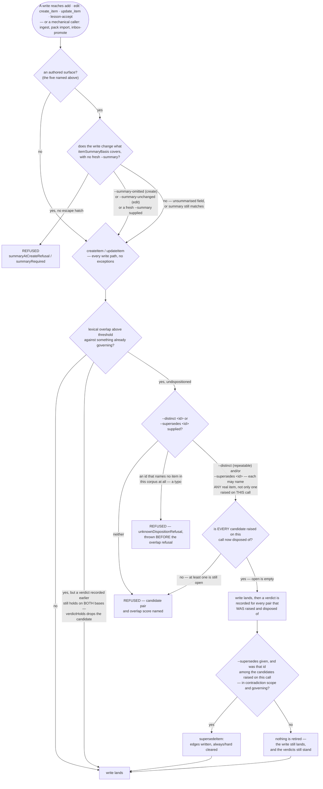

# 3. Creation and the gates

[← Index](./00-index.md) · See also: [1. Items and the corpus](./01-items-and-corpus.md) · [13. Testing discipline](./13-testing-discipline.md)

An item enters the corpus through a small number of **authored surfaces** —
`mycontext add`, `mycontext edit`, the MCP `create_item` / `update_item`
tools, and `mycontext lesson-accept`. Two independent gates sit on those
surfaces and can refuse a write outright. This chapter covers both gates,
the flags that answer them, how content identity is checksummed, how
retirement (supersession) is recorded, and the two commands that audit and
repair the corpus's own bookkeeping: `doctor` and `repair`.

Everything below is read from `src/core/summary-gate.ts`, `src/core/mutate.ts`
(the contradiction gate, from `:416` through `carryVerdicts` at `:575`),
`src/cli/index.ts` (`cmdAdd`, `:808–1299`), `src/cli/commands/edit.ts`
(1,320 lines on 2026-09-17), `src/cli/commands/supersede.ts`,
`src/cli/commands/repair.ts`, `src/core/content-hash.ts`, `src/core/rebuild.ts`,
and `src/doctor/checks.ts`, plus a real `mycontext doctor` run against this
repository's own corpus on 2026-09-12.

## Why gates exist at all

Both gates answer the same worry from two different directions: a normative
item is injected into every session's context and treated as governing, so a
bad write is not a typo somewhere in a file tree — it is a false instruction
an agent will act on. The **summary gate** stops an item from drifting out of
sync with its own one-line description of itself. The **contradiction gate**
stops a second, conflicting instruction from quietly standing beside one
already in force. They are deliberately independent mechanisms living at
different depths of the write path (see "Why two different depths" below) —
neither substitutes for the other.

## The summary gate

**What it is.** Every item may carry a `summary` field — "one plain sentence
saying what this item IS and why it matters, for a reader who does NOT know
this codebase" (`src/core/validate.ts`, `SUMMARY_MAX_CHARS` = 250 chars). The
gate keeps that sentence honest against the content it summarises, at two
moments:

1. **On creation** (`summaryRequiredAtCreate` / `summaryAtCreateRefusal`,
   `summary-gate.ts`) — a normative item cannot be born without a summary,
   unless the omission is explicit.
2. **On edit** (`summaryRequired`, same file) — if the edit would change what
   `itemSummaryBasis` (`content-hash.ts`) considers the item's *meaning*
   (`SUMMARY_BASIS`, e.g. `body`), the new/updated text must arrive with a
   fresh summary in the same call, or the edit is refused.

**Why it exists.** The gate's own header states the origin directly: an
owner ruling — *"everytime body is changed, the summary should too, based on
the new body"* — that nothing in the codebase can enforce by generation
(zero runtime dependencies, no model access: summaries are written by a
person or an agent as ordinary prose). So it is enforced by **refusal at the
one moment the replacement is cheap** — whoever is editing has just read the
item and is holding the new text.

**Why the trigger is derived, not a flag list.** The comment in
`summary-gate.ts` is explicit that an earlier design used a hand-maintained
list of flags that invalidate a summary (`--body`, `--extra`, …), and states
this was "the defect this repository has measured eight times." The current
design instead builds the item *as the edit would leave it* and hashes it
with `itemSummaryBasis`; whatever `SUMMARY_BASIS` classifies as
"summarised" is what can trigger the gate, and that classification lives in
exactly one place.

**Why creation needed its own gate, not just the edit gate.** The same
comment explains a historical hole: `summaryRequired` waived the requirement
whenever `item.summary === null` ("nothing to invalidate"), and `create_item`
documented `summary` as optional — so an item born with no summary could
never afterwards be *required* to get one; the edit gate never triggers on a
field that started empty. Seventeen items reached that state with no
enforced path out. The fix moved the requirement to the one moment the
caller is holding the text and the item does not yet exist:
`summaryRequiredAtCreate`.

**Two escape hatches, one per gate, and they are different flags.** This is the
single easiest thing to get wrong in this chapter, so both are named here:

- **`--summary-omitted`** answers the **creation** gate. Rather than silently
  allowing "no summary," it requires the *absence* to be asserted: stored as
  `summary_omitted: true`, it tells the gate "a person considered this and chose
  not to write one," and it is recorded so that "nobody wrote one" is visible in
  the audit trail rather than assumed. Passing both `--summary` and
  `--summary-omitted` is refused (`summaryOmittedRefusal`) as a contradiction of
  its own. **It is a creation-surface flag only** — `src/cli/index.ts:556` (the
  `add` usage line) and `:951` (where it is read), plus `lesson-accept`. **`mycontext edit` does not
  accept it.**
- **`--summary-unchanged`** answers the **edit** gate, and is the flag a reader
  hitting a refused edit actually needs: `src/cli/commands/edit.ts:93` (usage),
  `:658` (parse), `:973` (`summaryUnchangedRefusal`). On the MCP side the same
  hatch is `summary_unchanged: true` on `update_item`. Passing both `--summary`
  and `--summary-unchanged` is refused in the same shape the creation pair is —
  *"which say that the summary changed and that it did not. There is no reading of
  that which honours both"* (`summary-gate.ts:403–418`).

**A related repair path: re-affirmation.** A summary can go *stale* (fail to
match the current basis) even though it is still correct — for example, a
typo fix in the body that does not change meaning. `mycontext edit --summary
"<the same text>"` used to report "nothing to change" (false: the stamp
needed updating even though no field read differently). `summaryReaffirmed`
opens a third door instead of widening the gate: reproducing the sentence is
allowed as an explicit re-affirmation, which is more expensive to fake than
a silent bypass would be — "the hatch is a flag and a flag can be typed over
a whole corpus without a word being read, while a re-affirmation can only be
spelled by reproducing the sentence." **The hatch that sentence is about is
`--summary-unchanged`**, the edit gate's own — not `--summary-omitted`, which
`edit` does not accept.

**Which callers the gate does and does not see.** It is imported by exactly
five authored surfaces: `mycontext add`, `mycontext edit`, the MCP
`create_item` / `update_item` tools, and `mycontext lesson-accept`. It is
deliberately *not* called from the shared internals `createItem` /
`updateItem`, so mechanical callers with no person at the keyboard —
`ingest`, pack import, `inbox-promote` — are not blocked by a gate meant for
authored prose. `lesson-accept` was added to the list only on 2026-09-12:
until then, accepting a staged rule candidate could create an active,
governing `rule` with no summary and no recorded omission, which doctor's
`summary_absent` check caught the same day it happened
(`TASK-lesson-accept-creates-a-rule-with-no-summary-so-the-accept`).

**What it does not cover.** A hand-edited `.md` file bypasses every command
boundary entirely — Markdown is the source of truth and hand-editing is
permitted. The gate can only *prevent* the case at a command boundary; it
cannot *see* a file edited outside my_context. That is what `doctor`'s
`summary_stale` check (`checkSummary`, `src/doctor/checks.ts`) exists for
instead — see "Doctor" below. The two together — gate to prevent, doctor to
detect — are what closes the hole; neither alone does.

**How to use it.**

```
mycontext add rule "Never bypass the summary gate" --body "..." --summary-omitted
mycontext edit RULE-some-id --body "new text" --summary "One plain sentence about what changed."
mycontext edit RULE-some-id --summary "Same sentence as before, verbatim" # re-affirmation
```

**Use case.** An agent is asked to correct a typo in an existing `constraint`
item's body. Because the fix changes the hashed content, `mycontext edit`
refuses the write until a `--summary` accompanies it — forcing either a
genuine re-summarisation or an explicit re-affirmation, so the corpus never
silently accumulates items whose one-sentence description no longer matches
what they say.

## The contradiction gate

**What it is.** Before any content write lands (`createItem` / `updateItem`
in `src/core/mutate.ts`), every normative candidate item is compared against
every other item already governing, using a **lexical overlap score**
(Jaccard-based; see `contradictionBasis`). If the new content scores above
threshold against something already governing, the write is refused unless
the caller has already *dispositioned* the pair.

**Why it sits one layer deeper than the summary gate — the "two different
depths" referred to above.** The header comment in `mutate.ts` states this
explicitly, citing the owner's ruling (design spec 2026-09-07, §2 §4 §5 §7):
a mechanical caller that would file a second live rule against a standing
one is *exactly* the case this gate exists for, so a caller "must either
carry dispositions decided earlier or fail cleanly naming what to settle,"
and a bypass for internal callers "would defeat §2 entirely." So unlike the
summary gate, the contradiction gate lives inside `createItem` /
`updateItem` themselves — the two functions that are the *only* write paths
for item content — so every route (`add`, `edit`, `create_item`,
`update_item`, `inbox-promote`, `lesson`, `lesson-accept`, `ingest-apply`, a
promoted revision, pack import) passes through it with no way around.
`test/core/contradiction-gate.test.ts` walks the runtime import graph of
every entry point to prove none of them reaches `persist` without going
through the gate.

**The two answers: `--distinct` and `--supersedes`.** When the gate flags a
candidate pair, the caller must disposition it one of two ways:

- `--distinct <id>` — "this capture and that item can BOTH be true" (they are
  not actually in conflict; the overlap was lexical only). Repeatable — a
  single write can raise up to five candidates, and `--distinct` can be
  passed multiple times so dropping the second flagged pair does not
  silently settle only the first while reporting all as settled.
- `--supersedes <id>` — "this item REPLACES that one" (scalar: an item has
  exactly one successor). This both answers the gate and records a
  supersession edge (see below).

Every disposition is appended to
`.my_context/.verdicts/contradiction.jsonl` as a verdict row — recorded
**after** the write lands, never before, so a refusal upstream ("nothing was
written") can never be contradicted by a verdict for a write that failed.

**The gate is lexical, and says so.** Both `mycontext doctor`'s own
contradiction findings and the CLI refusal text state the same limit
explicitly: *"Nothing in this product can tell you whether these conflict:
the match is LEXICAL, and two items that AGREE score exactly as high as two
that conflict."* The gate raises candidates for a human (or an agent acting
on the human's behalf) to rule on; it never rules on meaning itself.

**Verdicts survive an unrelated edit — "no-lapse."** A verdict is keyed to
the content hash of each side (`basis`) at the moment it was ruled. If an
item's content moves in a way that would move its `contradictionBasis`, a
verdict about it would normally lapse (the recorded basis no longer matches
the item). But an edit accompanied by `--summary` re-affirmation, in
particular, does not always change *meaning* — so `carryVerdicts` in
`mutate.ts` re-stamps (not re-rules) every verdict that is still live at
edit time: only pairs whose *other* side is unchanged are carried forward,
`ruledAt` keeps the original ruling date, and the row is marked `carried` so
the log always distinguishes an actual ruling from a re-stamp. Without this,
a typo fix would re-raise every contradiction a person had already settled
— "the wall §7 exists to prevent."

**How to use it — worked example from this repository's live corpus.**
`mycontext doctor` currently reports 6 open `contradiction_pair` findings
(all acknowledged, none superseded). One real example, verbatim from
`doctor --json` on this repository on 2026-09-12:

```
DEC-the-ui-serves-the-corpus-through-its-own-route-rather-than:
  may contradict REQ-a-repository-document-is-viewable-in-the-ui-only-once-it-is
  (requirement · hard), which also governs.
  Overlap 0.49, of which jaccard 0.34 — the lower the jaccard, the more of the
  score is the two items' LENGTHS rather than their subject.

    DEC-...: "The console can now open the project's own knowledge files,
    through a separate door with its own lock, and the rule that said it
    already could is corrected."
    REQ-...: "A document becomes viewable only once it has been brought into
    the collection; sitting somewhere in the project is not enough on its own."

  If both can be true, record it with `mycontext ack DEC-... contradiction_pair`;
  if one replaces the other, `mycontext supersede <the wrong one> --by <the right one>`.
```

Here the two items were judged compatible (both govern; the finding is
acknowledged, not superseded) — the DEC records a design change, the REQ a
standing precondition; they are not actually in conflict.

**Use case.** An agent is asked to add a new `constraint` that happens to
restate, in different words, a `constraint` already governing the same file
paths. `mycontext add` refuses the write and names the existing item's id
and overlap score. A human resolves it: if the new wording only clarifies
the old rule, `--distinct` records that they coexist deliberately; if the
new wording is meant to replace the old one outright, `--supersedes` does
both jobs — answers the gate and starts the item's life as the old one's
successor.

## What refuses a write, and in what order

The two gates above sit at different depths for a reason stated already, and that
difference in depth is also a difference in *order*: the summary gate can only refuse a
write that arrives through one of the five authored surfaces (`add`, `edit`,
`create_item`, `update_item`, `lesson-accept`); the contradiction gate lives inside
`createItem`/`updateItem` themselves, so it also catches the mechanical callers the
summary gate never sees — `ingest`, pack import, `inbox-promote`.



**The rightmost branch, corrected 2026-09-17, and the correction is the whole point of it.**
An earlier revision of this diagram drew `--supersedes <id>` as answering the gate on its own —
*"the gate is answered — write lands"*. It does not. `--supersedes` and each `--distinct` only add
an id to `disposed` (`src/core/overlap.ts:491-492`); a raised candidate leaves the open set only if
it is in `disposed` (`:497`) or already carries a verdict that holds on both bases (`:500-502`); and
the gate returns `allowed: false` while **any** candidate is still open (`:507`). So a
`--supersedes` that names a real item which was not among the raised candidates disposes of nothing
that was raised, and `contradictionCheck` throws `contradictionRefusal` (`src/core/mutate.ts:531`) —
a refusal, not a landing. Its message is written for exactly this case.

Three orderings in the drawing are load-bearing and were read out of the source rather than inferred
from it. A disposition naming an id that exists in **no** status is `stray` (`overlap.ts:506`,
against an `eligible` set built from every project item, `:471-474`), and its refusal is thrown
**before** the overlap refusal (`mutate.ts:529-531`) so a typo is never mistaken for an unanswered
gate. The verdicts are recorded by `recordVerdicts` (`mutate.ts:1200`) **before** the retirement
test and independently of it — which is why the `no` branch records the same verdicts as the `yes`
branch, and why the earlier drawing's "verdict recorded" belonged outside `supersedeItem`, not
inside it. And the retirement itself runs only when the superseded id is in `settled`
(`mutate.ts:1215`), i.e. only when it was raised on this call.

A write that never enters contradiction scope at all (a `draft`, a non-normative
category) skips the rightmost branch entirely and lands once the summary gate — where it
applies — is satisfied.

## Checksums and content identity

**There are three different hashes here, over three different shapes, and
conflating them is the mistake to avoid.**

**1. `computeItemChecksum` (`src/core/item.ts:851`) — the file-integrity hash**,
the one stamped into every item's frontmatter. Its shape is **wider** than the
content shape, and it deliberately **includes** `id`, `status` and `origin`:

```ts
{ id, type, title, status, severity, always, scope, tags, origin, extra, body }
```

plus, **only when present** — `continuity` (when true), `summary` and `summary_of`
(when the item has a summary), `summary_was` (when it has history), `acknowledged`,
`steps` (when non-empty) — then unconditionally `observations` and `relations`.
Every optional key is conditional for one reason, stated three times in the source:
this hash is *recorded in every item's frontmatter*, so an unconditional new key
"would change it for every item in every corpus at once — reddening `doctor`
everywhere and destroying the stale-checksum signal that is the only evidence a
file was altered outside my_context."

**`request` is the only unconditional exclusion**, and the source says so in those
words. Spec §16a required the backfill of 1,076 items to be reversible *"without
touching body, summary or checksum"*, which is true only if the field never enters
the hash in either direction. The cost is stated rather than discovered: **a hand
edit to a `## Request` section leaves no stale checksum behind, so `doctor` will
not report it.**

Note also what this shape does *not* do: `scope` and `tags` are passed through
**unsorted** here (`item.ts:854`). Sorting is `canonicalContent`'s behaviour
(`content-hash.ts:112–113`, `[...v.scope].sort()` and `[...v.tags].sort()`), which is the next
hash, not this one.

**2. `itemSummaryBasis` (`content-hash.ts:544`) — the summary-staleness hash**,
and it is much **narrower**. It hashes only the four fields `SUMMARY_BASIS`
(`:291–304`) marks `summarised` — **`body`, `steps`, `observations`, `extra`** —
and two of those get a narrower cut still: `summarisedExtra` drops
`WORKFLOW_EXTRA_KEYS` (tracking rather than content) and `summarisedObservations`
drops the lifecycle categories (what happened *to* the item rather than what it
says). `type`, `title`, `severity`, `always`, `continuity`, `scope`, `tags` and
`relations` are all marked `unsummarised` and do **not** move a summary's basis.
This is what makes the "derived, not a flag list" design in the summary gate above
work: the classification lives in exactly one table.

It runs over `canonicalContent`, which is where `scope` and `tags` **are** sorted,
and where ordered collections (`steps`, `observations`, `relations`) preserve
command-line order because, for a `procedure`, "the order IS the knowledge."

**3. `contradictionBasis` — and it is not in `content-hash.ts`.** It lives at
`src/core/verdict-store.ts:59` and is a one-line delegation, not an independent
hash:

```ts
return item.summaryOf ?? itemSummaryBasis(item);
```

So a verdict is anchored to the item's recorded summary basis when it has one, and
recomputed from content when it does not — with the consequence the source states
out loud: on an item with no summary the verdict lapses on *any* content edit,
including a mechanical one, "because there is no summary for `--summary-unchanged`
to leave standing and so nothing to carry forward."

**When it's checked.** Every write path stamps a checksum
(`writeItem`). On every index rebuild, `loadLayer` (`src/core/rebuild.ts`,
~L200–230) recomputes each item's checksum from its file and compares it to
the recorded value. A mismatch produces one of two distinguishable
`LoadError`s:

- **`kind: 'migration'`** — the recorded checksum was computed under an
  older `CHECKSUM_BASIS_VERSION`; the content is not implicated and the
  disagreement is expected until re-stamped. Reported by `doctor` as
  `checksum_basis_migration` (warn), with remedy = run `mycontext repair`.
- **Real mismatch** — the file's content no longer matches its recorded
  checksum: an edit outside my_context, or content my_context itself could
  not round-trip. Reported as a corpus load error (drives `doctor`'s
  non-zero exit code).

An item with **no** recorded checksum (hand-authored, or written before the
field existed) has nothing to compare against and is silently exempt from
this check — see `repair` below for why that matters.

**`mycontext repair [--yes]`.** Re-stamps the checksum of every *project*-layer
item whose recorded checksum disagrees with a fresh hash of its current
content (`needsRestamp`, `repair.ts`). It explicitly **does not** touch
global-layer items with the same disagreement (`skippedGlobal` — writes to
non-project items are refused elsewhere), and it explicitly **does not**
touch items with no recorded checksum at all — re-stamping one would rewrite
a file nobody complained about, and (per the command's own printed warning,
`HONESTY` in `repair.ts`) "a hand-authored file is exactly where a rewrite
… is most likely to reorder or drop something the author put there."

The command prints an explicit honesty statement before its confirmation
prompt, worth quoting because it states the tool's own limits plainly:

> "What re-stamping does: it recomputes each item's checksum from the text
> now in its file, so the recorded checksum agrees with the content again…
> What it does NOT do: recover anything. If content was lost or mangled
> when the item was written, that loss is already on disk — re-stamping
> certifies the damaged text and removes the stale checksum, which may be
> the only remaining evidence that the file was ever altered."

The comment cites a real incident from this repository's own corpus: one
item (`OPENQ-how-do-filters-respect-dependencies`) had an observation
silently truncated by a parsing defect at write time; the file was
internally self-consistent, and the *only* evidence anything had been
altered was the stale checksum. Running `repair` on it would have
re-stamped that evidence away; instead it was fixed by rewriting the
observation directly and re-persisting it — a different act from what
`repair` performs.

**Verified against this repository's corpus, 2026-09-12:** a real
`mycontext doctor --json` run reports **zero `checksum_basis_migration`**
findings — this corpus is clean on that count. (It does report two
`source_drift` findings, which is a different, unrelated check — see below.)
`repair` was **not run** for this document, since it is a state-changing
command and there is nothing for it to fix right now.

**`checksum_mismatch` is not a finding code**, and an earlier draft of this
paragraph reported zero of them as though it were. The only checksum-related
`code:` literal in `src/doctor/checks.ts` is `checksum_basis_migration`
(`:470`). A **real** same-basis mismatch does not surface as a coded finding
at all — it is a `LoadError` from `rebuild.ts:269–276`, which drives `doctor`'s
non-zero exit code, exactly as the two-outcome list above already says. A
reader hunting for `checksum_mismatch` in `--json` output, or trying to
`mycontext ack <id> checksum_mismatch` it, will find nothing.

## Supersession edges

**What it is.** `mycontext supersede <retired-id> --by <replacement-id>
[--reason <text>] [--yes]` retires an item in favour of a named replacement,
recording the relationship in both directions. Per its own header comment,
this command exists to close a real gap: before it, retiring an item had "no
human route at all" — `supersedeItem` existed as a function but its only
caller was the `supersede_item` MCP tool, which correctly refuses when a
non-human origin tries to retire a governing normative item (that is a human
decision) — leaving the human with no command of their own. The only
remaining route was hand-editing the file and running `repair --yes`, which
the project's own documentation calls out as "leaving no evidence it
happened."

The contradiction gate's `--supersedes` flag on `add`/`edit` reaches the
**same shared function**, `supersedeItem` — but it is the function, not the
command, and it fires only under two conditions this chapter should not leave
implicit:

1. The write must be **in contradiction scope and governing**:
   `const gated = inContradictionScope(draft.type, draft.always) &&
   GOVERNING_STATUS[status]` (`src/core/mutate.ts:1028`). On an ungated write,
   `--supersedes` records nothing.
2. The id named by `--supersedes` must actually have been **raised as a
   candidate** by the gate: `settled.some((c) => c.id === draft.supersedes)`
   (`:1215` on create, `:2102` on edit). Naming an id the gate never surfaced
   records no edge at all.

Both call sites carry the retirement's own message forward rather than
discarding it, and the source says why that hole mattered: the gated path
"retired an item, stood it down and wrote two relation edges, and the only
thing printed was `created <id>`."

**Three refusals around retirement, all of them new on 2026-09-13
(`86a0c840`), and each closes a way to half-undo a supersession:**

- **`unsupersedeRefusal`** (`src/core/relations.ts:320`) — `mycontext edit
  <superseded id> --status <anything>` is now **refused**. It previously
  flipped two of the supersession's four facts and exited 0. The four facts are
  `status: superseded` and `valid_until` on the retired item, `superseded_by`
  on it, and `supersedes` on the successor; changing the first two leaves "a
  governing item carrying a past `valid_until`, pointing at its own
  replacement, with the replacement still claiming to have replaced it." The
  same refusal exists on the MCP side for `update_item`.
- **`retirementEdgeRefusal`** (`:264`) — `supersedes` and `superseded_by`
  cannot be removed as relations. Its remedy was **rewritten** in the same
  commit, away from `edit <id> --status active` and toward retiring the
  successor in turn: *"retire the SUCCESSOR — `mycontext supersede <successor
  id> --by <what stands now>` — which records the second act as well as the
  first."* The governing item is
  `RULE-a-supersession-is-unwound-by-superseding-the-successor-back`.
- **`existingSuccessorRefusal`** (`supersede.ts:114`, and twice in
  `mutate.ts`) — an item that already has a successor cannot quietly acquire a
  second one.

**The stand-down.** `supersedeItem` does more than write edges: it **clears
`always` and drops a `hard` severity** in the same act (`standDownFields`,
`src/cli/commands/supersede.ts:133–150`). The preview prints it before the
confirmation, using the same predicate the write and `doctor` both ask, "so
the preview cannot promise a clearing the write does not perform", and the
change is recorded as an observation on the item rather than cleared silently.
A person who pinned the item is entitled to learn that from the approval
rather than from a diff afterwards.

**What it prints before acting.** `testsRestingOn`/`restingTestsLine`
(`src/core/tests-resting-on.ts`) is consulted so the operator is told, before
confirming, which tests declare that they rest on the item being retired —
tying this command directly to `RULE-a-test-names-the-items-it-rests-on-or-says-it-rests-on-none`
(see chapter 13). A supersession that silently orphaned a test's stated
basis would be exactly the defect that rule exists to prevent.

**How to use it.**

```
mycontext supersede DEC-old-approach --by DEC-new-approach --reason "measured wrong on 2026-09-07"
```

**Use case.** An ADR is revisited and reversed. Rather than editing the old
ADR's text in place (which would erase the historical record of what was
once decided and why), `supersede` retires it and links it forward to the
new decision — both items remain readable, and any test that cited the old
one is surfaced for review at the moment of retirement.

## Doctor

**What it is.** `mycontext doctor [--quiet] [--full|--short|--summary]
[--json]` is the corpus's self-check: index freshness, orphaned files,
source drift, dead scope globs, contradiction candidates, checksum health,
and more — implemented as a fixed battery of checks (`runChecks`,
`src/doctor/checks.ts`) plus the checksum-migration pass described above.

**Real output, this repository, 2026-09-12** (`mycontext doctor --summary`):

```
my_context doctor: 1 error(s), 55 warning(s), 49 note(s) across 105 finding(s).
my_context: 47 of the finding(s) above are ACKNOWLEDGED: a person read each one and ruled on it.
  They are still reported and still counted in the numbers above — acknowledging a finding
  distinguishes it, it does not silence it, and editing the item lapses the
  acknowledgement so the finding is open again. `mycontext ack <id> --list` shows the
  state per item.
```

The one `error`-level finding, from the same run, is a missing source file
for a `reference`-category item's snapshot:

```
source_missing (1)  [error]
  TASK-the-guard-that-excludes-lanes-from-reaping-the-server-rests: source document
  "C:/Program Files/Git/reap-body.md" could not be read (missing, unreadable, or
  outside the repository). ... still holds the snapshot taken when it was captured,
  and that text is unchanged — what cannot be checked is whether it is still current.
  Restore the file, or retire ... with `mycontext supersede`.
```

The finding codes present in this run, by count (`doctor --json`, grouped,
2026-09-12 — a snapshot, and it predates `laundered_enum`, which `44b3623b`
registered the next day):
`task_unverified` (50), `body_disagrees_with_meta` (24), `state_unaudited`
(7), `contradiction_pair` (6), `citation_form` (5), `open_question_blocks`
(5), `reference_no_source` (3), `source_drift` (2), `body_ends_unfinished`
(1), `source_missing` (1), `tag_projection_unprojected` (1).

**Acknowledgement, not silencing.** `mycontext ack <id> <code> [--clear]`
records that a person has ruled on a finding, anchored to the item's content
*as it stands* — editing the item afterwards lapses the acknowledgement, so
the finding reopens. Doctor's own summary output states this design choice
explicitly rather than leaving it implicit: an acknowledged finding is still
printed and still counted, "acknowledging a finding distinguishes it, it
does not silence it."

### The finding-code vocabulary — all 61

`<code>` above is not free text: it is one of the `code:` literals `runChecks`
emits, and without the list a reader who wants to rule on a finding has nothing
to type. Enumerated from `src/doctor/checks.ts` and `src/doctor/shared-tail.ts`
on **2026-09-13**, with the level each is raised at. Eleven of these appear in
the live run above; the other fifty are simply not firing on this corpus today.

**error (10)** — these are what drive a non-zero exit:
`body_truncation`, `check_failed`, `cli_path_mismatch`, `continuity_overflow`,
`index_unreadable`, `laundered_enum`, `not_writable`, `session_id_mismatch`,
`source_missing`, `tag_projection_drift`.

**warn (27):**
`assumption_overdue`, `blocked_needs_met`, `blocked_without_needs`,
`checksum_basis_migration`, `citation_marker`, `cli_not_on_path`,
`config_key_skipped`, `continuity_inert`, `corpus_size_fallback_ceiling`,
`dead_scope`, `index_not_ignored`, `index_stale`, `needs_malformed`,
`orphan_relation`, `reference_no_source`, `retired_still_binding`,
`source_anchor_missing`, `source_drift`, `summary_absent`, `summary_stale`,
`summary_too_long`, `summary_unanchored`, `task_unverified`,
`tutorial_roster_unreadable`, `tutorial_unlisted`, `unknown_category`,
`watched_doc_unserved`.

**info (24):**
`assumption_overdue_coverage`, `audit_log_size`, `body_disagrees_with_meta`,
`body_ends_unfinished`, `body_review_limits`, `citation_form`,
`citation_form_excused`, `cli_lookup_failed`, `cli_path_unverifiable`,
`contradiction_drain_limits`, `contradiction_pair`, `foreign_store`,
`governing_spill_pressure`, `index_missing`, `needs_unresolved`,
`nested_corpus`, `open_question_blocks`, `scope_policy_inert`,
`scope_policy_required`, `state_audit_coverage`, `state_unaudited`,
`tag_projection_unprojected`, `task_verification_coverage`,
`watched_doc_coverage`.

(10 + 27 + 24 = **61**, and the three lists are exhaustive as of the date above.)

Three of these are worth pointing at, because each is the only documentation of
a feature elsewhere in this reference:

- **`laundered_enum`** (error) — a frontmatter `status`/`severity`/`origin`
  outside its vocabulary. See the read boundary in
  [`./01-items-and-corpus.md`](./01-items-and-corpus.md). Its remedy for the two
  fixable fields is a copy-ready
  `mycontext edit <id> --status|--severity <value> --yes`.
- **`watched_doc_coverage` / `watched_doc_unserved`** — the only trace in this
  reference of the `watchedDocs` config key, an otherwise undocumented feature.
- **`config_key_skipped`** — pairs with `Config.skippedKeys`; see
  [`./02-injection.md`](./02-injection.md) on why `budgets` refuses an unknown
  key while other sections record and skip.

**Use case.** Run `mycontext doctor` after a batch of edits (by a human or
an agent) to catch drift before it compounds: a checksum that has fallen
behind a source file, an item whose body now contradicts its own frontmatter
status, a new item that lexically overlaps something already governing and
was never dispositioned.

## What's NOT built / built but off

- **No automatic contradiction resolution.** The gate can only detect
  lexical overlap and ask a human to rule; it explicitly cannot judge
  meaning — this is stated in the tool's own refusal text, not merely
  inferred here.
- **The summary gate cannot see hand-edited Markdown.** It only fires at
  the authored command/tool surfaces; a summary made stale by editing a
  `.md` file directly is caught only after the fact, by `doctor`'s
  `summary_stale` check — the gate prevents, doctor detects, and neither
  alone closes the gap (stated directly in `summary-gate.ts`'s own
  comments).
- **`repair` does not recover lost content** — it only re-stamps a checksum
  to match what is currently on disk, and says so before it runs, with a
  cited historical incident where doing so would have destroyed the only
  evidence of a defect.
- **No verdict expiry beyond the no-lapse mechanism** — a contradiction
  verdict is carried forward across edits that don't change meaning, but
  there is no separate TTL/expiry on a verdict the way `exception` items
  carry an `until` date.
- **The workflow-gate layer is not described here.** `test/scripts/workflow-gates.test.ts`
  asserts that gates are *reached* rather than merely correct; it is chapter 13's
  subject and is covered there.
- **Not described here, and each is a real surface:** `repair`'s loss holdback
  (`repair.ts:81–91`); `preflightSupersede` / `supersedeQuestion`
  (`mutate.ts:713` and `:690`, called at `:1036` on create and `:1901` on edit),
  which are what put the retirement question to a
  person before an id has been minted; and the `--json` failure envelope
  (`src/cli/json-envelope.ts`) — see below.

## The `--json` failure envelope

This chapter quotes `doctor --json` output above, and until 2026-09-13 nothing
in this reference said what a **failing** `--json` run emits. What it used to
emit was measured: `mycontext query --json --nosuchflag` put **380 bytes of
plain English prose on stdout** and exited 1 — worse than empty, because a
consumer that parses what it asked for gets a `SyntaxError` at character 0 with
the real reason sitting inside the string that broke the parser.

Since `86a0c840`, `src/cli/json-envelope.ts` emits a JSON envelope instead.
Four properties, each decided rather than assumed:

- **stdout, not stderr.** `runCli` has exactly one emit and no stderr channel
  beneath it; more to the point, moving the prose would leave stdout *empty* on
  failure, which is the original complaint. **The exit code is what separates
  success from failure and it is untouched** — "this makes the channel honest,
  not the failure quiet."
- **Which commands is derived, never listed.** `jsonEnvelopeFor` reads
  `COMMAND_FLAGS` and `SUBCOMMAND_FLAGS`, the same tables `refuseUnknownFlag`
  uses, so a command that gains `--json` gains the envelope in the same edit.
  The three `FLAGLESS_COMMANDS` — `show` among them — are not given a JSON
  contract they do not honour on success.
- **A non-zero run whose output already parses as JSON is passed through
  untouched.** `doctor --json` exits non-zero when it finds errors and its body
  is a perfectly good report; wrapping that would replace a machine-readable
  answer with a machine-readable complaint. So the `doctor --json` output quoted
  above is unaffected.
- **The envelope carries** `command`, `subcommand`, `exit`, `argv` and
  `message` — the verbatim sentence the human form prints, newlines and all.
  The human form is unchanged, because the envelope is only reached when
  `--json` was actually typed.

This matters to every `--json` consumer in this reference, including chapter 9's
and chapter 12's.

## What I could not fully verify

`edit.ts` is 1,320 lines (2026-09-17) and shares much of the same flag-parsing and gate
logic as `cmdAdd` in `src/cli/index.ts`; I traced the summary-gate and
contradiction-gate call sites there but did not exhaustively trace every one
of `edit.ts`'s ~30 flags. I did not run `add`, `edit`, or `repair` for real
against this corpus (all three are state-changing), so the gate-triggering
and repair behaviour above is verified from source and from `doctor`'s
existing findings, not from a live end-to-end capture.
