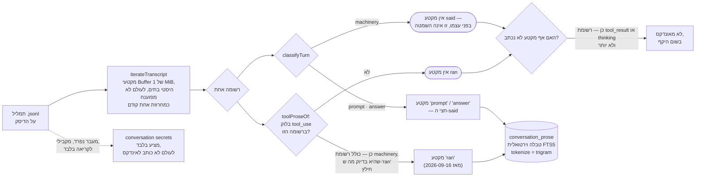

<!--
  Hebrew mirror of `docs/capabilities/04-conversation-archive.md`. The English
  file is the source. Conventions: `docs/README.he.md` and
  `docs/the-store.he.md` — Hebrew prose and tables inside `<div dir="rtl">`,
  fenced blocks outside it, `<span dir="ltr">` around any Latin run whose edge
  characters are not both alphanumeric and around any run of two or more Latin
  terms joined by commas or slashes.

  Every pasted block below — the `conversation list` row, the `subagents` row,
  the tokenizer comparison table, the FTS5 schema, the `secrets --json`
  fragment — is byte-identical to the English file, with its elisions marked
  exactly as the English marks them. The owner's own words in "Secrets" are
  kept in English, misspellings and all, because the sentence introducing them
  says in so many words that a verbatim quotation is evidence here.

  Mermaid labels are translated; the graph structure is the English one.
  Heading sequence must stay identical to the English file.
-->

# 4. ארכיון השיחות

<div dir="rtl">

<span dir="ltr">`docs/capabilities/00-index.he.md`</span> · הקודם:
[<span dir="ltr">`03-creation-and-gates.he.md`</span>](./03-creation-and-gates.he.md) · הבא:
[<span dir="ltr">`05-anchors.he.md`</span>](./05-anchors.he.md)

## מה זה, ולמה זה קיים

כל סשן של Claude Code וכל נתיב תת-סוכן כותב תמליל JSONL לדיסק תחת
<span dir="ltr">`~/.claude/projects/<encoded-cwd>/`</span>. my_context מתייחסת לתמלילים האלה
כקורפוס שני, לצד פריטי ה-Markdown: היא סורקת אותם, שומרת שורות סיכום קלות לכל סשן ותת-סוכן,
ובונה אינדקס טקסט מלא מעל ה*פרוזה* שבתוכם — המילים שאדם או המודל באמת כתבו, ולא מכונת קריאות
הכלים שסביבן. זהו "ארכיון השיחות":
<span dir="ltr">`REQ-the-conversation-archive-is-a-terminal-you-can-scroll-not-a`</span> קובע את
התקן שהוא נמדד בו — טרמינל שהבעלים יכול לגלול ולחפש בו, לא קופסה שחורה שהוא צריך לעשות לה
<span dir="ltr">`grep`</span> ביד.

הסיבה שזה שווה תת-מערכת שלמה ולא "חפשו בקבצים עם <span dir="ltr">`grep`</span>": הארכיון הוא
עברית מוקדם מאוד — "עברית מרשומה 5", <span dir="ltr">`src/core/conversation-index.ts:333`</span>
— הוא עצום (סשן חי אחד כאן נמדד ב-**106,591,470 בתים / 43,854 רשומות ב-2026-09-11**, וסשן חי
רק גדל: אותו <span dir="ltr">`sessionId`</span> עבר את 112 MB ו-45,900 רשומות יומיים אחר כך,
אז התייחסו לכל נתון בבלוקים החיים של הפרק הזה כאל קריאה מתוארכת ולא כאל מצב עדכני), ורוב כל
תמליל הוא מכונת כלים, לא פרוזה ששווה לחפש בה. לעשות את זה בתמימות — לפענח ואז לפצל, מפצל
לפי גבולות מילה, היסטי תווים — שגוי בדרכים שכל אחת מהן נמדדה בנפרד במקור ומתוארת למטה.

## אינדוקס: מה נסרק, ומאיפה

<span dir="ltr">`mycontext conversation rebuild`</span> הולך על כל קובץ תמליל בתיקיית הפרויקט
של Claude Code של סביבת העבודה. הרצת <span dir="ltr">`conversation list --json`</span> במאגר
הזה הראתה את הצורה האמיתית של שורה אחת (2026-09-11):

</div>

```
sessionId   : 595db3b1-a481-4553-b4c0-7248c31b2655
source      : live
file        : C:\Users\UserC\.claude\projects\D--Users-UserC-source-repos-my-context\
              595db3b1-a481-4553-b4c0-7248c31b2655.jsonl
bytes       : 106591470          scannedBytes: 106591470
prompts     : 825   answers: 2875   machinery: 40154   records: 43854   unreadable: 0
branch      : master   cwd: D:\Users\UserC\source\repos\my-context
title       : "MyContext V2.0"   titleSource: custom
```

<div dir="rtl">

כל רשומה מסווגת על ידי <span dir="ltr">`classifyTurn`</span>
(<span dir="ltr">`src/core/conversation-index.ts:1658`</span>) ל-<span dir="ltr">`prompt`</span>,
<span dir="ltr">`answer`</span>, או <span dir="ltr">`machinery`</span> — אותן שלוש־עשרה שורות
שהספירות של מסך הרשימה עצמו נשענות עליהן, בשימוש חוזר ולא ממומשות מחדש כך ש"מה נחשב רעש" לא
יוכל להיות שני דברים שונים בשני מסכים. נמדד על סביבת העבודה הזו ב-2026-09-11, על פני 2 סשנים
ו-298 תמלילי נתיבים: **856,905,563 בתים של תמלילים על הדיסק, 162,611 רשומות, ורק 8,402,679
בתים (7,750 מקטעים, 0.98%) היו פרוזה** — וזו הסיבה שאינדוקס טקסט מלא של הארכיון לא היה בעיית
ביצועים כאן.

**הנתון הזה מתוארך, והוא שינה צורה ב-2026-09-16, לא רק גודל.** עד אותו יום אינדקס הפרוזה
החזיק בדיוק שני סוגי מקטעים, <span dir="ltr">`prompt`</span> ו-<span dir="ltr">`answer`</span>
— "מה שנאמר" — וכל מה ש-<span dir="ltr">`classifyTurn`</span> קורא לו
<span dir="ltr">`machinery`</span> (קריאות לכלים, התוצאות שלהן, וה-<span dir="ltr">`thinking`</span>
של המודל עצמו) היה מחוץ לכל אינדקס, בכל היקף. סוג שלישי,
<span dir="ltr">`'ran'`</span>, מאנדקס עכשיו בלוקי <span dir="ltr">`tool_use`</span> — שם של
כלי והארגומנטים שלו, מרונדרים כשורות <span dir="ltr">`key: value`</span> ותחומים ב-2,000 תווים
לארגומנט — לצד השניים שתמיד היו שם. נמדד מחדש על הארכיון האמיתי של סביבת העבודה הזו ב-
**2026-09-16**, על פני 474 התמלילים ו-1,269,256,560 הבתים שהחזיקה באותו יום — מדידה חד-פעמית
של ה**הרחבה**, לא ספירה מתמשכת, והארכיון גדל מאז:
**13.58 מיליון תווים ברי-חיפוש הורחבו ל-43.87 מיליון, פי 3.2**,
והקורא בוחר עכשיו <span dir="ltr">`said`</span> (ברירת המחדל — <span dir="ltr">`prompt`</span>
+ <span dir="ltr">`answer`</span>, ללא שינוי מלפני התאריך הזה), <span dir="ltr">`ran`</span>
(הסוג החדש), או <span dir="ltr">`both`</span>. <span dir="ltr">`tool_result`</span> ו-
<span dir="ltr">`thinking`</span> (16.4% מהתווים של הארכיון בפני עצמו) נותרים לא מאונדקסים
לחלוטין, בכל היקף, וכל תשובת חיפוש אומרת זאת. החלק של <span dir="ltr">`tool_result`</span>
עצמו — נתון נפרד מ-16.4% של <span dir="ltr">`thinking`</span> — נאמר בשתי דרכים שונות על ידי
המקור של המוצר עצמו; ראו את ההערה מיד למטה.

**המקור של המוצר עצמו סותר את עצמו לגבי החלק של <span dir="ltr">`tool_result`</span>,
והסימוכין הזה הולך אחרי הנתון עם המקור המדויק יותר ולא בוחר אחד בשקט.** ה-docblock של
<span dir="ltr">`tool_result`</span> ב-<span dir="ltr">`conversation-index.ts`</span> (בסביבות
שורה 316) קובע אותו כ-**78.9%**, נקבע בלי שום סקריפט מצוטט.
<span dir="ltr">`conversation-search.ts`</span> (בסביבות שורה 78) קובע **67.0%**, שנמדד במפורש
על ידי <span dir="ltr">`scripts/measure-tool-indexing.ts`</span> מול הארכיון של סביבת העבודה
הזו ב-2026-09-16 ושוחזר ב-<span dir="ltr">`reports/2026-09-16-indexing-what-was-done.md`</span>
§2 עם פירוט התווים המלא לפי סוג בלוק. הפרק הזה ופרק 14 שניהם משתמשים ב-**67.0%**, כי זה הנתון
עם מדידה שניתן להריץ מחדש מאחוריו; ה-<span dir="ltr">`78.9%`</span> של
<span dir="ltr">`conversation-index.ts`</span> נראה כהערכה מוקדמת או רופפת יותר שמעולם לא
יושבה עם המאוחרת והמדויקת. זו חוסר עקביות אמיתית בתוך הערות המקור של המוצר עצמו, לא שגיאת
העתקה בסימוכין הזה — מסומנת כאן ולא נפתרת בשקט, כי בחירת צד בלי לומר זאת הייתה בדיוק סוג
התיקון השקט שהסימוכין הזה קיים כדי לסרב לו.

[פרק 14 — חיפוש מעל הארכיון](./14-search-over-the-archive.he.md) הוא כל המנגנון; הפרק הזה
שומר את סיפור האינדוקס/הסיווג ומעביר לו את דקדוק השאילתה.

תמלילי תת-סוכן ("נתיב") חיים רמה אחת למטה, תחת תיקיית <span dir="ltr">`subagents/`</span>
שממופתחת לפי מזהה הסשן. <span dir="ltr">`conversation subagents --json`</span> מחזיר שורה אחת
לכל נתיב, למשל:

</div>

```
agentId       : agent-ac161bdaba91e2d0e
sessionId     : 595db3b1-a481-4553-b4c0-7248c31b2655
parentAgentId : null          dispatchedBy: null
toolUseId     : toolu_01W2vcXcMWqfD3A5gKeixF6W
agentType     : general-purpose
description   : "A5 retire ready parity excuse"
spawnDepth    : 1   isFork: false
file          : ...\subagents\agent-ac161bdaba91e2d0e.jsonl
prompts: 1   answers: 2   machinery: 101   records: 104
```

<div dir="rtl">

<span dir="ltr">`agent_id`</span> הוא <span dir="ltr">`NULL`</span> עבור התמליל של הסשן עצמו
ונוקב בנתיב אחרת, כי הארכיון הוא בעיקר נתיבים בסביבות עבודה אמיתיות — 298 תמלילי נתיבים מול
2 תמלילי סשנים, נמדד על המכונה הזו. <span dir="ltr">`dispatched_by`</span> מתפענח מול
<span dir="ltr">`agent_id`</span> (הנתיב ההורה ששיגר אותו) ונושא אינדקס משלו
(<span dir="ltr">`idx_subagents_dispatched`</span>) בדיוק כדי ש-self-join עבור "כל מה שהנתיב
הזה שיגר" יהיה מאונדקס ולא סריקת טבלה.

**מה "rebuild" עולה.** הבנייה מחדש היא הליכה חד-פעמית, לא פר-תור: טבלת
<span dir="ltr">`prose_sources`</span> שומרת מפתח טריות <span dir="ltr">`(bytes, mtime_ms)`</span>
לכל תמליל, ולכן ה-hook <span dir="ltr">`Stop`</span> — שמריץ
<span dir="ltr">`conversation rebuild`</span> בסוף כל תור של העוזר — קורא מחדש רק את ה*זנב*
של תמליל, באותה דרך שהסריקה של הארכיון עצמו עושה.

## חיפוש: FTS5 עם המפצל <span dir="ltr">`trigram`</span>, וזה לא עולה כלום

כל מה שלמעלה — ההליכה, הסיווג, בדיקת הטריות — מזין צינור אחד מתמליל על הדיסק לשורה ברת-חיפוש:

</div>



<div dir="rtl">

<span dir="ltr">`classifyTurn`</span> עצמו מחזיר בדיוק
<span dir="ltr">`prompt | answer | machinery`</span> — <span dir="ltr">`'ran'`</span> אינו אחת
מהתוצאות שלו. הוא מרונדר בנפרד על ידי <span dir="ltr">`toolProseOf`</span>
(<span dir="ltr">`conversation-search.ts:362`</span>), שקורא את בלוק ה-
<span dir="ltr">`tool_use`</span> של רשומה באופן בלתי תלוי בפסק של
<span dir="ltr">`classifyTurn`</span> על אותה רשומה — הדיאגרמה מציירת את זה כענף אח ולא כחץ
רביעי היוצא מ-<span dir="ltr">`classifyTurn`</span> בדיוק מהסיבה הזו. שני הענפים אינם מוציאים
זה את זה: רשומת עוזר שגם אומרת משהו וגם קוראת לכלי מייצרת **שני מקטעים באותו
<span dir="ltr">`byte_offset`</span>** — אחד <span dir="ltr">`'answer'`</span>, אחד
<span dir="ltr">`'ran'`</span> — "שתי קריאות של רשומה אחת", במילות המקור עצמו, וזו הסיבה
שחיפוש פגיעה שממופתח על מיקום בלבד היה מקפל את הזוג בשקט.

**אף אחד מהענפים אינו מגיע ל"לא מאונדקס" בפני עצמו, וגרסה מוקדמת יותר של הדיאגרמה הזו ציירה
את שניהם עושים זאת.** <span dir="ltr">`proseFrom`</span> קורא ל-<span dir="ltr">`put`</span>
פעמיים לכל רשומה (<span dir="ltr">`conversation-search.ts:605`</span> ו-
<span dir="ltr">`:613`</span>) ו-<span dir="ltr">`put`</span> כותב מקטע בכל פעם שהטקסט שלו אינו
ריק (<span dir="ltr">`:587-588`</span>). ולכן רשומת <span dir="ltr">`machinery`</span> שנושאת
בלוק <span dir="ltr">`tool_use`</span> **כן** מאונדקסת, ב-<span dir="ltr">`'ran'`</span> —
המקור אומר זאת במילים האלה ב-<span dir="ltr">`:606-612`</span>, *"הרשומה ש-
<span dir="ltr">`classifyTurn`</span> קורא לה <span dir="ltr">`machinery`</span> היא בדיוק זו
שהאינדקס הזה נהג להשמיט על הרצפה"* — ורשומת <span dir="ltr">`prompt`</span> או
<span dir="ltr">`answer`</span> בלי בלוק <span dir="ltr">`tool_use`</span> **כן** מאונדקסת,
בסוג שלה עצמה. רשומה מגיעה ל"לא מאונדקס, בשום היקף" רק כש**שתי** הקריאות ל-
<span dir="ltr">`put`</span> לא מוצאות דבר, וזה מה ש-<span dir="ltr">`UNINDEXED_BLOCKS`</span>
(<span dir="ltr">`:88`</span>, <span dir="ltr">`['tool_result', 'thinking']`</span>) נוקב בו:
רשומה שהתוכן שלה הוא רק הבלוקים האלה אין לה בלוק <span dir="ltr">`text`</span> עבור
<span dir="ltr">`proseOf`</span> (<span dir="ltr">`:281-295`</span>) ואין לה בלוק
<span dir="ltr">`tool_use`</span> עבור <span dir="ltr">`toolProseOf`</span>
(<span dir="ltr">`:362-385`</span>).

<span dir="ltr">`conversation_prose`</span> הוא מה שהשאילתה התלת-שכבתית של פרק 14 קוראת; הוא
גם אחת הטבלאות ש-<span dir="ltr">`conversation forget`</span> **אינו** מוחק
(<span dir="ltr">`conversations`</span>, <span dir="ltr">`subagents`</span>,
<span dir="ltr">`persisted`</span> ו-<span dir="ltr">`named`</span> הן הארבע שהוא מנקה —
אינדקס הפרוזה, טבלת הטריות שלו, ו-<span dir="ltr">`.anchors.jsonl`</span>/הטבלה הנגזרת ממנו
כולם שורדים forget).

אינדקס הטקסט המלא הוא טבלה וירטואלית <span dir="ltr">`FTS5`</span> אמיתית של SQLite:

</div>

```sql
CREATE VIRTUAL TABLE IF NOT EXISTS conversation_prose USING fts5(
  source_key   UNINDEXED,
  session_id   UNINDEXED,
  agent_id     UNINDEXED,
  record_index UNINDEXED,
  byte_offset  UNINDEXED,
  kind         UNINDEXED,
  at           UNINDEXED,
  text,
  tokenize = 'trigram'
);
```

<div dir="rtl">

(<span dir="ltr">`src/core/conversation-index.ts:473–483`</span>). Node 24 מגיע עם SQLite
3.51.2 עם <span dir="ltr">`ENABLE_FTS5`</span>, <span dir="ltr">`bm25()`</span>, המפצלים porter
**וגם** trigram מובנים, ו-<span dir="ltr">`node:sqlite`</span> כבר יובא ב-16 קבצים (נספר מחדש
2026-09-16: <span dir="ltr">`grep -rl node:sqlite src/`</span>) — ולכן חיפוש טקסט מלא מעל
הארכיון הוא <span dir="ltr">`CREATE VIRTUAL TABLE`</span> ולא יותר, וזה מה שמאפשר לו להתקיים
תחת <span dir="ltr">`CONST-zero-runtime-dependencies`</span> ו-
<span dir="ltr">`CONST-node-24-no-build-step`</span> בלי להוסיף תלות או שלב בנייה.

**בחירת המפצל מכוונת, והיא מדודה, לא מונחת.** הבחירה המתבקשת לחיפוש פרוזה היא
<span dir="ltr">`unicode61`</span>, מפצל לפי גבולות מילה. הוא שגוי לארכיון הזה כי הארכיון הוא
חצי עברית, ו**העברית מדביקה את אותיות השימוש בנות האות האחת לחזית המילה**: מילות היחס "ב",
"ל", "ה" ו"ו" נצמדות ישירות לשם העצם שאחריהן בלי רווח — ולכן שאילתה למילת הבסיס (למשל
<span dir="ltr">`שורה`</span>) היא **תת-מחרוזת** של הצורה שהתמליל באמת מחזיק
(<span dir="ltr">`השורה`</span>), לעולם לא האסימון כולו. מפצל לפי גבולות מילה מתייחס ל-
<span dir="ltr">`השורה`</span> כאסימון אחד בלתי מתחלק ושאילתה ל-<span dir="ltr">`שורה`</span>
לבדה לעולם לא תואמת אותו; מפצל תת-מחרוזת/trigram, שמאנדקס כל רצף של שלושה תווים עוקבים, תואם
אותו בלי קשר למה שהודבק לחזית. נמדד על הקורפוס האמיתי, 2026-09-11:

</div>

```
query   inside      unicode61   trigram
שורה    השורה               3        11
תוך     מתוך                0        14
שרה     עשרה                0         8
anchors                    54        58
```

<div dir="rtl">

<span dir="ltr">`unicode61`</span> מפספס התאמות לחלוטין כשמונח החיפוש מופיע רק בתוך מילה
מודבקת ארוכה יותר (<span dir="ltr">`תוך`/`שרה`</span>: 0 פגיעות), וסופר בחסר אפילו לאנגלית
פשוטה (<span dir="ltr">`anchors`</span>: 54 מול 58) כי הוא עדיין תואם רק אסימונים שלמים בעוד
ש-trigram תואם כל מופע מוטבע.

המחיר נאמר ולא מושאר להתגלות. בניית האינדקס עם <span dir="ltr">`unicode61`</span> מייצרת
17,842,176 בתים ב-264 מילישניות; עם <span dir="ltr">`trigram`</span>, 42,119,168 בתים ב-1,870
מילישניות — כ-42 MB לצד <span dir="ltr">`.my_context/.index.db`</span> שהיה 5.6 MB ביום שזה
נמדד, כלומר 4.9% מגודל התמלילים שהוא מאנדקס. המחיר הזה קונה נכונות על התוכן בפועל של הקורפוס
ומשולם פעם אחת לכל בנייה מחדש, לא פר תור.

**הדבר האחד ש-trigram אינו יכול לעשות, והכלי אומר זאת במקום לשתוק על כך**: מונח חיפוש קצר
משלושה תווים אינו תואם *כלום בכלל, לעולם* — <span dir="ltr">`"ui"`</span> מחזיר אפס שורות מעל
קורפוס שבו המילה נמצאת בכל מקום, כי אין trigram בן 2 תווים לאנדקס מולו.
<span dir="ltr">`searchArchive`</span> מדווח על זה במפורש ולא מחזיר קבוצת תוצאות ריקה שהייתה
נראית זהה ל"לא בארכיון" — אותה אינטואיציה של
<span dir="ltr">`INV-nothing-is-dropped-silently`</span> מיושמת על חיפוש: מגבלה קשיחה של המפצל
חייבת להיות נראית לקורא, ולא בלתי ניתנת להבחנה משלילה אמיתית.

**בטיחות שאילתה.** טקסט החיפוש של הקורא מטופל כנתונים, לא כתחביר FTS5: הוא מצוטט לתוך ביטוי
FTS5 יחיד כשכל <span dir="ltr">`"`</span> מוכפל, ולכן התווים ש-FTS5 שומר לעצמו
(<span dir="ltr">`"`</span>, <span dir="ltr">`(`</span>, <span dir="ltr">`)`</span>,
<span dir="ltr">`*`</span>, <span dir="ltr">`:`</span>) מכובדים כטקסט מילולי ולא מפוענחים
כתחביר שאילתה — קורא שמקליד סוגריים מקבל התאמת טקסט מילולית, לא
<span dir="ltr">`fts5: syntax error`</span>. מכיוון שהמפצל הוא <span dir="ltr">`trigram`</span>,
חיפוש ביטוי מצוטט הוא התאמת תת-מחרוזת רציפה אמיתית, וזו בדיוק התכונה שהמקרה העברי צריך.

**איך באמת מגיעים לזה.**

**האי-סימטריה הזו הייתה אמיתית עד 2026-09-13 והיא מתוקנת עכשיו:
<span dir="ltr">`mycontext conversation search`</span> קיים.** עד 2026-09-16 לא היה שום מסלול
שורת פקודה לחיפוש FTS5 בארכיון כלל — <span dir="ltr">`mycontext search`</span> הגיע רק לקורפוס
פריטי ה-Markdown (<span dir="ltr">`src/cli/commands/search.ts`</span> ייבא את
<span dir="ltr">`filterItems`/`searchItems`</span> מ-<span dir="ltr">`core/rank.ts`/`core/search.ts`</span>
ומעולם לא נגע בארכיון), ול-<span dir="ltr">`USAGE`</span> של
<span dir="ltr">`mycontext conversation`</span> לא הייתה תת-פקודת
<span dir="ltr">`search`</span>. **זה נשלח.** אומת חי מול המאגר הזה:

</div>

```
$ node src/cli/index.ts conversation search "byte offset" --sources ran --limit 3
```

<div dir="rtl">

<span dir="ltr">`src/cli/commands/conversation.ts:58`</span> מונה עכשיו תשע תת-פקודות —
<span dir="ltr">`rebuild`</span>, <span dir="ltr">`list`</span>,
<span dir="ltr">`subagents`</span>, <span dir="ltr">`secrets`</span>,
<span dir="ltr">`persist`</span>, <span dir="ltr">`name`</span>,
<span dir="ltr">`anchor`</span>, <span dir="ltr">`forget`</span>,
**<span dir="ltr">`search`</span>** — ול-<span dir="ltr">`searchArchiveTiered`</span>
(<span dir="ltr">`core/conversation-search.ts`</span>) יש קורא אמיתי משורת הפקודה בפעם
הראשונה. [פרק 14 — חיפוש מעל הארכיון](./14-search-over-the-archive.he.md) הוא הדקדוק המלא:
שלוש קריאות של שאילתה אחת (ביטוי, קרבה, שתיהן), מתג המקורות
<span dir="ltr">`said`/`ran`/`both`</span> שתואר למעלה, רצפת שלושת התווים, החרגת
<span dir="ltr">`-word`</span>, וכלל הדירוג ששולט בו.

<span dir="ltr">`searchArchive`/`searchArchiveTiered`</span>
(<span dir="ltr">`src/core/conversation-search.ts`</span>) עדיין נקרא גם מ:

- <span dir="ltr">`src/core/anchor-pass.ts`</span> — מעבר העוגנים האוטומטי הפר-תורי (פרק 5);
- <span dir="ltr">`src/ui/read-model-conversations.ts`</span> — תיבת החיפוש של מסך השיחות,
  וחלונית החיפוש בתוך מסמך פתוח (פרק 15);
- <span dir="ltr">`src/ui/read-model-retrieval.ts`</span> — שחזור נושא (פרק 6).

אז לקורא יש עכשיו שתי דלתות אל אותו מנגנון — טרמינל ודפדפן — שבהן לפני 2026-09-16 הייתה רק זו
שבדפדפן. <span dir="ltr">`mycontext ui`</span> (פרק 8) עדיין המשטח העשיר יותר: הוא המקום שבו
חיים ארבעת מצבי הקריאה של משטח החיפוש ותיבות הרישיות/המילה השלמה שלו, בתוך חלונית החיפוש
(פרק 15), ולאף אחד מהם אין מקבילה בשורת הפקודה.

**מה שורת הפקודה נותנת לכם, במלואו:**

</div>

```
mycontext search "some words" [--type|--tag|--path|--status|--relation|--linked-to|--direction|--limit|--text]
mycontext conversation search "<query>" [--sources said|ran|both] [--session <id>] [--agent <id>]
                              [--limit <n>] [--json]
mycontext conversation list [--limit <n>] [--json]
mycontext conversation subagents [<session>] [--json]
mycontext conversation anchor [<session>] [<byte offset>] [--label "<why>"] [--agent <id>]
                              [--find <term>] [--drop <id>] [--json]
```

<div dir="rtl">

<span dir="ltr">`search`</span> הוא קורפוס הפריטים (פרק 14 עוסק בארכיון, לא בפקודה הזו);
<span dir="ltr">`conversation search`</span> הוא חיפוש ה-trigram של הארכיון עצמו, מדורג, מתואר
במלואו בפרק 14; <span dir="ltr">`conversation list`/`subagents`</span> הם תצוגות המלאי של
הארכיון; <span dir="ltr">`conversation anchor --find <term>`</span> נשאר שאילתה *אחרת* — הוא
מחפש **תוויות** עוגנים, טקסט שאדם כתב, ולא פרוזת תמליל, והוא מפענח מונח למיקום כדי להניח או
למצוא עוגן ולא כדי להחזיר קבוצת תוצאות מדורגת.

## היסטי בתים, לעולם לא היסטי תווים

מיקומים לתוך תמליל — איפה רשומה מתחילה, לאן עוגן מצביע — נשמרים כ**היסטי בתים לתוך הקובץ**,
לעולם לא היסטי תווים, וזה נקבע ישירות בהערות קוד כדרישת נכונות, לא כהעדפת סגנון. **מצוטט לפי
סמל ולא לפי שורה, כי ציטוט טווח שורות מ-2026-09-13 כאן כבר נסחף עד שהמעבר הזה אימת אותו
מחדש**: הטיעון מופיע בהערת העיצוב של טבלת ה-<span dir="ltr">`anchors`</span> עצמה ב-
<span dir="ltr">`src/core/conversation-index.ts`</span> (חפשו את *"<span dir="ltr">`byte_offset`</span>
הוא המיקום, והוא ה**מיקום היחיד**"*), ושוב בתוך המימוש של
<span dir="ltr">`iterateTranscript`</span>, שהוא המקום שבו ההליכה שהפסקה הזו מתארת באמת קורית.
הסיבה: <span dir="ltr">`iterateTranscript`</span>
(<span dir="ltr">`src/core/conversation-index.ts:1774`</span>) הולך על הקובץ כ-
<span dir="ltr">`Buffer`</span> גולמי במקטעים של 1 MiB, מוצא את תו סוף השורה *בתוך המאגר*,
ומפענח כל שורה בנפרד — כי פיצול מחרוזת שכבר פוענחה על <span dir="ltr">`'\n'`</span> מאבד
מיקומי בתים ברגע שרשומה מכילה תו שאינו ASCII, והקורפוס הזה הוא חצי עברית: **כל היסט אחרי
הרשומה הראשונה כזו היה שגוי, ושגוי בשקט** — הוא היה נוחת באמצע רשומה, מה שהקורא מדווח עליו
כ-<span dir="ltr">`unreadable`</span> ולא זורק. היסט בתים שנשמר כך הוא תמיד הבית הראשון האמיתי
של שורה, ולכן קורא (למשל חיפוש מיקום מחדש לחידוש סריקה, או עוגן שרושם "כאן" בתמליל) תמיד נוחת
בדיוק על גבול רשומה.

זה גם הטיעון הביצועי לכל הגישה: מכיוון שרשומות JSONL הן באורך משתנה, אין דרך לחפש מיקום ל
"רשומה 27,686" בלי שהלכת על הקובץ פעם אחת וזכרת איפה כל רשומה התחילה. ההליכה קורית פעם אחת
לכל חלון טריות (פר-תור, זנב בלבד) ולא פעם אחת לכל גלילה — על התמליל בן 61 MB של הבעלים עצמו,
זה "קריאה אחת" במקום "קריאה לכל גלילה".

### ההליכה משותפת *עכשיו*, והסיבה שהיא הייתה חייבת להפוך למשותפת

**<span dir="ltr">`src/core/line-walk.ts`</span> (חדש ב-2026-09-13,
<span dir="ltr">`86a0c840`</span>) הוא המקום שבו חיה נשיאת המקטעים**, וכדאי לנקוב בו כי המצב
הקודם של המשפט הזה היה סכנת תיעוד. היו **ארבע** לולאות נשיאת מאגר בלתי תלויות, לכל אחת קבוע
1 MiB פרטי משלה (<span dir="ltr">`WALK_CHUNK_BYTES`</span> ושני
<span dir="ltr">`CHUNK_BYTES`</span> נקובים בנפרד), ו**שתיים מהן היו שגויות**:
<span dir="ltr">`readWindow`</span> של <span dir="ltr">`ui/read-model-conversations.ts`</span>
ו-<span dir="ltr">`summariseTranscript`</span> של <span dir="ltr">`session-summary.ts`</span>
נשאו **מחרוזת** על פני התפר ולא <span dir="ltr">`Buffer`</span>.
<span dir="ltr">`chunk.toString('utf8')`</span> מפענח כל מקטע בפני עצמו, ולכן תו שרוכב על גבול
ה-1 MiB הופך לשני <span dir="ltr">U+FFFD</span> — אחד בזנב מקטע אחד, אחד בראש הבא. קורא רביעי,
<span dir="ltr">`conversation-redaction.ts`</span>, לא היה לו שום קביעה על התפר בכלל.

**על ASCII הפגם הזה אינו יכול להכשיל טסט**, כי היסט בתים והיסט תווים הם אז אותו מספר — וזו
בדיוק הסיבה ששני קוראים נשלחו שגויים ושרדו סקירה. התיקון (<span dir="ltr">`ae4984d7`</span>)
הוא <span dir="ltr">`test/core/chunk-seam-utf8.test.ts`</span>, שנכתב **בעברית**, ששם תו בן
שני בתים *על פני* בית 1,048,576 וקורא את הטקסט בחזרה. המתקן שומר על עצמו: קביעה אחת בודקת
שבית 1,048,576 של המתקן הוא באמת בית **המשך** של UTF-8, כך שמתקן שנסחף בבית אחד לא יוכל
להפוך את הסוויטה לירוקה בכך שהוא כבר לא בודק דבר.

היום הארבע הם אחד: <span dir="ltr">`LINE_WALK_CHUNK_BYTES = 1024 * 1024`</span>, עם
<span dir="ltr">`eachLine`</span> (גנרטור) ו-<span dir="ltr">`forEachLine`</span> (callback)
מיוצאים מ-<span dir="ltr">`src/core/line-walk.ts:70, 109, 172`</span>.
<span dir="ltr">`iterateTranscript`</span> מאציל ל-<span dir="ltr">`eachLine`</span> (מיובא ב-
<span dir="ltr">`conversation-index.ts:110`</span>, נקרא ב-<span dir="ltr">`:1820`</span>) —
במכוון הגנרטור ולא <span dir="ltr">`forEachLine`</span>, כי
<span dir="ltr">`iterateTranscript`</span> הוא עצמו עצל ומנוע callback היה קורא תמליל שלם בן
52 MB כדי לענות על שאלה על הדף הראשון שלו. המייבאים הם
<span dir="ltr">`conversation-index.ts`</span>, <span dir="ltr">`conversation-redaction.ts`</span>,
<span dir="ltr">`session-summary.ts`</span> ו-<span dir="ltr">`ui/read-model-conversations.ts`</span>.

## תמלילי תת-סוכן

תת-סוכן ("נתיב") מקבל קובץ תמליל משלו, תחת
<span dir="ltr">`<session-dir>/subagents/<agent-id>.jsonl`</span>, ושורה משלו בטבלת
<span dir="ltr">`subagents`</span> (הסכמה למעלה) — עם <span dir="ltr">`session_id`</span> שנוקב
בסשן ההורה, <span dir="ltr">`parent_agent_id`/`dispatched_by`</span> שרושמים את הנתיב ששיגר
אותו (לשיגור מקונן), <span dir="ltr">`tool_use_id`</span> שקושר אותו חזרה לקריאת הכלי המדויקת
בתמליל ההורה ששיגרה אותו, <span dir="ltr">`agent_type`</span>,
<span dir="ltr">`description`</span>, <span dir="ltr">`spawn_depth`</span>, ו-
<span dir="ltr">`is_fork`</span> (האם זה סוכן מסוג <span dir="ltr">`fork`</span>, שיורש את
ההקשר של ההורה, מול סוכן טרי). זה מה שמאפשר ל-<span dir="ltr">`conversation subagents [<session>]`</span>
לענות על "מה רץ תחת הסשן הזה, ומה שיגר את מה" בלי שום הנהלת חשבונות נוספת.

## סודות: זיהוי מציע, הוא לעולם אינו פועל

<span dir="ltr">`conversation secrets [<session>] [--json]`</span> סורק את התמליל של סשן
לאיתור טקסט ש*נראה* פרטי — מפתחות API, אסימוני bearer, השמות של מפתחות — ומחזיר דוח. הוא לעולם
אינו מוחק מידע, לעולם אינו חוסם, לעולם אינו משנה דבר מעצמו; לפי הכלל המוצהר של המודול עצמו
(<span dir="ltr">`src/core/conversation-secrets.ts:1–24`</span>), בציטוט הבעלים **בדיוק כפי
שהמקור נושא אותו, שגיאות כתיב והכול** — הפרויקט הזה מתייחס לציטוט מילה במילה כראיה, ולכן
לסדר אחד הוא סוג העריכה הלא נכון:

> *"when user requesting export it should be askd to list private details or sensitive info from
> the conversation and uppon it's selection the exported version will include a replacement faked
> place holder"*.

**זיהוי מציע, הוא לעולם אינו פועל** — ניקוי אוטומטי נשקל ונדחה כי חיובי שגוי מסתיר בשקט את
העבודה של הבעלים עצמו ושלילי שגוי מרגיע אותו בשקט; רשימת מועמדים שהוא קורא בעצמו אין לה אף
אחד משני מצבי הכישלון.

פלט מסביבת העבודה הזו (<span dir="ltr">`conversation secrets --json`</span>, הורץ ב-2026-09-12
מול הסשן שהיה חי אז). **זה מקוצץ: שבעה מתוך ארבעה־עשר השדות של
<span dir="ltr">`SecretCandidate`</span> מוצגים**, וההשמטה מסומנת כך שהצורה לא תתבלבל עם
השלם:

</div>

```json
{
  "occurrences": 65,
  "total": 8,
  "candidates": [
    {
      "id": "759d77478af1",
      "shape": "key-assignment",
      "shapeTitle": "an assignment to something called key, secret, token or password",
      "added": false,
      "preview": "cryp…9 more…ytes",
      "occurrences": 28,
      "contexts": ["…the identifier `secret` in `secret = cryp…9 more…ytes`. AND THE FINDING..."]
      // … omitted here: length, records, recordsOmitted, firstRecord, lastRecord, paths, placeholder
    }
  ]
}
```

<div dir="rtl">

הממשק המלא הוא <span dir="ltr">`SecretCandidate`</span> ב-
<span dir="ltr">`src/core/conversation-secrets.ts:611–634`</span>:
<span dir="ltr">`id`</span>, <span dir="ltr">`shape`</span>,
<span dir="ltr">`shapeTitle`</span>, <span dir="ltr">`added`</span>,
<span dir="ltr">`preview`</span>, <span dir="ltr">`length`</span>,
<span dir="ltr">`occurrences`</span>, <span dir="ltr">`records`</span>,
<span dir="ltr">`recordsOmitted`</span>, <span dir="ltr">`firstRecord`</span>,
<span dir="ltr">`lastRecord`</span>, <span dir="ltr">`paths`</span>,
<span dir="ltr">`contexts`</span>, <span dir="ltr">`placeholder`</span>. שניים מהמושמטים
נושאים משקל עיצובי: <span dir="ltr">`length`</span> הוא "תווים בערך — החלק שמסכה אינה יכולה
לשאת", ו-<span dir="ltr">`placeholder`</span> הוא "מה שהוא הופך להיות אם מסמנים אותו. **מוצג
לפני הבחירה, לא אחריה.**"

זה מועמד על הערות התיעוד של המודול עצמו שמדברות על
<span dir="ltr">`secret = cryptoRandomBytes`</span> — בדיוק סוג החיובי השגוי שהכותרת של המודול
עצמו מתארת כבלתי נמנע מתחביר לבדו (ערך שזהה טקסטואלית לקוד שרק *מתאר* את היכולת). העיצוב מקבל
את זה: דיוק מוחלף במכוון בכיסוי, כי אדם שקורא שמונה מועמדים זול וסוד אמיתי שהוחמץ אינו. נמדד
ישירות: סריקת כל תמליל על המכונה של הבעלים ב-2026-09-08 (867 קבצים, 1.7 GB, שלוש־עשרה צורות
אישורים) מצאה 8 התאמות חדשות שנחשפו, שמתוכן 1 היה סוד אמיתי, 5 היו בדיקות מכוונות, ו-1 היה
המזהה <span dir="ltr">`secret`</span> ב-<span dir="ltr">`secret = cryptoRandomBytes`</span> —
שיעור פגיעה ש*רע בכוונה*: הסורק הוא מציע, לא מסנן, והיחס הוא הטיעון בעד הצורה הזו ולא נגדה.
הידוק מאוחר יותר (<span dir="ltr">`rejectCallShape`</span>: ערך שנלכד ומיד אחריו
<span dir="ltr">`(`</span> הוא קריאה, לא ליטרל) קיצץ מועמדים מ-20 ל-15 ומופעים מ-144 ל-89 על
פני 31 תמלילי הסשנים של הבעלים (336 MB, 108,733 רשומות) בלי אובדן בין ששת המועמדים שנשפטו
כאמיתיים באופן סביר.

שום ערך סוד ממשי של מועמד אינו עוזב אי פעם את המודול: כל אחד נושא רק
<span dir="ltr">`id`</span> נגזר-גיבוב, <span dir="ltr">`preview`</span> ממוסך,
<span dir="ltr">`shape`</span>, וחלון <span dir="ltr">`context`</span> — לעולם לא את הערך
הגולמי — ולכן דוח שורת הפקודה, מטען <span dir="ltr">`--json`</span>, וכל רשימת מועמדים
מאושרים כולם נקיים מחומר אישורים; שלב מחיקת מידע/ייצוא גוזר מחדש ערכים בסריקה מחדש ולא
בהעברתם הלוך ושוב דרך דוח. זה עצמו לקח מההיסטוריה של הפרויקט הזה: נתיב כתב פעם אסימון bearer
שלם לתוך פריט קורפוס, שהיה צריך למחוק לפני שהוא נשלח — העיצוב כאן קיים במיוחד כדי שמשטח מדווח
לעולם לא יצטרך לשאת את הסוד שהוא מדווח עליו.
פריט שנמצא בזמן החיפוש אחרי ההתנהגות הזו:
<span dir="ltr">`TASK-an-export-offers-to-swap-secrets-for-obvious-fakes-and-never`</span> נוקב
במשימת צד הייצוא שהמודול הזה מזין; הוא נקרא ככותרת בלבד ולא נפתח במלואו — התייחסו לחיווט זרימת
הייצוא המדויק שלו כלא מאומת כאן.

## התמדה: <span dir="ltr">`persist`</span> ו-<span dir="ltr">`forget`</span>

אינדקס השיחות (טבלאות השיחות של <span dir="ltr">`.my_context/.index.db`</span>) הוא **מטמון**,
שנגזר מהתמלילים על הדיסק, שהם מקור האמת. שתי פקודות מנהלות מה שורד מעבר למטמון הזה, והן עושות
דברים שונים וצרים יותר מבנייה מחדש:

- **<span dir="ltr">`conversation persist [<session>] [--replace <ids>] [--off] [--yes] [--json]`</span>**
  מסמן סשן ל*שיקוף* — נשמר כעותק עמיד מחוץ למחזור החיים הרגיל של תמלילי Claude Code (שיכול
  לגזום תמלילים ישנים), עם האפשרות (<span dir="ltr">`--replace`</span>) להחליף פנימה את
  מצייני המקום המזויפים שסקירת <span dir="ltr">`secrets`</span> אישרה, כך שהעותק השמור לעולם
  לא יצטרך לשאת את הערכים האמיתיים. <span dir="ltr">`--replace=`</span> (ריק) מבטל את הסימון
  של כל החלפה; השמטת הדגל משאירה בחירות קודמות ללא נגיעה — עיצוב תלת-מצבי (חסר / ריק / רשימה)
  במיוחד כדי שמחיקת מידע שנבחרה תוכל להילקח בחזרה בלי למחוק קבצים ביד.
  <span dir="ltr">`--off`</span> עוצר את שמירת הסשן מעודכן; הוא במפורש **אינו** מוחק את עותק
  המראה שכבר על הדיסק, כי מחיקה עלולה להשמיד את הרישום היחיד שנותר של שיחה שהמעטפת גזמה מאז.

- **<span dir="ltr">`conversation forget [--yes] [--json]`</span>** מוחק את **המלאי** של
  הסשנים/תת-הסוכנים של סביבת העבודה, בלי לגעת בקובץ תמליל אחד על הדיסק. היו מדויקים לגבי מה
  הוא מסיר, כי השם רחב מהמעשה: <span dir="ltr">`forgetConversations`</span>
  (<span dir="ltr">`src/core/conversation-index.ts:3681`</span>) מוציא בדיוק ארבע הצהרות
  <span dir="ltr">`DROP TABLE IF EXISTS`</span>, ב-<span dir="ltr">`:3708–3714`</span> —
  <span dir="ltr">`conversations`</span>, <span dir="ltr">`subagents`</span>,
  <span dir="ltr">`persisted`</span>, <span dir="ltr">`named`</span>. לסכמת השיחות יש **שבע**
  טבלאות בסך הכול (<span dir="ltr">`conversation-index.ts:398, 422, 458, 467, 473, 485, 497`</span>).
  **<span dir="ltr">`conversation_prose`</span> — טבלת ה-FTS5 בת כ-42 MB שהסעיף הארוך ביותר
  בפרק הזה עוסק בה — שורדת, וכך גם <span dir="ltr">`prose_sources`</span> ו-
  <span dir="ltr">`anchors`</span>.** ולכן <span dir="ltr">`forget`</span> אינו מבטל את
  האינדוקס של הפרוזה בארכיון; הוא מסיר את המלאי ואת הצרכנים של הנהלת החשבונות של הטריות.

  מה שהוא *כן* משמיד, וכדאי לדעת את זה לפני שמקלידים אותו, הוא שני הדברים שהפסקה למעלה עוסקת
  בהם: טבלת <span dir="ltr">`persisted`</span> מחזיקה את **סימוני ה-<span dir="ltr">`persist`</span>**
  ו-<span dir="ltr">`named`</span> מחזיקה את **שמות הסשנים**, ושניהם הולכים. המקור אומר למה זה
  מותר: *"הסימונים, לא המראות"* — עותק מראה על הדיסק אינו נגוע, כי הוא עשוי להיות הרישום
  היחיד ששרד; לשם "אין קובץ לשרוד בו" והוא פשוט אובד.

  הוא מתואר בשאלת האישור של הפקודה עצמה כ**ביטול הצטרפות**, לא כמחיקה: רענון ה-hook
  <span dir="ltr">`Stop`</span> של סוף התור אי פעם מרענן רק אינדקס שכבר קיים, ולכן
  <span dir="ltr">`forget`</span> הוא איך סביבת עבודה מפסיקה לאנדקס שיחות בכלל עד ש-
  <span dir="ltr">`conversation rebuild`</span> מורץ שוב ביד.

נתיבי השינוי של שתי הפקודות נקראו מהמקור עבור הפרק הזה ו**לא הורצו** — הן דורשות
<span dir="ltr">`--yes`</span> או אישור אינטראקטיבי, והרצתן הייתה משנה את המצב
המתמיד/המאונדקס של סביבת העבודה הזו, שהוא מחוץ לתחום של מעבר תיעוד.

## מה **לא** בנוי / בנוי אך כבוי

- ~~**אין מסלול שורת פקודה לחיפוש FTS5 בארכיון.**~~ **תוקן ב-2026-09-16.**
  <span dir="ltr">`mycontext conversation search`</span> מגיע ל-
  <span dir="ltr">`searchArchiveTiered`</span> מטרמינל עכשיו, עם אותו דקדוק תלת-שכבתי ואותו
  מתג מקורות <span dir="ltr">`said`/`ran`/`both`</span> שתיבת החיפוש של ממשק הרשת משתמשת בהם.
  ראו "איך באמת מגיעים לזה" למעלה ואת [פרק 14](./14-search-over-the-archive.he.md). מה שעדיין
  נעדר משורת הפקודה בלבד: ארבעת מצבי הקריאה של חלונית החיפוש — **פשוט**, **תו כללי**, **לוגי**
  ו**ביטוי רגולרי** — ותיבות ה**מילה שלמה** וה**תלוי רישיות** שלה (פרק 15) — אלה קיימים רק
  בתוך מסמך שכבר פתוח בדפדפן, כי הם סורקים ישירות את מקטעי הפרוזה של תמליל אחד ולא שואלים את
  אינדקס ה-FTS5, ואין משטח שורת פקודה אל הסריקה ההיא.
- **<span dir="ltr">`conversation forget`</span> אינו מוחק את
  <span dir="ltr">`conversation_prose`</span>.** ארבע מתוך שבע טבלאות הולכות. קורא שרוצה
  שאינדקס ה-FTS5 ייעלם צריך למחוק את <span dir="ltr">`.my_context/.index.db`</span>, לא להריץ
  <span dir="ltr">`forget`</span>.
- אין מחיקת מידע אוטומטית בתצוגה או בייצוא — אומת ישירות מנימוק העיצוב של המודול עצמו: ניקוי
  אוטומטי נשקל ונדחה במפורש.
- לחיפוש trigram יש רצפה קשיחה: שאילתות מתחת לשלושה תווים מחזירות אפס תוצאות, תמיד, מעצם
  הבנייה — זה אינו באג שיש לתקן, זו תכונה מתועדת של המפצל. נכון ל-2026-09-16 הרצפה עברה
  מה*שאילתה* ל*מונח* — מילה קצרה בתוך שאילתה ארוכה יותר נקובה ומוחרגת מהקריאות המדורגות ולא
  מרוקנת בשקט את כל התשובה; ראו [פרק 14](./14-search-over-the-archive.he.md).
- הפרק הזה לא אימת את המכניקה המלאה של איך רשימת מועמדי <span dir="ltr">`secrets`</span>
  מאושרת זורמת לתוך החלפת מציין מקום ב-<span dir="ltr">`export`</span> אמיתי (ראו
  <span dir="ltr">`TASK-an-export-offers-to-swap-secrets-for-obvious-fakes-and-never`</span>,
  שנקרא ככותרת בלבד) — אל תתייחסו לחיווט צד הייצוא כמאושר על ידי המסמך הזה.
- **גולל התמליל המווירטואלי של ממשק הרשת נקוב כאן אך אינו מתואר.** הוא חי ב-
  <span dir="ltr">`src/ui/public/screens/conversations.js`</span>, ש-
  <span dir="ltr">`reports/2026-09-13-conversations-js-mapped.md`</span>
  (<span dir="ltr">`826c7b55`</span>) ממפה לשבע יחידות וסגור אחד בן 2,370 שורות. פרק 8 אינו
  מתאר אותו גם הוא.
- כל נתון חי בפרק הזה הוא **קריאה מתוארכת**, לא מצב עדכני; מדידות הסשנים בפרט גדלות בכל תור.

## ראו גם

- [<span dir="ltr">`00-index.he.md`</span>](./00-index.he.md) — אינדקס המסמכים המלא
- [<span dir="ltr">`05-anchors.he.md`</span>](./05-anchors.he.md) — טבלת ה-
  <span dir="ltr">`anchors`</span> שאותו אינדקס שיחות נושא, ולמה
  <span dir="ltr">`byte_offset`</span> הוא המיקום היחיד שלה גם כן
- [<span dir="ltr">`06-retrieval.he.md`</span>](./06-retrieval.he.md) — שחזור נושא מקטע מודבק,
  שגם מחפש בארכיון הזה כשאילתות FTS5
- [<span dir="ltr">`14-search-over-the-archive.he.md`</span>](./14-search-over-the-archive.he.md)
  — דקדוק השאילתה במלואו: שלוש קריאות, <span dir="ltr">`said`/`ran`/`both`</span>, הרצפה
  הפר-מונחית, החרגת <span dir="ltr">`-word`</span> וכלל הדירוג
- [<span dir="ltr">`15-document-and-lane-viewer.he.md`</span>](./15-document-and-lane-viewer.he.md)
  — משטח החיפוש ושלוש החלוניות הצפות שקוראות תמליל פתוח יחיד ישירות, מחוץ לאינדקס ה-FTS5

</div>
