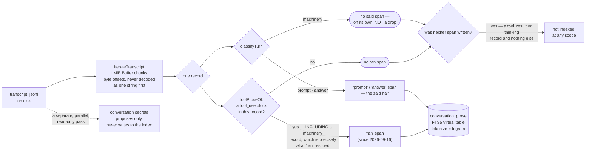

# 4. The conversation archive

`docs/capabilities/00-index.md` · previous: [`03-creation-and-gates.md`](./03-creation-and-gates.md) · next: [`05-anchors.md`](./05-anchors.md)

## What it is, and why it exists

Every Claude Code session and subagent lane writes a JSONL transcript to disk under
`~/.claude/projects/<encoded-cwd>/`. my_context treats those transcripts as a second corpus,
alongside the Markdown items: it scans them, keeps lightweight summary rows for every session and
subagent, and builds a full-text search index over the *prose* inside them — the words a person or
the model actually wrote, not the tool-call machinery around it. This is the "conversation
archive": `REQ-the-conversation-archive-is-a-terminal-you-can-scroll-not-a` states the standard it
is held to — a terminal the owner can scroll and search, not a black box he has to `grep` by hand.

The reason this is worth a whole subsystem rather than "search the files with `grep`": the archive
is Hebrew from early on — "Hebrew from record 5", `src/core/conversation-index.ts:333` — it is huge
(one live session here measured **106,591,470 bytes / 43,854 records on 2026-09-11**, and a live
session only grows: the same `sessionId` was past 112 MB and 45,900 records two days later, so
treat every figure in this chapter's live blocks as a dated reading and not as current state), and
most of every transcript is tool machinery, not prose worth searching. Doing this naively — decode-then-split, word-boundary tokenizer, character
offsets — is wrong in ways that are each individually measured in the source and described below.

## Indexing: what gets scanned, and from where

`mycontext conversation rebuild` walks every transcript file in the workspace's Claude Code
project directory. Running `conversation list --json` in this repo showed the real shape of one row (2026-09-11):

```
sessionId   : 595db3b1-a481-4553-b4c0-7248c31b2655
source      : live
file        : C:\Users\UserC\.claude\projects\D--Users-UserC-source-repos-my-context\
              595db3b1-a481-4553-b4c0-7248c31b2655.jsonl
bytes       : 106591470          scannedBytes: 106591470
prompts     : 825   answers: 2875   machinery: 40154   records: 43854   unreadable: 0
branch      : master   cwd: D:\Users\UserC\source\repos\my-context
title       : "MyContext V2.0"   titleSource: custom
```

Every record is classified by `classifyTurn` (`src/core/conversation-index.ts:1658`) into
`prompt`, `answer`, or `machinery` — the same thirteen lines the list screen's own counts rest on,
reused rather than re-implemented so "what counts as noise" cannot mean two different things on two
screens. Measured on this workspace on 2026-09-11, across 2 sessions and 298 lane transcripts:
**856,905,563 bytes of transcripts on disk, 162,611 records, and only 8,402,679 bytes (7,750
spans, 0.98%) was prose** — which is why full-text indexing the archive was not a performance
problem here.

**That figure is dated, and it changed shape on 2026-09-16, not just size.** Until that day the
prose index held exactly two span kinds, `prompt` and `answer` — "what was said" — and everything
`classifyTurn` calls `machinery` (tool calls, their results, and the model's own `thinking`) was
outside every index, at any scope. A third kind, `'ran'`, now indexes `tool_use` blocks — a tool's
name and its arguments, rendered as `key: value` lines and capped at 2,000 characters per argument
— beside the two that were always there. Re-measured on this workspace's real archive on
**2026-09-16**, over the 474 transcripts and 1,269,256,560 bytes it held that day — a one-off
measurement of the WIDENING, not a running count, and the archive has grown since:
**13.58 M searchable characters widened to 43.87 M, 3.2x**,
and the reader now chooses `said` (the default — `prompt` + `answer`, unchanged from before this
date), `ran` (the new kind), or `both`. `tool_result` and `thinking` (16.4% of the archive's
characters on its own) remain entirely unindexed, at any scope, and every search answer says so.
`tool_result`'s own share — a separate figure from `thinking`'s 16.4% — is stated two different
ways by the product's own source; see the note immediately below.

**The product's own source disagrees with itself about `tool_result`'s share, and this reference
follows the more precisely sourced figure rather than silently picking one.** `tool_result`'s
docblock in `conversation-index.ts` (near line 316) states it as **78.9%**, asserted with no
script cited. `conversation-search.ts` (near line 78) states **67.0%**, explicitly measured by
`scripts/measure-tool-indexing.ts` against this workspace's archive on 2026-09-16 and reproduced
in `reports/2026-09-16-indexing-what-was-done.md` §2 with the full character breakdown by block
type. This chapter and chapter 14 both use **67.0%**, because it is the figure with a re-runnable
measurement behind it; `conversation-index.ts`'s `78.9%` looks like an earlier or looser estimate
that was never reconciled with the later, precise one. This is a real inconsistency inside the
product's own source comments, not a copying error in this reference — flagged here rather than
quietly resolved, because picking a side without saying so would be exactly the kind of silent
correction this reference exists to refuse.

[Chapter 14 — Search over the archive](./14-search-over-the-archive.md) is the whole mechanism;
this chapter keeps the indexing/classification story and defers the query grammar to it.

Subagent ("lane") transcripts live one level down, under a `subagents/` folder keyed by the
session id. `conversation subagents --json` returns one row per lane, e.g.:

```
agentId       : agent-ac161bdaba91e2d0e
sessionId     : 595db3b1-a481-4553-b4c0-7248c31b2655
parentAgentId : null          dispatchedBy: null
toolUseId     : toolu_01W2vcXcMWqfD3A5gKeixF6W
agentType     : general-purpose
description   : "A5 retire ready parity excuse"
spawnDepth    : 1   isFork: false
file          : ...\subagents\agent-ac161bdaba91e2d0e.jsonl
prompts: 1   answers: 2   machinery: 101   records: 104
```

`agent_id` is `NULL` for a session's own transcript and names the lane otherwise, because the
archive is overwhelmingly lanes on real workspaces — 298 lane transcripts against 2 session
transcripts, measured on this machine. `dispatched_by` resolves against `agent_id` (the parent
lane that spawned it) and carries its own index (`idx_subagents_dispatched`) precisely so a
self-join for "everything this lane spawned" is indexed rather than a table scan.

**What "rebuild" costs.** The rebuild is a one-shot walk, not a per-turn one: a `prose_sources`
table keeps a `(bytes, mtime_ms)` freshness key per transcript, so the `Stop` hook — which runs
`conversation rebuild` at the end of every assistant turn — only re-reads a transcript's *tail*, in
the same way the archive's own scan does.

## Search: FTS5 with the `trigram` tokenizer, and it costs nothing

Everything above — the walk, the classification, the freshness check — feeds one pipeline from a
transcript on disk to a searchable row:



`classifyTurn` itself returns exactly `prompt | answer | machinery` — `'ran'` is not one of its
outcomes. It is rendered separately by `toolProseOf` (`conversation-search.ts:362`), which reads a
record's own `tool_use` block independently of `classifyTurn`'s verdict on the same record — the
diagram draws it as a sibling branch rather than a fourth arrow out of `classifyTurn` for exactly
that reason. The two branches are not mutually exclusive: an assistant record that both says
something and calls a tool produces **two spans at the same `byte_offset`** — one `'answer'`, one
`'ran'` — "two readings of one record," in the source's own words, which is why a hit lookup keyed
on position alone would silently collapse the pair.

**Neither branch reaches "not indexed" on its own, and an earlier revision of this diagram drew
both of them doing so.** `proseFrom` calls `put` twice per record (`conversation-search.ts:605` and
`:613`) and `put` writes a span whenever its text is non-empty (`:587-588`). So a `machinery`
record that carries a `tool_use` block **is** indexed, at `'ran'` — the source says it in those
words at `:606-612`, *"the record `classifyTurn` calls `machinery` is precisely the one this index
used to drop on the floor"* — and a `prompt` or `answer` record with no `tool_use` block **is**
indexed, at its own kind. A record reaches "not indexed, at any scope" only when **both** puts find
nothing, which is what `UNINDEXED_BLOCKS` (`:88`, `['tool_result', 'thinking']`) names: a record
whose content is only those blocks has no `text` block for `proseOf` (`:281-295`) and no
`tool_use` block for `toolProseOf` (`:362-385`).

`conversation_prose` is what chapter 14's three-tiered query reads; it is also one of the tables
`conversation forget` does **not** drop (`conversations`, `subagents`, `persisted` and `named` are
the four it clears — the prose index, its freshness table, and `.anchors.jsonl`/its derived table
all survive a forget).

The full-text index is a real SQLite `FTS5` virtual table:

```sql
CREATE VIRTUAL TABLE IF NOT EXISTS conversation_prose USING fts5(
  source_key   UNINDEXED,
  session_id   UNINDEXED,
  agent_id     UNINDEXED,
  record_index UNINDEXED,
  byte_offset  UNINDEXED,
  kind         UNINDEXED,
  at           UNINDEXED,
  text,
  tokenize = 'trigram'
);
```

(`src/core/conversation-index.ts:473–483`). Node 24 bundles SQLite 3.51.2 with `ENABLE_FTS5`,
`bm25()`, porter *and* trigram tokenizers built in, and `node:sqlite` was already imported in
16 files (re-counted 2026-09-16: `grep -rl node:sqlite src/`) — so full-text search over the
archive is a `CREATE VIRTUAL TABLE` and nothing else,
which is what lets it exist under `CONST-zero-runtime-dependencies` and `CONST-node-24-no-build-step`
without adding a dependency or a build step.

**The tokenizer choice is deliberate, and it is measured, not assumed.** The obvious choice for
prose search is `unicode61`, a word-boundary tokenizer. It is wrong for this archive because the
archive is half Hebrew, and **Hebrew glues its one-letter particles onto the front of a word**:
the prepositions "in" (ב), "to/for" (ל), "the" (ה), and "and" (ו) attach directly to the noun that
follows them with no space — so a query for the base word (e.g. `שורה`, "line") is a **substring**
of the form the transcript actually holds (`השורה`, "the line"), never the whole token. A
word-boundary tokenizer treats `השורה` as one indivisible token and a query for `שורה` alone never
matches it; a substring/trigram tokenizer, which indexes every run of three consecutive characters,
matches it regardless of what got glued onto the front. Measured on the real corpus, 2026-09-11:

```
query   inside      unicode61   trigram
שורה    השורה               3        11
תוך     מתוך                0        14
שרה     עשרה                0         8
anchors                    54        58
```

`unicode61` misses matches entirely when the search term shows up only inside a longer glued word
(`תוך`/`שרה`: 0 hits), and undercounts even for plain English (`anchors`: 54 vs 58) because it
still only matches whole tokens where trigram matches any embedded occurrence.

The cost is stated rather than left to be discovered. Building the index with `unicode61` produces
17,842,176 bytes in 264 ms; with `trigram`, 42,119,168 bytes in 1,870 ms — about 42 MB beside a
`.my_context/.index.db` that was 5.6 MB the day it was measured, i.e. 4.9% of the size of the
transcripts it indexes. That cost buys correctness on the corpus's actual content and is paid once
per rebuild, not per turn.

**The one thing trigram cannot do, and the tool says so instead of staying silent about it**: a
search term shorter than three characters matches *nothing at all, ever* — `"ui"` returns zero rows
over a corpus where the word is everywhere, because there is no 2-character trigram to index
against. `searchArchive` reports this explicitly rather than returning an empty result set that
would look identical to "not in the archive" — the same instinct as `INV-nothing-is-dropped-silently`
applied to search: a hard limit of the tokenizer must be visible to the reader, not indistinguishable
from a true negative.

**Query safety.** The reader's search text is treated as data, not as FTS5 syntax: it is quoted into
a single FTS5 phrase with any `"` doubled, so the characters FTS5 reserves (`"`, `(`, `)`, `*`, `:`)
are obeyed as literal text rather than parsed as query syntax — a reader typing a parenthesis gets a
literal-text match, not an `fts5: syntax error`. Because the tokenizer is `trigram`, a quoted phrase
search is a genuine contiguous-substring match, which is exactly the property the Hebrew case needs.

**How you actually reach it.**

**This asymmetry was real through 2026-09-13 and it is fixed now: `mycontext conversation search`
exists.** Until 2026-09-16 there was no CLI path to FTS5 archive search at all — `mycontext search`
reached only the Markdown item corpus (`src/cli/commands/search.ts` imported `filterItems`/
`searchItems` from `core/rank.ts`/`core/search.ts` and never touched the archive), and
`mycontext conversation`'s `USAGE` had no `search` subcommand. **That has shipped.** Confirmed live
against this repository:

```
$ node src/cli/index.ts conversation search "byte offset" --sources ran --limit 3
```

`src/cli/commands/conversation.ts:58` now lists nine subcommands — `rebuild`, `list`, `subagents`,
`secrets`, `persist`, `name`, `anchor`, `forget`, **`search`** — and `searchArchiveTiered`
(`core/conversation-search.ts`) has a real CLI caller for the first time.
[Chapter 14 — Search over the archive](./14-search-over-the-archive.md) is the full grammar: three
readings of one query (phrase, near, both), the `said`/`ran`/`both` sources switch described
above, the three-character floor, `-word` exclusion, and the ranking rule that governs it.

`searchArchive`/`searchArchiveTiered` (`src/core/conversation-search.ts`) is still also called
from:

- `src/core/anchor-pass.ts` — the per-turn automatic anchor pass (chapter 5);
- `src/ui/read-model-conversations.ts` — the Conversations screen's search box, and the Search
  panel inside an open document (chapter 15);
- `src/ui/read-model-retrieval.ts` — subject reconstruction (chapter 6).

So a reader now has two doors onto the same mechanism — a terminal and a browser — where before
2026-09-16 there was only the one in the browser. `mycontext ui` (chapter 8) is still the richer
surface: it is where the find surface's four reading modes and its case/whole-word boxes live,
inside the Search panel (chapter 15), and none of them has a CLI equivalent.

**What the CLI gives you, in full:**

```
mycontext search "some words" [--type|--tag|--path|--status|--relation|--linked-to|--direction|--limit|--text]
mycontext conversation search "<query>" [--sources said|ran|both] [--session <id>] [--agent <id>]
                              [--limit <n>] [--json]
mycontext conversation list [--limit <n>] [--json]
mycontext conversation subagents [<session>] [--json]
mycontext conversation anchor [<session>] [<byte offset>] [--label "<why>"] [--agent <id>]
                              [--find <term>] [--drop <id>] [--json]
```

`search` is the item corpus (chapter 14 is about the archive, not this command); `conversation
search` is the archive's own trigram search, tiered, described fully in chapter 14;
`conversation list`/`subagents` are the archive's inventory views; `conversation anchor --find
<term>` remains a *different* query — it searches anchor **labels**, text a person wrote, not
transcript prose, and it resolves a term to a position in order to place or find an anchor rather
than returning a ranked result set.

## Byte offsets, never character offsets

Positions into a transcript — where a record starts, where an anchor points — are stored as **byte
offsets into the file**, never character offsets, and this is asserted directly in code comments as
a correctness requirement, not a style preference. **Cited by symbol rather than by line, because a
2026-09-13 line-range citation here had drifted by the time this pass re-verified it**: the
argument appears in the `anchors` table's own design comment in `src/core/conversation-index.ts`
(look for *"`byte_offset` is the position, and it is the ONLY position"*), and again inside
`iterateTranscript`'s implementation, which is where the walk this paragraph describes actually
happens. The reason: `iterateTranscript` (`src/core/conversation-index.ts:1774`) walks the
file as a raw `Buffer` in 1 MiB chunks, finds the newline delimiter *inside the buffer*, and decodes
each line individually — because splitting an already-decoded string on `'\n'` loses byte positions
the moment a record contains a non-ASCII character, and this corpus is half Hebrew: **every offset
after the first such record would be wrong, and wrong silently** — it would land mid-record, which
the reader reports as `unreadable` rather than throwing. A byte offset stored this way is always the
true first byte of a line, so a caller (e.g. re-seeking to resume a scan, or an anchor recording
"here" in a transcript) always lands exactly at a record boundary.

This is also the performance argument for the whole approach: because JSONL records are
variable-length, there is no way to seek to "record 27,686" without having walked the file once and
remembered where each record began. The walk happens once per freshness window (per-turn,
tail-only) rather than once per scroll — on the owner's own 61 MB transcript, that is "read once"
instead of "read per scroll."

### The walk is shared *now*, and the reason it had to become shared

**`src/core/line-walk.ts` (new 2026-09-13, `86a0c840`) is where the chunk carry lives**, and it is
worth naming because the previous state of this sentence was a documentation hazard. There were
**four** independent buffer-carry loops, each with its own private 1 MiB constant
(`WALK_CHUNK_BYTES` and two separately named `CHUNK_BYTES`), and **two of them were wrong**:
`ui/read-model-conversations.ts`' `readWindow` and `session-summary.ts`' `summariseTranscript`
carried a **string** across the seam rather than a `Buffer`. `chunk.toString('utf8')` decodes each
chunk on its own, so a character straddling the 1 MiB boundary becomes two U+FFFD — one at the tail
of one chunk, one at the head of the next. A fourth reader, `conversation-redaction.ts`, had no
seam assertion at all.

**On ASCII this defect cannot fail a test**, because a byte offset and a character offset are then
the same number — which is exactly why two of the readers shipped wrong and survived review. The
fix (`ae4984d7`) is `test/core/chunk-seam-utf8.test.ts`, written **in Hebrew**, putting a two-byte
character *across* byte 1,048,576 and reading the text back. The fixture guards itself: one
assertion checks that byte 1,048,576 of the fixture really is a UTF-8 **continuation** byte, so a
fixture that drifted by one byte cannot make the suite green by no longer testing anything.

Today the four are one: `LINE_WALK_CHUNK_BYTES = 1024 * 1024`, with `eachLine` (a generator) and
`forEachLine` (a callback) exported from `src/core/line-walk.ts:70, 109, 172`. `iterateTranscript`
delegates to `eachLine` (imported at `conversation-index.ts:110`, called at `:1820`) — deliberately the generator rather
than `forEachLine`, because `iterateTranscript` is itself lazy and a callback driver would read a
whole 52 MB transcript to answer a question about its first page. The importers are
`conversation-index.ts`, `conversation-redaction.ts`, `session-summary.ts` and
`ui/read-model-conversations.ts`.

## Subagent transcripts

A subagent ("lane") gets its own transcript file, under `<session-dir>/subagents/<agent-id>.jsonl`,
and its own row in the `subagents` table (schema above) — with `session_id` naming the parent
session, `parent_agent_id`/`dispatched_by` recording the lane that spawned it (for nested
dispatch), `tool_use_id` tying it back to the exact tool call in the parent transcript that launched
it, `agent_type`, `description`, `spawn_depth`, and `is_fork` (whether it is a `fork`-type agent,
which inherits the parent's context, versus a fresh agent). This is what lets `conversation
subagents [<session>]` answer "what ran under this session, and what spawned what" without any
extra bookkeeping.

## Secrets: detection proposes, it never acts

`conversation secrets [<session>] [--json]` scans a session's transcript for text that *looks*
private — API keys, bearer tokens, key-assignments — and returns a report. It never redacts, never
blocks, never modifies anything on its own; per the module's own stated rule
(`src/core/conversation-secrets.ts:1–24`), quoting the owner **exactly as the source carries him,
misspellings and all** — this project treats a verbatim quotation as evidence, so tidying one is
the wrong kind of edit: *"when user requesting export it should be askd to list private details or
sensitive info from the conversation and uppon it's selection the exported version will include a
replacement faked place holder"*. **Detection
proposes, it never acts** — automatic scrubbing was considered and rejected because a false
positive silently hides the owner's own work and a false negative silently reassures him; a
candidate list he reads himself has neither failure mode.

Output from this workspace (`conversation secrets --json`, run 2026-09-12 against the then-live
session). **This is abridged: seven of `SecretCandidate`'s fourteen fields are shown**, and the
elision is marked so the shape is not mistaken for the whole:

```json
{
  "occurrences": 65,
  "total": 8,
  "candidates": [
    {
      "id": "759d77478af1",
      "shape": "key-assignment",
      "shapeTitle": "an assignment to something called key, secret, token or password",
      "added": false,
      "preview": "cryp…9 more…ytes",
      "occurrences": 28,
      "contexts": ["…the identifier `secret` in `secret = cryp…9 more…ytes`. AND THE FINDING..."]
      // … omitted here: length, records, recordsOmitted, firstRecord, lastRecord, paths, placeholder
    }
  ]
}
```

The full interface is `SecretCandidate` at `src/core/conversation-secrets.ts:611–634`:
`id`, `shape`, `shapeTitle`, `added`, `preview`, `length`, `occurrences`, `records`,
`recordsOmitted`, `firstRecord`, `lastRecord`, `paths`, `contexts`, `placeholder`. Two of the
omitted ones carry design weight: `length` is "characters in the value — the part a mask cannot
carry", and `placeholder` is "what it becomes if it is ticked. **Shown BEFORE the choice, not
after.**"

This is a candidate about the module's own doc comments discussing `secret = cryptoRandomBytes` —
exactly the kind of false positive the module's own header describes as unavoidable from syntax
alone (a value textually identical to code that merely *describes* the feature). The design accepts
this: precision is intentionally traded for recall, because a human reading eight candidates is cheap
and a missed real secret is not. Measured directly: scanning every transcript on the owner's machine
on 2026-09-08 (867 files, 1.7 GB, thirteen credential shapes) found 8 newly-exposed matches, of
which 1 was a real secret, 5 were deliberate test probes, and 1 was the identifier `secret` in
`secret = cryptoRandomBytes` — a hit rate that is *bad by design*: the scanner is a proposer, not a
filter, and the ratio is the argument for that shape rather than against it. A later tightening
(`rejectCallShape`: a captured value immediately followed by `(` is a call, not a literal) cut
candidates 20→15 and occurrences 144→89 over the owner's 31 session transcripts (336 MB, 108,733
records) with zero loss among the six candidates judged plausibly real.

No candidate's actual secret value ever leaves the module: each carries only a hash-derived `id`, a
masked `preview`, a `shape`, and a `context` window — never the raw value — so the CLI report, a
`--json` payload, and any accepted-candidate list are all free of credential material; a
redaction/export step re-derives values by re-scanning rather than by round-tripping them through a
report. This is itself a lesson from this project's own history: a lane once wrote a complete
bearer token into a corpus item, which had to be redacted before it shipped — the design here
exists specifically so a reporting surface never has to carry the secret it is reporting on.
Item found while searching for this behaviour: `TASK-an-export-offers-to-swap-secrets-for-obvious-fakes-and-never` names the export-side task this module feeds; it was read as a title only and not opened in full — treat its exact export-flow wiring as unverified here.

## Persistence: `persist` and `forget`

The conversation index (`.my_context/.index.db`'s conversation tables) is a **cache**, derived from
the transcripts on disk, which are the source of truth. Two commands manage what survives beyond
that cache, and they do different, narrower things than a rebuild:

- **`conversation persist [<session>] [--replace <ids>] [--off] [--yes] [--json]`** marks a session
  to be *mirrored* — kept as a durable copy outside the normal Claude Code transcript lifecycle
  (which can prune old transcripts), with the option (`--replace`) to swap in the faked placeholders
  a `secrets` review approved, so the kept copy never has to carry the real values. `--replace=`
  (empty) unticks every replacement; omitting the flag leaves prior choices untouched — a three-state
  design (absent / empty / a list) specifically so a chosen redaction can be taken back without
  hand-deleting files. `--off` stops keeping a session up to date; it explicitly does **not** delete
  the mirror copy already on disk, because deleting could destroy the only remaining record of a
  conversation the harness has since pruned.

- **`conversation forget [--yes] [--json]`** drops the session/subagent **inventory** for the
  workspace, without touching a single transcript file on disk. Be precise about what it removes,
  because the name is wider than the act: `forgetConversations`
  (`src/core/conversation-index.ts:3681`) issues exactly four `DROP TABLE IF EXISTS`
  statements, at `:3708–3714` — `conversations`, `subagents`, `persisted`, `named`. The
  conversation schema has **seven** tables in total (`conversation-index.ts:398, 422, 458, 467,
  473, 485, 497`). **`conversation_prose` — the ~42 MB FTS5
  table this chapter's longest section is about — survives, and so do `prose_sources` and
  `anchors`.** So `forget` does not un-index the archive's prose; it removes the inventory and the
  freshness bookkeeping's consumers.

  What it *does* destroy, and this is worth knowing before typing it, is both of the things the
  paragraph above is about: the `persisted` table holds the **`persist` marks** and `named` holds
  the **session names**, and both go. The source says why that is allowed: *"The marks, not the
  mirrors"* — a mirror copy on disk is untouched, because it may be the only surviving record; a
  name "has no file to survive in" and is simply lost.

  It is described in the command's own confirmation prompt as an opt-**out**, not a delete: the
  end-of-turn `Stop`-hook refresh only ever refreshes an index that already exists, so `forget`
  is how a workspace stops indexing conversations at all until `conversation rebuild` is run again
  by hand.

Both commands' mutating paths were read from source for this chapter and **not executed** — they
require `--yes` or an interactive confirmation, and running them would have changed this workspace's
persisted/indexed state, which is outside a documentation pass's remit.

## What's NOT built / built but off

- ~~**There is no CLI path to FTS5 archive search.**~~ **Fixed 2026-09-16.** `mycontext
  conversation search` reaches `searchArchiveTiered` from a terminal now, with the same three-tier
  grammar and `said`/`ran`/`both` sources switch the web UI's search box uses. See "How you
  actually reach it" above and [chapter 14](./14-search-over-the-archive.md). What is still
  CLI-only-absent: the Search panel's four reading modes — **plain**, **wildcard**, **logical** and
  **regular expression** — and its **whole word** and **case-sensitive** boxes
  (chapter 15) — those exist only inside a document already open in the browser, because they
  scan one transcript's prose spans directly rather than querying the FTS5 index, and there is no
  CLI surface onto that scan.
- **`conversation forget` does not drop `conversation_prose`.** Four of seven tables go. A reader
  wanting the FTS5 index gone needs to delete `.my_context/.index.db`, not run `forget`.
- There is no automatic redaction on display or on export — confirmed directly from the module's
  own design rationale: automatic scrubbing was considered and explicitly rejected.
- Trigram search has a hard floor: queries under three characters return zero results, always, by
  construction — this is not a bug to be fixed, it is a documented property of the tokenizer. As of
  2026-09-16 the floor moved from the *query* to the *term* — a short word inside a longer query is
  named and excluded from the ranked readings rather than silently emptying the whole answer; see
  [chapter 14](./14-search-over-the-archive.md).
- This chapter did not verify the full mechanics of how an accepted `secrets` candidate list flows
  into an actual `export`'s placeholder substitution (see `TASK-an-export-offers-to-swap-secrets-for-obvious-fakes-and-never`,
  read as a title only) — do not treat the export-side wiring as confirmed by this document.
- **The UI's virtualized transcript scroller is named here but not described.** It lives in
  `src/ui/public/screens/conversations.js`, which `reports/2026-09-13-conversations-js-mapped.md`
  (`826c7b55`) maps into seven units and one 2,370-line closure. Chapter 8 does not describe it
  either.
- Every live figure in this chapter is a **dated reading**, not current state; the session
  measurements in particular grow with every turn.

## See also

- [`00-index.md`](./00-index.md) — full document index
- [`05-anchors.md`](./05-anchors.md) — the `anchors` table this same conversation index carries, and why `byte_offset` is its only position too
- [`06-retrieval.md`](./06-retrieval.md) — reconstructing a subject from a pasted passage, which also searches this archive as FTS5 queries
- [`14-search-over-the-archive.md`](./14-search-over-the-archive.md) — the query grammar in full: three readings, `said`/`ran`/`both`, the per-term floor, `-word` exclusion and the ranking rule
- [`15-document-and-lane-viewer.md`](./15-document-and-lane-viewer.md) — the find surface and the three floating panels that read a single open transcript directly, outside the FTS5 index
