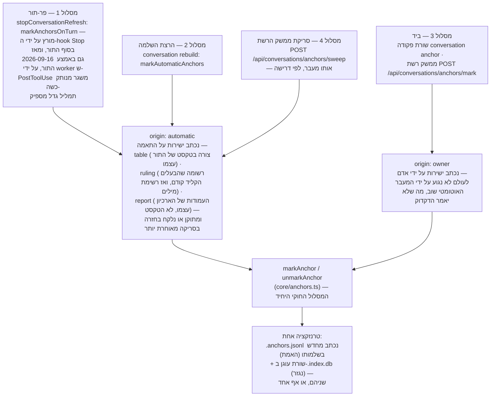

<!--
  Hebrew mirror of `docs/capabilities/05-anchors.md`. The English file is the
  source. Conventions: `docs/README.he.md` and `docs/the-store.he.md` — Hebrew
  prose and tables inside `<div dir="rtl">`, fenced blocks outside it,
  `<span dir="ltr">` around any Latin run whose edge characters are not both
  alphanumeric and around any run of two or more Latin terms joined by commas
  or slashes.

  Every pasted shell block and every quoted regular expression is
  byte-identical to the English file. The Mermaid labels are translated; the
  graph structure is the English one.

  Heading sequence must stay identical to the English file.
-->

# 5. עוגנים

<div dir="rtl">

עוגן הוא סימנייה לתוך ארכיון השיחות: נקודה קבועה — סשן אחד (או נתיב תת-סוכן אחד), **היסט בתים**
אחד לתוך התמליל שלו, ותווית — שמאפשרת לבעלים (או לשליפה, ראו [06 — שליפה](./06-retrieval.he.md))
לנווט ישר חזרה למשהו שכבר נאמר, במקום לקרוא מחדש מגה-בתים של תמליל כדי למצוא אותו שוב.

המנגנון מתואר מקצה לקצה בכותרת של <span dir="ltr">`src/core/anchors.ts`</span> עצמו כ-
<span dir="ltr">`plan:recall seq:1`</span>, משימה 3 של
<span dir="ltr">`docs/superpowers/plans/2026-09-10-d42-conversation-retrieval.md`</span> ו-§7 של
<span dir="ltr">`docs/superpowers/specs/2026-09-10-conversation-retrieval-design.md`</span>.
הפריט השולט הוא <span dir="ltr">`REQ-every-anchor-capability-is-reachable-from-the-screen-and-a`</span>
(חומרה <span dir="ltr">`hard`</span>, מתויג <span dir="ltr">`v2`</span>,
<span dir="ltr">`recall`</span>, <span dir="ltr">`ui`</span>), שהסיכום שלו קובע את הצורה של כל
היכולת במשפט אחד: *"סימניות נעשות בשלוש דרכים — בזמן שהשיחה גדלה, בהרצת השלמה אחת, וביד תוך
כדי קריאה — וכל אחת מהן, וכל שאר מה שאפשר לעשות איתן, עובד מהמציג."*

## 5.1 למה עוגן קיים

ארכיון השיחות (פרק 4) הוא חיפוש פרוזה מעל תמלילים שבסביבת העבודה הזו מגיעים למאות מגה-בתים.
למצוא קטע פעם אחת, בחיפוש, זול. למצוא את *אותו* קטע שוב בשבוע הבא לא — אלא אם משהו רשם בדיוק
איפה הוא היה. עוגן הוא הרישום הזה: הוא שורד את העובדה שחיפוש מדרג מחדש, שתמלילים מאונדקסים
מחדש, ושהיסטי בתים הם אחרת מספרים חסרי משמעות שאף אחד לא היה חושב לרשום ביד.

## 5.2 הקובץ הוא האמת; האינדקס נגזר

זהו אותו יחס שיש לקורפוס עצמו בין פריטי ה-Markdown שלו לבין אינדקס ה-SQLite המתכלה (פרק 1) —
והפרויקט מותח את המקבילה הזו במפורש ולא משאיר לקורא להבחין בה. מהכותרת של
<span dir="ltr">`src/core/anchor-file.ts`</span>:

> <span dir="ltr">`.my_context/.index.db`</span> הוא ב-gitignore ו**מוגדר** כמתכלה — הצורה היא
> הגרסה, מחקו אותו והוא נבנה מחדש. כל מה שבו חוזר ממשהו אחר: שיחות, נתיבים ופרוזה מהתמלילים,
> פריטים מ-Markdown. **עוגנים היו החריג האחד.** הם שורדים בנייה מחדש… ושום דבר לא החזיר אותם
> אם הקובץ עצמו הלך.

ולכן <span dir="ltr">`.my_context/.anchors.jsonl`</span> — אובייקט JSON אחד לכל שורה, מתויג
פרוטוקול <span dir="ltr">`my_context/anchor@1`</span> — הוא החלק האחד באינדקס השיחות ש**אינו**
ניתן לגזירה מחדש משום דבר אחר. אומת על סביבת העבודה הזו:

</div>

```
$ head -n 1 .my_context/.anchors.jsonl      # re-run 2026-09-17; this line will not match a later run
{"protocol":"my_context/anchor@1","id":"595db3b1-a481-4553-b4c0-7248c31b2655:-:100165384",
 "sessionId":"595db3b1-a481-4553-b4c0-7248c31b2655","agentId":null,"byteOffset":100165384,
 "label":"D | subject | state","kind":"table","origin":"automatic","at":"2026-09-11T22:20:36.813Z"}
```

<div dir="rtl">

**זו ההדבקה החיה האחת בפרק הזה שבאמת צפויה להשתנות בכל הרצה מחדש, בעיצוב, לא בסחף**: הקובץ
נכתב מחדש במלואו בסדר מיון בכל כתיבה (מוסבר בהמשך הסעיף הזה), ולכן "שורה 1" היא איזו שורה
שכרגע ממוינת ראשונה — שורה אחרת מזו שמוצגת כאן ברגע שעוד עוגן אוטומטי אחד עם מזהה נמוך יותר
נוחת. השורה מוצגת כדי להדגים את ה**צורה** של שורה (תשעה מפתחות על החוט, אובייקט JSON אחד לכל
שורה) ואת העובדה ש-<span dir="ltr">`head -n 1`</span> היא דרך משמעותית וזולה לאמת שהקובץ
מתפענח — לא כדי לקבוע איזו שורה ספציפית ראשונה היום.

לכל שורה יש אותם **שמונה** שדות, ועוד תג ה-<span dir="ltr">`protocol`</span> שמוצג למעלה
שהופך אותם לתשעה מפתחות על החוט: <span dir="ltr">`id`</span>,
<span dir="ltr">`sessionId`</span>, <span dir="ltr">`agentId`</span> (מזהה נתיב, או
<span dir="ltr">`null`</span> עבור התמליל של הסשן עצמו), <span dir="ltr">`byteOffset`</span>
(בתים, **לעולם לא תווים** — ראו §5.5), <span dir="ltr">`label`</span>,
<span dir="ltr">`kind`</span>, <span dir="ltr">`origin`</span>, <span dir="ltr">`at`</span>.
<span dir="ltr">`readAnchorFile`</span> מסרב לשורה פגומה במקום לקרוא אותה בשקט כ"פחות
סימניות", כי — לפי <span dir="ltr">`INV-nothing-is-dropped-silently`</span> — הסימניות הן
בדיוק הדבר ששום דבר אחר אינו יכול להחזיר.

**למה מסמך שנכתב מחדש ולא יומן שרק מוסיף בסוף**, בשונה מ-<span dir="ltr">`audit.ts`</span> או
<span dir="ltr">`revision-log.ts`</span>: המעבר האוטומטי (§5.4) מתייג מחדש מאות עוגנים בהרצה
אחת — 345 בהרצה שהכותרת מצטטת — ויומן שרק מוסיף היה גדל במאות שורות כדי לתאר 565 עובדות, בלי
ששום קורא אי פעם שואל מה תווית *הייתה* פעם. ולכן זה מסמך, שנכתב בשלמותו ומוחלף פנימה עם
<span dir="ltr">`writeFileSync`</span> לנתיב זמני ועוד <span dir="ltr">`renameSync`</span>,
אטומית: הרג באמצע כתיבה משאיר או את כל הקובץ הישן או את כל החדש, לעולם לא אחד קטוע.

**יישוב טבלה ↔ קובץ** (<span dir="ltr">`reconcileAnchors`</span>) רץ בכל כתיבה ובתחילת כל
<span dir="ltr">`conversation rebuild`</span>: אם הקובץ נעדר, השורות של הטבלה מאומצות לקובץ טרי
(<span dir="ltr">`direction: 'adopted'`</span> — כל קורפוס שקדם למנגנון הזה עובר כאן פעם אחת,
כולל 565 השורות שהכותרת מזכירה); אם הקובץ נוכח, הטבלה נבנית מחדש ממנו
(<span dir="ltr">`direction: 'restored'`</span>, מצב היציבות הרגיל, וזה מה שהופך את
<span dir="ltr">`.index.db`</span> למתכלה שוב גם עם עוגנים בתוכו).

## 5.3 <span dir="ltr">`origin: automatic`</span> מול <span dir="ltr">`origin: owner`</span>

כל שורת עוגן נושאת אחד מבדיוק שני ערכי origin — אומת על הקובץ של סביבת העבודה הזו עצמה, נמדד
מחדש ב-**2026-09-17** באותו רגע כמו ספירת ה-<span dir="ltr">`kind`</span> שמתחתיו, כך ששני
הנתונים מתארים קובץ אחד ברגע אחד ולא שני ימים שונים (פגם בגרסה מוקדמת יותר של הפרק הזה,
מתוקן כאן — ראו את ההערה בסוף הסעיף):

</div>

```
$ wc -l .my_context/.anchors.jsonl
1405 .my_context/.anchors.jsonl
$ grep -o '"origin":"[a-z]*"' .my_context/.anchors.jsonl | sort | uniq -c
   1404 "origin":"automatic"
      1 "origin":"owner"
```

<div dir="rtl">

**המספר הזה אינו רק מתוארך, הוא תנודתי בתוך הסשן שקורא אותו** — שלוש קריאות עוקבות שנלקחו תוך
כדי תיקון הפרק הזה, דקות זו מזו, נתנו 1,342, אחר כך 1,345, אחר כך 1,348, אחר כך 1,355 — ו-1,405
בקריאה החוזרת של 2026-09-17 למעלה, חמישים שורות אחר כך — כי המעבר הפר-תורי (§5.6, מסלול 1)
כותב סימנים בזמן שהמסמך הזה נערך. **הפרק הזה קובע את הספירה בדיוק פעם אחת, כאן, וכל סעיף אחר
למטה שצריך לדבר על "כמה" משתמש ב"הספירה של §5.3" או בסדר גודל במילים, לעולם לא בספרה חוזרת** —
אמירה מחדש של מספר ספציפי ביותר ממקום אחד היא בדיוק איך גרסה קודמת של הפרק הזה התיישנה בחמישה
מקומות בבת אחת. הריצו מחדש את שתי הפקודות למעלה לקבלת הספירה האמיתית בכל רגע מאוחר יותר; אל
תסמכו על מספר שהועתק מהדף הזה לשיחה או למסמך אחר.

- **<span dir="ltr">`automatic`</span>** — סומן על ידי המעבר האוטומטי (§5.4) כי התור שמתחתיו
  תאם דקדוק קבוע ("זה עוגן מעצם צורתו"), בלי שנשאל אדם.
- **<span dir="ltr">`owner`</span>** — סומן על ידי אדם, דרך שורת הפקודה, משטח ה-MCP, או ממשק
  הרשת. ברירת המחדל של <span dir="ltr">`origin`</span> ב-<span dir="ltr">`markAnchor`</span>
  היא <span dir="ltr">`'owner'`</span> בדיוק מהסיבה הזו: קורא שאינו אומר אחרת הוא אדם.

ההבחנה **נושאת משקל, אינה תיאורית**. המעבר האוטומטי קורא מחדש ויכול *לקחת בחזרה* עוגנים משל
עצמו כשהדקדוק כבר לא מזהה את מה שנמצא בבית ההוא (§5.4) — אבל הוא לעולם אינו נוגע בשורה שה-
<span dir="ltr">`origin`</span> שלה הוא <span dir="ltr">`'owner'`</span>, מה שלא יאמר הדקדוק
על התור שמתחתיה. מ-<span dir="ltr">`anchor-pass.ts`</span>: *"מעבר אוטומטי שמחק סימנייה שנעשתה
ביד היה פגם גרוע בהרבה מכל אחד שהוא יכול לתקן."* מסלולי הכתיבה של ממשק הרשת אוכפים את אותה
אי-סימטריה מהכיוון השני: <span dir="ltr">`apiAnchorMark`</span> אינו מקבל
<span dir="ltr">`origin`</span> בגוף הבקשה בכלל — <span dir="ltr">`kind`</span> הוא כן מקבל,
ומאז 2026-09-15, אבל רק מתוך <span dir="ltr">`OWNER_ANCHOR_KINDS`</span>
(<span dir="ltr">`note`</span>, <span dir="ltr">`decision`</span>,
<span dir="ltr">`question`</span>, <span dir="ltr">`defect`</span>,
<span dir="ltr">`evidence`</span>, <span dir="ltr">`todo`</span> —
<span dir="ltr">`src/core/anchors.ts:99-101`</span>), מאומת על ידי
<span dir="ltr">`ownerKind`</span> (<span dir="ltr">`src/ui/anchor-write.ts:115-128`</span>)
ומקבל כברירת מחדל <span dir="ltr">`'note'`</span> כשהשדה נעדר. הקבוצה **זרה** ל-
<span dir="ltr">`AUTOMATIC_ANCHOR_KINDS`</span>, וזו התכונה שחשובה: שום בקשה אינה יכולה לזייף
שורה שהמעבר האוטומטי היה רשאי למחוק מאוחר יותר. §5.4b, ארבעים שורות למטה, קובע זאת נכון;
הפסקה הזו נהגה לסתור אותו.

<span dir="ltr">`kind`</span> על אותו קובץ, אותו רגע:

</div>

```
$ grep -o '"kind":"[a-z_]*"' .my_context/.anchors.jsonl | sort | uniq -c
      1 "kind":"note"
    471 "kind":"report"
     40 "kind":"ruling"
    893 "kind":"table"
```

<div dir="rtl">

1 + 471 + 40 + 893 = 1,405, בהתאמה לספירת ה-<span dir="ltr">`origin`</span> ולספירת השורות של
הקובץ עצמו למעלה — שלוש קריאות של קובץ אחד שנלקחו ברגע אחד ומסכימות, וזו התכונה שהגרסה של
הסעיף הזה לפני התיקון הזה חסרה (היא צימדה קריאת <span dir="ltr">`kind`</span> מ-2026-09-16 מול
קריאת <span dir="ltr">`origin`</span> מיושנת מ-2026-09-12 וספירת שורות מ-2026-09-13 מסעיף אחר,
שלושה ימים שונים בתוך פסקה אחת — ותיקון של אותו פגם ספציפי אז מיד ייצר גרסה *צרה יותר* של אותו
פגם, ברענון הבלוק הזה והשארת חמישה אזכורים אחרים של הספירה במקומות אחרים בפרק הזה בלתי
מרועננים; החמישה האלה אומרים עכשיו "ראו את הסעיף הזה" ולא ספרה, בדיוק מהסיבה הזו). (תצלום
<span dir="ltr">`kind`</span> מוקדם, 2026-09-13: 1 <span dir="ltr">`note`</span>, 299
<span dir="ltr">`ruling`</span>, 336 <span dir="ltr">`table`</span>, בלי
<span dir="ltr">`report`</span> — ראו §5.4a למטה כדי לדעת למה <span dir="ltr">`report`</span>
קיים בכלל עכשיו; שימושי רק כדי להראות את צורת שינוי הדקדוק, לא כבסיס לחשבון.)
<span dir="ltr">`note`</span> הוא סוג ברירת המחדל לעוגן שסומן ביד — אבל נכון ל-2026-09-15 הוא
אחד מ**שישה** שאדם רשאי עכשיו לבחור, לא היחיד (§5.4b). <span dir="ltr">`table`</span>,
<span dir="ltr">`ruling`</span> ו-**<span dir="ltr">`report`</span>** הם שלושת הדקדוקים שהמעבר
האוטומטי מזהה (§5.4), <span dir="ltr">`table`</span> הוא בנוחות הגדול מבין השלושה ו-
<span dir="ltr">`ruling`</span> בנוחות הקטן, והעוגן האחד שסומן ביד בסביבת העבודה הזו הוא עדיין
ה-<span dir="ltr">`note`</span> היחיד.

## 5.4 מה "אוטומטי מטבעו" אומר — הדקדוק, לא שיפוט

<span dir="ltr">`anchor-pass.ts`</span> מפורש שהחצי האוטומטי **אינו מנקד, אינו מציב סף, ואינו
מסיק**:

> מסווג אות/רעש לקסיקלי נמדד ב-**AUC 0.499** על הקורפוס הזה — הטלת מטבע — וגרסה בת שני כללים
> של המאפיין הבודד הטוב ביותר עדיין קיבלה 47% מהרעש.

**הוא מריץ שלושה דקדוקים קבועים ומבניים על טקסט התור, ו — מאז ש-<span dir="ltr">`anchorsInTurn`</span>
נכתב מחדש ב-2026-09-16 — מחזיר כל דקדוק שתואם, לא את הראשון.** זה אינו תיקון קטן: גרסה מוקדמת
יותר של הסעיף הזה אמרה "ההתאמה הראשונה מנצחת", מה שהיה נכון לפני 2026-09-16 והוא בדיוק
ההתנהגות ש-§5.6a למטה (באותו פרק) מתאר כמוחלפת במכוון. הכותרת של הפונקציה עצמה קובעת את הכלל
הנוכחי ישירות: *"כל מה שהופך את התור הזה לעוגן מטבעו — כל דקדוק שמזהה אותו, לא הראשון
שמזהה."* תור יכול לכן לשאת סימן <span dir="ltr">`table`</span> וסימן
<span dir="ltr">`report`</span> וסימן <span dir="ltr">`ruling`</span> בבת אחת, עקרונית, אף
שהמקור מציין שהרשימה "יכולה להחזיק לכל היותר שתי רשומות היום" בהינתן מה שיכול להופיע יחד
בפועל.

1. **<span dir="ltr">`table`</span>** — טקסט התור מכיל טבלת Markdown בסגנון GFM: שורת מפריד
   (תאים שכולם מקפים, נקודתיים יישור אופציונליות) ישירות מתחת לשורת כותרת עם *אותו* מספר תאים.
   התווית היא תא הכותרת הקריא הראשון (<span dir="ltr">`tableLabel`</span>), כי הסכמה התמימה
   "שורת הכותרת כולה מחוברת" ייצרה 25 עוגנים שתויגו פשוטו כמשמעו <span dir="ltr">`|`</span>
   לפני שפסיקת הבעלים של 2026-09-11 תיקנה את זה.
2. **<span dir="ltr">`report`</span>** — התשובה **הסופית** של נתיב, שנמצאת *מבנית* מתוך
   <span dir="ltr">`subagents`</span> ואינדקס הפרוזה (איזה נתיב, ומהו התור האחרון שלו),
   מתויגת עם המשימה של הנתיב עצמו — לעולם לא בהתאמת טקסט בתור. ראו §5.4a: זה אינו הדקדוק
   שנמשך ב-2026-09-11.
3. **<span dir="ltr">`ruling`</span>** — **נכתב מחדש ב-2026-09-15, והתיאור למטה הוא של הדקדוק
   הנוכחי, לא זה שהסעיף הזה תיאר עד התיקון הזה.** המזהה המקורי התאים מזהה קורפוס נורמטיבי
   (<span dir="ltr">`\b(?:DEC|RULE|INSTR|STD|CONST|INV)-[a-z0-9]+(?:-[a-z0-9]+){3,}\b`</span>)
   בתוך תור <span dir="ltr">`prompt`</span>. <span dir="ltr">`anchor-pass.ts`</span> נושא
   עכשיו את ההספד של המזהה ההוא, בזמן עבר, עם המדידה שהרגה אותו: על פני כל 10,836 מקטעי
   הפרוזה של הארכיון האמיתי של הבעלים, דקדוק המזהה החזיק 377 מתוך 1,164 סימנים ו**סימן אפס
   תורים שהוא באמת הקליד** — 296 מתוך ה-377 היו בלוק ההזרקה של
   <span dir="ltr">`SubagentStart`</span> של התוסף הזה עצמו (שמדקלם כל פריט שולט, ולכן הוא נושא
   מזהים בכמויות), ואפילו גרסה מהודקת בצורה מושלמת של השומר לא הייתה תואמת דבר, כי על פני 519
   תורים שהוא הקליד ב-13 ימים הוא נקב במזהה נורמטיבי **אפס פעמים**.
   **מה שנשלח עכשיו** הוא <span dir="ltr">`ownerTyped(record)`</span> — נכון רק כש-
   <span dir="ltr">`origin.kind === 'human'`</span> של רשומה, כלומר הבעלים באמת הקליד אותה, לא
   sidechain ולא רשומת מטא — בשילוב עם רשימת מילים קבועה שנקראה מתוך התורים האמיתיים שלו עצמו,
   <span dir="ltr">`RULING_WORDS`</span>:

</div>

   ```
   /\b(?:always|never|nevver|must|unacceptable|not allowed|forbidden|from now on|
        i approve|i decide|the rule|this rule|a rule|standardi[sz]e)\b/i
   ```

<div dir="rtl">

   (<span dir="ltr">`nevver`</span> הוא האיות שלו עצמו, שנשמר כי רשימה שנקראה מתוך קורפוס
   אמיתי נושאת את מה שהקורפוס מחזיק.) רשימת "מודאליים" רחבה יותר
   (<span dir="ltr">`should`/`i want`/`need to`/`do not`</span>) נמדדה ונדחתה: היא מסמנת 143
   מהתורים שלו ב*אותו* שיעור של כ-40% שווה-החזקה כמו קו הבסיס המטומטם של "250 תווים בלי שום
   מילת מפתח בכלל" — דק ומדויק ניצח רחב וממוצע.

<span dir="ltr">`AUTOMATIC_ANCHOR_KINDS = ['table', 'ruling', 'report']`</span>
(<span dir="ltr">`src/core/anchors.ts`</span>) היא הרשימה הסגורה ששלושת אלה כותבים אליה,
נקבעת כזרה לאוצר המילים של הבעלים עצמו (§5.4b) כך שיישוב לעולם לא יוכל לבלבל סימן שהמעבר עשה
עם אחד שאדם עשה.

**ריסון העלות הוא שתי בדיקות, לא שמונה, ואף אחת מהן כבר אינה
<span dir="ltr">`DEC-`/`RULE-`</span>** — אלה הלכו עם דקדוק המזהה למעלה.
<span dir="ltr">`ANCHOR_PROBES`</span> (<span dir="ltr">`src/core/anchor-pass.ts:695-698`</span>),
מצוטט בשלמותו, עם הערת הטיפוס שלו, ולא מזורם מחדש:

</div>

```ts
const ANCHOR_PROBES: { probe: string; kind?: 'prompt' | 'answer' }[] = [
  { probe: '|---' },
  { probe: '| ---' },
];
```

<div dir="rtl">

שתי הבדיקות מצמצמות את אינדקס החיפוש למועמדים בצורת *טבלה* בלבד, כל אחת תחומה ב-
<span dir="ltr">`ANCHOR_PROBE_LIMIT = 200`</span> פגיעות. **דקדוק ה-<span dir="ltr">`ruling`</span>
כבר אינו נבדק בכלל** — הוא קורא עכשיו כל מקטע <span dir="ltr">`prompt`</span> של התמליל של הסשן
עצמו ישירות, בלי דירוג ובלי חסם (<span dir="ltr">`anchor-pass.ts`</span>), כי
<span dir="ltr">`ownerTyped`</span> ועוד התאמת מילה זולים מספיק לכל תור שצורת הבדיקה-ואז-דקדוק
שמזהה ה-<span dir="ltr">`table`</span> עדיין צריך מעולם לא נדרשה עבורו.

## 5.4a <span dir="ltr">`report`</span> נמשך, ואז <span dir="ltr">`report`</span> *אחר* נשלח

דקדוק בשם <span dir="ltr">`report`</span> **התקיים, נמשך, ואז נשלח מחדש כמנגנון אחר שלובש את
אותה מילה** — קראו את שני החצאים כעובדות נפרדות, כי ערבוב שלהן הוא הדרך הקלה ביותר לטעות
בנושא הזה.

**מה שנמשך, 2026-09-11.** עוגן <span dir="ltr">`report`</span> היה במקור *נתיב מתוארך* תחת
<span dir="ltr">`reports/`</span> או <span dir="ltr">`docs/superpowers/{specs,plans}/`</span>,
שהותאם כטקסט בתוך תור — התור רק היה צריך *להזכיר* נתיב כזה. הוא ייצר 101 מתוך 613 העוגנים של
הרצת לילה ראשונה; הבעלים קרא אותם ופסק שזה מסמן "תור ש*מזכיר* דוח, לא דוח" — לא שווה החזקה.
הביטוי הרגולרי ההוא ושתי הבדיקות שלו הלכו, לצמיתות, והמעבר לוקח באופן פעיל בחזרה כל עוגן מסוג
<span dir="ltr">`report`</span> שנכתב קודם ושהוא מוצא עומד מהתקופה ההיא, בכל סריקה.

**מה שנשלח במקומו, 2026-09-15.** הכותרת של <span dir="ltr">`src/core/anchors.ts`</span> עצמו
קובעת את זה ישירות כמו כל הערה בבסיס הקוד: *"<span dir="ltr">`'report'`</span> **חזר**, והוא
אינו זה שהוא משך."* המילה הוצאה מחדש על הצורה ה*הפוכה* — התשובה **הסופית** של נתיב עצמו,
שמזוהה מבנית מטבלת <span dir="ltr">`subagents`</span> ומאינדקס הפרוזה (איזה נתיב, ושזהו התור
האחרון שלו), לעולם לא על ידי שום דפוס טקסט. הסימן יושב *על* הדוח עצמו; שום דבר במנגנון אינו
יכול לירות על תור שרק נוקב או מקשר לאחד, כי שום טקסט אינו נשאל אי פעם כדי להכריע בזה. זו הסיבה
שהרשימה הסגורה למעלה יכולה להחזיק <span dir="ltr">`'report'`</span> שוב בלי להחיות את הפגם
שהבעלים פסל: שני ה-<span dir="ltr">`report`</span>-ים בודקים דברים שונים לגמרי, והשני אינו יכול
לשחזר את מצב הכישלון של הראשון מעצם הבנייה.

<span dir="ltr">`report`</span> הוא עכשיו ה**סוג השני בשכיחותו בקובץ העוגנים של סביבת העבודה
הזו עצמה** — ראו §5.3 לספירה החיה ולאיך לגזור אותה מחדש — עלייה מ-192 מתוך 432 תורי דוחות נתיב
שנקראו <span dir="ltr">`report`</span> בכלל כשהבעלים ביקש את זה ב-2026-09-15, לכולם.

## 5.4b אוצר המילים של הבעלים עצמו — שישה סוגים שאדם רשאי לבחור, לא רק <span dir="ltr">`note`</span>

עד 2026-09-15 כל עוגן שנעשה ביד נכפה ל-<span dir="ltr">`kind: 'note'`</span> — הבחירה היחידה
שהייתה לאדם הייתה תווית. השאלה של הבעלים ששינתה את זה: *"does the user have the same input
options so it will be documented it is marked anchores?"* הוא עשה **סימן אחד** מתוך 750 באותו
זמן.

<span dir="ltr">`OWNER_ANCHOR_KINDS`</span> (<span dir="ltr">`src/core/anchors.ts`</span>) היא
עכשיו רשימה סגורה של **שישה**:

</div>

```
note   decision   question   defect   evidence   todo
```

<div dir="rtl">

<span dir="ltr">`note`</span> נשאר ראשון ונשאר ברירת המחדל, כי זה מה שכל עוגן שנעשה ביד וכבר
היה קיים כבר נשא, ואוצר מילים שהיה מבטל את הסימן האחד הקיים של הבעלים היה דרך גרועה לתת לו
עוד חמישה. הרשימה סגורה ולא טקסט חופשי **בפסיקת הבעלים עצמו**: *"כל סוג של בעלים חייב לשבת
**מחוץ** לקבוצה האוטומטית (table, ruling[, report]) כדי שיישוב לא יוכל לבלבל בין השניים"* — סוג
בטקסט חופשי שמוקלד כ-<span dir="ltr">`table`</span> היה שורת <span dir="ltr">`origin: 'owner'`</span>
שלובשת את המילה של המעבר האוטומטי למה שהוא כותב, שניתן לקריאה כאחד מהשניים על ידי כל קוד מאוחר
יותר שסומך על <span dir="ltr">`kind`</span> בלי לבדוק את <span dir="ltr">`origin`</span> לצידו.
<span dir="ltr">`isOwnerAnchorKind`</span> הוא השומר, ו-
<span dir="ltr">`test/core/anchor-kinds.test.ts`</span> מחזיק את הזרות בין שתי הרשימות ישירות.

**<span dir="ltr">`origin`</span> עדיין מגן על השורה**, ללא שינוי: המעבר האוטומטי מדלג על כל
עוגן <span dir="ltr">`origin: 'owner'`</span> יהיה הסוג שהוא נושא אשר יהיה — וזו גם הסיבה
שתיוג מחדש עשוי להשאיר שורה אוטומטית לובשת את סוג ה-<span dir="ltr">`'table'`/`'ruling'`/`'report'`</span>
המקורי שלה גם אחרי שהיא הופכת לשל הבעלים. אוצר המילים בן שישה הסוגים הוא ערובה שנייה ובלתי
תלויה, לא תחליף לראשונה.

**על המסך**, כל אחת מתשע מחרוזות הסוג האפשריות (שלוש אוטומטיות, שש של הבעלים) מתפענחת לאחת
משלוש קבוצות גוון ועוד רביעית חסרת גוון. <span dir="ltr">`ANCHOR_KIND_HUE`</span>
(<span dir="ltr">`src/ui/public/screens/conversations.js`</span>), נקרא ישירות ולא מנוסח מחדש:

</div>

```
ruling: kindsettled     decision: kindsettled
defect: kindowed        question: kindowed      todo: kindowed
table:  kindfound       report:   kindfound     evidence: kindfound
note:   null
```

<div dir="rtl">

אז <span dir="ltr">`ruling`</span> ו-<span dir="ltr">`decision`</span> **חולקים** את הקבוצה
הראשונה — גרסה מוקדמת יותר של הסעיף הזה אמרה ש-<span dir="ltr">`decision`</span> מקבל קבוצה
משלו, מה שגם סופר את הקבוצה בחסר (משאיר את <span dir="ltr">`ruling`</span> בלי דין וחשבון) וגם
מגזים בייחודיות של <span dir="ltr">`decision`</span>;
<span dir="ltr">`defect`/`question`/`todo`</span> חולקים שנייה;
<span dir="ltr">`table`/`report`/`evidence`</span> חולקים שלישית;
<span dir="ltr">`note`</span> אינו נושא גוון כלל. **לא הוטבע צבע-משמעות שישי בשביל זה**
(<span dir="ltr">`DEC-the-meaning-hue-budget-is-five-gold-ok-carry-crit-and-warn`</span> עדיין
חמישה) — גוון אומר *עמדה*, לעולם לא *איזה סוג*, והסמל ועוד המילה אומרים איזה סוג, לפי התיקון
מ-2026-08-27 שמצוטט בפרק 15.

## 5.5 המזהה נגזר מהמיקום — לעולם לא משעון או ממונה

<span dir="ltr">`anchorIdFor(sessionId, agentId, byteOffset)`</span> — המזהה של עוגן הוא
פונקציה טהורה של *לאן* הוא מצביע, לא של מתי הוא נעשה. זה מה שהופך סימון ל**אידמפוטנטי מעצם
הבנייה**: המעבר האוטומטי רץ מחדש בכל בנייה מחדש ובכל תור כשיר, וסימון אותה נקודה פעמיים מייצר
את אותה שורה ולא סימנייה כפולה.

**המיקום הוא בתים, לעולם לא תווים**, וזה נקבע שוב ושוב על פני קוד העוגנים כי טעות בזה נכשלת
בשקט: <span dir="ltr">`resolveAnchor`</span> מחפש את ההיסט וקורא את הרשומה ש*מתחילה* שם; היסט
תווים על ארכיון שהוא (לפי הערות הקוד) חצי עברית מרשומה 5 ואילך נוחת באמצע רשומה ונקרא בחזרה
כבלתי קריא במקום לזרוק. שורת הפקודה מסרבת באופן פעיל להיסט שאינו מחרוזת ספרות עם הסבר על בדיוק
זה.

## 5.6 ארבעת מסלולי היצירה

הסיכום של <span dir="ltr">`REQ-every-anchor-capability-is-reachable-from-the-screen-and-a`</span>
נוקב ב**שלושה** — *"בזמן שהשיחה גדלה, בהרצת השלמה אחת, וביד תוך כדי קריאה"* — והסיכום לא הוחתם
מחדש מאז שסריקת ממשק הרשת נשלחה. הרביעי הוא
<span dir="ltr">`POST /api/conversations/anchors/sweep`</span>, אחד מארבעת המסלולים ש-
<span dir="ltr">`registerAnchorWriteRoutes`</span> רושם
(<span dir="ltr">`src/ui/anchor-write.ts:511-522`</span>); הוא מריץ את אותו מעבר שמסלול 2
מריץ, לפי דרישה מהמסך. הכותרת של הסעיף הזה אמרה "שלושה" כל עוד הדיאגרמה למטה ציירה ארבעה, וזה
הפגם שכותרת נבדקת בשבילו הכי פחות.

**מסלול 1 — פר-תור, בזמן שהשיחה גדלה.** <span dir="ltr">`markAnchorsOnTurn`</span>
(<span dir="ltr">`core/anchor-pass.ts`</span>) מחווט לתוך
<span dir="ltr">`stopConversationRefresh`</span> ב-<span dir="ltr">`src/hooks/stop.ts`</span>,
אחרי <span dir="ltr">`rebuildConversations`</span>, בתוך ה-hook
<span dir="ltr">`Stop`</span> שנורה בסוף כל תור של העוזר — **ומאז 2026-09-16, גם בתוך תור ארוך
ולא רק בסופו**; ראו *"חמש וחצי הדקות היו ה**תור**"* למטה כדי לדעת מה מריץ אותו באמצע תור ועל
אילו שני ספים. הוא **תחום**: הוא לא עולה דבר בתור שבו שום תמליל לא זז (השוואת
<span dir="ltr">`(bytes, mtimeMs)`</span>, כ-3-6 מילישניות במצב יציב), והוא חסום —
<span dir="ltr">`TURN_PROSE_BUDGET_MS = 250`</span> מילישניות ו-
<span dir="ltr">`TURN_PROSE_SOURCE_BYTES = 16 MiB`</span> — כי הוא רץ בתוך ה-timeout בן 3
השניות של ה-hook בפלטפורמה, שמעברו ה-hook נהרג וכל שורת הביקורת של התור אובדת. הוא בולע את
הכישלון של עצמו (מחזיר <span dir="ltr">`null`</span>) ולא עולה לתור את דוח הרענון שלו; לפי
הכותרת, זה נמשך פעם אחת כבר מסיבות עלות ונחת מחדש ב-2026-09-12 רק אחרי שרגרסיית העלות שמתחת
באינדקס הפרוזה (96.7 MB / 421 מילישניות ← 571 B / 7.5 מילישניות) תוקנה באופן בלתי תלוי —
<span dir="ltr">`test/core/anchor-per-turn.test.ts`</span> מודד את המצב היציב ישירות ולא סומך
על הקביעה המוקדמת יותר.

**"תוך כדי תנועה" נמדד ישירות, 2026-09-16, והוא מחזיק — עם הסתייגות אחת שאינה במקום שהתלונה
עליו הצביעה.** <span dir="ltr">`reports/2026-09-16-marks-on-the-fly-measured.md`</span> הריץ
דפדפן אמיתי מול שרת פנוי במשך 31 דקות ו-41 שניות ותזמן כל חוליה מכתיבה למאגר ועד ציור מחדש:
אסימון ה-<span dir="ltr">`(present, bytes, mtimeMs)`</span> של המאגר זז תוך 78–350 מילישניות,
הדף מושך מחדש את <span dir="ltr">`/anchors`</span> בסקר ה-<span dir="ltr">`/tip`</span> הבא
(<span dir="ltr">`TIP_MS`</span>, 1 Hz), והספירה הנראית מצוירת מחדש 267–674 מילישניות אחרי
שקובץ המאגר משתנה — כל סימן במסמך הראשי שנוצר בחלון המאומת הגיע לדף הפתוח בלי שנתבקש, בלי
טעינה מחדש, ואף אחד לא הוחמץ אי פעם. אותו דוח גם מצא ש**הפעלה מחדש של שרת ממשק הרשת הורגת
בשקט את העדכונים החיים של דף פתוח** — האסימון של הלשונית מת עם התהליך, כל
<span dir="ltr">`/tip`</span> אז נכשל, והדף ממשיך להציג את הספירה האחרונה שלו בלי ששום דבר על
המסך אומר זאת — וזה הסבר סביר שמופנה לקורא עבור "הסימנים הפסיקו להתעדכן" שאין לו שום קשר לשום
דבר למטה.

### חמש וחצי הדקות היו ה**תור**, לא שטיפה — ומסלול 1 כבר אינו מחכה לו

**גרסה מוקדמת יותר של הסעיף הזה אמרה שסימנים "נשטפים ל-<span dir="ltr">`.anchors.jsonl`</span>
באצוות" ושאחד ישב בלי שטיפה עד 5 דקות ו-37 שניות. הכותב אינו עושה אצוות, והקביעה הזו נמשכת.**
הכותרת של <span dir="ltr">`src/core/turn-refresh-soon.ts`</span> קובעת את התיקון ואת המדידה
שמאחוריו: ה-<span dir="ltr">`at`</span> של שורת עוגן הוא חותמת הזמן של ה**תור שהוא מצביע
עליו**, מועתקת מילה במילה מתוך האינדקס (<span dir="ltr">`anchor-pass.ts`</span> מעביר
<span dir="ltr">`hit.at`</span> / <span dir="ltr">`span.at`</span> /
<span dir="ltr">`last.at`</span> לתוך <span dir="ltr">`consider`</span>, וה-
<span dir="ltr">`new Date()`</span> שם הוא רק נפילה חזרה), ונבדקה מול התמליל על שישה סימנים
עוקבים ו**כל השישה תאמו את חותמת הזמן של הרשומה שלהם עד המילישנייה**. מה ש-5 הדקות ו-37
השניות באמת היו: בין הרשומה המסומנת ב-08:48:26.710 לבין כתיבת המאגר ב-08:54:03.826, **85
רשומות נכתבו** — 33 של העוזר, 20 צרופות, 15 של המשתמש, ותעבורת כלים לאורך כל הדרך. התור עדיין
רץ.

**הפגם האמיתי הוא זה ששורד את התיקון ההוא, והוא מתוקן עכשיו.**
<span dir="ltr">`stopConversationRefresh`</span> היה מחווט בדיוק במקום אחד —
<span dir="ltr">`src/hooks/stop.ts`</span> — ולכן סריקת האינדקס, המראה ומעבר העוגנים כולם קרו
ב**סוף תור ובשום מקום אחר**. טבלה שנכתבה בדקה הראשונה של תור בן שש דקות לא אונדקסה, לא שוקפה
ולא סומנה עד דקה שש. שום דבר לא היה שבור; העבודה פשוט תוזמנה ברגע האחד הרחוק ביותר מהרגע שבו
היא נעשתה אפשרית. הבעלים, 2026-09-16: *"if the post tool use hook is expensive you can still
mark at stop but at post tool check if flush required (it's cheap) and if yes, do it async so the
hook could be released very fast"* — ואז, בהרחבה: *"you should flush in general not only because
of a mark was added."*

**ולכן <span dir="ltr">`PostToolUse`</span> שואל עכשיו את השאלה הזולה ומשגר את התשובה היקרה
מנותקת.**

</div>

<div dir="rtl">

| | |
|---|---|
| מה ה-hook עושה | <span dir="ltr">`statSync`</span> אחד על התמליל (**0.007 מילישניות** על קובץ בן 133 MB, לפי הכותרת של המודול עצמו) מול זוג <span dir="ltr">`(size, at)`</span> רשום — <span dir="ltr">`refreshSoonCheck`</span> |
| מתי הוא משגר | **שני** התנאים חייבים להתקיים: לפחות <span dir="ltr">`REFRESH_SOON_GAP_MS = 15_000`</span> מילישניות מאז השיגור האחרון, ולפחות <span dir="ltr">`REFRESH_SOON_GROWTH_BYTES = 8_192`</span> בתים של גידול מאז |
| מה הוא משגר | <span dir="ltr">`src/hooks/turn-refresh-worker.ts`</span>, **מנותק**, <span dir="ltr">`stdio: 'ignore'`</span> — הוא קורא ל-<span dir="ltr">`stopConversationRefresh`</span> ולא יותר, ולכן אין עותק שני של הרצף ההוא שאפשר לטעות בסדר שלו |
| מה זה עולה ל-hook | שום דבר מעבר ל-<span dir="ltr">`stat`</span>. ה-hook אינו מחכה לילד ואינו יכול להיכשל בגללו (<span dir="ltr">`INV-hooks-fail-open`</span>) |
| מה שיגור שהוחמץ עולה | **השהיה בלבד.** <span dir="ltr">`Stop`</span> עדיין מריץ את הרענון הזהה בסוף התור, וזה מה שהופך את הקמצנות כאן לבטוחה |

</div>

<div dir="rtl">

שני הספים נמדדים מתוך התור שהניע את העבודה ולא נבחרים: התור ההוא רץ 5 דקות ו-37 שניות והגדיל
את התמליל ב-277,601 בתים, כ-16,300 בתים לכל עשרים שניות של עבודה אמיתית. הפער בן 15 השניות
חוסם את העלות ב**לכל היותר ארבעה שיגורים בדקה** ולא משנה כמה קשה תור עובד — שמונים וחמש הפעמים
ש-<span dir="ltr">`PostToolUse`</span> נורה באותו תור יכלו לייצר לכל היותר עשרים ושניים רענונים,
ובפועל פחות, כי שני התנאים חייבים להתקיים. רצפת הגידול בת 8 KiB יושבת במכוון מתחת לפרוסה בת
16 KiB ההיא (כך שתור שעושה עבודה אמיתית חוצה אותה בתוך פער אחד) ומעל כל הודעת פרוזה בודדת (כך
שתור שפולט תשובה קצרה אחת ומחכה אינו משלם דבר ונתפס על ידי <span dir="ltr">`Stop`</span> כמו
קודם).

**זה אינו מסלול עוגנים**, וההרחבה היא הסיבה: זו אותה פונקציה ש-<span dir="ltr">`Stop`</span>
קורא לה, עושה את אותם שלושה דברים באותו סדר — סריקת התמליל, המראה, ואז העוגנים, שחייבים לבוא
אחרונים כי המעבר קורא את האינדקס והאינדקס מיושר רק אחרי שהסריקה רצה. כישלון בילד נבלע, כי
ה-hook ששיגר אותו יצא מזמן ואין למי לומר.

**מסלול 2 — הרצת השלמה אחת.** <span dir="ltr">`mycontext conversation rebuild`</span> קורא ל-
<span dir="ltr">`markAutomaticAnchors`</span> בלי תיחום — כל בדיקה, כל אחת מהשורות שהמעבר עצמו
סימן קודם נקראת מחדש בבית שלה — וזו ההרצה ש*דקדוק שהשתנה* (שינוי קוד, לא תור חדש) צריך כדי
לגזום עוגנים מיושנים. נמדד על סביבת העבודה הזו: כ-550 מילישניות במצב יציב (574 מועמדי בדיקה +
621 מהשורות של המעבר עצמו, כל אחת חיפוש מיקום).

**ההרצה הראשונה על ארכיון של סביבת עבודה היא מעשה אחר, והיא שואלת קודם.** אף אחד לא מתחיל
פרויקט כשהתוסף הזה כבר מותקן — המקרה הרגיל הוא חודשים של סשני Claude Code שכבר על הדיסק, ו-
<span dir="ltr">`conversation rebuild`</span> היא הדלת שהשיחות הקיימות האלה נכנסות דרכה. נמדד
על ארכיון זר ביום שזה נשלח (2026-09-16) — סשן אחד, 575 נתיבים, **13,375 מקטעי פרוזה**, שמתוכם
**726** היו תורים שהאדם עצמו הקליד — הדלת ההיא הייתה מסמנת **1,213 נקודות במעשה אחד**,
והמדידה של §5.3 עצמו היא שאפילו ספירה באלפים הנמוכים כבר מספיקה כדי להפוך את הסוגים הנדירים
יותר לקשים למציאה בגלילה. ולכן <span dir="ltr">`automaticAnchorsStanding(index) === 0`</span>
מזוהה כ"זו הרצה ראשונה", ורק הרצה ראשונה **מתכננת לפני שהיא כותבת**: היא מחברת את אותו דוח
שהרצה אמיתית הייתה מייצרת, מגלה אותו במלואו (כל שורה, לפני הכתיבה, כולל ב-
<span dir="ltr">`--json`</span> — כשדה <span dir="ltr">`plan`</span> ולא כמשפט שקורא מכונה
לעולם לא היה רואה), ואז מבקשת הסכמה להמשיך. <span dir="ltr">`--plan`</span> שואל את השאלה
הזהה בכל זמן ולעולם אינו כותב, בין אם זו הרצה ראשונה ובין אם לא. כל הרצה מאוחרת יותר היא
תוספתית וקטנה מספיק שלשאול מחדש היה שאלה שאף אחד לא קורא, וזה הטיעון ש-
<span dir="ltr">`automaticAnchorsStanding`</span> קיים כדי להשמיע — שער ההסכמה הוא במכוון עלות
של הרצה-ראשונה-בלבד, לא מס קבוע על הפקודה.

**מסלול 3 — ביד.** אדם מסמן נקודה ישירות, בשתי דרכים:
- **שורת פקודה**: <span dir="ltr">`mycontext conversation anchor <session> <byte> --label "<why>"`</span>
  (ראו §5.8).
- **ממשק רשת**: <span dir="ltr">`POST /api/conversations/anchors/mark`</span> ממסך השיחות — או
  תוך כדי קריאת תמליל, או ישירות משורת פגיעת חיפוש (מודל הקריאה כבר מסמן כל פגיעה
  <span dir="ltr">`anchored: boolean`</span> דרך <span dir="ltr">`anchorIdFor`</span>, ולכן
  המסך יודע לפני הלחיצה אם לנקודה המדויקת הזו כבר יש סימנייה).

כל ארבעת המסלולים מתכנסים לאותן שתי דלתות — <span dir="ltr">`markAnchor` / `unmarkAnchor`</span>
ב-<span dir="ltr">`core/anchors.ts`</span> — שהן הדרך ה*יחידה* החוקית להגיע ל-
<span dir="ltr">`index.putAnchor`/`dropAnchor`</span>: שיטות האינדקס הנמוכות האלה מסרבות לרוץ
מחוץ לטרנזקציה שהן מזהות (<span dir="ltr">`IN_ANCHOR_TRANSACTION`</span>,
<span dir="ltr">`WeakSet`</span> שממופתח לפי ידית אינדקס), במיוחד כדי ששינוי שמבצע commit לשורת
ה-SQLite בלי גם לכתוב מחדש את <span dir="ltr">`.anchors.jsonl`</span> באותה טרנזקציה יהיה בלתי
אפשרי ולא רק לא מומלץ — קורא שהיה טועה בזה היה מאבד בשקט את הסימנייה ביישוב הבא ממש. זה נקבע,
לא רק מעוצב: <span dir="ltr">`test/ui/anchor-write-route.test.ts`</span> מריץ מסע עוגן שלם דרך
מסלולי ממשק הרשת ובודק ש**כל בית בקורפוס פרט למסמך העוגנים ולאינדקס** אינו נגוע.

</div>



<div dir="rtl">

**שתי מילים בצומת <span dir="ltr">`automatic`</span> היו הפוכות עד 2026-09-17, ושתיהן נקראו
מתוך <span dir="ltr">`anchor-pass.ts`</span> כדי לתקן.** <span dir="ltr">`table`</span> תויג
"מבני" לצד ה"לא מותאם-טקסט" של <span dir="ltr">`report`</span>, מה שאומר לקורא שהם עובדים
באותה דרך; הם לא. <span dir="ltr">`table`</span> הוא הדקדוק האחד שקורא את התווים של התור עצמו
— <span dir="ltr">`anchorsInTurn`</span> קורא ל-<span dir="ltr">`tableIn(text)`</span>
(<span dir="ltr">`:567`</span>), ו-<span dir="ltr">`firstTableSite`</span>
(<span dir="ltr">`:121-129`</span>) רוצה שורת מפריד שמספר התאים שלה תואם את שורת הכותרת מעליה.
<span dir="ltr">`report`</span> אינו קורא שום תוכן טקסט בכלל:
<span dir="ltr">`laneReportAt`</span> (<span dir="ltr">`:650-661`</span>) שואל אם הרשומה שייכת
לנתיב, אם היסט הבתים שלה הוא התשובה האחרונה של אותו נתיב, ואם הטקסט עובר רצפת אורך — שלוש
שאלות על העמודות של הארכיון. ו-<span dir="ltr">`ruling`</span> תויג "רשימת מילים", מה שנוקב
בחצי החלש יותר: <span dir="ltr">`ownerTyped(facts.record)`</span> שומר עליו **קודם**
(<span dir="ltr">`:570`</span>; <span dir="ltr">`ownerTyped`</span> ב-
<span dir="ltr">`:512-519`</span>, נכון רק כש-<span dir="ltr">`origin.kind === 'human'`</span>
והרשומה אינה sidechain ואינה מטא), ו-<span dir="ltr">`RULING_WORDS`</span>
(<span dir="ltr">`:391-392`</span>) רץ רק בתוך השער הזה. §5.4 של הפרק הזה טוען ששער המקור
האנושי הוא החצי שנושא את המשקל, ולכן התווית סתרה את הסעיף ארבעה עמודים מעליה.

**זה אינו תור הצעה/אישור** — ראוי לומר זאת בפשטות, כי "הדקדוק מציע, אדם מכריע" נקרא כך
והמנגנון צר מזה. אין עוגן מבוים וממתין שמחכה להכרעת אדם כפי שפריט נורמטיבי
<span dir="ltr">`draft`</span> עושה ([פרק 3](./03-creation-and-gates.he.md)). כל נתיב למעלה
כותב ישירות. מה שהופך את זה ל*גבול בעלות* ולא לשני מסלולים לאותו דבר היא האי-סימטריה אחרי
הכתיבה: הנתיב האוטומטי רשאי לתקן או למשוך שורות <span dir="ltr">`automatic`</span> משלו בסריקה
מאוחרת יותר, ולעולם אינו יכול לגעת בשורת <span dir="ltr">`owner`</span> "מה שלא יאמר הדקדוק על
התור שמתחתיה" — הנתיב של האדם נכתב פעם אחת ועומד.

## 5.6a תור יכול ללבוש שני סימנים — תור אחד, שתי שורות, עצירה אחת

נשלח 2026-09-16, וסוגר שאלה פתוחה שהבעלים ענה עליה בדחיית השאלה כפי שנשאלה. כשנשאל איזה דקדוק
צריך לנצח כשתור אחד כשיר גם כ-<span dir="ltr">`table`</span> וגם כ-
<span dir="ltr">`report`</span> של נתיב, הוא פסק: *"table & report - if required make them 2
different anchor types with 2 distinguished marks."* אף אחד מהענפים שהוצעו לא היה כלל קדימות;
הוא בחר לשמור את שניהם.

**המפתח.** שורת עוגן ממופתחת לפי
<span dir="ltr">`(sessionId, agentId, byteOffset)`</span> (<span dir="ltr">`anchorIdFor`</span>),
וזה מה שהופך סימון לאידמפוטנטי מעצם הבנייה — אותה נקודה שמסומנת פעמיים מייצרת את אותה שורה,
לעולם לא כפילות. סימן שני בנקודה שכבר בבעלות היה צריך מזהה שני בלי לשנות את מה שהראשון אומר,
ולכן <span dir="ltr">`anchorIdBeside(sessionId, agentId, byteOffset, kind)`</span> — אותה
מחרוזת עם <span dir="ltr">`#<kind>`</span> מצורף — נוקב ב*סימן האחר* בנקודה ההיא.
<span dir="ltr">`anchorIdFor`</span> עצמו ללא נגיעה: הוא עדיין נוקב באיזה סימן **מחזיק** את
הנקודה, וזה מה שמאפשר למשטח לא קשור (פגיעת חיפוש ששואלת "האם הנקודה הזו כבר מסומנת") להמשיך
לגזור מזהה מהיסט בתים לבדו, בלי צורך לדעת איזה סוג סימן עשוי להיות שם.

**מה זה עולה, ולמה זה תוספתי טהור.** דקדוק הטבלה שומר על תביעה ראשונה למזהה החשוף — הרוב הגדול
של התורים כבר נשא סימן טבלה שנשפט כטוב במזהה של הנקודה עצמה כשזה נשלח — ולכן הוספת דקדוק הדוח
לצידו רכשה שורות ולא כתבה אף אחת מחדש: **+240 שורות, 0 נכתבו מחדש**, נמדד פעם אחת על הארכיון
של סביבת העבודה הזו עצמה ביום שזה נחת (2026-09-16). ה-<span dir="ltr">`+240`</span> הזה הוא
דלתא חד-פעמית מלפני/אחרי בסגנון <span dir="ltr">`git diff`</span> ספציפי סביב השינוי עצמו, וזו
הסיבה שהוא נשאר עובדה קבועה אף שכל ספירה *מוחלטת* בפרק הזה (הסך של table, הסך של report, הסך
של הקובץ) אינה — ראו §5.3 לקריאה החיה, שנלקחה ברגע אחר ומאוחר יותר, וצפו שהיא לא תסכים עם שום
מספר מוחלט ספציפי שמצוטט כאן.

**הספירה נשארת ישרה לגבי מה שהשתנה.** תור עם שני סימנים נספר **פעם אחת** ב"N נקודות מסומנות
כאן" — התפקיד של הצועד הוא "קח אותי ל*מקום* הבא", והוא לעולם לא יכול לנחות על אותו תור פעמיים
בלי לומר למה. *רשימת* הסימנים, לעומת זאת, סופרת שורות, ושני המספרים יכולים עכשיו להיות שונים:
המסך מגלה בדיוק את זה, *"{n} מהם נושאים שני סימנים,"* מצויר רק כשאינו אפס, ולא משאיר לקורא
להבחין בחוסר התאמה בין שני מסכים בהשוואתם ביד. תחת מסנן סוג שני המספרים מתכנסים שוב — מצומצם
ל-<span dir="ltr">`report`</span>, כל עצירה מציגה סימן אחד מהסוג הזה והספירה היא שוב ספירה של
סימנים.

**העסקה, שני חצאיה, נאמרת ולא רק נחגגת.** <span dir="ltr">`report`</span> עובר מלנקוב במיעוט
של תורי דוחות נתיב (192 מתוך 432, 44%) לנקיבה בכולם (100%), והחלק של
<span dir="ltr">`table`</span> ברשימת הסימנים הבלתי מסוננת יורד מ-78% לבערך שני שלישים. מה
שנעשה גרוע יותר: גלילה בלתי מסוננת של רשימת הסימנים ארוכה יותר בדיוק במספר התורים הכפולים,
ולכן הסוגים הנדירים ביותר (<span dir="ltr">`ruling`</span>, <span dir="ltr">`note`</span>) הם
חלק קטן יותר ממנה מקודם — מסנן הסוג, שהוא הכלי האמיתי למציאת סוג נדיר, אינו מושפע. **המסמך
עצמו רוכש אפס עצירות חדשות**: לכל תור כפול כבר הייתה עצירה בנקודה ההיא, ולכן שום דבר חדש לא
מופיע לגלול על פניו.

## 5.7 מה **לא** בנוי / בנוי אך כבוי

- **דקדוק ה-<span dir="ltr">`report`</span> המקורי שהתאים טקסט נשאר בנוי-ואז-הוסר ונשאר הלך** —
  מקרה מתועד של הפרויקט מודד יכולת, שולח אותה, צופה בה מייצרת 101 סימניות חסרות תועלת בלילה
  אחד, ומוחק במכוון את הביטוי הרגולרי ואת הבדיקות שלו במקום לכוונן אותם (§5.4a).
  <span dir="ltr">`test/cli/anchors.test.ts`</span> מחזיק את *אותה* הסרה משני הכיוונים.
  **דקדוק <span dir="ltr">`report`</span> אחר, מבני ולא מתאים-טקסט, נשלח ב-2026-09-15 והוא
  בהחלט בנוי** — ראו §5.4a. אל תקראו "report בנוי-ואז-הוסר" כעדיין נכון לגבי שם הסוג עצמו;
  זה נכון רק לגבי מנגנון התאמת הטקסט הספציפי שלבש אותו פעם.
- **אין ניקוד/סיווג למידת מכונה** למה שנחשב עוגן — נפסל על ראיות מדודות (AUC 0.499), ולא רק לא
  נעשה; ראו §5.4.
- **שום סדר עוגן אינו מדווח.** <span dir="ltr">`resolveAnchor`</span> עונה במכוון רק על
  "הרשומה בבית הזה", לא על "הרשומה ה-N בתמליל" — מיקום שני שיכול לחלוק על הראשון. קוראים
  שצריכים סדר (תצוגת המסמך) הולכים על הקובץ פעם אחת בעצמם ושומרים מתאר, ולא שהמודול הזה ימציא
  מושג שני של מיקום.
- **פקודת שורת פקודה מורכבת שממשק הרשת רק הציג לקורא כדי שיעתיק** הייתה מצב העולם עד
  2026-09-12, והבעלים פסק במפורש שזה לא מספיק — *"פקודה מורכבת שהקורא חייב להעתיק לטרמינל
  **אינה** ממשק הרשת שיש לו את היכולת, היא ממשק הרשת שמתאר אחת"* — וזו הסיבה ש-
  <span dir="ltr">`src/ui/anchor-write.ts`</span> קיים בכלל. הכותרת של פקודת ה-
  <span dir="ltr">`anchor`</span> של שורת הפקודה רושמת את ההיסטוריה הזו וקובעת בפשטות שהיא
  "אינה גנוזה": שורת פקודה, MCP וממשק רשת הם עמיתים, לפי פסיקת הבעלים ("cli is ok, mcp too").
- **<span dir="ltr">`list-anchors`</span> הוא מצב שליפה, והוא יכולת העוגנים האחת שהפרק הזה
  אינו מגיע אליה** (פרק 6 נוקב בו בין ארבעת המצבים; ההפניה הצולבת הזו היא הקישור שחסר).
  <span dir="ltr">`RetrievalMode`</span> הוא
  <span dir="ltr">`'from-selection' | 'free-text' | 'list-subjects' | 'list-anchors'`</span>
  (<span dir="ltr">`src/core/retrieval/mission.ts:50`</span>), ו-
  <span dir="ltr">`list-anchors`</span> הוא המצב שעונה על "אילו נקודות קבועות קיימות" ולא על
  "מאיפה הקטע הזה בא". הוא נושא **חלון** (<span dir="ltr">`:108`</span>, נמדד 2026-09-13), והוא
  רשום כ-<span dir="ltr">`needsText: false`</span> בצד ממשק הרשת
  (<span dir="ltr">`src/ui/read-model-retrieval.ts:105`</span>, עם הטיפול בנקודה הקבועה ב-
  <span dir="ltr">`:517`</span>). אפשר להגיע אליו **רק ממשטח השליפה** — לא מ-
  <span dir="ltr">`mycontext conversation anchor`</span>, שמונה את הקובץ. ראו
  [06 — שליפה](./06-retrieval.he.md).
- **ספירת העוגנים זזה כל הזמן, בתוך דקות ולא רק על פני ימים** — 636 ב-2026-09-12, 715
  ב-2026-09-13, ואז שלוש קריאות עוקבות שנלקחו דקות זו מזו תוך כדי תיקון הפרק הזה ממש
  ב-2026-09-16/17 (§5.3), כי המעבר האוטומטי רץ בכל תור ודקדוק אוטומטי חדש
  (<span dir="ltr">`report`</span>, §5.4a) נחת בין לבין. הפרק הזה קובע את הספירה המדויקת בדיוק
  במקום אחד (§5.3) בדיוק מהסיבה הזו; התייחסו לכל מספר אחר בפרק הזה שנראה כמו ספירת שורות או
  כעובדה היסטורית קבועה (מתויגת ככזו) או כשגיאה שיש לדווח עליה.
- **הכותב אינו עושה אצוות, ו-5 הדקות ו-37 השניות מעולם לא היו עיכוב שטיפה** (§5.6, מסלול 1) —
  הסעיף הזה קבע את ההפך עד 2026-09-17 ו-§5.6 משך אותו באותו מעבר בעוד שהסיכום הזה המשיך לחזור
  עליו. <span dir="ltr">`src/core/anchors.ts`</span> אינו מכיל
  <span dir="ltr">`flush`</span>, <span dir="ltr">`batch`</span> או
  <span dir="ltr">`queue`</span> בכלל. המדידה הייתה אמיתית ונקראה שגוי:
  <span dir="ltr">`at`</span> הוא חותמת הזמן של ה**תור**, לא זמן הכתיבה, ולכן תור ארוך מציב
  דקות בין <span dir="ltr">`at`</span> לבין ההוספה בעוד שהרשומה עצמה נוחתת מיד — שישה סימנים
  עוקבים תאמו את הרשומה שלהם עד המילישנייה. הפגם האמיתי היה שהרענון תוזמן רק ב-
  <span dir="ltr">`Stop`</span>, וזה מה ש-<span dir="ltr">`turn-refresh-soon.ts`</span> תיקן.
- **הפעלה מחדש של שרת ממשק הרשת הורגת בשקט את עדכוני העוגנים החיים של דף פתוח** (§5.6, מסלול 1)
  — האסימון של הלשונית מת עם התהליך, <span dir="ltr">`/tip`</span> אז נכשל בכל סקר, ושום דבר
  על המסך אינו אומר זאת. הוגש כפגם, לא תוקן כאן.

## 5.8 דוגמאות מעובדות

**מנו כל עוגן (שורת פקודה):**

</div>

```
$ mycontext conversation anchor
```

<div dir="rtl">

מצייר טבלה של <span dir="ltr">`id | kind | set | marked | label`</span>. בסביבת עבודה שאינה
מאונדקסת זה מסרב עם מצביע ל-<span dir="ltr">`mycontext conversation rebuild`</span> ולא יוצר
בשקט את טבלאות הארכיון — לפי ההערה של הקוד עצמו, "סימון סימנייה אינו דרך להדליק את הארכיון."

**מצאו לפי תווית:**

</div>

```
$ mycontext conversation anchor --find "D42"
```

<div dir="rtl">

מחפש **תוויות** עוגנים בלבד — שאלה אחרת מחיפוש ה**פרוזה** של הארכיון. עד 2026-09-16 לחיפוש
הפרוזה ההוא לא היה משטח שורת פקודה כלל; <span dir="ltr">`mycontext conversation search`</span>
(פרק 14) מגיע אליו עכשיו ישירות. <span dir="ltr">`--find`</span> נשאר כלי שונה באמת גם כך: הוא
מתאים את התווית ש*אדם* כתב, לא את התמליל, והוא קיים כדי *להניח או לאתר סימנייה* ולא כדי להחזיר
קבוצת תוצאות מדורגת.

**סמנו אחד ביד:**

</div>

```
$ mycontext conversation anchor <session-id> <byte-offset> --label "why I kept this"
```

<div dir="rtl">

מאמת שההיסט הוא מחרוזת ספרות פשוטה (מסרב עם הודעה מפורשת "בתים, לעולם לא תווים — הארכיון הזה
הוא חצי עברית" אחרת), דורש <span dir="ltr">`--label`</span>, ו — אחרי הסימון — קורא את הרשומה
בחזרה ומהדהד את השורה הראשונה שלה, או מזהיר "שום דבר לא מתחיל בבית הזה… זה מה שהיסט **תווים**
מייצר" אם ההיסט לא נחת נקי, בעודו עדיין שומר את הסימן (שכנראה שגוי) ולא משליך בשקט את הפעולה
של האדם.

**קחו אחד בחזרה:**

</div>

```
$ mycontext conversation anchor --drop <anchor-id>
```

<div dir="rtl">

**מקרה שימוש.** באמצע סשן, נאמר לבעלים שהארכיון מחזיק פסיקה שהוא נתן לפני שבועות על מספר
תקציב. הוא מוצא את התור בחיפוש הפרוזה של הארכיון — במסך השיחות, או עכשיו מטרמינל עם
<span dir="ltr">`mycontext conversation search "budget"`</span> (פרק 14) — ובמקום להריץ מחדש
את החיפוש ההוא בכל פעם שזה חשוב, הוא עוגן את הבית המדויק עם תווית. מאותו רגע
<span dir="ltr">`mycontext conversation anchor --find "budget"`</span> לוקח אותו ישר חזרה
**מטרמינל**, בלי ללכת מחדש על התמליל ובלי לסמוך מחדש על דירוג החיפוש שיציף את אותה פגיעה
פעמיים. זה הערך המעשי של עוגן גם עכשיו כששני המשטחים יכולים לחפש: חיפוש מדרג מחדש בזמן
שהארכיון גדל, ועוגן הוא נקודה קבועה שאינה זזה מתחתיו.

## ראו גם

- [00 — אינדקס](./00-index.he.md)
- [14 — חיפוש מעל הארכיון](./14-search-over-the-archive.he.md) — דקדוק השאילתה שהבדיקות של
  המעבר האוטומטי בנויות עליו, ו-<span dir="ltr">`conversation search`</span> של שורת הפקודה
  עצמה
- [15 — מציג המסמכים והנתיבים](./15-document-and-lane-viewer.he.md) — הסימנים-בשוליים ופקדי
  הלקיחה-בחזרה שהמנגנון של הפרק הזה מצייר על המסך
- [04 — ארכיון השיחות](./04-conversation-archive.he.md) — מה התמלילים שעוגן מצביע לתוכם באמת
  הם, ואיך חיפוש פרוזה מוצא מועמדים למעבר האוטומטי.
- [06 — שליפה](./06-retrieval.he.md) — איך קטע מודבק משוחזר בחזרה למקור, שהוא החצי הצורך של מה
  שעוגן רושם.
- [08 — ממשק הרשת](./08-web-ui.he.md) — פקדי העוגנים של מסך השיחות במלואם, והחריג הצר והנבדק
  של ערובת אי-הכתיבה עבור ארבעת המסלולים האלה.

</div>
