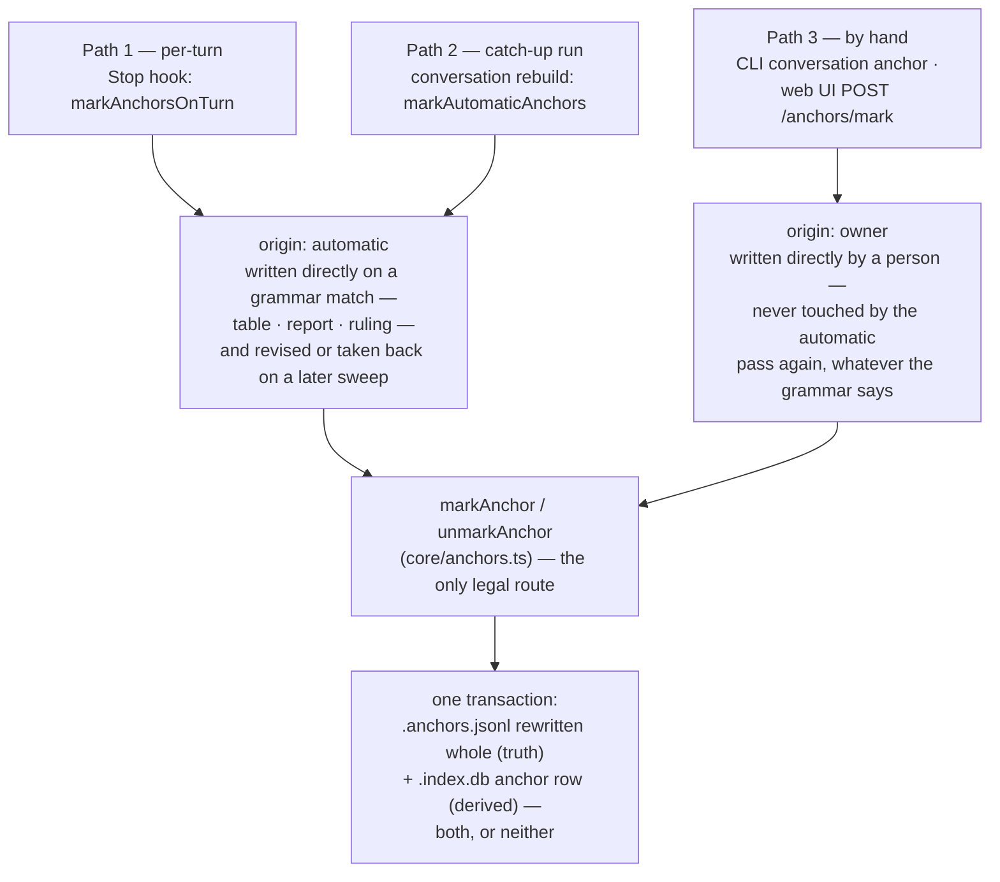

# 5. Anchors

An anchor is a bookmark into the conversation archive: a fixed point — one session (or one
subagent lane), one **byte offset** into its transcript, and a label — that lets the owner (or
retrieval, see [06 — Retrieval](./06-retrieval.md)) steer straight back to something already said,
instead of re-reading megabytes of transcript to find it again.

The mechanism is described end to end in `src/core/anchors.ts`'s own header as `plan:recall
seq:1`, Task 3 of `docs/superpowers/plans/2026-09-10-d42-conversation-retrieval.md` and §7 of
`docs/superpowers/specs/2026-09-10-conversation-retrieval-design.md`. The governing item is
`REQ-every-anchor-capability-is-reachable-from-the-screen-and-a` (severity `hard`, tagged `v2`,
`recall`, `ui`), whose summary states the shape of the whole feature in one sentence: *"Bookmarks
are made three ways — as the conversation grows, by one catch-up run, and by hand while reading —
and every one of them, and everything else you can do with them, works from the viewer."*

## 5.1 Why an anchor exists

The conversation archive (chapter 4) is prose search over transcripts that, on this workspace, run
into the hundreds of megabytes. Finding a passage once, by search, is cheap. Finding the *same*
passage again next week is not — unless something recorded exactly where it was. An anchor is that
record: it survives the fact that search re-ranks, transcripts get re-indexed, and byte offsets are
otherwise meaningless numbers nobody would think to write down by hand.

## 5.2 The file is the truth; the index is derived

This is the same relationship the corpus itself has between its Markdown items and the disposable
SQLite index (chapter 1) — and the project draws that parallel explicitly rather than leaving a
reader to notice it. From `src/core/anchor-file.ts`'s header:

> `.my_context/.index.db` is gitignored and DEFINED as disposable — the shape is the version,
> delete it and it rebuilds. Everything in it comes back from something else: conversations, lanes
> and prose from the transcripts, items from Markdown. **Anchors were the one exception.** They
> survive a rebuild... and nothing brought them back if the file itself went.

So `.my_context/.anchors.jsonl` — one JSON object per line, protocol-tagged
`my_context/anchor@1` — is the one part of the conversation index that is **not** re-derivable from
anything else. Confirmed on this workspace:

```
$ head -n 1 .my_context/.anchors.jsonl      # re-run 2026-09-17; this line will not match a later run
{"protocol":"my_context/anchor@1","id":"595db3b1-a481-4553-b4c0-7248c31b2655:-:100165384",
 "sessionId":"595db3b1-a481-4553-b4c0-7248c31b2655","agentId":null,"byteOffset":100165384,
 "label":"D | subject | state","kind":"table","origin":"automatic","at":"2026-09-11T22:20:36.813Z"}
```

**This is the one live paste in this chapter that is genuinely expected to change on every
re-run, by design, not by drift**: the file is fully rewritten in sort order on every write
(explained further down in this section), so "line 1" is whichever row currently sorts first — a different row than the
one shown here as soon as one more automatic anchor with a lower id lands. The line is shown to
demonstrate the **shape** of a row (nine keys on the wire, one JSON object per line) and the fact
that `head -n 1` is a meaningful, cheap way to confirm the file parses — not to assert which
specific row is first today.

Every row has the same **eight** fields, plus the `protocol` tag shown above that makes nine keys on
the wire: `id`, `sessionId`, `agentId` (a lane id, or `null` for the session's own transcript),
`byteOffset` (bytes, **never characters** — see §5.5), `label`, `kind`, `origin`, `at`.
`readAnchorFile` refuses a damaged line rather than silently reading it as "fewer
bookmarks", because — per `INV-nothing-is-dropped-silently` — the bookmarks are exactly the thing
nothing else can put back.

**Why a rewritten document and not an append-only log**, unlike `audit.ts` or `revision-log.ts`:
the automatic pass (§5.4) relabels hundreds of anchors in one run — 345 in the run the header cites
— and an append-only log would grow by hundreds of rows to describe 565 facts, with no reader ever
asking what a label *used to be*. So it is a document, written whole and swapped in with
`writeFileSync` to a temp path + `renameSync`, atomically: a kill mid-write leaves either the whole
old file or the whole new one, never a truncated one.

**Table ↔ file reconciliation** (`reconcileAnchors`) runs on every write and at the start of every
`conversation rebuild`: if the file is absent, the table's rows are adopted into a fresh file
(`direction: 'adopted'` — every corpus that predates this mechanism passes through here once, the
565 rows the header mentions included); if the file is present, the table is rebuilt from it
(`direction: 'restored'`, the ordinary steady state, which is what makes `.index.db` disposable
again even with anchors in it).

## 5.3 `origin: automatic` vs. `origin: owner`

Every anchor row carries one of exactly two origin values — confirmed on this workspace's own
file, re-measured 2026-09-16 **at the same moment as the `kind` count below it**, so the two
figures describe one file at one instant rather than two different days (a defect in an earlier
version of this chapter, corrected here — see the note at the end of this section):

```
$ wc -l .my_context/.anchors.jsonl
1355 .my_context/.anchors.jsonl
$ grep -o '"origin":"[a-z]*"' .my_context/.anchors.jsonl | sort | uniq -c
   1354 "origin":"automatic"
      1 "origin":"owner"
```

**This number is not merely dated, it is volatile within the session that reads it** — three
successive readings taken while repairing this chapter, minutes apart, gave 1,342, then 1,345,
then 1,348, then 1,355, because the per-turn pass (§5.6, Path 1) writes marks while this document
is being edited. **This chapter states the count exactly once, here, and every other section below
that needs to talk about "how many" uses "§5.3's count" or a magnitude in words, never a repeated
digit** — restating a specific number in more than one place is exactly how a previous version of
this chapter went stale in five places at once. Re-run the two commands above for the true count at
any later moment; do not trust a number copied from this page into a conversation or another
document.

- **`automatic`** — marked by the automatic pass (§5.4) because the turn under it matched a fixed
  grammar ("this is an anchor by its shape"), with no person asked.
- **`owner`** — marked by a person, through the CLI, the MCP surface, or the web UI. `markAnchor`'s
  default `origin` is `'owner'` for exactly this reason: a caller who does not say otherwise is a
  person.

The distinction is **load-bearing, not descriptive**. The automatic pass re-reads and can *take
back* its own anchors when the grammar no longer recognises what is at that byte (§5.4) — but it
never touches a row whose `origin` is `'owner'`, whatever the grammar says about the turn under it.
From `anchor-pass.ts`: *"an automatic pass that deleted a hand-made bookmark would be a far worse
defect than any it could fix."* The web UI's write routes enforce the same asymmetry from the other
direction: `apiAnchorMark` does not accept a `kind` or `origin` in the request body at all — a
point marked by hand through the screen is unconditionally `kind: 'note'`, `origin: 'owner'` — so
no request can forge a row that the automatic pass would later be entitled to erase.

`kind` on this same file, this same instant:

```
$ grep -o '"kind":"[a-z_]*"' .my_context/.anchors.jsonl | sort | uniq -c
      1 "kind":"note"
    447 "kind":"report"
     40 "kind":"ruling"
    867 "kind":"table"
```

1 + 447 + 40 + 867 = 1,355, matching the `origin` count and the file's own line count above —
three readings of one file taken at one instant agreeing, which is the property the version of this
section before this repair lacked (it paired a 2026-09-16 `kind` reading against a stale 2026-09-12
`origin` reading and a 2026-09-13 line count from a different section, three different days inside
one paragraph — and a repair of that specific defect then immediately produced a *narrower* version
of the same defect, by refreshing this block and leaving five other mentions of the count elsewhere
in this chapter unrefreshed; those five now say "see this section" rather than a digit, for exactly
that reason). (An early `kind` snapshot, 2026-09-13: 1 `note`, 299 `ruling`, 336 `table`, no
`report` — see §5.4a below for why `report` exists at all now; useful only to show the shape of the
grammar change, not as a baseline for arithmetic.) `note` is the default kind for a hand-marked
anchor — but as of 2026-09-15 it is one of **six** a person may now choose, not the only one
(§5.4b). `table`, `ruling` and **`report`** are the three grammars the automatic pass recognizes
(§5.4), `table` is comfortably the largest of the three and `ruling` comfortably the smallest, and
the one hand-marked anchor on this workspace is still the single `note`.

## 5.4 What "automatic by nature" means — the grammar, not a judgement

`anchor-pass.ts` is explicit that the automatic half **does not score, threshold, or infer**:

> a lexical signal/noise classifier measured **AUC 0.499** on this corpus — a coin flip — and a
> two-rule version of the best single feature still admitted 47% of the noise.

**It runs three fixed, structural grammars over turn text, and — since `anchorsInTurn` was rewritten
2026-09-16 — returns EVERY grammar that matches, not the first.** This is not a minor correction:
an earlier version of this section said "first match wins," which was true before 2026-09-16 and
is the exact behaviour §5.6a below (in the same chapter) describes being deliberately replaced. The
function's own header states the current rule directly: *"EVERYTHING THAT MAKES THIS TURN AN
ANCHOR BY NATURE — every grammar that recognises it, not the first one that does."* A turn can
therefore carry a `table` mark and a `report` mark and a `ruling` mark at once, in principle, though
the source notes the list "can hold at most two entries today" given what can co-occur in practice.

1. **`table`** — the turn's text contains a GFM Markdown table: a delimiter row (all-dash cells,
   optional alignment colons) directly under a header row of the *same* cell count. The label is
   the first readable header cell (`tableLabel`), because the naive "whole header row joined"
   scheme produced 25 anchors literally labelled `|` before the owner's 2026-09-11 ruling fixed it.
2. **`report`** — a lane's FINAL answer, found *structurally* from `subagents` and the prose index
   (which lane, which is its last turn), labelled with the lane's own mission — never by matching
   text in the turn. See §5.4a: this is not the grammar that was withdrawn on 2026-09-11.
3. **`ruling`** — **rewritten 2026-09-15, and the description below is of the CURRENT grammar, not
   the one this section described until this repair.** The original detector matched a normative
   corpus id (`\b(?:DEC|RULE|INSTR|STD|CONST|INV)-[a-z0-9]+(?:-[a-z0-9]+){3,}\b`) inside a `prompt`
   turn. `anchor-pass.ts` now carries that detector's own obituary, in the past tense, with the
   measurement that killed it: over all 10,836 prose spans of the owner's real archive, the id
   grammar owned 377 of 1,164 marks and **marked zero turns he actually typed** — 296 of the 377
   were this plugin's own `SubagentStart` injection block (which recites every governing item, so
   it carries ids in bulk), and even a perfectly tightened version of the guard would have matched
   nothing, because across 519 turns he typed over 13 days he named a normative id **zero times**.
   **What ships now** is `ownerTyped(record)` — true only when a record's own `origin.kind ===
   'human'`, i.e. the owner actually typed it, not a sidechain and not a meta record — combined
   with a fixed word list read off his own real turns, `RULING_WORDS`:
   ```
   /\b(?:always|never|nevver|must|unacceptable|not allowed|forbidden|from now on|
        i approve|i decide|the rule|this rule|a rule|standardi[sz]e)\b/i
   ```
   (`nevver` is his own spelling, kept because a list read off a real corpus carries what the
   corpus holds.) A broader "modal" list (`should`/`i want`/`need to`/`do not`) was measured and
   refused: it marks 143 of his turns at the *same* ~40% worth-having rate as the dumb baseline of
   "250 characters with no keyword at all" — thin and precise beat wide and average.

`AUTOMATIC_ANCHOR_KINDS = ['table', 'ruling', 'report']` (`src/core/anchors.ts`) is the closed list
these three write to, asserted disjoint from the owner's own vocabulary (§5.4b) so that
reconciliation can never confuse a mark the pass made for one a person made.

**Cost containment is two probes, not eight, and neither is `DEC-`/`RULE-` any more** — those went
with the id grammar above. `ANCHOR_PROBES` (`src/core/anchor-pass.ts`), verified directly against
source:
```ts
const ANCHOR_PROBES = [ { probe: '|---' }, { probe: '| ---' } ];
```
Both probes narrow the search index to *table*-shaped candidates only, each capped at
`ANCHOR_PROBE_LIMIT = 200` hits. **The `ruling` grammar is no longer probed at all** — it now reads
every `prompt` span of a session's own transcript directly, unranked and unbounded
(`anchor-pass.ts`), because `ownerTyped` plus a word match is cheap enough per turn that the
probe-then-grammar shape the `table` detector still needs was never required for it.

## 5.4a `report` was withdrawn, and then a *different* `report` shipped

A grammar named `report` **existed, was withdrawn, and then re-shipped as a different mechanism
wearing the same word** — read the two halves as separate facts, because conflating them is the
easiest way to get this subject wrong.

**What was withdrawn, 2026-09-11.** A `report` anchor was originally a *dated path* under
`reports/` or `docs/superpowers/{specs,plans}/`, matched as text inside a turn — the turn merely
had to *mention* such a path. It produced 101 of a first overnight run's 613 anchors; the owner
read them and ruled it marks "a turn that *mentions* a report, not a report" — not worth having.
That regex and its two probes are gone, permanently, and the pass actively takes back any
previously-written `report`-kind anchor it finds standing from that era, on every sweep.

**What shipped in its place, 2026-09-15.** `src/core/anchors.ts`'s own header states this as
directly as any comment in the codebase: *"`'report'` IS BACK, AND IT IS NOT THE ONE HE
WITHDREW."* The word was re-spent on the *opposite* shape — a lane's own FINAL ANSWER, identified
structurally from the `subagents` table and the prose index (which lane, and that this is its last
turn), never by any text pattern. The mark sits *on* the report itself; nothing about the mechanism
can fire on a turn that merely names or links to one, because no text is ever consulted to decide
it. This is why the closed list above can hold `'report'` again without reviving the defect the
owner ruled out: the two `report`s test for entirely different things, and the second one cannot
reproduce the first's failure mode by construction.

`report` is now the **second most common kind on this workspace's own anchor file** — see §5.3 for
the live count and how to re-derive it — up from 192 of 432 lane-report turns being named `report`
at all when the owner asked for this on 2026-09-15, to all of them.

## 5.4b The owner's own vocabulary — six kinds a person may choose, not just `note`

Until 2026-09-15 every hand-made anchor was forced to `kind: 'note'` — the only choice a person
had was a label. The owner's question that changed it: *"does the user have the same input options
so it will be documented it is marked anchores?"* He had made **one** mark in 750 at the time.

`OWNER_ANCHOR_KINDS` (`src/core/anchors.ts`) is now a closed list of **six**:

```
note   decision   question   defect   evidence   todo
```

`note` stays first and stays the default, because it is what every pre-existing hand-made anchor
already carried, and a vocabulary that invalidated the owner's one existing mark would be a poor
way to give him five more. The list is closed rather than free text **on the owner's own ruling**:
*"Any owner kind must sit OUTSIDE the automatic set (table, ruling[, report]) so reconciliation
cannot confuse the two"* — a free-text kind typed as `table` would be an `origin: 'owner'` row
wearing the automatic pass's own word for what it writes, readable as either by any later code that
trusts `kind` without checking `origin` beside it. `isOwnerAnchorKind` is the guard, and
`test/core/anchor-kinds.test.ts` holds the disjointness between the two lists directly.

**`origin` still protects the row**, unchanged: the automatic pass skips every `origin: 'owner'`
anchor whatever kind it carries — which is also why a relabel may leave an automatic row wearing its
original `'table'`/`'ruling'`/`'report'` kind even after it becomes the owner's. The six-kind
vocabulary is a second, independent guarantee, not a replacement for the first.

**On the screen**, each of the nine possible kind strings (three automatic, six owner) resolves to
one of three hue groups plus an unhued fourth. `ANCHOR_KIND_HUE`
(`src/ui/public/screens/conversations.js`), read directly rather than paraphrased:

```
ruling: kindsettled     decision: kindsettled
defect: kindowed        question: kindowed      todo: kindowed
table:  kindfound       report:   kindfound     evidence: kindfound
note:   null
```

So `ruling` and `decision` **share** the first group — an earlier version of this section said
`decision` gets its own group, which both undercounts the group (leaving `ruling` unaccounted for)
and overstates `decision`'s distinctiveness; `defect`/`question`/`todo` share a second; `table`/
`report`/`evidence` share a third; `note` carries no hue at all. **No sixth meaning-colour was
minted for this** (`DEC-the-meaning-hue-budget-is-five` is still five) — a hue says *posture*,
never *which kind*, and the glyph plus the word say which kind, per the 2026-08-27 amendment quoted
in chapter 15.

## 5.5 The id is derived from the position — never from a clock or a counter

`anchorIdFor(sessionId, agentId, byteOffset)` — an anchor's id is a pure function of *where* it
points, not of when it was made. This is what makes marking **idempotent by construction**: the
automatic pass re-runs on every rebuild and every qualifying turn, and marking the same point twice
produces the same row rather than a duplicate bookmark.

**The position is bytes, never characters**, and this is asserted repeatedly across the anchor
code because getting it wrong fails silently: `resolveAnchor` seeks to the offset and reads the
record that *starts* there; a character offset on an archive that is (per the code comments)
half Hebrew from record 5 onward lands mid-record and reads back as unreadable rather than
throwing. The CLI actively refuses a non-digit-string offset with an explanation of exactly this.

## 5.6 The three creation paths

`REQ-every-anchor-capability-is-reachable-from-the-screen-and-a`'s summary names them: *"as the
conversation grows, by one catch-up run, and by hand while reading."*

**Path 1 — per-turn, as the conversation grows.** `markAnchorsOnTurn` (`core/anchor-pass.ts`) is
wired into `stopConversationRefresh` in `src/hooks/stop.ts`, after `rebuildConversations`, inside
the Stop hook that fires at the end of every assistant turn. It is **scoped**: it costs nothing on
a turn where no transcript moved (a `(bytes, mtimeMs)` comparison, ~3-6 ms in steady state), and is
bounded — `TURN_PROSE_BUDGET_MS = 250` ms and `TURN_PROSE_SOURCE_BYTES = 16 MiB` — because it runs
inside the platform's 3-second hook timeout, past which the hook is killed and the turn's whole
audit row is lost. It swallows its own failure (returns `null`) rather than costing the turn its
refresh report; per the header, this was withdrawn once already for cost reasons and re-landed on
2026-09-12 only after the underlying prose-index cost regression (96.7 MB / 421 ms → 571 B / 7.5 ms)
was independently repaired — `test/core/anchor-per-turn.test.ts` measures the steady state directly
rather than trusting the earlier claim.

**"On the fly" was measured directly, 2026-09-16, and it holds — with one caveat that is not
where the complaint about it pointed.** `reports/2026-09-16-marks-on-the-fly-measured.md` drove a
real browser against a spare server for 31m 41s and timed every link from a store write to a
repaint: the store's own `(present, bytes, mtimeMs)` token moves within 78–350 ms, the page
refetches `/anchors` on the next `/tip` poll (`TIP_MS`, 1 Hz), and the visible count repaints
267–674 ms after the store file changes — every main-document mark created in the validated window
reached the open page unprompted, with no reload, and none was ever missed. **The actual delay
people report is upstream of that path**: marks are **flushed to `.anchors.jsonl` in batches**, and
a mark stamped when a table appeared was measured sitting unflushed in the writer for up to
**5m 37s** before the store moved at all — so "nothing appeared" is usually "nothing was created
yet" or "it is still sitting in the writer," not the reader failing to notice a write it already
saw. The same report also found that **a UI server restart silently kills an open page's live
updates** — the tab's token dies with the process, every `/tip` then fails, and the page keeps
showing its last count with nothing on screen saying so — which is a plausible reader-facing
explanation for "marks stopped updating" that has nothing to do with the flush delay above.

**Path 2 — one catch-up run.** `mycontext conversation rebuild` calls `markAutomaticAnchors`
unscoped — every probe, every one of the pass's own previously-marked rows re-read at its own byte
— which is the run a *changed grammar* (a code change, not a new turn) needs in order to trim
stale anchors. Measured on this workspace: ~550 ms in steady state (574 probe candidates + 621 of
the pass's own rows, each a seek).

**The first run over a workspace's archive is a different act, and it asks first.** Nobody starts a
project with this plugin already installed — the ordinary case is months of Claude Code sessions
already on disk, and `conversation rebuild` is the door those pre-existing conversations come
through. Measured on a foreign archive the day this shipped (2026-09-16) — one session, 575 lanes,
**13,375 prose spans**, of which **726** were turns the person himself typed — that door would mark
**1,213 points in one act**, and §5.3's own measurement is that even a count in the low thousands
is already enough to make the rarer kinds hard to find by scrolling. So `automaticAnchorsStanding(index) === 0` is
detected as "this is a first run," and only a first run **plans before it writes**: it composes the
same report a real run would produce, discloses it in full (every line, before the write, including
on `--json` — as the `plan` field rather than a sentence a machine reader would never see), and then
asks for consent to proceed. `--plan` asks the identical question at any time and never writes,
whether or not this is a first run. Every later run is incremental and small enough that re-asking
would be a prompt nobody reads, which is the argument `automaticAnchorsStanding` exists to make —
the consent gate is deliberately a first-run-only cost, not a permanent tax on the command.

**Path 3 — by hand.** A person marks a point directly, two ways:
- **CLI**: `mycontext conversation anchor <session> <byte> --label "<why>"` (see §5.8).
- **Web UI**: `POST /api/conversations/anchors/mark` from the Conversations screen — either while
  reading a transcript, or directly from a search-hit row (the read model already marks each hit
  `anchored: boolean` via `anchorIdFor`, so the screen knows before the click whether that exact
  point already has a bookmark).

All three paths converge on the same two doors — `markAnchor` / `unmarkAnchor` in
`core/anchors.ts` — which are the *only* legal way to reach `index.putAnchor`/`dropAnchor`: those
lower-level index methods refuse to run outside a transaction they recognise
(`IN_ANCHOR_TRANSACTION`, a `WeakSet` keyed by index handle), specifically so that a mutation which
commits the SQLite row without also rewriting `.anchors.jsonl` in the same transaction is
impossible rather than merely discouraged — a caller that got this wrong would silently lose the
bookmark at the very next reconciliation. This is asserted, not just designed: `test/ui/anchor-write-route.test.ts` runs a whole anchor round trip through the UI routes and checks
that **every byte of the corpus except the anchors document and the index** is untouched.



**This is not a propose/approve queue** — worth stating plainly, because "the grammar proposes, a
person disposes" reads that way and the mechanism is narrower than that. There is no staged,
pending anchor awaiting a human decision the way a `draft` normative item does
([chapter 3](./03-creation-and-gates.md)). Each lane above writes directly. What makes this an
*ownership boundary* rather than two paths to the same thing is the asymmetry after the write: the
automatic lane may revise or withdraw its own `automatic` rows on a later sweep, and can never touch
an `owner` row "whatever the grammar says about the turn under it" — the person's lane is written
once and stands.

## 5.6a A turn can wear two marks — one turn, two rows, one stop

Shipped 2026-09-16, closing an open question the owner answered by rejecting the question as
posed. Asked which grammar should win when one turn qualifies as both a `table` and a lane's
`report`, he ruled: *"table & report - if required make them 2 different anchor types with 2
distinguished marks."* Neither branch on offer was a precedence rule; he chose to keep both.

**The key.** An anchor row is keyed by `(sessionId, agentId, byteOffset)` (`anchorIdFor`), which is
what makes marking idempotent by construction — the same point marked twice produces the same row,
never a duplicate. A second mark at an already-owned point needed a second id without changing what
the first one means, so `anchorIdBeside(sessionId, agentId, byteOffset, kind)` — the same string
with `#<kind>` appended — names the *other* mark at that point. `anchorIdFor` itself is untouched:
it still names whichever mark **owns** the point, which is what lets an unrelated surface (a search
hit asking "is this point already marked") keep deriving an id from a byte offset alone, with no
need to know what kind of mark might be there.

**What it costs, and why it is purely additive.** The table grammar keeps first claim on the bare
id — the large majority of turns already carried a judged-good table mark at the point's own id
when this shipped — so adding the report grammar beside it gained rows and rewrote none: **+240
rows, 0 rewritten**, measured once on this workspace's own archive the day it landed (2026-09-16).
That `+240` is a one-time delta from a specific `git diff`-style before/after around the change
itself, which is why it stays a fixed fact even though every *absolute* count in this chapter
(table's total, report's total, the file's total) is not — see §5.3 for the live reading, taken at
a different, later instant, and expect it to disagree with any specific absolute number quoted
here.

**The count stays honest about what changed.** A turn with two marks counts **once** in "N marked
point(s) here" — the stepper's job is "take me to the next *place*," and it must never land on the
same turn twice without saying why. The marks *list*, by contrast, counts rows, and the two numbers
can now differ: the screen discloses exactly that, *"{n} of them carry two marks,"* drawn only when
non-zero, rather than leaving a reader to notice a mismatch between two screens by comparing them
by hand. Under a kind filter the two numbers converge again — narrowed to `report`, every stop
shows one mark of that kind and the count is a count of marks once more.

**The trade, both halves, stated rather than only celebrated.** `report` goes from naming a minority
of lane-report turns (192 of 432, 44%) to naming all of them (100%), and `table`'s share of the
unfiltered marks list falls from 78% to roughly two-thirds. What gets worse: an unfiltered scroll of
the marks list is longer by exactly the number of doubled turns, so the rarest kinds (`ruling`,
`note`) are a smaller share of it than before — the kind filter, which is the actual tool for
finding a rare kind, is unaffected. **The document itself gains zero new stops**: every doubled
turn already had a stop at that point, so nothing new appears to scroll past.

## 5.7 What's NOT built / built but off

- **The original text-matching `report` grammar remains built-then-removed and stays gone** — a
  documented case of the project measuring a feature, shipping it, watching it produce 101 useless
  bookmarks in one night, and deliberately deleting the regex and its probes rather than tuning
  them (§5.4a). `test/cli/anchors.test.ts` holds *that* removal from both directions. **A different
  `report` grammar, structural rather than text-matching, shipped 2026-09-15 and is very much
  built** — see §5.4a. Do not read "report is built-then-removed" as still true of the kind name
  itself; it is true only of the specific text-matching mechanism that once wore it.
- **No scoring/ML classification** for what counts as an anchor — ruled out on measured evidence
  (AUC 0.499), not merely undone; see §5.4.
- **No anchor ordinal is reported.** `resolveAnchor` deliberately answers only "the record at this
  byte", not "the Nth record in the transcript" — a second position that could disagree with the
  first. Callers needing an ordinal (the document view) walk the file once themselves and keep an
  outline, rather than this module inventing a second notion of position.
- **A composed CLI command the UI merely displayed for the reader to copy** was the state of the
  world until 2026-09-12, and the owner explicitly ruled it insufficient — *"a composed command the
  reader must copy into a terminal is NOT the UI having the capability, it is the UI describing
  one"* — which is why `src/ui/anchor-write.ts` exists at all. The CLI's own `anchor` command
  header records this history and states plainly it is "not retired": CLI, MCP, and UI are peers,
  per the owner's ruling ("cli is ok, mcp too").
- **`list-anchors` is a retrieval mode, and it is the one anchor capability this chapter does not
  reach** (chapter 6 names it among the four modes; this cross-reference is the link that was
  missing). `RetrievalMode` is
  `'from-selection' | 'free-text' | 'list-subjects' | 'list-anchors'`
  (`src/core/retrieval/mission.ts:50`), and `list-anchors` is the mode that answers "what fixed
  points exist" rather than "where did this passage come from". It carries a **window** (`:108`,
  measured 2026-09-13), and it is registered as `needsText: false` on the UI side
  (`src/ui/read-model-retrieval.ts:105`, with the fixed-point handling at `:517`). It is reachable
  **only from the retrieval surface** — not from `mycontext conversation anchor`, which lists the
  file. See [06 — Retrieval](./06-retrieval.md).
- **The anchor count moves constantly, within minutes and not just across days** — 636 on
  2026-09-12, 715 on 2026-09-13, then three successive readings taken minutes apart while repairing
  this very chapter on 2026-09-16/17 (§5.3), because the automatic pass runs every turn and a new
  automatic grammar (`report`, §5.4a) landed in between. This chapter states the exact count in
  exactly one place (§5.3) for exactly this reason; treat any other number in this chapter that
  looks like a row count as either a fixed historical fact (labelled as such) or an error to report.
- **The writer batches its flush, and that is the actual "on the fly" delay** (§5.6, Path 1) —
  measured up to 5m 37s from a turn being written to its anchor reaching `.anchors.jsonl`, against
  a reader-facing repaint of well under a second once the store does move. A future lane shortening
  "as soon as they are created" has this number to beat, not the read path, which was directly
  measured and cleared.
- **A UI server restart silently kills an open page's live anchor updates** (§5.6, Path 1) — the
  tab's token dies with the process, `/tip` then fails on every poll, and nothing on screen says
  so. Filed as a defect, not fixed here.

## 5.8 Worked examples

**List every anchor (CLI):**
```
$ mycontext conversation anchor
```
Draws a table of `id | kind | set | marked | label`. On an un-indexed workspace this refuses with a
pointer to `mycontext conversation rebuild` rather than silently creating the archive tables — per
the code's own comment, "marking a bookmark is not a way to turn the archive on."

**Find by label:**
```
$ mycontext conversation anchor --find "D42"
```
Searches anchor *labels* only — a different question from searching the archive's **prose**.
Until 2026-09-16 that prose search had no CLI surface at all; `mycontext conversation search`
(chapter 14) now reaches it directly. `--find` remains a genuinely different tool even so: it
matches the label a *person* wrote, not the transcript, and it exists to *place or locate a
bookmark* rather than to return a ranked result set.

**Mark one by hand:**
```
$ mycontext conversation anchor <session-id> <byte-offset> --label "why I kept this"
```
Validates the offset is a plain digit string (refusing with an explicit "bytes, never characters —
this archive is half Hebrew" message otherwise), requires `--label`, and — after marking — reads
the record back and echoes its first line, or warns "nothing starts at that byte... that is what a
CHARACTER offset produces" if the offset didn't land cleanly, while still keeping the (probably
wrong) mark rather than silently discarding the person's action.

**Take one back:**
```
$ mycontext conversation anchor --drop <anchor-id>
```

**Use case.** Mid-session, the owner is told the archive holds a ruling he gave weeks ago about a
budget number. He finds the turn by searching the archive's prose — on the Conversations screen, or
now from a terminal with `mycontext conversation search "budget"` (chapter 14) — and rather than
re-running that search every time it matters, he anchors the exact byte with a label. From then on
`mycontext conversation anchor --find "budget"` takes him straight back **from a terminal**,
without re-walking the transcript or re-trusting search ranking to surface the same hit twice.
That is the practical value of an anchor even now that both surfaces can search: a search re-ranks
as the archive grows, and an anchor is a fixed point that does not move under it.

## See also

- [00 — Index](./00-index.md)
- [14 — Search over the archive](./14-search-over-the-archive.md) — the query grammar the automatic
  pass's probes are built on, and the CLI's own `conversation search`
- [15 — The document and lane viewer](./15-document-and-lane-viewer.md) — the marks-in-the-margin
  and take-back controls this chapter's mechanism draws on screen
- [04 — The conversation archive](./04-conversation-archive.md) — what the transcripts an anchor
  points into actually are, and how prose search finds candidates for the automatic pass.
- [06 — Retrieval](./06-retrieval.md) — how a pasted passage is reconstructed back to a source,
  which is the consuming half of what an anchor records.
- [08 — The web UI](./08-web-ui.md) — the Conversations screen's anchor controls in full, and the
  no-writes guarantee's narrow, tested exception for these four routes.
