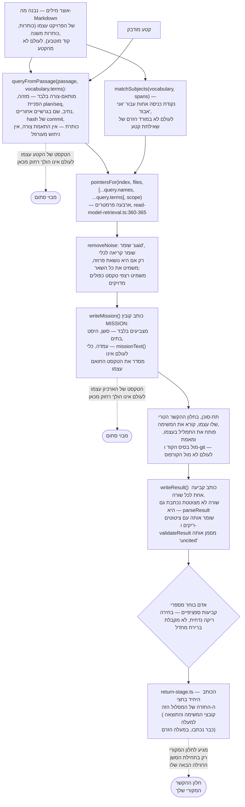

<!--
  Hebrew mirror of `docs/capabilities/06-retrieval.md`. The English file is the
  source. Conventions: `docs/README.he.md` and `docs/the-store.he.md` — Hebrew
  prose and tables inside `<div dir="rtl">`, fenced blocks outside it,
  `<span dir="ltr">` around any Latin run whose edge characters are not both
  alphanumeric and around any run of two or more Latin terms joined by commas
  or slashes.

  Every fenced block is byte-identical to the English file: the module's own
  worked example, the rendered return header, the CLI usage line and the
  TypeScript walkthrough are code and output, not prose, and are not
  translated. The Mermaid labels are translated; the graph structure is the
  English one.

  Heading sequence must stay identical to the English file.
-->

# 6. שליפה — שחזור נושא בלי הרעש

<div dir="rtl">

> פרק 6 של סימוכין היכולות של my_context. ראו [<span dir="ltr">`00-index.he.md`</span>](./00-index.he.md)
> למפה המלאה. קשור: [<span dir="ltr">`04-conversation-archive.he.md`</span>](./04-conversation-archive.he.md)
> (המאגר שזה קורא ממנו), [<span dir="ltr">`05-anchors.he.md`</span>](./05-anchors.he.md) (אחת
> הדרכים פנימה), [<span dir="ltr">`13-testing-discipline.he.md`</span>](./13-testing-discipline.he.md)
> (איך הערובות למטה מוכחות).

## הערובה, נאמרת במדויק

my_context מאפשרת לאדם להדביק קטע שרירותי — שורה שהועתקה ממציג השיחות, שבר של תמליל, משפט
תועה ממסמך — ולקבל בחזרה דין וחשבון קטן, כרונולוגי ו**מצוטט** על הנושא שאותו קטע עוסק בו,
משוחזר מארכיון השיחות של הפרויקט עצמו, מקורפוס ה-Markdown שלו, ומהמצב החי של הקוד ושל היסטוריית
git. הקטע יכול לבוא מכל מקום בחודשים של היסטוריה; מה שחוזר אינו ההיסטוריה ההיא.

הערובה שהעיצוב בנוי סביבה, במילות הפרויקט עצמו
(<span dir="ltr">`TASK-reconstruct-a-subject-from-a-passage-you-copied-without-the`</span>):

> שליפה לעולם אינה כותבת לתוך ההקשר החי. היא כותבת **משימה** לתת-סוכן שקורא בחלון טרי, מאמת
> מול **בסיס הקוד ו-git** ולא מול הקורפוס… ומחזיר משהו קטן, כרונולוגי ו**מצוטט**… **שום דבר**
> אינו מגיע להקשר שלו עד שהוא בוחר בו — ואז מתוארך, מסומן כרישום, ופסיקה שהוחלפה אומרת זאת
> בהגעה.

שתי הבטחות נפרדות נארזות לתוך המשפט האחד הזה, והקוד שומר אותן כשני מנגנונים נפרדים:

1. **הרעש של הארכיון עצמו לעולם אינו צריך להגיע לחלון הקשר כדי להיות מחופש.** מכונה (קריאות
   לכלים, חשיבה, טקסט תבניתי של המעטפת) וטקסט משוכפל מסוננים החוצה ממה שתת-סוכן בכלל מופנה
   אליו, לפני שמשהו נקרא.
2. **שום דבר שנמצא אינו נמסר אוטומטית, אף פעם.** הרצת שליפה מייצרת קובץ על הדיסק. אדם קורא
   אותו ובוחר, קביעה אחר קביעה, מה — אם בכלל — חוזר, ומה שחוזר מסומן באופן חד-משמעי כרישום
   מהעבר, ונבדק מול האם הוא עדיין מחזיק.

שתי ההבטחות למעלה הן שני מבואות סתומים שמצוירים לתוך צינור אחד — הטקסט של הקטע עצמו והטקסט של
הארכיון עצמו כל אחד מפסיק להתפשט בפונקציה נקובה, הרבה לפני שמשהו שדומה ל"חומר שיחה" יכול היה
להגיע לחלון הקשר:

</div>



<div dir="rtl">

שתי נקודות כניסה מזינות את אותה קריאה ל-<span dir="ltr">`pointersFor`</span>, והן אינן שלבים של
צינור אחד: שאילתת קטע (<span dir="ltr">`from-selection`/`free-text`</span>) מתאימה-צורה את
הטקסט המודבק מול המונחים של אוצר המילים עצמו, בעוד ש-<span dir="ltr">`list-subjects`</span>
(*"אני אבוד"*, בלי קטע) מתאים את אוצר המילים מול מקטעי שיחה ישירות.
<span dir="ltr">`matchSubjects`</span> לעולם אינו במורד הזרם של
<span dir="ltr">`queryFromPassage`</span>. והמשימה והתוצאה שניהם קבצים שנכתבו לדיסק קודם לכן,
בעיצוב — הקביעה "הכותב היחיד" שייכת ל-<span dir="ltr">`return-stage.ts`</span> לבדו, בחצי
ה**החזרה** הצר יותר של המסלול, ולא לצינור כולו.

**"שורה לא מצוטטת לעולם אינה נכתבת בכלל" היה שגוי, והוא היה שגוי בכיוון שחשוב**: הוא תיאר את
הערובה כמנגנון כשהיא הוראה. ההוראה אמיתית — <span dir="ltr">`missionText`</span> אומר לתת-סוכן
*"קביעה שאינך יכול לצטט היא קביעה שאתה משמיט"*
(<span dir="ltr">`src/core/retrieval/mission.ts:345`</span>) — אבל שום דבר אינו אוכף אותה
בכתיבה. <span dir="ltr">`writeResult`</span>
(<span dir="ltr">`src/core/retrieval/result.ts:290-295`</span>) מרנדר וכותב כל קביעה שנמסרת לו;
<span dir="ltr">`parseResult`</span> קורא שורה לא מצוטטת בחזרה *"עם
<span dir="ltr">`citations`</span> ריקים, לעולם לא כשום דבר — זה מה שהופך תוצאה לא מצוטטת
לניתנת לדיווח ולא לבלתי נראית"* (<span dir="ltr">`:258-262`</span>); ו-
<span dir="ltr">`validateResult`</span> (<span dir="ltr">`:342-352`</span>) מעלה ממצא
<span dir="ltr">`kind: 'uncited'`</span> עבורה. סעיף 5 למטה קובע זאת נכון, והדיאגרמה נהגה לסתור
אותו. העיצוב הוא שקביעה לא מצוטטת **נראית**, לא שהיא בלתי אפשרית.

כל מה שמשמאל ל-<span dir="ltr">`MISSION`</span> רץ בתוך החלון של הקורא עצמו ולעולם אינו נוגע
בטקסט שיחה; כל מה שמימין ל-<span dir="ltr">`SUB`</span> רץ בתוך חלון נפרד משלו של תת-סוכן
שהקורא לעולם אינו חולק. המסלול היחיד חזרה לחלון ששאל הוא השורה התחתונה — בחירה מפורשת של אדם,
מבוימת, נמסרת מאוחר יותר, באותה צורה כמו הנשא של [שחזור](./07-restore-and-handover.he.md) עצמו.

זו יכולת שונה באמת מ**חיפוש** פריטים (<span dir="ltr">`mycontext search "<words>"`</span>,
מכוסה ב-[<span dir="ltr">`09-cli-and-mcp.he.md`</span>](./09-cli-and-mcp.he.md)):
<span dir="ltr">`search`</span> מוצא *פריטים בקורפוס* לפי מילים, תגיות, נתיבים או יחסים,
וההתאמות שלו בטוחות להזרקה כי פריטים הם כבר הרישום המזוקק והמושל. שליפה עובדת שכבה אחת למטה —
מעל **ארכיון השיחות** הגולמי (תמלילים, לא פריטים) — שהיא בדיוק השכבה ש*אינה* בטוחה להצבה מול
מודל בלי סינון, כי היא בעיקר מכונה וחזרות. **חיפוש פרוזה** בארכיון
(<span dir="ltr">`searchArchive`/`searchArchiveTiered`</span>, פרקים 4 ו-14 — נגיש ממסך
השיחות, ממעבר העוגנים האוטומטי, ו — מאז 2026-09-16 — מ-
<span dir="ltr">`mycontext conversation search`</span> בטרמינל) מוצא *תורים* בארכיון בהתאמת
טקסט FTS5; צינור השליפה הזה הוא השכבה שמעליו שהופכת תור (או קטע מועתק) לדין וחשבון חסום, מאומת
וניתן לציטוט על *נושא*, ומסרבת לתת לחומר הגלם לנסוע איתו. המודול הזה ספציפית עדיין קורא ל-
<span dir="ltr">`searchArchive`</span> הישן והלא מדורג ולא לפונקציה המדורגת החדשה — ראו פרק 14
§14.2 כדי לדעת למה השניים אינם ברי החלפה (שליפה ומעבר העוגנים האוטומטי שניהם תלויים בהיסט עימוד
יציב שאיחוד השכבות אינו מספק).

## מצב: בנוי, ומחווט בשניים מתוך שלושה משטחים

זה חשוב מספיק כדי לומר לפני כל דבר אחר, וזו הקביעה בפרק הזה שזזה הכי הרבה. **נכון ל-2026-09-13,
לכל שבעת המודולים תחת <span dir="ltr">`src/core/retrieval/`</span> יש צרכן אמיתי ב-
<span dir="ltr">`src/`</span>** — לא רק טסט:

</div>

<div dir="rtl">

| מודול | צרכנים מחוץ ל-<span dir="ltr">`src/core/retrieval/`</span> |
|---|---|
| `mission.ts` | <span dir="ltr">`src/ui/read-model-retrieval.ts`, `src/review/drift.ts`</span> |
| `from-selection.ts` | <span dir="ltr">`src/ui/read-model-retrieval.ts`, `src/review/drift.ts`</span> |
| `noise.ts` | <span dir="ltr">`src/ui/read-model-retrieval.ts`, `src/review/drift.ts`</span> |
| `subjects.ts` | <span dir="ltr">`src/ui/read-model-retrieval.ts`, `src/core/conversation-index.ts`, `src/review/drift.ts`</span> |
| `result.ts` | **<span dir="ltr">`src/cli/commands/restore.ts`</span>**, <span dir="ltr">`src/ui/read-model-retrieval.ts`</span> |
| `return.ts` | **<span dir="ltr">`src/cli/commands/restore.ts`</span>**, <span dir="ltr">`src/ui/read-model-retrieval.ts`, `src/ui/retrieval-write.ts`, `src/core/session-summary.ts`</span> |
| `return-stage.ts` | **<span dir="ltr">`src/cli/commands/restore.ts`</span>**, <span dir="ltr">`src/ui/retrieval-write.ts`</span> |

</div>

<div dir="rtl">

**יש מסלול שורת פקודה, והוא <span dir="ltr">`mycontext restore`</span>.**
<span dir="ltr">`src/cli/commands/restore.ts:8–12`</span> מייבא את
<span dir="ltr">`readResult`</span>, <span dir="ltr">`markReturn`/`returnReviewForm`</span> ו-
<span dir="ltr">`stageableReturn`</span>, והפקודה נושאת צורת שימוש שנייה שנבנתה במיוחד לצינור
הזה:

</div>

```
mycontext restore --build --from-result <file> [--claims <1,3,7>] [--json]
```

<div dir="rtl">

הייבואים ההם נחתו ב-<span dir="ltr">`121b01b0`</span> ב-**2026-09-12 בשעה 03:13**. שני
המודולים הלא מחווטים האחרונים (<span dir="ltr">`noise.ts`</span>,
<span dir="ltr">`subjects.ts`</span>) חוברו לתוך
<span dir="ltr">`src/ui/read-model-retrieval.ts:69, 72`</span> על ידי
<span dir="ltr">`11f6655e`</span> ב-2026-09-13. טיוטה מוקדמת יותר של הפרק הזה אמרה "שום דבר
במשטח שורת הפקודה או ה-MCP אינו קורא לאף אחד מהם עדיין"; זה כבר היה שקר כשזה נכתב, וזה סוג
הקביעה — מוחלט שלילי על חיווט — שהסימוכין הזה צריך לקבוע ב-grep אחרי מייבאים ולא בשליפה מהזיכרון
של כוונת עיצוב.

**מה שנשאר נכון:** שום **כלי MCP** אינו חושף שליפה, ו**שום hook** אינו יכול להגיע אליה — השני
נקבע על ידי טסט, ולא רק נצפה (ראו את טסטי הבידוד למטה).

ממשק הרשת הוא המשטח המלא ביותר: <span dir="ltr">`GET /api/retrieval`</span>,
<span dir="ltr">`POST /api/retrieval/mission`</span>, <span dir="ltr">`GET /api/retrieval/:id`</span>,
<span dir="ltr">`POST /api/retrieval/return`</span>, <span dir="ltr">`POST /api/retrieval/stage`</span>,
<span dir="ltr">`GET /api/retrieval/approve/confirm`</span>,
<span dir="ltr">`POST /api/retrieval/approve`</span> — ב-
<span dir="ltr">`src/ui/read-model-retrieval.ts`</span> וב-<span dir="ltr">`src/ui/retrieval-write.ts`</span>,
רשומים מ-<span dir="ltr">`src/ui/server.ts`</span> — עם קוד לקוח אמיתי ב-
<span dir="ltr">`src/ui/public/screens/conversations.js`</span> להרכבת משימה, קריאת תוצאה,
וביום החזרה.

**פריט המשימה השולט עומד מאחורי כל זה, וכדאי לומר זאת ולא להחליק עליו:**
<span dir="ltr">`TASK-reconstruct-a-subject-from-a-passage-you-copied-without-the`</span> עדיין
אומר "שום דבר אינו מחווט. שום פקודה, מסלול או hook אינם מגיעים לשליפה", עם
<span dir="ltr">`state: todo`</span>, בעוד שייבואי שורת הפקודה, מסלולי ממשק הרשת וקוד מסך הלקוח
כולם על הדיסק. התייחסו לפרוזה של הפריט כמפגרת אחרי הקוד שהיא מתארת, לא כאמת עדכנית, וראו
[<span dir="ltr">`01-items-and-corpus.he.md`</span>](./01-items-and-corpus.he.md) כדי לדעת איך
תגית ה-<span dir="ltr">`state:`</span> של פריט אמורה לעקוב אחרי זה.

כל מה שלמטה מודגם מתוך מודולי ה-TypeScript והטסטים שלהם ישירות, וזו הדרך הטובה ביותר לקרוא את
המנגנון — לא כי זו הדרך היחידה להפעיל אותו.

## המנגנון, מודול אחר מודול

### 1. בחירה הופכת לשאילתה — <span dir="ltr">`src/core/retrieval/from-selection.ts`</span>

נקודת הכניסה היא קטע שהאדם בחר, לא ניחוש למה שהוא אולי רוצה — "קטע שהוא בחר אינו ניחוש — הוא
**הוא** הנושא." <span dir="ltr">`queryFromPassage(text, vocabulary)`</span> מחלץ כל **שם**
שהקטע נושא, לפי צורה, מדורג לפי כמה אמינה הצורה ההיא בפענוח מול הארכיון (נמדד, כשאילתות FTS5,
מול היסטוריית השיחות האמיתית):

</div>

<div dir="rtl">

| סוג | דוגמה | שיעור פגיעה נמדד |
|---|---|---|
| חלזון מזהה של `item` | `RULE-a-citation-names-an-item-by-id-never-a-report-by-line-number` | **68%** |
| הפניית <span dir="ltr">`plan:`/`seq:`</span> | `plan:recall seq:2` | — |
| נתיב קובץ | `src/core/retrieval/from-selection.ts` | — |
| שם בגרשיים אחוריים | <span dir="ltr">`` `classifyTurn` ``</span> | — |
| camelCase / snake_case חשוף | <span dir="ltr">`classifyTurn`, `remove_missing`</span> | החלש שבאלה |
| <span dir="ltr">hash</span> של commit | רצף hex בן 7–40 תווים עם ספרה ואות כאחד | — |
| טקסט כותרת | — | **4%** |
| שק מילים רגיל | כל שלושים מילים | **32%**, ונדחה בכל מקרה |

</div>

<div dir="rtl">

**נפילה חזרה לשק מילים במכוון אינה בנויה**, אף שהיא זולה והייתה מעלה את שיעור ההתאמה על הנייר:
"ניחוש שמתפענח גרוע משתיקה." אם שום דבר מבוסס-צורה לא נמצא,
<span dir="ltr">`queryFromPassage`</span> מחזיר <span dir="ltr">`matchable: false`</span> עם
<span dir="ltr">`note`</span> מסביר, לעולם לא ניחוש במיטב המאמץ.

מנגנון שני, <span dir="ltr">`terms`</span>, תופס שמות שנכתבו בפרוזה רגילה בלי צורה מייחדת —
*"the byte offset"* הוא מזהה אמיתי באוצר המילים של הפרויקט הזה עצמו והוא נכתב בלי גרשיים
אחוריים כמעט בכל מקום. אלה נמצאים מול **אוצר מילים** (ראו את הסעיף הבא) בעזרת אוטומט
Aho–Corasick שנכתב ביד (<span dir="ltr">`buildAutomaton` / `findTerms`</span>, אותו קובץ),
שמתאים מילון גדול באופן שרירותי מול הטקסט במעבר אחד ולא <span dir="ltr">`indexOf`</span> אחד לכל
מונח. האוטומט מיוצא ומשמש שוב, ללא שינוי, את <span dir="ltr">`subjects.ts`</span>, כך ש"האם
הטקסט הזה מכיל את השם הזה" לא יוכל להתחיל לומר שני דברים שונים בשני מקומות.

האוטומט גם נושא כלל עברי מפורש
(<span dir="ltr">`PARTICLES = /^[והבכלמש]{1,2}$/`</span>): העברית מדביקה אותיות שימוש בנות אות
אחת או שתיים ל*חזית* של מילה, ולכן מונח מילון יכול להיות מותאם דרך הצורה עם התחילית שלו — אותה
תופעה שהופכת את אינדקס ה-FTS5 של ארכיון השיחות ל-<span dir="ltr">`trigram`</span> ולא ל-
<span dir="ltr">`unicode61`</span> (פרק 4).

דוגמה מעובדת, מהערת התיעוד של המודול עצמו:

</div>

```
- Anchors are a table.  [names: "Anchors" not found — heading, not a name]
- `queryFromPassage` extracts every name in the passage.
    → names: ["queryFromPassage"]   (backticked)
- See plan:recall seq:2 for the design.
    → names: ["plan:recall seq:2"]
- thirty ordinary words with nothing distinguishing
    → matchable: false, note: "...no item id, no file path, no backticked name,
      no commit hash, and no term from the vocabulary it was given..."
```

<div dir="rtl">

**מקרה שימוש:** אדם קורא במציג השיחות, רואה שורה שמזכירה את
<span dir="ltr">`TASK-reconstruct-a-subject-from-a-passage-you-copied-without-the`</span> ובלי
שום הקשר אחר, ובוחר אותה. <span dir="ltr">`queryFromPassage`</span> לבדו — בלי שום אוצר מילים —
כבר מחלץ את המזהה ההוא כרשומת <span dir="ltr">`names`</span>, וזה מספיק שאילתה כדי להתחיל ממנה
משימת שליפה.

### 2. נושאים באים מהמסמכים, לא מאשכול — <span dir="ltr">`src/core/retrieval/subjects.ts`</span>

**אוצר מילים** הוא המילון שהחצי <span dir="ltr">`terms`</span> של השאילתה למעלה מותאם מולו, והוא
נבנה בקריאת ה-Markdown של הפרויקט הזה עצמו (מפרטים, תוכניות, עיצובים, מפות דרכים) עם המפצל
<span dir="ltr">`markdown-it`</span> שכבר משולב בפרויקט (מוצמד לפי
<span dir="ltr">`DEC-markdown-it-is-vendored-as-the-tokeniser-and-the-drawings`</span>) ובאיסוף:

- <span dir="ltr">`title`</span> — ה-<span dir="ltr">`h1`</span> של מסמך עצמו
- <span dir="ltr">`heading`</span> — כל כותרת אחרת
- <span dir="ltr">`code`</span> — כל מקטע קוד מוטבע, ב-<span dir="ltr">`depth: 'deep'`</span>
  (מדולג ב-<span dir="ltr">`depth: 'shallow'`</span>, שקורא רק כותרות וכותרות משנה — "עד כמה
  להעמיק… עשוי להיות אפשרות שהמשתמש יוכל לבחור")

גישה מוקדמת יותר — אשכול מקטעי שיחה לפי דמיון — נוסתה וננטשה: במערכה קודמת (D33) "88% מזוגות
המועמדים שלה כללו פריט יחיד, כי <span dir="ltr">`containment × 0.8`</span> מדד אורך ולא נושא."
קריאת אוצר המילים מתוך מסמכים שאדם כבר כתב אין לה את מצב הכישלון הזה.

עומק אינו קוסמטי: נמדד מול מחלץ מבוסס-regex, <span dir="ltr">`markdown-it`</span> "מצא 4,348
כותרות ו-59,600 מקטעי קוד מוטבע על פני 7.53 MB ב-536 מילישניות", בעוד ש-regex "מפספס 44% מהקוד
המוטבע" — וקוד מוטבע, לא כותרות, הוא המקום שבו התאמות השמות באמת קורות. אם המפצל המשולב נכשל
בטעינה (הוזז, נפגם), <span dir="ltr">`subjectsIn`</span> אינו מחזיר דבר ואומר זאת
(<span dir="ltr">`markdownIsDerived() === false`</span>) ולא נופל בשקט חזרה ל-regex החלש יותר —
אוצר מילים ששגוי ב-44% היה נראה רק קטן, וזה גרוע יותר מלהודות שלא ניתן היה לבנות אותו.

<span dir="ltr">`matchSubjects(vocabulary, spans)`</span> ואז מריץ את אותו אוטומט על קבוצה של
מקטעי שיחה ומדווח על שני דברים, בלי להשמיט אף אחד: אילו נושאים תאמו אילו מקטעים
(<span dir="ltr">`SubjectMatch`</span>), ואילו מקטעים לא תאמו **כלום**
(<span dir="ltr">`UnnamedThread`</span>, תחום להצצה בת 140 תווים דרך
<span dir="ltr">`PEEK_CHARS`</span>) — "השאריות הן האות של העיצוב עצמו: עבודה שקורית ששום פריט
אינו מכסה", לפי <span dir="ltr">`INV-nothing-is-dropped-silently`</span>.

**מקרה שימוש:** בניית תצוגת "על מה עבדנו" (מצב <span dir="ltr">`list-subjects`</span> למטה)
מתחילה בקריאת כל מסמך עיצוב/תוכנית/מפרט שהסשן נגע בו לתוך אוצר מילים אחד, ואז התאמת המקטעים של
הסשן עצמו מולו — נושאים שאדם יכול לזהות בשם, ולא אשכולות שאדם צריך לפרש.

### 3. הסרת רעש — <span dir="ltr">`src/core/retrieval/noise.ts`</span>

זה במפורש **אינו** מסנן רלוונטיות — "שום דבר למטה אינו קורא קטע כדי להכריע אם הוא מעניין; כל
מה שלמטה מכריע אם קטע הוא **מכונה** או **עותק**", במסגור של הבעלים עצמו: *"my say about summary
is not because of its content but it is more about filtering huge amount of noise and irrelevant
data like scripts, output and alike."*

כל רשומת תמליל ממוינת לאחת משלוש עמדות, בשימוש חוזר (ולא בגזירה מחדש) ב-
<span dir="ltr">`classifyTurn`</span> מ-<span dir="ltr">`conversation-index.ts`</span>, כך
שמושג הרעש של צינור השליפה אינו יכול להיסחף ממושג הרעש של מסך רשימת השיחות:

</div>

<div dir="rtl">

| עמדה | משמעות | נשמר? |
|---|---|---|
| `said` | prompt או answer אמיתי | תמיד |
| `deed` | קריאת/תוצאת כלי שהכלי שלה **נושא פרוזה** | רק אם הכלי נושא פרוזה |
| `work` | כל מכונה אחרת | לעולם לא |

</div>

<div dir="rtl">

<span dir="ltr">`PROSE_BEARING_TOOLS`</span> היא רשימת היתר קצרה ומתוחזקת ביד במכוון:
<span dir="ltr">`Read`</span>, <span dir="ltr">`Grep`</span>, <span dir="ltr">`Glob`</span>,
<span dir="ltr">`WebFetch`</span>, <span dir="ltr">`WebSearch`</span>,
<span dir="ltr">`Task`</span>, <span dir="ltr">`Agent`</span>,
<span dir="ltr">`NotebookRead`</span>. ניתוב לפי **שם כלי** ולא בבחינת התוכן היה הכרעה מדודה,
לא העדפה: מסווג לקסיקלי שניסה להבחין בין פרוזה למכונה קיבל ציון **AUC 0.499** על צפיפות פיסוק
לבדה — הטלת מטבע — ואפילו המסווג בן שני הכללים הטוב ביותר עדיין קיבל 47% מהרעש, כי "הרבה מתוכן
ה-<span dir="ltr">`tool_result`</span> **הוא** פרוזה." שם כלי הוא מדויק וחינם: פלט
<span dir="ltr">`Bash`</span> לבדו הוא 65.5% מכל בתי ה-<span dir="ltr">`tool_result`</span>
בקורפוס שנמדד; כל הקבוצה נושאת הפרוזה יחד היא 8.8%.

מעל מסנן העמדה, **מסנן חזרה מדויקת** משמיט כל תור ששרד שכל gram בן 8 מילים שלו כבר נראה במקום
אחר בחלון — הכלל של הבעלים, "if a group of sentences or other text repeats more than once in the
session it could be considered noise", שאושר במדידה (ה-8-gram החוזר ביותר בקורפוס הוא הערת מעטפת
מוזרקת שמופיעה 195 פעמים). המימוש הוא אינדקס הפוך מדויק של 8-grams, שנבחר על פני חלופות
מבוססות-דמיון אחרי מדידה ראש בראש על נתונים זהים:

</div>

<div dir="rtl">

| גישה | זוגות שנמצאו | זמן |
|---|---|---|
| אינדקס 8-gram מדויק (נבחר) | 60 | 629 מילישניות |
| SimHash | 64 | 677 מילישניות |
| MinHash K=128 + LSH | 62 | 4,065 מילישניות |
| SimHash בכוח גס (3,136,260 זוגות) | — | 20 מילישניות |

</div>

<div dir="rtl">

**אין סף דמיון** — קטע מושמט רק כש*כל* gram שהוא מכיל כבר נראה, "וזו השאלה **האם הטקסט הזה הוא
כולו משהו שכבר יש לנו**." סף מבוסס-חלק נדחה במפורש כ"מספר בלי גזירה מאחוריו."

<span dir="ltr">`removeNoise(candidates)`</span> מחזיר כל תור ששרד (<span dir="ltr">`kept`</span>)
ועוד דין וחשבון מדויק על כל אחד שהושמט, בדליי <span dir="ltr">`work` / `tool` / `repeat` / `empty`</span>
— הספירות תמיד מסתכמות לספירת הקלט, לפי
<span dir="ltr">`INV-nothing-is-dropped-silently`</span>.

### 4. המשימה, לעולם לא החומר — <span dir="ltr">`src/core/retrieval/mission.ts`</span>

זהו המרכז הארכיטקטוני של כל הערובה. <span dir="ltr">`writeMission(request)`</span> אינו עונה על
שום דבר; הוא מרנדר גיליון הוראות ב-Markdown — **משימה** — שתת-סוכן יבצע בחלון ההקשר הטרי שלו
עצמו, וכותב אותו לקובץ אחד בדיוק שנמצא ב-gitignore תחת
<span dir="ltr">`.my_context/.retrieval/<id>.mission.md`</span>, ומחזיר רק את הנתיב שלו.

ארבעה מצבים נתמכים (<span dir="ltr">`RetrievalMode`</span>), כולם נשלחו בבנייה הראשונה בפסיקת
בעלים:

- <span dir="ltr">`from-selection`</span> — קטע הודבק; לכו מצאו במה הוא עוסק.
- <span dir="ltr">`free-text`</span> — שאלה פשוטה.
- <span dir="ltr">`list-subjects`</span> — "אני אבוד, תנו לי מפה" — מחזיר נושאים, לא דין
  וחשבון.
- <span dir="ltr">`list-anchors`</span> — מנו את הנקודות הקבועות (עוגנים) בהיקף.

המשימה נושאת **מצביעים, לעולם לא קטעים**: ל-<span dir="ltr">`MaterialPointer`</span> יש שדה
<span dir="ltr">`text?`</span> שקיים, במילות הקוד עצמו, "בדיוק כדי שהקובץ הזה יוכל לסרב להדפיס
אותו" — טיפוס המצביע יכול היה לשאת את הטקסט התואם (וכן נושא אותו, פנימית, ישר מתוך
<span dir="ltr">`removeNoise`</span>), אבל <span dir="ltr">`missionText()`</span> לעולם אינו
קורא את השדה ההוא ברינדור. כל נקודה במקום הופכת לשורה אחת בטבלת Markdown: מזהה סשן, מזהה נתיב
(תת-סוכן), אינדקס רשומה, ו**היסט בתים** (לעולם לא היסט תווים — הארכיון הוא עברית מרשומה 5,
בדיוק כמו באינדקס השיחות של פרק 4), ועוד עמדה וכלי. לתת-סוכן נאמר לפתוח את התמליל בעצמו ולקרוא
בהיסט ההוא.

מה שהמשימה *כן* נושאת ישירות הוא ה**שאילתה** — קומץ מחרוזות ה-<span dir="ltr">`names`/`terms`</span>
שהקטע או אוצר המילים ייצרו — כי "תת-סוכן שלא נאמר לו מה הוא מחפש אינו יכול לחפש", וקומץ מזהים
אינו חומר שיחה.

ההוראות של המשימה לתת-סוכן מפורשות לגבי העבודה התלת-חלקית שהופכת את זה ליותר מחיפוש:

1. קראו את החומר בנקודות שניתנו ושמרו רק את מה שנאמר/הוכרע — סננו, אל תסכמו.
2. **אמתו כל קביעה ששרדה מול בסיס הקוד ו-git, לא מול הקורפוס** — "פסיקה יכולה לעמוד בקורפוס
   בעוד שהקוד שמימש אותה הוחזר לפני שבועות… <span dir="ltr">`git log`</span>,
   <span dir="ltr">`git show`</span> וקובצי המקור יודעים את זה, והשיחה לא."
3. משכו פנימה פרט משלים מקוד/מסמכים שהשיחה מעולם לא הזכירה.
4. החזירו משהו קטן, כרונולוגי, ו**מצוטט** — כל קביעה חייבת להצביע על תור (סשן + היסט בתים),
   hash של commit, או קובץ+שורה; קביעה לא מצוטטת היא קביעה להשמיט. טקסט המשימה עושה שימוש חוזר
   מפורש ב-<span dir="ltr">`RULE-a-citation-names-an-item-by-id-never-a-report-by-line-number`</span>:
   לעולם אל תצטטו שורה בקובץ <span dir="ltr">`reports/*.md`</span> שנכתב ביד, כי לאלה מוסיפים
   מלמעלה ומספרי השורות שלהם זזים.

<span dir="ltr">`missionText()`</span> טהור (אינו פותח/כותב דבר); רק
<span dir="ltr">`writeMission()`</span> נוגע בדיסק, והוא כותב בדיוק קובץ אחד.

### 5. תוצאות הן קבצים, והן מצטטות — <span dir="ltr">`src/core/retrieval/result.ts`</span>

התשובה של תת-סוכן היא קובץ Markdown — <span dir="ltr">`<id>.result.md`</span>, אותה תיקייה
ב-gitignore — ולא JSON, במכוון: "תת-הסוכן שכותב אותה הוא מודל, והבעלים קורא אותה במציג", ולכן
הפורמט ששני הקצוות כבר יכולים לקרוא הוא קביעה אחת לכל שורה עם ציטוטים בסוגריים מרובעים:

</div>

```
- Anchors are a table. [turn sess-a@918273] [file src/core/anchors.ts:95]
```

<div dir="rtl">

יש בדיוק שלוש צורות ציטוט —
<span dir="ltr">`[turn <session>[/<lane>]@<byteOffset>]`</span>,
<span dir="ltr">`[commit <hash>]`</span>, <span dir="ltr">`[file <path>:<line>]`</span> — ושורת
קביעה **בלי** סוגריים מתפענחת כקביעה עם **אפס** ציטוטים ולא מושמטת בשקט, וזה מה שמאפשר ל-
<span dir="ltr">`validateResult()`</span> לסמן אותה
(<span dir="ltr">`INV-nothing-is-dropped-silently`</span> שוב).
<span dir="ltr">`validateResult`</span> גם מסמן כל ציטוט שמצביע לתוך
<span dir="ltr">`reports/`</span>, מסיבת סחף מספרי השורות שלמעלה.

<span dir="ltr">`checkCitations(root, result, resolvers)`</span> מאמת מחדש תוצאה שנשמרה מאוחר
יותר, ומחזיר ספירות <span dir="ltr">`resolved` / `unresolved` / `unchecked`</span> — לעולם לא
מקפל <span dir="ltr">`unchecked`</span> לתוך אחד מהשניים האחרים, כי קורא שאין לו דרך לבדוק
ציטוט תור או commit (לא סופק resolver) אסור שזה ייקרא לו בשקט כ"עדיין נכון".
<span dir="ltr">`aged`</span> מונע על ידי <span dir="ltr">`unresolved`</span> לבדו. זה מה
שמאפשר לתוצאה "לומר שהיא התיישנה" במקום להירקב בשקט, וזה גם המנגנון מאחורי גבול הפרטיות של
העיצוב: תוצאות חיות תחת התיקייה שנמצאת ב-**gitignore**
<span dir="ltr">`.my_context/.retrieval/`</span> — לעולם לא <span dir="ltr">`reports/`</span> —
במיוחד "כדי ששום מידע רגיש לא יישמר ב-git", ו-<span dir="ltr">`ignoresRetrievalDir()`</span>
בודק ש-<span dir="ltr">`.gitignore`</span> אכן מכסה את הנתיב המדויק הזה (לא התאמת תת-מחרוזת
רופפת).

### 6. מה חוזר, ומתי — <span dir="ltr">`src/core/retrieval/return.ts`</span>

המודול הזה הוא החצי השני של ערובת "שום דבר אינו מגיע להקשר אוטומטית", והכותרת שלו עצמו קובעת
את כוונת העיצוב בערך באותה פשטות שהערות קוד בפרויקט הזה מגיעות אליה: *"משימה 11 שלב 2 היא גבול
הבטיחות. כל דבר אחר יכול להיות לא מושלם; זה לא יכול."*

<span dir="ltr">`markReturn(result, chosen, lookup, now)`</span> הוא כולו: בהינתן תוצאה ורשימה
של **מספרי קביעות מבוססי-1 שהאדם בחר**, הוא מייצר <span dir="ltr">`MarkedReturn`</span> — ערך
פשוט, שום דבר לא נכתב בשום מקום. שני סירובים חשובים:

- **רשימת <span dir="ltr">`chosen`</span> ריקה זורקת.** אין ברירת מחדל שמחזירה "את כל זה" —
  מילותיו של הבעלים עצמו מצוטטות ישירות במקור: *"he could decide for example that copying a
  table that he looked for is satisfying and only the table should be returned."* יחידת הבחירה
  היא הקביעה הבודדת.
- **מספר קביעה מחוץ לטווח זורק.** מספר שהמסך הציע והקובץ אינו מחזיק אומר שהמסך והקובץ חלקו זה
  על זה, והחזרה שקטה של פחות קביעות מהמבוקש הייתה מסתירה את זה.

כל מזהה קורפוס שנקוב בתוך הקביעות שנבחרו (מותאם על ידי אותה צורת
<span dir="ltr">`TYPE-slug-words`</span> קפדנית שמשמשת בכל מקום אחר, מעוגנת בשני הקצוות כך שהיא
לא תוכל לירות על מילה רגילה כמו "decision" שמופיעה בפרוזה) נבדק דרך
<span dir="ltr">`RulingLookup`</span> שמוזרק פנימה. כל דבר
<span dir="ltr">`superseded`</span> או <span dir="ltr">`deprecated`</span> צף בסעיף
<span dir="ltr">`## REVERSED SINCE — READ THESE FIRST`</span>, וכל דבר שהחיפוש אינו מוצא בכלל
הולך לסעיף נפרד <span dir="ltr">`## NAMED, AND NOT FOUND IN THE CORPUS`</span> —
<span dir="ltr">`unknown`</span> לעולם אינו ממוזג בשקט לתוך "בסדר". מה שנשאר לא-נלקח **נספר**
(<span dir="ltr">`left`</span>) בכל רינדור, לעולם לא רק מושמט.

הטקסט המרונדר מסומן באופן חד-משמעי, בכל פעם, ללא קשר ליעד:

</div>

```
[mycontext-session-summary/1] a record recovered from this project's archive
[mycontext-retrieval-return/1] result <id> · written <date> · returned <date>

## THIS IS A RECORD, NOT AN INSTRUCTION

What follows was reconstructed on <date> out of a conversation of <date>. It is
3 of the 5 claims, and 2 of the 5 were left behind. Nothing below governs...
```

<div dir="rtl">

השורה הראשונה ההיא, <span dir="ltr">`SESSION_SUMMARY_MARKER`</span>, אינה קישוט — היא אותו סמן
שומר-לולאה ש-<span dir="ltr">`core/summary-marker.ts`</span> משתמש בו לסיכומי סשן משוחזרים
(פרק 7), בשימוש חוזר במכוון כך שמטען שליפה שנוחת בחלון לעולם לא יוכל להיבלע מחדש על ידי מעבר
הסיכום הבא על אותו חלון.

### 7. שני יעדים, נשא אחד — <span dir="ltr">`src/core/retrieval/return-stage.ts`</span>

החזרה מסומנת יכולה ללכת לחלון שהאדם כבר נמצא בו (הוא מדביק אותה בעצמו — שום דבר ב-
<span dir="ltr">`return.ts`</span> אינו יכול לעשות זאת מעצמו, כי הוא רק מייצר ערך) או להיות
**מבוימת לסשן טרי**. המסלול השני הוא <span dir="ltr">`stageRetrievalReturn()`</span>, ובפסיקת
בעלים מפורשת הוא *"עושה שימוש חוזר בנשא של D34 ואסור לו להצמיח שני"* — D34 הוא מנגנון שחזור
הסשן (פרק 7). <span dir="ltr">`stageRetrievalReturn`</span> הוא שלוש שורות: הוא בונה מטען
<span dir="ltr">`StageableRestore`</span> וקורא ל-<span dir="ltr">`stageRestoreSummary`</span>
של <span dir="ltr">`core/restore-stage.ts`</span>, ויורש בחינם כל מה שהמנגנון ההוא כבר בדק —
הביום קורה לפני כל ניקוי, קובץ הביום נקרא מחדש כדי להוכיח ששרד את הכתיבה, אין ניהול תקציב,
ושומר הלולאה חל.

**במכוון, זה קובץ נפרד מ-<span dir="ltr">`return.ts`</span>.**
<span dir="ltr">`return.ts`</span> נשאר טהור וניתן לייבוא על ידי קוד קריאה-בלבד; רק
<span dir="ltr">`return-stage.ts`</span> מכיל את הפונקציה האחת בכל המסלול הזה שכותבת לדיסק, ושום
דבר תחת <span dir="ltr">`src/ui/`</span> אינו מייבא אותו ישירות — ממשק הרשת מגיע אליו רק דרך
<span dir="ltr">`src/ui/retrieval-write.ts`</span>, מודול ש(לפי
<span dir="ltr">`test/ui/no-writes.test.ts`</span>) קושר בדיוק שתי פונקציות כתיבה נקובות ולא
יותר. הפיצול עצמו **התגלה על ידי טסט, ולא תוכנן מראש**: בזמן ששני החצאים חיו בקובץ אחד, טסט
ההליכה-על-הגרף של אי-הכתיבה של ממשק הרשת עצמו מצא שהוא יכול להגיע לכותב של
<span dir="ltr">`core/restore-stage.ts`</span> ממה שהיה אמור להיות מסלול קריאה-בלבד, דרך קשת
<span dir="ltr">`import()`</span> דינמית שהליכה סטטית בדרך כלל אינה יכולה לראות דרכה.

## הערובה אינה רק נטענת — איך היא נבדקת

משמעת הבדיקות של הפרויקט עצמו (פרק 13: טסט נוקב במה שהוא נשען עליו, הצהרות
<span dir="ltr">`@basis`</span>, הוכחות הסרה-בשתילה) מיושמת ישירות על הערובה הזו, וכדאי להיות
מדויקים לגבי מה נמצא בפועל ולא לעגל למספר מסודר. לכל הפחות, הבדיקות **הנבדלות, שנכשלות באופן
בלתי תלוי** הבאות קיימות:

**1. סריקת מקור סטטית, בשני כיוונים, מעל
<span dir="ltr">`src/core/retrieval/**`</span>.**
<span dir="ltr">`test/core/mission.test.ts`</span> — *"מסלול השליפה אינו יכול להזריק מעצמו"* —
מפשיט הערות מכל קובץ <span dir="ltr">`.ts`</span> תחת <span dir="ltr">`src/core/retrieval/`</span>
וקובע שאף אחד מהם אינו מכיל ייבוא מ-<span dir="ltr">`inject.ts`</span>, ייבוא מ-
<span dir="ltr">`src/hooks/`</span>, או את המחרוזת המילולית
<span dir="ltr">`additionalContext`</span> (השדה ש-hook עונה בו לבקשת תחילת סשן). טסט שני באותו
קובץ, *"שום hook אינו מגיע למסלול השליפה"*, מריץ את הסריקה בכיוון ההפוך: כל קובץ תחת
<span dir="ltr">`src/hooks/`</span> נבדק עבור המחרוזת המילולית
<span dir="ltr">`retrieval/`</span>.

**2. אותה סריקה, חוזרת על <span dir="ltr">`return.ts`</span> ספציפית, כל אחת עם בקרת חיובי
שתולה.** <span dir="ltr">`test/core/retrieval-return.test.ts`</span> מריץ מחדש גם את סריקת
<span dir="ltr">`inject`/`hooks`/`additionalContext`</span> *וגם* סריקה שנייה (ייבוא
<span dir="ltr">`node:fs`</span>, <span dir="ltr">`writeFileSync`</span>, ייבוא של
<span dir="ltr">`restore-stage.ts`</span>) מול <span dir="ltr">`return.ts`</span> לבדו — ואז,
באותו טסט, בונה מחרוזת מקור מזויפת קטנה ש**שותלת כל דפוס אסור** וקובע שה*סורק* מסמן אותה. זה מה
שהופך את הקביעה השלילית לאמינה ולא ריקה: סריקה שתמיד עוברת כי ה-regex שלה שגוי בעדינות הייתה
מעבירה את הקבצים האמיתיים מהסיבה הלא נכונה, ובקרת המייבא השתול היא מה שהיה תופס את זה.

**3. בדיקה בזמן ריצה מול השער האמיתי שהמזריק קורא.**
<span dir="ltr">`test/core/retrieval-return.test.ts`</span> — *"ביום החזרה לחלון טרי אינו מוסר
דבר, וההזרקה עדיין אינה רואה דבר"* — מביים החזרה אמיתית דרך
<span dir="ltr">`stageRetrievalReturn`</span>, ואז קורא ל-
<span dir="ltr">`approvedRestore(root)`</span>, שהיא **הפונקציה המדויקת ש-
<span dir="ltr">`core/inject.ts`</span> קורא לה בכל תחילת סשן** כדי להכריע אם משהו צריך להימסר —
וקובע שהיא עדיין מחזירה <span dir="ltr">`null`</span> אחרי הביום. זו אינה בדיקה בשליחות; זו
נקודת ההכרעה החיה עצמה.

**4. הליכת גרף נגישות על כל השרת.** <span dir="ltr">`test/ui/no-writes.test.ts`</span> הולך
סטטית על כל מודול שניתן להגיע אליו מ-<span dir="ltr">`src/ui/server.ts`</span> וקובע רשימת היתר
מתוחזקת ביד של בדיוק אילו פונקציות רשאיות לכתוב, ומאיפה —
<span dir="ltr">`src/core/retrieval/return-stage.ts`</span> רשאי לקשור את
<span dir="ltr">`stageRetrievalReturn`</span> ושום דבר אחר במסלול השליפה אינו רשאי לקשור כותב
כלל. אותו קובץ טסט מפרט **ארבע תכונות ניתנות לבדיקה** במיוחד עבור מסלול ביום-השליפה: ביום אינו
מסירה (נבדק דרך <span dir="ltr">`approvedRestore`</span>, כמו #3 למעלה); מה שזז על הדיסק הוא
בדיוק קובץ JSON אחד ב-gitignore תחת <span dir="ltr">`.staging/restore/`</span>, שמוכח בתצלום
זהה-לבית על פני מסע ביום/אישור/אשרור מלא; השחקן המאשר הוא ה-<span dir="ltr">`'human'`</span>
המילולי שאפוי לתוך אתר הקריאה האחד, בלתי נגיש מכל גוף בקשה; והאישור עצמו דורש nonce אישור
חד-פעמי שמוטבע רק על ידי <span dir="ltr">`GET /api/retrieval/approve/confirm`</span>, קשור גם
למפתח הביום וגם לתקציר של הבתים המבוימים שמחושב מחדש מהדיסק בשני הקצוות, ונשרף בשימוש הראשון.

בכנות: זה ארבעה *מנגנונים* (סריקת מקור, בקרה שתולה, בדיקת שער בזמן ריצה, הליכה על כל הגרף)
ששומרים על חצי האי-מסירה-האוטומטית של הערובה, ועוד חצי הסרת הרעש הנפרד, שגם הוא נבדק
(<span dir="ltr">`test/core/noise.test.ts`</span>,
<span dir="ltr">`test/core/from-selection.test.ts`</span>,
<span dir="ltr">`test/core/subjects.test.ts`</span>,
<span dir="ltr">`test/core/retrieval-result.test.ts`</span>) שנבדק על ידי טסטי יחידה רגילים
בהוכחת הסרה ולא על ידי מנגנון הסריקה/הליכת-הגרף הזה. אם "ארבע הדרכים" נועד לנקוב ברשימה שטוחה
אחת, ההתאמה המילולית הקרובה ביותר בקוד היא ארבע התכונות בסעיפים ש-
<span dir="ltr">`test/ui/no-writes.test.ts`</span> עצמו מונה עבור מסלול ההחזרה המבוימת (סעיף 3
למעלה) — זה המקום האחד במקור שאומר "ארבע" על הערובה הזו במילים האלה.

## דוגמה מעובדת: מקצה לקצה, מהמקור

אין פקודת שורת פקודה להריץ, ולכן זה הולך על הפונקציות האמיתיות כפי שהטסטים מפעילים אותן.

</div>

```ts
import { queryFromPassage } from './src/core/retrieval/from-selection.ts';
import { writeMission } from './src/core/retrieval/mission.ts';
import { markReturn } from './src/core/retrieval/return.ts';

// 1. A passage the person copied out of the conversation viewer.
const passage = 'Fixed by TASK-reconstruct-a-subject-from-a-passage-you-copied-without-the, ' +
  'see plan:recall seq:2 and `queryFromPassage`.';

const query = queryFromPassage(passage);
// → { names: ["TASK-reconstruct-a-subject-from-a-passage-you-copied-without-the",
//             "plan:recall seq:2", "queryFromPassage"],
//     terms: [], matchable: true, note: null }

// 2. A mission is written — one gitignored file, nothing else touched.
const mission = writeMission({
  id: 'demo-1', mode: 'from-selection', repoRoot: process.cwd(),
  resultPath: '.my_context/.retrieval/demo-1.result.md',
  query: { names: query.names, terms: query.terms },
  pointers: [/* MaterialPointer[] from a noise-filtered archive scan */],
});
// mission.path === '.my_context/.retrieval/demo-1.mission.md'

// 3. (a subagent reads the mission in its own fresh window, verifies
//    against git/the code, and writes demo-1.result.md with cited claims)

// 4. The person reads the result and chooses claims 1 and 3 of 4 to keep.
const marked = markReturn(result, [1, 3], (id) => lookupInCorpus(id));
// marked.text opens with the SESSION_SUMMARY_MARKER + retrieval-return
// protocol line, states "2 of the 4 claims... 2 were left behind", and lists
// any named ids that have since been superseded, BEFORE the claims themselves.
```

<div dir="rtl">

**מקרה שימוש:** באיתור רגרסיה, סוכן מדביק הודעת שגיאה שבמקרה כוללת נתיב קובץ
(<span dir="ltr">`src/core/anchors.ts`</span>) ושם פונקציה שהוא ראה ב-stack trace.
<span dir="ltr">`queryFromPassage`</span> הופך את זה לשאילתה בלי שום אוצר מילים בכלל (הנתיב ושם
הפונקציה נמצאים לפי צורה); משימה שנבנית ממנה מצביעה על כל תור בארכיון שמזכיר אחד מהם; הסרת הרעש
כבר השמיטה את המכונה; התוצאה של תת-הסוכן חוזרת ומצטטת את ה-commit שנגע לאחרונה בפונקציה ההיא ואת
תור השיחה שהכריע בהתנהגות הנוכחית שלה — והאדם בוחר להחזיר רק את הקביעה האחת שמסבירה את הרגרסיה,
לא את התמליל שמקיף אותה.

## מה **לא** בנוי / בנוי אך כבוי

- **שום כלי MCP ושום hook אינם מפעילים שליפה**, וחצי ה-hook נקבע כמכוון ולא רק כלא גמור — זה מה
  שטסטי הבידוד למעלה נועדו לו: שום דבר *אינו יכול* להגיע אליה בלי שנתבקש. **חצי שורת הפקודה כבר
  אינו נכון**: <span dir="ltr">`mycontext restore --build --from-result <file> [--claims <1,3,7>]`</span>
  הוא מסלול אמיתי לתוך <span dir="ltr">`result.ts`</span>, <span dir="ltr">`return.ts`</span> ו-
  <span dir="ltr">`return-stage.ts`</span> (ראו "מצב" למעלה). מה ששורת הפקודה **אינה** מציעה הוא
  חזית הצינור — אין פקודה שמרכיבה משימה או מריצה
  <span dir="ltr">`from-selection`/`noise`/`subjects`</span>; זה מסך השיחות של ממשק הרשת בלבד.
- **משימה 11 ("ממשק הרשת — קראו את התוצאה, בחרו מה חוזר") נחתה רק חלקית** מול מה שפריט המשימה
  השולט מתאר. המסלולים וקוד מסך הלקוח
  (<span dir="ltr">`src/ui/public/screens/conversations.js`</span>) קיימים ונבדקים ברמת המסלול
  (<span dir="ltr">`test/ui/retrieval-write-route.test.ts`</span>), וזה *יותר* ממה שהטקסט של
  הפריט עצמו טוען כרגע — אבל ה-<span dir="ltr">`state:`</span> של הפריט עדיין אומר
  <span dir="ltr">`todo`</span> והמסמך הזה לא הצליח לאמת מהפריט לבדו אם כל אפשרות שמשימה 11 של
  הפריט מתארת באמת נגישה מקצה לקצה מהמסך הרץ; זה היה דורש נהיגה בממשק הרשת עצמו; ראו
  [<span dir="ltr">`08-web-ui.he.md`</span>](./08-web-ui.he.md) למה שכן ניתן היה לאמת שם.
- **משימה 12 ("סבבים מתחברים")** — סבב שליפה שני שיורד עמוק יותר לתוך נושא אחד שסבב
  <span dir="ltr">`list-subjects`</span> ראשון החזיר — יש לו את השדה
  <span dir="ltr">`MissionRequest.round`</span> ואת ענף טקסט המשימה שמרנדר אותו
  (<span dir="ltr">`missionText`</span> מטפל ב-<span dir="ltr">`round.n > 1`</span> במפורש, ו-
  <span dir="ltr">`test/core/mission.test.ts`</span> מכסה את הטקסט של משימת סבב שני), אבל האם
  סבב שני ממשי יכול כרגע להיות *משוגר* מקצה לקצה הוא, שוב, תלוי באותו חיווט ממשק רשת לא גמור
  למעלה.
- **תפר עיצוב מכוון אחד מושאר פתוח בכוונה:** ל-<span dir="ltr">`MissionRequest`</span> אין שדה
  שנוקב בצורה המדויקת שקובץ תוצאה חייב ללבוש; <span dir="ltr">`resultShape`</span> קיים אך הוא
  אופציונלי, וקורא או מספק את הפלט של <span dir="ltr">`resultContract()`</span> של
  <span dir="ltr">`result.ts`</span> או שלא. זו הייתה בחירה מודעת ("הושאר במקום לנחש") שנרשמה
  ישירות בהערות של <span dir="ltr">`mission.ts`</span> עצמו, לא פספוס שהמסמך הזה מציף.
- **שום ניקוד דמיון/רלוונטיות אינו קיים בשום מקום בצינור הזה**, בעיצוב — ראו את סעיף הסרת הרעש
  למעלה. קטע או נוקב במשהו (לפי צורה או לפי אוצר מילים) או שלא; אין "כנראה על X" מעורפל.

</div>
