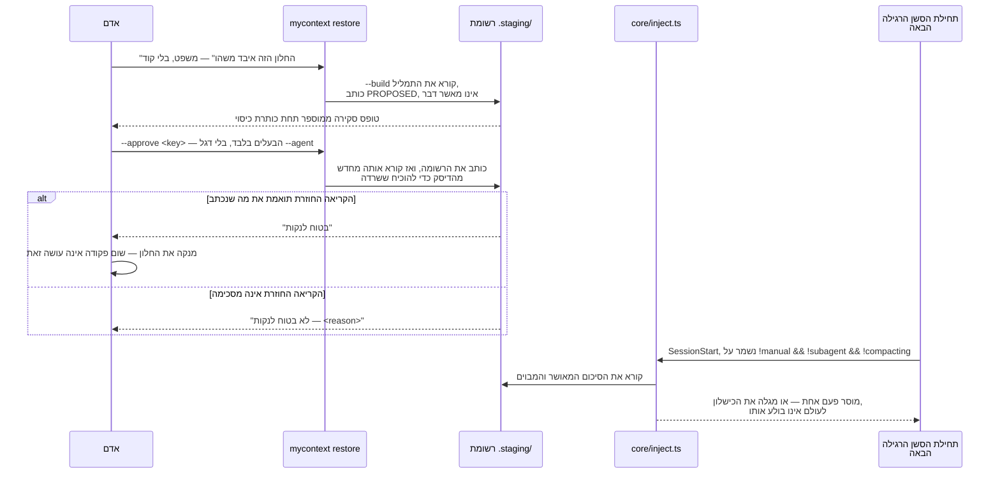
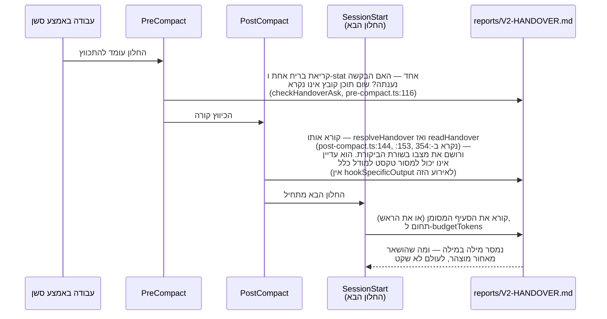

<!--
  Hebrew mirror of `docs/capabilities/07-restore-and-handover.md`. The English
  file is the source. Conventions: `docs/README.he.md` and
  `docs/the-store.he.md` — Hebrew prose and tables inside `<div dir="rtl">`,
  fenced blocks outside it, `<span dir="ltr">` around any Latin run whose edge
  characters are not both alphanumeric and around any run of two or more Latin
  terms joined by commas or slashes.

  The `check:handover` output block is pasted verbatim, with its two `# ... cut
  here` elisions exactly as the English marks them. The `restore --show` output
  and the `config.json` fragment are likewise byte-identical.

  The two Mermaid fences keep the English structure exactly, including the bare
  `<key>` on the `--approve` message — that fence is the one `471b13b3`
  repaired, and `scripts/check-diagrams-parse.ts` still holds its pre-repair
  form as the gate's own red proof. Only the participant labels and the message
  text are translated.

  Heading sequence must stay identical to the English file.
-->

# 7. שחזור והעברת ידיים

<div dir="rtl">

[אינדקס](./00-index.he.md)

חלון הקשר נגמר בשתי דרכים: הוא **מנוקה** בכוונה (הבעלים סיים איתו ורוצה חדש), או הוא **מתכווץ**
אוטומטית כי הוא התמלא. כך או כך, כל מה שהשיחה החזיקה ומעולם לא רשמה הלך. ל-my_context יש שני
מנגנונים בלתי תלויים ולא חופפים לגבול הזה:

- **<span dir="ltr">`restore`</span>** — הופך את התמליל של שיחה *קודמת* לסיכום נסקר, מאושר,
  ומגובה בדיסק שנמסר לסשן ה*הבא* שמתחיל בפרויקט הזה. נבנה מקובץ בדיעבד.
- **<span dir="ltr">`handover`</span>** — מסמך פרוזה שמתוחזק בידי אדם
  (<span dir="ltr">`reports/V2-HANDOVER.md`</span> במאגר הזה) שנקרא ומוזרק ב-
  <span dir="ltr">`SessionStart`/`PostCompact`</span>, ועוד טריגר לפי דרישה
  (<span dir="ltr">`handover ask`</span>) שמבקש מהסשן ה*נוכחי* לכתוב לתוכו עכשיו, לפני שהיה
  נשאל אחרת.

הם פותרים את אותה בעיה — "מה הסשן הבא צריך כדי לא להתחיל מחדש" — משני כיוונים הפוכים:
<span dir="ltr">`restore`</span> כורה את התמליל שכבר קרה; <span dir="ltr">`handover`</span> הוא
מסמך שאדם (או העוזר, לפי בקשה) בוחר לכתוב. שניהם מסרבים לתת לסוכן לבדו להחליט שמשהו בטוח לאיבוד.

## 7.1 <span dir="ltr">`restore`</span> — סכמו שיחה קודמת, בימו אותה, ומסרו אותה אחרי שתנקו

**מה זה.** <span dir="ltr">`mycontext restore`</span> קורא תמליל סשן (או תוצאת שליפה שמורה —
ראו [§6, שליפה](./06-retrieval.he.md)), בונה סיכום, כותב אותו לתיקיית ביום, ו — רק אחרי שאדם
מאשר אותו במפורש — מסדיר שהוא יוזרק לסשן ה*הבא* שמתחיל. שום דבר לעולם אינו מוזרק על ידי
<span dir="ltr">`restore`</span> עצמו.

**למה זה קיים.** ניקוי חלון משמיד את כל מה שמוחזק רק בשיחה ההיא. כל הנקודה של העיצוב
(<span dir="ltr">`src/cli/commands/restore.ts`</span> מצטט אותו כ-
<span dir="ltr">`docs/superpowers/specs/2026-09-07-session-summary-restore-design.md`</span>
§3, §5, §6) היא ש**הסיכום חייב להפוך לקובץ על הדיסק, מאומת בקריאה חוזרת שלו, לפני שנאמר למישהו
שבטוח לנקות.** המקור קובע את מצב הכישלון שזה קיים כדי לסגור במשפט אחד: *"הניקוי קורה בלי הביום
— הוא מצב הכישלון האחד שמאבד את הדבר שזה קיים כדי להציל."*

**הרצף, ואיזו פקודה היא איזה שלב** (מהערת התיעוד בראש <span dir="ltr">`restore.ts`</span>):

</div>

<div dir="rtl">

| שלב | מה קורה | מי/מה עושה את זה |
|---|---|---|
| 1 הצעה | "החלון הזה איבד משהו שהתמליל עדיין מחזיק" | אדם או סוכן, במילים — בלי קוד |
| 2 בנייה | קורא את התמליל, מרנדר את טופס הסקירה ואת המטען | <span dir="ltr">`mycontext restore --build`</span> — אוטומטי, אינו מאשר דבר, כותב רק ל-<span dir="ltr">`.staging/`</span> |
| 3 סקירה | קורא את הנקודות הממוספרות תחת כותרת כיסוי | הבעלים, מטופס הסקירה המודפס |
| 4 אישור | מתחייב למסור את זה | <span dir="ltr">`mycontext restore --approve <key>`</span> — **הבעלים בלבד**; אין דגל <span dir="ltr">`--agent`</span> |
| 5 ביום | כותב את הרשומה, ואז **קורא אותה מחדש מהדיסק** כדי להוכיח ששרדה | <span dir="ltr">`approveStagedRestore`</span> |
| 6 ניקוי | הבעלים מנקה את החלון | **אין פקודה לזה, ולא נועדה להיות** |
| 7 מסירה | מוסר את הסיכום המבוים והמאושר פעם אחת, בתחילת הסשן ה**רגילה** הבאה | <span dir="ltr">`core/inject.ts`</span> |

</div>

<div dir="rtl">

**שלב 7 צר מ"תחילת הסשן הבאה", והפער חשוב בהינתן איך הפרק הזה נפתח.** המסירה נשמרת על
<span dir="ltr">`!manual && !subagent && !compacting`</span>
(<span dir="ltr">`src/core/inject.ts:571–573`</span>), ולכן **תחילה אחרי כיווץ, תחילת תת-סוכן
והזרקה ידנית כולן לא מקבלות דבר.** קורא שלקח את משפט הפתיחה — חלון נגמר "מנוקה **או** מתכווץ"
— כאילו <span dir="ltr">`restore`</span> מכסה את שני הגבולות היה טועה:
<span dir="ltr">`restore`</span> מכסה את הגבול ה**מנוקה**. גבול הכיווץ שייך ל-
<span dir="ltr">`handover`</span> ולדרג ההמשכיות (פרק 2). כישלון בשלב הזה עולה את השחזור ולעולם
לא את ההזרקה — <span dir="ltr">`spendApprovedRestore`</span> מתועד כמי שלעולם אינו זורק — והוא
מגולה בבלוק המוזרק ולא נבלע, כי "הסיכום שלך לא הגיע" אחרת אינו ניתן להבחנה מ"לא ביימת כלום".

</div>



<div dir="rtl">

רק לשלבים 2–5 יש פקודות. שלב 1 הוא משפט שאדם מקליד; שלב 6 הוא פעולה שממשק Claude Code עושה, לא
משהו ש-<span dir="ltr">`restore`</span> יכול היה לעשות גם אם רצה — בניית פקודת "ניקוי" הייתה
מאפשרת לאמונה מוטעית שסיכום בטוח לגרום ישירות לאובדן שהיא קיימת כדי למנוע.

### <span dir="ltr">`restore --build`</span>

</div>

```
usage: mycontext restore --build [--session <file>] [--range <spec>] [--subject <text>]
                        [--points <n>] [--reasoning] [--code]
       mycontext restore --build --from-result <file> [--claims <1,3,7>] [--json]
```

<div dir="rtl">

קורא תמליל (כברירת מחדל, החדש ביותר שיש לפרויקט הזה על הדיסק — נמצא בפענוח שורש המאגר מתוך
הקורפוס, ההורה של <span dir="ltr">`ws.projectRoot`</span>, לעולם לא מ-
<span dir="ltr">`process.cwd()`</span>, במיוחד כדי שהרצה של זה מתוך מאגר התוסף מול סביבת עבודה
של בדיקה לא תוכל לסכם את השיחה של *המפתח עצמו* לתוך תיקיית הביום של מישהו אחר) ומייצר
<span dir="ltr">`SessionSummary`</span>. <span dir="ltr">`--range`</span> מקבל
<span dir="ltr">`whole`</span>, <span dir="ltr">`last-compaction`</span>,
<span dir="ltr">`compaction:<n>`</span>, <span dir="ltr">`record:<index>`</span>, או
<span dir="ltr">`since:<ISO timestamp>`</span>. <span dir="ltr">`--subject`</span> מצמצם לנושאים
נקובים; <span dir="ltr">`--points <n>`</span> תוחם כמה נקודות סיכום נשמרות;
<span dir="ltr">`--reasoning`</span> כולל עומק נימוק; <span dir="ltr">`--code`</span> כולל קוד.

מקור שני ונבדל הוא <span dir="ltr">`--from-result <file>`</span>: תוצאת
[שליפה](./06-retrieval.he.md) שמורה יכולה להיות מבוימת דרך ה*אותו* נשא ולא להצמיח שני — פסיקת
בעלים מפורשת (2026-09-11) שמצוטטת מילה במילה במקור: *"הוא **עושה שימוש חוזר בנשא של D34
ואסור לו להצמיח שני**."* <span dir="ltr">`--claims 1,3,7`</span> בוחר אילו מקביעות התוצאה לשאת
קדימה.

בנייה לעולם אינה מאשרת ולעולם אינה מזריקה דבר — היא רק כותבת קובץ PROPOSED תחת
<span dir="ltr">`.staging/`</span> ומדפיסה טופס סקירה.

### <span dir="ltr">`restore --show`</span>

מונה כל מה שמבוים כרגע, את המצב שלו, את הכיסוי, ו(ברגע שאושר) את מצב המסירה. פלט אמיתי מסביבת
העבודה הזו:

</div>

```
$ node src/cli/index.ts restore --show
my_context: nothing is staged. `mycontext restore --build` builds one from a transcript.
```

<div dir="rtl">

שום דבר אינו מבוים בפרויקט הזה כרגע — אומת בקריאת נתיב הקוד ולא הונח:
<span dir="ltr">`--show`</span> קורא את <span dir="ltr">`readRestoreStagingDir(root)`</span>
והקריאה הזו החזירה מערך <span dir="ltr">`staged`</span> ריק. כשמשהו מבוים,
<span dir="ltr">`--show`</span> מדפיס, לכל רשומה, את המפתח, את המצב (נשמר באותיות קטנות כ-
<span dir="ltr">`proposed`/`approved`/`delivered`</span>; <span dir="ltr">`--show`</span> הופך
את כל השלושה לאותיות גדולות עם <span dir="ltr">`s.state.toUpperCase()`</span>,
<span dir="ltr">`restore.ts:330`</span>), מתי הוא נבנה ומאיזה תמליל, כמה רשומות/נקודות/בתים הוא
מחזיק, ושורת כיסוי — <span dir="ltr">`COMPLETE`</span> או
<span dir="ltr">`PARTIAL — N thing(s) it does not cover`</span>. קובץ מבוים שקיים על הדיסק אך
אינו ניתן לפענוח מדווח במפורש כ-<span dir="ltr">`COULD NOT BE READ — <reason>`</span> ולא מושמט
בשקט — הערת המקור נוקבת בזה ישירות: *"שחזור מבוים שאינו ניתן לקריאה אינו ניתן להבחנה מאחד
שמעולם לא בוים, והבעלים אולי עומד לנקות."*

### <span dir="ltr">`restore --approve <key>`</span> / <span dir="ltr">`--discard <key>`</span>

<span dir="ltr">`--approve`</span> היא **הפקודה האחת בכל המשטח הזה שנגישה רק לאדם.**
<span dir="ltr">`approveStagedRestore`</span> מקבל ארגומנט שחקן ושורת הפקודה מעבירה את
<span dir="ltr">`'human'`</span> המילולי ללא תנאי — אין דלת מילוט
<span dir="ltr">`--agent`</span>, בהתאמה להיעדר המכוון של אחת ב-<span dir="ltr">`carry`</span>.
הפקודה מדפיסה את טופס הסקירה שוב לפני שהיא מבקשת אישור, ואז קוראת מחדש את הקובץ המבוים מהדיסק
ומשווה אותו בית-בית למה שהוצג. רק אם ההשוואה ההיא מצליחה היא מדפיסה את המשפט שהופך את הניקוי
לבטוח:

> <span dir="ltr">`my_context: <key> approved and verified on disk (N bytes re-read).`</span>
> <span dir="ltr">`IT IS SAFE TO CLEAR. The summary is a file now...`</span>

אם הקריאה החוזרת נכשלת בהתאמה, היא מדווחת במקום <span dir="ltr">`NOT SAFE TO CLEAR`</span>
ואומרת לבעלים לבנות שוב — היא לעולם אינה מדפיסה משפט מעודד על ניקוי על שום בסיס אחר מלבד
<span dir="ltr">`ApprovalResult.safeToClear`</span>.

<span dir="ltr">`--discard <key>`</span> מושך שחזור מבוים (עם אישור, אלא אם
<span dir="ltr">`--yes`</span>); בייחוד, רשומה מקולקלת מדי לקריאה **מוצעת** למחיקה ולא נדחית,
כי "רשומה מקולקלת מדי לקריאה היא בדיוק כזו שאדם עשוי לרצות שתלך."

**מקרה שימוש:** ניפיתם באג SQLite עדין במשך ארבעים דקות של הלוך ושוב בסשן הזה והחלון כמעט מלא.
אתם מריצים <span dir="ltr">`mycontext restore --build --range last-compaction --reasoning`</span>,
קוראים את הנקודות הממוספרות, מריצים
<span dir="ltr">`mycontext restore --approve restore-2026-09-12T...`</span>, מוודאים שזה אומר
<span dir="ltr">SAFE TO CLEAR</span>, ורק אז מנקים את החלון. הסשן הבא שמתחיל בפרויקט הזה מקבל
את הסיכום פעם אחת, אוטומטית.

**למה אין פקודת סלאש ואין כלי MCP ל-<span dir="ltr">`--approve`</span>.**
<span dir="ltr">`src/plugin/parity.ts`</span> רושם את ההיעדר הזה במכוון, מאותה סיבה ש-
<span dir="ltr">`carry`</span> אין לה אחת: <span dir="ltr">`--approve`</span> מכריע מה חלון
ההקשר הבא ממש מקבל, והמילים של הפריט עצמו חד-משמעיות — *"ולעולם לא אוטומטי. סוכן רשאי להציע
ורשאי לבנות. **רק הבעלים מזריק**."* <span dir="ltr">`--build`</span>, לעומת זאת, *כן* אוטומטי
ובטוח לסוכן להריץ, כי כל מה שהוא מייצר הוא קובץ ב-<span dir="ltr">`.staging/`</span> — "היכן
שהמוצר הזה כבר שומר החלטות שאדם לא קיבל."

### שומר הלולאה

**מצב הכישלון המדויק:** סיכום שחזור מוזרק נוחת בתמליל כמו כל הודעה אחרת. בלי שומר, ה-
<span dir="ltr">`restore --build`</span> ה*בא* על אותו תמליל היה מסכם את הסיכום — וההצטברות הזו
הייתה קורית בשקט, לנצח.

**המנגנון, נקרא מ-<span dir="ltr">`src/core/session-summary.ts`</span> ומ-
<span dir="ltr">`src/core/summary-marker.ts`</span>:** כל מטען שחזור מוחתם במחרוזת פרוטוקול,
<span dir="ltr">`SESSION_SUMMARY_MARKER = 'mycontext-session-summary/1'`</span>, שמוגדרת פעם אחת
ב-<span dir="ltr">`summary-marker.ts`</span> (קובץ שאינו מייבא דבר, בדיוק כדי שמודולים שלעולם
אסור להם להגיע לחצי כותב-הדיסק של <span dir="ltr">`restore`</span> — כמו ממשק הרשת שהוא
קריאה-בלבד — עדיין יוכלו לזהות את הסמן). <span dir="ltr">`isMarkedSummary(text)`</span> הוא
**מבחן תת-מחרוזת על הגזע** <span dir="ltr">`'mycontext-session-summary/'`</span>, ולא על
המחרוזת המגורסת המלאה: *"כשצורת המטען משתנה, קורא שמכיר רק <span dir="ltr">`/1`</span> חייב
עדיין לזהות מטען <span dir="ltr">`/2`</span> כשלנו ולדלג עליו."* כש-
<span dir="ltr">`--build`</span> עתידי סורק תמליל, כל רשומה שנושאת את הסמן ההוא מושמטת בשלב
סינון ייעודי ונספרת בנפרד כ-<span dir="ltr">`droppedOwnSummary`</span> בסטטיסטיקות הכיסוי של
הסיכום — כך שקורא יכול להבחין בין ירי של שומר הלולאה לבין סינון רגיל (סיכומי הכיווץ של המעטפת
עצמה מושמטים על ידי בדיקה *אחרת*, <span dir="ltr">`isCompactSummary`</span>, ונספרים בנפרד
מאותה סיבה).

אותו מנגנון סמן מגן על מסלול תוצאת השליפה (<span dir="ltr">`--from-result`</span> של §7):
<span dir="ltr">`retrieval/return.ts`</span> מחתים את אותו סמן בראש כל החזרה מסומנת, בדיוק כדי
שתוצאת שליפה שהוחזרה לא תוכל להיבלע מחדש על ידי <span dir="ltr">`restore --build`</span> גם כן.

## 7.2 <span dir="ltr">`handover`</span> — המסמך העומד, נקרא בתחילת סשן ומתבקש לפי דרישה

<span dir="ltr">`handover`</span> אינו פקודה אחת; הוא שני משטחים בלתי תלויים שחולקים קובץ אחד
מוגדר.

### צד הקריאה: <span dir="ltr">`core/handover.ts`</span>, נמסר ב-<span dir="ltr">`SessionStart`/`PostCompact`</span>

**מה זה.** אם <span dir="ltr">`.my_context/config.json`</span> נוקב ב-
<span dir="ltr">`handover.path`</span>, הקובץ ההוא נקרא בכל <span dir="ltr">`SessionStart`</span>
והטריות שלו נבדקת (וההתיישנות נרשמת) ב-<span dir="ltr">`PostCompact`</span>. במאגר הזה:

</div>

```json
"handover": {
  "path": "reports/V2-HANDOVER.md",
  "thresholdPercent": 90
}
```

<div dir="rtl">

**למה זה קיים.** הכותרת של המודול עצמו קובעת את ההיסטוריה המניעה בבוטות: *"הפרויקט הזה מחזיק
קובץ handover בדיוק בשביל זה מאז 2026-08-19 ו**שום דבר מעולם לא קרא אותו** — חיפוש על פני כל
<span dir="ltr">`.ts`</span>, <span dir="ltr">`.js`</span>, <span dir="ltr">`.mjs`</span>,
<span dir="ltr">`.json`</span>, <span dir="ltr">`.yml`</span> ו-<span dir="ltr">`.ps1`</span>
בשני המאגרים ב-2026-08-27. הוא שרד כל גבול עד כה כי מישהו זכר, וזה אינו מנגנון."*
<span dir="ltr">`core/handover.ts`</span> הוא המנגנון החסר ההוא: **קורא** בלבד. הוא אינו כותב,
עורך או מעצב מחדש את המסמך, והוא גם אינו שופט התיישנות — הוא מדווח מה קרא ומשאיר את השיפוט למי
שמסתכל עליו.

**איך הוא בוחר מה למסור.** הוא מחפש כותרת ATX (<span dir="ltr">`#`</span> עד
<span dir="ltr">`######`</span>, במכוון *לא* קווי תחתית Setext <span dir="ltr">`===`</span>)
שהטקסט שלה מתחיל בסמן מוגדר. אם נמצאה, הוא מוסר את כל הסעיף המסומן ההוא — עד לכותרת הבאה באותה
רמה או גבוהה יותר, כך שכותרת פרט מקוננת לא תיחתך בשקט מההוראה שהיא שייכת אליה. אם לא נמצא סמן,
הוא נופל חזרה למסירת ה*ראש* של המסמך, מגובה לגבול הסעיף האחרון שהוא מוצא. כך או כך זה תחום
לתקציב אסימונים (<span dir="ltr">`budgetTokens × 4 chars/token`</span>, אותה הערכה גסה של
4-תווים-לאסימון ש-<span dir="ltr">`select.ts`</span> משתמש בה, במכוון — "בלוק handover ופריט
מוזרק מתחרים על חלון אחד, ושני מעריכים שונים היו הופכים את שני התקציבים לבלתי ברי השוואה בדרך
ששום דבר לעולם לא היה מציף"), והוא **תמיד מצהיר מה הוא השאיר מאחור**: הבלוק המרונדר מסתיים
בשורה כמו <span dir="ltr">`_N of M lines, from <where> of reports/V2-HANDOVER.md. K lines are NOT here; read the file for them._`</span>
— מופע של הכלל הכללי
(<span dir="ltr">`REQ-every-list-and-table-declares-what-leaves-it-and-when-and`</span>) ששום
רשימה או טבלה במוצר הזה אינה רשאית לקצץ בשקט.

<span dir="ltr">`<where>`</span> הוא <span dir="ltr">`the head`</span> **או**
<span dir="ltr">`the marked section`</span>, וההסתעפות היא <span dir="ltr">`read.source`</span>
(<span dir="ltr">`src/core/handover.ts:226`</span>:
<span dir="ltr">`const where = read.source === 'marker' ? 'the marked section' : 'the head';`</span>).
**במאגר הזה ענף הסמן הוא מה שנורה**: סמן ברירת המחדל הוא
<span dir="ltr">U+23ED</span> (⏭, <span dir="ltr">`src/core/config.ts:483`</span>, *ברירת מחדל*
ולא קבוע "כי המוסכמה היא של הפרויקט הזה עצמו … ופרויקט שמסמן את ה-handover שלו אחרת לא צריך
לשנות את שמות הכותרות שלו כדי להיקרא"), והשורה הראשונה של
<span dir="ltr">`reports/V2-HANDOVER.md`</span> היא
<span dir="ltr">`## ⏭ 2026-09-12 — …`</span>. ולכן השורה האמיתית כאן נקראת *"מהסעיף המסומן של
<span dir="ltr">`reports/V2-HANDOVER.md`</span>"*, ו-§7.4 למטה מצטט את שורת ה-⏭ ההיא בלי לחבר
את זה. רק קובץ handover שאינו נושא סמן נופל חזרה לראש.

קובץ מוגדר **חסר** הוא המקרה הרועש, לא השקט: הבלוק מרנדר
<span dir="ltr">`my_context: handover.path is 'X' and there is no file there.`</span> זה חשוב כי
זה נשלח ל-stderr ולא למודל (המסירה של <span dir="ltr">`SessionStart`</span> עצמה מכריעה בזה),
אבל הוא נבנה פעם אחת כאן כך שהודעת המקרה-החסר לא תוכל להישכח באף אחד מכמה אתרי קריאה — הערת
התיעוד מציינת שתשעה ימים אבדו פעם באוגוסט 2026 למנגנון שלא מצא דבר ולא אמר דבר על כך.

**איזה hook באמת מוסר את זה, ולמה הפיצול אינו העדפה:** <span dir="ltr">`PostCompact`</span>
אינו יכול למסור טקסט למודל — בנייה 2.1.239 אינה מכריזה על שום וריאנט
<span dir="ltr">`hookSpecificOutput`</span> לאירוע ההוא, ולכן כל מה ש-
<span dir="ltr">`PostCompact`</span> מדפיס הופך לבאנר שמופנה למשתמש שהמודל אינו רואה ממנו בית.
ה-stdout של <span dir="ltr">`SessionStart`</span>, לעומת זאת, מצורף להקשר מילה במילה. ולכן
<span dir="ltr">`PostCompact`</span> *מפענח ורושם* (מעדכן הנהלת חשבונות של טריות) ו-
<span dir="ltr">`SessionStart`</span> *מוסר*.

זהו גבול שונה באמת מזה של <span dir="ltr">`restore`</span> — מסמך אחד, שנקרא טרי בכל פעם, שחוצה
את גבול ה**כיווץ** ולא את המנוקה, ושני ה-hooks משני צידי הגבול ההוא אינם חולקים את העבודה האחת
שקורא עשוי לצפות שהם יחלקו:

</div>



<div dir="rtl">

**שתי קשתות בדיאגרמה ההיא היו הפוכות עד 2026-09-17, וזו הדיאגרמה שאימות קודם נתן לה ציון של 6
מתוך 6 נקי.** היה בה <span dir="ltr">`PreCompact`</span> שמפענח את הטריות של המסמך ו-
<span dir="ltr">`PostCompact`</span> שעושה הנהלת חשבונות בלבד; השניים הפוכים.
<span dir="ltr">`PreCompact`</span> לעולם אינו פותח את קובץ ה-handover —
<span dir="ltr">`checkHandoverAsk`</span> (<span dir="ltr">`src/core/handover-ask.ts:986-1090`</span>,
נקרא ב-<span dir="ltr">`src/hooks/pre-compact.ts:116`</span>) קורא את בריח הבקשה הפר-סשני ואז
עושה <span dir="ltr">`statSync`</span> לנתיב המוגדר בשביל ה-**mtime** שלו, ומשווה אותו לזמן
הבקשה הרשום; המקור קובע את העלות במילים האלה ב-
<span dir="ltr">`pre-compact.ts:113-114`</span> — *"קריאת בריח אחת ו-<span dir="ltr">`stat`</span>
אחד — שום תוכן קובץ"*. <span dir="ltr">`PostCompact`</span> הוא ה-hook שקורא את המסמך:
<span dir="ltr">`resolveHandover`</span> (<span dir="ltr">`post-compact.ts:144`</span>) קורא ל-
<span dir="ltr">`readHandover`</span> (<span dir="ltr">`:153`</span>) והתוצאה הופכת ל-
<span dir="ltr">`handoverFields(handover.read)`</span> ברשומת הביקורת
(<span dir="ltr">`:354`</span>, <span dir="ltr">`:366`</span>). הפרוזה שמעל הדיאגרמה הזו צדקה;
רק החצים היו שגויים, וזו הסיבה שציון נקי צומת-אחר-צומת פספס את זה.

### צד הדרישה: <span dir="ltr">`mycontext handover ask`</span>

**מה זה.** <span dir="ltr">`mycontext handover ask [--anyway] [--json]`</span> מבקש מהסשן
ה*נוכחי* של Claude Code לכתוב את ה-handover שלו עכשיו — בדיוק אותה בקשה שה-hook
<span dir="ltr">`Stop`</span> היה עושה אוטומטית ברגע שהתפוסה חוצה את
<span dir="ltr">`thresholdPercent`</span>, רק מופעלת מוקדם. הוא ממומש על ידי
<span dir="ltr">`askHandoverNow`</span> ב-<span dir="ltr">`src/core/handover-ask.ts`</span>,
ופקודת שורת הפקודה (<span dir="ltr">`src/cli/commands/handover.ts`</span>) היא אחת משלוש נקודות
כניסה שוות משקל לאותה פונקציה לפי פסיקת בעלים מפורשת
(<span dir="ltr">`DEC-a-handover-can-be-asked-for-on-demand-and-the-ask-is-the`</span>,
2026-09-06, מצוטטת מילה במילה: *"i want you to implement all 3 ways: a cli command, a slash
command and a MCP tool, all should trigger handover update on demand."*): פקודת שורת הפקודה,
פקודת הסלאש <span dir="ltr">`/mycontext:handover`</span>, וכלי ה-MCP
<span dir="ltr">`ask_handover`</span> כולם קוראים לפונקציה הזהה ומרנדרים את השדות הזהים.

**למה זו הפקודה ה*אחת* בשורת הפקודה הזו שאדם בטרמינל רגיל אינו יכול להשתמש בה.** פסיקת בעלים
שנייה, מצוטטת במקור: *"another thing we cant do is to allow this action only if it is done from
inside claude code app and not elsewere."* ולכן <span dir="ltr">`handover ask`</span> מצליח רק
כשהוא מורץ על ידי העוזר בתוך סשן Claude Code חי — דרך פקודת הסלאש, כלי ה-MCP, או העוזר עצמו
שמריץ את פקודת שורת הפקודה במעטפת שלו. אדם שמקליד
<span dir="ltr">`mycontext handover ask`</span> ישירות לטרמינל שהוא פתח בעצמו **נדחה**, במכוון:
*"מזהה שהוקלד ביד ובמקרה שגוי מצליח בשקט מול הבריח של סשן אחר… מתוך Claude Code… הסשן נוקב בשם
של עצמו."*

**שאר הסירובים, כל אחד נאמר ולא מקבל ברירת מחדל.** ל-<span dir="ltr">`OnDemandAskVerdict`</span>
(<span dir="ltr">`src/core/handover-ask.ts:1382–1384`</span>) יש **שבעה** ערכים —
<span dir="ltr">`off | outside-session | no-occupancy | work-in-flight | work-unknown | unwritable | asked`</span>
— שמתוכם <span dir="ltr">`asked`</span> הוא ההצלחה. <span dir="ltr">`outside-session`</span>
מכוסה למעלה; החמישה האחרים:

- **<span dir="ltr">off</span>** — והוא השער ה**ראשון**, לפני בדיקת הסשן: לא מוגדר
  <span dir="ltr">`handover.path`</span>, ולכן היכולת אינה דלוקה בסביבת העבודה הזו כלל. קורא
  שה-<span dir="ltr">`handover ask`</span> שלו אינו אומר דבר צריך לבדוק את זה לפני כל דבר אחר.
- **<span dir="ltr">unwritable</span>** — הקובץ המוגדר אינו ניתן לכתיבה.
- **<span dir="ltr">no occupancy</span>** — הגשר של אחוז ההקשר אינו ניתן לקריאה; הפקודה מסבירה
  למה (אותו משפט שהודעת ההורדה מכוננות של שורת המצב עצמה משתמשת בו, מודפס מילה במילה ולא מנוסח
  מחדש פעם שנייה).
- **<span dir="ltr">work in flight</span>** — נתיבים אחרים (תת-סוכנים) רצים פעילים בסשן הזה.
  לפי פסיקת בעלים שלישית (2026-09-06, מצוטטת): *"if somthing is running you should say it and
  the user could wait for the collision to complete or choose to stop or pause it in order to
  execute the update handover command."* כל נתיב רץ מודפס **בשם ובתיאור** (לעולם לא רק ספירה)
  כדי שאדם באמת יוכל להחליט מה הוא היה עוצר. במכוון אין שום קוד בשום מקום ב-my_context שיכול
  בעצמו לעצור או להשהות נתיב — *"הדבר היחיד שיכול לסיים אותו הוא ש-Claude Code יהרוג אותו"* —
  ולכן הבחירה שמוצעת היא לחכות, לעצור בעצמכם ב-Claude Code, או <span dir="ltr">`--anyway`</span>.
- **<span dir="ltr">work unknown</span>** — יומן הביקורת לא הצליח לומר אם משהו רץ; נבדל מ"שום
  דבר לא רץ".

**<span dir="ltr">`--anyway`</span> ממשיך מעבר לבדיוק שניים מאלה, וההצהרה שלו עצמו אומרת
לאילו:** *"המשך מעבר ל-<span dir="ltr">`work-in-flight`</span> **וגם**
<span dir="ltr">`work-unknown`</span>. לעולם לא מעבר לסירובים האחרים"*
(<span dir="ltr">`handover-ask.ts:1452`</span>). ולכן קורא שנתקל ב-**work unknown** אינו תקוע —
מה שטיוטה מוקדמת יותר של הסעיף הזה, שהזכירה את <span dir="ltr">`--anyway`</span> רק תחת *work
in flight*, רמזה שהוא כן. <span dir="ltr">`off`</span>, <span dir="ltr">`outside-session`</span>,
<span dir="ltr">`no-occupancy`</span> ו-<span dir="ltr">`unwritable`</span> אינם ניתנים לעקיפה,
וכל אחד נוקב בתרופה שלו במקום.

הרצת <span dir="ltr">`handover ask`</span> באמת **מחתימה בריח פר-סשני** (רושמת שהסשן הזה נשאל,
ומתי) אף שהיא אינה כותבת בעצמה לתוך <span dir="ltr">`reports/V2-HANDOVER.md`</span> — כתיבת
הקובץ מושארת לעוזר, בתגובה לטקסט ה-<span dir="ltr">`ask`</span> שמוחזר. מכיוון שהחתימה הזו היא
שינוי מצב, הפרק הזה נכתב **בלי להריץ אותה חי**; ההתנהגות שלה למעלה נשאבת כולה מ-
<span dir="ltr">`src/core/handover-ask.ts`</span> ומ-
<span dir="ltr">`src/cli/commands/handover.ts`</span>.

## 7.3 <span dir="ltr">`check:handover`</span> — בדיקת ה-handover לאמת, לא רק לעדכניות

**מה זה.** <span dir="ltr">`npm run check:handover`</span>
(<span dir="ltr">`scripts/check-handover.ts`</span>) סורק את
<span dir="ltr">`reports/V2-HANDOVER.md`</span> בשביל שני אוצרות המילים האמיתיים של המצביעים שלו
— הפניות נתיב <span dir="ltr">`plan/seq`</span> (כמו <span dir="ltr">`` `walk/119` ``</span>)
והפניות מזהה פריט (כמו <span dir="ltr">`` `TASK-…` ``</span>) — ומפענח כל אחת מהן מול הקורפוס
החי.

**למה זה קיים, במילות הפרויקט עצמו.** הכותרת רושמת את הפגם המדויק שהניע את זה:
<span dir="ltr">`reports/V2-HANDOVER.md`</span> נשא פעם את ההוראה *"הרחיבו את
<span dir="ltr">`isServableDocPath`</span> כדי להגיש
<span dir="ltr">`.my_context/items/**`</span>"* ב**שישה בלוקים עוקבים** (90%, 92%, 93%, 94%,
95%, 96%) — והיא הייתה שגויה כל הזמן, כי <span dir="ltr">`.my_context`</span> נמצא ב-
<span dir="ltr">`SKIP_DIRS`</span> ונתיב הקוד שהיא נקבה בו לעולם אפילו לא היה רואה קובץ קורפוס.
*"נתיב שהיה עוקב אחר ההוראה בנאמנות היה שולח יכולת שהגישה **כלום**, נראתה גמורה, ועברה כל שער.
זה נתפס רק כי נתיב אחד מדד במקום לסמוך."* <span dir="ltr">`check:handover`</span> קיים כדי לתפוס
את ה*צורה* של הפגם הזה — הוראה שחוזרת בלוק אחרי בלוק ולעולם אינה הופכת לפריט סגור — מכנית, ולא
בהסתמכות על כך שנתיב עתידי יימצא מודד שוב.

**למה <span dir="ltr">`verify-citations.ts`</span> (שער הציטוטים הכללי) אינו מכסה את זה.**
הכותרת קובעת מדידה שנלקחה ב-2026-09-06: כשהופנה ל-handover בן 2,831 השורות (דאז), השער ההוא היה
מעלה אפס תקלות ובודק אפס קביעות — ה-handover אינו מדבר שום ציטוטי
<span dir="ltr">`file · fragment · ~line`</span> בכלל, רק מצביעי
<span dir="ltr">`plan/seq`</span> ומזהי פריטים. הרחבת השער ההוא ל-handover "הייתה שינוי שנראה
גמור והגיש כלום", שמילות הפרויקט עצמו קוראות לזה "לא כיסוי, זו הופעה של כיסוי."

**שלוש השכבות, נקראות מהמקור:**

- **<span dir="ltr">DANGLING</span> נשמר בשער** — מצביע שמתפענח לכלום קיים הוא בינארי וזול
  לתיקון, ולכן זו השכבה האחת שמכשילה את הבדיקה.
- **<span dir="ltr">RETIRED</span> מדווח, לעולם לא נשמר בשער** — מצביע שנוקב במשימה שהוחלפה
  מאוחר יותר אינו אותו דבר כמו מצביע שנוקב בכלום. *"פריט **גנוז** **קיים**: יש לו קובץ, סטטוס,
  ו…קשת <span dir="ltr">`superseded_by`</span> שנוקבת במה שהחליף אותו."* לקרוא לזה "כלום" היה
  מערבב **גנוז** עם **נעדר** — ערבוב שהפרויקט הזה פסק נגדו בנפרד
  (<span dir="ltr">`TASK-code-and-tests-that-speak-with-a-retired-item-s-authority`</span>).
  שער עליו היה כופה או כתיבה מחדש של ההיסטוריה או אי-גניזה לנצח של כל דבר ש-handover אי פעם
  הזכיר.
- **<span dir="ltr">CARRIED</span> מדווח, לעולם לא נשמר בשער** — הוראה שחוזרת על פני כמה בלוקים
  בעוד היא עדיין פתוחה. חזרה לבדה אינה מוכיחה פגם ("רק אדם יודע אם שורה חזרה חמש פעמים כי היא
  קשה או כי היא בלתי אפשרית") — אבל זו בדיוק הצורה שהייתה לאירוע
  <span dir="ltr">`isServableDocPath`</span>, ולכן היא צפה בשמה.

**דוגמה מעובדת — פלט אמיתי, הורץ מול המאגר הזה ממש, 2026-09-16**
(<span dir="ltr">`check-handover.ts`</span> הוא קורא טהור: הוא פותח את הקורפוס לקריאה בלבד
וכותב רק ל-stdout, ולכן היה בטוח להריץ אותו עבור הפרק הזה):

</div>

```
$ node scripts/check-handover.ts
...
CARRIED  reports/V2-HANDOVER.md:395
         library/6 → library/6 [todo]
         carried in 10 of 49 blocks and still open
CARRIED  reports/V2-HANDOVER.md:395
         docsys/11 → docsys/11 [todo]
         carried in 10 of 49 blocks and still open
CARRIED  reports/V2-HANDOVER.md:234
         walk/119 → walk/119 [todo]
         carried in 8 of 49 blocks and still open
CARRIED  reports/V2-HANDOVER.md:310
         port/99 → port/99 [todo]
         carried in 8 of 49 blocks and still open
CARRIED  reports/V2-HANDOVER.md:248
         port/98 → port/98 [todo]
         carried in 4 of 49 blocks and still open
CARRIED  reports/V2-HANDOVER.md:248
         port/93 → port/93 [todo]
         carried in 3 of 49 blocks and still open
CARRIED  reports/V2-HANDOVER.md:395
         walk/141 → walk/141 [todo]
         carried in 3 of 49 blocks and still open

4882 line(s), 49 block(s) · 250 distinct pointer(s): 165 lane, 85 item · 0 resolving to nothing, 4 naming retired work
every pointer in the handover names something that exists.

4 pointer(s) name work that was RETIRED with a successor. REPORTED, never gated: the handover is a
  historical document, and a block written before a retirement was true when it was written.
  # ... the rest of this paragraph, and its WHAT WOULD MAKE IT A GATE clause, cut here
8 instruction(s) carried into 3+ blocks with the work still open. REPORTED, never gated: repetition
  is a question about the work, and only a person knows whether a line has been repeated five times
  because it is hard or because it is impossible.
  # ... the WHAT WOULD MAKE IT A GATE clause and one closing line cut here
```

<div dir="rtl">

אפס מצביעי <span dir="ltr">DANGLING</span>, ארבעה גנוזים-עם-יורש-נקוב (לא מזיקים, מדווחים
בלבד), ושבע הוראות <span dir="ltr">CARRIED</span>-3+-פעמים (אות ששווה תשומת לב של אדם, אבל לא
כישלון). קוד היציאה של הבדיקה בהרצה הזו הוא **0**, כי רק <span dir="ltr">DANGLING</span> שומר
בשער.

**כל מספר בבלוק הזה זז בין שני מעברי האימות שהיו לסימוכין הזה** — 4,682 שורות / 45 בלוקים /
218 מצביעים ב-2026-09-13 מול 4,882 / 49 / 250 כאן — וזה אינו תיקון אלא יותר המסמך עומד בתיאור
של עצמו: <span dir="ltr">`reports/V2-HANDOVER.md`</span> נכתב מלמעלה בכל כתיבה (§7.4), ולכן
הרצה מחדש של הדוגמה המעובדת הזו בכל תאריך מאוחר יותר תדפיס מספרים שונים שוב, וזו ההתנהגות
הצפויה, לא סחף שיש לרדוף אחריו.

## 7.4 למה <span dir="ltr">`reports/V2-HANDOVER.md`</span> נכתב מלמעלה, ומה זה אומר לציטוטים

<span dir="ltr">`reports/V2-HANDOVER.md`</span> הוא מסמך **היסטורי, שמוסיפים לו בראש**. זו תכונה
*מבנית* — כל כתיבה מכניסה בלוק <span dir="ltr">`##`/`###`</span> חדש בראש הקובץ — והפרק הזה
במכוון **אינו** מצטט את התוכן הנוכחי של שורה 1 כדי להדגים זאת: גרסה קודמת של הפרק הזה ממש עשתה
בדיוק זאת, והדביקה את הכותרת של הבלוק החדש ביותר מילה במילה, ועד שהמעבר הזה קרא אותה מחדש
הכותרת המצוטטת נקבה במצב של הפרויקט שחלף לפני שלושה ימים ובספירת סעיפים שגדלה מ-45 ל-49 —
ציטוט חי, קפוא ברגע הכתיבה, מתיישן בתוך המסמך שקיים כדי לתאר בדיוק את מצב הכישלון הזה. אמתו את
התכונה בעצמכם, והיא נשארת נכונה ללא קשר למה שהבלוק העליון אומר כרגע:

</div>

```
$ head -c 200 reports/V2-HANDOVER.md
```

<div dir="rtl">

תמיד ידפיס שורה שמתחילה ב-<span dir="ltr">`## ⏭`</span> ואחריה כותרת קצרה בזמן הווה — כי הרשומה
החדשה ביותר תמיד נכתבת שם, לעולם לא מצורפת בסוף. מה שהכותרת *אומרת* אינו העניין של הפרק הזה
לקבוע; זה משתנה בכל כתיבת handover, לפעמים בתוך אותה שעה.

ועוד בלוקי <span dir="ltr">`##`/`###`</span> שבאים אחריה, הישן ביותר אחרון — 49 מהם בסך הכול
נכון לדוגמה המעובדת למעלה (§7.3), והספירה ההיא עצמה היא קריאה מתוארכת, לא קבוע. מכיוון שכל
כתיבה מכניסה בלוק חדש בראש, **כל מספר שורה מתחתיו זז בכתיבה הבאה** — וזו בדיוק הסיבה שהכלל
השולט של המסמך הזה עצמו,
[<span dir="ltr">`RULE-a-citation-names-an-item-by-id-never-a-report-by-line-number`</span>](../../.my_context/items/rule),
קיים ולמה כל מסמך היכולות הזה מקיים אותו: מזהה (<span dir="ltr">`TASK-…`</span>,
<span dir="ltr">`DEC-…`</span>, <span dir="ltr">`walk/119`</span>) שומר על שמו לנצח; מספר שורה
במסמך שמוסיפים לו בראש מיושן לפני ה-commit הבא.

## מה **לא** בנוי / בנוי אך כבוי

- ל-<span dir="ltr">`restore --approve`/`--discard`</span> **אין פקודת סלאש ואין כלי MCP**,
  בעיצוב מכוון (ראו §7.1) — זהו היעדר מתועד, לא פער.
- <span dir="ltr">`handover ask`</span> אינו ניתן להפעלה כלל מטרמינל פשוט — בעיצוב, לא יכולת
  חסרה.
- הפרק הזה לא הריץ <span dir="ltr">`restore --build`</span>, <span dir="ltr">`--approve`</span>,
  <span dir="ltr">`--discard`</span>, או <span dir="ltr">`handover ask`</span> חי, כי כל אחד
  מהם או משנה את הקורפוס/תיקיית הביום או מחתים בריח פר-סשני; ההתנהגות שלהם למעלה נשאבת כולה
  מהמקור, לא מפלט חי. <span dir="ltr">`restore --show`</span> ו-
  <span dir="ltr">`check:handover`</span> **כן** הורצו חי והפלט האמיתי שלהם מודבק למעלה.
- שום דבר אינו מבוים כרגע בסביבת העבודה הזו (<span dir="ltr">`restore --show`</span> החזיר
  ריק), ולכן לא ניתן היה ללכוד דוגמת טופס סקירה אמיתית של <span dir="ltr">`--approve`</span>
  בלי ליצור אחת — הושאר בלי הדגמה ולא הומצא.
- **<span dir="ltr">`restore`</span> אינו מכסה את גבול הכיווץ.** המסירה מוחרגת בהתחלות
  <span dir="ltr">`manual`</span>, <span dir="ltr">`subagent`</span> ו-
  <span dir="ltr">`compacting`</span> (<span dir="ltr">`inject.ts:571–573`</span>), ולכן סשן
  שמחודש אחרי כיווץ אינו מקבל דבר מ-<span dir="ltr">`restore`</span>. זה המקום האחד שבו מסגור
  הפתיחה של הפרק ("מנוקה **או** מתכווץ") והקוד חולקים זה על זה, והקוד צודק.
- **משטח הדגלים של <span dir="ltr">`restore`</span> עצמו רחב ממה שהפרק הזה מדגים.**
  <span dir="ltr">`USAGE`</span> (<span dir="ltr">`src/cli/commands/restore.ts:71–76`</span>)
  נושא את <span dir="ltr">`--session`</span>, <span dir="ltr">`--range`</span>,
  <span dir="ltr">`--subject`</span>, <span dir="ltr">`--points`</span>,
  <span dir="ltr">`--reasoning`</span>, <span dir="ltr">`--code`</span>,
  <span dir="ltr">`--from-result`</span> ו-<span dir="ltr">`--claims`</span>; רק חלקם מופעלים
  למעלה.
- **כל תת-פקודת <span dir="ltr">`mycontext`</span> מסרבת ל-<span dir="ltr">`--help`</span>.**
  <span dir="ltr">`restore --help`</span> יוצא 1 עם
  <span dir="ltr">`my_context: unknown option "--help"`</span> — ואז מדפיס את באנר השימוש בכל
  זאת. קריאת מחרוזת שימוש בדרך הזו עובדת; ציפייה ליציאה 0 לא.

## ראו גם

- [00 — אינדקס](./00-index.he.md)
- [03 — יצירה והשערים](./03-creation-and-gates.he.md) — אותה צורה של "הצע, ואז שלב אישור אנושי
  נבדל" כמו <span dir="ltr">`restore --approve`</span>.
- [06 — שליפה](./06-retrieval.he.md) — <span dir="ltr">`restore --build --from-result`</span>
  מביים תוצאת שליפה דרך אותו נשא.
- [13 — משמעת הבדיקות](./13-testing-discipline.he.md)

</div>
