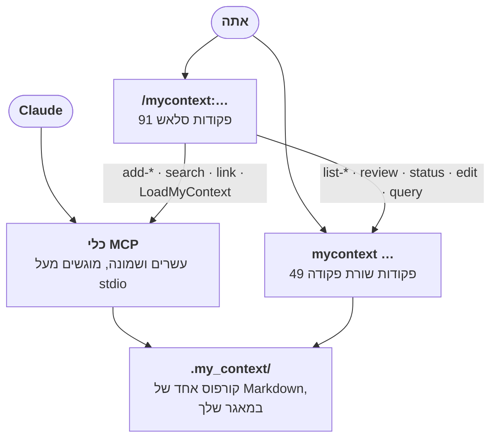

<!--
  Hebrew mirror of `docs/capabilities/09-cli-and-mcp.md`. The English file is
  the source. Conventions: `docs/README.he.md` and `docs/the-store.he.md` —
  Hebrew prose and tables inside `<div dir="rtl">`, fenced blocks outside it,
  `<span dir="ltr">` around any Latin run whose edge characters are not both
  alphanumeric and around any run of two or more Latin terms joined by commas
  or slashes.

  EVERY pasted block in this chapter is byte-identical to the English file —
  the `--help` banner, the box-drawing tables from `status`, `search`, `query`,
  `ready`, `path`, `todo`, `audit`, `contribution` and `decay`, the `.mcp.json`
  fragment and the `ready` tool sketch. Their cut markers are the English
  markers, character for character. A box-drawing table inside an RTL container
  is reversed by the bidi algorithm, which is the second reason they sit
  outside the `<div>`s.

  The Mermaid fence is the one `docs/README.he.md` already carries, character
  for character, because the English original is shared byte-for-byte with
  `README.md`.

  Heading sequence must stay identical to the English file.
-->

<title>שורת הפקודה ושרת ה-MCP</title>

# פרק 9 — שורת הפקודה ושרת ה-MCP

<div dir="rtl">

[אינדקס](./00-index.he.md)

ל-my_context יש שני משטחי כניסה לאותו מנוע: **שורת פקודה**
(<span dir="ltr">`node src/cli/index.ts <command>`</span>, מותקנת כ-bin
<span dir="ltr">`mycontext`</span>) לאדם במעטפת או לסוכן עם גישה למעטפת, ו**שרת MCP**
(<span dir="ltr">`src/mcp/server.ts`</span>, רשום ב-<span dir="ltr">`.mcp.json`</span> כשרת
stdio) לסוכן שיש לו רק קריאות לכלים.

**הם אחים, לא עטיפה זה של זה.** גם <span dir="ltr">`src/cli/commands/*.ts`</span> וגם
<span dir="ltr">`src/mcp/tools.ts`</span> מייבאים ישירות מאותם מודולי
<span dir="ltr">`src/core/*.ts`</span> (<span dir="ltr">`core/mutate.ts`</span> עבור
<span dir="ltr">`createItem`/`updateItem`/`supersedeItem`</span>,
<span dir="ltr">`core/select.ts`</span> עבור <span dir="ltr">`select`/`reviewQueue`</span>,
<span dir="ltr">`core/needs.ts`</span> עבור <span dir="ltr">`readyReport`</span>,
<span dir="ltr">`core/decay.ts`</span> עבור <span dir="ltr">`computeDecay`</span>,
<span dir="ltr">`core/audit.ts`</span> עבור <span dir="ltr">`readAudit`/`recordAudit`</span>,
וכן הלאה — אומת בקריאת בלוק הייבוא בראש <span dir="ltr">`src/mcp/tools.ts`</span>, שורות 1–54).
אף אחד מהמשטחים אינו קורא למעטפת של השני. הבדל התנהגות ביניהם הוא באג באחד משני אתרי הקריאה,
לא שכבת תרגום.

הפרק הזה הוא סימוכין הפקודות/הכלים המלא. פקודות וכלים עם מכניקה עצמאית עמוקה מקבלים פרק משלהם
במקום אחר ורק שורת סיכום כאן; כל פקודה אחרת מקבלת טיפול מלא.

</div>



<div dir="rtl">

**כל שלוש הספירות בדיאגרמה ההיא מתוארכות כאן ולא בתוכה**, כי ה-fence זהה-לבית לזה של
<span dir="ltr">`README.md`</span> עצמו ותאריך שמוקלד לעותק אחד היה שובר את התכונה ששומרת עליהם
מסונכרנים. **נמדדו מחדש ב-2026-09-17, וכל השלוש כבר היו נכונות**:
<span dir="ltr">`ls commands/*.md | wc -l`</span> ← 91; שורות הפקודה המוזחות של
<span dir="ltr">`node src/cli/index.ts --help`</span> ← 49;
<span dir="ltr">`TOOL_NAMES.length`</span> (<span dir="ltr">`src/mcp/tools.ts:2561`</span>) ← 28.
ספירה שבמקרה נכונה היא עדיין ספירה שצריכה תאריך — זה המעבר השלישי ברצף שבו שלוש אלה סומנו כלא
מתוארכות, והשני שבו הן גם היו נכונות.
(בשימוש חוזר מסעיף 5 של ה-README עצמו — שורת פקודה ו-MCP הם שני המשטחים שהדיאגרמה הזו כבר נוקבת
בהם, ו-49/28 תואמים לספירות למטה. פקודות סלאש הן משטח שלישי, בצד הלקוח, שהפרק הזה אינו מכסה
אחרת — ראו [פרק 12](./12-packs-export-import-procedures.he.md#skills-ופקודות-סלאש) לספירת
91 הקבצים.) מה שהדיאגרמה **אינה** מראה הוא ששני המשטחים אינם סימטריים: לכמה פקודות שורת פקודה
אין מקבילת MCP כלל — ראו §4 למטה, שנוקב בכל אחת.

</div>

---

<div dir="rtl">

## 1. איך פקודות נרשמות

<span dir="ltr">`src/cli/commands/registry.ts`</span> מגדיר את
<span dir="ltr">`CommandDef`</span> ואת <span dir="ltr">`registerCommand()`</span>. כל קובץ פקודה
שהוא פקודה אמיתית ברמה העליונה קורא ל-<span dir="ltr">`registerCommand(...)`</span> בטעינת
המודול. grep על <span dir="ltr">`src/cli/commands/*.ts`</span> לקריאה ההיא מעלה 34 קבצים נכון
ל-2026-09-16 (33 ב-2026-09-13, לפני ש-<span dir="ltr">`path.ts`</span> היה קיים), אבל **33 מהם
רושמים פקודה** — <span dir="ltr">`registry.ts`</span> תואם ל-grep כי הוא *מגדיר* את
<span dir="ltr">`registerCommand`</span> ב-<span dir="ltr">`src/cli/commands/registry.ts:46`</span>,
לא כי הוא קורא לו. אומת בהרצה: <span dir="ltr">`node src/cli/index.ts registry`</span> עונה
<span dir="ltr">`my_context: unknown command "registry"`</span>, יציאה 1.

ה-33:

</div>

```
ack, audit, carry, config, contribution, conversation, decay, doctor, edit, export,
focus, handover, inbox-promote, ingest, lesson, link, pack, path, procedure, query,
ready, refresh, repair, restore, review, rules, search, session, status,
statusline, supersede, todo, ui
```

<div dir="rtl">

כמה מהקבצים האלה רושמים **יותר מפקודה אחת ברמה העליונה** —
<span dir="ltr">`lesson.ts`</span> לבדו אחראי לארבע (<span dir="ltr">`lesson`</span>,
<span dir="ltr">`lesson-accept`</span>, <span dir="ltr">`lesson-discard`</span>,
<span dir="ltr">`lesson-stage`</span>) ו-<span dir="ltr">`ingest.ts`</span> לשלוש
(<span dir="ltr">`ingest`</span>, <span dir="ltr">`ingest-apply`</span>,
<span dir="ltr">`ingest-status`</span>) — וזו הסיבה ש-33 קבצים רושמים מניבים יותר מ-33 פקודות,
ולמה הספירה ששווה לצטט היא זו ש-<span dir="ltr">`--help`</span> עצמו מדפיס: **49** פקודות ברמה
העליונה (<span dir="ltr">`node src/cli/index.ts --help`</span>, ו-
<span dir="ltr">`docs/cli-ui-coverage.md`</span>, שמיוצר על ידי
<span dir="ltr">`npm run gen:docs`</span> ונגזר מחדש בכל הרצה של
<span dir="ltr">`test/docs/doc-system.test.ts`</span>, קובעים את אותו נתון).

(ממצא grep ששוחזר בלי להריץ את הפקודה הוא בדיוק הפגם שהסימוכין הזה ממשיך למצוא במקומות אחרים,
ולכן שווה לסמן אותו ככזה ולא למחוק את השם בשקט.)

<span dir="ltr">`init`</span>, <span dir="ltr">`add`</span>, <span dir="ltr">`list`</span>,
<span dir="ltr">`show`</span>, <span dir="ltr">`rebuild`</span>, <span dir="ltr">`help`</span>,
<span dir="ltr">`examples`</span>, <span dir="ltr">`harden`</span>,
<span dir="ltr">`soften`</span>, <span dir="ltr">`pin`</span> ו-<span dir="ltr">`unpin`</span>
הן שאר הפקודות ברמה העליונה מ-<span dir="ltr">`--help`</span>, שנרשמות ישירות ב-
<span dir="ltr">`src/cli/index.ts`</span> ולא בקובץ משלהן.
**<span dir="ltr">`revision-view.ts`</span>, <span dir="ltr">`format.ts`</span>,
<span dir="ltr">`context.ts`</span>, <span dir="ltr">`injection.ts`</span>,
<span dir="ltr">`statusline-install.ts`</span> ו-<span dir="ltr">`statusline-powerline.ts`</span>
אינן פקודות כלל** — הן עוזרים פנימיים: <span dir="ltr">`revision-view.ts`</span> מיובא רק על ידי
<span dir="ltr">`review.ts`</span> (<span dir="ltr">`fieldDiff`, `renderRevision`,
`renderSettled`</span> — הוא מרנדר גרסה ממתינה כ-diff, לעולם לא כטבלה, כי עמודת diff היא פרוזה
ברוחב בלתי חסום); <span dir="ltr">`format.ts`/`context.ts`</span> הם צנרת משותפת של שורת הפקודה
(רוחב פלט, פענוח סביבת עבודה); <span dir="ltr">`injection.ts`</span> הוא עוזר ש-
<span dir="ltr">`inbox-promote.ts`</span> עושה בו שימוש חוזר;
<span dir="ltr">`statusline-install.ts`/`statusline-powerline.ts`</span> משוגרים מתוך מתג
תת-הפקודות של <span dir="ltr">`statusline.ts`</span>, ולא נרשמים בנפרד.
**<span dir="ltr">`registry.ts`</span> שייך לרשימה הזו גם כן** — ראו למעלה. שווה לנקוב בכך כי
התדריך מנה כמה מאלה כאילו היו פקודות עצמאיות — הן לא, ותיעודן ככאלה היה בדיוק סוג העותק השני
שהפרויקט הזה משקיע את מאמצו במחיקתו.

באנר הרמה העליונה מתוך <span dir="ltr">`node src/cli/index.ts --help`</span>, ששוחזר למטה, הוא
**מקוצץ**: שש רשומות קוצרו ל-<span dir="ltr">`[...]`</span> כשהפרק הזה נכתב, וטבלאות הדגלים
לכל תת-פקודה מעולם לא הועתקו כלל. דגלים שהבלוק משמיט בשקט כוללים את
<span dir="ltr">`ready --questions`</span>;
<span dir="ltr">`focus --tag/--category/--scope/--relations/--preview/--yes`</span>;
<span dir="ltr">`restore --session/--range/--subject/--points/--reasoning/--code/--from-result/--claims`</span>;
<span dir="ltr">`export --type/--status/--tag/--pack-name/--pack-version/--no-history`</span>;
<span dir="ltr">`statusline install|uninstall --settings`</span>;
<span dir="ltr">`session carry --none/--show`</span>; <span dir="ltr">`search --text`</span>;
<span dir="ltr">`audit --until/--kind/--origin/--role/--files`</span>;
<span dir="ltr">`contribution --retire`</span>; <span dir="ltr">`--title`</span> ב-
<span dir="ltr">`edit`</span>, <span dir="ltr">`inbox-promote`</span> ו-
<span dir="ltr">`lesson-accept`</span> (ב-<span dir="ltr">`add`</span> הכותרת היא מיקומית, לא
דגל); <span dir="ltr">`--stdin`</span> ב-<span dir="ltr">`ingest-apply`/`lesson-stage`</span>;
<span dir="ltr">`lesson-accept --directive`</span>; <span dir="ltr">`procedure step --undo`</span>;
<span dir="ltr">`review promote-revision --revision/--force`</span>;
<span dir="ltr">`review discard-revision --revision`</span>;
<span dir="ltr">`review promote --source`</span>; ו — היקר שבהם —
**<span dir="ltr">`edit --summary-unchanged`</span>** ו-<span dir="ltr">`edit --continuity`</span>
(ראו [פרק 3](./03-creation-and-gates.he.md), שם <span dir="ltr">`--summary-unchanged`</span> הוא
דלת המילוט האמיתית של שער העריכה).

**מקור האמת היחיד לכל דגל של שורת הפקודה הוא
<span dir="ltr">`src/core/command-flags.ts`</span> ו-<span dir="ltr">`src/core/edit-flags.ts`</span>**
— אותן טבלאות ש-<span dir="ltr">`refuseUnknownFlag`</span> ומעטפת הכישלון של
<span dir="ltr">`--json`</span> שניהם קוראים. הפרק הזה לא נכתב מהן, וזו הסיבה שהרשימה למעלה
קיימת. גרסה עתידית של הסעיף הזה צריכה להיגזר משני הקבצים האלה ולא מבאנר.

**אזהרה אחת לפני שתריצו את זה בעצמכם: כל תת-פקודה מסרבת ל-<span dir="ltr">`--help`</span>.**
<span dir="ltr">`mycontext restore --help`</span> מדפיס
<span dir="ltr">`my_context: unknown option "--help"`</span>, ואז מדפיס את באנר השימוש בכל זאת,
ו**יוצא 1**. טקסט השימוש אמיתי; קוד היציאה אינו הצלחה.

**<span dir="ltr">`--version`</span> (או <span dir="ltr">`-v`</span>) מדפיס את הגרסה ויוצא 0 —
הדבר היחיד ששורת הפקודה הזו עונה עליו לפני שה-<span dir="ltr">`resolveWorkspace`</span> רץ, כך
שהוא עובד גם מחוץ לסביבת עבודה.** <span dir="ltr">`hooks/35`</span> מדד שהתחליף שנטען,
<span dir="ltr">`mycontext status --json`</span>, יוצא 1
(<span dir="ltr">`"no workspace here"`</span>) בדיוק בתיקייה שבה התקנה טרייה רצה לראשונה —
השנייה הראשונה ש-<span dir="ltr">`TASK-there-is-no-version-flag-and-the-argued-alternative-refuses`</span>
נקראת על שמה, והעובדה הראשונה שכל דוח באג זקוק לה. זו פקודה, לא קידומת:
<span dir="ltr">`mycontext --version <anything else>`</span> מסורב עם באנר השימוש במקום לענות
בשקט על שורת פקודה שהוקלדה בטעות.

הבאנר (המקוצץ):

</div>

```
usage: mycontext <command> [args]

  init [--pack <path>]          create .my_context here (--pack: found it from an artefact, as drafts)
  add <category> <title> [opts] create an item (--body|--file --note --observation --step --summary|--summary-omitted --scope --tags --severity --always --valid-from --original-id --request --extra --yes)
  list [category] [--full|--short|--summary] [--json]  list items
  show <id>                     print an item
  rebuild                       rebuild the index from Markdown
  help [topic]                  guidance: categories, scope, capture, workflow, cli, tools, slash
  examples <category> [--short] an example item, and what may be changed on one (--short: the item alone)
  ack <id> <code> [--clear] [--list], or ack --all --code <code> [--count <n>]  record that a person has ruled on a doctor finding, anchored to the item as it stands
  audit [--since T] [--item ID] [--op O] [--limit N]  the run-time log of mutations and hook actions
  carry <id> [--show|--clear]   mark one item for delivery at the next injection, then forget it (one-shot, not pin)
  config <name> --delete|--disable [--yes], or config <path> --set|--unset <value> [--yes]  delete/disable a category, or set/unset one field, in config.json
  contribution [--full|--short|--summary] [--json]  how often each item was actually delivered, from the audit log
  conversation [rebuild|list|subagents|secrets|persist|name|anchor|forget] [--full] [--limit <n>] [--replace <ids>] [--clear] [--yes] [--json]  index the conversation and subagent transcripts on disk, and list what it holds
  decay [--sessions N] [--all] [--full|--short|--summary] [--json]  items that have not been injected lately
  doctor [--quiet] [--full|--short|--summary] [--json]  self-check: index freshness, orphans, drift, dead globs, permissions, session ids
  edit <id> [...]                change an item, with a gate that scales to what the change can do
  export --out <path> [--format dir|zip] [--as-pack] [--dry-run] [--json]  write this corpus to a path outside the workspace, whole or as a pack
  focus [<tag>…] [--show|--clear]  narrow what gets injected
  handover ask [--anyway]       ask for the handover NOW, at whatever the window holds
  harden <id> [--yes]           make a normative item binding (edit --severity=hard)
  inbox-promote <id> --to <cat> a todo or note becomes a real item, linked back
  ingest <path>                 emit an extraction request for a document
  ingest-apply <id> --anchor <a>  apply extracted candidates as drafts
  ingest-status [...]           list ingest sessions and their progress
  lesson / lesson-accept / lesson-discard / lesson-stage   record a lesson, derive and approve rule candidates
  link <from> <relation> <to>   record a relation from one item to another
  pack [import|list] [<path>]   import an artefact somebody else wrote, and list the packs already imported
  pin <id> [--yes]              inject an item at every session start (edit --always=true)
  procedure [list|show|activate|done|step] [<id>] [<n>]  the one-shot lifecycle
  query "SELECT ..." [--json] [--limit <n>]  read-only SQL over the index (capped at 1000 rows)
  ready [--plan <p>] [--held] [--limit <n>] [...]  open tasks whose needs are all done
  refresh <id>                  re-snapshot a reference from its source file
  repair [--yes]                re-stamp project items whose recorded checksum no longer matches their content
  restore --build|--show|--approve <key>|--discard <key>
  review [list|show|promote|discard|revisions|promote-revision|discard-revision] [<id>]
  rules [verify|list|show] [<id>] [--restore] [--json]
  search "<words>" [...]        find items by text, type, tag, path, relation, or what links to another item
  session [list|name|carry] [<session-id>] [<name>] [--json]
  soften <id> [--yes]           make a normative item advisory (edit --severity=soft)
  status [--full|--short|--summary] [--json]
  statusline [install|uninstall] [--yes]
  supersede <id> --by <id>
  todo [--tag <t>] [--all] [--limit <n>] [...]
  ui [--port N] [--no-open] [--idle-ms N] | ui --nonce [--no-open]
  unpin <id> [--yes]
  --version                     print the version and exit; -v is the same flag

categories: constraint, invariant, rule, requirement, standard, pattern, glossary, instruction,
non_goal, open_question, runbook, procedure, environment, known_issue, exception, contract, adr,
decision, lesson, tradeoff, assumption, edge_case, risk, measurement, reference, plan, task, todo, note
```

---

<div dir="rtl">

## 2. פקודות שמכוסות במלואן במקום אחר (סיכום + קישור בלבד)

</div>

<div dir="rtl">

| פקודה | שורה אחת | פרק |
|---|---|---|
| <span dir="ltr">`add`, `edit`, `--distinct`, `--supersedes`, `--summary-omitted`, `doctor`, `repair`, `supersede`</span> | יצירת פריטים ושערי הסיכום/הסתירה | [פרק 3 — יצירה והשערים](./03-creation-and-gates.he.md) |
| <span dir="ltr">`restore`, `handover ask`</span> | המשכיות סשן על פני כיווץ או סשן חדש | [פרק 7 — שחזור והעברת ידיים](./07-restore-and-handover.he.md) |
| <span dir="ltr">`rules verify\|list\|show`</span> | מאגר כללי המוצר הנשלח | [פרק 10 — מאגר כללי המוצר](./10-rule-store.he.md) |
| <span dir="ltr">`conversation [rebuild\|list\|subagents\|secrets\|persist\|name\|anchor\|forget\|search]`</span> | ארכיון השיחות, אינדקס ה-trigram שלו, ו — מאז 2026-09-16 — החיפוש שלו משורת הפקודה | [פרק 4 — ארכיון השיחות](./04-conversation-archive.he.md) / [פרק 5 — עוגנים](./05-anchors.he.md) / [פרק 14 — חיפוש מעל הארכיון](./14-search-over-the-archive.he.md) |
| <span dir="ltr">`ui`</span> | ממשק הרשת לקריאה בלבד | [פרק 8 — ממשק הרשת](./08-web-ui.he.md) |
| <span dir="ltr">`lesson`, `lesson-stage`, `lesson-accept`, `lesson-discard`</span> | צינור ההצעות של הלולאה המשפרת את עצמה | [פרק 11 — הלולאה המשפרת את עצמה](./11-self-improvement-loop.he.md) |
| <span dir="ltr">`pack`, `export`</span> | ממצאים ניידים של הקורפוס | [פרק 12 — חבילות, ייצוא/ייבוא, נהלים](./12-packs-export-import-procedures.he.md) |
| <span dir="ltr">`procedure`</span> | מחזור החיים החד-פעמי (<span dir="ltr">list/show/activate/done/step</span>) | [פרק 12](./12-packs-export-import-procedures.he.md) |

</div>

---

<div dir="rtl">

## 3. סימוכין מלא: פקודות שאינן מכוסות במקום אחר

### בחינת הקורפוס — <span dir="ltr">`list`, `show`, `search`, `query`, `status`</span>

**<span dir="ltr">`status`</span>** — ספירות, גודל תור הסקירה, התקדמות בליעה, סיכום דעיכה/בריאות
במסך אחד. קריאה בלבד. דוגמה מעובדת, **נלכדה מחדש ב-2026-09-17 בהפניית הפקודה לקובץ**, בשלמותה
ובלי עריכה. כל נתון בה הוא קריאה וכל אחד מהם זז בין לכידת 2026-09-12 שהבלוק הזה נהג לשאת לבין
זו — הקורפוס עבר מ-1,108 פריטים ל-1,320 בחמישה ימים — אז הריצו אותה מחדש ולא תצטטו את המספרים
האלה.

</div>

```
$ node src/cli/index.ts status     # 2026-09-17, captured by redirecting the command to a file
my_context 1.0.2: 1320 item(s), profile "standard"

by category
  ┌───────────────┬───────┐
  │ category      │ items │
  ├───────────────┼───────┤
  │ adr           │ 3     │
  │ constraint    │ 8     │
  │ decision      │ 99    │
  │ instruction   │ 11    │
  │ invariant     │ 7     │
  │ known_issue   │ 35    │
  │ lesson        │ 43    │
  │ measurement   │ 3     │
  │ non_goal      │ 3     │
  │ note          │ 27    │
  │ open_question │ 31    │
  │ reference     │ 5     │
  │ requirement   │ 32    │
  │ rule          │ 58    │
  │ standard      │ 15    │
  │ task          │ 940   │
  └───────────────┴───────┘

by status
  ┌────────────┬───────┐
  │ status     │ items │
  ├────────────┼───────┤
  │ active     │ 1246  │
  │ deprecated │ 29    │
  │ superseded │ 45    │
  └────────────┴───────┘

by origin
  ┌────────┬───────┐
  │ origin │ items │
  ├────────┼───────┤
  │ agent  │ 38    │
  │ human  │ 1274  │
  │ review │ 8     │
  └────────┴───────┘

review queue: 0 draft(s) pending review — walk it with `mycontext review`.

usage: 40 session(s) recorded. 0 normative item(s) not injected in the last 20 session(s) — not
evidence they are unused, only that they were not selected. See `mycontext decay`.
  124 active normative item(s) carry no scope, so they apply to every file and compete for the jit
  budget on every file operation.

health: 2 error(s), 152 warning(s), 75 note(s) — details from `mycontext doctor`.
  note: status's own exit code does not reflect the 2 error(s) above — only an unrelated corpus load
  error fails this command. Run `mycontext doctor` if you need a command that fails on them.
```

<div dir="rtl">

מקרה שימוש: הפקודה הראשונה להריץ בתחילת סשן כדי לקבל קריאה במסך אחד על גודל הקורפוס, בריאות, ומה
מחכה לסקירה.

**<span dir="ltr">`list [category]`</span>** ו-**<span dir="ltr">`show <id>`</span>** — מסלול
הקריאה הבסיסי; <span dir="ltr">`list`</span> בלי קטגוריה מונה הכול (בכיבוד
<span dir="ltr">`--full|--short|--summary`</span>), <span dir="ltr">`show <id>`</span> מדפיס את
ה-Markdown המרונדר המלא של פריט אחד. אלה שתי הפקודות שכמעט כל הדוגמאות המעובדות בכל פרק אחר
בנויות מעליהן.

**<span dir="ltr">`search "<words>"`</span>** — חיפוש פריטים דמוי טקסט מלא (תת-מערכת נבדלת מחיפוש
ה-trigram של ארכיון השיחות בפרק 4/14 — זה מחפש כותרת/גוף/תגיות של פריט, לא פרוזת תמליל) עם
מסננים <span dir="ltr">`--type`</span>, <span dir="ltr">`--tag`</span>,
<span dir="ltr">`--path`</span>, <span dir="ltr">`--status`</span>,
<span dir="ltr">`--relation`</span>, <span dir="ltr">`--linked-to`</span>,
<span dir="ltr">`--direction`</span>. פלט אמיתי, 2026-09-17:

</div>

```
$ node src/cli/index.ts search "budget" --limit 3     # 2026-09-17, captured by redirecting the command to a file
┌─────────────────────────────────────────────────────────────────┬─────────────┬────────┐
│ id                                                              │ type        │ status │
├─────────────────────────────────────────────────────────────────┼─────────────┼────────┤
│ TASK-the-configure-screen-writes-the-budget-behind-the-diff-a   │ task        │ active │
│ REQ-configure-and-the-simulator-agree-on-the-budgets-whatever   │ requirement │ active │
│ TASK-an-edited-budget-shows-what-it-was-and-one-control-puts-it │ task        │ active │
└─────────────────────────────────────────────────────────────────┴─────────────┴────────┘

Ordered by relevance, most relevant first. 174 contain(s) that text as one phrase; 3 more share at
least one of its words. Searched 1320 item(s).

177 item(s) match; 3 shown. Raise the cap with --limit 177, or narrow the search.
```

<div dir="rtl">

**השורות והסדר שלהן הם החלק היציב בדוגמה הזו; כל מספר שמתחתיהן אינו.**
<span dir="ltr">"Searched N item(s)"</span> הוא ספירת הפריטים הכוללת של הקורפוס, שגדלה בכל פעם
שמישהו מוסיף פריט — 1,306 כשהבלוק הזה נלכד לראשונה, 1,309 דקות אחר כך באותו יום, ושונה שוב
בלכידה החוזרת של 2026-09-17 למעלה. הריצו מחדש את הפקודה לסכומים של היום; הדירוג והשורות שהוא
מחזיר הם מה שהדוגמה הזו נועדה לו.

**זהו עכשיו חיפוש מדורג, והוא לא תמיד היה כזה.**
<span dir="ltr">`src/cli/commands/search.ts`</span> וכלי ה-MCP
<span dir="ltr">`list_items`</span> שניהם קוראים ל-<span dir="ltr">`searchItems`</span>
(<span dir="ltr">`src/core/rank.ts`</span>, נשלח 2026-09-16), ולא לפרדיקט
<span dir="ltr">`filterItems`</span> החשוף (<span dir="ltr">`core/search.ts`</span>) ששניהם
קראו לו לבדו לפני התאריך ההוא.
<span dir="ltr">`reports/2026-09-16-the-corpus-box-ranked.md`</span> מדד את השינוי על 44 זוגות
בקשת-בעלים/פריט של הקורפוס הזה עצמו: התאמת תת-המחרוזת הפשוטה של
<span dir="ltr">`filterItems`</span> ענתה **0 מתוך 44** בדירוג אחת (שאילתת
<span dir="ltr">`--text`</span> היא תת-מחרוזת רציפה אחת על פני ארבעה שדות, ולכן שתי מילים
שהפריט מחזיק אך אינו מצמיד החזירו כלום) מול **26 מתוך 44** לחיפוש המדורג — BM25 על פני שבעה
שדות, משוקלל (<span dir="ltr">`title`/`summary`</span> 3,
<span dir="ltr">`tags`/`id`</span> 2, <span dir="ltr">`body`/`observations`/`extra`</span> 1),
כששלב ההתאמה הורחב קודם ל"חולק לפחות מילת תוכן אחת", וזו הסיבה שהמשפט למעלה מבחין בין התאמות
ביטוי להתאמות מילה בלבד. **<span dir="ltr">`request`</span> — השדה שמחזיק את מילותיו המדויקות של
הבעלים עצמו, ומטרת ההתאמה המילולית ביותר בקורפוס — במכוון **אינו** מדורג**: הפסיקה שלו שהוא
"תיעוד בלבד ואינו אמור להיות מוזרק להקשר" עסקה ב*הזרקה*, מעולם לא נשאלה על *חיפוש*, ולכן
<span dir="ltr">`rank.ts`</span> משאיר אותו בחוץ ולא מניח תשובה לשאלה שלא הוצגה לו.

מקרה שימוש: "האם משהו כבר אומר X" לפני כתיבת פריט חדש — החצי חפש-קודם של שער הסתירה שמתואר
בפרק 3.

**<span dir="ltr">`query "SELECT ..." [--json] [--limit <n>]`</span>** — SQL גולמי, תחום (1000
שורות), לקריאה בלבד מעל אינדקס ה-SQLite הנגזר. סכמה אמיתית, שהתגלתה בקריאה בלבד. **שני הבלוקים
למטה הם לכידות, ואף אחד מהם לא היה כזה קודם:** הראשון נהג להיות הטבלה הממוסגרת שהוקלדה מחדש
כשלוש שורות של פרוזה מופרדת בפסיקים עם כותרת התחתית <span dir="ltr">`16 row(s)`</span> מושמטת,
והשני נהג להיות פלט ה-<span dir="ltr">`--json`</span> עם כל שורה שרותכה לשורה אחת. אף אחת מהצורות
אינה דבר שהפקודה יכולה להדפיס.

</div>

```
$ node src/cli/index.ts query "SELECT name FROM sqlite_master WHERE type='table'"     # 2026-09-17, captured by redirecting the command to a file
┌────────────────────────────┐
│ name                       │
├────────────────────────────┤
│ schema_version             │
│ items                      │
│ ledger                     │
│ ledger_source              │
│ conversations              │
│ subagents                  │
│ persisted                  │
│ named                      │
│ conversation_prose         │
│ conversation_prose_data    │
│ conversation_prose_idx     │
│ conversation_prose_content │
│ conversation_prose_docsize │
│ conversation_prose_config  │
│ prose_sources              │
│ anchors                    │
└────────────────────────────┘

16 row(s)
```

```
$ node src/cli/index.ts query "SELECT id, status FROM items LIMIT 3" --json     # 2026-09-17, captured by redirecting the command to a file
{
  "rows": [
    {
      "id": "ADR-build-rather-than-adopt",
      "status": "active"
    },
    {
      "id": "ADR-markdown-plus-disposable-index",
      "status": "active"
    },
    {
      "id": "ADR-normative-vs-rationale-tiers",
      "status": "active"
    }
  ],
  "rowCount": 3,
  "truncated": false,
  "limit": 1000,
  "loadErrors": []
}
```

<div dir="rtl">

שימו לב: לטבלת <span dir="ltr">`items`</span> אין עמודת <span dir="ltr">`category`</span> —
<span dir="ltr">`SELECT id, category FROM items`</span> נכשל עם
<span dir="ltr">`no such column: category`</span>; הקטגוריה מקודדת בתחילית המזהה ובעמודה מוקרנת
אחרת. מקרה שימוש: אנליטיקת קורפוס אד-הוק (למשל "כמה פריטי <span dir="ltr">`rule`</span> פעילים
נכתבו על ידי סוכן") בלי לעזוב את שורת הפקודה.

### זרימת עבודה — <span dir="ltr">`ready`, `path`, `focus`, `carry`, `todo`, `inbox-promote`</span>

**<span dir="ltr">`ready`</span>** — מחשב, בכל הרצה (שום דבר אינו ממוטמן, אין מצב "ready" מיושן
שיכול להשתבש), אילו פריטי <span dir="ltr">`task`</span> יש להם כל תלות
<span dir="ltr">`needs:`</span> מסופקת, מדורגים לפי עדיפות. פלט אמיתי, נלכד מחדש 2026-09-17 —
ההדבקה הקודמת קיפלה כל כותרת עטופה לשורה אחת עם <span dir="ltr">`...`</span> מוקלד, מה שהטבלה
לעולם אינה עושה:

</div>

```
$ node src/cli/index.ts ready --limit 3     # 2026-09-17, captured by redirecting the command to a file
┌────────────┬─────┬───────┬───────────────────────────────────────────────────────────────────────┐
│ task       │ pri │ state │ title                                                                 │
├────────────┼─────┼───────┼───────────────────────────────────────────────────────────────────────┤
│ anchors/12 │ 1   │ todo  │ take the lane report and the owner’s own words as automatic marks,    │
│            │     │       │ and replace the ruling detector that only ever marked our own         │
│            │     │       │ injection block                                                       │
│ anchors/13 │ 1   │ todo  │ a user who installs mycontext mid-project has conversations nobody    │
│            │     │       │ can mark, because the pass has no corpus to recognise                 │
│ budget/6   │ 1   │ todo  │ an edited budget shows what it was, and one control puts it back      │
└────────────┴─────┴───────┴───────────────────────────────────────────────────────────────────────┘

153 ready of 157 open task(s)

[… 33 further line(s) of this run are not shown: the held-task, open-question and readiness-derivation notes, all three of which chapter 16 prints whole.
    Nothing above this marker is cut, reflowed or retyped. …]
```

<div dir="rtl">

הוא גם מציף שאלות פתוחות שחוסמות עבודה, ובנפרד סופר (בלי למנות) שאלות פתוחות שאינן חוסמות דבר
עדיין — בחירת עיצוב מכוונת נגד רעש שנאמרת בפלט של הפקודה עצמה: *"רשימה שהראתה כל שאלה בכל פעם
הייתה מאמנת קורא לדלג עליה."* זהו <span dir="ltr">`mycontext ready`</span>, המנגנון ש-
<span dir="ltr">`CLAUDE.md`</span> מפנה אליו ושהחליף את
<span dir="ltr">`reports/EXECUTION-BOARD.md`</span> שהוחזק ביד. מקרה שימוש: "מה אני יכול להרים
עכשיו" בתחילת סשן עבודה.

**<span dir="ltr">`path [--d <n>] [--all]`</span>** — חדש ב-2026-09-16. במקום ש-
<span dir="ltr">`ready`</span> עונה על "מה אני יכול להתחיל" על פני ה*כל* הקורפוס,
<span dir="ltr">`path`</span> עונה על "לאן נושא <span dir="ltr">`D72`</span> הגיע" לכל
**מספר D** — גמור, מוכן, עצור, ועמודה רביעית ששום פקודה אחרת אינה מחשבת: מה **ממתין לבעלים
ספציפית**. שום דבר כאן אינו נשמר; כל נתון נגזר בהרצה מבלוק ה-<span dir="ltr">`[D-MAP]`</span> ב-
<span dir="ltr">`REF-the-d-numbers-what-each-one-means-and-which-are-only`</span> ועוד המצב החי
של הפריטים שהוא נוקב בהם — במכוון, כי מצב "ready" שמור הוא עותק שני של עובדה שחולק על הראשון
ברגע שאחד מהם מתעדכן לבד (אותו טיעון ש-<span dir="ltr">`ready`</span> עצמו משמיע). פלט אמיתי,
נושא אחד:

</div>

```
$ node src/cli/index.ts path --d 72     # 2026-09-17, captured by redirecting the command to a file
┌─────┬────────┬──────┬───────┬──────┬───────┬───────────┐
│ D   │ status │ done │ ready │ held │ yours │ work      │
├─────┼────────┼──────┼───────┼──────┼───────┼───────────┤
│ D72 │ open   │ 2/4  │ 2     │ 0    │ 0     │ readmodel │
└─────┴────────┴──────┴───────┴──────┴───────┴───────────┘

78 subject(s) in the map, 1 shown, 137 open work item(s) under them. Every count here is derived on
this run from REF-the-d-numbers-what-each-one-means-and-which-are-only's [D-MAP] block and the state
of the items it names; nothing is stored and there is no progress file to go stale.

WAITING ON YOU — 2 subject(s), and no other command can say so. This is the difference between a
list and a path: a report that draws these as ordinary open work keeps offering you work you have
already decided to defer.
  D46 · walk/89 — does Export / import ever import, or is a third of that screen permanently a
     description of an act this product cannot perform?
     (OPENQ-does-export-import-ever-import-or-is-a-third-of-that-screen)
  D67 — the whole subject is held by your own ruling.

21 subject(s) read "open" with every item done: D8, D13a/b, D14, D16, D17, D20, D21, D22, D29, D31,
D34, D35, D36, D38, D40, D42, D59, D65, D71, D73, D74. A subject closes on a JUDGEMENT and never on
a count — nothing here will close one for you.

20 open work item(s) belong to no subject at all, so they are in none of the rows above. `npm run
check:board --orphans` names them. Filing an item before its number is minted is ordinary; nobody
being told is how a subject disappears from the board.

100% here means every remaining step is either DISPATCHABLE or NAMED AS YOURS. It is not a promise
that every subject closes: one is held by your own ruling and others end in decisions only you can
make.
```

<div dir="rtl">

עמודת ה-**<span dir="ltr">YOURS</span>** מחושבת משני דברים שהקורפוס כבר מחזיק — נושא שהשורה שלו
קוראת <span dir="ltr">`held-by-owner`</span>, או שאלה פתוחה שנוקבת בנושא ההוא ב-
<span dir="ltr">`blocks`</span> שלה — לעולם לא שדה חדש, ולכן הדרך להכניס נושא לעמודה ההיא היא
להגיש את השאלה, שהבעלים יכול אז לענות עליה, ולהוציא אותו מהעמודה בלי שאף אחד יערוך סטטוס ביד.
<span dir="ltr">`--all`</span> מונה את 21-ומונה הנושאים שקוראים "פתוח" כשכל פריט גמור, כי
**נושא נסגר על שיפוט, לא על ספירה**: ראו [פרק 16 — הלוח](./16-the-board.he.md) למנגנון המלא,
כולל למה 100% כאן אומר "כל צעד שנותר ניתן לשיגור או נקוב כשל הבעלים", ולא "כל נושא סגור".

**<span dir="ltr">`focus [<tag>…] [--show|--clear]`</span>** — מצמצם את מה ש-
<span dir="ltr">`select`</span>/ההזרקה רואים ככשיר, לפי תגית/היקף/קטגוריה.
<span dir="ltr">`--show`</span> כשלא מוגדר:
<span dir="ltr">`my_context: no focus is set — every eligible item is injectable.`</span> מקרה
שימוש: עבודה בתוך תת-מערכת אחת (למשל <span dir="ltr">`focus ui`</span>) כך שתקציב ההזרקה לא
מוצא על פריטים שולטים לא קשורים.

**<span dir="ltr">`carry <id> [--show|--clear]`</span>** — סמן מסירה חד-פעמי, שמובחן במפורש מ-
<span dir="ltr">`pin`</span> בטקסט העזרה שלו עצמו: <span dir="ltr">`pin`</span> הוא קבוע
(<span dir="ltr">`always: true`</span>), <span dir="ltr">`carry`</span> מוסר פריט בהזרקה ה*באה*
בלבד ואז שוכח את עצמו. מקרה שימוש: "לוודא שהסשן הבא יראה את הפריט הספציפי הזה" בלי להוסיף
לצמיתות לקבוצה הנעוצה (ראו את דיון התקציב/הרצועה הרזרבית של פרק 2 כדי לדעת למה נעיצות קבועות
יקרות).

**<span dir="ltr">`todo [--tag <t>] [--all] [--limit <n>]`</span>** — תיבת הדואר הנכנס של דרג
ה-rationale. todo *לעולם* אינו מוזרק במלואו ואינו חלק מתור הסקירה
(<span dir="ltr">`mycontext review`</span> שואל מה צריך *לשלוט*; todo הוא טרום-הכרעה). פלט אמיתי
כשהיא ריקה:

</div>

```
$ node src/cli/index.ts todo --limit 3     # 2026-09-17, captured by redirecting the command to a file
my_context: no todo items.

Capture one the moment it occurs to you: `mycontext add todo "<what to do>"`. It takes no category
decision and no review.

`todo` is on the rationale tier, which is what makes it an inbox: a todo is never injected into a
session in full, and the session index reduces the whole category to a bare count rather than naming
any of these items. Nothing forces a capture to `draft` either, so a todo does not enter the review
queue — `mycontext review` asks what should govern this project, and this list is not part of that
question.

The way out of the inbox is `mycontext inbox-promote <todo id> --to <category>`: it creates the item
under the category the capture really is, carries the title, the body and the tags across, links the
new item back with `derived_from`, and retires the todo as `deprecated`. Nothing here is ever
deleted — a promoted todo keeps its file, its body and its observations, and `mycontext todo --all`
still lists it.
```

<div dir="rtl">

**<span dir="ltr">`inbox-promote <id> --to <cat>`</span>** — היציאה מתיבת הדואר הנכנס: יוצר פריט
אמיתי תחת קטגוריית היעד, נושא כותרת/גוף/תגיות, מקשר חזרה ביחס
<span dir="ltr">`derived_from`</span>, וגונז את ה-todo כ-<span dir="ltr">`deprecated`</span>
(שום דבר אינו נמחק). מקרה שימוש: todo שנרשם באמצע סשן מתברר כ-
<span dir="ltr">`known_issue`</span> אמיתי — קדמו אותו במקום להקליד אותו מחדש.

### ממשל — <span dir="ltr">`ack`, `audit`, `contribution`, `decay`</span>

**<span dir="ltr">`ack <id> <code>`</span>** — רושם שאדם *פסק ב*ממצא <span dir="ltr">`doctor`</span>
עבור פריט, מעוגן לתוכן הפריט כפי שעמד בזמן ה-ack (ולכן עריכה מאוחרת יותר מבטלת את ה-ack).
<span dir="ltr">`ack --all --code <code>`</span> מאשר באצווה. לא הורץ חי כאן (הוא משנה את מצב
הביקורת/ה-ack); נקרא מ-<span dir="ltr">`src/cli/commands/ack.ts`</span>.

**<span dir="ltr">`audit [--since T] [--item ID] [--op O] [--limit N]`</span>** — היומן בזמן ריצה
שרק מוסיפים לו של כל שינוי וכל פעולת hook. פלט אמיתי, נלכד מחדש 2026-09-17. **זו טבלה ממוסגרת**,
וההדבקה הקודמת הציגה אותה כשורות מוזחות בצורה חופשית עם <span dir="ltr">`...`</span> מוקלד היכן
שהשאר הלך. מה שהשורות אומרות הוא איזה חמש פעולות ה-hook האחרונות בסביבת העבודה הזו היו, ולכן
התוכן למטה צפוי להיות שונה בכל הרצה; הצורה היא החלק שיש לקרוא.

</div>

```
$ node src/cli/index.ts audit --limit 5     # 2026-09-17, captured by redirecting the command to a file
my_context: 5 audit record(s), oldest first (most recent 5):
  ┌────────────────┬───────────────────────┬──────────┬─────────┬──────────────────────────────────┐
  │ when           │ op                    │ who      │ subject │ detail                           │
  ├────────────────┼───────────────────────┼──────────┼─────────┼──────────────────────────────────┤
  │ 09-17 13:52:40 │ agent-step            │ 595db3b1 │         │ Bash: Run the three ch09 blocks  │
  │                │                       │          │         │ for real agent=acf5d3ccb4e2c5edf │
  │ 09-17 13:52:48 │ agent-step            │ 595db3b1 │         │ Bash: Read the rest of the ch09  │
  │                │                       │          │         │ blocks agent=acf5d3ccb4e2c5edf   │
  │ 09-17 13:53:03 │ agent-step            │ 595db3b1 │         │ Bash: Run audit, todo and path   │
  │                │                       │          │         │ for real agent=acf5d3ccb4e2c5edf │
  │ 09-17 13:53:05 │ subagent-stop-untyped │ 595db3b1 │         │ delivery=finished                │
  │                │                       │          │         │ agent=a915a2fd560ae9bec          │
  │                │                       │          │         │ type=<absent> (no agent_type on  │
  │                │                       │          │         │ this firing — not a named lane;  │
  │                │                       │          │         │ no step backfill will be         │
  │                │                       │          │         │ attempted); its seen file was    │
  │                │                       │          │         │ left in place                    │
  │ 09-17 13:53:15 │ agent-step            │ 595db3b1 │         │ Bash: Wait for the in-scope run  │
  │                │                       │          │         │ agent=ab3d4e1c3accc5f55          │
  └────────────────┴───────────────────────┴──────────┴─────────┴──────────────────────────────────┘
```

<div dir="rtl">

זהו אותו יומן שה-<span dir="ltr">`governingSpill`</span> של פרק 2 ונתוני התרומה/הדעיכה של פרק 11
נקראים ממנו בחזרה. מקרה שימוש: "מה באמת קרה ב-hooks של הסשן הזה", ניפוי פורנזי של הזרקה או של
ירי שגוי של hook.

**<span dir="ltr">`contribution [--full|--short|--summary]`</span>** — ספירות מסירה לכל פריט,
שנקראות לאחור מתוך יומן הביקורת, ומוסגרות במפורש כ*קו בסיס להשוואה לאורך זמן* ולא כדירוג שימוש.
פלט אמיתי, **2026-09-17**; כל ספירה בו עולה בכל ירי hook, וכולן עלו — לכידת 2026-09-12 שהבלוק
הזה נהג לשאת קראה 2,840 רשומות הזרקה מתוך 44,844. החיתוך למטה מסומן; ההדבקה הקודמת עצרה באותו
מקום בלי לומר זאת, וזה גם השמיט את המשפט הסוגר על שיגורי תת-סוכנים שפרק 11 מצטט.

</div>

```
$ node src/cli/index.ts contribution --short     # 2026-09-17, captured by redirecting the command to a file
my_context contribution — how often each item was actually delivered into a session, read backwards
out of the audit log. The log holds 3726 injection record(s) of 63579 total, naming 193 distinct
id(s); the corpus holds 1320 item(s), of which 165 could be chosen by `select` today.

A record is one DELIVERY, not one session: 1910 subagent-start, 1717 jit, 69 session-start, 28
compact-restore, 2 manual. So a high count is mostly a count of subagent dispatches and hook fires,
and reading any figure below as a number of sessions would overstate it by more than an order of
magnitude.
[… 65 further line(s) of this run are not shown: the BASELINE note and the per-item delivery table it introduces.
    Nothing above this marker is cut, reflowed or retyped. …]
```

<div dir="rtl">

הטקסט של הפקודה עצמה מפורש שקריאה דרך <span dir="ltr">`show`</span> או דרך
<span dir="ltr">`get_item`</span> ב-MCP אינה משאירה עקבה כאן — contribution מודד *הזרקה*, לא
*שימוש*. מקרה שימוש: להחליט אם פריט מרוויח את הנעיצה <span dir="ltr">`always: true`</span> שלו,
מגובה בספירת מסירה אמיתית ולא בתחושה.

**<span dir="ltr">`decay [--sessions N] [--all]`</span>** — פריטים שלא הוזרקו אוטומטית ב-N
הסשנים האחרונים ("קרים"), ועוד דלי "בלתי מוגבל" נפרד (פעיל + נורמטיבי + בלי
<span dir="ltr">`scope`</span>, ולכן הוא מתחרה על תקציב ה-jit בכל מקום). פלט אמיתי,
**2026-09-17** — ההדבקה הקודמת תויגה *"this repo, today"*, שאינה נוקבת בשום תאריך, ושורת
ה-<span dir="ltr">`cold (1)`</span> שלה הפכה מאז ל-<span dir="ltr">`cold: none`</span>.

</div>

```
$ node src/cli/index.ts decay     # 2026-09-17, captured by redirecting the command to a file
my_context decay — items not injected in the last 20 session(s). The ledger holds 40 session(s).
  "cold" means: not auto-injected in the last window of sessions. It does NOT mean unused — the
  ledger records injection, not reading or reliance, so a new item, and any item consulted via
  `show`, MCP `get_item`, or the Markdown file directly, look exactly like an abandoned one here.
  Do not supersede or deprecate anything on this report alone — verify real usage first.

cold: none — every active normative item was injected inside the window.

unrestricted (124) — active and normative with no scope, so they apply to every file and compete for
the jit budget on every file operation. Each is also counted as cold or warm — this is a view over
those rows, not a fourth bucket. Not a defect: add a scope glob only if you meant to narrow where
the item applies.
[… 128 further line(s) of this run are not shown: the 124-row unrestricted table.
    Nothing above this marker is cut, reflowed or retyped. …]
```

<div dir="rtl">

הפקודה מפורשת ש"קר" אינו ראיה לאי-שימוש — רק ש-<span dir="ltr">`select`</span> מעולם לא בחר בו
בחלון שנדגם; קריאה דרך <span dir="ltr">`show`</span>/MCP נראית זהה לנטישה. מקרה שימוש: רשימת
מועמדים לגיזום או לתיחום, תמיד בשילוב עם בדיקה ידנית לפי האזהרה של הפקודה עצמה — לעולם לא פועלים
על פי הדוח הזה לבדו. זהו גם המכשור מצד הטריגר של הלולאה המשפרת את עצמה (פרק 11).

### שיחה ובליעה — <span dir="ltr">`ingest`, `ingest-apply`, `ingest-status`</span>

<span dir="ltr">`ingest <path>`</span> פולט *בקשת חילוץ* למסמך — מצופה שהסוכן שמריץ אותו הוא
המחלץ (הוא אינו מריץ חילוץ LLM בעצמו; הוא מביים בקשה).
<span dir="ltr">`ingest-apply <id> --anchor <a>`</span> הופך מועמדים שחולצו לטיוטות.
<span dir="ltr">`ingest-status`</span> מונה סשנים/התקדמות (קריאה בלבד). מקור:
<span dir="ltr">`src/cli/commands/ingest.ts`</span>, מגובה על ידי
<span dir="ltr">`src/ingest/apply.ts`</span>, <span dir="ltr">`src/ingest/lock.ts`</span>,
<span dir="ltr">`src/ingest/request.ts`</span>, <span dir="ltr">`src/ingest/session.ts`</span>.
לא הורץ חי (<span dir="ltr">`ingest`/`ingest-apply`</span> משנים); מקרה שימוש: הפיכת מסמך עיצוב
או README ישן לפריטי טיוטה מבוימים במקום להקליד אותם ביד אחד אחד.

### יחסים — <span dir="ltr">`link`</span>

<span dir="ltr">`link <from> <relation> <to>`</span> — רושם קשת יחס ישירות, נוסף במיוחד כי
המקבילה קיימה רק בתוך <span dir="ltr">`edit --unlink`</span> (הסרה) ולא היה איות בשורת הפקודה
ל*יצירת* אחת עד להוראת בעלים מפורשת ב-2026-09-04 ("support relation using the cli too", לפי הערת
התיעוד ב-<span dir="ltr">`link.ts`</span>). אוצר מילות היחסים מגיע מ-
<span dir="ltr">`RELATION_TYPES`</span> של <span dir="ltr">`core/vocabulary.ts`</span>. לא הורץ
חי (משנה); מקרה שימוש: רישום ש-<span dir="ltr">`decision`</span> עושה
<span dir="ltr">`amends`</span> ל-<span dir="ltr">`adr`</span>, או ש-
<span dir="ltr">`task`</span> הוא <span dir="ltr">`derived_from`</span> של todo שקודם.

### תפעול — <span dir="ltr">`config`, `registry`, `statusline`</span>

**<span dir="ltr">`config <name> --delete|--disable [--yes]`</span> /
<span dir="ltr">`config <path> --set|--unset <value> [--yes]`</span>** — הכותב ה*יחיד* של
<span dir="ltr">`.my_context/config.json`</span> שמונע משורת הפקודה; כל שינוי אחר בקובץ ההוא
היום הוא עריכה ביד. לפי הערת התיעוד ב-<span dir="ltr">`config.ts`</span>, בציטוט פסיקת בעלים
(2026-09-04): קטגוריות מותאמות ניתנות ל-<span dir="ltr">`DELETE`</span>, קטגוריות נשלחות ניתנות
רק ל-<span dir="ltr">`DISABLE`</span> (לעולם לא נמחקות), כתיבות לוקחות גיבוי קודם, ושינוי שנוגע
בפריטים רבים מקבל אזהרת ספירת-פריטים מפורשת לפני ש-<span dir="ltr">`--yes`</span> נדרש. נשמר
במכוון צר יותר ממסך ההגדרה של ממשק הרשת, שרק *מרכיב* טקסט תצורה כדי שאדם ידביק (פרק 8) —
<span dir="ltr">`DEC-should-the-web-ui-be-allowed-to-write-config-json`</span> היא ההחלטה השולטת
בפיצול הזה.

**<span dir="ltr">`registry.ts`</span>** רושם את מכונת רישום הפקודות הפנימית עצמה (זה הקובץ
ש-<span dir="ltr">`registerCommand`/`CommandDef`</span> חיים בו) ולא חושף פקודת
<span dir="ltr">`registry`</span> שמופנית למשתמש עם קבוצת פעלים משלה מעבר למה שכבר מנוי —
התייחסו אליו כצנרת של שורת הפקודה, לא כיכולת נבדלת.

**<span dir="ltr">`statusline [install|uninstall] [--yes]`</span>** — גשר *בהצטרפות מרצון* שמזרים
את נתון השימוש בהקשר של Claude Code עצמו החוצה לקובץ שמסכי המצב של ממשק הרשת יכולים לקרוא
(<span dir="ltr">`openProjection`/`syncProjection`</span> של
<span dir="ltr">`core/audit-db.ts`</span>, <span dir="ltr">`core/context-occupancy.ts`</span>).
כבוי כברירת מחדל; אדם מצטרף עם <span dir="ltr">`statusline install`</span>. מקרה שימוש: לצפות
בתפוסה אמיתית של חלון ההקשר מממשק הרשת (פרק 8) במקום לנחש.

</div>

---

<div dir="rtl">

## 4. סימוכין מלא: שרת ה-MCP

השרת (<span dir="ltr">`src/mcp/server.ts`</span>) הוא נקודת כניסת stdio בת 60 שורות: הוא מפענח
את תיקיית העבודה (משתנה הסביבה <span dir="ltr">`CLAUDE_PROJECT_DIR`</span>, בנפילה חזרה ל-
<span dir="ltr">`process.cwd()`</span>), מחתים תצלום <span dir="ltr">`codeIdentity`</span> של
בדיוק המודולים שניתן להגיע אליהם ממנו בייבוא (כך שבדיקת מיושן-מול-טרי לעולם לא תוכל להפליל
בטעות קובץ שורת פקודה לא קשור — חיובי שגוי שנמדד ותוקן, לפי הערת התיעוד של הקובץ עצמו שמפנה
לאירוע ב-2026-08-27 שבו עותק רץ שעה מיושן ודיווח בטעות על 719 מתוך 736 פריטים כבעלי checksum לא
תואם), ומגיש את <span dir="ltr">`createRegistry(cwd, code)`</span> מעל stdio דרך
<span dir="ltr">`createSession`/`serveStdio`</span> (<span dir="ltr">`src/mcp/protocol.ts`</span>).
רשום עבור Claude Code דרך <span dir="ltr">`.mcp.json`</span>:

</div>

```json
{
  "mcpServers": {
    "mycontext": {
      "type": "stdio",
      "command": "node",
      "args": ["--disable-warning=ExperimentalWarning", "${CLAUDE_PLUGIN_ROOT}/src/mcp/server.ts"]
    }
  }
}
```

<div dir="rtl">

<span dir="ltr">`src/mcp/tools.ts`</span> (**2,627 שורות**, נספרו מחדש 2026-09-16) מגדיר כל כלי.
grep על <span dir="ltr">`name: '...'`</span> מוצא 29 התאמות; אחת נמצאת בתוך הערה
(<span dir="ltr">`registerCommand({name: 'doctor', ...})`</span>, שמצטטת את צורת הרישום של שורת
הפקודה עצמה כדוגמה), ולכן **28 כלים אמיתיים** — קבוצה רחבה יותר ממה שגרסה מוקדמת יותר של הפרק
הזה דיווחה, שאמרה 26 ובאמת פספסה שניים (<span dir="ltr">`list_rules`</span>,
<span dir="ltr">`verify_rules`</span>, שנוספו לטבלה למטה):

</div>

<div dir="rtl">

| כלי | מודול/י ליבה מאחור | מה הוא עושה |
|---|---|---|
| `create_item` | <span dir="ltr">`core/mutate.ts`</span> (<span dir="ltr">`createItem`</span>) | אותו מסלול יצירה כמו <span dir="ltr">`add`</span> בשורת הפקודה, כולל שערי הסיכום/הסתירה (פרק 3). |
| `update_item` | <span dir="ltr">`core/mutate.ts`</span> (<span dir="ltr">`updateItem`</span>) | זהה ל-<span dir="ltr">`edit`</span> בשורת הפקודה. |
| `refresh_item` | — | זהה ל-<span dir="ltr">`refresh`</span> בשורת הפקודה: לצלם מחדש פריט <span dir="ltr">`reference`</span> מקובץ המקור שלו דרך השער. |
| `supersede_item` | <span dir="ltr">`core/mutate.ts`</span> (<span dir="ltr">`supersedeItem`</span>) | זהה ל-<span dir="ltr">`supersede`</span> בשורת הפקודה. |
| `link_items` | <span dir="ltr">`core/relations.ts`</span> (<span dir="ltr">`linkItems`</span>) | זהה ל-<span dir="ltr">`link`</span> בשורת הפקודה. |
| `get_item` | <span dir="ltr">`core/item.ts`</span> (<span dir="ltr">`renderItem`</span>) | זהה ל-<span dir="ltr">`show`</span> בשורת הפקודה. |
| `query_items` | — | SQL לקריאה בלבד, אותו מנוע כמו <span dir="ltr">`query`</span> בשורת הפקודה. |
| `list_drafts` | <span dir="ltr">`core/select.ts`</span> (<span dir="ltr">`reviewQueue`</span>) | אותה רשימה בסיסית כמו <span dir="ltr">`review list`</span> בשורת הפקודה. |
| `list_items` | <span dir="ltr">`core/rank.ts`</span> (<span dir="ltr">`searchItems`</span>), שמיישם את <span dir="ltr">`filterItems`</span> של <span dir="ltr">`core/search.ts`</span> לכל מסנן מובנה ואז, מאז 2026-09-16, מדרג ב-BM25 שאילתת <span dir="ltr">`text`</span> מעל זה | אותו מנוע כמו <span dir="ltr">`search`/`list`</span> בשורת הפקודה — ראו את רשומת <span dir="ltr">`search`</span> ב-§3 לשינוי הדירוג. |
| `ready` | <span dir="ltr">`core/needs.ts`</span> (<span dir="ltr">`readyReport`</span>) | זהה ל-<span dir="ltr">`ready`</span> בשורת הפקודה. |
| `doctor` | <span dir="ltr">`doctor/checks.ts`</span> (<span dir="ltr">`runChecks`</span>) | זהה ל-<span dir="ltr">`doctor`</span> בשורת הפקודה. |
| `load_context` | <span dir="ltr">`core/select.ts`</span> (<span dir="ltr">`select`</span>), <span dir="ltr">`core/inject.ts`</span> (<span dir="ltr">`buildInjection`</span>) | המקבילה בצד ה-MCP למה ש-hook מזריק — סוכן בלי מעטפת יכול למשוך את אותה קבוצה שולטת ישירות. |
| `audit_log` | <span dir="ltr">`core/audit.ts`</span> (<span dir="ltr">`readAudit`, `filterAudit`</span>) | זהה ל-<span dir="ltr">`audit`</span> בשורת הפקודה. |
| `mycontext_help` | <span dir="ltr">`core/teach.ts`</span> (<span dir="ltr">`MCP_HELP_TOPICS`</span>) | אותה משפחת תוכן כמו <span dir="ltr">`help`</span> בשורת הפקודה. |
| `mycontext_examples` | — | זהה ל-<span dir="ltr">`examples`</span> בשורת הפקודה. |
| `focus_context` | <span dir="ltr">`core/focus.ts`</span> | זהה ל-<span dir="ltr">`focus`</span> בשורת הפקודה. |
| `ingest_document` | <span dir="ltr">`ingest/request.ts`</span> | זהה ל-<span dir="ltr">`ingest`</span> בשורת הפקודה. |
| `decay_report` | <span dir="ltr">`core/decay.ts`</span> (<span dir="ltr">`computeDecay`</span>) | זהה ל-<span dir="ltr">`decay`</span> בשורת הפקודה. |
| `list_ingest_sessions` | <span dir="ltr">`ingest/session.ts`</span> (<span dir="ltr">`listSessions`</span>) | זהה ל-<span dir="ltr">`ingest-status`</span> בשורת הפקודה. |
| `create_lesson` | — | זהה ל-<span dir="ltr">`lesson`</span> בשורת הפקודה (פרק 11). |
| `stage_rule_candidates` | — | זהה ל-<span dir="ltr">`lesson-stage`</span> בשורת הפקודה (פרק 11). |
| `preview_pack_import` | — | החצי של התצוגה המקדימה לקריאה בלבד של <span dir="ltr">`pack import`</span> בשורת הפקודה (פרק 12) — מאפשר לסוכן לראות מה חבילה *הייתה* מביימת בלי להתחייב. |
| `status_report` | — | זהה ל-<span dir="ltr">`status`</span> בשורת הפקודה. |
| `list_todos` | — | זהה ל-<span dir="ltr">`todo`</span> בשורת הפקודה. |
| `read_procedure` | <span dir="ltr">`core/procedure-stage.ts`</span> (<span dir="ltr">`STAGES`, `stageOf`</span>), <span dir="ltr">`core/progress.ts`</span> | אותה משפחה כמו <span dir="ltr">`procedure`</span> בשורת הפקודה. |
| `list_rules` | <span dir="ltr">`src/mcp/tools/rule-store.ts`</span> (<span dir="ltr">`runListRules`</span>) | זהה ל-<span dir="ltr">`rules list`</span> בשורת הפקודה — ובהינתן <span dir="ltr">`id`</span> אופציונלי, זהה גם ל-<span dir="ltr">`rules show`</span>: הוא קורא רשומה אחת במלואה במקום למנות אותן. |
| `verify_rules` | <span dir="ltr">`src/mcp/tools/rule-store.ts`</span> (<span dir="ltr">`runVerifyRules`</span>) | זהה ל-<span dir="ltr">`rules verify`</span> בשורת הפקודה, פחות <span dir="ltr">`--restore`</span> — מוחרג בשמו במכוון, ונדחה על ידי <span dir="ltr">`refuseUnknownArgs`</span> ולא מדולג בשקט. |
| `ask_handover` | <span dir="ltr">`core/handover-ask.ts`</span> (<span dir="ltr">`askHandoverNow`</span>) | זהה ל-<span dir="ltr">`handover ask`</span> בשורת הפקודה. |

</div>

<div dir="rtl">

**מאגר הכללים (פרק 10) נגיש מ-MCP — גרסה מוקדמת יותר של הפרק הזה, ושל פרק 10, שתיהן אמרו שהוא
לא, פעמיים.** <span dir="ltr">`list_rules`</span> ו-<span dir="ltr">`verify_rules`</span> הם כלים
אמיתיים ורשומים (<span dir="ltr">`annotations: READS`</span>), ו-
<span dir="ltr">`list_rules(id)`</span> ספציפית מכסה גם את <span dir="ltr">`rules show`</span>
וגם את <span dir="ltr">`rules list`</span>. החלק היחיד במשטח מאגר הכללים שהוא באמת רק-שורת-פקודה
הוא <span dir="ltr">`--restore`</span>, שמוחרג מכלי ה-MCP בשמו ולא בהשמטה — אי-סימטריה אמיתית
וצרה יותר מ"אין כלי בכלל". שום כלי MCP אינו עוטף את <span dir="ltr">`carry`</span>,
<span dir="ltr">`inbox-promote`</span>, <span dir="ltr">`config`</span>,
<span dir="ltr">`registry`</span>, <span dir="ltr">`statusline`</span>,
<span dir="ltr">`restore`</span>, <span dir="ltr">`pack import`</span> (רק ל*תצוגה המקדימה* שלו
יש כלי MCP), <span dir="ltr">`harden`/`soften`/`pin`/`unpin`</span>, או את משפחות הפקודות
<span dir="ltr">`conversation`/`export`/`ui`</span> — אלה נשארות רק-שורת-פקודה/ממשק-רשת היום. זו
אי-סימטריה אמיתית ומאומתת, לא פספוס שיש לטייח: כמה מהחסרות (<span dir="ltr">`pin`</span>,
<span dir="ltr">`restore --approve`</span>, <span dir="ltr">`pack import`</span>) הן בדיוק
הפעולות המשנות והנשמרות-בשיפוט-אנושי שהפרויקט הזה נזהר בדרך כלל לשמור בהן אדם בלולאה.

**דוגמה מעובדת — והדבר החשוב בה הוא שכלי ה-MCP והדגל בשורת הפקודה *אינם* מחזירים אותה צורה.**
(תעבורת ה-MCP לא הופעלה חי; השרת הרשום הופיע כמנותק. המימוש של הכלי נקרא ישירות.)

</div>

```
tool: ready
args: { "limit": 3 }          // limit defaults to 50 when omitted
→ PLAIN TEXT, not JSON. `run` ends `return lines.join('\n')` (src/mcp/tools.ts:1405),
  composing one line per task at :1371 as
  `${row.item.id} · ${taskCell(row)} · pri ${priority} · ${state} · ${title}`,
  followed by the readiness-is-derived disclosure. `limit` is read at :1341
  (`const limit = optNum(args, 'limit', 50);`).
```

<div dir="rtl">

**אין מטען JSON בשום שלב** בצד ה-MCP. ה-<span dir="ltr">`ready --json`</span> של שורת הפקודה,
לעומת זאת, פולט שורות בצורת
<span dir="ltr">`{id, title, type, plan, seq, priority, state, needs}`</span> — אומת חי — עם
ספירות ברמה העליונה (<span dir="ltr">`readyTotal`</span>, <span dir="ltr">`open`</span>,
<span dir="ltr">`heldTotal`</span>, <span dir="ltr">`openQuestions.blockingTotal`</span>).
**שום שדה אינו נקרא <span dir="ltr">`task`</span> או <span dir="ltr">`pri`</span>** באף אחת
משתי הצורות; אלה היו ניחוש שנעשה משורת הסיכום של הכלי ונרשמים כאן כתיקון ולא נמחקים, כי מצב
הכישלון — תיאור מטען מתוך סכמה בלי להריץ אף אחד מהצדדים — הוא זה שהסימוכין הזה נוטה אליו
ביותר.

ספירות הכלי/שורת הפקודה עצמן *כן* מסכימות: הסכומים של ready, open ו-held, והשאלות הפתוחות
החוסמות, הם אותם מספרים שמחושבים על ידי אותו קוד.

</div>

---

<div dir="rtl">

## מה **לא** בנוי / בנוי אך כבוי

- <span dir="ltr">`revision-view`</span>, <span dir="ltr">`format`</span>,
  <span dir="ltr">`context`</span>, <span dir="ltr">`injection`</span> (העוזר בשורת הפקודה,
  נבדל מ*מנגנון* ההזרקה בפרק 2), <span dir="ltr">`statusline-install`</span>,
  <span dir="ltr">`statusline-powerline`</span> **אינם פקודות עצמאיות** — הם מודולים פנימיים
  שפקודות אחרות מייבאות. תיעודם כמשטח ברמה העליונה היה לא מדויק.
- למשטח ה-MCP **אין כלי** ל-<span dir="ltr">`carry`</span>,
  <span dir="ltr">`inbox-promote`</span>, <span dir="ltr">`config`</span>,
  <span dir="ltr">`registry`</span>, <span dir="ltr">`statusline`</span>,
  <span dir="ltr">`restore`</span>, <span dir="ltr">`harden`/`soften`/`pin`/`unpin`</span>,
  משפחת ה-<span dir="ltr">`conversation`</span>, <span dir="ltr">`export`</span>, או
  <span dir="ltr">`ui`</span> — סוכן שצריך אחד מאלה חייב לעבור דרך שורת הפקודה (או, עבור
  <span dir="ltr">`restore`</span>/עריכת תצורה, דרך אדם). **<span dir="ltr">`rules`</span> אינו
  ברשימה הזו** — <span dir="ltr">`list_rules`</span> ו-<span dir="ltr">`verify_rules`</span> הם
  כלי MCP אמיתיים; ראו את הפסקה המתוקנת מעל טבלת הכלים.
- ל-<span dir="ltr">`pack import`</span> יש *תצוגה מקדימה* מלאה ב-MCP
  (<span dir="ltr">`preview_pack_import`</span>) אבל אין מסלול *התחייבות* ב-MCP — ההתחייבות
  לייבוא חבילה היא רק-שורת-פקודה/ממשק-רשת, בעקביות עם שמירת שיפוט אנושי בלולאה עבור ייבואים
  שמשנים קורפוס.
- **<span dir="ltr">`src/help/`</span> אינו מתואר בשום מקום בסימוכין הזה.**
  <span dir="ltr">`mycontext help [topic]`</span> מגובה על ידי
  <span dir="ltr">`src/help/index.ts`</span>, שקורא Markdown מ-
  <span dir="ltr">`src/help/topics/`</span> — **שבעה נושאים באנגלית**
  (<span dir="ltr">`capture.md`</span>, <span dir="ltr">`categories.md`</span>,
  <span dir="ltr">`cli.md`</span>, <span dir="ltr">`scope.md`</span>,
  <span dir="ltr">`slash.md`</span>, <span dir="ltr">`tools.md`</span>,
  <span dir="ltr">`workflow.md`</span>) ועוד מקור עברי אחד
  (<span dir="ltr">`categories.he.md`</span>) ו-<span dir="ltr">`src/help/he.ts`</span>. נושא
  מתורגם חי לצד המקור האנגלי שלו כ-<span dir="ltr">`<topic>.<locale>.md`</span>, ובקשה ללוקאל
  שלנושא אין לו מקור **נדחית בשמה** ("תרגמו את הנושא לפני שאתם מבקשים אותו בלוקאל ההוא") ולא
  נופלת בשקט חזרה לאנגלית. אותו רישום הוא מה שחלונית ה-<span dir="ltr">`cli-help`</span> של
  ממשק הרשת מרנדרת (פרק 8). שום תוכן של שבעת הנושאים אינו מכוסה כאן; ראו פרק 12 לכיסוי
  skills/פקודות סלאש.
- **ל-<span dir="ltr">`src/lesson/`</span> (<span dir="ltr">`derive.ts`</span>,
  <span dir="ltr">`staging.ts`</span>) אין כיסוי בשום מקום בסימוכין הזה**, אף ש-
  <span dir="ltr">`lesson`/`lesson-stage`/`lesson-accept`</span> מנויים למעלה ופרק 11 עוסק
  בלולאה שהמודולים האלה מזינים.
- **משתני הסביבה <span dir="ltr">`MYCONTEXT_*`</span> כמעט לחלוטין אינם מתועדים.** שנים־עשר
  קיימים על פני <span dir="ltr">`src/`</span>; שלושה מוזכרים בסימוכין הזה
  (<span dir="ltr">`MYCONTEXT_WIDTH`</span>, <span dir="ltr">`MYCONTEXT_ASCII`</span>,
  <span dir="ltr">`MYCONTEXT_UNICODE`</span>). התשעה הנעדרים כוללים שניים שמשנים מה המוצר
  *הוא*: **<span dir="ltr">`MYCONTEXT_CORPUS_DIR`</span>** (איזה קורפוס בשימוש) ו-
  **<span dir="ltr">`MYCONTEXT_RULES_DIR`</span>** (מחליף את כל מאגר כללי המוצר — ראו
  [פרק 10](./10-rule-store.he.md)). השאר הם
  <span dir="ltr">`MYCONTEXT_MIRROR_DIR`</span>,
  <span dir="ltr">`MYCONTEXT_UI_SESSIONS_DIR`</span>,
  <span dir="ltr">`MYCONTEXT_ITEM_EXISTS`</span>, <span dir="ltr">`MYCONTEXT_DOC_CLOCK`</span>,
  <span dir="ltr">`MYCONTEXT_DOC_LOCALE`</span>,
  <span dir="ltr">`MYCONTEXT_STATUSLINE_NO_BLINK`</span> ו-
  <span dir="ltr">`MYCONTEXT_STATUSLINE_ONE_LINE`</span>.
- **מעטפת הכישלון של <span dir="ltr">`--json`</span> חלה על כל פקודה שמנויה כאן.** הרצת
  <span dir="ltr">`--json`</span> כושלת פולטת מעטפת JSON על stdout ולא פרוזה; קוד היציאה ללא
  שינוי. ראו [פרק 3](./03-creation-and-gates.he.md).

## ראו גם

- [פרק 1 — פריטים והקורפוס](./01-items-and-corpus.he.md)
- [פרק 2 — הזרקה](./02-injection.he.md)
- [פרק 3 — יצירה והשערים](./03-creation-and-gates.he.md)
- [פרק 4 — ארכיון השיחות](./04-conversation-archive.he.md)
- [פרק 5 — עוגנים](./05-anchors.he.md)
- [פרק 6 — שליפה](./06-retrieval.he.md)
- [פרק 7 — שחזור והעברת ידיים](./07-restore-and-handover.he.md)
- [פרק 8 — ממשק הרשת](./08-web-ui.he.md)
- [פרק 10 — מאגר כללי המוצר](./10-rule-store.he.md)
- [פרק 11 — הלולאה המשפרת את עצמה](./11-self-improvement-loop.he.md)
- [פרק 12 — חבילות, ייצוא/ייבוא, נהלים](./12-packs-export-import-procedures.he.md)
- [פרק 13 — משמעת הבדיקות](./13-testing-discipline.he.md)
- [פרק 14 — חיפוש מעל הארכיון](./14-search-over-the-archive.he.md) — הדקדוק מאחורי
  <span dir="ltr">`conversation search`</span>
- [פרק 16 — הלוח](./16-the-board.he.md) — המנגנון המלא מאחורי <span dir="ltr">`ready`</span> ו-
  <span dir="ltr">`path`</span>

</div>
