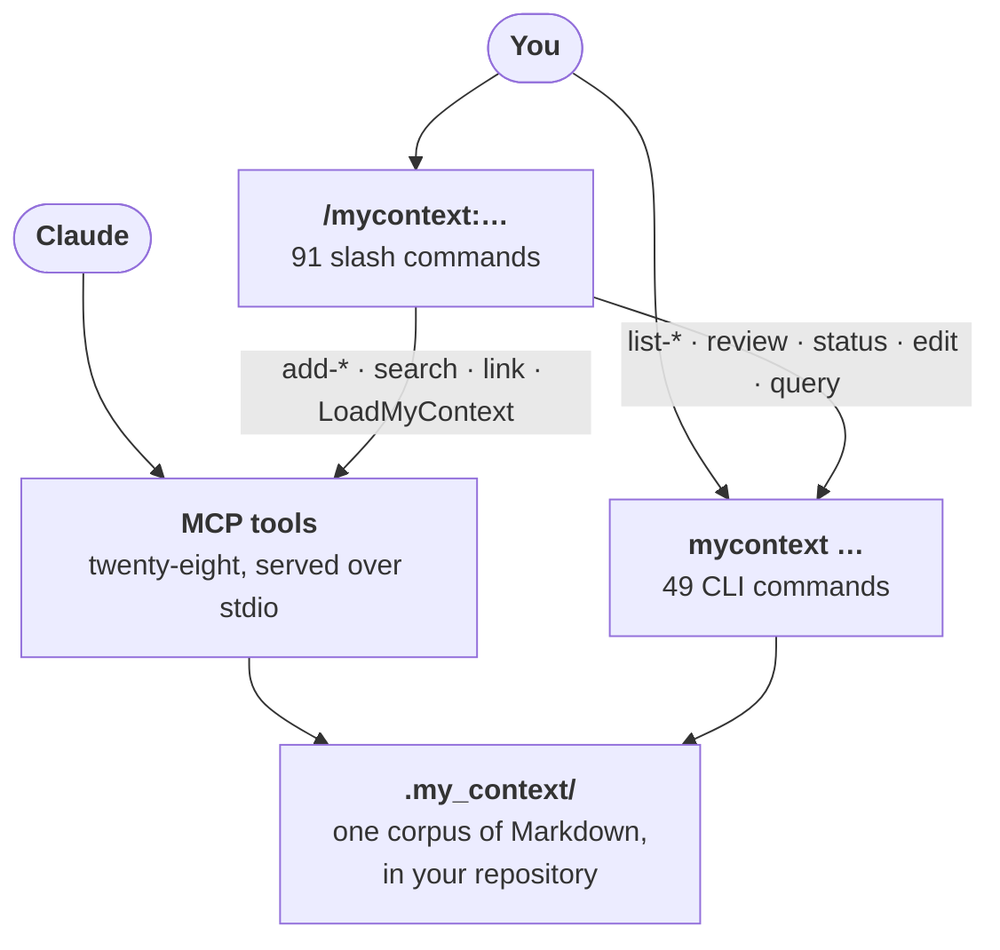

<title>The CLI and the MCP server</title>

# Chapter 9 — The CLI and the MCP server

[Index](./00-index.md)

my_context has two entry surfaces into the same engine: a **CLI** (`node src/cli/index.ts <command>`, installed as the `mycontext` bin) for a human at a shell or an agent with shell access, and an **MCP server** (`src/mcp/server.ts`, registered in `.mcp.json` as a stdio server) for an agent that only has tool calls.

**They are siblings, not a wrapper around each other.** Both `src/cli/commands/*.ts` and `src/mcp/tools.ts` import directly from the same `src/core/*.ts` modules (`core/mutate.ts` for `createItem`/`updateItem`/`supersedeItem`, `core/select.ts` for `select`/`reviewQueue`, `core/needs.ts` for `readyReport`, `core/decay.ts` for `computeDecay`, `core/audit.ts` for `readAudit`/`recordAudit`, and so on — confirmed by reading the import block at the top of `src/mcp/tools.ts`, lines 1–54). Neither surface shells out to the other. A behavior difference between them is a bug in one of the two call sites, not a translation layer.

This chapter is the full command/tool reference. Commands and tools with deep independent mechanics get their own chapter elsewhere and only a summary line here; every other command gets full treatment.



**All three counts in that diagram are dated here rather than inside it**, because the fence is
byte-identical to `README.md`'s own and a date typed into one copy would break the property that
keeps them in step. **Re-measured 2026-09-17, and all three were already correct**:
`ls commands/*.md | wc -l` → 91; the indented command lines of `node src/cli/index.ts --help` → 49;
`TOOL_NAMES.length` (`src/mcp/tools.ts:2561`) → 28. A count that happens to be right is still a
count that needs a date — this is the third pass in a row on which these three were flagged as
undated, and the second on which they were also correct.
(Reused from the README's own §5 — CLI and MCP are the two surfaces this diagram already
names, and 49/28 match the counts below. Slash commands are a third, client-side surface
this chapter does not otherwise cover — see
[chapter 12](./12-packs-export-import-procedures.md#skills-and-slash-commands) for the
91-file count.) What the diagram does **not** show is that the two surfaces are not
symmetric: several CLI commands have no MCP counterpart at all — see §4 below, which names
each one.

---

## 1. How commands are registered

`src/cli/commands/registry.ts` defines `CommandDef` and `registerCommand()`. Every command file that is a real top-level command calls `registerCommand(...)` at module load. Grepping `src/cli/commands/*.ts` for that call turns up 34 files as of 2026-09-16 (33 on 2026-09-13, before `path.ts` existed), but **33 of them register a command** — `registry.ts` matches the grep because it *defines* `registerCommand` at `src/cli/commands/registry.ts:46`, not because it calls it. Confirmed by running it: `node src/cli/index.ts registry` answers `my_context: unknown command "registry"`, exit 1.

The 33:

```
ack, audit, carry, config, contribution, conversation, decay, doctor, edit, export,
focus, handover, inbox-promote, ingest, lesson, link, pack, path, procedure, query,
ready, refresh, repair, restore, review, rules, search, session, status,
statusline, supersede, todo, ui
```

Several of these files register **more than one top-level command** — `lesson.ts` alone accounts
for four (`lesson`, `lesson-accept`, `lesson-discard`, `lesson-stage`) and `ingest.ts` for three
(`ingest`, `ingest-apply`, `ingest-status`) — which is why 33 registering files yield more than 33
commands, and why the count worth citing is the one `--help` itself prints: **49** top-level
commands (`node src/cli/index.ts --help`, and `docs/cli-ui-coverage.md`, generated by `npm run
gen:docs` and re-derived on every `test/docs/doc-system.test.ts` run, states the same figure).

(A grep artefact reproduced without running the command is exactly the defect this
reference keeps finding elsewhere, so it is worth flagging as one rather than
quietly deleting the name.)

`init`, `add`, `list`, `show`, `rebuild`, `help`, `examples`, `harden`, `soften`, `pin`, and `unpin` are the remaining top-level commands from `--help`, registered directly in `src/cli/index.ts` rather than their own file. **`revision-view.ts`, `format.ts`, `context.ts`, `injection.ts`, `statusline-install.ts`, and `statusline-powerline.ts` are not commands at all** — they are internal helpers: `revision-view.ts` is imported only by `review.ts` (`fieldDiff`, `renderRevision`, `renderSettled` — it renders a pending revision as a diff, never a table, because a diff column is prose of unbounded width); `format.ts`/`context.ts` are shared CLI plumbing (output width, workspace resolution); `injection.ts` is a helper `inbox-promote.ts` reuses; `statusline-install.ts`/`statusline-powerline.ts` are dispatched from inside `statusline.ts`'s subcommand switch, not registered separately. **`registry.ts` belongs on this list too** — see above. Worth naming because the task brief listed several of these as if they were independent commands — they are not, and documenting them as such would be exactly the kind of second copy this project spends its effort deleting.

The top-level banner from `node src/cli/index.ts --help`, reproduced below, is
**abridged**: six entries were shortened to `[...]` when this chapter was
written, and the per-subcommand flag tables were never transcribed at all. Flags
the block silently drops include `ready --questions`;
`focus --tag/--category/--scope/--relations/--preview/--yes`;
`restore --session/--range/--subject/--points/--reasoning/--code/--from-result/--claims`;
`export --type/--status/--tag/--pack-name/--pack-version/--no-history`;
`statusline install|uninstall --settings`; `session carry --none/--show`;
`search --text`; `audit --until/--kind/--origin/--role/--files`;
`contribution --retire`; `--title` on `edit`, `inbox-promote` and `lesson-accept`
(on `add` the title is a positional, not a flag);
`--stdin` on `ingest-apply`/`lesson-stage`; `lesson-accept --directive`;
`procedure step --undo`; `review promote-revision --revision/--force`;
`review discard-revision --revision`; `review promote --source`; and — the costly
one — **`edit --summary-unchanged`** and `edit --continuity` (see
[chapter 3](./03-creation-and-gates.md), where `--summary-unchanged` is the edit
gate's actual escape hatch).

**The single source of truth for every CLI flag is `src/core/command-flags.ts`
and `src/core/edit-flags.ts`** — the same tables `refuseUnknownFlag` and the
`--json` failure envelope both read. This chapter was not written from them, and
that is why the list above exists. A future revision of this section should be
derived from those two files rather than from a banner.

**One warning before you run it yourself: every subcommand refuses `--help`.**
`mycontext restore --help` prints `my_context: unknown option "--help"`, then
prints the usage banner anyway, and **exits 1**. The usage text is real; the exit
code is not success.

**`--version` (or `-v`) prints the version and exits 0 — the one thing this CLI
answers before `resolveWorkspace` runs, so it works outside a workspace too.**
`hooks/35` measured that the argued substitute, `mycontext status --json`,
exits 1 ("no workspace here") in exactly the directory a fresh install is
first run in — the first second `TASK-there-is-no-version-flag-and-the-argued-alternative-refuses`
is named for, and the first fact any bug report needs. It is a command, not a
prefix: `mycontext --version <anything else>` is refused with the usage banner
rather than silently answering for a mistyped command line.

The (abridged) banner:

```
usage: mycontext <command> [args]

  init [--pack <path>]          create .my_context here (--pack: found it from an artefact, as drafts)
  add <category> <title> [opts] create an item (--body|--file --note --observation --step --summary|--summary-omitted --scope --tags --severity --always --valid-from --original-id --request --extra --yes)
  list [category] [--full|--short|--summary] [--json]  list items
  show <id>                     print an item
  rebuild                       rebuild the index from Markdown
  help [topic]                  guidance: categories, scope, capture, workflow, cli, tools, slash
  examples <category> [--short] an example item, and what may be changed on one (--short: the item alone)
  ack <id> <code> [--clear] [--list], or ack --all --code <code> [--count <n>]  record that a person has ruled on a doctor finding, anchored to the item as it stands
  audit [--since T] [--item ID] [--op O] [--limit N]  the run-time log of mutations and hook actions
  carry <id> [--show|--clear]   mark one item for delivery at the next injection, then forget it (one-shot, not pin)
  config <name> --delete|--disable [--yes], or config <path> --set|--unset <value> [--yes]  delete/disable a category, or set/unset one field, in config.json
  contribution [--full|--short|--summary] [--json]  how often each item was actually delivered, from the audit log
  conversation [rebuild|list|subagents|secrets|persist|name|anchor|forget] [--full] [--limit <n>] [--replace <ids>] [--clear] [--yes] [--json]  index the conversation and subagent transcripts on disk, and list what it holds
  decay [--sessions N] [--all] [--full|--short|--summary] [--json]  items that have not been injected lately
  doctor [--quiet] [--full|--short|--summary] [--json]  self-check: index freshness, orphans, drift, dead globs, permissions, session ids
  edit <id> [...]                change an item, with a gate that scales to what the change can do
  export --out <path> [--format dir|zip] [--as-pack] [--dry-run] [--json]  write this corpus to a path outside the workspace, whole or as a pack
  focus [<tag>…] [--show|--clear]  narrow what gets injected
  handover ask [--anyway]       ask for the handover NOW, at whatever the window holds
  harden <id> [--yes]           make a normative item binding (edit --severity=hard)
  inbox-promote <id> --to <cat> a todo or note becomes a real item, linked back
  ingest <path>                 emit an extraction request for a document
  ingest-apply <id> --anchor <a>  apply extracted candidates as drafts
  ingest-status [...]           list ingest sessions and their progress
  lesson / lesson-accept / lesson-discard / lesson-stage   record a lesson, derive and approve rule candidates
  link <from> <relation> <to>   record a relation from one item to another
  pack [import|list] [<path>]   import an artefact somebody else wrote, and list the packs already imported
  pin <id> [--yes]              inject an item at every session start (edit --always=true)
  procedure [list|show|activate|done|step] [<id>] [<n>]  the one-shot lifecycle
  query "SELECT ..." [--json] [--limit <n>]  read-only SQL over the index (capped at 1000 rows)
  ready [--plan <p>] [--held] [--limit <n>] [...]  open tasks whose needs are all done
  refresh <id>                  re-snapshot a reference from its source file
  repair [--yes]                re-stamp project items whose recorded checksum no longer matches their content
  restore --build|--show|--approve <key>|--discard <key>
  review [list|show|promote|discard|revisions|promote-revision|discard-revision] [<id>]
  rules [verify|list|show] [<id>] [--restore] [--json]
  search "<words>" [...]        find items by text, type, tag, path, relation, or what links to another item
  session [list|name|carry] [<session-id>] [<name>] [--json]
  soften <id> [--yes]           make a normative item advisory (edit --severity=soft)
  status [--full|--short|--summary] [--json]
  statusline [install|uninstall] [--yes]
  supersede <id> --by <id>
  todo [--tag <t>] [--all] [--limit <n>] [...]
  ui [--port N] [--no-open] [--idle-ms N] | ui --nonce [--no-open]
  unpin <id> [--yes]
  --version                     print the version and exit; -v is the same flag

categories: constraint, invariant, rule, requirement, standard, pattern, glossary, instruction,
non_goal, open_question, runbook, procedure, environment, known_issue, exception, contract, adr,
decision, lesson, tradeoff, assumption, edge_case, risk, measurement, reference, plan, task, todo, note
```

---

## 2. Commands covered fully elsewhere (summary + link only)

| Command | One line | Chapter |
|---|---|---|
| `add`, `edit`, `--distinct`, `--supersedes`, `--summary-omitted`, `doctor`, `repair`, `supersede` | Item creation and the summary/contradiction gates | [Chapter 3 — Creation and the gates](./03-creation-and-gates.md) |
| `restore`, `handover ask` | Session continuity across a compact or a new session | [Chapter 7 — Restore and handover](./07-restore-and-handover.md) |
| `rules verify\|list\|show` | The shipped product rule store | [Chapter 10 — The product rule store](./10-rule-store.md) |
| `conversation [rebuild\|list\|subagents\|secrets\|persist\|name\|anchor\|forget\|search]` | The conversation archive, its trigram index, and — since 2026-09-16 — its CLI search | [Chapter 4 — The conversation archive](./04-conversation-archive.md) / [Chapter 5 — Anchors](./05-anchors.md) / [Chapter 14 — Search over the archive](./14-search-over-the-archive.md) |
| `ui` | The read-only web UI | [Chapter 8 — The web UI](./08-web-ui.md) |
| `lesson`, `lesson-stage`, `lesson-accept`, `lesson-discard` | The self-improvement loop's proposal pipeline | [Chapter 11 — The self-improvement loop](./11-self-improvement-loop.md) |
| `pack`, `export` | Portable artefacts of the corpus | [Chapter 12 — Packs, export/import, procedures](./12-packs-export-import-procedures.md) |
| `procedure` | The one-shot lifecycle (list/show/activate/done/step) | [Chapter 12](./12-packs-export-import-procedures.md) |

---

## 3. Full reference: commands not covered elsewhere

### Corpus inspection — `list`, `show`, `search`, `query`, `status`

**`status`** — counts, review queue size, ingest progress, decay/health summary in one screen. Read-only. Worked example, **re-captured 2026-09-17 by redirecting the command to a file**, whole and unedited. Every figure in it is a reading and every one of them moved between the 2026-09-12 capture this block used to carry and this one — the corpus went from 1,108 items to 1,320 in five days — so re-run it rather than quoting these numbers.

```
$ node src/cli/index.ts status     # 2026-09-17, captured by redirecting the command to a file
my_context 1.0.2: 1320 item(s), profile "standard"

by category
  ┌───────────────┬───────┐
  │ category      │ items │
  ├───────────────┼───────┤
  │ adr           │ 3     │
  │ constraint    │ 8     │
  │ decision      │ 99    │
  │ instruction   │ 11    │
  │ invariant     │ 7     │
  │ known_issue   │ 35    │
  │ lesson        │ 43    │
  │ measurement   │ 3     │
  │ non_goal      │ 3     │
  │ note          │ 27    │
  │ open_question │ 31    │
  │ reference     │ 5     │
  │ requirement   │ 32    │
  │ rule          │ 58    │
  │ standard      │ 15    │
  │ task          │ 940   │
  └───────────────┴───────┘

by status
  ┌────────────┬───────┐
  │ status     │ items │
  ├────────────┼───────┤
  │ active     │ 1246  │
  │ deprecated │ 29    │
  │ superseded │ 45    │
  └────────────┴───────┘

by origin
  ┌────────┬───────┐
  │ origin │ items │
  ├────────┼───────┤
  │ agent  │ 38    │
  │ human  │ 1274  │
  │ review │ 8     │
  └────────┴───────┘

review queue: 0 draft(s) pending review — walk it with `mycontext review`.

usage: 40 session(s) recorded. 0 normative item(s) not injected in the last 20 session(s) — not
evidence they are unused, only that they were not selected. See `mycontext decay`.
  124 active normative item(s) carry no scope, so they apply to every file and compete for the jit
  budget on every file operation.

health: 2 error(s), 152 warning(s), 75 note(s) — details from `mycontext doctor`.
  note: status's own exit code does not reflect the 2 error(s) above — only an unrelated corpus load
  error fails this command. Run `mycontext doctor` if you need a command that fails on them.
```

Use case: the first command to run at the start of a session to get a one-screen read on corpus size, health, and what's waiting for review.

**`list [category]`** and **`show <id>`** — the basic read path; `list` without a category lists everything (respecting `--full|--short|--summary`), `show <id>` prints one item's full rendered Markdown. These are the two commands nearly every other chapter's worked examples are built on top of.

**`search "<words>"`** — full-text-ish item search (distinct subsystem from the conversation-archive trigram search in Chapter 4/14 — this one searches item title/body/tags, not transcript prose) with `--type`, `--tag`, `--path`, `--status`, `--relation`, `--linked-to`, `--direction` filters. Real output, 2026-09-17:

```
$ node src/cli/index.ts search "budget" --limit 3     # 2026-09-17, captured by redirecting the command to a file
┌─────────────────────────────────────────────────────────────────┬─────────────┬────────┐
│ id                                                              │ type        │ status │
├─────────────────────────────────────────────────────────────────┼─────────────┼────────┤
│ TASK-the-configure-screen-writes-the-budget-behind-the-diff-a   │ task        │ active │
│ REQ-configure-and-the-simulator-agree-on-the-budgets-whatever   │ requirement │ active │
│ TASK-an-edited-budget-shows-what-it-was-and-one-control-puts-it │ task        │ active │
└─────────────────────────────────────────────────────────────────┴─────────────┴────────┘

Ordered by relevance, most relevant first. 174 contain(s) that text as one phrase; 3 more share at
least one of its words. Searched 1320 item(s).

177 item(s) match; 3 shown. Raise the cap with --limit 177, or narrow the search.
```

**The rows and their order are the stable part of this example; every number under them is not.**
"Searched N item(s)" is the corpus's total item count, which grows every time anyone adds an item —
1,306 when this block was first captured, 1,309 minutes later the same day, and different again on
the 2026-09-17 re-capture above. Re-run the command for today's totals; the ranking and the rows it
returns are what this example is for.

**This is now a ranked search, and it was not always one.** `src/cli/commands/search.ts` and the
MCP `list_items` tool both call `searchItems` (`src/core/rank.ts`, shipped 2026-09-16), not the
bare `filterItems` predicate (`core/search.ts`) either called alone before that date.
`reports/2026-09-16-the-corpus-box-ranked.md` measured the change on this corpus's own 44
owner-request/item pairs: `filterItems`'s plain substring match answered **0 of 44** at rank one
(a `--text` query is one contiguous substring over four fields, so two words the item holds but
does not adjoin returned nothing) against **26 of 44** for the ranked search — BM25 over seven
fields, weighted (`title`/`summary` 3, `tags`/`id` 2, `body`/`observations`/`extra` 1), with the
match step widened first to "shares at least one content word," which is why the sentence above
distinguishes phrase matches from word-only ones. **`request` — the field holding an owner's own
verbatim words, and the single most literal match target in the corpus — is deliberately NOT
ranked**: his ruling that it is "documentation only and should not be injected to the context" was
about *injection*, never asked about *search*, so `rank.ts` leaves it out rather than presuming an
answer to a question that has not been put to him.

Use case: "does something already say X" before writing a new item — the search-first half of the contradiction gate described in Chapter 3.

**`query "SELECT ..." [--json] [--limit <n>]`** — raw, capped (1000 rows), read-only SQL over the derived SQLite index. Real schema, discovered read-only. **Both blocks below are captures, and neither was before:** the first used to be the boxed table retyped as three lines of comma-separated prose with its `16 row(s)` footer dropped, and the second used to be the `--json` output with each row welded onto one line. Neither shape is anything the command can print.

```
$ node src/cli/index.ts query "SELECT name FROM sqlite_master WHERE type='table'"     # 2026-09-17, captured by redirecting the command to a file
┌────────────────────────────┐
│ name                       │
├────────────────────────────┤
│ schema_version             │
│ items                      │
│ ledger                     │
│ ledger_source              │
│ conversations              │
│ subagents                  │
│ persisted                  │
│ named                      │
│ conversation_prose         │
│ conversation_prose_data    │
│ conversation_prose_idx     │
│ conversation_prose_content │
│ conversation_prose_docsize │
│ conversation_prose_config  │
│ prose_sources              │
│ anchors                    │
└────────────────────────────┘

16 row(s)
```

```
$ node src/cli/index.ts query "SELECT id, status FROM items LIMIT 3" --json     # 2026-09-17, captured by redirecting the command to a file
{
  "rows": [
    {
      "id": "ADR-build-rather-than-adopt",
      "status": "active"
    },
    {
      "id": "ADR-markdown-plus-disposable-index",
      "status": "active"
    },
    {
      "id": "ADR-normative-vs-rationale-tiers",
      "status": "active"
    }
  ],
  "rowCount": 3,
  "truncated": false,
  "limit": 1000,
  "loadErrors": []
}
```

Note: the `items` table has no `category` column — `SELECT id, category FROM items` fails with `no such column: category`; category is encoded in the id's prefix and in a different projected column. Use case: ad hoc corpus analytics (e.g. "how many active `rule` items were authored by an agent") without leaving the CLI.

### Workflow — `ready`, `path`, `focus`, `carry`, `todo`, `inbox-promote`

**`ready`** — computes, on every run (nothing is cached, there is no stale "ready" state to go wrong), which `task` items have every `needs:` dependency satisfied, ranked by priority. Real output, re-captured 2026-09-17 — the previous paste folded each wrapped title onto one line with a typed `...`, which the table never does:

```
$ node src/cli/index.ts ready --limit 3     # 2026-09-17, captured by redirecting the command to a file
┌────────────┬─────┬───────┬───────────────────────────────────────────────────────────────────────┐
│ task       │ pri │ state │ title                                                                 │
├────────────┼─────┼───────┼───────────────────────────────────────────────────────────────────────┤
│ anchors/12 │ 1   │ todo  │ take the lane report and the owner’s own words as automatic marks,    │
│            │     │       │ and replace the ruling detector that only ever marked our own         │
│            │     │       │ injection block                                                       │
│ anchors/13 │ 1   │ todo  │ a user who installs mycontext mid-project has conversations nobody    │
│            │     │       │ can mark, because the pass has no corpus to recognise                 │
│ budget/6   │ 1   │ todo  │ an edited budget shows what it was, and one control puts it back      │
└────────────┴─────┴───────┴───────────────────────────────────────────────────────────────────────┘

153 ready of 157 open task(s)

[… 33 further line(s) of this run are not shown: the held-task, open-question and readiness-derivation notes, all three of which chapter 16 prints whole.
    Nothing above this marker is cut, reflowed or retyped. …]
```
It also surfaces open questions that block work, and separately counts (without listing) open questions that block nothing yet — a deliberate anti-noise design choice stated in the command's own output: *"a list that showed every question every time would train a reader to skip it."* This is `mycontext ready`, the CLAUDE.md-referenced mechanism that replaced the hand-maintained `reports/EXECUTION-BOARD.md`. Use case: "what can I pick up right now" at the start of a work session.

**`path [--d <n>] [--all]`** — new 2026-09-16. Where `ready` answers "what can I start" over the
*whole* corpus, `path` answers "where is subject `D72` up to" per **D-number** — done, ready,
held, and a fourth column no other command computes: what is **waiting on the owner specifically**.
Nothing here is stored; every figure is derived on the run from the `[D-MAP]` block in
`REF-the-d-numbers-what-each-one-means-and-which-are-only` plus the live state of the items it
names — deliberately, because a stored "ready" state is a second copy of a fact that disagrees with
the first the moment one of them is updated alone (the same argument `ready` itself makes). Real
output, one subject:

```
$ node src/cli/index.ts path --d 72     # 2026-09-17, captured by redirecting the command to a file
┌─────┬────────┬──────┬───────┬──────┬───────┬───────────┐
│ D   │ status │ done │ ready │ held │ yours │ work      │
├─────┼────────┼──────┼───────┼──────┼───────┼───────────┤
│ D72 │ open   │ 2/4  │ 2     │ 0    │ 0     │ readmodel │
└─────┴────────┴──────┴───────┴──────┴───────┴───────────┘

78 subject(s) in the map, 1 shown, 137 open work item(s) under them. Every count here is derived on
this run from REF-the-d-numbers-what-each-one-means-and-which-are-only's [D-MAP] block and the state
of the items it names; nothing is stored and there is no progress file to go stale.

WAITING ON YOU — 2 subject(s), and no other command can say so. This is the difference between a
list and a path: a report that draws these as ordinary open work keeps offering you work you have
already decided to defer.
  D46 · walk/89 — does Export / import ever import, or is a third of that screen permanently a
     description of an act this product cannot perform?
     (OPENQ-does-export-import-ever-import-or-is-a-third-of-that-screen)
  D67 — the whole subject is held by your own ruling.

21 subject(s) read "open" with every item done: D8, D13a/b, D14, D16, D17, D20, D21, D22, D29, D31,
D34, D35, D36, D38, D40, D42, D59, D65, D71, D73, D74. A subject closes on a JUDGEMENT and never on
a count — nothing here will close one for you.

20 open work item(s) belong to no subject at all, so they are in none of the rows above. `npm run
check:board --orphans` names them. Filing an item before its number is minted is ordinary; nobody
being told is how a subject disappears from the board.

100% here means every remaining step is either DISPATCHABLE or NAMED AS YOURS. It is not a promise
that every subject closes: one is held by your own ruling and others end in decisions only you can
make.
```

The **YOURS** column is computed from two things the corpus already holds — a subject whose row
reads `held-by-owner`, or an open question naming that subject in its `blocks` — never a new field,
so the way to put a subject in that column is to file the question, which the owner can then
answer, taking it out of the column with nobody editing a status by hand. `--all` lists the
21-and-counting subjects that read "open" with every item done, because **a subject closes on a
judgement, not a count**: see [Chapter 16 — The board](./16-the-board.md) for the full mechanism,
including why 100% here means "every remaining step is dispatchable or named as the owner's," not
"every subject is closed."

**`focus [<tag>…] [--show|--clear]`** — narrows what `select`/injection considers eligible, by tag/scope/category. `--show` when unset: `my_context: no focus is set — every eligible item is injectable.` Use case: working inside one subsystem (e.g. `focus ui`) so injection budget isn't spent on unrelated governing items.

**`carry <id> [--show|--clear]`** — a one-shot delivery marker, explicitly distinguished from `pin` in its own help text: `pin` is permanent (`always: true`), `carry` delivers an item at the *next* injection only and then forgets itself. Use case: "make sure the next session sees this one specific item" without permanently adding to the pinned set (see Chapter 2's budget/spare-band discussion for why permanent pins are expensive).

**`todo [--tag <t>] [--all] [--limit <n>]`** — the rationale-tier inbox. A todo is *never* injected in full and is not part of the review queue (`mycontext review` asks what should *govern*; a todo is pre-decision). Real output when empty:

```
$ node src/cli/index.ts todo --limit 3     # 2026-09-17, captured by redirecting the command to a file
my_context: no todo items.

Capture one the moment it occurs to you: `mycontext add todo "<what to do>"`. It takes no category
decision and no review.

`todo` is on the rationale tier, which is what makes it an inbox: a todo is never injected into a
session in full, and the session index reduces the whole category to a bare count rather than naming
any of these items. Nothing forces a capture to `draft` either, so a todo does not enter the review
queue — `mycontext review` asks what should govern this project, and this list is not part of that
question.

The way out of the inbox is `mycontext inbox-promote <todo id> --to <category>`: it creates the item
under the category the capture really is, carries the title, the body and the tags across, links the
new item back with `derived_from`, and retires the todo as `deprecated`. Nothing here is ever
deleted — a promoted todo keeps its file, its body and its observations, and `mycontext todo --all`
still lists it.
```

**`inbox-promote <id> --to <cat>`** — the exit from the inbox: creates a real item under the target category, carries title/body/tags across, links back with a `derived_from` relation, and retires the todo as `deprecated` (nothing is deleted). Use case: a todo jotted mid-session turns out to be a real `known_issue` — promote it rather than re-typing it.

### Governance — `ack`, `audit`, `contribution`, `decay`

**`ack <id> <code>`** — records that a person has *ruled on* a `doctor` finding for an item, anchored to the item's content as it stood at ack time (so a later edit invalidates the ack). `ack --all --code <code>` bulk-acknowledges. Not run live here (it mutates the audit/ack state); read from `src/cli/commands/ack.ts`.

**`audit [--since T] [--item ID] [--op O] [--limit N]`** — the append-only run-time log of every mutation and hook action. Real output, re-captured 2026-09-17. **It is a boxed table**, and the previous paste showed it as free-form indented rows with a typed `...` where the rest went. What the rows say is whatever the last five hook actions in this workspace were, so the content below is expected to differ on every run; the shape is the part to read.

```
$ node src/cli/index.ts audit --limit 5     # 2026-09-17, captured by redirecting the command to a file
my_context: 5 audit record(s), oldest first (most recent 5):
  ┌────────────────┬───────────────────────┬──────────┬─────────┬──────────────────────────────────┐
  │ when           │ op                    │ who      │ subject │ detail                           │
  ├────────────────┼───────────────────────┼──────────┼─────────┼──────────────────────────────────┤
  │ 09-17 13:52:40 │ agent-step            │ 595db3b1 │         │ Bash: Run the three ch09 blocks  │
  │                │                       │          │         │ for real agent=acf5d3ccb4e2c5edf │
  │ 09-17 13:52:48 │ agent-step            │ 595db3b1 │         │ Bash: Read the rest of the ch09  │
  │                │                       │          │         │ blocks agent=acf5d3ccb4e2c5edf   │
  │ 09-17 13:53:03 │ agent-step            │ 595db3b1 │         │ Bash: Run audit, todo and path   │
  │                │                       │          │         │ for real agent=acf5d3ccb4e2c5edf │
  │ 09-17 13:53:05 │ subagent-stop-untyped │ 595db3b1 │         │ delivery=finished                │
  │                │                       │          │         │ agent=a915a2fd560ae9bec          │
  │                │                       │          │         │ type=<absent> (no agent_type on  │
  │                │                       │          │         │ this firing — not a named lane;  │
  │                │                       │          │         │ no step backfill will be         │
  │                │                       │          │         │ attempted); its seen file was    │
  │                │                       │          │         │ left in place                    │
  │ 09-17 13:53:15 │ agent-step            │ 595db3b1 │         │ Bash: Wait for the in-scope run  │
  │                │                       │          │         │ agent=ab3d4e1c3accc5f55          │
  └────────────────┴───────────────────────┴──────────┴─────────┴──────────────────────────────────┘
```
This is the same log Chapter 2's `governingSpill` and Chapter 11's contribution/decay figures are read back out of. Use case: "what actually happened in this session's hooks", forensic debugging of injection or a hook misfire.

**`contribution [--full|--short|--summary]`** — per-item delivery counts, read backwards out of the audit log, explicitly framed as a *baseline for change-over-time comparison* rather than a usage ranking. Real output, **2026-09-17**; every count in it rises with every hook fire, and all of them did — the 2026-09-12 capture this block used to carry read 2,840 injection records of 44,844. The cut below is marked; the previous paste stopped at the same place without saying so, which also dropped the closing sentence about subagent dispatches that chapter 11 quotes.

```
$ node src/cli/index.ts contribution --short     # 2026-09-17, captured by redirecting the command to a file
my_context contribution — how often each item was actually delivered into a session, read backwards
out of the audit log. The log holds 3726 injection record(s) of 63579 total, naming 193 distinct
id(s); the corpus holds 1320 item(s), of which 165 could be chosen by `select` today.

A record is one DELIVERY, not one session: 1910 subagent-start, 1717 jit, 69 session-start, 28
compact-restore, 2 manual. So a high count is mostly a count of subagent dispatches and hook fires,
and reading any figure below as a number of sessions would overstate it by more than an order of
magnitude.
[… 65 further line(s) of this run are not shown: the BASELINE note and the per-item delivery table it introduces.
    Nothing above this marker is cut, reflowed or retyped. …]
```
The command's own text is explicit that reading via `show` or MCP `get_item` leaves no trace here — contribution measures *injection*, not *use*. Use case: deciding whether an item earns its `always: true` pin, backed by a real delivery count rather than a hunch.

**`decay [--sessions N] [--all]`** — items not auto-injected in the last N sessions ("cold"), plus a separate "unrestricted" bucket (active + normative + no `scope`, so it competes for jit budget everywhere). Real output, **2026-09-17** — the previous paste was labelled *"this repo, today"*, which names no date at all, and its `cold (1)` row had since become `cold: none`.

```
$ node src/cli/index.ts decay     # 2026-09-17, captured by redirecting the command to a file
my_context decay — items not injected in the last 20 session(s). The ledger holds 40 session(s).
  "cold" means: not auto-injected in the last window of sessions. It does NOT mean unused — the
  ledger records injection, not reading or reliance, so a new item, and any item consulted via
  `show`, MCP `get_item`, or the Markdown file directly, look exactly like an abandoned one here.
  Do not supersede or deprecate anything on this report alone — verify real usage first.

cold: none — every active normative item was injected inside the window.

unrestricted (124) — active and normative with no scope, so they apply to every file and compete for
the jit budget on every file operation. Each is also counted as cold or warm — this is a view over
those rows, not a fourth bucket. Not a defect: add a scope glob only if you meant to narrow where
the item applies.
[… 128 further line(s) of this run are not shown: the 124-row unrestricted table.
    Nothing above this marker is cut, reflowed or retyped. …]
```
The command is explicit that "cold" is not evidence of being unused — only that `select` never picked it in the sampled window; reading via `show`/MCP looks identical to abandonment. Use case: candidate list for pruning or scoping, always paired with a manual check per the command's own warning — never acted on from this report alone. This is also the trigger-side instrumentation for the self-improvement loop (Chapter 11).

### Conversation & ingest — `ingest`, `ingest-apply`, `ingest-status`

`ingest <path>` emits an *extraction request* for a document — the agent that runs it is expected to be the extractor (it doesn't run an LLM extraction itself; it stages a request). `ingest-apply <id> --anchor <a>` turns extracted candidates into drafts. `ingest-status` lists sessions/progress (read-only). Source: `src/cli/commands/ingest.ts`, backed by `src/ingest/apply.ts`, `src/ingest/lock.ts`, `src/ingest/request.ts`, `src/ingest/session.ts`. Not run live (ingest/ingest-apply mutate); use case: turning a design doc or an old README into staged draft items instead of hand-typing them one by one.

### Relations — `link`

`link <from> <relation> <to>` — records a relation edge directly, added specifically because the equivalent existed only inside `edit --unlink` (removal) and there was no CLI spelling for *creating* one until an explicit owner instruction on 2026-09-04 ("support relation using the cli too", per the doc comment in `link.ts`). Relation vocabulary comes from `core/vocabulary.ts`'s `RELATION_TYPES`. Not run live (mutates); use case: recording that a `decision` `amends` an `adr`, or that a `task` `derived_from` a promoted `todo`.

### Ops — `config`, `registry`, `statusline`

**`config <name> --delete|--disable [--yes]` / `config <path> --set|--unset <value> [--yes]`** — the *only* CLI-driven writer of `.my_context/config.json`; every other change to that file today is a hand-edit. Per the doc comment in `config.ts`, citing an owner ruling (2026-09-04): custom categories may be `DELETE`d, shipped categories may only be `DISABLE`d (never deleted), writes take a backup first, and a change touching many items gets an explicit item-count warning before `--yes` is required. Deliberately kept narrower than the web UI's Configure screen, which only *composes* config text for a human to paste (Chapter 8) — `DEC-should-the-web-ui-be-allowed-to-write-config-json` is the governing decision for that split.

**`registry.ts`** registers the internal command-registration machinery itself (it is the file `registerCommand`/`CommandDef` live in) rather than exposing a user-facing `registry` command with its own verb set beyond what's already listed — treat it as CLI plumbing, not a distinct capability.

**`statusline [install|uninstall] [--yes]`** — an *opt-in* bridge that tees Claude Code's own context-usage figure out to a file the web UI's status screens can read (`core/audit-db.ts`'s `openProjection`/`syncProjection`, `core/context-occupancy.ts`). Off by default; a person opts in with `statusline install`. Use case: watching real context-window occupancy from the web UI (Chapter 8) instead of guessing.

---

## 4. Full reference: the MCP server

The server (`src/mcp/server.ts`) is a 60-line stdio entry point: it resolves the working directory (`CLAUDE_PROJECT_DIR` env var, falling back to `process.cwd()`), stamps a `codeIdentity` snapshot of exactly the modules reachable from it by import (so a stale-vs-fresh check can never accidentally implicate an unrelated CLI file — a false positive that was measured and fixed, per the file's own doc comment referencing an incident on 2026-08-27 where a copy ran an hour stale and misreported 719 of 736 items as checksum-mismatched), and serves `createRegistry(cwd, code)` over stdio via `createSession`/`serveStdio` (`src/mcp/protocol.ts`). Registered for Claude Code via `.mcp.json`:

```json
{
  "mcpServers": {
    "mycontext": {
      "type": "stdio",
      "command": "node",
      "args": ["--disable-warning=ExperimentalWarning", "${CLAUDE_PLUGIN_ROOT}/src/mcp/server.ts"]
    }
  }
}
```

`src/mcp/tools.ts` (**2,627 lines**, re-counted 2026-09-16) defines every tool. Grepping for
`name: '...'` finds 29 matches; one is inside a comment (`registerCommand({name: 'doctor', ...})`,
quoting the CLI's own registration shape as an example), so **28 real tools** — a wider set than an
earlier version of this chapter reported, which said 26 and had genuinely missed two (`list_rules`,
`verify_rules`, added to the table below):

| Tool | Backing core module(s) | What it does |
|---|---|---|
| `create_item` | `core/mutate.ts` (`createItem`) | Same creation path as CLI `add`, including the summary/contradiction gates (Chapter 3). |
| `update_item` | `core/mutate.ts` (`updateItem`) | Same as CLI `edit`. |
| `refresh_item` | — | Same as CLI `refresh`: re-snapshot a `reference` item from its source file through the gate. |
| `supersede_item` | `core/mutate.ts` (`supersedeItem`) | Same as CLI `supersede`. |
| `link_items` | `core/relations.ts` (`linkItems`) | Same as CLI `link`. |
| `get_item` | `core/item.ts` (`renderItem`) | Same as CLI `show`. |
| `query_items` | — | Read-only SQL, same engine as CLI `query`. |
| `list_drafts` | `core/select.ts` (`reviewQueue`) | Same underlying list as CLI `review list`. |
| `list_items` | `core/rank.ts` (`searchItems`), which applies `core/search.ts`'s `filterItems` for every structured filter and then, since 2026-09-16, BM25-ranks a `text` query on top | Same engine as CLI `search`/`list` — see §3's `search` entry for the ranking change. |
| `ready` | `core/needs.ts` (`readyReport`) | Same as CLI `ready`. |
| `doctor` | `doctor/checks.ts` (`runChecks`) | Same as CLI `doctor`. |
| `load_context` | `core/select.ts` (`select`), `core/inject.ts` (`buildInjection`) | The MCP-side equivalent of what a hook injects — an agent without a shell can pull the same governing set directly. |
| `audit_log` | `core/audit.ts` (`readAudit`, `filterAudit`) | Same as CLI `audit`. |
| `mycontext_help` | `core/teach.ts` (`MCP_HELP_TOPICS`) | Same content family as CLI `help`. |
| `mycontext_examples` | — | Same as CLI `examples`. |
| `focus_context` | `core/focus.ts` | Same as CLI `focus`. |
| `ingest_document` | `ingest/request.ts` | Same as CLI `ingest`. |
| `decay_report` | `core/decay.ts` (`computeDecay`) | Same as CLI `decay`. |
| `list_ingest_sessions` | `ingest/session.ts` (`listSessions`) | Same as CLI `ingest-status`. |
| `create_lesson` | — | Same as CLI `lesson` (Chapter 11). |
| `stage_rule_candidates` | — | Same as CLI `lesson-stage` (Chapter 11). |
| `preview_pack_import` | — | The read-only preview half of CLI `pack import` (Chapter 12) — lets an agent see what a pack *would* stage without committing. |
| `status_report` | — | Same as CLI `status`. |
| `list_todos` | — | Same as CLI `todo`. |
| `read_procedure` | `core/procedure-stage.ts` (`STAGES`, `stageOf`), `core/progress.ts` | Same family as CLI `procedure`. |
| `list_rules` | `src/mcp/tools/rule-store.ts` (`runListRules`) | Same as CLI `rules list` — and, given an optional `id`, the same as CLI `rules show`: it reads one entry in full instead of listing them. |
| `verify_rules` | `src/mcp/tools/rule-store.ts` (`runVerifyRules`) | Same as CLI `rules verify`, minus `--restore` — deliberately excluded by name, refused by `refuseUnknownArgs` rather than silently ignored. |
| `ask_handover` | `core/handover-ask.ts` (`askHandoverNow`) | Same as CLI `handover ask`. |

**The rule store (chapter 10) is reachable from MCP — an earlier version of this chapter, and of
chapter 10, both said it was not, twice over.** `list_rules` and `verify_rules` are real, registered
tools (`annotations: READS`), and `list_rules(id)` specifically covers `rules show` as well as
`rules list`. The only genuinely CLI-only piece of the rule-store surface is `--restore`, which is
excluded from the MCP tool by name rather than by omission — a real, narrower asymmetry than "no
tool at all." No MCP tool wraps `carry`, `inbox-promote`, `config`, `registry`, `statusline`, `restore`, `pack import` (only its *preview* has an MCP tool), `harden`/`soften`/`pin`/`unpin`, or the `conversation`/`export`/`ui` command families — those remain CLI/UI-only today. This is a real, verified asymmetry, not an oversight to paper over: several of the missing ones (`pin`, `restore --approve`, `pack import`) are exactly the mutating, human-judgment-gated operations this project is generally careful to keep a person in the loop for.

**Worked example — and the important thing about it is that the MCP tool and the
CLI flag do *not* return the same shape.** (The MCP transport was not invoked
live; the registered server showed as disconnected. The tool's implementation was
read directly.)

```
tool: ready
args: { "limit": 3 }          // limit defaults to 50 when omitted
→ PLAIN TEXT, not JSON. `run` ends `return lines.join('\n')` (src/mcp/tools.ts:1405),
  composing one line per task at :1371 as
  `${row.item.id} · ${taskCell(row)} · pri ${priority} · ${state} · ${title}`,
  followed by the readiness-is-derived disclosure. `limit` is read at :1341
  (`const limit = optNum(args, 'limit', 50);`).
```

There is **no JSON payload at any point** on the MCP side. The CLI's
`ready --json`, by contrast, emits rows shaped
`{id, title, type, plan, seq, priority, state, needs}` — verified live — with
top-level counts (`readyTotal`, `open`, `heldTotal`,
`openQuestions.blockingTotal`). **No field is named `task` or `pri`** in either
shape; those were a guess made from the tool's summary line and are recorded here
as a correction rather than deleted, because the failure mode — describing a
payload from a schema without running either side — is the one this reference is
most prone to.

The tool/CLI counts themselves *do* agree: ready, open and held totals, and
blocking open questions, are the same numbers computed by the same code.

---

## What's NOT built / built but off

- `revision-view`, `format`, `context`, `injection` (the CLI helper, distinct from the injection *mechanism* in Chapter 2), `statusline-install`, `statusline-powerline` are **not independent commands** — they are internal modules other commands import. Documenting them as top-level surface would be inaccurate.
- The MCP surface has **no tool** for `carry`, `inbox-promote`, `config`, `registry`, `statusline`, `restore`, `harden`/`soften`/`pin`/`unpin`, the `conversation` family, `export`, or `ui` — an agent needing any of those must go through the CLI (or, for `restore`/config-editing, a human). **`rules` is not on this list** — `list_rules` and `verify_rules` are real MCP tools; see the corrected paragraph above the tool table.
- `pack import` has a full MCP *preview* (`preview_pack_import`) but no MCP *commit* path — committing a pack import is CLI/UI-only, consistent with keeping human judgment in the loop for corpus-altering imports.
- **`src/help/` is not described anywhere in this reference.** `mycontext help [topic]` is backed by
  `src/help/index.ts`, which reads Markdown from `src/help/topics/` — **seven English topics**
  (`capture.md`, `categories.md`, `cli.md`, `scope.md`, `slash.md`, `tools.md`, `workflow.md`) plus
  one Hebrew source (`categories.he.md`) and `src/help/he.ts`. A localized topic lives beside its
  English source as `<topic>.<locale>.md`, and asking for a locale a topic has no source for is
  **refused by name** ("Translate the topic before asking for it in that locale") rather than
  silently falling back to English. The same registry is what the UI's `cli-help` pane renders
  (chapter 8). None of the seven topics' content is covered here; see Chapter 12 for
  skills/slash-command coverage.
- **`src/lesson/` (`derive.ts`, `staging.ts`) has no coverage anywhere in this reference**, despite
  `lesson`/`lesson-stage`/`lesson-accept` being listed above and chapter 11 being about the loop
  those modules feed.
- **The `MYCONTEXT_*` environment variables are almost entirely undocumented.** Twelve exist across
  `src/`; three are mentioned in this reference (`MYCONTEXT_WIDTH`, `MYCONTEXT_ASCII`,
  `MYCONTEXT_UNICODE`). The nine absent ones include two that change what the product *is*:
  **`MYCONTEXT_CORPUS_DIR`** (which corpus is in use) and **`MYCONTEXT_RULES_DIR`** (replaces the
  entire product rule store — see [chapter 10](./10-rule-store.md)). The rest are
  `MYCONTEXT_MIRROR_DIR`, `MYCONTEXT_UI_SESSIONS_DIR`, `MYCONTEXT_ITEM_EXISTS`,
  `MYCONTEXT_DOC_CLOCK`, `MYCONTEXT_DOC_LOCALE`, `MYCONTEXT_STATUSLINE_NO_BLINK` and
  `MYCONTEXT_STATUSLINE_ONE_LINE`.
- **The `--json` failure envelope applies to every command listed here.** A failing `--json` run
  emits a JSON envelope on stdout rather than prose; the exit code is unchanged. See
  [chapter 3](./03-creation-and-gates.md).

## See also

- [Chapter 1 — Items and the corpus](./01-items-and-corpus.md)
- [Chapter 2 — Injection](./02-injection.md)
- [Chapter 3 — Creation and the gates](./03-creation-and-gates.md)
- [Chapter 4 — The conversation archive](./04-conversation-archive.md)
- [Chapter 5 — Anchors](./05-anchors.md)
- [Chapter 6 — Retrieval](./06-retrieval.md)
- [Chapter 7 — Restore and handover](./07-restore-and-handover.md)
- [Chapter 8 — The web UI](./08-web-ui.md)
- [Chapter 10 — The product rule store](./10-rule-store.md)
- [Chapter 11 — The self-improvement loop](./11-self-improvement-loop.md)
- [Chapter 12 — Packs, export/import, procedures](./12-packs-export-import-procedures.md)
- [Chapter 13 — The testing discipline](./13-testing-discipline.md)
- [Chapter 14 — Search over the archive](./14-search-over-the-archive.md) — the grammar behind `conversation search`
- [Chapter 16 — The board](./16-the-board.md) — the full mechanism behind `ready` and `path`
