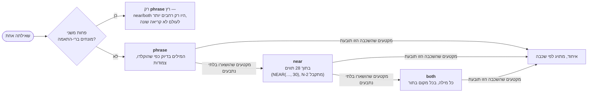

<!--
  Hebrew mirror of `docs/capabilities/14-search-over-the-archive.md`. The
  English file is the source. Conventions: `docs/README.he.md` and
  `docs/the-store.he.md` — Hebrew prose and tables inside `<div dir="rtl">`,
  fenced blocks outside it, `<span dir="ltr">` around any Latin run whose edge
  characters are not both alphanumeric, around any run of two or more Latin
  terms joined by commas or slashes, and — per
  `KNOWN-the-hebrew-convention-says-an-identifier-with-alphanumeric` — around
  any code span that begins with a digit and contains a hyphen.

  All four pasted blocks are byte-identical to the English file, including the
  duplicated `near` row in §14.2's capture that the English paragraph above it
  explicitly refuses to deduplicate, and the `GMT+3` continuation lines a
  narrower retype had once removed. A box-drawing table inside an RTL container
  is reversed by the bidi algorithm, which is the second reason they sit
  outside the `<div>`s. The Hebrew query `הם שורה תוך` in §14.3 is the
  English chapter's own example and is carried across unchanged.

  Heading sequence must stay identical to the English file.
-->

# 14. חיפוש מעל הארכיון

<div dir="rtl">

<span dir="ltr">`docs/capabilities/00-index.he.md`</span> · הקודם:
[<span dir="ltr">`05-anchors.he.md`</span>](./05-anchors.he.md) · הבא:
[<span dir="ltr">`15-document-and-lane-viewer.he.md`</span>](./15-document-and-lane-viewer.he.md)

**הפרק הזה לא היה קיים לפני 2026-09-16.** פרק 4 מתעד *מה* ארכיון השיחות הוא ואיך הוא מאונדקס;
הפרק הזה מתעד את דקדוק השאילתה שקורא — אדם בטרמינל, או מעבר העוגנים האוטומטי — באמת מקבל כשהוא
מקליד מילים לתוכו. כמעט כל מה שלמטה נשלח ביום אחד, 2026-09-16, והמקור לו הוא ארבעה דוחות מאותו
יום (<span dir="ltr">`reports/2026-09-16-the-search-grammar.md`</span>,
<span dir="ltr">`-the-search-shipped.md`</span>, <span dir="ltr">`-indexing-what-was-done.md`</span>,
<span dir="ltr">`-search-adopt-or-build.md`</span>) ועוד הקוד שהם ייצרו, שנקרא ישירות עבור הפרק
הזה ולא הועתק מאף אחד מהם.

## 14.1 מה היה שגוי, במילותיו של הבעלים עצמו

החיפוש של הארכיון היה קיים לפני התאריך הזה — <span dir="ltr">`searchArchive`</span>, שאילתת FTS5
אחת, נגישה מממשק הרשת וממעבר העוגנים האוטומטי (פרק 4) — אבל הוא ענה על קריאה **יחידה** של
שאילתה: כל המילים, צמודות, כתת-מחרוזת אחת. התלונה של הבעלים, שהניעה את העבודה: שתי מילים שהוא
ידע שנמצאות באותו משפט של תור אמיתי החזירו כלום, כי הן לא נגעו.
<span dir="ltr">`trigram hebrew`</span> על הארכיון של המאגר הזה עצמו החזיר בלוק **אחד** בחיפוש
הישן ו-**63 קטעים תחת שלוש כותרות** בחדש.

## 14.2 שלוש קריאות, בשכבות, ולא חוגה לסובב

<span dir="ltr">`searchArchiveTiered`</span> (<span dir="ltr">`src/core/conversation-search.ts`</span>)
קורא שאילתה אחת בשלוש דרכים ומחזיר את האיחוד, כשכל פגיעה מתויגת באיזו קריאה מצאה אותה, והקריאה
הראשונה שתובעת מקטע זוכה בו — ולכן שלוש הקריאות מקננות ולא סופרות שלוש פעמים:

1. **<span dir="ltr">`phrase`</span>** — המילים בדיוק כפי שהוקלדו, צמודות. מה שהחיפוש הישן תמיד
   התכוון אליו.
2. **<span dir="ltr">`near`</span>** — <span dir="ltr">`NEAR(…, 30)`</span>
   (<span dir="ltr">`NEAR_CHARS = 30`</span>): **בתוך 28 תווים** זו מזו, בערך "אותו משפט". הקבוע
   שמועבר ל-FTS5 הוא 30, אבל המרחק שהוא באמת מקבל הוא <span dir="ltr">`N-2`</span> —
   *"חוק: <span dir="ltr">`NEAR(a b, N)`</span> מתאים כשלכל היותר
   <span dir="ltr">`N-2`</span> תווים מפרידים בין שתי תת-המחרוזות"*
   (<span dir="ltr">`conversation-search.ts:874`</span>, נעוץ בשני הגבולות על ידי
   <span dir="ltr">`test/core/search-grammar.test.ts`</span>) — כי FTS5 סופר
   <span dir="ltr">`NEAR`</span> באסימונים ומפצל trigram פולט אסימון אחד לכל מיקום תו, ולכן חלון
   האסימונים *הוא* חלון התווים.
3. **<span dir="ltr">`both`</span>** — כל מילה נוכחת, בכל מקום באותו תור — <span dir="ltr">`AND`</span>
   על פני המונחים ולא התאמת ביטוי או קרבה.

**פחות משני מונחים ברי-התאמה והשלוש מתקפלות לאחת.** קריאות ה-<span dir="ltr">`near`</span>/
<span dir="ltr">`both`</span> של מילה בודדת היו רק *רחבות יותר* מקריאת הביטוי, לעולם לא קריאה
שונה שלה, ולכן <span dir="ltr">`searchArchiveTiered`</span> מריץ רק את
<span dir="ltr">`phrase`</span> במקרה הזה (<span dir="ltr">`conversation-search.ts:1224`</span>,
<span dir="ltr">`.slice(0, parsed.terms.length < 2 ? 1 : SEARCH_TIERS.length)`</span>).

שלוש הקריאות רצות בסדר קבוע מול אותה טבלת <span dir="ltr">`conversation_prose`</span>, וכל אחת
תובעת רק את מה שהקריאות שלפניה הותירו בלתי נתבע — מצויר כאן למקרה הרגיל של שני מונחים ברי-התאמה
או יותר:

</div>



<div dir="rtl">

מקטע שכבר נתבע על ידי <span dir="ltr">`phrase`</span> לעולם אינו נספר מחדש על ידי
<span dir="ltr">`near`</span> או <span dir="ltr">`both`</span> — שלוש השכבות מקננות, הן אינן רצות
באופן בלתי תלוי ומאוחדות בעיוורון. (זה מאונך למתג ה**מקורות**
<span dir="ltr">`said`</span> / <span dir="ltr">`ran`</span> / <span dir="ltr">`both`</span> כמה
פסקאות למטה — ה"both" ההוא אומר כל היקף מקור, ציר שונה מהשכבה "both" הזו, והשניים אינם אותה
בחירה.)

**שום דבר חדש לא נוסף לשום מסך בשביל זה.** שלוש הקריאות מחושבות ומגולות עם כותרת מעל כל בלוק
(מחרוזות <span dir="ltr">`conv.arch.tier*`</span>, בשתי השפות) — קורא אינו בוחר מצב; הוא מקבל את
התשובה המילולית ביותר קודם ואת הרפויות יותר אחריה בהדרגה, וזו הייתה מטרת העיצוב המפורשת של הדוח
שזה נשלח ממנו: *"מצב הכישלון שיש להימנע ממנו הוא דיאלוג Find עם תשע תיבות סימון שאף אחד לא
מסמן."*

דוגמה מעובדת, פלט אמיתי מול הארכיון של המאגר הזה עצמו, **נלכד 2026-09-17 בהרצת הפקודה והפנייתה
לקובץ** — מודבק בשלמותו, עטיפות והכול, בלי שום דבר שהוקלד מחדש.

הגרסה הקודמת של הבלוק הזה לא הייתה לכידה. היא הייתה הטבלה של הפקודה **שהוקלדה מחדש צרה יותר**:
השורה השנייה של עמודת ה-<span dir="ltr">`when`</span>, שנושאת את סיומת אזור הזמן
<span dir="ltr">`GMT+3`</span>, הוסרה מכל שבע השורות והעטיפות של עמודת ה-
<span dir="ltr">`match`</span> קופלו בחזרה לשורה אחת. הסיומת אינה קישוט אופציונלי —
<span dir="ltr">`zonedStamp`</span> (<span dir="ltr">`src/cli/commands/format.ts:397`</span>) תמיד
מצרף אותה, ורוחב הטבלה הוא קבוע, <span dir="ltr">`OUTPUT_WIDTH = 100`</span>
(<span dir="ltr">`src/cli/commands/format.ts:83`</span>), שנבחר בדיוק כך שפלט שהופנה בצינור ופלט
שנצפה יהיו אותם בתים. ולכן הבלוק כפי שהודפס כאן קודם היה צר יותר מכל הרצה של הפקודה יכולה
לייצר, ושום קורא לא היה יכול לשחזר אותו.

שני דברים בלכידה האמיתית למטה ראויים לנקיבה ולא לסידור החוצה. הספירות כולן זזו מאז הלכידה
האחרונה (7 פגיעות הפכו ל-8; <span dir="ltr">`both`</span> התאים ל-1,029 אז ול-1,078 עכשיו), וזה
מה שארכיון חי עושה בין שתי הרצות כלשהן. ושכבת ה-<span dir="ltr">`near`</span> מדפיסה **שתי שורות
זהות** — אותו רגע, אותו נתיב, אותו היסט בתים. זה מה שהפקודה הדפיסה; זה מושאר כי הדבקה שהייתה
מנפה את זה בשקט הייתה אותו מעשה שהבלוק הזה מתוקן בגללו.

</div>

```
$ mycontext conversation search "index report" --limit 3     # 2026-09-17, captured by redirection
┌────────┬────────┬───────────────────────┬──────────┬──────────┬──────────┬───────────────────────┐
│ tier   │ kind   │ when                  │ session  │ lane     │ byte     │ match                 │
├────────┼────────┼───────────────────────┼──────────┼──────────┼──────────┼───────────────────────┤
│ phrase │ answer │ 2026-09-10 11:24      │ 595db3b1 │ agent-a2 │ 4271865  │ …ng [index report]s   │
│        │        │ GMT+3                 │          │          │          │ I…                    │
│ phrase │ prompt │ 2026-09-11 03:48      │ 595db3b1 │ agent-a1 │ 0        │ …er [index report]    │
│        │        │ GMT+3                 │          │          │          │ `I…                   │
│ phrase │ prompt │ 2026-09-10 12:17      │ 595db3b1 │ agent-ac │ 0        │ …ng [index report]s   │
│        │        │ GMT+3                 │          │          │          │ I…                    │
│ near   │ answer │ 2026-09-09 16:26      │ 595db3b1 │ —        │ 81858157 │ … lane [report]ed     │
│        │        │ GMT+3                 │          │          │          │ 66/…                  │
│ near   │ answer │ 2026-09-17 12:03      │ 595db3b1 │ agent-a7 │ 286743   │ …s the [report].      │
│        │        │ GMT+3                 │          │          │          │ Let'…                 │
│ near   │ answer │ 2026-09-17 12:03      │ 595db3b1 │ agent-a7 │ 286743   │ …s the [report].      │
│        │        │ GMT+3                 │          │          │          │ Let'…                 │
│ both   │ answer │ 2026-09-11 05:00      │ 595db3b1 │ —        │ 93156686 │ Now the owed [index]… │
│        │        │ GMT+3                 │          │          │          │                       │
│ both   │ answer │ 2026-09-08 23:23      │ 595db3b1 │ —        │ 73206567 │ …your [index] has     │
│        │        │ GMT+3                 │          │          │          │ `co…                  │
└────────┴────────┴───────────────────────┴──────────┴──────────┴──────────┴───────────────────────┘
my_context: 8 hit(s) in what was said, over prompt and answer spans.
my_context:   phrase: 3 shown of 4 matched — the bound cut this reading.
my_context:   near: 3 shown of 60 matched — the bound cut this reading.
my_context:   both: 2 shown of 1078 matched — the bound cut this reading.
my_context: and 1266 more in what was RUN — add `--sources ran` to see them, or `--sources both`.
my_context: tool_result and thinking blocks are NOT indexed at all, so what a command PRINTED and what the model thought cannot be found by any search here.
```

<div dir="rtl">

כל שורה בתחתית היא גילוי חובה, לא קישוט — ראו §14.5.

**למה <span dir="ltr">`searchArchive`</span> עצמו הושאר ללא נגיעה ולא נכתב מחדש.** הבדיקות של
<span dir="ltr">`anchor-pass.ts`</span> מעמדות את התוצאות של <span dir="ltr">`searchArchive`</span>
עם <span dir="ltr">`offset`</span> מעל סדר כולל יציב — 25 עמודים של 200, התיקון לאירוע של
2026-09-15 שבו הסימון האוטומטי נעצר ליותר מחצי שעה. לאיחוד של שלוש קריאות מדורגות אין היסט גלובלי
יציב: עמוד 2 של תשובה משוכבת אינו "השורות שאחרי עמוד 1 שלה". ולכן הקורא מקבל את הפונקציה
המשוכבת החדשה, <span dir="ltr">`searchArchiveTiered`</span>, והמעבר האוטומטי ממשיך להשתמש בישנה,
בכוונה — <span dir="ltr">`SearchScope`</span> פחות <span dir="ltr">`offset`</span> הוא טיפוס
הפרמטר של הפונקציה המשוכבת, ולכן "היסט חסר משמעות כאן" הוא שגיאת קומפילציה ולא הערה שמישהו יכול
לפספס.

## 14.3 רצפת שלושת התווים עברה מהשאילתה כולה לכל מונח

פרק 4 כבר קובע את הרצפה: אינדקס trigram אינו יכול להתאים פחות משלושה תווים, מעצם הבנייה. עד
2026-09-16 שאילתה שהחזיקה *מילה קצרה כלשהי* יכלה להתרוקן בשקט. עכשיו
<span dir="ltr">`parseSearchQuery`</span> מפצל
<span dir="ltr">`{ phrase, terms, short, excluded }`</span>: מילים מתחת ל-
<span dir="ltr">`MIN_QUERY_CHARS`</span> (3) נשארות בתוך קריאת הביטוי — שעדיין יכולה להתאים אותן
כחלק ממחרוזת מילולית ארוכה יותר — אבל נקובות ומושמטות משתי הקריאות הבוליאניות
(<span dir="ltr">`near`</span>, <span dir="ltr">`both`</span>) ולא מקריסות את השאילתה ולא
מדולגות בשקט. לקורא שמקליד <span dir="ltr">`הם שורה תוך`</span> (עברית,
<span dir="ltr">`הם`</span> בן שני תווים) נאמר ישירות: *"קצר מדי לחיפוש לבד: הם. האינדקס הזה קורא
רצפים של 3 תווים…"* — שלפני שזה נשלח, כל השאילתה הייתה עונה אפס בלי שום הסבר.

## 14.4 <span dir="ltr">`-word`</span> מחריג, ושום דבר אחר אינו נראה כתחביר

<span dir="ltr">`-`</span> מוביל על מילה בת שלושה תווים או יותר מסיר אותה מכל קריאה.
<span dir="ltr">`-`</span> שמודבק בתוך מילה, <span dir="ltr">`-`</span> בודד, או
<span dir="ltr">`-`</span> לפני מילה מתחת לרצפת שלושת התווים כולם נקראים כתווים מילוליים — שום
דבר אינו זורק על דפוס לא מוכר, וזו הייתה בחירה מכוונת נגד מצב הכישלון של תחביר השאילתה של
Elasticsearch עצמו ("דקדוק שיכול לחיות מאחורי הקשה ואחד שאינו יכול"). דוגמה מעובדת:

</div>

```
$ mycontext conversation search "index report -lane" --sources both --limit 2
┌────────┬──────┬────────────────────────┬──────────┬──────────┬─────────┬─────────────────────────┐
│ tier   │ kind │ when                   │ session  │ lane     │ byte    │ match                   │
├────────┼──────┼────────────────────────┼──────────┼──────────┼─────────┼─────────────────────────┤
│ phrase │ ran  │ 2026-09-16 20:07 GMT+3 │ 595db3b1 │ agent-a3 │ 342366  │ …h "[index report]" -…  │
│ phrase │ ran  │ 2026-09-16 19:57 GMT+3 │ 595db3b1 │ agent-a0 │ 2437002 │ …h "[index report]" -…  │
│ near   │ ran  │ 2026-09-11 04:29 GMT+3 │ 595db3b1 │ agent-a1 │ 1834449 │ …se [report].[index]ed  │
│        │      │                        │          │          │         │ …                       │
│ near   │ ran  │ 2026-09-16 19:43 GMT+3 │ 595db3b1 │ agent-a0 │ 641184  │ … [index]ing [report]   │
│        │      │                        │          │          │         │ t…                      │
└────────┴──────┴────────────────────────┴──────────┴──────────┴─────────┴─────────────────────────┘
my_context: 4 hit(s) in what was said and what was run, over prompt and answer and ran spans.
my_context:   phrase: 2 shown of 3 matched — the bound cut this reading.
my_context:   near: 2 shown of 103 matched — the bound cut this reading.
my_context:   both: 0 shown of 961 matched — the bound cut this reading.
my_context: tool_result and thinking blocks are NOT indexed at all, so what a command PRINTED and
what the model thought cannot be found by any search here.
```

<div dir="rtl">

<span dir="ltr">`-lane`</span> הסיר כל תור שמחזיק את המילה "lane" מכל קריאה, על פני היקפי
<span dir="ltr">`said`</span> ו-<span dir="ltr">`ran`</span> בבת אחת (§14.5). **זהו הפלט המלא
והבלתי מקוצץ, כולל ארבע שורות הסיומת ש-§14.2 קורא להן גילוי חובה** — גרסה מוקדמת יותר של הדוגמה
הזו הדביקה שתי שורות ושורת <span dir="ltr">`3 hit(s)`</span> קטועה שהטבלה של עצמה סתרה, וזה בדיוק
סוג ההדבקה המקוצצת שהמשמעת של הסימוכין הזה עצמו קיימת כדי לסרב לה. הרצה מחדש של הפקודה הזהה כמה
שעות אחר כך החזירה תשובה אמיתית *שונה* (4 פגיעות, לא 3) מסיבה כנה ששווה לומר ולא להסתיר: הפקודה
המדויקת הזו הורצה שוב ושוב מול הארכיון החי של סביבת העבודה הזו עצמה תוך כדי כתיבת הפרק הזה
ואימותו מחדש, וכל הרצה היא בעצמה מקטע <span dir="ltr">`ran`</span> חדש שההרצה הבאה יכולה למצוא —
אותה צמיחה עצמית-התייחסותית ש-
<span dir="ltr">`reports/2026-09-16-claude-p-measured.md`</span> מתעד עבור מנגנון אחר. המספר ימשיך
לזוז מהסיבה הזו; צורת התשובה (שתי שכבות פגעו, <span dir="ltr">`both`</span> נחסם, שתי שורות
הגילוי נוכחות) היא מה שהדוגמה הזו באמת מדגימה.

## 14.5 ציר המקורות — <span dir="ltr">`said`</span>, <span dir="ltr">`ran`</span>, או <span dir="ltr">`both`</span>

זהו השינוי היחיד הרחב ביותר במה שהארכיון יכול לענות, והוא נפרד מעבודת השכבות למעלה (נתיב אחר,
אותו יום). עד 2026-09-16 בדיוק שני סוגי מקטעים אונדקסו: <span dir="ltr">`prompt`</span> ו-
<span dir="ltr">`answer`</span> — מה שאדם והמודל *אמרו*. פרק 4 כבר מתאר את זה כפרוסת ה-0.98%–3.3%
ברת-החיפוש של תווי התמליל. **סוג שלישי, <span dir="ltr">`'ran'`</span>, מאנדקס עכשיו בלוקי
<span dir="ltr">`tool_use`</span>** — שם של כלי והארגומנטים שלו, מרונדרים כשורות
<span dir="ltr">`key: value`</span> (לא JSON גולמי, ולכן נתיב שמאוית עם לוכסנים אחוריים מוברחים
ברשומה עדיין נמצא על ידי צורת הלוכסן-קדימה שקורא היה מקליד), תחומים ב-
**<span dir="ltr">`TOOL_VALUE_CAP = 2,000`</span> תווים לכל ארגומנט** (לא לכל בלוק — ה-
<span dir="ltr">`content`</span> של קריאת <span dir="ltr">`Write`</span> אינו יכול לדחוק החוצה את
ה-<span dir="ltr">`file_path`</span> של עצמו).

נמדד על הארכיון האמיתי של סביבת העבודה הזו ב-**2026-09-16**, ביום שזה נשלח, על פני 474
התמלילים ו-1,269,256,560 הבתים שהיא החזיקה אז. שני הנתונים הם **גודל המדגם** שהמדידה הזו נלקחה
עליו, ולא ספירה עדכנית — הארכיון גדל מדי יום, והרצת המדידה מחדש היום הייתה עונה על קורפוס אחר:

</div>

```
kind      spans     characters
prompt    1,671      6,050,609
answer    9,920      7,538,303
ran      58,361     30,277,871      <- new
total    69,952     43,866,783      against 11,554 spans / 13,575,116 before
```

<div dir="rtl">

**13.58 מיליון תווים ברי-חיפוש הורחבו ל-43.87 מיליון — הרחבה פי 3.2** — תמורת פי 2.0 בגודל
אינדקס ה-FTS5 ופי 2.5 בבנייה מחדש מלאה, ו**שום דבר מדיד ברענון התוספתי הפר-תורי** (הקצב של ה-hook
<span dir="ltr">`Stop`</span>), שהוא המספר שבאמת מכריע אם זה היה בר-השגה: <span dir="ltr">+13</span> מילישניות על הזנב
האמיתי הגדול ביותר שנמדד, מול תקציב hook של 1,600 מילישניות.

**הקורא בוחר את ההיקף, וברירת המחדל לא זזה.** <span dir="ltr">`said`</span>
(<span dir="ltr">`prompt`</span> + <span dir="ltr">`answer`</span>) היא עדיין ברירת המחדל בכל
משטח — שורת פקודה, ממשק רשת, וכל קורא קיים (<span dir="ltr">`anchor-pass.ts`</span>,
<span dir="ltr">`retrieval/from-selection.ts`</span>, שורת החיפוש במסמך) — ולכן שום דבר שנכתב לפני
התאריך הזה לא התרחב בשקט. מה שהשתנה הוא ש**כל תשובה נוקבת עכשיו במה שהסוג שהיא לא קראה מחזיק**:

</div>

```
my_context: nothing in what was said holds "measure-tool-indexing".
my_context: and 11 more in what was RUN — add --sources ran to see them, or --sources both.
```

<div dir="rtl">

חיפוש <span dir="ltr">`said`</span> שמחזיר אפס לעולם לא יוכל שוב להתבלבל עם "הארכיון אינו מכיל
את זה" — גילוי ה-<span dir="ltr">`elsewhere`</span> (<span dir="ltr">`countProse`</span> נוסף אחד
על ההיקף המשלים, שמחויב רק כשקריאה באמת מילאה את החסם שלה) הופך את ההבחנה בין *נעדר* לבין *לא
מאונדקס כאן* לנראית בכל תשובה, כולל ריקות. זו אותה משמעת שממנה מגיעים גם כלל הבית-מול-התו של
פרק 4 וגם <span dir="ltr">`INV-nothing-is-dropped-silently`</span> של הפרויקט הזה.

**שורת פקודה**: <span dir="ltr">`mycontext conversation search <query> [--sources said|ran|both] [--session <id>] [--agent <id>] [--limit <n>] [--json]`</span>.
**API של הרשת**: <span dir="ltr">`GET /api/conversations/search?sources=…`</span>. שליחת
<span dir="ltr">`sources`</span> *וגם* מסנן <span dir="ltr">`kind`</span> שנוקב בדברים מחוץ
להיקף ההוא נדחית ולא נפתרת בשקט — הם שני מסננים שונים על אותה עמודה ובחירת מנצח הייתה מציירת
כותרת שאינה נכונה לגבי השורות של עצמה.

**מה שעדיין, במכוון, אינו בשום אינדקס בשום היקף: <span dir="ltr">`tool_result`</span> (67.0%
מתווי הארכיון, לפי המדידה המצוטטת של <span dir="ltr">`conversation-search.ts`</span> עצמו — ראו
את ההערה של [פרק 4](./04-conversation-archive.he.md) על נתון <span dir="ltr">`78.9%`</span> שני
ולא מצוטט במקום אחר באותו מקור של המוצר עצמו שהסימוכין הזה אינו מתייחס אליו כסמכותי) ו-
<span dir="ltr">`thinking`</span> (16.4%).** כל תשובת חיפוש אומרת זאת, באותו משפט, בין אם היא
מצאה משהו ובין אם לא. <span dir="ltr">`tool_result`</span> נמדד ותומחר (תקרה של 512 תווים הייתה
מוסיפה כ-80 MB / כ-18 שניות לבנייה מחדש ותופסת את המסך הראשון של כמעט כל פלט פקודה; 2,048 —
התקרה שנקובה כשזה תוחם — עולה יותר מכל שאר האינדקס יחד, בעיקר בהשלכות קבצים ובפלט טסטים) אבל
**שום דבר לגביו אינו נשלח**; ההכרעה רשומה כשל הבעלים, ב-
<span dir="ltr">`reports/2026-09-16-indexing-what-was-done.md`</span> §7, וטסט נועץ את ההיעדר שלו
כך ששינוי מאוחר יותר אינו יכול להרחיב אותו בשקט.

## 14.6 דירוג בתוך שכבה

דירוג ה*ארכיון* ודירוג *קורפוס הפריטים* הם שני מנגנונים שונים, שניהם נשלחו 2026-09-16, ושווה
לשמור אותם נפרדים:

- **הארכיון** כבר היה לו <span dir="ltr">`bm25()`</span> זמין (ה-FTS5 של
  <span dir="ltr">`node:sqlite`</span> שולח אותו) והוא פשוט מעולם לא *נעשה בו שימוש* כדי לסדר
  תוצאות לפני פסיקת הבעלים באותו יום
  (<span dir="ltr">`RULE-search-may-rank-its-results-and-the-model-it-asks-is-the`</span>) שהסירה
  סירוב מוקדם יותר. <span dir="ltr">`matchProse`</span> כבר מחזיר
  <span dir="ltr">`ORDER BY bm25() ASC`</span>, ולכן ברגע שהשכבות היו קיימות, מתן סדר הטוב-ראשון
  משלה לכל קריאה לא עלה דבר מעבר ל*אי-מיון מחדש על פני שכבות* — השכבה עצמה נשמרת כסדר הראשי כי
  היא אומרת **למה** תוצאה נמצאת היכן שהיא, מה שציון חשוף אינו יכול, ושכבה היא "טובה יותר מציון
  ואינה תחליף לו."
- **קורפוס הפריטים** (<span dir="ltr">`mycontext search`</span>,
  <span dir="ltr">`list_items`</span>) עבר מפרדיקט תת-מחרוזת *לא מדורג* למדרג BM25 אמיתי באותו
  יום, במנגנון אחר — ראו את הרשומה <span dir="ltr">`search`</span> של
  [פרק 9](./09-cli-and-mcp.he.md) ואת <span dir="ltr">`src/core/rank.ts`</span>. שני הדירוגים
  אינם חולקים קוד ואין להניח שהם מתנהגים דומה; שניהם BM25 מעל מכונת ה-FTS5 של SQLite, מחווטים
  באופן בלתי תלוי.

## 14.7 מה **לא** בנוי / בנוי אך כבוי

- **<span dir="ltr">`tool_result`</span> אינו בשום אינדקס, בשום תקרה.** §14.5. פסיקה של אדם
  נדרשת לפני שזה נשלח; טבלת העלויות לארבע תקרות מועמדות נמצאת בדוח המקור.
- **משטח החיפוש שבתוך המסמך ושלוש החלוניות הצפות שלו (פרק 15) אינם עוברים דרך המנגנון הזה כלל.**
  הם סורקים ישירות ב-JavaScript/TypeScript את מקטעי הפרוזה של תמליל אחד שכבר פתוח, בלי שום אינדקס
  FTS5 מעורב — כלי שונה מהיסוד לשאלה שונה מהיסוד ("איפה ב*מסמך הזה*", ולא "אילו תורים בכל
  הארכיון"). פרק 15 מכסה למה ביטוי רגולרי, מילה שלמה ותלות ברישיות נדחים *כאן* על סמך המדידה של
  סעיף 6 עצמו אך נשלחו *שם*.
- **חיפוש סמנטי / מבוסס-embedding נחקר ובמפורש לא אומץ.**
  <span dir="ltr">`reports/2026-09-16-search-adopt-or-build.md`</span> ו-
  <span dir="ltr">`-claude-p-measured.md`</span> מדדו את <span dir="ltr">`claude -p`</span> כמנגנון
  מועמד ומצאו אותו רקורסיבי מעצם הבנייה — קריאת ילד טוענת את התוסף הזה, מאונדקסת על ידי ה-hook
  <span dir="ltr">`Stop`</span> של עצמה, ותוצאות החיפוש מתחילות להחזיר את החיפושים הקודמים של
  הקורא עצמו כפגיעות. **שום דבר כאן לא נשלח**; הפריט נשאר פתוח, והפרק הזה אינו מתעד שום יכולת
  חיפוש סמנטי כי אין כזו.
- **<span dir="ltr">`conversation anchor --find`</span> נשאר כלי נפרד וצר יותר** — הוא מחפש
  *תוויות* עוגנים (טקסט שאדם כתב), ולא פרוזת ארכיון, והוא קיים כדי להניח או לאתר סימנייה ולא כדי
  להחזיר קבוצת תוצאות מדורגת. ראו [פרק 5, §5.8](./05-anchors.he.md#58-דוגמאות-מעובדות).
- **שאילתת <span dir="ltr">`said`/`ran`/`both`</span> עדיין אינה יכולה לחפש ב-
  <span dir="ltr">`tool_result`</span>, ולכן "מה הפקודה ההיא הדפיסה" נשאר בלתי ניתן למענה משום
  משטח חיפוש** — רק "איזו פקודה זו הייתה" (<span dir="ltr">`ran`</span>) ו"מה אמרנו עליה"
  (<span dir="ltr">`said`</span>) ניתנים.
- כל ספירה בפרק הזה היא **קריאה מתוארכת** מ-2026-09-16, שנלקחה מול ארכיון חי וגדל; הריצו מחדש את
  הפקודות שמוצגות כדי לקבל את המספרים של היום.

## ראו גם

- [00 — אינדקס](./00-index.he.md)
- [04 — ארכיון השיחות](./04-conversation-archive.he.md) — אינדוקס, סיווג, היסטי בתים, והמפצל
  trigram שדקדוק הפרק הזה בנוי עליו
- [05 — עוגנים](./05-anchors.he.md) — הבדיקות של המעבר האוטומטי, שמשתמשות ב-
  <span dir="ltr">`searchArchive`</span> (ללא נגיעה) ולא בפונקציה המשוכבת שהפרק הזה מתאר
- [09 — שורת הפקודה ו-MCP](./09-cli-and-mcp.he.md) — <span dir="ltr">`conversation search`</span>
  בסימוכין הפקודות המלא, ושינוי דירוג קורפוס הפריטים שהפרק הזה מבחין את עצמו ממנו
- [15 — מציג המסמכים והנתיבים](./15-document-and-lane-viewer.he.md) — משטח החיפוש ושלוש החלוניות
  הצפות, שמחפשים מסמך פתוח אחד ישירות ולא שואלים את האינדקס הזה

</div>
