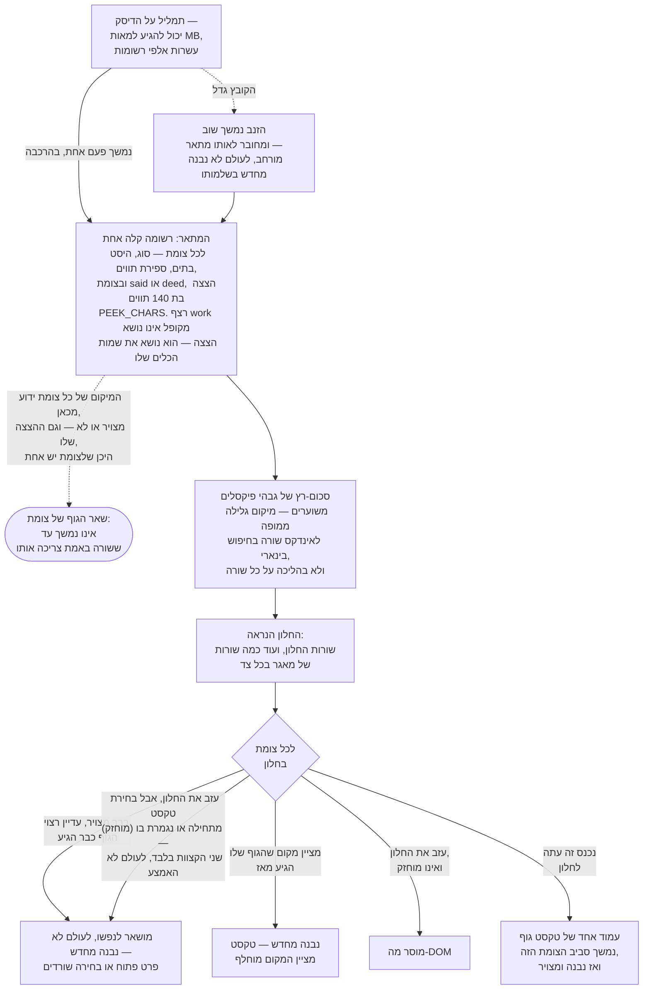
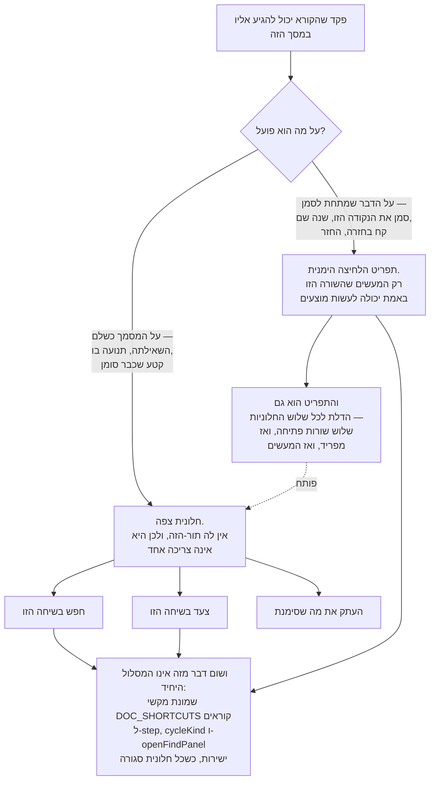

<!--
  Hebrew mirror of `docs/capabilities/15-document-and-lane-viewer.md`. The
  English file is the source. Conventions: `docs/README.he.md` and
  `docs/the-store.he.md` — Hebrew prose and tables inside `<div dir="rtl">`,
  fenced blocks outside it, `<span dir="ltr">` around any Latin run whose edge
  characters are not both alphanumeric, around any run of two or more Latin
  terms joined by commas or slashes, and — per
  `KNOWN-the-hebrew-convention-says-an-identifier-with-alphanumeric` — around
  any code span that begins with a digit and contains a hyphen.

  SCREENSHOTS: the English chapter carries five placeholder blocks across four
  sections (§15.3, §15.4 ×2, §15.5, §15.6). This mirror carries five Hebrew
  ones at the same five points. They are NOT translations of the English shot
  list: an RTL screen is not the English one flipped — the panels cascade from
  the right edge, the card head and the `⤢` control sit at the right, the
  count line reads right-to-left, and the regular-expression reference's left
  column stays LTR inside an RTL table. `rulings/101` owns them and runs after
  this pass. NEVER reuse an English image for a Hebrew placeholder.

  The English §15.8 says "Four placeholders are marked in §15.3–§15.6" while
  five blocks exist. That sentence is translated as it stands and the
  discrepancy is named in this pass's report rather than resolved here.

  Heading sequence must stay identical to the English file.
-->

# 15. מציג המסמכים והנתיבים

<div dir="rtl">

<span dir="ltr">`docs/capabilities/00-index.he.md`</span> · הקודם:
[<span dir="ltr">`14-search-over-the-archive.he.md`</span>](./14-search-over-the-archive.he.md) ·
הבא: [<span dir="ltr">`08-web-ui.he.md`</span>](./08-web-ui.he.md)

**הפרק הזה נכתב ב-2026-09-16 ומחציתו הוחלפה למחרת.** תצוגת המסמך
(<span dir="ltr">`/doc.html`</span>, <span dir="ltr">`doc.js`</span>) ותצוגת הנתיב
(<span dir="ltr">`/lane.html`</span>, <span dir="ltr">`lane.js`</span>) של מסך השיחות מרנדרות
תמליל פתוח אחד לקריאה — קיפול, הדגשת פגיעות, משטח חיפוש, פקדי הסימנים-בשוליים שפרק 5 מתאר, ומאז
2026-09-17, **שלוש חלוניות צפות שביניהן הן מחזיקות עכשיו כל פקד שהמסך הזה נהג לשמור ברצועה מעל
המסמך**.

**מה השתנה ב-2026-09-17, וזו הסיבה ש-§15.2 ואילך נקרא אחרת מ-§15.0 ומ-§15.1.** הטקסט של
2026-09-16 תיאר חלונית אחת (חיפוש) ש*שאלה* פקדים משתי רצועות, <span dir="ltr">`.tvbar`</span> ו-
<span dir="ltr">`.tvnav`</span>, והחזירה אותם כשנסגרה. **אף אחת מהרצועות אינה קיימת עוד.** שתי
החלוניות האחרות שהבעלים ביקש נבנו, הפקדים עברו לתוכן לצמיתות, תפריט הלחיצה הימנית קוצץ למה שפועל
על התור שמתחת לסמן, והמציג קיבל מתג מסך-מלא. כל משפט ב-§15.2–§15.6 למטה נקרא מהקוד הנשלח
ב-2026-09-17; היכן שנתון נישא ממדידה של נתיב עצמו ולא נגזר מחדש כאן, זה נאמר על השורה.

**העובדה האחת שיש להחזיק לאורך כל הפרק הזה**: כל מה שכאן קורא **תמליל אחד שכבר פתוח**, ישירות,
ב-JavaScript בצד השרת ובצד הדפדפן של אותו קובץ — לעולם לא את אינדקס ה-FTS5 של הארכיון שפרק 14
מתאר. הוא עונה על שאלה אחרת ("איפה ב*מסמך הזה*") ומשלם מחיר אחר, קטן בהרבה, כדי לענות עליה
(מקטעי הפרוזה של תמליל אחד, לא כל הארכיון).

## 15.0 מה נשאר מחוץ לזיכרון — המתאר, החלון, והגלילה

כל מנגנון בשאר הפרק הזה רץ מול תמליל שיכול להיות גדול מאוד — סשן חי במכונה הזו הגיע למאות
מגה-בתים על פני עשרות אלפי רשומות, ונתון חי שמצוטט בכל מקום בפרק הזה הוא קריאה מסשן כזה, לא
קבוע. שום פרוזה של פרק אינה מתארת איך המציג נשאר בר-גלילה מול מסמך בגודל הזה — סעיף "מה **לא**
בנוי" של פרק 4 עצמו נוקב בקובץ שזה חי בו
(<span dir="ltr">`src/ui/public/screens/conversations.js`</span>) ואומר בפשטות שלא הוא ולא פרק 8
מתארים את זה. המנגנון עצמו משתרע על הקובץ ההוא ועל
<span dir="ltr">`src/ui/public/lib/transcript-scroll.js`</span>; הסעיף הזה נקרא ישירות משניהם,
מכיוון ששום פרוזה של פרק אינה מכסה אותו כבר.

</div>



<div dir="rtl">

ארבעה דברים ששווה לומר במדויק, כי בכל אחד קל לטעות מהצורה לבדה — ושלושה מהם תיקנו טיוטה ראשונה
של הסעיף הזה, 2026-09-17:

- **המתאר נושא הצצה של הטקסט ברוב הצמתים, ובסוג אחד הוא אינו נושא אף אחת.**
  <span dir="ltr">`p`</span> אופציונלי — <span dir="ltr">`p?: string`</span>
  (<span dir="ltr">`read-model-conversation-document.ts:421`</span>) — והוא מוגדר בדיוק בשני
  מקומות: בצומת <span dir="ltr">`said`</span>, ורק כשההצצה אינה ריקה
  (<span dir="ltr">`:1797-1798`</span>), ובצומת <span dir="ltr">`deed`</span>, באותו אופן
  (<span dir="ltr">`:1820`</span>). רצף <span dir="ltr">`work`</span> מקופל נבנה בלעדיו
  (<span dir="ltr">`:1830-1837`</span>) ונושא <span dir="ltr">`x`</span>, את שמות הכלים שלו,
  במקום — ובתמליל ארוך הרצפים האלה הם עיקר ספירת הצמתים. ההצצה עצמה היא
  <span dir="ltr">`PEEK_CHARS = 140`</span> תווים (<span dir="ltr">`:185`</span>). **גרסה מוקדמת
  יותר של הסעיף הזה אמרה "כל צומת שולח שדה <span dir="ltr">`p`</span>", וזה אינו נכון לגבי סוג
  צמתים שלם.**
- **מה שתיבת החיפוש מחפשת הוא ארבעה שדות, וההצצה היא אחד מהם.** הפרדיקט של המתאר הוא
  <span dir="ltr">`matchesNode`</span> (<span dir="ltr">`src/ui/public/lib/transcript-scroll.js:75-77`</span>),
  וערמת השחת שלו היא:

</div>

  ```js
  const hay = `${node.p ?? ''} ${(node.x ?? []).join(' ')} ${node.y ?? ''} ${node.w ?? ''}`;
  ```

<div dir="rtl">

  ההצצה, שמות הכלים, התווית הסינתטית ועמודת ה"מי". והישג-יד על כל הסשן **אינו** מה שההצצה קונה
  בפני עצמה: <span dir="ltr">`reView`</span> עושה OR בין הפרדיקט המקומי לבין תשובת הטקסט המלא של
  השרת — <span dir="ltr">`matchesNode(nodes[i], needle, holds) || foundAt.has(i)`</span>
  (<span dir="ltr">`src/ui/public/screens/conversations.js:7874`</span>), מעל הערת מקור שאומרת
  ש-<span dir="ltr">`foundAt`</span> *"הוא OR ולעולם לא תחליף … כל אחד מוצא שורות שהשני אינו
  יכול"*. הערת התיעוד של השדה עצמו קוראת לו *"המסנן של הקורא"*
  (<span dir="ltr">`read-model-conversation-document.ts:413-415`</span>), שזו המילה הצרה והמדויקת
  יותר.
- **המתאר נמשך פעם אחת בהרכבה, ו*מורחב*, לא נבנה מחדש, כשהקובץ גדל.** סקר המעקב של מסמך חי מושך
  מחדש רק את הזנב ומחבר אותו לאותו מערך (<span dir="ltr">`refill`</span> של
  <span dir="ltr">`conversations.js`</span>). הוא לעולם אינו נמשך מחדש בשלמותו ולעולם אינו נבנה
  מחדש מאפס — ההבחנה שחשובה היא "שלם" מול "זנב", ולא "פעם אחת" מול "לעולם לא שוב".
- **המיקום של צומת והגוף המלא של צומת הם שתי עובדות שונות עם אורכי חיים שונים.** המיקום של כל
  צומת ידוע מהמתאר ברגע שהמסמך נפתח, בין אם הוא צויר אי פעם ובין אם לא, וכך גם ההצצה בת 140
  התווים שלו היכן שיש לו אחת — ראו את הסעיף הראשון לסוג הצומת שאין לו. שאר הטקסט שלו נמשך רק ברגע
  ששורה עבורו באמת נבנית, עמוד אחד בכל פעם, סביב הצומת שגוללים אליו.
- **"מיחזור" כאן אינו אומר מאגר קבוע של שורות DOM שמוטבע בהן תוכן חדש, וזה גם אינו "לעולם לא נבנה
  מחדש" מוחלט.** שורה שכבר צוירה, עדיין רצויה, ומחזיקה טקסט אמיתי מושארת ללא נגיעה. שורה
  ש**בחירת** טקסט מתחילה או נגמרת בה (<span dir="ltr">`held`</span>) שורדת את עזיבת החלון במקום
  להיות מוסרת — ורק שתי השורות האלה: <span dir="ltr">`held`</span> מנוקה וממולא מחדש מ-
  <span dir="ltr">`boundaryRows()`</span> בתוך המטפל ב-<span dir="ltr">`selectionchange`</span>
  (<span dir="ltr">`screens/conversations.js:9551-9552`</span>), תחת הצהרה שמסרבת במפורש לנעוץ כל
  שורה מסומנת כי <span dir="ltr">`measure`</span> היה אז כופה פריסה לכל שורה נעוצה
  (<span dir="ltr">`:6979-6987`</span>). סימן **עוגן** — המובן של "מסומן" ב-§15.7 — אינו מחזיק
  שום שורה. אבל **מציין מקום** — שורה שעדיין קוראת "Reading…" — *כן* נהרס ונבנה מחדש ברגע שהגוף
  שלו מגיע, מוחזק או לא: אין עדיין טקסט ששווה לשמור בו בחירה, והשארתו הייתה נועצת את מציין המקום
  לנצח. הסיבה ששורות רגילות מושארות לנפשן נאמרת ישירות במקור: אלמנט
  <span dir="ltr">`<details>`</span> שקורא פתח, או בחירת טקסט, חייבים לשרוד גלילה של שני
  פיקסלים, ובניית השורה מחדש הייתה סוגרת או מנקה אותם.

## 15.1 משטח החיפוש — מודע-לקיפול, נספר-בשרת, וכבר לא ברצועה

**איפה תיבת החיפוש, נכון ל-2026-09-17: בתוך חלונית החיפוש, ובשום מקום אחר.** הסעיף הזה נכתב
כשהיא עמדה ברצועת <span dir="ltr">`.tvbar`</span> מעל המסמך; הרצועה ההיא הלכה (§15.5), התיבה
נבנית פעם אחת בהרכבה לתוך גוף חלונית החיפוש, והמסלול היחיד אליה הוא לפתוח את החלונית ההיא —
מתפריט הלחיצה הימנית, או עם <span dir="ltr">`/`</span>. כל מה שלמטה על *מה שהקלדה לתוכה עושה*
אינו משתנה מהמעבר, כי המשווה והסריקה מעולם לא ידעו איפה התיבה מצוירת.

הקלדה לתוכה עושה שני דברים בבת אחת, שמחושבים באותה דרך בשתי סביבות ריצה שונות ממודול משותף אחד,
<span dir="ltr">`src/ui/public/lib/fold.js`</span>:

- **צובעת** כל התאמה בשורות המצוירות כרגע, דרך CSS Custom Highlight API;
- **סופרת** כל התאמה על פני *כל* התמליל, דרך סריקה בצד השרת.

### קיפול: מנורמל-NFKD, לא תלוי רישיות, מדויק-בתים

הקלדת שלוש נקודות מילוליות (<span dir="ltr">`...`</span>) מוצאת את תו שלוש הנקודות היחיד
<span dir="ltr">`…`</span> — טבלאות המחרוזות של ממשק הרשת עצמו
(<span dir="ltr">`strings/en.js`</span> + <span dir="ltr">`strings/he.js`</span>) כותבות אותו
**80** פעמים, נספר מחדש 2026-09-16 ישירות מול העץ (<span dir="ltr">`grep -o "…"`</span> על כל
קובץ: 43 ו-37) — כי המשווה מנרמל עם Unicode NFKD לפני ההשוואה. **נתון אחר, 3,062, מופיע ב-
<span dir="ltr">`reports/2026-09-16-search-adopt-or-build.md`</span>, אבל הוא סופר
<span dir="ltr">U+2026</span> על פני *מקטעי הפרוזה של ארכיון השיחות*, ולא את המחרוזות של המוצר
הזה עצמו** — גרסה מוקדמת יותר של המשפט הזה לקחה את המספר ההוא מהדוח וחיברה אותו לשם העצם הלא
נכון. נתון ה-**80** הוא זה שהטיעון הזה נשען עליו והוא יציב (טבלאות המחרוזות משתנות לעיתים
רחוקות); שני הנתונים "לסדר גודל" למטה אינם, והם ניתנים רק כסדר גודל, מתוארכים 2026-09-16:
<span dir="ltr">`src/`</span> (קוד, לא הארכיון) החזיק בערך 750 שלוש-נקודות, וכל קובץ מנוטר במאגר
כולו החזיק בערך 3,500 — שתי הספירות זזות עם כל commit שנוגע בפרוזה, אז הריצו מחדש
<span dir="ltr">`grep -rco "…" src/ | …`</span> ולא תסמכו על אף אחד מהמספרים ספציפית.
<span dir="ltr">`fold.js`</span> עצמו היה **102 שורות כשהכותרת של המשווה עצמו העריכה לראשונה את
גודלו**; הקובץ הוא מודול שנטען בדפדפן ומפותח באופן פעיל והוא גדל משמעותית מאז (**1,339 שורות**
נמדדו 2026-09-16) כשנתיבים מאוחרים יותר הרחיבו אותו — נתון 102 השורות מתאר את גודל ה*רעיון* ברגע
שהוא נשלח, ולא את הגודל הנוכחי של הקובץ, והפרק הזה לא היה צריך לחזור עליו כעובדה עדכנית בלי
ההסתייגות הזו. <span dir="ltr">`fold.js`</span> אומת ב**הרצה, ולא בקריאה**: ה-
<span dir="ltr">`SearchCursor`</span> האמיתי של <span dir="ltr">`@codemirror/search`</span>
(מימוש הייחוס שהפרויקט הזה בחר לא לאמץ כתלות —
<span dir="ltr">`CONST-zero-runtime-dependencies`</span>) חולץ מה-tarball שפורסם שלו והורץ לצד
המשווה של הפרויקט הזה עצמו על פני **11,364 מקטעי פרוזה אמיתיים מהארכיון × 20 שאילתות**, כולל
פתולוגיות (<span dir="ltr">`o`</span> חשוף לבדו: 671,841 פגיעות על פני 11,167 מקטעים). התוצאה:
**0 הבדלים, 0 אי-התאמות בתים**, על פני 1,775,487 פגיעות שהושוו.

**מה שהגרסה של הפרויקט הזה עושה ושל מעלה הזרם לא**: עונה בהיסטי **בתים** של UTF-8, שנצברים על
אותה הליכה יחידה כמו ההתאמה עצמה (לעולם לא מעבר שני שיכול לחלוק על הראשון) — כי כל עוגן, כל
חיפוש מיקום, כל מיקום שמור במוצר הזה הוא בתים, לעולם לא תווים (פרק 4), והארכיון הזה הוא חצי
עברית, שבה גישה תמימה של נרמול-ואז-<span dir="ltr">`indexOf`</span> שגויה לכל היסט אחרי התו
המקופל הראשון, בשקט.

**מה נמדד, ולא הונח, לפני שזה נשלח**: שאילתה בת שני תווים (<span dir="ltr">`..`</span>) היא אפס
שקט באינדקס ה-trigram של FTS5 (הרצפה של פרק 14) אבל לתיבת החיפוש **אין רצפה כזו**, כי שום אינדקס
אינו מעורב — <span dir="ltr">`..`</span> מתקפל ומוצא <span dir="ltr">`…`</span> כאן בדיוק כמו
ש-<span dir="ltr">`...`</span> עושה. נמדד מחדש על הארכיון החי (11,364 מקטעי פרוזה, ביום שזה
נשלח): <span dir="ltr">`indexOf`</span> פשוט על <span dir="ltr">`...`</span> מוצא 463 מקטעים,
FTS5 מוצא את אותם 463, והמשווה המקופל מוצא **1,024 — פי 2.21** — ה-561 הנוספים הם כיסוי שהעיצוב
הדו-שלבי של FTS5-ואז-סמן שהפרויקט הזה שקל ודחה היה משמיט בשקט
(<span dir="ltr">`INV-nothing-is-dropped-silently`</span>).

### הספירה היא תורים, לא מופעים, והיא אומרת זאת

שורת הספירה שמצוירת מתחת לתיבה היא משפט אמיתי ומכוון, לא מספר, וכל חלק בה קיים מסיבה נכפית:

> *"450 תור/ים של מילים מחזיקים את מה שהקלדת, 1403 פעם/ים — חיפשנו ב-4495 תורי המילים שיש לתמליל
> הזה, מתוך 53561 רשומות. פלט כלים ומכונה אינם מאונדקסים ואפשר למצוא אותם כאן רק לפי הכלים
> שהריצו אותם."*

- **תורים, לא שורות מצוירות.** הספירה מגיעה מסריקה בצד השרת של כל מקטע פרוזה
  (<span dir="ltr">`findInDocument`</span>), לעולם לא מהליכה על ה-DOM — המסמך מווירטואל (חלקיק
  משורות תמליל גדול נמצא על המסך בבת אחת), ולכן ספירה מבוססת-DOM הייתה עונה "בשורות שיש לי"
  ולא אומרת דבר על כך. מתקן קובע שהספירה יכולה לחרוג מהשורות המצוירות.
- **תורים, לא מופעים, וזו אינה ביישנות.** השרת מתאים את הטקסט הגולמי של הרשומה; הדפדפן צובע את
  הטקסט ה*מרונדר*; אלה מחרוזות שונות באמת (תחביר Markdown נמצא באחת ולא בשנייה). ספירת כותרת של
  מופעים הייתה הבטחה על טווחים צבועים שהמרנדר חופשי לשבור; ספירת תורים נכונה בשני הצדדים. נתון
  המופעים לכל תור ("1403 פעם/ים") מוצג לצידה כמה שהוא — הטקסט של הרשומה עצמה — ולעולם אינו מעורבב
  עם ספירה של הדגשות ניתנות לצביעה.
- **ההיקף על השורה.** "פלט כלים ומכונה אינם מאונדקסים" נוקב בפער שפרק 4 ופרק 14 שניהם מודדים:
  בסביבת העבודה הזו בערך 47,910 מתוך 52,292 רשומות בסשן אחד הן מכונה, שניתנות למציאה במשטח הזה רק
  לפי הכלים שהן הריצו (כלומר בהרחבת חיפוש הארכיון בפרק 14 ל-<span dir="ltr">`--sources ran`</span>,
  מנגנון שונה לגמרי מזה).
- **סריקה חסומה מגלה את החסם שלה.** <span dir="ltr">`FIND_SCAN_CAP`</span> (40,000 מקטעי פרוזה,
  בערך פי 3.5 מהתמליל הגדול ביותר בסביבת העבודה הזו) מגדיר דגל <span dir="ltr">`capped`</span>
  שמצייר משפט משלו ולא סופר בחסר בשקט; <span dir="ltr">`FIND_HITS_PER_TURN`</span> (500) חוסם את
  נתון המופעים לכל תור; <span dir="ltr">`FIND_PAINT_PER_ROW`</span> נפרד (300) חוסם רק את
  ה*ציור*, במכוון בלי גילוי, כי הספירה שלצד התיבה לעולם אינה מגיעה ממנו.

### ההדגשה שורדת את הווירטואליזציה, וזה אומת ולא הונח

תצוגת המסמך ממחזרת שורות DOM כשהקורא גולל (וירטואליזציה). <span dir="ltr">`Range`</span> שנרשם
מול הטקסט של שורה יכול להיזרק מתחת להדגשה כשהשורה ההיא מפונה — ואומת ישירות, בדפדפן אמיתי,
ש-<span dir="ltr">`Range`</span> של DOM לתוך צומת שהוסר **אינו** הופך אינרטי; הוא מתמוטט בשקט אל
ההורה לשעבר שלו בעוד ש-<span dir="ltr">`CSS.highlights.has(...)`</span> ממשיך לענות
<span dir="ltr">`true`</span>. זו בדיוק צורת הכישלון השקט שהפרויקט הזה מסרב לה. התיקון:
<span dir="ltr">`paintFinds`</span> בונה מחדש את *כל* רישום ההדגשות מהשורות החיות כרגע בכל צביעה
בודדת, ולא שומר אחד על פני צביעות — בעלות של הליכה אחת על כעשרים שורות, וטסט הוכחה-בהסרה (מוטציה
E3 בדוח המקור) קיים במיוחד כדי לתפוס "אופטימיזציה" עתידית שממטמנת את הרישום במקום.

## 15.2 ארבע דרכים להקליד שאילתה, ושתי תיבות שחלות על כל הארבע

**איך אתם קוראים את השאילתה הוא בחירה אחת מתוך ארבע, ולא קבוצה של תיבות סימון בלתי תלויות.**
<span dir="ltr">`MODES = ['normal', 'wildcard', 'logical', 'regex']`</span>
(<span dir="ltr">`src/ui/public/lib/fold.js`</span>) הם **מוציאים זה את זה** — קבוצת רדיו, ולא
תיבות סימון — עם <span dir="ltr">`caseSensitive`</span> ו-<span dir="ltr">`wholeWord`</span> כשני
בוליאנים בלתי תלויים לצידם (<span dir="ltr">`FindOptions`</span>, משותף ל-
<span dir="ltr">`fold.js`</span> ול-<span dir="ltr">`conversation-search.ts`</span>). הערת המקור
קובעת את הנימוק כתיקון ישיר של עיצוב מוקדם יותר: Notepad++, הייחוס שהבעלים נקב בו, אינו מציע את
מצבי הקריאה שלו כתיבות סימון גם הוא — הוא מציע *Normal / Extended / Regular expression* כקבוצת
רדיו אחת עם *Match case* ו-*Whole word* כתיבות בלתי תלויות לצידה, "כי ל'איך אני קורא את המחרוזת
הזו' יש בדיוק תשובה אחת בכל רגע ו'האם רישיות משמעותית' היא שאלה אחרת."
<span dir="ltr">`regex: true`</span> בלי <span dir="ltr">`mode`</span> שניתן עדיין אומר
<span dir="ltr">`'regex'`</span>, ולכן כל קורא שנכתב מול הצורה הראשונה שנשלחה של החלונית ממשיך
לעבוד ללא שינוי.

</div>

<div dir="rtl">

| מצב | מה זה אומר | לעולם אינו הופך ל |
|---|---|---|
| `normal` | ההתאמה המילולית המקופלת ש-§15.1 כבר מתאר | — |
| `wildcard` | <span dir="ltr">`*`</span> מתאים לכל רצף תווים כולל אף אחד, <span dir="ltr">`?`</span> מתאים בדיוק לאחד; <span dir="ltr">`\*`</span> מבריח כוכבית מילולית; החלקים שבין התווים הכלליים מתקפלים בדיוק כמו ש-<span dir="ltr">`normal`</span> עושה, ולכן <span dir="ltr">`b*t...`</span> עדיין מגיע ל-<span dir="ltr">`byte…`</span> | ביטוי רגולרי — מותאם בתפירת חלקים מילוליים יחד, לעולם לא מקומפל כאחד |
| `logical` | <span dir="ltr">`AND`</span>, <span dir="ltr">`OR`</span>, <span dir="ltr">`NOT`</span>, <span dir="ltr">`NEAR`</span> באותיות גדולות הם אופרטורים (<span dir="ltr">`and`</span> באותיות קטנות היא מילה); שתי מילים זו לצד זו אומרות <span dir="ltr">`AND`</span>; מרכאות עושות ביטוי; סוגריים מקבצים; <span dir="ltr">`NEAR`</span> חשוף מקבל כברירת מחדל <span dir="ltr">`NEAR_CHARS = 30`</span> תווים (<span dir="ltr">`src/ui/public/lib/fold.js:1041`</span>, קבוע שמוכרז באופן בלתי תלוי ב-<span dir="ltr">`NEAR_CHARS`</span> בצד הארכיון של פרק 14 (<span dir="ltr">`src/core/conversation-search.ts:891`</span>), שנושא את אותו **ערך** ו**התנהגות** שונה: <span dir="ltr">`nearPairs`</span> כאן הולך על פער אמיתי של 30 נקודות-קוד (<span dir="ltr">`fold.js:1160-1171`</span>), בעוד ש-<span dir="ltr">`NEAR(…, 30)`</span> של FTS5 שם מקבל 28, כשהמקור שלו קובע את החוק כ-<span dir="ltr">`N-2`</span>; ולכן השניים מסכימים על המספר ולא על התשובה); <span dir="ltr">`NEAR/120`</span> מאיית מרחק מותאם, חסום ב-<span dir="ltr">`NEAR_MAX = 4,000`</span> | ביטוי רגולרי גם כן — כל אופרנד מותאם עם אותו משווה מקופל כמו <span dir="ltr">`normal`</span>, ממוטמן לכל מקטע פרוזה כך ש-<span dir="ltr">`a AND (a OR b)`</span> קורא את המקטע עבור <span dir="ltr">`a`</span> פעם אחת |
| `regex` | <span dir="ltr">`RegExp`</span> מעל הטקסט בדיוק כפי שנכתב | — המצב היחיד שיש לו מנוע לדווח ממנו שגיאת תחביר אמיתית |

</div>

<div dir="rtl">

כל מצב עונה באחת מארבע צורות, ולא רק פגיעה-או-החטאה —
<span dir="ltr">`{ ok: true, find }`</span>, <span dir="ltr">`{ ok: false, error }`</span>
(ההודעה של מנוע הביטויים הרגולריים עצמו),
<span dir="ltr">`{ ok: false, slow: true }`</span> (דפוס חוקי ש-
<span dir="ltr">`nestedQuantifier`</span> מסרב לו לפני שהוא אי פעם מורץ — *"הפגם האחד שאי אפשר
לתקצב אותו החוצה"* למטה), או <span dir="ltr">`{ ok: false, why }`</span> (קוד ספציפי למצב —
<span dir="ltr">`like`</span>, <span dir="ltr">`quote`</span>, <span dir="ltr">`paren`</span>,
<span dir="ltr">`operand`</span>, <span dir="ltr">`empty`</span>,
<span dir="ltr">`nearRange`</span> — לשאילתה שהמצב אינו יכול לקרוא, למשל סוגריים לא מאוזנים ב-
<span dir="ltr">`logical`</span>) — תשובה רביעית ונבדלת ל"הדפוס הזה תקין תחבירית אבל המצב הזה
אינו יכול להריץ אותו", על אותו עיקרון
<span dir="ltr">`nothing-to-do-and-could-not-look-are-different-answers`</span> שרשומת הכלל החדשה
ביותר של פרק 10 קובעת באופן כללי.

הארבעה מצוירים כ**קבוצת רדיו** (<span dir="ltr">`role="radiogroup"`</span>, כיתוב *"איך לקרוא את
מה שהקלדת"*), שנבנית מ-<span dir="ltr">`MODES`</span> עצמו —
<span dir="ltr">`modeRow.append(modesHead, ...MODES.map((m) => modeRadio(m).label))`</span> — ולכן
מצב חמישי היה רדיו חמישי בלי שום דבר לזכור במסך. **Match case** ו-**Whole word only** יושבות
מתחתיה תחת כותרת משלהן, שהטקסט האנגלי שלה הוא הכלל שנאמר על המסך ולא במדריך: *"שתיהן חלות בכל
אחת מהארבע שתבחרו."* שינוי של אחד מהשלושה שואל מחדש את השרת ומצייר מחדש את העזרה ואת הערות
האפשרויות מהמצב שבתוקף עכשיו, ולא צובע מחדש — מצב שהיה צובע מחדש בלי לשאול מחדש היה משאיר את
הספירה מתארת את המצב הישן מתחת להדגשות שצוירו תחת החדש.

**והמשטח הזה לעולם אינו נוגע ב-SQLite, וזה הדבר האחד שקורא הכי עלול להניח שגוי.** הבקשה של
הבעלים עצמו למצב הלוגי אמרה *"especially if supportd by sqlite like AND OR LIKE NEAR etc"*,
והכותרת של <span dir="ltr">`fold.js`</span> עונה לה ישירות: <span dir="ltr">`AND`</span>,
<span dir="ltr">`OR`</span>, <span dir="ltr">`NOT`</span> ו-<span dir="ltr">`NEAR`</span> כאן
ממומשים **בסריקת ה-JavaScript**, כי אינדקס ה-FTS5 אינו מקופל (הוא אינו יכול לראות ש-
<span dir="ltr">`...`</span> מתאים ל-<span dir="ltr">`…`</span> — 463 מקטעים מול 1,024, §15.1) וכי
**FTS5 אינו יכול להחזיר היסטים בתוך המסמך בכלל**: <span dir="ltr">`offsets()`</span> עונה
*"unable to use function offsets in the requested context"*. זו אינה הורדת דרגה והעזרה אומרת למה
— אופרטור שנכתב כאן מתחבר עם Match case ועם קיפול NFKD, ואופרטור של FTS5 לא היה מתחבר עם אף אחד
מהם. **התיבה ש**כן** משתמשת ב-FTS5 היא חיפוש הארכיון ברשימת השיחות** (פרק 14), שהוא משטח שונה
שעונה על שאלה שונה; שום דבר אינו משותף ביניהם מלבד הצורה הכללית של שדה טקסט.

### רישיות ומילה שלמה, והמדידה שמאחורי כל אחת

*"כל אפשרות חייבת להיות ממומשת **באותה סריקה**"* היה האילוץ השולט — אפשרות שממומשת רק בדף הייתה
חלה בשקט על קומץ השורות המרונדרות, בדיוק פגם ה-DOM המווירטואל שהפרויקט הזה קיים כדי לסרב לו. כל
מצב ושני הבוליאנים חיים ב-<span dir="ltr">`fold.js`</span>, נקראים באופן זהה על ידי הספירה של
השרת והצביעה של הדפדפן, ולכן תיבת סימון לעולם אינה יכולה לצייר הדגשות שחולקות על המספר שמעליהן
(הוכח ישירות, בצורה הראשונה שנשלחה של החלונית: עם **Match case** מסומן, הספירה הייתה 8 בעוד
שפחות מ-8 שורות צוירו — הדף אינו יכול לראות את מה שהוא סופר, רק השרת יכול).

**Match case.** <span dir="ltr">`Byte`</span> (לא מקופל) מתאים ל-378 תורים; עם תלות ברישיות
דלוקה, 28 — והחלונית מציירת משפט, ולא רק מספר קטן יותר.

**Whole word.** <span dir="ltr">`offset`</span> מתאים ל-77 תורים; עם מילה שלמה, 53. **בעברית זה
גם משמיט את אות השימוש המודבקת בחזית** — <span dir="ltr">`שורה`</span> (10 תורים) מפסיק להתאים
ל-<span dir="ltr">`השורה`</span> כשמילה שלמה מסומנת (5 תורים) — והחלונית אומרת זאת במפורש ברגע
שהשאילתה מכילה אות עברית, ולא מחצה את התשובה בשקט: *"בעברית זה גם משמיט את אות השימוש המודבקת
בחזית."*

**ביטוי רגולרי, והוא מהיר יותר מהחיפוש המילולי כאן — ההפך ממה שנחזה.** על הסשן החי בן 139 MB של
המאגר הזה עצמו (54,524 רשומות, 4,582 מקטעי פרוזה): <span dir="ltr">`byte offset`</span> כמילולי
(מצב <span dir="ltr">`normal`</span>) עולה **48 מילישניות**; אותן מילים בדיוק כדפוס במצב
<span dir="ltr">`regex`</span> עולות **3 מילישניות** — **פי 16 מהר יותר** — כי מנוע הביטויים
הרגולריים של V8 מסנן מראש ליטרלים באופן מקורי בעוד שהמשווה המקופל שנכתב ביד הולך על כל נקודת קוד
ב-JavaScript, כשהוא נושא שני היסטים בבת אחת. ולכן <span dir="ltr">`regex`</span> אינו מצב
"למשתמש מתקדם" שיש לנווט סביבו; לביטוי פשוט הוא באופן מדיד המסלול הזול יותר. **המדידה הזו קודמת
לקבוצת הרדיו בת ארבעת המצבים** (היא נלקחה כשביטוי רגולרי היה תיבת סימון אחת);
<span dir="ltr">`wildcard`</span> ו-<span dir="ltr">`logical`</span> לא נמדדו בנפרד למהירות במעבר
הזה, ושניהם מנותבים דרך אותו משווה מקופל ש-<span dir="ltr">`normal`</span> מנותב דרכו, ולכן אין
להניח שאף אחד מהם חולק את יתרון המנוע המקורי של <span dir="ltr">`regex`</span> בלי למדוד אותו.

### מה נדחה, כל אחד עם המדידה שהכריעה בו

התקן שיושם, כפי שנאמר על ידי הפריט ששלח את זה: *"אם אפשרות ספציפית באמת אינה יכולה לעבוד כאן,
אמרו זאת עם הסיבה והמספר — זה מעשה שונה מלדחות אותה מתוך טעם."*

</div>

<div dir="rtl">

| נדחה | למה, מדוד |
|---|---|
| הבְרָחות מורחבות (<span dir="ltr">`\n`</span>, <span dir="ltr">`\t`</span>, …) | מצב <span dir="ltr">`regex`</span> כבר קונה את זה, במפרט אמיתי, בלי פקד נוסף |
| כיוון אחורה | המדריך של Notepad++ עצמו מסרב לזה גם הוא ("תוצאות מפתיעות"); ההתאמה הקודמת כבר הולכת על אותן 33 פגיעות בכיוון השני |
| גלישה מסביב | הצועד כבר נוקב בסוף (*"אין כלום אחרי הנקודה הזו… זו ההתאמה האחרונה"*), וזו הגרסה הישרה של סמן שחייב להמשיך לזוז |
| חיפוש בבחירה | **הסירוב החזק ביותר**: רק 7 מתוך 4,582 תורים נמצאים אי פעם ב-DOM בבת אחת במסמך מווירטואל, ולכן "בבחירה" היה מתוחם בשקט למה שבמקרה מצויר — בדיוק הפגם שכל היכולת הזו קיימת כדי לסרב לו |
| Mark All / Find All in All Opened Documents | שורת הספירה כבר מדווחת על כל פגיעה בכל התמליל וכל נראית כבר צבועה — תשובה שנייה וקטנה יותר לשאלה שכבר נענתה בשלמותה |
| <span dir="ltr">`.`</span> מתאים לשורה חדשה | היחידה של הסריקה היא תור אחד (מקטע פרוזה); דפוס לעולם אינו יכול לחצות תור ללא קשר לדגלים, והאיות בן שני התווים <span dir="ltr">`[\s\S]`</span> זמין בלי תיבת סימון |
| שקיפות כמחוון | השקיפות עצמה נשלחה כערך קבוע (<span dir="ltr">`color-mix`</span>, רקע 94% אטום בלבד, לעולם לא הטקסט) — מחוון הוא פקד שמוצא על העדפה שאף אחד לא ביקש לה מספר |
| מצב 2-כפתורים | ממצא של דיאלוג **מודאלי** שחוסם את העורך; החלונית הזו לעולם אינה חוסמת דבר |
| <span dir="ltr">`*`</span> כתחילית (אפשרות של Notepad++, מעל החיפוש מגובה-ה-FTS5 שלו עצמו) | אינדקס trigram כבר מתאים תת-מחרוזות — <span dir="ltr">`"byte"*`</span> ו-<span dir="ltr">`"byte"`</span> מחזירים שורות זהות, ולכן הפקד היה מלמד מודל שגוי של האינדקס. **לא אותו דבר כמו מצב ה-<span dir="ltr">`wildcard`</span> למעלה** — המצב ההוא קורא <span dir="ltr">`*`</span> שהוקלד לתוך *חלונית החיפוש הזו*, שאין לה שום אינדקס להתאים מולו תת-מחרוזות מלכתחילה; שתי היכולות חולקות תו ולא יותר. |
| Replace | הארכיון לקריאה בלבד; אלה קובצי התמליל של Claude Code עצמו |

</div>

<div dir="rtl">

### הפגם האחד שאי אפשר לתקצב אותו החוצה, ומה נעשה במקום

<span dir="ltr">`^(\w+\s?)+$`</span> שהוקלד לחלונית מול הסשן החי: **108,785 מילישניות** — לא
"איטי", השרת של הבעלים לא עונה. תקציב זמן בין מקטעים
(<span dir="ltr">`FIND_REGEX_BUDGET_MS = 5,000 ms`</span>) אינו יכול לתפוס את זה, כי הקיפאון קורה
**בתוך מקטע אחד**, בתוך מנוע הביטויים הרגולריים של V8 עצמו, שאין לו מגבלת נסיגה ואי אפשר להפריע
לו מ-JavaScript. קנרית בזמן ריצה (לתזמן מחרוזת בדיקה קצרה קודם) נוסתה וגם היא אינה עובדת:
<span dir="ltr">`(\w+\s?)+`</span> על 8 מילים כבר לוקח 3,848 מילישניות ועל 12 אינו חוזר בכלל —
קנרית ארוכה מספיק כדי להבחין בין דפוס רע לטוב ארוכה מספיק כדי להיתקע על הרע עצמו.

**ולכן הבדיקה סטטית.** <span dir="ltr">`nestedQuantifier(source)`</span> מסרב לקבוצה שהיא עצמה
חוזרת ושהגוף שלה מכיל כמת בלתי חסום — <span dir="ltr">`(X+)+`</span>, צורת הנסיגה הקטסטרופלית
מספר הלימוד — *לפני* שהדפוס אי פעם מורץ, ואומר זאת על החוט כתשובה משלו
(<span dir="ltr">`refused`</span>, נבדלת מ-<span dir="ltr">`error`</span> ומתוצאה ריקה — שלושה
מצבים ולא אחד, לפי
<span dir="ltr">`nothing-to-do-and-could-not-look-are-different-answers`</span>, הרשומה החדשה
ביותר של פרק 10 עצמו). **מה שהוא במכוון אינו תופס**: חלופה דו-משמעית בתוך חזרה
(<span dir="ltr">`(a|a)+`</span>) אקספוננציאלית בלי *כמת פנימי* שניתן לזהות תחבירית — ההכרעה אם
שני ענפים יכולים לחפוף אינה דבר שסורק יכול לעשות — והשארית הזו נרשמת כפתוחה, כששני התיקונים
האמיתיים (תהליך ילד שניתן להרוג, או מנוע בזמן ליניארי כמו RE2) שניהם נקובים כשל הבעלים לבחור,
מכיוון שהשני הוא תלות ו-<span dir="ltr">`CONST-zero-runtime-dependencies`</span> הוא שלו להרפות.

## 15.3 העזרה, וסימוכין הביטויים הרגולריים

**שני מכשירים, לא אחד, והחלונית נושאת את שניהם.** הם קיפולי <span dir="ltr">`<details>`</span>
נפרדים תחת תיבות האפשרויות, וההבדל ביניהם הוא ההבדל בין שימוש ראשון לשימוש חמישים.

**העזרה** (*"עזרה ודוגמאות לדרך הזו של הקלדה"*) מציירת מחדש בכל פעם שהמצב משתנה: משפט פתיחה למצב
שבתוקף, ואז הדוגמאות המעובדות של אותו מצב, ואז — לשני המצבים שחייבים לקורא משפט מעבר לדוגמאות
שלהם — פסקה נוספת אחת. **נספר ישירות מתוך <span dir="ltr">`EXAMPLES`</span> ב-2026-09-17: 22
דוגמאות מעובדות — 3 פשוטות, 5 תו כללי, 5 לוגיות, 9 ביטוי רגולרי.** לחיצה על אחת אינה קישוט: כל
אחת היא <span dir="ltr">`<button>`</span> אמיתי ששם את השאילתה בתיבה ומריץ אותה, ולכן קורא שצועד
בחלונית עם מקלדת מגיע אליהן בדיוק כפי שקורא עם עכבר מגיע.

**כל דוגמה ברשימה ההיא הורצה מול הארכיון של המאגר הזה עצמו לפני שנרשמה**, וזהו הכלל העומד
לרשימה ולא קביעה על המעבר הזה. המקור קובע את התקן במונחים של הבעלים — *"<span dir="ltr">`\d+`</span> מתאים לספרות
מלמד כלום; <span dir="ltr">`\d+ ms`</span> מוצא כל תזמון שהסשן הזה הדפיס שווה קריאה"* — ואחת מארבע הדוגמאות המקוריות של
הביטוי הרגולרי הוחלפה כשנמצא שהיא מחזירה כלום. מה שכל אחת מחמש החדשות ביותר החזירה על הסשן החי
בן 139 MB ב-2026-09-17 נרשם ב-
<span dir="ltr">`reports/2026-09-17-the-find-panel-counts-and-reference.md`</span>; הקטנה שבהן
היא 41 תורים. **הסך הפר-דוגמתי ההוא נישא מהדוח ההוא, ולא הורץ מחדש כאן.**

**דוגמת הביטוי הרגולרי האחרונה היא במכוון הצורה שנדחית** — <span dir="ltr">`^(\w+\s?)+$`</span>.
לחיצה עליה מייצרת את הסירוב, בתוך החלונית, עם הפסקה שאומרת מה נמדד. קורא שנתקל בסירוב במקרה
יחפש בעזרה, ולכן העזרה היא המקום שבו הסירוב מודגם.

**הסימוכין** (*"תחביר ביטויים רגולריים מלא — כל מבנה בטבלה אחת"*) הוא המכשיר לשימוש החמישים,
והוא קיים כי חמש־עשרה דוגמאות מעובדות כבר נשלחו והבעלים עדיין ביקש: *"about regex - add more
examples and also add a full syntax help because it is complicated and hard to remember."* דוגמה
מלמדת את השימוש הראשון במבנה; טבלת חיפוש משרתת את הקורא שיודע בדיוק מה הוא רוצה ואינו זוכר איך
זה מאוית.

</div>

<div dir="rtl">

| | |
|---|---|
| צורה | <span dir="ltr">`<table>`</span> אחת, **34 שורות ב-6 סעיפים** (<span dir="ltr">`REGEX_REF`</span>, נספר 2026-09-17) |
| סעיפים | תווים · מחלקות תווים · כמה · איפה · קבוצות וחלופות · **מה נכון כאן ובשום מקום אחר** |
| מצויר | רק במצב <span dir="ltr">`regex`</span> — <span dir="ltr">`reference.hidden = mode !== 'regex'`</span> — כי במצב הפשוט כל תו בטבלה ההיא הוא תו לחפש |
| נבנה | **פעם אחת, בהרכבה**, ולא בכל שינוי מצב: שפת הביטויים הרגולריים אינה זזה, ובנייה מחדש הייתה זורקת את מיקום הגלילה של הקורא בתוכה |
| עמודה שמאלית | המבנה עצמו, כליטרל ב-<span dir="ltr">`span.m`</span> (מונוספייס, <span dir="ltr">`direction:ltr`</span>, <span dir="ltr">`unicode-bidi:isolate`</span>) — **תחביר אינו מתורגם**, ולכן רק המשפט שלצידו הוא מפתח מחרוזת |

</div>

<div dir="rtl">

**הסעיף האחרון הוא זה שהופך את הטבלה לישרה, והוא הסיבה לקרוא אותה אפילו אם אתם מכירים ביטויים
רגולריים.** חמש משש השורות שלו הן דברים שסימוכין כללי היה טועה בהם *כאן*: היחידה של התאמה היא
**תור** אחד, ולכן <span dir="ltr">`^`</span> ו-<span dir="ltr">`$`</span> הם הקצוות של התור ההוא
ו-<span dir="ltr">`.`</span> לעולם אינו יכול לחצות תור; **Match case** היא דגל ה-
<span dir="ltr">`i`</span> של המנוע הזה ואין אותיות דגל להקליד;
<span dir="ltr">`\u{1f600}`</span> מתאים לאמוג'י אחד כי הסריקה סופרת נקודות קוד. והשורה השישית
היא <span dir="ltr">`(X+)+`</span>, שנושאת את הסירוב שלה ואת 108,785 המילישניות לצידה —
**סימוכין שהיה מונה מבנה שהסריקה מסרבת לו היה גרוע יותר מאין סימוכין בכלל**, ולכן הסירוב הוא
שורה בטבלה ולא רק משפט בפרוזה שמעליה.

> **מציין מקום לצילום מסך — <span dir="ltr">`rulings/101`</span> מחזיק את זה.** *חלונית החיפוש
> עם רדיו ה-<span dir="ltr">`regex`</span> נבחר וקיפול הסימוכין פתוח*, **בעברית**, מול הסשן
> האמיתי. הצילום העברי אינו הצילום האנגלי מהופך: תוכן החלונית זורם מימין לשמאל, הכיתובים ותיבות
> הסימון יושבים בקצה הימני, וכפתור הסגירה עובר לקצה השמאלי. הוא צריך להראות, בפריים אחד: תיבת
> החיפוש עם כפתור הניקוי שלה, שורת הספירה ושורת המיקום <span dir="ltr">`1 of 15`</span> מתחתיה
> (המספרים לטיניים בתוך משפט עברי — בדקו שהם אינם נסחפים), ארבעת רדיוי המצב כש"ביטוי רגולרי"
> נבחר, Match case ו-Whole word only מתחתיהם, וטבלת הסימוכין נגללת מספיק כדי להראות את כותרת
> הסעיף האחרון ואת שורת <span dir="ltr">`(X+)+`</span> — **עם העמודה השמאלית עדיין קוראת משמאל
> לימין בתוך טבלה ימין-לשמאל**, שהיא התכונה שרק צילום עברי יכול להוכיח. זו התמונה היחידה שנושאת
> את §15.2 ואת §15.3 יחד.

## 15.4 שלוש החלוניות הצפות

**זהו הדבר החדש ביותר במציג, וזו הצורה שהבעלים פירט בעצמו**, במילותיו שלו ב-2026-09-16:
*"three different subjects on three different dialogs opend from the right mouse button menu,
could be a little bit transparent, movable on screen, stays on screen while you can look at the
viewer and closed uppon clicking it's close button as a standard window."* כל השלוש קיימות עכשיו.

</div>

<div dir="rtl">

| חלונית | `name` | הנושא שלה | מה בה |
|---|---|---|---|
| **חפש בשיחה הזו** | `search` | השאילתה | תיבת החיפוש וכפתור ה-**ניקוי** שלה; צועד ההתאמות (ההתאמה הקודמת / הבאה), הספירה שלו ושורת המיקום <span dir="ltr">`1 of 15`</span> שלו; ארבעת רדיוי המצב; Match case ו-Whole word only; קיפול העזרה; קיפול סימוכין הביטויים הרגולריים; הערות האפשרויות |
| **צעד בשיחה הזו** | `navigate` | תנועה במסמך | בורר הסוג וצועד הסימנים; צועד ההודעות-שלך; שתי הספירות ושתי שורות המיקום; **התחלה** ו**סוף** כשורה משלהן; והסך הפשוט — *"1044 turns across 52027 records"* |
| **העתק את מה שסימנת** | `copy` | קטע מסומן | שלוש ההעתקות, כל אחת תחת המשפט שלה; *שחזר נושא* תחת כותרת שאומרת שזו **אינה** העתקה; והשורה שמסבירה את האפור, שמצוירת רק בזמן שהשלוש באמת מושבתות |

</div>

<div dir="rtl">

**העיקרון השולט האחד, והוא מכריע בכל מה שהרשימה למעלה אינה נוקבת בו.** לחלונית צפה אין *"התור
הזה"* — היא אינה יודעת מאיפה הסמן הגיע. **ולכן כל מה שפועל על ה**מסמך** חי בחלונית, וכל מה שפועל
על הדבר שמתחת לסמן נשאר בתפריט הלחיצה הימנית** (§15.5). זו הסיבה ש-
<span dir="ltr">`Top`</span> ו-<span dir="ltr">`End`</span> נמצאים בחלונית הצעידה ולא בתפריט, ולמה
"שנה שם" ו"קח בחזרה" נמצאים בתפריט ולא בחלונית.

</div>



<div dir="rtl">

**המקשים הם החצי של התמונה שקל ביותר לאבד.** מחיקת רצועה או שורת תפריט מוחקת *מסלול*, לעולם לא
קישור — וזה מה שהפך את זה לבטוח למחוק שתים־עשרה שורות תפריט ושתי רצועות ביום אחד.

### מה המסגרת נותנת לכל חלונית

</div>

<div dir="rtl">

| | |
|---|---|
| אלמנט | <span dir="ltr">`<dialog class="mcpanel">`</span>, נפתח עם **<span dir="ltr">`show()`</span>**, לעולם לא <span dir="ltr">`showModal()`</span> |
| למה לא מודאלי | *"נשארת על המסך בזמן שאתה יכול להסתכל במציג"* — <span dir="ltr">`showModal()`</span> הופך את כל מה שמאחוריה לאינרטי, וזה הדבר האחד שהוא ביקש שהיא לא תהיה |
| נסגרת על ידי | ה-<span dir="ltr">`×`</span> שלה עצמה, או **Escape** — מחווט ביד, כי <span dir="ltr">`<dialog>`</span> לא-מודאלי אינו מקבל אירוע <span dir="ltr">`cancel`</span> ואינו עושה דבר ב-Escape בכלל; <span dir="ltr">`stopPropagation`</span> כך שחלונית הפריט שמאחוריה שומרת על המשמעות שלה למקש |
| ממוקמת | <span dir="ltr">`position: fixed`</span> ב-CSS, כי <span dir="ltr">`<dialog>`</span> לא-מודאלי הוא <span dir="ltr">`position:absolute`</span> כברירת מחדל והיה נגלל עם הדף |
| נגררת על ידי | הכותרת שלה, עם **לכידת מצביע** (כך שמצביע שעוזב את החלון עדיין מוסר את ה-<span dir="ltr">`pointerup`</span> שלו), בפיקסלים **לוגיים**, כשהדלתא הפיזית מוחזרת פעם אחת בגבול ה-RTL |
| נזכרת | <span dir="ltr">`localStorage`</span>, מפתח אחד לכל חלונית (<span dir="ltr">`mycontext.panel.<name>`</span>), **כתיבה אחת לכל גרירה** ולא אחת לכל <span dir="ltr">`pointermove`</span>, והערך שנשמר הוא המקום ה*חסום* |
| נשמרת | כל קריאה וכתיבה; קריאת <span dir="ltr">`globalThis.localStorage`</span> יכולה לזרוק לפני שנקראה עליו שיטה כלשהי, ודף שהיה נופל שם היה נופל על המכונות הכי פחות מסוגלות לדווח על כך |
| חסומה | <span dir="ltr">`clampPlace`</span>: אופקית החלונית אינה רשאית לעזוב את החלון כלל (וחלונית רחבה מהחלון נחסמת ל-<span dir="ltr">`0`</span>, קצה ההתחלה, כי שם נמצאים הכותרת וכפתור הסגירה); אנכית לפחות <span dir="ltr">`KEEP_VISIBLE_PX = 48`</span> נשארים על המסך. ולכן מקום שנגרר על מסך ברוחב 2560 עדיין ניתן לתפיסה על מחשב נייד |
| מוערמת | כמה פתוחות בבת אחת; שום דבר אינו סוגר אחות; לחיצה על אחת מרימה אותה (ב-<span dir="ltr">`pointerdown`</span>, כך שכפתור בחלונית האחורית עולה קדימה *לפני* שהוא פועל) |
| חסומת-גובה | <span dir="ltr">`max-block-size`</span> נכתב מחדש בכל מיקום, כי CSS אינו יכול לחסום אלמנט קבוע מול הראש של עצמו והקורא גורר את הראש ההוא |

</div>

<div dir="rtl">

**כל אחת נפתחת במקום משלה בפעם הראשונה ובמקום שנזכר אחריה** — מפל של 32 פיקסלים
(<span dir="ltr">`CASCADE_STEP`</span>) מקצת בתוך ראש הבאר, כך ששלוש חלוניות שנפתחות ברצף אינן
נוחתות זו על זו.

**אף אחת מהן אינה שואלת דבר, וזה השינוי של 2026-09-17 ולא השמטה.** הגוף של כל חלונית נבנה **פעם
אחת, בהרכבה**. העיצוב של 2026-09-16 השאיל פקדים מהרצועות והחזיר אותם בסגירה; בלי רצועות שנותרו
אין מה להשאיל, ולכן <span dir="ltr">`borrow()`</span>, <span dir="ltr">`tidyStrip()`</span> ושלושת
מסלולי השחזור של <span dir="ltr">`onClose`</span> נמחקו איתן — וכל מחלקת הפגם שהם קיימו כדי לנהל
(שתי חלוניות ששואלות מרצועה אחת, אח הבא רשום שחלונית אחרת מחזיקה) אינה יכולה לקרות, כי **לשום
פקד אין שני בתים**.

### לאן הסמן הולך, שהוא החצי שנמדד

סגירת חלונית מסירה את הפקדים שהקורא השתמש בהם, ואלא אם משהו לוקח מיקוד באותו תור הדפדפן מפיל
אותו ל-<span dir="ltr">`document.body`</span> — נמדד במסך הזה ממש ב-**47 עצירות Tab**
(<span dir="ltr">`TASK-every-write-on-conversations-throws-focus-to-the-document`</span>). ולכן
המסגרת מחזירה את הסמן לאן שהוא בא, וכל חלונית מספקת <span dir="ltr">`fallbackFocus`</span> למקרה
שהוא בא משום מקום. **כל השלוש עונות עכשיו את אותו דבר: הבאר** — המסמך עצמו, שהוא בר-מיקוד
(<span dir="ltr">`scroll.tabIndex = 0`</span>) בדיוק כדי שקורא מקלדת יוכל לגלול אותו.

שתי דקויות שהמקור רושם כי שתיהן נמצאו בנהיגה בדפדפן ולא בקריאה:

- **מיקוד שהושאר בתוך דיאלוג סגור הוא מיקוד בשום מקום.** ברגע ש-
  <span dir="ltr">`dialog.close()`</span> חוזר, <span dir="ltr">`document.activeElement`</span>
  הוא עדיין כפתור הסגירה שזה עתה הוסתר, ולכן מבחן חשוף של
  <span dir="ltr">`!== document.body`</span> קורא *"למישהו יש את הסמן"* ומשאיר את הקורא תקוע.
  המסגרת בודקת גם <span dir="ltr">`dialog.contains(active)`</span>. זה עבר באנגלית והאדים בעברית
  באותה בנייה.
- **חלונית ההעתקה במכוון אינה שמה את הסמן על פקד.** שלושה מארבעת הכפתורים שלה מושבתים בכל פעם
  שהיא נפתחת בדרך הרגילה, ו-<span dir="ltr">`.focus()`</span> על כפתור מושבת נוחת על כלום — אותו
  פגם בן 47 העצירות במסלול חדש.

### אילוץ אחד על חלונית ההעתקה, והוא אמיתי

**היא אינה יכולה להיפתח בזמן שקטע מסומן.** המטפל ב-<span dir="ltr">`contextmenu`</span> מוותר
לטובת התפריט של הדפדפן עצמו מעל בחירה חיה, במכוון — *"קורא שזה עתה גרר על פני תור ולחץ ימנית
מתכוון להעתקה"*. ולכן הסדר הוא: **פתחו את החלונית, ואז סמנו**. עם הרצועה שהלכה כבר אין מסלול שני
לקורא שסימן קודם; הוא מגיע לארבעת הפקדים בלחיצה ימנית במקום שבו שום דבר אינו מסומן, או ב-
<span dir="ltr">`Shift+F10`</span>. זו הצרה אמיתית והיא נאמרת כאן ולא נספגת בשתיקה.

> **מציין מקום לצילום מסך — <span dir="ltr">`rulings/101`</span> מחזיק את זה.** *כל שלוש
> החלוניות פתוחות בבת אחת מעל מסמך חי*, **בעברית**, כשהמפל יורד מהקצה ה**ימני** ולא מהשמאלי — זו
> ההבחנה שהצילום האנגלי אינו יכול להראות, כי <span dir="ltr">`CASCADE_STEP`</span> נמדד בפיקסלים
> לוגיים והדלתא הפיזית מוחזרת בגבול ה-RTL. הוא צריך להראות שלוש כותרות עבריות נבדלות, שלושה
> כפתורי סגירה (בקצה השמאלי של כל חלונית), ומספיק מהתמליל נראה מאחוריהן וביניהן כדי להדגים
> שהמציג עדיין חי. זו התמונה שמוכיחה את קביעת האי-מודאליות, ואי אפשר לעשות אותה משום חלונית
> יחידה.

> **מציין מקום לצילום מסך — <span dir="ltr">`rulings/101`</span> מחזיק את זה.** *חלונית הצעידה
> באמצע הליכה*, **בעברית**, כששורת המיקום קוראת משהו בצורת *"אתה על 3 מתוך 40 התורים שמחזיקים
> את זה."* והתור העומד מודגש במסמך שמאחוריה. יש לצלם אחרי לחיצה על "הבא" לפחות פעמיים, כך שהמונה
> באופן מדגים אינו על 1. **הפריים הזה הוא גם בדיקת המספר-בתוך-רצף-עברי של הפרק**: שני המספרים
> חייבים לקרוא <span dir="ltr">3</span> ואז <span dir="ltr">40</span> בסדר הזה על המסך, ולא
> להתחלף.

### המסגרת בת השימוש החוזר, ומה קורא מספק

<span dir="ltr">`src/ui/public/lib/panel.js`</span> (**429 שורות**, 2026-09-17 — ללא שינוי
מהקריאה של 2026-09-16) מחזיק את כל מה שבטבלה למעלה. קורא מספק רק
<span dir="ltr">`name`</span>, <span dir="ltr">`title`</span>, את השם הנגיש של כפתור הסגירה,
<span dir="ltr">`fallbackFocus`</span>, ואופציונלית <span dir="ltr">`onClose`</span>; הוא מקבל
בחזרה <span dir="ltr">`{ dialog, body, head, open, close, isOpen }`</span>. יש לו **שלושה קוראים
היום** והיה לו אחד כשהוא נכתב — וזו הסיבה שהוא נבנה כמסגרת ולא כתיבה בתוך המסך.

למסגרת במכוון **אין מצב מודאלי, אין ידית שינוי גודל, אין מזעור, ואין זיכרון של היותה פתוחה**:
חלונית שהייתה מורכבת פתוחה הייתה מציירת את עצמה מעל מסמך שהקורא לא שאל עליה. החצי חסר-ה-DOM שלה —
<span dir="ltr">`readPlace`</span>, <span dir="ltr">`writePlace`</span>,
<span dir="ltr">`clampPlace`</span> — מיוצא וטהור במיוחד כך שכל דרך שבה מאגר יכול לשקר
(<span dir="ltr">`null`</span>, <span dir="ltr">`Infinity`</span> מ-<span dir="ltr">`'1e999'`</span>,
ערך שנכתב חצי, זריקה בקריאה) ניתנת לנהיגה ב-Node בלי דפדפן.

**המנגנון של מסגרת החלוניות מתועד פעם אחת, ב-
<span dir="ltr">`docs/system/02-the-document-and-lane-viewer.he.md`</span> §6, והפרק הזה במכוון
אינו חוזר עליו.** הפרק הזה אומר מה החלוניות *עושות*; ההוא אומר איך המסגרת עובדת ומה ידוע כשגוי
בה.

## 15.5 תפריט הלחיצה הימנית, מקוצץ למה שפועל על התור הזה

התפריט נגיש בלחיצה ימנית על כל תור, או מהמקלדת עם **<span dir="ltr">`Shift+F10`</span>** או מקש
<span dir="ltr">`ContextMenu`</span>. ב-2026-09-17 הבעלים פסק בו ישירות: *"the right menue should
be updated, remove any option that is already implemented on the dialog it will leave there almost
only the open dialogs and maybe 1 or 2 more commands"*.

**מה הוא מחזיק עכשיו, לפי הסדר:**

1. *חפש בשיחה הזו* — פותח את חלונית החיפוש. נושא את תג המקש <span dir="ltr">`/`</span>.
2. *צעד בשיחה הזו* — פותח את חלונית הצעידה. בלי מקש.
3. *העתק את מה שסימנת* — פותח את חלונית ההעתקה. בלי מקש.
4. **מפריד** — <span dir="ltr">`<hr role="separator" aria-orientation="horizontal">`</span>
   אמיתי, לא <span dir="ltr">`div`</span> מעוצב, כי קו שקורא מסך אינו יכול לראות אינו מפריד. הוא
   מצויר **רק כשיש משהו אחריו**: קו סוגר מתחת לשורה האחרונה היה גבול קבוצה עם קבוצה אחת בצד אחד
   שלו.
5. **המעשים על התור הזה**, ורק אלה שהתור הזה באמת יכול לעשות. ארבע שורות קיימות — *סמן את הנקודה
   הזו*, *שנה שם*, *קח בחזרה*, *החזר* — והתפריט מציע כל אחת רק היכן שהפקד של השורה עצמה עבורה
   קיים, נקרא מהשורה ולא נגזר מחדש: תור לא מסומן מציע *סמן את הנקודה הזו*, מסומן מציע *שנה שם*
   ו*קח בחזרה*. תפריט שהיה מונה את כל הארבע היה ארבעה פריטים שמתוכם שניים אינם עושים דבר, וזה
   הפגם שכל השינוי הזה הוא מקרה שלו. *קח בחזרה* במכוון אינו נושא מקש: ללקיחה בחזרה אין אישור
   בפסיקת בעלים, ולכן אות בודדת הייתה משמידה סימנייה בהקשה מוטעית בלי שום דבר בין לבין.

**שבע שורות הוסרו, וכל אחת מהן כבר הייתה בתוך חלונית**: הסימן הקודם, הסימן הבא, ההודעה הקודמת
שלך, ההודעה הבאה שלך, ושלושת רדיוי *"צעד רק דרך —"*, שהניעו ביד את
<span dir="ltr">`<select>`</span> שחלונית הצעידה נושאת עכשיו.

**אף קישור מקש לא הלך איתן.** <span dir="ltr">`DOC_SHORTCUTS`</span> הוא שמונה רשומות —
<span dir="ltr">`/`</span>, <span dir="ltr">`M`</span>, <span dir="ltr">`N`</span>,
<span dir="ltr">`Shift+N`</span>, <span dir="ltr">`U`</span>, <span dir="ltr">`Shift+U`</span>,
<span dir="ltr">`K`</span>, <span dir="ltr">`Shift+K`</span> — ו-<span dir="ltr">`runShortcut`</span>
משגר אותם ל-<span dir="ltr">`step(…)`</span>, <span dir="ltr">`cycleKind(…)`</span> ו-
<span dir="ltr">`openFindPanel()`</span> **ישירות**, לעולם לא דרך שורת תפריט או כפתור. הסרת שורת
תפריט אינה מסירה קישור מקש.

**כמה מזה באמת מוכח בדפדפן, נספר ולא נלקח מהקביעה של המקור עצמו** (2026-09-17):
<span dir="ltr">`e2e/conversations-panels.spec.ts`</span> נושא טסט בשם *"כל מקש עדיין פועל כשכל
שלוש החלוניות סגורות, ואיתן פתוחות"*, והוא לוחץ **שלושה** מתוך השמונה —
<span dir="ltr">`n`</span>, <span dir="ltr">`k`</span> ו-<span dir="ltr">`u`</span>. על פני כל
הקובץ <span dir="ltr">`Shift+N`</span> נלחץ עוד פעם אחת, בטסט אחר.
**<span dir="ltr">`/`</span>, <span dir="ltr">`M`</span>, <span dir="ltr">`Shift+U`</span> ו-
<span dir="ltr">`Shift+K`</span> אינם נלחצים בשום מקום בו.** הקביעה שהמקשים שורדים את המחיקה היא
ארכיטקטונית — הם מעולם לא עברו דרך השורות שנמחקו — והיא מודגמת על ידי הסוויטה ההיא **חלקית**, לא
במלואה. הערת מקור ב-<span dir="ltr">`screens/conversations.js`</span> אומרת שהמפרט מוכיח *"כל
אחד משישה המקשים הנקובים"*; הוא מוכיח שלושה כשכל חלונית סגורה, וההערה ההיא שגויה.

**שניים מתוך שלושת הפותחים אינם נושאים מקש, וזו הכרעה ולא פער.** <span dir="ltr">`/`</span> פותח
את החיפוש כי <span dir="ltr">`/`</span> כבר היה קשור לתיבת החיפוש והחלונית פשוט הפכה למקום שבו
התיבה ההיא חיה — המקש שמר על משמעות ולא רכש אחת. קשירת שתי אותיות טריות לשתי האחרות הייתה מוציאה
שתיים מהמעטות שנשארו למסך הזה. התפריט עצמו נגיש בלי עכבר, ולכן זו אינה יכולת של-עכבר-בלבד, שזה
הדבר שהיה נדחה.

> **מציין מקום לצילום מסך — <span dir="ltr">`rulings/101`</span> מחזיק את זה.** *תפריט הלחיצה
> הימנית פתוח מעל תור מסומן*, **בעברית**, כשהוא **נפרש שמאלה מנקודת הלחיצה** ולא ימינה — זה
> ההבדל שהצילום האנגלי אינו יכול לשאת. הוא צריך להראות את שלוש שורות הפתיחה כשתג ה-
> <span dir="ltr">`/`</span> על הראשונה (התג הלטיני בתוך שורה עברית — בדקו שהוא אינו נסחף), את
> המפריד האופקי, ואת שורות המעשים מתחתיו (*שנה שם*, *קח בחזרה*). פריים שני מעל תור **לא** מסומן,
> שמראה *סמן את הנקודה הזו* במקום, היה מדגים את הכלל "רק מה שהשורה הזו יכולה לעשות" — ההכרעה של
> <span dir="ltr">`rulings/101`</span> אם זה שווה תמונה שנייה.

## 15.6 הכרטיס מוותר על הפקדים שלו, והמציג לוקח את המסך

**שתי רצועות עמדו בין הקורא לבין המסמך, ושתיהן הלכו.** <span dir="ltr">`.tvbar`</span> נשאה את
תיבת החיפוש, את Top, את End ואת שלוש ההעתקות; <span dir="ltr">`.tvnav`</span> נשאה את הצועדים ואת
הספירות שלהם. אף אלמנט אינו נוצר עוד — כל פקד שהיה בהן מצורף פעם אחת, בהרכבה, לחלונית שמחזיקה את
הנושא שלו. (הכללים של <span dir="ltr">`.tvbar`</span> ושל <span dir="ltr">`.tvnav`</span> עדיין
נוכחים ב-<span dir="ltr">`src/ui/public/styles.css`</span>; הם אינם מעצבים דבר, והסרתם נקובה בדוח
של המעבר הזה כעבודה למי שמחזיק את הקובץ ההוא.)

**מה שזה קנה, נמדד על השרת של הבעלים עצמו ב-1280×1000, באנגלית** — כל נתון בבלוק הזה **נישא**
מ-<span dir="ltr">`reports/2026-09-17-the-card-gives-up-its-controls.md`</span>, שנהג בדפדפן; שום
דבר ממנו לא נגזר מחדש כאן, ו-§15.8 אומר למה:

</div>

<div dir="rtl">

| | לפני | אחרי |
|---|---|---|
| מסגרת מעל המציג | **298.9 px** | **67.5 px** |
| המציג עצמו (גובה <span dir="ltr">`.tvscroll`</span>) | **559.1 px** | **650.9 px** — 65.1% מהחלון |
| אותו דבר בעברית | 230.2 px של מסגרת | **67.5 px** — אותו מספר בשתי השפות |

</div>

<div dir="rtl">

67.5 הפיקסלים שנותרו הם הראש, השוליים שלו וקיפול הסודות המכווץ — הזהות של הכרטיס, לא הפקדים שלו.

**שורת הספירה מצוירת רק כשמשהו באמת מוסתר**, וזה החצי השני של אותה פסיקה.
<span dir="ltr">`drawDisclosure`</span> מחבר את השורה מעובדות על ה*מסמך והמסננים* — המחט, התצוגה,
הספירות המוסתרות של שתי ההליכות, מסנן הסוג — ו**<span dir="ltr">`findPanel.isOpen()`</span> אינו
נשאל בשום מקום בו**. בלי חיפוש ובלי מסנן סוג האלמנט אינו נושא ילדים ומוריד את עצמו
(<span dir="ltr">`count.hidden = count.childNodes.length === 0`</span>), ולכן לכרטיס רגיל אין שורת
ספירה כלל. התנאי הוא *"האם משהו מוסתר"*, לעולם לא *"האם חלונית פתוחה"* — ספירה שנעלמה כי במקרה
חלונית הייתה פתוחה היא בדיוק הכישלון שזה החליף.

הפיצול שנובע מזה, נאמר פעם אחת כדי שלא ייגזר מחדש לכל משפט:

- **הגילויים חיים על הכרטיס**, היכן שקורא שכל החלוניות שלו סגורות יכול לראות אותם: מה שהחיפוש
  אינו מציג, כמה סימנים וכמה מההודעות שלך הוא מחזיק בחזרה, והאם הליכת הסימנים מצומצמת לסוג אחד
  (<span dir="ltr">`K`</span> מצמצם אותה מהמקלדת בלי לפתוח דבר).
- **סכומים פשוטים חיים בחלונית הצעידה ובשום מקום אחר** — *"1044 turns across 52027 records"*,
  *"641 marked point(s) here."*, *"605 message(s) of yours here."* הם אינם מסתירים דבר מאף אחד,
  ולכן לפי פסיקת הבעלים אין להם תביעה על הכרטיס.

### <span dir="ltr">`⤢`</span> — המציג על כל המסך

פקד אחד בראש הכרטיס מחליף את <span dir="ltr">`doc-wide`</span> על <span dir="ltr">`.app`</span>,
שמסתיר את הכותרת, את המסילה, את שורת המקוריות ואת רצועת המצב. **זהו הדפוס של
<span dir="ltr">`#panefloat`</span> בשימוש חוזר מילה במילה** — אותו סמל, אותה מחלקת
<span dir="ltr">`.icon`</span>, אותו <span dir="ltr">`aria-pressed`</span> על אותו פקד, אותה
מחלקה על <span dir="ltr">`.app`</span> — ולא מנגנון שני שהומצא למסך הזה, והפקד שמרחיב הוא הפקד
שמשחזר.

- **Escape אינו קשור אליו**, במכוון: במסך הזה Escape כבר אומר *סגור את החלונית* ו*סגור את תיבת
  שינוי השם*, ומשמעות שלישית נפסלת.
- **המצב אינו נזכר.** <span dir="ltr">`render()`</span> מסיר את המחלקה בדרך, בכל מסלול שמצויר —
  אילו נותרה עומדת אחרי *"חזרה לכל הסשנים"* היא הייתה רשימת סשנים בלי מעטפת ובלי שום פקד להחזיר
  את המעטפת, כי המתג הלך עם המסמך. <span dir="ltr">`styles.css`</span> שומר על אותם כללים על
  <span dir="ltr">`.tvroot`</span> נראה גם כן, עבור הניווט ש-<span dir="ltr">`render()`</span>
  לעולם אינו רואה.
- **החלוניות שורדות את זה ללא נגיעה**, וזו תכונה של המסגרת ולא של משהו שמחווט כאן:
  <span dir="ltr">`.mcpanel`</span> הוא <span dir="ltr">`position:fixed`</span>, ולכן הוא ממוקם
  מול החלון, שההרחבה הזו אינה משנה. שום דבר אינו נחסם מחדש, כי שום דבר לא זז.

**מורחב, המציג הוא 833.9 px גובה ו-1248 px רוחב**, מ-650.9 × 1034 — נישא מאותו דוח, אותו חלון,
אותה הרצת מדידה.

> **מציין מקום לצילום מסך — <span dir="ltr">`rulings/101`</span> מחזיק את זה.** *הכרטיס לפני
> ואחרי*, **בעברית**, כזוג ב-1280×1000: פריים אחד של המציג במעטפת הרגילה בלי חיפוש מוקלד — שצריך
> להראות **שום שורת ספירה כלל** — ופריים אחד עם <span dir="ltr">`⤢`</span> לחוץ. בעברית ה-
> <span dir="ltr">`⤢`</span> יושב בקצה ה**שמאלי** של ראש הכרטיס ולא בימני, והמסילה שנעלמת היא
> המסילה הימנית — שתי עובדות שרק זוג עברי יכול להראות. הזוג הוא הראיה לכל הסעיף הזה, ופריים ה"אין
> שורת ספירה" הוא התמונה היחידה שיכולה להדגים את הכלל מצויר-רק-כשמסתירים.

## 15.7 סימנים בשוליים

מציג המסמכים והנתיבים הוא גם המקום שבו כל יכולת עוגן שפרק 5 מתאר באמת מצוירת ומופעלת: דגל
<span dir="ltr">`⚑ Marked`</span>, תג הסוג והגוון, שינוי שם, לקיחה בחזרה, הצועד שלעולם אינו נוחת
על אותו תור פעמיים, ו — מאז 2026-09-16 — תור שלובש שני סימנים בבת אחת. ראו
[פרק 5, §5.6a](./05-anchors.he.md#56a-תור-יכול-ללבוש-שני-סימנים--תור-אחד-שתי-שורות-עצירה-אחת)
למנגנון; הוא אינו חוזר כאן.

**שום גוון שישי לא הוטבע לשום דבר מזה**
(<span dir="ltr">`DEC-the-meaning-hue-budget-is-five-gold-ok-carry-crit-and-warn`</span>, חמישה
צבעי-משמעות קבועים: <span dir="ltr">`--gold`</span>, <span dir="ltr">`--ok`</span>,
<span dir="ltr">`--carry`</span>, <span dir="ltr">`--crit`</span>,
<span dir="ltr">`--warn`</span>). ההדגשה של ההתאמה הנוכחית מצוירת כצבעים של הדף עצמו הפוכים
(<span dir="ltr">`--ink`</span> על <span dir="ltr">`--paper`</span>) ועוד קו תחתון — בלי להוציא
תקציב צבע — לפי התיקון מ-2026-08-27: *"גוון רשאי לצמצם קבוצה, לעולם לא לנקוב באחת."* גוון אומר
עמדה; הסמל והמילה אומרים איזה סוג של דבר זה.

**ומאז 2026-09-16 סימן מגיע לדף פתוח בזמן שהתור עדיין רץ, ולא בסופו.** המעבר שיוצר סימנים
אוטומטיים רץ בתוך <span dir="ltr">`stopConversationRefresh`</span>, שהיה מחווט בדיוק במקום אחד —
ה-hook <span dir="ltr">`Stop`</span> — ולכן כל מה שהוא עושה קרה בסוף התור ובשום מקום אחר.
<span dir="ltr">`PostToolUse`</span> שואל עכשיו שאלה זולה אחת בכל ירי (האם התמליל גדל מספיק, והאם
עבר מספיק זמן) ומשגר את אותו רענון מנותק כשהתשובה חיובית. פרק 5 נושא את המנגנון, את שני הספים,
ואת המדידה שתיקנה את מה שההשהיה הזו הואשמה בו קודם.

## 15.8 מה **לא** בנוי / בנוי אך כבוי

- **הליכת ההתאמות צועדת דרך **תורים**, לא מופעים, וזו מגבלה של היכולת.**
  <span dir="ltr">`foundStops()`</span> מחזיר עצירה אחת לכל תור ו-<span dir="ltr">`showMatch`</span>
  נוחת על ההתאמה ה*ראשונה* בתוכו, ולכן תור שמחזיק ארבעה מופעים הוא עצירה אחת ואת שלושת האחרים
  אי אפשר להגיע אליהם בהתאמה הקודמת / הבאה כלל. <span dir="ltr">`1 of 15`</span> אומר לכן אחד
  מתוך חמישה־עשר **תורים**, בשאילתה ששורת הספירה שמעליו עשויה לדווח עליה כהרבה יותר פעמים —
  והמשפט אומר <span dir="ltr">`turns`</span> במילים מפורשות ולא משאיר לקורא לבחור לאיזה משני
  המספרים הוא שייך.
- **שום דבר אינו גולש.** צעידה מעבר לעצירה האחרונה מכריזה שזו האחרונה ומשאירה את הקורא היכן שהוא,
  בכל שלוש ההליכות; הקוד לוקח את האינדקס הבא רק
  <span dir="ltr">`if (next >= 0 && next < positions.length)`</span>. גלישה מסביב נדחתה עם סיבה
  (טבלת הסירובים של §15.2) ומונה המיקום בנוי על אותה הכרעה.
- **לפני הלחיצה הראשונה אין מיקום כלל, והמונה אומר זאת במילים.** <span dir="ltr">`0 of 15`</span>
  הוא שקר (אין סימן אפס) ו-<span dir="ltr">`1 of 15`</span> גרוע יותר (הוא טוען מקום שהקורא לא
  הלך אליו, וה"הבא" הראשון היה אז מדלג על אחד), ולכן מצב הסרק נוקב בכפתור במקום. גלילת הבאר ביד
  מחזירה אותו למצב ההוא ולא משאירה מספר מיושן עומד.
- **ביטוי רגולרי קטסטרופלי בצורת <span dir="ltr">`(a|a)+`</span> אינו נדחה.** §15.2. שארית,
  רשומה, ושני התיקונים האמיתיים שניהם עולים משהו שהבעלים עוד לא פסק בו.
- **לכל המשטח הזה אין מקבילה בשורת הפקודה או ב-MCP.** קבוצת הרדיו בת ארבעת המצבים
  (<span dir="ltr">normal/wildcard/logical/regex</span>) ועוד רישיות/מילה שלמה מעל תמליל פתוח אחד
  קיימת רק בתוך לשונית דפדפן שאותו מסמך כבר פתוח בה. פרק 14 הוא החלופה על פני כל הארכיון והוא
  שאלה שונה ("אילו תורים בכל הארכיון", ולא "איפה בזה").
- **<span dir="ltr">`wildcard`</span> ו-<span dir="ltr">`logical`</span> לא נמדדו בנפרד למהירות
  עבור הפרק הזה** — רק <span dir="ltr">`normal`</span> מול <span dir="ltr">`regex`</span> נמדד
  (§15.2). שני המצבים החדשים מנותבים דרך אותו משווה מקופל ש-<span dir="ltr">`normal`</span>
  משתמש בו, וזו ראיה שלא סביר שהם חולקים את היתרון של המנוע המקורי של
  <span dir="ltr">`regex`</span>, ולא מדידה של זה.
- **<span dir="ltr">`searchArchive`/`searchArchiveTiered`</span> (פרק 14) והסריקה של הפרק הזה הם
  שני מנגנונים נפרדים באמת שבמקרה חולקים את הצורה הכללית של תיבת חיפוש.** קורא אינו צריך להניח
  שאפשרות שזמינה באחד קיימת בשני; פרק 14 §14.7 קובע את האי-סימטריה מהצד שלו.
- **ארבעה משמונת קיצורי המקלדת אינם נלחצים על ידי שום טסט דפדפן בסוויטת החלוניות.**
  <span dir="ltr">`/`</span>, <span dir="ltr">`M`</span>, <span dir="ltr">`Shift+U`</span> ו-
  <span dir="ltr">`Shift+K`</span> אינם מופיעים בשום מקום ב-
  <span dir="ltr">`e2e/conversations-panels.spec.ts`</span> (נספר 2026-09-17). הטיעון הארכיטקטוני
  שהם שרדו את מחיקות התפריט והרצועות תקף — הם מעולם לא עברו דרך אף אחד מהם — אבל הוא טיעון,
  והסוויטה מדגימה אותו לשלושה מקשים כשכל חלונית סגורה ועוד אחד במקום אחר. §15.5. **הערת מקור ב-
  <span dir="ltr">`screens/conversations.js`</span> טוענת שהמפרט מוכיח שישה**, וזו הטענה שהסעיף
  הזה קיים כדי לתקן; ההערה נמצאת בקובץ של נתיב אחר והיא נקובה בדוח של המעבר הזה ולא נערכת כאן.
- **חלונית ההעתקה אינה יכולה להיפתח מעל בחירה חיה**, ולכן קורא שמסמן קטע קודם ואז לוחץ ימנית מקבל
  את התפריט של הדפדפן עצמו. §15.4 קובע את המסלול שנותר; זו הצרה אמיתית שהגיעה עם הסרת הרצועה
  ולא נפסק בה.
- **ל-<span dir="ltr">`.tvbar`</span> ול-<span dir="ltr">`.tvnav`</span> עדיין יש כללי CSS שאינם
  מעצבים דבר.** האלמנטים הלכו; הכללים ב-<span dir="ltr">`src/ui/public/styles.css`</span> לא. לא
  מזיק, ונקוב כאן ולא מושאר להתגלות מחדש כראיה שהרצועות עדיין קיימות.
- **כל נתון פיקסלים ב-§15.6 נישא, לא נגזר מחדש.** שחזורם דורש נהיגה של Playwright מול סשן חי על
  השרת של הבעלים עצמו, שהמעבר הזה מחוץ לתחום לגביה; הם מגיעים מ-
  <span dir="ltr">`reports/2026-09-17-the-card-gives-up-its-controls.md`</span>, שלקח אותם. אותו
  דבר נכון לספירות הפגיעות לכל דוגמה ב-§15.3.
- **שום צילום מסך בפרק הזה עדיין אינו קיים.** ארבעה מצייני מקום מסומנים ב-§15.3–§15.6, כל אחד
  אומר מה התמונה שלו חייבת להראות. <span dir="ltr">`rulings/101`</span> מחזיק אותם, נוהג בכלי
  האמיתי, ורץ אחרי המעבר הזה — ציור של מסך שאף אחד לא פתח הוא הקביעה שהפרויקט הזה מסרב לה.
- כל מדידת תזמון ופיקסלים בפרק הזה היא מול סשן ספציפי אחד (139,272,173 בתים, 54,524 רשומות,
  4,582 מקטעי פרוזה) ברוחב חלון ספציפי אחד (1280 px) על בנייה ספציפית אחת של V8. סשן אחר, רוחב
  אחר, או מנוע אחר משנים את המספרים; ה*מנגנונים* שהם מדגימים לא.

## ראו גם

- [00 — אינדקס](./00-index.he.md)
- [04 — ארכיון השיחות](./04-conversation-archive.he.md) — מה הם "מקטע פרוזה" ו"היסט בתים",
  שהמשווה והספירה של הפרק הזה שניהם תלויים בהם ישירות
- [05 — עוגנים](./05-anchors.he.md) — הסימנים שהמציג הזה מצייר ומפעיל, כולל תור שלובש שניים בבת
  אחת
- [14 — חיפוש מעל הארכיון](./14-search-over-the-archive.he.md) — החלופה מגובת-ה-FTS5 על פני כל
  הארכיון שמשטח החיפוש של הפרק הזה במכוון אינו בנוי עליה
- [08 — ממשק הרשת](./08-web-ui.he.md) — מסך השיחות שהמציג הזה נגיש ממנו, והחריגים של ערובת
  אי-הכתיבה עבור פקדי העוגנים שמצוירים כאן
- [13 — משמעת הבדיקות](./13-testing-discipline.he.md) — <span dir="ltr">`check:diagrams`</span>,
  השער שמוכיח שכל fence של mermaid בפרק הזה מתפענח לפני שקורא פוגש אותו כתיבת שגיאה
- <span dir="ltr">`docs/system/02-the-document-and-lane-viewer.he.md`</span> — **חצי המנגנון של
  הפרק הזה.** הפרק הזה אומר מה המציג ושלוש החלוניות שלו *עושים*; ההוא אומר איך מודל הקריאה,
  המשווה המשותף, מסגרת החלוניות ושכבת ההדגשה *עובדים*, ומה ידוע כשגוי בכל אחד. אף אחד אינו חוזר
  על השני, במכוון.

</div>
