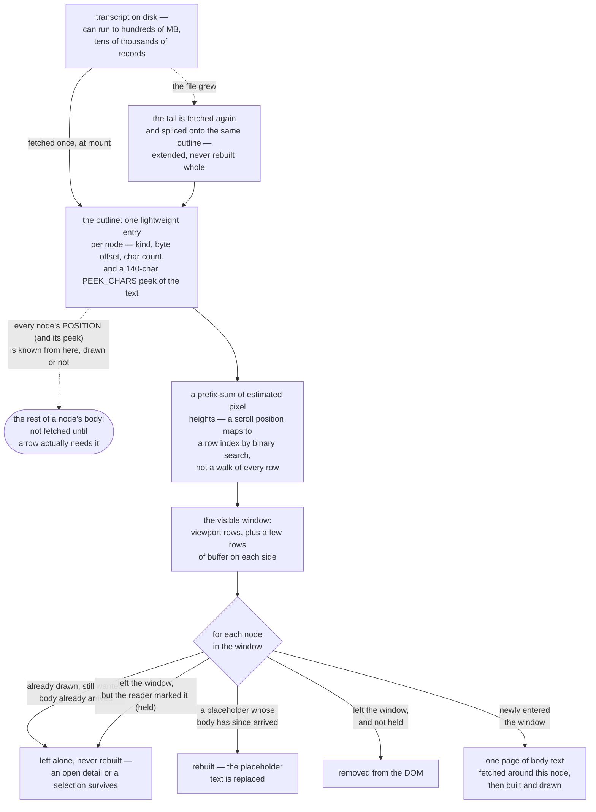

# 15. The document and lane viewer

`docs/capabilities/00-index.md` · previous: [`14-search-over-the-archive.md`](./14-search-over-the-archive.md) · next: [`08-web-ui.md`](./08-web-ui.md)

**This chapter did not exist before 2026-09-16, and everything in it is that day's work.** The
Conversations screen's document view (`/doc.html`, `doc.js`) and lane view (`/lane.html`, `lane.js`)
render one open transcript for reading — folding, hit highlighting, a find bar, and now a floating
find panel with regex/whole-word/case options, plus the marks-in-the-margin controls chapter 5
describes. None of it was documented anywhere before this pass; the source is three same-day
reports (`reports/2026-09-16-folding-and-highlight.md`, `-the-find-panel.md`, and
`-two-marks-one-turn.md`, which chapter 5 already covers) read directly against the shipped code.

**The one fact to hold onto across this whole chapter**: everything here reads **one already-open
transcript**, directly, in JavaScript on the server side and the browser side of the same file —
never the FTS5 archive index chapter 14 describes. It answers a different question ("where in
*this* document") and pays a different, much smaller, cost to answer it (one transcript's prose
spans, not the whole archive).

## 15.0 What stays out of memory — the outline, the window, and the scroll

Every mechanism in the rest of this chapter runs against a transcript that can be very large — a
live session on this machine has run to hundreds of megabytes across tens of thousands of records,
and a live figure quoted anywhere in this chapter is a reading from one such session, not a
constant. No chapter's prose describes how the viewer stays scrollable against a document that
size — chapter 4's own "What's NOT built" section names the file it lives in
(`src/ui/public/screens/conversations.js`) and says plainly that neither it nor chapter 8 describes
it. The mechanism itself spans that file and `src/ui/public/lib/transcript-scroll.js`; this section
is read directly from both, since no chapter's prose already covers it.



Four things worth stating precisely, because each is easy to get wrong from the shape alone — and
three of them corrected a first draft of this section, 2026-09-17:

- **The outline carries a peek of the text, not none.** Every node ships a `p` field — the first
  `PEEK_CHARS = 140` characters of what was said, or of what a tool call asked
  (`read-model-conversation-document.ts:185`, `:1797`, `:1820`) — and it is load-bearing, not
  incidental: the find bar searches exactly that field, which is what lets it match *the whole
  session* without a body having ever been drawn.
- **The outline is fetched once at mount, and *extended*, not rebuilt, when the file grows.** A live
  document's follow poll re-fetches only the tail and splices it onto the same array
  (`conversations.js`'s `refill`). It is never re-fetched whole and never rebuilt from scratch — the
  distinction that matters is "whole" versus "tail," not "once" versus "never again."
- **A node's position (and its peek) and a node's full body are different facts with different
  lifetimes.** Every node's position and 140-character peek are known from the outline the moment
  the document opens, whether or not it has ever been drawn. The rest of its text is fetched only
  once a row for it is actually built, one page at a time, around the node being scrolled to.
- **"Recycling" here does not mean a fixed pool of DOM rows stamped with new content, and it is not
  an absolute "never rebuilt" either.** A row already drawn, still wanted, and holding real text is
  left untouched. A row the reader has explicitly marked (`held`) survives leaving the window
  instead of being removed. But a **placeholder** — a row still reading "Reading…" — *is* torn down
  and rebuilt the moment its body arrives, held or not: there is no text worth keeping a selection
  in yet, and leaving it would pin the placeholder forever. The reason ordinary rows are left alone
  is stated directly in the source: a `<details>` element a reader opened, or a text selection, must
  survive a scroll of two pixels, and rebuilding the row would close or clear it.

## 15.1 The find bar — always present, folding-aware, and server-counted

Every open document carries a find box in its `.tvbar` strip. Typing into it does two things at
once, computed the same way in two different runtimes from one shared module,
`src/ui/public/lib/fold.js`:

- **paints** every match in the currently-drawn rows, via the CSS Custom Highlight API;
- **counts** every match across the *whole* transcript, via a server-side scan.

### Folding: NFKD-normalised, case-insensitive, byte-accurate

Typing three literal dots (`...`) finds the single ellipsis character `…` — the UI's own string
tables (`strings/en.js` + `strings/he.js`) write it **80** times, re-counted 2026-09-16 directly
against the tree (`grep -o "…"` on each file: 43 and 37) — because the matcher normalises with
Unicode NFKD before comparing. **A different figure, 3,062, appears in
`reports/2026-09-16-search-adopt-or-build.md`, but it counts U+2026 across the *conversation
archive's prose spans*, not this product's own strings** — an earlier version of this sentence
took that number from the report and attached it to the wrong noun. The **80** figure is the one
this argument rests on and is stable (the string tables change rarely); the two "for scale" figures
below are not, and are given only as an order of magnitude, dated 2026-09-16: `src/` (code, not the
archive) held roughly 750 ellipses, and every tracked file in the whole repository held roughly
3,500 — both counts move with every commit that touches prose, so re-run `grep -rco "…" src/ | …`
rather than trusting either number specifically. `fold.js` itself was **102 lines when the matcher's own header first estimated its size**;
the file is a browser-loaded, actively-developed module and has grown substantially since (**1,339
lines** measured 2026-09-16) as later lanes extended it — the 102-line figure describes the size of
the *idea* at the moment it shipped, not this file's current size, and this chapter should not have
repeated it as a current fact without that qualifier. `fold.js` was validated by
**execution, not by reading**: the real
`@codemirror/search` `SearchCursor` (the reference implementation this project chose not to adopt
as a dependency — `CONST-zero-runtime-dependencies`) was extracted from its published tarball and
run beside this project's own matcher over **11,364 real archive prose spans × 20 queries**,
including pathological ones (a bare `o` alone: 671,841 hits over 11,167 spans). Result: **0
differences, 0 byte mismatches**, across 1,775,487 hits compared.

**What this project's version does that upstream's does not**: answers in UTF-8 **byte** offsets,
accumulated on the same single walk as the match itself (never a second pass that could disagree
with the first) — because every anchor, every seek, every stored position in this product is bytes,
never characters (chapter 4), and this archive is half Hebrew, where a naive normalise-then-`indexOf`
approach is wrong for every offset after the first folded character, silently.

**What was measured, not assumed, before it shipped**: a two-character query (`..`) is a silent
zero on the FTS5 trigram index (chapter 14's floor) but the find bar has **no such floor**, because
no index is involved — `..` folds and finds `…` here just as `...` does. Re-measured on the live
archive (11,364 prose spans, the day this shipped): plain `indexOf` on `...` finds 463 spans, FTS5
finds the same 463, and the folded matcher finds **1,024 — 2.21x** — the extra 561 are recall the
FTS5-then-cursor two-stage design this project considered and rejected would have silently dropped
(`INV-nothing-is-dropped-silently`).

### The count is turns, not occurrences, and it says so

The count line drawn under the box is a real, deliberate sentence, not a number, and each part of
it exists for a forced reason:

> *"450 turn(s) of words hold what you typed, 1403 time(s) — searched in the 4495 turns of words
> this transcript has, out of 53561 records. Tool output and machinery are not indexed and can only
> be found here by the tools they ran."*

- **Turns, not drawn rows.** The count comes from a server-side scan of every prose span
  (`findInDocument`), never from walking the DOM — the document is virtualised (a fraction of a
  large transcript's rows are ever on screen at once), so a DOM-based count would answer "in the
  rows I have" and say nothing about it. A fixture asserts the count can exceed the drawn rows.
- **Turns, not occurrences, and that is not timidity.** The server matches the record's raw text;
  the browser paints the *rendered* text; they are genuinely different strings (Markdown syntax is
  in one and not the other). A headline count of occurrences would be a promise about painted
  ranges the renderer is free to break; a count of turns is true on both sides. The per-turn
  occurrence figure ("1403 time(s)") is shown beside it as what it is — the record's own text — and
  never conflated with a count of paintable highlights.
- **The scope is on the line.** "Tool output and machinery are not indexed" names the gap chapter
  4 and 14 both measure: on this workspace roughly 47,910 of 52,292 records in one session are
  machinery, findable on this surface only by the tools they ran (i.e. by widening the archive
  search in chapter 14 to `--sources ran`, a completely different mechanism from this one).
- **A capped scan discloses its cap.** `FIND_SCAN_CAP` (40,000 prose spans, roughly 3.5x the
  largest transcript on this workspace) sets a `capped` flag that draws its own sentence rather than
  silently under-counting; `FIND_HITS_PER_TURN` (500) bounds the per-turn occurrence figure; a
  separate `FIND_PAINT_PER_ROW` (300) bounds only the *drawing*, deliberately without a disclosure,
  because the count beside the box is never sourced from it.

### The highlight survives virtualisation, and this was verified rather than assumed

The document view recycles DOM rows as the reader scrolls (virtualisation). A `Range` registered
against a row's text can be thrown out from under a highlight when that row is evicted — and it was
verified directly, in a real browser, that a DOM `Range` into a removed node does **not** go inert;
it silently collapses to its former parent while `CSS.highlights.has(...)` continues to answer
`true`. That is exactly the shape of silent failure this project refuses. The fix: `paintFinds`
rebuilds the *entire* highlight registry from the currently-live rows on every single paint, rather
than keeping one across paints — costing one walk of about twenty rows, and a removal-proof test
(mutation E3 in the source report) exists specifically to catch a future "optimisation" that caches
the registry instead.

## 15.2 The floating find panel — four read modes, plus case and whole word

**How you read the query is now one choice among four, not a set of independent checkboxes.**
`MODES = ['normal', 'wildcard', 'logical', 'regex']` (`src/ui/public/lib/fold.js`) are **exclusive**
— a radio group, not tick-boxes — with `caseSensitive` and `wholeWord` as two independent booleans
beside them (`FindOptions`, shared by `fold.js` and `conversation-search.ts`). The source comment
states the reasoning as a direct correction of an earlier design: Notepad++, the reference the
owner named, does not offer its reading modes as checkboxes either — it offers *Normal / Extended /
Regular expression* as one radio group with *Match case* and *Whole word* as independent boxes
beside it, "because 'how do I read this string' has exactly one answer at a time and 'is case
significant' is a different question." `regex: true` with no `mode` given still means `'regex'`, so
every caller written against the panel's first shipped shape keeps working unchanged.

| mode | what it means | never becomes |
|---|---|---|
| `normal` | the folded literal match §15.1 already describes | — |
| `wildcard` | `*` matches any run of characters including none, `?` matches exactly one; `\*` escapes a literal star; the pieces between wildcards fold exactly like `normal` does, so `b*t...` still reaches `byte…` | a regular expression — matched by stitching literal pieces together, never compiled as one |
| `logical` | `AND`, `OR`, `NOT`, `NEAR` in capitals are operators (lower-case `and` is a word); two words side by side mean `AND`; quotes make a phrase; parentheses group; a bare `NEAR` defaults to `NEAR_CHARS = 30` characters (a constant declared independently in `fold.js`, happening to match chapter 14's archive-side `near` tier at the same value); `NEAR/120` spells a custom distance, capped at `NEAR_MAX = 4,000` | a regular expression either — each operand is matched with the same folded matcher as `normal`, memoised per prose span so `a AND (a OR b)` reads the span for `a` once |
| `regex` | `RegExp` over the text exactly as written | — the one mode with an engine to report a real syntax error from |

Every mode answers one of four shapes, not just hit-or-miss — `{ ok: true, find }`,
`{ ok: false, error }` (the regex engine's own message), `{ ok: false, slow: true }` (a legal
pattern `nestedQuantifier` refuses before it is ever run — §15.2.3 below), or
`{ ok: false, why }` (a mode-specific code — `like`, `quote`, `paren`, `operand`, `empty`,
`nearRange` — for a query the mode cannot read, e.g. unbalanced parentheses in `logical`) — a fourth
distinct answer for "this pattern is syntactically fine but this mode cannot execute it," on the
same `nothing-to-do-and-could-not-look-are-different-answers` principle chapter 10's newest rule
entry states generally.

Right-click a turn → *"Search in this conversation /"* opens a floating **Search** panel: the same
find box, plus the mode radio group and the case/whole-word boxes, plus a match stepper and count
line, all *moved into* the panel (not duplicated — see §15.3) while it is open.

| | |
|---|---|
| element | `<dialog class="mcpanel">`, opened with **`show()`**, never `showModal()` |
| closed by | its own `×`, or **Escape** (which `show()` alone does not give a dialog) |
| dragged by | its header, in **logical** pixels, reflected once at the RTL boundary |
| remembered | `localStorage`, per panel, every read/write guarded against a private window throwing |
| several panels | can be open and dragged independently; nothing in the frame closes a sibling |

This was **the first dialog element this product ever used** — verified before it was written that
no `showModal`, no `<dialog>` and no dialog styling existed anywhere under `src/ui/public/`, so the
frame that landed, `src/ui/public/lib/panel.js` (measured at **429 lines** on 2026-09-16, up from
the 320 the source report estimated when it shipped, for the same reason `fold.js` grew — later
work extended a shared module), is now the house pattern for the two
more panels planned beside it (navigation, copy).

### Case and whole word, and the measurement behind each

*"Every option must be implemented IN THAT SCAN"* was the governing constraint — an option
implemented only in the page would silently apply to the handful of rendered rows, the exact
virtualised-DOM defect this project exists to refuse. Every mode and both booleans live in
`fold.js`, called identically by the server's count and the browser's paint, so a checkbox can
never draw highlights that disagree with the number above them (proved directly, on the panel's
first shipped shape: with **Match case** ticked, the count was 8 while fewer than 8 rows were
drawn — the page cannot see what it is counting, only the server can).

**Match case.** `Byte` (unfolded) matches 378 turns; with case sensitivity on, 28 — and the panel
draws a sentence, not just a smaller number.

**Whole word.** `offset` matches 77 turns; whole-word, 53. **In Hebrew this also drops the glued
front particle** — `שורה` (10 turns) stops matching `השורה` when whole-word is ticked (5 turns) —
and the panel says so explicitly the moment the query contains a Hebrew letter, rather than
silently halving the answer: *"IN HEBREW THIS ALSO DROPS THE GLUED FRONT PARTICLE."*

**Regular expression, and it is faster than the literal find here — the opposite of what was
predicted.** On this repository's own live 139 MB session (54,524 records, 4,582 prose spans):
`byte offset` as a literal (`normal` mode) costs **48 ms**; the identical words as a `regex` mode
pattern cost **3 ms** — **16x faster** — because V8's regex engine prefilters literals natively
while the hand-written folded matcher walks every code point in JavaScript, carrying two offsets at
once. So `regex` is not a "power user" mode to be steered around; for a plain phrase it is
measurably the cheaper path. **This measurement predates the four-mode radio group** (it was taken
when regex was a single checkbox); `wildcard` and `logical` were not separately measured for speed
in this pass, and both route through the same folded matcher `normal` does, so neither should be
assumed to share `regex`'s native-engine speed advantage without measuring it.

### What was refused, each with the measurement that decided it

The standard applied, stated by the item that shipped this: *"if a specific option genuinely cannot
work here, say so with the reason and the number — that is a different act from declining it on
taste."*

| refused | why, measured |
|---|---|
| Extended escapes (`\n`, `\t`, …) | `regex` mode already buys this, in a real spec, at no extra control |
| Backward direction | Notepad++'s own manual refuses it too ("surprising results"); Previous match already walks the same 33 hits the other way |
| Wrap around | the stepper already names the end (*"Nothing after this point... this is the last match"*), which is the honest version of a caret that must keep moving |
| Search in selection | **the strongest refusal**: only 7 of 4,582 turns are ever in the DOM at once on a virtualised document, so "in selection" would silently scope to whatever happens to be drawn — the exact defect this whole feature exists to refuse |
| Mark All / Find All in All Opened Documents | the count line already reports every hit over the whole transcript and every visible one is already painted — a second, smaller answer to a question already answered whole |
| `.` matches newline | the scan's unit is one turn (a prose span); a pattern can never cross a turn regardless of flags, and the two-character `[\s\S]` spelling is available without a checkbox |
| Transparency as a slider | the transparency itself shipped as a fixed value (`color-mix`, 94% opaque background only, never the text) — a slider is a control spent on a preference nobody asked a number for |
| 2-button mode | an artefact of a *modal* dialog blocking the editor; this panel never blocks anything |
| Prefix `*` (a Notepad++ option, over its own FTS5-backed search) | a trigram index already matches substrings — `"byte"*` and `"byte"` return identical rows, so the control would teach a false model of the index. **Not the same thing as the `wildcard` mode above** — that mode reads a `*` typed into *this* find panel, which has no index to match substrings against in the first place; the two features share a character and nothing else. |
| Replace | the archive is read-only; these are Claude Code's own transcript files |

### The one defect that cannot be budgeted away, and what was done instead

`^(\w+\s?)+$` typed into the panel against the live session: **108,785 ms** — not "slow," the
owner's server not answering. A time budget between spans (`FIND_REGEX_BUDGET_MS = 5,000 ms`)
cannot catch this, because the freeze happens **inside one span**, inside V8's own regex engine,
which has no backtrack limit and cannot be interrupted from JavaScript. A runtime canary (time a
short probe string first) was tried and does not work either: `(\w+\s?)+` over 8 words already
takes 3,848 ms and over 12 does not return at all — a canary long enough to tell a bad pattern from
a good one is long enough to hang on the bad one itself.

**So the check is static.** `nestedQuantifier(source)` refuses a group that is itself repeated and
whose body contains an unbounded quantifier — `(X+)+`, the textbook catastrophic-backtracking
shape — *before* the pattern is ever run, and says so on the wire as its own answer
(`refused`, distinct from `error` and from an empty result — three states rather than one, per
`nothing-to-do-and-could-not-look-are-different-answers`, chapter 10's own newest entry).
**What it deliberately does not catch**: ambiguous alternation inside a repeat (`(a|a)+`) is
exponential with no *inner quantifier* to detect syntactically — deciding whether two branches can
overlap is not something a scanner can do — and this residue is recorded as open, with the two real
fixes (a killable child process, or a linear-time engine like RE2) both named as the owner's to
choose, since the second is a dependency and `CONST-zero-runtime-dependencies` is his to relax.

### The strip, measured before and after

The item's own acceptance test: report the find strip's height before and after, or the change has
not landed. Measured by hand on the live 139 MB session, 1280×1000, English:

```
                     idle      query, panel closed      query, panel open
  .tvbar             62.58 px          62.58 px                 26.39 px
  .tvnav             60.78 px         162.75 px                128.36 px
  chrome above well       —           372.69 px                230.53 px
```

**142 px came back — 38% less chrome between the reader and the document.** The residue (128.36 px
rather than the 60.78 px idle height) is not mostly the find controls: it is that a narrowing query
makes the mark-count and you-count clauses each grow a line, and those two belong to the
*navigation* panel — the second of three panels planned, not yet built — so the strip is expected
to shrink further once that one lands.

### The reusable frame

`panel.js` owns: `show()`/Escape/focus hand-back, drag with pointer capture and one write per
gesture, logical-property placement with a single RTL reflection, on-screen clamping, bring-to-front
ordering, and the close button's accessible name. A caller supplies only a name, title, and what to
do on close. The Search panel's own contribution beyond the frame is *borrowing*: `openFindPanel`
moves the existing find box and count line into the panel body (recorded as `(parent, nextSibling)`
so both bars can gain and lose children) rather than duplicating them — a second query field would
be two inputs, two listeners, and two states for one query, with no way to say which was
authoritative the day they disagreed. The frame deliberately has no modal mode, no resize handle, no
minimise, and does not remember being open — a panel that mounted open would draw itself over a
document the reader has not asked it about.

## 15.3 Marks in the margin

The document and lane viewer is also where every anchor capability chapter 5 describes is actually
drawn and operated: the `⚑ Marked` flag, the kind badge and hue, Rename, Take it back, the stepper
that never lands on the same turn twice, and — since 2026-09-16 — a turn wearing two marks at once.
See [chapter 5, §5.6a](./05-anchors.md#56a-a-turn-can-wear-two-marks--one-turn-two-rows-one-stop)
for the mechanism; it is not repeated here.

**No sixth hue was minted for any of this** (`DEC-the-meaning-hue-budget-is-five`, five fixed
meaning-colours: `--gold`, `--ok`, `--carry`, `--crit`, `--warn`). The current-match highlight is
drawn as the page's own colours inverted (`--ink` on `--paper`) plus an underline — spending no
colour budget — per the 2026-08-27 amendment: *"a hue may narrow a group, never name one."* A hue
says posture; the glyph and the word say which kind of thing this is.

## 15.4 What's NOT built / built but off

- **Two of the three panels the owner asked for (navigation, copy) are not built.** `panel.js` is
  written specifically so the next two are cheap; §15.2 names exactly what each will supply versus
  reuse.
- **`(a|a)+`-shaped catastrophic regex is not refused.** §15.2. A residue, recorded, and the two
  real fixes both cost something the owner has not yet ruled on.
- **This whole surface has no CLI or MCP equivalent.** The four-mode radio group
  (normal/wildcard/logical/regex) plus case/whole-word over one open transcript exists only inside
  a browser tab with that document already open. Chapter 14
  is the archive-wide alternative and it is a different question ("which turns in the whole
  archive," not "where in this one").
- **`wildcard` and `logical` were not separately speed-measured for this chapter** — only `normal`
  vs `regex` was (§15.2). Both new modes route through the same folded matcher `normal` uses, which
  is evidence they are unlikely to share `regex`'s native-engine advantage, not a measurement of it.
- **`searchArchive`/`searchArchiveTiered` (chapter 14) and this chapter's scan are two genuinely
  separate mechanisms that happen to share a search box's general shape.** A reader should not
  assume an option available in one exists in the other; chapter 14 §14.7 states the asymmetry from
  its own side.
- **The strip's residual height with a query typed (128 px) will shrink once the navigation panel
  ships** — see §15.2's own measurement; not fixed here because the mechanism it depends on does
  not exist yet.
- Every timing and pixel measurement in this chapter is against one specific session
  (139,272,173 bytes, 54,524 records, 4,582 prose spans) at one specific window width (1280 px) on
  one specific build of V8. A different session, a different width, or a different engine changes
  the numbers; the *mechanisms* they demonstrate do not.

## See also

- [00 — Index](./00-index.md)
- [04 — The conversation archive](./04-conversation-archive.md) — what a "prose span" and a "byte
  offset" are, which this chapter's matcher and count both depend on directly
- [05 — Anchors](./05-anchors.md) — the marks this viewer draws and operates, including a turn
  wearing two at once
- [14 — Search over the archive](./14-search-over-the-archive.md) — the FTS5-backed, whole-archive
  alternative this chapter's find bar and find panel are deliberately not built on
- [08 — The web UI](./08-web-ui.md) — the Conversations screen this viewer is reached from, and the
  no-writes guarantee's exceptions for the anchor controls drawn here
