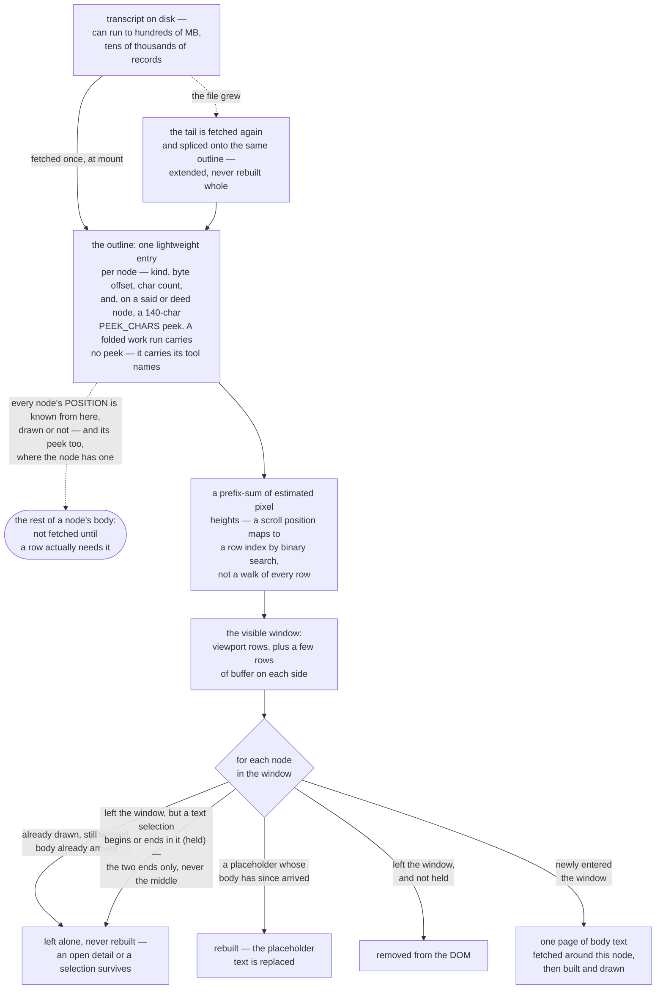
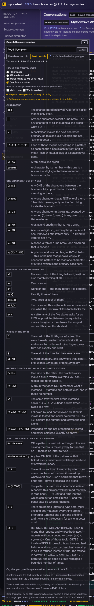
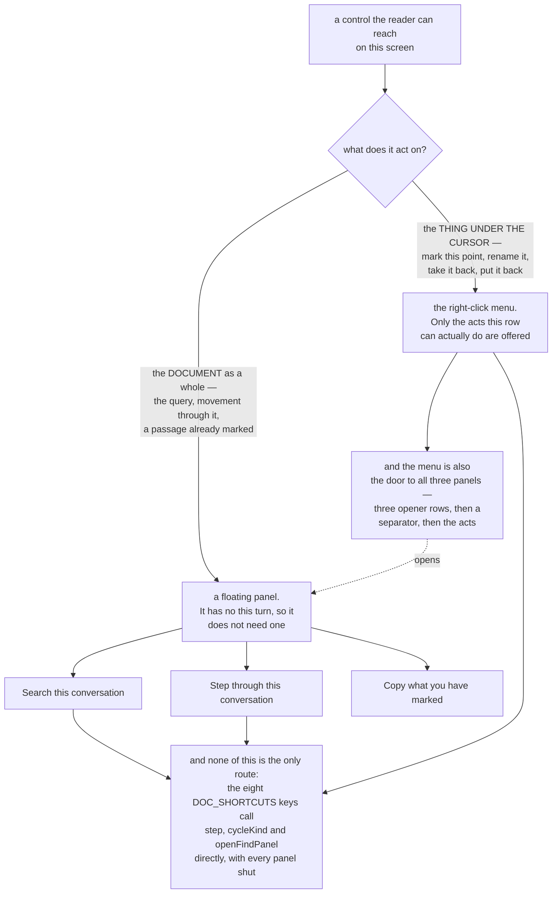
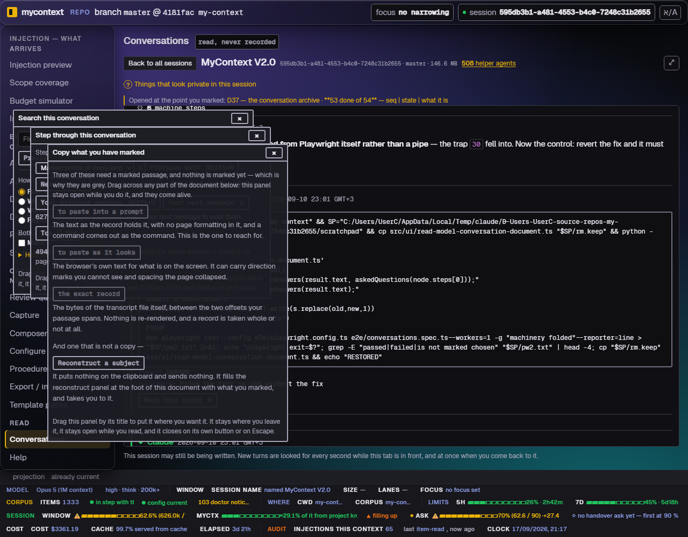
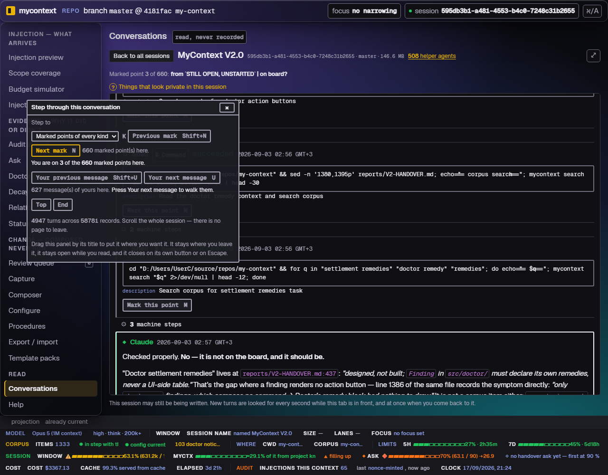
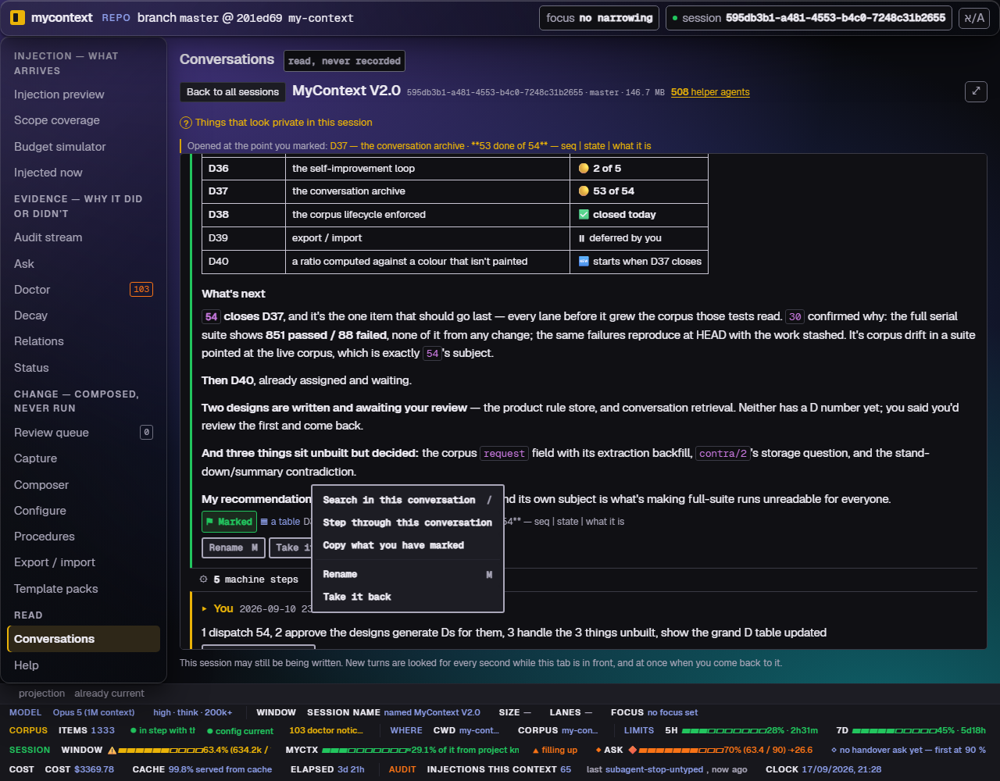
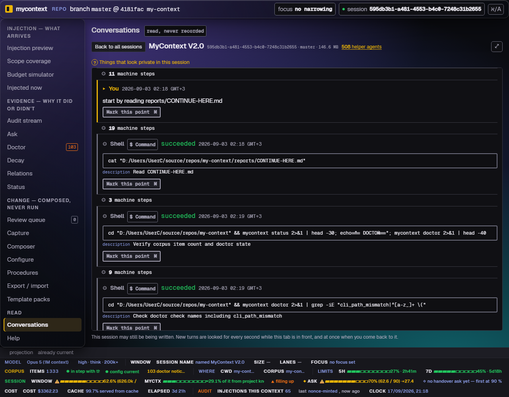
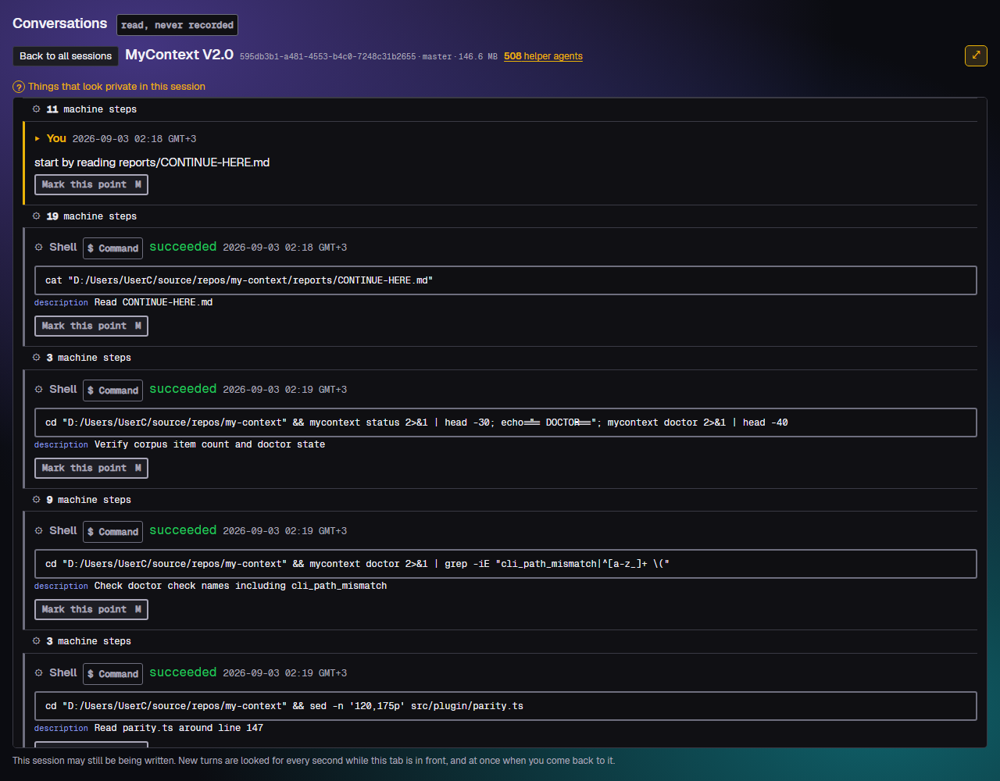

# 15. The document and lane viewer

`docs/capabilities/00-index.md` · previous: [`14-search-over-the-archive.md`](./14-search-over-the-archive.md) · next: [`08-web-ui.md`](./08-web-ui.md)

**This chapter was written on 2026-09-16 and half of it was superseded the next day.** The
Conversations screen's document view (`/doc.html`, `doc.js`) and lane view (`/lane.html`, `lane.js`)
render one open transcript for reading — folding, hit highlighting, a find surface, the
marks-in-the-margin controls chapter 5 describes, and, since 2026-09-17, **three floating panels
that between them now hold every control this screen used to keep in a strip above the document**.

**What changed on 2026-09-17, and it is why §15.2 onward reads differently from §15.0 and §15.1.**
The 2026-09-16 text described one panel (Search) that *borrowed* controls out of two strips,
`.tvbar` and `.tvnav`, and put them back when it closed. **Neither strip exists any more.** The
other two panels the owner asked for were built, the controls moved into them permanently, the
right-click menu was cut down to what acts on the turn under the cursor, and the viewer gained a
whole-screen toggle. Every sentence in §15.2–§15.6 below was read off the shipped code on
2026-09-17; where a figure is carried from a lane's own measurement rather than re-derived here,
it says so on the line.

**The one fact to hold onto across this whole chapter**: everything here reads **one already-open
transcript**, directly, in JavaScript on the server side and the browser side of the same file —
never the FTS5 archive index chapter 14 describes. It answers a different question ("where in
*this* document") and pays a different, much smaller, cost to answer it (one transcript's prose
spans, not the whole archive).

## 15.0 What stays out of memory — the outline, the window, and the scroll

Every mechanism in the rest of this chapter runs against a transcript that can be very large — a
live session on this machine has run to hundreds of megabytes across tens of thousands of records,
and a live figure quoted anywhere in this chapter is a reading from one such session, not a
constant. No chapter's prose describes how the viewer stays scrollable against a document that
size — chapter 4's own "What's NOT built" section names the file it lives in
(`src/ui/public/screens/conversations.js`) and says plainly that neither it nor chapter 8 describes
it. The mechanism itself spans that file and `src/ui/public/lib/transcript-scroll.js`; this section
is read directly from both, since no chapter's prose already covers it.



Four things worth stating precisely, because each is easy to get wrong from the shape alone — and
three of them corrected a first draft of this section, 2026-09-17:

- **The outline carries a peek of the text on most nodes, and on one kind it carries none.** `p` is
  optional — `p?: string` (`read-model-conversation-document.ts:421`) — and it is set in exactly two
  places: on a `said` node, and only when the peek is non-empty (`:1797-1798`), and on a `deed` node,
  likewise (`:1820`). A folded `work` run is built without it (`:1830-1837`) and carries `x`, its
  tool names, instead — and on a long transcript those runs are the bulk of the node count. The
  peek itself is `PEEK_CHARS = 140` characters (`:185`). **An earlier revision of this bullet said
  "every node ships a `p` field", which is untrue of a whole node kind.**
- **What the find box searches is four fields, and the peek is one of them.** The outline predicate
  is `matchesNode` (`src/ui/public/lib/transcript-scroll.js:75-77`), and its haystack is:

  ```js
  const hay = `${node.p ?? ''} ${(node.x ?? []).join(' ')} ${node.y ?? ''} ${node.w ?? ''}`;
  ```

  the peek, the tool names, the synthetic label and the "who" column. And whole-session reach is
  **not** what the peek buys on its own: `reView` ORs the local predicate with the server's
  full-text answer — `matchesNode(nodes[i], needle, holds) || foundAt.has(i)`
  (`src/ui/public/screens/conversations.js:7874`), over a source comment saying `foundAt` *"is an OR
  and never a replacement … each finds rows the other cannot"*. The field's own doc comment calls it
  *"the reader's filter"* (`read-model-conversation-document.ts:413-415`), which is the narrower and
  accurate word.
- **The outline is fetched once at mount, and *extended*, not rebuilt, when the file grows.** A live
  document's follow poll re-fetches only the tail and splices it onto the same array
  (`conversations.js`'s `refill`). It is never re-fetched whole and never rebuilt from scratch — the
  distinction that matters is "whole" versus "tail," not "once" versus "never again."
- **A node's position and a node's full body are different facts with different
  lifetimes.** Every node's position is known from the outline the moment the document opens,
  whether or not it has ever been drawn, and so is its 140-character peek where it has one — see the
  first bullet for the node kind that does not. The rest of its text is fetched only
  once a row for it is actually built, one page at a time, around the node being scrolled to.
- **"Recycling" here does not mean a fixed pool of DOM rows stamped with new content, and it is not
  an absolute "never rebuilt" either.** A row already drawn, still wanted, and holding real text is
  left untouched. A row a text SELECTION begins or ends in (`held`) survives leaving the window
  instead of being removed — and only those two rows: `held` is cleared and refilled from
  `boundaryRows()` inside the `selectionchange` handler (`screens/conversations.js:9551-9552`), under
  a declaration that explicitly refuses to pin every marked row because `measure` would then force a
  layout per pinned row (`:6979-6987`). An **anchor** mark — §15.7's sense of "marked" — holds no row
  at all. But a **placeholder** — a row still reading "Reading…" — *is* torn down
  and rebuilt the moment its body arrives, held or not: there is no text worth keeping a selection
  in yet, and leaving it would pin the placeholder forever. The reason ordinary rows are left alone
  is stated directly in the source: a `<details>` element a reader opened, or a text selection, must
  survive a scroll of two pixels, and rebuilding the row would close or clear it.

## 15.1 The find surface — folding-aware, server-counted, and no longer in a strip

**Where the find box is, as of 2026-09-17: inside the Search panel, and nowhere else.** This
section was written when it stood in a `.tvbar` strip above the document; that strip is gone
(§15.5), the box is built once at mount into the Search panel's body, and the only route to it is
to open that panel — from the right-click menu, or with `/`. Everything below about *what typing
into it does* is unchanged by the move, because the matcher and the scan never knew where the box
was drawn.

Typing into it does two things at once, computed the same way in two different runtimes from one
shared module, `src/ui/public/lib/fold.js`:

- **paints** every match in the currently-drawn rows, via the CSS Custom Highlight API;
- **counts** every match across the *whole* transcript, via a server-side scan.

### Folding: NFKD-normalised, case-insensitive, byte-accurate

Typing three literal dots (`...`) finds the single ellipsis character `…` — the UI's own string
tables (`strings/en.js` + `strings/he.js`) write it **80** times, re-counted 2026-09-16 directly
against the tree (`grep -o "…"` on each file: 43 and 37) — because the matcher normalises with
Unicode NFKD before comparing. **A different figure, 3,062, appears in
`reports/2026-09-16-search-adopt-or-build.md`, but it counts U+2026 across the *conversation
archive's prose spans*, not this product's own strings** — an earlier version of this sentence
took that number from the report and attached it to the wrong noun. The **80** figure is the one
this argument rests on and is stable (the string tables change rarely); the two "for scale" figures
below are not, and are given only as an order of magnitude, dated 2026-09-16: `src/` (code, not the
archive) held roughly 750 ellipses, and every tracked file in the whole repository held roughly
3,500 — both counts move with every commit that touches prose, so re-run `grep -rco "…" src/ | …`
rather than trusting either number specifically. `fold.js` itself was **102 lines when the matcher's own header first estimated its size**;
the file is a browser-loaded, actively-developed module and has grown substantially since (**1,339
lines** measured 2026-09-16) as later lanes extended it — the 102-line figure describes the size of
the *idea* at the moment it shipped, not this file's current size, and this chapter should not have
repeated it as a current fact without that qualifier. `fold.js` was validated by
**execution, not by reading**: the real
`@codemirror/search` `SearchCursor` (the reference implementation this project chose not to adopt
as a dependency — `CONST-zero-runtime-dependencies`) was extracted from its published tarball and
run beside this project's own matcher over **11,364 real archive prose spans × 20 queries**,
including pathological ones (a bare `o` alone: 671,841 hits over 11,167 spans). Result: **0
differences, 0 byte mismatches**, across 1,775,487 hits compared.

**What this project's version does that upstream's does not**: answers in UTF-8 **byte** offsets,
accumulated on the same single walk as the match itself (never a second pass that could disagree
with the first) — because every anchor, every seek, every stored position in this product is bytes,
never characters (chapter 4), and this archive is half Hebrew, where a naive normalise-then-`indexOf`
approach is wrong for every offset after the first folded character, silently.

**What was measured, not assumed, before it shipped**: a two-character query (`..`) is a silent
zero on the FTS5 trigram index (chapter 14's floor) but the find box has **no such floor**, because
no index is involved — `..` folds and finds `…` here just as `...` does. Re-measured on the live
archive (11,364 prose spans, the day this shipped): plain `indexOf` on `...` finds 463 spans, FTS5
finds the same 463, and the folded matcher finds **1,024 — 2.21x** — the extra 561 are recall the
FTS5-then-cursor two-stage design this project considered and rejected would have silently dropped
(`INV-nothing-is-dropped-silently`).

### The count is turns, not occurrences, and it says so

The count line drawn under the box is a real, deliberate sentence, not a number, and each part of
it exists for a forced reason:

> *"450 turn(s) of words hold what you typed, 1403 time(s) — searched in the 4495 turns of words
> this transcript has, out of 53561 records. Tool output and machinery are not indexed and can only
> be found here by the tools they ran."*

- **Turns, not drawn rows.** The count comes from a server-side scan of every prose span
  (`findInDocument`), never from walking the DOM — the document is virtualised (a fraction of a
  large transcript's rows are ever on screen at once), so a DOM-based count would answer "in the
  rows I have" and say nothing about it. A fixture asserts the count can exceed the drawn rows.
- **Turns, not occurrences, and that is not timidity.** The server matches the record's raw text;
  the browser paints the *rendered* text; they are genuinely different strings (Markdown syntax is
  in one and not the other). A headline count of occurrences would be a promise about painted
  ranges the renderer is free to break; a count of turns is true on both sides. The per-turn
  occurrence figure ("1403 time(s)") is shown beside it as what it is — the record's own text — and
  never conflated with a count of paintable highlights.
- **The scope is on the line.** "Tool output and machinery are not indexed" names the gap chapter
  4 and 14 both measure: on this workspace roughly 47,910 of 52,292 records in one session are
  machinery, findable on this surface only by the tools they ran (i.e. by widening the archive
  search in chapter 14 to `--sources ran`, a completely different mechanism from this one).
- **A capped scan discloses its cap.** `FIND_SCAN_CAP` (40,000 prose spans, roughly 3.5x the
  largest transcript on this workspace) sets a `capped` flag that draws its own sentence rather than
  silently under-counting; `FIND_HITS_PER_TURN` (500) bounds the per-turn occurrence figure; a
  separate `FIND_PAINT_PER_ROW` (300) bounds only the *drawing*, deliberately without a disclosure,
  because the count beside the box is never sourced from it.

### The highlight survives virtualisation, and this was verified rather than assumed

The document view recycles DOM rows as the reader scrolls (virtualisation). A `Range` registered
against a row's text can be thrown out from under a highlight when that row is evicted — and it was
verified directly, in a real browser, that a DOM `Range` into a removed node does **not** go inert;
it silently collapses to its former parent while `CSS.highlights.has(...)` continues to answer
`true`. That is exactly the shape of silent failure this project refuses. The fix: `paintFinds`
rebuilds the *entire* highlight registry from the currently-live rows on every single paint, rather
than keeping one across paints — costing one walk of about twenty rows, and a removal-proof test
(mutation E3 in the source report) exists specifically to catch a future "optimisation" that caches
the registry instead.

## 15.2 Four ways to type a query, and two boxes that apply to all four

**How you read the query is one choice among four, not a set of independent checkboxes.**
`MODES = ['normal', 'wildcard', 'logical', 'regex']` (`src/ui/public/lib/fold.js`) are **exclusive**
— a radio group, not tick-boxes — with `caseSensitive` and `wholeWord` as two independent booleans
beside them (`FindOptions`, shared by `fold.js` and `conversation-search.ts`). The source comment
states the reasoning as a direct correction of an earlier design: Notepad++, the reference the
owner named, does not offer its reading modes as checkboxes either — it offers *Normal / Extended /
Regular expression* as one radio group with *Match case* and *Whole word* as independent boxes
beside it, "because 'how do I read this string' has exactly one answer at a time and 'is case
significant' is a different question." `regex: true` with no `mode` given still means `'regex'`, so
every caller written against the panel's first shipped shape keeps working unchanged.

| mode | what it means | never becomes |
|---|---|---|
| `normal` | the folded literal match §15.1 already describes | — |
| `wildcard` | `*` matches any run of characters including none, `?` matches exactly one; `\*` escapes a literal star; the pieces between wildcards fold exactly like `normal` does, so `b*t...` still reaches `byte…` | a regular expression — matched by stitching literal pieces together, never compiled as one |
| `logical` | `AND`, `OR`, `NOT`, `NEAR` in capitals are operators (lower-case `and` is a word); two words side by side mean `AND`; quotes make a phrase; parentheses group; a bare `NEAR` defaults to `NEAR_CHARS = 30` characters (`src/ui/public/lib/fold.js:1041`, a constant declared independently of chapter 14's archive-side `NEAR_CHARS` (`src/core/conversation-search.ts:891`), which carries the same **value** and a different **behaviour**: `nearPairs` here walks a true 30-codepoint gap (`fold.js:1160-1171`), while FTS5's `NEAR(…, 30)` there admits 28, its source stating the law as `N-2`; so the two agree on the number and not on the answer); `NEAR/120` spells a custom distance, capped at `NEAR_MAX = 4,000` | a regular expression either — each operand is matched with the same folded matcher as `normal`, memoised per prose span so `a AND (a OR b)` reads the span for `a` once |
| `regex` | `RegExp` over the text exactly as written | — the one mode with an engine to report a real syntax error from |

Every mode answers one of four shapes, not just hit-or-miss — `{ ok: true, find }`,
`{ ok: false, error }` (the regex engine's own message), `{ ok: false, slow: true }` (a legal
pattern `nestedQuantifier` refuses before it is ever run — *"The one defect that cannot be budgeted
away"* below), or
`{ ok: false, why }` (a mode-specific code — `like`, `quote`, `paren`, `operand`, `empty`,
`nearRange` — for a query the mode cannot read, e.g. unbalanced parentheses in `logical`) — a fourth
distinct answer for "this pattern is syntactically fine but this mode cannot execute it," on the
same `nothing-to-do-and-could-not-look-are-different-answers` principle chapter 10's newest rule
entry states generally.

The four are drawn as a **radio group** (`role="radiogroup"`, legend *"How to read what you
typed"*), built from `MODES` itself — `modeRow.append(modesHead, ...MODES.map((m) =>
modeRadio(m).label))` — so a fifth mode would be a fifth radio with nothing to remember at the
screen. **Match case** and **Whole word only** sit below it under their own heading, whose English
text is the rule stated on the screen rather than in a manual: *"Both of these apply whichever of
the four you choose."* Changing any of the three re-asks the server and redraws the help and the
option notes from the mode now in force, rather than repainting — a mode that repainted without
re-asking would leave the count describing the old mode under highlights drawn under the new one.

**And this surface never touches SQLite, which is the one thing a reader is most likely to assume
wrong.** The owner's own request for the logical mode said *"especially if supportd by sqlite like
AND OR LIKE NEAR etc"*, and `fold.js`'s header answers it directly: `AND`, `OR`, `NOT` and `NEAR`
here are implemented **in the JavaScript scan**, because the FTS5 index is unfolded (it cannot see
that `...` matches `…` — 463 spans against 1,024, §15.1) and because **FTS5 cannot return
in-document offsets at all**: `offsets()` answers *"unable to use function offsets in the requested
context"*. That is not a downgrade and the help says why — an operator written here composes with
Match case and with NFKD folding, and an FTS5 operator would compose with neither. **The box that
does use FTS5 is the archive search on the conversations list** (chapter 14), which is a different
surface answering a different question; nothing is shared between them but the shape of a text
field.

### Case and whole word, and the measurement behind each

*"Every option must be implemented IN THAT SCAN"* was the governing constraint — an option
implemented only in the page would silently apply to the handful of rendered rows, the exact
virtualised-DOM defect this project exists to refuse. Every mode and both booleans live in
`fold.js`, called identically by the server's count and the browser's paint, so a checkbox can
never draw highlights that disagree with the number above them (proved directly, on the panel's
first shipped shape: with **Match case** ticked, the count was 8 while fewer than 8 rows were
drawn — the page cannot see what it is counting, only the server can).

**Match case.** `Byte` (unfolded) matches 378 turns; with case sensitivity on, 28 — and the panel
draws a sentence, not just a smaller number.

**Whole word.** `offset` matches 77 turns; whole-word, 53. **In Hebrew this also drops the glued
front particle** — `שורה` (10 turns) stops matching `השורה` when whole-word is ticked (5 turns) —
and the panel says so explicitly the moment the query contains a Hebrew letter, rather than
silently halving the answer: *"IN HEBREW THIS ALSO DROPS THE GLUED FRONT PARTICLE."*

**Regular expression, and it is faster than the literal find here — the opposite of what was
predicted.** On this repository's own live 139 MB session (54,524 records, 4,582 prose spans):
`byte offset` as a literal (`normal` mode) costs **48 ms**; the identical words as a `regex` mode
pattern cost **3 ms** — **16x faster** — because V8's regex engine prefilters literals natively
while the hand-written folded matcher walks every code point in JavaScript, carrying two offsets at
once. So `regex` is not a "power user" mode to be steered around; for a plain phrase it is
measurably the cheaper path. **This measurement predates the four-mode radio group** (it was taken
when regex was a single checkbox); `wildcard` and `logical` were not separately measured for speed
in this pass, and both route through the same folded matcher `normal` does, so neither should be
assumed to share `regex`'s native-engine speed advantage without measuring it.

### What was refused, each with the measurement that decided it

The standard applied, stated by the item that shipped this: *"if a specific option genuinely cannot
work here, say so with the reason and the number — that is a different act from declining it on
taste."*

| refused | why, measured |
|---|---|
| Extended escapes (`\n`, `\t`, …) | `regex` mode already buys this, in a real spec, at no extra control |
| Backward direction | Notepad++'s own manual refuses it too ("surprising results"); Previous match already walks the same 33 hits the other way |
| Wrap around | the stepper already names the end (*"Nothing after this point... this is the last match"*), which is the honest version of a caret that must keep moving |
| Search in selection | **the strongest refusal**: only 7 of 4,582 turns are ever in the DOM at once on a virtualised document, so "in selection" would silently scope to whatever happens to be drawn — the exact defect this whole feature exists to refuse |
| Mark All / Find All in All Opened Documents | the count line already reports every hit over the whole transcript and every visible one is already painted — a second, smaller answer to a question already answered whole |
| `.` matches newline | the scan's unit is one turn (a prose span); a pattern can never cross a turn regardless of flags, and the two-character `[\s\S]` spelling is available without a checkbox |
| Transparency as a slider | the transparency itself shipped as a fixed value (`color-mix`, 94% opaque background only, never the text) — a slider is a control spent on a preference nobody asked a number for |
| 2-button mode | an artefact of a *modal* dialog blocking the editor; this panel never blocks anything |
| Prefix `*` (a Notepad++ option, over its own FTS5-backed search) | a trigram index already matches substrings — `"byte"*` and `"byte"` return identical rows, so the control would teach a false model of the index. **Not the same thing as the `wildcard` mode above** — that mode reads a `*` typed into *this* find panel, which has no index to match substrings against in the first place; the two features share a character and nothing else. |
| Replace | the archive is read-only; these are Claude Code's own transcript files |

### The one defect that cannot be budgeted away, and what was done instead

`^(\w+\s?)+$` typed into the panel against the live session: **108,785 ms** — not "slow," the
owner's server not answering. A time budget between spans (`FIND_REGEX_BUDGET_MS = 5,000 ms`)
cannot catch this, because the freeze happens **inside one span**, inside V8's own regex engine,
which has no backtrack limit and cannot be interrupted from JavaScript. A runtime canary (time a
short probe string first) was tried and does not work either: `(\w+\s?)+` over 8 words already
takes 3,848 ms and over 12 does not return at all — a canary long enough to tell a bad pattern from
a good one is long enough to hang on the bad one itself.

**So the check is static.** `nestedQuantifier(source)` refuses a group that is itself repeated and
whose body contains an unbounded quantifier — `(X+)+`, the textbook catastrophic-backtracking
shape — *before* the pattern is ever run, and says so on the wire as its own answer
(`refused`, distinct from `error` and from an empty result — three states rather than one, per
`nothing-to-do-and-could-not-look-are-different-answers`, chapter 10's own newest entry).
**What it deliberately does not catch**: ambiguous alternation inside a repeat (`(a|a)+`) is
exponential with no *inner quantifier* to detect syntactically — deciding whether two branches can
overlap is not something a scanner can do — and this residue is recorded as open, with the two real
fixes (a killable child process, or a linear-time engine like RE2) both named as the owner's to
choose, since the second is a dependency and `CONST-zero-runtime-dependencies` is his to relax.

## 15.3 The help, and the regular-expression reference

**Two instruments, not one, and the panel carries both.** They are separate `<details>` folds
under the option boxes, and the difference between them is the difference between a first use and a
fiftieth.

**The help** (*"Help and examples for this way of typing"*) redraws whenever the mode changes: a
lead sentence for the mode in force, then that mode's worked examples, then — for the two modes
that owe a reader a sentence beyond their examples — one extra paragraph. **Counted directly out of
`EXAMPLES` on 2026-09-17: 22 worked examples — 3 plain, 5 wildcard, 5 logical, 9 regular
expression.** Clicking one is not decoration: each is a real `<button>` that puts the query in the
box and runs it, so a reader stepping the panel with a keyboard reaches them exactly as a reader
with a mouse does.

**Every example in that list was run against this repository's own archive before it was written
down**, which is the standing rule for the list rather than a claim about this pass. The source
states the standard in the owner's terms — *"`\d+` matches digits teaches nothing; `\d+ ms` finds
every timing this session printed is worth reading"* — and one of the original four regular-expression
examples was replaced when it was found to return nothing. What each of the newest five returned on
the live 139 MB session on 2026-09-17 is recorded in
`reports/2026-09-17-the-find-panel-counts-and-reference.md`; the smallest of them is 41 turns.
**That per-example tally is carried from that report, not re-run here.**

**The last regular-expression example is deliberately the shape that is refused** — `^(\w+\s?)+$`.
Clicking it produces the refusal, inside the panel, with the paragraph that says what was measured.
A reader who meets the refusal by accident will look in the help, so the help is where the refusal
is demonstrated.

**The reference** (*"Full regular-expression syntax — every construct in one table"*) is the
fiftieth-use instrument, and it exists because fifteen worked examples had already shipped and the
owner still asked: *"about regex - add more examples and also add a full syntax help because it is
complicated and hard to remember."* An example teaches the first use of a construct; a lookup table
serves the reader who knows exactly what they want and cannot remember how it is spelt.

| | |
|---|---|
| shape | one `<table>`, **34 rows in 6 sections** (`REGEX_REF`, counted 2026-09-17) |
| sections | characters · character classes · how many · where · groups and alternatives · **what is true here and nowhere else** |
| drawn | only in `regex` mode — `reference.hidden = mode !== 'regex'` — because in the plain mode every character in that table is a character to look for |
| built | **once, at mount**, not per mode change: the regular-expression language does not move, and rebuilding would throw away a reader's scroll position inside it |
| left column | the construct itself, as a literal in a `span.m` (monospace, `direction:ltr`, `unicode-bidi:isolate`) — **syntax is not translated**, so only the sentence beside it is a string key |

**The last section is the one that makes the table honest, and it is the reason to read it even if
you know regular expressions.** Five of its six rows are things a general reference would get wrong
*here*: the unit of a match is one **turn**, so `^` and `$` are that turn's ends and `.` can never
cross a turn; **Match case** is this engine's `i` flag and there are no flag letters to type;
`\u{1f600}` matches one emoji because the scan counts code points. And the sixth row is `(X+)+`,
carrying its own refusal and the 108,785 ms beside it — **a reference that listed a construct the
scan refuses would be worse than no reference at all**, so the refusal is a row of the table rather
than only a sentence in the prose above it.

[](15-document-and-lane-viewer/01-search-panel-regex-and-reference.png)

**The panel, `Regular expression` selected, the reference open — one frame, and it is the frame
that carries §15.2 and §15.3 together.** Shot against this repository's own session, 146.6 MB, with
`\b\d{3}\.\d px\b` in the find box: the count line says **13 turn(s) here hold what you typed** and
the position line under it **You are on 1 of the 13 turns that hold it**, which is the sentence the
owner asked for by name. Below them the four mode radios, Match case and Whole word only, and the
reference table from `abc` down to the `(X+)+` row and its refusal.

**The window had to be 3,200 px tall to take it, and that is a fact about the table rather than
about the shot.** The panel is `max-block-size:calc(100vh - 4rem)` and its content with the
reference open is **2,934 px**; at the 1,000 px window every other frame in this chapter was taken
at, the panel is 780 px and the `(X+)+` row is about 1,900 px below the find box, inside the
panel's own scroller. No window under roughly 3,180 px can hold both ends at once, so either the
window grows or the image is two images. It grew.

## 15.4 The three floating panels

**This is the newest thing in the viewer, and it is the shape the owner specified himself**, in his
own words on 2026-09-16: *"three different subjects on three different dialogs opend from the right
mouse button menu, could be a little bit transparent, movable on screen, stays on screen while you
can look at the viewer and closed uppon clicking it's close button as a standard window."* All
three now exist.

| panel | `name` | its subject | what is in it |
|---|---|---|---|
| **Search this conversation** | `search` | the query | the find box and its **Clear** button; the match stepper (Previous / Next match), its count and its `1 of 15` position line; the four mode radios; Match case and Whole word only; the help fold; the regular-expression reference fold; the option notes |
| **Step through this conversation** | `navigate` | movement through the document | the kind picker and the mark stepper; the your-messages stepper; both counts and both position lines; **Top** and **End** as a row of their own; and the plain total — *"1044 turns across 52027 records"* |
| **Copy what you have marked** | `copy` | a marked passage | the three copies, each under its own sentence; *Reconstruct a subject* under a heading that says it is **not** a copy; and the line that explains the grey, drawn only while the three are actually disabled |

**The one governing principle, and it decides anything the list above does not name.** A floating
panel has no *"this turn"* — it does not know where the pointer came from. **So everything that
acts on the DOCUMENT lives in a panel, and everything that acts on the thing under the cursor stays
in the right-click menu** (§15.5). That is why `Top` and `End` are in the step panel rather than in
the menu, and why Rename and Take it back are in the menu rather than in a panel.



**The keys are the half of the picture most easily lost.** Deleting a strip or a menu row deletes a
*route*, never a binding — which is what made it safe to delete twelve menu rows and two strips in
one day.

### What the frame gives every panel

| | |
|---|---|
| element | `<dialog class="mcpanel">`, opened with **`show()`**, never `showModal()` |
| why not modal | *"stays on screen while you can look at the viewer"* — `showModal()` makes everything behind it inert, which is the one thing he asked it not to be |
| closed by | its own `×`, or **Escape** — hand-wired, because a non-modal `<dialog>` receives no `cancel` event and does nothing on Escape at all; `stopPropagation` so the item pane behind it keeps its own meaning of the key |
| positioned | `position: fixed` in CSS, because a non-modal `<dialog>` is `position:absolute` by default and would scroll away with the page |
| dragged by | its header, with **pointer capture** (so a pointer that leaves the window still delivers its `pointerup`), in **logical** pixels, the physical delta reflected once at the RTL boundary |
| remembered | `localStorage`, one key per panel (`mycontext.panel.<name>`), **one write per drag** rather than one per `pointermove`, and the value stored is the *clamped* place |
| guarded | every read and write; reading `globalThis.localStorage` can throw before any method is called on it, and a page that fell over there would fall over on the machines least able to report it |
| clamped | `clampPlace`: horizontally the panel may not leave the viewport at all (and a panel wider than the viewport clamps to `0`, the start edge, because that is where the title and the close button are); vertically at least `KEEP_VISIBLE_PX = 48` stays on screen. So a place dragged on a 2560-wide monitor is still grabbable on a laptop |
| stacked | several open at once; nothing closes a sibling; clicking one raises it (on `pointerdown`, so a button in the back panel comes forward *before* it acts) |
| height-bounded | `max-block-size` is rewritten on every placement, because CSS cannot bound a fixed element against its own top and the reader drags that top |

**Each opens at its own place the first time and at its remembered place after that** — a 32 px
cascade (`CASCADE_STEP`) from just inside the top of the well, so three panels opened in a row do
not land on top of each other.

**None of them borrows anything, and that is the 2026-09-17 change rather than an omission.** Each
panel's body is built **once, at mount**. The 2026-09-16 design lent controls out of the strips and
restored them on close; with no strips left there is nothing to lend, so `borrow()`, `tidyStrip()`
and the three `onClose` restore paths were deleted with them — and the whole class of defect they
existed to manage (two panels lending out of one strip, a recorded next sibling another panel is
holding) cannot occur, because **no control has two homes**.

### Where the caret goes, which is the half that was measured

Closing a panel removes the controls the reader was using, and unless something takes focus in the
same turn the browser drops it to `document.body` — measured on this very screen at **47 tab
stops** (`TASK-every-write-on-conversations-throws-focus-to-the-document`). So the frame hands the
caret back to wherever it came from, and each panel supplies a `fallbackFocus` for when it came
from nowhere. **All three now answer the same thing: the well** — the document itself, which is
focusable (`scroll.tabIndex = 0`) precisely so a keyboard reader can scroll it.

Two subtleties the source records because both were found by driving the browser rather than by
reading:

- **Focus left inside a closed dialog is focus nowhere.** At the moment `dialog.close()` returns,
  `document.activeElement` is still the close button that was just hidden, so a bare
  `!== document.body` test reads *"somebody has the caret"* and strands the reader. The frame tests
  `dialog.contains(active)` as well. It passed in English and reddened in Hebrew on the same build.
- **The Copy panel deliberately does not put the caret on a control.** Three of its four buttons are
  disabled whenever it is opened the ordinary way, and `.focus()` on a disabled button lands on
  nothing — the same 47-stop defect by a new route.

### One constraint on the Copy panel, and it is real

**It cannot be opened while a passage is marked.** The `contextmenu` handler yields to the
browser's own menu over a live selection, deliberately — *"a reader who has just dragged across a
turn and right-clicked means Copy"*. So the order is: **open the panel, then mark**. With the strip
gone there is no longer a second route for a reader who marked first; they reach the four controls
by right-clicking somewhere with nothing marked, or by `Shift+F10`. That is a real narrowing and it
is stated here rather than absorbed in silence.

[](15-document-and-lane-viewer/02-three-panels-open-at-once.png)

**All three open at once, and this is the only image that can prove the non-modal claim.** Three
distinct titles, three close buttons, the cascade at 24 / 56 / 88 from the left edge, and the
transcript still drawn behind and between them. Measured in the same frame: `:modal` matches
**none** of the three, which is the engine's own answer to whether `showModal()` was ever called —
no one panel could show it, because with one dialog on screen a modal and a non-modal look alike.

[](15-document-and-lane-viewer/03-step-panel-mid-walk.png)

**The step panel mid-walk**, after Top and then Next mark three times, so the counter is
demonstrably not at 1: **You are on 3 of the 660 marked points here.** The line above the well says
the same thing in the other sentence — *Marked point 3 of 660* — and names the mark it landed on.

**The walk photographed is the MARK walk and not the found walk, and that is where the shot list
and the screen disagree.** The sentence this image was asked for, *"You are on 3 of the 40 turns
that hold it"*, is `conv.nav.place`, and it is drawn in the **search** panel, beside the match
stepper that owns it — `.tvnavfoundplace`, one panel over. The step panel's own two position lines
are `conv.nav.placeMarks` and `conv.nav.placeYous`, and the first of them is what is above. Same
`drawPlace`, same shape, different walk; the requested sentence cannot appear in this panel at all.

### The reusable frame, and what a caller supplies

`src/ui/public/lib/panel.js` (**429 lines**, 2026-09-17 — unchanged from the 2026-09-16 reading)
owns everything in the table above. A caller supplies only a `name`, a `title`, the close button's
accessible name, a `fallbackFocus`, and optionally an `onClose`; it gets back
`{ dialog, body, head, open, close, isOpen }`. It has **three callers today** and had one when it
was written — which is why it was built as a frame rather than as a box inside the screen.

The frame deliberately has **no modal mode, no resize handle, no minimise, and no memory of being
open**: a panel that mounted open would draw itself over a document the reader has not asked it
about. Its DOM-free half — `readPlace`, `writePlace`, `clampPlace` — is exported and pure
specifically so every way a store can lie (`null`, `Infinity` from `'1e999'`, a half-written value,
a throw on read) is drivable in Node without a browser.

**The panel frame's mechanism is documented once, in `docs/system/02-the-document-and-lane-viewer.md`
§6, and this chapter deliberately does not repeat it.** This chapter says what the panels *do*;
that one says how the frame works and what is known wrong with it.

## 15.5 The right-click menu, cut down to what acts on this turn

The menu is reached by right-clicking any turn, or from the keyboard with **`Shift+F10`** or the
`ContextMenu` key. On 2026-09-17 the owner ruled on it directly: *"the right menue should be
updated, remove any option that is already implemented on the dialog it will leave there almost
only the open dialogs and maybe 1 or 2 more commands"*.

**What it holds now, in order:**

1. *Search in this conversation* — opens the Search panel. Carries the `/` key chip.
2. *Step through this conversation* — opens the step panel. No key.
3. *Copy what you have marked* — opens the Copy panel. No key.
4. **A separator** — a real `<hr role="separator" aria-orientation="horizontal">`, not a styled
   `div`, because a rule a screen reader cannot see is not a separator. It is drawn **only when
   there is something after it**: a trailing rule under the last row would be a group boundary with
   one group on one side of it.
5. **The acts on this turn**, and only the ones this turn can actually do. Four rows exist —
   *Mark this point*, *Rename*, *Take it back*, *Put it back* — and the menu offers each only where
   the row's own control for it exists, read off the row rather than re-derived: an unmarked turn
   offers *Mark this point*, a marked one offers *Rename* and *Take it back*. A menu that listed all
   four would be four items of which two do nothing, which is the defect this whole change is a case
   of. *Take it back* deliberately carries no key: a take-back has no confirm by owner ruling, so a
   single letter would destroy a bookmark on a mistyped keystroke with nothing in between.

**Seven rows were removed, and every one of them was already inside a panel**: Previous mark, Next
mark, Your previous message, Your next message, and the three *"Step only through —"* radios, which
were driving by hand the `<select>` the step panel now carries.

**Not one key binding went with them.** `DOC_SHORTCUTS` is eight entries — `/`, `M`, `N`,
`Shift+N`, `U`, `Shift+U`, `K`, `Shift+K` — and `runShortcut` dispatches them to `step(…)`,
`cycleKind(…)` and `openFindPanel()` **directly**, never through a menu row or a button. Removing a
menu row does not remove a key binding.

**How much of that is actually proved in a browser, counted rather than taken from the source's own
claim** (2026-09-17): `e2e/conversations-panels.spec.ts` carries a test named *"every key still acts
with all three panels shut, and with them open"*, and it presses **three** of the eight — `n`, `k`
and `u`. Across the whole file `Shift+N` is pressed once more, in a different test. **`/`, `M`,
`Shift+U` and `Shift+K` are pressed nowhere in it.** The claim that the keys survive the deletion is
architectural — they never went through the deleted rows — and it is **partly**, not wholly,
demonstrated by that suite. A source comment in `screens/conversations.js` says the spec proves
*"each of the six named keys"*; it proves three with every panel shut, and that comment is wrong.

**Two of the three openers carry no key, and that is a decision rather than a gap.** `/` opens
Search because `/` was already bound to the find box and the panel simply became where that box
lives — the key kept a meaning rather than gaining one. Binding two fresh letters for the other two
would spend two of the few this screen has left. The menu itself is reachable without a mouse, so
this is not a mouse-only capability, which is the thing that would be refused.

[](15-document-and-lane-viewer/04-right-click-menu-over-a-marked-turn.png)

**The menu over a marked turn** — the three openers with the `/` chip on the first and no key on
the other two, the separator, and then the two acts this row can do: *Rename* and *Take it back*.
The turn's own `⚑ Marked` chip is in the frame under the menu, so the frame says for itself which
kind of row it was opened over.

**A second frame over an unmarked turn was offered by the shot list and declined.** Over an
unmarked turn the last two rows are one row, *Mark this point*, and nothing else about the menu
changes — item 5 above already says which rows each kind of turn offers, and it says it as a rule
rather than as one example. A second half-megabyte frame for one substituted row buys a reader
nothing the sentence does not already give them.

## 15.6 The card gives up its controls, and the viewer takes the screen

**Two strips stood between the reader and the document, and both are gone.** `.tvbar` carried the
find box, Top, End and the three copies; `.tvnav` carried the steppers and their counts. Neither
element is created any more — every control that was in them is appended once, at mount, to the
panel that owns its subject. (The `.tvbar` and `.tvnav` rules are still present in
`src/ui/public/styles.css`; they style nothing, and removing them is named in this pass's report as
work for whoever owns that file.)

**What that bought, measured on the owner's own server at 1280×1000, English** — every figure in
this block is **carried** from `reports/2026-09-17-the-card-gives-up-its-controls.md`, which drove
the browser; none of it was re-derived here, and §15.8 says why:

| | before | after |
|---|---|---|
| chrome above the viewer | **298.9 px** | **67.5 px** |
| the viewer itself (`.tvscroll` height) | **559.1 px** | **650.9 px** — 65.1% of the window |
| the same in Hebrew | 230.2 px of chrome | **67.5 px** — the same number in both languages |

The 67.5 px that remain are the head, its margin and the collapsed secrets fold — the card's
identity, not its controls.

**The count line is drawn only when something is actually being hidden**, which is the other half
of the same ruling. `drawDisclosure` composes the line from facts about the *document and the
filters* — the needle, the view, the two walks' hidden counts, the kind filter — and
**`findPanel.isOpen()` is not consulted anywhere in it**. With no search and no kind filter the
element carries no children and takes itself down (`count.hidden = count.childNodes.length === 0`),
so an ordinary card has no count line at all. The condition is *"is something hidden"*, never *"is
a panel open"* — a count that disappeared because a panel happened to be open is exactly the
failure this replaced.

The split that follows from it, stated once so it is not re-derived per sentence:

- **Disclosures live on the card**, where a reader with every panel shut can see them: what the
  search is not showing, how many marks and how many of your own messages it is holding back, and
  whether the mark walk is narrowed to one kind (`K` narrows it from the keyboard without opening
  anything).
- **Plain totals live in the step panel and nowhere else** — *"1044 turns across 52027 records"*,
  *"641 marked point(s) here."*, *"605 message(s) of yours here."* They hide nothing from anybody,
  so by the owner's ruling they have no claim on the card.

### `⤢` — the viewer on the whole screen

One control in the card's head toggles `doc-wide` on `.app`, which hides the header, the rail, the
provenance line and the status strip. **It is `#panefloat`'s pattern re-used verbatim** — the same
glyph, the same `.icon` class, the same `aria-pressed` on the same control, the same class on
`.app` — rather than a second mechanism invented for this screen, and the control that expands is
the control that restores.

- **Escape is not bound to it**, deliberately: on this screen Escape already means *close the
  panel* and *close the rename box*, and a third meaning is ruled out.
- **The mode is not remembered.** `render()` removes the class on the way through, whichever route
  is being drawn — left standing after *"Back to all sessions"* it would be a sessions list with no
  shell and no control anywhere to bring the shell back, because the toggle went with the document.
  `styles.css` gates the same rules on a visible `.tvroot` as well, for the navigation `render()`
  never sees.
- **The panels survive it untouched**, and that is a property of the frame rather than anything
  wired here: `.mcpanel` is `position:fixed`, so it is placed against the viewport, which this
  expansion does not change. Nothing re-clamps, because nothing moved.

**Expanded, the viewer is 833.9 px tall and 1248 px wide**, from 650.9 × 1034 — carried from the
same report, same window, same measurement run.

[](15-document-and-lane-viewer/05-the-card-with-nothing-typed.png)

**The card with nothing typed, every panel shut — and there is no count line at all.** This is the
frame the disclosure rule can only be shown in: `p.tvcount` is in the DOM and `hidden`, so the head
is followed by the well and by nothing else. Any frame taken while a search is running would draw
the line and prove the opposite.

**Chrome above the viewer in this frame is 67.5 px, which is the figure §15.6 carries; the well is
662.9 × 1034, which is not.** The section says 650.9 × 1034 from the earlier report, at the same
1280 × 1000 window, and the expanded reading below matches that report to the decimal. So the 12 px
is under the well rather than above it and it is not explained here — both numbers are real
readings of the same screen on different days, and the one taken with this image is the one this
caption reports.

[](15-document-and-lane-viewer/06-the-card-expanded.png)

**The same card with `⤢` pressed**, at the same window: the rail is gone, the control is lit, and
the well is **833.9 × 1248**. The two frames are a pair and the second means nothing without the
first — the numbers in this section are the difference between them.

## 15.7 Marks in the margin

The document and lane viewer is also where every anchor capability chapter 5 describes is actually
drawn and operated: the `⚑ Marked` flag, the kind badge and hue, Rename, Take it back, the stepper
that never lands on the same turn twice, and — since 2026-09-16 — a turn wearing two marks at once.
See [chapter 5, §5.6a](./05-anchors.md#56a-a-turn-can-wear-two-marks--one-turn-two-rows-one-stop)
for the mechanism; it is not repeated here.

**No sixth hue was minted for any of this** (`DEC-the-meaning-hue-budget-is-five-gold-ok-carry-crit-and-warn`, five fixed
meaning-colours: `--gold`, `--ok`, `--carry`, `--crit`, `--warn`). The current-match highlight is
drawn as the page's own colours inverted (`--ink` on `--paper`) plus an underline — spending no
colour budget — per the 2026-08-27 amendment: *"a hue may narrow a group, never name one."* A hue
says posture; the glyph and the word say which kind of thing this is.

**And since 2026-09-16 a mark reaches an open page while the turn is still running, rather than at
the end of it.** The pass that creates automatic marks runs inside `stopConversationRefresh`, which
was wired in exactly one place — the `Stop` hook — so everything it does happened at end of turn and
nowhere else. `PostToolUse` now asks one cheap question on every firing (has the transcript grown
enough, and has it been long enough) and spawns the same refresh detached when the answer is yes.
Chapter 5 carries the mechanism, the two thresholds, and the measurement that corrected what this
delay was previously blamed on.

## 15.8 What's NOT built / built but off

- **The match walk steps through TURNS, not occurrences, and that is a limit of the feature.**
  `foundStops()` returns one stop per turn and `showMatch` lands on the *first* match inside it, so
  a turn holding four occurrences is one stop and the other three cannot be reached by Previous /
  Next match at all. `1 of 15` therefore means one of fifteen **turns**, on a query the count line
  above it may report as far more times — and the sentence says `turns` in as many words rather
  than leaving a reader to pick which of the two numbers it belongs to.
- **Nothing wraps.** Stepping past the last stop announces that it is the last and leaves the
  reader where they are, in all three walks; the code takes the next index only
  `if (next >= 0 && next < positions.length)`. Wrap-around was refused with a reason (§15.2's
  refusal table) and the position counter is built on the same decision.
- **Before the first press there is no position at all, and the counter says so in words.**
  `0 of 15` is a lie (there is no zeroth mark) and `1 of 15` is worse (it claims a place the reader
  has not gone, and the first Next would then skip one), so the idle state names the button
  instead. Scrolling the well by hand puts it back to that state rather than leaving a stale
  number standing.
- **`(a|a)+`-shaped catastrophic regex is not refused.** §15.2. A residue, recorded, and the two
  real fixes both cost something the owner has not yet ruled on.
- **This whole surface has no CLI or MCP equivalent.** The four-mode radio group
  (normal/wildcard/logical/regex) plus case/whole-word over one open transcript exists only inside
  a browser tab with that document already open. Chapter 14
  is the archive-wide alternative and it is a different question ("which turns in the whole
  archive," not "where in this one").
- **`wildcard` and `logical` were not separately speed-measured for this chapter** — only `normal`
  vs `regex` was (§15.2). Both new modes route through the same folded matcher `normal` uses, which
  is evidence they are unlikely to share `regex`'s native-engine advantage, not a measurement of it.
- **`searchArchive`/`searchArchiveTiered` (chapter 14) and this chapter's scan are two genuinely
  separate mechanisms that happen to share a search box's general shape.** A reader should not
  assume an option available in one exists in the other; chapter 14 §14.7 states the asymmetry from
  its own side.
- **Four of the eight keyboard shortcuts are pressed by no browser test in the panels suite.**
  `/`, `M`, `Shift+U` and `Shift+K` appear nowhere in `e2e/conversations-panels.spec.ts`
  (counted 2026-09-17). The architectural argument that they survived the menu and strip deletions
  is sound — they never went through either — but it is an argument, and the suite demonstrates it
  for three keys with every panel shut plus one more elsewhere. §15.5. **A source comment in
  `screens/conversations.js` claims the spec proves six**, which is the claim this bullet exists to
  correct; the comment is in another lane's file and is named in this pass's report rather than
  edited here.
- **The Copy panel cannot be opened over a live selection**, so a reader who marks a passage first
  and then right-clicks gets the browser's own menu. §15.4 states the route that remains; it is a
  real narrowing that arrived with the strip's removal and it has not been ruled on.
- **`.tvbar` and `.tvnav` still have CSS rules that style nothing.** The elements are gone; the
  rules in `src/ui/public/styles.css` are not. Harmless, and named here rather than left to be
  rediscovered as evidence the strips still exist.
- **Every pixel figure in §15.6's prose is carried, not re-derived**, from
  `reports/2026-09-17-the-card-gives-up-its-controls.md`, which took them. The same is true of the
  per-example hit counts in §15.3. **The two figures in §15.6's own image captions are not
  carried** — `rulings/101` measured them in the frames it shot, on a server of its own rather than
  the owner's, and one of the two disagrees with the prose by 12 px. The caption says so where it
  says the number; neither reading has been chased to its cause.
- **The six screenshots in §15.3–§15.6 were taken by `rulings/101` against this repository's own
  session**, through a server started for the purpose on a port of its own. Every one is the real
  tool; none is a drawing. Two of the five placeholders were not satisfied as written and say so in
  their own captions: the §15.4 step-panel frame photographs the mark walk because the sentence the
  shot list named is the search panel's, and the §15.3 frame needed a 3,200 px window because the
  reference table is 2,934 px tall. The second §15.5 frame was offered and declined.
- Every timing and pixel measurement in this chapter is against one specific session
  (139,272,173 bytes, 54,524 records, 4,582 prose spans) at one specific window width (1280 px) on
  one specific build of V8. A different session, a different width, or a different engine changes
  the numbers; the *mechanisms* they demonstrate do not.

## See also

- [00 — Index](./00-index.md)
- [04 — The conversation archive](./04-conversation-archive.md) — what a "prose span" and a "byte
  offset" are, which this chapter's matcher and count both depend on directly
- [05 — Anchors](./05-anchors.md) — the marks this viewer draws and operates, including a turn
  wearing two at once
- [14 — Search over the archive](./14-search-over-the-archive.md) — the FTS5-backed, whole-archive
  alternative this chapter's find surface is deliberately not built on
- [08 — The web UI](./08-web-ui.md) — the Conversations screen this viewer is reached from, and the
  no-writes guarantee's exceptions for the anchor controls drawn here
- [13 — The testing discipline](./13-testing-discipline.md) — `check:diagrams`, the gate that proves
  every mermaid fence in this chapter parses before a reader meets it as an error box
- `docs/system/02-the-document-and-lane-viewer.md` — **the mechanism half of this chapter.** This
  chapter says what the viewer and its three panels *do*; that one says how the read model, the
  shared matcher, the panel frame and the highlight layer *work*, and what is known wrong with each.
  Neither repeats the other, deliberately.
