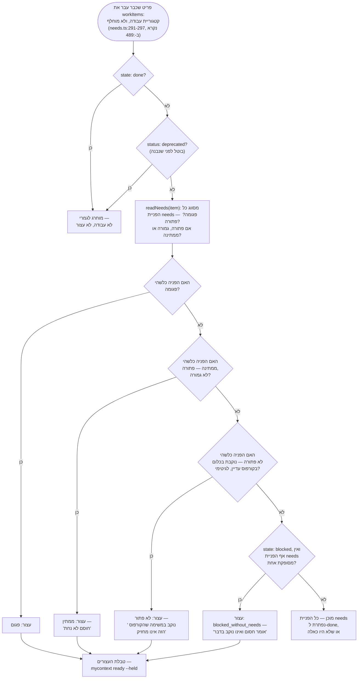

<!--
  Hebrew mirror of `docs/capabilities/16-the-board.md`. The English file is the
  source. Conventions: `docs/README.he.md` and `docs/the-store.he.md` — Hebrew
  prose and tables inside `<div dir="rtl">`, fenced blocks outside it,
  `<span dir="ltr">` around any Latin run whose edge characters are not both
  alphanumeric, around any run of two or more Latin terms joined by commas or
  slashes, and — per
  `KNOWN-the-hebrew-convention-says-an-identifier-with-alphanumeric` — around
  any code span that begins with a digit and contains a hyphen.

  All three pasted blocks are byte-identical to the English file: the
  `ready --held --limit 3` capture with its three tables (the held table
  complete, all four rows, which is the invariant the English paragraph after
  it says the example exists to demonstrate), its `[… the last 9 non-blank
  lines …]` marker exactly as the English marks it, `path --d 72`, and
  `path --summary` whole. The curly apostrophe in `owner’s` inside the first
  table is the byte the command printed and is not straightened.

  Heading sequence must stay identical to the English file.
-->

# 16. הלוח — תוכניות, <span dir="ltr">`needs`</span>, <span dir="ltr">`ready`</span>, <span dir="ltr">`path`</span>, ומספרי ה-D

<div dir="rtl">

<span dir="ltr">`docs/capabilities/00-index.he.md`</span> · הקודם:
[<span dir="ltr">`13-testing-discipline.he.md`</span>](./13-testing-discipline.he.md)

**הפרק הזה לא היה קיים לפני המעבר הזה, והוא הפער הבודד הגדול ביותר שהביקורת הזו מצאה.** לכל נושא
לא מתועד אחר בפרויקט הזה יש מדריך, דוח, או לפחות סעיף בפרק שנוקב בו. לזה — איך עבודה נבחרת, על
מה משימה מחכה, ואיך אדם עוקב אחרי נושא שלם עד השלמה — לא היה אף אחד מהם בצורה הנכונה: שני פריטי
סימוכין בקורפוס, מצביע ב-<span dir="ltr">`CLAUDE.md`</span>, נרטיב ב-
<span dir="ltr">`reports/V2-HANDOVER.md`</span>, והערת כותרת בת 48 שורות בראש
<span dir="ltr">`src/core/needs.ts`</span> (הקובץ עצמו משתרע על 866 שורות נכון ל-2026-09-17,
מוער בכבדות לאורכו — גרסה מוקדמת יותר של המשפט הזה אמרה 200, וספרה ביתר את כל ההערות של הקובץ
כאילו היו כותרת ראש-הקובץ ספציפית). זהו גם, לפי הדין וחשבון של הפרויקט עצמו, הנושא שחדש חייב
להבין *לפני שהוא עושה כאן עבודה כלשהי* — וזו בדיוק הסיבה שהוא יושב כה מאוחר בסימוכין: כל מה שבו
מניח את הקטגוריות, המצבים והפריטים שפרקים 1–3 כבר ביססו.

## 16.1 הבעיה שזה מחליף: טבלת התקדמות שאף אחד לא יכול היה לסמוך עליה

<span dir="ltr">`reports/EXECUTION-BOARD.md`</span> הייתה טבלת התקדמות שמתוחזקת ביד, שנגנזה
ב-2026-09-07 מסיבה שהפרויקט הזה יכול עכשיו להדגים ולא רק לקבוע: לוח שנשמר ביד והקורפוס שהוא מתאר
הם שני עותקים של עובדה אחת, והעותק תמיד מנצח בוויכוח עד שמישהו בודק.
<span dir="ltr">`CLAUDE.md`</span> בשורש המאגר קובע את הגניזה ישירות ומצביע לכאן במקום —
"<span dir="ltr">`mycontext ready [--plan <p>] [--held]`</span> מחשב מה ניתן לשיגור מתוך שדות ה-
<span dir="ltr">`needs:`</span> של הקורפוס עצמו. הוא אינו יכול להתיישן, כי אף אחד אינו שומר אותו
ביד."

**נמדד ב-2026-08-28, ביום שזה התחיל**: 425 פריטי משימה שלא הוחלפו, **אפס** נושאים תלות קריאה
למכונה; סריקת regex לאיתור תלות שנאמרה בפרוזה התאימה ל-4 מתוך כ-28 אזכורים, ואחד מהארבעה התפענח
לתוכנית שאינה קיימת — נקצר מאמצע משפט. זהו הטיעון בעד **שדה**, שנעשה במספרים: סימון עם שיעור
פגיעה של 25% וחיובי שגוי באותו מעבר אינו סימון.

## 16.2 <span dir="ltr">`needs`</span> — התלות האחת שמשימה יכולה להכריז עליה

<span dir="ltr">`src/core/needs.ts`</span> מגדיר את שדה ה-frontmatter
<span dir="ltr">`needs`</span>, רשימה מופרדת בפסיקים של הפניות
<span dir="ltr">`plan/seq`</span> (למשל <span dir="ltr">`needs: recall/2, walk/18`</span>). שלוש
בחירות עיצוב מכוונות, כל אחת מנומקת מכישלון מדוד:

- **הכיוון הוא <span dir="ltr">`needs`</span>, לעולם לא <span dir="ltr">`blocks`</span>.** הכותב
  של משימה יודע על מה המשימה שלו עצמו מחכה; הוא כמעט אף פעם אינו יודע מי יום אחד יהיה תלוי בה.
  <span dir="ltr">`open_question`</span> משתמש ב-<span dir="ltr">`blocks`</span> במקום, נכון, כי
  מי שמגיש *שאלה* כן יודע מי תקוע על התשובה שלה — <span dir="ltr">`blocks`</span> ניתן לגזירה מ-
  <span dir="ltr">`needs`</span> בהיפוך, ו-<span dir="ltr">`needs`</span> אינו ניתן לגזירה משום
  דבר, ולכן השדה חי בצד שבאמת אפשר למלא אותו ביושר.
- **הפניה לעבודה שעדיין אינה קיימת לגיטימית, ונשארת לגיטימית.** תוכניות נכתבות לפני שכל משימה
  בתוכן קיימת. סירוב להפניה לא פתורה היה הופך את השדה לחסר תועלת בדיוק ברגע — בזמן שתוכנית נפרסת
  — שבו הוא הכי נחוץ. שלוש שאלות נפרדות נשמרות נפרדות ולא מקופלות לפסק אחד: האם ההפניה תקינת-צורה
  (<span dir="ltr">`plan/seq`</span>)? האם משהו בקורפוס עונה לה (פתורה / **לא פתורה**, הערה,
  לעולם לא שגיאה)? והאם מה שהיא נפתרת אליו הוא <span dir="ltr">`done`</span> (מסופקת / ממתינה)?
- **המודול טהור.** אין קלט/פלט, אין שעון, אין סביבת עבודה — הקורא מספק את הפריטים. אותה קריאה
  משרתת בדיקת <span dir="ltr">`doctor`</span> וכל דוח בפרק הזה מפונקציה אחת, ולכן "האם גרף
  התלויות של הקורפוס הזה ישר" אינו יכול להיות שני דברים שונים תלוי באיזו פקודה שאלה.

<span dir="ltr">`PLAN_FIELD`/`SEQ_FIELD`/`STATE_FIELD`</span> נקראים מהתצורה ולא קבועים קשיח לשם
הקטגוריה <span dir="ltr">`task`</span> — במכוון, כי <span dir="ltr">`task`</span> הייתה עצמה
קטגוריה *מותאמת* (מוכרזת בתצורה) כשהמודול הזה נכתב, ופרויקט אחר עשוי לקרוא לאותו רעיון
<span dir="ltr">`story`</span> או <span dir="ltr">`ticket`</span>. מה שהבדיקות דורשות הוא תוכנית,
מיקום בתוכה, ומצב; זה מה שנשאל, לפי צורה, לעולם לא לפי שם.

שלוש השאלות למעלה נשמרות נפרדות ולא מקופלות, ויכולת השיגור היא מה שנופל החוצה ברגע שכל הפניה על
משימה ענתה על כל השלוש:

</div>



<div dir="rtl">

שום דבר בגרף הזה אינו ממוטמן — <span dir="ltr">`mycontext ready`</span> (למטה) הולך עליו טרי בכל
הרצה, בסדר העדיפות הזה: <span dir="ltr">`malformed`</span> גובר על
<span dir="ltr">`pending`</span>, שגובר על <span dir="ltr">`unresolved`</span>, שגובר על
<span dir="ltr">`blocked_without_needs`</span> (<span dir="ltr">`needs.ts:513-517`</span>) —
משימה עם יותר מבעיה אחת עצורה בגלל הראשונה שנמצאה, ולא בגלל כולן. **<span dir="ltr">`held`</span>
הוא מערך אחד עם ארבע סיבות, ושלוש מהארבע *הן* סיבות של הפניית <span dir="ltr">`needs`</span>**
(<span dir="ltr">`malformed`</span>, <span dir="ltr">`pending`</span>,
<span dir="ltr">`unresolved`</span>); רק <span dir="ltr">`blocked_without_needs`</span> נוקב
בחסימה שאינה על <span dir="ltr">`needs`</span> כלל — משימת <span dir="ltr">`state: blocked`</span>
בלי הפניה מסופקת להצביע עליה, שמרונדרת כ"אומר חסום ואינו נוקב בדבר" ולא כאחת משלוש סיבות הפניית
ה-<span dir="ltr">`needs`</span>. כל ארבע שורות העצורים בדוגמה החיה למטה נושאות למעשה את הטקסט של
<span dir="ltr">`pending`</span> עצמו, "a blocker has not landed" — **הערת הקריאה המתוארכת**
שלצד הדוגמה ההיא אומרת שהספירות זזות, והדיאגרמה הזו מציירת את כל ארבע הסיבות ללא קשר לאיזו מהן
הקורפוס הנוכחי במקרה מפעיל. (גרסה מוקדמת יותר של המשפט הזה זיכתה בזה את ה-
<span dir="ltr">`--limit 3`</span> בשורת הפקודה במקום. זה לא יכול להיות: §16.3 קובע פעמיים למטה
ש-<span dir="ltr">`--limit`</span> חוסם את רשימת המוכנים ולעולם לא את טבלת העצורים, וזו הסיבה
שהדוגמה המודבקת נושאת את כל ארבע שורות העצורים תחת <span dir="ltr">`--limit 3`</span>.)

## 16.3 <span dir="ltr">`mycontext ready`</span> — מה ניתן לשיגור, מחושב טרי בכל הרצה

<span dir="ltr">`ready [--plan <p>] [--held] [--questions] [--limit <n>]`</span> מונה כל משימה
פתוחה שכל הפניית <span dir="ltr">`needs`</span> שלה היא <span dir="ltr">`done`</span>, מדורגת לפי
עדיפות. **שום דבר אינו ממוטמן ואין מצב "מוכן" שמור שיכול להתיישן** — כל הרצה גוזרת מחדש את
התשובה מהקורפוס כפי שהוא עומד ברגע זה, וזו התכונה שהופכת את כל המנגנון לאמין מלכתחילה: עותק שני
של מוכנות היה חולק על הראשון ברגע שאחד מהם התעדכן לבד, וזה בדיוק הפגם ש-
<span dir="ltr">`reports/EXECUTION-BOARD.md`</span> נגנזה בגללו.

פלט אמיתי מול המאגר הזה, <span dir="ltr">`--held`</span> — **הפקודה מדפיסה עד שלוש טבלאות, ושתי
גרסאות מוקדמות עוקבות של הסעיף הזה כל אחת השמיטה משהו: אחת הדביקה רק את הטבלה השלישית (רשימת
העצורים) תחת משפט שהבטיח גם את הראשונה (רשימת המוכנים); התיקון לזה אז הדביק רשימת עצורים עם שלוש
מתוך ארבע השורות האמיתיות שלה, בהתאמה שקטה ל-<span dir="ltr">`--limit 3`</span> שלמעשה אינו חל על
טבלת העצורים כלל** (<span dir="ltr">`--limit`</span> חוסם רק את רשימת ה*מוכנים*; רשימת העצורים,
רשימת השאלות והספירות הסוגרות לעולם אינן נקטעות על ידו).

**וגם התיקון שאחרי ההוא לא היה לכידה.** כל תא כותרת עטוף בשתי הטבלאות קופל לשורה אחת עם … מוקלד
בסוף — *"take the lane report and the owner's own words as automatic marks…"* — וזה אינו מה
ש-<span dir="ltr">`mycontext ready`</span> מדפיס. הטבלה עוטפת כותרת ארוכה על פני כמה שורות שהיא
צריכה, בתוך אותם גבולות תא, והרוחב שהיא עוטפת אליו הוא קבוע
(<span dir="ltr">`OUTPUT_WIDTH = 100`</span>, <span dir="ltr">`src/cli/commands/format.ts:83`</span>).
הגרסה שקופלה ביד גם יישרה את הגרש המסולסל ב-*owner's* והשאירה את הגבולות תו אחד לא מיושרים, וזנב
ההרצה נחתך באמצע משפט עם <span dir="ltr">`...`</span> שהוקלד בתוך ה-fence. **נלכד מחדש ב-2026-09-17
בהפניית הפקודה לקובץ.** שתי הטבלאות וכל ספירה שלמות ולא ערוכות; החיתוך היחיד הוא הפרוזה הסוגרת,
והוא מסומן היכן שהוא קורה:

</div>

```
$ mycontext ready --held --limit 3     # 2026-09-17, captured by redirecting to a file
┌────────────┬─────┬───────┬───────────────────────────────────────────────────────────────────────┐
│ task       │ pri │ state │ title                                                                 │
├────────────┼─────┼───────┼───────────────────────────────────────────────────────────────────────┤
│ anchors/12 │ 1   │ todo  │ take the lane report and the owner’s own words as automatic marks,    │
│            │     │       │ and replace the ruling detector that only ever marked our own         │
│            │     │       │ injection block                                                       │
│ anchors/13 │ 1   │ todo  │ a user who installs mycontext mid-project has conversations nobody    │
│            │     │       │ can mark, because the pass has no corpus to recognise                 │
│ budget/6   │ 1   │ todo  │ an edited budget shows what it was, and one control puts it back      │
└────────────┴─────┴───────┴───────────────────────────────────────────────────────────────────────┘

153 ready of 157 open task(s)

┌───────────────────────────────────────────────────────────────────┬─────────┬────────────────────┐
│ question                                                          │ blocks  │ title              │
├───────────────────────────────────────────────────────────────────┼─────────┼────────────────────┤
│ OPENQ-does-export-import-ever-import-or-is-a-third-of-that-screen │ walk/89 │ does Export /      │
│                                                                   │         │ import ever        │
│                                                                   │         │ import, or is a    │
│                                                                   │         │ third of that      │
│                                                                   │         │ screen permanently │
│                                                                   │         │ a description of   │
│                                                                   │         │ an act this        │
│                                                                   │         │ product cannot     │
│                                                                   │         │ perform?           │
└───────────────────────────────────────────────────────────────────┴─────────┴────────────────────┘

┌───────────┬─────┬───────┬──────────────────────────┬─────────────────────────────────────────────┐
│ task      │ pri │ state │ held by                  │ title                                       │
├───────────┼─────┼───────┼──────────────────────────┼─────────────────────────────────────────────┤
│ walk/18   │ 1   │ todo  │ a blocker has not landed │ build init --rewrite-watched, and offer it  │
│           │     │       │                          │ from the doctor screen                      │
│ docsys/11 │ 3   │ todo  │ a blocker has not landed │ both READMEs learn the composer and the     │
│           │     │       │                          │ help, in the repository and in the corpus   │
│           │     │       │                          │ at once                                     │
│ port/99   │     │ todo  │ a blocker has not landed │ LAST UI TASK: return the UI to the real     │
│           │     │       │                          │ corpus                                      │
│ port/98   │     │ todo  │ a blocker has not landed │ SCREEN-BY-SCREEN REVIEW: walk the rail item │
│           │     │       │                          │ by item against the mockup and fix          │
└───────────┴─────┴───────┴──────────────────────────┴─────────────────────────────────────────────┘

153 ready; 3 shown. Raise the cap with --limit 153, or narrow it with --plan.

4 open task(s) held and not listed above: 4 a blocker has not landed. `mycontext ready --held` lists
them.

1 open question(s) stand between this list and open work. A question is finished by an ANSWER, not
by work: it carries no `seq`, nothing waits on its completion, and it leaves this report when
somebody answers it or when the work it names lands.

[… the last 9 non-blank lines of this run are not shown: the paragraph counting the 8 open
questions that block nothing, and the paragraph on how readiness is derived. Both are discussed —
and the first is quoted — in the prose below. Nothing above this marker is cut, reflowed or
retyped. …]
```

<div dir="rtl">

הטבלה ה**ראשונה** היא רשימת המוכנים עצמה (עמודות
<span dir="ltr">`task │ pri │ state │ title`</span>, בלי <span dir="ltr">`held by`</span>), והיא
לבדה מכבדת את <span dir="ltr">`--limit`</span>; ה**שנייה**, שמודפסת רק כששאלה חוסמת קיימת, היא
השאלה ההיא נקובה ישירות; ה**שלישית**, שמודפסת רק עם <span dir="ltr">`--held`</span>, היא רשימת
העצורים שהסעיף הזה באמת עוסק בה, עם עמודת ה-<span dir="ltr">`held by`</span> שלה, והיא מדפיסה כל
משימה עצורה ללא קשר ל-<span dir="ltr">`--limit`</span>. **"4 open task(s) held" וארבע שורות בטבלת
העצורים הם האינווריאנט שהדוגמה הזו קיימת כדי להדגים — אם קורא עתידי רואה שלוש שורות תחת טענה של
ארבע, או ארבע שורות תחת טענה של שלוש, אי-ההתאמה היא הבאג שיש לדווח עליו, ולא הספירה.** כל מספר
מוחלט כאן (<span dir="ltr">`153 ready of 157`</span>, <span dir="ltr">`4 held`</span>) הוא קריאה
של 2026-09-17 וכבר יהיה שגוי עד שזה ייקרא; הצורה — שלוש טבלאות, טבלת העצורים תמיד שלמה, הספירות
הסוגרות תמיד תואמות למה שבאמת הודפס — היא מה שהדוגמה הזו נועדה לו.

**שאלות פתוחות שחוסמות עבודה צפות בשמן; שאלות שאינן חוסמות דבר עדיין נספרות ואינן מנויות** —
עיצוב מכוון נגד רעש, שנאמר בטקסט של הדוח עצמו: *"רשימה שהראתה כל שאלה בכל פעם הייתה מאמנת קורא
לדלג עליה."* <span dir="ltr">`src/core/questions.ts`</span>
(<span dir="ltr">`plan:governance seq:9`</span>) הוא המנגנון, שנוסף במיוחד כי לפני שהוא היה קיים
הכרעה שממתינה לבעלים ישבה בקורפוס בלי ששום דבר מציב אותה מולו — כל אחת שהגיעה אליו הגיעה רק כי
עוזר במקרה זכר לשאול, וזה אינו שורד כיווץ (פרק 7), בדיוק הדבר שהמוצר הזה קיים כדי לתקן. הוא נבנה
במכוון כ**פרדיקט שני מעל אותה קטגוריית <span dir="ltr">`open_question`</span>** ולא קופל לתוך תור
הסקירה: תור הסקירה הוא הגדרה ספציפית אחת
(<span dir="ltr">`status === 'draft' && layer === 'project'`</span>) שנצרכת על ידי שבע ספירות
אחרות על פני המוצר, והרחבתו לכלול שאלות הייתה הופכת אותו *להיות* תור השאלות תחת שם שעדיין אומר
"טיוטות".

## 16.4 מספרי ה-D — נושא גדול ממשימה, והוא נקוב פעם אחת, לנצח

<span dir="ltr">`REF-the-d-numbers-what-each-one-means-and-which-are-only`</span> הוא **פריט
סימוכין נעוץ** — הבעלים פסק עליו "save D persistent" ב-2026-09-07, כי זה המקום היחיד שבו מספר D
שורד כיווץ, והערך של מספר יציב הוא ש"עשה D11" אומר בדיוק דבר אחד על פני סשנים. ההצהרה השולטת שלו
עצמו: *"מספר D נוקב ב**נושא**, ולא ברשימה קבועה של פריטים — נושא רשאי **להתרחב**, והתרחבות אינה
מספור מחדש ואינה שימוש חוזר."* מספר D לעולם אינו ממוספר מחדש ולעולם אינו בשימוש חוזר; הקצאת אחד
ורישומו בפריט הזה הם **מעשה אחד**, לא שניים — מספר שמוכרז בכל מקום אחר אינו מספר D עדיין.

הפריט נושא בלוק <span dir="ltr">`[D-MAP]`</span>: שורות מתוחמות, כל אחת נוקבת במספר D, אילו
תוכניות/פריטים מרכיבים אותו, ו(נכון ל-2026-09-16, עבודה צמודה ל-
<span dir="ltr">`store/10`</span>) <span dir="ltr">`status`</span> מפורש — כולל
<span dir="ltr">`held-by-owner`</span> לנושא שהבעלים פסק שצריך לחכות לו ספציפית.
<span dir="ltr">`REF-the-wave-map-…`</span> הוא פריט סימוכין שני וקשור לאיך נושאים קובצו לגלי
מסירה. ה**נרטיב** מאחורי כל התרחבות, כל הוראה שנגנזה, והנימוק לסדר חי ב-
<span dir="ltr">`reports/2026-09-11-the-d-numbers-record.md`</span> — הפריט נושא את המפה, הדוח
נושא את הרישום, והשניים במכוון אינם אותו מסמך.

## 16.5 <span dir="ltr">`mycontext path`</span> — התקדמות לכל נושא, והעמודה שאין לשום פקודה אחרת

נשלח 2026-09-16, ישירות בתגובה למילותיו של הבעלים עצמו: *"a mechanism that will make all of them
be dispatched, progress tracked and 100% completed so i could use it as a reliable path to complete
all currently known opened Ds."* <span dir="ltr">`ready`</span> כבר עונה על "מה אני יכול להתחיל"
על פני כל הקורפוס; שום דבר לפני <span dir="ltr">`path`</span> לא ענה על "לאן
<span dir="ltr">`D72`</span> ספציפית הגיע" — הטבלאות שניסו היו סריקות regex על הפרוזה של הרישום
עצמו, ו**שתי שורות יצאו שגויות ביום שזה נמדד**: <span dir="ltr">`D78`</span> דווח כסגור כי הטקסט
שלו רק *מצטט* את הסגירה של <span dir="ltr">`D57`</span>, ו-<span dir="ltr">`D57`</span> דווח
<span dir="ltr">`0/3`</span> כי ה-regex התאים לפריטים של יום לא קשור לפי שם בלבד.

</div>

```
$ mycontext path --d 72
┌─────┬────────┬──────┬───────┬──────┬───────┬───────────┐
│ D   │ status │ done │ ready │ held │ yours │ work      │
├─────┼────────┼──────┼───────┼──────┼───────┼───────────┤
│ D72 │ open   │ 2/4  │ 2     │ 0    │ 0     │ readmodel │
└─────┴────────┴──────┴───────┴──────┴───────┴───────────┘
```

<div dir="rtl">

**שום דבר כאן אינו נשמר, על אותו עיקרון כמו <span dir="ltr">`ready`</span>.** כל מספר מחושב
בהרצה מבלוק ה-<span dir="ltr">`[D-MAP]`</span> ועוד המצב החי של הפריטים שהוא נוקב בהם — קובץ
"התקדמות" שמור היה בדיוק הפגם שכל המנגנון הזה קיים כדי למנוע. הדבר האחד ש*נקרא* באמת ולא נגזר
הוא **חברות** (לאיזה נושא תוכנית שייכת — הקצאה שרק אדם יכול לעשות) וה-
<span dir="ltr">`status`</span> של נושא עצמו, כי סגירת נושא היא **שיפוט**, לעולם לא ספירה: מילות
הפריט עצמו, מצוטטות ישירות במקור של <span dir="ltr">`path.ts`</span>, הן *"**הנושא נסגר** כשקורא
שפותח שיחה יכול לומר במבט אחד מה סומן ולמה זה היה שווה סימון — ולא כששנים־עשר פריטים גמורים."*

**עמודת ה-<span dir="ltr">`YOURS`</span> היא כל הנקודה של הפקודה, ושום פקודה אחרת אינה יכולה
לחשב אותה.** שלושה דברים יושבים וממתינים לבעלים ממש עכשיו, במאגר הזה, וכל דוח קיים צייר אותם
כעבודה פתוחה רגילה — כלומר כל אחד מהדוחות ההם הציע לו עבודה שהוא כבר החליט לדחות.
<span dir="ltr">`YOURS`</span> נגזרת משני דברים שהקורפוס כבר מחזיק, לעולם לא משדה חדש: נושא
שהשורה שלו קוראת <span dir="ltr">`held-by-owner`</span>, או שאלה פתוחה שנוקבת בנושא ההוא ב-
<span dir="ltr">`blocks`</span> שלה (המנגנון של §16.3, מכוון לנושא במקום לכל הקורפוס). הדרך שמשהו
נכנס לעמודה הזו היא להגיש את השאלה; הדרך שהוא עוזב היא שהבעלים יענה עליה, בלי שאף אחד יערוך
סטטוס ביד.

הבלוק למטה היה **מקוצץ בשקט** בארבעה מקומות עד 2026-09-17, ואף אחד מהחיתוכים לא סומן: שורת
הפתיחה שנוקבת בסכומים של המפה עצמה הושמטה לגמרי, שני משפטים נחתכו באמצע פסוקית עם
<span dir="ltr">`...`</span> מוקלד, רשימת 21 הנושאים הסגורים נקטעה אחרי שלושה שמות, ומזהה הפריט
תחת D46 הוסר. הוא נלכד כאן מחדש בהפניית הפקודה לקובץ, והוא קצר מספיק כדי להדפיס אותו בשלמותו. כל
ספירה בו זזה — 18 פריטי עבודה יתומים בלכידה הקודמת, 20 בזו.

</div>

```
$ mycontext path --summary     # 2026-09-17, captured by redirecting to a file — whole, nothing cut
78 subject(s) in the map, 40 shown, 137 open work item(s) under them. Every count here is derived on
this run from REF-the-d-numbers-what-each-one-means-and-which-are-only's [D-MAP] block and the state
of the items it names; nothing is stored and there is no progress file to go stale.

WAITING ON YOU — 2 subject(s), and no other command can say so. This is the difference between a
list and a path: a report that draws these as ordinary open work keeps offering you work you have
already decided to defer.
  D46 · walk/89 — does Export / import ever import, or is a third of that screen permanently a
     description of an act this product cannot perform?
     (OPENQ-does-export-import-ever-import-or-is-a-third-of-that-screen)
  D67 — the whole subject is held by your own ruling.

21 subject(s) read "open" with every item done: D8, D13a/b, D14, D16, D17, D20, D21, D22, D29, D31,
D34, D35, D36, D38, D40, D42, D59, D65, D71, D73, D74. A subject closes on a JUDGEMENT and never on
a count — nothing here will close one for you.

20 open work item(s) belong to no subject at all, so they are in none of the rows above. `npm run
check:board --orphans` names them. Filing an item before its number is minted is ordinary; nobody
being told is how a subject disappears from the board.

100% here means every remaining step is either DISPATCHABLE or NAMED AS YOURS. It is not a promise
that every subject closes: one is held by your own ruling and others end in decisions only you can
make.
```

<div dir="rtl">

**מה ש-100% יכול ואינו יכול לומר נאמר בכל הרצה, במכוון, כך שהמנגנון לא יוכל להיקרא כמבטיח יותר
ממה שהוא.** הגרסה הישרה של הבקשה של הבעלים היא מסלול שבו כל צעד שנותר הוא או ניתן לשיגור או נקוב
כשלו — לעולם לא הבטחה שכל נושא נסגר.

## 16.6 מה שומר על הלוח עצמו ישר — <span dir="ltr">`check:board`</span>, בשער ב-CI

הלוח אמין רק כמו שני החלקים הנעים שלו: הפרוזה של ה-D-MAP עצמו, והמשמעת של סגירת פריט כשהעבודה
שמסיימת אותו נוחתת. <span dir="ltr">`scripts/check-board.ts`</span>
(<span dir="ltr">`npm run check:board`</span>, מחווט גם ל-
<span dir="ltr">`.github/workflows/ci.yml`</span> וגם ל-<span dir="ltr">`release.yml`</span>) בודק
את שניהם, והכותרת שלו עצמו קובעת את התקן ישירות: *"הלוח אינו נכון, וזה מה ששומר עליו נכון."*

**שכבה 1 — ה-D-MAP מתפענח, וזו זו ששומרת על הבנייה.** כל שורה בין הסימנים של הבלוק חייבת
להתפענח, שום מספר D אינו רשאי לחזור, כל חבר חייב לנקוב בעבודה שהקורפוס באמת מחזיק, ושום פריט אינו
רשאי ליפול תחת שני נושאים. בדיקת התביעה הכפולה היא זו ששווה לנקוב בה ספציפית: פריט אחד שנתבע על
ידי שני נושאים גורם לסכומים של שתי השורות לספור אותו, ולכן הסכומים של הלוח מפסיקים להסתדר בעוד
שכל שורה בודדת עדיין נראית נכונה בבידוד — סוג השגיאה המשקרת שאף אחד אינו מבקר עליה בעין.

**שכבה 2 — commit נקב בפריט, והפריט עדיין פתוח. מדווח, לעולם לא נשמר בשער.** נמדד לראשונה ביום
שהפרק הזה נכתב: 23 מתוך סך משימות פתוחות בטווח ה-150 הנמוך כבר נקבו על ידי commit מאז 2026-09-14
— העבודה של נתיב אחד הייתה ב-<span dir="ltr">`HEAD`</span> כשהפריט שהיא סיימה עדיין קורא
<span dir="ltr">`state: todo`</span>, ולכן הנושא שהוא השתייך אליו דיווח שניים מארבעת הפריטים שלו
שנשלחו כאפס. **המספר הזה הוא אחד המהירים ביותר לזוז בכל הסימוכין, כי הוא סופר מרוץ שהנתיבים של
הפרויקט הזה עצמו סוגרים באופן פעיל, והוא מחושב על פני חלון נע של 120 commits שהוא עצמו זז מתחת
למכנה קבוע בתוך יום.** כל הרצה חוזרת מאז נתנה זוג שונה, והמכנה המדויק של 2026-09-16 שצוטט בגרסה
מוקדמת יותר של הסעיף הזה (153) לא ניתן היה לשחזור מול חלון של הרצה מאוחרת יותר (שקרא 154) — שני
המספרים קרובים מספיק שזו ככל הנראה שגיאת אחד משימוש חוזר בנתון המשימות-הפתוחות השכן של
<span dir="ltr">`ready`</span> ולא בנתון פריטי-העבודה-הפתוחים של הפקודה עצמה, אבל זה אינו בר
הוכחה אחרי שהחלון זז, ולכן זה נאמר כהסתייגות ולא מתוקן לערך ספציפי. הורץ מחדש ממש עכשיו,
2026-09-17: <span dir="ltr">`node scripts/check-board.ts`</span> מדווח על **5 מתוך 157 פריטי
עבודה פתוחים, על פני 120 ה-commits האחרונים (2026-09-13 עד 2026-09-17)**. קראו כל מה שהרצה טרייה
נותנת לכם כעדכני; המנגנון — חלון נע על פני commits אחרונים, נבדק מול מצב פריט חי, עם ארבע החרגות
נקובות — הוא מה שהסעיף הזה באמת מתעד, ולא שום זוג מספרים ספציפי. זו לולאת השיגור של הפרויקט עצמו
שנכשלת לאמת את הדבר האחד שבאמת חשוב: כל תדריך אומר "סגרו כל פריט גמור", חלק מהנתיבים עושים וחלק
לא, ושלב ה-commit בודק את הקוד ואת הטסטים ולעולם אינו בודק שהמצב של הפריט עצמו השתנה. **זה אינו
יכול להיות שער קשיח, והסיבה אינה זהירות**: commit ש*יוצר* פריט נוקב בו גם, נחיתה חלקית לגיטימית,
ו-commit של העברת ידיים נוקב בכל נתיב חי בכוונה. ארבעת הדברים שהבדיקה יודעת *לא* לדווח עליהם —
עבודה גמורה/גנוזה/מוחלפת, commits של הגשה, commits של הנהלת חשבונות בלבד (שום דבר לא השתנה מחוץ
ל-<span dir="ltr">`reports/`</span>/<span dir="ltr">`.my_context/`</span>), ופריט שנושא אישור
<span dir="ltr">`NAMED-BUT-OPEN <sha> — <what remains>`</span> שפג בעצמו — היו מה שקיצץ סריקה
תמימה גדולה בהרבה לקומץ ממצאים אמיתיים ביום שהמנגנון הזה נמדד לראשונה; גזרו מחדש את היחס הנוכחי
מהרצה טרייה ולא תסמכו על ספירה היסטורית ספציפית כאן.

<span dir="ltr">`npm run check:needs-cycles`</span> הוא השער האח: הוא מסרב לגרף
<span dir="ltr">`needs`</span> שמכיל מעגל, ורץ לצד <span dir="ltr">`check:board`</span> באותן שתי
זרימות עבודה.

## 16.7 מה **לא** בנוי / בנוי אך כבוי

- **עדיין אין דרך ל-commit *להכריז* איזה פריט הוא סוגר.** שכבה 2 של
  <span dir="ltr">`check:board`</span> היא דוח, לא שער, במיוחד כי שום דבר היום אינו מאפשר
  ל-commit לומר "זה מסיים את <span dir="ltr">`TASK-x`</span>" בדרך שהוא יכול לומר באילו קבצים הוא
  נגע — הכותרת נוקבת ב-trailer של commit כדבר האחד שהיה הופך את זה לבר-שמירה, והוא אינו קיים.
- **תלות שנאמרת רק בפרוזה בלתי נראית ל-<span dir="ltr">`needs`</span>, ל-
  <span dir="ltr">`ready`</span> ול-<span dir="ltr">`path`</span> כאחד.** כל השלושה מפורשים שזו
  קביעה על היושר של הקורפוס עצמו, ולא הבטחה על העבודה — <span dir="ltr">`mycontext doctor`</span>
  הוא מה שמדווח על משימת <span dir="ltr">`blocked`</span> שאינה נוקבת בשום דבר קריא למכונה.
- **עמודת ה-<span dir="ltr">`YOURS`</span> של <span dir="ltr">`path`</span> תלויה לחלוטין בכך
  שהשורה של נושא קוראת <span dir="ltr">`held-by-owner`</span> או ששאלה פתוחה נוקבת בו** — הכרעה
  אמיתית שממתינה לבעלים שמעולם לא הוגשה כשאלה, ושהנושא שלה מעולם לא סומן כעצור, בלתי נראית לעמודה
  הזו בדיוק כפי שהפניית <span dir="ltr">`needs`</span> שלא נכתבה בלתי נראית ל-
  <span dir="ltr">`ready`</span>. המנגנון אי פעם יודע רק את מה שנאמר לקורפוס.
- **הפרק הזה אינו מתאר את הספירות הצמודות-ללוח של <span dir="ltr">`mycontext status`</span>
  עצמו**, או את הדגל <span dir="ltr">`check:board --orphans`</span> מעבר לנקיבה שהוא קיים —
  שניהם משטח אמיתי שהמעבר הזה לא אימת מעבר למה שמוצג למעלה.
- כל ספירה בפרק הזה (הסך של המוכנים, ספירת הנושאים, יחס ה-commit/מצב-פריט, "ממתין לך") היא
  **קריאה מתוארכת**, שנלקחה מול קורפוס ששתי הפקודות מחשבות מחדש מאפס בכל הרצה.
  <span dir="ltr">`78 subjects in the map`</span> החזיק יציב על פני כל קריאה שהפרק הזה עבר, כי
  מספרי D זזים רק כשנושא מוטבע במכוון; הסך של המוכנים ויחס ה-commit/מצב-פריט זזו כל אחד ב**כל
  הרצה חוזרת** על פני שלושה מעברי אימות נפרדים בשלושה ימים שונים. הריצו אותם מחדש למספרים של
  היום; זו כל הנקודה של המנגנון, והיסטוריית הגרסאות של הפרק הזה עצמו היא הראיה הטובה ביותר שמספר
  חשוף כאן מתיישן מהר משקורא מצפה.

## ראו גם

- [00 — אינדקס](./00-index.he.md)
- [01 — פריטים והקורפוס](./01-items-and-corpus.he.md) — הקטגוריות
  <span dir="ltr">`task`</span>/<span dir="ltr">`open_question`</span> ושדה
  <span dir="ltr">`state`</span> שכל המנגנון של הפרק הזה קורא
- [07 — שחזור והעברת ידיים](./07-restore-and-handover.he.md) — למה הכרעה שהגיעה לבעלים אי פעם רק
  בשיחה אינה שורדת כיווץ, וזו הסיבה של <span dir="ltr">`questions.ts`</span> עצמו להתקיים
- [09 — שורת הפקודה ו-MCP](./09-cli-and-mcp.he.md) — <span dir="ltr">`ready`</span> ו-
  <span dir="ltr">`path`</span> בסימוכין הפקודות המלא
- [13 — משמעת הבדיקות](./13-testing-discipline.he.md) — <span dir="ltr">`check:board`</span> ו-
  <span dir="ltr">`check:needs-cycles`</span> בתוך מלאי שערי ה-<span dir="ltr">`check:*`</span>
  המלא

</div>
