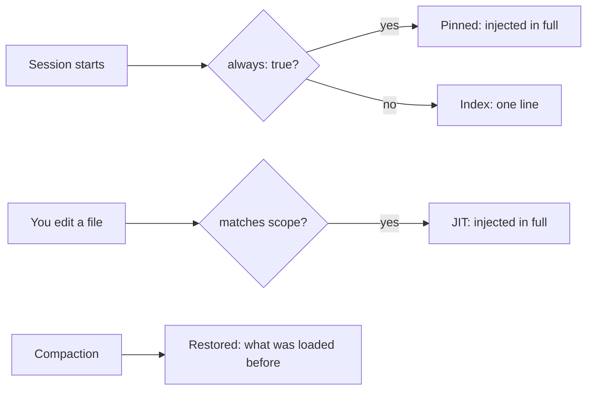

# mycontext Documentation Implementation Plan

> **For agentic workers:** REQUIRED SUB-SKILL: Use superpowers:subagent-driven-development (recommended) or superpowers:executing-plans to implement this plan task-by-task. Steps use checkbox (`- [ ]`) syntax for tracking.

**Goal:** Replace the 182-line reference README with complete documentation that a non-developer can follow and a new developer can rely on, mirrored in Hebrew, illustrated with diagrams, rendered through a redesigned table output, and pinned by tests so it cannot silently drift from the code.

**Architecture:** The table renderer changes first, because every documented example pastes its output. A committed fixture workspace and a generator script then produce every example block by executing the real CLI, and a test re-executes and diffs them. The README is written in three passes over one file; the Hebrew mirror follows the finished English. Three drift tests close the loop: inventory parity (every command/tool documented, nothing documented that does not exist), example verification, and English/Hebrew structural parity.

**Tech Stack:** Node 24 native TypeScript type-stripping (no build step, `erasableSyntaxOnly`), `node:test`, `node:sqlite`, Mermaid (rendered natively by GitHub). Zero runtime dependencies.

**Spec:** `docs/superpowers/specs/2026-08-14-mycontext-documentation-design.md`

## Global Constraints

- **Zero runtime dependencies.** Only `typescript` and `@types/node`, and only as devDependencies.
- **Node >= 24.0.0**, sources executed directly. Only erasable TypeScript syntax: no `enum`, no `namespace`, no parameter properties. Every relative import carries an explicit `.ts` extension.
- **Never write a comment, message or doc asserting a property the code does not have.** This project's characteristic defect, 25+ recorded occurrences; four of the last review's six blockers were instances. If a claim cannot be verified, say so plainly instead.
- **Present tense is reserved for shipped behaviour.** Planned work lives only in the "Not yet available" section, each entry naming the wave that delivers it.
- **No example output is written by hand.** Every block is generated by executing the real command against the fixture.
- **Every fix needs a test that fails without it.** Verify by reverting. Commit before mutating.
- **Windows is the first-target platform.** POSIX-normalized paths everywhere; the ASCII fallback exists because legacy `cmd.exe` is a real user.
- `npm test` and `npx tsc --noEmit` clean at every commit. `git status --porcelain` shows only `?? docs/audit/`.

---

### Task 1: Box-drawing table renderer with ASCII fallback

**Files:**
- Modify: `src/cli/commands/format.ts` · `export function table(` · ~231
- Test: `test/cli/format-table.test.ts` (create)

**Interfaces:**
- Consumes: nothing from earlier tasks.
- Produces: `table(headers: string[], rows: string[][], opts?: { unicode?: boolean }): string[]` and `supportsUnicode(env?: NodeJS.ProcessEnv, platform?: string): boolean`. Every later task's pasted example output reflects this rendering.

The six reporting commands (`list`, `status`, `doctor`, `decay`, `ingest-status`, `review list`) call `table` and must not change their call sites. `col` is unrelated and stays as it is.

- [ ] **Step 1: Write the failing tests**

```ts
// test/cli/format-table.test.ts
import { test } from 'node:test';
import assert from 'node:assert/strict';
import { table, supportsUnicode } from '../../src/cli/commands/format.ts';

test('renders a unicode box with a header rule', () => {
  const lines = table(['id', 'type'], [['CONST-a', 'constraint']], { unicode: true });
  assert.deepEqual(lines, [
    '┌─────────┬────────────┐',
    '│ id      │ type       │',
    '├─────────┼────────────┤',
    '│ CONST-a │ constraint │',
    '└─────────┴────────────┘',
  ]);
});

test('falls back to ascii without dropping a column', () => {
  const lines = table(['id', 'type'], [['CONST-a', 'constraint']], { unicode: false });
  assert.deepEqual(lines, [
    '+---------+------------+',
    '| id      | type       |',
    '+---------+------------+',
    '| CONST-a | constraint |',
    '+---------+------------+',
  ]);
});

test('a 63-character id does not collide with the next column', () => {
  const long = 'INV-a-validator-that-gates-writes-must-be-a-complete-precondi';
  const lines = table(['id', 'type'], [[long, 'invariant']], { unicode: true });
  const dataRow = lines[3];
  assert.ok(dataRow.includes(`│ ${long} │`), dataRow);
  assert.equal(lines[1].length, dataRow.length);
});

test('returns no lines for zero rows', () => {
  assert.deepEqual(table(['id'], [], { unicode: true }), []);
});

test('unicode detection fails toward ascii on an unknown windows terminal', () => {
  assert.equal(supportsUnicode({}, 'win32'), false);
  assert.equal(supportsUnicode({ WT_SESSION: '1' }, 'win32'), true);
  assert.equal(supportsUnicode({ TERM: 'xterm-256color' }, 'win32'), true);
  assert.equal(supportsUnicode({}, 'linux'), true);
});

test('MYCONTEXT_ASCII overrides a capable terminal', () => {
  assert.equal(supportsUnicode({ WT_SESSION: '1', MYCONTEXT_ASCII: '1' }, 'win32'), false);
});
```

- [ ] **Step 2: Run to verify they fail**

Run: `node --test test/cli/format-table.test.ts`
Expected: FAIL — `supportsUnicode` is not exported; `table` renders dash rules.

- [ ] **Step 3: Implement**

Replace `table` in `src/cli/commands/format.ts` and add `supportsUnicode` above it:

```ts
/**
 * Whether the terminal can render box-drawing characters.
 *
 * Fails toward ASCII: an unrecognized Windows terminal gets the safe
 * rendering, because legacy `cmd.exe` on a non-UTF-8 code page turns box
 * characters into mojibake and Windows is this project's first target. POSIX
 * terminals have rendered these for decades, so they are trusted by default.
 *
 * `env` and `platform` are injectable because the alternative is a test that
 * can only assert whatever the CI machine happens to be.
 */
export function supportsUnicode(
  env: NodeJS.ProcessEnv = process.env,
  platform: string = process.platform,
): boolean {
  if (env.MYCONTEXT_ASCII === '1') return false;
  if (env.MYCONTEXT_UNICODE === '1') return true;
  if (platform !== 'win32') return true;
  return Boolean(env.WT_SESSION || env.TERM_PROGRAM || env.TERM);
}

const BOX = {
  unicode: { tl: '┌', tm: '┬', tr: '┐', ml: '├', mm: '┼', mr: '┤',
             bl: '└', bm: '┴', br: '┘', h: '─', v: '│' },
  ascii:   { tl: '+', tm: '+', tr: '+', ml: '+', mm: '+', mr: '+',
             bl: '+', bm: '+', br: '+', h: '-', v: '|' },
} as const;

/**
 * A bordered table: top rule, header, header rule, data, bottom rule. Widths
 * come from the widest of the header and every cell, so nothing collides and
 * nothing is truncated — including the 63-character ids this repo already has.
 *
 * Returns NO lines for zero rows — a bare header over an empty table reads as
 * "here is the data" when there is none; each caller says what "none" means
 * in its own words instead.
 */
export function table(
  headers: string[], rows: string[][], opts: { unicode?: boolean } = {},
): string[] {
  if (rows.length === 0) return [];

  const b = (opts.unicode ?? supportsUnicode()) ? BOX.unicode : BOX.ascii;
  const widths = headers.map((header, i) =>
    Math.max(header.length, ...rows.map((row) => (row[i] ?? '').length)));

  const rule = (l: string, m: string, r: string): string =>
    l + widths.map((w) => b.h.repeat(w + 2)).join(m) + r;
  const line = (values: string[]): string =>
    b.v + widths.map((w, i) => ` ${(values[i] ?? '').padEnd(w)} `).join(b.v) + b.v;

  return [
    rule(b.tl, b.tm, b.tr),
    line(headers),
    rule(b.ml, b.mm, b.mr),
    ...rows.map(line),
    rule(b.bl, b.bm, b.br),
  ];
}
```

- [ ] **Step 4: Run to verify they pass**

Run: `node --test test/cli/format-table.test.ts`
Expected: PASS, 6/6.

- [ ] **Step 5: Update the existing output tests**

Run: `npm test`
Existing assertions in `test/cli/output.test.ts`, `test/cli/status.test.ts`, `test/cli/decay.test.ts` and `test/cli/review.test.ts` match the old dash rendering and will fail. Update each to the new rendering. **Do not weaken an assertion to make it pass** — if a test asserted a column was present, it must still assert that.

- [ ] **Step 6: Verify against the real corpus**

Run: `node src/cli/index.ts list --full` and `node src/cli/index.ts status --full`
Read the output as a user would. Confirm no column collides and the box closes on every row.

- [ ] **Step 7: Commit**

```bash
git add src/cli/commands/format.ts test/
git commit -m "feat: render tables with box-drawing and an ascii fallback"
```

---

### Task 2: Documentation fixture workspace

**Files:**
- Create: `test/fixtures/docs-workspace/` (a committed `.my_context`-shaped corpus)
- Create: `scripts/doc-fixture.ts`
- Test: `test/docs/fixture.test.ts`

**Interfaces:**
- Consumes: nothing.
- Produces: `materializeDocFixture(dest: string): void` — copies the committed fixture into `dest` and rebuilds its index. Task 3 calls this.

The fixture must be small enough that output stays readable, and rich enough to demonstrate: a pinned item, a scoped item, a draft awaiting review, a superseded item, both layers, and at least one item long enough to show column behaviour. Ids and titles appear throughout the documentation, so they must read as plausible examples on their own — use a fictional web application, not this repo.

- [ ] **Step 1: Write the failing test**

```ts
// test/docs/fixture.test.ts
import { test } from 'node:test';
import assert from 'node:assert/strict';
import { mkdtempSync } from 'node:fs';
import { tmpdir } from 'node:os';
import { join } from 'node:path';
import { materializeDocFixture } from '../../scripts/doc-fixture.ts';
import { Store } from '../../src/core/store.ts';

test('the doc fixture materializes and indexes', () => {
  const dir = mkdtempSync(join(tmpdir(), 'myctx-docfix-'));
  materializeDocFixture(dir);
  const store = Store.open(join(dir, '.my_context', '.index.db'));
  const rows = store.db.prepare('SELECT status, always FROM items').all() as
    Array<{ status: string; always: number }>;
  store.close();

  assert.ok(rows.length >= 8, `expected a demonstrative corpus, got ${rows.length}`);
  assert.ok(rows.some((r) => r.always === 1), 'needs a pinned item');
  assert.ok(rows.some((r) => r.status === 'draft'), 'needs a draft for the review example');
  assert.ok(rows.some((r) => r.status === 'superseded'), 'needs a superseded item');
});
```

- [ ] **Step 2: Run to verify it fails**

Run: `node --test test/docs/fixture.test.ts`
Expected: FAIL — `scripts/doc-fixture.ts` does not exist.

- [ ] **Step 3: Build the fixture corpus**

Create the items under `test/fixtures/docs-workspace/.my_context/` using the **supported surfaces** — run `node src/cli/index.ts init` in a scratch directory, then `add`/`review promote` — and copy the result in. Do not hand-write frontmatter: a hand-written checksum that does not match its content is the exact defect `doctor` exists to catch.

Suggested corpus for a fictional "Bookstore API" project:

| id | type | status | notes |
|---|---|---|---|
| `CONST-postgres-pool-capped-at-20` | constraint | active | `always: true` — the pinned example |
| `INV-prices-are-integer-cents` | invariant | active | scope `src/billing/**` — the JIT example |
| `RULE-never-log-customer-email` | rule | active | scope `src/**` |
| `REQ-checkout-completes-in-two-steps` | requirement | active | unscoped — shows index-only behaviour |
| `STD-api-errors-use-problem-json` | standard | active | scope `src/api/**` |
| `DEC-use-stripe-for-payments` | decision | active | rationale tier |
| `LESSON-retry-storms-need-jitter` | lesson | active | rationale tier |
| `RULE-cache-keys-include-tenant-id` | rule | **draft** | the review-queue example |
| `OPENQ-which-search-engine` | open_question | **superseded** | the retirement example |

- [ ] **Step 4: Write the materializer**

```ts
// scripts/doc-fixture.ts
import { cpSync, existsSync } from 'node:fs';
import { dirname, join } from 'node:path';
import { fileURLToPath } from 'node:url';
import { rebuild } from '../src/core/rebuild.ts';
import { resolveWorkspace } from '../src/core/workspace.ts';

const FIXTURE = join(dirname(fileURLToPath(import.meta.url)),
  '..', 'test', 'fixtures', 'docs-workspace');

/**
 * Copies the committed documentation fixture into `dest` and rebuilds its
 * index, so every documented example runs against one known corpus. The index
 * is rebuilt rather than committed because `.index.db` is disposable by
 * design (INV-markdown-is-the-source-of-truth) and a committed binary would
 * drift from the Markdown that defines it.
 */
export function materializeDocFixture(dest: string): void {
  if (!existsSync(FIXTURE)) throw new Error(`doc fixture missing at ${FIXTURE}`);
  cpSync(join(FIXTURE, '.my_context'), join(dest, '.my_context'), { recursive: true });
  const ws = resolveWorkspace(dest);
  rebuild(ws);
}
```

- [ ] **Step 5: Run to verify it passes**

Run: `node --test test/docs/fixture.test.ts`
Expected: PASS.

- [ ] **Step 6: Commit**

```bash
git add scripts/doc-fixture.ts test/fixtures/docs-workspace test/docs/fixture.test.ts
git commit -m "test: committed fixture corpus for documentation examples"
```

---

### Task 3: Example generation and verification harness

**Files:**
- Create: `scripts/gen-doc-examples.ts`
- Create: `test/docs/examples.test.ts`
- Modify: `package.json` (add `"gen:docs": "node scripts/gen-doc-examples.ts"`)

**Interfaces:**
- Consumes: `materializeDocFixture` from Task 2.
- Produces: `collectExamples(markdown: string): Example[]` where `Example = { command: string; body: string; start: number; end: number }`, and `runExample(command: string, cwd: string): string`. Tasks 5–8 write the marker blocks this reads.

Examples are marked in the Markdown so both the generator and the test find the same blocks:

````markdown
<!-- example: list constraint --full -->
```text
(generated)
```
<!-- /example -->
````

The command is always run as `node src/cli/index.ts <command>` from the fixture workspace, so a documented command that does not exist fails loudly.

- [ ] **Step 1: Write the failing test**

```ts
// test/docs/examples.test.ts
import { test } from 'node:test';
import assert from 'node:assert/strict';
import { readFileSync, mkdtempSync } from 'node:fs';
import { tmpdir } from 'node:os';
import { join } from 'node:path';
import { collectExamples, runExample } from '../../scripts/gen-doc-examples.ts';
import { materializeDocFixture } from '../../scripts/doc-fixture.ts';

test('collectExamples finds marked blocks', () => {
  const md = [
    'intro',
    '<!-- example: list constraint -->',
    '```text',
    'OUTPUT',
    '```',
    '<!-- /example -->',
    'outro',
  ].join('\n');
  const found = collectExamples(md);
  assert.equal(found.length, 1);
  assert.equal(found[0].command, 'list constraint');
  assert.equal(found[0].body, 'OUTPUT');
});

test('every documented example matches what the command actually prints', () => {
  const dir = mkdtempSync(join(tmpdir(), 'myctx-docex-'));
  materializeDocFixture(dir);
  const readme = readFileSync('README.md', 'utf8');
  const examples = collectExamples(readme);
  assert.ok(examples.length >= 10, `expected worked examples, found ${examples.length}`);

  for (const ex of examples) {
    const actual = runExample(ex.command, dir);
    assert.equal(actual, ex.body,
      `README example "${ex.command}" is stale — run \`npm run gen:docs\` to regenerate it`);
  }
});
```

- [ ] **Step 2: Run to verify it fails**

Run: `node --test test/docs/examples.test.ts`
Expected: FAIL — `scripts/gen-doc-examples.ts` does not exist.

- [ ] **Step 3: Implement the harness**

```ts
// scripts/gen-doc-examples.ts
import { execFileSync } from 'node:child_process';
import { readFileSync, writeFileSync, mkdtempSync } from 'node:fs';
import { tmpdir } from 'node:os';
import { join } from 'node:path';
import { materializeDocFixture } from './doc-fixture.ts';

export type Example = { command: string; body: string; start: number; end: number };

const OPEN = /<!-- example: (.+?) -->\n```text\n/g;
const CLOSE = '\n```\n<!-- /example -->';

/** Every marked example block, in document order. */
export function collectExamples(markdown: string): Example[] {
  const out: Example[] = [];
  OPEN.lastIndex = 0;
  let m: RegExpExecArray | null;
  while ((m = OPEN.exec(markdown)) !== null) {
    const bodyStart = m.index + m[0].length;
    const closeAt = markdown.indexOf(CLOSE, bodyStart);
    if (closeAt === -1) throw new Error(`unterminated example block: ${m[1]}`);
    out.push({ command: m[1], body: markdown.slice(bodyStart, closeAt),
               start: bodyStart, end: closeAt });
  }
  return out;
}

/**
 * Runs one documented command against the fixture and returns its stdout,
 * with the fixture's temp path scrubbed so the output is stable across
 * machines. MYCONTEXT_UNICODE is forced so a documented table renders the
 * same way regardless of the terminal generating it.
 */
export function runExample(command: string, cwd: string): string {
  const args = command.match(/"[^"]*"|\S+/g)?.map((a) => a.replace(/^"|"$/g, '')) ?? [];
  const stdout = execFileSync(process.execPath,
    [join(import.meta.dirname, '..', 'src', 'cli', 'index.ts'), ...args],
    { cwd, encoding: 'utf8', env: { ...process.env, MYCONTEXT_UNICODE: '1' } });
  return stdout.replaceAll(cwd, '<workspace>').replaceAll('\\', '/').trimEnd();
}

/** Rewrites every example block in README.md and docs/README.he.md in place. */
function main(): void {
  const dir = mkdtempSync(join(tmpdir(), 'myctx-gendocs-'));
  materializeDocFixture(dir);
  for (const file of ['README.md', 'docs/README.he.md']) {
    let md = readFileSync(file, 'utf8');
    for (const ex of collectExamples(md).reverse()) {
      md = md.slice(0, ex.start) + runExample(ex.command, dir) + md.slice(ex.end);
    }
    writeFileSync(file, md);
  }
}

if (process.argv[1] === import.meta.filename) main();
```

- [ ] **Step 4: Run to verify the unit test passes**

Run: `node --test test/docs/examples.test.ts`
Expected: the `collectExamples` test PASSES; the README test still fails (no examples yet). That is correct — it goes green in Task 5.

- [ ] **Step 5: Commit**

```bash
git add scripts/gen-doc-examples.ts test/docs/examples.test.ts package.json
git commit -m "test: generate and verify documented command examples"
```

---

### Task 4: Inventory parity test

**Files:**
- Create: `test/docs/inventory.test.ts`

**Interfaces:**
- Consumes: `COMMANDS` from `src/cli/commands/registry.ts`; the generated `commands/` directory; the MCP tool list from `src/mcp/tools.ts`.
- Produces: nothing later tasks consume. It fails until Task 7 documents everything.

Derive both sides from the live registries. A hand-maintained list would itself drift, which is the failure being prevented.

- [ ] **Step 1: Write the test**

```ts
// test/docs/inventory.test.ts
import { test } from 'node:test';
import assert from 'node:assert/strict';
import { readFileSync, readdirSync } from 'node:fs';
import { COMMANDS } from '../../src/cli/commands/registry.ts';
import { TOOLS } from '../../src/mcp/tools.ts';

const readme = readFileSync('README.md', 'utf8');

test('every CLI command is documented', () => {
  const missing = COMMANDS.map((c) => c.name)
    .filter((name) => !readme.includes(`\`mycontext ${name}`));
  assert.deepEqual(missing, [], `undocumented CLI commands: ${missing.join(', ')}`);
});

test('every slash command is documented', () => {
  const slash = readdirSync('commands').map((f) => f.replace(/\.md$/, ''));
  const missing = slash.filter((name) => !readme.includes(`/mycontext:${name}`));
  assert.deepEqual(missing, [], `undocumented slash commands: ${missing.join(', ')}`);
});

test('every MCP tool is documented', () => {
  const missing = TOOLS.map((t) => t.name).filter((name) => !readme.includes(name));
  assert.deepEqual(missing, [], `undocumented MCP tools: ${missing.join(', ')}`);
});

test('the README names no command that does not exist', () => {
  const named = [...readme.matchAll(/`mycontext ([a-z-]+)/g)].map((m) => m[1]);
  const real = new Set(COMMANDS.map((c) => c.name));
  const bogus = [...new Set(named)].filter((n) => !real.has(n));
  assert.deepEqual(bogus, [], `README documents nonexistent commands: ${bogus.join(', ')}`);
});
```

- [ ] **Step 2: Run to confirm it fails against the current README**

Run: `node --test test/docs/inventory.test.ts`
Expected: FAIL, listing many undocumented commands and tools. That failure is the task list for Tasks 5–7.

If `TOOLS` is not exported from `src/mcp/tools.ts`, export it. Do not duplicate the list.

- [ ] **Step 3: Commit the failing test**

```bash
git add test/docs/inventory.test.ts
git commit -m "test: pin documentation inventory parity (currently red)"
```

Record in the ledger that the suite is intentionally red between Tasks 4 and 7, and that no other task may be marked complete while it is.

---

### Task 5: README sections 1–4 — problem, idea, how it works, injection

**Files:**
- Modify: `README.md` (full rewrite of the first half)

**Interfaces:**
- Consumes: the example markers from Task 3, the fixture from Task 2.
- Produces: the section headings the Hebrew mirror (Task 8) and the parity test (Task 9) must match.

Write for a non-developer who uses Claude Code, with depth a new developer needs placed in the same sections. Use `elements-of-style:writing-clearly-and-concisely` if available.

- [ ] **Step 1: Write section 1 — the problem**

Cover, concretely: you tell Claude a project rule; the next session has never heard of it. Why re-pasting fails (you forget, it drifts, it costs tokens every time). Why `CLAUDE.md` alone is not enough — it is static, unscoped, applies to every file equally, and grows until it is skimmed. Name the cost in terms a non-developer feels: the same correction, given repeatedly, that never sticks.

- [ ] **Step 2: Write section 2 — the idea**

Two kinds of knowledge. **Normative** — constraints, invariants, rules, requirements, standards: things that must hold, that should stop an agent doing the wrong thing. **Rationale** — decisions, ADRs, lessons, tradeoffs: why the project is the way it is. Only normative knowledge governs; both are worth keeping. Explain why the distinction is load-bearing rather than taxonomy: it decides what can silently change an agent's behaviour, which is why the two tiers have different trust rules.

- [ ] **Step 3: Write section 3 — how it works in three steps**

Capture → stored as Markdown you can read, diff and review → returns automatically when relevant. Include the first worked example:

````markdown
<!-- example: add constraint "Postgres pool capped at 20" --yes -->
```text
```
<!-- /example -->
````

Then show the file it produced, with `mycontext show`.

- [ ] **Step 4: Write section 4 — when it comes back, and what**

The four tiers, each with its firing condition and a worked example:

| Tier | Fires | Contains |
|---|---|---|
| pinned | every session start | items with `always: true` |
| JIT | you touch a file matching an item's scope | that item, in full |
| restored | after a compaction | what was loaded before |
| index | every session start | one line per remaining item, so nothing is invisible |

Explain the budget and spill in plain terms: there is a size limit, and anything that does not fit is *listed* rather than dropped — `INV-nothing-is-dropped-silently`.

- [ ] **Step 5: Generate the examples and verify**

Run: `npm run gen:docs` then `node --test test/docs/examples.test.ts`
Expected: the examples in these sections match. The inventory test still fails — sections 5–7 are not written.

- [ ] **Step 6: Commit**

```bash
git add README.md
git commit -m "docs: README sections 1-4 — the problem, the model, injection"
```

---

### Task 6: README sections 5–7 — using it, configuration, trust boundary

**Files:**
- Modify: `README.md`

**Interfaces:**
- Consumes: Task 5's headings and voice.
- Produces: the remaining sections the inventory test requires.

- [ ] **Step 1: Write section 5 — using it**

Both surfaces, and why both exist. Every slash command named as `/mycontext:<name>`, grouped by what the user is trying to do (capture, find, review, diagnose) rather than alphabetically. Every CLI command named as `` `mycontext <name>` ``. Every MCP tool named, with what the model uses it for. Worked examples for at least: `list`, `status`, `review list`, `doctor`, `decay`, `show`.

**Correction to an earlier draft of this plan: there is no `mycontext search` CLI command.** There is a
`/mycontext:search` slash command, and it works by calling the `query_items` MCP tool — not a CLI
command. Do not write a `search` example; document the slash command as what it is. This asymmetry
between the two surfaces is real and belongs in section 8, not papered over here.

**Detail levels to feature** (widths measured against the fixture by Task 3): `list` default (102),
`list --summary` (30), `status` default (89), `review list` default (102), `doctor` default (75),
`show` (81). Avoid `list --full` (140) and `status --full` (159) — too wide for a code block. `decay`
emits a fixed 284-column caveat paragraph at *every* level; feature `decay --summary`, which at least
drops the tables, and do not present its width as acceptable.

**Every command and tool must appear** — Task 4's test enumerates them from the live registries and fails on any omission. Run it to get the list; do not work from memory.

- [ ] **Step 2: Write section 6 — configuration**

`profile`, `categories.<name>.enabled`, `categories.<name>.tier`, budgets, `watchedDocs`, scope globs, `always`. Each shown changing an actual outcome — for example, narrowing a scope and showing the item stop appearing for a file it previously matched. State plainly that config **replaces** rather than merges (`src/core/config.ts`), because that surprises people.

- [ ] **Step 3: Write section 7 — the trust boundary**

Draft versus active. Why review exists: an agent can write, but cannot make its writing govern. What an agent with MCP tools can do, and what it additionally can do with Bash. The deny hook, and what it does **not** cover.

Carry this prose over from text the production audit verified rather than rewriting it fresh; changes to it are security changes, not prose edits. Do not overstate the protection — the current wording's honesty is the reason it survived audit.

- [ ] **Step 4: Regenerate and run the full suite**

Run: `npm run gen:docs && npm test`
Expected: `test/docs/inventory.test.ts` now PASSES. Everything else green.

- [ ] **Step 5: Commit**

```bash
git add README.md
git commit -m "docs: README sections 5-7 — surfaces, configuration, trust boundary"
```

---

### Task 7: Roadmap section, diagrams, and GitHub presentation

**Files:**
- Modify: `README.md`

**Interfaces:**
- Consumes: Tasks 5–6.
- Produces: the finished English document Task 8 translates.

- [ ] **Step 1: Write section 8 — "Not yet available"**

Every planned item, each naming what it will do and which wave delivers it. Source them from `docs/audit/2026-08-14-executive-plan.md` and the open decisions. **Nothing in this section may use the present tense.** At minimum: the full CRUD command surface (update, supersede, show as slash commands), tool/command parity, option selection in commands, domain grouping, session focus, run-time audit logging.

State plainly that these are planned, not promised, and that the section is the only place unbuilt behaviour appears.

- [ ] **Step 2: Add the five Mermaid diagrams**

Placed in the sections they explain, not collected at the end:

1. The context-loss problem and where mycontext closes the loop (§1).
2. Capture → index → inject lifecycle (§3).
3. The four tiers and their firing conditions (§4).
4. draft → review → active (§7).
5. Two surfaces, one corpus (§5).

Example for §4:

````markdown

````

Verify each renders: Mermaid syntax errors show as a raw code block on GitHub, so check the rendered file rather than trusting the source.

- [ ] **Step 3: GitHub presentation pass**

A value proposition in the first three lines. Badges (Node version, tests, licence — only badges that reflect something true). A table of contents. Consistent heading depth. Collapsible `<details>` only where it aids scanning, never to hide substance.

- [ ] **Step 4: Regenerate, run everything, read it end to end**

Run: `npm run gen:docs && npm test && npx tsc --noEmit`
Then read the rendered README as a first-time visitor. Every claim must be one you have verified.

- [ ] **Step 5: Commit**

```bash
git add README.md
git commit -m "docs: roadmap section, diagrams, and GitHub presentation"
```

---

### Task 8: Hebrew mirror and repository introduction

**Files:**
- Create: `docs/README.he.md`
- Modify: `README.md` (add the Hebrew introduction block)

**Interfaces:**
- Consumes: the finished English README.
- Produces: the Hebrew document Task 9's parity test checks.

- [ ] **Step 1: Translate**

Natural Hebrew, not transliterated English. Command names, flags, ids, paths and code blocks stay in English — they are typed literally. Technical terms get real Hebrew equivalents where they exist and a parenthesised English term on first use where they do not.

Same sections, same order, same diagrams. The `<!-- example: ... -->` markers are copied verbatim so `npm run gen:docs` fills them from the same fixture.

- [ ] **Step 2: Handle RTL/LTR mixing**

An English command inside a Hebrew sentence must render in the right order. Wrap inline English identifiers in backticks (which GitHub renders LTR), and verify the rendered page rather than the source — mixed-direction text looks correct in an editor and wrong in a browser.

- [ ] **Step 3: Add the Hebrew introduction to README.md**

A short block near the top: what mycontext is, the problem it solves, and a link to `docs/README.he.md`.

- [ ] **Step 4: Regenerate and verify**

Run: `npm run gen:docs && node --test test/docs/examples.test.ts`
Expected: PASS — the Hebrew examples are filled from the same fixture and match.

- [ ] **Step 5: Commit**

```bash
git add README.md docs/README.he.md
git commit -m "docs: Hebrew documentation and repository introduction"
```

---

### Task 9: English/Hebrew structural parity test

**Files:**
- Create: `test/docs/parity.test.ts`

**Interfaces:**
- Consumes: both documents.
- Produces: nothing.

- [ ] **Step 1: Write the test**

```ts
// test/docs/parity.test.ts
import { test } from 'node:test';
import assert from 'node:assert/strict';
import { readFileSync } from 'node:fs';
import { collectExamples } from '../../scripts/gen-doc-examples.ts';

const en = readFileSync('README.md', 'utf8');
const he = readFileSync('docs/README.he.md', 'utf8');

const depths = (md: string): number[] =>
  [...md.matchAll(/^(#{1,4}) /gm)].map((m) => m[1].length);

test('both documents carry the same section structure', () => {
  assert.deepEqual(depths(he), depths(en),
    'a section was added or removed in one language only — update both');
});

test('both documents run the same examples', () => {
  assert.deepEqual(
    collectExamples(he).map((e) => e.command),
    collectExamples(en).map((e) => e.command),
  );
});

test('the parity check does not claim to verify translation quality', () => {
  // This test exists so a future reader does not mistake a green suite for
  // verified Hebrew. Structure is enforced; freshness of the prose is not,
  // and there is no test that can enforce it.
  const self = readFileSync('test/docs/parity.test.ts', 'utf8');
  assert.match(self, /does not claim to verify translation quality/);
});
```

- [ ] **Step 2: Run to verify it passes**

Run: `node --test test/docs/parity.test.ts`
Expected: PASS. If it fails, the fix is bringing the documents into line, never deleting the assertion.

- [ ] **Step 3: Mutation check**

Delete a heading from `docs/README.he.md`, run the test, confirm it goes red, restore it. Do the same for an example marker. **Commit before mutating.**

- [ ] **Step 4: Record the doc-freshness rule in the corpus**

```bash
node src/cli/index.ts add standard "Documentation is regenerated, not edited to match" \
  --body "Example output in README.md and docs/README.he.md is generated by scripts/gen-doc-examples.ts from a committed fixture. When an example goes stale the fix is running npm run gen:docs, never editing the pasted block. Three tests enforce this: inventory parity, example verification, and EN/HE structural parity." \
  --scope "README.md" --scope "docs/README.he.md" --scope "scripts/gen-doc-examples.ts" \
  --tags docs --yes
```

- [ ] **Step 5: Full verification and commit**

```bash
npm test && npx tsc --noEmit
git add test/docs/parity.test.ts .my_context/
git commit -m "test: enforce EN/HE documentation parity"
```

---

## Self-Review

**Spec coverage.** §2 audience → Tasks 5–7 voice constraints. §3 structure → Tasks 5–7 section order, Task 8 mirror. §4 examples → Tasks 2–3. §5 enforcement → Tasks 3, 4, 9 (all three named tests). §6 table rendering → Task 1, including the ASCII fallback and the 63-character id property. §7 diagrams → Task 7. §8 Hebrew → Task 8, with the stated-cost caveat carried into Task 9's third test. §9 what-does-not-change → respected: no task touches `SKILL.md` or `src/help/topics/*`. §10 risks → each mitigation appears in the task that owns it.

**Placeholders.** None: every code step carries real code; every test step names the command and expected result.

**Type consistency.** `table(headers, rows, opts)` in Task 1 matches its callers; `supportsUnicode(env, platform)` matches its tests. `Example` and `collectExamples`/`runExample` in Task 3 match their uses in Tasks 5, 8 and 9. `materializeDocFixture(dest)` in Task 2 matches Tasks 3 and 9.

**One deliberate red window.** Task 4 commits a failing test that goes green in Task 6. This is recorded in the task and must be recorded in the ledger; no task between them may be marked complete while it is red.
