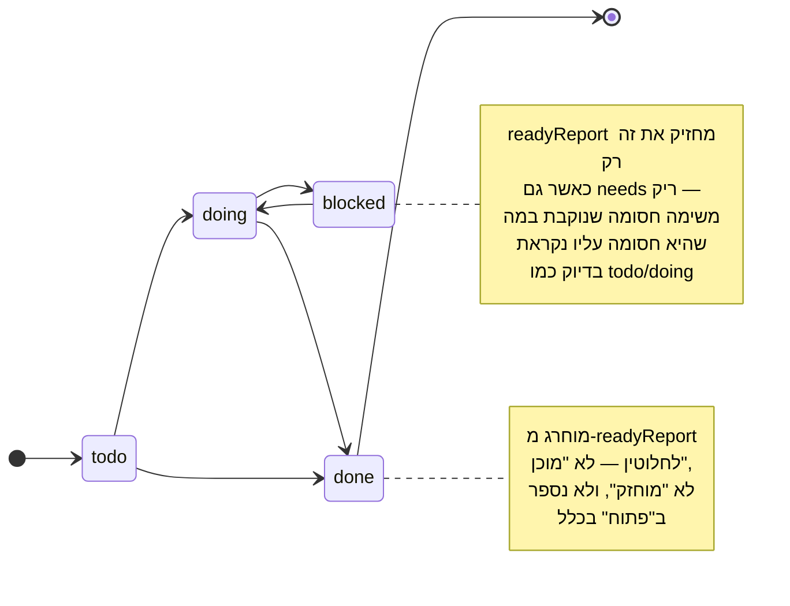
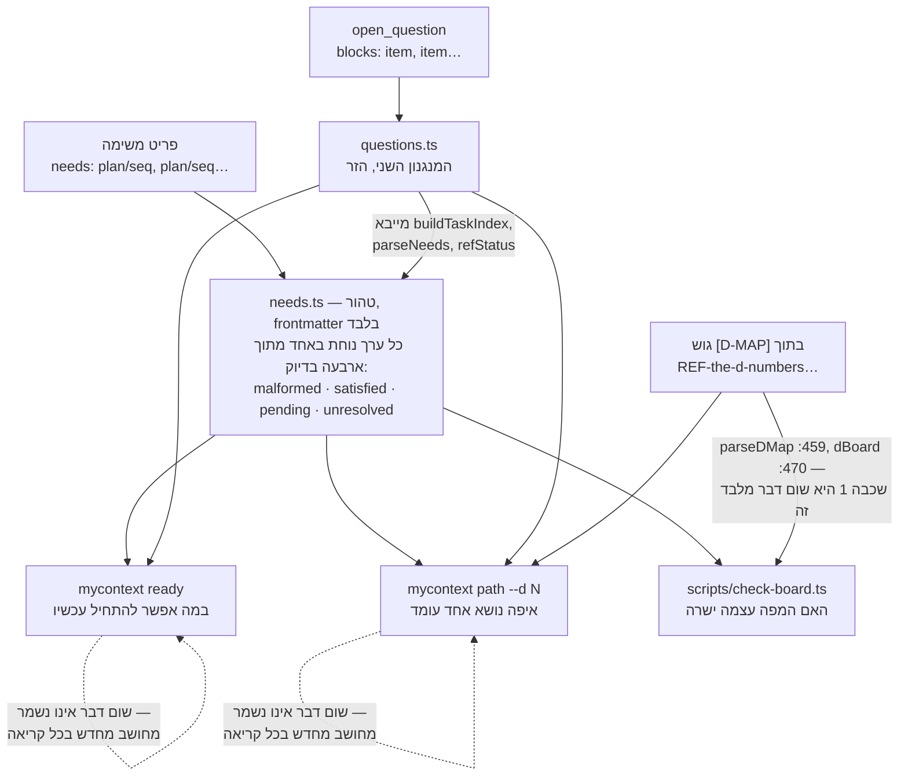

<!--
  Hebrew mirror of `docs/system/01-the-board.md`. The English document is the
  source of record; where the two disagree, the English one is right and this
  one is stale. Conventions, and the link policy, are stated once in
  `docs/system/00-index.he.md`'s own header comment and are not repeated here.

  Nothing in this file was re-measured. Every count, ratio and line number is
  carried across from the English chapter as it stands on 2026-09-17.
-->

# הלוח — איך נבחרת עבודה כאן

`docs/system/00-index.he.md` · סימוכין:
[`docs/capabilities/16-the-board.md`](../capabilities/16-the-board.md)

זו הגרסה העברית של [`docs/system/01-the-board.md`](./01-the-board.md). המסמך האנגלי הוא
המקור; במקרה של סתירה — האנגלית קובעת.

זה הפרק שהמצאי שסקר את כל הפרויקט הזה קרא לו הפער הגדול מכולם מבין 32 הנושאים שבחן — לא
מפני שהלוח גדול, אלא מפני שהוא הדבר האחד שמצטרף חדש חייב להבין *לפני שהוא עושה כאן עבודה
כלשהי*, ועד המעבר הזה לא היה קיים דבר מהצורה הנכונה: שני פריטי סימוכין בקורפוס, מצביע
ב-`CLAUDE.md` של המאגר, דוח נרטיבי, והערת כותרת בת 48 שורות בראש
קובץ מקור אחד.

`docs/capabilities/16-the-board.md`, שנכתב באותו מעבר תיקון שהתיקייה
הזאת שייכת אליו, נושא עכשיו את סימוכין הפקודות — כל דגל, פלט טרמינל אמיתי, השער הדו־שכבתי
המלא. הפרק הזה אינו חוזר על זה. הוא נושא את מה שסימוכין פקודות אינו יכול: למה הלוח נראה
כך, מה הוא החליף, והטיעון שמצטרף חדש זקוק לו לפני שהפקודות מתחילות להיות מובנות.

## 1. מה זה, ובמה קל להתבלבל איתו

**הלוח אינו קובץ. הוא שלושה חישובים קטנים, שרצים מחדש בכל פעם שמבקשים אותם.** אין "לוח"
שמור בשום מקום — אין `board.json`, אין אחוז התקדמות במטמון. שלושת
החישובים אינם קוראים אותו סוג קלט, וההבדל ראוי להיאמר במקום להיטשטש: `needs.ts` טהור
וקורא **frontmatter** (`needs`, `state`, `plan`, `seq`); `parseDMap`
קורא את ה**גוף** של פריט, כי הגוש `[D-MAP]` הוא נתונים מתוחמים
בתוך פרוזה ולא שדה (`parseDMap(body: string)`, `needs.ts:664`);
והשכבה השנייה של `scripts/check-board.ts` קוראת **git**, ויוצאת
החוצה עם `execFileSync` (`:225`, `:265`),
ולכן היא אינה טהורה ואינה קריאה של הקורפוס כלל. רק הראשון מבין השלושה הוא הפונקציה הטהורה
ש-§3 מתאר. אם השתמשתם בעבר בכלי לניהול פרויקטים, הדבר שאתם מדמיינים כששומעים "לוח" — מצב
שמור שאדם או בוט מעדכנים — הוא בדיוק הדבר שזה החליף, וכל העיצוב הוא תגובה נגדו.

שלושה דברים שמצטרף חדש מבלבל עם הלוח, וראוי להפריד אותם כבר בהתחלה:

- **הלוח אינו הקורפוס.** הקורפוס (`.my_context/items/`) הוא ידע
  נורמטיבי — כללים, החלטות, דרישות. הלוח הוא עדשה צרה מעליו: `workItems` מקבל רק קטגוריות
  שמצהירות על `plan`, `seq` *וגם*
  `state` ושהן מאופשרות (`isWorkCategory`,
  `needs.ts:151–159`), ובסט הקטגוריות שנשלח `task` היא היחידה שעושה זאת
  (`categories.ts:464`). כללים, החלטות, לקחים, דרישות וכל השאר
  בלתי־נראים ל-`needs.ts` לחלוטין. **קטגוריה אחת מגיעה לאותם דוחות בדלת שנייה**, וראוי
  לנקוב בה כאן כדי ש-§4 לא ייקרא כסתירה: `open_question` אינו פריט עבודה ולעולם אינו נכנס
  ל-`readyReport`, אבל `questions.ts` פותר את שדה ה-`blocks` שלו וגם `ready` וגם `path`
  מדפיסים את התוצאה. כך ש"רק משימות" נכון לגבי ה*חישוב* ולא לגבי ה*פלט*.
- **`needs` אינו `blocks`.** שני השדות קיימים והם מצביעים לכיוונים הפוכים בכוונה — ראו §3.
- **מספר D אינו משימה.** מספר D נוקב ב*נושא* — אשכול של משימות שקורא יכול להחזיק בראשו,
  כמו "דקדוק החיפוש" או "הפלטה". נושא גדול מכל פריט יחיד ומאריך ימים מהפריטים שבתוכו;
  אפשר להוסיף עבודה לנושא בלי למספר אותו מחדש. ראו §5.

`task` נושאת שני שדות שנראים שניהם כמו סטטוס ואינם אותו מנגנון. `needs` הוא שדה
ש*מחשבים מעליו* — שום דבר אינו מזיז אותו, `readyReport` פשוט קורא אותו (§3-§4).
`state` הוא השדה האחר, והוא סוג הפוך של דבר: ערך פשוט שנקבע ביד,
`todo | doing | blocked | done`
(`src/core/needs.ts`, ההערה בלולאת `readyReport` שמונה את כל
הארבעה), ושום דבר בבסיס הקוד הזה אינו מעביר אותו אוטומטית. אדם או סוכן מעביר משימה
ל-`blocked`; הלוח לעולם אינו מסיק "חסום" מהפניית `needs` שלא סופקה — זה `held`, סיווג
בזמן ה*קריאה*, לא כתיבה אל `state` (§4 למטה הוא הקריאה; זה השדה שהיא קוראת).

**`status: deprecated` הוא שדה שלישי ונפרד, והוא היציאה שאף אחד
מארבעת המצבים אינו יכול לבטא.** למשימה שננטשה לפני שנשלחה אין לאן ללכת בתרשים שלמעלה —
`done` היה טוען שהיא נחתה, והיא מעולם לא נחתה — ולכן הביטול נרשם על
`status`, על שמירה משלו בתוך `readyReport`. **הסדר הפוך מהניחוש
הטבעי, וראוי לנסח אותו במדויק:** הלולאה קוראת את `state` *קודם*
(`needs.ts:490`) ומשליכה את `done` כבר בשורה הבאה
(`:491`); השמירה על
`item.status === 'deprecated'` יושבת תשע־עשרה שורות למטה משם,
ב-**`:509`**. `status` נבדק **שני**, אחרי
שקיצור הדרך של `done` כבר פעל — שום דבר אינו מקצר דרך על
`status` לפני שנקרא `state`, ומשימה שהיא גם `done` וגם
`deprecated` יוצאת מהלולאה על `done` בלי שהשמירה על `deprecated` תראה אותה אי פעם.

השמירה הזאת גם צעירה מהלולאה שסביבה, וזו הסיבה שהסדר הוא מה שהוא ולא מה שמעצב היה בוחר:
היא נוספה ב-2026-09-06, אחרי שעובד קרא את המשימה המבוטלת של עצמו חזרה מתוך `ready` ואמר
זאת. `workItems` מסנן `superseded` בלבד, ולכן עד אותו יום שש משימות מבוטלות בקורפוס הזה
(`docsys/5`, `/6`, `/9`, `/10`, `walk/16`, `tuts/4`) הוצעו כעבודה
מוכנה, ותוכנית אחת שהחזיקה משימה אמיתית יחידה דיווחה "2 ready of 2 open". משימה יכולה
לשבת על `state: todo` ועל
`status: deprecated` בעת ובעונה אחת; התרשים מראה מה `state` לבדו
אומר, לא את כל מחזור החיים של הפריט שהוא חי עליו.

## 2. הבעיה שזה החליף, מסופרת כסיפור ולא כטבלה

לפני שכל זה התקיים, `reports/EXECUTION-BOARD.md` היה טבלת התקדמות
שתוחזקה ביד — אדם, או סוכן שעמד במקומו, עדכן קובץ Markdown בכל פעם שמשהו נשלח. הוא נגנז
ב-2026-09-07, והסיבה ראויה להיאמר במדויק כי היא הסיבה שכל המנגנון קיים: **לוח שמתוחזק ביד
והקורפוס שהוא מתאר הם שני עותקים של עובדה אחת, והעותק תמיד מנצח בוויכוח עד שמישהו בודק.**
אף אחד לא בודק בכל פעם. הקורפוס אמר דבר אחד, הלוח אמר דבר אחר, ולא הייתה שום דרך לדעת מי
מהם עדכני בלי לפתוח את שניהם.

המדידה שהפכה את הטיעון לבלתי־ניתן להכחשה נלקחה **עשרה ימים לפני שהלוח נגנז**,
ב-**2026-08-28** (`needs.ts:5`) — כלומר טענו בעד השדה בזמן שהלוח
עוד תוחזק ביד, וזו הדרך הרגילה של דברים כאלה: מתוך 425 פריטי משימה שאינם מוחלפים בקורפוס,
**אפס** נשאו משהו שמכונה יכולה לקרוא כתלות, חמישה ישבו על
`state: blocked` ואף לא אחד מאותם חמישה נקב במה שהוא חסום עליו.
סריקת ביטוי רגולרי אחרי תלות שנאמרת בפרוזה — מסוג המשפט שאדם כותב בלי לחשוב על זה, "חסום
עד שעבודת החיפוש תנחת" — התאימה ל-4 מתוך כ-28 אזכורים אמיתיים, ואחת מאותן ארבע נפתרה
ל-`the/45`, תוכנית שאינה קיימת, שנקצרה מאמצע משפט. סימון עם שיעור
פגיעה של 25% ועם חיובי־שגוי באותו מעבר אינו סימון. זה הטיעון בעד הפיכת "על מה זה ממתין"
לשדה frontmatter אמיתי במקום למשפט שקורא צריך לפענח בעין — וזו הסיבה ש-`needs` נבנה כפי
שנבנה, ולא כפי שמעקב תלויות בפרוזה נבנה בדרך כלל.

## 3. `needs` — ולמה החץ מצביע לכיוון שהוא מצביע

`src/core/needs.ts` מגדיר את `needs`, רשימה מופרדת בפסיקים של
הפניות `plan/seq`
(`needs: recall/2, walk/18`). הערת הכותרת בראש הקובץ הזה טובה
באופן חריג — 48 שורות, וראוי לקרוא אותה ישירות ולא דרך תקציר — אבל שלוש החלטות בתוכה
ראויות לשליפה החוצה כי כל אחת מהן נטענה מתוך כישלון מסוים שנמדד, לא מתוך טעם:

- **הכיוון הוא `needs`, לעולם לא `blocks`.** מי שכותב משימה יודע על מה המשימה שלו עצמו
  ממתינה. הוא כמעט לעולם אינו יודע מי, חודשים אחר כך, יהיה תלוי בה. `open_question`
  משתמש ב-`blocks` במקום — ובצדק, כי מי שמתייק *שאלה* באמת כן יודע מי תקוע בהמתנה
  לתשובה. `blocks` ניתן לגזירה מ-`needs` על ידי היפוך; `needs` אינו ניתן לגזירה משום דבר.
  השדה חי בצד שיכול למלא אותו ביושר, ולכן משימה ושאלה אינן חולקות שדה גם כשהשתיים מתארות
  דבר שממתין למשהו.
- **הפניה לא־פתורה היא לגיטימית, ונשארת לגיטימית.** תוכניות נכתבות לפני שכל משימה בתוכן
  קיימת. אילו ציטוט של משימה שטרם תויקה היה נדחה, השדה היה חסר תועלת בדיוק ברגע שבו הוא
  נחוץ ביותר — בזמן שתוכנית עוד נפרסת. ולכן `needs.ts` שומר שלוש שאלות נפרדות במקום
  לכווץ אותן להכרעה אחת: האם ההפניה תקינה בצורתה? האם משהו בקורפוס עונה לה (פתורה, או
  *הערה* בשם `unresolved` — לעולם לא שגיאה)? והאם מה שהיא נפתרת אליו באמת גמור (סופק מול
  ממתין)? יעד עם `status: deprecated` נחשב **סופק**, לפי הכרעת
  הבעלים — נפרע, לא ממתין, כך שתלוי אינו ממתין לנצח לעבודה שבוטלה רשמית.
- **המודול טהור.** אין קלט/פלט, אין שעון, אין גישה לסביבת העבודה — הקורא מוסר לו את
  הפריטים. זו אינה נוחות מימוש; זה מה שמאפשר לפונקציה אחת לענות על "האם גרף התלויות של
  הקורפוס הזה ישר" עבור `mycontext ready`,
  `mycontext path`, `mycontext doctor`
  ו-`scripts/check-board.ts` כאחד, כך שהתשובה אינה יכולה להיות
  שונה בשקט תלוי במי שאל.

## 4. שלוש עדשות מעל שדה אחד

**`mycontext ready`** עונה על "מה בר־שיגור עכשיו", על פני כל
הקורפוס, בלי לצמצם לנושא. **`mycontext path`** עונה על שאלה אחרת
ש-`ready` אינו יכול: "איפה עומד *הנושא האחד הזה*" — גמור/סך הכול, מוכן, מוחזק, ומדד רביעי
שאף פקודה אחרת אינה מחשבת, `YOURS` (§5).
**`scripts/check-board.ts`** אינו עונה על אף אחת מהן; הוא שואל אם
המפה ששתי הפקודות האחרות סומכות עליה אומרת בעצמה את האמת. כל השלוש קוראות את אותו מנגנון
`needs.ts` ואף אחת מהן אינה שומרת דבר במטמון — ראו
`docs/capabilities/16-the-board.md` עבור הדגלים המילוליים ופלט
הטרמינל האמיתי של כל אחת.

`questions.ts` מוסיף מנגנון שני ונפרד בכוונה לצד `needs`: פריט `open_question` יכול לשאת
`blocks`, שנוקב בעבודה הממתינה לתשובה שלו. הוא נבנה במיוחד מפני שלפני שהתקיים, החלטה
שהבעלים היה צריך לקבל ישבה בקורפוס בלי ששום דבר הציב אותה לפניו — היא הגיעה אליו רק
כשעוזר הזדמן לזכור להעלות אותה, וזה אינו שורד כיווץ (הכישלון המדויק
ש-`docs/capabilities/07-restore-and-handover.md` מתאר).

**המסנן אינו "יש לו שדה `blocks`", וההבדל הוא כל עיצוב האנטי־רעש.** שאלה *נרשמת* בשמה רק
כל עוד ה-`blocks` שלה נפתר לעבודה ש**עדיין פתוחה**; כל דבר פעיל אחר נספר ונקרא בשם לפי
סיבה, ו-`mycontext ready --questions` מפרט אותו
(`questions.ts:76–92`). זה מכסה שתי אוכלוסיות ולא אחת — שאלה
שאינה נוקבת בדבר, ושאלה שהעבודה שלה כבר נחתה.
`blocks: live/22` נשאר כתוב אחרי
ש-`live/22` נוחתת, ולכן "יש לו `blocks` לא ריק" לעולם לא היה שוקט
והרשימה הייתה יכולה רק לגדול; פתירת ההפניה שוקטת בריצה הבאה בלי שאף אחד יערוך דבר.
בקורפוס הזה היום (`mycontext ready`, 2026-09-17) זה נקרא: **שאלה 1
מפורטת, 8 נספרות — 4 נוקבות בעבודה שכבר גמורה, 4 אינן נוקבות בדבר שהן חוסמות.**

**ההפרדה אמיתית בקוד, והתלות רצה בכיוון ש-§3 חוזה** — וראוי לומר זאת כי הציור המתבקש שלה
הפוך. `needs.ts` לעולם אינו קורא `blocks` כלל: השדה מופיע שלוש פעמים בפרוזת הכותרת של
הקובץ ו**אפס** פעמים בקוד שלו. החץ רץ לכיוון השני, כאשר `questions.ts` מייבא את
`buildTaskIndex`, `parseNeeds` ו-`refStatus`
*מתוך* `needs.ts` (`questions.ts:137–139`). `ready.ts`
(`:2–9`) ו-`path.ts` (`:2–6`) מייבאים כל
אחד את שני המודולים בנפרד — `needs.ts` ראשון, `questions.ts` שני, בשני הקבצים —
ו-`path.ts` הוא המקום שבו `questionReport` מזין את עמודת
`YOURS` של §5. `scripts/check-board.ts`
אינו מייבא את `questions.ts` כלל, ולכן שום נתון של שאלות אינו מגיע לשער.

## 5. מספרי ה-D — נושא גדול ממשימה, ונקרא בשם פעם אחת

משימה בודדת היא יחידה קטנה מדי לתכנן סביבה, וקורפוס שלם גדול מדי. מספרי ה-D יושבים
באמצע: `REF-the-d-numbers-what-each-one-means-and-which-are-only`
הוא פריט סימוכין נעוץ שנושא גוש `[D-MAP]`, ומשפט הממשל של הפריט
עצמו ראוי לציטוט כי הוא כל העיצוב בשורה אחת, באותיות הגדולות של הפריט עצמו: **"AND A D
NUMBER NAMES A SUBJECT, not a fixed list of items - the D37 precedent, ruled 2026-09-08: a
subject may WIDEN, and widening is neither renumbering nor reuse."**
מספר D מוקצה פעם אחת, בפריט האחד הזה, ולעולם אינו מוקצה מחדש או ממוחזר — הכרזה עליו בכל
מקום אחר אינה הופכת אותו לאמיתי.

פענוח הגוש הזה היה פעם ביטוי רגולרי מעל פרוזה, והוא נמדד כשגוי פעמיים באותו יום —
**2026-09-16**, יום לפני שהפרק הזה נכתב (`check-board.ts:13–16`):
`D78` דווח כ**סגור** מפני שהטקסט של עצמו רק *ציטט* את משפט הסגירה
של `D57`, ו-`D57` דווח כ-`0/3` מפני שהביטוי
הרגולרי התאים לפריטי `anchors/` של אותו יום לפי שם בלבד, בלי שום
קשר לנושא שהוא ניקד. `parseDMap` של `needs.ts` קורא עכשיו את הגוש כ**נתונים מתוחמים**,
לעולם לא כפרוזה שנסרקת אחרי משמעות — התיקון לא היה ביטוי רגולרי חכם יותר, אלא סירוב לפענח
פרוזה כאילו הייתה מובנית מלכתחילה.

**עמודת `YOURS`** — השישית משבע העמודות של
`mycontext path` (`HEADERS` ב-`path.ts:90`
הוא `D · status · done · ready · held · yours · work`), והסיבה
שהפקודה קיימת — ראויה להדגשה בפני עצמה, כי היא עונה על משהו ששום פקודה אחרת בפרויקט הזה
אינה יכולה: איזו עבודה פתוחה ממתינה ל*בעלים במיוחד*, ברגע זה, נגזרת משתי עובדות שהקורפוס
כבר מחזיק (שורה של נושא שקוראת `held-by-owner`, או שאלה פתוחה
שנוקבת באותו נושא ב-`blocks` שלה) ולא משדה חדש שמישהו צריך לזכור להגדיר. כל דוח שקדם
לקיומו של `path` צייר את העבודה ההיא כפיגור פתוח רגיל — כלומר כל אחד מאותם דוחות הציע
לבעלים שוב ובשקט עבודה שהוא כבר החליט לדחות.

## 6. איך זה מתוחזק — השער הדו־שכבתי, ולמה רק שכבה אחת חוסמת

`scripts/check-board.ts`
(`npm run check:board`) הוא מה ששומר על הלוח ישר, מחובר ל-CI.
הכותרת שלו עצמו מנסחת את התקן בפשטות: *"the board is not true, and this is what keeps it
true."*

- **שכבה 1 — המפה עצמה חייבת להתפענח: חוסמת את הבנייה.** אף מספר D לא יחזור על עצמו, כל
  חבר חייב לנקוב בעבודה שהקורפוס באמת מחזיק, ו — זה שראוי לנקוב בו במפורש — אף פריט לא
  ייתבע על ידי שני נושאים בעת ובעונה אחת. תביעה כפולה היא מסוג השגיאות שאף אחד אינו תופס
  בעין: הסכומים של שתי השורות סופרים את אותו פריט, ולכן הסכומים מפסיקים להסתדר בזמן שכל
  שורה בנפרד עדיין נראית נכונה.
- **שכבה 2 — קומיט נקב בפריט פתוח ואף אחד לא סגר אותו: מדווח, לעולם לא חוסם.** הסיבה
  שהוא אינו יכול להיות שער קשיח אינה זהירות, היא יושרה לגבי מה ששורת נספח בקומיט יכולה
  ואינה יכולה להבטיח היום: קומיט ש*יוצר* פריט נוקב בו גם הוא, נחיתה חלקית לגיטימית,
  וקומיט של מסירה נוקב בצדק בכל מסלול חי. שום דבר היום אינו מאפשר לקומיט *להצהיר* איזה
  פריט הוא סוגר, כמו שהוא יכול להצהיר באילו קבצים נגע — זה החלק החסר ששער קשיח היה זקוק
  לו, והוא אינו קיים. פריט יכול להשתיק ממצא אחד בעצמו עם
  `NAMED-BUT-OPEN <sha> — <reason>` בגוף שלו, וההכרה הזאת פגה ברגע
  שקומיט *מאוחר יותר* נוקב באותו פריט שוב — ולכן אי אפשר להשתמש בה להשתקה קבועה של סחיפה,
  רק להסביר פער אחד מסוים שכבר מובן.

`npm run check:needs-cycles` הוא השער האחאי: הוא מסרב לגרף `needs`
שמכיל מעגל, דבר ששום דבר אחר כאן לא היה מבחין בו, מפני ש-`needs.ts` פותר הפניות אחת־אחת
ואין לו סיבה לזהות לולאה מעצמו.

## 7. מה ידוע שלא בסדר בזה

- **קומיט עדיין אינו יכול להצהיר איזה פריט הוא מסיים.** שכבה 2 שלמעלה היא דוח מפני שזה
  חסר, ולא מפני שדיווח הועדף לגופו.
- **תלות של משימה שנאמרת רק בפרוזה בלתי־נראית לכל שלוש הפקודות**, ו-`ready` אומר זאת
  בפסקת הסיום שלו בכל ריצה. זו אמירה על היושרה של הקורפוס, לא הבטחה על העבודה עצמה —
  `mycontext doctor` הוא מה שמסמן משימה על
  `state: blocked` שאינה נוקבת בשום דבר קריא־למכונה
  (`checks.ts`, `blocked_without_needs`
  ב-`:1589`). **היוצא מן הכלל היחיד הוא בצד השאלות ורץ לכיוון
  ההפוך**: ה-`blocks` של *שאלה* נקרא גם בפרוזה. `PROSE_REF`
  (`questions.ts:164`) מרים
  `plan:walk seq:89` מתוך משפט, והוא נוסף על סמך ראיה ולא מתוך
  ניקיון — נמדד ב-2026-09-11 שחמש שאלות פעילות נשאו `blocks` ורק אחת נכתבה כ-`live/22`.
  כך ש"פרוזה בלתי־נראית" נכון בדיוק לגבי `needs` ושקרי בדיוק לגבי `blocks`, וזו הפעם
  השנייה בפרק הזה ששני השדות אינם תמונת ראי זה של זה.
- **עמודת `YOURS` של `path` יודעת רק את מה שנאמר לקורפוס.** החלטה
  אמיתית שממתינה לבעלים ומעולם לא תויקה כ-`open_question` ושהנושא שלה מעולם לא סומן
  `held-by-owner` בלתי־נראית לה, בדיוק מאותה סיבה שהפניית `needs`
  שלא תויקה בלתי־נראית ל-`ready`.
- **"100% ניתן לסגירה" אינו מובטח בכוונה**, וכל ריצה של
  `mycontext path` אומרת זאת במשפט הסיום שלה: 100% פירושו שכל צעד
  שנותר הוא או בר־שיגור או נקוב כשל הבעלים — לעולם לא הבטחה שכל נושא נסגר, כי סגירת נושא
  היא שיפוט שאדם עושה, לא ספירה שפקודה יכולה להגיע אליה מעצמה.
- הריצו `mycontext ready --held` ו-`node
  scripts/check-board.ts` בעצמכם לפני שאתם מצטטים מספר כלשהו מהפרק הזה או מפרק 16
  — שניהם מחושבים מחדש מהקורפוס בכל קריאה, וכמה ספירות בפרק הסימוכין כבר זזו פעם אחת
  *בתוך היום שבו הוא נכתב*.

## 8. מפת הקוד

| קובץ | על מה הוא בעלים |
|---|---|
| `src/core/needs.ts` | מנגנון `needs`/`state`/`plan`/`seq`: פענוח, פתירה, `readyReport`, `parseDMap`, `dBoard`. טהור, בלי קלט/פלט. |
| `src/core/questions.ts` | המנגנון השני והזר: שדה ה-`blocks` של `open_question`, `questionReport`. |
| `src/cli/commands/ready.ts` | הפקודה `mycontext ready` — מה בר־שיגור על פני כל הקורפוס. |
| `src/cli/commands/path.ts` | הפקודה `mycontext path` — התקדמות לפי נושא ועמודת `YOURS`. החדשה מבין השלוש, נשלחה בתגובה לבקשה ישירה של הבעלים למסלול אמין לסגירת כל נושא פתוח. |
| `scripts/check-board.ts` | השער הדו־שכבתי שמתואר ב-§6, מחובר ל-CI. |
| `scripts/check-needs-cycles.ts` | השער האחאי שמסרב גרף `needs` מעגלי. |
| `REF-the-d-numbers-what-each-one-means-and-which-are-only` | פריט הקורפוס הנעוץ שמחזיק את גוש `[D-MAP]` עצמו — לא קוד מקור, אבל המקום האחד שבו מספר D אמיתי. |
| `REF-the-wave-map-what-order-the-work-is-being-done-in` | סימוכין קרוב לאופן שבו נושאים קובצו לגלי מסירה; אינו נקרא על ידי אף אחד מהקודים שלמעלה. |

## ראו גם

- [`docs/capabilities/16-the-board.md`](../capabilities/16-the-board.md) — סימוכין
  הפקודות המלא, כל דגל, פלט טרמינל אמיתי
- [`docs/capabilities/01-items-and-corpus.md`](../capabilities/01-items-and-corpus.md) —
  הקטגוריות `task`/`open_question` ושדה
  `state` שכל הפרק הזה קורא
- [`docs/capabilities/07-restore-and-handover.md`](../capabilities/07-restore-and-handover.md) —
  למה החלטה שהגיעה לבעלים רק בשיחה אינה שורדת כיווץ, סיבת הקיום של `questions.ts` עצמה
- `CLAUDE.md` בשורש המאגר — המצביע ששולח סשן לכאן במקום ללוח גנוז
  שתוחזק ביד

