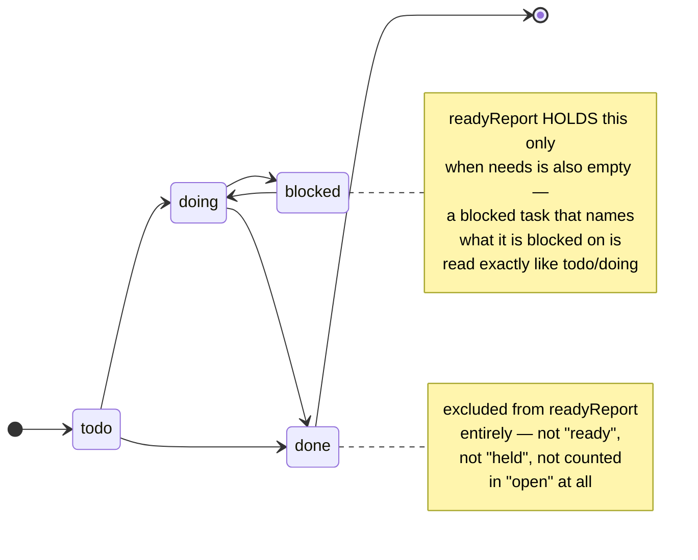
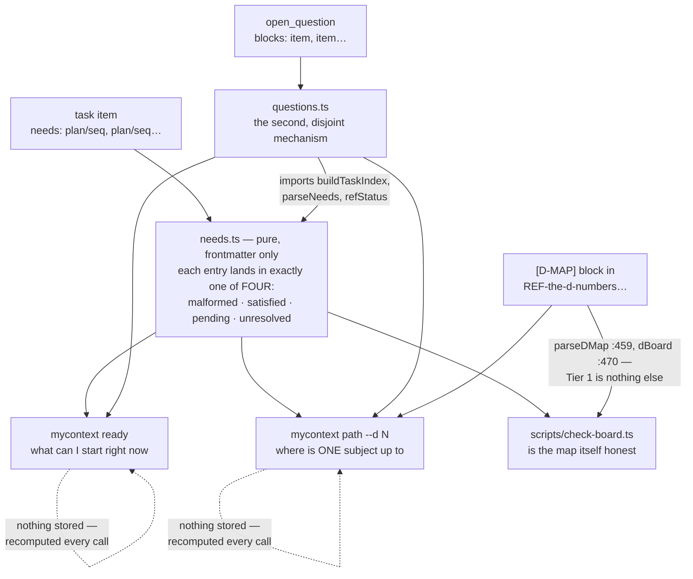

# The board — how work is chosen here

`docs/system/00-index.md` · reference: [`docs/capabilities/16-the-board.md`](../capabilities/16-the-board.md)

This is the chapter the inventory that surveyed this whole project called the biggest gap of all
32 subjects it looked at — not because the board is large, but because it is the one thing a
newcomer has to understand *before doing any work here at all*, and until this pass nothing of the
right shape existed: two corpus reference items, a pointer in the repository's `CLAUDE.md`, a
narrative report, and a 48-line header comment at the top of one source file.

`docs/capabilities/16-the-board.md`, written in the same repair pass this directory belongs to,
now carries the command reference — every flag, real terminal output, the full two-tier gate. This
chapter does not repeat that. It carries the part a command reference cannot: why the board looks
like this, what it replaced, and the argument a newcomer needs before the commands make sense.

## 1. What it is, and what it is easy to confuse it with

**The board is not a file. It is three small computations, run fresh every time they are asked
for.** There is no stored "board" anywhere — no `board.json`, no cached progress percentage. The
three do not read the same kind of input, and the difference is worth stating rather than
flattening: `needs.ts` is pure and reads **frontmatter** (`needs`, `state`, `plan`, `seq`);
`parseDMap` reads an item's **body**, because the `[D-MAP]` block is delimited data inside prose
rather than a field (`parseDMap(body: string)`, `needs.ts:664`); and `scripts/check-board.ts`'s
second tier reads **git**, shelling out with `execFileSync` (`:225`, `:265`), so it is neither pure
nor a read of the corpus at all. Only the first of the three is the pure function §3 describes.
If you have used a project-management tool before,
the thing you are picturing when you hear "board" — a persisted state that a person or a bot
updates — is precisely the thing this replaced, and the whole design is a reaction against it.

Three things a newcomer conflates with the board, worth separating up front:

- **The board is not the corpus.** The corpus (`.my_context/items/`) is normative knowledge —
  rules, decisions, requirements. The board is a narrow lens over it: `workItems` admits only
  categories that declare `plan`, `seq` *and* `state` and are enabled (`isWorkCategory`,
  `needs.ts:151–159`), and on the shipped category set `task` is the only one that does
  (`categories.ts:464`). Rules, decisions, lessons, requirements and the rest are invisible to
  `needs.ts` entirely. **One category reaches the same reports by a second door**, and it is worth
  naming here so §4 does not read as a contradiction: `open_question` is not a work item and never
  enters `readyReport`, but `questions.ts` resolves its `blocks` field and both `ready` and `path`
  print the result. So "only tasks" is true of the *computation* and not of the *output*.
- **`needs` is not `blocks`.** Both fields exist and they point opposite directions on purpose —
  see §3.
- **A D-number is not a task.** A D-number names a *subject* — a cluster of tasks a reader can hold
  in their head, like "the search grammar" or "the palette." A subject is bigger than any one item
  and outlives the items inside it; new work can be added to a subject without renumbering it. See
  §5.

`task` carries two fields that both look like status and are not the same mechanism. `needs` is
*computed over* — nothing moves it, `readyReport` just reads it (§3-§4). `state` is the other one,
and it is the opposite kind of thing: a plain hand-set value, `todo | doing | blocked | done`
(`src/core/needs.ts`, the comment at the `readyReport` loop that enumerates all four), and nothing
in this codebase transitions it automatically. A person or an agent moves a task to `blocked`; the
board never infers "blocked" from an unmet `needs` reference — that is `held`, a *read-time*
classification, not a write to `state` (§4 below is the read; this is the field it reads).

**`status: deprecated` is a different field again, and it is the exit none of the four states can
express.** A task abandoned before it shipped has nowhere to go in the diagram above — `done` would
claim it landed, and it never did — so cancellation is recorded on `status`, on a guard of its own
inside `readyReport`. **The order is the opposite of the natural guess, and worth stating exactly:**
the loop reads `state` *first* (`needs.ts:490`) and drops `done` on the very next line (`:491`); the
`item.status === 'deprecated'` guard sits nineteen lines further down, at **`:509`**. `status` is
checked **second**, after the `done` short-circuit has already fired — nothing short-circuits on
`status` before `state` is read, and a task that is both `done` and `deprecated` leaves the loop on
`done` without the `deprecated` guard ever seeing it.

That guard is also younger than the loop around it, which is why the order is what it is rather than
what a designer would have chosen: it was added on 2026-09-06, after a worker read its own cancelled
task back out of `ready` and said so. `workItems` filters `superseded` alone, so until that day six
deprecated tasks on this corpus (`docsys/5`, `/6`, `/9`, `/10`, `walk/16`, `tuts/4`) were being
offered as ready work, and one plan holding a single real task reported "2 ready of 2 open". A task
can sit at `state: todo` and `status: deprecated` at once; the diagram shows what `state` alone
means, not the whole lifecycle of the item it lives on.

## 2. The problem this replaced, told as a story rather than a table

Before any of this existed, `reports/EXECUTION-BOARD.md` was a hand-maintained progress table — a
person, or an agent standing in for one, updated a Markdown file every time something shipped. It
was retired on 2026-09-07, and the reason is worth stating precisely because it is the reason the
whole mechanism exists: **a hand-kept board and the corpus it describes are two copies of one
fact, and the copy always wins the argument until somebody checks.** Nobody checks every time. The
corpus said one thing, the board said another, and there was no way to know which was current
without opening both.

The measurement that made the case undeniable was taken **ten days before the board was retired**,
on **2026-08-28** (`needs.ts:5`) — the field was already being argued for while the board was still
being kept by hand, which is the ordinary way of it: of 425 non-superseded task items in the
corpus, **zero** carried anything a machine could read as a dependency, five sat at
`state: blocked` and not one of those five named what it was blocked on. A regex sweep for a
dependency stated in prose — the kind of sentence a person writes without thinking about it,
"blocked on the search work landing first" — matched 4 of roughly 28 real mentions, and one of
those four resolved to `the/45`, a plan that does not exist, harvested out of the middle of a
sentence. A notation with a 25% hit rate and a false positive in the same
pass is not a notation. That is the argument for turning "what this waits on" into a real
frontmatter field rather than a sentence a reader has to parse by eye — and it is why `needs` was
built the way it was, not the way prose dependency-tracking usually is.

## 3. `needs` — and why the arrow points the way it does

`src/core/needs.ts` defines `needs`, a comma-separated list of `plan/seq` references
(`needs: recall/2, walk/18`). The header comment at the top of that file is unusually good — 48
lines, and worth reading directly rather than through a summary — but three decisions inside it
are worth pulling out because each was argued from a specific measured failure, not from taste:

- **The direction is `needs`, never `blocks`.** The author of a task knows what their own task is
  waiting for. They almost never know who, months later, will depend on it. `open_question` uses
  `blocks` instead — correctly, because whoever files a *question* genuinely does know who is
  stuck on the answer. `blocks` is derivable from `needs` by inversion; `needs` is derivable from
  nothing. The field lives on the side that can be filled in honestly, which is why a task and a
  question do not share a field even though both describe a thing waiting on something else.
- **An unresolved reference is legitimate, and stays legitimate.** Plans are written before every
  task inside them exists. If citing a not-yet-filed task were refused, the field would be useless
  at exactly the moment it is most needed — while a plan is still being laid out. So `needs.ts`
  keeps three questions separate rather than collapsing them into one verdict: is the reference
  well-shaped? does anything in the corpus answer to it (resolved, or a *note* called
  `unresolved` — never an error)? and is what it resolves to actually done (satisfied vs.
  pending)? A `status: deprecated` target counts as **satisfied**, by owner ruling — discharged,
  not pending, so a dependent does not wait forever on work that was formally cancelled.
- **The module is pure.** No I/O, no clock, no workspace access — the caller hands it the items.
  That is not an implementation nicety; it is what lets one function answer "is this corpus's
  dependency graph honest" for `mycontext ready`, `mycontext path`, `mycontext doctor`, and
  `scripts/check-board.ts` alike, so the answer cannot quietly differ depending on which command
  asked.

## 4. Three lenses over one field

**`mycontext ready`** answers "what is dispatchable right now," across the whole corpus, with
nothing narrowed to a subject. **`mycontext path`** answers a different question `ready` cannot:
"where is *this one subject* up to" — done/total, ready, held, and a fourth measure no other command
computes, `YOURS` (§5). **`scripts/check-board.ts`** answers neither; it asks whether the map the
other two commands trust is itself telling the truth. All three read the same `needs.ts` machinery
and none of them cache anything — see `docs/capabilities/16-the-board.md` for the literal flags and real
terminal output of each.

`questions.ts` adds a second, deliberately separate mechanism alongside `needs`: an `open_question`
item can carry `blocks`, naming the work waiting on its answer. It was built specifically because,
before it existed, a decision the owner needed to make sat in the corpus with nothing putting it in
front of him — it reached him only when an assistant happened to remember to raise it, which does
not survive a compaction (the exact failure `docs/capabilities/07-restore-and-handover.md`
describes).

**The filter is not "has a `blocks` field", and the difference is the whole anti-noise design.**
A question is *listed* by name only while its `blocks` resolves to work that is **still open**;
everything else active is counted and named by reason, and `mycontext ready --questions` lists it
(`questions.ts:76–92`). That covers two populations, not one — a question naming nothing, and a
question whose work has since landed. `blocks: live/22` stays written after `live/22` lands, so
"has a non-empty `blocks`" would never fall quiet and the list could only grow; resolving the
reference falls quiet on the next run with nobody editing anything. On this corpus today
(`mycontext ready`, 2026-09-17) that reads: **1 question listed, 8 counted — 4 naming work that is
already done, 4 naming nothing they block.**

**The separation is real in the code, and the dependency runs the direction §3 predicts** — which is
worth stating because the obvious drawing of it is backwards. `needs.ts` never reads `blocks` at
all: the field appears three times in that file's header prose and **zero** times in its code. The
arrow runs the other way, with `questions.ts` importing `buildTaskIndex`, `parseNeeds` and
`refStatus` *from* `needs.ts` (`questions.ts:137–139`). `ready.ts` (`:2–9`) and `path.ts` (`:2–6`)
each import the two modules independently — `needs.ts` first, `questions.ts` second, in both files —
and `path.ts` is where `questionReport` feeds the `YOURS`
column of §5. `scripts/check-board.ts` does not import `questions.ts` at all, so no question data
ever reaches the gate.

## 5. The D-numbers — a subject is bigger than a task, and named once

A single task is too small a unit to plan around, and a whole corpus is too large. The D-numbers
sit between: `REF-the-d-numbers-what-each-one-means-and-which-are-only` is a pinned reference item
carrying a `[D-MAP]` block, and the item's own governing sentence is worth quoting because it is
the whole design in one line, in the item's own capitals: **"AND A D NUMBER NAMES A SUBJECT, not a
fixed list of items - the D37 precedent, ruled 2026-09-08: a subject may WIDEN, and widening is
neither renumbering nor reuse."**
A D number is assigned once, in this one item, and never reassigned or reused — announcing one anywhere else does not make it real.

Parsing that block used to be a regex over prose, and it was measured wrong twice on one day —
**2026-09-16**, the day before this chapter was written (`check-board.ts:13–16`): `D78` was
reported **closed** because its own text merely *quoted* `D57`'s closure sentence, and `D57` was
reported `0/3` because the regex matched that day's `anchors/` items by name alone, with no
relation to the subject it was scoring. `needs.ts`'s `parseDMap` now
reads the block as **delimited data**, never as prose scanned for meaning — the fix was not a
smarter regex, it was refusing to parse prose as if it were structured at all.

**The `YOURS` column** — the sixth of `mycontext path`'s seven columns (`HEADERS` at `path.ts:90` is
`D · status · done · ready · held · yours · work`), and the reason the command exists — is
worth calling out on its own, because it answers something no other command in this project can:
which open work is waiting on the *owner specifically*, right now, derived from two facts the
corpus already holds (a subject's own row reading `held-by-owner`, or an open question naming that
subject in its `blocks`) rather than a new field anyone has to remember to set. Every report before
`path` existed drew that work as ordinary open backlog — which meant every one of those reports was
quietly re-offering the owner work he had already decided to defer.

## 6. How it is maintained — the two-tier gate, and why only one tier gates

`scripts/check-board.ts` (`npm run check:board`) is what keeps the board honest, wired into CI. Its
own header states the standard plainly: *"the board is not true, and this is what keeps it true."*

- **Tier 1 — the map itself must parse: gates the build.** No D number may repeat, every member
  must name work the corpus actually holds, and — the one worth naming specifically — no item may
  be claimed by two subjects at once. A double claim is the kind of error nobody catches by eye:
  both rows' totals count the same item, so the totals stop adding up while every individual row
  still looks correct in isolation.
- **Tier 2 — a commit named an open item and nobody closed it: reported, never gated.** The reason
  it cannot be a hard gate is not caution, it is honesty about what a commit trailer can and cannot
  promise today: a commit that *creates* an item names it too, a partial landing is legitimate, and
  a handover commit legitimately names every live lane. Nothing today lets a commit *declare* which
  item it closes the way it can declare which files it touched — that is the missing piece a hard
  gate would need, and it does not exist yet. An item can self-silence one finding with
  `NAMED-BUT-OPEN <sha> — <reason>` in its own body, and that acknowledgement expires the moment a
  *later* commit names the same item again — so it cannot be used to permanently suppress drift, only
  to explain one specific, already-understood gap.

`npm run check:needs-cycles` is the sibling gate: it refuses a `needs` graph containing a cycle,
which nothing else here would notice, because `needs.ts` resolves references one at a time and has
no reason to detect a loop on its own.

## 7. What is known wrong with it

- **A commit still cannot declare which item it finishes.** Tier 2 above is a report because this
  is missing, not because reporting was preferred on its own merits.
- **A task's dependency stated only in prose is invisible to all three commands**, and `ready`
  says so in its own closing paragraph on every run. This is a statement about the corpus's
  honesty, not a promise about the underlying work — `mycontext doctor` is what flags a
  `state: blocked` task that names nothing machine-readable (`checks.ts`, `blocked_without_needs`
  at `:1589`). **The one exception is on the question side and runs the other way**: a *question*'s
  `blocks` is read in prose too. `PROSE_REF` (`questions.ts:164`) lifts `plan:walk seq:89` out of a
  sentence, added on evidence rather than tidiness — measured 2026-09-11, five active questions
  carried a `blocks` and only one was written as `live/22`. So "prose is invisible" is exactly true
  of `needs` and exactly false of `blocks`, which is the second time in this chapter the two fields
  are not mirror images of each other.
- **`path`'s `YOURS` column only knows what the corpus was told.** A real decision waiting on the
  owner that was never filed as an `open_question` and whose subject was never marked
  `held-by-owner` is invisible to it, for exactly the reason an un-filed `needs` reference is
  invisible to `ready`.
- **"100% closable" is deliberately not promised**, and every run of `mycontext path` says so in
  its own closing sentence: 100% means every remaining step is either dispatchable or named as the
  owner's — never a promise that every subject closes, because closing one is a judgement a person
  makes, not a count a command can reach on its own.
- Run `mycontext ready --held` and `node scripts/check-board.ts` yourself before citing any number
  from this chapter or from chapter 16 — both are recomputed from the corpus on every call, and
  several counts in the reference chapter already moved once *within the day it was written*.

## 8. Code map

| File | What it owns |
|---|---|
| `src/core/needs.ts` | The `needs`/`state`/`plan`/`seq` machinery: parsing, resolution, `readyReport`, `parseDMap`, `dBoard`. Pure, no I/O. |
| `src/core/questions.ts` | The second, disjoint mechanism: `open_question`'s `blocks` field, `questionReport`. |
| `src/cli/commands/ready.ts` | The `mycontext ready` command — what's dispatchable across the whole corpus. |
| `src/cli/commands/path.ts` | The `mycontext path` command — per-subject progress and the `YOURS` column. Newest of the three, shipped in response to a direct owner request for a reliable path to closing every open subject. |
| `scripts/check-board.ts` | The two-tier gate described in §6, wired into CI. |
| `scripts/check-needs-cycles.ts` | The sibling gate refusing a cyclic `needs` graph. |
| `REF-the-d-numbers-what-each-one-means-and-which-are-only` | The pinned corpus item holding the `[D-MAP]` block itself — not source code, but the one place a D number is real. |
| `REF-the-wave-map-what-order-the-work-is-being-done-in` | A related reference for how subjects were grouped into delivery waves; not read by any of the code above. |

## See also

- [`docs/capabilities/16-the-board.md`](../capabilities/16-the-board.md) — the full command
  reference, every flag, real terminal output
- [`docs/capabilities/01-items-and-corpus.md`](../capabilities/01-items-and-corpus.md) — the
  `task`/`open_question` categories and the `state` field this whole chapter reads
- [`docs/capabilities/07-restore-and-handover.md`](../capabilities/07-restore-and-handover.md) —
  why a decision that only ever reached the owner in conversation does not survive a compaction,
  `questions.ts`'s own reason to exist
- `CLAUDE.md` at the repository root — the pointer that sends a session here instead of to a
  retired hand-kept board
