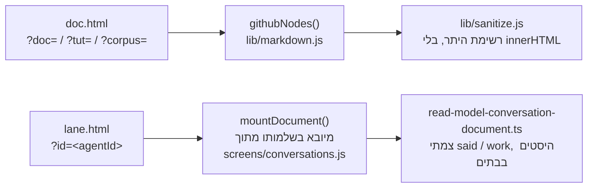
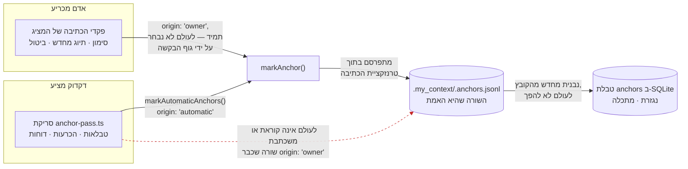
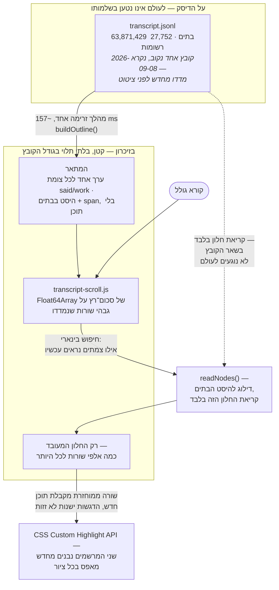

<!--
  Hebrew mirror of `docs/system/02-the-document-and-lane-viewer.md`. The English
  document is the source of record; where the two disagree, the English one is
  right and this one is stale. Conventions, and the link policy, are stated once
  in `docs/system/00-index.he.md`'s own header comment.

  `lane` is rendered `סוכן עזר` throughout, which is not a coinage: it is the
  word the product's own Hebrew uses for the same thing (`strings/he.js`,
  `conv.lane` and its neighbours). The identifiers `lane.js`, `lane.html` and
  `?id=` stay as they are.

  Nothing in this file was re-measured. Every count, ratio, byte figure and line
  number is carried across from the English chapter as it stands on 2026-09-17.
-->

# מציג המסמכים וסוכני העזר

`docs/system/00-index.he.md`

זו הגרסה העברית של
[`docs/system/02-the-document-and-lane-viewer.md`](./02-the-document-and-lane-viewer.md).
המסמך האנגלי הוא המקור; במקרה של סתירה — האנגלית קובעת.

זו התנהגות דפדפן טהורה, וזה הנושא שמפת המנגנונים שהזינה את המעבר הזה קראה לו הקשה ביותר
לכתיבה כנה מתוך המקור לבדו: שום דבר בו אינו קריא מהקוד בלי לפתוח גם דפדפן ולנהוג בו.
הפרק הזה נכתב מתוך המקור — הכותרות, מודל הקריאה, מתאם הקיפול — כי זה מה שמעבר תיעוד יכול
לאמת מול העץ; הוא אינו תחליף לפתיחת הדפים ולקריאת תמליל אמיתי דרכם.

## 1. מה זה, ובמה מתבלבלים איתו

שני דפים קוראים דבר אחד — מסמך מעובד — וקל לבלבל ביניהם לבין שני דברים שהם אינם:

- **זה אינו מסך רשימת השיחות.** הרשימה (תצוגת הרשימה של
  `screens/conversations.js`) מראה *אילו* תמלילים קיימים ומאפשרת
  לחפש בהם. המציג (הפרק הזה) מראה תמליל *אחד*, או מסמך אחד של המאגר או של הקורפוס,
  כקריאה אחת שאפשר לגלול בה.
- **`doc.html` ו-`lane.html` אינם שני מימושים
  של אותו דבר בלבוש שונה.** הם מעבדים דרך שני צינורות שונים באמת, לשני סוגי תוכן שונים
  באמת — ראו §2 — והתייחסות אליהם כאל ברי־החלפה היא בדיוק הטעות שהעיצוב של
  `lane.html` נבנה כדי לסרב לה (§3).
- **חלונית החיפוש כאן אינה חיפוש ה-FTS5 של הארכיון, והן גם אינן חולקות את המתאם** — טענה
  שטיוטות קודמות של הפרק הזה טענו לשני הכיוונים ואף אחד מהם לא היה נכון.
  `lib/fold.js` מיובא על ידי שני דברים בדיוק: הדפדפן
  (`screens/conversations.js:64`)
  ו-`src/core/conversation-search.ts`, שעושה
  `await import()` לקובץ הדפדפן ב-`:1384–1385`
  כדי ש**הספירה** של השרת ו**ההדגשות** של הדפדפן לא יוכלו לחלוק על מהי התאמה. אבל הצרכן
  היחיד של `findQuery` בצד השרת הוא `findInDocument` (`:1588`) —
  חיפוש *בתוך תמליל אחד*. `searchArchiveTiered` (`:1174`), שהוא
  חיפוש הארכיון, לעולם אינו קורא לו ומתאים ב-FTS5 במקום. כך ששני המשטחים חולקים **אוצר
  מילים** (ביטוי, סמיכות, מילה שלמה) ויושבים במודול אחד, ואינם חולקים **שום מתאם**.
  `docs/capabilities/04-conversation-archive.md`
  ו-`docs/capabilities/14-search-over-the-archive.md` מכסים את צד
  ה-FTS5.

## 2. שני דפי כניסה, ולמה הם אינם אותו מעבד

`doc.js` (419 שורות, נמדד 2026-09-17) מעבד מסמך של המאגר, מדריך או
פריט קורפוס — Markdown, בהתאמה ל-GitHub — דרך `githubNodes` שב-`lib/markdown.js`.
הוא מכותב לפי מחרוזת שאילתה, בכוונה, בשלוש צורות: `?doc=`,
`?tut=` ו-`?corpus=`, ולכל אחת כלל משלה
לפתירת קישור יחסי, מפני ששלושת סוגי הכתובת מתכוונים לדברים שונים ב"התיקייה המכילה": מזהה
מסמך הוא יחסי־למאגר, מזהה מדריך הוא מפתח למניפסט שאינו עצמו נתיב, ומזהה קובץ־קורפוס הוא
יחסי־לסביבת־העבודה. כל בלבול בין שניים מהשלושה פותח בשקט את הקובץ הלא נכון — וזו בדיוק
הסיבה שהדף מחזיק שלושה כללים נפרדים (`baseDirFor`) ולא אחד שבמקרה עובד למקרה הנפוץ.

`lane.js` (323 שורות) הוא דבר אחר לגמרי: **חלון סוכן העזר החשוף**,
תמליל אחד של סוכן־משנה בלשונית בלי מסגרת, בלי פס צד, בלי כותרת, בלי מעטפת אפליקציה סביבו
— הכרעת בעלים מ-2026-09-09, מצוטטת ישירות בכותרת הקובץ עצמו: *"what i meant is to only see
the viewer with the transcript in it as a single window without all the app arround it."*
(שגיאת הכתיב היא של הבעלים, וציטוט ישיר אינו המקום לתקן אחת כזאת.) הוא מעבד דרך
`mountDocument`, **מיובא בשלמותו מ-`screens/conversations.js`**
ולא ממומש מחדש — ההערה של הקובץ עצמו מפורשת בכך שמימוש שני של הגלילה המווירטואלת היה דבר
שני לשמור על נכונותו. **והוא נוקב בסכנה בכיוון ההפוך מזה שקורא מצפה לו: זו בדיוק המלכודת
ש-`/doc.html` _פורס_, לא כזאת שהוא נמנע ממנה**
(`lane.js:55–58`). `doc.html` מריץ בצדק
מעבד משלו — הוא מצויר על ידי `githubNodes` מפני שהוא מצייר פרוזה — והתקדים הלגיטימי הזה
הוא בדיוק מה שגורם למעבד שני כאן להיראות סביר באותה מידה כשהוא אינו: תוכן של סוכן עזר
מצויר על ידי `markdownNodes`, הצינור שמסך השיחות כבר בעליו. התשובה של חלון סוכן העזר היא
לייבא את המעבד ההוא בשלמותו ולא ללכת אחרי התקדים.

שני הדפים עושים את אותה עסקת אישורים: בלי nonce, בלי מסירה — עוגיית
`mycontext_token` היא `Path=/`,
`HttpOnly`, `SameSite=Strict`, ו-fetch
מאותו מקור מלשונית שנפתחה בלחיצה על קישור נושא אותה אוטומטית.
`doc.js` מציין שזה אומת מול שרת רץ ולא הונח
(`GET /api/doc` עם העוגייה בלבד עונה 200), והכותרת של
`lane.js` אומרת במפורש שהוא רץ על אותה עסקה בדיוק.

## 3. באג שראוי לקרוא כתבנית, לא רק כתיקון

עד השבוע הזה, הכותרת של `lane.js` עצמו טענה שהוא מוסר למציג בדיוק
ארבע פונקציות על `ctx` ושזה "everything `mountDocument` and its subtree reach for, measured
over the file." המדידה הזאת הייתה שגויה. `mountDocument` מצייר ארבע פקדי כתיבה של עוגנים,
וכל אחד מהם קורא ל-`ctx.post` — שחלון סוכן העזר לא סיפק. **כל כתיבת עוגן בתוך חלון סוכן
עזר זרקה שגיאה במשך כשבוע.**

**כמה גדול זה היה היא שאלה שהארכיון אינו יכול לענות עליה, והמספר שנראה כמו תשובה אינו
אחת.** נספר מחדש מתוך `.my_context/.anchors.jsonl` ב-**2026-09-17**:
**757 מתוך 1,409** סימונים נושאים מזהה של סוכן עזר — 53.7%, מול
740 מתוך 1,383 מוקדם יותר באותו יום
ו-704 מתוך 1,310 ב-2026-09-16, שזה אותו יחס שלוש פעמים וזוג מספרים
שונה בכל פעם. אבל השורות האלה הן כמעט כולן של הסריקה האוטומטית: הקובץ מחזיק בדיוק שורה
**אחת** עם `origin: 'owner'` מול **1,408** עם
`origin: 'automatic'`. הבאג שבר את נתיב הכתיבה של ה*בעלים*, ולכן
האוכלוסייה שהוא היה יכול לגעת בה היא הסימונים שאדם עושה ביד, ומהם יש אחד בכל הקובץ.
האמירה הכנה על הנזק היא המנגנון ולא הספירה: ארבעה פקדי כתיבה בחלון סוכן עזר זרקו שגיאה
בכל לחיצה, במשך כשבוע, בלי ששום דבר דיווח על כך.

התיקון הוסיף את **`post`** — החמישית מתוך חמש הפונקציות שחלון סוכן עזר מוסר עכשיו
(`t`, `tFlat`, `api`, `post`, `navigate`, `lane.js:33`). `postJson`
הוא עוזר `fetch` מקומי־למודול (`lane.js:171`) ש-`post` מאציל אליו
(`:210`); הוא מעולם לא היה חבר בסט המסירה, וטיוטה קודמת של הפרק
הזה נקבה בו כדבר שנוסף לרשימה שהוא אינו מופיע בה. **והכותרת שגויה באחד שוב, בכיוון
הקטן**: היא קוראת לאובייקט *"the five-field `ctx`"*, אבל הליטרל
ב-`lane.js:208–213` נושא שישה חברים — חמש הפונקציות ועוד
`get lang()`. חמש *פונקציות* נכון, חמישה *שדות* לא, והמשפט ראוי
להישאר גלוי ולא להתעגל, מפני שהפסקה שהוא יושב בה עוסקת בהערת תיעוד שספרה את החברים של
עצמה לא נכון והאמינו לה. התיקון גם — והחלק הזה ראוי להדגשה — **מדד, חי, שבקשת POST עם
עוגייה בלבד מתקבלת על ידי השרת הרץ**, במקום לסמוך על צורת הטענה הקודמת בפעם שנייה.
הכותרת של הקובץ עצמו מתעדת את התיקון הזה במקום, ולא משכתבת בשקט את הטענה הישנה ומעלימה
אותה: טענה שסט הוא שלם היא טענה שקורא יפעל לפיה, ולפי זאת פעלו שבוע לפני שמישהו מדד. זו
התבנית שראוי להכליל מהבאג הזה, לא התיקון עצמו: **הערת תיעוד שמכריזה על שלמות היא טענה,
והיסטוריית הכישלונות של הפרויקט הזה אומרת שצריך לבדוק אותה, לא לסמוך עליה.**

**למה הכתיבה ההיא מגיעה בפועל, וגבול הבעלות ששומר עליה בטוחה.** הבאג היה ב*פקד* — למנגנון
העוגנים שהוא שולט בו יש צורה שראויה לציור בפני עצמה, מפני שאלה שני כותבים שחולקים קובץ
אחד עם כלל על מי רשאי לגעת במה. `anchor-pass.ts` הוא דקדוק שמציע:
סריקת רקע מעל הטבלאות, ההכרעות והדוחות של הארכיון, שכותבת שורות עם
`origin: 'automatic'`. פקדי הכתיבה של המציג עצמו
(`src/ui/anchor-write.ts` — הנתיבים שהבאג שלמעלה היה בהם) הם הדרך
שבה אדם מכריע: `mark`, `relabel`, `drop`, תמיד
`origin: 'owner'`. שני הנתיבים מתכנסים לאותה פונקציה, `markAnchor`
(`src/core/anchors.ts`), שמפרסמת את
`.my_context/.anchors.jsonl` — **הקובץ, לא טבלת ה-SQLite, הוא
האמת** — בתוך טרנזקציית הכתיבה, והטבלה נבנית מחדש מהקובץ אחר כך, לעולם לא להפך.

הקשת המקווקוות היא הגבול: ברגע שאדם מתייג ממצא אוטומטי מחדש, ה-`origin` שלו מתהפך
ל-`'owner'` לצמיתות והסריקה מפסיקה לגעת בו בכל ריצה מאוחרת יותר — תווית שמישהו הקליד
לעולם אינה נדרסת בשקט על ידי הדקדוק של מחר.
`docs/capabilities/05-anchors.md` הוא הסימוכין המלא לכל נתיב וכל
פועל CLI שהתרשים הזה מכווץ.

## 4. מודל הקריאה — הפיכת 27,752 רשומות למשהו שאדם יכול לקרוא

`read-model-conversation-document.ts` (2,883 שורות) קיים בגלל מסך
כושל אחד ומאוד מוחשי: גרסה קודמת של מסך השיחות הציגה *"entries 0–50 of 24,757"* בלי שום
דרך להגיע לרשומה 51, ואותן חמישים היו כמעט כולן ניהול ספרים — הנחיה אחת, אפס תשובות,
ארבעים ותשע שורות מקופלות של "0 characters". פייג'ר לא היה התיקון שהבעלים ביקש. הוא ביקש
*"a way to browse, retrieve and display the content at a later time"*;
`seq:7` אז פסל את הפייג'ר בשמו ואמר מה לבנות במקומו — *"view the
session on a SEQUENTIAL DOCUMENT with markers for prompts and answers AND NOT BROKEN TO
PIECES — user should have a similar experience like SCROLLING OVER A TERMINAL."* אלה שתי
אמירות שנאמרו בשתי הזדמנויות
(`read-model-conversation-document.ts:12–19`); חיבורן למשפט אחד עם
שלוש נקודות, כפי שטיוטה קודמת של הפרק הזה עשתה, מסתיר חיבור ולא השמטה.

העיצוב נסמך על מדידה אחת, שנלקחה על תמליל אמיתי בן 63,871,429 בתים ו-27,752 רשומות:

| מה | ספירה | חלק |
|---|---|---|
| רשומות שאינן נושאות אובייקט `message` כלל | 17,375 | 62.6% |
| רשומות שנושאות מילים שמישהו באמת **אמר** | 2,444 | 8.8% |
| גושי `tool_use` | 3,014 | — |
| גושי `tool_result` | 3,014 | — |

*(מדדו מחדש מול תמליל עדכני לפני שאתם מצטטים את הטבלה הזאת כמספר של היום — זו קריאה
מ-2026-09-08 על קובץ אחד מסוים, שנשמרת כאן מפני שזה המספר שכל העיצוב נסמך עליו, ולא מפני
שהוא עדכני.)*

היחס הזה הוא כל הטיעון בעד כך שלמסמך יהיו שני סוגי צמתים בדיוק:

- **`said`** — רשומה אחת שבה אדם או המודל השתמשו במילים, מצוירת פתוחה עם כותרת דובר וחותם
  זמן, מעובדת כ-Markdown.
- **`work`** — *רצף* של רשומות עוקבות שבהן אף אחד לא אמר דבר: קריאות כלים, תוצאות כלים,
  תורות של חשיבה בלבד, ה-62.6% בלי הודעה כלל. מקופל ל**שורה מסוכמת אחת**, שנפתחת לפי
  דרישה.

הקיפול הוא על ה*רצף*, לא על הרשומה — קיפול כל רשומת מנגנון בנפרד הוא מה שהגרסה הראשונה
והכושלת של המסך הזה עשתה, והוא ייצר בדיוק את התלונה על "49 שורות מקופלות של 0 תווים".
רצף של 37 רשומות מנגנון הופך לשורה אחת (*"37 steps · Bash ×12, Read ×3"*); שום דבר אינו
נופל, וזה בר־בדיקה ולא רק נטען: כל צומת נושא `first` ו-`span`, הצמתים של המתאר מרצפים את
מרחב הרשומות בדיוק (`sum(span) === records`), וטסט מוודא זאת.

**למה זה יכול לדלג, ולמה זה הפיצ'ר האמיתי.** לקורא תמים של תמליל JSONL אין היסט לדלג
אליו, מפני שרשומות JSONL הן משתנות־אורך — העלות הכנה שמודול קודם קיבל ואמר בהערות שלו
עצמו. `buildOutline` הולך על הקובץ פעם אחת וזוכר, לכל צומת, את היסט ה**בתים** שהרשומה
הראשונה שלו מתחילה בו — לעולם לא היסט תווים. הסיבה כתובה במודול והיא מסוימת ולא כללית:
*"this corpus is half Hebrew, and a character offset would be wrong from record 5 onward
and wrong silently"*
(`read-model-conversation-document.ts:88–90`). רשומה 5 היא קריאה
מהתמליל של הבעלים עצמו, לא תכונה של כל תמליל; מה שכן מכליל הוא שהשגיאה שקטה, לא שהיא
מגיעה כה מוקדם. נמדד על התמליל בן 61 MB: מהלך המתאר החד־פעמי עולה **157 ms**
(`:82`, ונאמר שוב ב-`:168`); כל גלילה אחר
כך עולה רק את החלון שנקרא, לא את הקובץ.

**החלק המעניין בזרימת הנתונים הזאת הוא מה שלעולם אינו נכנס לזיכרון בשלמותו.** תמליל בן
63.9 MB אינו מסמך בזיכרון עם חלון תצוגה שנחתך מעליו — הדבר היחיד שמוחזק לאורך כל הקובץ
הוא המתאר, רשומה קטנה אחת לכל צומת (היסט בתים ו-span), והדבר היחיד שמוחזק לגובה המסך הוא
`Float64Array` של גבהי שורות שנמדדו. הקובץ עצמו נקרא רק בחלונות
שהגלילה באמת מבקשת:

הקשת האחרונה היא הסיבה שהמדגיש חייב לבנות מחדש ולא לעדכן בהדרגה (§6): `Range` שחושב מול
שורה לפני שמוחזרה לתוכן אחר מצביע על היסטי בתים שכבר אינם אומרים את מה שאמרו כשה-`Range`
נוצר.

## 5. `lib/fold.js` — דקדוק הקריאה המשותף

הקובץ הצפוף ביותר במשטח הזה (נמדד 2026-09-17: 1,339 שורות) והיחיד שחלונית החיפוש של
הדפדפן ו**נתיב ה-find-in-document של השרת** חולקים — לא, ראו §1, תיבת חיפוש הארכיון,
שמתאימה ב-FTS5 ולעולם אינה טוענת את הקובץ הזה.

- **NFKD וקיפול רישיות, שנכתבו ביד ולא ננדבו מ-`SearchCursor` של CodeMirror.** לבעלים
  הוצגה אפשרות הניבוד והוא בחר לכתוב במקומה. מה ש**כן** נלקח מ-`SearchCursor` היא הכוונה
  שלו, שנבדקה בהרצת שני האלגוריתמים זה לצד זה מעל הארכיון האמיתי ולא בקריאת המקור שלמעלה:
  1,775,487 התאמות, אפס הבדלים על פני 11,364 מקטעי ארכיון אמיתיים מול 20 שאילתות. הריצה
  ההשוואתית ההיא — ולא הספרייה שלמעלה — היא מה שהטסט של הפרויקט נועץ מכאן והלאה, מפני
  שהחזקת מקור הספרייה סביב לשם השוואה הייתה משמעה ניבוד הספרייה שהבעלים הכריע נגדה.
- **למה זה משנה בכלל, נמדד ולא מונח:** המוצר הזה כותב שלוש נקודות `…` **3,062 פעמים**
  והקורא מקליד שלוש נקודות ASCII (`fold.js:9`, ונאמר שוב
  ב-`:506`). הכתיבות האלה נוחתות ב-**752** ממקטעי הארכיון
  (`fold.js:13`) — שתי מדידות שונות של אותו הרגל, וטיוטה קודמת של
  הפרק הזה הדפיסה את ספירת המקטעים תחת התווית של ספירת הכתיבות. מול קורא שמקליד
  `...`: `indexOf` פשוט מוצא **456** מקטעים, אינדקס הטריגרמות של
  FTS5 מוצא את אותם 456, וקיפול NFKD מוצא **1,012** ברגע שמביאים בחשבון גם סימני פיסוק
  קרובים (מקפים בלתי־שוברים, סימני "אינו שווה", סימני מיקרו, קווים אנכיים ברוחב מלא).
  806 מתוך 11,251 מקטעים בארכיון משתנים תחת נרמול NFKD בכלל,
  ו-376 ממקטעי סשן אחד משנים **אורך** — וזה הקושי האמיתי: היסט שחושב מול הטקסט המקופל
  אינו מצביע על אותו מקום בטקסט המקורי אלא אם המיפוי נישא לאורך הדרך בכוונה, ולעולם לא
  מחושב מחדש בהליכה לאחור מהתאמה מקופלת.
- **ארבעה מצבי קריאה בלעדיים** — רגיל, תו־כללי, לוגי, ביטוי רגולרי — קבוצת רדיו בסגנון
  Notepad++. `logical` מממש AND/OR/NOT/NEAR **בסריקת ה-JavaScript עצמה**, במפורש לא בפנייה
  ל-FTS5, גם כשהתחביר נקרא כמו SQL: המשטח הזה לעולם אינו נוגע ב-SQLite.
- **ביטוי רגולרי נדחה לפני שהוא מהודר, לא אחרי שהוא נתקע.** תבנית בצורת כמת מקונן
  (`(X+)+`) מזוהה סטטית ונדחית, מפני שתבנית אמיתית בצורה הזאת לקחה
  108,785 ms מול סשן בן 139 MB ב-2026-09-16. כנרית זמן־ריצה — לנסות את התבנית על מחרוזת
  קצרה ולתזמן — נכתבה ראשונה, אז נמדדה, ונמצאה לא תקפה. **הטיעון עוסק באורך הדגימה ולא
  באורך התבנית**, וטיוטה קודמת של הפרק הזה החזיקה את זה הפוך: הקלט שבו התבניות האלה
  מתפוצצות קצר בהרבה מכל מחרוזת שכנרית הייתה יכולה ללמוד ממנה משהו. נמדד על
  `'word '` חוזר מול `^(\w+\s?)+$` — 21 תווים
  לקחו 2 ms, 41 לקחו 3,848 ms, 61 נהרגו מעל 6,000 ms,
  ו-`(a*)*b` מעל **שנים־עשר** תווים לא חזר כלל
  (`fold.js:610–623`). כנרית ארוכה מספיק כדי להבחין בין תבנית רעה
  לטובה ארוכה מספיק כדי להיתקע על הרעה, וזה מזיז את הקיפאון ולא מסיר אותו.

## 6. `lib/panel.js`, `lib/transcript-scroll.js`, ושכבת ההדגשה

`lib/panel.js` (429 שורות) היא המסגרת המשותפת לדו־שיחים הצפים,
שנבנתה כמסגרת ולא כתיבה חד־פעמית על הטיעון שהנדסה־לאחור של אותה צורה פעמיים משני דו־שיחים
ייעודיים תעלה יותר מבנייתה פעם אחת. **כל השלושה שהבעלים ביקש קיימים עכשיו**, וזו הטענה
בפרק הזה שזזה לאחרונה: `createPanel` נקראת שלוש פעמים
ב-`screens/conversations.js` — `findPanel`
(`:10415`), `navPanel` (`:10534`)
ו-`copyPanel` (`:10677`) — כשהניווט וההעתקה נוחתים
ב-`ef52818f` ב-2026-09-17, שעות אחרי מעבר התיעוד שאמר שהם עוד
לפנינו. הכותרת של `lib/panel.js` עצמה עדיין קוראת *"SEARCH is the
first of the three. NAVIGATION and COPY follow once he has judged this one"*, כך שהערת
התיעוד של המסגרת והקוראים של המסגרת חלוקים עכשיו — אותו פגם ש-§3 עוסק בו, חי בקובץ השכן.
שתי ההחלטות הטכניות שלה מתחקות שתיהן להנחיית בעלים אחת, מצוטטת ישירות בקובץ: *"stays on
screen while you can look at the viewer."* זה פוסל
`<dialog>` מודאלי (שהופך את כל מה שמאחוריו לאינרטי) לטובת
`show()`, שמשאיר את המסמך חי — ומאלץ את החלונית לחווט ביד טיפול
משלה ב-Escape, מפני שדו־שיח לא־מודאלי אינו מקבל מהדפדפן סגירה אוטומטית ב-Escape כלל.

`lib/transcript-scroll.js` (147 שורות) הוא האריתמטיקה הטהורה
שמתחת לגלילה: סכום־רץ על `Float64Array` של גבהי שורות, שמחופש
בינארית כדי לענות "מה נראה". הוא בחר בסכימה מחדש פשוטה בכל שינוי גובה על פני עץ Fenwick,
והטיעון הוא מספר ולא תחושה (`:105–110`): הסשן של הבעלים עצמו הוא
**4,916 צמתים**, ולכן סכימה מחדש היא 4,916 חיבורים והיא רצה רק כשמדידה באמת שינתה משהו.
*"The clever structure would be real work to read and would save microseconds."*

**מדגיש ההתאמות הוא CSS Custom Highlight API, והוא היחיד שהיה יכול לעבוד כאן — לא סתם זה
שנבחר.** כל מדגיש מבוסס־עטיפה (עטיפת התאמה ב-`<mark>`, הגישה
הנפוצה) משנה את ה-DOM בתוך גלילה ששורותיה ממוקמות אבסולוטית ממודל שנמדד; עטיפה שמשנה את
תוכן השורה מבטלת את תוקף הגובה שנמדד לאותה שורה, ואריתמטיקת המיקום של הגלילה נשארת מחזיקה
מספר שכעת שגוי. ה-Custom Highlight API צובע בלי לגעת ב-DOM כלל, וזה מה שהופך אותו לתואם
לגלילה מווירטואלת ולא רק לנוח עבור אחת. קיימים שני מרשמי הדגשה —
`FIND_HIGHLIGHT` לכל התאמה ו-`FIND_NOW_HIGHLIGHT`
לזו שהקורא עומד עליה כרגע — ו**שניהם נבנים מחדש מאפס בכל ציור**
(`conversations.js:7573`, `:7585`; שניהם
נמחקים יחד ב-`:7534` כשאין מה לצבוע), מפני שהגלילה הזאת ממחזרת
שורות: `Range` שמוחזק מעבר למחזור של שורה לתוכן אחר מצביע על צומת שנותק וצובע כלום, בשקט,
לנצח — וזה כשל שעיצוב של בנייה־מחדש־בכל־ציור אינו יכול לסבול ממנו.

## 7. מה ידוע שלא בסדר או חסר כאן

- **הכותרת של `lib/panel.js` עצמו שגויה עכשיו לגבי הקוראים של
  עצמו.** היא אומרת שהחיפוש הוא הראשון מתוך שלושה ושהשניים האחרים באים אחריו; כל השלושה
  נשלחו ב-`ef52818f` (2026-09-17). הקוד צודק והערת התיעוד מיושנת —
  וזו תבנית §3 שחוזרת במסגרת ולא בחלון, וזו הסיבה שהפרק הזה גוזר כל טענה מחדש מהקוראים
  ולא מהכותרות שמתארות אותם.
- **תיוג מחדש יכול לכתוב עוגן שני במקום לשנות שם של אחד**, וזה פגם חי במנגנון ש-§3 מצייר.
  `writeAnchorFile` מקבל שורה שמזהה שלה אינו
  `anchorIdFor(sessionId, agentId, byteOffset)`; שינוי שם לשורה
  כזאת כותב שורה **חדשה** במזהה הנגזר ומשאיר את המקורית על עומדה, בזמן שהמסך אומר
  *"Renamed."* נמדד 2026-09-14 על עותק של קובץ עוגנים אמיתי: 26 נקודות מסומנות הפכו ל-27,
  עם שתי תוויות בבית אחד. תויק כ-`TASK-a-relabel-writes-a-second-anchor-instead-of-renaming`,
  עדיין פתוח, והמתקן ה-e2e שנהג לתרגל אותו במקרה תוקן — כך שהפגם עכשיו לא־נבדק ולא מכוסה
  בשקט.
- **מספרי סימוני סוכני העזר ב-§3 הם קריאות עם תאריך של קובץ שגדל בכל סשן** —
  704 מתוך 1,310 ב-2026-09-16,
  740 מתוך 1,383 ב-2026-09-17. ספרו מחדש מתוך
  `.my_context/.anchors.jsonl` לפני שאתם מצטטים אחד מהם. וחשוב
  מזה, §3 אומר עכשיו מה היחס ההוא *אינו* מודד: זו ספירה של שורות הסריקה האוטומטית, וטיוטה
  קודמת של הפרק הזה השתמשה בה כדי לתת גודל לבאג שנגע רק בכתיבות של הבעלים.
- **הערת תיעוד נושאת־משקל יכולה להיות שגויה ולפעול לפיה שבוע לפני שמישהו מודד** — זה אינו
  פגם בקוד הנוכחי (הטענה ב-§3 נכונה עכשיו), אבל זה כשל מוכח בפרקטיקת התיעוד של המציג הזה
  עצמו, שראוי לזהירות של קורא ולא להנחה שתוקן לתמיד.
- **כל ספירת שורות בפרק הזה היא תאריך, ואחת מהן כבר זזה פעמיים.**
  `screens/conversations.js` היה **11,261** כשמפת המנגנונים קראה
  אותו ב-2026-09-16, **11,277** ב-HEAD שמעבר התיעוד הקודם נכתב מולו, והוא **12,728**
  עכשיו — הוא הרוויח 1,451 שורות ב-`ef52818f` בזמן שאותו מעבר
  נכתב, וזו הסיבה שאותו מעבר השאיר בכוונה את המספר הישן ולא רשם עבודה לא־מקומיטת של מסלול
  אחר. `styles.css` זז באותה דרך, מ-5,498 ל-**5,868** (ראו פרק 03).
  `app.js` לא השתנה ועומד על **8,592**, והמצאי שנכתב באותו שבוע
  עדיין ציטט אותו כ-"≈5,200" — מופע טרי בדיוק של הכישלון שמאמץ התיעוד הזה קיים כדי לתקן.
  כל מספר שלמעלה נמדד מחדש עם `wc -l` מול עץ עבודה נקי ב-2026-09-17;
  הריצו מחדש במקום לסמוך.

## 8. מפת הקוד

| קובץ | שורות (2026-09-17) | על מה הוא בעלים |
|---|---|---|
| `src/ui/public/doc.js` | 419 | דף המסמך/המדריך/הקורפוס; שלושה סוגי כתובת, שלושה כללי פתירת קישור |
| `src/ui/public/lane.js` | 323 | חלון סוכן העזר החשוף; מייבא את `mountDocument` בשלמותו |
| `src/ui/public/screens/conversations.js` | 12,728 | `mountDocument`, `laneIndex`, `sessionHref` — מסך הרשימה והמציג המשותף חיים שניהם כאן |
| `src/ui/public/lib/fold.js` | 1,339 | מתאם הקיפול: קיפול NFKD/רישיות, ארבעה מצבי קריאה, סירוב לפיצוץ ביטוי רגולרי |
| `src/ui/public/lib/panel.js` | 429 | מסגרת הדו־שיח הצף; שלושה קוראים היום — חיפוש, ניווט, העתקה |
| `src/ui/public/lib/transcript-scroll.js` | 147 | אריתמטיקת סכום־רץ טהורה לגלילה |
| `src/ui/read-model-conversation-document.ts` | 2,883 | `buildOutline`, `readNodes` — חלונות לפי היסט בתים, הפיצול `said`/`work` |
| `src/core/conversation-index.ts` | — | `iterateTranscript`, הקריאה בת־הדילוג לפי היסט בתים שכל המשטח הזה תלוי בה |

## ראו גם

- [`docs/capabilities/04-conversation-archive.md`](../capabilities/04-conversation-archive.md) —
  הארכיון שהמציג הזה קורא ממנו
- [`docs/capabilities/14-search-over-the-archive.md`](../capabilities/14-search-over-the-archive.md) —
  חיפוש ה-FTS5 ש-§1 של הפרק הזה מבחין בינו לבין חלונית החיפוש בתוך המסמך
- [`docs/capabilities/05-anchors.md`](../capabilities/05-anchors.md) — הסימונים שפקדי
  הכתיבה של המציג הזה יוצרים, והבאג ב-§3 ששבר את כתיבתם מחלון סוכן עזר

