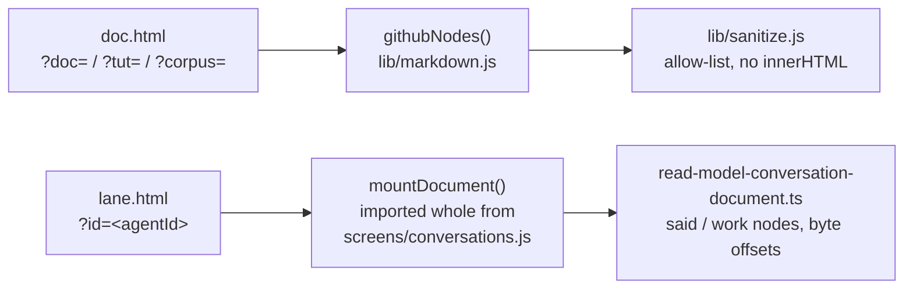
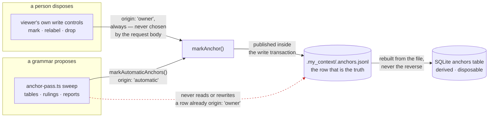
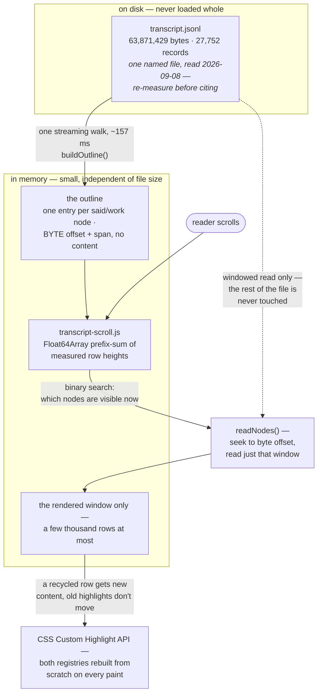

# The document and lane viewer

`docs/system/00-index.md`

This is pure browser behaviour, and it is the subject the mechanism map that fed this pass called
the hardest to write honestly from source alone: nothing about it is legible from the code without
also opening a browser and driving it. This chapter is written from the source — headers, the read
model, the folding matcher — because that is what a documentation pass can verify against the tree;
it is not a substitute for opening the pages and reading a real transcript through them.

## 1. What this is, and what it is confused with

Two pages read one thing — a rendered document — and they are easy to conflate with two things
they are not:

- **This is not the Conversations list screen.** The list (`screens/conversations.js`'s list view)
  shows *which* transcripts exist and lets you search across them. The viewer (this chapter) shows
  *one* transcript, or one repository/corpus document, as a single scrollable read.
- **`doc.html` and `lane.html` are not two implementations of the same thing wearing different
  chrome.** They render through two genuinely different pipelines for two genuinely different kinds
  of content — see §2 — and treating them as interchangeable is exactly the mistake `lane.html`'s
  own design was built to refuse (§3).
- **The find panel here is not the archive's FTS5 search, and they do not share the matcher
  either** — a claim earlier drafts of this chapter made in both directions and neither was right.
  `lib/fold.js` is imported by exactly two things: the browser (`screens/conversations.js:64`) and
  `src/core/conversation-search.ts`, which `await import()`s the browser file at `:1384–1385` so
  that the server's hit **count** and the browser's **highlights** cannot disagree about what a hit
  is. But the only consumer of `findQuery` on the server side is `findInDocument` (`:1588`) — find
  *within one transcript*. `searchArchiveTiered` (`:1174`), which is the archive search, never
  calls it and matches in FTS5 instead. So the two surfaces share **vocabulary** (phrase, near,
  whole word) and sit in one module, and share **no matcher**.
  `docs/capabilities/04-conversation-archive.md` and
  `docs/capabilities/14-search-over-the-archive.md` cover the FTS5 side.

## 2. Two entry pages, and why they are not the same renderer

`doc.js` (419 lines, measured 2026-09-17) renders a repository document, a tutorial, or a corpus item —
Markdown, GitHub-parity — through `githubNodes` in `lib/markdown.js`. It is addressed by query
string, deliberately, in three shapes: `?doc=`, `?tut=`, and `?corpus=`, and each carries its own
rule for resolving a relative link, because the three kinds of address mean different things by "the
containing directory": a document id is repository-relative, a tutorial id is a key into a manifest
that is not itself a path, and a corpus-file id is workspace-relative. Conflating any two of those
three roots silently opens the wrong file — which is exactly why the page keeps three separate rules
(`baseDirFor`) rather than one that happens to work for the common case.

`lane.js` (323 lines) is a different thing entirely: the **bare lane window**, one subagent
transcript in a chromeless tab, with no rail, no header, no application shell around it — an owner
ruling from 2026-09-09, quoted directly in the file's own header: *"what i meant is to only see the
viewer with the transcript in it as a single window without all the app arround it."* (The
misspelling is the owner's, and a direct quotation is not the place to tidy one.) It renders
through `mountDocument`, **imported whole from `screens/conversations.js`** rather than
reimplemented — the file's own comment is explicit that a second implementation of the virtualised
scroll would be a second thing to keep correct. **And it names the hazard the opposite way round
from the way a reader expects: this is exactly the trap `/doc.html` _sets_, not one it avoids**
(`lane.js:55–58`). `doc.html` legitimately runs its own renderer — it is drawn by `githubNodes`
because it draws prose — and that legitimate precedent is precisely what makes a second renderer
here look equally reasonable when it is not: lane content is drawn by `markdownNodes`, the pipeline
the Conversations screen already owns. The lane window's answer is to import that one renderer
whole rather than to follow the precedent.

Both pages make the same credential bargain: no nonce, no handoff — the `mycontext_token` cookie is
`Path=/`, `HttpOnly`, `SameSite=Strict`, and a same-origin fetch from a tab opened by clicking a link
carries it automatically. `doc.js` states this was verified against a running server rather than
assumed (`GET /api/doc` with only the cookie answers 200), and `lane.js`'s header says outright that
it runs on exactly the same bargain.

## 3. A bug worth reading as a pattern, not just as a fix

Until this week, `lane.js`'s own header claimed it handed the viewer exactly four functions on
`ctx` and that this was "everything `mountDocument` and its subtree reach for, measured over the
file." That measurement was wrong. `mountDocument` draws four anchor-write controls, and every one
of them calls `ctx.post` — which the lane window did not provide. **Every anchor write inside a
lane window threw for about a week.**

**How big that was is a question the archive cannot answer, and the number that looks like an answer
is not one.** Re-counted from `.my_context/.anchors.jsonl` on **2026-09-17**: **757 of 1,409** marks
carry a lane id — 53.7%, against 740 of 1,383 earlier the same day and 704 of 1,310 on 2026-09-16,
which is the same ratio three times and a different pair of numbers each time. But those rows are
almost entirely the automatic sweep's: the file holds exactly **one** row with `origin: 'owner'`
against **1,408** with `origin: 'automatic'`. The
bug broke the *owner* write path, so the population it could have touched is the marks a person
makes by hand, of which there is one in the entire file. The honest statement of the damage is the
mechanism and not the count: four write controls in a lane window threw on every click, for about a
week, with nothing reporting it.

The fix added **`post`** — the fifth of the five functions a lane window now hands over (`t`,
`tFlat`, `api`, `post`, `navigate`, `lane.js:33`). `postJson` is a module-local `fetch` helper
(`lane.js:171`) that `post` delegates to (`:210`); it was never a member of the handover set, and an
earlier draft of this chapter named it as the thing added to a list it does not appear in.
**And the header is off by one again, in the smaller direction**: it calls the object *"the
five-field `ctx`"*, but the literal at `lane.js:208–213` carries six members — the five functions
plus a `get lang()`. Five *functions* is right, five *fields* is not, and the sentence is worth
leaving visible rather than rounding off, because the paragraph it sits in is about a docstring
that counted its own members wrong and was believed. The fix
also — the part worth calling out — **measured, live, that a cookie-only POST is
accepted by the running server**, rather than trusting the earlier claim's shape a second time. The
file's own header documents this correction in place, rather than quietly rewriting the old claim
away: a claim that a set is complete is a claim a reader will act on, and this one was acted on for
a week before anyone measured it. That is the pattern worth generalising from this bug, not the fix
itself: **a docstring asserting completeness is a claim, and this project's own failure history says
it should be checked, not trusted.**

**What that write actually reaches, and the ownership boundary that keeps it safe.** The bug was in
a *control* — the anchor mechanism it controls has a shape worth drawing on its own, because it is
two writers sharing one file with a rule about who may touch what. `anchor-pass.ts` is a grammar
that proposes: a background sweep over the archive's tables, rulings and reports, writing rows with
`origin: 'automatic'`. The viewer's own write controls (`src/ui/anchor-write.ts` — the routes the
bug above was in) are how a person disposes: `mark`, `relabel`, `drop`, always `origin: 'owner'`.
Both paths converge on the same function, `markAnchor` (`src/core/anchors.ts`), which publishes
`.my_context/.anchors.jsonl` — **the file, not the SQLite table, is the truth** — inside the write
transaction, and the table is rebuilt from the file afterward, never the reverse.

The dashed edge is the boundary: the moment a person relabels an automatic finding, its `origin`
flips to `'owner'` permanently and the sweep stops touching it on every later run — a label someone
typed is never silently overwritten by tomorrow's grammar. `docs/capabilities/05-anchors.md` is the
full reference for every route and CLI verb this diagram compresses.

## 4. The read model — turning 27,752 records into something a person can read

`read-model-conversation-document.ts` (2,883 lines) exists because of one very concrete failed
screen: an earlier version of the Conversations screen showed *"entries 0–50 of 24,757"* with no
way to reach entry 51, and those fifty were almost entirely bookkeeping — one prompt, zero answers,
forty-nine folded "0 characters" rows. A pager was not the fix the owner asked for. He had asked for
*"a way to browse, retrieve and display the content at a later time"*; `seq:7` then ruled the pager
out by name and said what to build instead — *"view the session on a SEQUENTIAL DOCUMENT with markers
for prompts and answers AND NOT BROKEN TO PIECES — user should have a similar experience like
SCROLLING OVER A TERMINAL."* Those are two statements made on two occasions
(`read-model-conversation-document.ts:12–19`); joining them into one sentence with an ellipsis, as an
earlier draft of this chapter did, hides a join rather than an omission.

The design turns on one measurement, taken on a real 63,871,429-byte, 27,752-record transcript:

| what | count | share |
|---|---|---|
| records carrying no `message` object at all | 17,375 | 62.6% |
| records carrying words somebody actually **said** | 2,444 | 8.8% |
| `tool_use` blocks | 3,014 | — |
| `tool_result` blocks | 3,014 | — |

*(Re-measure against a current transcript before citing this table as today's number — it is a
2026-09-08 reading on one specific file, kept here because it is the number the whole design turns
on, not because it is current.)*

That ratio is the entire argument for the document having exactly two node kinds:

- **`said`** — one record where a person or the model used words, drawn open with a speaker heading
  and timestamp, rendered as Markdown.
- **`work`** — a *run* of consecutive records where nobody said anything: tool calls, tool results,
  thinking-only turns, the 62.6% with no message at all. Folded to **one summarised line**, openable
  on demand.

The fold is on the *run*, not the record — folding each machinery record individually is what the
first, failed version of this screen did, and it produced exactly the "49 folded 0-character rows"
complaint. A run of 37 machinery records becomes one line (*"37 steps · Bash ×12, Read ×3"*); nothing
is dropped, and this is checkable rather than merely claimed: every node carries `first` and `span`,
the outline's nodes tile the record space exactly (`sum(span) === records`), and a test asserts it.

**Why this can seek, and why that is the actual feature.** A naive reader of a JSONL transcript has
no offset to seek to, because JSONL records are variable-length — the honest cost an earlier module
accepted and stated in its own comments. `buildOutline` walks the file once and remembers, for every
node, the **byte** offset its first record begins at — never a character offset. The reason is
stated in the module and is specific rather than general: *"this corpus is half Hebrew, and a
character offset would be wrong from record 5 onward and wrong silently"*
(`read-model-conversation-document.ts:88–90`). Record 5 is a reading of the owner's own transcript,
not a property of every transcript; what generalises is that the error is silent, not that it
arrives that early. Measured on the 61 MB transcript: the one-time outline walk costs **157 ms**
(`:82`, restated at `:168`); every scroll after that costs only the window being read, not the
file.

**The interesting part of this data flow is what never enters memory whole.** A 63.9 MB transcript
is not an in-memory document with a viewport clipped over it — the only thing held for the file's
full length is the outline, one small record per node (a byte offset and a span), and the only thing
held for the screen's height is a `Float64Array` of measured row heights. The file itself is read
only in the windows the scroll actually asks for:

That last edge is why the highlighter has to rebuild rather than update incrementally (§6): a `Range`
computed against a row before it was recycled for different content points at byte offsets that no
longer mean what they meant when the `Range` was made.

## 5. `lib/fold.js` — the shared reading grammar

The densest file in this surface (measured 2026-09-17: 1,339 lines) and the one the browser find
panel and the **server's find-in-document route** share — not, see §1, the archive search box,
which matches in FTS5 and never loads this file.

- **NFKD and case folding, written by hand rather than vendoring CodeMirror's `SearchCursor`.** The
  owner was shown the vendoring option and chose to write it instead. What *was* taken from
  `SearchCursor` is its intent, checked by running both algorithms side by side over the real
  archive rather than by reading the upstream source: 1,775,487 hits, zero differences across
  11,364 real archive spans against 20 queries. That comparison run — not the upstream library — is
  what the project's own test pins going forward, because keeping the upstream source around to
  compare against would mean vendoring the library the owner ruled against.
- **Why this matters at all, measured, not assumed:** this product writes an ellipsis `…` **3,062
  times** and a reader types three ASCII dots (`fold.js:9`, restated at `:506`). Those writes land in
  **752** of the archive's spans (`fold.js:13`) — two different measurements of the same habit, and
  an earlier draft of this chapter printed the span count under the write count's label. Against a
  reader typing `...`: plain `indexOf` finds **456** spans, FTS5's trigram index finds the same 456,
  and NFKD folding finds **1,012** once related punctuation (non-breaking hyphens, "not equal"
  signs, micro signs, fullwidth pipes) is accounted for. 806 of 11,251 spans in the archive change
  under NFKD normalisation at all, and 376 of one session's spans change **length** — which is the
  actual difficulty: an offset computed against the folded text does not point at the same place in
  the original text unless the mapping is carried through deliberately, never recomputed by walking
  back from a folded match.
- **Four exclusive reading modes** — normal, wildcard, logical, regex — a Notepad++-style radio
  group. `logical` implements AND/OR/NOT/NEAR **in the JavaScript scan itself**, explicitly not by
  reaching into FTS5, even though the syntax reads like SQL: this surface never touches SQLite.
- **Regex is refused before it is compiled, not after it hangs.** A pattern shaped like a nested
  quantifier (`(X+)+`) is statically detected and rejected, because a real pattern of that shape
  took 108,785 ms against a 139 MB session on 2026-09-16. A runtime canary — try the pattern on a
  short string and time it — was written first, then measured, and found unsound. **The argument is
  about the length of the sample, not the length of the pattern**, which an earlier draft of this
  chapter had backwards: the input at which these patterns explode is far shorter than any string a
  canary could learn anything from. Measured on `'word '` repeated against `^(\w+\s?)+$` —
  21 characters took 2 ms, 41 took 3,848 ms, 61 was killed above 6,000 ms, and `(a*)*b` over
  **twelve** characters did not return at all (`fold.js:610–623`). A canary long enough to tell a
  bad pattern from a good one is long enough to hang on the bad one, which moves the freeze rather
  than removing it.

## 6. `lib/panel.js`, `lib/transcript-scroll.js`, and the highlight layer

`lib/panel.js` (429 lines) is the shared frame for the floating dialogs, built as a frame rather
than a one-off box on the argument that reverse-engineering the same shape twice from two bespoke
dialogs would cost more than building it once. **All three the owner asked for now exist**, and
this is the claim in this chapter that moved most recently: `createPanel` is called three times in
`screens/conversations.js` — `findPanel` (`:10415`), `navPanel` (`:10534`) and `copyPanel`
(`:10677`) — with Navigation and Copy landing in `ef52818f` on 2026-09-17, hours after the
documentation pass that said they were still to come. `lib/panel.js`'s own header still reads
*"SEARCH is the first of the three. NAVIGATION and COPY follow once he has judged this one"*, so
the frame's docstring and the frame's callers now disagree — the same defect §3 is about, live in
the file next door. Its two technical decisions both trace to one owner instruction, quoted
directly in the file: *"stays on screen while you can look at the viewer."* That rules out a modal
`<dialog>` (which makes everything behind it inert) in favour of `show()`, which leaves the document
live — and forces the panel to hand-wire its own Escape handling, because a non-modal dialog gets no
automatic close on Escape from the browser at all.

`lib/transcript-scroll.js` (147 lines) is the pure arithmetic underneath the scroll: a `Float64Array`
prefix sum over row heights, binary-searched to answer "what's visible." It chose a plain re-sum on
each height change over a Fenwick tree, and the argument is a number rather than a feeling
(`:105–110`): the owner's own session is **4,916 nodes**, so a re-sum is 4,916 additions and it runs
only when a measurement actually changed something. *"The clever structure would be real work to
read and would save microseconds."*

**The hit highlighter is the CSS Custom Highlight API, and it is the only one that could work here —
not merely the one chosen.** Every wrapper-based highlighter (wrapping a match in a `<mark>`, the
common approach) mutates the DOM inside a scroll whose rows are absolutely positioned from a
measured model; a wrapper changing a row's content invalidates that row's own measured height, and
the scroll's position arithmetic is left holding a number that is now wrong. The Custom Highlight
API paints without touching the DOM at all, which is what makes it compatible with a virtualised
scroll rather than merely convenient for one. Two highlight registries exist — `FIND_HIGHLIGHT` for
every match and `FIND_NOW_HIGHLIGHT` for the one the reader currently stands on — and **both are
rebuilt from scratch on every paint** (`conversations.js:7573`, `:7585`; both deleted together at
`:7534` when there is nothing to paint), because
this scroll recycles rows: a `Range` held across a row being recycled for different content points
at a now-detached node and paints nothing, silently, forever, which is a failure mode a rebuild-every-paint
design cannot have.

## 7. What is known wrong or incomplete here

- **`lib/panel.js`'s own header is now wrong about its own callers.** It says Search is the first
  of three and the other two follow; all three shipped in `ef52818f` (2026-09-17). The code is
  right and the docstring is stale — which is the §3 pattern recurring in the frame rather than in
  the window, and is the reason this chapter re-derives every claim from the callers rather than
  from the headers that describe them.
- **A relabel can write a second anchor instead of renaming one**, which is a live defect in the
  mechanism §3 draws. `writeAnchorFile` accepts a row whose id is not
  `anchorIdFor(sessionId, agentId, byteOffset)`; renaming such a row writes a **new** row at the
  derived id and leaves the original standing, while the screen says *"Renamed."* Measured
  2026-09-14 on a copy of a real anchor file: 26 marked points became 27, with two labels at one
  byte. Filed as `TASK-a-relabel-writes-a-second-anchor-instead-of-renaming`, still open, and the
  e2e fixture that used to exercise it by accident was repaired — so the defect is now untested
  rather than silently covered.
- **The lane-marks figures in §3 are dated readings of a file that grows every session** — 704 of
  1,310 on 2026-09-16, 740 of 1,383 on 2026-09-17. Re-count from `.my_context/.anchors.jsonl` before
  citing either. More importantly, §3 now says what that ratio does *not* measure: it is a count of
  the automatic sweep's rows, and an earlier draft of this chapter used it to size a bug that only
  affected owner writes.
- **A load-bearing docstring can be wrong and acted on for a week before anyone measures it** — this
  is not a defect in the current code (the claim in §3 is now correct), but it is a demonstrated
  failure mode of this exact viewer's own documentation practice, worth a reader's caution rather
  than assumed fixed for good.
- **Every line count in this chapter is a date, and one of them has already moved twice.**
  `screens/conversations.js` was **11,261** when the mechanism map read it on 2026-09-16, **11,277**
  at the HEAD the previous documentation pass was written against, and is **12,728** now — it gained
  1,451 lines in `ef52818f` while that pass was being written, which is why that pass deliberately
  left the old number rather than record another lane's uncommitted work. `styles.css` moved the
  same way, 5,498 to **5,868** (see chapter 03). `app.js` is unchanged at **8,592**, and the
  inventory written the same week still cited it as "≈5,200" — a fresh instance of the exact
  failure this documentation effort exists to correct. Every figure above was re-measured with
  `wc -l` against a clean working tree on 2026-09-17; re-run it rather than trust it.

## 8. Code map

| File | Lines (2026-09-17) | What it owns |
|---|---|---|
| `src/ui/public/doc.js` | 419 | The document/tutorial/corpus page; three address kinds, three link-resolution rules |
| `src/ui/public/lane.js` | 323 | The bare lane window; imports `mountDocument` whole |
| `src/ui/public/screens/conversations.js` | 12,728 | `mountDocument`, `laneIndex`, `sessionHref` — the list screen and the shared viewer both live here |
| `src/ui/public/lib/fold.js` | 1,339 | The folding matcher: NFKD/case folding, four reading modes, regex-explosion refusal |
| `src/ui/public/lib/panel.js` | 429 | The floating-dialog frame; three callers today — find, navigate, copy |
| `src/ui/public/lib/transcript-scroll.js` | 147 | Pure prefix-sum scroll arithmetic |
| `src/ui/read-model-conversation-document.ts` | 2,883 | `buildOutline`, `readNodes` — byte-offset windowing, the `said`/`work` split |
| `src/core/conversation-index.ts` | — | `iterateTranscript`, the byte-offset-seekable read this whole surface depends on |

## See also

- [`docs/capabilities/04-conversation-archive.md`](../capabilities/04-conversation-archive.md) —
  the archive this viewer reads from
- [`docs/capabilities/14-search-over-the-archive.md`](../capabilities/14-search-over-the-archive.md) —
  the FTS5 search this chapter's §1 explicitly distinguishes from the in-document find panel
- [`docs/capabilities/05-anchors.md`](../capabilities/05-anchors.md) — the marks this viewer's
  write controls create, and the bug in §3 that broke writing them from a lane window
