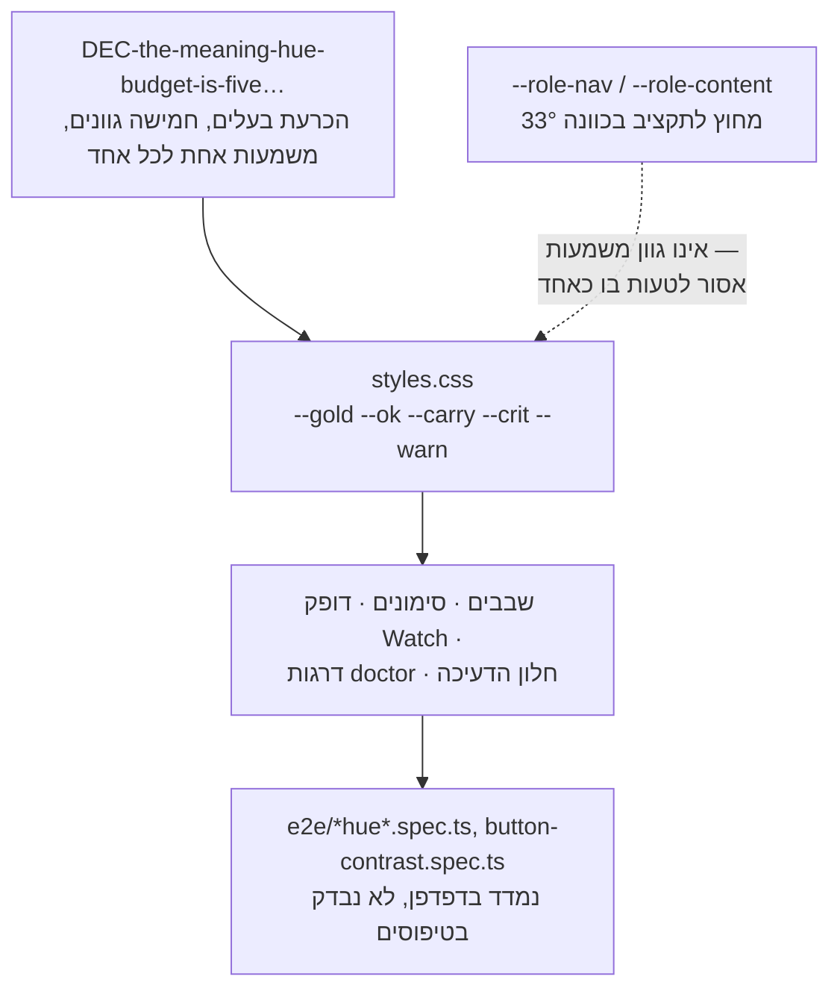

<!--
  Hebrew mirror of `docs/system/03-the-palette-and-the-drawn-language.md`. The
  English document is the source of record; where the two disagree, the English
  one is right and this one is stale. Conventions, and the link policy, are
  stated once in `docs/system/00-index.he.md`'s own header comment.

  This chapter is almost entirely numbers — 21 contrast ratios, eight hex
  literals, two byte totals and a directory census. Not one of them was
  re-derived here. They are carried across from the English chapter as it stands
  on 2026-09-17, which is also the reason every ratio, range and hex literal is
  wrapped in `<span dir="ltr">`: a colon or an en dash between two digits takes
  the paragraph direction, and `--crit 4.75/4.45` would otherwise be read out
  backwards inside a Hebrew run.

  `fence` is rendered `גדר`, `hue` is `גוון`, and the Composer screen keeps the
  product's own Hebrew name, `מרכיב פקודות` (`strings/he.js:136`) — which is
  itself one of §1's points and not a translator's choice.
-->

# הפלטה והשפה המצוירת

<div dir="rtl">

<span dir="ltr">`docs/system/00-index.he.md`</span>

זו הגרסה העברית של
[`docs/system/03-the-palette-and-the-drawn-language.md`](./03-the-palette-and-the-drawn-language.md).
המסמך האנגלי הוא המקור; במקרה של סתירה — האנגלית קובעת.

## 1. מה זה — וההתנגשות שכדאי לפנות מהדרך קודם

**ל"פלטה" יש שתי משמעויות שאינן קשורות זו לזו בבסיס הקוד הזה, ותדריך מוקדם למעבר התיעוד
הזה עצמו נפל למלכודת.** <span dir="ltr">`src/ui/public/lib/palette-defs.js`</span> (873
שורות) אינו קשור לצבע כלל. הוא **קטלוג הפקודות** של מסך מרכיב הפקודות — כל פקודת CLI
שאפשר להציע כטופס, עם מטא־נתונים על אילו ניתנות להרצה, אילו נוגעות בגבול כתיבה, ואילו
דגלים הטופס בכוונה אינו מציע. התווית של המסך עצמו היא **Composer** באנגלית
(<span dir="ltr">`strings/en.js:147`</span>) ו-**מרכיב פקודות** בעברית
(<span dir="ltr">`strings/he.js:136`</span>): תרגום, ולא גרירה של המילה האנגלית. אף אחת
מהשפות אינה קוראת לזה "פלטה", וזו הנקודה. הקובץ משוער על ידי
<span dir="ltr">`test/ui/palette-lib.test.ts`</span> מול מפענח ה-CLI האמיתי, ולכן פקודה
שהקטלוג מתאר לא נכון מפילה טסט, לא סקירת עיצוב.

תקציב גווני המשמעות האמיתי חי ב-<span dir="ltr">`styles.css`</span>, כגוש של תכונות CSS
מותאמות. הפרק הזה עוסק ב*זה* — צבע, אייקונים, גופנים והתרשימים המיוצרים — והוא מזכיר את
<span dir="ltr">`palette-defs.js`</span> עוד פעם אחת בדיוק, במפת הקוד, כדי שקורא שיילך
לחפש אותו יידע איפה הוא באמת חי ולמה הוא אינו מכוסה כאן יותר מזה.

## 2. מה יש בו היום

</div>

<div dir="rtl">

| חלק | איפה | מה זה |
|---|---|---|
| חמשת גווני המשמעות | <span dir="ltr">`styles.css:147`</span>, <span dir="ltr">`--gold`/`--ok`/`--carry`/`--crit`/`--warn`</span>, מוצהרים בשורה אחת תחת הערת ניסוי הפלטה מ-2026-09-01 ב-<span dir="ltr">`:101–145`</span> | הצבעים היחידים במוצר הזה שנושאים *משמעות* — ראו §3 |
| שני גווני תפקיד | <span dir="ltr">`styles.css:2026`</span>, <span dir="ltr">`--role-nav:#22b8b0`/`--role-content:#c084fc`</span> | בכוונה **אינם** גווני משמעות; <span dir="ltr">`:2008`</span> רושם אותם ב-177° וב-270°, במרחק 33° מכל גוון מתוקצב, כך שאי אפשר לטעות בהם כאחד מהם |
| אייקונים | <span dir="ltr">`src/ui/public/index.html`</span>, ספרייט <span dir="ltr">`<svg>`</span> מוטבע | אייקוני קו של Tabler (MIT), מכותבים עם <span dir="ltr">`<use href="#i-name">`</span>; **6 סמלים קיימים היום** (<span dir="ltr">`add`, `confirm`, `copy`, `open`, `refresh`, `search`</span>), ורק לאחד (<span dir="ltr">`open`</span>) יש צרכן אמיתי (<span dir="ltr">`openIcon()`</span> שב-<span dir="ltr">`screens/parts.js`</span>) |
| גופנים | <span dir="ltr">`src/ui/public/fonts/`</span> | Geist (לטינית, כמה משקלים) ו-IBM Plex Sans Hebrew — <span dir="ltr">`.woff2`</span> מתארחים אצלנו, בלי שום בקשת גופן חיצונית |
| תרשימים מיוצרים | <span dir="ltr">`src/ui/public/diagrams/`</span> | **10 קובצי SVG** בסך **694,331 בתים** (<span dir="ltr">678.1 KiB</span>; נסכמו מחדש ב-2026-09-17 אחרי שהציורים יוצרו מחדש — קריאה קודמת של אותה תיקייה הייתה 686,068), ממוענים לפי תוכן על פי 16 תווי ה-hex הראשונים של ה-SHA-256 של מקור ה-Mermaid שלהם, מצוירים על ידי <span dir="ltr">`scripts/gen-diagrams.ts`</span> — **כל העשרה משני ה-README, אף לא אחד מהתיקייה הזאת; ראו §5** |

</div>

<div dir="rtl">

## 3. איך זה עובד: תקציב הגוונים הוא טיעון, לא דוגמית

<span dir="ltr">`styles.css`</span> אינו רק מצהיר על חמישה צבעים — הוא טוען בעד כל אחד
מהם, בגושי הערות שמשתרעים על מאות שורות לאורך הקובץ, מקרה־מקרה, על השאלה למה משטח מסוים
רשאי או אינו רשאי להוציא גוון שישי. הטיעון ההוא נשלט על ידי פריט קורפוס אחד:
<span dir="ltr">`DEC-the-meaning-hue-budget-is-five-gold-ok-carry-crit-and-warn`</span>,
הכרעת בעלים עם היסטוריה אמיתית שראוי לקרוא אותה במלואה ולא דרך פרפרזה. הוכרעה
**2026-08-25**, והיא תיקנה אמונה קודמת שהתקציב הוא *ארבעה*: הכיוון החזותי המאושר
מ-2026-08-21 תיקצב את gold, ok, carry ו-crit,
ו-<span dir="ltr">`plan:repaint seq:13a`</span> תויקה על האמונה
ש-<span dir="ltr">`--warn`</span> נגנז. ההשוואה מצאה שההנחה שקרית באותו יום —
<span dir="ltr">`styles.css`</span> הצהיר על כל החמישה בשורה אחת, ו**שמונה מקומות**
השתמשו ב-<span dir="ltr">`var(--warn)`</span>: <span dir="ltr">`decay.js`</span> (שלושה
מהם), <span dir="ltr">`graph.js`</span>, <span dir="ltr">`port.js`</span>,
<span dir="ltr">`watch.js`</span>, <span dir="ltr">`work.js`</span>,
ו-<span dir="ltr">`styles.css`</span> עצמו.

**שני משפטים מההכרעה ראויים לציטוט והם במרחק ארבע שורות זה מזה, ולכן הם ניתנים כשניים**;
טיוטה קודמת של הפרק הזה ריתכה אותם עם שלוש נקודות, וזה הפגם שפרק 02 §4 נוקב בו — חיבור
שמוסתר כהשמטה. ההכרעה: *"THE RULING: THE BUDGET IS FIVE. `--warn` is legitimate and
stays."* ו, הרחק למטה, תחת מה שחייב לבוא בעקבותיה: *"A budget nobody updated is how the
code came to disagree with the direction silently in the first place, and there is no gate
comparing the declared token set against the budget -- which is why five hues shipped
without anyone ruling on the fifth."* האותיות הגדולות והמקף הכפול הם של הפריט.

הנימוק לחמישה ולא לארבעה הוא פונקציונלי ולא אסתטי: הממצאים של `doctor` הם
שגיאה/אזהרה/הערה, באוצר המילים של ה-CLI עצמו ולא המצאה של עיצוב; הדופק של מסך Watch חייב
להפריד סירוב ממוטציה מכל דבר רגיל; גבול החלון של דעיכה הוא זהירות, לא כישלון. ארבעה גוונים
מאלצים שניים מאלה לצבע אחד. ההכרעה תוקנה אחר כך (2026-08-27) והוסיפה אילוץ שני על אותם
חמישה: **גוון רשאי לצמצם קבוצה, לעולם לא לנקוב בשמה** — אחרי שמדידה מצאה
ש-<span dir="ltr">`--gold`</span> ו-<span dir="ltr">`--ok`</span> יושבים על ניגודיות של
<span dir="ltr">1.04:1</span> זה מול זה, קרוב מספיק כדי שהמילה הנלווית כבר עשתה את עבודת
ההבחנה ביניהם, והתיקון גרם לעיצוב לומר זאת במקום לטעון להבחנה שהעין אינה יכולה לעשות.

**שום דבר מזה אינו נאכף על ידי מערכת טיפוסים.** אין נתיב קוד שמסרב לתכונת CSS מותאמת שישית
ששמה נראה כמו גוון משמעות. מה שאוכף את התקציב הוא צירוף של שערי דפדפן
(<span dir="ltr">`e2e/chip-hue-authority.spec.ts`</span>,
<span dir="ltr">`e2e/code-hue.spec.ts`</span>,
<span dir="ltr">`e2e/mark-hues.spec.ts`</span>,
<span dir="ltr">`e2e/button-contrast.spec.ts`</span>) ומשמעת ההערות
ב-<span dir="ltr">`styles.css`</span> עצמו, וזו הסיבה שמתעד של הנושא הזה חייב *לעבד אותו*
ולא לתאר אותו בפרוזה לבדה.

</div>



<div dir="rtl">

## 4. צבע במספרים, כי כך התקבלה ההכרעה

מספרי הניגודיות ראויים לנשיאה הלאה מפני שכל הנקודה בהחלטה הייתה שהיא התקבלה מפיקסלים
שנמדדו ולא מהעדפה. **הם גם הדבר הקל ביותר בפרק הזה לטעות בו, וטיוטה קודמת שלו טעתה.**
<span dir="ltr">`styles.css:123–127`</span> רושם *שתי* עמודות —
<span dir="ltr">`ours`</span>, ארבעת הצבעים שנגנזו ב-2026-09-01,
ו-<span dir="ltr">`generator`</span>, הארבעה שנשלחים — והעמודה הגנוזה היא זו שמספריה הם
הזכירים. מה שבא להלן הוא העמודה הנשלחת, כשהגנוזה נשמרת לצדה כדי ששוב לא יתבלבלו ביניהן.

**מול <span dir="ltr">`--panel`</span> (<span dir="ltr">#17171c</span>)**, הרקע ששדות
הדרגה השטוחים יושבים עליו:

</div>

<div dir="rtl">

| דרגה | הצבע הנשלח | ניגודיות | הצבע שהוא החליף | היחס של הצבע ההוא |
|---|---|---|---|---|
| safe | <span dir="ltr">`#22c55e`</span> | **<span dir="ltr">7.84:1</span>** | <span dir="ltr">`#7cc0a0`</span> (גנוז) | <span dir="ltr">8.42:1</span> |
| caution | <span dir="ltr">`#eab308`</span> | **<span dir="ltr">9.31:1</span>** | <span dir="ltr">`#e8c368`</span> (גנוז) | <span dir="ltr">10.58:1</span> |
| warning | <span dir="ltr">`#f97316`</span> | **<span dir="ltr">6.37:1</span>** | <span dir="ltr">`#c78f3d`</span> (גנוז) | <span dir="ltr">6.31:1</span> |
| critical | <span dir="ltr">`#ef4444`</span> | **<span dir="ltr">4.75:1</span>** | <span dir="ltr">`#e08b8b`</span> (גנוז) | <span dir="ltr">7.00:1</span> |

</div>

<div dir="rtl">

כל ארבעת הצבעים הנשלחים עוברים את WCAG AA לטקסט רגיל (<span dir="ltr">4.5:1</span>).
**<span dir="ltr">`--crit`</span> עובר אותו ב-0.25 — רבע נקודה — וזה המשפט שהטבלה הזאת
קיימת כדי לשאת.** מול 7.00 של הצבע הגנוז נראה שלגוון הקריטי יש שתיים וחצי נקודות של מרווח
ראש; יש לו רבע של אחת. מספר שנקרא כנוח הוא למעשה שולי, וזו השורה היחידה כאן בלי שום מרווח
לספוג שינוי. על הרקע הכהה יותר <span dir="ltr">`--panel-2`</span>
(<span dir="ltr">#1d1d24</span>) אותו <span dir="ltr">`#ef4444`</span> נמדד
**<span dir="ltr">4.45:1</span>** ו**נכשל** — וזה שריד רק מפני ששני שדות הדרגה השטוחים
הנדונים יושבים על <span dir="ltr">`--panel`</span>; כל דיו דרגה שינחת מאוחר יותר על הרקע
הכהה אינו עובר. <span dir="ltr">`styles.css:129–133`</span> רושם את האזהרה הזאת במילים
מפורשות, בדיוק מהסיבה הזאת.

*(כל יחס שלמעלה חושב מחדש מערכי ה-hex לפי בהירות יחסית של WCAG 2.x בזמן שהפרק הזה תוקן,
ולא הועתק משום מקום. העמודה הנשלחת משחזרת את עמודת <span dir="ltr">`generator`</span>
של <span dir="ltr">`styles.css:124–127`</span> עד לספרה השנייה אחרי הנקודה, והעמודה
הגנוזה משחזרת את עמודת <span dir="ltr">`ours`</span> שלו עד לספרה השנייה — וזה מה שמזהה
את הבלבול במקום רק לרמוז עליו.)*

**<span dir="ltr">`--gold`</span> ו-<span dir="ltr">`--ok`</span> רשומים
ב-<span dir="ltr">1.04:1</span> זה מול זה** — בלתי־ניתנים להבחנה בניגודיות לבדה, וזו
המדידה שמאחורי הכלל "גוון רשאי לצמצם, לעולם לא לנקוב" ב-§3. המספר ההוא מצוטט בנאמנות,
מתוך ההכרעה עצמה (<span dir="ltr">`:50`</span>) ושוב
מ-<span dir="ltr">`styles.css:1003`</span>, אבל **הוא אינו משתחזר מאף אחת מהפלטות**: הזוג
הנשלח נמדד **<span dir="ltr">1.19:1</span>** והזוג הגנוז <span dir="ltr">1.26:1</span>.
המסקנה שורדת בשתי הקריאות — <span dir="ltr">1.19:1</span> בלתי־ניתן להבחנה בדיוק כמו
<span dir="ltr">1.04:1</span>, והמילה שלצד הגוון עדיין עושה את העבודה — אבל המספר עצמו
מעולם לא נגזר מחדש, ואין לצטט אותו כמדידה של הפלטה הנשלחת.

**אותה החלפה עדיין חיה ב-<span dir="ltr">`styles.css`</span>, בהערה שאומרת שהיא לא**,
וראוי לנקוב בזה כי זו הראיה החזקה ביותר לכך שסוג השגיאה הזה אינו נשאר מתוקן אחרי פעם אחת.
<span dir="ltr">`styles.css:1319–1320`</span> רושם, תחת הכותרת *"CONTRAST RE-MEASURED FOR
TEXT, not carried across"* ובסיום *"which is a measurement and not an assumption"*, את
המספרים <span dir="ltr">`--ok 8.42/7.90:1, --gold 10.58/9.92:1, --warn 6.31/5.92:1, --crit
7.00/6.57:1`</span> על <span dir="ltr">`--panel`</span> ועל
<span dir="ltr">`--panel-2`</span>. כל אחד משמונת המספרים האלה הוא היחס של הצבע ה**גנוז**,
משוחזר עד לספרה השנייה אחרי הנקודה על שני הרקעים, לובש את שמו של הטוקן הנשלח. כשחושבו
מחדש מה-hex הנשלחים בזמן שהפרק הזה נבדק, הזוגות האמיתיים הם
<span dir="ltr">`--ok` 7.84/7.35</span>, <span dir="ltr">`--gold` 9.31/8.74</span>,
<span dir="ltr">`--warn` 6.37/5.98</span> ו-<span dir="ltr">`--crit` **4.75/4.45**</span>.
ההערה ההיא מסיימת אז ב-*"All clear AA; the worst is --warn at 5.92:1"* — ובפלטה הנשלחת
הגרוע ביותר הוא <span dir="ltr">`--crit`</span> ב-**<span dir="ltr">4.45:1</span>, שאינו
עובר AA כלל**, עובדה ש-<span dir="ltr">`styles.css:129–133`</span> מנסח נכונה אלף ומאה
שורות מעליו. זה ב-<span dir="ltr">`styles.css`</span> ולא בתיקייה הזאת, ולכן זה מדווח כאן
ולא מתוקן; זה אינו מתויק בשום מקום אחר שהמעבר הזה הצליח למצוא.

## 5. תרשימים: מיוצרים, לעולם לא מצוירים ביד, ולעולם לא נשלחים כתלות

<span dir="ltr">`scripts/gen-diagrams.ts`</span> הוא המנגנון שדרכו תרשימי ה-Mermaid של
<span dir="ltr">`README.md`</span> ושל <span dir="ltr">`docs/README.he.md`</span>
**מצוירים** — ושני הקבצים האלה הם כל הקלט שלו.
<span dir="ltr">`DIAGRAM_SOURCES`</span> (<span dir="ltr">`gen-diagrams.ts:69`</span>) הוא
בדיוק <span dir="ltr">`['README.md', 'docs/README.he.md']`</span>, ולכן **אף לא אחד משנים
עשר תרשימי ה-Mermaid שב-<span dir="ltr">`docs/system/`</span> מצויר או נשמר כ-SVG.** הם
מעובדים רק במציג שפותח את ה-Markdown.

**מצויר ומשוער הן עכשיו שתי שאלות שונות, ורק אחת מהן עוד פתוחה.** זו הטענה בפרק הזה שזזה
לאחרונה, והגרסה שלפניה אמרה בפשטות ששום דבר תחת <span dir="ltr">`docs/`</span> אינו מכוסה
כלל. זה היה נכון כשנכתב והפסיק להיות נכון באותו יום.

מה שקרה קודם הוא העלות. תרשים הרצף
ב-<span dir="ltr">`docs/capabilities/07-restore-and-handover.md:78`</span> נשא
<span dir="ltr">`&lt;key&gt;`</span>, שה-<span dir="ltr">`&`</span> שלו שובר את הלקסר של
Mermaid, והוא צייר תיבת שגיאה על הדף כל עוד היה קיים — תוקן ביד ב-2026-09-17
(<span dir="ltr">`471b13b3`</span>) אחרי שמעבר קריאה תפס אותו, לא אחרי ששער תפס. גרוע
מזה, מעבר על התרשימים האלה כבר דיווח שכל גדר מתפענחת: הוא בדק **איזון סוגריים**, לא
עיבוד, ואיזון אינו פענוח.

מה שקרה אחר כך הוא שהבעלים הוצגו שתי האפשרויות והוא בחר ביניהן בשתי מילים —
**"the parse-only gate"** — ו-<span dir="ltr">`scripts/check-diagrams-parse.ts`</span>
(<span dir="ltr">`npm run check:diagrams`</span>) הוא ההכרעה ההיא מוצאת לפועל. ראוי לדייק
במה שהוא עושה ובמה שאינו עושה, כי ההבחנה היא כל ההכרעה:

- **הוא מפענח ואינו מצייר דבר.** שום SVG אינו מיוצר, שום קובץ אינו נכתב,
  <span dir="ltr">`DIAGRAM_SOURCES`</span> אינו נוגע,
  <span dir="ltr">`DIAGRAMS`</span> אינו משתנה
  (<span dir="ltr">`check-diagrams-parse.ts:23–30`</span>). האם הגדרות האלה אי פעם
  *יצוירו* נשאר שאלה פתוחה של הבעלים; האם הן *מתפענחות* מפסיק להיות שאלה — והמדידה
  שמאחורי ההכרעה ההיא באותו גוש: ציור כל גדר לא־מצוירת תומחר ב-**~1.5–1.8 MiB**, שלוקח את
  <span dir="ltr">`src/ui/public`</span> מ-<span dir="ltr">5.04 MB</span>
  ל-<span dir="ltr">~6.7 MB</span>, מעבר לתקציב גודל שכבר נדחה פעם אחת.
- **רשימת המקורות שלו רחבה בכוונה מזו של המייצר, ובכוונה אינה נקראת ממנה.**
  <span dir="ltr">`DOC_SOURCES`</span> (<span dir="ltr">`:108–113`</span>) הוא
  <span dir="ltr">`README.md`</span>, <span dir="ltr">`docs/README.he.md`</span>,
  <span dir="ltr">`docs/capabilities`</span> ו-<span dir="ltr">`docs/system`</span> —
  תיקיות שנסרקות אחרי <span dir="ltr">`.md`</span>. ייבוא של
  <span dir="ltr">`DIAGRAM_SOURCES`</span> היה יוצר מחדש את החור, כי כל הפגם היה שרשימת
  הציור קצרה.
- **הוא מריץ הוכחה אדומה משלו לפני שהוא מאמין לירוק כלשהו.** הדבר הראשון שכל ריצה עושה
  הוא להאכיל את mermaid בגדר של פרק 7 מלפני התיקון, ששוחזרה מילה במילה מתוך
  <span dir="ltr">`471b13b3^:docs/capabilities/07-restore-and-handover.md`</span>, דרך
  אותה חילוץ ואותו פענוח, ולצאת בקוד שאינו אפס אם mermaid *מקבל* אותה.
- **מחלץ אחד, תצורה אחת.** הגדרות מגיעות מ-`mermaidBlocks` של המוצר עצמו
  ב-<span dir="ltr">`lib/markdown.js`</span>, ו-mermaid מאותחל עם
  <span dir="ltr">`securityLevel: 'strict'`</span> של המייצר עצמו, עם אותה ערכת נושא ואותו
  מחסנית גופנים — כך שגדר אינה יכולה לעבור את השער הזה ולהיכשל בציור.
- **הוא מחווט גם ל-<span dir="ltr">`ci.yml`</span> וגם
  ל-<span dir="ltr">`release.yml`</span>** (<span dir="ltr">`ci.yml:214`</span>,
  <span dir="ltr">`release.yml:121`</span>) — בשני המקרים מאחורי
  <span dir="ltr">`if: matrix.name == 'ubuntu'`</span>, כי הוא זקוק ל-Chromium ורק משימת
  ה-ubuntu מחזיקה אחד. ריצה של ה-workflow רק ב-Windows אינה לוקחת את הקריאה הזאת.

הורץ שוב ושוב בזמן שהפרק הזה נבדק, 2026-09-17: **כל גדר התפענחה, בכל פעם, בערך בשנייה.**
הסכומים זזו בין ריצות — 38 גדרות, ואז 39 — מפני שמסלול אחר ערך את
<span dir="ltr">`docs/capabilities/`</span> לאורך כל הזמן, וזו הסיבה הכנה לרשום את הצורה
ולא את המספר: 10 גדרות בשני ה-README, **12 תחת <span dir="ltr">`docs/system/`</span>**
(פגיעת <span dir="ltr">`grep`</span> שלוש־עשרה בפרק הזה היא הפרוזה שתי פסקאות למטה, לא
גדר), והשאר תחת <span dir="ltr">`docs/capabilities/`</span>. הריצו אותו בעצמכם; זה לוקח
בערך שנייה והוא מדפיס את המכנה שלו.

המייצר אינו סורק אחרי גדרות <span dir="ltr">```` ```mermaid ````</span> עם ביטוי רגולרי משלו; הוא שואל את
<span dir="ltr">`src/ui/public/lib/markdown.js`</span> — אותו מפענח מנובד שהדפדפן מעבד
דרכו — אילו גדרות הן תרשימים, דרך הפונקציה האחת (`mermaidBlocks`) שגם המייצר וגם הדף החי
קוראים לה. סורק גדרות שני ועצמאי כאן היה בדיוק סוג הכלל המשוכפל שהיסטוריית הכישלונות של
הפרויקט הזה מזהירה מפניו.

ציור — להבדיל מפענוח — קורה ב-Chromium אמיתי (<span dir="ltr">`playwright`</span>, כבר
devDependency עבור חבילת טסטי הדפדפן), מפני של-Mermaid אין מעבד בצד שרת: דף ריק,
<span dir="ltr">`mermaid.min.js`</span> מוזרק, <span dir="ltr">`mermaid.render()`</span>
נקרא לכל תרשים, והסימון שמתקבל מסודר מחדש דרך
<span dir="ltr">`XMLSerializer`</span> לפני הכתיבה לדיסק — Mermaid מחזיר סימון בצורת HTML
(<span dir="ltr">`<br>`</span> לא סגור, HTML תקין ו-XML קטלני), ו-SVG שנטען דרך
<span dir="ltr">``</span> מפוענח בקפדנות כ-XML, ולכן הריצה הראשונה של המייצר הזה
ייצרה סימני תמונה־שבורה מילוליים עד שנוסף שלב הסידור מחדש. שמות הקבצים ממוענים לפי תוכן —
<span dir="ltr">`d-<16 תווי ה-hex הראשונים של ה-SHA-256 של המקור>.svg`</span>, מפני
ש-<span dir="ltr">`gen-diagrams.ts:90`</span> לוקח
<span dir="ltr">`.digest('hex').slice(0, 16)`</span> ולא את התקציר כולו — במיוחד כדי
שתרשים שמשתנה ישאיר את הקובץ הישן שלו בלי הפניה ולא מיושן בשקט,
ו-<span dir="ltr">`test/ui/diagram-gate.test.ts`</span> מפיל את הבנייה אם ה-SVG השמורים
ושני ה-README המקוריים אי פעם חלוקים.

**Mermaid עצמו לעולם אינו נשלח.** הוא devDependency שמשמש רק בזמן ייצור. ניבודו כדי לעבד
חי בדפדפן תומחר ונדחה: 3,572,661 בתים, 96% מכל השינוי, מול מוצר שנקודת המכירה המוצהרת שלו
היא התקנה בלי שליפת חבילות (<span dir="ltr">`CONST-zero-runtime-dependencies`</span>,
והמספר הוא של <span dir="ltr">`gen-diagrams.ts:12`</span> עצמו). עשרת ה-SVG השמורים עולים
**694,331 בתים — <span dir="ltr">678.1 KiB</span>, או <span dir="ltr">694.3 kB</span>
עשרוני** — ושום דבר אחר. (נסכמו על פני עשרת הקבצים ב-2026-09-17, אחרי הייצור האחרון. שתי
טיוטות קודמות של הפרק הזה אמרו "בערך 630 KB" ואז 686,068 בתים; אף אחד מהם אינו מה
שהתיקייה מחזיקה עכשיו, וזו הנקודה בתיארוך זה במקום בהצהרה.)

## 6. מה ידוע שלא בסדר או לא גמור כאן

- **תקציב הגוונים נאכף לחלוטין על ידי שערי דפדפן ועל ידי המשמעת של ההערות
  ב-<span dir="ltr">`styles.css`</span> עצמו — אין בדיקה סטטית שתכונה מותאמת חדשה אינה
  תובעת בשקט גוון משמעות שישי.** שער שמשווה את סט הטוקנים המוצהר לרשימה של ההכרעה אינו
  קיים; ההכרעה מ-2026-08-25 עצמה נוקבת בזה כפער האמיתי שאפשר לגוון חמישי להישלח לפני
  שמישהו הכריע עליו.
- **סט האייקונים מינימלי בכוונה אבל באמת קטן: 6 סמלים, צרכן אמיתי אחד.** כמה משימות
  פתוחות עוסקות בסמלים ובגוונים ישירות —
  <span dir="ltr">`TASK-a-glyph-makes-a-kind-recognisable-without-reading-in-every`</span>
  (סקר של כל מקרה במציג שבו אייקון היה עוזר, טרם נעשה)
  ו-<span dir="ltr">`TASK-selection-on-the-mode-picker-is-conveyed-by-colour-alone`</span>
  (פקד שכרגע נסמך על צבע לבדו כדי להראות מצב בחירה, מה שנכשל עבור קורא עיוור־צבעים ללא
  קשר ליחס הניגודיות). שתיהן היו פתוחות בזמן שהפרק הזה נכתב; בדקו את
  ה-<span dir="ltr">`state`</span> הנוכחי שלהן לפני שאתם מצטטים אותן כעדיין פתוחות.
- **שום תרשים מחוץ לשני ה-README אינו *מצויר* — אבל כל אחד תחת
  <span dir="ltr">`docs/`</span> עכשיו *מפוענח*.**
  <span dir="ltr">`DIAGRAM_SOURCES`</span> עדיין
  <span dir="ltr">`['README.md', 'docs/README.he.md']`</span>, ולכן שנים־עשר התרשימים
  ב-<span dir="ltr">`docs/system/`</span> ושבעה־עשר
  ב-<span dir="ltr">`docs/capabilities/`</span> קיימים רק כגדרות שמציג מעבד; השאלה אם יש
  לשמור אותם גם כ-SVG היא של הבעלים ועדיין פתוחה, מתומחרת
  ב-<span dir="ltr">~1.5–1.8 MiB</span> (§5). מה ש**כבר אינו** פתוח הוא אם שבור יכול
  להישלח בלי שיבחינו: <span dir="ltr">`npm run check:diagrams`</span> מסרב לו, ב-CI, בערך
  בשנייה. הגרסה הקודמת של הסעיף הזה ביקשה את השער ההוא; הוא קיים, וזה התיקון ולא הבקשה.
- **הישג השער המפענח נעצר לפני שני מסמכים שנושאים גדרות אמיתיות.**
  <span dir="ltr">`DOC_SOURCES`</span> מכסה את <span dir="ltr">`README.md`</span>,
  <span dir="ltr">`docs/README.he.md`</span>, <span dir="ltr">`docs/capabilities`</span>
  ו-<span dir="ltr">`docs/system`</span>. הוא **אינו** מכסה את
  <span dir="ltr">`docs/the-store.he.md`</span>, שנושא **4** גדרות Mermaid והוא הדוגמה
  המעובדת ש-<span dir="ltr">`docs/system/00-index.md`</span> נוקב בה כמודל לכל התיקייה
  הזאת, ולא את
  <span dir="ltr">`docs/superpowers/plans/2026-08-14-mycontext-documentation.md`</span>,
  שנושא 1. חמש גדרות שאין שער עליהן, במסמך שהתיקייה הזאת מעוצבת לפיו.
  <span dir="ltr">`docs/tutorials/`</span> אינו נושא אף אחת, ולכן אינו פער. נספר עם
  <span dir="ltr">`grep -c '```mermaid'`</span> על כל <span dir="ltr">`.md`</span> בעץ
  ב-2026-09-17.
- **<span dir="ltr">`styles.css:1319–1320`</span> מכריז על עמידה ב-AA עבור צבע שנכשל בה**
  (§4), תחת כותרת שטוענת שהמספרים נמדדו מחדש ולא נגררו. זה קובץ אחד מחוץ לתחום התיקייה
  הזאת והוא מדווח כאן מפני ששום דבר אחר לא נראה שרשם אותו.
- **חלוניות הניווט וההעתקה נשלחו** (<span dir="ltr">`ef52818f`</span>, 2026-09-17). הגרסה
  הקודמת של הסעיף הזה אמרה שהן לא נבנו ושיזדקקו למעבר דרך התקציב הזה כשיגיעו. הן הגיעו,
  והקריאה הכנה צרה יותר מ"עדיין חייב" ומ"בסדר" גם יחד: הקומיט ההוא מוסיף **שום טוקן צבע
  חדש ושום גוון משמעות חדש** — כל ליטרל hex שהוא מכניס
  (<span dir="ltr">`#8b9ce6` = `--carry`</span>,
  <span dir="ltr">`#6e6e7e` = `--edge-3`</span>,
  <span dir="ltr">`#1d1d24` = `--panel-2`</span>,
  <span dir="ltr">`#0f0f12` = `--paper`</span>) הוא טוקן קיים שנקוב בתוך מדידה — והוא כן
  נושא קריאות ניגודיות לרקע של החלונית עצמה, <span dir="ltr">`--carry`</span>
  ב-<span dir="ltr">6.38:1</span> על <span dir="ltr">`--panel-2`</span>
  וב-<span dir="ltr">7.29:1</span> על <span dir="ltr">`--paper`</span>, ושתיהן משתחזרות
  בדיוק כשמחשבים מחדש מה-hex. מה שהפרק הזה **לא** הצליח לבסס לכאן או לכאן הוא אם החלוניות
  נבדקו מול תקציב ה*אייקונים*, כי הן אינן מוסיפות
  <span dir="ltr">`<use href="#i-…">`</span> והספרייט לא השתנה ועומד על שישה סמלים — וזה
  עקבי גם עם "נבדק ולא נזקק לאף אחד" וגם עם "לא נשקל".

## 7. מפת הקוד

**כל מספר שורה של <span dir="ltr">`styles.css`</span> בפרק הזה נקרא בקומיט
<span dir="ltr">`e515eff4`</span>, וזה נאמר ולא מונח מפני שהקובץ זז תחתיו.** הוא היה
5,498 שורות ב-HEAD שהמעבר הקודם נכתב מולו, הוא **5,868** ב-<span dir="ltr">`e515eff4`</span>,
והוא **5,969** בעץ העבודה כשזה נכתב — עבודה לא־מקומיטת של מסלול אחר, שמכניסה משורה 944
ומטה, וכבר מזיזה את <span dir="ltr">`:1003`</span>,
<span dir="ltr">`:1319–1320`</span> ו-<span dir="ltr">`:2026`</span> בכשבעים שורות עבור
מי שקורא את עץ העבודה ולא את HEAD. <span dir="ltr">`:101–147`</span> נמצא מעל נקודת
ההכנסה ואינו מושפע. רישום מספרי עץ העבודה היה רושם עבודה לא־נחותה של מסלול אחר כאילו
נשלחה; רישום HEAD ונקיבה בקומיט היא הגרסה שאפשר לבדוק אחר כך.

</div>

<div dir="rtl">

| קובץ | על מה הוא בעלים |
|---|---|
| <span dir="ltr">`src/ui/public/styles.css`</span> (5,868 שורות) | תקציב חמשת הגוונים (מוצהר ב-<span dir="ltr">`:147`</span>, נטען ב-<span dir="ltr">`:101–145`</span>), שני גווני התפקיד (<span dir="ltr">`:2026`</span>), ומאות שורות של הערות שטוענות בעד כל הוצאה |
| <span dir="ltr">`src/ui/public/index.html`</span> | ספרייט האייקונים המוטבע (6 אלמנטי <span dir="ltr">`<symbol>`</span> היום) |
| <span dir="ltr">`src/ui/public/fonts/`</span> | Geist ו-IBM Plex Sans Hebrew, מתארחים אצלנו |
| <span dir="ltr">`src/ui/public/diagrams/`</span> | 10 קובצי SVG מיוצרים, 694,331 בתים (2026-09-17), ממוענים לפי תוכן על 16 תווי ה-hex הראשונים של ה-SHA-256 של המקור — כל העשרה מצוירים משני ה-README, אף לא אחד מהתיקייה הזאת |
| <span dir="ltr">`scripts/gen-diagrams.ts`</span> (290 שורות) | המייצר: מוצא גדרות דרך המעבד החי, מצייר אותן ב-Chromium ללא ראש, מסדר מחדש ל-XML תקין. מצייר רק את <span dir="ltr">`DIAGRAM_SOURCES`</span> (<span dir="ltr">`:69`</span>) |
| <span dir="ltr">`src/ui/public/lib/diagrams.js`</span> | מודול חיפוש מיוצר (<span dir="ltr">`DIAGRAMS`, `DIGESTS`</span>) — לעולם אינו נערך ביד; <span dir="ltr">`test/ui/diagram-gate.test.ts`</span> מפיל את הבנייה על סחיפה |
| <span dir="ltr">`src/ui/public/lib/palette-defs.js`</span> (873 שורות) | **לא הנושא הזה.** קטלוג הפקודות של מרכיב הפקודות — ראו §1 |
| <span dir="ltr">`DEC-the-meaning-hue-budget-is-five-gold-ok-carry-crit-and-warn`</span> | פריט הקורפוס ששולט ב-§3 וב-§4 |

</div>

<div dir="rtl">

## ראו גם

- [`docs/design/web-ui-mockup.html`](../design/web-ui-mockup.html) — מקור העיצוב; כלל
  הופך אותו לסמכותי מעל המסכים הנשלחים
- [`docs/capabilities/08-web-ui.md`](../capabilities/08-web-ui.md) — ממשק הרשת שהפלטה
  הזאת שייכת לו
- [`docs/system/02-the-document-and-lane-viewer.md`](./02-the-document-and-lane-viewer.he.md) —
  צורכי הצבע של CSS Custom Highlight API עצמו, עניין קרוב אבל נפרד מתקציב גווני המשמעות
  שבפרק הזה

</div>
