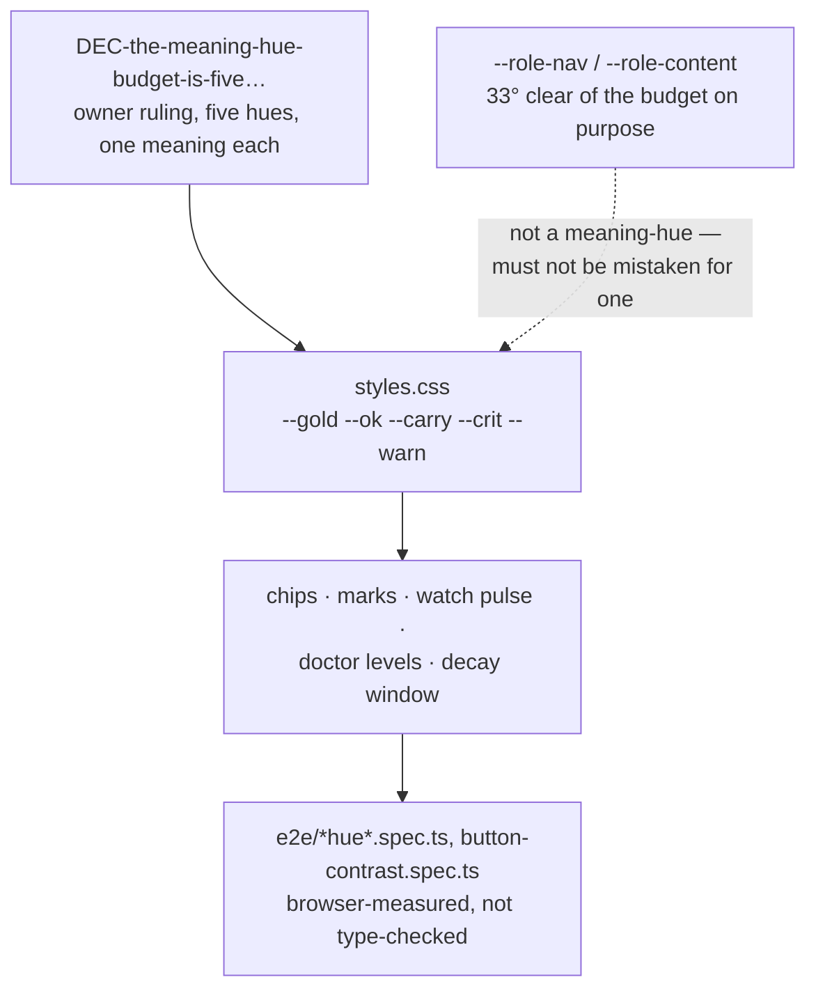

# The palette and the drawn language

`docs/system/00-index.md`

## 1. What this is — and the collision to get out of the way first

**"Palette" means two unrelated things in this codebase, and an earlier brief for this very
documentation pass fell into the trap.** `src/ui/public/lib/palette-defs.js` (873 lines) has
nothing to do with colour. It is the **command catalogue** for the Composer screen — every CLI
command offerable as a form, with metadata about which are runnable, which touch a write boundary,
and which flags the form deliberately does not offer. The screen's own label is **Composer** in
English (`strings/en.js:147`) and **מרכיב פקודות** — "command composer" — in Hebrew
(`strings/he.js:136`): a translation rather than the English word carried over. Neither language
calls it "Palette", which is the point. The file is gated by `test/ui/palette-lib.test.ts` against
the real CLI parser, so a command the catalogue describes wrong fails a test, not a design review.

The actual meaning-hue budget lives in `styles.css`, as a block of CSS custom properties. This
chapter is about *that* — colour, icons, fonts, and the generated diagrams — and it mentions
`palette-defs.js` exactly once more, in the code map, so that a reader who goes looking for it knows
where it actually lives and why it is not covered further here.

## 2. What it holds today

| Piece | Where | What it is |
|---|---|---|
| The five meaning-hues | `styles.css`, `--gold`/`--ok`/`--carry`/`--crit`/`--warn` (around a comment block ~line 90) | The only colours in this product that carry *meaning* — see §3 |
| Two role-hues | `styles.css`, `--role-nav`/`--role-content` | Deliberately **not** meaning-hues; kept 33° clear of the budget so they cannot be mistaken for one |
| Icons | `src/ui/public/index.html`, an inline `<svg>` sprite | Tabler outline icons (MIT), addressed by `<use href="#i-name">`; **6 symbols exist today** (`add`, `confirm`, `copy`, `open`, `refresh`, `search`), and only one (`open`) has a real consumer (`screens/parts.js`'s `openIcon()`) |
| Fonts | `src/ui/public/fonts/` | Geist (Latin, several weights) and IBM Plex Sans Hebrew — self-hosted `.woff2`, no external font request |
| Generated diagrams | `src/ui/public/diagrams/` | **10 SVG files today** (686,068 bytes), content-addressed by the first 16 hex characters of the SHA-256 of their Mermaid source, drawn by `scripts/gen-diagrams.ts` — **all ten from the two READMEs, none from this directory; see §5** |

## 3. How it works: the hue budget is an argument, not a swatch

`styles.css` does not just declare five colours — it argues for each one, in comment blocks that run
to hundreds of lines across the file, case by case, about why a given surface may or may not spend a
sixth hue. That argument is governed by one corpus item:
`DEC-the-meaning-hue-budget-is-five-gold-ok-carry-crit-and-warn`, an owner ruling with a real
history worth reading in full rather than through a paraphrase — it corrected an earlier belief that
the budget was *four*, after a reconciliation found `--warn` already live in eight places despite a
task filed on the premise that it had been retired. The ruling's own words: *"the budget is
five... a budget nobody updated is how the code came to disagree with the direction silently in the
first place."*

The reasoning for five and not four is functional, not aesthetic: `doctor`'s findings are
error/warning/notice, in the CLI's own vocabulary, not a design invention; the Watch screen's pulse
must separate a refusal from a mutation from everything ordinary; decay's window boundary is a
caution, not a failure. Four hues forces two of those into one colour. The ruling was later amended
(2026-08-27) to add a second constraint on top of the same five: **a hue may narrow a group, never
name one** — after a measurement found `--gold` and `--ok` sit at 1.04:1 contrast against each other,
close enough that the accompanying word was already doing the work of telling them apart, and the
amendment made the design say so rather than claim a distinction the eye cannot make.

**None of this is enforced by a type system.** There is no code path that refuses a sixth
CSS custom property named like a meaning-hue. What enforces the budget is a combination of browser
gates (`e2e/chip-hue-authority.spec.ts`, `e2e/code-hue.spec.ts`, `e2e/mark-hues.spec.ts`,
`e2e/button-contrast.spec.ts`) and the comment discipline in `styles.css` itself, which is why a
documenter of this subject has to *render it*, not describe it in prose alone.



## 4. Colour by numbers, because the ruling was made this way

The contrast figures are worth carrying forward because the whole point of the decision was that it
was made from measured pixels rather than from preference. **They are also the easiest thing in this
chapter to get wrong, and an earlier draft of it did.** `styles.css:123–127` records *two* columns —
`ours`, the four colours retired on 2026-09-01, and `generator`, the four that ship — and it is the
retired column whose numbers are the memorable ones. What follows is the shipped column, with the
retired one kept beside it so the two cannot be confused again.

**Against `--panel` (#17171c)**, the ground the flattened level fields sit on:

| level | shipped colour | contrast | the colour it replaced | that colour's ratio |
|---|---|---|---|---|
| safe | `#22c55e` | **7.84:1** | `#7cc0a0` (retired) | 8.42:1 |
| caution | `#eab308` | **9.31:1** | `#e8c368` (retired) | 10.58:1 |
| warning | `#f97316` | **6.37:1** | `#c78f3d` (retired) | 6.31:1 |
| critical | `#ef4444` | **4.75:1** | `#e08b8b` (retired) | 7.00:1 |

All four shipped colours clear WCAG AA for normal text (4.5:1). **`--crit` clears it by 0.25 — a
quarter of a point — and that is the sentence this table exists to carry.** Against the retired
colour's 7.00 the critical hue looks like it has two and a half points of headroom; it has a quarter
of one. A number that reads as comfortable is in fact marginal, and it is the only row here with no
room to absorb a change at all. On the darker `--panel-2` (#1d1d24) the same `#ef4444` measures
**4.45:1** and **fails** — survivable only because the two flattened fields in question sit on
`--panel`; any level ink that later lands on the darker ground does not clear.
`styles.css:129–133` records that warning in as many words, for exactly this reason.

*(Every ratio above was recomputed from the hex values under WCAG 2.x relative luminance while this
chapter was repaired, rather than copied from anywhere. The shipped column reproduces
`styles.css:124–127`'s `generator` column to the second decimal and the retired column reproduces
its `ours` column to the second decimal — which is what identifies the mix-up rather than merely
suggesting it.)*

**`--gold` and `--ok` are recorded at 1.04:1 against each other** — indistinguishable by contrast
alone, which is the measurement behind the "a hue may narrow, never name" rule in §3. That figure is
quoted faithfully, from the ruling itself (`:50`) and again from `styles.css:991`, but **it does not
reproduce from either palette**: the shipped pair measures **1.19:1** and the retired pair 1.26:1.
The conclusion survives either reading — 1.19:1 is as indistinguishable as 1.04:1, and the word
beside the hue is still doing the work — but the number itself has never been re-derived, and should
not be cited as a measurement of the shipped palette.

## 5. Diagrams: generated, never hand-drawn, and never shipped as a dependency

`scripts/gen-diagrams.ts` is the mechanism `README.md`'s and `docs/README.he.md`'s own Mermaid
diagrams are drawn through — **and those two files are the whole of its input.** `DIAGRAM_SOURCES`
(`gen-diagrams.ts:61`) is exactly `['README.md', 'docs/README.he.md']`, so **not one of the twelve
Mermaid diagrams in `docs/system/` is drawn, committed as an SVG, or covered by the gate**. They
render only in whatever viewer opens the Markdown, and nothing in CI would notice if one stopped
parsing.

**That is a real gap and it has already cost something.** The sequence diagram at
`docs/capabilities/07-restore-and-handover.md:78` carried `&lt;key&gt;`, whose `&` breaks Mermaid's
lexer, and it drew an error box on the page for as long as it had existed — repaired by hand on
2026-09-17 (`471b13b3`) after a reading pass caught it, not after a gate did. Worse, a pass over
those diagrams had already reported that every fence parsed: it had checked **bracket balance**, not
rendering, and balance is not parsing. Nothing but an actual Mermaid parse would have caught that
fence, and nothing in this repository performs one outside the two READMEs. Both `docs/system/`'s
twelve diagrams and `docs/capabilities/`'s sixteen do parse as of 2026-09-17 — each was fed to
`mermaid.parse()` in real Mermaid 11.17.2 while this chapter was repaired — but that is a reading,
not a guarantee, and nothing re-takes it.

The generator does not scan for ```` ```mermaid ```` fences with a regex of its own; it asks
`src/ui/public/lib/markdown.js` — the same vendored tokeniser the browser renders with — which fences are diagrams, through the one function (`mermaidBlocks`) both the
generator and the live page call. A second, independent fence-scanner here would have been exactly
the kind of duplicated rule this project's own failure history warns against.

Drawing happens in real Chromium (`playwright`, already a devDependency for the browser test suite),
because Mermaid has no server-side renderer: a blank page, `mermaid.min.js` injected, `mermaid.render()`
called per diagram, the resulting markup re-serialised through `XMLSerializer` before being written
to disk — Mermaid returns HTML-shaped markup (an unclosed `<br>`, valid HTML and fatal XML), and an
SVG loaded through `` is parsed strictly as XML, so the first run of this generator produced
literal broken-image glyphs until the re-serialisation step was added. Filenames are content-addressed
— `d-<first 16 hex characters of the source's SHA-256>.svg`, since `gen-diagrams.ts:82` takes
`.digest('hex').slice(0, 16)` rather than the whole digest — specifically so a diagram that changes
leaves its old file unreferenced rather than silently stale, and `test/ui/diagram-gate.test.ts`
fails the build if the committed SVGs and the two source READMEs ever disagree.

**Mermaid itself never ships.** It is a devDependency used only at generation time. Vendoring it to
render live in the browser was costed and rejected: 3,572,661 bytes, 96% of the entire change,
against a product whose stated selling point is installing without fetching packages
(`CONST-zero-runtime-dependencies`). Ten committed SVGs cost **686,068 bytes — about 670 KB** — and
nothing else. (Summed over the ten files on 2026-09-17; an earlier draft of this chapter said
"roughly 630 KB", which is not what the directory holds.)

## 6. What is known wrong or unfinished here

- **The hue budget is enforced entirely by browser gates and by the discipline of `styles.css`'s own
  comments — there is no static check that a new custom property does not silently claim a sixth
  meaning-hue.** A gate comparing the declared token set against the ruling's list does not exist;
  the 2026-08-25 ruling itself names this as the actual gap that let a fifth hue ship before anyone
  ruled on it.
- **The icon set is minimal on purpose but genuinely small: 6 symbols, 1 real consumer.** Several
  open tasks concern glyphs and hues directly —
  `TASK-a-glyph-makes-a-kind-recognisable-without-reading-in-every` (a survey of every viewer case
  where an icon would help, not yet done) and
  `TASK-selection-on-the-mode-picker-is-conveyed-by-colour-alone` (a control that currently relies on
  colour alone to show selection state, which fails for a colour-blind reader regardless of contrast
  ratio). Both were open at the time this chapter was written; check their current `state` before
  citing them as still open.
- **No diagram outside the two READMEs is generated, committed or gated** (§5). `DIAGRAM_SOURCES`
  is `['README.md', 'docs/README.he.md']`, so the twelve diagrams in `docs/system/` and the sixteen
  in `docs/capabilities/` render only in whatever viewer opens the Markdown. One of them shipped as
  an error box for its whole life before a person noticed. Widening `DIAGRAM_SOURCES` is a one-line
  change, but it is not a one-line decision: it would put 28 more SVGs in the repository against 10
  today, at a measured mean of 68,607 bytes each — roughly 1.9 MB of committed binary that every
  clone carries and every diagram edit re-writes. A parse-only gate, which draws nothing and commits
  nothing, would have caught the error box at a fraction of that. **Which of the two — or neither —
  is the owner's call, and is recorded for him rather than decided here.**
- **Navigation and Copy panels** (see `docs/system/02-the-document-and-lane-viewer.md` §6) will, when
  built, need their own pass through this hue and icon budget — nothing here anticipates their needs.

## 7. Code map

| File | What it owns |
|---|---|
| `src/ui/public/styles.css` (5,498 lines) | The five-hue budget, the two role-hues, and hundreds of lines of comment arguing each spend |
| `src/ui/public/index.html` | The inline icon sprite (6 `<symbol>` elements today) |
| `src/ui/public/fonts/` | Geist and IBM Plex Sans Hebrew, self-hosted |
| `src/ui/public/diagrams/` | 10 generated SVGs, 686,068 bytes, content-addressed on the first 16 hex characters of the source's SHA-256 — all ten drawn from the two READMEs, none from this directory |
| `scripts/gen-diagrams.ts` (282 lines) | The generator: finds fences via the live renderer, draws them in headless Chromium, re-serialises to valid XML |
| `src/ui/public/lib/diagrams.js` | Generated lookup module (`DIAGRAMS`, `DIGESTS`) — never hand-edited; `test/ui/diagram-gate.test.ts` fails the build on drift |
| `src/ui/public/lib/palette-defs.js` (873 lines) | **Not this subject.** The Composer command catalogue — see §1 |
| `DEC-the-meaning-hue-budget-is-five-gold-ok-carry-crit-and-warn` | The corpus item governing §3 and §4 |

## See also

- [`docs/design/web-ui-mockup.html`](../design/web-ui-mockup.html) — the design source; a rule
  makes it authoritative over the shipped screens
- [`docs/capabilities/08-web-ui.md`](../capabilities/08-web-ui.md) — the web UI this palette
  belongs to
- [`docs/system/02-the-document-and-lane-viewer.md`](./02-the-document-and-lane-viewer.md) — the
  CSS Custom Highlight API's own colour needs, a related but separate concern from the meaning-hue
  budget in this chapter
