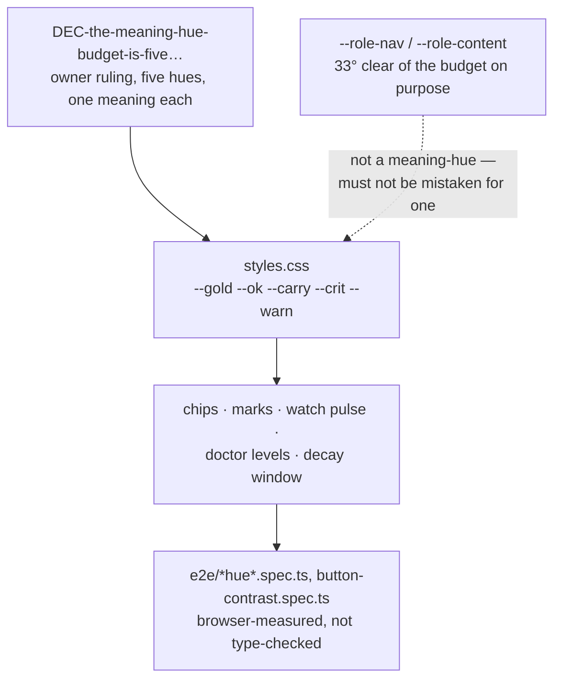

# The palette and the drawn language

`docs/system/00-index.md`

## 1. What this is — and the collision to get out of the way first

**"Palette" means two unrelated things in this codebase, and an earlier brief for this very
documentation pass fell into the trap.** `src/ui/public/lib/palette-defs.js` (873 lines) has
nothing to do with colour. It is the **command catalogue** for the Composer screen — every CLI
command offerable as a form, with metadata about which are runnable, which touch a write boundary,
and which flags the form deliberately does not offer. The screen's own label is **Composer** in
English (`strings/en.js:147`) and **מרכיב פקודות** — "command composer" — in Hebrew
(`strings/he.js:136`): a translation rather than the English word carried over. Neither language
calls it "Palette", which is the point. The file is gated by `test/ui/palette-lib.test.ts` against
the real CLI parser, so a command the catalogue describes wrong fails a test, not a design review.

The actual meaning-hue budget lives in `styles.css`, as a block of CSS custom properties. This
chapter is about *that* — colour, icons, fonts, and the generated diagrams — and it mentions
`palette-defs.js` exactly once more, in the code map, so that a reader who goes looking for it knows
where it actually lives and why it is not covered further here.

## 2. What it holds today

| Piece | Where | What it is |
|---|---|---|
| The five meaning-hues | `styles.css:147`, `--gold`/`--ok`/`--carry`/`--crit`/`--warn`, declared on one line under the 2026-09-01 palette-trial comment at `:101–145` | The only colours in this product that carry *meaning* — see §3 |
| Two role-hues | `styles.css:2026`, `--role-nav:#22b8b0`/`--role-content:#c084fc` | Deliberately **not** meaning-hues; `:2008` records them at 177° and 270°, clear of every budgeted hue by 33°, so they cannot be mistaken for one |
| Icons | `src/ui/public/index.html`, an inline `<svg>` sprite | Tabler outline icons (MIT), addressed by `<use href="#i-name">`; **6 symbols exist today** (`add`, `confirm`, `copy`, `open`, `refresh`, `search`), and only one (`open`) has a real consumer (`screens/parts.js`'s `openIcon()`) |
| Fonts | `src/ui/public/fonts/` | Geist (Latin, several weights) and IBM Plex Sans Hebrew — self-hosted `.woff2`, no external font request |
| Generated diagrams | `src/ui/public/diagrams/` | **10 SVG files** totalling **694,331 bytes** (678.1 KiB; re-summed 2026-09-17 after the drawings were regenerated — an earlier reading of the same directory was 686,068), content-addressed by the first 16 hex characters of the SHA-256 of their Mermaid source, drawn by `scripts/gen-diagrams.ts` — **all ten from the two READMEs, none from this directory; see §5** |

## 3. How it works: the hue budget is an argument, not a swatch

`styles.css` does not just declare five colours — it argues for each one, in comment blocks that run
to hundreds of lines across the file, case by case, about why a given surface may or may not spend a
sixth hue. That argument is governed by one corpus item:
`DEC-the-meaning-hue-budget-is-five-gold-ok-carry-crit-and-warn`, an owner ruling with a real
history worth reading in full rather than through a paraphrase. Ruled **2026-08-25**, it corrected
an earlier belief that the budget was *four*: the approved visual direction of 2026-08-21 budgeted
gold, ok, carry and crit, and `plan:repaint seq:13a` was filed on the belief that `--warn` had been
retired. The reconciliation found the premise false the same day — `styles.css` declared all five
on one line, and **eight places** used `var(--warn)`: `decay.js` (three of them), `graph.js`,
`port.js`, `watch.js`, `work.js`, and `styles.css` itself.

**Two of the ruling's sentences are worth quoting and they are four lines apart, so they are given
as two**; an earlier draft of this chapter welded them with an ellipsis, which is the defect chapter
02 §4 names — a join hidden as an omission. The ruling: *"THE RULING: THE BUDGET IS FIVE. `--warn`
is legitimate and stays."* And, further down, under what must follow: *"A budget nobody updated is
how the code came to disagree with the direction silently in the first place, and there is no gate
comparing the declared token set against the budget -- which is why five hues shipped without anyone
ruling on the fifth."* The capitals and the doubled hyphen are the item's.

The reasoning for five and not four is functional, not aesthetic: `doctor`'s findings are
error/warning/notice, in the CLI's own vocabulary, not a design invention; the Watch screen's pulse
must separate a refusal from a mutation from everything ordinary; decay's window boundary is a
caution, not a failure. Four hues forces two of those into one colour. The ruling was later amended
(2026-08-27) to add a second constraint on top of the same five: **a hue may narrow a group, never
name one** — after a measurement found `--gold` and `--ok` sit at 1.04:1 contrast against each other,
close enough that the accompanying word was already doing the work of telling them apart, and the
amendment made the design say so rather than claim a distinction the eye cannot make.

**None of this is enforced by a type system.** There is no code path that refuses a sixth
CSS custom property named like a meaning-hue. What enforces the budget is a combination of browser
gates (`e2e/chip-hue-authority.spec.ts`, `e2e/code-hue.spec.ts`, `e2e/mark-hues.spec.ts`,
`e2e/button-contrast.spec.ts`) and the comment discipline in `styles.css` itself, which is why a
documenter of this subject has to *render it*, not describe it in prose alone.



## 4. Colour by numbers, because the ruling was made this way

The contrast figures are worth carrying forward because the whole point of the decision was that it
was made from measured pixels rather than from preference. **They are also the easiest thing in this
chapter to get wrong, and an earlier draft of it did.** `styles.css:123–127` records *two* columns —
`ours`, the four colours retired on 2026-09-01, and `generator`, the four that ship — and it is the
retired column whose numbers are the memorable ones. What follows is the shipped column, with the
retired one kept beside it so the two cannot be confused again.

**Against `--panel` (#17171c)**, the ground the flattened level fields sit on:

| level | shipped colour | contrast | the colour it replaced | that colour's ratio |
|---|---|---|---|---|
| safe | `#22c55e` | **7.84:1** | `#7cc0a0` (retired) | 8.42:1 |
| caution | `#eab308` | **9.31:1** | `#e8c368` (retired) | 10.58:1 |
| warning | `#f97316` | **6.37:1** | `#c78f3d` (retired) | 6.31:1 |
| critical | `#ef4444` | **4.75:1** | `#e08b8b` (retired) | 7.00:1 |

All four shipped colours clear WCAG AA for normal text (4.5:1). **`--crit` clears it by 0.25 — a
quarter of a point — and that is the sentence this table exists to carry.** Against the retired
colour's 7.00 the critical hue looks like it has two and a half points of headroom; it has a quarter
of one. A number that reads as comfortable is in fact marginal, and it is the only row here with no
room to absorb a change at all. On the darker `--panel-2` (#1d1d24) the same `#ef4444` measures
**4.45:1** and **fails** — survivable only because the two flattened fields in question sit on
`--panel`; any level ink that later lands on the darker ground does not clear.
`styles.css:129–133` records that warning in as many words, for exactly this reason.

*(Every ratio above was recomputed from the hex values under WCAG 2.x relative luminance while this
chapter was repaired, rather than copied from anywhere. The shipped column reproduces
`styles.css:124–127`'s `generator` column to the second decimal and the retired column reproduces
its `ours` column to the second decimal — which is what identifies the mix-up rather than merely
suggesting it.)*

**`--gold` and `--ok` are recorded at 1.04:1 against each other** — indistinguishable by contrast
alone, which is the measurement behind the "a hue may narrow, never name" rule in §3. That figure is
quoted faithfully, from the ruling itself (`:50`) and again from `styles.css:1003`, but **it does not
reproduce from either palette**: the shipped pair measures **1.19:1** and the retired pair 1.26:1.
The conclusion survives either reading — 1.19:1 is as indistinguishable as 1.04:1, and the word
beside the hue is still doing the work — but the number itself has never been re-derived, and should
not be cited as a measurement of the shipped palette.

**The same swap is still live in `styles.css`, in a comment that says it is not**, and it is worth
naming because it is the strongest evidence that this class of error does not stay fixed once.
`styles.css:1319–1320` records, under the heading *"CONTRAST RE-MEASURED FOR TEXT, not carried
across"* and closing *"which is a measurement and not an assumption"*, the figures
`--ok 8.42/7.90:1, --gold 10.58/9.92:1, --warn 6.31/5.92:1, --crit 7.00/6.57:1` on `--panel` and
`--panel-2`. Every one of those eight numbers is the **retired** colour's ratio, reproduced to the
second decimal on both grounds, wearing the shipped token's name. Recomputed from the shipped hexes
while this chapter was checked, the true pairs are `--ok` 7.84/7.35, `--gold` 9.31/8.74, `--warn`
6.37/5.98 and `--crit` **4.75/4.45**. That comment then concludes *"All clear AA; the worst is
--warn at 5.92:1"* — and on the shipped palette the worst is `--crit` at **4.45:1, which does not
clear AA at all**, a fact `styles.css:129–133` states correctly eleven hundred lines above it. This
is in `styles.css` and not in this directory, so it is reported here rather than repaired; it is
filed nowhere else that this pass could find.

## 5. Diagrams: generated, never hand-drawn, and never shipped as a dependency

`scripts/gen-diagrams.ts` is the mechanism `README.md`'s and `docs/README.he.md`'s own Mermaid
diagrams are **drawn** through — and those two files are the whole of its input. `DIAGRAM_SOURCES`
(`gen-diagrams.ts:69`) is exactly `['README.md', 'docs/README.he.md']`, so **not one of the twelve
Mermaid diagrams in `docs/system/` is drawn or committed as an SVG.** They render only in whatever
viewer opens the Markdown.

**Drawn and gated are now two different questions, and only one of them is still open.** This is the
claim in this chapter that changed most recently, and the version before it said flatly that nothing
under `docs/` was covered at all. That was true when it was written and stopped being true the same
day.

What happened first is the cost. The sequence diagram at
`docs/capabilities/07-restore-and-handover.md:78` carried `&lt;key&gt;`, whose `&` breaks Mermaid's
lexer, and it drew an error box on the page for as long as it had existed — repaired by hand on
2026-09-17 (`471b13b3`) after a reading pass caught it, not after a gate did. Worse, a pass over
those diagrams had already reported that every fence parsed: it had checked **bracket balance**, not
rendering, and balance is not parsing.

What happened next is that the owner was shown the two options and chose between them in two words —
**"the parse-only gate"** — and `scripts/check-diagrams-parse.ts` (`npm run check:diagrams`) is that
ruling spent. It is worth being exact about what it does and does not do, because the distinction is
the whole of the ruling:

- **It parses and draws nothing.** No SVG is produced, no file written, `DIAGRAM_SOURCES` untouched,
  `DIAGRAMS` unchanged (`check-diagrams-parse.ts:23–30`). Whether these fences are ever *drawn*
  stays the owner's open question; whether they *parse* stops being one — and the measurement behind
  that ruling is in the same block: drawing every undrawn fence was costed at **~1.5–1.8 MiB**,
  taking `src/ui/public` from 5.04 MB to ~6.7 MB, past a size budget already rejected once.
- **Its source list is deliberately wider than the generator's, and deliberately not read from it.**
  `DOC_SOURCES` (`:108–113`) is `README.md`, `docs/README.he.md`, `docs/capabilities` and
  `docs/system` — directories walked for `.md`. Importing `DIAGRAM_SOURCES` would have re-created
  the hole, since the whole defect was that the drawing list is short.
- **It runs its own red proof before it believes any green.** The first thing each run does is feed
  mermaid the pre-repair chapter-7 fence, recovered verbatim from
  `471b13b3^:docs/capabilities/07-restore-and-handover.md`, through the same extraction and the same
  parse, and abort non-zero if mermaid *accepts* it.
- **One extractor, one config.** Fences come from the product's own `mermaidBlocks` in
  `lib/markdown.js`, and mermaid is initialised with the generator's own `securityLevel: 'strict'`,
  theme and font stack — so a fence cannot pass this gate and fail the drawing.
- **It is wired into both `ci.yml` and `release.yml`** (`ci.yml:214`, `release.yml:121`) — in both
  cases behind `if: matrix.name == 'ubuntu'`, because it needs a Chromium and only the ubuntu job
  has one. A Windows-only run of the workflow does not take this reading.

Run repeatedly while this chapter was checked, 2026-09-17: **every fence parsed, every time, in
about a second.** The totals moved between runs — 38 fences, then 39 — because another lane was
editing `docs/capabilities/` throughout, which is the honest reason to record the shape rather than
the number: 10 fences in the two READMEs, **12 under `docs/system/`** (a thirteenth `grep` hit in
this chapter is the prose two paragraphs below, not a fence), and the rest under
`docs/capabilities/`. Run it yourself; it takes about a second and it prints its own denominator.

The generator does not scan for ```` ```mermaid ```` fences with a regex of its own; it asks
`src/ui/public/lib/markdown.js` — the same vendored tokeniser the browser renders with — which fences are diagrams, through the one function (`mermaidBlocks`) both the
generator and the live page call. A second, independent fence-scanner here would have been exactly
the kind of duplicated rule this project's own failure history warns against.

Drawing — as distinct from parsing — happens in real Chromium (`playwright`, already a devDependency for the browser test suite),
because Mermaid has no server-side renderer: a blank page, `mermaid.min.js` injected, `mermaid.render()`
called per diagram, the resulting markup re-serialised through `XMLSerializer` before being written
to disk — Mermaid returns HTML-shaped markup (an unclosed `<br>`, valid HTML and fatal XML), and an
SVG loaded through `` is parsed strictly as XML, so the first run of this generator produced
literal broken-image glyphs until the re-serialisation step was added. Filenames are content-addressed
— `d-<first 16 hex characters of the source's SHA-256>.svg`, since `gen-diagrams.ts:90` takes
`.digest('hex').slice(0, 16)` rather than the whole digest — specifically so a diagram that changes
leaves its old file unreferenced rather than silently stale, and `test/ui/diagram-gate.test.ts`
fails the build if the committed SVGs and the two source READMEs ever disagree.

**Mermaid itself never ships.** It is a devDependency used only at generation time. Vendoring it to
render live in the browser was costed and rejected: 3,572,661 bytes, 96% of the entire change,
against a product whose stated selling point is installing without fetching packages
(`CONST-zero-runtime-dependencies`, and the figure is `gen-diagrams.ts:12`'s own). Ten committed
SVGs cost **694,331 bytes — 678.1 KiB, or 694.3 kB decimal** — and nothing else. (Summed over the
ten files on 2026-09-17, after the last regeneration. Two earlier drafts of this chapter said
"roughly 630 KB" and then 686,068 bytes; neither is what the directory holds now, which is the point
of dating it rather than asserting it.)

## 6. What is known wrong or unfinished here

- **The hue budget is enforced entirely by browser gates and by the discipline of `styles.css`'s own
  comments — there is no static check that a new custom property does not silently claim a sixth
  meaning-hue.** A gate comparing the declared token set against the ruling's list does not exist;
  the 2026-08-25 ruling itself names this as the actual gap that let a fifth hue ship before anyone
  ruled on it.
- **The icon set is minimal on purpose but genuinely small: 6 symbols, 1 real consumer.** Several
  open tasks concern glyphs and hues directly —
  `TASK-a-glyph-makes-a-kind-recognisable-without-reading-in-every` (a survey of every viewer case
  where an icon would help, not yet done) and
  `TASK-selection-on-the-mode-picker-is-conveyed-by-colour-alone` (a control that currently relies on
  colour alone to show selection state, which fails for a colour-blind reader regardless of contrast
  ratio). Both were open at the time this chapter was written; check their current `state` before
  citing them as still open.
- **No diagram outside the two READMEs is *drawn* — but every one under `docs/` is now *parsed*.**
  `DIAGRAM_SOURCES` is still `['README.md', 'docs/README.he.md']`, so the twelve diagrams in
  `docs/system/` and the seventeen in `docs/capabilities/` exist only as fences a viewer renders; the
  question of whether they should also be committed as SVGs is the owner's and is still open,
  costed at ~1.5–1.8 MiB (§5). What is **no longer** open is whether a broken one can ship
  unnoticed: `npm run check:diagrams` refuses it, in CI, in about a second. The previous version of
  this bullet asked for that gate; it exists, and this is the correction rather than the request.
- **The parse gate's reach stops short of two documents that carry real fences.** `DOC_SOURCES`
  covers `README.md`, `docs/README.he.md`, `docs/capabilities` and `docs/system`. It does **not**
  cover `docs/the-store.he.md`, which carries **4** Mermaid fences and is the worked example
  `docs/system/00-index.md` names as the model for this entire directory, nor
  `docs/superpowers/plans/2026-08-14-mycontext-documentation.md`, which carries 1. Five gated-by
  nothing fences, in the document this directory is shaped after. `docs/tutorials/` carries none, so
  it is not a gap. Counted with `grep -c '```mermaid'` over every `.md` in the tree on 2026-09-17.
- **`styles.css:1319–1320` asserts AA compliance for a colour that fails it** (§4), under a heading
  claiming the figures were re-measured rather than carried across. That is one file outside this
  directory's scope and it is reported here because nothing else appears to have recorded it.
- **The Navigation and Copy panels have shipped** (`ef52818f`, 2026-09-17). The previous version of
  this bullet said they were unbuilt and would need a pass through this budget when they arrived.
  They arrived, and the honest reading is narrower than either "still owed" or "fine": that commit
  adds **no new colour token and no new meaning-hue** — every hex literal it introduces
  (`#8b9ce6` = `--carry`, `#6e6e7e` = `--edge-3`, `#1d1d24` = `--panel-2`, `#0f0f12` = `--paper`) is
  an existing token named inside a measurement — and it does carry contrast readings for the panel's
  own ground, `--carry` at 6.38:1 on `--panel-2` and 7.29:1 on `--paper`, both of which reproduce
  exactly when recomputed from the hexes. What this chapter could **not** establish either way is
  whether the panels were checked against the *icon* budget, since they add no `<use href="#i-…">`
  and the sprite is unchanged at six symbols — which is consistent with both "checked and needed
  none" and "not considered".

## 7. Code map

**Every `styles.css` line number in this chapter is read at commit `e515eff4`, and that is stated
rather than assumed because the file is moving under it.** It was 5,498 lines at the HEAD the
previous pass was written against, is **5,868** at `e515eff4`, and **5,969** in the working tree as
this was written — another lane's uncommitted work, inserting from line 944 downward, which already
shifts `:1003`, `:1319–1320` and `:2026` by about seventy lines for anyone reading the working tree
rather than HEAD. `:101–147` is above the insertion point and is unaffected. Recording the
working-tree numbers would have recorded another lane's unlanded work as though it had shipped;
recording HEAD and naming the commit is the version that can be checked later.

| File | What it owns |
|---|---|
| `src/ui/public/styles.css` (5,868 lines) | The five-hue budget (declared at `:147`, argued at `:101–145`), the two role-hues (`:2026`), and hundreds of lines of comment arguing each spend |
| `src/ui/public/index.html` | The inline icon sprite (6 `<symbol>` elements today) |
| `src/ui/public/fonts/` | Geist and IBM Plex Sans Hebrew, self-hosted |
| `src/ui/public/diagrams/` | 10 generated SVGs, 694,331 bytes (2026-09-17), content-addressed on the first 16 hex characters of the source's SHA-256 — all ten drawn from the two READMEs, none from this directory |
| `scripts/gen-diagrams.ts` (290 lines) | The generator: finds fences via the live renderer, draws them in headless Chromium, re-serialises to valid XML. Draws only `DIAGRAM_SOURCES` (`:69`) |
| `src/ui/public/lib/diagrams.js` | Generated lookup module (`DIAGRAMS`, `DIGESTS`) — never hand-edited; `test/ui/diagram-gate.test.ts` fails the build on drift |
| `src/ui/public/lib/palette-defs.js` (873 lines) | **Not this subject.** The Composer command catalogue — see §1 |
| `DEC-the-meaning-hue-budget-is-five-gold-ok-carry-crit-and-warn` | The corpus item governing §3 and §4 |

## See also

- [`docs/design/web-ui-mockup.html`](../design/web-ui-mockup.html) — the design source; a rule
  makes it authoritative over the shipped screens
- [`docs/capabilities/08-web-ui.md`](../capabilities/08-web-ui.md) — the web UI this palette
  belongs to
- [`docs/system/02-the-document-and-lane-viewer.md`](./02-the-document-and-lane-viewer.md) — the
  CSS Custom Highlight API's own colour needs, a related but separate concern from the meaning-hue
  budget in this chapter
