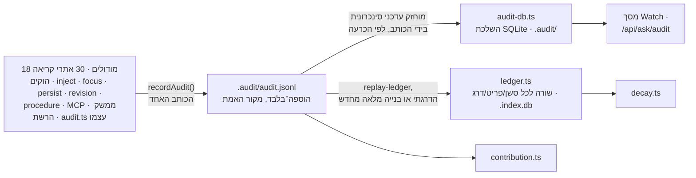

<!--
  Hebrew mirror of `docs/system/04-the-audit-log-decay-and-contribution.md`. The
  English document is the source of record; where the two disagree, the English
  one is right and this one is stale. Conventions, and the link policy, are
  stated once in `docs/system/00-index.he.md`'s own header comment.

  THE TWO PASTED OUTPUT BLOCKS BELOW ARE NOT TRANSLATED AND WERE NOT RETYPED.
  They are what the program printed, and they were spliced byte-for-byte out of
  the English chapter rather than copied by hand — including the two bare `...`
  lines in the second one, which are the English chapter's own marked cuts and
  stand for exactly what the paragraph after the block says they stand for. Only
  the sentences INTRODUCING them are in Hebrew.

  Nothing here was re-measured. Every count is carried across from the English
  chapter as it stands on 2026-09-17; §4 itself is about two of those figures
  moving between two runs of one command on one day.
-->

# יומן הביקורת, הדעיכה והתרומה

<div dir="rtl">

<span dir="ltr">`docs/system/00-index.he.md`</span>

זו הגרסה העברית של
[`docs/system/04-the-audit-log-decay-and-contribution.md`](./04-the-audit-log-decay-and-contribution.md).
המסמך האנגלי הוא המקור; במקרה של סתירה — האנגלית קובעת.

הנושא הזה היה המפוזר ביותר מבין השבעה שהמעבר הזה מכסה — חלקים ממנו מוזכרים בשני פרקי
יכולות ובשני מדריכים, אבל שום דבר אינו בעליו כנושא אחד, וההיעדר הזה של בעלים הוא בעצמו
חלק מהסיבה שקל לקרוא אותו לא נכון. הפרק הזה מטפל בו כשלוש קריאות של יומן הוספה־בלבד
**אחד**, מפני שהיחס הזה — מקור אמת אחד, שתי השלכות מתכלות, שתי קריאות עצמאיות — הוא הדבר
ששום מסמך קיים אינו מנסח בפשטות.

## 1. מה זה, ושלושת הדברים שמתבלבלים איתו

- **יומן הביקורת אינו ארכיון השיחות.** הארכיון
  (<span dir="ltr">`docs/capabilities/04-conversation-archive.md`</span>) מחזיק תמלילים —
  את מה ש*נאמר*. יומן הביקורת מחזיק את מה שה*מערכת עשתה*, תחת שמונה סוגים — ה-enum של
  <span dir="ltr">`--kind`</span> עצמו (<span dir="ltr">`audit.ts:730`</span>) הוא
  <span dir="ltr">`mutation | injection | hook | focus | access | progress | execution |
  read`</span>: כל מוטציה, הזרקה, פעולת הוק, שינוי מיקוד, סירוב גישה, צעד התקדמות, הרצת
  פקודה **וקריאת פריט**. סשן יכול לייצר תמליל ארוך ושובל ביקורת קצר, או להפך.
- **דעיכה אינה גניזה, והיא אינה ממליצה על אחת.** דעיכה עונה על שאלה צרה אחת — אילו פריטים
  לא *הוזרקו* אוטומטית ב-N הסשנים האחרונים — והדוח שלה עצמו חוזר, בכל ריצה, על כך שזה
  אינו אותו דבר כמו לא־בשימוש: פריט שהתייעצו בו דרך `show`, דרך כלי ה-MCP `get_item`, או
  שנקרא ישירות כקובץ Markdown, נראה *בדיוק* כמו פריט נטוש בדוח הזה, מפני שהפנקס רושם
  הזרקה, לא קריאה או הסתמכות. במילותיו של הדוח עצמו: *"do not supersede or deprecate
  anything on this report alone — verify real usage first."*
- **תרומה אינה תור הסקירה ואינה לולאת השיפור העצמי**
  (<span dir="ltr">`docs/capabilities/11-self-improvement-loop.md`</span>). היא עונה על
  שאלה אחרת — כמה פעמים כל פריט באמת *נמסר* לתוך חלון הקשר, בפילוח לפי מי או מה לכד אותו
  במקור (אדם, סוכן, קליטה, סקירה) — והיא ממוסגרת במפורש במודול שלה עצמו כ**בסיס לזיהוי
  סחיפה לאורך זמן**, ולא כהכרעה על פריט כלשהו: *"a single reading is the control for a
  later one."*

## 2. מה נרשם, בידי מי, והערובה של הוספה־בלבד

<span dir="ltr">`.my_context/.audit/audit.jsonl`</span> הוא מקור האמת האחד, במקביל ישיר
ל-<span dir="ltr">`INV-markdown-is-the-source-of-truth`</span> של הקורפוס עצמו — כל דבר
אחר שמתואר בפרק הזה הוא השלכת קריאה מתכלה שנגזרת ממנו. <span dir="ltr">`recordAudit()`</span>
ב-<span dir="ltr">`src/core/audit.ts`</span> הוא הכותב ה**יחיד**, והכתיבה עצמה היא
<span dir="ltr">`appendFileSync`</span> חשוף דרך עוזר קטן
<span dir="ltr">`appendJsonlLine`</span>: הוספה־בלבד נאכפת בכך ששום דבר בבסיס הקוד הזה
אינו חושף נתיב שכתוב, ולא באילוץ של בסיס נתונים. עלות שנמדדה: כ-0.55 ms באחוזון ה-95,
שטוח ללא קשר לכמה היומן גדל — הסיבה המוצהרת לכך שהכתיבה קורית ישירות על הנתיב החם ולא
נאגדת או נדחית.

**שמונה־עשר מודולים קוראים לו, על פני שלושים הפעלות.** המודולים: כל הוק
(<span dir="ltr">`pre-tool-use`</span>, <span dir="ltr">`post-tool-use`</span> וגרסת
הכישלון שלו, <span dir="ltr">`session-end`</span>,
<span dir="ltr">`subagent-start`/`stop`</span>,
<span dir="ltr">`pre-compact`/`post-compact`</span>, <span dir="ltr">`observe`</span>),
ועוד <span dir="ltr">`inject.ts`</span>, <span dir="ltr">`focus.ts`</span>,
<span dir="ltr">`persist.ts`</span>, <span dir="ltr">`revision.ts`</span>,
<span dir="ltr">`procedure.ts`</span>, שכבת כלי ה-MCP, מודולי ההרצה והאבטחה של ממשק הרשת
— ו-<span dir="ltr">`audit.ts`</span> עצמו, שקל להשמיט מרשימת כותבים והוא השמונה־עשר
(<span dir="ltr">`:1699`</span> רושם פריט שנקרא תחת
<span dir="ltr">`kind: 'read'`</span>). "שמונה־עשר" היא ספירה של *קבצים*, לא של ביטויי
קריאה: לפי הפעלה המספר הוא **30**, מרוכז ב-<span dir="ltr">`pre-tool-use`</span> (4),
<span dir="ltr">`post-tool-use`</span> (3) ו-<span dir="ltr">`ui/execute`</span> (3).

**שום פועל אינו מאפשר לאדם לכתוב תוכן שרירותי אל היומן**, וראוי לומר זאת מפני שמשמעותו
היא ש"יומן הביקורת שיקר" אינו משפט שיכול להיות נכון על טעות שאדם כתב, באופן שהוא כן יכול
להיות על פריט קורפוס. אבל צריך לדייק: אדם ליד טרמינל *כן* יכול לגרום לרשומה.
<span dir="ltr">`mycontext procedure`</span> מוסיף רשומות
<span dir="ltr">`kind: 'progress'`</span> עם <span dir="ltr">`origin: 'human'`</span>
כשצעד מופעל, מסומן או מבוטל (<span dir="ltr">`cli/commands/procedure.ts:275`,
`:378`</span>), ושתי אלה הן בין שלושים אתרי הקריאה שנספרו למעלה. מה שאדם אינו יכול לעשות
הוא לחבר את ה*תוכן* — ה-op, ה-kind והפריט הם של הפקודה ולא של הקורא — ולכן היומן נשאר
רשומה של מעשים ולא יומן של טענות.

### שתי ההשלכות, ולמה הן אינן חייבות "להסכים" באופן ששני כותבים עצמאיים היו חייבים

קיימים שני מאגרי SQLite נוספים, ושניהם נבנים מחדש **מתוך** ה-jsonl, לעולם לא להפך:

- **השלכת ה-audit-db** (<span dir="ltr">`src/core/audit-db.ts`</span>, חיה תחת
  <span dir="ltr">`.audit/`</span>) שומרת כל רשומה בשלמותה, כדי שמסך Watch ונתיב
  <span dir="ltr">`/api/ask/audit`</span> יוכלו לתשאל בלי לקרוא מחדש את קובץ ה-jsonl בכל
  בקשה. <span dir="ltr">`DEC-the-writer-keeps-the-audit-projection-current-so-no-reader`</span>
  היא הכרעת בעלים שה*כותב* — ולא משימת רקע — מחזיק את ההשלכה הזאת עדכנית, סינכרונית, אחרי
  שגרסה מסונכרנת־ברקע נמדדה כמתהפכת בין "טרייה" ל"מפגרת" פעמיים בארבעים דקות ומגישה
  תוצאות מיושנות במסך Watch בינתיים.
- **פנקס ההזרקות** (<span dir="ltr">`src/core/ledger.ts`</span>, שורה אחת לכל
  סשן/פריט/דרג, חי בתוך <span dir="ltr">`.index.db`</span> הראשי ולא תחת
  <span dir="ltr">`.audit/`</span>) הוא מה ש-<span dir="ltr">`decay.ts`</span> קורא.
  <span dir="ltr">`ledgerRows()`</span> ב-<span dir="ltr">`audit.ts`</span> יכולה לשחזר שורות פנקס ישירות
  מה-jsonl, ו-<span dir="ltr">`mycontext audit replay-ledger`</span> משלימה את הפנקס
  בהדרגה, או בונה אותו מחדש מאפס אם הוא סטה.

מפני שיש בדיוק כותב אחד (ההוספה ל-jsonl) וכל השאר הוא השלכת קריאה שאפשר למחוק ולייצר
מחדש, "הסכמה" כאן אינה שני מקורות עצמאיים שמתיישבים — היא השלכה שהיא או עדכנית או מוצהרת
כמפגרת, לעולם לא מיושנת בשקט.

</div>



<div dir="rtl">

## 3. דעיכה — מה היא מחשבת, ופלט אמיתי

<span dir="ltr">`decay.ts`</span> לוקח את שורות השימוש של הפנקס וחלון (מספר סשנים), ומשייך
כל פריט בר־הזרקה לדליים `cold` (לא הוזרק בתוך החלון), `warm` (הוזרק בתוכו), ו-`unrestricted`
— *תצוגה* מעל פריטים בלי הגבלת scope, ולא חלוקה שלישית; פריט שם נספר גם ב-cold או
ב-warm. <span dir="ltr">`DEC-the-decay-threshold-is-stated-on-the-screen-and-read-from`</span>
היא הכרעת בעלים שהחלון והסף חייבים תמיד להיקרא מתצורה חיה ולהיאמר על המסך, אחרי שגרסה
קודמת נמצאה מציגה את המספר בשום מקום ב-DOM.

</div>

```
$ mycontext decay --summary
my_context decay — items not injected in the last 20 session(s). The ledger holds 40 session(s).
  "cold" means: not auto-injected in the last window of sessions. It does NOT mean unused — the
  ledger records injection, not reading or reliance, so a new item, and any item consulted via
  `show`, MCP `get_item`, or the Markdown file directly, look exactly like an abandoned one here.
  Do not supersede or deprecate anything on this report alone — verify real usage first.

cold 0, warm 165, of which 124 unrestricted. Rows with `mycontext decay` (default) or `--full`.
```

<div dir="rtl">

*(פלט אמיתי מול המאגר הזה, **שלם ובלתי מקוצר** — נלכד מחדש בהרצת הפקודה ב-2026-09-17
ונשתל, ולא נערך מהדבקה קודמת, והורץ שוב בזמן שהפרק הזה נבדק: הוא השתחזר בית בית, וזו הדרך
היחידה לדעת שלכידה מחדש נאמנה. **ארבע** השורות המוזחות הן ההצהרה ש-§1 מצטט והן מודפסות
בכל ריצה; טיוטה קודמת של הפרק הזה הסירה אותן בזמן שציטטה אחת מהן עמוד קודם, והטיוטה
שהחזירה אותן קראה להן חמש. הריצו מחדש לפני ציטוט — הפנקס גדל בכל סשן.)*

## 4. תרומה — מה היא מחשבת, ופלט אמיתי

<span dir="ltr">`contribution.ts`</span> הוא מודול טהור — בלי קלט/פלט משלו, מקבל כארגומנטים
רשומות ביקורת מפוענחות, את סט הפריטים החי ופרדיקט "האם זה בר־הזרקה היום" — שעונה כמה
פעמים כל פריט באמת נמסר, בפילוח לפי ה-`origin` שתחתיו נלכד.

</div>

```
$ mycontext contribution --summary
my_context contribution — how often each item was actually delivered into a session, read backwards
out of the audit log. The log holds 3739 injection record(s) of 64165 total, naming 193 distinct
id(s); the corpus holds 1324 item(s), of which 165 could be chosen by `select` today.

A record is one DELIVERY, not one session: 1916 subagent-start, 1724 jit, 69 session-start, 28
compact-restore, 2 manual. So a high count is mostly a count of subagent dispatches and hook fires,
and reading any figure below as a number of sessions would overstate it by more than an order of
magnitude.
...
by origin — the cohort table:
  ┌────────┬───────┬────────────┬─────────────────┬────────────────┬──────────────────┬───────────────────────────┐
  │ origin │ items │ injectable │ never delivered │ always spilled │ median delivered │ delivered, now ineligible │
  ├────────┼───────┼────────────┼─────────────────┼────────────────┼──────────────────┼───────────────────────────┤
  │ agent  │ 38    │ 6          │ 0               │ 0              │ 1303             │ 0                         │
  │ human  │ 1278  │ 159        │ 0               │ 0              │ 1057             │ 28                        │
  │ ingest │ 0     │ 0          │ 0               │ 0              │ 0                │ 0                         │
  │ review │ 8     │ 0          │ 0               │ 0              │ 0                │ 0                         │
  └────────┴───────┴────────────┴─────────────────┴────────────────┴──────────────────┴───────────────────────────┘
...
1324 item(s), 165 of them injectable, of which 0 have never been delivered. Rows with `mycontext
contribution` (default) or `--full`.
```

<div dir="rtl">

*(פלט אמיתי מול המאגר הזה, 2026-09-17, **מקוצר — והחתכים הם שתי שורות ה-<span
dir="ltr">`...`</span> החשופות**. הראשונה עומדת במקום **שלוש** פסקאות הצהרה מוזחות (הערת
ה-"BASELINE", הערת ההזרקה־אינה־קריאה, והערת 1,159 הלא־בני־הזרקה); השנייה עומדת במקום פסקת
"injectable and never delivered" האחת. טיוטה קודמת של הפרק הזה קראה לחתך הראשון ארבע
פסקאות; הן שלוש, נספרו ב-stdout שהגוש הזה נשתל ממנו. כל שורה שנשמרה זהה בית־בית למה
שהפקודה הדפיסה — הגוש הורץ מחדש ונשתל מחדש תוכניתית בזמן שהפרק הזה נבדק, ולא נערך במקום,
וזו גם הדרך שבה המספרים למטה שונים מאלה שהמעבר הקודם רשם שעות ספורות קודם:
<span dir="ltr">3,688</span> רשומות הזרקה הפכו ל-<span dir="ltr">3,739</span> והקורפוס עבר
מ-<span dir="ltr">1,317</span> פריטים ל-<span dir="ltr">1,324</span> **בין שתי ריצות של
אותה פקודה באותו יום.** טיוטה מוקדמת עוד יותר ריתכה את פסקת הפתיחה לשורת הסיכום המסכמת —
במרחק כארבעים שורות — למשפט אחד שהפקודה מעולם לא הדפיסה, והחליפה שני מספרים שלמים ומדויקים
ב-<span dir="ltr">`~58000`</span> וב-<span dir="ltr">`~193`</span>; הפקודה מדפיסה מספרים
שלמים מדויקים בשני המקומות ומעולם לא הדפיסה טילדה. הריצו מחדש במקום לצטט משהו מזה כעדכני.)*
שום מדריך ייעודי אינו קיים לתרומה, בשונה מדעיכה ומיומן הביקורת — היא מוסברת כרגע רק בתוך
<span dir="ltr">`docs/capabilities/11-self-improvement-loop.md`</span>, אגב אורחא, וזו אחת
הסיבות שהפרק הזה קיים.

## 5. מסך Watch — חמישה מקורות, מסך אחד

<span dir="ltr">`src/ui/public/screens/watch.js`</span> (2,102 שורות) הוא משטח ממשק הרשת
האחד שבנוי ישירות על החומר הזה, והוא מורכב מחמישה מקורות נתונים מתועדים בנפרד ולא מהזנה
אחת: <span dir="ltr">`/api/watch/volume`</span> (דליי דופק לאורך זמן),
<span dir="ltr">`/api/watch/stream`</span> (הזנת דחיפה חיה),
<span dir="ltr">`/api/ask/audit`</span> (פיגור ושאילתות לפי דרישה מול השלכת ה-audit-db —
ואינו בעצמו אחד מנתיבי <span dir="ltr">`/api/watch/*`</span>, למרות הדמיון בשם),
<span dir="ltr">`/api/ask/summary?report=ops`</span> (חלונית ההוקים הרשומים),
ו-<span dir="ltr">`/api/config`</span>/<span dir="ltr">`/api/meta`</span> (הקשר סטטי, לא
נתוני ביקורת כלל). **המסך הזה הוא קריאה־בלבד** — שום דבר
ב-<span dir="ltr">`watch.js`</span> אינו מנפיק POST — אבל "כמו כל משטח אחר בממשק הזה"
היה שגוי וטיוטה קודמת של הפרק הזה אמרה זאת:
<span dir="ltr">`src/ui/anchor-write.ts`</span>
ו-<span dir="ltr">`src/ui/retrieval-write.ts`</span> הם שני משטחי כתיבה חסרי־פקודה שמגיעים
אל הדיסק, ו-<span dir="ltr">`docs/system/02-the-document-and-lane-viewer.md`</span> §3 הוא
סעיף שלם על אחד מהם. מה שנכון ליומן הביקורת במיוחד צר יותר והוא §6.

## 6. איך זה מתוחזק — מי רשאי לכתוב, ודרך איזו דלת

אף אחד אינו כותב ליומן הביקורת ישירות. הדלתות היחידות שמייצרות רשומה הן שלושים אתרי
הקריאה הפנימיים על פני שמונה־עשר המודולים שנספרו ב-§2 — הוק שנורה, הזרקה שקורית, שינוי
מיקוד, מוטציה, צעד נוהל שסומן. (§2 מצייר את ההבחנה הזאת בכוונה; אמירת "שמונה־עשר אתרי
הקריאה" כאן, כפי שטיוטה קודמת עשתה, סותרת אותה שני סעיפים אחר כך.) הדלתות שיש ל*אדם* הן
כולן דלתות קריאה: ה-CLI (<span dir="ltr">`mycontext audit`</span>,
<span dir="ltr">`mycontext decay`</span>, <span dir="ltr">`mycontext contribution`</span>),
כלי ה-MCP <span dir="ltr">`audit_log`</span> (<span dir="ltr">`tools.ts:1551`</span>)
ו-<span dir="ltr">`decay_report`</span> (<span dir="ltr">`:1642`</span>), ומסכי
Watch/דעיכה בממשק הרשת. **לתרומה אין דלת MCP כלל** — המילה "contribution" אינה מופיעה
בשום מקום תחת <span dir="ltr">`src/mcp/`</span>, ואף אחד מ-28 הכלים הרשומים אינו שלה.
מבין שלוש הקריאות שהפרק הזה מתייחס אליהן כאחאיות, שתיים נגישות לסוכן ואחת נגישה רק
מטרמינל, וזה מחדד את הנקודה של §7 ולא מרכך אותה: תרומה אינה רק המתועדת פחות מבין השלוש,
היא היחידה בלי דלת שפונה לסוכן.

ואין שום דלת *כתיבה* אל היומן הזה מבחוץ כלל: שום כלי MCP אינו כותב רשומת ביקורת, שום
פועל CLI אינו לוקח את תוכנה מהקורא, ושני משטחי הכתיבה של ממשק הרשת
(<span dir="ltr">`anchor-write.ts`, `retrieval-write.ts`</span>) כותבים עוגנים ושורות
שליפה — <span dir="ltr">`ui/execute.ts`</span> ו-<span dir="ltr">`ui/security.ts`</span>
רושמים רשומות ביקורת כ*תוצאה* של מה שעשו, לעולם לא כדבר שהתבקש. הנושא הזה הוא תצפיתי
מעצם בנייתו. (טיוטה קודמת של הפרק הזה סיימה את הפסקה הזאת בספירה — "the twelve the UI is
ruled to have" — שהמעבר הזה לא הצליח לקשור לשום הכרעה, סט נתיבים או ספירת מסכים בעץ; היא
הוסרה ולא משוחזרת, מפני שמספר שאף אחד אינו יכול לפתור גרוע ממספר שאינו קיים.)

## 7. מה ידוע שלא בסדר או חסר כאן

- **<span dir="ltr">`KNOWN-specfor-validates-an-audit-record-s-kind-and-op`</span>** —
  הפונקציה שמאמתת רשומת ביקורת בודקת את ה-`kind` שלה ואת ה-`op` שלה בנפרד ולא כזוג, ולכן
  רשומה שנערכה ביד או יובאה יכולה לשאת צירוף kind/op שלא היה אמור להתקיים ועדיין להתקבל.
  שאילתה מסוננת לפי <span dir="ltr">`--kind`</span> ושחזור מסונן לפי `op` יכולים אז לחלוק
  בשקט על אילו רשומות הם מתארים. נמצא על ידי מקרה של בדיקת מוטציות ששרד כשלא היה אמור.
- **<span dir="ltr">`KNOWN-the-ledger-handle-leak-detector-cannot-detect-a-leak`</span>** —
  הטסט שנבנה במיוחד כדי לתפוס דליפת מזהה־קובץ בפנקס בולע בדיוק את הכישלון שהוא קיים כדי
  לתפוס. פגם שהוא רק־בדיקתי, אבל משמעותו שהתכונה האחת הזאת כרגע אינה מאומתת על ידי שום
  דבר שטוען לאמת אותה.
- **הדוח של דעיכה עצמו מזהיר באופן פעיל מפני ההסקה שקורא יושיט אליה ראשונה** — שפריט קר
  הוא מועמד להסרה. הוא אינו, והדוח אומר זאת בכל ריצה, בדיוק מפני שפנקס שמודד הזרקה אינו
  יכול לראות קריאה.
- **לתרומה אין מדריך ייעודי, אין כלי MCP, והיא המתועדת פחות מכל שלוש הקריאות גם אחרי הפרק
  הזה** — היא מופיעה רק כאזכור אגבי בתוך פרק לולאת השיפור העצמי, שהוא נושא אחר עם שאלת
  ממשל אחרת, והיא הקריאה האחת של היומן הזה שסוכן אינו יכול להגיע אליה כלל (§6).

## 8. מפת הקוד

</div>

<div dir="rtl">

| קובץ | שורות (2026-09-17) | על מה הוא בעלים |
|---|---|---|
| <span dir="ltr">`src/core/audit.ts`</span> | 1,913 | הכותב (`recordAudit`), הקורא, מפרט/גרסאות הרשומה, <span dir="ltr">`ledgerRows()`</span> |
| <span dir="ltr">`src/core/audit-db.ts`</span> | 1,359 | השלכת ה-SQLite שהכותב מחזיק עדכנית |
| <span dir="ltr">`src/core/ledger.ts`</span> | 1,229 | פנקס ההזרקות ש-<span dir="ltr">`decay.ts`</span> קורא, בתוך <span dir="ltr">`.index.db`</span> |
| <span dir="ltr">`src/core/audit-tail.ts`</span> | 312 | קורא הזנב/הזרם שמאחורי ההזנה החיה של מסך Watch |
| <span dir="ltr">`src/core/contribution.ts`</span> | 341 | טהור: תדירות מסירה לפי origin, בלי קלט/פלט |
| <span dir="ltr">`src/core/decay.ts`</span> | 166 | טהור: cold/warm/unrestricted מעל <span dir="ltr">`Usage`</span> ו-<span dir="ltr">`Item`</span> |
| <span dir="ltr">`src/core/ledger-replay.ts`</span> | 46 | השלמה הדרגתית או בנייה מלאה מחדש של הפנקס מה-jsonl |
| <span dir="ltr">`.my_context/.audit/`</span> | — | <span dir="ltr">`audit.jsonl`</span> (האמת) ועוד קובץ ה-SQLite של audit-db |

</div>

<div dir="rtl">

## ראו גם

- [`docs/tutorials/the-audit-log-live-stream.md`](../tutorials/the-audit-log-live-stream.md) —
  ההדרכה למתחילים שהפרק הזה בונה מעליה
- [`docs/tutorials/decay-finding-what-stopped-mattering.md`](../tutorials/decay-finding-what-stopped-mattering.md) —
  אותו דבר, לדעיכה
- [`docs/capabilities/11-self-improvement-loop.md`](../capabilities/11-self-improvement-loop.md) —
  תור הסקירה, מנגנון קרוב אבל נבדל מתרומה
- [`docs/capabilities/04-conversation-archive.md`](../capabilities/04-conversation-archive.md) —
  הארכיון שהיומן הזה אינו, לפי §1

</div>
