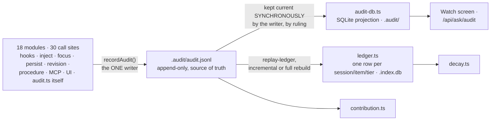

# The audit log, decay and contribution

`docs/system/00-index.md`

This subject was the most scattered of the five this pass covers — pieces of it are mentioned in
two capabilities chapters and two tutorials, but nothing owns it as one subject, and that absence
of an owner is itself part of why it is easy to misread. This chapter treats it as three readings of
**one** append-only log, because that relationship — one source of truth, two disposable
projections, two independent readings — is the thing no existing document states plainly.

## 1. What this is, and the three things it gets confused with

- **The audit log is not the conversation archive.** The archive (`docs/capabilities/04-conversation-archive.md`)
  holds transcripts — what was *said*. The audit log holds what the *system did*, under eight kinds
  — `--kind`'s own enum (`audit.ts:730`) is `mutation | injection | hook | focus | access | progress
  | execution | read`: every mutation, injection, hook action, focus change, access refusal,
  progress step, command execution **and item read**. A session can produce a long transcript and a
  short audit trail, or the reverse.
- **Decay is not deprecation, and it does not recommend one.** Decay answers one narrow question —
  which items have not been auto-*injected* in the last N sessions — and its own report repeats,
  every time it runs, that this is not the same as unused: an item consulted through `show`, through
  the `get_item` MCP tool, or read directly as a Markdown file looks *exactly* like an abandoned one
  to this report, because the ledger records injection, not reading or reliance. The report's own
  words: *"do not supersede or deprecate anything on this report alone — verify real usage first."*
- **Contribution is not the review queue or the self-improvement loop** (`docs/capabilities/11-self-improvement-loop.md`).
  It answers a different question — how often has each item actually been *delivered* into a
  context window, split by who or what originally captured it (human, agent, ingest, review) — and
  it is explicitly framed in its own module as a **baseline for detecting drift over time**, not a
  verdict on any one item: *"a single reading is the control for a later one."*

## 2. What gets recorded, by whom, and the append-only guarantee

`.my_context/.audit/audit.jsonl` is the one source of truth, in direct parallel to the corpus's own
`INV-markdown-is-the-source-of-truth` — everything else described in this chapter is a disposable
read-projection derived from it. `recordAudit()` in `src/core/audit.ts` is the **only** writer, and
the write itself is a bare `appendFileSync` through a small `appendJsonlLine` helper: append-only is
enforced by the fact that nothing in this codebase exposes a rewrite path, not by a database
constraint. Measured cost: about 0.55 ms at the 95th percentile, flat regardless of how large the
log has grown — the stated reason the write happens directly on the hot path rather than being
batched or deferred.

**Eighteen modules call it, across thirty invocations.** The modules: every hook (`pre-tool-use`,
`post-tool-use` and its failure variant, `session-end`, `subagent-start`/`stop`,
`pre-compact`/`post-compact`, `observe`), plus `inject.ts`, `focus.ts`, `persist.ts`, `revision.ts`,
`procedure.ts`, the MCP tool layer, the UI's execution and security modules — and `audit.ts` itself,
which is easy to leave off a list of writers and is the eighteenth (`:1699` records a `kind: 'read'`
item read). "Eighteen" is a count of *files*, not of call expressions: by invocation the number is
**30**, concentrated in `pre-tool-use` (4), `post-tool-use` (3) and `ui/execute` (3).

**There is no CLI verb to hand-append an entry** — the log is a byproduct of the system's own
operations, not a journal a person authors directly, which is worth
stating because it means "the audit log lied" is not a sentence that can be true of a human-authored
mistake in the same way it can be of a corpus item.

### The two projections, and why they don't have to "agree" the way two independent writers would

Two further SQLite stores exist, and both are rebuilt **from** the jsonl, never the reverse:

- **The audit-db projection** (`src/core/audit-db.ts`, lives under `.audit/`) stores each record
  whole, for the Watch screen and the `/api/ask/audit` route to query without re-reading the jsonl
  file on every request. `DEC-the-writer-keeps-the-audit-projection-current-so-no-reader` is an
  owner ruling that the *writer* — not a background job — keeps this projection current,
  synchronously, after a background-synced version was measured flipping between "fresh" and
  "behind" twice in forty minutes and serving stale results on the Watch screen in between.
- **The injection ledger** (`src/core/ledger.ts`, one row per session/item/tier, living inside the
  main `.index.db` rather than under `.audit/`) is what `decay.ts` reads. `ledgerRows()` in
  `audit.ts` can reconstruct ledger rows straight from the jsonl, and `mycontext audit replay-ledger`
  tops the ledger up incrementally, or rebuilds it from scratch if it has diverged.

Because there is exactly one writer (the jsonl append) and everything else is a read projection that
can be deleted and regenerated, "agreement" here is not two independent sources reconciling — it is
a projection either being current or being disclosed as behind, never silently stale.



## 3. Decay — what it computes, and real output

`decay.ts` takes the ledger's usage rows and a window (a number of sessions), and buckets every
injectable item into `cold` (not injected inside the window), `warm` (injected inside it), and
`unrestricted` — a *view* over items with no scope restriction, not a third partition; an item there
is also counted in cold or warm. `DEC-the-decay-threshold-is-stated-on-the-screen-and-read-from` is
an owner ruling that the window and threshold must always be read from live configuration and stated
on screen, after an earlier build was found presenting the number nowhere in the DOM at all.

```
$ mycontext decay --summary
my_context decay — items not injected in the last 20 session(s). The ledger holds 40 session(s).
  "cold" means: not auto-injected in the last window of sessions. It does NOT mean unused — the
  ledger records injection, not reading or reliance, so a new item, and any item consulted via
  `show`, MCP `get_item`, or the Markdown file directly, look exactly like an abandoned one here.
  Do not supersede or deprecate anything on this report alone — verify real usage first.

cold 0, warm 165, of which 124 unrestricted. Rows with `mycontext decay` (default) or `--full`.
```

*(Real output against this repository, 2026-09-17, **complete and unabridged** — re-captured by
running the command, not by editing an earlier paste. The five indented lines are the disclosure
§1 quotes, and they are printed on every run: an earlier draft of this chapter removed them while
quoting one of them a page earlier. Re-run before citing — the ledger grows every session.)*

## 4. Contribution — what it computes, and real output

`contribution.ts` is a pure module — no I/O of its own, taking parsed audit records, the live item
set and an "is this injectable today" predicate as arguments — that answers how many times each item
has actually been delivered, split by the `origin` it was captured under.

```
$ mycontext contribution --summary
my_context contribution — how often each item was actually delivered into a session, read backwards
out of the audit log. The log holds 3688 injection record(s) of 61890 total, naming 193 distinct
id(s); the corpus holds 1317 item(s), of which 165 could be chosen by `select` today.

A record is one DELIVERY, not one session: 1890 subagent-start, 1699 jit, 69 session-start, 28
compact-restore, 2 manual. So a high count is mostly a count of subagent dispatches and hook fires,
and reading any figure below as a number of sessions would overstate it by more than an order of
magnitude.
...
by origin — the cohort table:
  ┌────────┬───────┬────────────┬─────────────────┬────────────────┬──────────────────┬───────────────────────────┐
  │ origin │ items │ injectable │ never delivered │ always spilled │ median delivered │ delivered, now ineligible │
  ├────────┼───────┼────────────┼─────────────────┼────────────────┼──────────────────┼───────────────────────────┤
  │ agent  │ 38    │ 6          │ 0               │ 0              │ 1283             │ 0                         │
  │ human  │ 1271  │ 159        │ 0               │ 0              │ 1044             │ 28                        │
  │ ingest │ 0     │ 0          │ 0               │ 0              │ 0                │ 0                         │
  │ review │ 8     │ 0          │ 0               │ 0              │ 0                │ 0                         │
  └────────┴───────┴────────────┴─────────────────┴────────────────┴──────────────────┴───────────────────────────┘
...
1317 item(s), 165 of them injectable, of which 0 have never been delivered. Rows with `mycontext
contribution` (default) or `--full`.
```

*(Real output against this repository, 2026-09-17, **abridged — and the cuts are the two bare `...`
lines**, which stand for four disclosure paragraphs and one "injectable and never delivered"
paragraph. Every retained line is byte-identical to what the command printed; nothing here is
retyped, summarised or rounded. An earlier draft of this chapter welded the opening paragraph to
the closing summary line — some forty lines apart — into one sentence the command has never
printed, and replaced two exact integers with `~58000` and `~193`. The command prints exact
integers in both slots and has never printed a tilde. The totals move on every run, including runs
of this command: re-run rather than cite them as current.)* No dedicated tutorial exists for
contribution, unlike decay and the audit log — it is currently explained only inside
`docs/capabilities/11-self-improvement-loop.md`, in passing, which is one reason this chapter
exists.

## 5. The Watch screen — five sources, one screen

`src/ui/public/screens/watch.js` (2,102 lines) is the one UI surface built directly on this
material, and it is assembled from five independently-documented data sources rather than one feed:
`/api/watch/volume` (pulse buckets over time), `/api/watch/stream` (a live push feed), `/api/ask/audit`
(backlog and on-demand queries against the audit-db projection — not itself one of the `/api/watch/*`
routes, despite the similar name), `/api/ask/summary?report=ops` (the registered-hooks panel), and
`/api/config`/`/api/meta` (static context, not audit data at all). It is read-only, like every other
surface in this UI.

## 6. How it is maintained — who may write, through which door

Nobody writes to the audit log directly. The only doors that produce an entry are the eighteen
internal call sites in §2 — a hook firing, an injection happening, a focus change, a mutation. The
doors a *person* has are all read doors: the CLI (`mycontext audit`, `mycontext decay`,
`mycontext contribution`), the MCP tools `audit_log` (`tools.ts:1551`) and `decay_report` (`:1642`),
and the Watch/decay screens in the web UI. **Contribution has no MCP door at all** — the word
"contribution" does not appear anywhere under `src/mcp/`, and none of the 28 registered tools is
its. Of the three readings this chapter treats as siblings, two are reachable by an agent and one
is reachable only from a terminal, which sharpens §7's point rather than softening it: contribution
is not merely the least-documented of the three, it is the only one with no agent-facing door. There is no write binding anywhere in the twelve the UI is
ruled to have — this whole subject is observational by construction.

## 7. What is known wrong or incomplete here

- **`KNOWN-specfor-validates-an-audit-record-s-kind-and-op`** — the function that validates an audit
  record checks its `kind` and its `op` independently rather than as a pair, so a hand-edited or
  imported record can carry a kind/op combination that should not exist and still be accepted. A
  query filtered by `--kind` and a replay filtered by `op` can then silently disagree about which
  records they're describing. Found by a mutation-testing case that survived when it should not
  have.
- **`KNOWN-the-ledger-handle-leak-detector-cannot-detect-a-leak`** — the test built specifically to
  catch a file-handle leak in the ledger swallows the very failure it exists to catch. A testing-only
  defect, but it means this one property is currently unverified by anything that claims to verify
  it.
- **Decay's own report actively warns against the inference a reader will reach for first** — that a
  cold item is a candidate for removal. It is not, and the report says so on every run, precisely
  because a ledger measuring injection cannot see reading.
- **Contribution has no dedicated tutorial, no MCP tool, and is the least-documented of the three
  readings even after this chapter** — it appears only as a passing mention inside the
  self-improvement-loop chapter, which is a different subject with a different governing question,
  and it is the one reading of this log an agent cannot reach at all (§6).

## 8. Code map

| File | Lines (2026-09-17) | What it owns |
|---|---|---|
| `src/core/audit.ts` | 1,913 | The writer (`recordAudit`), the reader, record spec/versioning, `ledgerRows()` |
| `src/core/audit-db.ts` | 1,359 | The SQLite projection kept current by the writer |
| `src/core/ledger.ts` | 1,229 | The injection ledger `decay.ts` reads, inside `.index.db` |
| `src/core/audit-tail.ts` | 312 | The tail/stream reader behind the Watch screen's live feed |
| `src/core/contribution.ts` | 341 | Pure: delivery-frequency by origin, no I/O |
| `src/core/decay.ts` | 166 | Pure: cold/warm/unrestricted over `Usage` and `Item` |
| `src/core/ledger-replay.ts` | 46 | Incremental top-up or full rebuild of the ledger from the jsonl |
| `.my_context/.audit/` | — | `audit.jsonl` (the truth) plus the audit-db SQLite file |

## See also

- [`docs/tutorials/the-audit-log-live-stream.md`](../tutorials/the-audit-log-live-stream.md) — the
  beginner walkthrough this chapter builds past
- [`docs/tutorials/decay-finding-what-stopped-mattering.md`](../tutorials/decay-finding-what-stopped-mattering.md) —
  likewise, for decay
- [`docs/capabilities/11-self-improvement-loop.md`](../capabilities/11-self-improvement-loop.md) —
  the review queue, a related but distinct mechanism from contribution
- [`docs/capabilities/04-conversation-archive.md`](../capabilities/04-conversation-archive.md) —
  the archive this log is not, per §1
