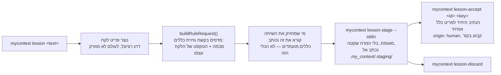

<!--
  Hebrew mirror of `docs/system/05-lessons.md`. The English document is the
  source of record; where the two disagree, the English one is right and this
  one is stale. Conventions, and the link policy, are stated once in
  `docs/system/00-index.he.md`'s own header comment.

  `lesson` is rendered `לקח`, which is the word the product's own Hebrew uses
  (`strings/he.js`, 13 occurrences) and the word `docs/README.he.md` uses (39).
  `docs/tutorials/lessons-staging-and-promotion.he.md` says `שיעור` instead;
  that disagreement predates this file and is reported rather than resolved
  here — a translation is not the place to settle a term the tree is split on.

  THE PASTED `--help` BLOCK IS NOT TRANSLATED AND WAS NOT RETYPED. It is what
  the program printed, spliced byte-for-byte out of the English chapter. Only
  the sentences around it are in Hebrew.

  Nothing here was re-measured; every line count is carried across from the
  English chapter as it stands on 2026-09-17.
-->

# לקחים — איך טעות הופכת לכלל

<div dir="rtl">

<span dir="ltr">`docs/system/00-index.he.md`</span>

זו הגרסה העברית של [`docs/system/05-lessons.md`](./05-lessons.md). המסמך האנגלי הוא
המקור; במקרה של סתירה — האנגלית קובעת.

המצאי שזיהה את הפער הזה קרא לזה "הדלת שרוב המשתמשים באמת ישתמשו בה", והיא הקטנה מבין חמשת
הנושאים שהמעבר הזה מכסה. יש לה מדריך אחד
(<span dir="ltr">`docs/tutorials/lessons-staging-and-promotion.md`</span>) ועד עכשיו לא
היה לה פרק שמסביר את מכניקת האמון שמתחת להדרכה.

## 1. מה זה, ובמה מתבלבלים איתו

**לקח** הוא פריט קורפוס *תיאורי* — "זה מה שקרה" — ולא כלל. רישום של אחד אינו משנה דבר לגבי
מה שמוזרק לסשן: `lesson` היא קטגוריה בדרג הרציונל, ושום דבר בדרג הזה אינו מוזרק כלל, לא
משנה מי כתב אותו. אפשר לבקש מלקח *לייצר* כללים מועמדים, אבל הלקח עצמו נשאר תיאורי גם אחרי
שנגזר ממנו כלל.

שני דברים שקל לבלבל עם זה:

- **מנגנון הטיוטות של הקליטה** (ראו <span dir="ltr">`docs/system/06-ingest.md`</span>).
  שניהם מייצרים בסופו של דבר משהו שאדם חייב לאשר, אבל הם משתמשים במאגרים נפרדים
  ובפרוטוקולים נפרדים — הכללים המועמדים של לקח חיים תחת
  <span dir="ltr">`.my_context/.staging/`</span>, מוצמדים ללקח, ולא בקורפוס הראשי כפריטי
  <span dir="ltr">`status: draft`</span> כפי שהפלט של הקליטה חי.
- **כלל עצמו.** לקח לעולם אינו *הווה* כלל.
  <span dir="ltr">`mycontext lesson-accept`</span> הוא אתר הקריאה האחד והיחיד שהופך מועמד
  מוצב לפריט `rule` אמיתי — שום דבר אחר בבסיס הקוד הזה אינו עושה זאת.

## 2. איך זה עובד, מקצה לקצה

</div>



<div dir="rtl">

<span dir="ltr">`mycontext lesson "<text>"`</span> יוצר פריט `lesson` (מנוכה כפילויות לפי
slug של הכותרת שלו) ואז מדפיס בקשת גזירת כללים: תג פרוטוקול, הטקסט של הלקח עצמו, הסכמה
שכלל מועמד חייב לספק, ופקודת חזרה. הטקסט המיוצר של הכלי עצמו אומר בפשטות מה הוא ומה הוא
אינו: **אין לו מודל משלו והוא אינו קורא לאף אחד — הוא מציב את מה שחוזר וממתין לאדם.** מי
שקורא את השיחה — אדם או סוכן — כותב כללים מועמדים שתואמים את הסכמה וקורא בחזרה איתם.

<span dir="ltr">`mycontext lesson-stage <id> --stdin`</span> מאמת את המועמדים שחזרו מול
הסכמה וכותב אותם אל
<span dir="ltr">`.my_context/.staging/<lesson-id>.json`</span>, כל אחד ממופתח בגיבוב בן 8
תווים. האימות כאן **לעולם אינו ממיר בשקט** שדה פגום — מועמד רע נדחה ונקוב בשם, ולא מתוקן
בשקט, מפני ש-scope שהורחב בשקט או גוף שרוקן היו תוצאה גרועה יותר מדחייה רועשת שהקורא חייב
לתקן.

<span dir="ltr">`mycontext lesson-accept <id> <key> --summary "<text>"`</span> הוא אתר
הקריאה היחיד שיוצר פריט `rule` אמיתי ממועמד מוצב —
<span dir="ltr">`status: active`</span>, ו**<span dir="ltr">`origin: 'human'`</span> קבוע
בקוד באתר הקריאה הזה**, לא פרמטר שמישהו יכול לדרוס. קשר
<span dir="ltr">`derived_from`</span> מקשר את הכלל החדש בחזרה ללקח שממנו בא.
<span dir="ltr">`mycontext lesson-discard <id> <key>`</span> מסמן מועמד כנדחה במקום זאת.

## 3. פלט אמיתי

</div>

```
$ mycontext lesson --help
usage: mycontext lesson "<text>" | <id> [--agent]
  record a lesson and request candidate rules

flags:
  --agent  Record the lesson as origin "agent" rather than "human" - the one claim a shell cannot
           truthfully make on its own. `lesson-accept` refuses it by name.

  The command's own usage block — the worked forms, and how they combine — is printed by running it
  with an argument it refuses. `mycontext help cli` is the flag reference for the whole CLI, and
  carries the exit-code contract a script reads.
```

<div dir="rtl">

שלוש תת־פקודות נוספות קיימות מעבר לדגלים שמוצגים למעלה:
<span dir="ltr">`lesson-stage <id> (--file <path>|--stdin)`</span>,
<span dir="ltr">`lesson-accept <id> <key> (--summary "<text>"|--summary-omitted)`</span>,
<span dir="ltr">`lesson-discard <id> <key>`</span>.

## 4. מי רשאי להפעיל את זה, ודרך איזו דלת

- **CLI**: כל ארבע הפקודות שלמעלה.
- **MCP**: <span dir="ltr">`create_lesson`</span> משקף את
  <span dir="ltr">`mycontext lesson`</span> בדיוק, עם הגבלה מכוונת אחת — הוא **תמיד** חותם
  <span dir="ltr">`origin: 'agent'`</span> ואינו מקבל origin כארגומנט כלל, על הנימוק,
  שנאמר ישירות בקוד של הכלי, שקריאת כלי היא קורא לא־אנושי *מעצם הגדרתה*.
- **MCP, הצבה**: <span dir="ltr">`stage_rule_candidates`</span>
  (<span dir="ltr">`src/mcp/tools.ts:1889`</span>,
  <span dir="ltr">`annotations: ADDS`</span>) הוא כלי רשום אמיתי, וה-`run` שלו קורא לאותו
  `stageRuleCandidates` ש-<span dir="ltr">`mycontext lesson-stage`</span> קורא לו.
  **להצבה יש דלת שפונה לסוכן**, וטיוטה קודמת של הפרק הזה אמרה שאין.
- **לקבלה ולדחייה אין.** ל-<span dir="ltr">`lesson-accept`</span>
  ול-<span dir="ltr">`lesson-discard`</span> אין כלי MCP, וההיעדר מכוון ולא רק לא־בנוי:
  <span dir="ltr">`CLI_WITHOUT_TOOL['lesson-accept']`</span> רשום כ-`intended`, והנימוק
  כתוב בתוך הערת התיעוד של <span dir="ltr">`stage_rule_candidates`</span> עצמו שלוש שורות
  מעל הכלי — מועמדים מוצבים *"are inert until a HUMAN runs `mycontext lesson-accept`, which
  is the only call site of `createItem` anywhere in this module and hardcodes `origin:
  'human'` with no override"*. <span dir="ltr">`CLI_WITHOUT_TOOL['lesson-accept']`</span>
  נושא <span dir="ltr">`disposition: 'intended'`</span> ואת אותו נימוק במילותיו שלו
  (<span dir="ltr">`plugin/parity.ts:516–523`</span>), ו-`acceptStagedRule` נקראת מקובץ
  אחד בדיוק בעץ, <span dir="ltr">`cli/commands/lesson.ts`</span>. כך שהמסקנה עומדת ומקורה
  טוב יותר מההנחה שלה: **יצירת כלל מלקח דורשת אדם.** מה שאינו עומד הוא הטענה הרחבה
  ששלושת השלבים שאחרי הלקח הם CLI בלבד. זה הגזים בטיעון של הפרק הזה עצמו, וזה הכיוון
  שהכי פחות סביר שתופסים בו שגיאה.
- **"אדם" אינו אותו דבר כמו "טרמינל", והפרק הזה אמר את הדבר הצר יותר.** מסך מרכיב הפקודות
  נושא ערך <span dir="ltr">`lesson-accept`</span> עם
  <span dir="ltr">`runnable: true`</span> (<span dir="ltr">`lib/palette-defs.js:510–518`</span>),
  ולכן אדם שמחובר לממשק הרשת יכול להרכיב *וגם להריץ* אותה דרך
  <span dir="ltr">`POST /api/execute`</span>, מאחורי דו־שיח האישור ומאחורי nonce שקשור
  ל-argv שהשרת בנה. זו דלת אנושית שנייה, לא דלת סוכן, ולכן תכונת האמון לא השתנתה — אבל
  "דורש אדם ליד טרמינל" שגוי כפי שנכתב, וזה מסוג המשפטים שנקראים כטענת אבטחה.

## 5. מה ידוע שלא בסדר או לא גמור כאן

- מועמד הבעיה הפתוחה האחד שנמצא במחקר לפרק הזה,
  <span dir="ltr">`TASK-lesson-accept-creates-a-rule-with-no-summary-so-the-accept`</span>,
  רשום <span dir="ltr">`state: done`</span> נכון לכתיבת שורות אלה — הדרישה שהוא נוקב בה
  (שקבלת מועמד בלי תקציר חייבת להידחות) חיה עכשיו על פקודת ה-CLI עצמה ולא בתוך פונקציית
  הקבלה. אמתו עם
  <span dir="ltr">`mycontext show TASK-lesson-accept-creates-a-rule-with-no-summary-so-the-accept`</span>
  לפני שאתם מצטטים את המצב שלו, מפני שכל המשמעת של הפרק הזה היא שמצב הוא קריאה ולא עובדה
  שנשארת במקום.
- **ההערה על "אין בורר ל-<span dir="ltr">`lesson-accept`</span>" היא היסטוריה, והפרק הזה
  השאיר את זה קודם לכן לא פתור.** <span dir="ltr">`staging.ts:11–12`</span> רושם
  ש-<span dir="ltr">`palette-defs.js`</span> *"had refused the `key` picker on
  `lesson-accept`"* — בזמן עבר, וההערה של הקטלוג עצמו אומרת למה הוא כבר אינו מסרב: חצי
  הקריאה פוצל אל <span dir="ltr">`src/lesson/staging.ts`</span>
  ו-<span dir="ltr">`GET /api/staging`</span> מגיש אותו, ולכן
  <span dir="ltr">`id`</span> ו-<span dir="ltr">`key`</span> הם עכשיו שני בוררי
  <span dir="ltr">`input: 'suggest'`</span> שרוכבים על fetch אחד, כאשר
  <span dir="ltr">`key`</span> מצומצם על ידי
  <span dir="ltr">`dependsOn: 'id'`</span> (<span dir="ltr">`palette-defs.js:463–478`</span>,
  <span dir="ltr">`:512–517`</span>). נבדק ישירות במעבר הזה ולא הושאר פתוח: הבורר קיים,
  והערך הוא <span dir="ltr">`runnable`</span>, וזו הדלת השנייה של §4.

## 6. מפת הקוד

</div>

<div dir="rtl">

| קובץ | שורות (2026-09-17) | על מה הוא בעלים |
|---|---|---|
| <span dir="ltr">`src/lesson/derive.ts`</span> | 491 | חצי הכתיבה: <span dir="ltr">`buildRuleRequest`, `stageRuleCandidates`, `acceptStagedRule`</span> |
| <span dir="ltr">`src/lesson/staging.ts`</span> | 299 | חצי ה**קריאה־בלבד**, מבודד ייבוא בכוונה מחצי הכתיבה — <span dir="ltr">`DEC-the-read-half-of-lesson-derive-ts-is-split-out-so-a-read`</span> וטסט ייעודי מונעים מכותב להיות נגיש דרך הקובץ הזה |
| <span dir="ltr">`src/cli/commands/lesson.ts`</span> | 633 | כל ארבע תת־פקודות ה-CLI |
| <span dir="ltr">`.my_context/.staging/`</span> | — | קובץ JSON אחד לכל לקח עם המועמדים המוצבים |

</div>

<div dir="rtl">

## ראו גם

- [`docs/tutorials/lessons-staging-and-promotion.md`](../tutorials/lessons-staging-and-promotion.md) —
  ההדרכה למתחילים שהפרק הזה בונה מעליה
- [`docs/system/06-ingest.md`](./06-ingest.he.md) — פרוטוקול באותה צורה, "הכלי ממסגר את
  הבקשה, משהו מחוצה לו עושה את הקריאה", מוחל על מסמכים שלמים במקום על לקח אחד
- [`docs/capabilities/11-self-improvement-loop.md`](../capabilities/11-self-improvement-loop.md) —
  תור הסקירה שהאחים של פריט שקודם עשויים לעבור דרכו אחר כך

</div>
