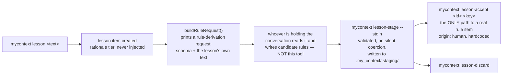

# Lessons — how a mistake becomes a rule

`docs/system/00-index.md`

Called "the door most users will actually use" by the inventory that identified this gap, and the
smallest of the five subjects this pass covers. It has one tutorial
(`docs/tutorials/lessons-staging-and-promotion.md`) and, until now, no chapter explaining the trust
mechanics underneath the walkthrough.

## 1. What it is, and what it is confused with

A **lesson** is a *descriptive* corpus item — "this is what happened" — not a rule. Recording one
changes nothing about what gets injected into a session: `lesson` is a rationale-tier category, and
nothing on that tier is injected at all, regardless of who wrote it. A lesson can be asked to
*produce* candidate rules, but the lesson itself stays descriptive even after a rule is derived from
it.

Two things this is easy to conflate with:

- **Ingest's draft mechanism** (see `docs/system/06-ingest.md`). Both eventually produce something a
  human has to approve, but they use separate stores and separate protocols — a lesson's candidate
  rules live under `.my_context/.staging/`, keyed to the lesson, not in the main corpus as
  `status: draft` items the way ingest's output does.
- **A rule itself.** A lesson never *is* a rule. `mycontext lesson-accept` is the one and only call
  site that turns a staged candidate into a real `rule` item — nothing else in this codebase does.

## 2. How it works, end to end



`mycontext lesson "<text>"` creates a `lesson` item (deduplicated by a slug of its title) and then
prints a rule-derivation request: a protocol tag, the lesson's own text, the schema a candidate rule
must satisfy, and a callback command. The tool's own generated text says plainly what it is and is
not: **it has no model of its own and calls none — it stages what comes back and waits for a
human.** Whatever is reading the conversation — a person or an agent — writes candidate rules
matching the schema and calls back with them.

`mycontext lesson-stage <id> --stdin` validates the returned candidates against the schema and
writes them to `.my_context/.staging/<lesson-id>.json`, each keyed by an 8-character hash. Validation
here **never silently coerces** a malformed field — a bad candidate is rejected and named, not
quietly repaired, because a silently-widened scope or an emptied-out body would be a worse outcome
than a loud rejection the caller has to fix.

`mycontext lesson-accept <id> <key> --summary "<text>"` is the single call site that creates a real
`rule` item from a staged candidate — `status: active`, and **`origin: 'human'` is hardcoded at this
call site**, not a parameter anyone can override. A `derived_from` relation links the new rule back
to the lesson it came from. `mycontext lesson-discard <id> <key>` marks a candidate discarded instead.

## 3. Real output

```
$ mycontext lesson --help
usage: mycontext lesson "<text>" | <id> [--agent]
  record a lesson and request candidate rules

flags:
  --agent  Record the lesson as origin "agent" rather than "human" - the one claim a shell cannot
           truthfully make on its own. `lesson-accept` refuses it by name.

  The command's own usage block — the worked forms, and how they combine — is printed by running it
  with an argument it refuses. `mycontext help cli` is the flag reference for the whole CLI, and
  carries the exit-code contract a script reads.
```

Three further subcommands exist beyond the flags shown above: `lesson-stage <id> (--file <path>|--stdin)`,
`lesson-accept <id> <key> (--summary "<text>"|--summary-omitted)`, `lesson-discard <id> <key>`.

## 4. Who may trigger it, and through which door

- **CLI**: all four commands above.
- **MCP**: `create_lesson` mirrors `mycontext lesson` exactly, with one deliberate restriction —
  it **always** stamps `origin: 'agent'` and does not accept origin as an argument at all, on the
  reasoning, stated directly in the tool's own code, that a tool call is a non-human caller *by
  construction*.
- **MCP, staging**: `stage_rule_candidates` (`src/mcp/tools.ts:1889`, `annotations: ADDS`) is a
  real registered tool, and its `run` calls the same `stageRuleCandidates` that `mycontext
  lesson-stage` calls. **Staging has an agent-facing door**, and an earlier draft of this chapter
  said it did not.
- **Accepting and discarding do not.** `lesson-accept` and `lesson-discard` have no MCP tool, and
  the absence is deliberate rather than merely unbuilt: `CLI_WITHOUT_TOOL['lesson-accept']` is
  recorded as `intended`, and the reasoning is written into `stage_rule_candidates`'s own doc
  comment three lines above the tool — staged candidates *"are inert until a HUMAN runs `mycontext
  lesson-accept`, which is the only call site of `createItem` anywhere in this module and hardcodes
  `origin: 'human'` with no override"*. `CLI_WITHOUT_TOOL['lesson-accept']` carries
  `disposition: 'intended'` and that reasoning verbatim (`plugin/parity.ts:516–523`), and
  `acceptStagedRule` is called from exactly one file in the tree, `cli/commands/lesson.ts`. So the
  conclusion stands and is better sourced than the premise was: **creating a rule from a lesson
  requires a person.** What does not stand is the wider claim that all three post-lesson steps are
  CLI-only. It overstated this chapter's own case, which is the direction an error is least likely
  to be caught in.
- **"A person" is not the same as "a terminal", and this chapter said the narrower thing.** The
  Composer screen carries a `lesson-accept` entry with `runnable: true`
  (`lib/palette-defs.js:510–518`), so a person signed into the web UI can compose *and run* it
  through `POST /api/execute`, behind the confirm dialog and a nonce bound to the argv the server
  built. That is a second human door, not an agent door, so the trust property is unchanged — but
  "requires a human at a terminal" is false as written, and it is the kind of sentence that reads
  as a security claim.

## 5. What is known wrong or unfinished here

- The one open-issue candidate found while researching this chapter,
  `TASK-lesson-accept-creates-a-rule-with-no-summary-so-the-accept`, is recorded `state: done` as of
  this writing — the requirement it names (that accepting a candidate without a summary must be
  refused) now lives on the CLI command itself rather than inside the accept function. Verify with
  `mycontext show TASK-lesson-accept-creates-a-rule-with-no-summary-so-the-accept` before citing its
  state, since this chapter's whole discipline is that a state is a reading, not a fact that stays
  put.
- **The "no picker for `lesson-accept`" note is history, and this chapter previously left that
  unresolved.** `staging.ts:11–12` records that `palette-defs.js` *"had refused the `key` picker on
  `lesson-accept`"* — past tense, and the catalogue's own comment says why it no longer does: the
  read half was split into `src/lesson/staging.ts` and `GET /api/staging` serves it, so `id` and
  `key` are now two `input: 'suggest'` pickers riding one fetch, `key` narrowed by
  `dependsOn: 'id'` (`palette-defs.js:463–478`, `:512–517`). Checked directly this pass rather than
  left open: the picker exists, and the entry is `runnable`, which is §4's second door.

## 6. Code map

| File | Lines (2026-09-17) | What it owns |
|---|---|---|
| `src/lesson/derive.ts` | 491 | The write half: `buildRuleRequest`, `stageRuleCandidates`, `acceptStagedRule` |
| `src/lesson/staging.ts` | 299 | The **read-only** half, deliberately import-isolated from the write half — `DEC-the-read-half-of-lesson-derive-ts-is-split-out-so-a-read` and a dedicated test keep a writer from becoming reachable through this file |
| `src/cli/commands/lesson.ts` | 633 | All four CLI subcommands |
| `.my_context/.staging/` | — | One JSON file per lesson with staged candidates |

## See also

- [`docs/tutorials/lessons-staging-and-promotion.md`](../tutorials/lessons-staging-and-promotion.md) —
  the beginner walkthrough this chapter builds past
- [`docs/system/06-ingest.md`](./06-ingest.md) — a similarly-shaped "the tool frames the request,
  something outside it does the reading" protocol, applied to whole documents instead of one lesson
- [`docs/capabilities/11-self-improvement-loop.md`](../capabilities/11-self-improvement-loop.md) —
  the review queue a promoted item's siblings may later pass through
