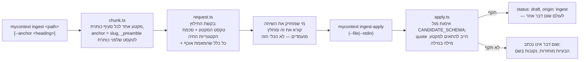
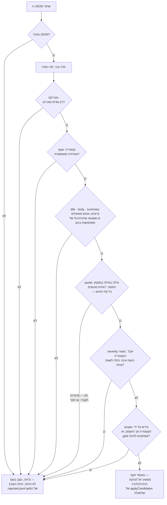

<!--
  Hebrew mirror of `docs/system/06-ingest.md`. The English document is the
  source of record; where the two disagree, the English one is right and this
  one is stale. Conventions, and the link policy, are stated once in
  `docs/system/00-index.he.md`'s own header comment.

  THE PASTED `--help` BLOCK IS NOT TRANSLATED AND WAS NOT RETYPED. It is what
  the program printed, spliced byte-for-byte out of the English chapter.

  §5's two over-long item ids are quoted EXACTLY as the English chapter quotes
  them, including the one that resolves to nothing — that id being wrong is the
  finding, and correcting it here would delete the finding.

  Nothing here was re-measured; every count is carried across from the English
  chapter as it stands on 2026-09-17.
-->

# קליטה — מסמך הופך לפריטים

<div dir="rtl">

<span dir="ltr">`docs/system/00-index.he.md`</span>

זו הגרסה העברית של [`docs/system/06-ingest.md`](./06-ingest.md). המסמך האנגלי הוא המקור;
במקרה של סתירה — האנגלית קובעת.

## 1. מה זה, והרעיון שמצטרף חדש מפספס

מסירת קובץ לכלי, שהוא ימסגר בקשה למה שצריך לחלץ, והחלת מה שחוזר כפריטי טיוטה. הרעיון שקל
לפספס מקריאת שמות הפקודות לבדם, מנוסח בהוראות המיוצרות של הכלי עצמו: **"you are the
extractor. my_context has no model of its own and never calls one — it hands you the text
and validates what you return."** <span dir="ltr">`ingest.ts`</span> לעולם אינו קורא מסמך
ומחליט מה משמעותו. הוא מחלק את המסמך למקטעים, ממסגר בקשה מנוסחת במדויק, ואחר כך מאמת ומחיל
כל טקסט שחוזר מאיזה סוכן שבאמת מחזיק את השיחה. החילוץ — החלק שנראה כמו החצי המעניין של
היכולת הזאת — קורה כולו מחוץ לבסיס הקוד הזה.

לא להתבלבל עם:

- **גזירת הכללים של לקחים** (<span dir="ltr">`docs/system/05-lessons.md`</span>) — אותה
  צורה דו־שלבית (למסגר בקשה, לאמת ולהחיל את מה שחוזר), מוחלת על תחום אחר: פריטי קורפוס
  כלליים כאן, כללים במיוחד שם. הם חולקים סוג אחד של בעיית אימות ושום דבר אחר בקוד.
- **תור הסקירה.** הפלט של הקליטה נוחת כפריטי
  <span dir="ltr">`status: draft`</span>, שתור הסקירה אחר כך מפרט אותם בין טיוטות אחרות —
  אבל לקליטה עצמה אין שום לוגיקת ניהול תור; היא נעצרת ברגע שהפריטים נכתבו.

## 2. איך זה עובד, מקצה לקצה

</div>



<div dir="rtl">

<span dir="ltr">`mycontext ingest <path> [--anchor <heading>]`</span> פותח סשן ומחלק את
המסמך למקטעים (<span dir="ltr">`src/ingest/chunk.ts`</span>): מקטע אחד לכל סעיף תחת
כותרת, כשהעוגן נגזר כ-slug של הכותרת ההיא, <span dir="ltr">`_preamble`</span> לכל טקסט
שלפני הכותרת הראשונה, וסיומת מבחינה (<span dir="ltr">`--N`</span>, מקף כפול —
<span dir="ltr">`chunk.ts:339`</span> בונה
<span dir="ltr">`${candidate}--${n}`</span> — או גיבוב בן 8 תווים) לסעיף גדול מדי או
בעל שם כפול. <span dir="ltr">`request.ts`</span> אז בונה את בקשת החילוץ עצמה — וההערה של
הקובץ עצמו מסבירה בחירת עיצוב שראויה להכללה: הבקשה מפרטת את *כל כלל שהמאמת באמת אוכף*,
מפני שבקשה שמלמדת כלל שהמאמת אינו בודק היא רק לא־מועילה, בעוד שבקשה שמשמיטה כלל שהמאמת
*כן* בודק מייצרת מועמד נדחה שלמחלץ לא הייתה שום דרך להימנע ממנו. ההוראה הנושאת־משקל ביותר
בתוכה: **כל מועמד חייב לשאת <span dir="ltr">`quote`</span> שהועתק מילה במילה מהמקטע**,
נבדק בהתאמה מדויקת אחרי כיווץ רווחים — המנגנון ששומר מועמד קשור למשהו שהמסמך באמת אמר, ולא
למשהו שמחלץ הסיק.

<span dir="ltr">`mycontext ingest-apply <session-id> --anchor <a> (--file <path>|--stdin)`</span>
מאמת את ה-JSON שחזר מול הסכמה, ואם הוא עובר, כותב כל מועמד כ-<span dir="ltr">`status:
'draft'`</span>, <span dir="ltr">`origin: 'ingest'`</span> — נקבע ישירות בקוד, לעולם שום
דבר אחר, ללא קשר למה שהמועמד עצמו טוען. שום דבר אינו נכתב כלל אם האימות נכשל; הקורא מקבל
בחזרה רשימה של בעיות נקובות בשם. חילוץ מחדש של עוגן שהטיוטה שלו עדיין עדכנית מחליף אותה
במקום לשכפל אותה. <span dir="ltr">`mycontext ingest-status [--summary]`</span> מדווח על
התקדמות הסשן והעוגנים.

**מה בפועל דוחה מועמד, ובאיזה סדר.** `validateCandidates`
(<span dir="ltr">`src/ingest/schema.ts`</span>) היא שרשרת, לא בדיקה יחידה, והסדר הוא הסדר
שהמקור קורא בו — סירוב על צורה לפני סירוב על תוכן, מפני שהודעה על ציטוט חסר חסרת תועלת על
ערך שאינו אפילו אובייקט עדיין. כל <span dir="ltr">`reject()`</span> בדרך הוא עמיד, ולא שגיאה שנזרקת ומפילה איתה
את כל האצווה: <span dir="ltr">`INV-a-validator-that-gates-writes-must-be-a-complete`</span>
הוא מה שהופך את זה לתנאי מקדים *שלם* ולא למעבר ראשון — שום דבר ש-`createItem` היה דוחה
אינו עובר את השרשרת הזאת. **מה שבודק את זה בפועל קטן ממה שטיוטה קודמת של הפרק הזה טענה**,
והגודל ראוי להיאמר במקום להתעגל כלפי מעלה:
<span dir="ltr">`test/ingest/schema.test.ts`</span> נושא 69 מקרים, שמתוכם זה של האמנה הוא
מכפלה קרטזית אמיתית — <span dir="ltr">`TITLE_VARIANTS`</span> (4) ×
<span dir="ltr">`BODY_VARIANTS`</span> (4) × <span dir="ltr">`SEVERITY_VARIANTS`</span> (2)
= **32 מועמדים**, כאשר <span dir="ltr">`scope`, `tags`, `extra`</span>
ו-<span dir="ltr">`observations`</span> מתחלפים לפי אינדקס כך ששום שדה אינו יושב בברירת
מחדל נקייה בזמן ששדה אחר זז — וכל אחד מהם חייב לשרוד
<span dir="ltr">`createItem`</span> ← כתיבה ← פענוח ← עיבוד מחדש זהה בית־בית, עם
ה-checksum שלו ללא שינוי (<span dir="ltr">`:631–672`</span>). שלושים ושניים, בנויים
כמכפלה קרטזית, הם טיעון חזק מרשימה כתובה־ביד באותו אורך, מפני שהרשימה הכתובה־ביד הקודמת
היא בדיוק הדרך שבה <span dir="ltr">`body`</span> ו-<span dir="ltr">`severity`</span> לא
נבדקו. זה אינו, כפי שהפרק הזה אמר קודם, עשרות אלפים.

</div>



<div dir="rtl">

(בדיקות נוספות לכל שדה — תגיות, תצפיות — ממשיכות מעבר לשער האחרון שמוצג כאן; התרשים הזה
נעצר בהחלטות שהפרוזה של הפרק הזה נוקבת בהן, ולא בכל שדה
ש-<span dir="ltr">`schema.ts`</span> נוגע בו.
<span dir="ltr">`docs/capabilities/03-creation-and-gates.md`</span> הוא שער יצירת הפריטים
הכללי שהשער הזה מתמחה ממנו עבור מועמד קליטה במיוחד —
<span dir="ltr">`mycontext add`</span> ו-<span dir="ltr">`create_item`</span> משערים פריט
כתוב־ביד דרך נתיב קרוב אך מקודד בנפרד.)

**נעילה.** גם ה-<span dir="ltr">`ingest-apply`</span> של ה-CLI וגם השלב המקביל של כלי
ה-MCP חולקים נעילה אחת (<span dir="ltr">`src/ingest/lock.ts`</span>), שמוגדרת על כל סביבת
העבודה ולא על סשן אחד או עוגן אחד — מפני שהסכנה האמיתית היא שני החלות מקבילות מול אותה
סביבת עבודה, ולא שתי החלות מול אותו עוגן.

## 3. פלט אמיתי

</div>

```
$ mycontext ingest --help
usage: mycontext ingest <path>
  emit an extraction request for a document (you are the extractor)

flags:
  --anchor Authentication  Ask for one section rather than the whole document. Omit it to take the
                           next pending anchor. Takes a heading from the document.

  The command's own usage block — the worked forms, and how they combine — is printed by running it
  with an argument it refuses. `mycontext help cli` is the flag reference for the whole CLI, and
  carries the exit-code contract a script reads.
```

<div dir="rtl">

שתי פקודות אחאיות:
<span dir="ltr">`ingest-apply <session-id> --anchor <a> (--file <path>|--stdin)`</span>,
<span dir="ltr">`ingest-status [--summary]`</span>.

## 4. מי רשאי להפעיל את זה, ודרך איזו דלת

**CLI**: <span dir="ltr">`ingest`, `ingest-apply`, `ingest-status`</span>. **MCP**:
<span dir="ltr">`src/mcp/tools/ingest.ts`</span> מממש גם את שלב מסגור הבקשה וגם את שלב
ההחלה, תוך שימוש חוזר באותו ליבת <span dir="ltr">`src/ingest/`</span> בדיוק שה-CLI משתמש
בה — מימוש אחד, שתי נקודות כניסה, אותה צורה שהפרויקט הזה משתמש בה בכל מקום שבו לפקודה יש
גם דלת CLI וגם דלת MCP. שום מסך ייעודי בממשק הרשת אינו מנהיג קליטה אינטראקטיבית; ה*פלט*
שלה — הטיוטות שהיא כותבת — נראה בכל מקום שבו טיוטות מפורטות, בדיוק כמו כל טיוטה אחרת.

## 5. מה ידוע שלא בסדר או לא גמור כאן

שום פריט תחת <span dir="ltr">`.my_context/items/known_issue/`</span> לא הזכיר את הקליטה
בשמה עד 2026-09-17, כאשר המעבר הזה עצמו תייק אחד — מה שהפריך את המשפט 68 שניות אחרי
שנכתב, והוא נשאר כאן כרשומה של זה. נבדק מחדש ב-2026-09-17 עם grep שאינו רגיש לרישיות על
כל התיקייה, שלא החזיר דבר.

**<span dir="ltr">`src/ingest/schema.ts:340`</span> מצטט מזהה פריט שנפתר לשום דבר**, וזה
מקורו של פגם שהפרק הזה נשא עד המעבר הקודם. ההערה קוראת
<span dir="ltr">`INV-a-validator-that-gates-writes-must-be-a-complete-precondition-for-the-write`</span>;
המזהה האמיתי הוא
<span dir="ltr">`INV-a-validator-that-gates-writes-must-be-a-complete`</span>, קצר בארבע
מילים. טיוטה קודמת של הפרק הזה העתיקה את הצורה הארוכה מתוך הקוד, שם היא נראתה שלמה ונפתרה
בשקט לשום דבר. <span dir="ltr">`npm run check:cited-items`</span> *כן* רואה אותה — היא
מדפיסה <span dir="ltr">`UNKNOWN src/ingest/schema.ts:340 … no item answers to it`</span> —
אבל הבדיקה ההיא **מדווחת, לעולם אינה חוסמת**, יוצאת ב-0 כך או כך, ומדפיסה את השורה הזאת
רק תחת <span dir="ltr">`--unresolved`</span>, בין 2,621 מחרוזות בצורת מזהה שרובן מתקני
טסטים שממציאים מזהים. ארבעה מופעים נוספים של מזהה ארוך־מדי **אחר** — ארוך במילה אחת
מהמזהה האמיתי, קצר בשלוש מילים מזה
של <span dir="ltr">`schema.ts:340`</span> — יושבים
ב-<span dir="ltr">`test/cli/format-table.test.ts`</span>, שם הם טקסט של מתקן ולא ציטוט.

**ושום שער אינו בודק את המזהים שמצוטטים בפרקים האלה כלל.**
ה-<span dir="ltr">`SOURCE_ROOTS`</span> של
<span dir="ltr">`check-cited-items.ts`</span> הוא
<span dir="ltr">`['src', 'test', 'scripts', 'e2e']`</span>
(<span dir="ltr">`:191`</span>) — <span dir="ltr">`docs/`</span> אינו נסרק. כל מזהה
ב-<span dir="ltr">`docs/system/`</span> אומת ביד במעבר הזה ובזה שלפניו, וזו קריאה עם
תאריך ולא ערובה קבועה.

<span dir="ltr">`scripts/backfill-requests.ts`</span> (816 שורות) הוא סקריפט נפרד וגדול
יותר שהיחס שלו לזרימת סשן הקליטה החיה לא נותב לפרק הזה — מסומן כאן ולא מתואר בהשערה, וראוי
לקריאת המשך לפני שהפרק הזה מורחב.

## 6. מפת הקוד

</div>

<div dir="rtl">

| קובץ | שורות (2026-09-17) | על מה הוא בעלים |
|---|---|---|
| <span dir="ltr">`src/ingest/schema.ts`</span> | 586 | <span dir="ltr">`CANDIDATE_SCHEMA`</span> והאימות שלו |
| <span dir="ltr">`src/ingest/session.ts`</span> | 705 | מחזור חיי הסשן, נשמר תחת <span dir="ltr">`.my_context/.ingest/`</span> |
| <span dir="ltr">`src/ingest/chunk.ts`</span> | 403 | חלוקת המסמך למקטעים וגזירת העוגנים |
| <span dir="ltr">`src/ingest/request.ts`</span> | 167 | בניית בקשת החילוץ |
| <span dir="ltr">`src/ingest/apply.ts`</span> | 394 | האימות ואינווריאנט כתיבת הטיוטה |
| <span dir="ltr">`src/ingest/lock.ts`</span> | 74 | נעילת ההחלה ברמת סביבת העבודה |
| <span dir="ltr">`src/cli/commands/ingest.ts`</span> | 407 | שלוש תת־פקודות ה-CLI |
| <span dir="ltr">`src/mcp/tools/ingest.ts`</span> | 177 | דלת ה-MCP, בשימוש חוזר באותה ליבה — והקורא השני של <span dir="ltr">`acquireApplyLock`</span> |
| <span dir="ltr">`scripts/backfill-requests.ts`</span> | 816 | סקריפט גדול ונפרד — היחס לזרימה החיה לא נותב כאן |

</div>

<div dir="rtl">

## ראו גם

- [`docs/tutorials/ingesting-and-refreshing-from-a-source-file.md`](../tutorials/ingesting-and-refreshing-from-a-source-file.md) —
  ההדרכה למתחילים שהפרק הזה בונה מעליה
- [`docs/system/05-lessons.md`](./05-lessons.he.md) — אותה צורה דו־שלבית של "הכלי ממסגר
  את הבקשה", מוחלת על לקח אחד במקום על מסמך שלם
- [`docs/capabilities/03-creation-and-gates.md`](../capabilities/03-creation-and-gates.md) —
  הטיוטות שהפלט של הדלת הזאת נוחת כמותן, והשערים שטיוטה עוברת בדרכה אל
  <span dir="ltr">`active`</span>

</div>
