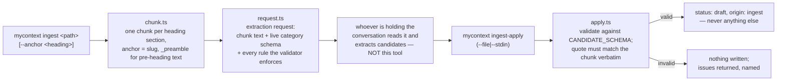
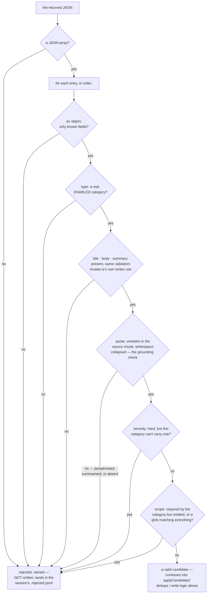

# Ingest — a document becomes items

`docs/system/00-index.md`

## 1. What it is, and the idea a newcomer misses

Handing a file to the tool, having it frame a request for what should be extracted, and applying
whatever comes back as draft items. The idea that is easy to miss reading the command names alone,
stated in the tool's own generated instructions: **"you are the extractor. my_context has no model
of its own and never calls one — it hands you the text and validates what you return."** `ingest.ts`
never reads a document and decides what it means. It chunks the document, frames a precisely-worded
request, and later validates and applies whatever text comes back from whichever agent is actually
holding the conversation. The extraction — the part that looks like the interesting half of this
feature — happens entirely outside this codebase.

Not to be confused with:

- **Lessons' rule-derivation** (`docs/system/05-lessons.md`) — the same two-phase shape (frame a
  request, validate and apply what comes back), applied to a different domain: general corpus items
  here, rules specifically there. They share a validation-issue type and nothing else in code.
- **The review queue.** Ingest's output lands as `status: draft` items, which the review queue then
  lists among other drafts — but ingest itself has no queue-management logic; it stops once the
  items are written.

## 2. How it works, end to end



`mycontext ingest <path> [--anchor <heading>]` opens a session and chunks the document
(`src/ingest/chunk.ts`): one chunk per section under a heading, with the anchor derived as a slug of
that heading, `_preamble` for any text before the first heading, and a disambiguating suffix
(`--N`, double hyphen — `chunk.ts:339` builds `${candidate}--${n}` — or an 8-character hash) for an
oversize or duplicate-named section. `request.ts` then builds
the extraction request itself — and the file's own comment explains a design choice worth
generalising: the request spells out *every rule the validator actually enforces*, because a request
that teaches a rule the validator does not check is merely unhelpful, while a request that omits a
rule the validator *does* check produces a rejected candidate the extractor had no way to have
avoided. The single most load-bearing instruction inside it: **every candidate must carry a `quote`
copied verbatim from the chunk**, checked by an exact match after whitespace is collapsed — the
mechanism that keeps a candidate tied to something the document actually said, rather than something
an extractor inferred.

`mycontext ingest-apply <session-id> --anchor <a> (--file <path>|--stdin)` validates the returned
JSON against the schema and, if it passes, writes every candidate as `status: 'draft'`,
`origin: 'ingest'` — asserted directly in code, never anything else, regardless of what the
candidate itself claims. Nothing is written at all if validation fails; the caller gets back a list
of named issues instead. Re-extracting an anchor whose draft is still current supersedes it rather
than duplicating it. `mycontext ingest-status [--summary]` reports session and anchor progress.

**What actually refuses a candidate, and in what order.** `validateCandidates` (`src/ingest/schema.ts`)
is a chain, not a single check, and the order is the order the source reads it in — a shape refusal
before a content refusal, because a message about a missing quote is useless on an entry that is not
even an object yet. Each `reject()` on the way is durable, not a thrown error that takes the batch
down with it: `INV-a-validator-that-gates-writes-must-be-a-complete` is what makes this a *complete*
precondition rather than a first pass — nothing `createItem` would refuse gets past this chain.
**What actually checks that is smaller than an earlier draft of this chapter claimed**, and the
size is worth stating rather than rounding up: `test/ingest/schema.test.ts` carries 69 cases, of
which the charter one is a genuine cross-product — `TITLE_VARIANTS` (4) × `BODY_VARIANTS` (4) ×
`SEVERITY_VARIANTS` (2) = **32 candidates**, with `scope`, `tags`, `extra` and `observations`
rotating by index so no field sits at a clean default while another moves — each of which must
survive `createItem` → write → parse → re-render byte-identical, with its checksum unchanged
(`:631–672`). Thirty-two, built as a cross-product, is a stronger argument than a hand-written list
of the same length, because the earlier hand-written list is precisely how `body` and `severity`
went untested. It is not, as this chapter previously said, tens of thousands.



(Further per-field checks — tags, observations — continue past the last gate shown here; this
diagram stops at the decisions this chapter's own prose calls out, not at every field `schema.ts`
touches. `docs/capabilities/03-creation-and-gates.md` is the general item-creation gate this one
specialises for an ingest candidate specifically — `mycontext add` and `create_item` gate a
hand-written item through a related but separately-coded path.)

**Locking.** Both the CLI's `ingest-apply` and the MCP tool's equivalent phase share one lock
(`src/ingest/lock.ts`), scoped to the whole workspace rather than to one session or anchor — because
the actual hazard is two concurrent applies against the same workspace, not two applies against the
same anchor.

## 3. Real output

```
$ mycontext ingest --help
usage: mycontext ingest <path>
  emit an extraction request for a document (you are the extractor)

flags:
  --anchor Authentication  Ask for one section rather than the whole document. Omit it to take the
                           next pending anchor. Takes a heading from the document.

  The command's own usage block — the worked forms, and how they combine — is printed by running it
  with an argument it refuses. `mycontext help cli` is the flag reference for the whole CLI, and
  carries the exit-code contract a script reads.
```

Two sibling commands: `ingest-apply <session-id> --anchor <a> (--file <path>|--stdin)`,
`ingest-status [--summary]`.

## 4. Who may trigger it, and through which door

**CLI**: `ingest`, `ingest-apply`, `ingest-status`. **MCP**: `src/mcp/tools/ingest.ts` implements
both the request-framing phase and the apply phase, reusing the exact same `src/ingest/` core the
CLI uses — one implementation, two entry points, the same shape this project uses everywhere a
command has both a CLI and an MCP door. No dedicated UI screen drives ingest interactively; its
*output* — the drafts it writes — is visible wherever drafts are listed, the same way any other
draft is.

## 5. What is known wrong or unfinished here

No item under `.my_context/items/known_issue/` mentions ingest by name — re-checked 2026-09-17 with
a case-insensitive grep over the whole directory, which returned nothing.

**`src/ingest/schema.ts:340` cites an item id that resolves to nothing**, and it is the origin of a
defect this chapter carried until the previous pass. The comment reads
`INV-a-validator-that-gates-writes-must-be-a-complete-precondition-for-the-write`; the real id is
`INV-a-validator-that-gates-writes-must-be-a-complete`, four words shorter. An earlier draft of
this chapter copied the long form out of the code, where it looked complete and silently resolved
to nothing. `npm run check:cited-items` *does* see it — it prints
`UNKNOWN src/ingest/schema.ts:340 … no item answers to it` — but that check is **reported, never
gated**, exits 0 either way, and prints this line only under `--unresolved`, among 2,621 id-shaped
strings that are mostly test fixtures inventing ids. So the gate is not wrong; the finding is
simply not in front of anyone. Four more instances of the same over-long id sit in
`test/cli/format-table.test.ts`, where they are fixture text rather than a citation.

**And no gate checks the ids cited in these chapters at all.** `check-cited-items.ts`'s
`SOURCE_ROOTS` is `['src', 'test', 'scripts', 'e2e']` (`:191`) — `docs/` is not walked. Every id in
`docs/system/` was verified by hand in this pass and in the one before it, which is a reading with a
date on it and not a standing guarantee.

`scripts/backfill-requests.ts` (816 lines) is a separate, larger script whose relationship to the
live ingest session flow was not traced for this chapter — flagged here rather than described
speculatively, and worth a follow-up read before this chapter is extended.

## 6. Code map

| File | Lines (2026-09-17) | What it owns |
|---|---|---|
| `src/ingest/schema.ts` | 586 | `CANDIDATE_SCHEMA` and its validation |
| `src/ingest/session.ts` | 705 | Session lifecycle, stored under `.my_context/.ingest/` |
| `src/ingest/chunk.ts` | 403 | Document chunking and anchor derivation |
| `src/ingest/request.ts` | 167 | Building the extraction request |
| `src/ingest/apply.ts` | 394 | Validation and the draft-write invariant |
| `src/ingest/lock.ts` | 74 | The workspace-wide apply lock |
| `src/cli/commands/ingest.ts` | 407 | The three CLI subcommands |
| `src/mcp/tools/ingest.ts` | 177 | The MCP door, reusing the same core — and the second caller of `acquireApplyLock` |
| `scripts/backfill-requests.ts` | 816 | A larger, separate script — relationship to the live flow not traced here |

## See also

- [`docs/tutorials/ingesting-and-refreshing-from-a-source-file.md`](../tutorials/ingesting-and-refreshing-from-a-source-file.md) —
  the beginner walkthrough this chapter builds past
- [`docs/system/05-lessons.md`](./05-lessons.md) — the same two-phase "the tool frames the request"
  shape, applied to one lesson instead of a whole document
- [`docs/capabilities/03-creation-and-gates.md`](../capabilities/03-creation-and-gates.md) — the
  drafts this door's output lands as, and the gates a draft passes through on its way to `active`
