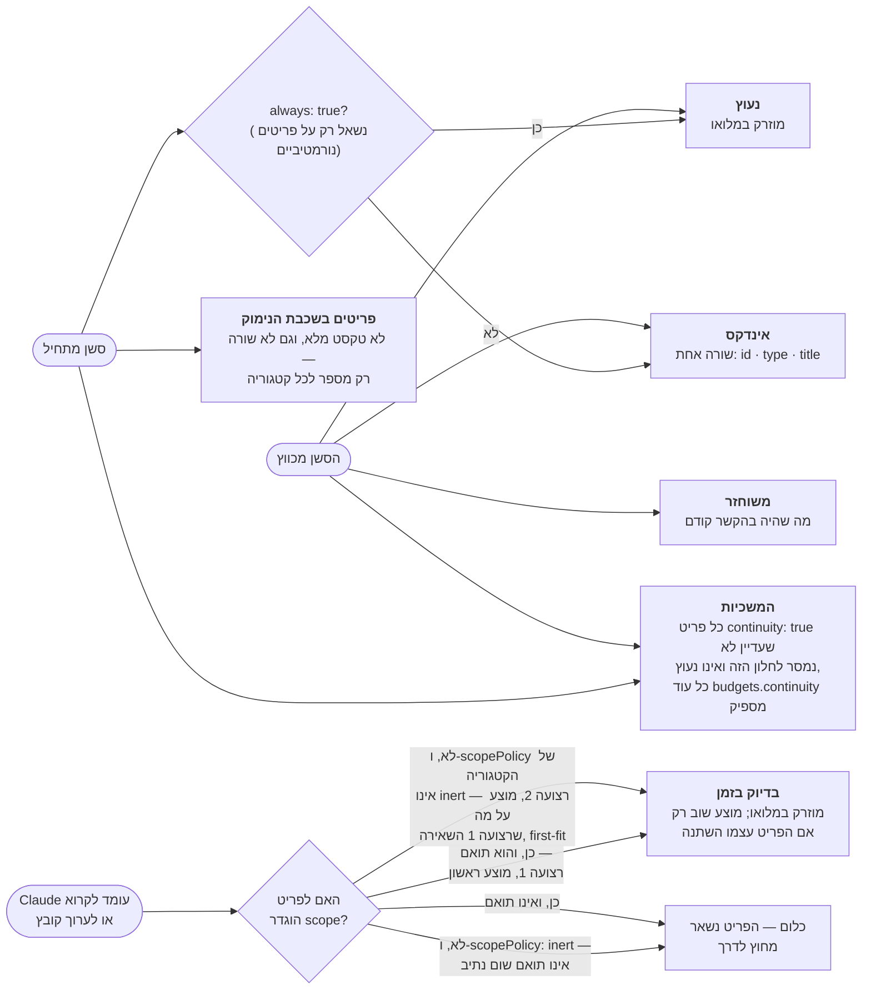
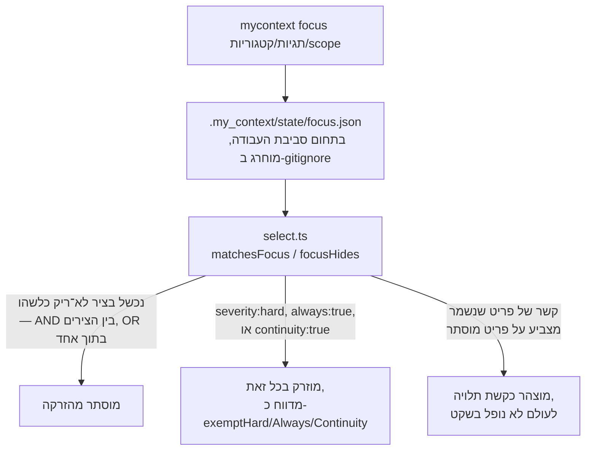

<!--
  Hebrew mirror of `docs/system/07-focus.md`. The English document is the source
  of record; where the two disagree, the English one is right and this one is
  stale. Conventions, and the link policy, are stated once in
  `docs/system/00-index.he.md`'s own header comment.

  TWO THINGS IN THIS FILE WERE SPLICED, NOT WRITTEN.

  1. The §2 injection-map fence. The English chapter carries README.md §4's own
     fence, byte-identical, because README owns that drawing. This edition
     carries `docs/README.he.md` §4's own fence instead — extracted with the
     product's own `mermaidBlocks` and spliced byte-for-byte, not translated
     here. Same 16 lines, same node ids, same edges. Translating README's
     English fence into a second Hebrew drawing would have created exactly the
     second copy the chapter's own §2 is about.
  2. Both pasted command-output blocks, spliced byte-for-byte out of the English
     chapter with their `...` cuts exactly as the English marks them.

  Nothing here was re-measured; every count is carried across from the English
  chapter as it stands on 2026-09-17.
-->

# מיקוד — צמצום מה שסשן רואה

<div dir="rtl">

<span dir="ltr">`docs/system/00-index.he.md`</span>

זו הגרסה העברית של [`docs/system/07-focus.md`](./07-focus.md). המסמך האנגלי הוא המקור;
במקרה של סתירה — האנגלית קובעת.

## 1. מה זה, ובמה מתבלבלים איתו

מיקוד מסנן את מה ש-<span dir="ltr">`select.ts`</span> — נתיב ההזרקה האחד שיש למוצר הזה
כולו — מוכן להציע לתוך חלון ההקשר של סשן, כל עוד המסנן מוגדר. הוא אינו נתיב הזרקה שני;
הוא פרדיקט שמוחל בתוך הקיים. שלושה דברים שקל לבלבל איתם:

- **איפשור/כיבוי קטגוריות בתצורה.** תצורה
  (<span dir="ltr">`.my_context/config.json`</span>) היא קבועה, לכל פרויקט, ומקומיטת
  למאגר. מיקוד הוא זמני, לכל מכונה, וחי תחת
  <span dir="ltr">`.my_context/state/`</span>, שמוחרג ב-gitignore.
- **סשן של Claude Code, למרות השם.** מיקוד *אינו* מוגדר בתחום של סשן Claude Code אחד — הוא
  מוגדר בתחום **סביבת העבודה**, ונמשך עד שמנקים אותו במפורש. זו סטייה מכוונת מהערת עיצוב
  קודמת שרצתה תחום סשן, שנעשתה מסיבה שנמדדה: ברגע שמיקוד נקבע, לא ל-CLI ולא לשרת ה-MCP יש
  מזהה סשן שהם יכולים לסמוך עליו — משתנה הסביבה שסשן משוחזר מדווח עליו אינו תואם באופן אמין
  למה שההוקים של אותו סשן עצמו מקבלים.
- **תור הסקירה או הקליטה.** אף אחד מהם אינו קורא או כותב מצב מיקוד; צמצום מה שמוזרק
  והחלטה מה שולט הם מנגנונים לא־קשורים שבמקרה חיים שניהם תחת "מנגנוני הקורפוס".

## 2. איך זה עובד, ולמה אי אפשר להסביר את זה בלי תקציב ההזרקה

<span dir="ltr">`mycontext focus <tag>… [--category x] [--scope glob] [--relations]
[--preview] [--yes]`</span> כותב את
<span dir="ltr">`.my_context/state/focus.json`</span>, שמחזיק בדיוק שלושה צירים: תגיות,
קטגוריות ו-scope. ההערה של הקוד עצמו קוראת לזה מגבלה מכוונת — "the axes a person already
thinks in" — מפני שכל ציר נוסף עולה בחדות ההצהרה שמתוארת למטה.

מיקוד יושב במורד מנגנון שהוא לעולם אינו מחליף: אילו פריטים בכלל מועמדים לחלון ההקשר של סשן
מלכתחילה, לפני שמסנן כלשהו מצמצם אותם הלאה. <span dir="ltr">`README.md`</span> §4 נוקב
בחמישה מסלולים כאלה — נעוץ, בדיוק בזמן, משוחזר, המשכיות, אינדקס — והתרשים למטה משוחזר
מהסעיף ההוא, **אותו מקור שממנו נגזר גם העותק
ב-<span dir="ltr">`docs/capabilities/02-injection.md`</span> §4.**

**הציור הזה כבר נרקב שלוש פעמים, והדבר המועיל הוא התבנית ולא התיקון האחרון.** תחילה הוא
נטען כ*זהה בית־בית* לזה של README, וזה היה נכון לקומיט אחד. אחר כך הטענה הוחלשה למקוריות
והגדר נשתלה — ו-README זז שוב באותו יום, כך שטענת המקוריות נשארה נכונה בזמן שהתמונה
מתחתיה הפסיקה בשקט להתאים: העותק בפרק הזה צייר
<span dir="ltr">`always: true?`</span> בלי סייג במקום ש-README שואל אותו עכשיו *רק על
פריטים נורמטיביים*, אמר שבדיוק־בזמן מוזרק *"once per session"* במקום ש-README אומר עכשיו
*"offered again only if the item itself changed"*, הבטיח *כל* פריט
<span dir="ltr">`continuity: true`</span> *"in full"* במקום ש-README מגביל אותו לפריטים
שעוד לא נמסרו ול-<span dir="ltr">`budgets.continuity`</span>, צייר ענף אי־הזרקה אחד במקום
ש-README מצייר שניים, והשמיט לגמרי את המקרה
<span dir="ltr">`scopePolicy: inert`</span> ואת ענף דרג הרציונל. שלושה מתוך חמשת ההבדלים
האלה הם כמתים, וזו המחלקה שהתיקייה הזאת ממשיכה לטעות בה.

הגדר שלמטה חולצה מחדש מ-README עם `mermaidBlocks` של המוצר עצמו ונשתלה תוכניתית
ב-**2026-09-17**, ואחר כך נטען שהיא שווה לזו של README ולזו
של <span dir="ltr">`docs/capabilities/02-injection.md`</span> — כל השלוש זהות בית־בית באותו
רגע. **שום דבר אינו משער את זה.**
<span dir="ltr">`npm run check:diagrams`</span> מפענח כל גדר במסמכים האלה ואינו משווה אף
אחת מהן לאחרת, ולכן ההוראה העמידה היחידה היא זו שאינה נרקבת: **אם הציור הזה ו-README §4
אי פעם חלוקים, זה של README הוא הנכון וזה כאן מיושן.**

*(הערת תרגום, לא טענה על התוכנה: המהדורה העברית נושאת כאן את הגדר של
<span dir="ltr">`docs/README.he.md`</span> §4 עצמה, שחולצה עם אותה
`mermaidBlocks` ונשתלה בית־בית, ולא תרגום חדש של הגדר האנגלית — שאם לא כן היה נוצר בדיוק
העותק השני שהסעיף הזה עוסק בו.)*

דבר אחד שהתמונה מציירת ו**אינו** מסלול: הענף <span dir="ltr">`rationale-tier items`</span>.
הפרוזה של README עצמה עדיין אומרת חמישה דרגים, והענף ההוא הוא מה שאינו מגיע לאף אחד מהם —
בלי טקסט מלא, בלי שורת אינדקס, רק מספר חשוף לכל קטגוריה. כל חמשת המסלולים האמיתיים
מצוירים, **כולל המשכיות**; מה שהפרוזה עדיין חייבת לקורא הוא שהמשכיות היא גם אחד משלושת
הדברים שמיקוד לעולם אינו רשאי להסתיר, שנקובים שוב למטה.

**מיקוד מצמצם את כל הסט הכשיר, לפני שמחושב דרג כלשהו — ולא ענף אחד של התרשים הזה.**
<span dir="ltr">`select.ts:1511–1518`</span> מסנן את
<span dir="ltr">`eligibleAll`</span> דרך `focusHides` פעם אחת — ההערה מעל המסנן היא
*"Focus narrows the eligible set, so every tier and the index inherit it from one place"* —
וכל מסלול למטה שואב ממה ששרד את המסנן ההוא. פריטים נעוצים ופריטי המשכיות אינם מוגנים
בזכות היותם מחוץ להישג ידו של המיקוד; הם מוגנים על ידי שלוש החרגות מפורשות שכתובות *בתוך*
`focusHides` (<span dir="ltr">`select.ts:683–694`</span>), וזו הסיבה
ש-<span dir="ltr">`exemptHard`</span>, <span dir="ltr">`exemptAlways`</span>
ו-<span dir="ltr">`exemptContinuity`</span> קיימים בכלל. §5 למטה הוא ההוכחה: שלושת הימים
באוגוסט 2026 שבהם מיקוד הסתיר שישה פריטים נעוצים לא היו יכולים לקרות אילו מיקוד לא היה
יכול להגיע למסלול הנעוץ.

</div>



<div dir="rtl">

*(משוחזר מ-<span dir="ltr">`README.md`</span> §4, שהוא הבעלים של התרשים הזה — כל מסלול
כאן מתחרה גם מול תקציב בתים לכל דרג, ומה שאינו נכנס נשפך ולא נופל בשקט; מנגנון האריזה
ההוא, וכל מספר בתוכו, שייך
ל-<span dir="ltr">`docs/capabilities/02-injection.md`</span> ולא לפרק הזה.)* מיקוד הוא
פרדיקט ש-<span dir="ltr">`select.ts`</span> מחיל **בתוך** המפה הזאת, ולא מסלול שישי לצדה
— הוא יכול להסתיר משהו שחמשת המסלולים האלה היו מציעים אחרת, ו, כפי ששלוש ההחרגות למטה
מראות, יש שלושה סוגי פריטים שאסור לו להסתיר גם אז.

<span dir="ltr">`select.ts`</span> מחיל את המסנן, והכמת הפוך מזה שקורא מצפה לו: **פריט
נמצא במיקוד רק אם לכל ציר לא־ריק יש לפחות התאמה אחת, ולכן הוא מוסתר אם הוא נכשל
ב_אחד_ מהם.** הערת התיעוד של `matchesFocus` עצמה
(<span dir="ltr">`select.ts:631`</span>) מנסחת זאת בארבע מילים — *"AND across axes, OR
within one"* — ונותנת את המקרה המעובד: <span dir="ltr">`--tag billing --tag invoicing
--category rule`</span> פירושו *"a rule tagged billing or invoicing, which is what a person
means when they type it"*. ההבדל הוא רוב הקורפוס. תחת קריאת OR,
<span dir="ltr">`--tag billing --category rule`</span> היה מסתיר רק את מה שאינו מתויג
<span dir="ltr">`billing`</span> ואינו <span dir="ltr">`rule`</span>; תחת הקוד הוא מסתיר
כל דבר שאינו <span dir="ltr">`rule`</span> מתויג <span dir="ltr">`billing`</span>.

אבל שלוש מחלקות של פריטים לעולם אינן מוסתרות ללא קשר להתאמה, וזה החלק שאי אפשר להסביר
דרך מיקוד לבדו — זו עובדה על תקציב ההזרקה
(<span dir="ltr">`docs/capabilities/02-injection.md`</span>) שמיקוד חייב לכבד ולא לדרוס:

- פריטי **<span dir="ltr">`severity: hard`</span>** — אסור להפר אותם, ולכן מיקוד אינו
  יכול לגרום לאחד להיעלם.
- פריטי **<span dir="ltr">`always: true`</span>** — אסור שייפלו מההקשר, ולכן מיקוד אינו
  יכול לגרום גם לאחד מהם להיעלם.
- פריטי **<span dir="ltr">`continuity: true`</span>** — חייבים לשרוד אל הסשן הבא.

כל החרגה נעקבת ומדווחת כרשימה משלה (<span dir="ltr">`exemptHard`, `exemptAlways`,
`exemptContinuity`</span>) ולא מקופלת לדלי אחד לא־מובחן של "נשמר בכל זאת", מפני שכל אחת
נשמרת מסיבה אחרת ומי שמצמצם את הסשן שלו צריך לדעת איזו מהן חלה על פריט ששרד.

מיקוד גם לעולם אינו *מסרב* בשקט להסתיר משהו מפני שזה היה משאיר קשר יתום — הוא **מצהיר**
על העלות במקום, מפרט כל קשת תלויה שבה קצה אחד היה מוסתר והשני לא, ומשאיר למי שקובע את
המיקוד להחליט. <span dir="ltr">`--preview`</span> מריץ את החישוב הזהה בלי לכתוב דבר;
קביעה או ניקוי של מיקוד באמת דורשים <span dir="ltr">`--yes`</span>, אותה מוסכמה של גבול
אישור שהפרויקט הזה משתמש בה בכל מקום שבו פקודה משנה מצב.

</div>



<div dir="rtl">

## 3. פלט אמיתי

בסביבת העבודה שהפרק הזה נכתב מולה אין כרגע מיקוד מוגדר. שתי השורות למטה מודפסות שתיהן;
טיוטה קודמת של הפרק הזה שמרה את הראשונה והשמיטה את השנייה, שהיא השורה שאומרת לקורא מה
לעשות אחר כך:

</div>

```
$ mycontext focus --show
my_context: no focus is set — every eligible item is injectable.
Set one with `mycontext focus <tag>`, or see `mycontext focus --relations`.
```

<div dir="rtl">

תצוגה מקדימה של מיקוד צר יותר מראה את ההצהרה שמתוארת ב-§2 ישירות:

</div>

```
$ mycontext focus --category rule --preview
...
1 continuity item(s) do not match this focus and are injected anyway...
6 load-bearing relation(s) dangling — one end is hidden, the other is not:
  DEC-index-lists-only-what-is-not-already-injected (hidden)
    constrains → INV-nothing-is-dropped-silently
  ...
53 severity:hard item(s) do not match this focus and are injected anyway — focus never hides one:
  CONST-evidence-must-cite-a-captured-record-id
  ...
Apply it by running the same command without --preview.
```

<div dir="rtl">

*(פלט אמיתי מול המאגר הזה, 2026-09-17 — **הורץ מחדש בזמן שהפרק הזה תוקן, וכל שורה שנשמרה
עדיין משתחזרת בית בית**: 6 קשרים תלויים, אותו זוג ראשון, 53 פריטי
<span dir="ltr">`severity:hard`</span> עם
<span dir="ltr">`CONST-evidence-must-cite-a-captured-record-id`</span> בראש הרשימה, ואותו
משפט סיום. זה הגוש האחד ב-<span dir="ltr">`docs/system/`</span> שסימן את החתכים של עצמו
מלכתחילה, והוא הגוש האחד ששרד מאמת ללא שינוי — שורות ה-<span dir="ltr">`...`</span> כאן
עומדות במקום הרשימה המוסתרת, גוש נעוץ בן 7 פריטים, והזנבות של שתי ספירות. **הרשימה
המוסתרת היא המספר שזז:** המעבר הקודם רשם <span dir="ltr">1,129</span> פריטים; אותה פקודה
ב-2026-09-17 מדפיסה <span dir="ltr">`114 item(s) in focus, 1135 hidden by focus`</span>.
הגוש הנעוץ עדיין 7, ספירת הקשרים התלויים עדיין 6 וספירת
ה-<span dir="ltr">`severity:hard`</span> עדיין 53. ממיקוד
<span dir="ltr">`--category rule`</span> שמצמצם כמעט לכלום מלבד פריטי
<span dir="ltr">`rule`</span> מצופה להחריג את רוב הקורפוס, וזה בדיוק מה שההצהרה שלמעלה
מראה קורה.)*

## 4. מי רשאי להפעיל את זה, ודרך איזו דלת

**CLI**: <span dir="ltr">`focus`</span>, עם כל ציר ועוד
<span dir="ltr">`--show`, `--clear`, `--preview`, `--relations`, `--json`</span>.
**MCP**: <span dir="ltr">`focus_context`</span>,
ב-<span dir="ltr">`src/mcp/tools/focus.ts`</span> — הוא קורא לאותן פונקציות
<span dir="ltr">`readFocus`/`setFocus`/`unsetFocus`/`focusReportLines`</span> שפקודת
ה-CLI קוראת להן, במקום לממש מחדש את הפרדיקט. **ממשק הרשת**: חלונית קופצת בשורת הכותרת
(<span dir="ltr">`#focuspop`</span> ב-<span dir="ltr">`app.js`</span>) ש**מרכיבה פקודה
במקום לכתוב ישירות** — היא בונה את הטקסט המילולי
<span dir="ltr">`mycontext focus …`</span> ומוסרת אותו לפקד ההרכבה־וההרצה של הממשק, אותה
תבנית של אי־כתיבה־ישירה ששאר הממשק הקריא־בלבד הזה נוהג לפיה
(<span dir="ltr">`docs/capabilities/08-web-ui.md`</span>).

## 5. מה ידוע שהיה לא בסדר כאן, והתיקון שהוא עכשיו העיצוב

<span dir="ltr">`KNOWN-a-focus-silently-overrides-always-true-so-a-pinned-item.md`</span>
(סטטוס <span dir="ltr">`deprecated`</span> נכון ל-2026-09-03 — נפתר, נשמר בקורפוס
כרשומה) מתעד את הפגם שייצר את מנגנון ההחרגות של §2: מיקוד שנקבע ב-2026-08-24 הסתיר בשקט
שישה פריטי <span dir="ltr">`always: true`</span> במשך שלושה ימים — כולל, וראוי לומר זאת
בפשטות, את ההנחיה שאומרת לסשן להשתמש בקורפוס של הכלי הזה עצמו בכלל. **הקורפוס הסתיר את
ההוראות שהיו אומרות שאין פועלים לפיו.**
<span dir="ltr">`DEC-a-focus-may-not-hide-a-pinned-item-focushides-exempts-always`</span>
היא ההכרעה שבאה בעקבות זאת, ומנגנון <span dir="ltr">`exemptAlways`</span>
ב-<span dir="ltr">`select.ts`</span> הוא האכיפה שלה — אומת חי בקוד הנוכחי ולא רק נטען
כמתוקן.

**טענה שנייה סומנה כפתוחה על ידי המעבר הקודם וכעת היא מיושבת: ההערה מיושנת.**
<span dir="ltr">`focus.ts:41`</span> אומרת *"`mycontext focus --show` and `doctor`'s
`focus_active` check both report"* מיקוד פעיל.
<span dir="ltr">`focus_active`</span> מופיע פעם אחת בדיוק בכל
<span dir="ltr">`src/`</span> — בהערה ההיא. בהרחבה מהשם אל הנושא,
ל-<span dir="ltr">`src/doctor/`</span> יש שבעה מודולים והמופעים היחידים של המילה "focus"
באיזה מהם הם ב-<span dir="ltr">`checks.ts:1417`</span>, <span dir="ltr">`:1447`</span>
ו-<span dir="ltr">`:1464`</span>, כולם על תגית שאינה נראית
ל-<span dir="ltr">`mycontext focus <prefix>:<field>`</span> ואף אחד מהם אינו בדיקה על מצב
המיקוד. אז אין בדיקת doctor למיקוד פעיל תחת השם הזה **או תחת כל שם אחר**, ואת "או שהבדיקה
קיימת תחת שם אחר, או שההערה מיושנת" הקודם אפשר לסגור על הענף השני. השארית היא
ב-<span dir="ltr">`focus.ts`</span>, לא כאן: מי שיקרא את ההערה ההיא ילך לחפש בדיקה שאינה
קיימת.

**ו-<span dir="ltr">`mycontext focus --show`</span> כן מדווח על זה**, וזה החצי של ההערה
שנכון — אומת בהרצה שלו (§3).

## 6. מפת הקוד

</div>

<div dir="rtl">

| קובץ | שורות (2026-09-17) | על מה הוא בעלים |
|---|---|---|
| <span dir="ltr">`src/core/focus.ts`</span> | 658 | <span dir="ltr">`readFocus`/`writeFocus`/`setFocus`/`unsetFocus`</span>, <span dir="ltr">`isLoadBearing`, `danglingEdges`, `focusReportLines`</span> — המוער ביותר מבין שלושת הפרקים בשלישייה הזאת, עם כ-45 שורות על החלטת התיחום לסביבת העבודה לבדה |
| <span dir="ltr">`src/cli/commands/focus.ts`</span> | 294 | פקודת ה-CLI |
| <span dir="ltr">`src/mcp/tools/focus.ts`</span> | 119 | כלי ה-MCP <span dir="ltr">`focus_context`</span> |
| <span dir="ltr">`src/core/select.ts`</span> | 1,851 | <span dir="ltr">`matchesFocus`</span> (<span dir="ltr">`:637`</span>), <span dir="ltr">`focusHides`</span> (<span dir="ltr">`:683`</span>), <span dir="ltr">`focusMatchesScope`</span> — המסנן עצמו, מוחל על <span dir="ltr">`eligibleAll`</span> ב-<span dir="ltr">`:1515–1518`</span> |
| <span dir="ltr">`.my_context/state/focus.json`</span> | — | המיקוד הנוכחי, אם יש; מוחרג ב-gitignore, בתחום סביבת העבודה |

</div>

<div dir="rtl">

## ראו גם

- [`docs/tutorials/narrowing-a-session-focus.md`](../tutorials/narrowing-a-session-focus.md) —
  ההדרכה למתחילים שהפרק הזה בונה מעליה
- [`docs/capabilities/02-injection.md`](../capabilities/02-injection.md) — התקציב והדלתות
  שמיקוד מצמצם בלי להחליף
- <span dir="ltr">`KNOWN-a-focus-silently-overrides-always-true-so-a-pinned-item`</span> —
  הפגם הפתור שמאחורי §5

</div>
