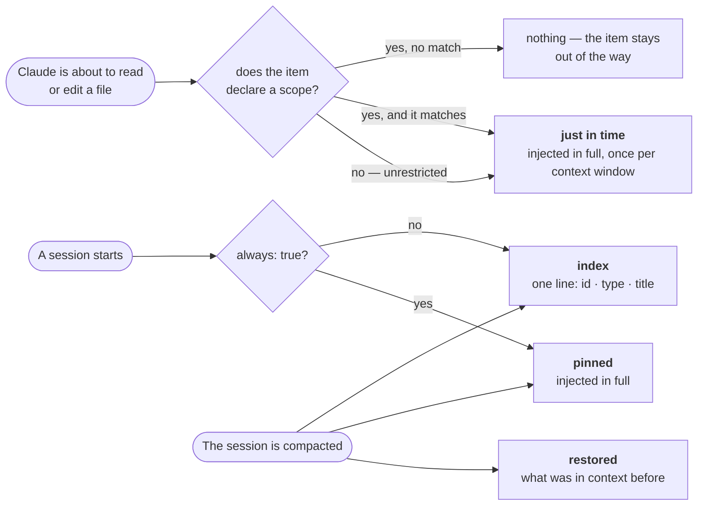
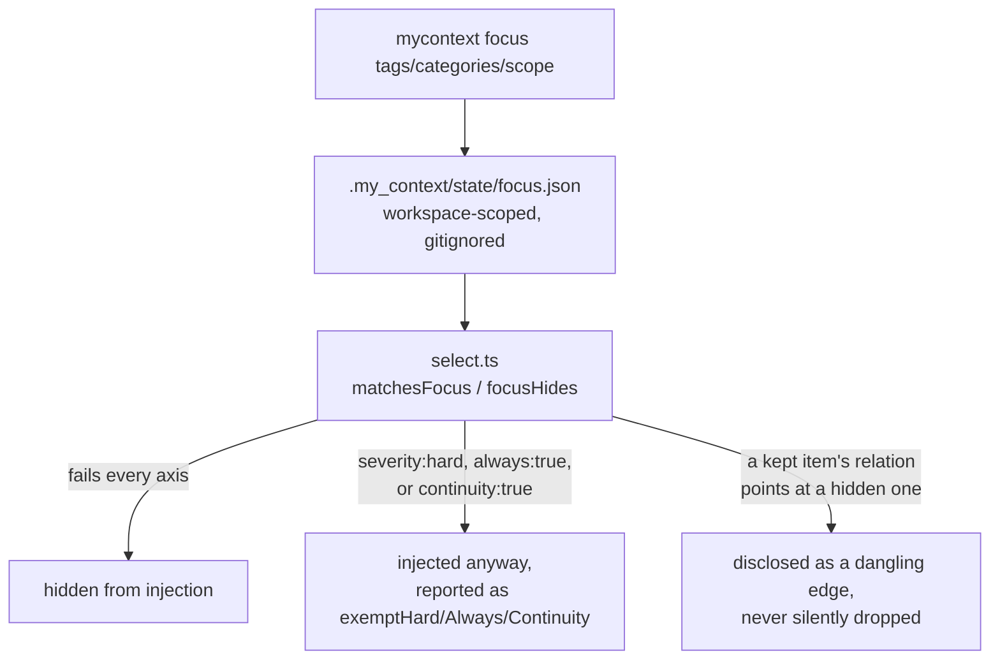

# Focus — narrowing what a session sees

`docs/system/00-index.md`

## 1. What it is, and what it is confused with

Focus filters what `select.ts` — the one injection path this whole product has — is willing to
offer into a session's context window, for as long as the filter stays set. It is not a second
injection path; it is a predicate applied inside the existing one. Three things it is easy to
confuse it with:

- **Config's category enable/disable.** Config (`.my_context/config.json`) is permanent, per-project,
  and committed to the repository. Focus is temporary, per-machine, and lives under
  `.my_context/state/`, which is gitignored.
- **A Claude Code session, despite the name.** Focus is *not* scoped to one Claude Code session — it
  is scoped to the **workspace**, and persists until it is explicitly cleared. This is a deliberate
  deviation from an earlier design note that wanted session scoping, made for a measured reason: at
  the moment focus is set, neither the CLI nor the MCP server has a session id it can trust — the
  environment variable a resumed session reports does not reliably match what the hooks for that same
  session receive.
- **The review queue or ingest.** Neither reads or writes focus state; narrowing what is injected and
  deciding what governs are unrelated mechanisms that happen to both live under "corpus machinery."

## 2. How it works, and why it cannot be explained without the injection budget

`mycontext focus <tag>… [--category x] [--scope glob] [--relations] [--preview] [--yes]` writes
`.my_context/state/focus.json`, holding exactly three axes: tags, categories, and scope. The code's
own comment calls this a deliberate limit — "the axes a person already thinks in" — because every
additional axis costs the disclosure sharpness described below.

Focus sits downstream of a mechanism it never replaces: which items are even candidates for a
session's context window in the first place, before any filter narrows them further. `README.md`
§4 names five such routes; the diagram below, reproduced from there unchanged, draws four of
them — pinned, index, just in time, restored — because that is what README itself draws. The fifth,
**continuity**, is missing from the picture for the same reason it is missing there, and it is the
one this chapter cannot afford to leave out of the *prose*: it is one of the three axes focus must
never hide, named again below. A reader of this chapter needs to know it exists even where the
diagram does not show it. Only just-in-time's branch is the one focus can narrow at all — the other four
fire on their own trigger regardless of what focus is set:



*(Reused from `README.md` §4, which owns this diagram — every route here also competes against a
byte budget per tier, and what does not fit spills rather than silently dropping; that packing
mechanism, and every number in it, belongs to `docs/capabilities/02-injection.md`, not to this
chapter.)* Focus is a predicate `select.ts` applies **inside** this map, not a sixth route beside it
— it can hide something these five routes would otherwise have offered, and, as the three
exemptions below show, three kinds of item it is not allowed to hide even then.

`select.ts` applies the filter: an item is hidden only if it fails **every** non-empty axis. But
three classes of item are never hidden regardless of match, and this is the part that cannot be
explained by focus alone — it is a fact about the injection budget (`docs/capabilities/02-injection.md`)
that focus has to respect rather than override:

- **`severity: hard`** items — must not be violated, so focus cannot make one disappear.
- **`always: true`** items — must not fall out of context, so focus cannot make one disappear either.
- **`continuity: true`** items — must survive to the next session.

Each exemption is tracked and reported as its own list (`exemptHard`, `exemptAlways`,
`exemptContinuity`) rather than folded into one undifferentiated "kept anyway" bucket, because each
is kept for a different reason and a reader narrowing their session needs to know which one applies
to a given surviving item.

Focus also never silently *refuses* to hide something because doing so would strand a relation — it
**discloses** the cost instead, listing every dangling edge where one end would be hidden and the
other would not, and lets the person setting focus decide. `--preview` runs the identical computation
without writing anything; setting or clearing focus for real requires `--yes`, the same
approval-boundary convention this project uses everywhere a command changes state.



## 3. Real output

The workspace this chapter was written against currently has no focus set:

```
$ mycontext focus --show
my_context: no focus is set — every eligible item is injectable.
```

Previewing a narrower focus shows the disclosure described in §2 directly:

```
$ mycontext focus --category rule --preview
...
1 continuity item(s) do not match this focus and are injected anyway...
6 load-bearing relation(s) dangling — one end is hidden, the other is not:
  DEC-index-lists-only-what-is-not-already-injected (hidden)
    constrains → INV-nothing-is-dropped-silently
  ...
53 severity:hard item(s) do not match this focus and are injected anyway — focus never hides one:
  CONST-evidence-must-cite-a-captured-record-id
  ...
Apply it by running the same command without --preview.
```

*(Real output against this repository, 2026-09-17 — the exact counts move as the corpus does; a
`--category rule` focus narrowing to nearly nothing but `rule` items is expected to exempt most of
the corpus, which is exactly what the disclosure above shows happening.)*

## 4. Who may trigger it, and through which door

**CLI**: `focus`, with every axis plus `--show`, `--clear`, `--preview`, `--relations`, `--json`.
**MCP**: `focus_context`, in `src/mcp/tools/focus.ts` — it calls the same `readFocus`/`setFocus`/
`unsetFocus`/`focusReportLines` functions the CLI command calls, rather than reimplementing the
predicate. **UI**: a title-bar popover (`#focuspop` in `app.js`) that **composes a command rather than
writing directly** — it builds the literal `mycontext focus …` text and hands it to the UI's
Compose-and-Execute control, the same no-direct-write pattern the rest of this read-only UI follows
(`docs/capabilities/08-web-ui.md`).

## 5. What is known to have been wrong here, and the fix that is now the design

`KNOWN-a-focus-silently-overrides-always-true-so-a-pinned-item.md` (status `deprecated` as of
2026-09-03 — resolved, kept in the corpus as a record) documents the defect that produced the
exemption mechanism in §2: a focus set on 2026-08-24 silently hid six `always: true` items for three
days — including, worth stating plainly, the instruction that tells a session to use this tool's own
corpus at all. **The corpus hid the instructions that would have said it was not being followed.**
`DEC-a-focus-may-not-hide-a-pinned-item-focushides-exempts-always` is the ruling that followed, and
the `exemptAlways` mechanism in `select.ts` is its enforcement — confirmed live in the current code
rather than merely claimed fixed.

One claim could not be confirmed during research for this chapter and is flagged rather than
asserted: a `doctor` check for a stale focus (referenced by name, "focus_active," in `focus.ts`'s own
comments) does not appear under that name anywhere in `src/doctor/checks.ts`. Either the check exists
under a different name, or the comment describing it is itself stale — this is left open rather than
guessed at.

## 6. Code map

| File | Lines (2026-09-17) | What it owns |
|---|---|---|
| `src/core/focus.ts` | 658 | `readFocus`/`writeFocus`/`setFocus`/`unsetFocus`, `isLoadBearing`, `danglingEdges`, `focusReportLines` — the most heavily commented of the three chapters in this trio, with roughly 45 lines on the workspace-scoping decision alone |
| `src/cli/commands/focus.ts` | 294 | The CLI command |
| `src/mcp/tools/focus.ts` | — | The `focus_context` MCP tool |
| `src/core/select.ts` | — | `matchesFocus`, `focusHides`, `focusMatchesScope` — the actual filter, inside the shared injection path |
| `.my_context/state/focus.json` | — | The current focus, if any; gitignored, workspace-scoped |

## See also

- [`docs/tutorials/narrowing-a-session-focus.md`](../tutorials/narrowing-a-session-focus.md) — the
  beginner walkthrough this chapter builds past
- [`docs/capabilities/02-injection.md`](../capabilities/02-injection.md) — the budget and the doors
  focus narrows without replacing
- `KNOWN-a-focus-silently-overrides-always-true-so-a-pinned-item` — the resolved defect behind §5
