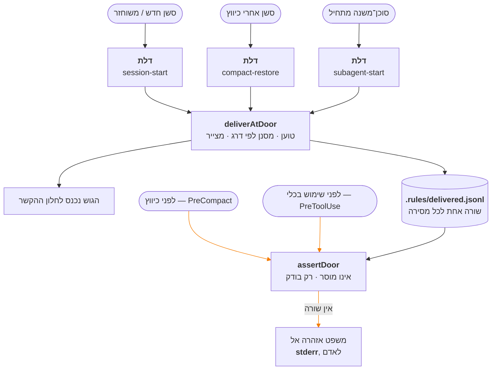

<!--
  Conventions in this file are those of `docs/README.he.md`, and for the same
  reason: they were established by rendering Hebrew Markdown through GitHub's
  own API and reading the result in a browser, not by reasoning about source.

  1. Hebrew prose and tables live inside `<div dir="rtl">` blocks. Fenced code
     and Mermaid blocks are deliberately left OUTSIDE them: inside an RTL
     container the bidi algorithm reverses the runs in a box-drawing table or a
     shell transcript.
  2. Any Latin-script run that must read left-to-right on its own is wrapped in
     `<span dir="ltr">…</span>` — a code span whose first or last character is
     not alphanumeric, and any run of two or more Latin terms separated by
     commas or slashes. A code span whose two edge characters are both
     alphanumeric needs nothing.

  Every number in this document was measured against the repository on
  2026-09-16, not copied from an earlier document. Where an older document and
  the code disagreed, the code won.
-->

# מאגר הכללים של my_context

<div dir="rtl">

**המסמך הזה מסביר דבר אחד: את מאגר הכללים — `src/rules/entries/`.**

זה החלק היחיד במוצר הזה שנשלח *עם הכלי עצמו* ולא עם הפרויקט שמתקין אותו, וזה
גם החלק היחיד שהמוצר מכריז עליו שהוא **גובר על כל מקור אחר** בסשן שמקבל אותו.
אדם שמתקין את התוסף פוגש את התוצאה של המאגר הזה בלי לפגוש אף פעם את המאגר.
המסמך הזה הוא הפגישה.

הוא כתוב למי שלא ראה את הפרויקט הזה מעולם. אין צורך בידע מוקדם.

</div>

<div dir="rtl">

## תוכן

1. [מה זה, ובמה זה שונה מהקורפוס ומהאינדקס](#1-מה-זה)
2. [מה יש בו היום](#2-מה-יש-בו-היום)
3. [איך זה עובד](#3-איך-זה-עובד)
4. [איך מתחזקים אותו](#4-איך-מתחזקים-אותו)
5. [מה ידוע שלא בסדר](#5-מה-ידוע-שלא-בסדר)
6. [מפה קצרה של הקוד](#6-מפה-קצרה-של-הקוד)

</div>

---

<div dir="rtl">

## 1. מה זה

### בשלוש שורות

מאגר הכללים הוא **תיקייה קטנה של קובצי Markdown שנשלחת בתוך חבילת התוסף**. כל
קובץ הוא "קבוע" אחד — עובדה, איסור, נוהל, תקן או הגדרה — על my_context עצמה.
בכל פעם שסוכן מתחיל לעבוד, התוכן הזה נדחף אל תוך חלון ההקשר שלו, בלי שמישהו
ביקש ובלי שמישהו יכול היה לשכוח.

### שלושה דברים שקל להתבלבל ביניהם

מי שמבלבל בין השלושה האלה לא מבין אף אחד מהם, ולכן הם ראשונים.

</div>

<div dir="rtl">

| | איפה זה יושב | מי כתב את זה | האם יש לזה מחזור חיים |
|---|---|---|---|
| **הקורפוס** | <span dir="ltr">`.my_context/items/`</span> — בתוך המאגר של *הפרויקט שלך* | האנשים שעובדים על הפרויקט | כן. פריט נולד, מוחלף, נגנז, דועך |
| **האינדקס** | <span dir="ltr">`.my_context/.index.db`</span> — קובץ SQLite | אף אחד. הוא נגזר מהקבצים | לא רלוונטי. אפשר למחוק ולבנות מחדש בלי לאבד דבר |
| **המאגר** (הנושא כאן) | <span dir="ltr">`src/rules/entries/`</span> — בתוך *חבילת התוסף* | הבעלים של my_context בלבד | **לא.** אלה קבועים, לא פריטים עם חיים |

</div>

<div dir="rtl">

הקורפוס מחזיק את מה ש**פרויקט** יודע. המאגר מחזיק את מה ש**my_context יודעת על
עצמה**. האינדקס הוא רק מטמון מהיר מעל הקורפוס, והמאגר לא נוגע בו בכלל.

ההגדרה הרשמית של הקורפוס עצמה חיה בתוך המאגר, ברשומה בשם `def-the-corpus`,
ושם כתוב במפורש עם מי הוא מתבלבל: *"האינדקס, והמאגר הזה"*.

</div>


<div dir="rtl">

**הבידוד הזה אינו סגנון — הוא נאכף.** התיקייה <span dir="ltr">`src/rules/`</span>
רשאית לייבא בדיוק דבר אחד מליבת המוצר: את מפענח ה-frontmatter
(<span dir="ltr">`src/core/frontmatter.ts`</span>), ולא יותר. הטסט
<span dir="ltr">`test/rules/isolation.test.ts`</span> שומר על זה משני הכיוונים,
וגם מוודא ש-<span dir="ltr">`doctor`, `list`, `ready`</span> ובורר ההזרקה כל אחד
מחזיר **אפס** תוצאות מהמאגר.

הנימוק נכתב בעיצוב המקורי והוא פשוט: אם הקורפוס יודע על המאגר, כל אחת
מהפקודות האלה צריכה **חריג**, וכל חריג הוא מקום לדליפה. מאגר שהקורפוס מעולם לא
שמע עליו לא צריך חריגים בשום מקום.

### מה זה **לא**

- **זה לא קורפוס שני.** בקורפוס יש מחזור חיים: פריט מוחלף, נגנז, דועך. כאן אין.
  אין <span dir="ltr">`status`</span>, אין <span dir="ltr">`supersedes`</span>,
  אין <span dir="ltr">`always`</span>, אין
  <span dir="ltr">`valid_until`</span> — והמפענח **מסרב** לקובץ שמנסה להבריח
  אחד מהם פנימה.
- **זה לא skill.** skill נמשך: המודל קורא תיאור ומחליט אם לטעון. המאגר נדחף,
  בלי החלטה של אף אחד.
- **זה לא תיעוד.** תיעוד נקרא על ידי מי שהולך לחפש. המאגר נוכח בין אם מישהו
  מחפש ובין אם לא.

### למה הוא נולד

הבעלים העלה את זה ב-2026-09-10 תוך כדי הכרעה בממצא אחר, ואלה מילותיו:

> *"צריך שיהיה מקום כזה — אולי ה-skill או מקום קבוע אחר שיהיה בהקשר מהיום
> הראשון כל הזמן... וגם מנגנון שיאפשר לנו לתשאל ולתחזק את רשימת הכללים
> וההוראות הקבועות האלה — זה צריך להיות חלק מהמוצר אבל לא נגיש למשתמש
> my_context אלא רק לי, כבעלים והמפתח."*

ושלוש מדידות מאותו שבוע הפכו את זה מרעיון לצורך:

1. **כלל שנדחק החוצה מהתקציב אי אפשר לציית לו.** שנים־עשר פריטים מחייבים
   נדחקו 20 פעם ומעלה כל אחד. הפריט שנדחק הכי הרבה בקורפוס — 482 פעם — היה
   *כלל על הצורה של כל סיכום שנכתב אי פעם*.
2. **"נעוץ, ולכן נמסר" כבר לא נכון.** על פני 36,024 רשומות ביקורת: 54 התחלות
   סשן מול 1,082 התחלות סוכן־משנה. כלל שנשמר רק להתחלת סשן שומר על האירוע
   הנדיר ביותר.
3. **918 מתוך 1,076 פריטים אינם ניתנים להזרקה מעצם בנייתם.** הקורפוס אינו
   הבית הנכון לעובדה על המוצר.

</div>

---

<div dir="rtl">

## 2. מה יש בו היום

**נמדד ב-2026-09-16: שש־עשרה רשומות.** זו הרשימה המלאה, לא תיאור של הצורה.

</div>

<div dir="rtl">

| מזהה | סוג | דרג | מה זה אומר, בשורה |
|---|---|---|---|
| `an-unknown-category-means-a-possible-wrong-corpus` | עובדה | **product** | שגיאת "קטגוריה לא מוכרת" עשויה להיות קורפוס לא נכון, לא שם מאוית לא נכון |
| `commit-with-a-pathspec` | איסור | developer | הסשן המדַווח עושה commit לפי נתיב מפורש, לעולם לא דרך האינדקס המשותף |
| `never-a-git-command-that-writes-the-shared-tree` | איסור | developer | סוכן־משנה אינו מריץ שום פקודת git שכותבת לעץ העבודה המשותף |
| `a-fixture-must-not-be-what-makes-a-proof-pass` | תקן | developer | כוחה של הוכחה חייב לבוא מהנושא, לא מהאופן שבו נסדרה המסגרת שלה |
| `a-gate-that-cannot-be-shown-to-fail-is-not-a-gate` | תקן | developer | שער אינו מחובר עד שמישהו שבר את מה שהוא שומר וראה אותו מאדים שם |
| `a-scanner-names-what-it-skips-not-what-it-scans` | תקן | developer | סורק מונה את מה שיְדַלֵּג עליו, לעולם לא את מה שיסרוק |
| `nothing-to-do-and-could-not-look-are-different-answers` | תקן | developer | "בדקתי ואין עבודה" ו"לא הצלחתי לבדוק" אסור שיחלקו ערך החזרה אחד |
| `numbered-options-on-a-question-put-to-the-owner` | תקן | developer | שאלה שמוצגת לבעלים נושאת אפשרויות ממוספרות והמלצה אחת מסומנת |
| `def-a-door` | הגדרה | developer | "דלת" היא hook שבו נפתח חלון הקשר, ולכן מקום שחייב למסור |
| `def-a-lane` | הגדרה | developer | "נתיב" הוא סוכן־משנה אחד עם חלון הקשר משלו ותדריך משלו |
| `def-known-red` | הגדרה | developer | "אדום ידוע" = כבר נכשל ב-HEAD, נספר, ונרשם עם סיבה |
| `def-prove-by-removal` | הגדרה | developer | "הוכחה בהסרה" = שובר את השורה שעליה נשענת הקביעה ורואה אותה מאדימה |
| `def-spill` | הגדרה | developer | "דחיקה" = מועמד שלא נכנס בתקציב, ונרשם עם הסיבה |
| `def-stand-down` | הגדרה | developer | "הורדה מכוננות" = גניזת פריט מנקה גם את השדות שמביאים אותו להקשר |
| `def-the-corpus` | הגדרה | developer | הקורפוס הוא ה-Markdown שתחת <span dir="ltr">`.my_context/items`</span>, והוא מקור האמת |
| `def-the-ration` | הגדרה | developer | "המנה" תוחמת כמה הלולאה המשפרת רשאית להניח לפני אדם |

</div>

<div dir="rtl">

### המספרים, כפי שהם היום

</div>

<div dir="rtl">

| מה | כמה |
|---|---|
| רשומות בסך הכול | **16** |
| לפי סוג | 8 הגדרות · 5 תקנים · 2 איסורים · 1 עובדה · **0 נהלים** |
| לפי דרג | **1 product** · 15 developer |
| בתים על הדיסק | 41,955 (רק הרשומות, בלי המניפסט) |
| דרג product | 1,298 בתים מתוך תקציב של 20,000 — כ-6.5% |
| הגוש שמקבל מתקין רגיל | 1,979 בתים, קבוע אחד |
| הגוש שמקבל מי שעובד על my_context | 42,125 בתים, שישה־עשר קבועים |
| רשומות שנושאות `check` אוכף | 5 מונע · 3 מגלה · 8 <span dir="ltr">`none`</span> עם נימוק |
| רשומות שנושאות את מילות הבעלים (`request`) | 5 |
| רשומות שהוסבו מפריט קורפוס (`movedFrom`) | 3 |

</div>

<div dir="rtl">

**שימו לב לשורה השנייה: אפס נהלים.** הסוג <span dir="ltr">`procedure`</span>
קיים בתבנית, נבדק, ואף אחד עוד לא כתב אחד. זו עובדה על המאגר, לא על התבנית.

**ולשורה השלישית: רשומה אחת בלבד מגיעה למשתמש.** בפרויקט זר נכנסת לתוקף בדיוק
רשומה אחת — `an-unknown-category-means-a-possible-wrong-corpus`. כל השאר הן
כללים על *איך המאגר הזה בחר לעבוד*, ולשלוח אותם כחוק של הכלי היה בלתי־מוצדק.

</div>

---

<div dir="rtl">

## 3. איך זה עובד

### 3.1 חמישה סוגים, ותבנית לכל אחד

כל רשומה מצהירה על <span dir="ltr">`kind`</span> אחד מתוך חמישה, וה-kind קובע
אילו שדות היא **חייבת**. אין שדה שנמצא במקום אחר: הטבלה בקוד
(<span dir="ltr">`TEMPLATE`</span> ב-<span dir="ltr">`src/rules/schema.ts`</span>)
היא המקום היחיד שבו שדה נקרא בשמו.

</div>

<div dir="rtl">

| סוג | השדות שלו | מה השדה שואל |
|---|---|---|
| `fact` (עובדה) | `truth`, `breaks` | מה נכון על התנהגות הכלי · מה נשבר אם תניחו אחרת |
| `prohibition` (איסור) | `prohibition`, `why` | מה אסור לעשות · **למה** |
| `procedure` (נוהל) | `steps`, `proof` | הצעדים, לפי סדר · איך יודעים שזה הצליח |
| `standard` (תקן) | `trigger`, `shape` | **המעשה** שהתקן חל עליו · איך זה צריך להיראות |
| `definition` (הגדרה) | `term`, `means`, `confusedWith` | המילה · מה היא אומרת כאן · עם מה מבלבלים אותה |

</div>

<div dir="rtl">

**למה לאיסור יש שדה `why` חובה.** איסור בלי נימוק מתורץ ונעקף בפעם הראשונה
שהוא מפריע. זה לא תיאורטי: ארבעה נתיבים נפרדים עקפו שער אדום כי הוא סומן
"אדום ידוע" בלי סיבה צמודה.

**למה לתקן יש `trigger` ולא היקף קבצים.** הכול במאגר נוכח כל הזמן, אז ה-trigger
אינו מחליט אם למסור. הוא עונה על שאלה אחרת: *איזה מבין כמה כללי צורה חל על מה
שקורה עכשיו* — ולכן הוא מה שהופך ציות למדיד בכלל.

### 3.2 שני שדות שכל סוג חייב

</div>

<div dir="rtl">

| שדה | למה הוא חובה |
|---|---|
| `example` | זה מה שמונע מרשומה להיות ניתנת לוויכוח. *"לעולם לא `git add -A`"* הוא חלש; *"לעולם לא `git add -A` — ב-2026-09-09 commit חשוף סחף עבודה מוכנה של נתיב אחר לתוך commit על גבול של טבלה"* אינו חלש |
| `check` | מה אוכף את זה בפועל |

</div>

<div dir="rtl">

ל-<span dir="ltr">`check`</span> יש בדיוק שלוש צורות חוקיות:

- <span dir="ltr">`preventive:<שם>`</span> — **מונע**. מסרב לפני המעשה, וזמין
  רק במקומות שבהם אנחנו מחזיקים את נתיב הכתיבה.
- <span dir="ltr">`detective:<שם>`</span> — **מגלה**. מדווח אחרי המעשה מתוך
  הארכיון, וזה הסוג *היחיד* שאפשרי לגבי כלל על הפלט של העוזר עצמו.
- <span dir="ltr">`none - <סיבה>`</span> — תשובה חוקית לגמרי, וצריכה להיות
  נדירה. <span dir="ltr">`none`</span> חשוף, בלי סיבה, **נדחה**.

הקיפול של שני הראשונים לאחד היה מאלץ כל רשומה שמדברת על העוזר להצהיר
<span dir="ltr">`none`</span>, וזה היה שקר: הרשומות האלה כן מדידות, פשוט לא
ניתנות למניעה.

### 3.3 שני דרגים, ומה בדיוק מכריע

</div>

<div dir="rtl">

| דרג | חל | מגיע למשתמש |
|---|---|---|
| `product` | תמיד, בכל סביבת עבודה | כן |
| `developer` | רק כשסביבת העבודה שעובדים עליה **היא my_context עצמה** | לא |

</div>

<div dir="rtl">

השאלה נענית בהשוואת **נתיבים**, לא בקובץ־סימון ולא במשתנה סביבה:

</div>

```ts
// src/rules/deliver.ts
export function workspaceIsMyContext(projectRoot: string): boolean {
  return path.resolve(path.dirname(projectRoot)) === packageRoot();
}
```

<div dir="rtl">

הנימוק כתוב בקוד עצמו: קובץ־סימון הוא דבר שפרויקט זר רוכש בהעתקת קובץ, ומה
שתלוי בתשובה הוא האם כללים על איך **המאגר הזה** עובד הופכים לחוק במקום אחר.
נתיב אי אפשר להעתיק בטעות.

**רשומה חדשה מוגדרת כברירת מחדל <span dir="ltr">`developer`</span>.** רדיוס
הנזק של כלל מפתחים שסווג לא נכון הוא סביבת עבודה אחת; של כלל מוצר — כל מי
שהתקין. אבל ברירת המחדל שייכת לכלי שיוצר רשומה, לא למפענח: קובץ על הדיסק
**מצהיר** על הדרג שלו, והסקת דרג לקובץ ששכח להצהיר הייתה בדיוק ההרחבה השקטה
שברירת המחדל באה למנוע.

**הדרג הוא גם מנגנון ההסרה.** הורדת רשומה מ-`product` ל-`developer` מוציאה
אותה מהסט הנשלח בלי למחוק אותה ובלי לאבד את ההיסטוריה שלה.

### 3.4 דלתות — איך רשומה מגיעה לסשן

**"דלת"** היא מונח של הפרויקט הזה, והמאגר מגדיר אותו בעצמו ב-`def-a-door`:
hook שבו חלון הקשר של סוכן **נפתח או נבנה מחדש**, ולכן מקום שנושא חובה למסור.

</div>



<div dir="rtl">

**שלוש דלתות מוסרות, ושתי נקודות רק בודקות.** ההבחנה הזאת היא לב העניין ולא
פרט טכני: אי אפשר להסתכל לתוך חלון ההקשר של מודל. מה שכן ניתן לאימות הוא
ש**מסרנו בכל דלת ואף אחת לא הוחמצה** — ספירה, לא הבטחה. לכן כל מסירה כותבת
שורה, ו-<span dir="ltr">`assertDoor`</span> מחפש את **היעדר** השורה.

שלושה דברים ששווה לדעת על המנגנון הזה:

- **סוכן־משנה מקבל מסירה מלאה משלו.** זה לא כפילות — לחלון ההקשר שלו אין שום
  זיכרון ממה שההורה קיבל. וזה גם האירוע הנפוץ בהרבה: 1,082 מול 54.
- **הבדיקה זולה במכוון.** אחרי השורה הראשונה היא קריאה אחת של הקובץ ובלי ניתוח
  של המאגר כלל — <span dir="ltr">p50 0.371 ms, p95 0.503 ms</span>.
- **משפט "הוחמצה דלת" הולך ל-stderr, לאדם שיושב בטרמינל** — לא לתוך ההקשר של
  המודל.

### 3.5 מה גובר על מה

בראש כל גוש נמסר משפט קבוע, בין אם נמצאה סתירה ובין אם לא:

> *קבוע מוצר גובר על כל מקור אחר, כולל הקורפוס של הפרויקט הזה — הוא מציין איך
> הכלי מתנהג, וזה נכון בלי קשר למה שמישהו רשם עליו. במקום שבו אחד מהם חולק על
> פריט שאתם מחזיקים, הקבוע קובע והמחלוקת נקראת בשמה במקום להיות מוכרעת בשקט.*

**והחצי השני הוא מה שהופך את הראשון לבטוח.** הפונקציה
<span dir="ltr">`findConflicts`</span> משווה את מזהי הרשומות שנמסרו מול מזהי
הפריטים שהקורפוס מסר באותו רגע, לפי ה"גזע" של המזהה — כלומר המזהה אחרי הסרת
קידומת קטגוריה. כשיש התנגשות, שתי הזהויות נקראות בשמן בגוש עצמו: *הקבוע גובר,
הפריט לא נמחק, לא מוסתר ולא נערך.* ניצחון שקט היה מלמד קורא שהכלל שלו נשמר
בזמן שהוא לא נשמר.

שימו לב: המודול הזה **אינו קורא את הקורפוס**. המזהים מועברים אליו מבחוץ, על ידי
ה-hook שכבר מחזיק אותם — בדיוק כמו התשובה לשאלה "האם זו my_context".

### 3.6 החותם — מה הוא מוכיח ומה לא

לצד הרשומות יושב <span dir="ltr">`manifest.json`</span>, ובו שורה לכל קובץ עם
סכום ביקורת SHA-256.

</div>

```
$ node src/cli/index.ts rules verify
my_context: the rule store is intact — every entry matches the checksum that shipped with it.
  D:\Users\UserC\source\repos\my-context\src\rules\entries
store version 5, published 2026-09-11T09:50:41.624Z
```

<div dir="rtl">

שלושה דברים ששווה להבין בו:

1. **סופי שורה מנורמלים לפני החישוב.** בשיבוט Windows עם
   <span dir="ltr">`core.autocrlf`</span> כל <span dir="ltr">`\n`</span> נכתב
   כ-<span dir="ltr">`\r\n`</span>. גיבוב על הבתים הגולמיים היה מדווח על כל
   רשומה כ"שונתה" בהתקנה נקייה — ופקודת אימות שהתשובה הראשונה שלה היא "מישהו
   חיבל לך בכללים" היא פקודה שאנשים מכבים.
2. **החותם מסרב כתיבות, לעולם לא קריאות.** מאגר פגום עדיין מוסר את כל מה
   שהצליח להיטען. הנימוק בקוד: *"חסימת קריאות מענישה משתמש על התקנה פגומה
   שעדיין אפשר להתאושש ממנה, וכלי שהפסיק לענות הוא כלי שאי אפשר להתאושש ממנו
   בכלל. זהו מנגנון בטיחות, לא לקיחת בן ערובה."*
3. **מאז 2026-09-14 המניפסט נבדק בכל דלת.** קובץ Markdown שמישהו הפיל לתיקיית
   הרשומות נמסר לכל מודל כקבוע מחייב. היום הגוש עצמו **אומר זאת** — ועדיין
   מוסר, כי גילוי אינו חסימה.

**ומה החותם לא מוכיח — וזו הנקודה החשובה ביותר בפרק הזה.** סכום ביקורת אומר
*לא־שונה*. הוא לעולם לא אומר *תקף*, והוא לעולם לא אומר *זה מה שנשלח*. שתי
התוצאות של המגבלה הזו רשומות כתקלות ידועות, בסעיף 5.

### 3.7 מה שלעולם לא נשלח: `request`

חמש רשומות נושאות שדה <span dir="ltr">`request`</span> — **מילות הבעלים
עצמו, מילה במילה**, כפי שביקש את הכלל. למשל:

> *"there should be numbers on the options so i can answer by number, and say
> which one you recommend"*

השדה הזה **לעולם אינו מוזרק**. והאכיפה אינה מסנן שמוציא אותו, כי מסנן הוא
רשימה שמישהו יכול לשכוח להרחיב. הצייר פשוט מצייר **רק** את מה שהתבנית נוקבת
בשמו, ועוד את המסגרת והגוף — ו-<span dir="ltr">`request`</span> אינו אף אחד
מהם. שדה חדש שיתווסף מחר יהיה בלתי־נראה שם עד שמישהו יחליט לצייר אותו, וזה
הכיוון הבטוח.

הוא כן מודפס ב-<span dir="ltr">`mycontext rules show`</span>, מסומן
*"asked for as (verbatim, never injected)"*.

</div>

---

<div dir="rtl">

## 4. איך מתחזקים אותו

### 4.1 מי רשאי

**הבעלים בלבד.** זה לא הרשאה טכנית אלא עובדה על האריזה: קובץ
<span dir="ltr">`package.json`</span> מוציא במפורש את
<span dir="ltr">`src/ui/maintenance/`</span> מהחבילה שמתפרסמת. משתמש לא *נכשל*
בגישה לכלי — פשוט אין לו אותו. לכן גם אין בכלי אימות זהות, וזו החלטה מודעת עם
תנאי מפורש: *אם הוא אי פעם ייארז, הסעיף הזה בטל וצריך להיכתב מחדש.*

</div>


<div dir="rtl">

### 4.2 הוספה ושינוי

- **הטופס הוא התבנית.** טופס של <span dir="ltr">`prohibition`</span> נושא שדה
  <span dir="ltr">`why`</span> ולא יישמר בלעדיו. הסכימה, הבדיקה והטופס הם דבר
  אחד ולא שלושה שיכולים להיפרד.
- **כל כתיבה עוברת דרך <span dir="ltr">`writeEntry`</span>.** לכן "האם מאגר
  פגום מסרב את הכתיבה הזו" נענה בקריאת פונקציה אחת.
- **כתיבה מאושרת נרשמת ב-<span dir="ltr">`working`</span>, לא
  ב-<span dir="ltr">`entries`</span>.** בלי זה, העריכה הראשונה הייתה משאירה את
  המאגר חלוק על המניפסט שלו והעריכה **השנייה** הייתה מסורבת — מנגנון הבטיחות
  יורה על עבודתו של הבעלים עצמו, בכלי היחיד שכל תכליתו לשנות את המאגר.
- ולכן האינווריאנט אינו *"המניפסט תואם למה שנשלח"* אלא **"המניפסט תואם לכל
  שינוי שנעשה בנתיב המאושר"**.

### 4.3 פרסום וגרסה

למאגר **גרסה משלו, נפרדת מזו של המוצר**, לפי דרישת הבעלים: אפשר לפרסם עדכון מכלי
התחזוקה בלי לחתוך גרסת מוצר. לכן הוא נושא גרסה משלו ויומן שינויים משלו, ועדכון
מאגר הוא פריט שהתקנה יכולה לקחת בכוחות עצמה.

<span dir="ltr">`planPublish`</span> מציג **diff** ושואל לפני שהוא זז, כי פרסום
פונה החוצה וקשה להפוך אותו. <span dir="ltr">`publishStore`</span> מעלה את
הגרסה ב-1, כותב שורת changelog עם
<span dir="ltr">`added` / `changed` / `removed`</span> והערה בלשון הבעלים,
ומייצר מחדש את סכומי הביקורת.

**התקציב — 20,000 בתים לדרג <span dir="ltr">`product`</span>.** והמקום שבו הוא
נאכף הוא ההחלטה: **בפרסום בלבד, לעולם לא בהתקנה של משתמש.** הכול בדרג
<span dir="ltr">`product`</span> מוזרק אצל כל משתמש בלי יוצא מן הכלל, ולכן אי
אפשר לאכוף גודל במקום שבו משתמש היה פוגש בו — התקנה שנשברת כי *המאגר שלנו* גדל
היא תקלה שגרמנו לה והוא אינו יכול לתקן. היום הדרג עומד על 1,298 בתים, כ-6.5%
מהתקציב.

וזה אכיפה מכונתית ולא משמעת: *"אם הדבר היחיד שמונע דחיקה הוא משמעת בזמן
תחזוקה, זה שער אנושי על בעיה מכונתית — הצורה שכבר נכשלה בקורפוס, שם פריטים
נועצו אחד־אחד, כל אחד בנימוק סביר, עד ששנים־עשר מהם נדחקים ואחד מהם 482 פעם."*

### 4.4 מה קורה לסשן שכבר רץ

הקוד לכך **כתוב, נבדק, ואינו נקרא על ידי אף אחד — וזו נקודת הסיום המכוונת, לא
צעד שלא הושלם.** סוכן־משנה מתחיל מחדש ופשוט מקבל את המאגר החדש; רק סשן ארוך
מחזיק עותק ישן, וטקסט אי אפשר להוציא מחלון הקשר. לכן התיקון היה אמור להיות
**הפרש בלבד, מנוסח כהחלפה ולא כתוספת** — כי עדכון שנקרא כתוספת מייצר בדיוק את
הפגם שהפרויקט הזה מדד: הוראות שהוחלפו ממשיכות להתבצע כאילו הן עדיין בתוקף.

הסיבה שאין לו קורא היא שאף דלת לא מתאימה: כל הדלתות מוסרות את **הסט המלא**, אז
תיקון בדלת כזו היה מגיע לצד עותק שלם של המאגר שהוא בא לתקן — 8,472 בתים של
הפרש מוצמדים ל-23,772 בתים של מסירה מלאה. וה-hook היחיד שיורה באמצע סשן הוא
<span dir="ltr">`PreToolUse`</span>, שהוא בודק ולא דלת.

### 4.5 הכלל: מצטטים רשומה במזהה חשוף, בלי קידומת

**פריט קורפוס נושא קידומת קטגוריה** —
<span dir="ltr">`RULE-`, `TASK-`, `STD-`, `KNOWN-`</span>. **לרשומת מאגר אין
קידומת**, כי למאגר אין קטגוריות. המזהה הוא בדיוק שם הקובץ בלי הסיומת:

</div>

```
נכון:   `nothing-to-do-and-could-not-look-are-different-answers`
שגוי:   `STD-nothing-to-do-and-could-not-look-are-different-answers`
```

<div dir="rtl">

הכלל הזה נכתב כאן משום שהוא לא היה כתוב בשום מקום שקורא היה נתקל בו. ב-2026-09-16
מזהה־רפאים בדיוק בצורה השגויה הזאת התפשט ל**שבעה מקומות בחמישה קבצים** — רשומת
מאגר שצוטטה כאילו הייתה פריט קורפוס. הוא המשיך להתפשט: מונה השער
<span dir="ltr">`check:basis`</span> עלה מ-0 ל-1 כשנתיב אחר העתיק אותו מתוך
כותרת. כל שבעת האתרים תוקנו באותו יום כמעשה אחד, כי *מזהה מתוקן־למחצה גרוע
ממזהה שגוי־בעקביות.*

### 4.6 הפקודות

</div>

```
$ node src/cli/index.ts rules list        # כל הרשומות שבתוקף כאן: id · kind · tier · title
$ node src/cli/index.ts rules show <id>   # רשומה אחת במלואה, כולל request
$ node src/cli/index.ts rules verify      # מול החותם. --restore מחזיר מה שנשלח
```

<div dir="rtl">

שלושתן **קריאה בלבד**. שתיים מהן זמינות גם כ-MCP, כלומר לסוכן בלי מעטפת:
<span dir="ltr">`list_rules`</span> ו-<span dir="ltr">`verify_rules`</span>.
ל-MCP אין <span dir="ltr">`restore`</span> — החזרת בתים היא כתיבה, והסירוב נוקב
בפקודה שכן עושה זאת במקום להתעלם מהארגומנט.

משתנה הסביבה <span dir="ltr">`MYCONTEXT_RULES_DIR`</span> מחליף את **כל** המאגר
בתיקייה אחרת, וזה נחשף בתוך הגוש עצמו — *"הקבועים האלה לא נקראו מהחבילה
המותקנת"* — כי קורא שמחזיק קבועים ממקום אחר צריך שייאמר לו.

</div>

---

<div dir="rtl">

## 5. מה ידוע שלא בסדר

מסמך ישר אומר את זה במקום להציג תמונה נקייה. כל אחד מאלה תועד ונרשם.

### א. החותם אומר "תקין" על רשומה שהמפענח של המאגר עצמו מסרב לקרוא

`KNOWN-rules-verify-answers-intact-for-an-entry-the-store-s-own`

שוחזר ב-2026-09-16 על **עותק** של המאגר. לוקחים רשומה תקינה, שוברים את גדר
ה-frontmatter שלה, וחותמים מחדש את הסכום במניפסט. אז שני חצאי המוצר נשאלים על
אותו קובץ:

</div>

```
parseEntry(…)      → מסרב: "no frontmatter: an entry is Markdown opening with a `---` fenced block"
verifyManifest(…)  → ok: TRUE
```

<div dir="rtl">

**סכום ביקורת אומר לא־שונה. הוא לעולם לא אומר תקף.** אוצר המילים של הפסק מסגיר
את זה: הערכים הם <span dir="ltr">`altered`, `missing`, `unexpected`</span>, ואין
ערך ל"נוכח, לא־שונה, ובלתי־קריא" — כי המצב הזה מעולם לא נשקל. רשומה שאינה
נפענחת היא רשומה שאינה נמסרת, והקורא מקבל הודעה שהמאגר תקין בזמן שכלל אינו
מושל בכלום.

התיקון ידוע: **לפענח כל רשומה כחלק מהאימות**, ולהוסיף ערך רביעי —
<span dir="ltr">`unreadable`</span>. המפענח כבר קיים וכבר מחזיר סירוב שמיש. אין
מה לכתוב כדי לדעת את התשובה, רק כדי **לשאול** אותה.

### ב. הרצת חבילת הטסטים יכולה להשאיר את המאגר הנשלח ערוך, חתום מחדש, ומדווח כתקין

`KNOWN-running-the-test-suite-can-leave-the-shipped-rule-store`

נמצא פעמיים ב-2026-09-16, באופן בלתי־תלוי. הטסט
<span dir="ltr">`test/cli/rules.test.ts`</span> מייבא את **תיקיית המאגר
האמיתית** ומוסיף שורה לתוך רשומה חיה, כדי להוכיח שחבלה מזוהה — וזו מטרה
לגיטימית. אחר כך הוא משחזר. **כשהוא רץ לבדו הוא נקי; תחת החבילה המקבילית
השחזור מפסיד במרוץ.** התוצאה:

</div>

```
M src/rules/entries/manifest.json
M src/rules/entries/numbered-options-on-a-question-put-to-the-owner.md

  …ובסוף הרשומה עצמה:  planted by test/cli/rules.test.ts
```

<div dir="rtl">

**והחלק הגרוע הוא שהחותם לא תופס את זה, והוא אומר אמת על הדבר הלא־נכון.** הטסט
חותם מחדש את שני החצאים, אז הרשומה והמניפסט מסכימים זה עם זה בזמן ששניהם חלוקים
על <span dir="ltr">`HEAD`</span>. **סכום ביקורת מוכיח עקביות פנימית; הוא אינו
יכול להוכיח מקור.** התיקון: לחבל בעותק, לעולם לא במקור — ושער שמשווה את המאגר
להיסטוריה שלו, כי זו התכונה שלחותם אין באופן מבני.

### ג. יומן השינויים כבר אינו מתאר את המאגר

`TASK-replaying-the-store-changelog-from-empty-yields-eleven` (`store/10`)

הרצת יומן השינויים מאפס, שורה אחר שורה, מייצרת **11 רשומות מול 16 על הדיסק**.
חמש רשומות אינן מופיעות באף רשימת <span dir="ltr">`added`</span> אי פעם:

</div>

```
numbered-options-on-a-question-put-to-the-owner      (מופיעה תחת changed בגרסה 1, אף פעם לא added)
a-fixture-must-not-be-what-makes-a-proof-pass        \
a-gate-that-cannot-be-shown-to-fail-is-not-a-gate     >  נוספו 2026-09-13
a-scanner-names-what-it-skips-not-what-it-scans      /
nothing-to-do-and-could-not-look-are-different-answers  נוספה 2026-09-15
```

<div dir="rtl">

הסיבה מכנית וראויה לציון: לכלי התחזוקה **אין נקודת הפעלה נשלחת** — אין פקודת
CLI ואין סקריפט npm שמרים אותו; הוא מופעל היום רק מתוך טסטים. לכן ארבע הרשומות
האחרונות נוספו בעריכה ישירה של הקבצים ושל
<span dir="ltr">`manifest.entries`</span>, לא דרך
<span dir="ltr">`publishStore`</span> — והגרסה לא עלתה ושורת changelog לא
נכתבה.

**וזה בלתי־הפיך בעצמו:** הסכומים במניפסט *נכונים*, אז
<span dir="ltr">`planPublish`</span> מדווח היום על **אפס שינויים**. אין פרסום
עתידי שיוכל להשלים את החסר. שני חצאי <span dir="ltr">`manifest.json`</span>
עונים על שאלות שונות, ורק אחד מהם עדכני: <span dir="ltr">`entries`</span> (16,
חתום, נכון) ו-<span dir="ltr">`store.changelog`</span> (5 גרסאות, 11 רשומות
משוחזרות, מפגר).

### ד. הגוש הנמסר אינו אומר לאיזה דרג כל רשומה שייכת

`TASK-the-delivered-block-omits-the-tier-while-the-developer-only` (`store/12`)

<span dir="ltr">`rules show`</span> מדפיס
<span dir="ltr">`id · kind · tier`</span>; הגוש הנמסר מדפיס
<span dir="ltr">`id · kind`</span> בלבד. קורא של מסירה אינו יכול להבדיל בין
קבוע שחל על כל מי שהתקין לבין כלל פנימי של המאגר הזה.

### ה. מניפסט פגום גורם לפרסום הבא למחוק את יומן השינויים

`TASK-a-corrupt-manifest-makes-the-next-publish-erase-the-store` (`store/13`)

### ו. שום שער אינו מריץ את `rules verify`

לא hook, לא <span dir="ltr">`doctor`</span>, ולא CI. הקבצים
<span dir="ltr">`.github/workflows/`</span> אינם מזכירים אותה כלל. מאז
2026-09-14 כל דלת **מגלה** אי־התאמה בגוש שהיא מוסרת, וזה שיפור אמיתי — אבל
גילוי אינו שער, ואיש אינו נחסם.

### ז. הגדרה שחלוקה על הקוד שמימש אותה

`def-a-door` מונה בשדה <span dir="ltr">`means`</span> שלה את
<span dir="ltr">`PreCompact`</span> כדלת. הקוד מחריג אותה במפורש מטיפוס
<span dir="ltr">`Door`</span> ו**בודק** שם במקום למסור. זהו קבוע מוצר ומימוש
שחלוקים על אוצר המילים של המוצר עצמו, וזה דורש הכרעה של הבעלים ולא בחירת צד על
ידי אחד משני הצדדים.

</div>

---

<div dir="rtl">

## 6. מפה קצרה של הקוד

</div>

<div dir="rtl">

| קובץ | מה הוא עושה | האם הוא כותב |
|---|---|---|
| <span dir="ltr">`src/rules/entries/*.md`</span> | הרשומות עצמן — 16 | — |
| <span dir="ltr">`src/rules/entries/manifest.json`</span> | הסכומים, הגרסה, יומן השינויים | — |
| <span dir="ltr">`src/rules/schema.ts`</span> | התבנית לכל סוג, והמפענח. **המקום היחיד שבו שדה נקרא בשמו** | לא |
| <span dir="ltr">`src/rules/store.ts`</span> | טוען את התיקייה, מסנן לפי דרג, נוקב במה שסירב | **לא. קריאה בלבד** |
| <span dir="ltr">`src/rules/integrity.ts`</span> | עונה על "האם זה המאגר שנשלח" ולא על שום דבר אחר. מייבא כלום | לא |
| <span dir="ltr">`src/rules/deliver.ts`</span> | מצייר את הגוש, מרכיב אותו בדלת, מחשב סתירות | לא |
| <span dir="ltr">`src/rules/delivered.ts`</span> | היומן: <span dir="ltr">`.rules/delivered.jsonl`</span>, תקרה של 5,000 שורות | כן, שורה אחת |
| <span dir="ltr">`src/rules/manifest.ts`</span> | התקציב, הפרסום, וכל כתיבה. **בלתי־נגיש מנתיב המסירה** | כן |
| <span dir="ltr">`src/ui/maintenance/`</span> | כלי התחזוקה. מוחרג מהחבילה שמתפרסמת | כן |
| <span dir="ltr">`test/rules/`</span> | 18 קובצי טסט, 5,157 שורות | — |

</div>

<div dir="rtl">

**ההפרדה בין <span dir="ltr">`integrity.ts`</span> ל-<span dir="ltr">`manifest.ts`</span>
היא כל העניין ולא סידור קבצים.** שער בטסטים אוסר על נתיב המסירה להגיע למודול
שמחזיק את התקציב, כי *"התקנה של משתמש לעולם אינה מסרבת על גודל"* — ותקציב שנגיש
מנתיב המסירה הוא סירוב שממתין למאגר שגדל בבית אחד. כשהאימות ישב ליד התקציב,
אותו שער אסר על דלת לשאול בכלל אם הרשומות שהיא מחזיקה הן אלה שנשלחו. **קריאת
המניפסט היא קריאה שדלת רשאית לעשות; התקציב, הפרסום וכל כתיבה נשארים בצד השני.**

</div>

---

<div dir="rtl">

*נמדד מול המאגר ב-2026-09-16. כל מספר כאן נלקח מהקוד ומהקבצים כפי שהם היום, לא
ממסמך קודם. לצפייה ברשומה אחת במלואה:
<span dir="ltr">`node src/cli/index.ts rules show <id>`</span>.*

</div>
