<!--
  Conventions in this file are those of `docs/README.he.md`, and for the same
  reason: they were established by rendering Hebrew Markdown through GitHub's
  own API and reading the result in a browser, not by reasoning about source.

  1. Hebrew prose and tables live inside `<div dir="rtl">` blocks. Fenced code
     and Mermaid blocks are deliberately left OUTSIDE them: inside an RTL
     container the bidi algorithm reverses the runs in a box-drawing table or a
     shell transcript.
  2. Any Latin-script run that must read left-to-right on its own is wrapped in
     `<span dir="ltr">…</span>` — a code span whose first or last character is
     not alphanumeric, and any run of two or more Latin terms separated by
     commas or slashes. A code span whose two edge characters are both
     alphanumeric needs nothing.

  Every number in this document was measured against the repository on
  2026-09-16, not copied from an earlier document. Where an older document and
  the code disagreed, the code won.
-->

# מאגר הכללים של my_context

<div dir="rtl">

**המסמך הזה מסביר דבר אחד: את מאגר הכללים — `src/rules/entries/`.**

זה החלק היחיד במוצר הזה שנשלח *עם הכלי עצמו* ולא עם הפרויקט שמתקין אותו, וזה
גם החלק היחיד שהמוצר מכריז עליו שהוא **גובר על כל מקור אחר** בסשן שמקבל אותו.
אדם שמתקין את התוסף פוגש את התוצאה של המאגר הזה בלי לפגוש אף פעם את המאגר.
המסמך הזה הוא הפגישה.

הוא כתוב למי שלא ראה את הפרויקט הזה מעולם. אין צורך בידע מוקדם.

</div>

<div dir="rtl">

## תוכן

1. [מה זה, ובמה זה שונה מהקורפוס ומהאינדקס](#1-מה-זה)
2. [מה יש בו היום](#2-מה-יש-בו-היום)
3. [איך זה עובד](#3-איך-זה-עובד)
4. [איך מתחזקים אותו](#4-איך-מתחזקים-אותו)
5. [מה ידוע שלא בסדר](#5-מה-ידוע-שלא-בסדר)
6. [מפה קצרה של הקוד](#6-מפה-קצרה-של-הקוד)

</div>

---

<div dir="rtl">

## 1. מה זה

### בשלוש שורות

מאגר הכללים הוא **תיקייה קטנה של קובצי Markdown שנשלחת בתוך חבילת התוסף**. כל
קובץ הוא "קבוע" אחד — עובדה, איסור, נוהל, תקן או הגדרה — על my_context עצמה.
בכל פעם שסוכן מתחיל לעבוד, התוכן הזה נדחף אל תוך חלון ההקשר שלו, בלי שמישהו
ביקש ובלי שמישהו יכול היה לשכוח.

### שלושה דברים שקל להתבלבל ביניהם

מי שמבלבל בין השלושה האלה לא מבין אף אחד מהם, ולכן הם ראשונים.

</div>

<div dir="rtl">

| | איפה זה יושב | מי כתב את זה | האם יש לזה מחזור חיים |
|---|---|---|---|
| **הקורפוס** | <span dir="ltr">`.my_context/items/`</span> — בתוך המאגר של *הפרויקט שלך* | האנשים שעובדים על הפרויקט | כן. פריט נולד, מוחלף, נגנז, דועך |
| **האינדקס** | <span dir="ltr">`.my_context/.index.db`</span> — קובץ SQLite | אף אחד. הוא נגזר מהקבצים | לא רלוונטי. אפשר למחוק ולבנות מחדש בלי לאבד דבר |
| **המאגר** (הנושא כאן) | <span dir="ltr">`src/rules/entries/`</span> — בתוך *חבילת התוסף* | הבעלים של my_context בלבד | **לא.** אלה קבועים, לא פריטים עם חיים |

</div>

<div dir="rtl">

הקורפוס מחזיק את מה ש**פרויקט** יודע. המאגר מחזיק את מה ש**my_context יודעת על
עצמה**. האינדקס הוא רק מטמון מהיר מעל הקורפוס, והמאגר לא נוגע בו בכלל.

ההגדרה הרשמית של הקורפוס עצמה חיה בתוך המאגר, ברשומה בשם `def-the-corpus`,
ושם כתוב במפורש עם מי הוא מתבלבל: *"האינדקס, והמאגר הזה"*.

</div>

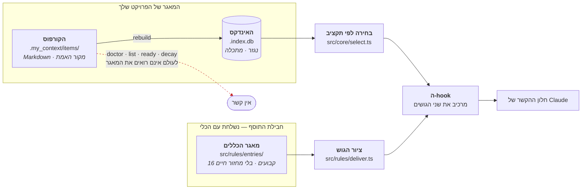

<div dir="rtl">

**הבידוד הזה אינו סגנון — הוא נאכף.** התיקייה <span dir="ltr">`src/rules/`</span>
רשאית לייבא בדיוק דבר אחד מליבת המוצר: את מפענח ה-frontmatter
(<span dir="ltr">`src/core/frontmatter.ts`</span>), ולא יותר. הטסט
<span dir="ltr">`test/rules/isolation.test.ts`</span> שומר על זה משני הכיוונים,
וגם מוודא ש-<span dir="ltr">`doctor`, `list`, `ready`</span> ובורר ההזרקה כל אחד
מחזיר **אפס** תוצאות מהמאגר.

הנימוק נכתב בעיצוב המקורי והוא פשוט: אם הקורפוס יודע על המאגר, כל אחת
מהפקודות האלה צריכה **חריג**, וכל חריג הוא מקום לדליפה. מאגר שהקורפוס מעולם לא
שמע עליו לא צריך חריגים בשום מקום.

### מה זה **לא**

- **זה לא קורפוס שני.** בקורפוס יש מחזור חיים: פריט מוחלף, נגנז, דועך. כאן אין.
  אין <span dir="ltr">`status`</span>, אין <span dir="ltr">`supersedes`</span>,
  אין <span dir="ltr">`always`</span>, אין
  <span dir="ltr">`valid_until`</span> — והמפענח **מסרב** לקובץ שמנסה להבריח
  אחד מהם פנימה.
- **זה לא skill.** skill נמשך: המודל קורא תיאור ומחליט אם לטעון. המאגר נדחף,
  בלי החלטה של אף אחד.
- **זה לא תיעוד.** תיעוד נקרא על ידי מי שהולך לחפש. המאגר נוכח בין אם מישהו
  מחפש ובין אם לא.

### למה הוא נולד

הבעלים העלה את זה ב-2026-09-10 תוך כדי הכרעה בממצא אחר, ואלה מילותיו:

> *"צריך שיהיה מקום כזה — אולי ה-skill או מקום קבוע אחר שיהיה בהקשר מהיום
> הראשון כל הזמן... וגם מנגנון שיאפשר לנו לתשאל ולתחזק את רשימת הכללים
> וההוראות הקבועות האלה — זה צריך להיות חלק מהמוצר אבל לא נגיש למשתמש
> my_context אלא רק לי, כבעלים והמפתח."*

ושלוש מדידות מאותו שבוע הפכו את זה מרעיון לצורך:

1. **כלל שנדחק החוצה מהתקציב אי אפשר לציית לו.** שנים־עשר פריטים מחייבים
   נדחקו 20 פעם ומעלה כל אחד. הפריט שנדחק הכי הרבה בקורפוס — 482 פעם — היה
   *כלל על הצורה של כל סיכום שנכתב אי פעם*.
2. **"נעוץ, ולכן נמסר" כבר לא נכון.** על פני 36,024 רשומות ביקורת: 54 התחלות
   סשן מול 1,082 התחלות סוכן־משנה. כלל שנשמר רק להתחלת סשן שומר על האירוע
   הנדיר ביותר.
3. **918 מתוך 1,076 פריטים אינם ניתנים להזרקה מעצם בנייתם.** הקורפוס אינו
   הבית הנכון לעובדה על המוצר.

</div>

---

<div dir="rtl">

## 2. מה יש בו היום

**נמדד ב-2026-09-16: שש־עשרה רשומות.** זו הרשימה המלאה, לא תיאור של הצורה.

</div>

<div dir="rtl">

| מזהה | סוג | דרג | מה זה אומר, בשורה |
|---|---|---|---|
| `an-unknown-category-means-a-possible-wrong-corpus` | עובדה | **product** | שגיאת "קטגוריה לא מוכרת" עשויה להיות קורפוס לא נכון, לא שם מאוית לא נכון |
| `commit-with-a-pathspec` | איסור | developer | הסשן המדַווח עושה commit לפי נתיב מפורש, לעולם לא דרך האינדקס המשותף |
| `never-a-git-command-that-writes-the-shared-tree` | איסור | developer | סוכן־משנה אינו מריץ שום פקודת git שכותבת לעץ העבודה המשותף |
| `a-fixture-must-not-be-what-makes-a-proof-pass` | תקן | developer | כוחה של הוכחה חייב לבוא מהנושא, לא מהאופן שבו נסדרה המסגרת שלה |
| `a-gate-that-cannot-be-shown-to-fail-is-not-a-gate` | תקן | developer | שער אינו מחובר עד שמישהו שבר את מה שהוא שומר וראה אותו מאדים שם |
| `a-scanner-names-what-it-skips-not-what-it-scans` | תקן | developer | סורק מונה את מה שיְדַלֵּג עליו, לעולם לא את מה שיסרוק |
| `nothing-to-do-and-could-not-look-are-different-answers` | תקן | developer | "בדקתי ואין עבודה" ו"לא הצלחתי לבדוק" אסור שיחלקו ערך החזרה אחד |
| `numbered-options-on-a-question-put-to-the-owner` | תקן | developer | שאלה שמוצגת לבעלים נושאת אפשרויות ממוספרות והמלצה אחת מסומנת |
| `def-a-door` | הגדרה | developer | "דלת" היא hook שבו נפתח חלון הקשר, ולכן מקום שחייב למסור |
| `def-a-lane` | הגדרה | developer | "נתיב" הוא סוכן־משנה אחד עם חלון הקשר משלו ותדריך משלו |
| `def-known-red` | הגדרה | developer | "אדום ידוע" = כבר נכשל ב-HEAD, נספר, ונרשם עם סיבה |
| `def-prove-by-removal` | הגדרה | developer | "הוכחה בהסרה" = שובר את השורה שעליה נשענת הקביעה ורואה אותה מאדימה |
| `def-spill` | הגדרה | developer | "דחיקה" = מועמד שלא נכנס בתקציב, ונרשם עם הסיבה |
| `def-stand-down` | הגדרה | developer | "הורדה מכוננות" = גניזת פריט מנקה גם את השדות שמביאים אותו להקשר |
| `def-the-corpus` | הגדרה | developer | הקורפוס הוא ה-Markdown שתחת <span dir="ltr">`.my_context/items`</span>, והוא מקור האמת |
| `def-the-ration` | הגדרה | developer | "המנה" תוחמת כמה הלולאה המשפרת רשאית להניח לפני אדם |

</div>

<div dir="rtl">

### המספרים, כפי שהם היום

</div>

<div dir="rtl">

| מה | כמה |
|---|---|
| רשומות בסך הכול | **16** |
| לפי סוג | 8 הגדרות · 5 תקנים · 2 איסורים · 1 עובדה · **0 נהלים** |
| לפי דרג | **1 product** · 15 developer |
| בתים על הדיסק | 41,955 (רק הרשומות, בלי המניפסט) |
| דרג product | 1,298 בתים מתוך תקציב של 20,000 — כ-6.5% |
| הגוש שמקבל מתקין רגיל | 1,979 בתים, קבוע אחד |
| הגוש שמקבל מי שעובד על my_context | 42,125 בתים, שישה־עשר קבועים |
| רשומות שנושאות `check` אוכף | 5 מונע · 3 מגלה · 8 <span dir="ltr">`none`</span> עם נימוק |
| רשומות שנושאות את מילות הבעלים (`request`) | 5 |
| רשומות שהוסבו מפריט קורפוס (`movedFrom`) | 3 |

</div>

<div dir="rtl">

**שימו לב לשורה השנייה: אפס נהלים.** הסוג <span dir="ltr">`procedure`</span>
קיים בתבנית, נבדק, ואף אחד עוד לא כתב אחד. זו עובדה על המאגר, לא על התבנית.

**ולשורה השלישית: רשומה אחת בלבד מגיעה למשתמש.** בפרויקט זר נכנסת לתוקף בדיוק
רשומה אחת — `an-unknown-category-means-a-possible-wrong-corpus`. כל השאר הן
כללים על *איך המאגר הזה בחר לעבוד*, ולשלוח אותם כחוק של הכלי היה בלתי־מוצדק.

</div>

---

<div dir="rtl">

## 3. איך זה עובד

### 3.1 חמישה סוגים, ותבנית לכל אחד

כל רשומה מצהירה על <span dir="ltr">`kind`</span> אחד מתוך חמישה, וה-kind קובע
אילו שדות היא **חייבת**. אין שדה שנמצא במקום אחר: הטבלה בקוד
(<span dir="ltr">`TEMPLATE`</span> ב-<span dir="ltr">`src/rules/schema.ts`</span>)
היא המקום היחיד שבו שדה נקרא בשמו.

</div>

<div dir="rtl">

| סוג | השדות שלו | מה השדה שואל |
|---|---|---|
| `fact` (עובדה) | `truth`, `breaks` | מה נכון על התנהגות הכלי · מה נשבר אם תניחו אחרת |
| `prohibition` (איסור) | `prohibition`, `why` | מה אסור לעשות · **למה** |
| `procedure` (נוהל) | `steps`, `proof` | הצעדים, לפי סדר · איך יודעים שזה הצליח |
| `standard` (תקן) | `trigger`, `shape` | **המעשה** שהתקן חל עליו · איך זה צריך להיראות |
| `definition` (הגדרה) | `term`, `means`, `confusedWith` | המילה · מה היא אומרת כאן · עם מה מבלבלים אותה |

</div>

<div dir="rtl">

**למה לאיסור יש שדה `why` חובה.** איסור בלי נימוק מתורץ ונעקף בפעם הראשונה
שהוא מפריע. זה לא תיאורטי: ארבעה נתיבים נפרדים עקפו שער אדום כי הוא סומן
"אדום ידוע" בלי סיבה צמודה.

**למה לתקן יש `trigger` ולא היקף קבצים.** הכול במאגר נוכח כל הזמן, אז ה-trigger
אינו מחליט אם למסור. הוא עונה על שאלה אחרת: *איזה מבין כמה כללי צורה חל על מה
שקורה עכשיו* — ולכן הוא מה שהופך ציות למדיד בכלל.

### 3.2 שני שדות שכל סוג חייב

</div>

<div dir="rtl">

| שדה | למה הוא חובה |
|---|---|
| `example` | זה מה שמונע מרשומה להיות ניתנת לוויכוח. *"לעולם לא `git add -A`"* הוא חלש; *"לעולם לא `git add -A` — ב-2026-09-09 commit חשוף סחף עבודה מוכנה של נתיב אחר לתוך commit על גבול של טבלה"* אינו חלש |
| `check` | מה אוכף את זה בפועל |

</div>

<div dir="rtl">

ל-<span dir="ltr">`check`</span> יש בדיוק שלוש צורות חוקיות:

- <span dir="ltr">`preventive:<שם>`</span> — **מונע**. מסרב לפני המעשה, וזמין
  רק במקומות שבהם אנחנו מחזיקים את נתיב הכתיבה.
- <span dir="ltr">`detective:<שם>`</span> — **מגלה**. מדווח אחרי המעשה מתוך
  הארכיון, וזה הסוג *היחיד* שאפשרי לגבי כלל על הפלט של העוזר עצמו.
- <span dir="ltr">`none - <סיבה>`</span> — תשובה חוקית לגמרי, וצריכה להיות
  נדירה. <span dir="ltr">`none`</span> חשוף, בלי סיבה, **נדחה**.

הקיפול של שני הראשונים לאחד היה מאלץ כל רשומה שמדברת על העוזר להצהיר
<span dir="ltr">`none`</span>, וזה היה שקר: הרשומות האלה כן מדידות, פשוט לא
ניתנות למניעה.

### 3.3 שני דרגים, ומה בדיוק מכריע

</div>

<div dir="rtl">

| דרג | חל | מגיע למשתמש |
|---|---|---|
| `product` | תמיד, בכל סביבת עבודה | כן |
| `developer` | רק כשסביבת העבודה שעובדים עליה **היא my_context עצמה** | לא |

</div>

<div dir="rtl">

השאלה נענית בהשוואת **נתיבים**, לא בקובץ־סימון ולא במשתנה סביבה:

</div>

```ts
// src/rules/deliver.ts
export function workspaceIsMyContext(projectRoot: string): boolean {
  return path.resolve(path.dirname(projectRoot)) === packageRoot();
}
```

<div dir="rtl">

הנימוק כתוב בקוד עצמו: קובץ־סימון הוא דבר שפרויקט זר רוכש בהעתקת קובץ, ומה
שתלוי בתשובה הוא האם כללים על איך **המאגר הזה** עובד הופכים לחוק במקום אחר.
נתיב אי אפשר להעתיק בטעות.

**רשומה חדשה מוגדרת כברירת מחדל <span dir="ltr">`developer`</span>.** רדיוס
הנזק של כלל מפתחים שסווג לא נכון הוא סביבת עבודה אחת; של כלל מוצר — כל מי
שהתקין. אבל ברירת המחדל שייכת לכלי שיוצר רשומה, לא למפענח: קובץ על הדיסק
**מצהיר** על הדרג שלו, והסקת דרג לקובץ ששכח להצהיר הייתה בדיוק ההרחבה השקטה
שברירת המחדל באה למנוע.

**הדרג הוא גם מנגנון ההסרה.** הורדת רשומה מ-`product` ל-`developer` מוציאה
אותה מהסט הנשלח בלי למחוק אותה ובלי לאבד את ההיסטוריה שלה.

### 3.4 דלתות — איך רשומה מגיעה לסשן

**"דלת"** היא מונח של הפרויקט הזה, והמאגר מגדיר אותו בעצמו ב-`def-a-door`:
hook שבו חלון הקשר של סוכן **נפתח או נבנה מחדש**, ולכן מקום שנושא חובה למסור.

</div>


<div dir="rtl">

**שלוש דלתות מוסרות, ושתי נקודות רק בודקות.** ההבחנה הזאת היא לב העניין ולא
פרט טכני: אי אפשר להסתכל לתוך חלון ההקשר של מודל. מה שכן ניתן לאימות הוא
ש**מסרנו בכל דלת ואף אחת לא הוחמצה** — ספירה, לא הבטחה. לכן כל מסירה כותבת
שורה, ו-<span dir="ltr">`assertDoor`</span> מחפש את **היעדר** השורה.

שלושה דברים ששווה לדעת על המנגנון הזה:

- **סוכן־משנה מקבל מסירה מלאה משלו.** זה לא כפילות — לחלון ההקשר שלו אין שום
  זיכרון ממה שההורה קיבל. וזה גם האירוע הנפוץ בהרבה: 1,082 מול 54.
- **הבדיקה זולה במכוון.** אחרי השורה הראשונה היא קריאה אחת של הקובץ ובלי ניתוח
  של המאגר כלל — <span dir="ltr">p50 0.371 ms, p95 0.503 ms</span>.
- **משפט "הוחמצה דלת" הולך ל-stderr, לאדם שיושב בטרמינל** — לא לתוך ההקשר של
  המודל.

### 3.5 מה גובר על מה

בראש כל גוש נמסר משפט קבוע, בין אם נמצאה סתירה ובין אם לא:

> *קבוע מוצר גובר על כל מקור אחר, כולל הקורפוס של הפרויקט הזה — הוא מציין איך
> הכלי מתנהג, וזה נכון בלי קשר למה שמישהו רשם עליו. במקום שבו אחד מהם חולק על
> פריט שאתם מחזיקים, הקבוע קובע והמחלוקת נקראת בשמה במקום להיות מוכרעת בשקט.*

**והחצי השני הוא מה שהופך את הראשון לבטוח.** הפונקציה
<span dir="ltr">`findConflicts`</span> משווה את מזהי הרשומות שנמסרו מול מזהי
הפריטים שהקורפוס מסר באותו רגע, לפי ה"גזע" של המזהה — כלומר המזהה אחרי הסרת
קידומת קטגוריה. כשיש התנגשות, שתי הזהויות נקראות בשמן בגוש עצמו: *הקבוע גובר,
הפריט לא נמחק, לא מוסתר ולא נערך.* ניצחון שקט היה מלמד קורא שהכלל שלו נשמר
בזמן שהוא לא נשמר.

שימו לב: המודול הזה **אינו קורא את הקורפוס**. המזהים מועברים אליו מבחוץ, על ידי
ה-hook שכבר מחזיק אותם — בדיוק כמו התשובה לשאלה "האם זו my_context".

### 3.6 החותם — מה הוא מוכיח ומה לא

לצד הרשומות יושב <span dir="ltr">`manifest.json`</span>, ובו שורה לכל קובץ עם
סכום ביקורת SHA-256.

</div>

```
$ node src/cli/index.ts rules verify
my_context: the rule store is intact — every entry matches the checksum that shipped with it.
  D:\Users\UserC\source\repos\my-context\src\rules\entries
store version 5, published 2026-09-11T09:50:41.624Z
```

<div dir="rtl">

שלושה דברים ששווה להבין בו:

1. **סופי שורה מנורמלים לפני החישוב.** בשיבוט Windows עם
   <span dir="ltr">`core.autocrlf`</span> כל <span dir="ltr">`\n`</span> נכתב
   כ-<span dir="ltr">`\r\n`</span>. גיבוב על הבתים הגולמיים היה מדווח על כל
   רשומה כ"שונתה" בהתקנה נקייה — ופקודת אימות שהתשובה הראשונה שלה היא "מישהו
   חיבל לך בכללים" היא פקודה שאנשים מכבים.
2. **החותם מסרב כתיבות, לעולם לא קריאות.** מאגר פגום עדיין מוסר את כל מה
   שהצליח להיטען. הנימוק בקוד: *"חסימת קריאות מענישה משתמש על התקנה פגומה
   שעדיין אפשר להתאושש ממנה, וכלי שהפסיק לענות הוא כלי שאי אפשר להתאושש ממנו
   בכלל. זהו מנגנון בטיחות, לא לקיחת בן ערובה."*
3. **מאז 2026-09-14 המניפסט נבדק בכל דלת.** קובץ Markdown שמישהו הפיל לתיקיית
   הרשומות נמסר לכל מודל כקבוע מחייב. היום הגוש עצמו **אומר זאת** — ועדיין
   מוסר, כי גילוי אינו חסימה.

**ומה החותם לא מוכיח — וזו הנקודה החשובה ביותר בפרק הזה.** סכום ביקורת אומר
*לא־שונה*. הוא לעולם לא אומר *תקף*, והוא לעולם לא אומר *זה מה שנשלח*. שתי
התוצאות של המגבלה הזו רשומות כתקלות ידועות, בסעיף 5.

### 3.7 מה שלעולם לא נשלח: `request`

חמש רשומות נושאות שדה <span dir="ltr">`request`</span> — **מילות הבעלים
עצמו, מילה במילה**, כפי שביקש את הכלל. למשל:

> *"there should be numbers on the options so i can answer by number, and say
> which one you recommend"*

השדה הזה **לעולם אינו מוזרק**. והאכיפה אינה מסנן שמוציא אותו, כי מסנן הוא
רשימה שמישהו יכול לשכוח להרחיב. הצייר פשוט מצייר **רק** את מה שהתבנית נוקבת
בשמו, ועוד את המסגרת והגוף — ו-<span dir="ltr">`request`</span> אינו אף אחד
מהם. שדה חדש שיתווסף מחר יהיה בלתי־נראה שם עד שמישהו יחליט לצייר אותו, וזה
הכיוון הבטוח.

הוא כן מודפס ב-<span dir="ltr">`mycontext rules show`</span>, מסומן
*"asked for as (verbatim, never injected)"*.

</div>

---

<div dir="rtl">

## 4. איך מתחזקים אותו

### 4.1 מי רשאי

**הבעלים בלבד.** זה לא הרשאה טכנית אלא עובדה על האריזה: קובץ
<span dir="ltr">`package.json`</span> מוציא במפורש את
<span dir="ltr">`src/ui/maintenance/`</span> מהחבילה שמתפרסמת. משתמש לא *נכשל*
בגישה לכלי — פשוט אין לו אותו. לכן גם אין בכלי אימות זהות, וזו החלטה מודעת עם
תנאי מפורש: *אם הוא אי פעם ייארז, הסעיף הזה בטל וצריך להיכתב מחדש.*

</div>

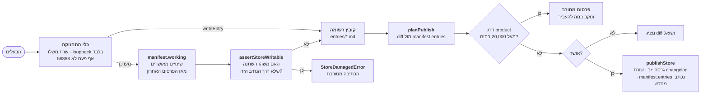

<div dir="rtl">

### 4.2 הוספה ושינוי

- **הטופס הוא התבנית.** טופס של <span dir="ltr">`prohibition`</span> נושא שדה
  <span dir="ltr">`why`</span> ולא יישמר בלעדיו. הסכימה, הבדיקה והטופס הם דבר
  אחד ולא שלושה שיכולים להיפרד.
- **כל כתיבה עוברת דרך <span dir="ltr">`writeEntry`</span>.** לכן "האם מאגר
  פגום מסרב את הכתיבה הזו" נענה בקריאת פונקציה אחת.
- **כתיבה מאושרת נרשמת ב-<span dir="ltr">`working`</span>, לא
  ב-<span dir="ltr">`entries`</span>.** בלי זה, העריכה הראשונה הייתה משאירה את
  המאגר חלוק על המניפסט שלו והעריכה **השנייה** הייתה מסורבת — מנגנון הבטיחות
  יורה על עבודתו של הבעלים עצמו, בכלי היחיד שכל תכליתו לשנות את המאגר.
- ולכן האינווריאנט אינו *"המניפסט תואם למה שנשלח"* אלא **"המניפסט תואם לכל
  שינוי שנעשה בנתיב המאושר"**.

### 4.3 פרסום וגרסה

למאגר **גרסה משלו, נפרדת מזו של המוצר**, לפי דרישת הבעלים: אפשר לפרסם עדכון מכלי
התחזוקה בלי לחתוך גרסת מוצר. לכן הוא נושא גרסה משלו ויומן שינויים משלו, ועדכון
מאגר הוא פריט שהתקנה יכולה לקחת בכוחות עצמה.

<span dir="ltr">`planPublish`</span> מציג **diff** ושואל לפני שהוא זז, כי פרסום
פונה החוצה וקשה להפוך אותו. <span dir="ltr">`publishStore`</span> מעלה את
הגרסה ב-1, כותב שורת changelog עם
<span dir="ltr">`added` / `changed` / `removed`</span> והערה בלשון הבעלים,
ומייצר מחדש את סכומי הביקורת.

**התקציב — 20,000 בתים לדרג <span dir="ltr">`product`</span>.** והמקום שבו הוא
נאכף הוא ההחלטה: **בפרסום בלבד, לעולם לא בהתקנה של משתמש.** הכול בדרג
<span dir="ltr">`product`</span> מוזרק אצל כל משתמש בלי יוצא מן הכלל, ולכן אי
אפשר לאכוף גודל במקום שבו משתמש היה פוגש בו — התקנה שנשברת כי *המאגר שלנו* גדל
היא תקלה שגרמנו לה והוא אינו יכול לתקן. היום הדרג עומד על 1,298 בתים, כ-6.5%
מהתקציב.

וזה אכיפה מכונתית ולא משמעת: *"אם הדבר היחיד שמונע דחיקה הוא משמעת בזמן
תחזוקה, זה שער אנושי על בעיה מכונתית — הצורה שכבר נכשלה בקורפוס, שם פריטים
נועצו אחד־אחד, כל אחד בנימוק סביר, עד ששנים־עשר מהם נדחקים ואחד מהם 482 פעם."*

### 4.4 מה קורה לסשן שכבר רץ

הקוד לכך **כתוב, נבדק, ואינו נקרא על ידי אף אחד — וזו נקודת הסיום המכוונת, לא
צעד שלא הושלם.** סוכן־משנה מתחיל מחדש ופשוט מקבל את המאגר החדש; רק סשן ארוך
מחזיק עותק ישן, וטקסט אי אפשר להוציא מחלון הקשר. לכן התיקון היה אמור להיות
**הפרש בלבד, מנוסח כהחלפה ולא כתוספת** — כי עדכון שנקרא כתוספת מייצר בדיוק את
הפגם שהפרויקט הזה מדד: הוראות שהוחלפו ממשיכות להתבצע כאילו הן עדיין בתוקף.

הסיבה שאין לו קורא היא שאף דלת לא מתאימה: כל הדלתות מוסרות את **הסט המלא**, אז
תיקון בדלת כזו היה מגיע לצד עותק שלם של המאגר שהוא בא לתקן — 8,472 בתים של
הפרש מוצמדים ל-23,772 בתים של מסירה מלאה. וה-hook היחיד שיורה באמצע סשן הוא
<span dir="ltr">`PreToolUse`</span>, שהוא בודק ולא דלת.

### 4.5 הכלל: מצטטים רשומה במזהה חשוף, בלי קידומת

**פריט קורפוס נושא קידומת קטגוריה** —
<span dir="ltr">`RULE-`, `TASK-`, `STD-`, `KNOWN-`</span>. **לרשומת מאגר אין
קידומת**, כי למאגר אין קטגוריות. המזהה הוא בדיוק שם הקובץ בלי הסיומת:

</div>

```
נכון:   `nothing-to-do-and-could-not-look-are-different-answers`
שגוי:   `STD-nothing-to-do-and-could-not-look-are-different-answers`
```

<div dir="rtl">

הכלל הזה נכתב כאן משום שהוא לא היה כתוב בשום מקום שקורא היה נתקל בו. ב-2026-09-16
מזהה־רפאים בדיוק בצורה השגויה הזאת התפשט ל**שבעה מקומות בחמישה קבצים** — רשומת
מאגר שצוטטה כאילו הייתה פריט קורפוס. הוא המשיך להתפשט: מונה השער
<span dir="ltr">`check:basis`</span> עלה מ-0 ל-1 כשנתיב אחר העתיק אותו מתוך
כותרת. כל שבעת האתרים תוקנו באותו יום כמעשה אחד, כי *מזהה מתוקן־למחצה גרוע
ממזהה שגוי־בעקביות.*

### 4.6 הפקודות

</div>

```
$ node src/cli/index.ts rules list        # כל הרשומות שבתוקף כאן: id · kind · tier · title
$ node src/cli/index.ts rules show <id>   # רשומה אחת במלואה, כולל request
$ node src/cli/index.ts rules verify      # מול החותם. --restore מחזיר מה שנשלח
```

<div dir="rtl">

שלושתן **קריאה בלבד**. שתיים מהן זמינות גם כ-MCP, כלומר לסוכן בלי מעטפת:
<span dir="ltr">`list_rules`</span> ו-<span dir="ltr">`verify_rules`</span>.
ל-MCP אין <span dir="ltr">`restore`</span> — החזרת בתים היא כתיבה, והסירוב נוקב
בפקודה שכן עושה זאת במקום להתעלם מהארגומנט.

משתנה הסביבה <span dir="ltr">`MYCONTEXT_RULES_DIR`</span> מחליף את **כל** המאגר
בתיקייה אחרת, וזה נחשף בתוך הגוש עצמו — *"הקבועים האלה לא נקראו מהחבילה
המותקנת"* — כי קורא שמחזיק קבועים ממקום אחר צריך שייאמר לו.

</div>

<div dir="rtl">

### 4.7 כלי התחזוקה — ארבעה מסכים, ואין לו כפתור הפעלה

הסעיפים שעד כאן הסבירו **מה** הכללים ו**מי** רשאי לשנות אותם. הסעיף הזה מראה את
הכלי שאדם פותח בפועל כדי לשנות אחד. הוא קיים, הוא מלא, והוא גדול יותר ממה שנשמע:
1,002 שורות בשישה קבצים.

</div>

<div dir="rtl">

| קובץ | שורות | מה הוא |
|---|---|---|
| <span dir="ltr">`src/ui/maintenance/server.ts`</span> | 206 | הסוקט, ושני הסירובים שלפניו |
| <span dir="ltr">`src/ui/maintenance/router.ts`</span> | 212 | פונקציה טהורה אחת מבקשה לתשובה — <span dir="ltr">`handle(ctx, method, url, body)`</span> |
| <span dir="ltr">`src/ui/maintenance/screens/list.ts`</span> | 112 | מסך הרשימה, ובו התקציב |
| <span dir="ltr">`src/ui/maintenance/screens/form.ts`</span> | 296 | הטופס, השמירה, והעברה בין דרגים |
| <span dir="ltr">`src/ui/maintenance/screens/page.ts`</span> | 91 | מעטפת HTML אחת, סרגל ניווט אחד, ומחלץ־תווים אחד |
| <span dir="ltr">`src/ui/maintenance/screens/publish.ts`</span> | 85 | מסך הפרסום: diff, ושאלה |

</div>

<div dir="rtl">

**ההפרדה בין השרת לנתב אינה סידור קבצים.** הנתב מכריע כל מה שבקשה *אומרת*
באופן סינכרוני ומתוך ערכים בלבד, ולכן טסט ב-Node ודפדפן אמיתי מריצים **נתיב קוד
אחד** ולא שניים שמסכימים היום.

#### איך הכלי הזה הורם כדי לצלם את המסכים שלהלן

**במדידה ב-2026-09-16: אין לו נקודת הפעלה כלשהי.** לא פקודת CLI, לא סקריפט
<span dir="ltr">`npm`</span>. <span dir="ltr">`startMaintenanceServer`</span>
מיוצא, ושלושת המקומות היחידים בעץ שקוראים לו הם
<span dir="ltr">`e2e/rules-maintenance.spec.ts`</span>,
<span dir="ltr">`test/rules/maintenance-absent.test.ts`</span> — וקובץ הזמני
שנכתב כדי לצלם את המסמך הזה. זה המצב, והוא לא תוקן כאן: נקודת הפעלה נשלחת היא
החלטה של הבעלים, לא תוצר לוואי של צילום מסך.

**מה שכן נעשה**, במלואו, כדי שאף תמונה כאן לא תהיה ציור של מסך שאיש לא פתח —
קובץ בן כמה שורות מחוץ למאגר, שקורא לפונקציה המיוצאת ומקבל שני שרתים: אחד על
המאגר האמיתי לצורך מסכי קריאה בלבד, ואחד על **עותק** בתיקייה זמנית לכל דבר
שכותב.

</div>

```ts
// לא בתוך המאגר — קובץ זמני, שנמחק אחרי הצילום.
const { startMaintenanceServer } = await import(
  new URL(`file:///${REPO}/src/ui/maintenance/server.ts`).href
);
const real = await startMaintenanceServer({ port: 58991 });                    // קריאה בלבד
const copy = await startMaintenanceServer({ port: 58992, storeDir: COPY_DIR }); // כתיבות
```

<div dir="rtl">

והיעדר ההפעלה הזה אינו סקרנות: הוא **הסיבה המכנית** לתקלה ג בסעיף 5 — ארבע
הרשומות האחרונות נוספו בעריכה ידנית של הקבצים ושל המניפסט, כי לא היה כלי שאפשר
היה לפתוח.

#### שני סירובים, לפני שנפתח סוקט

הכלי מסרב **לפני** ה-bind ולא בודק אחריו, ושתי הסיבות שונות. שרת שנקשר ואז
מתלונן כבר האזין על הממשק הלא נכון; ופורט שנדחה רק כשהוא תפוס היה נקשר ל-58888
בשמחה ביום שבו השרת של הבעלים כבוי, ועונה במקומו.

</div>

```
startMaintenanceServer({ host: '0.0.0.0' })
  → refusing to bind 0.0.0.0 — this tool serves 127.0.0.1 only. It has no authentication,
    which is safe only because it does not ship and is not reachable from the network.

startMaintenanceServer({ port: 58888 })
  → refusing port 58888 — that is the owner's UI server. This tool takes a free port
    chosen at start; pass no port, or any port other than 58888.
```

<div dir="rtl">

#### המסך הראשון: הרשימה

זה מה שנפתח על <span dir="ltr">`/`</span>. צולם מול המאגר האמיתי ב-2026-09-16:

</div>

<div dir="rtl">

[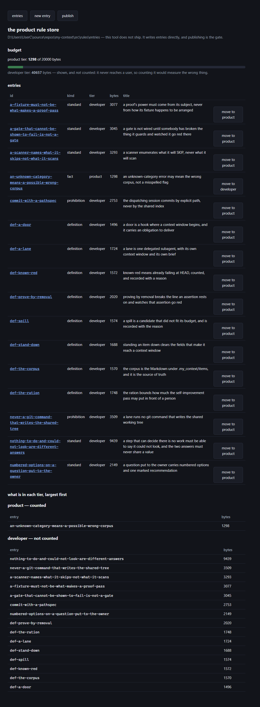](the-store.he/01-list.png)

</div>

<div dir="rtl">

ארבעה דברים בתמונה הזאת שווים אמירה:

1. **התקציב יושב על מסך הרשימה, לא על רשומה.** התקציב הוא עובדה על ה**סט**;
   מסך שמראה את גודלה של כל רשומה ואינו מראה סכום הוא מסך שבו אי אפשר לענות
   "האם חרגנו".
2. **דרג <span dir="ltr">`product`</span> נמדד ודרג <span dir="ltr">`developer`</span>
   מוצג ואינו נספר**, והשניים מצוירים אחרת כדי שזה יהיה **נראה** ולא רק נכון.
   1,298 מול 20,000 בסרגל; 40,657 בשורה שמתחתיו, ללא סרגל.
3. **כל שורה נושאת כפתור "<span dir="ltr">move to</span>" אל הדרג השני.** זהו
   מנגנון ההסרה מסעיף 3.3 כפי שהוא נראה: הורדה מדרג אינה מחיקה, והיא הפיכה.
4. **קובץ שלא נטען מקבל כותרת משלו** —
   <span dir="ltr">`did not load`</span> — ונקרא בשמו עם סיבת הסירוב. בצילום
   הזה אין כזה, כי המאגר תקין; הכותרת מופיעה רק כשיש.

#### כתיבה עונה בהפניה, לעולם לא בדף

שמירה מוצלחת אינה מציירת דף — היא מחזירה
<span dir="ltr">`303`</span> אל המסך שעליו פעלתם, ושם מחכה משפט התוצאה. לכן
רענון אחרי שמירה אינו שומר שוב, והמסך מראה את המצב החדש בלי שביקשו ממנו.
**סירוב** הוא המקרה היחיד שעונה בדף, כי הדף נושא את המילים שצריך ואת הערכים
שהוקלדו.

</div>

<div dir="rtl">

[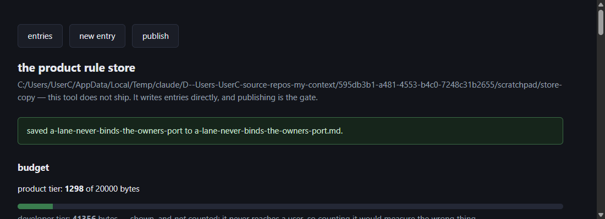](the-store.he/05-saved-notice.png)

</div>

<div dir="rtl">

*שימו לב לנתיב בראש המסך הזה: זהו העותק בתיקייה הזמנית, לא
<span dir="ltr">`src/rules/entries/`</span>. כל תמונה במסמך הזה שמראה כתיבה
צולמה על עותק, וכל תמונה שמראה קריאה — על המאגר האמיתי. הרשימה ומסך הפרסום
מדפיסים את התיקייה שהם עובדים עליה, וזה בדיוק בשביל ההבחנה הזאת.*

</div>

<div dir="rtl">

### 4.8 התבניות — אחת לכל סוג, ממולאת

סעיף 3.1 אמר ש**התבנית היא הסכימה**, ונתן את הטבלה. מה שהוא לא נתן הוא את
התבנית עצמה. הסעיף הזה נותן: לכל אחד מחמשת הסוגים — שדות החובה, מה הטופס שואל
בכל שדה, רשומה אמיתית מהמאגר ממולאת, ומה הטופס **מסרב**.

#### המסגרת, שזהה לכל הסוגים

לפני השדות של הסוג יש ארבעה שדות שכל רשומה נושאת, וארבעה שהיא רשאית לשאת. הם
אינם חלק של אף תבנית, והמפענח נוקב בהם בשתי רשימות משלו.

</div>

<div dir="rtl">

| שדה | חובה? | מה הטופס שואל |
|---|---|---|
| `id` | חובה | <span dir="ltr">*lowercase words joined by hyphens — this is how the entry is cited*</span> |
| `kind` | חובה | נבחר בקישור, לא בשמירה — בחירת סוג משנה אילו שדות קיימים, ולכן הטופס נטען מחדש |
| `tier` | חובה | <span dir="ltr">*product reaches every user; developer applies only inside my_context itself*</span> |
| `title` | חובה | <span dir="ltr">*one line, in plain words*</span> |
| `request` | רשות | מילות הבעלים, מילה במילה — **נרשם, לעולם לא מוזרק** (סעיף 3.7) |
| `movedFrom` | רשות | פריט הקורפוס שהרשומה הוצאה ממנו — מוצג לדרג <span dir="ltr">`developer`</span> בלבד |
| `movedOn` | רשות | תאריך אותה העברה. **לבדו הוא מסורב** |
| `body` | רשות | הפרוזה שמתחת ל-frontmatter |

</div>

<div dir="rtl">

**<span dir="ltr">`id`</span> הוא סירוב, לא ניקוי.** שם שנכתב לא כהלכה אינו
מתוקן בשקט, כי רשומה שנשמרה תחת שם שאיש לא בחר היא רשומה שאיש לא ימצא. זה גם
מה שמונע מה-id לנקוב בנתיב: הכלי כותב
<span dir="ltr">`<id>.md`</span> לתיקיית המאגר ולשום מקום אחר.

**כל שדה שהטופס מצייר, הוא מצייר כי הוא חייב.** השמירה מרכיבה רשומה **שלמה**
ממה שנשלח, ולכן שדה שהטופס אינו מצייר הוא שדה שהשמירה הבאה **מוחקת** — בשקט,
תוך כדי עריכה על נושא אחר. זה הנימוק שמצייר את
<span dir="ltr">`movedFrom`</span> ואת <span dir="ltr">`request`</span> גם
כשהם ריקים.

**התבנית היא תקרה, לא רק רצפה.** שדה שהסוג לא נוקב בשמו נדחה גם אם הוא תמים —
כי <span dir="ltr">`fact`</span> שנושא <span dir="ltr">`why`</span> הוא או איסור
שהוגש כעובדה או שדה שאיש אינו קורא, והמפענח יודע לומר איזה מהשניים:

</div>

```
why: because…        על `fact`
  → `why` is not a field a `fact` has. `why` belongs to a `prohibition` — this entry
    may be filed under the wrong kind.

status: active       על כל רשומה
  → `status` is not a field a `fact` has. The store has no lifecycle: no status, no
    supersedes, no always, no valid_until. These are constants, not items with a life.
```

<div dir="rtl">

#### הטופס **הוא** התבנית, ואין בו רשימת שדות

זה נשמע כמו סגנון והוא מנגנון. אין בקובץ הטופס שום רשימת שדות: הוא הולך על
<span dir="ltr">`partsOf(kind)`</span> ומצייר פקד אחד לכל חלק, מתויג במילות
ה-<span dir="ltr">`asks`</span> של אותו חלק עצמו. חלק שיתווסף לטבלה מחר יופיע
בטופס, ייכתב לדיסק וייאכף בשמירה **בלי עריכה** של הטופס.

וכך נראה טופס ריק של <span dir="ltr">`prohibition`</span>. כל תווית וכל שורת
הסבר בתמונה הזאת הגיעה מ-<span dir="ltr">`TEMPLATE`</span>, ולא הוקלדה שם:

</div>

<div dir="rtl">

[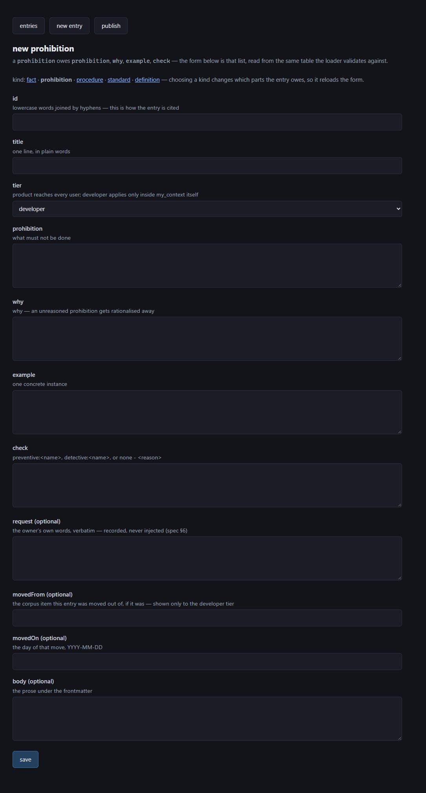](the-store.he/02-new-prohibition.png)

</div>

<div dir="rtl">

והנה אותו מנגנון על רשומה קיימת — <span dir="ltr">`standard`</span> אמיתי
מהמאגר, נטען לעריכה. ה-<span dir="ltr">`id`</span> נעול, כי שינוי סוג של רשומה
קיימת היה משליך בשקט את החלקים שהסוג הישן דרש:

</div>

<div dir="rtl">

[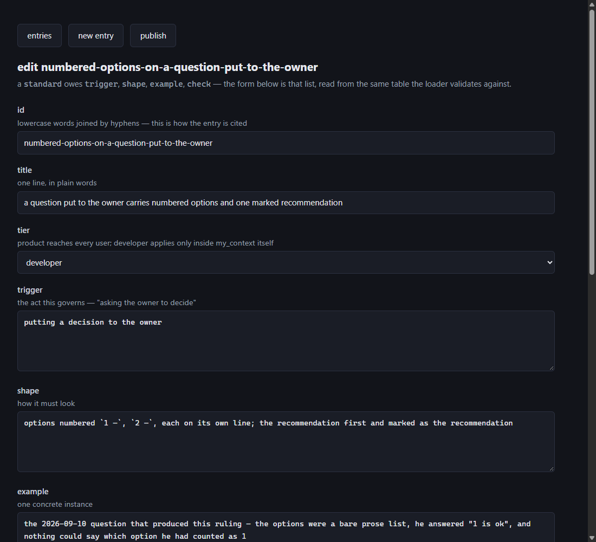](the-store.he/09-edit-standard.png)

</div>

<div dir="rtl">

#### הסירוב הוא הסירוב של הסכימה, תו בתו

הטופס אינו מנסח הודעת שגיאה משלו. הוא מחזיר את המשפט של
<span dir="ltr">`parseEntry`</span> כפי שהוא, והטסט
<span dir="ltr">`test/rules/maintenance-form.test.ts`</span> משווה את שתי
המחרוזות תו בתו. הנימוק: משפט שני הוא **מאמת שני עם פנים נחמדות**, וביום
שהשניים חולקים הטופס אומר דבר אחד והמאגר עושה אחר — ורק אחד מהם הוא מה שבאמת
נטען.

כך זה נראה. איסור בלי <span dir="ltr">`why`</span>, ושום דבר לא נכתב לדיסק:

</div>

<div dir="rtl">

[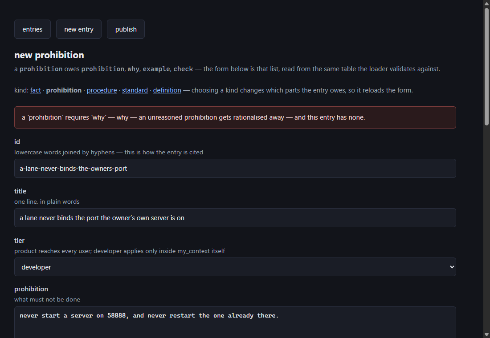](the-store.he/03-refusal-why.png)

</div>

<div dir="rtl">

#### שני השדות שכל סוג חייב, וכאן רואים למה

סעיף 3.2 נימק מדוע <span dir="ltr">`example`</span> ו-<span dir="ltr">`check`</span>
הם חובה. בטופס הנימוק הופך למכני: אלה שני החלקים שמצוירים בכל אחד מחמשת
הטפסים, כי הם מגיעים מ-<span dir="ltr">`ALWAYS`</span> ולא מהתבנית של הסוג
כלשהו.

וזה ההבדל בין כלל לדעה, בשורה אחת כל אחד:

- <span dir="ltr">**`example`**</span> הוא מה שמונע מהרשומה להיות ניתנת
  לוויכוח. היא מפסיקה לטעון מה נכון ומתחילה לנקוב במה שקרה.
- <span dir="ltr">**`check`**</span> הוא מה שהופך אותה לנמדדת. רשומה
  ש**יכלה** להיבדק ואינה נבדקת בחרה בצורה החלשה, ושדה חובה הופך את הבחירה
  הזאת לגלויה.

ולכן <span dir="ltr">`none`</span> חשוף נדחה. הוא תשובה חוקית עם נימוק, ואי־תשובה
בלעדיו:

</div>

<div dir="rtl">

[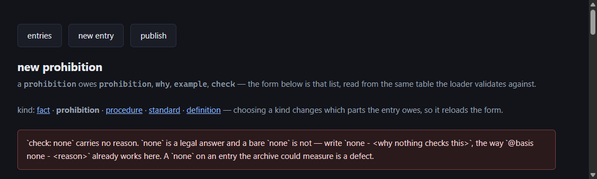](the-store.he/04-refusal-check-none.png)

</div>

```
check: maybe
  → `check` must be `preventive:<name>`, `detective:<name>`, or `none - <reason>`
    (got "maybe"). preventive refuses before the fact and is available only where we own
    the write path; detective reports after the fact from the archive, and is the only
    kind available for a rule about the assistant's own output.
```

<div dir="rtl">

#### עובדה — <span dir="ltr">`fact`</span>

**חובה:** <span dir="ltr">`truth`, `breaks`</span>, ועוד
<span dir="ltr">`example`, `check`</span>.

**מה הטופס שואל:** <span dir="ltr">*what is true about how the tool behaves*</span> ·
<span dir="ltr">*what breaks if you assume otherwise*</span>.

ממולא — וזו במקרה **הרשומה היחידה במאגר שדרגה <span dir="ltr">`product`</span>**,
כלומר היחידה שמגיעה למי שהתקין:

</div>

```yaml
id: an-unknown-category-means-a-possible-wrong-corpus
kind: fact
tier: product
title: an unknown-category error may mean the wrong corpus, not a misspelled flag
truth: categories are per-corpus configuration, so a name valid in one corpus is invalid in
  another. The refusal names the accepted list and never names the corpus it consulted, so
  one message carries two meanings.
breaks: the flag gets respelled until something is accepted, against a corpus that was never
  the intended one — and the write lands somewhere nobody is looking.
example: check which `.my_context` answered before changing the spelling of the flag.
check: none - the refusal would have to name the corpus it consulted for this to be checkable,
  and it does not. That is a fix to the message rather than a check on the reader.
movedFrom: RULE-read-an-unknown-category-error-as-a-possible-wrong-corpus
movedOn: 2026-09-11
```

```
מה הטופס מסרב:
  a `fact` requires `truth` — what is true about how the tool behaves — and this entry has none.
```

<div dir="rtl">

#### איסור — <span dir="ltr">`prohibition`</span>

**חובה:** <span dir="ltr">`prohibition`, `why`</span>, ועוד
<span dir="ltr">`example`, `check`</span>.

**מה הטופס שואל:** <span dir="ltr">*what must not be done*</span> ·
<span dir="ltr">*why — an unreasoned prohibition gets rationalised away*</span>.

</div>

```yaml
id: commit-with-a-pathspec
kind: prohibition
tier: developer
title: the dispatching session commits by explicit path, never by the shared index
prohibition: with a lane running, never `git commit` bare and never stage the whole index —
  use `git commit -- <paths>`, or read `git diff --cached` first and know what is in it.
why: the index is shared with every lane on the machine. A bare commit takes whatever is
  staged, including work a lane staged for a different subject, and the commit message then
  describes a change it does not contain.
example: a bare `git commit` on 2026-09-09 swept another lane's staged work into a commit
  about a table border.
check: none - git offers no hook that can tell a deliberate pathspec from a lucky one, and
  the archive sees the command only when it was run in a tool call it recorded.
movedFrom: LESSON-stage-what-an-agent-reported-touching-not-what-you-told-it
movedOn: 2026-09-11
```

```
מה הטופס מסרב:
  a `prohibition` requires `why` — why — an unreasoned prohibition gets rationalised away —
  and this entry has none.
```

<div dir="rtl">

#### תקן — <span dir="ltr">`standard`</span>

**חובה:** <span dir="ltr">`trigger`, `shape`</span>, ועוד
<span dir="ltr">`example`, `check`</span>.

**מה הטופס שואל:** <span dir="ltr">*the act this governs — "asking the owner to decide"*</span> ·
<span dir="ltr">*how it must look*</span>.

זו הרשומה הראשונה שנכתבה למאגר, ונבחרה בכוונה: היא מפעילה את כל הצורה מקצה
לקצה — תבנית, <span dir="ltr">`trigger`</span>, דוגמה, ובדיקה **מגלה** אמיתית —
על משהו קטן. ויש בה <span dir="ltr">`request`</span>, כלומר מילות הבעלים עצמו:

</div>

```yaml
id: numbered-options-on-a-question-put-to-the-owner
kind: standard
tier: developer
title: a question put to the owner carries numbered options and one marked recommendation
trigger: putting a decision to the owner
shape: options numbered `1 —`, `2 —`, each on its own line; the recommendation first and
  marked as the recommendation
example: the 2026-09-10 question that produced this ruling — the options were a bare prose
  list, he answered "1 is ok", and nothing could say which option he had counted as 1
check: "detective:scripts/check-ask-numbering.ts — every question put to the owner in the
  archive carries options numbered `1 —` and exactly one marked recommendation, and it is
  the first"
request: there should be numbers on the options so i can answer by number, and say which one
  you recommend
```

```
מה הטופס מסרב:
  a `standard` requires `trigger` — the act this governs — "asking the owner to decide" —
  and this entry has none.
```

<div dir="rtl">

#### הגדרה — <span dir="ltr">`definition`</span>

**חובה:** <span dir="ltr">`term`, `means`, `confusedWith`</span>, ועוד
<span dir="ltr">`example`, `check`</span>.

**מה הטופס שואל:** <span dir="ltr">*the word*</span> ·
<span dir="ltr">*what it means here*</span> ·
<span dir="ltr">*what it is confused with*</span>.

<span dir="ltr">`confusedWith`</span> הוא שדה חובה ולא נדיבות: הגדרה שאינה
נוקבת במה שמבלבלים אותה איתו אינה עושה את העבודה שבגללה מישהו פתח אותה. שמונה
מתוך שש־עשרה הרשומות הן הגדרות, וזה הסוג הנפוץ ביותר במאגר.

</div>

```yaml
id: def-known-red
kind: definition
tier: developer
title: known-red means already failing at HEAD, counted, and recorded with a reason
term: known-red
means: "a test or gate that was ALREADY failing before your change — verified at HEAD,
  counted, and recorded with the reason it is red. The point of the label is the count: if
  the baseline is eleven, any twelfth failure is yours."
confusedWith: a flaky test, and a failure you may ignore. A flaky test fails sometimes and
  is a defect of the test; a known-red fails deterministically and is a defect somebody has
  named. And known-red is a MEASUREMENT, not a permission — the label without a reason
  attached is what lets a lane work around a gate instead of reading it.
example: archive/47's lane recorded four separate lanes working around a red gate because it
  was labelled "known-red" with no reason attached.
check: none - nothing can tell a pre-existing failure from a new one except running the suite
  at HEAD, which is a thing a lane does rather than a thing a gate observes. […]
```

```
מה הטופס מסרב:
  a `definition` requires `confusedWith` — what it is confused with — and this entry has none.
```

<div dir="rtl">

#### נוהל — <span dir="ltr">`procedure`</span>

**חובה:** <span dir="ltr">`steps`, `proof`</span>, ועוד
<span dir="ltr">`example`, `check`</span>.

**מה הטופס שואל:** <span dir="ltr">*the steps, in order*</span> ·
<span dir="ltr">*how you know it worked*</span>.

**ולסוג הזה אין דוגמה מהמאגר, כי אין בו אף נוהל** — אפס, כפי שסעיף 2 מודד. אז
במקום להמציא רשומה ולהציג אותה כאילו נלקחה משם, הנה **הטופס עצמו**, שהוא כאן
התבנית היחידה שקיימת בפועל:

</div>

<div dir="rtl">

[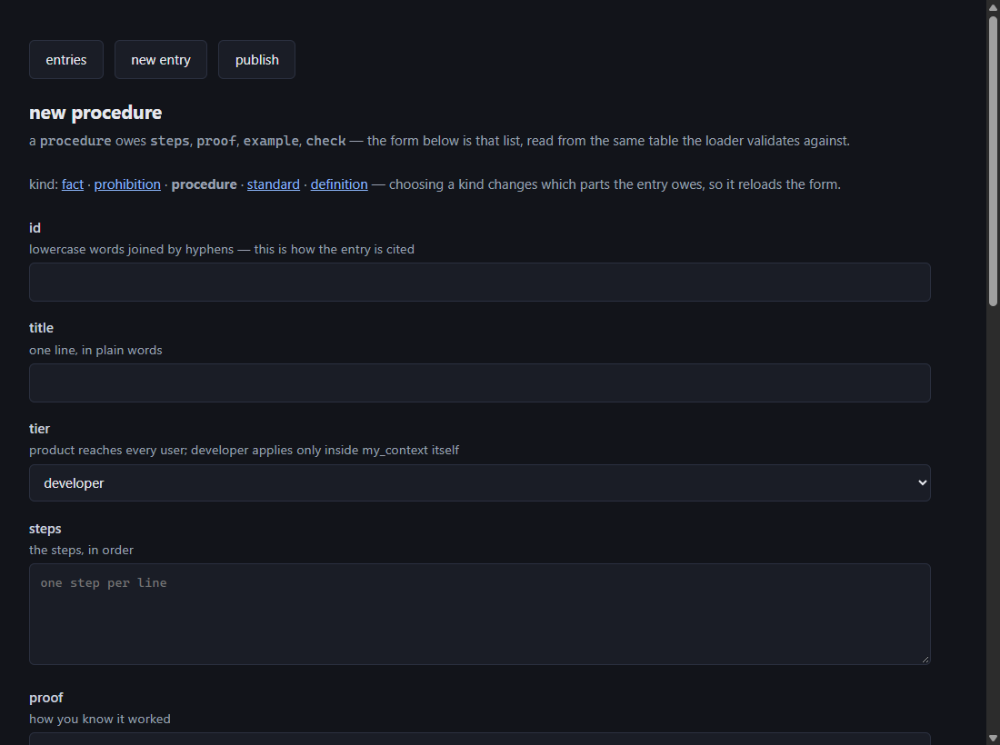](the-store.he/10-new-procedure.png)

</div>

<div dir="rtl">

<span dir="ltr">`steps`</span> הוא השדה היחיד בכל חמש התבניות שצורתו **רשימה**
ולא טקסט, ולכן הוא הפקד היחיד שנושא רמז משלו —
<span dir="ltr">*one step per line*</span>. וזה נאכף:

</div>

```yaml
steps: do it          # שורה אחת, ולא רשימה
```

```
  → `steps` on a `procedure` is a list — the steps, in order — and this entry writes it as
    a single value. Written as one sentence the ordering that makes it a procedure is gone.
```

<div dir="rtl">

וכשהטופס שולח כמה שורות, <span dir="ltr">`composeEntry`</span> כותב אותן כרשימת
YAML אמיתית — נמדד ב-2026-09-16 על עותק:

</div>

```yaml
steps:
  - the first step
  - the second step
  - the third step
proof: p
example: e
check: none - r
```

<div dir="rtl">

### 4.9 מפיתוח לייצור — הדרך של רשומה אחת, מקצה לקצה

סעיפים 4.2 ו-4.3 נתנו את המנגנון. הסעיף הזה הולך את הדרך כרצף אחד, כפי שאדם
אחד עובר אותה, ומסיים במלכודת שמחכה בסופה.

</div>

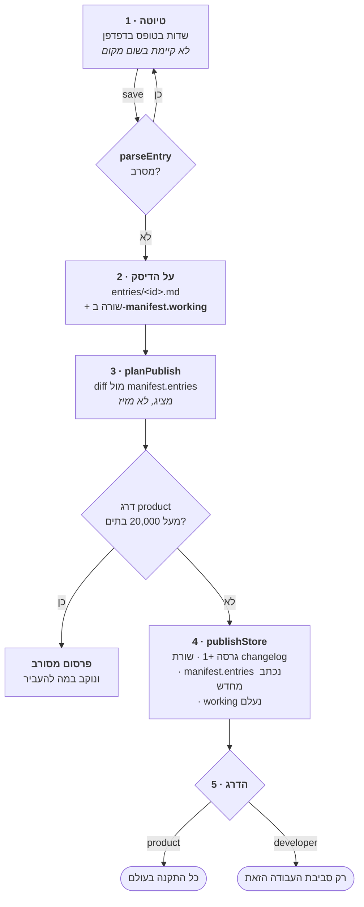

<div dir="rtl">

#### שלב 1 — הטיוטה, שאינה קיימת בשום מקום

אין ישות "טיוטה" במאגר. מה שיש בטופס יושב בדפדפן בלבד עד שנלחץ
<span dir="ltr">`save`</span>, ואם השמירה מסורבת **לא נכתב דבר** — לא קובץ חלקי,
לא רשומה שהטופס דחה. זה נאמר במפורש כי המימוש המתבקש — לכתוב, לאמת, למחוק —
משאיר חלון שבו המאגר מחזיק רשומה שהטופס סירב.

#### שלב 2 — <span dir="ltr">`working`</span>, והאינווריאנט שהוא מגן עליו

<span dir="ltr">`manifest.json`</span> נושא **שתי** רשימות של סכומי ביקורת,
והן עונות על שתי שאלות שונות:

</div>

<div dir="rtl">

| הרשימה | מה היא אומרת | מי כותב אותה |
|---|---|---|
| <span dir="ltr">`entries`</span> | המצב ש**פורסם** לאחרונה. זה מה ש-<span dir="ltr">`planPublish`</span> משווה מולו, וזה מה ש-<span dir="ltr">`rules verify`</span> עונה עליו | <span dir="ltr">`publishStore`</span> בלבד |
| <span dir="ltr">`working`</span> | כל שינוי שנעשה **בנתיב המאושר** מאז הפרסום האחרון | כל <span dir="ltr">`writeEntry`</span> |

</div>

<div dir="rtl">

וזאת המדידה, שנעשתה ב-2026-09-16 על עותק: שמירה אחת דרך הכלי על
<span dir="ltr">`def-spill`</span>, ואז פרסום.

</div>

```
אחרי השמירה
  manifest.working        [ { file: "def-spill.md", checksum: "fe9c0c18…" } ]
  manifest.entries[…]     checksum: "eb68212d…"      ← עדיין הסכום שפורסם
  planPublish             changed def-spill          ← ולכן יש מה להראות

אחרי הפרסום
  manifest.working        לא קיים — השדה נמחק כולו
  manifest.entries[…]     checksum: "fe9c0c18…"      ← עכשיו תואם לדיסק
  store.version           5 → 6
```

<div dir="rtl">

**זה מסביר למה <span dir="ltr">`working`</span> קיים בכלל.** בלעדיו, העריכה
הראשונה הייתה משאירה את המאגר חלוק על המניפסט שלו, ו-<span dir="ltr">`assertStoreWritable`</span>
היה מסרב את העריכה ה**שנייה** — מנגנון הבטיחות יורה על עבודתו של הבעלים עצמו,
בכלי היחיד שכל תכליתו לשנות את המאגר. ולכן האינווריאנט הוא לא *"המניפסט תואם
למה שנשלח"* אלא **"המניפסט תואם לכל שינוי שנעשה בנתיב המאושר"**.

ובכיוון השני: קובץ ששונה על ידי משהו אחר אינו תואם **לא** ל-`entries`
ו**לא** ל-`working`, ולכן הכתיבה הבאה מסורבת ב-<span dir="ltr">`StoreDamagedError`</span>.
זה גם המקום היחיד שבו הסירוב מגיע **למסך** ולא ל-stderr: לשרת יש
<span dir="ltr">`try/catch`</span> שהופך זריקה לדף, אחרי שנמצא בדפדפן שבלעדיו
הבקשה פשוט לא נענית והלשונית תלויה.

#### שלב 3 — <span dir="ltr">`planPublish`</span>: מראה, ולא מזיז

<span dir="ltr">`planPublish`</span> אינו כותב דבר. הוא משווה כל קובץ
<span dir="ltr">`.md`</span> בתיקייה מול שורת ה-<span dir="ltr">`entries`</span>
שלו ומחזיר שלושה סוגי שינוי — <span dir="ltr">`added`, `changed`, `removed`</span> —
ולצידם דוח התקציב. זה מסך הפרסום כשיש מה לפרסם, על עותק שאליו נוסף איסור אחד:

</div>

<div dir="rtl">

[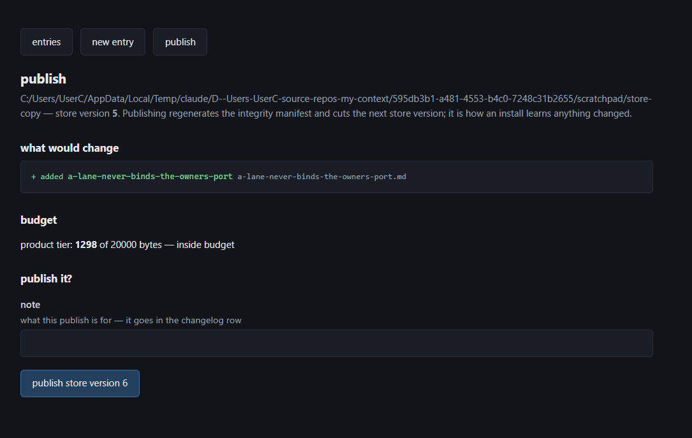](the-store.he/06-publish-diff.png)

</div>

<div dir="rtl">

שני פרטים בתמונה הזאת נבחרו במפורש, וכל אחד מהם הוא סירוב:

- **התקציב נאכף כאן, ולעולם לא בהתקנה של משתמש.** כשדרג
  <span dir="ltr">`product`</span> חורג, כפתור האישור **נעלם** — הוא אינו מושבת.
  פקד מושבת הוא פקד שמישהו מחזיר לחיים בקונסולה; פקד שאיננו אין מה להחזיר,
  ובמקומו יושב המשפט שנוקב במה להעביר לדרג <span dir="ltr">`developer`</span>.
- **שדה ה-<span dir="ltr">`note`</span> אינו קישוט.** מה שנכתב בו הולך לשורת
  ה-changelog, והוא הדבר היחיד בשורה הזאת שנכתב במילים של אדם.

#### שלב 4 — <span dir="ltr">`publishStore`</span>: מה בדיוק זז

</div>

<div dir="rtl">

| מה | מ | אל |
|---|---|---|
| <span dir="ltr">`store.version`</span> | 5 | 6 — תמיד <span dir="ltr">`+1`</span>, ואינו קשור לגרסת המוצר |
| <span dir="ltr">`store.publishedAt`</span> | חותמת קודמת | <span dir="ltr">ISO</span> של הרגע הזה |
| <span dir="ltr">`store.changelog`</span> | 5 שורות | 6 — השורה החדשה **בראש**, עם <span dir="ltr">`added` / `changed` / `removed`</span> וה-note |
| <span dir="ltr">`entries[]`</span> | סכומי הפרסום הקודם | נכתב מחדש מכל מה שעל הדיסק |
| <span dir="ltr">`working`</span> | שורה לכל שמירה | נמחק |

</div>

<div dir="rtl">

וכך נראית שורת ה-changelog שנוצרה במדידה הזאת:

</div>

```json
{
  "version": 6,
  "at": "2026-09-16T15:29:21.139Z",
  "note": "a lane never binds the port the owner's own server is on — written on a copy of the store, for the documentation of this screen.",
  "added": ["a-lane-never-binds-the-owners-port"],
  "changed": [],
  "removed": []
}
```

<div dir="rtl">

[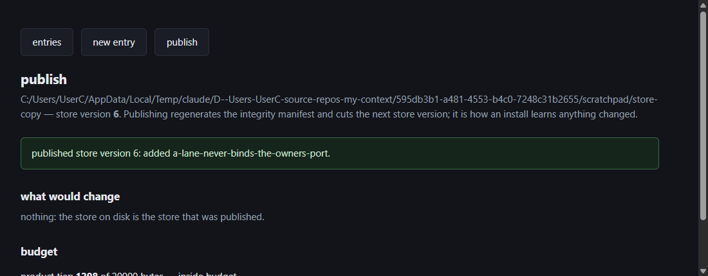](the-store.he/07-published.png)

</div>

<div dir="rtl">

**ממה נחתמים הסכומים.** מכל תוכן הקובץ — frontmatter וגוף — אחרי נרמול סופי
שורה (סעיף 3.6). **גם קובץ שבור מדי מכדי להיפענח מקבל שורה**, ובכוונה: השמטתו
הייתה עושה את המניפסט תואם למאגר שהוא אינו יכול לתאר, והרשומה הייתה נקראת
<span dir="ltr">`unexpected`</span> במקום מה שהיא — רשומה שבורה.

**ושימו לב לכתיבה אחת שאינה מגודרת.** כל כתיבה ל*רשומה* עוברת דרך
<span dir="ltr">`writeEntry`</span> ונחסמת במאגר פגום, אבל
<span dir="ltr">`writeManifest`</span> — הכתיבה שהפרסום עושה — אינה מגודרת כך.
זה מכוון: יצירת המניפסט מחדש היא בדיוק **הדרך שבה מאגר פגום מתוקן**, בידי
הבעלים אחרי שהסתכל על ה-diff, וגידור שלה היה הופך נזק למבוי סתום.

#### שלב 5 — הדרג מכריע מי אי פעם יראה את זה

זה השלב שמפריד בין "פורסם" לבין "הגיע". גרסה חדשה של המאגר נשלחת בחבילה **כולה**,
ואז, בכל דלת, <span dir="ltr">`deliverAtDoor`</span> מסנן לפי הדרג:

- **<span dir="ltr">`product`</span>** — נמסר בכל סביבת עבודה בעולם, ולכן הוא
  הדבר היחיד שהתקציב שומר עליו. היום: רשומה אחת, 1,298 בתים.
- **<span dir="ltr">`developer`</span>** — נמסר רק כשסביבת העבודה היא my_context
  עצמה, לפי השוואת **נתיבים** (סעיף 3.3). היום: 15 רשומות, 40,657 בתים.

ולכן **הורדת דרג היא מנגנון ההסרה**: כפתור אחד במסך הרשימה מוציא רשומה מהסט
הנשלח בלי למחוק אותה ובלי לאבד את ההיסטוריה שלה, והוא הפיך. ההעברה עורכת שורה
אחת בקובץ במקום להרכיב אותו מחדש מהחלקים שנפענחו — הרכבה מחדש הייתה מעצבת מחדש
פרוזה שהבעלים כתב, והורדה־ואז־העלאה לא הייתה מחזירה את הקובץ לבתים שממנם יצא.

#### והמלכודת: היום <span dir="ltr">`planPublish`</span> מדווח על אפס שינויים

מי שיפתח את מסך הפרסום מול המאגר האמיתי כרגע יראה את זה:

</div>

<div dir="rtl">

[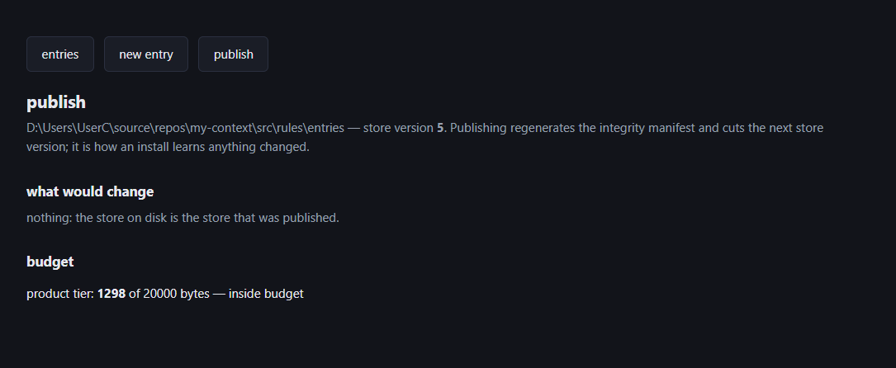](the-store.he/08-publish-zero-changes.png)

</div>

<div dir="rtl">

**זה לא תקלה שנגרמה עכשיו, ואי אפשר לתקן אותה בפרסום.** הסיבה בסעיף 5, תקלה ג:
ארבע הרשומות האחרונות נוספו בעריכה ידנית של הקבצים ושל
<span dir="ltr">`manifest.entries`</span>, כי לכלי אין נקודת הפעלה (סעיף 4.7).
העריכה הידנית עדכנה גם את הסכומים — ולכן הם **נכונים**, אין הפרש, ואין מה
לפרסם.

שימו לב ששני המסכים בסעיף הזה נושאים **אותו משפט בדיוק** —
<span dir="ltr">*"nothing: the store on disk is the store that was published"*</span> —
ומשמעותם הפוכה. בתמונה של העותק הוא נכון: זה עתה פורסם הכול. בתמונה של המאגר
האמיתי הוא נכון על הסכומים ושקרי על ההיסטוריה: חמש רשומות מעולם לא הופיעו
בשום רשימת <span dir="ltr">`added`</span>.

ואפילו מי שינסה בכל זאת ייתקל בסירוב מנומק במקום בגרסה ריקה:

</div>

```
publishStore(dir, { confirm: true })
  → there is nothing to publish: the store on disk is the store that was published.
    Cutting a version for no change would have every install download a store it already
    has, and would put a row in the changelog naming nothing.
```

<div dir="rtl">

**ולכן מי שהולך בדרך הזאת לא שבר כלום.** הפער ביומן השינויים ייסגר בהחלטה של
הבעלים על איך לתקן היסטוריה, לא בלחיצה על "פרסם" — והצעד שמונע את ההישנות הוא
נקודת ההפעלה שאין לכלי.

</div>

---

<div dir="rtl">

## 5. מה ידוע שלא בסדר

מסמך ישר אומר את זה במקום להציג תמונה נקייה. כל אחד מאלה תועד ונרשם.

### א. החותם אומר "תקין" על רשומה שהמפענח של המאגר עצמו מסרב לקרוא

`KNOWN-rules-verify-answers-intact-for-an-entry-the-store-s-own`

שוחזר ב-2026-09-16 על **עותק** של המאגר. לוקחים רשומה תקינה, שוברים את גדר
ה-frontmatter שלה, וחותמים מחדש את הסכום במניפסט. אז שני חצאי המוצר נשאלים על
אותו קובץ:

</div>

```
parseEntry(…)      → מסרב: "no frontmatter: an entry is Markdown opening with a `---` fenced block"
verifyManifest(…)  → ok: TRUE
```

<div dir="rtl">

**סכום ביקורת אומר לא־שונה. הוא לעולם לא אומר תקף.** אוצר המילים של הפסק מסגיר
את זה: הערכים הם <span dir="ltr">`altered`, `missing`, `unexpected`</span>, ואין
ערך ל"נוכח, לא־שונה, ובלתי־קריא" — כי המצב הזה מעולם לא נשקל. רשומה שאינה
נפענחת היא רשומה שאינה נמסרת, והקורא מקבל הודעה שהמאגר תקין בזמן שכלל אינו
מושל בכלום.

התיקון ידוע: **לפענח כל רשומה כחלק מהאימות**, ולהוסיף ערך רביעי —
<span dir="ltr">`unreadable`</span>. המפענח כבר קיים וכבר מחזיר סירוב שמיש. אין
מה לכתוב כדי לדעת את התשובה, רק כדי **לשאול** אותה.

### ב. הרצת חבילת הטסטים יכולה להשאיר את המאגר הנשלח ערוך, חתום מחדש, ומדווח כתקין

`KNOWN-running-the-test-suite-can-leave-the-shipped-rule-store`

נמצא פעמיים ב-2026-09-16, באופן בלתי־תלוי. הטסט
<span dir="ltr">`test/cli/rules.test.ts`</span> מייבא את **תיקיית המאגר
האמיתית** ומוסיף שורה לתוך רשומה חיה, כדי להוכיח שחבלה מזוהה — וזו מטרה
לגיטימית. אחר כך הוא משחזר. **כשהוא רץ לבדו הוא נקי; תחת החבילה המקבילית
השחזור מפסיד במרוץ.** התוצאה:

</div>

```
M src/rules/entries/manifest.json
M src/rules/entries/numbered-options-on-a-question-put-to-the-owner.md

  …ובסוף הרשומה עצמה:  planted by test/cli/rules.test.ts
```

<div dir="rtl">

**והחלק הגרוע הוא שהחותם לא תופס את זה, והוא אומר אמת על הדבר הלא־נכון.** הטסט
חותם מחדש את שני החצאים, אז הרשומה והמניפסט מסכימים זה עם זה בזמן ששניהם חלוקים
על <span dir="ltr">`HEAD`</span>. **סכום ביקורת מוכיח עקביות פנימית; הוא אינו
יכול להוכיח מקור.** התיקון: לחבל בעותק, לעולם לא במקור — ושער שמשווה את המאגר
להיסטוריה שלו, כי זו התכונה שלחותם אין באופן מבני.

### ג. יומן השינויים כבר אינו מתאר את המאגר

`TASK-replaying-the-store-changelog-from-empty-yields-eleven` (`store/10`)

הרצת יומן השינויים מאפס, שורה אחר שורה, מייצרת **11 רשומות מול 16 על הדיסק**.
חמש רשומות אינן מופיעות באף רשימת <span dir="ltr">`added`</span> אי פעם:

</div>

```
numbered-options-on-a-question-put-to-the-owner      (מופיעה תחת changed בגרסה 1, אף פעם לא added)
a-fixture-must-not-be-what-makes-a-proof-pass        \
a-gate-that-cannot-be-shown-to-fail-is-not-a-gate     >  נוספו 2026-09-13
a-scanner-names-what-it-skips-not-what-it-scans      /
nothing-to-do-and-could-not-look-are-different-answers  נוספה 2026-09-15
```

<div dir="rtl">

הסיבה מכנית וראויה לציון: לכלי התחזוקה **אין נקודת הפעלה נשלחת** — אין פקודת
CLI ואין סקריפט npm שמרים אותו; הוא מופעל היום רק מתוך טסטים. לכן ארבע הרשומות
האחרונות נוספו בעריכה ישירה של הקבצים ושל
<span dir="ltr">`manifest.entries`</span>, לא דרך
<span dir="ltr">`publishStore`</span> — והגרסה לא עלתה ושורת changelog לא
נכתבה.

**וזה בלתי־הפיך בעצמו:** הסכומים במניפסט *נכונים*, אז
<span dir="ltr">`planPublish`</span> מדווח היום על **אפס שינויים**. אין פרסום
עתידי שיוכל להשלים את החסר. שני חצאי <span dir="ltr">`manifest.json`</span>
עונים על שאלות שונות, ורק אחד מהם עדכני: <span dir="ltr">`entries`</span> (16,
חתום, נכון) ו-<span dir="ltr">`store.changelog`</span> (5 גרסאות, 11 רשומות
משוחזרות, מפגר).

### ד. הגוש הנמסר אינו אומר לאיזה דרג כל רשומה שייכת

`TASK-the-delivered-block-omits-the-tier-while-the-developer-only` (`store/12`)

<span dir="ltr">`rules show`</span> מדפיס
<span dir="ltr">`id · kind · tier`</span>; הגוש הנמסר מדפיס
<span dir="ltr">`id · kind`</span> בלבד. קורא של מסירה אינו יכול להבדיל בין
קבוע שחל על כל מי שהתקין לבין כלל פנימי של המאגר הזה.

### ה. מניפסט פגום גורם לפרסום הבא למחוק את יומן השינויים

`TASK-a-corrupt-manifest-makes-the-next-publish-erase-the-store` (`store/13`)

### ו. שום שער אינו מריץ את `rules verify`

לא hook, לא <span dir="ltr">`doctor`</span>, ולא CI. הקבצים
<span dir="ltr">`.github/workflows/`</span> אינם מזכירים אותה כלל. מאז
2026-09-14 כל דלת **מגלה** אי־התאמה בגוש שהיא מוסרת, וזה שיפור אמיתי — אבל
גילוי אינו שער, ואיש אינו נחסם.

### ז. הגדרה שחלוקה על הקוד שמימש אותה

`def-a-door` מונה בשדה <span dir="ltr">`means`</span> שלה את
<span dir="ltr">`PreCompact`</span> כדלת. הקוד מחריג אותה במפורש מטיפוס
<span dir="ltr">`Door`</span> ו**בודק** שם במקום למסור. זהו קבוע מוצר ומימוש
שחלוקים על אוצר המילים של המוצר עצמו, וזה דורש הכרעה של הבעלים ולא בחירת צד על
ידי אחד משני הצדדים.

</div>

---

<div dir="rtl">

## 6. מפה קצרה של הקוד

</div>

<div dir="rtl">

| קובץ | מה הוא עושה | האם הוא כותב |
|---|---|---|
| <span dir="ltr">`src/rules/entries/*.md`</span> | הרשומות עצמן — 16 | — |
| <span dir="ltr">`src/rules/entries/manifest.json`</span> | הסכומים, הגרסה, יומן השינויים | — |
| <span dir="ltr">`src/rules/schema.ts`</span> | התבנית לכל סוג, והמפענח. **המקום היחיד שבו שדה נקרא בשמו** | לא |
| <span dir="ltr">`src/rules/store.ts`</span> | טוען את התיקייה, מסנן לפי דרג, נוקב במה שסירב | **לא. קריאה בלבד** |
| <span dir="ltr">`src/rules/integrity.ts`</span> | עונה על "האם זה המאגר שנשלח" ולא על שום דבר אחר. מייבא כלום | לא |
| <span dir="ltr">`src/rules/deliver.ts`</span> | מצייר את הגוש, מרכיב אותו בדלת, מחשב סתירות | לא |
| <span dir="ltr">`src/rules/delivered.ts`</span> | היומן: <span dir="ltr">`.rules/delivered.jsonl`</span>, תקרה של 5,000 שורות | כן, שורה אחת |
| <span dir="ltr">`src/rules/manifest.ts`</span> | התקציב, הפרסום, וכל כתיבה. **בלתי־נגיש מנתיב המסירה** | כן |
| <span dir="ltr">`src/ui/maintenance/`</span> | כלי התחזוקה. מוחרג מהחבילה שמתפרסמת | כן |
| <span dir="ltr">`test/rules/`</span> | 18 קובצי טסט, 5,157 שורות | — |

</div>

<div dir="rtl">

**ההפרדה בין <span dir="ltr">`integrity.ts`</span> ל-<span dir="ltr">`manifest.ts`</span>
היא כל העניין ולא סידור קבצים.** שער בטסטים אוסר על נתיב המסירה להגיע למודול
שמחזיק את התקציב, כי *"התקנה של משתמש לעולם אינה מסרבת על גודל"* — ותקציב שנגיש
מנתיב המסירה הוא סירוב שממתין למאגר שגדל בבית אחד. כשהאימות ישב ליד התקציב,
אותו שער אסר על דלת לשאול בכלל אם הרשומות שהיא מחזיקה הן אלה שנשלחו. **קריאת
המניפסט היא קריאה שדלת רשאית לעשות; התקציב, הפרסום וכל כתיבה נשארים בצד השני.**

</div>

---

<div dir="rtl">

*נמדד מול המאגר ב-2026-09-16. כל מספר כאן נלקח מהקוד ומהקבצים כפי שהם היום, לא
ממסמך קודם. לצפייה ברשומה אחת במלואה:
<span dir="ltr">`node src/cli/index.ts rules show <id>`</span>.*

</div>
