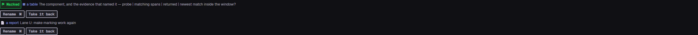
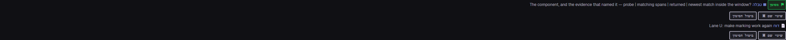

# A turn that is both a table and a lane report now carries both marks

`anchors/15` — `TASK-a-turn-that-is-both-a-table-and-a-lane-report-is-one-thing`, closing
`OPENQ-does-the-table-mark-or-the-lane-report-mark-win-when-one`.
Lane AK, 2026-09-16.

The owner was asked which of two grammars should win a turn that qualifies as both, and on
2026-09-16 he rejected the question as posed: *"table & report - if required make them 2 different
anchor types with 2 distinguished marks"*. Both branches on offer were a precedence. He chose
neither. This is what it took to make a turn hold two.

---

## 1. The key, which was the load-bearing change

An anchor row is keyed by `(sessionId, agentId, byteOffset)` — `anchorIdFor`, and the derivation is
what makes marking idempotent by construction. Two marks at one offset are one row on that key.

**Two widenings were available and they are not equally cheap.**

| | put the kind in EVERY id | give the point its id, suffix the SECOND |
|---|---|---|
| rows whose id changes | 1,067, all of them | 0 |
| `.anchors.jsonl` on the first write after | rewritten whole, every line moved (it is written in id order) | 240 lines appended |
| the READ-ONLY derivation | breaks | unchanged |

The third row is the one that decided it. `src/ui/read-model-conversations.ts` answers *"is this
search hit already marked"* by deriving the id from the hit's POSITION, which is all a hit has — it
does not know what kind a mark at that point would wear. Put the kind in every id and that surface
can no longer name the row, and `anchored` stops being a fact.

**So `anchorIdFor` is untouched and means exactly what it meant: the id of the mark that OWNS this
point.** A second mark at the same point is `anchorIdBeside(sessionId, agentId, byteOffset, kind)`
— the same string with `#<kind>` after it. `#` cannot collide: the segment before it is a decimal
byte offset.

It is the same argument `writeAnchorFile` already makes for omitting a `null` note rather than
writing it — the absent segment is the ordinary case, and spelling it out on every row would
rewrite the whole file to say nothing new.

**Which mark owns the point is no longer a precedence over the MARK.** `anchorsInTurn` (was
`anchorInTurn`, and it returns a list now) yields findings in grammar order; `anchorSlots` gives the
first the bare id and the rest a suffix. Both are written, both drawn, both stepped to, both taken
back on their own. The table stays first because 240 turns already wear a judged-good table mark at
the point's own id — which is what makes this change **purely additive: 240 rows gained, 0
rewritten.**

`anchorSlots` is one function and not two lines in each caller, because the SWEEP has to ask the
same question in reverse — *is the row I own still one of the slots this turn produces?* Two
spellings of that rule is a pass that writes a row and then deletes it on the next run, which is
exactly what removal proof D below produced when they were made to disagree.

### What it reaches

`src/core/conversation-index.ts` (`anchorIdBeside`), `src/core/anchors.ts` (`AnchorSpec.beside`),
`src/core/anchor-pass.ts` (`anchorsInTurn`, `anchorSlots`, `consider`, `sweepAutomaticAnchors`,
the relabel path), and the store file, which gains lines and moves none.

---

## 2. The count decision, and the justification

**A turn with two marks counts ONCE in "N marked point(s) here", and the screen says how many of
the N carry two.**

The stepper's job is *take me to the next place*, and `anchors/15` forbids it landing on the same
turn twice without saying why. A POINT is a position; the sentence stays true of the walk.

But the marks LIST counts rows, and after this change the two numbers can differ — by 240 across
the archive. A count whose meaning silently changed is `confirm/3`'s defect exactly, so the
difference is disclosed rather than left to be found by comparing two screens:

> `conv.nav.marksDoubled` — "{n} of them carry two marks — a turn that is both a table and a
> helper's report is one stop here and two rows in the list of marks."

Drawn only when it is non-zero, like `conv.nav.marksHidden` beside it. Skipped under a kind filter,
and that is not an omission: narrowed to `report`, every stop shows one mark of that kind and the
count is a count of marks again. The two only come apart unnarrowed.

`markStops`' `hidden` was also moved from marks to POSITIONS in the same edit — a two-mark turn is
one thing the search is holding back, and counting it twice would put a number under *"N more are
in this conversation"* that no amount of clearing the search could produce as stops.

---

## 3. Did the screen get better or worse — the number

`anchors/9` measured that 1,155 marks was already enough to make the rare kinds hard to find, and
this adds 240. *"If required"* are the owner's own words. Measured on his live archive today:

```
marks             1,066  ->  1,306    +240   +22.5%
MARKED POINTS     1,066  ->  1,066      +0     0.0%
beside rows whose point had no other mark: 0
```

**The document — the surface `anchors/9` measured, and the one the stepper walks — gains ZERO new
stops.** Every one of the 240 sits on a turn that already carried a table mark. Not one unmarked
turn becomes marked; there is nothing new to scroll past and nothing new to step through.

What does get longer is the marks LIST: 54 pages of 20 become 66.

```
kind      before          after
table     834  78.24%  ->  835  63.86%
report    192  18.01%  ->  432  33.08%
ruling     39   3.66%  ->   39   2.99%
note        1   0.09%  ->    1   0.08%
```

So the honest verdict, both halves:

- **Better.** `table`'s dominance of the list falls from 78% to 64% — the 67%-in-one-colour problem
  `TASK-every-kind-of-mark-is-drawn-in-the-same-grey` was written about gets measurably smaller.
  And the kind he asked for on 2026-09-15 goes from naming **192 of 432 lane reports (44%)** to all
  **432 (100%)** — it stops being a minority label for the thing it is named after.
- **Worse, and only here.** An UNFILTERED scroll of the marks list is 22.5% longer, so the rarest
  kinds are ~18% rarer by share in it: `ruling` 3.66% → 2.99%, and his one hand-made `note`
  0.094% → 0.077%. The kind filter, which is the actual tool for finding a rare kind, returns the
  same 39 rulings either way.

**Nothing to decide unless he disagrees with that trade.** The undo exists and is one line:
`mycontext conversation anchor --drop-automatic`.

---

## 4. Removal proofs

Every proof below broke one line in the shipped source, ran
`node --import ./test/helpers/pin-rendering.ts --test test/core/anchor-report.test.ts`, and the
source was restored from a copy afterwards.

| # | the line broken | what reddened, at its own line |
|---|---|---|
| A | `anchorsInTurn` → `return found.slice(0, 1)` (the rejected precedence, restored) | `:287` the report count is 2; `:375` kinds are `['table','report']`; `:439` the fixture carries two. 3 tests failed, 5 stayed green. |
| B | `anchorSlots` gives EVERY slot a kind-suffixed id | 7 of 8 tests. The blunt one: with no row holding the point's own id, `anchorRows`' id order and the sweep both move. |
| C | `anchorsInTurn` → `return found.reverse()` (report takes slot 0 — a CONSISTENT break) | **exactly one test, exactly one assertion**: `:399` *"the table mark keeps the point own id"*. "Both kinds present" and both labels stayed green. |
| D | `anchorSlots` suffixes the second id with its ORDINAL instead of its kind | 4 tests, including `:508` *a second run marks nothing*. This is the drift `anchorSlots`' header warns about, demonstrated: the allocator and `markAnchor` disagreed, so the pass wrote a row and the sweep deleted it on the same run. |
| E | `anchorRows` sorts the tie `id DESC` | **exactly one assertion**: `:410` *"the order is the one the document draws"*. |
| F | `dropAnchor` deletes by `byte_offset` instead of by `id` | **exactly one assertion**: `:444` *"the table mark stands"* — dropping the report took the table with it. |

### The proof that could not be made, stated rather than papered over

`:405`, *"the report id is `anchorIdBeside(..., 'report')"*, **rests on the same ternary as `:399`
and cannot be reddened independently of it.** The test computes its expected value with the same
exported derivation the code writes with, so changing that derivation changes both sides and
nothing reddens. That is deliberate — a second spelling of an id rule is the one-fact-recorded-twice
defect this project has already paid for — and what `:405` genuinely proves is that a second row
EXISTS at a distinct id and that it is the REPORT, not the table, occupying that slot. Proof C is
what carries the second half.

The existing assertions were also restructured to look rows up **by kind rather than by position**,
so that the ordering claim lives with the id assertions instead of reddening the label assertions
too. A proof that reddens six assertions says nothing about which line it broke.

### Idempotence, on the live archive rather than a fixture

```
first run   probed 1879  found 1062  marked 240  dropped 0  relabelled 0   byKind report:240
second run  probed 1879  found 1062  marked   0  dropped 0  relabelled 0
```

And the owner's one `origin: owner` row is still there, still `note`, untouched by both runs.

---

## 5. The drawing — "2 distinguished marks"

Both kinds already had a glyph, a hue and a word, and **no sixth hue was minted**
(`DEC-the-meaning-hue-budget-is-five`). `table` and `report` are both in `kindfound` and they stay
there: the amendment of 2026-08-27 is binding and narrow — *"a hue may narrow a group, never name
one"* — so the hue says POSTURE and the GLYPH and the WORD say which kind.

Each mark is its own `.tvanchorone` block with its own kind, label, note, Rename and Take it back.
The `⚑ Marked` flag is drawn **once**, on the first: it is a claim about the TURN, and repeating it
is what would make two marks read as a bug.





---

## 6. Driven in Playwright, in both languages

My own server, `--port 59310` then `59311` (the handoff nonce is one-shot), killed at the end.
Port 58888 was never touched and is still the owner's, still listening.
Subject: `agent-a053b226283eebad4` at byte 1,903,768 — a real lane of his archive whose last answer
is a table, with a second marked turn before it.

**English**

- the bar: `⚑ Marked` · `▦ a table` "The component, and the evidence that named it — probe | matching
  spans | returned | newest match inside the window?" / `📄 a report` "Lane U: make marking work
  again", each with its own `Rename M` and `Take it back`.
- the count: *"2 marked point(s) here. 1 of them carry two marks — a turn that is both a table and
  a helper's report is one stop here and two rows in the list of marks."*
- the FILTER offers `a report` and `a table`; the turn is counted under **both** (1 of each).
- the STEPPER: 2 stops over 3 marks. Pressing Previous mark announced *"Marked point 1 of 2"* and
  landed on the other turn. **It never lands on the same turn twice.**
- TAKE-BACK: pressing Take it back on the report left the table standing, the filter dropped
  `report` from its options, and the count dropped its doubled clause.

**Hebrew** (`myctx-lang=he`, `dir=rtl`)

- `מסומן` · `▦ טבלה` / `📄 דוח`, each with `שינוי שם` and `ביטול הסימון`.
- the count: *"2 נקודות מסומנות כאן. מתוכן 1 נושאות שני סימונים — תור שהוא גם טבלה וגם דוח של סוכן
  עוזר הוא תחנה אחת כאן ושתי שורות ברשימת הסימונים."*
- the filter: `דוח`, `טבלה`, `נקודות מסומנות מכל סוג`.
- TAKE-BACK said *"הסימון בוטל…"* followed by **`📄 דוח`** and the label — and `▦ טבלה` stood.

`sayTakenBack` gained that kind line in this change. The label alone answered *which went* while a
point could only carry one mark; it cannot now, and a reader who takes back the report of a turn
that is also a table would otherwise read a sentence and a name and still not know which of the two
rows in front of them had gone.

### Two things found in the browser, both recorded

**(a) A pre-existing defect that blocks the take-back half in the product.**
Filed as `TASK-every-anchor-write-inside-a-lane-document-is-refused-because`. `/lane.html` composes
its own `ctx` with `t`, `tFlat`, `api`, `navigate`, `lang` — **and no `post`**. Every anchor write
drawn on a lane document throws `ctx.post is not a function`. It is not caused by this change and
it is not fixed by it: 704 of 1,306 marks carry a lane id, and a lane document is only ever read in
that window. A turn that is both a table and a lane report can ONLY be a lane's turn
(`laneReportAt` requires `agentId !== null`), so **the take-back above was driven with a `post`
supplied in the page**, matching `lane.js`'s own `readJson` fetch. That is evidence about my code
and not about the shipped product, and the item carries the two ways out — both his to pick,
because `lane.js`'s own header argues one of them.

**(b) The take-back sentence is wiped by the next repaint.** Measured: it is drawn correctly and
survives ~300–500 ms, then the virtualised scroll rebuilds the row through `buildRow` →
`markControl(nodeIndex)` with `after = null`, and the sentence goes with the old element. Nothing
in that path was changed here — `carry`, `redrawMe` and `said` behave identically before and after
— so it is pre-existing and it applies to a single-mark turn just as much. Recorded, not fixed.

---

## 7. Files touched

A file list names what was TOUCHED. It is not a closure over what those files import.

| file | the hunk |
|---|---|
| `src/core/conversation-index.ts` | `anchorIdBeside` added beside `anchorIdFor`, with the argument for the shape |
| `src/core/anchors.ts` | `AnchorSpec.beside`; `markAnchor` picks the slot; `anchorIdBeside` re-exported |
| `src/core/anchor-pass.ts` | `anchorInTurn` → `anchorsInTurn` (list); `AnchorSlot`/`anchorSlots`; `consider` loops the slots and guards ownership per slot; the sweep matches a row to ITS slot; `AutoAnchorReport.marked` re-documented as marks-not-turns |
| `src/cli/commands/conversation.ts` | the re-export name only |
| `src/ui/public/screens/conversations.js` | **four hunks, all inside `mountDocument` except the first** — (1) `sayTakenBack` gains the `convtakenkind` line; (2) `anchorsHere` becomes byte → LIST plus `everyAnchorHere`, and `loadAnchors` appends; (3) `markControl`'s marked branch becomes `drawMark(standing, first)` and the bar loops it; (4) `markStops` / `kindsPresent` / `navRefresh` / the landing note read the list. **Nothing outside `mountDocument` and `sayTakenBack` was touched** — `semantic/8` is in the same file. |
| `src/ui/public/styles.css` | `.tvanchorone` (+`+` sibling gap) added next to `.tvanchorbar`; `.convtakenkind` added next to `.convtakenname`; `.convtakenkind` opted into the three existing `kind*` hue selectors |
| `src/ui/public/strings/en.js`, `he.js` | one key each, `conv.nav.marksDoubled`, after `marksHidden` |
| `scripts/measure-anchor-candidates.ts` | calls `anchorsInTurn` and counts a turn into EVERY kind it carries |
| `test/core/anchor-report.test.ts` | `@basis` gains this item; `rows()` returns `id`; the precedence test replaced by the two-marks test; a take-back test added; the dispatch test's report count 1 → 2 |
| `test/cli/anchors.test.ts`, `test/scripts/anchor-candidates.test.ts` | `anchorInTurn` → `anchorsInTurn` at the call sites |
| `reports/2026-09-16-two-marks-one-turn/` | the two screenshots |

**Not mine, and in the tree while I worked** — `semantic/8`'s search-highlighter lane:
`src/core/conversation-search.ts` (I was told not to edit it and did not),
`src/ui/read-model-conversation-document.ts`, `src/ui/public/lib/fold.js` (new), and
`src/core/turn-refresh-soon.ts` (already committed, in `b7520565`).

---

## 8. Gates

- `npx tsc --noEmit` — clean.
- `npm run check:text-files` — 1,422 files, no NUL byte.
- `npm run check:basis`, `check:cited-items` — pass.
- `npm test` — **8,725 of 8,729**. One EBUSY on `test/cli/rules.test.ts` from another lane holding
  `src/rules/entries/*.md` (it passes alone, re-run confirmed). Three in `test/ui/` fail on other
  lanes' in-flight work and name their files: `src/core/turn-refresh-soon.ts` missing from
  `WRITERS`, `src/core/conversation-search.ts:1115` a dynamic `import()`, and
  `GET /api/conversations/:id/find` missing a probe in `READ_ROUTES`. **None names a file this lane
  touched.**
